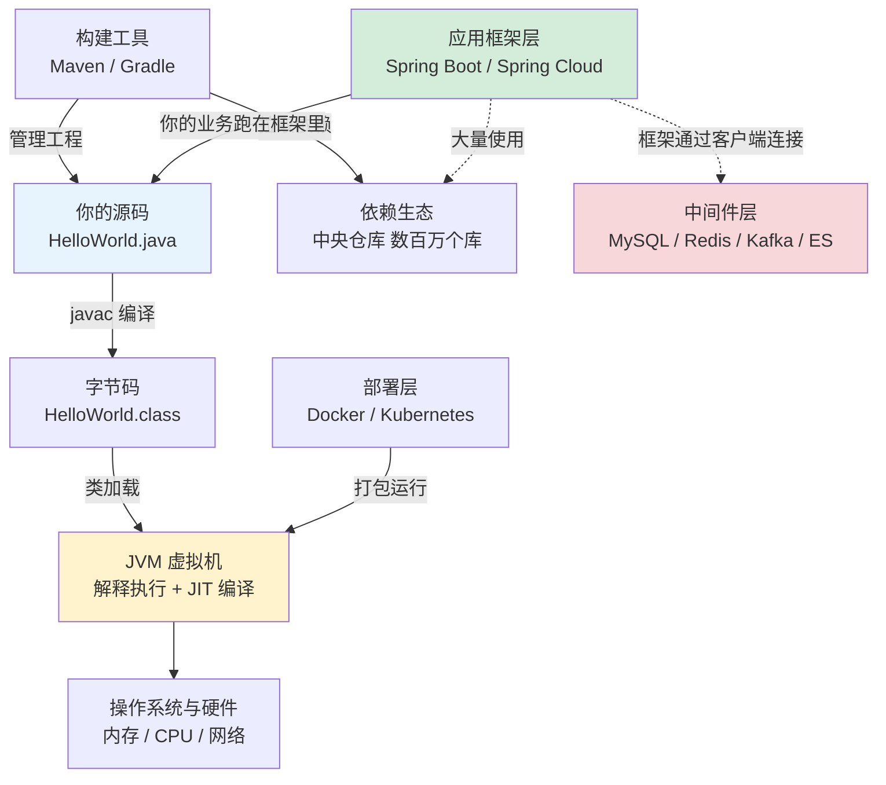

[📖 返回目录](README.md) · [➡️ 下一章](01-java-core.md)
# 00 · 前置知识快速总结（初学者与转系开发者入口）

> 本系列正文面向 10+ 年经验的资深工程师，**本章是全系列唯一的例外**：它服务于两类读者——① Java 初学者；② 来自 Go / Python / C# 等其他技术栈、想快速建立 Java 心智模型的开发者。本章的目标不是把你教成资深，而是回答三个问题：**这套书默认你已经会什么？这些前置知识的最小集长什么样？你和资深之间的差距地图是什么？**
>
> 🧭 **资深读者请直接跳过本章**，从 [01 章](01-java-core.md) 或 README「学习路线图」开始，不影响后续阅读。

**📌 本章速览：核心要点**

1. Java 程序的生命线：源码编译成**字节码** → JVM 加载执行 + JIT 即时编译加速——「一次编写，到处运行」的收益与代价都源于这条流水线；
2. **十个最小前置概念**（JVM 与字节码 / GC / 注解与反射 / 集合与泛型 / 线程与锁 / Maven / 索引 / HTTP 与 RPC / 缓存 / 消息队列），每个都能用一个类比建立直觉，详见 §2；
3. 工具链最小集 = JDK LTS（21 或 25）+ IntelliJ IDEA + Maven，半小时可跑通第一个带单元测试的项目，详见 §3；
4. **差距自查表 30 问**帮你定位自己在 L0~L4 哪一层，答不上哪里就补哪里，详见 §4；
5. **五个最小动手实验**让你亲眼看见 GC 日志、线程状态、线上诊断、压测曲线与锁互斥——「读过」和「亲眼见过」在面试中是两个物种，详见 §5；
6. 非 Java 系读者加看 §6 迁移对照表：goroutine↔虚拟线程、GIL↔JMM 等 12 组对照，能省一半理解成本。

---

### 📑 本章目录

- [0. 你是谁：三种读者画像与推荐路线](#0-你是谁三种读者画像与推荐路线)
- [1. Java 世界地图](#1-java-世界地图)
- [2. 十个必须先懂的概念速览](#2-十个必须先懂的概念速览)
- [3. 工具链最小集：从零跑通第一个项目](#3-工具链最小集从零跑通第一个项目)
- [4. 差距自查表（L0~L4，30 问）](#4-差距自查表l0l430-问)
- [5. 五个最小动手实验](#5-五个最小动手实验)
- [6. 非 Java 系迁移对照表](#6-非-java-系迁移对照表)
- [考点速查表](#考点速查表)

---

## 0. 你是谁：三种读者画像与推荐路线

先诚实地说：**这是一套复习手册，不是教材**。它假设你曾经会过这些东西，只是需要唤醒和加深。所以初学者最重要的策略不是「从头读到尾」，而是选对自己的路线。

| 画像 | 特征 | 推荐路线 |
|------|------|----------|
| **A · 科班 Java 初学者** | 上过课 / 培训班，会语法和基本 API，没做过真实项目 | 本章 → 01/02/03 打语言底子 → **先跳 14 章 Spring Boot 做出一个能跑的 Web 项目** → 05 MySQL → 回头 04/06/13 补源码与原理 |
| **B · 非 Java 系开发者** | 熟悉 Go/Python/C# 至少一门，第一次碰 Java 生态 | 本章 §6 对照表先行 → 01/02/03（平台差异最大的三章）→ 中间件章节按需查阅（概念相通，重点看「Java 生态怎么做」） |
| **C · 零编程基础** | 还没写过任何语言的程序 | **本教程现阶段不适合你。** 先花 1~2 个月学任意一门语言的入门课程（Python 或 Java 基础皆可），再回到画像 A 路线。诚实的建议胜过虚假的承诺 |

> ⚠️ 画像 A 特别提醒：本教程章节顺序是为「复习者」优化的（原理深度优先），不是为初学者优化的。第一遍请按上面路线「跳跃式」阅读——先用 14 章做出东西获得正反馈，再回头啃原理，比线性硬啃存活率高得多。

---

## 1. Java 世界地图

初学者面对 Java 生态最大的迷失是：「我要学的到底是哪个 Java？」——是语法？是 JVM？是 Spring？还是那些数不清的中间件？下面这张图把整个世界分成六层，每一层解决一类问题，全库 32 章就挂在这些层上。



| 层次 | 代表技术 | 解决什么问题 | 对应章节 |
|------|----------|--------------|----------|
| 语言核心 | 语法 / 泛型 / 反射 / IO / 新特性 | 把想法写成机器能执行的指令 | 01 |
| 运行时 | JVM / GC / 类加载 / JIT | 让同一份字节码在不同 OS 高效运行 | 02 |
| 并发 | 线程 / 锁 / JUC / 虚拟线程 | 利用多核、处理高并发请求 | 03 |
| 数据结构与集合 | HashMap / ConcurrentHashMap | 高效组织内存中的数据 | 04 |
| 存储 | MySQL / Redis / ES | 数据持久化、高速读取、全文检索 | 05 / 06 / 07 |
| 消息与协调 | Kafka / RocketMQ / ZK | 服务间异步通信、削峰、协调 | 08 / 09 / 10 |
| 网络与通信 | Netty / Dubbo / Nginx | 高性能网络 IO、服务调用、流量入口 | 11 / 12 |
| 应用框架 | Spring 全家桶 / MyBatis | 不重复造轮子，专注业务逻辑 | 13 / 14 / 15 |
| 架构 | 分布式 / 高并发 / 系统设计 | 多机协同下的一致性、可用性、扩展性 | 16~20 / 27~32 |
| 工程化 | 测试 / CI/CD / 监控 / K8s | 团队协作与生产环境的稳定性 | 21 / 22 / 29 |

> 🧭 初学者只需记住：**语法和 JVM 是地基（01/02），Spring 是吃饭的家伙（13/14），数据库是绕不开的伙伴（05），其余都是遇到问题再深入**。

---

## 2. 十个必须先懂的概念速览

每个概念按「是什么 → 类比 → 为什么重要 → 详见」展开，目标是建立直觉而不是完整定义。

### 2.1 编译与解释：JVM 和字节码是什么

- **是什么**：`javac` 把 `.java` 源码编译成 `.class` **字节码**（一种中间表示），JVM 负责加载字节码并执行——开头解释执行，热点代码由 **JIT（即时编译器）** 在运行时编译成机器码加速。「一次编写，到处运行」靠的是各平台都有自己的 JVM。
- **类比**：字节码像「世界语」——你写一份演讲稿（源码），翻译成世界语（字节码），各国（Windows/Linux/Mac）配一位同声传译（JVM），听众都能听懂。Go 直接把稿子翻译成当地方言印出来（原生二进制），不需要传译但每国都要印一份；CPython 其实也编字节码（`.pyc`）再用虚拟机逐条解释，只是没有 JIT 这位「越翻越快」的同传。
- **为什么重要**：全书 02 章（JVM）、性能优化、跨平台部署的理解全部锚定在这条流水线上。
- **详见**：01 章 §7、02 章全篇。

### 2.2 对象与垃圾回收（GC）

- **是什么**：Java 里 `new` 出来的对象住在**堆**（heap）里；当没有任何引用能到达某个对象时，GC 会择机回收它占用的内存。你几乎从不手动释放内存。
- **类比**：酒店房间（内存）由客房部（GC）定期打扫，判断标准是「还有没有房卡指向这间房」（引用）。C++ 要求退房时自己打电话通知前台（`delete`，忘了就漏水）；Rust 干脆规定房卡离店即销毁（所有权）；Python 也用类似的可达性思路，所以 Python 转来的同学不会陌生。
- **为什么重要**：内存泄漏、GC 停顿是 Java 面试和生产事故的双料高频；不理解「谁在替你打扫房间」，就永远调不好它。
- **详见**：02 章 §1/§3。

### 2.3 注解与反射

- **是什么**：注解（如 `@Override`、Spring 的 `@Component`）是贴在类/方法上的**元数据标签**；反射是程序在**运行时**检查和操作类结构的机制（拿到类的方法列表、动态调用方法）。
- **类比**：注解是行李上的标签牌，本身不做任何事；反射是机场的 X 光机，不看标签也能看清箱子内部。框架的工作方式通常是：启动时用 X 光扫一遍所有行李（扫描类路径），发现贴了「易碎品」（`@Component`）标签的就特殊照顾（注册成 Bean）。
- **为什么重要**：Spring/MyBatis/JUnit 等一切主流框架的魔法本质都是「注解 + 反射」。不懂这对搭档，框架源码一章都读不进去。
- **详见**：01 章 §2、13 章。

### 2.4 集合与泛型

- **是什么**：集合是装对象的容器（`List` 有序可重复、`Map` 键值对、`Set` 去重）；泛型（`List<String>`）是容器上贴的类型标签，让编译器帮你做类型检查。
- **类比**：集合是收纳箱体系，泛型是箱子上手写的「袜子」「书」标签——标签只在整理时（编译期）有用，进仓库后（运行时）仓库管理员并不看标签（类型擦除，01 章会讲到这个反直觉的设计及其后果）。
- **为什么重要**：`ArrayList`/`HashMap` 是 Java 代码出现频率最高的类，没有之一；04 章整章讲它们的源码。
- **详见**：01 章 §1、04 章。

### 2.5 线程与锁

- **是什么**：线程是一条独立的执行流，多个线程共享同一个进程的堆内存；当两个线程同时读写同一份数据，就会出现**竞态条件**（结果取决于执行的时序），锁用来把并发访问串行化。
- **类比**：合租公寓的共用厨房是堆内存，每位室友是一个线程。两人同时开火（同时改同一个变量）就会打架；在灶台上立一块「使用中」的牌子就是加锁。经典 bug：`counter++` 看似一步，实际是「读-改-写」三步，两个线程交错执行就会丢更新。
- **为什么重要**：并发是 Java 面试权重最高的领域之一（03 章整整 607 行），也是线上最难排查的一类 bug。
- **详见**：03 章 §1/§2、00 章 §5 实验 2。

### 2.6 Maven 与依赖管理

- **是什么**：Maven 是 Java 世界的标准构建工具：`pom.xml` 声明项目需要的依赖（坐标：组 ID + 构件 ID + 版本），Maven 自动从**中央仓库**下载并组装classpath，同时提供统一的编译/测试/打包生命周期。
- **类比**：`pom.xml` 就是 Node 的 `package.json`、Python 的 `requirements.txt`、Rust 的 `Cargo.toml`；中央仓库 ≈ npm registry / PyPI。Java 特有的是「传递依赖」：你引 A，A 引 B，B 自动进来——方便但也可能版本冲突，`mvn dependency:tree` 能看清整棵依赖树。
- **为什么重要**：全库代码示例默认你能把它放进一个 Maven 工程；没有这层认知，示例对你只是纸面文字。
- **详见**：00 章 §3 动手跑一遍。

### 2.7 数据库与索引直觉

- **是什么**：关系库以表组织数据；**索引**是对某些列预排序的查找结构（MySQL/InnoDB 用 B+ 树），把全表扫描 O(n) 变成树查找 O(log n)。事务保证一组操作的原子性与一致性（ACID）。
- **类比**：索引是书的目录——按页码（主键）排好，查「并发」主题不用一页页翻。代价：目录本身占篇幅，而且每次增删正文都要同步维护目录（写入变慢）。
- **为什么重要**：绝大多数后端系统的性能瓶颈都在数据库；「会不会建索引、能不能看懂执行计划」直接决定你是不是合格的 Java 后端。
- **详见**：05 章全篇。

### 2.8 HTTP 与 RPC

- **是什么**：HTTP 是浏览器与服务器的通用请求-响应协议；RPC（远程过程调用）的目标是「调用远程服务的函数像调用本地函数一样」，通常走更紧凑的二进制协议（Dubbo/gRPC）。
- **类比**：HTTP 像寄明信片——格式人人认识、哪儿都能寄，但内容一目了然且信封厚（文本冗余）；RPC 像两家公司之间的专线电话——先约好暗号（接口定义/序列化格式），通话又快又省，但外人听不懂。
- **为什么重要**：微服务架构的一切（注册中心、负载均衡、网关）都是围绕「服务之间怎么打电话」展开的。
- **详见**：11/12 章、15 章。

### 2.9 缓存为什么快

- **是什么**：缓存把热点数据放在更快的存储介质（Redis 内存 / 本地内存）里，避免每次都打慢速存储（磁盘数据库）。核心套路叫 **Cache Aside**：读时先查缓存、未命中回源数据库并回填；写时先更新数据库、再删缓存。
- **类比**：桌上放常用书（缓存），书架（数据库）放全部藏书——去桌上拿 10 秒，跑图书馆检索借阅要半天。数量级感受：内存随机访问约 100ns，SSD 约 100μs，机械盘寻道约 10ms——**每一级差着百倍**，这就是缓存存在的物理学依据。
- **为什么重要**：缓存是高并发的第一道防线，也是一致性事故的第一现场（缓存与数据库不一致怎么办，06 章 §九 整节都在讲）。
- **详见**：06 章、17 章 §2。

### 2.10 消息队列为什么存在

- **是什么**：MQ 是服务之间的「邮局」：发送方把消息投给 Kafka/RocketMQ 就返回，接收方按自己的节奏消费。三大动机：**异步**（主流程不等耗时副流程）、**解耦**（生产者不关心谁是消费者）、**削峰**（洪峰先排队，下游匀速消化）。
- **类比**：快递柜。卖家（生产者）把包裹塞进柜子就走，不必等你在家；你（消费者）下班顺手取件；双十一爆仓时快递柜就是削峰的蓄水池。没有快递柜的世界，每个快递都必须买卖双方当面交接——这就是「同步调用」的脆弱。
- **为什么重要**：现代后端系统几乎不可能没有 MQ；「消息丢了怎么办、重了怎么办、乱了怎么办」是中间件面试的铁三角。
- **详见**：08/09 章、00 章 §5 实验 4。

---

## 3. 工具链最小集：从零跑通第一个项目

目标：**30 分钟内**拥有一个能编译、能测试、能打包的标准 Java 工程。以下命令以 Linux/macOS 为例（Windows 用 PowerShell 等价命令或 WSL）。

### 3.1 安装三件套

```shell
# ① JDK（选 LTS 版本：21 或 25；推荐 Temurin 发行版）
# macOS: brew install --cask temurin@21   |   Ubuntu: sudo apt install temurin-21-jdk
java -version     # 验证：应输出 openjdk version "21.x" 或 "25.x"

# ② IntelliJ IDEA Community（免费版足够学习用）：官网下载安装即可

# ③ Maven（IDEA 已内置，命令行单独装便于 CI）
mvn -version      # 验证
```

### 3.2 创建并运行第一个工程

```shell
# 用 Maven 脚手架生成标准目录结构
mvn archetype:generate -DgroupId=com.demo -DartifactId=hello \
  -DarchetypeArtifactId=maven-archetype-quickstart -DinteractiveMode=false
cd hello

# 标准目录布局：源码在 src/main/java，测试在 src/test/java —— 这是全 Java 世界的约定
find src -type f

# 编译 + 跑自带的单元测试（JUnit）
mvn test          # 第一次会下载大量依赖，属正常现象

# 写一个 main 方法后打包运行
mvn package
java -cp target/classes com.demo.App
```

### 3.3 最小单元测试的样子

```java
// src/test/java/com/demo/AppTest.java
import org.junit.jupiter.api.Test;
import static org.junit.jupiter.api.Assertions.assertEquals;

public class AppTest {
    @Test
    void addition() {
        assertEquals(2, 1 + 1);   // 断言失败时测试变红，这就是 TDD 的起点
    }
}
```

### 3.4 新手常见报错速查

| 报错/现象 | 原因 | 解法 |
|-----------|------|------|
| `java: command not found` | JDK 未装或 PATH 未生效 | 重装 JDK 或 `export PATH=$JAVA_HOME/bin:$PATH` |
| `UnsupportedClassVersionError` | 编译用的 JDK 版本高于运行时 | 统一 JAVA_HOME 指向同一版本 |
| Maven 下载依赖极慢/超时 | 默认中央仓库在国外 | 国内配置阿里云镜像（settings.xml 的 `<mirror>`） |
| 中文乱码 | 文件编码非 UTF-8 | IDEA 设置 File Encodings 全部 UTF-8；JVM 参数 `-Dfile.encoding=UTF-8` |
| `Port 8080 already in use` | 端口被占 | `lsof -i:8080` 找进程 kill，或换端口 |

---

## 4. 差距自查表（L0~L4，30 问）

用法：逐条自问，**答不上来的，去「补齐路径」所指的地方补**，然后回来打勾。全部通关 = 正式进入正文学习无障碍。

**L0 工具与环境（通往 01 章的门票）**

| # | 自查问题 | 答不上 → 补齐路径 |
|---|----------|-------------------|
| 1 | `javac` 和 `java` 分别做什么？ | 本章 §2.1 |
| 2 | 怎么验证本机 JDK 版本？装的哪个发行版？ | 本章 §3.1 |
| 3 | Maven 的 `pom.xml` 里 groupId/artifactId/version 各是什么含义？ | 本章 §2.6 |
| 4 | `src/main/java` 和 `src/test/java` 的区别？ | 本章 §3.2 |
| 5 | 什么是 IDE 的断点调试？会在 IDEA 里单步执行吗？ | IDEA 官方入门文档（Debugger Basics） |

**L1 语言地基（01 章的前置）**

| # | 自查问题 | 答不上 → 补齐路径 |
|---|----------|-------------------|
| 6 | `==` 和 `equals()` 的区别？为什么字符串比较推荐 equals？ | 任意 Java 入门教程「对象相等性」，或 01 章 §1 |
| 7 | `List`、`Set`、`Map` 各自的特点与典型实现？ | 本章 §2.4 → 04 章 |
| 8 | 泛型 `List<String>` 解决什么问题？类型擦除听说过吗？ | 01 章 §1 |
| 9 | 什么是接口（interface）？和抽象类的区别？ | 任意 Java 入门教程，或 01 章 §3（代理的前提） |
| 10 | 异常的 try-catch-finally 执行顺序？受检/非受检异常的区别？ | 01 章 §4 |
| 11 | Lambda 表达式和函数式接口是什么关系？ | 01 章 §7.1 |
| 12 | String 为什么设计成不可变？ | 01 章 §6（序列化安全相关）|
| 13 | `static` 与实例成员的区别？ | 任意 Java 入门教程 |

**L2 运行时与并发（02/03 章的前置）**

| # | 自查问题 | 答不上 → 补齐路径 |
|---|----------|-------------------|
| 14 | 堆和栈分别存什么？ | 02 章 §1 |
| 15 | GC 大概什么时候触发？标记-清除是什么意思？ | 02 章 §3 |
| 16 | 一个线程的完整生命周期状态有哪些？ | 03 章 §1.1 |
| 17 | `synchronized` 关键字加在方法和代码块上有什么区别？ | 03 章 §2 |
| 18 | 为什么 `counter++` 在多线程下会丢更新？ | 本章 §2.5 → 03 章 §1 |
| 19 | `volatile` 解决什么问题？（能说出「可见性」即可入门） | 03 章 §1.3 |
| 20 | 什么是死锁？产生条件有哪些？ | 03 章 §6 |

**L3 数据与生态（05/13/14 章的前置）**

| # | 自查问题 | 答不上 → 补齐路径 |
|---|----------|-------------------|
| 21 | 会写含 JOIN/GROUP BY 的 SQL 吗？ | 任意 SQL 入门教程 → 05 章 |
| 22 | 索引为什么能加快查询？什么情况下会失效？ | 05 章 §三 |
| 23 | 事务的 ACID 分别指什么？ | 05 章 §四 |
| 24 | HTTP GET 和 POST 的语义区别？状态码 404/500 含义？ | 本章 §2.8 |
| 25 | 什么是 IoC/DI？（能说出「对象不由自己 new，交给容器」即可） | 本章 §2.3 → 13 章 §1 |
| 26 | Spring Boot 里 `@RestController` + `@GetMapping` 能干什么？动手写过吗？ | 14 章 §1、本章 §5 实验 4 |
| 27 | 用过 Redis 的 SET/GET 吗？知道它是内存数据库吗？ | 本章 §2.9 → 06 章 |
| 28 | 为什么下单后发短信要用消息队列而不是同步调用？ | 本章 §2.10 → 08 章 |

**L4 进入正文的临门一脚**

| # | 自查问题 | 答不上 → 补齐路径 |
|---|----------|-------------------|
| 29 | 能独立完成「建表 → Spring Boot CRUD 接口 → 单元测试 → 打包运行」全流程吗？ | 本章 §3 + §5 实验 4 → 14 章 |
| 30 | 读过至少一本 Java 入门书的完整目录吗？（知道全景才能知道自己缺什么） | 26 章 §七「三本入门排序」 |

> ✅ **通关标准**：L0/L1 全部、L2 至少 5 题、L3 至少 6 题、L4 两题。达不到没关系——每一条都给了明确去处，这正是本章存在的意义。

---

## 5. 五个最小动手实验

原则：**每个实验 ≤ 30 分钟，亲眼看一次现象**。面试官能一眼分辨「背过」和「见过」。

### 实验 1：亲眼看见 GC

```shell
# GCLog.java：疯狂制造垃圾
cat > GCLog.java <<'EOF'
import java.util.ArrayList;
import java.util.List;
public class GCLog {
    public static void main(String[] args) {
        List<byte[]> hold = new ArrayList<>();
        for (int i = 0; i < 100_000; i++) {
            byte[] garbage = new byte[1024 * 512]; // 每次 512KB，大部分立刻成为垃圾
            if (i % 100 == 0) hold.add(garbage);   // 少量长期存活
        }
        System.out.println("done");
    }
}
EOF
javac GCLog.java
# JDK 9+ 用统一日志；JDK 8 请换 -XX:+PrintGCDetails
java -Xms256m -Xmx256m -Xlog:gc* GCLog
```

**预期现象**：控制台滚动输出 `GC(0) Pause Young ...` 之类的日志——你亲眼看到了「客房部在打扫」。把 `-Xmx` 改成 `-Xmx16m` 再跑，GC 频率飙升甚至 `OutOfMemoryError`。**对应**：02 章 §3。

### 实验 2：jstack 看线程状态

```shell
# Dead.java：一个线程抢锁后在临界区睡觉
cat > Dead.java <<'EOF'
public class Dead {
    static final Object LOCK = new Object();
    public static void main(String[] args) throws Exception {
        new Thread(() -> { synchronized (LOCK) {
            try { Thread.sleep(60_000); } catch (Exception e) {}
        }}).start();
        Thread.sleep(1000);
        synchronized (LOCK) { System.out.println("got it"); } // 主线程将阻塞
        Thread.sleep(60_000);
    }
}
EOF
javac Dead.java && java Dead &
sleep 3
jps                    # 找到 Dead 的进程号 <pid>
jstack <pid> | grep -B 2 -A 4 "main\"" # 观察名为 main 的线程
```

**预期现象**：main 线程状态为 `BLOCKED (on object monitor)`，并提示 `waiting for monitor entry`——锁竞争被你抓了现行。**对应**：03 章 §1/§2。

### 实验 3：Arthas 在线诊断（生产级工具初体验）

```shell
# 对实验 2 还活着的 Dead 进程附加 Arthas
curl -O https://arthas.aliyun.com/arthas-boot.jar
java -jar arthas-boot.jar    # 选择 Dead 进程回车
# 进入 Arthas 命令行后依次尝试：
dashboard                     # 实时面板：线程/内存/GC 一屏尽览
thread -b                     # 直接找出阻塞他人的罪魁线程
watch Dead main '{params,@java.lang.Thread@currentThread().getState()}' -x 1
quit
```

**预期现象**：不重启、不加一行代码，就能看清 JVM 内部正在发生什么——这就是线上排查的日常武器。**对应**：02 章 §5、22 章 §7。

### 实验 4：压测第一个 HTTP 接口

```shell
# 用 Spring Boot 官方脚手架生成工程（需联网）
curl https://start.spring.io/starter.zip \
  -d dependencies=web -d groupId=com.demo -d artifactId=demo -o demo.zip && unzip demo.zip && cd demo
# 在 src/main/java/com/demo/demo/DemoApplication.java 同包下新建：
cat > src/main/java/com/demo/demo/Hi.java <<'EOF'
package com.demo.demo;
import org.springframework.web.bind.annotation.*;
@RestController
public class Hi {
    @GetMapping("/hi")
    public String hi() { return "hello, load test"; }
}
EOF
./mvnw spring-boot:run &      # 启动（首次较慢）
sleep 20 && curl localhost:8080/hi
ab -n 1000 -c 50 localhost:8080/hi    # 1000 个请求、50 并发
```

**预期现象**：`Requests per second` 一栏给出吞吐量；把 `-c` 从 50 提到 500，观察吞吐不再上涨而延迟飙升——「并发度 ≠ 吞吐」的第一课。**对应**：14 章、17 章 §7。

### 实验 5：Redis 分布式锁互斥演示

```shell
redis-cli SET lock:order1 holderA NX PX 3000   # → OK，A 拿到锁（NX=不存在才设置）
redis-cli SET lock:order1 holderB NX PX 3000   # → (nil)，B 被拒——互斥！
redis-cli GET lock:order1                       # → "holderA"
sleep 3 && redis-cli SET lock:order1 holderB NX PX 3000   # 3 秒后过期，B 成功
```

**预期现象**：第二个客户端在锁有效期内必然失败，过期后立刻成功——分布式锁「互斥 + 防死锁（过期时间）」两大特性肉眼可见。思考：如果 A 的业务没做完锁就过期了，会发生什么？带着这个问题进入 06 章 §七。**对应**：06 章 §七、16 章 §5。

---

## 6. 非 Java 系迁移对照表

来自 Go/Python/C# 的同学，下面 12 组对照能把你已有的心智模型直接映射过来，省一半力气。

| # | 概念 | 你熟悉的做法 | Java 的做法 | 关键差异 / 易踩的坑 | 详见 |
|---|------|--------------|-------------|---------------------|------|
| 1 | 高并发 IO | goroutine / asyncio / Task | **虚拟线程**（JDK 21+，百万级轻量） | 虚拟线程由 JVM 调度，阻塞自动让出载体线程；老代码里的 `ExecutorService` 线程池是重量级的平台线程 | 03 §9、32 §1 |
| 2 | 并行限制 | Python GIL（同进程单线程执行字节码） | **无 GIL**，线程真并行 | 没有 GIL 兜底 → 共享状态必须自己做同步（volatile/synchronized/atomic）；这是 Python 转 Java 最容易翻车处 | 03 §1 |
| 3 | 集合查询 | LINQ / 列表推导式 | **Stream API**（filter/map/reduce，惰性求值） | 流只能消费一次；无 LINQ 的查询语法糖，全是链式调用 | 01 §7 |
| 4 | 资源释放 | defer / with / using | **try-with-resources**（任何 `AutoCloseable`） | 忘 close 在 Java 里同样泄漏资源（连接/文件句柄），语法糖只是降低遗忘概率 | 01 §4 |
| 5 | 包管理 | pip/npm/NuGet/Cargo | **Maven/Gradle + 中央仓库** | 传递依赖可能引发版本冲突，`mvn dependency:tree` 是排障第一步；无官方 venv 对应物，隔离靠独立 JDK + 构建工具 | 00 §2.6 |
| 6 | 异步编排 | async/await / Promise | **CompletableFuture**（组合式回调） | 无语言级 await 关键字（结构化并发仍在预览），链式 `thenCompose/thenCombine` 心智负担更高；虚拟线程成熟后很多场景可直接写同步风格 | 03 §7 |
| 7 | 接口实现 | Go 隐式满足 / Python 鸭子类型 | **显式 `implements`** | 编译期强制声明；好处是 IDE 可导航、坏处是灵活性低；泛型的类型擦除还和 C#/Go 模板行为不同 | 01 §1/§3 |
| 8 | 错误处理 | Go 的 err 返回值 / Python 异常 | **异常**（受检 + 非受检） | 受检异常是 Java 独有强制项；「吞异常」是评审红线；Go 同学注意没有 `if err != nil`，靠 try-catch 边界 | 01 §4 |
| 9 | 空值 | nil/None 指针检查 | **Optional<T>**（返回值层面表达可空） | `null` 仍无处不在（历史包袱），Optional 主要用于返回值与流；NPE 依然是头号生产异常 | 22 §2 |
| 10 | ORM | SQLAlchemy / GORM / EF | **MyBatis**（半自动 SQL 映射）与 **JPA/Hibernate**（全自动） | 国内主流是 MyBatis：SQL 手写、映射自动；Hibernate 惯例优先但黑魔法多 | 15 §二 |
| 11 | Web 框架 | Flask/FastAPI/Gin/ASP.NET | **Spring Boot + Spring MVC** | 注解驱动 + 自动装配是核心体验；「约定大于配置」程度远超 Flask，初始学习曲线也更陡 | 14 |
| 12 | 标准库 HTTP | `net/http` / requests 内置文化 | JDK 内置 `HttpClient`（11+）可用，但生态惯例是框架接管 | 直接裸写 HTTP 服务的场景少；理解成本转移到了「Spring 帮你做了什么」 | 14 §1 |

**三个最值得提前预警的文化差异**：

1. **异常 vs 错误码**：Java 世界的函数签名不含错误信息（不像 Go 返回 `(result, err)`），异常既是错误通道也是控制流的一部分——读 Java 代码时要习惯「正常逻辑里突然 throw」的节奏；
2. **显式接口 + 类型擦除**：Java 的接口必须在实现类头部声明，且泛型运行时被擦除——C# 同学会发现 `List<String>.class` 拿不到、`new T()` 写不了；
3. **框架浓度**：Python/Go 社区偏爱小核 + 自由组装，Java 企业级生态是「全家桶」文化——不是 Java 不能简洁，而是企业级场景（事务、安全、监控）被框架标准化吸收了。理解这一点，对 Spring 的「厚重」会宽容很多。

---

## 考点速查表

| 主题 | 一句话要点 |
|------|------------|
| 字节码 | 源码 → `.class` 中间表示 → JVM 解释 + JIT 加速，跨平台的根基 |
| GC | 可达性分析判定回收，堆内自动清理；调优的本质是平衡吞吐与停顿 |
| 注解 + 反射 | 元数据标签 + 运行时类型内省，一切 Java 框架魔法的源头 |
| 类型擦除 | 泛型只存在于编译期，运行时 `List<String>` 就是 `List` |
| 竞态条件 | 多线程无同步地读写共享数据，结果依赖时序；`i++` 是经典案例 |
| Maven | 坐标定位 + 中央仓库 + 生命周期；传递依赖需警惕冲突 |
| 索引 | 以写换读的有序查找结构（B+ 树），失效场景比建立方式更重要 |
| Cache Aside | 读：先缓存后回源；写：先库后删缓存——一致性的最小可行方案 |
| MQ 三大动机 | 异步、解耦、削峰；代价是引入可靠性与顺序性问题 |
| 虚拟线程 | JDK 21+ 的轻量并发单元，IO 密集场景的 goroutine 等价物 |

---

> 🧭 准备好了吗？从 [01 章 · Java 语言核心进阶](01-java-core.md) 开始你的进阶之旅。资深读者请移步 [README 学习路线图](README.md)。

---

[📖 返回目录](README.md) · [➡️ 下一章](01-java-core.md)
