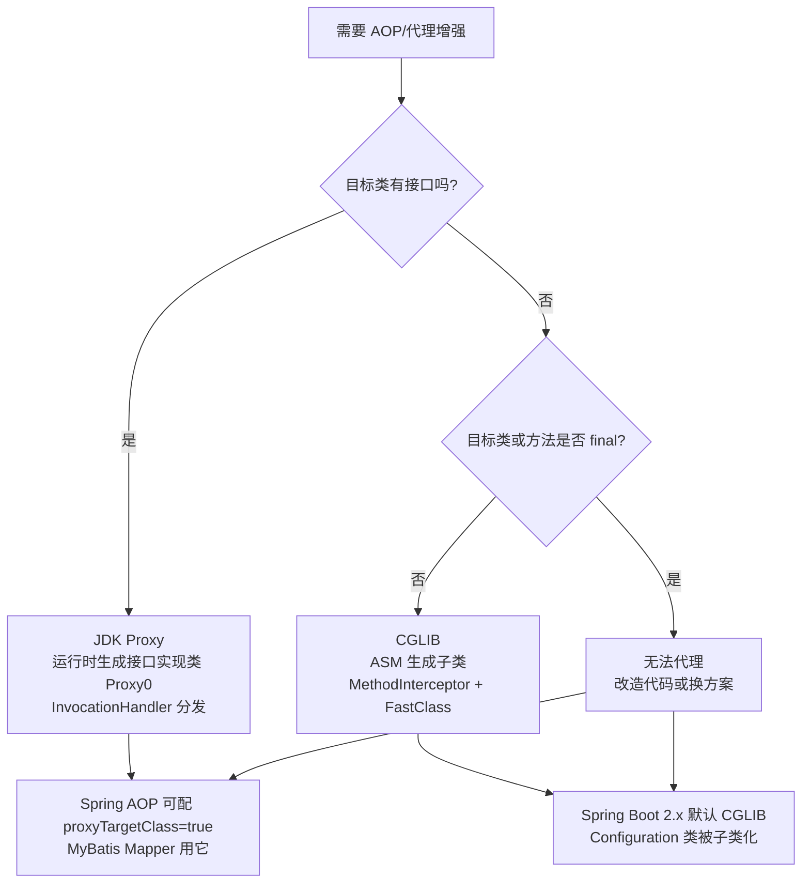
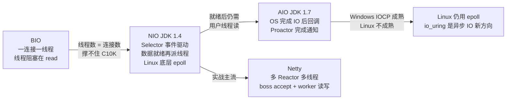
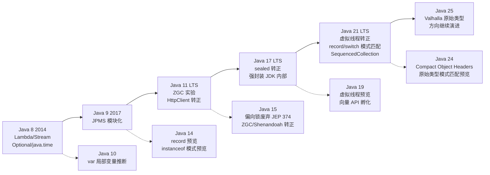

[📖 返回目录](README.md) · [➡️ 下一章](02-jvm.md)

# 01 · Java 语言核心进阶（资深向）

> 适用对象：10+ 年经验的资深工程师 / 架构师候选人。本章不讲 API 罗列，只讲原理、演进、权衡与工程踩坑。面试时"能讲出为什么"比"能背出是什么"值钱得多。

**TL;DR 本章学习要点**

1. 泛型的本质是「编译期擦除 + 运行时桥方法」，PECS 是通配符使用的唯一法则，泛型数组 / 泛型异常是语言层面的禁区；
2. 反射慢在查找与访问检查，MethodHandle / VarHandle / 缓存 / setAccessible 是四大优化手段，SPI 是 JDK 内置的插件机制；
3. 动态代理只有两条路：接口（JDK Proxy）与继承（CGLIB），Spring AOP 的代理语义直接决定了自调用失效、final 方法不拦截等经典坑；
4. 受检异常的哲学是「可恢复才受检」，异常吞掉是评审红线，try-with-resources 的 suppressed 机制必须吃透；
5. IO 演进路线是「阻塞 → 多路复用 → 异步」，零拷贝（sendfile/mmap）与堆外内存是高性能网络编程的基石；
6. 序列化选型是协议、性能、安全、跨语言四维权衡，serialVersionUID 是 Java 原生序列化兼容性的命门；
7. Java 8~25 的主线：函数式（Lambda/Stream）→ 数据类（record/sealed/模式匹配）→ 并发革命（虚拟线程/结构化并发），每个特性都要能讲出「解决什么问题、代价是什么」。

---


### 📑 本章目录

- [1. 泛型：类型擦除、PECS 与桥方法](#1-泛型类型擦除pecs-与桥方法)
- [2. 反射与注解：性能、注解处理器与 SPI](#2-反射与注解性能注解处理器与-spi)
- [3. 动态代理：JDK Proxy 与 CGLIB](#3-动态代理jdk-proxy-与-cglib)
- [4. 异常体系：设计哲学与最佳实践](#4-异常体系设计哲学与最佳实践)
- [5. IO/NIO/AIO：演进、零拷贝与 Selector](#5-ionioaio演进零拷贝与-selector)
- [6. 序列化：选型、兼容性与安全](#6-序列化选型兼容性与安全)
- [7. Java 8~25 新特性全景：主线与原理](#7-java-825-新特性全景主线与原理)
- [8. 考点速查表](#8-考点速查表)

## 1. 泛型：类型擦除、PECS 与桥方法


### 1.1 类型擦除：泛型只是编译期语法糖

Java 泛型（JDK 5 引入）与 C++ 模板本质不同：**Java 泛型编译后会被擦除（erasure）**，运行时 Class 对象里没有任何类型参数信息。

```java
List<String> a = new ArrayList<>();
List<Integer> b = new ArrayList<>();
a.getClass() == b.getClass(); // true，运行时都是 ArrayList
```

擦除规则：无界类型参数 `T` 擦除为 `Object`；有界 `T extends Number` 擦除为边界 `Number`；泛型信息只残留在字节码 Signature 属性里（供反射 `getGenericType()` 读取）。

擦除带来的连锁限制（高频考点）：

| 操作 | 是否合法 | 原因 |
|---|---|---|
| `new T()` | 非法 | 运行时不知道 T 是哪个类，无法调构造器 |
| `new T[10]` | 非法 | 数组运行时类型检查依赖具体类型，擦除后无法保证安全 |
| `new List<String>[10]` | 非法 | 擦除后是 `List[]`，写坏数组类型检查（编译直接报错） |
| `catch (T e)` | 非法 | 异常匹配是运行时行为 |
| `class Foo<T> extends Throwable` | 非法 | JLS 禁止泛型类直接/间接继承 Throwable |
| `instanceof T` | 非法 | 运行时无类型信息 |
| 重载 `f(List<String>)` 与 `f(List<Integer>)` | 非法 | 擦除后签名相同 |

### 1.2 桥方法：擦除后的多态补丁

子类覆写泛型父类方法时，编译器会生成**桥方法（bridge method）** 维持多态：

```java
class Parent<T> { void set(T t) {} }
class Child extends Parent<String> {
    @Override void set(String s) {}   // 源码里只写这一个
}
// 编译后 Child 里其实有两个方法：
//   void set(String)  —— 真正业务方法
//   void set(Object)  —— 桥方法，内部强转后调用 set(String)
```

原因：父类方法擦除后签名是 `set(Object)`，没有桥方法的话子类的 `set(String)` 构不成覆写，`((Parent)child).set(obj)` 会调错方法。桥方法可用 `Method.isBridge()` / `isSynthetic()` 识别——这是很多框架反射处理泛型方法时的隐藏细节，也是面试常考「子类里莫名多出一个方法」。

### 1.3 PECS：Producer Extends, Consumer Super

```java
List<? extends Number> producers = ...; // 生产者：只能读，读到 Number
List<? super Integer> consumers = ...;  // 消费者：只能写，写 Integer 一定安全

producers.add(1);        // 编译错误：不知道是 List<Integer> 还是 List<Double>
Number n = producers.get(0);  // 安全
consumers.add(1);        // 安全：Integer 一定是某父类的子类型
Object o = consumers.get(0);  // 只能读到 Object
```

本质：`? extends T` 是「T 的某个未知子类」，写不安全；`? super T` 是「T 的某个未知父类」，读不安全。经典佐证：`Collections.sort(List<T>, Comparator<? super T>)`、`Collections.copy` 的签名。无界 `List<?>` 用于「只读、不关心元素类型」。泛型方法 `<T> T get(List<T> list, int i)` 能在参数与返回值之间建立类型约束，这是通配符做不到的。

### 1.4 常见坑与工程实践

- **静态成员不能使用类级类型参数**：`class A<T> { static T t; }` 非法，静态成员属于类本身；
- **TypeToken 拿运行时类型**：Gson/Jackson 反序列化泛型必须传 `TypeReference`/`TypeToken`，否则擦除后拿不到 `List<User>` 里的 User；
- **泛型与数组结合**：优先 `List<T>`；不得已时 `(T[]) new Object[n]` + `@SuppressWarnings`，并保证数组不逃逸出泛型边界；
- **擦除冲突**：`public <T> T f()` 与 `public Object f()` 擦除后冲突，编译报错；
- 工程建议：泛型工具类（`Cache<K,V>`）设计时想清楚边界与逆变场景，避免到处 `Object` 传递后强转——强转是运行时才炸的雷。

### 1.5 本节高频面试题

**Q1：为什么 Java 泛型不能像 C++ 模板那样运行时保留类型？**

解答：核心是**迁移兼容性**。JDK 5 引入泛型时 ArrayList 等类库已存在，字节码层面新旧代码必须互通，于是采用擦除方案：一份代码 + 编译期检查。代价是运行时丢失类型信息、无法泛型化数组/异常、引入桥方法；收益是零 ABI 破坏、无代码膨胀（C++ 模板为每个类型生成一份代码，编译慢且二进制膨胀）。若重新设计，更优雅的是 Kotlin 的声明处变型（declaration-site variance）或 C# 的运行时泛型——但 JVM 背着兼容包袱做不到。

**追问**：桥方法有性能影响吗？——多一次间接调用，但 JIT 内联后可忽略；真正的坑在反射：`getDeclaredMethods()` 会多出桥方法，Spring/MyBatis 处理泛型方法时都要过滤。

**Q2：`List<? extends Number>` 为什么不能 add？`List<? super Integer>` 为什么 get 只能拿 Object？**

解答：extends 场景的真实类型是 Number 的某个未知子类，写任何具体类型都可能错配，编译器唯一能保证「读出来的一定是 Number 子类型」；super 场景的真实类型是 Integer 的某个未知父类，写 Integer 一定安全（Integer 是任何父类的子类型），但读出来可能是 `Object` 级别的类型，无法安全窄化。一句话：**extends 限制写、super 限制读**。

**追问**：`List<?>` 能 add(null) 吗？——能，null 是任何类型的子类型，这是无界通配符唯一的写入许可。

**Q3：擦除后 `List<String>` 和 `List<Integer>` 字节码一样，Jackson 怎么知道反序列化成什么类型？**

解答：靠两样东西：1) 字节码 Signature 属性——泛型签名编译期写入 class 文件，反射 `getGenericReturnType()` 能读回 `ParameterizedType` 拿到实际类型参数；2) 调用方显式传 `TypeReference`——匿名内部类 `new TypeReference<List<User>>(){}` 编译成真实子类，父类签名 `TypeReference<List<User>>` 写死在字节码里，`getGenericSuperclass()` 就能读回。这也是「反序列化泛型必须带 TypeToken」的原因。

**追问**：为什么匿名内部类能捕获泛型而普通类不能？——匿名内部类有真实类文件，继承关系写死；方法内局部泛型只存在于方法签名，方法返回即消亡。

---

## 2. 反射与注解：性能、注解处理器与 SPI

### 2.1 反射为什么慢？四大开销来源

1. **方法查找**：`getMethod` 沿继承链遍历 + 签名匹配；
2. **访问检查**：每次 invoke 都要做权限校验（`setAccessible(true)` 可跳过）；
3. **参数装箱与数组分配**：`invoke(Object, Object[])` 天然要装箱 + 建数组；
4. **无法内联**：`Method.invoke` 是 native 路径，调用点对 JIT 不透明，逃逸分析/内联全部失效。

### 2.2 优化手段（按收益排序）

- **缓存 Method/Field/Constructor 对象**：查找只做一次，invoke 循环复用；
- **MethodHandles（JDK 7）**：`MethodHandle.invokeExact` 类型精确、无反射权限栈，速度接近直接调用，是 Lambda 的底层实现机制；
- **VarHandle（JDK 9）**：字段级原子操作（get/set/compareAndSet），替代 `Unsafe` 的官方通道；
- **setAccessible(true)**：跳过访问检查（JDK 17+ 对 JDK 内部类仍受强封装限制，需 `--add-opens`）；
- **生成字节码**：框架级方案（ASM/ByteBuddy），彻底绕开反射（MyBatis、Spring 内部大量使用）。

### 2.3 注解生命周期与注解处理器

- 三档生命周期：`SOURCE`（编译期丢弃，如 `@Override`）、`CLASS`（进字节码，运行时读不到）、`RUNTIME`（运行时反射可见，Spring 全家桶依赖它）；
- **编译期处理（APT）**：`javax.annotation.processing.Processor` 通过 `META-INF/services` 注册，编译时生成代码（如 MapStruct、Lombok）。Lombok 更激进：直接修改 AST 生成 getter/setter——JDK 16+ 强封装后需要 `--add-opens` 放行，这是 Lombok 长期被诟病的脆弱点；
- **运行时处理**：Spring 的 `AnnotationUtils` 支持元注解合并（`@Service` 上标 `@Component`，扫描时等价）、`@AliasFor` 属性别名；
- 继承性：`@Inherited` 只对**类**生效，对接口和方法无效——这是面试陷阱。

### 2.4 SPI 与 ServiceLoader：JDK 的插件机制

- 机制：`ServiceLoader.load(X.class)` 读取 `META-INF/services/<接口全限定名>` 文件，每行一个实现类全名，**迭代时才懒加载实例化**；
- 经典案例：JDBC 4.0 的 `DriverManager`（1.6 后靠 ServiceLoader 发现驱动）、SLF4J 的绑定发现、Jakarta Validation 的 Provider 发现；
- 与 Spring 的对比：`spring.factories` / `AutoConfiguration.imports` 是 Spring 自研的 SPI 变体，支持按条件装配（`@ConditionalOnXxx`），比裸 ServiceLoader 多了条件化能力；
- **SPI 与 API 的区别**：API 是「我提供、你调用」；SPI 是「我定义契约、你实现、我回调」；
- 深度关联：ServiceLoader 使用调用方（线程上下文）类加载器加载实现，是打破双亲委派的典型场景（详见 02-jvm.md 类加载章节）。

### 2.5 本节高频面试题

**Q1：线上反射调用很慢，怎么优化？**

解答：先区分瓶颈——查找慢就缓存 Method 并 `setAccessible(true)`；调用慢就换 `MethodHandles.Lookup`（invokeExact 接近直接调用）；要极致性能就运行时生成字节码（ASM/ByteBuddy 生成专用调用类），框架（MyBatis/Spring）都是这么干的。另外注意：反射对象不能跨 ClassLoader 缓存（会持有类加载器引用造成泄漏，见 02-jvm.md 元空间泄漏案例）。

**追问**：JDK 17 下反射 JDK 内部类报 InaccessibleObjectException 怎么办？——JDK 9 模块化后强封装，需要启动参数 `--add-opens java.base/java.lang=ALL-UNNAMED`；生产上要评估是否值得开，尽量用官方 API 或换实现思路。

**Q2：Lombok 的原理是什么？为什么说它「脆弱」？**

解答：Lombok 是一个注解处理器，在编译期 hook 进 javac，直接操作语法树（AST）：扫描带 `@Getter/@Builder` 等的类，往 AST 里插入对应成员与方法的节点，再走正常编译流程。脆弱点：它依赖 javac 内部 API，JDK 每个大版本升级都可能崩（JDK 16 强封装后必须 `--add-opens`）；且因为修改的是 AST，生成的代码 IDE 里默认不可见（需插件）。

**追问**：MapStruct 也是注解处理器，为什么它不脆弱？——MapStruct 是在编译期**生成新的 .java 源文件**（基于公开的 Processor API + Filer），不修改既有 AST，所以对 JDK 升级更稳健。这是两种注解处理路线的本质区别。

**Q3：ServiceLoader 和直接 Class.forName 有什么区别？**

解答：ServiceLoader 是标准化的发现机制——按约定路径（`META-INF/services`）自动发现所有实现，懒加载（迭代才实例化），天然支持多实现并存；Class.forName 需要自己维护配置和加载逻辑。ServiceLoader 的代价是：按文件顺序加载、无法排序与条件过滤（需要自己包装），且默认不缓存实例。Dubbo 的 ExtensionLoader 就是 ServiceLoader 思想的增强版（自适应扩展、激活条件、依赖注入）。

**追问**：为什么 JDBC 驱动用 ServiceLoader 后还要 Class.forName("com.mysql...")？——老代码兼容：JDBC 4.0 前必须显式 Class.forName 注册；4.0 后 DriverManager 初始化时自动 ServiceLoader 发现，但显式加载仍然是安全的（驱动注册是幂等的）。这也是很多老项目里两行代码并存的原因。

---

## 3. 动态代理：JDK Proxy 与 CGLIB

### 3.1 JDK Proxy：基于接口

```java
Proxy.newProxyInstance(classLoader, new Class[]{UserService.class}, handler);
```

原理：运行时在内存中生成 `$Proxy0` 类（实现所有传入接口），所有接口方法（含 hashCode/equals/toString）调用都转发给 `InvocationHandler.invoke(proxy, method, args)`。**只支持接口**——这是硬限制。

### 3.2 CGLIB：基于继承

`Enhancer.create()` 用 ASM 生成目标类的**子类**，重写非 final 方法，回调 `MethodInterceptor.intercept`；用 FastClass 机制给方法建立索引，调用时按索引直达，避免反射。限制：**final 类 / final 方法无法代理**（这也是 Spring 要求 `@Configuration` 类不能是 final、`@Transactional` 方法不能是 private/final 的根本原因）。

### 3.3 对比表

| 维度 | JDK Proxy | CGLIB |
|---|---|---|
| 实现方式 | 生成接口实现类 | 生成目标类子类 |
| 依赖 | JDK 内置 | ASM 字节码库 |
| 目标要求 | 必须有接口 | 非 final 类/方法 |
| 方法分发 | InvocationHandler | MethodInterceptor + FastClass |
| 性能 | 现代 JDK 下两者差距很小，JDK Proxy 略优（官方文档口径） | 生成/首次调用略慢 |
| Spring 默认 | Spring Boot 2.x 起默认 CGLIB（proxyTargetClass=true） | 同上 |

> 图示：JDK Proxy 与 CGLIB 动态代理选型流程



### 3.4 代理在 Spring / MyBatis 中的应用

- **Spring AOP**：有接口时历史上默认 JDK Proxy，可 `proxyTargetClass=true` 强制 CGLIB；Spring Boot 2.0 起默认 CGLIB。切面=多个 Advisor 组成责任链，InvocationHandler 里依次执行；
- **@Transactional 自调用失效**：`this.method()` 走的是目标对象直接调用，不经过代理对象，事务注解不生效——解法：注入自身代理、`AopContext.currentProxy()`（需 exposeProxy=true）、拆到另一个 Bean；
- **@Configuration 的 CGLIB 限制**：配置类被 CGLIB 子类化，所以不能 final；内部 `@Bean` 方法间调用会走代理，保证单例语义（lite 模式例外）；
- **MyBatis Mapper**：Mapper 是接口，MyBatis 用 JDK 代理生成实现：`MapperProxy implements InvocationHandler`，invoke 时按方法签名到 MapperMethod 里找对应 SQL 语句 id，再交给 SqlSession 执行——所以 Mapper 接口的方法名/参数绑定发生在**运行期**，这就是「Mapper 接口为什么没有实现类也能用」的答案；
- **字节码增强谱系**：ASM（最底层）→ CGLIB/Javassist（封装 ASM）→ ByteBuddy（Mockito 用它）→ JDK Proxy（最上层、能力最小）。

### 3.5 本节高频面试题

**Q1：JDK Proxy 和 CGLIB 怎么选？**

解答：JDK 16+ 时代两者性能差距已很小，选型优先级：能接口就 JDK Proxy（少依赖、语义清晰）；目标类没有接口或需要代理具体类（如 `@Configuration`）就用 CGLIB。Spring Boot 2.x 默认 CGLIB 是为了「接口 + 实现」分离的老项目也能代理实现类方法。注意 CGLIB 不能代理 final 类/方法，JDK Proxy 不能代理无接口类，这是硬约束而非性能问题。

**追问**：CGLIB 代理的目标类构造函数会被调用吗？——会，子类化必然调用父类构造器（默认无参）。Spring 里 CGLIB 用 Objenesis 绕过构造器创建实例（不调用构造器），所以被代理 Bean 的构造器逻辑在代理场景下可能不执行——这是排查「构造器里初始化的字段为 null」类问题的隐藏方向。

**Q2：为什么 @Transactional 在同类内部调用不生效？**

解答：Spring 事务基于 AOP 代理。`aService.methodA()` 调 `this.methodB()` 时，this 是目标对象本身，方法调用直接进入 methodB 字节码，完全不经过代理对象的拦截器链，事务注解自然被跳过。本质是「代理只能拦截外部入口」。解法：注入自身（`@Lazy` 自引用/`@Autowired` 自己）、`AopContext.currentProxy()`、或把事务方法拆到独立 Bean。

**追问**：public 方法但类没被 Spring 管理（new 出来的）会生效吗？——不会，代理对象都不存在；事务只对「Spring 容器创建并通过代理暴露的 Bean 的外部调用」生效。

**Q3：MyBatis 的 Mapper 接口没有实现类，调用时到底发生了什么？**

解答：`SqlSession.getMapper()` 时 MyBatis 用 JDK 动态代理为接口生成代理实例（MapperProxyFactory）；真正调用时 MapperProxy.invoke 根据方法名+参数类型从 configuration 的 mappedStatements 里查 SQL 语句 id，构造 MapperMethod 执行（参数绑定、SqlSession 增删改查、结果映射）。所以 Mapper 的方法签名就是 SQL 的「运行时寻址键」，这就是为什么 SQL id 必须唯一、方法重载会出问题。

**追问**：为什么 MyBatis 不用 CGLIB？——Mapper 全是接口，JDK Proxy 天然适配；且代理逻辑只需要拦截一层方法分发，JDK Proxy 足够且轻量。

---

## 4. 异常体系：设计哲学与最佳实践

### 4.1 体系与设计哲学

`Throwable` → `Error`（JVM 级、不可恢复：OOM、StackOverflowError、NoClassDefFoundError，**不该 catch**）→ `Exception` → 受检异常 / `RuntimeException`（非受检）。

受检异常是 Java 独有的设计（C++/C# 都没有），Gosling 的初衷是「编译器强制调用方处理可恢复错误」。但 25 年工程实践证明了它的代价：

- 接口演进成本高：给方法加一个受检异常，所有调用方编译全挂；
- 与函数式编程冲突：Lambda 里不能直接抛受检异常（`Stream` 的 map 函数式接口没有 throws），只能包装，导致代码丑陋；
- 催生「吞异常」恶习：调用方 catch 后打日志或 return null。

### 4.2 最佳实践清单

- 可恢复才用受检异常，编程错误（参数非法、状态非法）用 `IllegalArgumentException`/`IllegalStateException`（Effective Java 第 70 条）；
- **绝不吞异常**：catch 后打日志再抛出 = 重复日志；catch 后 return null = 把错误藏起来；catch 后空块 = 事故源头；
- 自定义业务异常继承 RuntimeException，**必须保留 cause 链**（`super(message, cause)`），否则排查问题时根因丢失；
- 异常信息带上下文：业务单号、关键参数摘要、调用链标识（traceId）；
- 不要用异常做控制流：异常构造要填充栈（fillInStackTrace，native 调用），高频路径上性能灾难；
- 统一出口：Spring `@RestControllerAdvice` + `@ExceptionHandler` 全局转换，业务层只管抛；
- 日志规范：`log.error("msg", e)` 传异常对象而非 `e.getMessage()`（后者丢栈）。

### 4.3 try-with-resources 原理

```java
try (FileInputStream in = new FileInputStream("a");
     FileOutputStream out = new FileOutputStream("b")) { ... }
```

编译期展开为 try-finally：资源按**声明逆序**关闭；若主体抛异常且关闭也抛异常，**主体异常保留，关闭异常进入 suppressed 数组**（`Throwable.addSuppressed`），用 `e.getSuppressed()` 查看——这就是「两个异常时以哪个为准」的答案。JDK 9 起支持已有 final/effectively final 变量作为资源。实现要求：实现 `AutoCloseable`（注意 close 方法声明抛 Exception，实现时收窄）。

### 4.4 本节高频面试题

**Q1：受检异常和运行时异常到底怎么选？**

解答：原则是「调用方能合理恢复才受检，否则运行时」。但资深视角要补充两点：1) 现代 Java 生态（Spring 全家桶、JPA、大多数库）全面拥抱运行时异常 + 全局处理器，受检异常的实际生存空间在 IO/网络这类「重试可恢复」场景；2) 接口设计时受检异常是「契约的一部分」，跨团队 API 用受检异常能强制调用方思考失败路径，但代价是升级成本。我的建议：内部服务一律 RuntimeException + 错误码，外部协议层用受检或结果对象（如 `Either`/Result 模式）。

**追问**：catch (Exception e) 和 catch (Throwable t) 有什么区别？——Throwable 会捕获 Error（OOM 等），通常不该捕获；但某些场景（线程池里的任务、框架兜底）需要捕获 Throwable 防止线程死亡——这是刻意为之而非失误。

**Q2：try-with-resources 里主体和 close 都抛异常，哪个异常会抛给调用方？**

解答：主体异常优先，close 异常被抑制进 suppressed 数组；只有主体没抛异常时 close 的异常才会抛出。这保证「业务失败的原因不被资源关闭失败掩盖」。老式 finally 写法做不到这一点——finally 里抛异常会覆盖主体异常，这是 try-with-resources 最重要的工程价值。

**追问**：suppressed 异常会影响性能吗？——会，addSuppressed 有内存与栈填充开销；JDK 7 曾因此被诟病，JIT 已优化掉大部分（-XX:-OmitStackTraceInFastThrow 相关）。高频抛异常路径无论哪种写法都该避免。

**Q3：线上日志里大量「Exception in thread main」却没有业务堆栈，为什么？**

解答：JVM 的 OmitStackTraceInFastThrow 优化——同一异常类型在同一位置抛太多次，JIT 直接抛「冷异常」（无堆栈）避免重复填充栈开销。排查时看完整日志的首次堆栈即可。这解释了为什么「偶发异常有栈、高频异常没栈」。

---

## 5. IO/NIO/AIO：演进、零拷贝与 Selector

### 5.1 演进路线：为什么 BIO 撑不住 C10K

- **BIO**：accept/read 阻塞线程，一连接一线程，线程数 = 连接数，万级连接直接耗尽线程与上下文切换；
- **NIO**（JDK 1.4）：Channel + Buffer + Selector，单线程可以管理海量连接的事件就绪状态——**从「线程等数据」变成「数据就绪了再派线程」**；
- **AIO**（JDK 1.7）：操作系统完成 IO 后回调（Proactor），彻底去掉「就绪后仍需用户线程去读」这一步。

> 图示：IO 模型演进路线



### 5.2 Selector 原理与经典坑

- 三件套：`Selector` 注册 `OP_ACCEPT/OP_READ/OP_WRITE`，`select()` 阻塞直到有通道就绪，`selectedKeys()` 取就绪集合；
- Linux 上底层是 **epoll**（事件驱动、O(1) 就绪检测、无需轮询全部 fd），Windows 是 select 模型，macOS 是 kqueue；
- **经典空轮询 bug**（JDK-6403933，JDK 6u18 修复）：极端情况下 selector 空转导致 CPU 100%，Netty 的兜底方案是「检测到空轮询 N 次就重建 Selector」（换新 selector 并重新注册所有 channel）；
- epoll 的 LT/ET：Java NIO 只有水平触发（LT）；Netty 的 `EpollServerSocketChannel`（netty-transport-native-epoll）可配边缘触发（ET）。

### 5.3 Reactor 与 Proactor

- Reactor（NIO 对应）：事件循环 + 分发器，「就绪通知」模式。单 Reactor 单线程（Redis 的 IO 线程模型类似）；多 Reactor 多线程（Netty：boss 线程只负责 accept，worker 线程组负责读写事件循环）；
- Proactor（AIO 对应）：操作系统完成数据拷贝后回调，「完成通知」模式；
- 为什么 Netty 不用 AIO：官方文档明确——Linux 上 AIO（libaio）实现不成熟，性能不如 epoll 且可控性差；Windows 的 IOCP 才是成熟异步模型。io_uring 是 Linux 异步 IO 的新方向（Netty 已有实验支持）。

### 5.4 零拷贝：内核视角

传统 `read + write`：磁盘 → 内核缓冲 → 用户缓冲 → 内核 socket 缓冲 → 网卡，**4 次拷贝 + 4 次上下文切换**。

- **sendfile**：内核里直接 DMA 到 socket，剩 2 次拷贝 + 2 次切换；Netty 的 `FileRegion` 就是走 sendfile；
- **mmap**：文件映射进进程地址空间，读写免用户态拷贝（`MappedByteBuffer`），Kafka 的日志读写用它；
- **DirectByteBuffer（堆外）**：不在堆上、地址不被 GC 搬移，native IO 直接读写它免去「堆内 ↔ 堆外」拷贝；代价：分配/回收昂贵（依赖 Cleaner 异步回收），受 `-XX:MaxDirectMemorySize` 限制，用完要显式释放或复用池（Netty 的 PooledByteBufAllocator）。

### 5.5 IO 模型对比表

| 模型 | 阻塞 | 同步/异步 | 典型实现 | 适用 |
|---|---|---|---|---|
| 阻塞 IO（BIO） | 是 | 同步 | 传统 Socket | 低并发、简单场景 |
| 非阻塞 IO | 否 | 同步 | SocketChannel 非阻塞 | 少用，配合轮询 |
| IO 多路复用 | 就绪时阻塞 | 同步 | NIO + Selector / Netty | 高并发网络服务（主流） |
| 信号驱动 IO | 否 | 同步 | SIGIO | 少见 |
| 异步 IO（AIO） | 否 | 异步 | AsynchronousChannel / IOCP | Windows 成熟、Linux 谨慎 |

### 5.6 本节高频面试题

**Q1：NIO 的 Selector 和「每连接一个线程」相比，本质优势是什么？**

解答：把「等数据」从线程里剥离。BIO 下线程阻塞在 read 上，1 万连接需要 1 万线程；Selector 下 1 个线程可以同时监听 1 万个通道的「数据就绪」事件，就绪后才派发处理。本质是**事件驱动替代线程阻塞**：线程是昂贵资源（栈内存 + 上下文切换），事件是廉价的。代价是编程模型反转（回调/状态机），所以 Netty 封装了 Reactor 模型让业务方写起来像同步。

**追问**：select/poll/epoll 的区别？——select 每次调用要拷贝全部 fd 集合到内核且线性扫描（上限 1024）；poll 用链表去掉上限但仍是线性扫描；epoll 用内核事件表 + 回调，就绪事件直接返回给用户，O(1) 复杂度。Java NIO 在 Linux 上就是 epoll。

**Q2：Java NIO 的零拷贝有哪些手段？Netty 里分别对应什么？**

解答：三种：1) `FileChannel.transferTo` → sendfile 系统调用，Netty 的 `FileRegion`（文件→网络，零用户态拷贝）；2) `FileChannel.map` → mmap，Netty 的 MappedByteBuffer 用法；3) `DirectByteBuffer` 堆外缓冲，Netty 的 PooledDirectByteBuf。面试加分点：说清楚「零拷贝省的是用户态/内核态之间的拷贝，DMA 拷贝省不掉」，以及堆外内存的分配回收成本要靠池化摊平。

**追问**：堆外内存会 OOM 吗？——会，受 `-XX:MaxDirectMemorySize` 限制，DirectByteBuffer 分配失败抛 OutOfMemoryError: Direct buffer memory；常见于未释放的 ByteBuffer 堆积（Netty 泄漏检测器就是干这个的）。

**Q3：为什么 Netty 不用 JDK 的 AIO？**

解答：AIO 需要操作系统级异步 IO 支持。Windows 的 IOCP 很成熟；但 Linux 的 libaio 只对特定文件系统/场景友好，网络异步支持差，实际表现不如 epoll + 用户态事件循环，且 JDK 的 AsynchronousChannel 在 Linux 上实现有历史问题。Netty 的结论是「epoll 更可控、性能更好」，所以默认 NIO 传输，需要时可换原生 epoll 传输。io_uring 出现后情况在变，但成熟度仍需观察。

---

## 6. 序列化：选型、兼容性与安全

### 6.1 Java 原生序列化

- `Serializable` 是标记接口，序列化走 `ObjectOutputStream`（反射遍历字段）；
- **serialVersionUID**：不写则由 JVM 按类结构自动计算——类结构一变（加字段、改类型）UID 就变，反序列化直接 `InvalidClassException`。所以必须显式声明 `private static final long serialVersionUID = 1L;`；
- 兼容规则：新增字段 → 反序列化用默认值；删除字段 → 忽略；改字段类型 → 不兼容；`transient` 字段不序列化；`static` 不参与；
- 性能：慢（反射 + 写类描述符）、体积大（存类名全限定名）；跨语言：仅 Java；
- **安全**：readObject 反序列化不可信数据 = 远程代码执行（CommonsCollections 等 gadget 链），RMI、JDK 序列化是重灾区。防护：`ObjectInputFilter`（JDK 9+）白名单过滤，或干脆不用。

### 6.2 主流序列化方案对比

| 维度 | Java 原生 | JSON（Jackson/Gson） | Protobuf | Hessian | Kryo |
|---|---|---|---|---|---|
| 格式 | 二进制 | 文本 | 二进制（varint） | 二进制 | 二进制 |
| 跨语言 | 仅 Java | 全语言 | 全语言（IDL） | 多语言 | 主要 Java |
| 性能 | 差 | 中 | 高 | 中高 | 最高档 |
| 体积 | 大 | 大 | 小 | 中 | 小 |
| Schema 演进 | 靠 UID 硬撑 | 字段增减宽松 | 字段号规则严格 | 类型映射有坑 | 需注册类 |
| 安全 | 高危 | 中（需防 gadget） | 高 | 中 | 需白名单 |
| 典型场景 | 遗留系统/RMI | HTTP API/缓存 | gRPC/内部 RPC | Dubbo 默认 | 本地缓存/高性能 RPC |

补充要点：

- **Protobuf 演进铁律**：字段号永不复用（删除用 `reserved`）、新增字段用新号、类型不可变——旧客户端读到未知字段号会跳过；
- **Hessian2**：Dubbo 默认序列化，跨语言但 Java 特有类型（BigDecimal、Date 子类）映射有坑，社区版本维护参差；
- **Kryo**：性能与体积俱佳，但 `register` 类才能发挥全部优势且防注入；**实例非线程安全**，必须 ThreadLocal/池化；字段增删顺序变化会影响兼容性（依赖类结构）；
- **选型口诀**：对外 API 用 JSON（可读性 + 生态）；内部 RPC 用 Protobuf（跨语言 + 强 schema）；Java 内部高速通道（缓存/消息体）用 Kryo；遗留系统才碰 Java 原生。

### 6.3 本节高频面试题

**Q1：serialVersionUID 的作用？不加会怎样？**

解答：序列化兼容性的版本标识。反序列化时 JVM 比对本地类与流中类的 UID，不一致抛 InvalidClassException。不显式声明时 JVM 按类结构（字段、方法、修饰符）计算默认 UID——类一改就变，导致「加个字段后老数据全反序列化失败」。所以规范是显式声明固定值，字段演进靠「新增字段走默认值、删除字段被忽略」的兼容规则。**改字段类型或删字段（非 transient）属于破坏性变更，必须评估存量数据**。

**追问**：加字段后反序列化老数据，新字段是什么值？——默认值（对象为 null、int 为 0）；如果新字段没有默认值语义，需要自定义 `readObject` 做兼容处理（给默认值/迁移逻辑）。

**Q2：为什么说「反序列化不可信数据」是 RCE 入口？**

解答：readObject 会按流里的类描述符实例化任意类并调用其字段赋值逻辑——攻击者构造精心编排的嵌套对象图，触发链上的某个类的 readObject/字段 setter 执行危险操作（如 TemplatesImpl 加载字节码），这就是 gadget 链。防护三原则：1) 不反序列化不可信数据；2) 必须做时用白名单过滤（ObjectInputFilter/黑名单框架）；3) 现代方案优先 Protobuf/JSON 这类「无代码执行能力」的格式。

**追问**：Fastjson 为什么漏洞多？——它支持 `@type` 自动按类名实例化任意类（autoType），等于把 readObject 的风险带进了 JSON 生态；后续版本反复加黑名单又被绕过。教训：反序列化能力越强，攻击面越大。

**Q3：Kryo 为什么快？有什么代价？**

解答：快在三点：1) 不写类描述符（类注册后只写 int id）；2) 无反射的字段读写（unsafe/直接字段访问 + 缓存）；3) 无跨语言包袱（不写类型名）。代价：1) 非线程安全（Kryo 实例带可变状态，需 ThreadLocal 池）；2) 类必须注册或显式配置，否则性能与安全性都打折；3) 类字段顺序/结构变化影响兼容性，灰度发布期新旧版本混跑会踩坑。

---

## 7. Java 8~25 新特性全景：主线与原理

### 7.1 函数式：Lambda 与 Stream 的原理

- **Lambda 为什么用 invokedynamic**（JDK 7 字节码指令）：编译期不生成匿名内部类，而是生成 invokedynamic 调用点；首次执行时 `LambdaMetafactory` 在运行时生成实现类并缓存。收益：无类文件爆炸、调用点可被 JIT 去虚拟化优化、实现可替换（未来换策略不影响字节码）。对比：匿名内部类每处 new 一个类文件 + 持有外部 this 引用；
- 捕获变量要求 effectively final：语言层面防数据竞争的设计；
- **Stream 本质**：数据源 → `Spliterator`（支持 tryAdvance 逐个取 / trySplit 分治）→ 中间操作**惰性拼接**（返回新 Stream，不执行）→ 终止操作触发求值。短路操作（limit/findFirst/anyMatch）提前终止；`parallel()` 用 `ForkJoinPool.commonPool()` 分治执行；
- Stream 陷阱：并行流默认线程池（阻塞任务会拖垮全局）；有状态中间操作（sorted/distinct）破坏并行；`peek` 不是用来做副作用的。

### 7.2 Optional、默认方法与日期 API

- **Optional**：值容器，杜绝 NPE 的「可能缺失」显式化。反模式：做字段/方法参数（不可序列化语义 + 包装开销）、`isPresent()+get()`（不如 if）、`orElse(getExpensive())`（参数先求值，应 orElseGet）；
- **默认方法**：给接口加方法不破坏实现类（Collection.stream() 就是这么加的）。菱形冲突规则：类声明 > 父接口 > 更具体的接口，冲突必须显式覆写；
- **java.time（JDK 8）**：不可变 + 线程安全（对比 SimpleDateFormat 非线程安全）。Instant 是时间线上的绝对点；LocalDateTime 无时区概念；Duration（秒/纳秒）vs Period（年月日）；`DateTimeFormatter` 线程安全可静态化。

### 7.3 数据类革命：record / sealed / 模式匹配 / switch 表达式

- **record（JDK 14 预览 / 16 转正）**：不可变数据载体，自动生成构造器、equals/hashCode/toString；字段 final；可 implements 接口但**不能 extends**；紧凑构造器可做参数校验。本质是受限类（final + final 字段），配套 `Record` 反射 API（getRecordComponents）；
- **sealed（15 预览 / 17 转正）**：`sealed interface Shape permits Circle, Square` 限定继承集，配合 record 构成「代数数据类型」；
- **switch 表达式（14 预览 / 17 后逐步转正）**：箭头语法无 fall-through、可作表达式返回值；`yield` 返回值；
- **模式匹配**：instanceof 模式（16 转正）→ switch 模式匹配（21 转正）→ record 模式（21 转正）——解构 + 类型收窄 + 穷尽性检查，是「用类型安全的方式消灭强转与 if-else 链」。

### 7.4 并发革命：虚拟线程与结构化并发（详见 03-concurrency.md 第 9 节）

- 虚拟线程（JDK 19 预览 / **21 转正**）：JVM 调度的轻量线程，阻塞时自动从载体线程卸载（unmount），百万级并发成为可能；适合 IO 密集；
- 结构化并发：`StructuredTaskScope` 让并发任务的「生命周期跟随代码块」、统一错误处理与取消（JDK 21 孵化，后续版本推进，转正版本见 03 文件）。

### 7.5 版本时间线（JDK 8 → 25）

| 版本 | 关键特性 |
|---|---|
| 8 (2014) | Lambda/Stream/Optional/默认方法/java.time/CompletableFuture/重复注解 |
| 9 (2017) | JPMS 模块化、接口私有方法、List.of/Map.of、try-with-resources 增强、Math.fma（FMA 融合乘加，JDK-8160838） |
| 10 | var 局部变量推断（仅局部变量；`var x = new ArrayList<>()` 推断为 Object 元素——坑） |
| 11 (LTS) | 单文件源码启动、ZGC 实验、HttpClient 转正、String.repeat/strip |
| 12/13 | switch 表达式预览、文本块预览 |
| 14 | record 预览、instanceof 模式匹配预览 |
| 15 | sealed 预览、ZGC/Shenandoah 转正、**偏向锁默认禁用并废弃（JEP 374）** |
| 16 | record 转正、Stream.toList()、强封装 JDK 内部（JEP 396） |
| 17 (LTS) | sealed 转正、switch 模式匹配预览 |
| 18-20 | jwebserver、向量 API 孵化、虚拟线程预览（19） |
| 21 (LTS) | **虚拟线程转正（JEP 444）**、switch/record 模式匹配转正、SequencedCollection（JEP 431）、字符串模板预览 |
| 22-25 | 字符串模板/unnamed variables 预览推进；24：Compact Object Headers 实验（JEP 450）、原始类型模式匹配预览；25：Valhalla 原始类型方向继续演进（精确清单待核实） |

> 图示：Java 8 → 25 新特性演进时间线（主线 + 预览支线）



### 7.6 本节高频面试题

**Q1：为什么 Lambda 用 invokedynamic 而不是直接生成匿名内部类？**

解答：三个原因：1) **类文件爆炸**——每个 Lambda 调用点一个匿名类文件，大型代码库成千上万；2) **性能**——invokedynamic 调用点可被 JIT 直接去虚拟化/内联，匿名内部类多一层 this 引用与虚调用；3) **可演进**——实现策略（生成类、MethodHandle 组合）可以换，字节码不变。实际流程：首次执行时 LambdaMetafactory 用 ASM 生成实现类并缓存（同一个 Lambda 调用点只生成一次）。

**追问**：捕获外部变量的 Lambda 和没捕获的在性能上有区别吗？——有：捕获时生成类持有捕获字段（额外字段初始化 + 内存读），没捕获的可生成单例（无状态复用）；这也是为什么「能传值就传值、别闭包大对象」的优化建议有依据。

**Q2：Stream 的中间操作为什么「不执行」？并行流一定更快吗？**

解答：中间操作（filter/map）只返回包装了新 Spliterator 的 Stream，是**惰性描述**，直到终止操作（collect/forEach/count）才真正遍历求值——这允许短路（limit 只需消费前 N 个）与管道融合（一次遍历完成所有操作，避免每步一个中间集合）。并行流不一定更快：数据量小、顺序敏感（sorted/distinct 有状态）、元素处理轻量时，ForkJoin 分治与合并的开销反而更大；且共用 commonPool，阻塞任务会互相拖累。

**追问**：`stream.parallel()` 的线程池能换吗？——能，`ForkJoinPool.commonPool` 是共享的，可用自定义 ForkJoinPool 或 `CompletableFuture` 指定 Executor 规避；但生产中更推荐「并行度由数据规模与任务粒度决定，别默认开并行」。

**Q3：record 和普通 final class + 手写 getter 有什么区别？值得用吗？**

解答：record 是语言级的数据载体：equals/hashCode/toString/构造器全部自动生成且**与字段定义严格一致**（不会出现手写不一致的 bug）；字段天然 final；配合解构（record 模式）与 sealed 可以写出穷尽性检查的代数数据类型代码。代价：不能继承、序列化语义与普通类不同（record 序列化走规范构造器，绕过 readObject——这反而是安全优势）、反射 API 不同。结论：DTO/VO/事件消息这类纯数据类无脑用 record，业务对象（有行为、有继承）不用。

---

## 8. 考点速查表

| 考点 | 一句话要点 |
|---|---|
| 类型擦除 | 泛型编译期检查、运行时擦除，字节码只留 Signature 属性 |
| 桥方法 | 编译器生成维持泛型覆写的多态补丁，反射需 isBridge 过滤 |
| PECS | extends 只读、super 只写；生产者 extends、消费者 super |
| 泛型禁区 | 不能 new T()/泛型数组/泛型异常/instanceof T/静态类型参数 |
| 反射优化 | 缓存 Method + setAccessible + MethodHandle/VarHandle + 字节码生成 |
| 注解处理 | SOURCE 编译期 APT（Lombok 改 AST）；RUNTIME 反射（Spring 元注解） |
| ServiceLoader | META-INF/services 懒加载发现实现，SPI 是「我定义、你实现」 |
| JDK Proxy | 接口代理，InvocationHandler 分发，MyBatis Mapper 用它 |
| CGLIB | 继承代理，final 不可代理，Spring Boot 2.x 默认 |
| 事务自调用失效 | this 调用不经过代理，需注入自身/AopContext |
| 受检异常哲学 | 可恢复才受检；工程上运行时异常 + 全局处理器为主流 |
| try-with-resources | 逆序关闭，主体异常优先，close 异常进 suppressed |
| 异常性能 | 抛异常填充栈昂贵，禁止异常控制流 |
| NIO 三件套 | Channel/Buffer/Selector，epoll 事件驱动，LT 触发 |
| Selector 空轮询 | JDK 历史 bug，Netty 重建 Selector 兜底 |
| 零拷贝 | sendfile 2 次拷贝；mmap 免用户态拷贝；DirectByteBuffer 堆外 |
| AIO 取舍 | Windows IOCP 成熟；Linux 用 epoll，Netty 不用 AIO |
| serialVersionUID | 显式声明，类结构变化导致不兼容 |
| 序列化选型 | API 用 JSON；RPC 用 Protobuf；Java 内部高速用 Kryo |
| 反序列化安全 | 不可信数据不反序列化；白名单过滤 |
| Lambda 原理 | invokedynamic + LambdaMetafactory 运行时生成实现类 |
| Stream 惰性 | 中间操作拼接、终止操作求值；并行用 commonPool |
| record | 不可变数据载体，自动 equals/hashCode，不能继承 |
| sealed + 模式匹配 | 限定继承 + 类型收窄 + 穷尽性检查，消灭强转 |
| 虚拟线程 | JDK 21 转正，阻塞自动卸载，IO 密集场景革命 |
| FMA | JDK 9 Math.fma，融合乘加，精度与性能双赢 |
