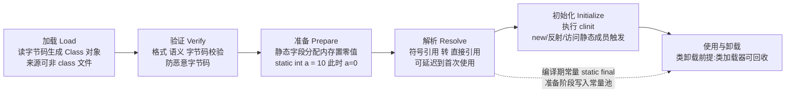
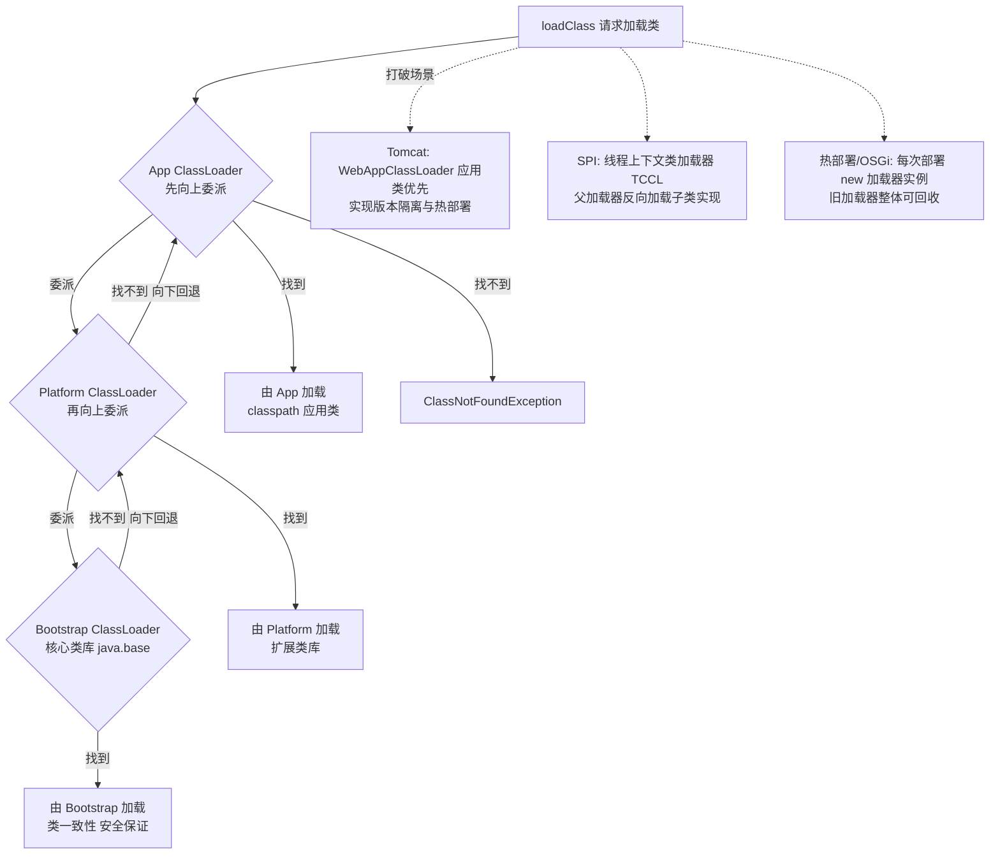
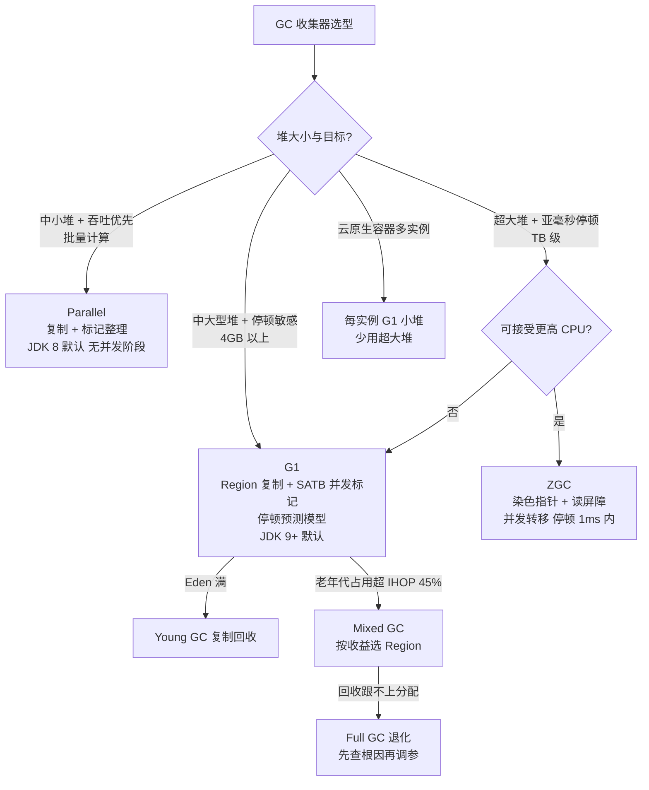
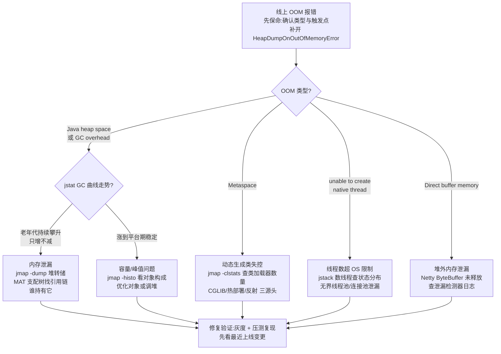

[📖 返回目录](README.md) · [⬅️ 上一章](01-java-core.md) · [➡️ 下一章](03-concurrency.md)

# 02 · JVM 原理与调优实战

> 适用对象：10+ 年经验的资深工程师 / 架构师候选人。本章聚焦「原理 → 参数 → 现象」的闭环：每个知识点都要能落到「线上出了什么问题、用什么命令看、怎么改参数」。

**TL;DR 本章学习要点**

1. 内存结构先分清「谁分配、谁回收」：堆管对象、栈管帧、元空间管类元数据、直接内存管 IO，指针压缩与逃逸分析决定对象到底占多大、分配在哪；
2. 类加载五阶段里「准备 vs 初始化」是面试必考，双亲委派被打破的三大场景（Tomcat/SPI/热部署）要能讲出为什么必须破；
3. GC 主线是「分代理论 → CMS 的教训 → G1 的 Region 化 → ZGC 的并发化」，能画出收集器选型决策树才算过关；
4. JIT 是性能的隐形引擎：分层编译、内联、逃逸分析决定了「写出来的代码」和「跑起来的代码」是两码事；
5. 故障排查要形成肌肉记忆：OOM 看堆转储、CPU 飙升看线程栈、死锁看 jstack、泄漏看 jstat 曲线——工具是 jps/jstack/jmap/jstat/arthas 五件套；
6. 调优是「目标导向」而不是「参数堆砌」：先定吞吐/延迟目标，再压测、观察、小步调整、验证，大促调优是这套方法论的完整演练。

---


### 📑 本章目录

- [1. 内存结构：堆、栈、元空间与直接内存](#1-内存结构堆栈元空间与直接内存)
- [2. 类加载机制：五阶段与双亲委派](#2-类加载机制五阶段与双亲委派)
- [3. GC 算法与收集器：从分代到并发](#3-gc-算法与收集器从分代到并发)
- [4. JIT 与性能：分层编译、内联与逃逸分析](#4-jit-与性能分层编译内联与逃逸分析)
- [5. 故障排查实战：OOM、CPU 飙升、死锁与泄漏](#5-故障排查实战oomcpu-飙升死锁与泄漏)
- [6. 调优方法论：目标导向，参数服务于目标](#6-调优方法论目标导向参数服务于目标)
- [7. 考点速查表](#7-考点速查表)

## 1. 内存结构：堆、栈、元空间与直接内存


### 1.1 运行时数据区全景

| 区域 | 线程共享 | 存放内容 | 异常 | 典型参数 |
|---|---|---|---|---|
| 堆（Heap） | 是 | 对象实例、数组 | OutOfMemoryError: Java heap space | -Xms/-Xmx |
| 方法区（元空间） | 是 | 类元数据、常量池、方法字节码 | OutOfMemoryError: Metaspace | -XX:MaxMetaspaceSize |
| 虚拟机栈 | 否 | 栈帧（局部变量表、操作数栈、动态链接、返回地址） | StackOverflowError / OOM | -Xss |
| 本地方法栈 | 否 | native 方法 | StackOverflowError | -Xss |
| 程序计数器 | 否 | 当前字节码行号 | 无 | — |
| 直接内存 | 是（概念上） | DirectByteBuffer 引用的堆外内存 | OutOfMemoryError: Direct buffer memory | -XX:MaxDirectMemorySize |

演进要点：JDK 8 用**元空间（Metaspace）** 替换永久代（PermGen），根本原因是永久代大小难估（动态生成类的场景——CGLIB、热部署——经常 OOM: PermGen），且与 JVM 垃圾回收器耦合。元空间使用**本地内存**，默认无上限（受进程内存约束），因此 `-XX:MaxMetaspaceSize` 必须显式设置，否则类加载器泄漏会悄悄吃光整机内存（见第 5 节案例）。

进程内存全景（面试画图题）：

```
┌─────────────────────────── 进程地址空间 ───────────────────────────┐
│  JVM 堆（-Xmx）          │ 元空间（类元数据，本地内存）            │
│  ├─ 年轻代 Eden/S0/S1    │ 直接内存（DirectByteBuffer，MaxDirect  │
│  └─ 老年代               │   MemorySize）                        │
│  线程栈（-Xss × 线程数）   │ JIT Code Cache（-XX:ReservedCodeCache  │
│                          │   Size）、GC 结构（卡表/RSet）、JNI      │
└───────────────────────────────────────────────────────────────────┘
```

调堆时只算 -Xmx 是新手行为：**容器内存预算 = 堆 + 元空间 + 直接内存 + 线程栈 + Code Cache + JVM 自身开销**，这也是容器里 MaxRAMPercentage 只给 75% 左右的原因。

**TLAB（Thread Local Allocation Buffer）**：每个线程在 Eden 里划一块私有缓冲（默认 Eden 的 1%），对象分配优先走 TLAB（指针碰撞即可，无锁），TLAB 满了才走 CAS 竞争分配。作用：把「分配」从全局竞争变成线程本地操作——这就是「Java 对象分配很快」的机制基础。观察维度：-XX:+PrintTLAB 可看 TLAB 分配占比（占比低说明大对象/逃逸对象多，分配路径退化）。

### 1.2 对象创建与内存布局

创建路径：类加载检查 → 分配内存（指针碰撞 / 空闲列表）→ 初始化零值 → 设置对象头 → 执行构造器。分配并发安全靠 CAS + 失败重试（或 TLAB 线程本地分配缓冲）。

对象布局（HotSpot 64 位，默认开启指针压缩）：

```
| Mark Word (8B) | Klass Pointer (4B 压缩 / 8B 不压缩) | [数组长度 4B] | 实例字段 | 对齐填充 (8B 对齐) |
```

- **Mark Word**：存锁状态（偏向/轻量/重量锁指针）、hashCode、GC 分代年龄——这就是 synchronized 锁升级和 hashCode 的实现载体；
- **指针压缩（-XX:+UseCompressedOops，默认开启）**：堆 ≤ 32GB 时，64 位对象指针压缩为 32 位（对象对齐 8 字节 → 可寻址 32GB），堆内存减半、缓存友好。**堆配到 32GB 以上压缩失效，内存反而「变贵」**——这是「为什么 31GB 堆比 33GB 更优」的经典面试题；
- 字段重排：HotSpot 按「long/double → int → short/char → byte/boolean → 引用」的规则重排字段减少填充（-XX:+FieldsAllocationStyle），所以「声明顺序影响对象大小」。

### 1.3 逃逸分析与栈上分配

- **逃逸分析（-XX:+DoEscapeAnalysis，C2 默认开）**：分析对象是否逃逸出方法/线程；
- 三个优化：**栈上分配**（不逃逸对象直接在栈帧分配，随方法返回销毁，零 GC 压力）、**标量替换**（对象拆成字段，直接操作局部变量）、**锁消除**（不逃逸对象的 synchronized 直接去掉）；
- 局限：分析是保守的（有逃逸可能就不优化）、只在 C2 编译层生效、方法内联是它的前提（方法没内联就看不到对象全貌）。

### 1.4 本节高频面试题

**Q1：为什么堆设成 31GB 比 33GB 性能更好？**

解答：堆超过 32GB 后指针压缩失效（-XX:+UseCompressedOops），对象引用从 4 字节变 8 字节：1) 同样对象图占内存近翻倍，33GB 堆实际可存对象数反而可能少于 31GB；2) 缓存行利用率下降，GC 扫描引用更慢。所以生产建议：需要大堆时优先考虑「多个 30GB 左右实例」或 ZGC（大堆场景 GC 压力更可控），而不是单实例堆到 60GB+。

**追问**：指针压缩对数组有影响吗？——有：数组长度字段 4B 保留，元素指针同样压缩；超过 32GB 堆的数组元素引用也变 8 字节，大数组场景差异尤其明显。

**Q2：对象一定在堆上分配吗？**

解答：不一定。逃逸分析发现对象不逃逸时，JIT 会做标量替换（对象拆成字段放寄存器/栈）或栈上分配，随栈帧销毁——所以大量「短命小对象」可能根本不进堆、不触发 GC。这也是为什么「创建对象很贵」在现代 JVM 上是伪命题：无逃逸对象的成本约等于几个字段赋值。注意：逃逸分析依赖方法内联，跨方法边界看不到全貌就放弃优化，所以**代码要写得利于内联**（小方法、少分派）。

**追问**：为什么说「大对象」对 GC 是负担？——大对象（G1 中超过 Region 一半）直接进 Humongous 区，分配和回收都走特殊路径，且容易触发提前 GC；TLAB 装不下还会直接进老年代。高频创建大数组/大缓冲的场景要池化。

**Q3：Metaspace 和 PermGen 的区别？为什么换？**

解答：1) 位置：PermGen 在堆内（受 -Xmx 约束且大小难调），Metaspace 在本地内存（默认无上限）；2) 内容：元空间存类元数据、方法字节码、常量池，字符串常量池 JDK 7 已移到堆；3) 动机：动态生成类（CGLIB/反射/热部署）场景 PermGen 频繁 OOM 且无法精确调参，元空间把上限交给运维显式控制（-XX:MaxMetaspaceSize）。代价：类加载器泄漏时元空间无上限会拖垮整机，必须监控 Metaspace 占用曲线。

---

## 2. 类加载机制：五阶段与双亲委派

### 2.1 加载 → 验证 → 准备 → 解析 → 初始化

| 阶段 | 做什么 | 面试要点 |
|---|---|---|
| 加载 | 读字节码 → 生成 Class 对象 | 来源不限于 class 文件（网络/动态生成） |
| 验证 | 格式、语义、字节码校验 | 防止恶意字节码 |
| 准备 | 静态字段分配内存并**置零值** | 不是赋初始值！`static int a = 10` 这步 a=0 |
| 解析 | 符号引用 → 直接引用 | 可延迟到首次使用（动态链接） |
| 初始化 | 执行 `<clinit>`（静态块、静态字段赋值） | 触发条件：new/反射/访问静态成员/子类初始化 |

经典坑：`static int a = 10` 在准备阶段是 0，初始化阶段才赋 10；`static final` 常量（编译期常量）在准备阶段直接写入常量池，不会触发类初始化——所以「访问静态 final 常量不初始化类」是必考题。

初始化触发时机（主动使用）：new/静态方法/静态字段（非常量）/反射 Class.forName（默认初始化，`Class.forName(name, false, loader)` 不初始化）/初始化子类先初始化父类/main 类。

> 图示：类加载五阶段流程



### 2.2 双亲委派模型与打破场景

模型：Bootstrap ClassLoader（java.base 等）→ Platform ClassLoader（JDK 9 前 Extension）→ App ClassLoader。核心逻辑：`loadClass` 先问父加载器，父加载不了自己才加载。好处：类一致性（Object 永远同一个）、安全（核心类不被替换）、避免重复加载。

> 图示：双亲委派模型加载流程



**为什么要打破？三大场景：**

1. **Tomcat（Web 容器）**：每个 Webapp 一个 WebAppClassLoader，**先自己加载**（应用类优先），因为不同应用可能依赖不同版本的同一个库（Spring 4 vs Spring 5），父加载器加载的类无法隔离；同时保证 Webapp 之间、Webapp 与容器之间类隔离，还能实现热部署（卸载 Webapp 时连类加载器一起丢）；
2. **SPI（JDBC 等）**：`DriverManager` 在 Bootstrap 层，但 MySQL 驱动在应用 classpath——父加载器找不到驱动类。解法：**线程上下文类加载器（TCCL）**，`Thread.currentThread().getContextClassLoader()` 反向让应用类加载器加载实现（ServiceLoader 默认用它）；「父类调用子类实现」必须打破；
3. **热部署/OSGi**：需要「同名类新版本」共存，靠类加载器隔离实现；OSGi 的模块化类加载是网状模型，比双亲委派更复杂。

**自定义类加载器**：继承 ClassLoader，覆写 `findClass`（推荐，走双亲委派兜底）或 `loadClass`（完全接管，即打破）；注意：类卸载条件是「类加载器可回收」，系统类加载器加载的类**永远无法卸载**（JDK 9+ 对自定义加载器也有模块约束），热部署必须用独立加载器实例。JDK 9 模块化后，`--add-opens/--add-exports` 处理跨模块反射访问。

### 2.3 本节高频面试题

**Q1：准备阶段和初始化阶段的区别？`static int a = 10` 在哪个阶段变成 10？**

解答：准备阶段为静态字段分配内存并置类型零值（a=0）；初始化阶段执行 `<clinit>` 才执行赋值（a=10）。所以「类加载了但没初始化」时，静态字段是零值——这在排查「静态字段莫名为 null/0」时是重要线索（比如只加载未初始化就通过反射读字段）。另外 `static final int CONST = 10` 是编译期常量，准备阶段直接写入常量池，访问它**不会触发类初始化**。

**追问**：什么操作会触发初始化？——new、调用静态方法/非常量静态字段、反射 Class.forName（默认）、初始化子类（父类先初始化）、JVM 启动主类；访问编译期常量、通过子类访问父类静态字段（只初始化父类）、定义数组（只加载组件类）都不会触发。

**Q2：为什么 JDBC 需要打破双亲委派？具体怎么破的？**

解答：`java.sql.DriverManager` 由 Bootstrap 加载（在 java.base），而 MySQL 驱动实现类在应用 classpath，按双亲委派「父加载器找得到就父加载」——Bootstrap 找不到应用里的驱动类，直接委派给子加载器又违背模型。JDBC 4.0 的解法是 ServiceLoader + **线程上下文类加载器**：DriverManager 初始化时用 `ServiceLoader.load(Driver.class)`，后者通过 TCCL（默认是 App ClassLoader）加载驱动实现。本质是「核心库定义的接口，需要让应用层实现反向可见」——这是 SPI 机制的通用解法（JNDI、JAXB 同理）。

**追问**：TCCL 会不会导致类重复加载？——可能：同一个类既被系统加载器加载又被 TCCL 加载会得到两个 Class 对象，导致 instanceof 失败/ClassCastException。这也是为什么 SPI 实现类加载要谨慎、很多框架（如 Dubbo）自己管理加载器栈。

**Q3：热部署的原理？为什么说「系统类加载器加载的类无法卸载」？**

解答：热部署 = 新版本类由**新的类加载器实例**加载，旧加载器连同其加载的类整体可回收（类卸载的前提是「加载它的 ClassLoader 被 GC」）。所以：1) 必须自定义加载器，且每次部署 new 一个；2) 旧加载器不能被任何强引用持有——被 Spring 容器、ThreadLocal、静态字段引用都会导致泄漏（元空间撑爆的经典原因）；3) 系统/应用类加载器加载的类（JDK 类、classpath 根类）永远无法卸载。JDK 9+ 模块化后，热部署工具（如 Spring DevTools）的类加载策略也受模块封装约束（待核实细节，原理不变）。

---

## 3. GC 算法与收集器：从分代到并发

### 3.1 可达性分析与引用类型

- 判定存活：**GC Roots 可达性分析**（引用链），根包括：栈帧局部变量、静态字段、JNI 引用、活跃线程、被同步锁持有的对象等；「引用计数」因循环引用缺陷被弃用；
- 四种引用（强度递减）：**强引用**（永不回收）→ **软引用 SoftReference**（内存不足时回收，适合缓存）→ **弱引用 WeakReference**（下次 GC 即回收，适合 ThreadLocal 的 key）→ **虚引用 PhantomReference**（get 恒为 null，配合 ReferenceQueue 感知对象回收，DirectByteBuffer 的 Cleaner 就是它）；
- ThreadLocal 泄漏的完整链路：Thread → ThreadLocalMap → Entry（弱引用 key）→ value（强引用）——key 被回收后 value 还活着，必须 remove()（详见 03 并发文件与 5.4 案例）。

### 3.2 分代理论

- **弱分代假说**：绝大多数对象朝生夕灭 → 年轻代（Eden + 两个 Survivor，默认 8:1:1）用复制算法，对象熬过 GC 年龄 +1，晋升老年代（-XX:MaxTenuringThreshold，默认 15，CMS 6）；
- **跨代引用**：老年代引用年轻代对象时，GC 根扫描不能漏——用**卡表（Card Table）**：老年代按 512B 分卡，引用写入时标记脏卡（写屏障），YGC 时只扫脏卡。G1 的记忆集（RSet）是卡表的 Region 化升级版；
- 分配路径：新对象 → TLAB → Eden →（Minor GC）→ Survivor →（年龄达标/动态年龄判断）→ 老年代；大对象（G1 超 Region 一半）直接 Humongous。

### 3.2.1 三色标记：并发 GC 的理论地基

并发标记（CMS/G1/ZGC 共有）的核心算法是**三色标记**：

```
白色：尚未访问（可能存活，待扫描）
灰色：自身已访问，但引用的对象还没扫完（工作队列）
黑色：自身与引用全部扫完（确定存活）

初始：根对象置灰 → 循环「取灰→扫其引用→子对象白变灰→自身变黑」
结束：仍为白色的对象 = 不可达，回收
```

并发标记的经典难题：**标记线程扫过的黑色对象，被业务线程新增了对白色对象的引用** → 白色对象被漏标（本该存活却被回收）。两种解法：

- **增量更新（Incremental Update，CMS 用）**：记录「黑色对象新增引用」这件事，重新标记阶段把黑色对象变灰再扫一遍——漏标发生在「新增引用」路径；
- **SATB（Snapshot-At-The-Beginning，G1 用）**：记录「引用被删除」前快照（把被删除引用指向的对象标记为存活）——宁可多活一个对象，也不漏标。G1 选 SATB 因为并发标记期间「引用被改写」比「新增」更频繁，且 SATB 队列处理比重新扫描整棵子树便宜。

无论是增量更新还是 SATB，都依赖**写屏障**（引用赋值时插入的拦截代码）记录变化——这是「GC 与业务线程并发」的机制基石。

### 3.3 CMS：全过程与四大缺陷

CMS（Concurrent Mark Sweep）追求低停顿：初始标记（STW，仅 GC Roots）→ 并发标记（用户线程并行，三色标记）→ 重新标记（STW，修正并发期间变化）→ 并发清除。

缺陷（面试必背）：
1. **并发标记浮动垃圾**：标记与清除期间产生的垃圾本次清不掉，只能等下次 → 预留空间（-XX:CMSInitiatingOccupancyFraction，默认 68% 触发）；
2. **Concurrent Mode Failure**：并发阶段老年代被占满 → 退化为 Serial Old 全停顿（灾难性 STW）——CMS 最大的坑；
3. **内存碎片**：标记-清除不压缩，老年代碎片化 → 大对象分配失败触发 Full GC；
4. CPU 与吞吐开销：并发阶段抢占 CPU。

结局：JDK 9 废弃（deprecated），JDK 14 移除，被 G1 取代。

### 3.4 G1：Region、记忆集、SATB 与混合回收

- **Region 化**：堆划分为等大 Region（默认 2048 个，-XX:G1HeapRegionSize 1~32MB），逻辑上分代（Eden/Survivor/Old/Humongous），物理上连续——「逻辑分代、物理不分代」：

```
┌──────────────────────────── 堆（逻辑分代，物理 Region） ────────────────────────────┐
│ [E][E][E][S][E][E][H][O][O][E][E][S][O][O][O][E][E][E][O][O][O][O][O][O][O][O] │
│  E=Eden  S=Survivor  O=Old  H=Humongous（大对象，跨连续 Region）               │
│  分配只发生在 E；GC 时把存活对象复制到 S/空闲 Region —— 无碎片、可预测停顿      │
└─────────────────────────────────────────────────────────────────────────────┘
```

G1 的「可预测停顿」本质是**空间换时间**：Region 细粒度让 GC 可以只收一部分（增量回收），配合停顿预测模型（-XX:MaxGCPauseMillis 软目标）动态决定「这轮收哪些 Region」；
- **记忆集（RSet）**：记录「谁引用了本 Region 的对象」，跨 Region 引用靠写屏障维护，GC 时不必全堆扫描；
- **并发标记**：SATB（Snapshot-At-The-Beginning）——并发标记开始时打快照，期间变化记录在 SATB 队列，重新标记时补处理，保证标记不漏；
- **回收**：Young GC（Eden 满触发，STW，多线程并行复制）；**混合回收（Mixed GC）**：老年代占用达到阈值（-XX:InitiatingHeapOccupancyPercent，默认 45%）时，并发标记 + 选择「回收收益最高」的 Region 集合（停顿预测模型：根据历史停顿估算每个 Region 的回收成本，满足 -XX:MaxGCPauseMillis 目标）；
- 特点：可预测停顿（软目标）、无碎片（复制算法）、适合中大堆（4GB~64GB 区间最强）；大对象 Humongous 分配与回收有额外开销。

### 3.5 ZGC：染色指针与读屏障

- **目标**：TB 级堆、停顿 < 1ms、吞吐影响可接受（JDK 15 转正，21 引入分代 ZGC）；
- **染色指针（Colored Pointer）**：64 位指针借用高位存 4 位视图标记（finalizable/remap/mark0/mark1），对象引用自带状态 → 标记/重映射不碰对象头，与 GC 并发读写无需锁；
- **读屏障（Load Barrier）**：每次引用加载时检查指针视图，若指向「正在移动/已移动」的对象则修正（转发指针）——GC 移动对象时业务线程照常读，这就是「并发转移」的实现基础；
- **Region 三级**：小/中/大 Region（2MB/32MB/N×2MB）；支持 NUMA 亲和；
- 代价：读屏障有运行时开销（每次引用读多一次判断）、CPU 占用高、适合「大堆 + 低停顿」而非「小堆 + 高吞吐」；
- 对比：Shenandoah 用 Brooks 指针（对象头加转发字段），与 ZGC 染色指针是两条技术路线。

### 3.6 收集器对比与选型

**GC 术语澄清（面试常被绕晕）**：Minor GC（年轻代回收，频繁、快）；Major GC（老年代回收，历史上常与 Full GC 混用——CMS 的 Major GC 就是并发回收，不 STW）；Full GC（全堆 + 元空间 + 年轻代，STW，能避免就避免）。**「Full GC 次数」是线上健康度第一指标**：G1 下 Full GC 出现 = 并发回收跟不上分配速率，必须先查根因而不是调参数压下去。

| 维度 | Parallel | CMS | G1 | ZGC | Shenandoah |
|---|---|---|---|---|---|
| 目标 | 吞吐优先 | 低停顿 | 可预测停顿 | 超低停顿 | 超低停顿 |
| 算法 | 复制+标记整理 | 标记清除 | Region 复制 | 染色指针+读屏障 | Brooks 指针 |
| 并发阶段 | 无 | 标记/清除 | 标记 | 标记/转移/重映射 | 标记/转移 |
| 碎片 | 无 | 有 | 无 | 无 | 无 |
| 适用堆 | 中小堆 | 中小堆（已移除） | 中大型堆 | 超大堆 | 大堆 |
| 状态 | JDK 8 默认 | JDK 14 移除 | JDK 9+ 默认 | JDK 15+ 转正 | JDK 15+ 转正 |

选型决策树：小堆 + 吞吐敏感 → Parallel；中大型堆 + 停顿敏感 → G1（默认即可）；超大堆 + 亚毫秒停顿 → ZGC（可接受更高 CPU）；云原生容器多实例 → 每实例 G1 小堆，少用超大堆。

> 图示：GC 触发与收集器选型决策树



### 3.7 本节高频面试题

**Q1：CMS 的 Concurrent Mode Failure 是怎么发生的？为什么说它是 CMS 的命门？**

解答：并发标记/清除阶段业务线程还在写老年代，若老年代可用空间被耗尽，CMS 无法继续并发，只能退化为 Serial Old 串行 Full GC——停顿从几十毫秒跳到秒级甚至分钟级，线上表现为「突然长暂停 + 老年代占用 100%」。触发原因通常是：预留比例太小（-XX:CMSInitiatingOccupancyFraction 调太高）、分配速率大于回收速率、浮动垃圾堆积。这也是 G1 用「停顿预测模型 + 增量回收」替代「全量并发清理」的原因：宁可每次多回收一点，也不让老年代被写爆。

**追问**：G1 有对应的「退化」场景吗？——有：1) 并发标记期间老年代被占满 → 退化为 Full GC（Serial 式全堆）；2) 大对象 Humongous 分配失败触发 Full GC；3) 晋升失败（年轻代对象晋升时目标 Region 空间不足）→ 退化为 Full GC。所以 G1 也不是银弹，IHOP 与 Region 大小、Humongous 阈值都要按对象大小分布调。

**Q2：ZGC 的读屏障是怎么做到「GC 搬家时业务线程无感」的？**

解答：染色指针把 GC 状态编码进引用本身：标记阶段业务线程加载引用时，读屏障检查指针的标记位，发现未标记就顺手标记（自愈）；转移阶段引用指向的对象可能已被搬走，读屏障发现指针在「待转移集合」就通过转发指针找到新地址并**修正当前引用**（自愈 + 转发）。因为状态在指针里而不在对象头，业务线程与 GC 线程可以无锁并发操作同一对象。代价：每次引用读取多一次位运算判断，这是 ZGC 的 CPU 开销来源。

**追问**：为什么 ZGC 适合大堆？——停顿与堆大小基本无关（并发转移），堆越大相对收益越明显；而小堆上 ZGC 的读屏障开销和 CPU 占用占比高，不如 G1 划算。

**Q3：对象什么时候晋升老年代？Survivor 里放不下怎么办？**

解答：三条路径：1) 年龄达到 MaxTenuringThreshold（默认 15，CMS 默认 6）；2) **动态年龄判断**：Survivor 中同龄对象大小之和超过 Survivor 一半，大于等于该年龄的对象直接晋升（避免 Survivor 溢出）；3) Survivor 空间不足时，超出的对象直接进老年代（提前晋升）。另外大对象直接进老年代（G1 进 Humongous）。提前晋升是「Minor GC 频繁但老年代涨得快」的排查方向。

**Q4：为什么说「Minor GC 频繁」和「Full GC 频繁」是两个完全不同的问题？**

解答：Minor GC 频繁 = 年轻代分配速率高，本质是「对象太多、太短命」——优先查代码（循环内建对象、大集合反复创建），堆年轻代调大只是缓解；Full GC 频繁 = 老年代堆积 + 回收跟不上，常见原因：1) 大量对象提前晋升（Survivor 太小/动态年龄误判）；2) 内存泄漏（老年代只增不减）；3) 堆太小。处理路径完全不同：前者治代码、后者治持有关系（泄漏）或容量。回答时能区分「分配速率问题」与「存活对象问题」，说明你真的理解 GC 模型。

---

## 4. JIT 与性能：分层编译、内联与逃逸分析

### 4.1 分层编译（Tiered Compilation）

JDK 8 默认开启分层编译，解释器 + 两层编译器协作：

| 层 | 编译器 | 特点 |
|---|---|---|
| 0 | 解释器 | 立即执行，收集 profiling |
| 1 | C1（client） | 快速编译，不 profiling |
| 2/3 | C1 + profiling | 收集分支/调用统计 |
| 4 | C2（server） | 激进优化（内联、逃逸分析、循环优化），慢但强 |

方法被调用足够多次（-XX:CompileThreshold 等）→ 从解释执行升级到 C1 再到 C2；**OSR（On-Stack Replacement）**：长循环方法在循环执行中被替换为编译版本（栈上替换）。C2 编译失败/假设失效会**逆优化（deoptimization）** 回解释执行。

### 4.2 方法内联

- JIT 最核心的优化：把被调方法体直接展开到调用点，消除调用开销并让后续优化（逃逸分析、常量传播）跨方法生效；
- 内联条件：热点（调用计数）、方法够小（-XX:MaxInlineSize，默认 35 字节）、调用点数量（-XX:MaxInlineLevel）；
- 工程启示：**小方法、少分派（少用接口多态）、避免深调用链**——这决定了「代码风格影响性能」；虚方法调用（接口）内联后还要做去虚拟化（通过 profiling 找单一实现类）。

**Code Cache 与解释器**：编译产物存 Code Cache（-XX:ReservedCodeCacheSize，默认 240MB 左右），满了会触发清理甚至回退解释执行（性能骤降的隐藏原因）；解释器不是「慢的编译版本」，它同时承担 profiling 采集职责（分支计数器、类型画像），是 JIT 决策的数据源——这也是分层编译下「跑得久的方法优化越好」的原因。

### 4.3 逃逸分析在 JIT 层的三件套

（原理见 1.3）注意区分：**锁消除**（无逃逸对象的 synchronized 消除）只发生在 JIT 层，与 JDK 15 废弃偏向锁是两回事；逃逸分析失效的常见原因：方法没内联、对象作为参数传递到未内联方法、反射/序列化访问。

### 4.4 本节高频面试题

**Q1：为什么说「代码写得好不好，JIT 说了算」？举例说明。**

解答：因为 JIT 优化依赖运行时 profiling 与内联边界：1) 小而内联友好的方法 → 逃逸分析能看全对象生命周期 → 栈上分配/锁消除；大方法或深调用链 → 内联失败 → 对象逃逸判断保守 → 堆分配 + 真实加锁；2) 接口多态调用点若 profiling 显示只有单一实现 → 去虚拟化内联；多实现则无法内联；3) 热点分支频繁切换（分支预测失败）→ 性能骤降。所以同样的功能，写法不同性能可能差一个数量级——这是「性能调优先看代码形状，再看 GC 参数」的原因。

**追问**：线上怎么确认方法被内联了？——`-XX:+PrintCompilation -XX:+UnlockDiagnosticVMOptions -XX:+PrintInlining` 输出内联日志；arthas 的 `stack`/`trace` 也能观测调用链，JFR 的 Compilation 事件更直观（JDK 11+ 推荐 JFR）。

**Q2：OSR 是什么？为什么需要它？**

解答：OSR（On-Stack Replacement，栈上替换）：方法已经在解释执行且正处于长循环中，JIT 编译完成后无法等方法返回再切换（循环可能跑很久），于是直接在**当前栈帧内**把执行替换到编译后的机器码。典型场景：大循环内的热点计算。OSR 编译通常比常规编译保守（无法做某些依赖方法入口的优化），所以「热循环」和「热方法」的优化路径不同。

**追问**：为什么 Java 里「预热」重要？——首次调用走解释执行 + C1，C2 编译与 profiling 需要时间；压测/上线前要预热（调用足够多次触发编译），否则流量高峰撞上编译期性能抖动。这正是「JIT 编译器导致性能曲线非单调」的根源。

**Q3：JIT 会带来哪些「诡异」线上现象？**

解答：1) 同一段代码，线上比压测快/慢（profile 不同 → 优化决策不同）；2) 修了个「无关 bug」性能大变（代码形状变化改变内联/逃逸结果）；3) 偶发大停顿（C2 编译线程抢 CPU、逆优化回退、Code Cache 满触发清理 -XX:ReservedCodeCacheSize）；4) 栈上分配导致「对象居然不触发 GC」（误判为泄漏）。排查工具：JFR 的 Compilation/JIT 事件 + `-XX:+PrintCompilation`。

---

## 5. 故障排查实战：OOM、CPU 飙升、死锁与泄漏

### 5.1 工具五件套与典型用法

| 工具 | 用途 | 关键命令 |
|---|---|---|
| jps | 找 Java 进程（注意区分容器内进程） | `jps -lv` |
| jstack | 线程栈、死锁检测 | `jstack <pid>`（死锁段 "Found one Java-level deadlock"）；`jstack -l` |
| jmap | 堆信息、直方图、堆转储 | `jmap -heap`；`jmap -histo:live`；`jmap -dump:format=b,file=x.hprof` |
| jstat | GC 实时曲线 | `jstat -gcutil <pid> 1000`（每秒采样，看 YGC/FGC 频率与耗时） |
| jcmd | JDK 自带瑞士军刀 | `jcmd <pid> GC.heap_info` / `Thread.print` / `VM.native_memory` |
| arthas | 在线诊断（无需重启） | dashboard/thread/stack/trace/watch/ognl/sc |
| MAT / JProfiler | 堆转储离线分析 | 支配树、泄漏疑点报告 |
| JFR（JDK 11+） | 低开销飞行记录 | `jcmd <pid> JFR.start` |

**JFR 值得单独说**：JDK 11+ 自带的低开销采样分析（CPU/内存/锁/GC/JIT 事件全覆盖，开销 <2%），生产环境可常开——「GC 日志 + JFR + 线程栈三件套」是当代 Java 排障的事实标准，比 arthas 更适合「事后复盘」场景（arthas 偏实时交互，JFR 偏录制回放）。容器化时代 arthas 的 attach 有时受限，JFR 反而是更稳的兜底。

### 5.2 OOM 四类案例（+1 类隐藏）

**案例 A：Java heap space（堆溢出）**——现象：频繁 Full GC 后抛 OOM。排查：`jmap -dump` 堆转储 + MAT 找支配树大对象、重复对象（经典：缓存无界、SQL 无 limit 全量加载、集合静态持有）。先分「泄漏（内存只增不减）」还是「容量（峰值过大）」：jstat 曲线持续攀升 → 泄漏；涨到峰值稳定 → 容量问题（调堆或优化对象）。

**案例 B：GC overhead limit exceeded**——GC 占用 >98% 且回收 <2%，JVM 主动抛 OOM 保命（防止 CPU 空转）。本质同 A，但堆「还有空间却回收不动」，常见：大量不可达对象的创建速率过高（每秒百万级小对象）。

**案例 C：Metaspace（元空间溢出）**——动态生成类失控：CGLIB 代理类无限生成（如每请求创建 Enhancer）、热部署未卸载（类加载器泄漏）、反射大量生成类。排查：`jmap -clstats <pid>` 看类加载器数量与每个加载器加载的类数，找出「类加载器数量暴涨」的源头。

**案例 D：unable to create new native thread**——线程数超 OS 限制（ulimit -u）或「线程栈内存 + 堆」超进程内存。排查：`jstack` 数线程、看线程状态分布；常见：线程池无界（Executors.newCachedThreadPool）、每请求建线程、连接池泄漏导致线程等锁堆积。

**隐藏案例 E：Direct buffer memory**——堆外内存超 MaxDirectMemorySize，Netty/DirectByteBuffer 未释放（泄漏检测器会打日志），或堆外被 GC 延迟回收（Cleaner 依赖 GC 触发，堆充足时反而不及时）。

> 图示：OOM 排查决策树



### 5.3 CPU 飙升与死锁排查流程

**CPU 飙升标准流程**：1) `top -Hp <pid>` 找最耗 CPU 的线程号（转十六进制）；2) `jstack <pid> | grep -A 30 <hex>` 定位线程栈；3) 常见结论：死循环（业务 bug）、GC 线程繁忙（看 jstat 确认）、锁自旋（JUC 自旋）、正则回溯、序列化热点。进阶：arthas `thread -n 3` 一键找最热线程 + `profiler start`（async-profiler 火焰图，找方法级热点）。

**死锁排查**：1) `jstack` 直接输出 "Found one Java-level deadlock"（JVM 内置检测）；2) 无死锁但「互相等待」的活锁/饥饿要靠 `jstack` 看 BLOCKED 线程的 lock owner 链；3) arthas `thread -b` 找阻塞别人的线程。预防：锁顺序一致、tryLock 超时、避免嵌套锁、用并发容器替代手动锁。

### 5.4 内存泄漏经典案例：ThreadLocal

ThreadLocalMap 的 Entry 继承 WeakReference（key 弱引用），但 **value 是强引用**：线程存活 → ThreadLocalMap 存活 → value 永远可达。key 被 GC 后 Entry 变「key=null 的脏条目」，value 泄漏。典型场景：线程池线程复用 + 业务代码 set 后不 remove（如 traceId、用户上下文）。排查：jmap -histo 看 ThreadLocalMap$Entry 数量与 value 类型。规范：**用完后 finally 里 remove()**，或用 try-with-resources 风格的封装（如 Spring 的 RequestContextHolder 内部处理）。

### 5.4.1 完整演练：老年代持续攀升的泄漏排查

背景：订单服务上线两周，老年代占用稳步爬升，每晚 Full GC 一次，P99 恶化。

1. **确认是泄漏不是容量**：`jstat -gcutil <pid> 1000` 观察——YGC 后老年代占用不回落的持续爬升曲线 = 泄漏；若涨到某平台稳定 = 容量问题，直接进入容量评估；
2. **抓堆转储**：`jmap -dump:format=b,file=heap.hprof <pid>`（大堆建议分两次，或直接上 MAT 的 OQL 先摸轮廓）；
3. **MAT 分析**：Leak Suspects 报告 → 支配树找最大保留集 → 看引用链（GC Roots path）。本例：大量 `OrderInfo` 对象被 `HashMap` 持有，HashMap 被某静态 `Cache` 持有；
4. **定位代码**：Cache 是无界 HashMap +「定时清理」逻辑用了 `System.currentTimeMillis() > expireAt` 判断但**从未真正 remove**（清理条件恒 false 的经典 bug）；
5. **修复与验证**：换 Caffeine（容量上限 + 淘汰策略），灰度观察老年代曲线两周，确认平台化不再爬升，Full GC 归零。

教训沉淀：静态缓存必须**有界**；「清理逻辑存在但从未触发」比「没有清理」更隐蔽——评审时专门看缓存类的时间条件分支。

### 5.5 本节高频面试题

**Q1：线上 OOM 了，完整排查流程是什么？**

解答：1) 先保命：确认 OOM 类型与触发点（看日志，Heap dump 路径若没开，下次启动前加 `-XX:+HeapDumpOnOutOfMemoryError -XX:HeapDumpPath=/data/dump`）；2) 判断泄漏 vs 容量：jstat 观察 GC 曲线——老年代持续攀升不回落 = 泄漏；涨到平台期 = 峰值容量；3) 泄漏：jmap -dump 拿转储，MAT 分析支配树/泄漏疑点，定位「谁持有它」的引用链；4) 容量：评估对象大小构成（-histo 直方图），优化对象（懒加载、分页、缓存淘汰）或调堆；5) 修复验证：灰度 + 压测复现对比。资深加分：先看「最近变更」——上线 diff 往往直接指向根因。

**追问**：没有开 HeapDumpOnOutOfMemoryError 怎么办？——jmap -dump 手动抓（OOM 后进程还活着时）；已挂则只能靠日志与 jstat 历史曲线复盘，并补参数等下次复现。所以生产规范是**默认开启 HeapDumpOnOutOfMemoryError**。

**Q2：CPU 100% 但 GC 正常，怎么定位？**

解答：排除 GC 后按「线程 → 方法」两级定位：`top -Hp` 拿到热点线程号（十/十六进制转换），`jstack` 匹配线程栈；多数情况直接看到业务代码死循环/自旋/正则回溯。方法级定位用 async-profiler 火焰图（arthas `profiler start`，30 秒采样即可），看哪个方法占用 CPU 最久。常见结论按概率排序：业务死循环、序列化/加解密热点、日志刷屏（字符串拼接）、锁竞争导致的自旋重试。

**追问**：线程栈显示 `epollWait`/`park` 的线程占 CPU 高可能吗？——不可能，阻塞/等待的线程不耗 CPU；看到这类栈说明取样位置不对（应该找 RUNNABLE 且栈在业务代码/GC 的线程）。这是判断「会不会看线程栈」的试金石。

**Q3：Metaspace OOM 的隐藏原因有哪些？怎么快速定位？**

解答：三大类：1) 动态代理/字节码生成失控——每请求生成新代理类（CGLIB Enhancer 使用不当）；2) 热部署/动态加载框架未卸载——类加载器被强引用（Spring 容器缓存、静态字段）无法回收；3) 反射/脚本引擎（Groovy）动态编译。快速定位：`jmap -clstats <pid>` 看类加载器列表与每个加载器加载类数，数量暴涨的就是源头；配合 `-verbose:class` 看加载日志。修复方向：复用代理/编译缓存、修复加载器引用、显式卸载钩子。

---

## 6. 调优方法论：目标导向，参数服务于目标

### 6.1 三步方法论

1. **定目标**：吞吐优先（批量计算）还是延迟优先（在线交易）？可接受的 GC 停顿（P99）？内存预算（容器限制）？
2. **测基线**：压测拿「当前参数下的 GC 频率、停顿、吞吐」基线——没有基线就没有调优，只有瞎调；
3. **小步调 + 单变量验证**：一次只改一个参数，压测对比，保留有效变更。**调优是工程不是玄学：每个参数都要能解释「为什么改、预期什么、验证什么」**。

### 6.2 参数清单（按作用域）

| 类别 | 参数 | 说明 |
|---|---|---|
| 堆 | -Xms = -Xmx | 生产必须相等，避免动态扩容停顿 |
| 堆 | -XX:MaxMetaspaceSize | 必设，防元空间泄漏拖垮整机 |
| 堆 | -XX:MaxDirectMemorySize | 堆外上限，Netty 场景必设 |
| 栈 | -Xss | 默认 1M，深递归才需要调；调大=线程内存成本上升 |
| 年轻代 | -Xmn / -XX:NewRatio | 默认 1:2；吞吐型可加大年轻代减少 YGC |
| Survivor | -XX:SurvivorRatio | 默认 8；对象存活率低可加大 Eden |
| G1 | -XX:MaxGCPauseMillis | 停顿软目标（默认 200ms），不是硬保证 |
| G1 | -XX:G1HeapRegionSize | Region 大小影响 Humongous 与大对象分配 |
| G1 | -XX:InitiatingHeapOccupancyPercent | 默认 45%，触发并发标记的老年代阈值 |
| GC 线程 | -XX:ParallelGCThreads / ConcGCThreads | 默认按 CPU 核数，容器环境要显式评估 |
| 大对象 | -XX:PretenureSizeThreshold | Parallel 直接进老年代阈值 |
| 诊断 | -XX:+HeapDumpOnOutOfMemoryError + HeapDumpPath | 生产必开 |
| 诊断 | -Xlog:gc*（JDK 9+） | 替代废弃的 PrintGCDetails |
| 容器 | -XX:MaxRAMPercentage / UseContainerSupport | JDK 8u191+ 默认感知容器内存，别手写 -Xmx 撞容器上限 |

### 6.3 案例：大促 GC 调优（完整演练）

背景：交易系统，目标 P99 < 200ms、GC 停顿 < 100ms，大促流量 5 倍。

1. **压测基线**：G1 默认参数，发现 YGC 频繁（每秒多次）、Mixed GC 偶发 300ms+ 停顿 → 不达标；
2. **分析**：jstat 显示 Eden 分配速率极高（对象朝生夕灭为主）；Mixed GC 停顿来自并发标记期间老年代写压力大；观察对象直方图发现大量短命 DTO；
3. **调整**：
   - 对象分配优化（治本）：短命对象避免逃逸（代码层让逃逸分析生效：小方法、少分派）、DTO 复用、批量接口替代循环调用 → 分配速率下降；
   - 参数（治标）：-Xmx 与容器内存对齐、MaxGCPauseMillis 调到 100ms 让 G1 更积极回收、IHOP 适当下调提前并发标记（预留浮动垃圾空间）、Region 大小按大对象分布调整；
4. **验证**：压测复跑，YGC 频率下降、Mixed GC 停顿 < 80ms、P99 达标；灰度观察大促当日 GC 曲线与 Full GC 次数（目标 0 次）。

教训：**GC 参数调整的上限是「分配速率」**——对象少造一个比调十个参数都有效；调优顺序永远是「代码/架构优化 → 参数微调 → 硬件/实例扩容」。

### 6.4 本节高频面试题

**Q1：-Xms 和 -Xmx 为什么不相等会有什么问题？**

解答：堆动态扩容/缩容本身要 STW 式的堆结构调整（实际是扩容时可能触发 Full GC，缩容时释放内存），生产流量下「堆在涨」意味着 GC 行为不稳定、停顿不可预测；且 -Xms 小意味着启动后要经历「堆增长期」，压测基线不可复现。规范：-Xms = -Xmx，一次分配到位。

**追问**：容器里 -Xmx 怎么配？——JDK 8u191+ 默认 -XX:+UseContainerSupport，可用 -XX:MaxRAMPercentage（如 75%）按容器内存比例自动配堆，避免 -Xmx 硬编码撞容器 limit 导致 OOM-killed；堆外 + 元空间 + 线程栈都要在容器内存预算内统筹。

**Q2：G1 的 MaxGCPauseMillis 是硬保证吗？**

解答：不是。它是停顿预测模型的**软目标**：G1 根据历史停顿数据估算每个 Region 的回收成本，选择「满足目标」的回收集合。目标设太小（如 10ms）会导致：回收集合过小 → 回收速度跟不上分配 → 老年代堆积 → 最终退化为 Full GC。设太大则失去意义。工程上：100~200ms 是常见区间，且要配合「分配速率治理」一起做。

**追问**：Full GC 出现一定代表参数错吗？——不一定：可能是晋升失败/Humongous 分配/IHOP 设置问题（参数），也可能是分配速率失控（代码），或堆本身不够（容量）。排查顺序：先看 Full GC 前的老年代曲线和触发日志（-Xlog:gc* 的 ergonomics 信息会说明原因）。

**Q3：调优时「一次只改一个参数」为什么是铁律？**

解答：JVM 参数高度耦合（堆大小影响 GC 频率与停顿、Region 大小影响 Humongous 与 RSet 开销、GC 线程数影响 CPU 竞争），多参数同改无法归因——压测结果变好了不知道是谁的功劳，变差了不知道是谁的锅。单变量 + 压测复现 + 记录基线，才能沉淀出「这个系统这套参数」的可复现结论。资深工程师的调优报告长什么样：目标 → 基线数据 → 假设 → 变更 → 验证数据 → 结论。

---

## 7. 考点速查表

| 考点 | 一句话要点 |
|---|---|
| 运行时数据区 | 堆管对象、栈管帧、元空间管类元数据、直接内存管 IO |
| 指针压缩 | ≤32GB 堆引用 4 字节；超 32GB 失效，31GB 常优于 33GB |
| 对象布局 | Mark Word（锁/GC 年龄）+ Klass 指针 + 字段 + 对齐 |
| 逃逸分析 | 不逃逸对象可栈上分配/标量替换/锁消除，依赖内联 |
| 元空间 | JDK 8 替代 PermGen，本地内存，必须设 MaxMetaspaceSize |
| 类加载五阶段 | 加载-验证-准备(零值)-解析-初始化(clinit) |
| 双亲委派 | 父先加载保一致性；Tomcat 隔离/SPI 用 TCCL/热部署换加载器 |
| 引用类型 | 强/软/弱/虚；ThreadLocal key 弱引用、value 强引用会泄漏 |
| CMS 四大缺陷 | 浮动垃圾、CMF 退化、碎片、CPU 开销 |
| G1 三件套 | Region 化、RSet 记忆集、SATB 并发标记 |
| G1 混合回收 | 按停顿预测选高收益 Region 回收，IHOP 默认 45% |
| ZGC | 染色指针 + 读屏障实现并发转移，TB 级堆亚毫秒停顿 |
| 分层编译 | 解释器→C1→C2，profiling 驱动，OSR 替换长循环 |
| 方法内联 | JIT 核心优化，小方法少分派利于内联 |
| OOM 四类 | 堆/GC overhead/Metaspace/native thread（+Direct buffer） |
| 排查流程 | jstat 看曲线 → jmap 转储 → MAT 支配树；top -H + jstack 定位 CPU |
| 死锁检测 | jstack 直接输出 deadlock；arthas thread -b |
| ThreadLocal 泄漏 | 线程池 + 不 remove = value 永不回收，finally 里 remove |
| 调优铁律 | 目标→基线→单变量→压测验证；先治分配速率再调参数 |
| 生产必开 | HeapDumpOnOutOfMemoryError、-Xms=-Xmx、MaxMetaspaceSize |
| JFR | JDK 11+ 低开销录制，GC 日志+JFR+线程栈为排障三件套 |
| 三色标记 | 白灰黑三色 + 写屏障；CMS 增量更新 vs G1 SATB 防漏标 |
