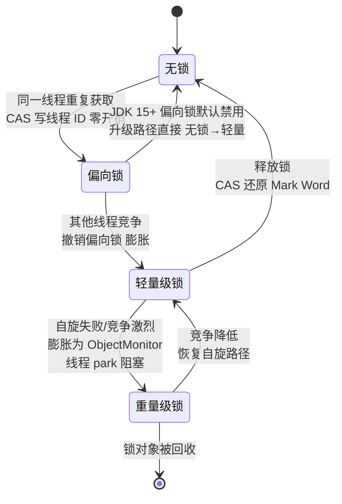
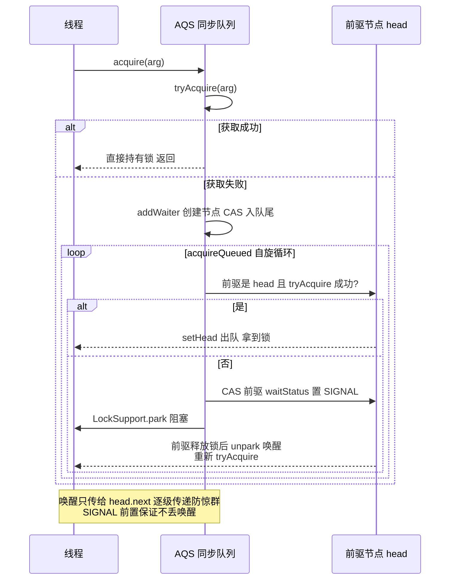
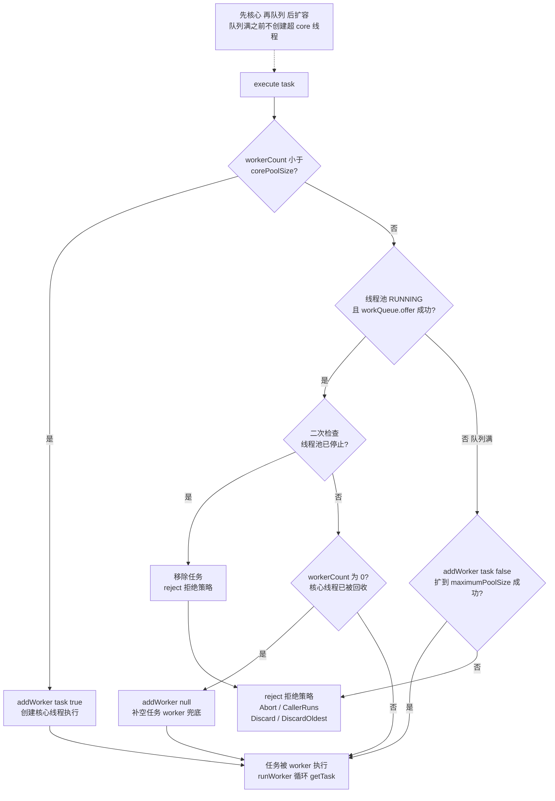
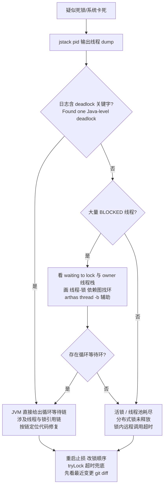

# 03 · 并发编程与 JUC 源码

> 适用对象：10+ 年经验的资深工程师 / 架构师候选人。本章要求「源码级理解」：AQS、线程池、ConcurrentHashMap 的关键流程要能徒手画出来，JMM 与锁升级要能讲清机制而不是背结论。

**TL;DR 本章学习要点**

1. JMM 三大特性（原子/可见/有序）与 happens-before 是并发推理的公理系统，DCL 为什么必须 volatile 是试金石；
2. synchronized 的完整故事是「偏向→轻量→重量」的锁升级 + JIT 的锁消除/粗化，JDK 15 后偏向锁废弃的原因要能讲透；
3. volatile 管可见性与有序性、不管原子性；CAS 管原子性但有 ABA，LongAdder 是「分段计数」思想解决 CAS 竞争；
4. AQS 是 JUC 的基石：state + CLH 变体队列 + 模板方法，ReentrantLock/CountDownLatch/Semaphore 全是它的子类，公平/非公平只是一行 tryAcquire 的差异；
5. 并发容器记住三组对比：CHM 的「CAS+锁桶头」vs 分段锁、COW 的写复制读无锁、BlockingQueue 族的一把锁/两把锁/无缓冲差异；
6. 线程池的 ctl 状态机、execute 三步流程、四种拒绝策略、动态调参要能默写；ForkJoin 工作窃取与 CompletableFuture 的 Completion 链是异步进阶；
7. 虚拟线程（JDK 21）是「阻塞即让路」的调度革命，但要分清适用场景与 pinning 陷阱；死锁排查 jstack + arthas 要形成肌肉记忆。

---

## 1. 线程基础与 JMM

### 1.1 线程状态机

```
NEW → RUNNABLE ⇄ BLOCKED（synchronized 抢锁失败）
              ⇄ WAITING（wait/join/park）
              ⇄ TIMED_WAITING（sleep/wait(timeout)/parkNanos）
     → TERMINATED
```

要点：`Thread.sleep` 不释放锁、`wait` 释放锁；`notify` 随机唤醒一个、`notifyAll` 唤醒全部；**虚假唤醒（spurious wakeup）** 是规范允许的，所以 `wait` 必须放在 `while(条件)` 循环里而不是 `if`。`interrupt` 只是设置标志位：阻塞中的线程收到标志会抛 `InterruptedException` 并清除标志，`isInterrupted()` 与 `interrupted()`（会清除标志）的区别是经典陷阱。

### 1.2 JMM：主内存与工作内存

JMM 抽象模型：每个线程有私有**工作内存**（寄存器/缓存副本），共享变量存在**主内存**。线程读写变量 = 主内存 ↔ 工作内存的拷贝同步，同步时机不受控制 → 可见性问题。JMM 的职责是定义「什么情况下一个线程的写对另一个线程可见」——即 happens-before 规则。

**happens-before 规则（面试默写清单）**：

1. 程序顺序规则：单线程内书写在前的操作 happens-before 书写在后的；
2. 管程锁规则：解锁 happens-before 后续对同一把锁的加锁；
3. volatile 规则：volatile 写 happens-before 后续对同一变量的读；
4. 线程启动规则：`Thread.start()` happens-before 该线程内任何操作；
5. 线程终止规则：线程内所有操作 happens-before 其他线程检测到它终止（join 返回）；
6. 中断规则：`interrupt()` 调用 happens-before 被中断线程检测到中断；
7. 终结器规则：对象构造完成 happens-before finalize 开始；
8. 传递性：A hb B 且 B hb C → A hb C。

**三大特性**：原子性（synchronized/atomic 类保证）、可见性（volatile/synchronized/final）、有序性（happens-before + volatile 禁止重排）。重排序来源有三层：编译器重排、CPU 指令级重排（乱序执行）、内存系统重排（store buffer）；但**数据依赖关系不会被重排**（as-if-serial）。

### 1.3 DCL 单例：为什么必须 volatile

```java
class Singleton {
    private static volatile Singleton instance;
    static Singleton get() {
        if (instance == null) {              // 第一次检查（无锁快路径）
            synchronized (Singleton.class) {
                if (instance == null) {      // 第二次检查（锁内）
                    instance = new Singleton();
                }
            }
        }
        return instance;
    }
}
```

`new Singleton()` 的三步（分配内存 → 初始化字段 → 引用赋值）中，第 2、3 步可能被重排：另一个线程第一次检查读到「非 null 但未初始化」的 instance。JDK 5 起 volatile 语义保证「volatile 写之前的初始化操作全部完成」，从而修复 DCL。**没有 volatile 的 DCL 是错的**——这是并发面试的第一道分水岭。

### 1.4 本节高频面试题

**Q1：讲一下 JMM 的 happens-before 规则，并举例它如何推导「程序正确」？**

解答：先讲清楚 JMM 是「最小保证」：只要两个操作之间有 happens-before 关系，前者的结果对后者可见且有序；没有该关系就不能假设任何顺序。举例推导：线程 A 在 synchronized 块里写共享变量后解锁，线程 B 加同一把锁后读取——由管程锁规则 + 传递性，B 必然看到 A 的写入。这就是「锁不仅管原子性，也管可见性」的理论依据，也是「加锁读不加锁写」这种错误写法的判死刑依据。

**追问**：final 字段的可见性怎么保证？——JMM 有 final 域规则：构造器内 final 字段的写入 happens-before 构造器外对该对象引用的发布（且禁止把 final 字段的写重排到构造器外）。所以「不可变对象天然线程安全」在 JMM 层面有正式保证——前提是引用安全发布（不要通过 `this` 逃逸）。

**Q2：为什么 wait/notify 必须在 synchronized 块里？**

解答：两个原因：1) **语义需要**：wait 会释放锁，调用前必须持有锁才能「释放」，否则无法实现「等待期间其他线程进入临界区」；2) **防丢失唤醒（lost wakeup）**：若 wait 不加锁，判断条件与挂起之间可能插入其他线程的 notify——条件已满足但本线程永远等下去。经典错误写法：`if (!ready) wait();` 与不加锁的 wait，都会导致丢失唤醒。这也是 JUC 里 `LockSupport.park` 不需要锁、但必须配合「条件检查与 park 的原子性」自己小心的原因（AQS 内部就是这么处理的）。

**追问**：wait 和 sleep 的区别？——wait 释放锁、依赖 notify 唤醒（或超时）、必须在同步块内；sleep 不释放锁、到点自动醒、随处可用。语义上 wait 是「协作等待条件」，sleep 是「让出 CPU 计时」。

---

## 2. synchronized 原理：Monitor 与锁升级

### 2.1 Monitor 与字节码

`synchronized` 编译为 `monitorenter` / `monitorexit`（代码块），方法级用 `ACC_SYNCHRONIZED` 标志。底层依赖 **ObjectMonitor**（HotSpot C++ 对象）：核心字段 owner（持有线程）、entryList（等待进入的阻塞队列）、waitSet（wait 的线程队列）。`wait/notify` 就是操作 waitSet 与 entryList。

### 2.2 锁升级：偏向 → 轻量 → 重量

锁状态存在对象头 Mark Word 里，升级路径（JDK 15 前）：

```
无锁 → 偏向锁（Mark Word 记录线程 ID，同一线程重入零开销）
     → 轻量级锁（竞争出现：栈帧建立 Lock Record，CAS 交换 Mark Word；自旋等待）
     → 重量级锁（自旋失败/竞争激烈：膨胀为 ObjectMonitor，线程 park 阻塞）
```

- **偏向锁**：假设「锁基本由同一线程获取」，CAS 写线程 ID 即可，重入不再有任何同步操作；撤销要等安全点（STW 停顿点），撤销成本高；
- **轻量级锁**：假设「锁竞争不激烈」，CAS 抢不到就**自适应自旋**（JDK 6 默认开），自旋失败才膨胀；
- **重量级锁**：ObjectMonitor + park/unpark，线程真正阻塞，涉及用户态/内核态切换。

**JDK 15（JEP 374）默认禁用并废弃偏向锁**：原因——1) 现代应用线程池场景下「单线程反复获取同一把锁」很少见，收益有限；2) 撤销偏向锁需要安全点 STW，撤销风暴反而制造停顿；3) 与 JIT 优化（如锁消除）冲突，维护成本高。（偏向锁代码后续版本仍保留但默认关闭，彻底移除计划待核实。）

> 图示：synchronized 锁升级状态机



### 2.3 JIT 的锁优化

- **锁消除（Lock Elision）**：逃逸分析证明对象不逃逸，synchronized 直接删掉（如 `StringBuffer` 在方法内局部使用）；
- **锁粗化（Lock Coarsening）**：相邻多次加同一把锁合并为一次，减少加解锁开销；
- 注意区分：这是 JIT 运行时优化，与代码层面的锁设计无关。

### 2.4 本节高频面试题

**Q1：synchronized 的锁升级过程？偏向锁为什么要废弃？**

解答：升级路径「偏向 → 轻量（CAS + 自旋）→ 重量（Monitor + park）」，核心思想是**乐观渐进**：根据竞争程度动态选择开销最小的方案，而不是一上来就阻塞。废弃原因从收益与成本两端讲：收益端——偏向锁只在「单线程独占锁」场景有优势，而现代服务端（线程池、多线程框架）几乎都有竞争；成本端——撤销需要安全点 STW、批量重偏向逻辑复杂、与 JIT 锁消除互相干扰，维护/风险成本超过收益。面试加分：指出 JEP 374 后锁升级路径变为「无锁 → 轻量 → 重量」，偏向锁代码路径在后续版本中保留但不可用。

**追问**：轻量级锁的自旋是无限的吗？——不是，自适应自旋：JVM 根据「上次同一锁自旋成功率」动态调整自旋次数（成功率高就多自旋），失败则膨胀为重量级锁。自旋的本质是「用 CPU 换阻塞切换成本」，单核机器上自旋无意义（JVM 会直接跳过）。

**Q2：synchronized 和 ReentrantLock 怎么选？**

解答：语义等价（都是互斥 + 可重入 + 内存屏障），差异在**能力与实现**：1) 公平性——ReentrantLock 可配公平锁，synchronized 非公平；2) 中断响应——`lockInterruptibly()` 可响应中断，synchronized 等待锁不可中断；3) 超时——`tryLock(timeout)`；4) 多条件——Condition 可多队列精确唤醒（synchronized 只有 waitSet 一个队列）；5) 性能——现代 JDK 两者差距可忽略（synchronized 有 JIT 锁消除/粗化加持）。结论：需要公平/超时/多条件用 ReentrantLock，否则 synchronized 优先（更简单、更少出错、未来还有优化空间）。

**追问**：为什么 synchronized 不可中断是问题？——死锁场景下，synchronized 的等待线程永远无法被外部唤醒，只能重启；tryLock 超时可以在死锁时「放弃重试」，是工程上防死锁的最后一道闸。

---

## 3. volatile 与 CAS

### 3.1 volatile 语义：可见性 + 有序性，不含原子性

- **可见性**：volatile 写 happens-before 后续读（JMM 规则）——写后强制刷新主内存，读前强制从主内存取；
- **有序性**：JMM 对 volatile 读写前后加内存屏障约束（编译器/CPU 层）：写前 StoreStore、写后 StoreLoad；读后 LoadLoad/LoadStore。x86 实现：volatile 写编译为带 `lock` 前缀的指令（锁总线/缓存行），天然带全屏障；
- **不保证原子性**：`volatile int i; i++` 是读-改-写三步，两个线程交错会丢更新——「volatile 不能替代 synchronized/atomic」是必考题；
- 适用场景：状态标志（`running`）、双检锁、发布不可变对象引用。

### 3.2 CAS 与 ABA

- CAS（Compare-And-Swap）：`Unsafe.compareAndSwapInt` 等，硬件指令（x86 `lock cmpxchg`）保证「比较 + 交换」原子；乐观并发：失败就循环重试；
- **ABA 问题**：值 A → B → A，CAS 认为「没变过」，但中间状态被其他线程改过（如栈顶节点被弹出又压回同地址）。解决：`AtomicStampedReference`（版本号）/ `AtomicMarkableReference`（布尔标记）；
- 原子类家族：`AtomicInteger/AtomicLong/AtomicReference`（CAS 循环）、`AtomicIntegerFieldUpdater`（字段级，省对象头）、**LongAdder**（Striped64 分段：把单个计数拆成多个 cell，写线程 CAS 自己 cell，读时 sum 汇总——高并发写吞吐远超 AtomicLong，代价是读是近似值；适合计数器/指标统计，不适合「读必须精确」的场景）。

### 3.3 本节高频面试题

**Q1：volatile 能保证原子性吗？`volatile int i` 的 `i++` 线程安全吗？**

解答：不能。`i++` 是「读 → 加 → 写」三步，volatile 只保证每一步的可见性与整体顺序约束，不保证三步之间不被其他线程插入。两个线程同时执行 10000 次 i++，结果 < 20000。线程安全写法：AtomicInteger（CAS 循环）、synchronized、或 LongAdder（计数场景）。追问陷阱：`volatile long` 的读写是原子的吗？——JMM 明确保证 volatile 的 long/double 读写原子（非 volatile 的 64 位读写规范允许拆分，HotSpot 64 位下实际不拆）。

**追问**：LongAdder 和 AtomicLong 怎么选？——写多读少、允许近似读（计数器、指标）→ LongAdder；需要强一致读或依赖返回值做逻辑（如 compareAndSet 语义）→ AtomicLong。LongAdder 的 sum 是遍历 cell 求和，并发写时结果可能略滞后。

**Q2：CAS 的 ABA 问题是什么？实际遇到过吗？**

解答：ABA = 值被其他线程从 A 改成 B 又改回 A，CAS 无法察觉「中间被修改过」，基于「值没变」的假设做出错误决策。经典场景：无锁栈/链表用 CAS 更新头指针，A 线程 CAS 前读取头节点 X，B 线程弹出 X 又压入 X（同一对象复用），A 的 CAS 成功但栈结构已变。解法：AtomicStampedReference 带版本号。实际工程中「值类型/不可变对象 + 无复用」场景 ABA 无危害，不必过度设计；但对象池、缓存复用场景必须警惕。

---

## 4. AQS 源码深度：state、CLH 变体与模板方法

### 4.1 设计骨架

`AbstractQueuedSynchronizer` 是 JUC 的基石（ReentrantLock/CountDownLatch/Semaphore/ReentrantReadWriteLock/ThreadPoolExecutor 的 Worker 都基于它）：

- **state**：`volatile int state`，语义由子类定义（重入计数/许可数/门闩计数）；
- **CLH 变体队列**：双向链表（Node：prev/next/thread/waitStatus），入队 CAS 到 tail，出队从 head 推进——相比原始 CLH，支持取消（CANCELLED）、前驱唤醒（SIGNAL）与条件队列（CONDITION）；
- **模板方法模式**：`tryAcquire/tryRelease/tryAcquireShared/tryReleaseShared/isHeldExclusively` 由子类实现，AQS 负责排队、阻塞、唤醒的公共逻辑——这就是「换一行 tryAcquire 就能造一把新锁」的原因。

### 4.2 acquire / release 完整流程（独占模式）

```
acquire(arg):
  if tryAcquire(arg) 成功 → 直接拿到锁
  else:
    addWaiter(EXCLUSIVE)      // CAS 入队尾，返回新节点
    acquireQueued(node, arg): // 核心循环
      for (;;):
        p = node.prev
        if p == head 且 tryAcquire 成功 → setHead(node)，返回（中断标志按需处理）
        shouldParkAfterFailedAcquire(p, node):
          // p.waitStatus==SIGNAL → 可以 park；==0 → CAS 置 SIGNAL 重试；CANCELLED → 跳过
        parkAndCheckInterrupt()  // LockSupport.park 阻塞，唤醒后检查中断
      // 非响应中断版：记录 interrupted 标志，拿到锁后补一次 interrupt()
      // 响应中断版（lockInterruptibly）：中断则抛 InterruptedException 并出队

release(arg):
  if tryRelease(arg) 成功:
    unparkSuccessor(head):
      // head.next 若 CANCELLED，从 tail 向前找第一个非 CANCELLED 节点
      // LockSupport.unpark 唤醒该线程
```

要点：1) **只有 head.next 被唤醒**——CLH 的「逐级传递」唤醒，避免惊群；2) park 前必须确保前驱是 SIGNAL（否则可能丢失唤醒），这是 shouldParkAfterFailedAcquire 的意义；3) 中断不直接取消排队（非响应版），保证「要么拿到锁要么继续等」。

> 图示：AQS 独占模式获取锁时序



### 4.3 公平 vs 非公平：一行之差

- **非公平（NonfairSync）**：`lock()` 先 `compareAndSetState(0, 1)` 直接抢一次，失败才走 acquire——新来的线程可以插队；
- **公平（FairSync）**：`tryAcquire` 里先查 `hasQueuedPredecessors()`（队列非空且 head.next 不是当前线程 → 让路），严格 FIFO；
- 为什么非公平吞吐更高：唤醒 head.next 有上下文切换开销，插队线程「趁热」拿到锁时锁可能刚好被释放，省一次切换；代价是尾部线程可能长期饥饿（概率性，不是必然）。

### 4.4 本节高频面试题

**Q1：手写 AQS 的 acquire 流程？为什么 park 前要把前驱置为 SIGNAL？**

解答：流程为「tryAcquire → 失败 addWaiter 入队 → 循环：前驱是 head 就再试一次 → shouldParkAfterFailedAcquire → park」。SIGNAL 的语义是「我即将 park，前驱释放锁时请唤醒我」：若前驱不是 SIGNAL 就 park，可能发生「前驱释放完锁、检查后继、发现无事可做、睡去；而我才刚 park」——唤醒事件发生在 park 之前，永远错过（lost wakeup）。所以必须先 CAS 前驱为 SIGNAL 再 park，配合「被唤醒后重新 tryAcquire」的循环，保证不会丢。

**追问**：为什么唤醒只唤醒 head.next？——CLH 队列的唤醒是逐级传递的：每个节点只负责唤醒自己的后继，避免「一次唤醒所有等待者」的惊群效应（thundering herd）。被唤醒节点拿到锁后成为新 head，再唤醒它的后继。这是 CLH 队列相比「单一等待队列 + notifyAll」的 scalability 优势。

**Q2：公平锁和非公平锁的性能差异？为什么非公平反而快？**

解答：非公平锁的插队设计减少了「唤醒开销的浪费」：公平锁下，锁释放 → 唤醒 head.next（上下文切换）→ 新线程抢锁，若此刻锁已被释放但唤醒还没完成，锁处于「空闲但无人可用」的窗口期；非公平允许新线程直接抢占这个窗口。所以高竞争下非公平锁吞吐更高（减少切换次数），代价是等待线程的公平性/潜在饥饿。ReentrantLock 默认非公平就是这个权衡。面试加分：指出「非公平不保证饥饿」——插队线程很快拿到锁就会让出，极端情况下才可能饿死。

**追问**：AQS 的共享模式（acquireShared）和独占模式什么区别？——共享模式获取成功后**会继续唤醒后继**（传播传播性），适合「许可数 >1」的 Semaphore 和 CountDownLatch（计数到 0 要唤醒所有等待者）；独占模式只有一个 owner，唤醒只传给 head.next。ReentrantReadWriteLock 的读锁就是共享模式、写锁是独占模式。

---

## 5. 锁家族：ReentrantLock / ReentrantReadWriteLock / StampedLock / Condition

### 5.1 ReentrantLock：state 计数实现可重入

- 可重入 = `tryAcquire` 里「state == 0 抢锁；state > 0 且 owner 是自己 → state+1」；`tryRelease` 每次 -1，减到 0 才真正释放——重入 N 次必须解锁 N 次，否则锁不释放（经典 bug）；
- `isHeldExclusively` 判断 owner 是否当前线程。

### 5.2 ReentrantReadWriteLock：state 拆两半

- **state 高 16 位 = 读锁计数，低 16 位 = 写锁重入计数**——一个 int 装两把锁；
- 读锁共享获取（多个读线程可同时持有）、写锁独占；
- **锁降级**：持有写锁时获取读锁是允许的（写 → 读降级，防止「读到自己没写完的数据」）；**锁升级（读 → 写）会死锁**——两个读线程都想升级，互相等对方释放读锁；
- 适用：读多写少且读操作较重的场景；写少但频繁时读锁的 CAS 竞争也很可观。

### 5.3 StampedLock：乐观读的野心

- JDK 8 引入，三种模式：**写锁**、**悲观读锁**、**乐观读（tryOptimisticRead）**；
- 乐观读不真正加锁：拿到 stamp → 读数据 → `validate(stamp)` 校验期间有无写发生；有则重试或升级悲观读；
- 优势：读读场景零锁开销（连读锁的原子计数都省了），适合「读多写极少且读操作快」；
- 限制：**不可重入**、不支持 Condition、乐观读校验失败要重读（写频繁场景会退化）；
- 实现要点：state 用位标记写锁占用，写锁获取失败先自旋（有限次）再阻塞，读锁用「读节点链表」记录等待者（不适用 AQS 的共享计数，因为要支持乐观读）。

### 5.4 Condition：精确唤醒的等待队列

- `Condition.await/signal` 对应 `wait/notify`，但每个 Lock 可创建**多个 Condition**（生产者/消费者各一个队列），实现精确唤醒（如「队列满只唤醒生产者」），避免 notifyAll 惊群；
- 实现：每个 Condition 一条单向等待队列（nextWaiter 链接）；`await` = 入条件队列 → 释放 state → park；`signal` = 把条件队列头节点转移到 AQS 同步队列（transferForSignal）→ 由 AQS 正常唤醒——**两个队列的转移**是理解 Condition 的关键；
- 陷阱：await 后条件可能仍不满足（虚假唤醒 + 多等待者），必须 while 循环重查。

### 5.5 本节高频面试题

**Q1：ReentrantReadWriteLock 的锁降级和锁升级分别是什么？为什么升级会死锁？**

解答：降级 = 持写锁时获取读锁再释放写锁（保证后续读看到的是自己写完的数据，且期间不被其他写者插入）；升级 = 持读锁时获取写锁——两个读线程同时升级时，各自持有读锁等待对方释放（写锁需要所有读锁释放），互相等死。所以 ReadWriteLock 只支持降级不支持升级。工程启示：需要「先读后写」的原子语义时，要么直接用写锁，要么用 StampedLock 的乐观读 + 升级路径（先乐观读，写冲突时获取写锁重读）。

**追问**：读多写少就一定适合 ReadWriteLock 吗？——不一定：1) 读操作很快时，读写锁的原子计数与 CAS 竞争可能比 synchronized 更贵；2) 写线程频繁时读线程饿死（默认非公平，写优先）；3) 高并发读场景，StampedLock 乐观读或无锁方案（COW、CopyOnWriteArrayList）可能更优。选型要看「读写比例 + 临界区时长」。

**Q2：Condition 和 wait/notify 的本质区别？**

解答：1) **队列维度**：wait/notify 只有一条 waitSet，notifyAll 唤醒所有（惊群 + 无差别竞争）；Condition 每个条件一条队列，signal 只唤醒该条件的等待者（如「队列有空间」条件只唤醒生产者）；2) **中断**：await 可响应中断/超时（awaitNanos）；3) **灵活性**：一个 ReentrantLock 可配多个 Condition，synchronized 一个 monitor 只有一个等待集。实现层面，Condition 等待队列与 AQS 同步队列是两个队列，signal 做「转移」而非直接唤醒，保证了唤醒时锁状态一致。

---

## 6. 同步工具：CountDownLatch / CyclicBarrier / Semaphore / Exchanger

| 工具 | 原理（都是 AQS 子类） | 一次性 | 用途 |
|---|---|---|---|
| CountDownLatch | state = 计数，countDown 减 1，减到 0 释放所有等待者（共享模式传播唤醒） | 是 | 主线程等 N 个任务完成（并行初始化、压测并发起点） |
| CyclicBarrier | 不是 AQS！基于 ReentrantLock + Condition，所有线程 await 齐了放行，可重置复用 | 否 | 多线程分阶段协同（如多阶段计算，每阶段齐步走） |
| Semaphore | state = 许可数，acquire 减、release 加，可配公平 | 否 | 限流（连接数、并发数上限） |
| Exchanger | 两线程交换数据：Node 槽位 + CAS，先到的挂起等配对 | 否 | 双缓冲交替（生产者填 A 消费者读 B，交换） |

关键区分（高频）：**CountDownLatch 是「数数」**——等的是「事件发生 N 次」，参与者 countDown 完就走，不可重置；**CyclicBarrier 是「集合」**——等的是「N 个线程都到达」，人到齐了一起放行，可循环使用，且支持 barrierAction（人到齐后先执行的动作）。Semaphore 是「资源配额」，acquire 拿不到就等。

### 6.1 本节高频面试题

**Q1：CountDownLatch 和 CyclicBarrier 的区别？各自适用场景？**

解答：语义上：Latch 是「计数器归零」事件，等待者与计数者解耦（计数者 countDown 后继续干自己的事）；Barrier 是「栅栏集合」，所有参与者必须同时到达才能继续，且参与者会互相等待。实现上：Latch 基于 AQS 共享模式（state 减到 0 传播唤醒），Barrier 基于 ReentrantLock + Condition（最后一个到达的线程触发放行 + 重置）。场景：Latch → 主线程聚合多个异步任务结果、压测同时开跑；Barrier → 分阶段并行计算（每阶段结束对齐）、多线程写入后统一提交。面试陷阱：说「Barrier 也是 AQS 实现的」会暴露没看过源码——它内部用的是 Lock + Condition。

**追问**：await 超时/中断时 Barrier 会怎样？——任一参与者 await 超时或中断，栅栏进入 broken 状态，其他所有等待线程抛 BrokenBarrierException——这是「协同任务」的失败传播设计：一个人掉队，整组作废重来，而不是各自卡死。

**Q2：Semaphore 实现限流有什么坑？**

解答：1) 公平性：默认非公平，饥饿场景要 new Semaphore(n, true)；2) **release 不校验持有**：任何线程都能 release 增加许可，必须确保「谁 acquire 谁 release」（try-finally）；3) 只能限「进入临界区的并发数」，限不住「进入后的执行时长」——长任务场景 QPS 控制要靠别的（如令牌桶 RateLimiter）；4) 分布式场景 Semaphore 只在本进程有效，跨实例限流要用 Redis/网关。面试加分：指出 Semaphore 可作「连接池信号量」模式——acquire 拿许可、用连接、finally release。

---

## 7. 并发容器：ConcurrentHashMap / COW / BlockingQueue 族

### 7.1 ConcurrentHashMap：JDK 8 的 CAS + 锁桶头

JDK 7 用**分段锁**（Segment 数组，每段一把锁，默认 16 段）；JDK 8 重构：

- **结构**：Node 数组 + 链表/红黑树，锁粒度细化为**单个桶头节点**（synchronized 锁住桶头），空桶用 **CAS** 直接插入（无锁路径）；
- **putVal 流程**：计算 hash → 空桶 CAS 插入 → 非空 synchronized(桶头) 插入链表/树 → 链表长度 ≥8 且数组 ≥64 时树化（红黑树，防 hash 冲突退化）；<6 退化为链表；
- **扩容**：多线程**协助扩容**——transfer 阶段旧桶迁移后放 ForwardingNode 标记，新线程 put 遇到 ForwardingNode 会加入迁移（sizeCtl 负数表示扩容中，低位移位记录参与线程数）；
- **size()**：baseCount + CounterCell 数组（高并发下分散计数，读时求和，近似值）；
- **弱一致性迭代器**：遍历不抛 ConcurrentModificationException，可能看到遍历开始后的修改（也可能看不到）——这是「弱一致」的含义；
- **不允许 null key/value**（区别于 HashMap）：因为并发下无法区分「值为 null」与「不存在」（get 返回 null 无法判断，而 containsKey 检查在并发下不可靠）；
- 其他要点：get 无锁（Node 的 val/next 是 volatile）、LongAdder 式计数、树节点 TreeBin 头节点锁。

### 7.2 CopyOnWriteArrayList：写复制、读无锁

- 写（add/remove）：加锁 → **复制整个数组** → 修改副本 → 替换 volatile array 引用；读（get）：直接读 array，无锁；
- 适用：**读多写极少**（配置列表、监听器列表）；迭代器是快照（弱一致），迭代期间修改不可见；
- 代价：每次写 O(n) 复制，写频繁时内存与 GC 压力大。

### 7.3 BlockingQueue 族对比

| 队列 | 结构 | 锁模型 | 有界性 | 特点/用途 |
|---|---|---|---|---|
| ArrayBlockingQueue | 数组环形 | **一把锁 + notEmpty/notFull 两个 Condition** | 有界（必须） | 公平可配；有界队列首选 |
| LinkedBlockingQueue | 链表 | **两把锁**（takeLock/putLock 各带 Condition） | 默认无界 | 读写互不阻塞；Executors 工厂的坑源 |
| SynchronousQueue | 无缓冲 | 公平 TransferQueue / 非公平 TransferStack | 天然 0 | 直接交接，CachedThreadPool 用它 |
| PriorityBlockingQueue | 二叉堆 | 一把锁 | 无界 | 按优先级出队；任务调度 |
| DelayQueue | PriorityQueue + 延迟 | 一把锁 + Condition | 无界 | 到期才可取；定时任务调度（ScheduledThreadPoolExecutor 用 DelayedWorkQueue，同思路） |
| LinkedTransferQueue | 链表 | 无锁（CAS） | 无界 | transfer 直接交接，SynchronousQueue 增强版 |

选型口诀：有界 + 公平 → ArrayBlockingQueue；吞吐优先 + 可无界 → LinkedBlockingQueue；生产者消费者直连交接 → SynchronousQueue/LinkedTransferQueue；优先级/延迟 → Priority/Delay。

### 7.4 本节高频面试题

**Q1：ConcurrentHashMap 为什么 JDK 8 放弃分段锁？**

解答：四个理由：1) **锁粒度**：分段锁粒度是「一段」（含多个桶），锁桶头是「一个桶」，并发度更高；2) **内存**：Segment 继承 ReentrantLock，每段一个锁对象 + 数组，内存开销大；3) **退化防御**：JDK 8 引入红黑树，hash 冲突严重时链表 O(n) 退化为树 O(log n)，分段锁方案没有；4) **实现简化**：CAS + synchronized 组合（空桶 CAS 无锁、非空锁桶头）代码路径更清晰。面试加分：JDK 8 的 get 完全无锁（volatile 读），JDK 7 的 get 也要过 Segment 锁——读路径差异是性能提升的另一来源。

**追问**：为什么链表长度 ≥8 且数组长度 ≥64 才树化？——8 是泊松分布经验值：随机 hash 下链表长度到 8 的概率极低（约千万分之一），达到 8 说明 hash 分布出问题（如 key 的 hashCode 低劣），此时树化防退化；数组 <64 时优先扩容（扩容能重新散列，可能直接解决冲突，比树化便宜）。退化为链表阈值 6 留了 2 的缓冲，避免树/链表在临界点反复横跳。

**Q2：BlockingQueue 的 put 和 offer 有什么区别？Executors 的坑和它们什么关系？**

解答：put 阻塞等待容量（可中断），offer 立即返回 boolean（offer(timeout) 限时）。Executors 的坑：`newFixedThreadPool` 用**无界 LinkedBlockingQueue**——任务只进不出时队列无限膨胀 → OOM；`newCachedThreadPool` 用 SynchronousQueue——任务直接交接给线程，线程不够就**新建线程**（最大 Integer.MAX_VALUE）→ 线程数失控 OOM。教训：生产线程池必须自定义有界队列 + 明确拒绝策略（详见第 8 节）。

**追问**：ArrayBlockingQueue 和 LinkedBlockingQueue 谁吞吐高？——Linked 两把锁，put 与 take 可并行，吞吐通常更高；Array 一把锁但数组连续、GC 友好、可指定公平。选型：需要严格有界 + 公平 → Array；追求吞吐且可接受无界风险 → Linked（生产上仍建议显式设容量）。

---

## 8. ThreadPoolExecutor 源码：状态机、流程与调参

### 8.1 七参数与 ctl 状态机

```java
ThreadPoolExecutor(corePoolSize, maximumPoolSize, keepAliveTime, unit,
                   workQueue, threadFactory, handler)
```

- **ctl**：一个 int 装两个状态——高 3 位 runState + 低 29 位 workerCount（`Integer.SIZE - 3`）；
- 状态机：`RUNNING → SHUTDOWN（不接受新任务，处理队列）→ STOP（中断并丢弃队列）→ TIDYING（worker 归零）→ TERMINATED`；数值上 RUNNING < SHUTDOWN < STOP < TIDYING < TERMINATED，所以「状态比较」用 ctl 直接比大小。

### 8.2 execute 三步流程（默写）

```
execute(task):
  1. workerCount < corePoolSize → addWorker(task, true)   // 先开核心线程
  2. 否则 isRunning && workQueue.offer(task) 成功：
       二次检查（double-check）：线程池已停 → 移除任务 + reject；
       worker 数为 0（核心线程被回收）→ 补一个空任务 worker 兜底
  3. 入队失败（队列满）→ addWorker(task, false)  // 扩到 maximum
       仍失败 → reject(task)                     // 拒绝策略
```

要点：**先核心、再队列、后扩容**——队列满之前不会创建超过 core 的线程；核心线程空闲默认不回收（allowCoreThreadTimeOut(true) 可回收）。

**addWorker/runWorker**：addWorker 创建 Worker（继承 AQS，用于「锁住线程防止被中断」）并 start；runWorker 循环 `getTask()`：阻塞 take 或超时 poll（keepAliveTime），取到就执行，`beforeExecute/afterExecute` 钩子供监控。**Worker 继承 AQS 的原因**：shutdownNow 要中断 worker，但「正在执行任务的线程不能被中断」，用 AQS 锁（worker 执行任务时持有锁）保证中断只在空闲时生效。

**四种拒绝策略**：

| 策略 | 行为 | 适用 |
|---|---|---|
| AbortPolicy（默认） | 抛 RejectedExecutionException | 不能丢任务的场景（报警兜底） |
| CallerRunsPolicy | 调用者线程直接执行 | 降速背压（慢下来比丢任务好） |
| DiscardPolicy | 静默丢弃 | 可丢任务（日志/指标） |
| DiscardOldestPolicy | 丢弃队头最老任务 | 任务有时效性（最新优先） |

> 图示：ThreadPoolExecutor.execute 完整流程



### 8.3 合理配置与动态线程池

- **CPU 密集**：core ≈ CPU 核数 + 1（+1 防线程偶发阻塞空转）；
- **IO 密集**：core ≈ CPU 核数 × (1 + 等待时间/计算时间)（经验 2N 起步，按压测校准）；
- 队列：有界（容量按「峰值积压容忍度」估），拒绝策略选 CallerRuns 或自定义（报警 + 降级）；
- **动态线程池**（美团方案）：参数配置中心化，运行期 setCorePoolSize/setMaximumPoolSize（setCorePoolSize 会立即调整存活 worker 数）、队列容量动态化较难（LinkedBlockingQueue 容量是 final，可用自研可变容量队列）；配合监控（activeCount、queue.size、拒绝次数）自动伸缩；
- Executors 工厂的坑（见 7.4）；线程工厂必须命名（排查 jstack 时「哪个池的线程」一目了然）。

### 8.4 ForkJoinPool：分治 + 工作窃取

- 每个 worker 一个**双端队列**：本地任务从**队尾**取（LIFO，缓存友好），空闲 worker 从别人队**头**偷（FIFO，减少竞争）——**工作窃取（work-stealing）**；
- 适合 CPU 密集的分治任务（RecursiveTask/RecursiveAction）；`commonPool` 是全局共享实例（并行度 = CPU - 1），CompletableFuture 默认用它；
- 不适合：IO 密集（任务阻塞时窃取机制失效）、任务粒度太小（窃取开销占比高）。

### 8.5 CompletableFuture：Completion 链

- `supplyAsync/runAsync`（默认 commonPool，可传 Executor）；`thenApply/thenCompose/thenCombine/whenComplete/exceptionally/handle/allOf/anyOf`；
- **原理**：每个依赖操作包装成 Completion 节点，前序完成时触发（tryFire）后续节点，结果沿依赖链传播；异常默认「吞掉」（除非 exceptionally/handle 显式处理）——**异常静默丢失是 CompletableFuture 第一大坑**；
- 回调执行线程不确定（完成线程/池线程/调用线程都可能），依赖「回调里不能有线程假设」；
- 默认 commonPool 被阻塞任务拖垮的问题：IO 类任务务必传自定义线程池。

### 8.6 本节高频面试题

**Q1：线程池 execute 的完整流程？为什么入队后还要二次检查？**

解答：三步流程（先核心 → 入队 → 扩最大 → 拒绝）见上文。二次检查的必要性：`workQueue.offer` 成功与「任务真正被执行」之间有空窗——1) 入队瞬间线程池可能已 shutdown（任务会永远滞留队列），要移除并拒绝；2) 核心线程可能刚好全部消亡（如 allowCoreThreadTimeOut 场景），队列里有任务却无人执行，要补一个空任务 worker。这是「并发下先做后验」的典型防御，答出这层说明真读过源码。

**追问**：Worker 为什么要继承 AQS？——shutdownNow 需要中断所有 worker，但「正在执行用户任务的线程」中断会导致任务异常；Worker 在执行任务时持有 AQS 独占锁，shutdownNow 先 tryLock 抢锁（抢不到说明在干活，跳过），空闲 worker 抢得到锁 → 中断。用 AQS 而不是 synchronized 是因为 tryLock 非阻塞探测，synchronized 无法「试一下」。

**Q2：corePoolSize 和 maximumPoolSize 怎么配？队列满时为什么先拒绝而不是扩到最大？**

解答：配置分场景（CPU 密集 N+1 / IO 密集 2N 起步，压测校准），核心思想是「核心线程扛常态流量、队列吸收抖动、最大线程扛峰值、拒绝策略兜底」。先入队后扩容的顺序是刻意的：突然的流量尖峰用队列缓冲（不增加线程），持续超载才扩线程（线程是昂贵资源）——如果先扩线程，短促尖峰会导致线程数暴涨后难以回落。面试加分：说明 keepAliveTime 是「扩出来的线程空闲多久回收」、核心线程默认不回收（allowCoreThreadTimeOut 可配）。

**追问**：线程池满了，任务到底该拒绝还是排队？——取决于任务的「延迟敏感性」：可容忍排队 → 大队列 + AbortPolicy（报警）；不可容忍延迟 → 小队列 + CallerRunsPolicy（天然背压，让调用方慢下来）或自定义「丢弃最旧 + 记录」。拒绝策略不是「最后手段」而是「系统保护设计」的一部分，生产上要监控拒绝次数并告警。

**Q3：ForkJoinPool 的工作窃取为什么能提升吞吐？CompletableFuture 有什么隐藏坑？**

解答：工作窃取解决「分治任务负载不均」：固定分片时有的 worker 早早干完闲置、有的还在忙，窃取让空闲 worker 偷别人的任务，最大化 CPU 利用率；本地 LIFO + 窃取 FIFO 的组合减少了对同一个队列的竞争。CompletableFuture 的坑：1) 异常默认静默（必须 exceptionally/handle）；2) 默认 commonPool 是全局共享的，阻塞型回调会拖垮所有依赖它的异步任务（务必自定义线程池）；3) 回调线程不确定，不能依赖 ThreadLocal（如 traceId 会丢——这是线上排查的经典坑）；4) allOf 的返回要自己处理每个 future 的异常。

---

## 9. 虚拟线程与结构化并发

### 9.1 虚拟线程原理（JDK 21 转正，JEP 444）

- **模型**：虚拟线程是 JVM 管理的轻量线程，运行在**载体线程（carrier，平台线程）**上；数量可百万级，每个虚拟线程只有栈帧等少量堆内存；
- **调度**：虚拟线程执行到阻塞操作（IO、锁、sleep）时自动 **unmount**（栈从载体线程拷贝/保存），载体线程转而运行其他虚拟线程；阻塞结束再 **mount** 回去——「阻塞即让路」，底层是 jdk.internal.vm.Continuation（可暂停/恢复的栈）；
- **对比线程池**：线程池是「复用有限平台线程 + 队列」；虚拟线程是「海量任务每个一条虚拟线程，阻塞时让出载体」——IO 密集场景吞吐提升一个量级，且**代码保持同步写法**（不用回调/异步），这是它最大的价值；
- **适用**：IO 密集（HTTP 客户端、数据库访问、消息消费）；**不适用**：CPU 密集（无收益）、持有锁时阻塞（见 pinning）、native 调用；
- **pinning 陷阱**：虚拟线程在 synchronized 块内阻塞时不会 unmount（锁与载体线程绑定，JDK 21 行为）——大量虚拟线程卡在 synchronized 上会占满载体线程；**JDK 24 的 JEP 491 解决了 synchronized 导致的 pinning**；ReentrantLock 无此问题（推荐新代码用）；
- 使用方式：`Thread.ofVirtual().start()`、`Executors.newVirtualThreadPerTaskExecutor()`（替代 CachedThreadPool 的高并发场景）。

### 9.2 结构化并发（StructuredTaskScope）

- 问题：CompletableFuture/线程池的并发任务是「游离」的——主线程无法统一管理子任务生命周期、取消与错误聚合；
- 方案：`StructuredTaskScope`（JDK 21 孵化 JEP 453，历经多次孵化，转正版本待核实）——任务在代码块内创建、块结束必须全部完成（或取消），子任务异常聚合到父任务；类似「并发版的 try-with-resources」；
- 价值：生命周期结构化 → 资源不泄漏（不会忘记关闭子任务）、错误传播确定（子任务失败 → 父任务快速失败）、取消统一（父取消 → 子全取消）。

### 9.3 本节高频面试题

**Q1：虚拟线程和线程池的本质区别？哪些场景该用虚拟线程？**

解答：线程池的核心假设是「线程昂贵、必须复用」，所以用「有限线程 + 任务队列」匹配「任务数 >> 线程数」；虚拟线程把线程成本降到「栈内存」级别，假设变成「每个任务一条线程」，阻塞时不占载体线程（unmount），所以 IO 密集的「每请求一线程」同步模型重新变得可行且高效——不需要异步化改造就获得高并发。适用：网关/Web 服务（大量 IO 等待）、批量调用外部服务、消息消费；不适用：CPU 密集计算（载体线程照样被占满）、synchronized 重锁代码（JDK 21 pinning，JDK 24 JEP 491 修复）、需要精确控制线程数量的场景。

**追问**：虚拟线程有线程池吗？——有：`Executors.newVirtualThreadPerTaskExecutor()` 本质是「每任务一条虚拟线程」的调度器，不缓存线程；虚拟线程的调度由 JVM 的调度器（ForkJoinPool 载体）完成，用户不需要也不应该手动池化虚拟线程——池化虚拟线程是反模式（它本来就便宜）。

**Q2：什么是 pinning？为什么 JDK 24 之前 synchronized 会 pin 住虚拟线程？**

解答：pinning = 虚拟线程被「钉」在载体线程上无法卸载。原因：synchronized 锁在 JDK 21 的实现里与载体线程绑定（monitor 记录载体线程身份），虚拟线程在 synchronized 块内阻塞时无法 unmount，只能占着载体线程等锁——大量虚拟线程同时卡在 synchronized 上时，载体线程耗尽，吞吐断崖。缓解（JDK 21 时代）：1) synchronized 块内不做阻塞 IO；2) 用 ReentrantLock 替代；3) 限制锁竞争。JDK 24 JEP 491 重构了 monitor 的持有者表示（改为可挂起的锁状态），从根上消除 synchronized pinning。

---

## 10. 死锁与并发 Bug 排查

### 10.1 死锁四条件与排查

死锁四必要条件：互斥、持有并等待、不可剥夺、循环等待。排查命令：

1. `jstack <pid>`：直接输出 "Found one Java-level deadlock" 及涉及线程与锁的引用链（JVM 内置检测）；
2. **arthas `thread -b`**：找出阻塞其他线程的线程（含锁持有者），比翻 jstack 快；
3. 活锁/饥饿：jstack 看大量 BLOCKED 线程的 "waiting to lock" 与 owner 线程在干什么；
4. 数据库死锁：`SHOW ENGINE INNODB STATUS` 的 LATEST DETECTED DEADLOCK 段——**JVM 锁 + 数据库锁混合死锁**是分布式系统高频案例（先拿 JVM 锁再拿 DB 锁，另一个线程反序）。

> 图示：死锁排查流程



### 10.2 经典案例与预防

**案例 A（锁顺序）**：转账 A→B 与 B→A 同时发生，各自持有对方要的账户锁——修复：全局锁顺序（按账户 id 排序加锁）或 tryLock 超时；
**案例 B（线程池嵌套）**：线程池任务内提交任务到**同一个已满的池**并 join 等待——池满 + 互相等待 = 假死；修复：拆分线程池（父子池隔离）或禁止池内同步等待；
**案例 C（分布式锁）**：Redis 分布式锁未设过期时间 + 业务长时间持有 → 锁永久占用；修复：锁超时 + 续期（Redisson watchdog 思路）；
**案例 D（静态锁顺序 + 回调）**：A 持有锁调 B 的回调，B 的回调反过来要 A 的锁——修复：回调移出锁范围。

**预防清单**：统一锁顺序、缩小锁范围、优先并发容器/原子类、避免嵌套锁、tryLock 超时兜底、锁内不做 IO/远程调用、代码评审专门查「锁内调用外部」。

### 10.3 本节高频面试题

**Q1：线上疑似死锁，完整排查流程？**

解答：1) `jstack <pid> > dump.txt` 搜 "deadlock" 关键字（JVM 会直接给出循环等待链）；2) 没有 deadlock 字样但有大量 BLOCKED → 用 `jstack` 看每个 BLOCKED 线程的 "waiting to lock <0x...>" 与 owner 线程栈，画出「线程 → 锁」依赖图找环；3) arthas `thread -b` 快速定位「谁锁住了别人」；4) 数据库死锁看 InnoDB 状态；5) 修复：先重启止损 → 按依赖图改代码（锁顺序/超时）→ 灰度验证。面试加分：强调「先看最近变更」——死锁代码通常刚上线不久，git diff 往往直接命中。

**追问**：jstack 里没显示 deadlock 但系统卡死，还可能是什么？——1) **活锁**：线程都在 RUNNABLE 但互相让路，永远不前进；2) 线程池耗尽（池满 + 队列满 + 拒绝策略静默丢弃，业务看起来「卡住」）；3) 分布式锁未释放导致远程等待；4) 锁内做远程调用超时（锁被长时间持有，不是死锁但症状相似）。排查思路不变：线程栈 + 依赖图 + 调用链，但结论要按证据区分。

**Q2：如何从设计上避免死锁？**

解答：四条件破坏任一即可：互斥（用读写锁/无锁结构降低互斥范围）、持有并等待（一次性获取所有资源，如按 id 排序后统一加锁）、不可剥夺（tryLock 超时放弃）、循环等待（全局锁顺序约定——最实用）。工程规范：锁内不调外部（IO/远程/嵌套锁）、锁粒度最小化、能用并发容器就不手动加锁、死锁检测兜底（超时 + 告警）。资深视角补充：**锁的「获取顺序」要写进设计文档**，多团队协作时这是隐性契约，违反它是最常见的死锁来源。

---

## 11. 考点速查表

| 考点 | 一句话要点 |
|---|---|
| JMM 三大特性 | 原子性/可见性/有序性，happens-before 是推理公理 |
| happens-before | 程序序/管程锁/volatile/start/join/中断/传递性 |
| DCL 单例 | 必须 volatile 防构造重排发布，JDK5+ 语义修复 |
| wait/notify | 必须在 synchronized 内；while 循环防虚假唤醒 |
| 锁升级 | 偏向→轻量(CAS+自旋)→重量(Monitor)；JDK15 废弃偏向锁 |
| 锁消除/粗化 | JIT 层优化：逃逸分析消锁、相邻加锁合并 |
| volatile | 可见性+有序性，不保证原子性，x86 用 lock 前缀 |
| CAS | 硬件 cmpxchg；ABA 用 AtomicStampedReference |
| LongAdder | 分段 cell 计数，写吞吐高、读近似 |
| AQS | state + CLH 变体队列 + 模板方法，JUC 基石 |
| AQS 唤醒 | 只唤醒 head.next 防惊群；SIGNAL 前置防丢唤醒 |
| 公平/非公平 | 非公平先 CAS 抢一次，吞吐高可能饥饿 |
| ReadWriteLock | state 高 16 位读/低 16 位写；只降级不升级 |
| StampedLock | 乐观读零锁开销，不可重入，写频繁会退化 |
| Condition | 每条件一条等待队列，signal 转移节点到同步队列 |
| CountDownLatch vs CyclicBarrier | 数事件(一次性) vs 集合并发(可复用)；后者基于 Lock+Condition |
| ConcurrentHashMap | CAS 空桶 + synchronized 锁桶头；8/64 树化；弱一致迭代 |
| COW 容器 | 写复制读无锁，读多写极少场景 |
| BlockingQueue | Array 一把锁两条件；Linked 两把锁；Synchronous 无缓冲 |
| 线程池流程 | 先核心→入队(二次检查)→扩最大→拒绝 |
| 线程池状态机 | ctl 高 3 位状态 + 低 29 位 workerCount |
| 拒绝策略 | Abort/CallerRuns(背压)/Discard/DiscardOldest |
| 动态线程池 | 配置中心驱动 setCorePoolSize，监控驱动伸缩 |
| ForkJoinPool | 工作窃取：本地 LIFO、偷取 FIFO，CPU 密集分治 |
| CompletableFuture | Completion 链传播；异常默认静默；回调线程不确定 |
| 虚拟线程 | JDK21 转正；阻塞即 unmount；IO 密集革命 |
| pinning | synchronized 阻塞钉住载体线程；JDK24 JEP491 修复 |
| 结构化并发 | StructuredTaskScope：生命周期结构化+统一取消 |
| 死锁排查 | jstack deadlock 关键字；arthas thread -b；四条件预防 |
