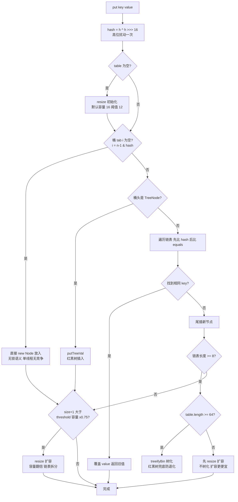
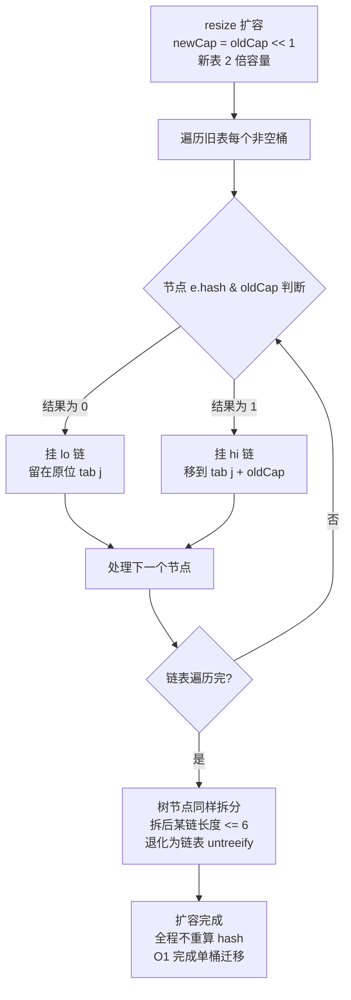
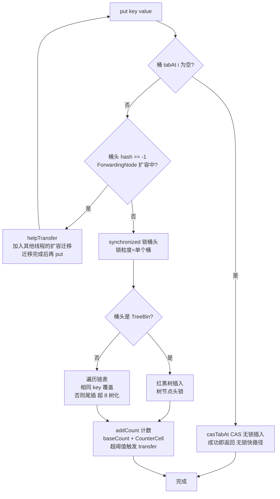
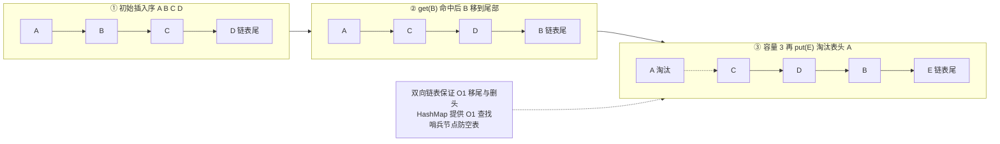

# Java 集合框架源码深度（资深向）

> 面向 10+ 年经验的资深工程师/架构师候选人。拒绝罗列 API，聚焦底层数据结构、扩容策略、并发语义边界与工程踩坑。源码分析基于 JDK 8 公开实现（JDK 8 是面试默认语境），差异处注明版本。

## 本章 TL;DR 学习要点

- 集合源码题 90% 围绕 HashMap/ConcurrentHashMap 展开，必须能手写 put/get/resize 主流程，并讲清 1.7→1.8 每处改动的动机。
- fail-fast 靠 modCount，fail-safe 的本质是弱一致性迭代器——"弱一致"三个字能讲透，就拉开了与初级候选人的差距。
- 三组必须能推导的数字：负载因子 0.75、树化 8/退化 6、容量 2 的幂。背答案和会推导，面试表现完全不同。
- 扩容（resize）是所有集合的命门：ArrayList 的拷贝、HashMap 的 rehash/链表拆分、CHM 的多线程协助 transfer，一条线串起来记。
- 手写 LRU（LinkedHashMap 版 + 双向链表版）、手写阻塞队列生产者消费者，是资深岗高频代码题。

---

## 一、总览：集合体系、fail-fast 与工具类

### 1.1 集合体系图

```
                        Iterable
                           |
                      Collection                      Map
              /      |      |      \                   |
           List    Set     Queue   Deque        HashMap  LinkedHashMap
          /    \    |       |        |           TreeMap  ConcurrentHashMap
   ArrayList LinkedList  HashSet  ArrayDeque      Hashtable  ConcurrentSkipListMap
    Vector   (双向链表)   TreeSet   PriorityQueue
    Stack              LinkedHashSet
                       CopyOnWriteArraySet
```

- `List`：有序可重复，随机访问/插入删除各有侧重；`Set`：去重，底层借道 Map（HashSet 内部就是一个 HashMap，TreeSet 内部是 TreeMap）；`Queue/Deque`：FIFO/双端，Java 6 起 `Deque` 官方建议取代 `Stack`。
- `Map` 三大家族：`HashMap`（散列，无序）、`TreeMap`（红黑树，有序）、`ConcurrentHashMap`（并发）。`Hashtable` 是历史遗留，全表锁，已被 CHM 取代。

### 1.2 fail-fast 与 fail-safe

- **fail-fast（快速失败）**：`ArrayList/HashMap` 等非并发容器，迭代时检测 `modCount`（结构性修改计数）与迭代器持有的 `expectedModCount` 不一致，立即抛 `ConcurrentModificationException`。注意：`modCount` 只记录结构修改（add/remove/clear），`set` 不改变结构、不触发。
- **坑点**：单线程下 `list.remove()` 用迭代器自身的 `remove()` 才安全（它会同步 expectedModCount）；`for-each` 里删除必炸。
- **fail-safe（安全失败）**：`CopyOnWriteArrayList` 迭代器基于**创建时的快照数组**，遍历期间任何修改都不可见——这是"弱一致性"，不是"安全"。`ConcurrentHashMap` 的迭代器同样弱一致：不抛 CME，但可能读不到刚 put 的数据，size 也是近似值。
- 面试官视角：能说出"fail-safe 容器遍历时读到的是旧数据、size 不准、不能用于强一致场景"才算真懂。

### 1.3 Arrays / Collections 工具类

- `Arrays.sort`：基本类型用双轴快排（DualPivotQuicksort），对象类型用 TimSort（归并+插入结合，稳定、利用有序片段）；`Collections.sort` 底层就是 `List.sort` → TimSort。
- `Arrays.asList` 的坑：返回的是**固定长度**的内部类 `Arrays$ArrayList`，`add/remove` 抛 `UnsupportedOperationException`，且与源数组共享内存（改数组元素会反映到 list）。
- `Collections.emptyList()` 返回单例，只读；`Collections.unmodifiableList` 是包装器，任何修改抛异常，但**只挡一层**——元素对象本身仍可改。
- `Collections.synchronizedMap`：全表锁（锁 this），并发度与 Hashtable 同级，仅剩的用途是包装遗留代码。

### 高频面试题

**Q1：如何判断一个集合实现是 fail-fast 还是 fail-safe？**
A：看迭代器实现。fail-fast 迭代器持有 modCount 快照并在 next() 时校验（ArrayList.Itr、HashMap 1.8 的迭代器）；fail-safe 迭代器操作的是快照或弱一致视图（CopyOnWriteArrayList、CHM 的 Traverser 不校验 modCount）。判断标准是"结构性修改是否会被迭代器感知并抛异常"。
**面试官追问**：CHM 的迭代器遍历时正好发生扩容，会发生什么？——答：可能遍历到部分旧桶部分新桶（通过 ForwardingNode 继续跳转），不抛异常，数据可能重复或遗漏，但**不会死循环**，这是弱一致性的代价。

**Q2：Arrays.asList 转出来的 List 能排序吗？**
A：能（sort 只改元素位置不改变数组长度），但不能增删。`Collections.sort(Arrays.asList(...))` 是常见面试陷阱——它合法，因为 sort 不涉及结构调整。

---

## 二、ArrayList / LinkedList / Vector

### 2.1 ArrayList 扩容机制（源码要点）

- 底层 `Object[] elementData`，默认初始容量 **10**（懒加载，首次 add 才分配）；扩容 `grow()`：`newCapacity = oldCapacity + (oldCapacity >> 1)`，即 **1.5 倍**，然后 `Arrays.copyOf`（System.arraycopy，O(n) 拷贝）。
- 最大容量 `MAX_ARRAY_SIZE = Integer.MAX_VALUE - 8`：减 8 是为部分 VM 的对象头/数组头留余量，超限尝试 `hugeCapacity` 抛 OOM。
- 为什么 1.5 倍而不是 2 倍：均摊分析下每次扩容的拷贝成本 O(n)，1.5 倍时均摊复杂度仍是 O(1)，但**空间浪费更少**（2 倍会导致最多一半容量闲置）；黄金分割的近似，空间与拷贝次数的最优折中。
- `add(index, e)`：先 `rangeCheckForAdd`，再 `System.arraycopy` 右移，O(n)；`get(i)` 直接数组下标，O(1)。
- `remove(int)`：先 `rangeCheck`，取旧值，`System.arraycopy` 左移，**置尾 null 帮助 GC**（`elementData[--size] = null`，JDK 6 之后的优化，防止内存泄漏）。
- 内存泄漏考点：ArrayList 只 `clear()` 不够的场景——如果数组里存的是大对象且你只 remove 部分，被移除位置的引用会被置 null，但**容量不缩**；长期持有大容量 ArrayList 的空壳也会占内存，`trimToSize()` 可手动收缩。

### 2.2 subList 的坑（资深必踩）

- `list.subList(from, to)` 返回的是**视图**（`SubList` 内部类，持有父列表引用），不是副本：
  - 对 subList 的修改（add/set/remove）会反映到原列表；
  - **对原列表做结构性修改后，再操作 subList 会抛 ConcurrentModificationException**（SubList 校验父列表 modCount）；
  - subList 持有的父列表引用会**阻止父列表被 GC**——大列表 subList 长期持有是内存泄漏点。
- 正确姿势：需要独立副本时 `new ArrayList<>(list.subList(a, b))`。

### 2.3 LinkedList 的坑

- 双向链表（`Node<E>` first/last），`get(int)` 是 O(n) 且做了**折半优化**（index < size>>1 从头走，否则从尾走）。
- **经典 O(n²) 陷阱**：`for (int i=0; i<list.size(); i++) list.get(i)` 遍历 LinkedList，每个 get 都是 O(n)；正确姿势是迭代器或 for-each。
- 当队列用：`remove()` 空队列抛 NoSuchElementException，`poll()` 返回 null——按需选择，别混用。
- 与 ArrayList 对比：插入删除"O(1)"的前提是**已经持有节点引用**（如迭代器位置），按值/按下标找节点本身是 O(n)。面试时主动点破这一点，比背"链表插入快"高级得多。

### 2.4 Vector / Stack

- Vector 所有方法 synchronized（方法级锁，锁粒度=整个对象），扩容默认 **2 倍**（可配 capacityIncrement）；Stack 继承 Vector，官方已弃用（建议 ArrayDeque）。
- 历史包袱：1.2 集合框架之前的遗留类，性能与并发度都不如 ArrayList + Collections.synchronizedList，仅兼容遗留代码。

### 高频面试题

**Q3：ArrayList 扩容为什么是 1.5 倍？扩容过程发生了什么？**
A：grow() 里 `oldCapacity + (oldCapacity >> 1)`。先检查是否溢出（oldCapacity 超过 MAX_ARRAY_SIZE - 扩容量则取 MAX_ARRAY_SIZE 或抛 OOM），再 `Arrays.copyOf` 申请新数组并整体拷贝。1.5 倍是空间利用率与拷贝次数的折中：2 倍空间浪费多，太小的倍率导致频繁拷贝；均摊后 add 仍是 O(1)。
**面试官追问**：如果预知要插入 100 万条数据，怎么避免频繁扩容？——答：`new ArrayList<>(capacity)` 指定初始容量，或 `ensureCapacity()`，一次到位省掉约 log₁.₅(10⁶/10)≈28 次全量拷贝。

**Q4：什么时候用 LinkedList？**
A：坦率说，工程上几乎不用。需要"两端操作"用 ArrayDeque（数组实现，更省内存更缓存友好）；需要按下标访问用 ArrayList；LinkedList 唯一理论优势"中间插入 O(1)"需要持有节点引用，业务代码几乎拿不到，而它的内存占用（每个节点额外两个指针+对象头）和随机访问 O(n) 是实打实的劣势。**面试官追问**：ArrayDeque 为什么比 LinkedList 更适合当栈/队列？——答：循环数组，头尾操作均摊 O(1)，无节点对象开销，缓存局部性好；且允许 null 的 LinkedList 当队列时 poll/peek 的 null 语义会与"元素为 null"混淆，ArrayDeque 直接禁止 null。

---

## 三、HashMap 源码（JDK 1.7 vs 1.8）

### 3.1 整体对比

| 维度 | JDK 1.7 | JDK 1.8 |
|---|---|---|
| 数据结构 | 数组 + 链表（Entry） | 数组 + 链表 + **红黑树**（Node/TreeNode） |
| 插入方式 | **头插法** | **尾插法** |
| hash 扰动 | 4 次异或（h ^= h>>>20 ^ h>>>12; h ^ h>>>7 ^ h>>>4） | 1 次：`(h = key.hashCode()) ^ (h >>> 16)` |
| 定位 | `indexFor = h & (length-1)` | 同左（length 恒为 2 的幂） |
| 扩容 rehash | 每个元素重算 hash 再定位 | 链表**拆分**成 lo/hi 两条，直接挂新桶 |
| 并发 | 扩容头插 → 环形链表死循环 | 尾插无环，但数据覆盖/丢失仍在 |
| 树化 | 无 | 链表 ≥8 且容量 ≥64 转红黑树 |

### 3.2 为什么扰动一次就够了（1.8）

`h ^ (h >>> 16)` 让高 16 位参与低 16 位运算。1.7 的 4 次扰动是当年处理质量差的 hashCode 的防御手段，1.8 认为一次足够（配合红黑树兜底），且扰动函数必须**可复现**（同一 key 每次 hash 相同）。低 16 位参与度越高，`h & (length-1)` 取模越均匀——尤其当 length 较小时（如 16，只用到低 4 位）。

### 3.3 1.8 put 主流程

```
put(key,value)
 ├─ hash = key.hashCode() ^ (hashCode >>> 16)
 ├─ 首次插入 → resize() 初始化 table（默认 16）
 ├─ 桶空 → 直接 new Node 放入（CAS 语义，单线程无竞争）
 ├─ 桶头是 TreeNode → putTreeVal 走红黑树
 ├─ 否则遍历链表：
 │    ├─ 找到相同 key → 覆盖 value，返回旧值
 │    └─ 未找到 → 尾插；若链表长度 ≥ 8 → treeifyBin
 │         （table.length < 64 时先 resize 扩容，不树化）
 └─ 插入后 size+1 > threshold(容量×0.75) → resize()
```

> 图示：HashMap 1.8 put 完整流程



### 3.4 树化与退化条件

- 树化：链表长度 **≥ 8** 且 **table.length ≥ 64**。源码注释给出泊松分布推导：负载因子 0.75 下，桶中链表长度达到 8 的概率约 **千万分之六**，所以"树化"是极端碰撞下的兜底而非常态。
- 退化：红黑树节点 **≤ 6** 时转回链表（`untreeify`）；另外 resize 时树节点会被拆分（低位/高位两条链），若拆后某链 ≤ 6 也退化为链表。
- 为什么 8 和 6 中间留 2 的缓冲：避免元素在 7/8 之间反复横跳导致频繁树化/退化（抖动），类似 Hysteresis 滞回设计。

### 3.5 1.8 resize 的链表拆分（关键源码语义）

扩容后 `newCap = oldCap << 1`（2 倍）。链表拆分利用一个事实：`hash & oldCap == 0` 的元素留在原位（lo 链），`== 1` 的元素移到 `原位置 + oldCap`（hi 链）——因为容量翻倍只新增一个二进制位参与取模。**无需重算 hash**，这是 1.8 相对 1.7 的重大优化（1.7 要全部 rehash 重定位）。

> 图示：HashMap 1.8 resize 扩容与链表拆分



### 3.6 并发问题：1.7 扩容死循环（必考）

- 1.7 头插法 + 多线程 resize：线程 A 在 transfer() 中 rehash 到一半被挂起，线程 B 完成扩容后链表**逆序**；A 恢复后继续用旧引用串链，可能形成 **a→b→a 环形链表**，后续 get 命中该桶时死循环，CPU 100%。
- 1.8 改尾插：新链保持原序，**环形链表问题理论上消除**，但并发 put 仍有：两个线程同时命中空桶各自 new Node 直接赋值 → **后写覆盖先写，数据丢失**；size++ 非原子 → 计数不准；迭代器 CME。
- 结论：HashMap 任何版本都不线程安全，1.8 只是"不死循环"，数据完整性依旧无保证。

### 3.7 关键方法源码精读（tableSizeFor / put / get / resize）

**tableSizeFor：容量向上取整到 2 的幂**
```java
static final int tableSizeFor(int cap) {
    int n = cap - 1;            // 减 1 防 cap 本身是 2 的幂时翻倍
    n |= n >>> 1;  n |= n >>> 2;  n |= n >>> 4;
    n |= n >>> 8;  n |= n >>> 16; // 5 次移位把最高位以下全部填 1
    return (n < 0) ? 1 : (n >= MAXIMUM_CAPACITY) ? MAXIMUM_CAPACITY : n + 1;
}
// 例：cap=17 → n=16 → 移位后 31 → +1 = 32
```
位运算把"找最近 2 的幂"从循环变成 O(1)，这是 Java 源码里"用位运算代替循环"的经典样例。

**putVal 核心骨架（1.8，逻辑级伪代码，非原文）**
```java
final V putVal(int hash, K key, V value, boolean onlyIfAbsent, boolean evict) {
    Node<K,V>[] tab; Node<K,V> p; int n, i;
    if ((tab = table) == null || (n = tab.length) == 0)
        n = (tab = resize()).length;          // ① 懒初始化
    if ((p = tab[i = (n - 1) & hash]) == null)
        tab[i] = newNode(hash, key, value, null); // ② 桶空直接放
    else {
        // ③ 桶头是树 → putTreeVal；否则遍历链表：
        //    命中 key → 覆盖（onlyIfAbsent 控制是否覆盖）
        //    未命中 → 尾插；if (binCount >= TREEIFY_THRESHOLD - 1) treeifyBin(tab, hash)
    }
    if (++size > threshold) resize();         // ④ 超阈值扩容
    return null;
}
```

**get 骨架**
```java
final Node<K,V> getNode(int hash, Object key) {
    // 桶空直接 null；桶头命中直接返回；
    // 头节点 hash<0（树/fwd）走 getTreeNode 或转发；
    // 否则遍历链表，用 key.equals 比较（先比 hash 后比 equals，短路优化）
}
```
注意 get 的**短路优化**：先比 hash 再比 equals——hash 不同直接跳过，只有 hash 相同的节点才调用 equals，所以 hashCode 实现质量直接决定 get 的常数。

**resize 的链表拆分（1.8 精髓，前面 3.5 已讲原理，这里给结论性代码形态）**
```java
// 遍历原桶链表，拆成 lo（hash&oldCap==0）与 hi（hash&oldCap!=0）两条链
// lo 链挂回原位 tab[j]，hi 链挂到 tab[j + oldCap]
// 判断用 (e.hash & oldCap) 而不是重算 hash，O(1) 完成单桶迁移
```

### 高频面试题

**Q5：HashMap 的容量为什么必须是 2 的幂？**
A：两个原因。① 取模用位运算 `h & (length-1)` 替代 `h % length`，前提是 length 为 2 的幂（此时 length-1 低位全 1，等价取模且更快）；② 扩容时元素要么留在原位要么移到 `原位置+oldCap`，只需看 `hash & oldCap` 一位，配合链表拆分 O(1) 完成迁移。若容量不是 2 的幂，这两条都不成立。构造时传非 2 的幂（如 17），会通过 `tableSizeFor` 向上取整到最近的 2 的幂（32）。
**面试官追问**：那 `hash & (length-1)` 的分布问题呢？——答：如果 hashCode 低几位分布不均匀（如低 4 位全是 0），会严重碰撞。所以 1.8 先做 `h ^ (h>>>16)` 扰动让高位参与低位，再取模，缓解低位的偏斜。

**Q6：为什么负载因子是 0.75 而不是 0.5 或 1.0？**
A：时间与空间的折中。0.5 时桶更空、冲突少、查找快，但一半空间闲置；1.0 时空间利用率高但冲突多、链表变长（1.8 前退化严重）。0.75 是经验值+泊松分布推导：此负载下桶内元素数服从 λ≈0.5 的泊松分布，链表长度 ≥8 的概率约 0.00000006，与树化阈值 8 呼应——"阈值 8 是 0.75 的推论"。JDK 作者在注释里给出的就是这个推导。

**Q7：HashMap 1.7 头插法死循环的完整成因？**
A：见 3.6。核心是三要素：头插导致 rehash 后链表逆序、多线程 transfer 交错、旧表引用被复用。1.8 尾插+不重算 hash 的拆分迁移，从结构上消除了环。**面试官追问**：1.8 就没有并发问题了吗？——答：仍有覆盖丢失（空桶 CAS 缺失、size 计数非原子、put 与 resize 交错），所以并发必须用 ConcurrentHashMap，这是结论性考点。

**Q8：为什么树化要同时满足"≥8"和"容量≥64"两个条件？**
A：容量 <64 时哈希表本身太小，冲突多是容量问题而非 hash 问题，此时**扩容**比树化更有效（扩容后链表自然变短），且红黑树节点（TreeNode 约 2 倍 Node 内存）在表太小时性价比低。容量 ≥64 后仍出现 8 个以上碰撞，才值得树化兜底。

---

## 四、ConcurrentHashMap 源码（1.7 vs 1.8）

### 4.1 1.7：分段锁（Segment）

- 结构：`Segment[] segments`（默认 16 个，并发级别 concurrencyLevel），每个 Segment 继承 `ReentrantLock`，内部是"小 HashMap"（Entry[] + 链表）。
- put：定位 Segment → `tryLock` 失败则 `scanAndLockForPut` 自旋重试（有限次）再阻塞加锁 → 锁内做插入。
- size()：先**无锁**累加两次，若两次结果一致直接返回；不一致则锁住全部 Segment 再累加——用"乐观重试"避免常态加锁。
- 缺点：锁粒度是"一段"而非"一桶"；Segment 数组本身占内存；查找要两级定位。

### 4.2 1.8：CAS + synchronized（桶级锁）

- 结构：与 HashMap 1.8 相同（数组+链表+红黑树），但**锁粒度细到单个桶的头节点**。
- put 流程：桶空 → `casTabAt`（CAS 无锁插入）；桶头是 `ForwardingNode`（扩容中）→ `helpTransfer` 协助扩容；否则 `synchronized(f)` 锁桶头做链表/树插入。`hash` 为负数表示特殊节点（-1 ForwardingNode，-2 TreeBin，-3 ReservationNode）。
- 为什么放弃分段锁：① Segment 锁覆盖 16 个桶，冲突仍可能放大；② 桶级 synchronized + 空桶 CAS 让**读多写少场景几乎无锁**；③ JVM 对 synchronized 的优化（偏向锁/轻量级锁）成熟，锁开销接近 CAS；④ 内存更省（无 Segment 数组）。

> 图示：ConcurrentHashMap 1.8 put 流程



### 4.3 size() 演进

- 1.7：两轮无锁累加 + 不一致则全锁。
- 1.8：`baseCount` + `CounterCell[]`（LongAdder 思想）。写线程先 CAS 累加 baseCount，失败则给随机 CounterCell 累加（分散热点），size() = baseCount + Σcells。**结果是近似值**——并发下不保证精确，这是弱一致性的体现。

### 4.4 扩容协助 transfer（1.8 精髓）

- 触发 resize 后，table 会被标记，其他线程 put/get 发现 `ForwardingNode` 时调用 `helpTransfer` 加入扩容。
- `transfer()` 把旧表按 `stride`（步长，CPU 核数相关）分成区间，每个参与线程认领一段迁移；迁移完的桶放 ForwardingNode（`hash = -1`，含 nextTable 引用），读线程遇到 fwd 节点会**跳到新表继续读**。
- 设计要点：迁移线程数动态（`sizeCtl` 用负数记录参与线程数）、无锁迁移（桶级 synchronized）、读不阻塞（fwd 转发）。这是"多线程协同扩容"的样板，面试可对比 Go map 的渐进式扩容。

### 4.5 三兄弟对比

| 维度 | Hashtable | Collections.synchronizedMap | ConcurrentHashMap 1.8 |
|---|---|---|---|
| 锁粒度 | 整表 | 整表（锁包装对象） | 桶头节点 + CAS |
| 读并发 | 全互斥 | 全互斥 | 无锁（volatile + CAS） |
| 迭代器 | fail-fast | fail-fast | 弱一致 |
| size | 精确（锁内算） | 精确 | 近似 |
| 适用 | 遗留代码 | 遗留代码包装 | 一切并发场景 |

### 4.6 读路径与 sizeCtl（补充源码语义）

- **get 完全无锁**：`tabAt(tab, i)` 用 `Unsafe.getObjectVolatile` 读桶头（volatile 读），命中则沿链表/树找；遇到 `ForwardingNode`（hash=-1）则跳到 nextTable 继续读——所以**扩容期间读不阻塞、不抛异常**，代价是可能短暂读旧数据（弱一致）。Node 的 key/value 字段都是 volatile，保证读线程看到已发布的值。
- **sizeCtl 的多重语义**（一个 int 承担四个角色，源码常用技巧）：-1 表示初始化中；负数且小于 -1 表示扩容中（低 16 位记录参与线程数）；0 表示未初始化；正数表示下一次扩容阈值（容量×负载因子）。
- 写路径的扩容入口：`addCount` 里 size 超阈值 → `transfer`，其他线程 put 时遇 fwd 节点 → `helpTransfer`；transfer 的每轮迁移区间按 `stride`（NCPU>1 时 `table.length >>> 3 / NCPU`，最小 16）划分，多线程各领一段，互不重叠。

### 高频面试题

**Q9：ConcurrentHashMap 为什么不允许 null key / null value？**
A：官方注释给出的理由：并发场景下 `get(key)` 返回 null 无法区分"key 不存在"和"value 就是 null"，而 HashMap 允许 null 是因为单线程下可以用 `containsKey` 二次确认；CHM 若允许 null，会引入二义性，且无法用 CAS 语义表达"插入 null"这种操作。**面试官追问**：Hashtable 也不允许 null，原因一样吗？——答：Hashtable 纯粹是设计保守（当年 API 约定），CHM 是并发语义下的必然选择，两者动机不同。

**Q10：CHM 1.8 的 put 在什么情况下会 synchronized？为什么要 CAS + synchronized 混合？**
A：桶空时 CAS 无锁插入（并发 put 到空桶是最高频路径，无锁化收益最大）；桶非空时锁桶头，因为链表/树的插入涉及多步操作必须互斥。混合设计是"无锁快路径 + 锁慢路径"的经典模式。**面试官追问**：为什么不全部 CAS？——答：链表插入、树旋转都是多步复合操作，纯 CAS 需要复杂的循环重试，复杂度与失败率不成比例；桶级锁冲突概率低（不同桶互不干扰），synchronized 已足够。

**Q11：CHM 1.8 的 size() 为什么不精确？什么场景下会明显不准？**
A：baseCount + CounterCell 是 LongAdder 式的**最终一致计数**，为了写入不争抢。当大量线程同时写且 CounterCell 数组扩容时，累加会短暂滞后；遍历求和瞬间也有并发写。业务上 size() 多用于容量评估/监控，弱一致可接受；需要精确计数应自行维护 AtomicLong 或加锁统计。

---

## 五、TreeMap 与红黑树

### 5.1 红黑树五条性质（背熟+会证）

1. 节点非红即黑；2. 根必黑；3. 所有叶子（NIL 哨兵）为黑；4. 红节点的两个子节点必黑（不能有连续红）；5. 任一节点到其所有叶子路径上的黑节点数相同（黑高相等）。

由性质 4、5 可推出：**红黑树高度 ≤ 2log₂(n+1)**，即最坏路径（红黑交替）是最短路径（全黑）的 2 倍——这是"近似平衡"的数学保证，也是对比 AVL（严格平衡、旋转更多）的关键。

### 5.2 插入与删除的修复逻辑（要点，不背代码）

- **插入**：按 BST 插入，新节点染**红**（不破坏性质 5），只可能破坏性质 4（连续红）。修复三招：变色、左旋、右旋；分叔节点红/黑两类情况处理，**最多 2 次旋转**，从插入点向上逐层修复。
- **删除**：删除黑节点会破坏性质 5，情况复杂（兄弟节点红/黑、兄弟子节点空/红 共 4 类），核心是"借黑"与"旋转+变色"，**最多 3 次旋转**。
- TreeMap 用 `compareTo`/`Comparator` 比较，因此 **key 不允许 null**（比较时 NPE），但 value 允许 null。HashMap 允许 null key（hash=0 进第 0 桶），两种 null 策略要分清。

### 5.3 红黑树 vs 跳表（必考对比）

| 维度 | 红黑树（TreeMap/CHM 1.8 树桶） | 跳表（ConcurrentSkipListMap/Redis zset） |
|---|---|---|
| 实现复杂度 | 旋转+变色，易错 | 简单，容易写对 |
| 内存 | 紧凑，2 指针/节点 | 每节点平均 1/(1-p)≈1.33 层（p=0.25），略多 |
| 范围查询 | 中序遍历，需维护前驱后继 | 天然有序链表，范围查询友好 |
| 并发改造 | 难（需锁/复杂 CAS） | 易（无锁 CAS，层间独立） |
| 缓存友好 | 是 | 否（节点分散） |

工程结论：**单线程选红黑树，并发要有序 Map 选跳表**（ConcurrentSkipListMap 是唯一并发有序 Map）；Redis 选跳表是因为实现简单+范围操作+并发友好，且 zset 的插入删除是 O(log n) 足够。

### 5.4 TreeMap 源码要点

- 结构：`Entry<K,V> root`（key/value/left/right/parent/color），`comparator`（null 则用 key 的自然序 Comparable）。
- `getEntry`：按比较结果二分下探，O(log n)；比较器为 null 时用 `((Comparable)k).compareTo` 并做 `ClassCastException` 兜底。
- `put`：先按比较定位插入点，**插入后调用 `fixAfterInsertion` 做红黑修复**（变色/旋转）；`deleteEntry` + `fixAfterDeletion` 同理。修复逻辑约 60 行，面试能讲清"叔节点颜色分叉"即可，不用背代码。
- 遍历：`firstEntry/lastEntry` 沿最左/最右链；迭代器维护 `next` 指针（中序后继），删除当前节点时迭代器会先记后继——所以 TreeMap 迭代器**允许迭代中删除当前节点**，这点与 HashMap 不同（HashMap 迭代中删除会 CME，除非用迭代器 remove）。
- 复杂度全景：get/put/remove/containsKey 均 O(log n)；`subMap/headMap/tailMap` 返回视图（共享树，修改互相可见，且视图操作同样 O(log n)）；没有 O(1) 的随机访问。
- 场景：需要**有序遍历/范围查询/最值**的 Map（如按时间戳排序的会话表、排行榜前缀查询）；只做等值 KV 用 HashMap，别为"有序"付出 log n 代价。

### 高频面试题

**Q12：红黑树和 AVL 树怎么选？TreeMap 为什么不用 AVL？**
A：AVL 严格平衡，查询略快，但插入删除旋转更频繁；红黑树允许 2 倍高度差，**插入删除的旋转次数更少**（最多 2/3 次 vs AVL 的 O(log n) 次回溯）。写多读少的工程场景红黑树胜出；只读场景 AVL 略优但差距可忽略。TreeMap 选红黑树正是"读写均衡"的取舍。
**面试官追问**：为什么 Java 8 的 HashMap 树桶用红黑树而不用跳表？——答：桶内节点少（8~64），红黑树内存更省、缓存更友好；且桶内只有插入查找删除，无范围查询需求，跳表的优势用不上。CHM 树桶同样如此。

---

## 六、LinkedHashMap 与 LRU

### 6.1 设计：HashMap + 双向链表（模板方法模式）

- LinkedHashMap 继承 HashMap，**覆写**三个钩子：`afterNodeAccess`（get 命中时，若 accessOrder=true 移到链表尾）、`afterNodeInsertion`（插入后回调，可触发删除最老节点）、`afterNodeRemoval`（删除时摘链）。这是"模板方法模式"的教科书应用——HashMap 留钩子，子类改行为，**HashMap 的 put/get 代码一行不改**。
- 构造参数 `accessOrder`：false（默认）按**插入序**迭代；true 按**访问序**（每次 get/put 命中把节点移到尾部）。
- `removeEldestEntry(Map.Entry eldest)` 默认返回 false（永不淘汰）；**重写为 size() > capacity 即淘汰表头**，就得到了 LRU。

> 图示：LRU 访问顺序变化（accessOrder=true）



### 6.2 手写 LRU 缓存（面试必写）

```java
// 方式一：LinkedHashMap 三行版
class LRUCache<K, V> extends LinkedHashMap<K, V> {
    private final int capacity;
    public LRUCache(int capacity) {
        super(capacity, 0.75f, true); // accessOrder = true
        this.capacity = capacity;
    }
    @Override
    protected boolean removeEldestEntry(Map.Entry<K, V> eldest) {
        return size() > capacity;
    }
}
```

```java
// 方式二：HashMap + 双向链表（线程不安全版，讲清结构即可）
class LRUCache<K, V> {
    // 头尾哨兵节点 + HashMap<K, Node>，get/put 命中节点移到尾部，超容删头部节点
    // get: 命中 → node 摘出插到 tail；put: 存在则更新并移到尾部，不存在则新建插尾，
    //      size > cap 时删除 head.next 并同步移除 map 中的 key（O(1) 全流程）
}
```

注意点（面试加分）：① 为什么用双向链表——删除任意节点需要 O(1) 拿到前驱；② 哨兵节点（dummy head/tail）避免空表判空；③ 多线程需加锁或改用 ConcurrentHashMap+锁（Redis 6.0 前的近似 LRU 是另一套采样思路）。

### 高频面试题

**Q13：手写一个支持 O(1) get/put 的 LRU，并说明为什么双向链表 + HashMap？**
A：HashMap 提供 O(1) 查找；双向链表提供 O(1) 的"移到尾部/删除头部"。组合后 get（命中→摘出→插尾）、put（新增→插尾，超容→删头）全部 O(1)。必须双向链表是因为删除中间节点要 O(1) 拿前驱，单向链表做不到。**面试官追问**：如果并发访问怎么办？——答：加全局锁（简单但吞吐低），或分段锁/ConcurrentHashMap+锁头部；Redis 的近似 LRU 是"随机采样淘汰"，用概率换并发，不是严格 LRU——能对比到这里就是架构师视角。

---

## 七、阻塞队列与无锁队列

### 7.1 ArrayBlockingQueue（有界，一把锁）

- 环形数组 + **一把 ReentrantLock + 两个 Condition（notEmpty / notFull）**。put：锁内检查 count==capacity → `notFull.await()`；take：`notEmpty.await()`；入队出队互相唤醒。
- 为什么一把锁：数组结构入队出队都动 head/tail 索引，双锁需要复杂协调，收益有限；LinkedBlockingQueue 则用**两把锁**（takeLock/putLock）——链表头尾分离，读写可并行。

### 7.2 LinkedBlockingQueue（默认无界，两把锁）

- 默认容量 `Integer.MAX_VALUE`，可视为无界；两把锁 + 两个 Condition，入队只锁尾、出队只锁头，**生产消费真正并行**（吞吐高于 ABQ）。
- 坑：无界队列 + 消费慢 → 内存无限增长；生产端背压必须用有界队列（线程池默认就是 LBQ，所以 `newFixedThreadPool` 配无界队列是 OOM 经典来源）。

### 7.3 ConcurrentLinkedQueue（无锁，Michael-Scott 算法）

- 无锁 CAS 实现：**哨兵节点**（head 初始指向 dummy，出队时懒更新 head，避免每次出队都 CAS 头）；入队 CAS `tail.next`；出队 CAS 置 null。
- 要点：① head/tail 的更新是"**近似**"的（允许滞后），通过 next 指针兜底找到真实头尾；② 无界、非阻塞、弱一致迭代器；③ 不适合需要"等待"的语义——阻塞等待必须靠 Condition/LockSupport，这是无锁队列做不了精确阻塞的根本原因。

### 7.4 其他值得知道的队列

- SynchronousQueue：无缓冲，put 直接交接给 take（transfer 模式），`Executors.newCachedThreadPool` 用它——线程不够就新建，空闲 60s 回收。
- PriorityBlockingQueue：二叉堆 + 锁，无界，take 阻塞。
- DelayQueue：基于 PriorityQueue，到期才可取出（定时任务调度常用，如 Netty 的 HashedWheelTimer 是另一条技术路线）。
- 双端：ArrayDeque（循环数组，头尾 O(1)，**替代 Stack 的正解**）、LinkedBlockingDeque（双端阻塞，工作窃取算法的基础数据结构）。

### 7.5 队列族谱一览（背这一张表够了）

| 队列 | 底层 | 有界 | 锁 | 特性/典型用途 |
|---|---|---|---|---|
| ArrayBlockingQueue | 环形数组 | 是 | 1 锁 2 Condition | 固定容量背压；线程池/生产者消费者首选 |
| LinkedBlockingQueue | 单向链表 | 默认无界 | 2 锁 2 Condition | 读写并行吞吐高；线程池默认队列（OOM 隐患） |
| SynchronousQueue | 无缓冲 | 是（0） | CAS/锁 | put 直交 take；CachedThreadPool 用它 |
| PriorityBlockingQueue | 二叉堆 | 否 | 1 锁 | 按优先级出队；任务调度 |
| DelayQueue | 堆+延迟 | 否 | 1 锁 | 到期才可取；定时任务、重试队列 |
| ConcurrentLinkedQueue | 链表 | 否 | 无锁 CAS | 非阻塞高吞吐；无等待语义 |
| LinkedTransferQueue | 链表 | 否 | 无锁 | transfer 直接交接；SynchronousQueue 的增强版 |
| ArrayDeque | 循环数组 | 否 | 无 | 非线程安全双端；替代 Stack |
| LinkedBlockingDeque | 双向链表 | 可选 | 2 锁 | 双端阻塞；工作窃取（ForkJoinPool 内部用） |

### 高频面试题

**Q14：ArrayBlockingQueue 和 LinkedBlockingQueue 怎么选？为什么后者吞吐更高？**
A：ABQ 有界、一把锁、数组实现（可预分配内存、缓存友好）；LBQ 两把锁读写并行，吞吐更高但默认无界（易 OOM）、节点有对象开销。选型：需要背压控制用 ABQ（或 LBQ 显式传容量）；高吞吐读写分离场景用 LBQ。**面试官追问**：为什么 ABQ 不用两把锁？——答：数组的 head/tail 在同一个数组上，出队后入队位置与出队位置可能竞争同一缓存行（伪共享），双锁收益被抵消；链表天然头尾分离，双锁才划算。

**Q15：ConcurrentLinkedQueue 的出队为什么是"懒更新 head"？**
A：每次出队都 CAS 更新 head 会让 head 永远指向第一个有效节点，但头节点频繁变化会放大 CAS 竞争和缓存失效。CLQ 的策略是：head 指向的节点可能已出队（其 item 为 null），出队时先尝试 CAS item=null，失败再推进 head——用"滞后指针"减少 CAS 次数，代价是偶尔需要多跳几个 next。这是无锁队列的经典空间换时间设计。

---

## 八、集合面试高频题合集

**Q16：equals 和 hashCode 的约定是什么？违反的后果？**
A：约定：① equals 相等则 hashCode 必相等；② hashCode 相等不要求 equals 相等（允许碰撞）；③ equals 用到的字段变化会导致 hashCode 变化。后果：HashMap/HashSet 中，key 的 hashCode 变 → get 按新 hash 找不到旧桶 → 内存泄漏（对象永远取不出来）；只重写 equals 不重写 hashCode → 相同逻辑对象 hash 不同 → 集合出现"重复"元素。注意：String/Integer 等不可变类天然安全，自定义 key 必须不可变或只用不可变字段参与 hash。

**Q17：HashMap 线程不安全的具体表现有哪些？逐个说。**
A：① 1.7：多线程扩容头插法成环 → get 死循环 CPU 100%（致命）；② 1.8：并发 put 空桶互相覆盖丢数据；③ size++ 非原子 → 计数不准，可能提前/滞后触发扩容；④ 迭代时他线程修改 → CME；⑤ put 与 resize 交错 → 数据错乱。结论：任何版本都不要在并发下用 HashMap，改 CHM 或加锁。

**Q18：HashSet 怎么实现去重的？**
A：HashSet 内部就是一个 HashMap（value 用固定 PRESENT 占位对象）。add 即 map.put，key 已存在则返回旧 value 视为"添加失败"。去重依据是 key 的 hashCode+equals。**面试官追问**：HashSet 允许 null 吗？——答：允许，因为底层 HashMap 允许 null key（hash=0 进 0 号桶）。

**Q19：CopyOnWriteArrayList 的写时复制机制和适用场景？**
A：写操作（add/remove）**复制整个底层数组**，在新数组上修改后 volatile 替换引用；读无锁直接读旧数组，因此**读多写极少**场景（如监听器列表、配置缓存）极优。代价：写 O(n) 拷贝、内存瞬时双份、迭代器快照弱一致。写频繁场景用它等于灾难。

**Q20：如何给一个自定义对象排序？Comparable 和 Comparator 的区别？**
A：Comparable 是类内实现（自然排序，一个类一个序）；Comparator 是外部策略（可多个、可 lambda、不侵入类）。`Collections.sort(list)` 要求元素实现 Comparable；`list.sort(comparator)` 用外部比较器。注意 Comparator 的 compare 必须满足传递性，否则 TimSort 会抛 `IllegalArgumentException: Comparison method violates its general contract!`（Java 7 起强制校验）——这是线上常见的诡异报错。

**Q21：什么是 modCount？它在哪些类里出现？**
A：结构性修改计数器，出现在 ArrayList/LinkedList/HashMap/HashSet 等（AbstractList/AbstractMap 定义）。迭代器创建时快照 expectedModCount，每次 next/remove 校验；不一致抛 CME。作用：快速失败，让并发修改尽早暴露，而不是静默产生错误结果。**面试官追问**：HashMap 的 modCount 在 resize 时会变吗？——答：会，resize 是结构性修改；但遍历期间恰好发生 resize 的桶迁移，迭代器可能继续读旧表节点（HashMap 迭代器不感知扩容），这属于单线程内"结构修改+遍历"的边界行为，不保证。

**Q22：10 亿条数据的去重与排序，怎么选数据结构？**
A：去重看内存预算：可全内存用 HashSet（O(n)）；量大用 BitMap（int 范围）、RoaringBitmap（稀疏优化）或布隆过滤器（允许误判）；要求有序去重用 TreeSet（O(n log n)）或先排序再相邻去重（外部排序）。排序：内存够 TimSort（O(n log n)，稳定）；内存不够用外部归并（MapReduce 的 shuffle 就是这个思路）。架构师答案：先量化数据量与内存，再选方案，并考虑分布式（如 Redis 的 set/bitmap、ClickHouse uniq）。

**Q23：快速失败和安全失败，实际项目中你倾向哪个？为什么？**
A：业务代码用 fail-fast（尽早暴露 bug），遍历中要修改用迭代器 remove 或收集后统一处理。fail-safe 只用于"读多写少且允许短暂不一致"的场景（如缓存快照、事件广播）。关键认知：fail-safe 不等于安全，等于"放弃一致性换取可用性"，要在方案里明说这个取舍。

**Q24：为什么 ArrayList 的 for-each 里 remove 会抛异常，而 CopyOnWriteArrayList 不会？**
A：ArrayList 迭代器持有 modCount 快照，remove 改变 modCount → next() 校验失败抛 CME；COW 迭代器遍历的是创建时的快照数组，remove 改的是新数组，与快照无关，永不抛。但这意味着 COW 遍历期间看不到任何修改——弱一致性的两个侧面。

**Q25：设计一个"最近 1 小时内出现过的用户 ID"去重结构，用什么？**
A：按量级分档：① 万级以内 HashSet 即可；② 十万级+要求内存可控 → **时间窗口分桶**：`LinkedHashMap`（插入序）或环形数组按分钟分桶，过期桶整体淘汰；③ 允许误判 → 布隆过滤器（Redis BitMap 实现）按小时重置；④ 精确且海量 → 位图（RoaringBitmap）+ 分段。架构师答法：先问清"允许误判吗、QPS 多少、精确度要求"，再定方案——这道题考的是**需求澄清**而不是背数据结构。

**Q26：HashMap 的 key 用可变对象会出什么问题？怎么避免？**
A：可变对象作 key，若参与 hashCode 的字段被修改，hash 变了但桶位置还是旧 hash 算出来的 → get/remove 永远找不到（按新 hash 找错桶）→ 内存泄漏（对象无法回收）。避免：① key 用不可变类（String/Integer/自定义 final 类，字段 final）；② 必须可变则只让不参与 hashCode 的字段可变；③ 或者修改后 remove+重新 put。**面试官追问**：业务上常见例子？——答：用可变对象做缓存 key 后修改其字段，缓存"假失效"；用 List 做 key 后 add 元素，同样中招。

**Q27：ConcurrentSkipListMap 的查找复杂度是 O(log n)，它和 TreeMap 的迭代顺序稳定吗？**
A：都稳定（按 key 有序）。跳表的实现要点：每层有序链表，节点层数由随机位决定（抛硬币 p=0.5，期望约 2 层；实现用 `randomLevel()` 对随机种子做 xorshift 后统计连续 1 的个数）；查找从最高层向右向下。无锁化的关键：插入用 CAS 改多层指针，删除用 marker 节点标记逻辑删除再物理摘链——"逻辑删除先行"避免 ABA 竞态。**面试官追问**：随机层数会不会导致最坏 O(n)？——答：理论上有，但概率极低（连续随机失败到最低层），工程上按期望 O(log n) 看待，这与红黑树"确定性最坏 O(log n)"是跳表唯一被诟病的点。

---

## 考点速查表

| 考点 | 一句话要点 |
|---|---|
| 集合体系 | Collection(List/Set/Queue) + Map；Set 底层是 Map，Deque 取代 Stack |
| fail-fast | modCount 快照校验，结构修改抛 CME；单线程迭代删除要用迭代器 remove |
| fail-safe | COW/CHM 弱一致性迭代器，不抛异常但读旧数据、size 不精确 |
| ArrayList 扩容 | 默认 10，1.5 倍，Arrays.copyOf；均摊 O(1)，MAX_ARRAY_SIZE=MAX-8 |
| LinkedList 坑 | get(i) O(n) 折半；for+get(i) 是 O(n²)；poll 与 remove 的 null 语义 |
| Vector | 方法级 synchronized，扩容 2 倍，遗留类 |
| HashMap 1.8 put | hash 扰动一次 → 空桶直插 → 链表尾插 → ≥8 且容量≥64 树化 → 超阈值扩容 |
| 扰动函数 | h ^ (h>>>16)，高位参与低位，缓解低 16 位偏斜 |
| 2 的幂容量 | 位运算取模 + 扩容拆分 lo/hi 链不重算 hash（hash & oldCap 判位） |
| 负载因子 0.75 | 时空折中，泊松分布下链表≥8 概率约千万分之六 |
| 树化 8/退化 6 | 中间留缓冲防抖动；容量<64 先扩容不树化 |
| 1.7 死循环 | 头插+并发 transfer 成环，CPU 100%；1.8 尾插消除环但仍有覆盖丢失 |
| CHM 1.7 | Segment 继承 ReentrantLock，默认 16 段；size 两轮无锁+全锁兜底 |
| CHM 1.8 | 空桶 CAS + 桶头 synchronized；ForwardingNode/helpTransfer 协作扩容 |
| CHM size() | baseCount + CounterCell（LongAdder 思想），弱一致近似值 |
| CHM 禁 null | get 返回 null 无法区分不存在与值为 null，CAS 语义二义性 |
| 红黑树 | 5 性质→高度≤2log(n+1)；插最多 2 旋，删最多 3 旋；TreeMap key 禁 null |
| 红黑树 vs 跳表 | 单线程红黑树省内存；并发有序 Map/范围查询选跳表 |
| LinkedHashMap | 模板方法钩子 afterNodeAccess/Insertion；accessOrder=true + removeEldestEntry = LRU |
| LRU 手写 | HashMap O(1) 查找 + 双向链表 O(1) 移尾删头；哨兵节点防空表 |
| ABQ | 环形数组 + 一把锁 + notEmpty/notFull 两个 Condition |
| LBQ | 两把锁读写并行；默认无界，线程池 OOM 经典来源 |
| CLQ | Michael-Scott 无锁队列；懒更新 head、滞后指针换 CAS 次数 |
| COW | 写复制整数组，读无锁；读多写极少场景专用 |
| modCount | 结构性修改计数；resize/增删都算，set 不算 |
