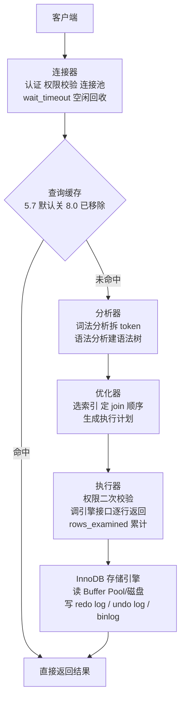
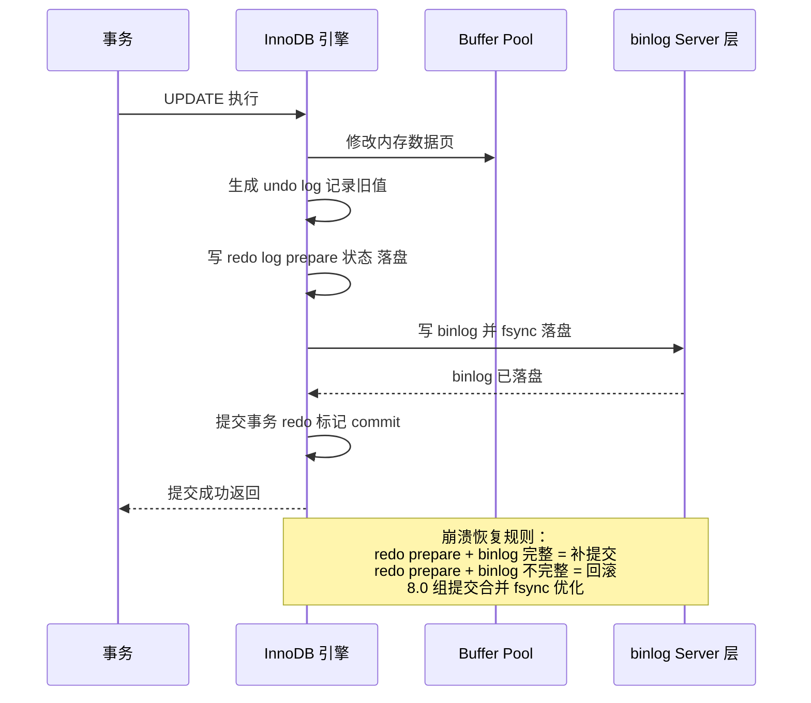
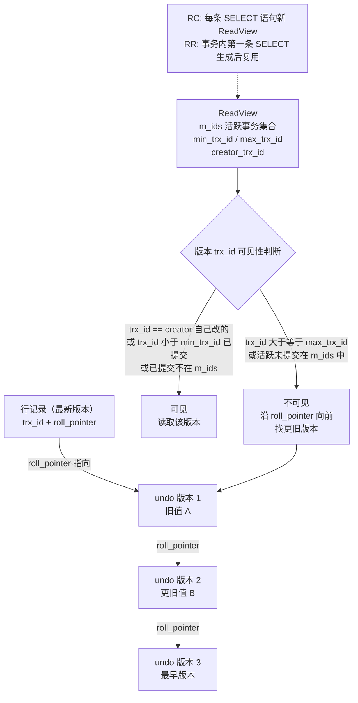
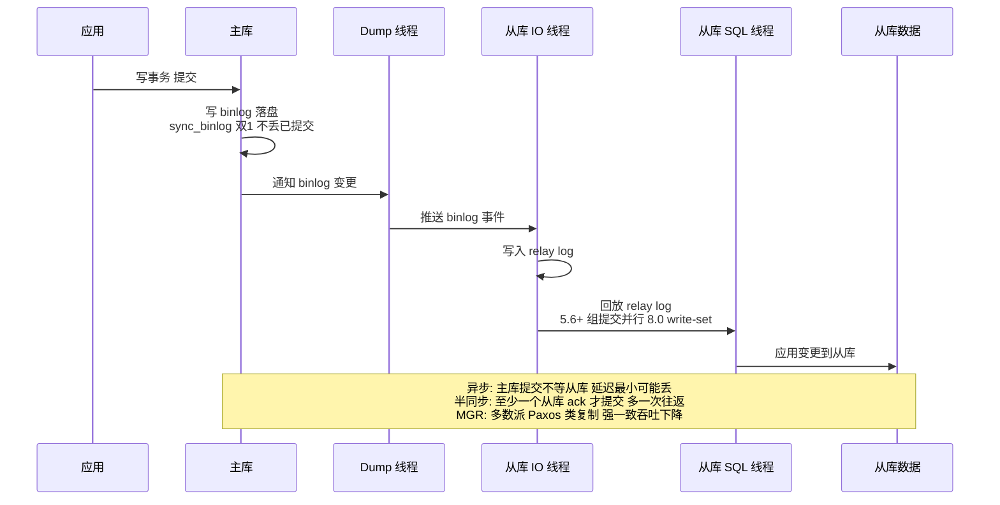

[⬅️ 上一章](04-collections-src.md) · [📖 返回目录](README.md) · [➡️ 下一章](06-redis.md)
# MySQL 原理与高可用架构（资深向）

> 面向 10+ 年经验的资深工程师/架构师候选人。默认语境 MySQL 8.0 / InnoDB（版本差异处注明 5.7）。讲原理、演进与权衡，重点是"为什么"而不是"是什么"。
> 🧭 初学者前置：00 章 §2.7（索引直觉）+ 能独立写含 JOIN 的 SQL。


### 📑 本章目录

- [一、架构与执行流程](#一架构与执行流程)
- [二、InnoDB 存储引擎](#二innodb-存储引擎)
- [三、索引](#三索引)
- [四、事务与隔离级别](#四事务与隔离级别)
- [五、MVCC（多版本并发控制）](#五mvcc多版本并发控制)
- [六、锁](#六锁)
- [七、日志](#七日志)
- [八、主从复制与高可用](#八主从复制与高可用)
- [九、分库分表](#九分库分表)
- [十、慢查询优化与 SQL 调优案例](#十慢查询优化与-sql-调优案例)
- [十一、面试高频题合集](#十一面试高频题合集)
- [考点速查表](#考点速查表)

## 本章速览：核心要点

- 一条 SQL 的一生要能完整串讲：连接器→分析器→优化器→执行器→存储引擎，并在提交时讲清 redo/binlog 两阶段提交为什么能保证崩溃一致性。
- 索引是绝对主场：B+ 树高度计算（约 2000 万行 3 层——直觉锚点：一张日增 5 万行的核心业务表，一年多就到这个量级）、聚簇/二级/覆盖/最左前缀/ICP、索引失效场景大全，必须能推导而非背诵。
- MVCC + 锁是隔离级别的实现基石：RR 下快照读靠 ReadView、当前读靠间隙锁/临键锁，能讲清"RR 如何避免幻读"即通过资深门槛。
- 主从复制讲清"异步/半同步/MGR 三种模式的延迟与一致性梯度"，分库分表讲清"分片键选型与扩容"的架构决策，而不是报菜名。
- explain 每个字段（尤其 type/key/rows/Extra）要能手撕慢 SQL，这是面试官验证"真做过优化"的试金石。

---

## 一、架构与执行流程


### 1.1 一条 SQL 的一生

```
客户端 → 连接器(认证/权限/连接池)
       → 查询缓存(8.0 已移除)
       → 分析器(词法/语法分析，生成语法树)
       → 优化器(选索引、决定 join 顺序、生成执行计划)
       → 执行器(调存储引擎接口，逐行返回，含权限二次校验)
       → InnoDB(读 buffer pool/磁盘，写 redo log/undo log/binlog)
```

- **连接器**：认证、权限校验（注意：权限在连接建立时加载，中途改权限不影响已建立连接）、`wait_timeout` 空闲回收、线程池/连接池管理（`max_connections` 打满是常见故障：`Too many connections`）。
- **分析器**：词法分析拆 token，语法分析建语法树，语法错误在这里报。
- **优化器**：决定用哪个索引、join 顺序、是否用 ICP/物化。**优化器选错索引**是资深 DBA 的日常（统计信息过期、数据倾斜），对策：`ANALYZE TABLE`、`FORCE INDEX`、改写 SQL、8.0 的直方图。
- **执行器**：先做权限检查，再调存储引擎接口。`rows_examined` 在这里累计。
- 8.0 移除查询缓存：因为整表失效导致缓存命中率低、且带来全局锁竞争，5.7 默认关闭，8.0 直接删除——"被淘汰的特性"本身是面试谈资。

> 图示：一条 SQL 从客户端到存储引擎的执行流程



### 1.2 redo log 与 binlog 的两阶段提交（核心中的核心）

- **redo log**（InnoDB 引擎层，物理日志，循环写，记录"页上做了什么修改"）：保证崩溃恢复，crash-safe。
- **binlog**（Server 层，逻辑日志，追加写）：用于主从复制与数据恢复。
- 两个日志独立写入 → 必须两阶段提交保证一致性，否则崩溃后可能出现"redo 里有、binlog 里没有"（从库丢数据）或反之（主库回滚但从库已同步）：

```
1. 写 redo log（prepare 状态）     -- 引擎层，先落盘
2. 写 binlog（事务提交点）         -- Server 层
3. 提交事务，redo log 标记 commit  -- 引擎层
崩溃恢复规则：redo 是 prepare 且 binlog 完整 → 提交；
            redo 是 prepare 且 binlog 不完整 → 回滚。
```

- 为什么先 prepare 再写 binlog：崩溃时以 binlog 是否完整为"提交与否"的裁判，保证主从一致。8.0 的两阶段提交还支持组提交（group commit）优化 binlog 刷盘。
- **面试官追问方向**：redo 为什么是物理日志、binlog 为什么是逻辑日志？——redo 记录页偏移+修改内容，恢复时直接重放页，快且幂等；binlog 记录 SQL 或行变更，语义层，可用于任意引擎/异构复制。

> 图示：redo log 与 binlog 两阶段提交时序



### 高频面试题

**Q1：MySQL 是怎么保证"redo 提交了但 binlog 没写"这种情况不发生的？**
A：靠两阶段提交。redo 先写 prepare，binlog 写完并落盘后，redo 才标记 commit。崩溃恢复时：若 redo 是 prepare 状态，检查对应 binlog 事务是否完整——完整则补提交，不完整则回滚。因此"binlog 缺失"的事务永远不会被提交，从库不会出现主库没有的数据。
**面试官追问**：两阶段提交本身会不会成为性能瓶颈？——答：会，所以有组提交优化：多个事务的 binlog 刷盘合并成一次 fsync；8.0 进一步优化了 redo 的组提交，让"刷盘次数"成为可控瓶颈而不是每事务一次。

**Q2：一条 UPDATE 语句从发出到提交，redo/binlog/undo 的写入顺序？**
A：① 读数据页（Buffer Pool，未命中则从磁盘读）；② 在内存页上修改，同时生成 undo log（记录旧值，用于回滚与 MVCC）；③ 写 redo log（prepare）；④ 写 binlog；⑤ 提交，redo 标记 commit；⑥ 脏页由后台线程异步刷盘（或 checkpoint）。关键认知：**提交时数据页可能还在内存**，持久性由 redo 保证，不是由数据页落盘保证。

---

## 二、InnoDB 存储引擎

### 2.1 页与行格式

- 页（Page）默认 **16KB**，是磁盘与内存交互的最小单位；区（64 页=1MB）、段、表空间层层向上。
- 行格式 compact：变长字段长度列表（逆序）+ NULL 标志位 + 记录头（5 字节，含 delete_mask、n_owned、heap_no、record_type、next_record）+ 隐藏列（rowid 6B 无主键时、trx_id 6B、roll_pointer 7B）+ 数据列。MySQL 8.0 默认 dynamic 行格式（大字段溢出到溢出页，只存 20 字节指针），比 compact 更进一步。
- 为什么页 16KB：磁盘顺序读的性价比、B+ 树扇出（fanout）与 IO 次数折中。页太小扇出小树高，页太大内存浪费。

### 2.2 Buffer Pool（缓冲池）

- 作用：缓存数据页+索引页+undo 页，读命中免 IO，写先改内存后异步刷盘。
- **LRU 改进（关键）**：标准 LRU 会被"全表扫描"污染（一次性把热数据挤出）。InnoDB 用**冷热分区**：链表前 5/8 为 young 区，后 3/8 为 old 区（`innodb_old_blocks_pct` 默认 37）；新页先入 old 区头部，在 old 区停留超过 `innodb_old_blocks_time`（默认 1000ms）再次被访问才晋升 young 区——全表扫描的页很快被淘汰，不挤占热点。
- 预读（read ahead）：线性预读/随机预读，按区批量读入，避免逐页随机 IO。
- 命中率监控：`show engine innodb status` 的 Buffer pool hit rate；命中率低先查是否扫描大表/内存不足。

### 2.3 change buffer 与自适应哈希

- **change buffer**（5.5 前叫 insert buffer）：对**二级索引**的写操作（insert/update/delete）不立即更新索引页，而是先记录在 change buffer，等该页被读到（或后台 merge）时再合并。原理：二级索引页在磁盘上随机，每次写都读页代价高；延迟合并把随机 IO 变顺序。代价：merge 时可能放大写放大；唯一索引不能用（需要立即检查唯一性）。
- **自适应哈希索引 AHI**：InnoDB 监控热点访问模式，自动为频繁等值查询的索引页建哈希索引（内存结构），命中则 O(1) 查找。全自动、不可人工干预（可关闭），只有等值查询受益，范围查询走 B+ 树。

### 高频面试题

**Q3：Buffer Pool 的 LRU 为什么要分冷热两区？**
A：防全表扫描污染。标准 LRU 下，一次扫描大表会把所有热数据挤出，之后热点查询全部落盘。冷热分区让新读入的页先待在 old 区，只有被二次访问（且间隔超过阈值）才晋升 young 区，扫描页自然淘汰。工程对应：凌晨跑报表大查询，白天业务不受影响，靠的就是这个机制。
**面试官追问**：为什么晋升要等 1000ms 而不是立即？——答：立即晋升挡不住"扫描过程中同一页被反复访问"的假热点（如自连接扫描），时间窗口过滤掉这种瞬时访问。

**Q4：change buffer 在什么情况下"没用"甚至有害？**
A：① 唯一索引：写入前必须查页判断唯一性，无法延迟；② 写后立即读：merge 成本转移回读路径；③ 数据量小、索引页常驻内存：延迟反而增加复杂度；④ merge 风暴：大量二级索引写累积后集中 merge，可能打满 IO。所以"change buffer 关掉"是很多写密集+小内存场景的调优选项（`innodb_change_buffering`）。

---

## 三、索引

### 3.1 B+ 树原理与高度计算（必考推导）

- B+ 树：非叶子只存**索引键+指针**（不存数据），叶子存全部数据且**链表相连**（页内+页间双向）。所有查询都走到叶子层，**查询代价稳定**（树高一致），范围查询靠叶子链表顺序扫描。
- 高度计算：16KB 页，假设主键 bigint（8B）+ 页指针（6B）= 14B/条 → 每页可存约 16×1024/14 ≈ **1170 个键**；叶子页按每行 1KB 存约 16 行。三层树：1170×1170×16 ≈ **2197 万行**。结论：**2000 万行以内，3 次 IO 定位任意行**，这就是"单表 2000 万"说法的来源（若行更小或页更大，上限更高）。
- 为什么 4 层是红线：每多一层多一次磁盘 IO，随机 IO 毫秒级，量变引起质变；所以千万级表务必让索引页尽量小（主键别用 uuid/超长字符串）。

### 3.2 聚簇索引 / 二级索引 / 覆盖索引

- **聚簇索引**：InnoDB 表必有一个（主键，无主键则选第一个非空唯一键，再没有则生成隐藏 rowid）。叶子存**整行数据**，数据即索引。副作用：主键插入无序（uuid 随机）会导致页分裂与碎片 → **自增主键**是默认最优解。
- **二级索引**：叶子存"索引列 + 主键值"，查询需**回表**（用主键再查一次聚簇索引）。
- **覆盖索引**：查询列全部在二级索引里（含主键），无需回表，Extra 显示 `Using index`。优化第一利器：把高频查询的列做成联合索引覆盖。

### 3.3 最左前缀与索引下推 ICP

- **最左前缀**：联合索引 (a,b,c) 可命中 a、(a,b)、(a,b,c)，但**跳过 a 直接 b 不行**；范围查询（>、<、between）之后的列**无法继续用索引排序/过滤**（只能用于定位起点，之后退化）。注意：8.0 起"范围之后列失效"有细节变化（跳跃扫描 skip scan 可部分利用，MySQL 8.0 支持），但经典结论仍是范围列后面的列不参与索引匹配。
- **ICP（Index Condition Pushdown，5.6+）**：把 WHERE 中能用索引列判断的条件**下推到存储引擎**，在二级索引遍历时提前过滤，减少回表次数。Extra 显示 `Using index condition`。典型：联合索引 (name, age)，`WHERE name LIKE '张%' AND age=30`，5.6 前要回表后过滤 age，5.6 后在索引遍历时就过滤 age。

### 3.4 索引失效场景大全（背熟+能解释原理）

| 场景 | 示例 | 失效原因 |
|---|---|---|
| 函数/表达式包裹列 | `WHERE DATE(create_time)='2024-01-01'` | 索引存的是原始值，无法对函数结果定位（可改范围查询） |
| 隐式类型转换 | `WHERE phone=138...`（phone 是 varchar） | 列上隐式 CAST，同函数包裹 |
| 前导通配符 | `LIKE '%abc'` | B+ 树按前缀有序，无法定位后缀 |
| OR 连接非索引列 | `WHERE a=1 OR b=2`（b 无索引） | 必须全表扫才能保证 or 语义（可拆 union all） |
| 联合索引跳列 | `WHERE b=1`（索引 (a,b)） | 最左前缀不满足 |
| 范围列后的列 | `WHERE a>10 AND b=1`（索引 (a,b)） | b 只能做过滤不能做定位 |
| 对列做运算 | `WHERE a+1=5` | 同函数包裹 |
| 隐式字符集/排序规则不一致 | join 两表不同 collation | 比较时转换 |

> 注意：`!=`/`NOT IN`/`IS NOT NULL` 在优化器成本允许时**可能**走索引（5.6+ 优化器更聪明），"必失效"的说法过时了——讲原理（能否定位）而不是背口诀，是资深与初级的区别。

### 3.5 为什么是 B+ 树而不是 B 树/红黑树/哈希（必考）

| 结构 | 问题 |
|---|---|
| 哈希 | 仅等值 O(1)；范围查询、排序、最左前缀全不支持；无法避免哈希冲突退化 |
| 红黑树/AVL | 二叉：2000 万行需要约 25 层 → 25 次磁盘 IO，不可接受；且无范围扫描的页级顺序性 |
| B 树 | 非叶子也存数据 → 同样容量下扇出小、树更高；范围查询需要中序遍历，无法像 B+ 树沿叶子链表扫 |
| B+ 树 | 非叶子纯索引 → 扇出大（~1170）树矮（3 层）；叶子链表天然支持范围/排序；数据都在叶子，查询稳定 |

### 高频面试题

**Q5：一张 5000 万行的表，主键 bigint 自增，3 层 B+ 树够吗？不够怎么办？**
A：按 1KB/行估算三层约 2000 万行，5000 万行需要第 4 层（多一次 IO，但仍可接受，4 层也能撑到亿级）。更重要的是评估：① 行是否可压缩（定长改变长、大字段拆表）；② 是否可归档冷数据；③ 是否必须分库分表——判断标准是"单行查询延迟是否达标+写入是否成为瓶颈"，而不是机械的 2000 万阈值。**面试官追问**：为什么推荐自增主键而不是业务主键？——答：聚簇索引按主键物理有序，自增插入永远追加在末尾，页分裂少、碎片少；uuid 主键随机插入导致频繁页分裂、写放大和索引碎片，二级索引也更大（叶子存主键）。

**Q6：联合索引 (a,b,c)，哪些查询能用上？为什么？**
A：等值 a、a+b、a+b+c 能完整用；a 等值 + b 范围能用 a+b 但 c 只做过滤；只有 b 或 c 开头完全不能用（除非 8.0 skip scan 恰好适用，成本高不保证）。本质：B+ 树索引是有序的"前缀树"，只有前缀确定才能定位。**面试官追问**：a 等值 b 等值 c 范围 vs a 范围 b 等值 c 等值，哪个更优？——答：前者优。等值列放前面，范围列放最后，是联合索引设计的第一原则（等值列可精确缩小范围，范围列之后全废）。

**Q7：为什么说"索引不是越多越好"？**
A：① 每个索引都是独立 B+ 树，占用磁盘与 Buffer Pool；② 写放大：一条 INSERT 要维护所有索引，二级索引写还要走 change buffer 流程；③ 优化器选错索引的风险随索引数上升；④ 冗余索引（(a,b) 与 (a) 重复）纯浪费。工程标准：单表索引控制在 5 个内，联合索引按查询模式设计，用 `pt-duplicate-key-checker` 清冗余。

---

## 四、事务与隔离级别

### 4.1 ACID 的实现机制

| 特性 | 实现 | 说明 |
|---|---|---|
| 原子性 Atomicity | undo log | 回滚段记录旧值，失败/回滚时逆操作恢复 |
| 一致性 Consistency | 约束+应用逻辑 | 数据库保证约束，业务保证语义 |
| 隔离性 Isolation | 锁 + MVCC | 读写不互斥靠 MVCC，写写互斥靠锁 |
| 持久性 Durability | redo log | 提交即落 redo，页可异步刷盘 |

### 4.2 四种隔离级别与三类问题

| 隔离级别 | 脏读 | 不可重复读 | 幻读 | 实现 |
|---|---|---|---|---|
| READ UNCOMMITTED | 可能 | 可能 | 可能 | 读不加锁，读到未提交数据 |
| READ COMMITTED (RC) | 否 | 可能 | 可能 | 语句级 ReadView + 行锁 |
| REPEATABLE READ (RR) | 否 | 否 | 基本不可能 | 事务级 ReadView + 临键锁；**MySQL 默认** |
| SERIALIZABLE | 否 | 否 | 否 | 读也加锁（退化为锁表/锁范围） |

- 脏读：读到别的事务未提交的数据（可能回滚）；不可重复读：同一事务两次读同一行结果不同（被已提交事务修改）；幻读：同一事务两次范围查询结果集行数不同（出现新行）。
- 注意：**SQL 标准里 RR 是允许幻读的**，MySQL 的 RR 用间隙锁把幻读也基本堵死——但"基本"二字有讲究：纯快照读不会幻读；当前读（`SELECT ... FOR UPDATE`/`UPDATE`/`DELETE`）靠临键锁，若锁范围覆盖不足仍有缝。这是资深面试的经典钻牛角尖点。

### 4.3 RR 下如何避免幻读（必考）

1. **快照读**（普通 SELECT）：MVCC 版本链 + 事务级 ReadView，读到的是事务开始时的快照，天然无幻读。
2. **当前读**（FOR UPDATE / UPDATE / DELETE / INSERT 相关）：加**临键锁（记录锁+间隙锁）**锁住扫描范围，其他事务无法在范围内插入新行 → 幻读被锁挡住。
3. 边界情况：若查询没有可用索引（全表扫），InnoDB 会对**全表加间隙锁**（退化为表级阻塞），这是 RR 下"锁竞争爆炸"的经典事故源。

### 高频面试题

**Q8：RR 和 RC 怎么选？为什么很多大厂把默认隔离级别改成 RC？**
A：RR 的间隙锁大幅提升死锁概率和锁等待，高并发写场景吞吐受损；RC 无间隙锁，且 binlog 用 row 格式时主从一致性与 RR 无差别。大厂（阿里等）默认 RC 的原因：① 间隙锁引发的死锁/阻塞事故多；② 业务大多不需要可重复读语义；③ row 格式 binlog 下 RC 的复制安全性已足够。代价：RC 下不可重复读，依赖该语义的业务要显式加锁或用乐观锁。**面试官追问**：RC 下能避免幻读吗？——答：RC 无间隙锁，当前读也只能锁住已存在的行，无法阻止新行插入，所以 RC 下幻读无法避免，只能靠应用层（唯一约束、重查、串行化）。

**Q9：事务里先 SELECT 后 UPDATE 同一条数据，会不会读到过期值？**
A：普通 SELECT 是快照读（读 ReadView 可见版本），UPDATE 是当前读（读最新已提交版本）——所以"先查后改"可能基于旧值修改（丢失更新）。解法：① `SELECT ... FOR UPDATE`（当前读）锁行；② 乐观锁版本号/时间戳，CAS 式更新；③ 事务隔离升 SERIALIZABLE。这是并发扣减库存、转账类业务的经典 bug 来源。

---

## 五、MVCC（多版本并发控制）

### 5.1 版本链

- 每行隐藏列：`trx_id`（最近修改事务 id）、`roll_pointer`（指向 undo log 中旧版本）。
- 更新一行 → 旧值写入 undo log，新版本行的 roll_pointer 指向旧版本 → 形成**版本链**（头是最新，尾是最早）。
- 读操作沿版本链找"对当前事务可见"的版本，实现读写不互斥：写者改新版本，读者看旧版本。

> 图示：MVCC 版本链与 ReadView 可见性判断



### 5.2 ReadView 与可见性算法

ReadView 四个核心字段：`m_ids`（活跃事务 id 集合）、`min_trx_id`（最小活跃 id）、`max_trx_id`（下一个将分配 id，即"上界"）、`creator_trx_id`（创建者自己）。

可见性判断（对版本链上某个 trx_id 为 X 的版本）：
1. X == creator_trx_id → 可见（自己改的）；
2. X < min_trx_id → 已提交，可见；
3. X ≥ max_trx_id → 创建 ReadView 之后才开启的事务，不可见；
4. min_trx_id ≤ X < max_trx_id → 在 m_ids 里则未提交，不可见；不在则已提交，可见。

### 5.3 RC 与 RR 的关键区别（生成时机）

- **RC**：每条 SELECT 语句都生成新的 ReadView → 能看到其他事务**已提交**的最新修改 → 不可重复读。
- **RR**：事务内**第一条 SELECT** 生成 ReadView，之后复用 → 后续查询看不到其他事务的提交 → 可重复读。
- 一致性读 vs 锁定读：MVCC 只服务快照读；当前读永远读最新版本并加锁，两者在 RR 下"看到的数据"可能不同——能讲清这个分叉，MVCC 就过关了。

### 高频面试题

**Q10：RR 下，事务 A 先普通 SELECT 看不到新行，事务 B 插入并提交，A 再 UPDATE 会怎样？**
A：UPDATE 是当前读，能读到 B 提交的新行，且**可能把新行也更新了**（当前读+写）。这就是"快照读与当前读不一致"的典型表现：A 的 SELECT 结果集与 UPDATE 影响行数不一致，业务上表现为"查不到却改得到"。解决：业务一致性要求高时用 FOR UPDATE 统一当前读，或接受 MVCC 语义。
**面试官追问**：这个行为在 RC 下存在吗？——答：RC 每条语句新 ReadView，SELECT 和 UPDATE 看到的数据基本同步，不一致窗口小得多；这也是部分业务选 RC 的隐藏理由。

---

## 六、锁

### 6.1 行锁三兄弟

| 锁 | 范围 | 说明 |
|---|---|---|
| 记录锁 Record Lock | 单行 | 锁索引记录本身 |
| 间隙锁 Gap Lock | 开区间 (a,b) | 锁"两个记录之间的空隙"，防插入（RR 默认） |
| 临键锁 Next-Key Lock | [a,b) | 记录锁+前向间隙锁，RR 默认行锁形态 |

- 加锁基于**索引**：没有索引的 WHERE → 全表扫描 → 所有记录+间隙全锁（等同锁表）。**给 WHERE 列建索引是降低锁竞争的第一手段**。
- 等值查询：命中唯一索引 → 退化为记录锁（间隙锁只锁不存在的区间）；范围查询 → 临键锁锁整个扫描区间。

### 6.2 加锁规则案例（经典）

```
表 t(id 主键, name 普通索引, age)
数据: id=1,2,5,10

案例1: UPDATE t SET age=1 WHERE id=5;      -- 唯一索引等值命中 → 只锁 id=5 记录锁
案例2: UPDATE t SET age=1 WHERE id=3;      -- 等值未命中 → 间隙锁 (2,5)，阻止插入 id=3
案例3: UPDATE t SET age=1 WHERE id>5;      -- 范围 → 临键锁 (5,10]、(10,+∞)
案例4: UPDATE t SET age=1 WHERE name='x';  -- name 非唯一索引等值 → 临键锁 + 间隙锁
                                            --（覆盖 name='x' 的区间，防相同 name 插入）
```

要点：间隙锁是"防插入"不是"防更新"；两个事务分别持有不重叠的间隙锁不互斥（间隙锁之间不冲突，冲突只在"间隙锁 vs 插入意向锁"）。

### 6.3 死锁：成因、检测与处理

- 四个必要条件：互斥、持有并等待、不可剥夺、循环等待。InnoDB 死锁几乎都是"两个事务按不同顺序锁多行/多索引"。
- 检测与处理：`innodb_deadlock_detect=on`（默认）时，等待图检测到环立即**回滚代价较小的事务**（按 undo 行数评估），报 `Deadlock found when trying to get lock`；也可设 `innodb_lock_wait_timeout`（默认 50s）兜底超时。
- 死锁的工程对策：① 多行更新按固定顺序（如按主键排序）；② 事务要小要快（缩小锁持有时间）；③ 减少间隙锁（RC 隔离级别）；④ 索引设计让扫描范围小；⑤ 死锁重试机制（捕获 1213 错误码重试，幂等设计）。
- **面试官高频追问**：死锁检测本身会不会成为性能瓶颈？——答：会。热点行高并发下，每次加锁等待都触发等待图检测，检测成本 O(等待链长度²)，可能比死锁本身更伤。阿里等场景下 `innodb_deadlock_detect=off` + 锁等待超时是常见取舍（代价是死锁只能超时暴露）。

### 6.4 表锁与 MDL

- 显式表锁 `LOCK TABLES`：服务端层，基本被 InnoDB 行锁取代，遗留场景是 DDL 与备份。
- **MDL（元数据锁）**：DML 与 DDL 的隐性互斥。经典事故：`ALTER TABLE` 在等 MDL 写锁，会**阻塞后续所有 DML**（排队机制），一条慢 DDL 打爆整个表的读写。对策：`pt-online-schema-change`/`gh-ost`（先建影子表拷贝数据+binlog 追平+rename），或 8.0 的原子 DDL + `ALGORITHM=INSTANT`。
- 乐观锁 vs 悲观锁：悲观锁=数据库行锁（适合冲突多、短事务）；乐观锁=版本号/CAS（适合冲突少、长事务，如电商库存扣减用 `UPDATE ... SET stock=stock-1 WHERE id=? AND stock>=1` 的原子条件更新，比先查后改更优）。

### 高频面试题

**Q11：间隙锁什么时候会"帮倒忙"？怎么规避？**
A：① 无索引条件的更新/删除：全表加间隙锁，等同锁表，高并发写直接雪崩（案例：`DELETE FROM t WHERE status=0` 且 status 无索引）；② 高并发插入场景间隙锁冲突频繁 → 死锁率上升。规避：给过滤列建索引、缩小事务、或改 RC 隔离级别（RC 无间隙锁，这也是大厂选 RC 的核心原因之一）。
**面试官追问**：两个事务的间隙锁会互相阻塞吗？——答：间隙锁之间**不互斥**（都是"防插入"语义，插入意向锁才与间隙锁冲突）。所以两个事务可以同时持有重叠间隙锁，但谁想往间隙里插数据，谁就要等——这是"插入变慢"却"不死锁"的常见现象。

**Q12：扣库存的 SQL 怎么写最安全？**
A：`UPDATE stock SET stock = stock - #{n} WHERE id = ? AND stock >= #{n}`——单条原子 SQL，行锁只持有一瞬间，无"先查后改"窗口，无需显式事务；影响行数为 0 则库存不足。比 SELECT FOR UPDATE（长事务持锁）和乐观锁重试（冲突多时放大写放大）都优。若需扣减后写流水，用事务包裹并保证流水表无唯一性冲突。**面试官追问**：高并发下这行会不会成为热点？——答：会，单行热点锁竞争。解法：库存分桶（预分配多个库存行，随机/按用户 hash 选桶扣减），或改 Redis 预扣+异步对账，回到"缓存与 DB 一致性"的架构题。

---

## 七、日志

### 7.1 binlog 三种格式

| 格式 | 内容 | 优点 | 缺点 |
|---|---|---|---|
| statement | 原始 SQL | 量小 | 非确定函数（NOW()、UUID()）主从不一致；5.7.7 起默认 row，statement 基本退出 |
| row | 行变更前后镜像 | 精确、可靠 | 量大；DDL 仍是 statement |
| mixed | 自动切换 | 折中 | 判断逻辑复杂，5.7.7 后不再默认 |

- 8.0 默认 row。row 格式下大事务（批量 update 百万行）binlog 巨大，是主从延迟与磁盘的隐形杀手——**大事务拆分**是运维铁律。
- binlog 还用于误删恢复：全量备份 + binlog 时间点回放。

### 7.2 redo log 与崩溃恢复

- 循环写（ib_logfile，8.0 默认 2 个×48MB 起步可调）；写策略由 `innodb_flush_log_at_trx_commit` 决定：0（每秒刷，可能丢 1s）、1（每次提交刷，默认，不丢）、2（每次提交写 OS cache，每秒刷，OS 崩溃丢 1s）。
- LSN（Log Sequence Number）串联：页上的 LSN 与 redo 的 LSN 比较，小于的才重放（幂等）。
- 崩溃恢复：从 checkpoint 位置向后重放 redo（前滚）+ 用 undo 回滚未提交事务（后滚）。"崩溃恢复不丢已提交事务"由 redo 保证。

### 7.3 undo log

- 逻辑日志，记录"修改前的值"，两个用途：**回滚**（原子性）与 **MVCC 版本链**（隔离性）。
- undo 页本身也进 Buffer Pool、也有 redo（undo 的持久化依赖 redo，这是"日志的日志"，面试冷门加分点）。
- undo 生命周期：事务提交后，若没有更早的 ReadView 还引用该版本，undo 才可被 purge 线程清理；长事务/长查询会阻止 purge → undo 膨胀 → ibtmp/undo 表空间暴涨。

### 高频面试题

**Q13：redo log 满了会发生什么？**
A：redo 是循环写，写满时触发 **checkpoint**：强制把 Buffer Pool 中最旧的脏页刷盘，推进 checkpoint LSN，才能覆盖旧日志。若刷盘速度跟不上写入（如磁盘慢、大事务），数据库会"卡住"（用户感知为写阻塞）。监控指标：`log sequence number` 与 `last checkpoint at` 的差值。
**面试官追问**：为什么 redo 用物理日志而 undo 用逻辑日志？——答：redo 要崩溃重放，物理记录"页偏移+内容"重放即恢复，无需关心并发；undo 要给 MVCC 提供"旧版本"，逻辑记录"反操作"（如 INSERT 的反操作 DELETE），语义层数据天然可读。

**Q14：主从延迟和 binlog 大事务有什么关系？**
A：row 格式下大事务生成巨量 binlog，从库 relay log 回放是**串行**的（5.7 前单线程），主库 1 分钟提交的大事务，从库可能回放 10 分钟——延迟直接拉满。对策：① 大事务拆小（分批提交）；② 从库并行复制（5.7 组提交并行、8.0 write-set 并行）；③ 必要时对延迟敏感查询走主库或加缓存。

---

## 八、主从复制与高可用

### 8.1 复制原理（三线程）

```
主库: 写 binlog
  └─ dump 线程: 推 binlog 给从库
从库: IO 线程: 拉 binlog 写 relay log
  └─ SQL 线程: 回放 relay log（5.6+ 可并行）
```

> 图示：MySQL 主从复制三线程时序



- 复制三模式对比：

| 模式 | 机制 | 一致性 | 延迟/代价 |
|---|---|---|---|
| 异步 | 主库提交不等从库 | 可能丢数据（主挂时） | 延迟最小 |
| 半同步（semi-sync） | 至少一个从库收到并 ack 才提交（5.7 优化为"ack 后返回，落盘可异步"） | 不丢已提交事务（从库 ack 过的） | 多一次网络往返 |
| 组复制 MGR | 多数派（Paxos 类）复制+冲突检测，节点自动选主 | 强一致（多数派内） | 吞吐下降，网络要求高 |

- **GTID**（5.6+）：全局事务 ID（server_uuid:transaction_id），从库按 GTID 幂等回放，天然支持"断点续传+自动找位点"，替代传统 file+pos 位点，是 MHA/Orchestrator 自动切换的基础。

### 8.2 读写分离与延迟问题

- 架构：主写从读 + 中间件（ProxySQL/MyCat/ShardingSphere）或客户端路由。
- **延迟的根源**：从库回放单线程/弱并行 + 大事务 + 大 DDL。5.7 组提交并行复制（同一组提交的事务可并行回放）、8.0 write-set 并行（无冲突事务跨组并行）大幅缓解。
- 延迟导致"写完主库立刻读从库读不到"：对策：① 关键读走主库（强制路由）；② 读从库前等待（`SELECT master_pos_wait()`/GTID 等待）；③ 缓存兜底（写主后写缓存，读先查缓存）；④ 业务容忍最终一致。
- 高可用选型：**MHA**（经典，脚本化切换，需额外节点，已停更但存量多）vs **Orchestrator**（Raft 管理拓扑，8.0 兼容好，自动故障检测+切换）vs MGR（数据库原生，自动化最高但限制多：要求所有表有主键、网络稳定）。

### 高频面试题

**Q15：主库宕机后，怎么做到尽量少丢数据？**
A：三层递进：① binlog 落盘策略 `sync_binlog=1` + redo `innodb_flush_log_at_trx_commit=1`（双 1，不丢已提交）；② 半同步复制保证至少一个从库持有 binlog；③ 故障切换选"**数据最新的从库**"（比较 GTID/位点，MHA/Orchestrator 自动做），必要时手工补齐。丢数据的残余窗口：半同步模式下 ack 前的提交在"主库挂了且该从库也挂了"时才丢。
**面试官追问**：主库恢复后怎么回切？——答：原主库作为新主的从库重新同步（GTID 自动追平），追平后人工/自动切换回。注意原主库可能有"脑裂期间"的孤儿数据，需比对 GTID 集合确认无冲突分支，或直接放弃旧数据（从新主全量重灌）。

**Q16：一主两从，从库 A 延迟 5 分钟，从库 B 正常，读流量怎么路由？**
A：方案：① 延迟感知路由——从库上报延迟，超过阈值（如 3s）摘出读流量（ProxySQL 的 `max_lag_ms` 就是干这个的）；② 一致性要求高的查询强制主库；③ 从库 A 排查延迟根因（大事务？慢查询？并行复制参数？）而不是只做路由规避。架构师答案要落到"路由+治理"两条腿。

---

## 九、分库分表

### 9.1 垂直 vs 水平

- **垂直分库**：按业务域拆库（用户库/订单库/商品库）——解耦、独立扩容，代价是跨库 join 消失（→ 应用层组装/宽表冗余）。
- **垂直分表**：大字段拆出（text/blob 单独表）——减少行宽，提高页内行数。
- **水平分表**：同结构多表（order_0..order_63），按分片键路由——解决单表数据量与写入瓶颈。
- 分库分表的触发信号（不是拍脑袋）：单表 >2000 万或 >几十 GB、写入吞吐触顶、单库连接数/IO 触顶、备份恢复时间过长。

### 9.2 分片键选择与扩容（架构题核心）

- 分片键三原则：**均匀**（避免热点，如按 user_id 而不是按地区）、**查询友好**（高频查询带分片键，否则全库广播）、**稳定**（不可变，改了要重路由）。
- 路由算法：hash 取模（均匀但扩容要重排）vs 一致性哈希（扩容只影响环上相邻节点，但分布不均+虚拟节点复杂）vs 范围分片（按 id 区间，扩容友好但热点在最新区间）。
- **扩容方案**：
  1. 停机迁移：停写→双写/导出导入→切流（简单粗暴，适合可停服场景）；
  2. 平滑迁移（双写+追平）：新集群建好→双写新旧→全量+增量追平→校验→切读切写（经典"影子迁移"）；
  3. 提前分片：一开始分 1024 个逻辑分片映射到少量物理库，扩容只搬分片映射（如"逻辑分片+物理库两层映射"，微博/饿了么都这么干）；
  4. 一致性哈希 + 虚拟节点：扩容只迁移少量数据，但路由实现复杂。
- 反范式：分片后"全局唯一 ID"要自建（雪花算法：时间戳+机器 id+序列号；或号段模式从 DB 取号）——面试必问。

### 9.3 跨库 join 与分布式事务

- 跨库 join 的四个解法（按优先级）：① 冗余宽表（把关联字段冗余进查询表，如订单表冗余用户昵称）；② 应用层组装（多次单表查询，代码 join）；③ 全局表（字典类小表每库一份）；④ 数据异构到 OLAP/ES（复杂分析场景）。
- 分布式事务方案演进：**XA**（2PC，强一致但性能差、协调者单点）→ **TCC**（Try-Confirm-Cancel，业务补偿，侵入大）→ **本地消息表**（同库事务写消息表+MQ 投递，最终一致）→ **MQ 事务消息**（RocketMQ 半消息）→ **Seata AT**（自动补偿，框架级，业务无侵入，性能介于 XA 与 TCC 之间）。
- 选型口诀：强一致短事务选 XA/Seata AT；长事务/高吞吐选最终一致（事务消息/本地消息表）；资金类用 TCC+对账兜底。**对账**是分布式事务的最后一根安全绳，面试提到必有加分。

### 9.4 中间件对比与分页/聚合

| 维度 | ShardingSphere | MyCat |
|---|---|---|
| 形态 | 客户端 JDBC 驱动（Sharding-JDBC）+ 可选的 Proxy | 独立代理服务 |
| 侵入性 | 应用内，无额外部署 | 应用无感知，但要维护代理集群 |
| 协议 | 完全 JDBC 兼容 | MySQL 协议代理 |
| 治理 | 生态全（加密/影子库/分布式事务） | 相对简单，社区活跃度下降 |
| 适用 | 中大规模 Java 应用 | 多语言/不想改代码 |

- 分页 `LIMIT 100000,10` 跨分片：各分片取 100010 条再内存归并 → 深分页成本随 offset 线性爆炸。对策：① 禁止大 offset，改**游标分页**（`WHERE id > last_id ORDER BY id LIMIT 10`，前提是有序键）；② 业务上限定翻页深度（如只允许前 100 页）。
- 聚合（count/sum）：各分片聚合后汇总（ShardingSphere 自动做）；`count(*)` 在分片场景准确值代价高，常以近似值+定时任务对账替代。

### 高频面试题

**Q17：订单表要分库分表，分片键选 order_id 还是 user_id？**
A：核心矛盾：订单查询"我的订单"（按 user_id）高频，后台运营查询（按时间/商家）低频。选 user_id：用户侧查询全部命中单分片，但后台查询全库广播——可接受，因为后台查询可走 OLAP 副本/ES。选 order_id：均匀但用户查询变广播。**业界主流：按 user_id 分片**，配合"订单表冗余 user_id 字段"（对商家侧查询建 ES 或宽表）。**面试官追问**：如果必须按 order_id 分片，用户查询怎么优化？——答：建立"用户-订单"映射表（user_id → order_id 列表，同样分片），两跳查询；或 user_id 维度冗余一份订单摘要表。

**Q18：分库分表后，怎么生成全局唯一 ID？**
A：三个方案对比：① UUID：简单但 36 字符、无序（聚簇索引碎片化）、索引变大；② 数据库号段：`UPDATE id_alloc SET max_id=max_id+1000` 取号，性能好但要维护号段表；③ 雪花算法（Snowflake）：64 位（1 符号位+41 时间戳+10 机器位+12 序列号），趋势递增、无中心、高吞吐，**业界事实标准**。注意时钟回拨问题（记录上次时间戳，回拨则等待或抛异常）。**面试官追问**：雪花 ID 有 41 位时间戳，能用多少年？——答：约 69 年（2⁴¹ 毫秒），且自定义起始纪元可平移，实际够用。

---

## 十、慢查询优化与 SQL 调优案例

### 10.1 explain 手撕指南

```sql
EXPLAIN SELECT ... -- 关键字段：
-- type: system > const > eq_ref > ref > range > index > ALL（越左越好，ALL 是红线）
-- key: 实际使用的索引；key_len: 用到的索引字节数（可反推用了几列）
-- rows: 预估扫描行数（优化器估算，别当精确值）
-- Extra 重点:
--   Using index       覆盖索引，最优
--   Using where       索引下推/存储引擎层后过滤（配合 key 判断）
--   Using index condition  ICP 生效
--   Using filesort    排序未用索引，内存/磁盘排序（大结果集是灾难）
--   Using temporary   临时表（group by 无索引、union、子查询常见）
--   Using join buffer  join 无索引被驱动表
```

排查流程：定位慢 SQL（slow log/performance_schema）→ explain 看 type/key/rows/Extra → 从"索引缺失→索引设计不合理→SQL 写法→数据分布（统计信息）"四层找根因。

### 10.2 实战案例

**案例 A：分页深翻（深分页）**
```sql
-- 慢：LIMIT 1000000, 20 需要扫 100 万行再丢
SELECT * FROM t ORDER BY id LIMIT 1000000, 20;
-- 快：延迟关联，先用覆盖索引定位 id 再回表
SELECT * FROM t JOIN (SELECT id FROM t ORDER BY id LIMIT 1000000, 20) tmp
  ON t.id = tmp.id;
-- 或游标：WHERE id > ? ORDER BY id LIMIT 20（推荐，前提业务允许）
```
原理：覆盖索引扫描只读索引页，回表只回 20 行；而原 SQL 每行都回表。

**案例 B：函数导致索引失效**
```sql
-- 慢：WHERE DATE(create_time) = '2024-06-01'  对列函数化
-- 快：WHERE create_time >= '2024-06-01' AND create_time < '2024-06-02'
```
原理：索引按原始值有序，函数后无法二分定位；改写为范围查询即命中索引。

**案例 C：隐式转换**
```sql
-- phone 是 varchar，WHERE phone = 13800138000 数字常量 → 列上隐式 CAST，索引失效
-- 快：WHERE phone = '13800138000'
```
（注意：反过来常量是字符串、列是数字时，8.0 优化器会做"常量转列类型"，可能仍走索引——方向很重要。）

**案例 D：JOIN 大表驱动**
```sql
-- 小表驱动大表：EXPLAIN 看驱动表 rows，被驱动表 join 列必须有索引
-- 否则 Using join buffer + ALL，全表扫被驱动表
```

### 10.3 大分页与深分页的架构级解法

1. 业务限制：只允许翻前 N 页（搜索引擎同款思路）；
2. 游标/键集分页：`WHERE id > last_id`（需稳定有序键，主键即可）；
3. 延迟关联/覆盖索引；
4. 数据归档：把历史数据按月分区（PARTITION BY RANGE）或归档表，分区裁剪让扫描范围指数级缩小——**分区是"免费的分库分表"**，能分区解决的别急着分库。

### 高频面试题

**Q19：同样是索引，为什么有时候优化器就是不走？**
A：① 统计信息过期（`ANALYZE TABLE` 刷新）；② 数据倾斜，优化器按成本模型判断"走索引回表比全表扫更贵"（如过滤后仍占 30%+ 行）；③ 索引选择性差（重复值多）；④ SQL 写法触发失效（函数/隐式转换/前导 %）。解法：刷新统计信息 → 检查写法 → `FORCE INDEX` 临时验证 → 8.0 用直方图+优化器提示。**面试官追问**：`FORCE INDEX` 能上生产吗？——答：能但要谨慎：数据分布变化后强制索引可能更差；正确姿势是先分析为何优化器不选（统计信息/成本模型），FORCE 只作应急，长期靠索引设计与统计信息维护。

**Q20：count(*) 在大表上为什么慢？怎么优化？**
A：InnoDB 的 count(*) 要扫描全表（MVCC 下无法像 MyISAM 存行数），二级索引比聚簇索引小，优化器通常走最小的二级索引扫——所以"给任意小列建个索引能加速 count"是技巧。但数据量大后仍慢：解法：① 近似值（`SHOW TABLE STATUS` 的 rows，允许误差时）；② 计数表/Redis 计数（事务内同步更新）；③ 按天分区 + 分区统计缓存。**面试官追问**：为什么 InnoDB 不维护总行数？——答：MVCC 下不同事务看到不同行数，维护全局计数与隔离性冲突，只能在读时动态统计。

---

## 十一、面试高频题合集

**Q21：为什么很多团队"分库分表"之前先考虑 MongoDB/其他 NoSQL？MySQL 的边界在哪？**
A：这是伪命题——选型看访问模式。MongoDB 的优势是文档模型+水平扩展原生（分片自动），劣势：事务能力弱（多文档事务 4.0 才支持且性能差）、join 弱、强一致读要额外配置。MySQL 的优势是事务/join/生态/运维成熟。决策矩阵：**强事务+复杂关联+稳定 schema → MySQL；高写入吞吐+灵活 schema+弱事务 → MongoDB 或 MySQL 分片**。资深答案：先量化 QPS/数据量/一致性要求，再选型，而不是听风就是雨。
**面试官追问**：MySQL 在什么规模下必须分片？——答：没有绝对数字，看瓶颈：单库写 QPS 触顶（一般 5000-1 万+）、单表超过内存与 IO 承受力、备份恢复超 SLA。很多团队 1000 万行就分片是过度设计，先做索引/分区/归档。

**Q22：MySQL 8.0 相比 5.7 的关键变化，生产中你关注哪些？**
A：① 查询缓存删除（省掉失效锁竞争）；② 默认 utf8mb4、默认 row binlog、caching_sha2_password 认证（老客户端不兼容，升级要处理）；③ 原子 DDL（DDL 崩溃不留半成品）+ INSTANT 加列；④ 直方图、hash join（无索引 join 场景大幅提速，5.7 用 NLJ+buffer 慢）；⑤ undo 独立表空间、redo 可调大小；⑥ 不可见索引、函数索引（`INDEX ((lower(name)))`，解决函数失效问题）。生产注意：升级前查兼容性（认证插件、SQL 模式），8.0 的默认 SQL 模式更严格。

**Q23：一条 SQL 从"慢"到"修好"，完整的排查方法论是什么？**
A：① 慢日志/监控定位 SQL 与频率；② explain 看执行计划（type/key/rows/Extra）；③ 定位根因四层：索引缺失→索引设计（联合索引顺序/覆盖）→SQL 写法（函数/隐式转换/深分页）→数据与统计信息（倾斜/过期）；④ 验证：`EXPLAIN ANALYZE`（8.0 实际执行耗时）或线上灰度；⑤ 兜底：缓存/读写分离/异步化——**调优顺序永远是"先索引后架构"**，直接上缓存是掩盖问题。**面试官追问**：Explain 的 rows 和实际不符怎么办？——答：统计信息过期或采样误差，先 ANALYZE TABLE；仍不符考虑索引统计的采样页设置（`innodb_stats_persistent_sample_pages`），或直方图辅助优化器判断数据分布。

**Q24：主库 binlog 被误删了，怎么恢复数据？**
A：分情况：① 有全量备份：备份+后续 binlog 增量回放到误操作前时间点（`mysqlbinlog --stop-datetime`）；② 无备份：从从库导出（从库可能已同步错误操作，需结合 binlog 找正确位点）——实际上从库也执行了误操作，需用 `--start-position` 跳过；③ 定期演练是唯一靠谱的保障。架构师答案：备份策略（全量+增量 binlog 保留 N 天）与恢复演练（每年至少一次）是 DBA 的核心 KPI。

**Q25：什么是"索引下推"？举个具体例子说明它省了什么。**
A：ICP 是 5.6 引入的优化：把 WHERE 里能用索引列判断的条件下推到存储引擎，在二级索引遍历时先过滤再回表。例：联合索引 (name, age)，`SELECT * FROM t WHERE name LIKE '张%' AND age > 30`——无 ICP：引擎把"张%"命中的所有记录回表，Server 层再过滤 age；有 ICP：引擎遍历索引时直接过滤 age>30，只回表满足条件的行。省的是回表次数（每次回表是一次随机 IO）。EXPLAIN 的 Extra 出现 `Using index condition` 即生效。**面试官追问**：ICP 和覆盖索引的区别？——答：覆盖索引是"根本不用回表"（查询列全在索引里），ICP 是"减少回表次数"（仍要回表但回得少），两者可叠加。

---

## 考点速查表

| 考点 | 一句话要点 |
|---|---|
| SQL 执行流程 | 连接器→分析器→优化器→执行器→引擎；8.0 删查询缓存 |
| 两阶段提交 | redo prepare → binlog → redo commit；崩溃时以 binlog 完整性裁判 |
| redo vs binlog | redo 引擎层物理循环写（crash-safe）；binlog Server 层逻辑追加写（复制/恢复） |
| 页与行格式 | 页 16KB；compact/dynamic 行格式含 trx_id、roll_pointer 隐藏列 |
| Buffer Pool | 冷热 LRU（默认 37% old 区）+ 1000ms 晋升窗口防扫描污染 |
| change buffer | 二级索引写延迟合并，唯一索引不能用，merge 风暴需警惕 |
| 自适应哈希 | AHI 自动为热点等值查询建哈希，只服务等值 |
| B+ 树高度 | 每页约 1170 键，3 层 ≈ 2000 万行，4 次 IO 是红线 |
| 聚簇/二级索引 | 聚簇叶子存整行；二级存主键需回表；覆盖索引免回表 |
| 最左前缀 | 联合索引按前缀命中；等值列前置、范围列后置 |
| ICP | 条件下推引擎层提前过滤，减少回表，Extra=Using index condition |
| 索引失效 | 函数包裹/隐式转换/前导%/OR 非索引列/跳列/范围后列 |
| B+ 树选择 | 扇出大树矮、叶子链表范围查询、查询代价稳定 |
| 隔离级别 | MySQL 默认 RR；RC 无间隙锁（大厂默认），SERIALIZABLE 读也加锁 |
| 幻读 | RR：快照读 MVCC + 当前读临键锁；RC 无法避免 |
| MVCC | 版本链(trx_id+roll_pointer)+ReadView；RC 每语句生成，RR 事务首读生成 |
| 行锁三兄弟 | 记录锁/间隙锁/临键锁；RR 默认临键锁；无索引条件=全表加锁 |
| 死锁 | 检测回滚代价小者；对策：固定加锁顺序+小事务+RC；检测本身有成本 |
| MDL | DDL 排队阻塞 DML；在线 DDL 用 gh-ost/pt-osc |
| binlog 格式 | statement/row/mixed；5.7.7 起默认 row；大事务放大 binlog |
| redo 刷盘 | flush_log_at_trx_commit：0/1/2；双 1 不丢已提交 |
| undo | 回滚+MVCC 版本链；长事务阻止 purge 导致膨胀 |
| 主从复制 | binlog→relay log→回放；异步/半同步/MGR 一致性递增延迟递增 |
| GTID | 全局事务号，幂等回放，自动找位点，切换的基础 |
| 读写分离延迟 | 并行复制缓解；关键读强制主库/等位点/缓存兜底 |
| 高可用 | MHA（经典）/Orchestrator（Raft）/MGR（原生强一致） |
| 分片键 | 均匀+查询友好+稳定；user_id 分片是订单场景主流 |
| 扩容 | 停机迁移/双写追平/逻辑分片两层映射/一致性哈希 |
| 跨库 join | 冗余宽表>应用组装>全局表>OLAP 异构 |
| 分布式事务 | XA/TCC/本地消息表/MQ 事务消息/Seata AT；对账兜底 |
| 分页 | 深分页禁用大 offset；游标/延迟关联/覆盖索引 |
| explain | type 越左越好；Using filesort/temporary 是优化信号 |
| count(*) | InnoDB 无全局行数，扫最小索引；近似值/计数表/分区 |

---

[⬅️ 上一章](04-collections-src.md) · [📖 返回目录](README.md) · [➡️ 下一章](06-redis.md)
