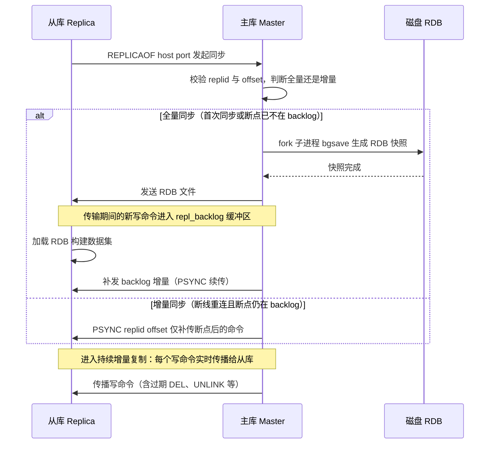
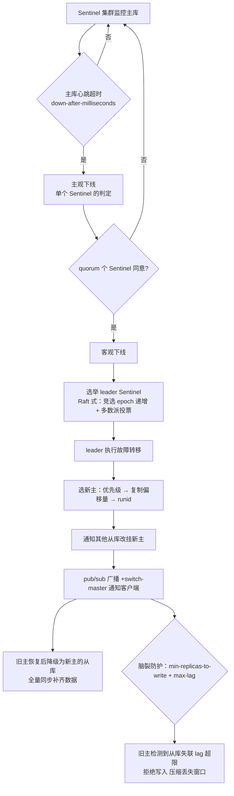
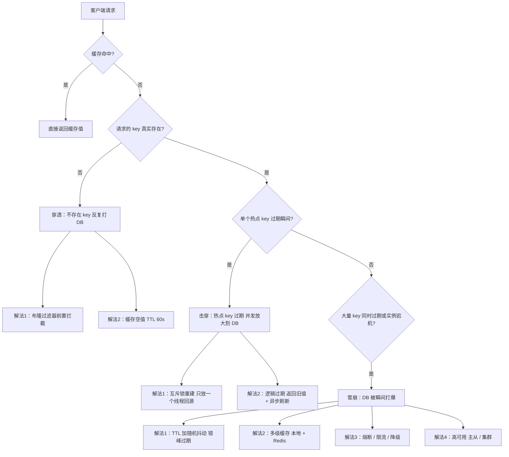
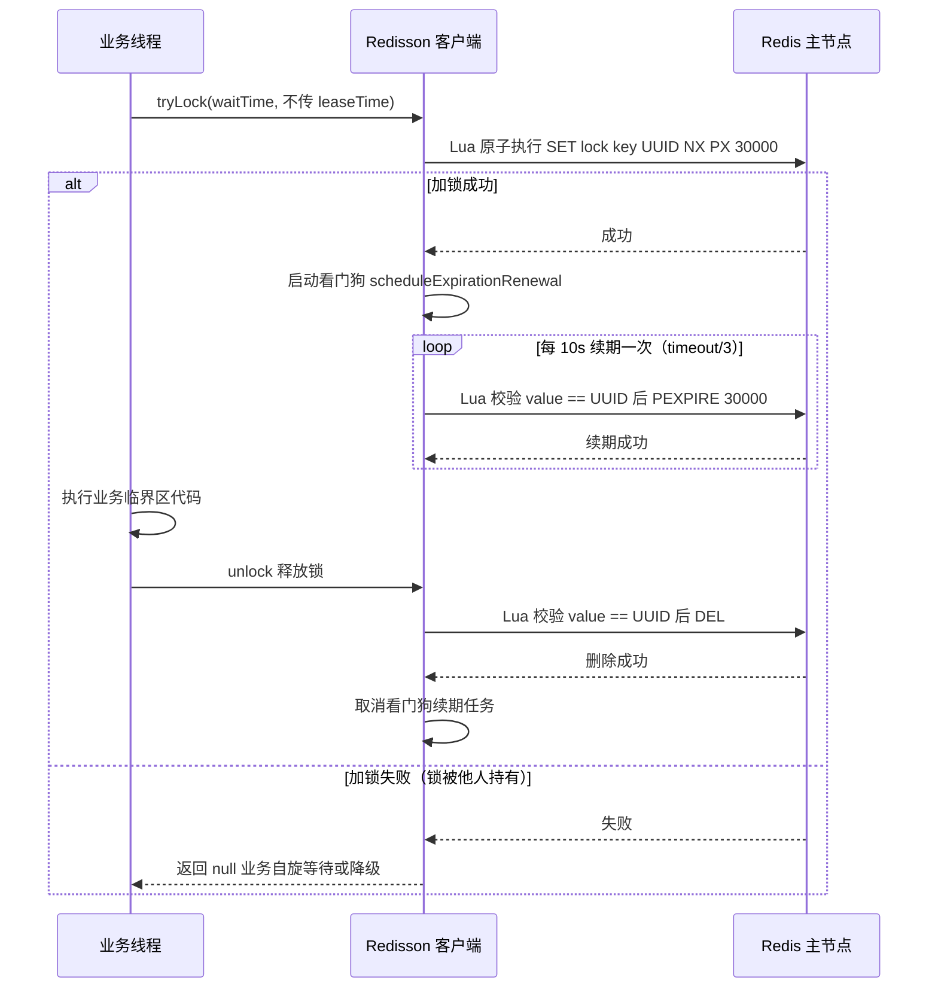
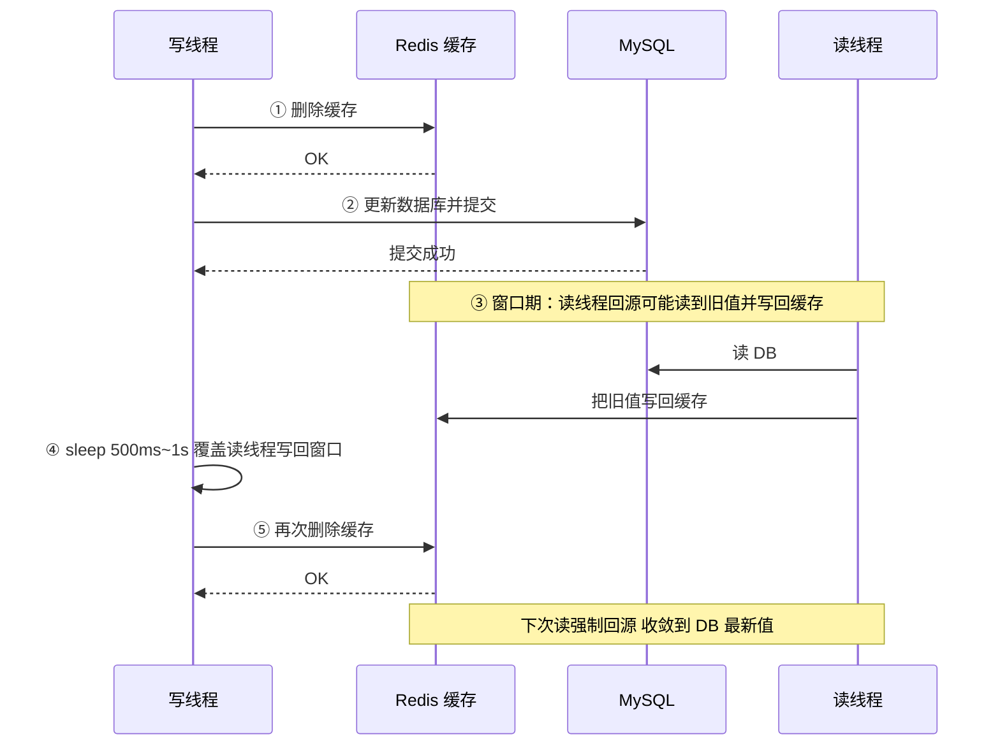

[📖 返回目录](README.md) · [⬅️ 上一章](05-mysql.md) · [➡️ 下一章](07-elasticsearch.md)

# Redis 核心原理与高可用（资深向）

> 面向 10+ 年经验的资深工程师/架构师候选人。默认语境 Redis 7.x（版本差异处注明 6.x/7.x）。重点：数据结构设计动机、单线程模型演进、持久化与 fork、分布式锁争议、缓存一致性工程方案。


### 📑 本章目录

- [一、数据结构与底层实现](#一数据结构与底层实现)
- [二、单线程模型与性能](#二单线程模型与性能)
- [三、持久化](#三持久化)
- [四、过期与内存淘汰](#四过期与内存淘汰)
- [五、高可用：复制 / 哨兵 / Cluster](#五高可用复制--哨兵--cluster)
- [六、缓存三大问题](#六缓存三大问题)
- [七、分布式锁](#七分布式锁)
- [八、事务与 Lua 脚本](#八事务与-lua-脚本)
- [九、大 key / 热 key 治理与缓存一致性](#九大-key--热-key-治理与缓存一致性)
- [十、高频面试题合集](#十高频面试题合集)
- [考点速查表](#考点速查表)

## 本章 TL;DR 学习要点

- Redis 的"快"= 内存 + 高效数据结构 + IO 多路复用 + 单线程免竞争，四要素缺一不可；6.0 引入多线程只做网络 IO，命令执行仍是单线程——能讲清边界是资深标志。
- 数据结构要能讲"为什么"：SDS 为什么二进制安全、dict 为什么渐进式 rehash、ziplist 为什么被 listpack 取代、zset 为什么用跳表不用红黑树。
- 持久化三件套：RDB（fork+COW）、AOF（刷盘策略+rewrite）、混合持久化——重点是大 key 对 fork 的阻塞影响。
- 高可用是架构题主场：复制（全量/增量）、哨兵（选举与脑裂）、Cluster（16384 槽、MOVED/ASK、扩容迁移），必须能画流程。
- 分布式锁必须能讲 Redisson 看门狗源码原理 + 红锁争议双方观点；缓存一致性必须能对比"旁路缓存/双删/binlog 订阅"三条路线。

---

## 一、数据结构与底层实现


### 1.1 SDS（Simple Dynamic String）

- 为什么 string 不用 C 字符串：C 字符串以 `\0` 结尾、`strlen` O(n)、非二进制安全、拼接易缓冲区溢出。SDS 解决全部四点。
- 结构演进：3.2 前单一 `sdshdr{len, free, buf[]}`；3.2 起按长度分 5 种（`sdshdr5/8/16/32/64`），用 1/2/4/8 字节存 len——**小字符串省内存**（内存是 Redis 第一资源，这个细节面试很加分）。
- 设计要点：① `len` 记录长度 → O(1) 取长度、二进制安全（可存 `\0`）；② **空间预分配**：扩容时若 <1MB 翻倍分配，≥1MB 只多分配 1MB——减少 realloc 次数；③ **惰性空间释放**：缩容不立即归还，留待后用；④ 与 C 字符串兼容（`buf` 末尾保留 `\0`）。

### 1.2 dict（哈希表）与渐进式 rehash

- 结构：`dictht ht[2]`（双表）+ `rehashidx`（-1 表示不在 rehash）。两张表交替使用，这是"平滑迁移"的通用模板（Go map、Java CHM 扩容思路同源）。
- 触发：负载因子 = used/size。扩容：≥1 且无 BGSAVE/BGREWRITEAOF 子进程时，或 ≥5 强制扩容（子进程存在时为了减少 COW 内存翻倍）；缩容：<0.1。
- **渐进式 rehash**（重点）：扩容不是一次性搬完，而是**每次增删改查顺带搬一个桶**（`_dictRehashStep`），外加定时任务兜底（`_dictRehash` 每次 100 个桶）。期间：新写入进 ht[1]，查询先查 ht[0] 再查 ht[1]。好处：**大字典扩容不阻塞服务**（O(n) 迁移摊到每次操作上）。
- 与 Java HashMap 扩容对比：HashMap 是"迁移完才可用"（单线程内同步完成，多线程靠 CAS 协作）；Redis 是"边用边迁"（双表并行），因为 Redis 单线程无法容忍一次性迁移的阻塞。面试讲出这个对比非常加分。

### 1.3 ziplist → quicklist → listpack（list/hash/zset 小数据的演化）

- **ziplist**：连续内存的紧凑结构，节点 = `prevlen + encoding + data`。优点：内存利用率极高、缓存友好；致命缺点：**连锁更新**——某节点长度从 253 变 254 导致 prevlen 从 1 字节变 5 字节，可能引发后续节点级联膨胀，最坏 O(n²)。
- **quicklist**（3.2，list 专用）：双向链表，每个节点是一个 ziplist——**大块连续内存 + 分片**，兼顾内存与插入删除；7.0 起节点改用 listpack。
- **listpack**（7.0 全面取代 ziplist，list/hash/zset 小数据量都用它）：节点改为 `encoding + data + len`，**长度记录在尾部，且不记录前驱长度**——彻底消除连锁更新；代价：只能从尾部开始反向遍历（双向遍历靠"从尾向前+元素个数"，本质仍支持双端但实现不同）。
- 转换阈值：hash 默认 field 数 ≤512 且每个 field ≤64 字节用紧凑编码（listpack），超了转 hashtable；zset ≤128 个元素且成员 ≤64 字节用 listpack；list 默认每个 quicklist 节点 ≤8KB。这些阈值可通过配置调整，线上大 value 常常是阈值被撑爆的结果。

### 1.4 跳表（zset 的底层，必考）

- zset 为什么用跳表不用红黑树：① **实现简单**，红黑树旋转/变色易错；② **范围操作友好**：`ZRANGEBYSCORE` 直接沿链表扫，红黑树要中序遍历；③ 层数随机，无需全局重平衡，**并发改造容易**（Redis 单线程这点不关键，但工程上仍是优势）。
- 源码要点：`zskiplistNode{ sds ele; double score; backward; level[] }`，`level[]` 每个元素是 `{ forward; span }`——**span 记录跨过的节点数**，这是 `ZRANK`（排名）O(log n) 的关键；`ZSKIPLIST_MAXLEVEL=32`，`ZSKIPLIST_P=0.25`（层数几何分布，期望 1/(1-p)≈1.33 层，内存比 p=0.5 更省）。
- 等分比较：先比 score，再比 ele（字典序）——保证同分成员也有确定顺序，这是 zset 有序性的细节。
- 注意：zset 是 **dict + 跳表** 双结构（dict 管 member→score 的 O(1) 查分，跳表管有序），用空间换两个方向的复杂度。

### 1.5 intset 与 Redis 7 新数据结构

- **intset**：整数集合，底层有序数组（16/32/64 位按需**升级**，只升不降）。升级的触发：插入超出当前位宽的整数（如 16 位集合插入 2³¹ 数字）。设计动机：小整数集合用数组比哈希省内存且有序。
- Redis 7 变化：① listpack 全面替代 ziplist；② **Functions**（服务端函数，7.0，Lua 的工程化替代：可管理、可持久化、主从自动同步）；③ 6.2 起 `SET` 支持 `GET` 选项（原子取旧值写新值，CAS 利器）、`GETDEL/GETEX`，7.0 的 `HRANDFIELD` 等命令面改进。面试提"7.0 listpack + Functions"即可，不必堆版本号。
- 布隆过滤器：官方模块 `redisbloom`（非内置）；社区另有 `SETBIT` 手写位图版。见第六章。

### 1.6 key 设计与内存效率要点（实战视角）

- **key 命名规范**：`业务:对象:id[:字段]`（如 `order:user:10086:list`），可读可排查；避免超长 key（内存与网络双浪费，`--bigkeys` 扫描也吃力）。
- 内存效率排序（同数据量）：**intset < listpack < 原生结构 < 序列化字符串**。能用 hash 小字段就别拼 JSON 大字符串（JSON 还有解析 CPU 成本）；能用整数（int）就别用字符串。
- 8 字节对齐与碎片：`INFO memory` 看 `mem_fragmentation_ratio`（>1.5 碎片严重，`activedefrag` 可开，或重启整理）；大量小对象 + 频繁增删 → 碎片率上升。
- 过期策略与内存水位：`maxmemory` 建议 ≤ 物理内存 70%（给 fork/COW 留余量），`maxmemory-policy` 配淘汰策略并监控 evicted_keys 突增（淘汰风暴是延迟抖动的隐形元凶）。

### 高频面试题

**Q1：SDS 相比 C 字符串，解决了哪些问题？**
A：四点：① O(1) 长度（len 字段）；② 二进制安全（不依赖 `\0` 判断结尾，可存任意字节）；③ 杜绝缓冲区溢出（扩容前检查并预分配）；④ 减少内存分配次数（预分配+惰性释放）。**面试官追问**：空间预分配的具体策略？——答：<1MB 翻倍，≥1MB 每次 +1MB（因为大字符串翻倍浪费严重），保证 N 次追加的均摊 realloc 次数 O(log N) 量级。

**Q2：渐进式 rehash 期间，get 一个 key 的完整流程？**
A：先按 hash 查 ht[0]，未命中再查 ht[1]（新表）；每次 get/put/delete 都会顺手迁移当前 rehashidx 指向的桶并推进；新写入一律进 ht[1]，避免旧表再膨胀。rehash 完成后 ht[0] 与 ht[1] 交换，rehashidx 复位 -1。**面试官追问**：渐进式 rehash 期间如果一直没有读写，会卡住吗？——答：不会，`serverCron` 定时任务每轮迁移最多 100 个桶（`dictRehashMilliseconds` 还会限制耗时 1ms），纯 idle 的大字典也能在后台迁完。

**Q3：zset 的 ZRANK 为什么是 O(log n)？**
A：跳表节点 level[] 里存了 span（该层 forward 指针跨过的节点数）。ZRANK 从最高层向下累加 span 即可算出目标节点的排名，无需遍历整个链表。**面试官追问**：跳表层数为什么上限 32、概率 1/4？——答：32 层对应 2³² 个元素的量级，远超 Redis 实际容量；p=1/4 让高层节点更稀疏，内存更省，同时保证 O(log n) 期望复杂度（log₁/₀.₂₅ n）。

---

## 二、单线程模型与性能

### 2.1 为什么单线程还这么快（必考四要素）

1. **纯内存操作**：数据在内存，无磁盘 IO（持久化是异步旁路）；
2. **数据结构为场景定制**：SDS/dict/跳表/intset/listpack 都是"省内存+低常数"设计；
3. **IO 多路复用**：epoll 事件驱动，单线程可同时处理上万连接（`aeEventLoop` + `epoll_wait`）；
4. **单线程免锁**：无上下文切换、无锁竞争、无伪共享——这是"单线程"最大的红利，也是所有命令原子性的来源。

瓶颈不在 CPU 而在**网络 IO 与内存**（大 key 序列化、慢命令）。所以 6.0 的优化方向是 IO 而不是执行。

### 2.2 6.0 多线程 IO 模型（演进与边界）

- 背景：单线程模型下，**读写 socket 的系统调用**（read/write 与协议解析/回包）成为瓶颈（尤其大 value 场景）；命令执行本身 CPU 开销小。
- 6.0 设计：**主线程仍负责命令执行**；`io-threads` 配置（默认关闭，需显式开启，建议 4）让多个 IO 线程分担：读事件 → IO 线程并行解析请求 → 主线程串行执行 → 结果由 IO 线程并行写回。
- 关键约束：**执行必须是单线程**（否则要处理共享数据竞争，复杂度爆炸）；开启后 `io-threads-do-reads` 默认 no（只并行写回，读仍主线程）。
- 7.0 之后：IO 线程模型延续，未改成多线程执行——官方态度明确：执行引擎保持单线程是正确取舍（多线程执行收益 < 复杂度代价）。面试答"6.0 多线程只是网络 IO"并解释边界，即过关。

### 2.3 性能排查心智模型

- 慢查询：`SLOWLOG GET`（默认阈值 10ms）；慢命令大头：`KEYS`/`HGETALL`/`SMEMBERS`/大 `ZRANGE`、`SORT`、`MGET` 大 value。
- `INFO commandstats` 看高频命令；`redis-cli --latency` 看网络；`--bigkeys` 扫大 key。
- 规则：生产禁用 `KEYS`（O(n) 阻塞），用 `SCAN` 游标分批；大 key 拆分为多个小 key 或换结构。

### 2.4 事件循环与 RESP 协议（源码级补充）

- 事件循环：`aeMain` → `aeProcessEvents` → `epoll_wait` 收集就绪 fd → 分派读事件（`readQueryFromClient`）与定时任务（`serverCron`，1ms 精度时钟 `aeCreateTimeEvent`）。单线程里"IO 多路复用 + 定时器 + 信号处理"共用一个循环，这是 Redis 无阻塞的骨架。
- 读事件处理：`readQueryFromClient` 把请求读入输入缓冲区 → `processInputBuffer` 解析 RESP 命令 → `processCommand` 查命令表执行 → 结果写输出缓冲区 → 写事件触发时 `sendReplyToClient` 批量发送。
- **RESP 协议**：`*N` 数组、`$len` 批量字符串、`+OK` 简单串、`-ERR` 错误、`:` 整数；6.0 起 **RESP3**（新增 map/set/double 等类型，减少客户端解析成本），7.0 默认 RESP2 兼容、可用 `HELLO 3` 协商升级——协议演进体现"客户端生态与服务器效率"的平衡。
- 输出缓冲：`client-output-buffer-limit` 防止慢客户端（消费慢导致缓冲堆积）拖垮内存——大 key 发给慢客户端是输出缓冲爆掉的经典场景（对应报错 `Client closed connection` 或断开）。

### 高频面试题

**Q4：Redis 单线程为什么还能扛 10 万+ QPS？瓶颈在哪里？**
A：见 2.1 四要素。瓶颈分析：CPU 占用低但吞吐上不去 → 查网络（带宽/小包风暴）、大 value 序列化、慢命令；CPU 高 → 内存淘汰风暴、`KEYS` 类命令、AOF rewrite 与主线程争 CPU。**面试官追问**：为什么不把执行也多线程化？——答：执行多线程需要解决共享数据竞争（所有数据结构的线程安全改造）与事务/原子性语义，复杂度与风险远大于收益；官方通过 IO 多线程 + 异步删除（`UNLINK`）+ 7.0 起 AOF 落盘 offload 到后台线程（写 AOF 不再占用主线程 IO）已经解掉了主要瓶颈。

**Q5：KEYS 命令为什么是生产事故制造机？替代方案？**
A：KEYS 是 O(n) 全量扫描，单线程模型下执行期间**整个 Redis 阻塞**（毫秒到秒级），高并发下等于全站雪崩。替代：`SCAN` 游标式分批遍历（每次返回少量 key+游标，不阻塞）；需要"前缀匹配删除"用 SCAN+DEL 分批；需要快速存在性判断用 set/hash 结构。**面试官追问**：SCAN 能保证不重不漏吗？——答：**不保证不重复**（扩容/缩容时游标可能回溯），但保证"遍历开始后存在的数据最终都能被扫到"（弱一致）；所以 SCAN 适合"统计/清理"不适合"精确迁移"。

---

## 三、持久化

### 3.1 RDB 与 AOF 对比

| 维度 | RDB（快照） | AOF（追加日志） |
|---|---|---|
| 内容 | 二进制全量快照 | 写命令追加（RESP 协议文本） |
| 触发 | save（阻塞）/bgsave/配置自动 | 每写一条 append |
| 恢复速度 | 快（直接加载） | 慢（重放命令） |
| 数据安全 | 丢上次快照后全部 | 取决于刷盘策略：always 丢 0 条/everysec 丢 ≤1s |
| 体积 | 小（压缩） | 大（需 rewrite） |
| 阻塞 | bgsave fork 瞬间阻塞 | rewrite 同样 fork |

- 刷盘策略 `appendfsync`：`always`（每条 fsync，最安全最慢）/`everysec`（每秒，默认，丢 ≤1s）/`no`（交给 OS，丢最多）。
- **AOF rewrite**：子进程重写为当前数据集的最小命令集（4.0 前纯命令，4.0 起**混合持久化**：RDB 头 + 增量 AOF 尾，`aof-use-rdb-preamble` 默认 yes）——恢复时先加载 RDB 再重放增量，兼顾体积与恢复速度。

### 3.2 fork 与写时复制（COW）——资深必考

- bgsave/bgrewriteaof 都靠 **fork 子进程**：子进程继承父进程内存页表（虚拟内存共享），**fork 瞬间**父进程要复制页表，耗时与**内存大小成正比**（10GB 内存约 0.1~1s 级阻塞，期间 Redis 不可服务）。
- 之后父子进程共享只读页；父进程**写某页时触发 COW 复制该页**（4KB）——子进程拿到的是 fork 时刻的稳定快照。
- **大 key 的杀伤力**：写大 key（如 100MB string）时 COW 要复制整个大 key 所在页……不，COW 按页粒度，但**大 key 修改频繁 → COW 页数爆炸 → 内存瞬时翻倍风险**（极端情况父进程 RSS 涨到接近 2 倍，触发 OOM）；且 fork 时页表复制本身更慢。
- 结论：① 大 key 不仅阻塞主线程读写（网络传输/序列化），还放大 fork 与 COW 成本；② 内存水位 >70% 时开 bgsave 有 OOM 风险；③ 子进程 ≠ 子线程（fork 是进程，无共享内存写竞争，靠 COW）。

### 3.3 持久化选型工程建议

- 混用：RDB（恢复快）+ AOF everysec（少丢数据），AOF rewrite 定时；或直接 AOF 混合持久化。
- 只读缓存场景可关持久化；数据可靠性要求高（订单/库存）应开启并配合**主从多副本**——持久化是最后防线，副本才是第一防线。
- 备份：rdb 文件 + AOF 定期异地备份，恢复演练（`redis-check-rdb/aof` 校验工具）。

### 高频面试题

**Q6：bgsave 期间主进程写入数据，子进程能拿到吗？**
A：拿不到，也不需要拿到。子进程是 fork 时刻的**内存快照**，主进程后续写入靠 COW 落在自己的内存里，不会出现在子进程的 RDB 里。所以 RDB 是"某一时刻的一致性快照"，期间的写丢失由 AOF/主从增量兜底——这也是"RDB+AOF 混用"的原因。**面试官追问**：fork 需要多久？怎么监控？——答：与内存量成正比（页表复制）；`INFO stats` 的 `latest_fork_usec` 可查最近一次 fork 耗时；内存大且 fork 慢的机器，错峰 bgsave、调低 `maxmemory` 水位、或升级物理内存带宽。

**Q7：AOF rewrite 和 bgsave 同时触发会怎样？**
A：两者都 fork 子进程，Redis 默认**只允许一个子进程**（`rdb_bgsave_in_progress`/`aof_rewrite_in_progress` 互斥），后到的会等待或拒绝（可配 `aof-rewrite-incremental-fsync` 等细节）。且**子进程存在期间 dict 不扩容**（强制负载因子 5 才扩），避免 COW 内存翻倍——这是 1.2 节"负载因子 ≥5 强制扩容"的来历，两处知识是闭环的。

---

## 四、过期与内存淘汰

### 4.1 删除策略：惰性 + 定期（组合拳）

- **惰性删除**：访问 key 时检查 TTL，过期即删（`expireIfNeeded`）。省 CPU，但**过期 key 会残留**占内存。
- **定期删除**：`serverCron` 每秒 10 次（activeExpireCycle）：随机采样一批 key（默认每次 20 个），删除其中过期的，若过期比例 >25% 继续下一轮，单轮耗时上限（默认 1ms）——**控制单次阻塞**。
- 组合效果：CPU 与内存的折中；坑：大量 key 同时过期（雪崩场景）→ 定期删除每轮都在删，可能吃掉主线程时间片 → 延迟抖动。**过期时间加随机抖动**（`TTL ± 随机`）是标准解法。

### 4.2 八种淘汰策略（maxmemory-policy）

| 策略 | 范围 | 行为 |
|---|---|---|
| noeviction | - | 不淘汰，写报 OOM 错误（默认策略，最稳妥，7.0 未改变默认值） |
| allkeys-lru | 全部 key | 近似 LRU 淘汰 |
| allkeys-lfu | 全部 key | 近似 LFU 淘汰（4.0+） |
| allkeys-random | 全部 key | 随机淘汰 |
| volatile-lru / volatile-lfu / volatile-random / volatile-ttl | 仅带 TTL 的 key | 在设置了过期时间的 key 里淘汰；**没有 TTL 的 key 永不淘汰** |

- **近似 LRU**：不维护全量访问链表（内存贵），`maxmemory-samples`（默认 5）——每次**随机采样 5 个 key 淘汰最久未用的**。采样数越大越接近真 LRU，代价是淘汰时 CPU。
- **LFU**（4.0+）：`OBJECT FREQ` 可查频次；对数衰减计数器，解决"历史热点占用内存"问题（LRU 的经典缺陷：一次性热点长期占位）。
- 选型建议：业务缓存（可丢）→ allkeys-lfu/lru；有 TTL 语义的会话 → volatile-lru；禁止丢数据的 key 服务 → noeviction + 监控告警。

### 高频面试题

**Q8：惰性删除和定期删除各自的缺陷？为什么必须组合？**
A：惰性：过期 key 不访问就永远占内存（内存泄漏式增长）；定期：随机采样可能漏删、且删除本身占 CPU。组合后：定期兜底清理大部分，惰性兜底保证"访问时绝不过期数据外泄"。**面试官追问**：大量 key 同时过期会怎样？——答：定期删除一轮删不完（每轮 1ms 上限），多轮删除占主线程 CPU → 延迟抖动；同时主从复制时从库过期靠主库 DEL 同步（从库不主动删），批量过期会让主库发出大量 DEL 加重网络。对策：TTL 加随机抖动、热点 key 永不过期+逻辑过期。

**Q9：allkeys-lru 和 volatile-lru 怎么选？volatile 的坑是什么？**
A：看语义：缓存场景（全可丢）用 allkeys 系；"有过期语义的业务数据"用 volatile 系。**坑**：volatile 系依赖"设置了 TTL"，如果业务忘了设 TTL，内存涨到 maxmemory 后**永不淘汰**（只能淘汰带 TTL 的），表现为"内存打满、写报错、且看起来策略没生效"。所以 volatile 系要配套 TTL 覆盖率监控。**面试官追问**：近似 LRU 和真 LRU 差多少？——答：采样 5 时命中率比真 LRU 低几个百分点，采样 10 基本接近；真 LRU 需要双向链表+hash，Redis 为省内存选择了采样近似，`maxmemory-samples` 可调。

---

## 五、高可用：复制 / 哨兵 / Cluster

### 5.1 主从复制（全量 + 增量）

- 流程：从库 `REPLICAOF` → 主库 fork 出 RDB（bgsave）全量发送 → 传输期间的新写命令进 **repl_backlog** 缓冲区 → 从库加载 RDB 后，主库把 backlog 中的增量（`PSYNC` 续传）补发 → 之后持续增量。
- `PSYNC`（2.8+）与 `PSYNC2`（4.0+）：断线重连后**只需补传断点后的增量**（基于 replid+offset），不必重新全量——前提是断点还在 repl_backlog（默认 1MB，可调；**backlog 太小 = 频繁全量同步**）。
- 无盘复制（`repl-diskless-sync`）：主库不落 RDB 文件，直接 socket 流式发给从库（7.0 默认 yes）。
- 从库只读（`replica-read-only` 默认 yes）；从库的过期删除靠主库 DEL 传播（保证一致性）。

> 图示：主从复制全量 + 增量同步流程



### 5.2 哨兵（Sentinel）：原理与选举

- 组成：Sentinel 集群（奇数台，≥3）监控主从；**主观下线**（单个 sentinel 认为不可达，`down-after-milliseconds` 超时）→ **客观下线**（quorum 个 sentinel 同意）→ **选举 leader sentinel**（Raft 类似：竞选 epoch 递增、多数派投票）→ leader 执行故障转移：选新主（优先级→复制偏移量→runid）→ 通知其他从库改挂新主 → 通知客户端（pub/sub `+switch-master`）。
- 为什么至少 3 台：客观下线需要 quorum，2 台时一台挂掉可能凑不齐多数派（脑裂保护）。
- **脑裂与数据丢失**（必考）：主库与哨兵网络分区，哨兵把从库提升为新主；期间客户端仍在写**旧主**，旧主恢复后变成新主的从库，**分区期间的写入全部丢失**。
- 解法（`min-replicas-to-write` + `min-replicas-max-lag`）：旧主检测到从库失联（lag 超阈值）就**拒绝写入**——用可用性换一致性，把丢失窗口压缩到"分区瞬间到检测生效"之间。

> 图示：哨兵故障转移完整流程



### 5.3 Cluster：哈希槽与重定向

- 结构：**16384 个槽**，`CRC16(key) % 16384` 定位；节点各负责一段槽区间；每个 key 只会落在一个节点（无副本概念上的分片，副本是 slot 的 slave）。
- 为什么 16384：集群心跳 gossip 消息带**槽位 bitmap**，16384 位 = 2KB，消息小；且集群规模上限约 1000 节点（官方建议），16384 槽足够均分；若用 65536，心跳包 8KB 太浪费（这是官方在 redis.conf 注释里的原话逻辑，待核实原话）。
- **MOVED 与 ASK**（必考区别）：
  - MOVED：槽已**永久迁移**到另一节点 → 客户端收到后**更新本地槽映射**，下次直连新节点（3 参数：`MOVED 槽号 目标ip:port`）；
  - ASK：槽**正在迁移中**，目标节点只有部分 key → 客户端发 `ASKING` 后再请求（只影响本次请求，不更新映射）。
- 客户端要求：**Smart Client**（如 JedisCluster/Lettuce）本地缓存槽映射；普通客户端遇 MOVED 需自实现重定向逻辑。
- 集群扩容/缩容：`CLUSTER SETSLOT`/redis-cli `--cluster reshard` 迁移槽（逐 key 迁移，迁移期间 ASK 兜底）；**热点 key 问题**：某 key 极热时单节点打满，解法：加后缀拆 key（`hotkey:0..N`）做本地聚合，或读写分离（副本分担读）。
- 故障转移：从节点检测主节点客观下线（集群内 gossip + 多数派）→ 从节点发起选举（纪元+多数派投票）→ 提升为主，**槽位接管**；无从节点的主挂了 → 槽不可用，集群部分失败（`cluster-require-full-coverage` 默认 yes 时整个集群拒绝服务——生产常改为 no）。
- 一致性：集群复制默认**异步**，主写成功即返回，从库可能滞后——与单机主从的丢数据窗口同理。

### 5.4 复制的一致性级别与 WAIT 命令

- Redis 原生复制是**异步**的（主库不等待从库确认）；与 MySQL 半同步的对应物是 **`WAIT numreplicas timeout`** 命令：主库执行后**阻塞等待至少 N 个从库确认已收到该写入**，超时返回实际确认数。用 `WAIT 1 1000` 可把单条关键写变成"半同步"语义。
- 适用边界：WAIT 是**尽力而为**（从库确认的只是"收到"，不保证已应用；主库宕机时已确认的从库若也丢失仍会丢），且会阻塞主线程——只适合低频关键写，不能当通用强一致方案。
- 一致性等级图谱（面试画线）：异步复制（可能丢）< WAIT 半同步（缩窗口）< 哨兵/集群多数派（可用性优先，极端仍丢）< 外部强一致存储（etcd/ZK）。**Redis 的定位始终是"高性能最终一致"，强一致场景要换存储或接受补偿**。

### 高频面试题

**Q10：Redis Cluster 的 MOVED 和 ASK 有什么区别？客户端分别怎么处理？**
A：MOVED = 槽归属已变（永久），客户端必须更新本地槽表并重试到新节点，否则每次请求都多一次跳转；ASK = 槽迁移中（临时），目标节点可能没有该 key，客户端带 `ASKING` 请求，**不更新槽表**（因为迁移没完成）。判断标准：**槽迁移完成后发 MOVED，迁移过程中发 ASK**。**面试官追问**：为什么要有 ASK 而不是迁移完再对外服务？——答：槽迁移是逐 key 的，可能耗时很久，期间 key 散落在新旧节点；ASK 让客户端"知道去新节点找，但别以为槽已经归新节点"，保证迁移期间读写可用——这是在线迁移的标准协议设计。

**Q11：哨兵模式下，主库和哨兵网络分区，会发生什么？怎么防丢数据？**
A：见 5.2 脑裂。分区后哨兵提升新主，客户端写旧主的数据在新主接管后丢失（旧主恢复后全量同步被覆盖）。防丢：`min-replicas-to-write 1` + `min-replicas-max-lag 10`——旧主发现没有从库能同步（lag 超限）就拒写。代价：分区期间可用性下降（宁可拒绝写入也不丢数据），这是 CAP 里 CP 的选择，业务要接受。**面试官追问**：这个配置能 100% 不丢吗？——答：不能，只能把窗口缩到"分区瞬间～旧主检测到 lag 超限"之间（秒级）；要更强的保证需客户端侧配合（写入前确认主库身份，成本高），或接受"极端场景秒级丢失"的 SLA。

**Q12：Cluster 的 key 都分布均匀吗？热点 key 怎么办？**
A：槽位是 CRC16 取模，**key 分布均匀但访问可能不均匀**（热搜词、爆款商品）。解法四板斧：① 拆 key：热点拆成 `hot:0..N` 分散到多节点，读端聚合（适合读多写少）；② 副本分担读：从节点只读（`READONLY` 命令，Cluster 下默认读主）；③ 本地缓存：JVM 缓存热点，超短 TTL；④ 监控定位：`--hotkeys`（需 LFU 策略）或客户端统计。架构师答案：热点治理是"发现（监控）→ 拆散（key 拆分/本地缓存）→ 兜底（限流降级）"三步闭环。

---

## 六、缓存三大问题

### 6.1 穿透 / 击穿 / 雪崩（定义+解法一张表）

| 问题 | 定义 | 核心解法 |
|---|---|---|
| 穿透 | 查**不存在**的 key，缓存永远不命中，请求打到 DB | ① 布隆过滤器前置拦截；② 缓存空值（TTL 短，如 60s，防恶意打爆） |
| 击穿 | 某个**热点 key** 过期瞬间，大量请求同时打到 DB | ① 互斥锁重建（只放一个线程回源，其余等待/降级）；② 逻辑过期（value 里带过期时间，异步刷新） |
| 雪崩 | **大量 key 同时过期**或 Redis 整体宕机，DB 被打爆 | ① TTL 加随机抖动；② 多级缓存（本地+Redis）；③ 熔断/限流/降级；④ 高可用（主从/集群） |

> 图示：缓存穿透 / 击穿 / 雪崩三种场景与解法



### 6.2 布隆过滤器（原理必讲）

- 结构：m 位 bit 数组 + k 个独立哈希函数。插入：k 个位置置 1；查询：k 个位置**全为 1 才可能存在**。
- 特性：**不存在一定准确**（有 0 位可证伪），**存在可能误判**（哈希碰撞/位被其他元素占用）；不可删除（除非计数布隆）。
- 参数：误判率 p 与位数组大小 m、哈希数 k 的关系：`m = -n·ln p / (ln2)²`，`k = (m/n)·ln2`（n 为预期元素数）。
- 工程实现：Redis `redisbloom` 模块、Guava `BloomFilter`（JVM 内）、或自建位图（`SETBIT`+多个 hash）。
- 适用：ID 存在性预检（防穿透）、URL 去重、黑名单。**坑**：误判会把"合法请求"误杀（罕见，可用缓存空值兜底）；元素量预估不准导致误判率飙升。

### 6.3 互斥锁重建与逻辑过期（击穿的标准解）

```java
// 互斥锁重建（伪代码）
String v = redis.get(key);
if (v == null) {
    String lock = redis.set("lock:" + key, "1", "NX", "EX", 3);
    if (lock != null) {
        v = db.query(key);            // 只有拿到锁的线程回源
        redis.set(key, v, 300);
        redis.del("lock:" + key);
    } else {
        Thread.sleep(50); return redis.get(key); // 其他线程自旋等待
    }
}
```

```java
// 逻辑过期：value = {data, expireAt}；读时发现逻辑过期 → 返回旧值 + 异步线程回源刷新
// 优点：不阻塞读；缺点：短暂返回过期数据（最终一致），适合可容忍陈旧的热点
```

### 高频面试题

**Q13：缓存穿透的布隆过滤器和缓存空值，为什么通常两个都用？**
A：布隆过滤器挡"明显不存在的 key"（恶意随机 ID），成本低、不污染缓存；但误判会放行少量不存在请求，且**新增合法 ID 要同步更新过滤器**（遗漏就误杀）。缓存空值兜底"过滤器放行的漏网之鱼"，且对"曾经存在后来删除"的 key 有效（过滤器无法感知删除）。两者互补：**过滤器做第一道粗筛，空值缓存做第二道细筛**。**面试官追问**：缓存空值的坑？——答：空值 TTL 太短会被反复打 DB，太长会掩盖"数据真实出现"（用户注册后仍查到空值），且大量空值占内存——TTL 60s 级 + 空值 key 数量监控。

**Q14：击穿和雪崩的本质区别？为什么解法不同？**
A：击穿是**单个热点 key** 过期瞬间的并发放大（并发打到同一行）；雪崩是**大量 key 同时过期或实例不可用**（整体打穿）。所以击穿用"互斥重建/逻辑过期"（锁住单 key 回源）；雪崩用"TTL 抖动/多级缓存/熔断"（错峰+降级）。两者可叠加发生（热点 key 恰好在雪崩窗口过期），治理要同时上。**面试官追问**：Redis 整体宕机时，本地缓存（Caffeine）能救吗？——答：能缓解读，但**本地缓存一致性难保证**（多实例各自缓存，更新要广播失效）、容量小；宕机期正确姿势是"本地缓存+限流降级+快速恢复"，而不是让本地缓存扛全部流量。

---

## 七、分布式锁

### 7.1 SETNX 的演进

- 原始：`SETNX key value`（有则失败）→ 问题：无过期时间，**死锁**（持有者崩溃锁永不释放）。
- 演进 1：`SETNX` + `EXPIRE` 两步 → 问题：两步非原子，**SETNX 后 EXPIRE 前崩溃**依然死锁。
- 演进 2（2.6.12+）：**`SET key value NX EX seconds` 原子一条** → 解决死锁；value 用唯一标识（UUID/线程 id）——**解锁时必须校验 value 是自己**（防误删他人锁：A 超时释放后 B 加锁，A 的 DEL 把 B 的锁删了）。
- 演进 3：解锁校验+删除必须原子 → **Lua 脚本**（见第八章）：
```lua
-- 解锁脚本（Redisson 同款逻辑）
if redis.call('get', KEYS[1]) == ARGV[1] then
    return redis.call('del', KEYS[1])
else
    return 0
end
```

### 7.2 Redisson 看门狗（Watchdog）源码原理

- 加锁：`tryLock(waitTime, leaseTime, unit)`；**不传 leaseTime 时**走看门狗：默认锁 30s（`lockWatchdogTimeout`），**后台调度线程每 10s（timeout/3）续期一次**（Lua 里 `PEXPIRE` 重置），直到业务显式 unlock。
- 续期是"持有者活着就续"——**防业务执行超过锁时间导致锁提前失效**（锁失效 → 并发进入临界区）。
- 传了 leaseTime 则不启动看门狗（固定过期，业务要自己保证执行时间 < leaseTime，否则并发漏洞）。
- 源码要点（Redisson `RedissonLock`）：`tryAcquireAsync` → `scheduleExpirationRenewal`（`Timeout` 任务递归 `renewExpiration`）；续期 Lua 校验 value 是自身才 PEXPIRE——与解锁同款"校验+操作原子"。
- 分布式锁的底层一致性：单主 Redis 下，锁记录在主节点，**主节点宕机切换后锁可能丢失**（新主无锁记录）→ 别人能加锁 → 互斥失效。

> 图示：Redisson 分布式锁加锁与看门狗续期时序



### 7.3 红锁（RedLock）争议（架构师必知双方观点）

- RedLock（antirez 提出）：在 **N（5）个独立 Redis 实例**上加锁，**多数派（≥3）成功且总耗时 < 锁有效期**才算加锁成功；释放时向全部实例发 DEL。目标：容忍部分实例故障。
- **Martin Kleppmann 的批评**（《How to do distributed locking》）：① **GC/STW 暂停**：持有者暂停超过锁 TTL → 锁过期 → 别人加锁 → 原持有者恢复后继续写 → 临界区并发；② **时钟跳跃**：依赖过期时间，时钟回拨/漂移破坏语义；③ RedLock 需要时钟同步假设，且故障窗口并未真正消除——他认为分布式锁的正确姿势是 **fencing token**（锁服务颁发单调递增令牌，写操作带令牌，存储端校验）。
- antirez 的回应：fencing token 要求存储端配合改造（多数系统做不到）；RedLock 在合理假设（时钟误差有界、进程暂停可检测）下已满足工程需求。
- 工程结论：**绝大业务用单主 Redis 锁（SET NX EX + 看门狗）就够**，因为业务通常"可容忍极小概率并发"；要求严格的用 **ZooKeeper/etcd 锁**（临时顺序节点，会话机制天然处理崩溃，无 TTL 竞态），或 RedLock（很少见，复杂且争议大）。**能复述双方论点并给出工程判断，是架构师题的满分答案**。

### 7.4 Redis 锁 vs ZK 锁对比

| 维度 | Redis（SET NX EX） | ZooKeeper（临时顺序节点） |
|---|---|---|
| 实现 | 简单，性能高 | 会话+顺序节点+watch，中等 |
| 崩溃释放 | TTL 兜底（可能误杀长任务/延迟释放） | 会话超时自动删除（无 TTL 误杀，但有会话超时窗口） |
| 公平性 | 无（抢锁） | 顺序节点天然 FIFO 公平 |
| 可重入 | 需自己实现（Redisson 用 hash 计数） | 需自己实现（重新创建节点或记录） |
| 一致性 | 主从异步，切换可能丢锁 | ZAB 多数派，强一致 |
| 适用 | 性能敏感、可容忍极小概率并发 | 严格互斥（配置中心、选主、分布式任务调度） |

### 高频面试题

**Q15：分布式锁的 value 为什么要用唯一标识？解锁为什么要 Lua？**
A：value=唯一标识（UUID）用于"确认锁是自己的"：A 持锁超时，B 加锁成功，此时 A 的 DEL 若不带校验会删掉 B 的锁（误删 → B 的临界区无锁保护）。校验+删除必须原子：get 与 del 两步之间有窗口（校验通过后、del 前被抢占），Lua 脚本在 Redis 单线程内原子执行，杜绝窗口。**面试官追问**：看门狗续期会不会有"续期线程挂了锁却还在"的问题？——答：会，业务进程卡死（Full GC/线程池耗尽）时看门狗也停，锁到期自动释放——这**恰好是设计意图**（进程不健康就让锁失效，避免永久死锁）；代价是进程"假死"期间锁可能被他人获取，业务要幂等兜底。

**Q16：RedLock 到底能不能用？你会在什么场景用它？**
A：能用但有前提。可用场景：多机房容灾、对"锁必须绝对互斥"有要求的金融类操作（且接受其复杂性与时钟假设）；不推荐场景：绝大多数业务缓存/限流类（单主锁+看门狗足够，RedLock 的复杂度引入新故障面——5 个实例的运维、网络分区时多数派不可达=锁不可用）。我的工程判断：**先问业务能否容忍极小概率的互斥失效，能 → 单主 Redis 锁；不能 → ZK/etcd 而不是 RedLock**。**面试官追问**：fencing token 是什么？——答：锁服务每次成功加锁颁发递增 token，写操作携带 token，存储端拒绝旧 token 的写——即使锁已过期，旧持有者的写也会被存储拒绝，从数据层面保证安全；代价是存储端要支持校验（Redis 需改造，DB 可用版本号实现）。

---

## 八、事务与 Lua 脚本

### 8.1 MULTI / EXEC / WATCH

- `MULTI` 开启队列 → 命令入队不执行 → `EXEC` 依次执行。**不保证原子性**：某条命令执行报错（运行时错误，如类型错误），**后续命令继续执行**（不回滚）——与 MySQL 事务的语义完全不同。
- 排他性：EXEC 期间 Redis 单线程执行整个队列，**期间不会有其他命令插入**（这是"隔离性"）。
- `WATCH`（乐观锁 CAS）：`WATCH key` 后若 key 被其他客户端修改，`EXEC` 返回 nil（事务放弃），需重试——实现基于客户端会话的 watched_keys 与事务执行前的版本比对（`touchWatchedKey`）。
- 为什么不做回滚：官方观点——命令错误应在开发期暴露（语法错入队即报），运行时错误极少；回滚复杂度与收益不成比例。面试引用官方这句原话很加分。

### 8.2 Lua 脚本（EVAL）

- `EVAL script numkeys key... arg...`：脚本整体**原子执行**（单线程内跑完），天然事务；且**减少 RTT**（多次 Redis 操作一次网络往返）。
- 用途：解锁校验+删除、限流（滑动窗口计数）、库存扣减、批量 compare-and-set。
- 7.0 **Functions**：脚本可管理（`FUNCTION LOAD`）、持久化、主从自动同步——解决 EVAL 脚本"重启丢失、多客户端难维护"的问题。
- 坑：① 脚本里**禁止使用随机/非确定性命令**（`TIME`、`RANDOMKEY`）或依赖当前时间的运算（主从复制时从库结果不一致）；② 脚本内慎用大循环（阻塞整个 Redis）；③ 脚本执行期间其他命令排队，长脚本=长阻塞。

### 高频面试题

**Q17：Redis 事务和 Lua 的区别？什么时候用哪个？**
A：两者都"原子执行一段命令序列"，但：MULTI/EXEC 无回滚、无逻辑（不能根据中间结果分支）；Lua 有完整编程能力（条件/循环/返回值），还能减少 RTT。选型：简单"多条命令打包原子执行"用 MULTI；**需要条件判断或复合操作**（解锁校验、库存扣减防超卖）用 Lua。**面试官追问**：WATCH 和 Lua 都能做 CAS，区别？——答：WATCH 是"乐观重试"（失败要业务重试，多轮 RTT）；Lua 把"检查+执行"放进脚本原子完成，一次调用、无重试窗口。高并发下 Lua 优于 WATCH+重试。

**Q18：库存扣减怎么用 Redis+Lua 防超卖？扣完怎么和 DB 对账？**
A：Lua 原子执行：`if GET stock > 0 then DECR stock; return 1 else return 0`。防超卖靠原子性（检查+扣减不可分割）。但 Redis 库存与 DB 库存是两套数据，最终一致：方案① 扣 Redis 成功 → 发 MQ → 异步扣 DB → 失败补偿回滚 Redis（幂等）；方案② Redis 只做"预扣+限流"，DB 才是最终库存，定时对账脚本校正偏差。**面试官追问**：Redis 宕机库存丢了怎么办？——答：启动时从 DB 加载库存到 Redis（或持久化+主从），扣减期间 Redis 不可用则降级直连 DB（限流保护）；对账脚本是最后防线——分布式系统的账必须能"算平"。

---

## 九、大 key / 热 key 治理与缓存一致性

### 9.1 大 key 治理

- 危害四连：① **阻塞**：大 key 序列化/网络传输耗时，单线程模型下阻塞其他命令；② **内存**：COW 放大 fork 成本、内存碎片；③ **数据倾斜**：Cluster 下单节点打满；④ **删除阻塞**：`DEL` 大 key 是 O(n)，同步删除阻塞主线程——用 `UNLINK`（异步删除，后台线程回收）。
- 定位：`redis-cli --bigkeys`（按类型扫最大 key）、`MEMORY USAGE key`（精确内存，4.0+）、`DEBUG OBJECT`（旧）。
- 治理：① 拆分：大 hash 按 field 拆桶（`user:1:0..N`）、大 list 按时间分片、大 string 压缩/对象化；② 换结构：大 set 换多小 set + `SUNION` 聚合（慎用）；③ 限流写入：控制单 key 上限（如 string ≤10KB，hash ≤5000 field）；④ 删除用 `UNLINK` + 错峰。

### 9.2 热 key 治理

- 定位：`--hotkeys`（需 LFU 策略）、客户端/代理统计、`MONITOR` 抽样（生产慎用）。
- 解法：① 本地缓存（Caffeine/Guava）扛读；② key 拆散（`hot:0..N` 随机后缀，读端聚合）；③ 副本读（Cluster `READONLY` 从节点分担）；④ 多级缓存+限流兜底。

### 9.3 缓存一致性（架构师核心题）

**Cache Aside（旁路缓存）是唯一被广泛接受的基线**：读 miss 回源 DB 并写缓存；更新时**先更 DB，再删缓存**（而不是更新缓存）。

- 为什么"更新缓存"不行：并发写场景下"先写 DB 再写缓存"与"先写缓存再写 DB"都可能在回写顺序交错时留下旧值（A 写 10、B 写 20，缓存最终可能是 10）；而**删缓存**让下一次读强制回源，天然自愈。
- 为什么"先删缓存再更 DB"不行：删缓存 → 读线程回源读到旧值并写回缓存 → 缓存又变旧（在 DB 更新完成前）→ 永久脏。
- **延迟双删**：先删缓存 → 更 DB → **sleep 一小段（如 500ms）再删一次**——把"读线程写回旧值"的窗口再清一次；代价是短暂缓存 miss 和双删的复杂度，且 sleep 时长难定（读线程写回窗口取决于慢查询）。工程上更稳的是"**更 DB + 删缓存 + 对账/版本号**"。
- **binlog 订阅（Canal）**：更 DB 后不主动删缓存，由 Canal 订阅 binlog 解析变更 → 发 MQ → 消费删缓存/刷新。优点：业务无侵入、不依赖业务代码正确性（**DB 是唯一事实源**）；缺点：引入 Canal+MQ 链路，延迟毫秒~秒级，需幂等与失败重试（删缓存失败要有重试队列）。
- 三种路线对比：Cache Aside 直接删（简单，有窗口）、延迟双删（窗口缩小，仍不绝对）、binlog 订阅（业务无侵入，最终一致，链路长）。
- 一致性与可用性的最终答案：**接受最终一致** + 对账任务兜底（定期比对 DB 与缓存/旁路统计），是生产级方案；强一致只能靠"读写都走 DB 或分布式事务"，缓存只能做加速不能做事实源。

> 图示：缓存一致性 - 延迟双删时序



### 高频面试题

**Q19：更新数据库后，为什么是"删缓存"而不是"更新缓存"？**
A：两个理由：① 更新缓存存在**回写顺序竞态**：A/B 并发写，缓存最终值取决于回写顺序而非 DB 提交顺序，可能留下旧值；删缓存则下一次读强制回源，天然收敛到 DB 最新值；② 缓存可能存的是**聚合/冗余数据**（如"商品详情=商品+库存+评价数"），一次 DB 更新影响多个缓存键，精确更新成本高、易漏——删除让缓存自愈更简单。**面试官追问**：删缓存失败怎么办？——答：删除失败=缓存永久旧。解法：① 删除重试（本地重试队列/MQ 兜底）；② 缓存加短 TTL 兜底（过期自愈）；③ binlog 订阅方式删除（不依赖业务代码成功与否）。

**Q20：延迟双删的 sleep 时间怎么定？它真的可靠吗？**
A：sleep 要大于"读线程回源+写回缓存"的最坏耗时（慢查询、网络抖动），经验值 500ms~1s，但**无法证明覆盖所有极端情况**（GC 暂停、超长慢查询）——所以延迟双删是"缩小窗口"而非"消除窗口"的工程妥协。可靠方案是版本号/时间戳：缓存 value 带版本，写回时版本比 DB 旧则丢弃；或 binlog 订阅把删除动作与业务代码解耦。**面试官追问**：业务能接受短暂读到旧数据吗？——答：绝大多数业务能（商品价格、库存的秒级陈旧可接受），不能的（支付状态、配置下发）要**读时校验**（读 DB 或强一致通道），并明确写进架构文档——一致性等级是业务决策，不是技术决策。

---

## 十、高频面试题合集

**Q21：Redis 和 Memcached 怎么选？（经典送命题）**
A：Memcached 只有 KV、纯内存（重启全丢）、多线程、一致性哈希；Redis 数据结构丰富（list/hash/zset/bitmap/geo/stream）、持久化、主从/集群、Lua/事务/发布订阅。选型结论：**Redis 全面胜出，Memcached 仅剩"超大 value 纯缓存"等小众场景**。面试加分点：Memcached 的**多线程**模型说明"多线程不必然快"——它的瓶颈在内存带宽与锁，Redis 单线程+精简数据结构在典型缓存负载下反而更高；但 Redis 也有**内存效率**短板（同数据 Redis 占用常高于 Memcached，因为数据结构元数据），所以纯大 value 缓存场景 Memcached 仍有理由。

**Q22：Redis 会丢数据吗？丢在哪几个环节？（全链路盘点）**
A：① AOF 刷盘：everysec 丢 ≤1s（always 不丢）；② RDB 周期：两次快照间全丢（无 AOF 时）；③ 主从异步复制：主库已返回成功但从库未同步，主挂即丢（半同步可缓解）；④ 哨兵/集群脑裂：分区期间写旧主的数据丢（min-replicas 缓解）；⑤ 内存淘汰：maxmemory 打满后淘汰策略主动丢；⑥ 进程崩溃：内存数据全丢（靠持久化恢复）。**面试官追问**：业务上怎么设计才能"尽量不丢"？——答：AOF always 或 everysec+主从多副本+哨兵/集群+min-replicas 配置+定期备份，并且**关键数据以 DB 为准、Redis 只做加速**——架构上不要把 Redis 当唯一存储。

**Q23：Redis 的过期删除和内存淘汰是一回事吗？**
A：不是。**过期删除**针对"设置了 TTL 的 key"，目标是把过期数据清掉（惰性+定期），是数据生命周期的必然；**内存淘汰**在 `maxmemory` 打满时触发，按策略（LRU/LFU/random/ttl）选 key 删，**与是否过期无关**（allkeys 系会删永不过期的 key）。关系：两者都删 key，但触发条件、选择逻辑、目标完全不同。**面试官追问**：过期 key 还没被删，会被淘汰策略选中吗？——答：会，volatile 系策略的候选集就是"带 TTL 的 key"（含已过期未删的），它们会优先被淘汰——所以淘汰和过期在 volatile 场景有交集。

**Q24：什么是缓存击穿的"互斥锁"方案？和分布式锁什么关系？**
A：击穿互斥锁就是**分布式锁的应用**：热点 key 过期瞬间，只允许一个线程（拿到 Redis SET NX EX 锁的）回源 DB 并重建缓存，其他线程短暂等待或直接返回旧值（逻辑过期方案）。它和第七章的分布式锁是同一套机制（SET NX EX + 唯一 value + Lua 释放），只是用途是"重建保护"而非"互斥访问"。注意：重建锁的 TTL 要覆盖 DB 查询耗时，否则锁先失效会放行多个回源线程——实战中锁 TTL 设置不当是击穿治理失效的第一原因。

**Q25：Redis 的 Stream 和 Kafka 怎么选？（消息场景）**
A：Stream 是 Redis 5.0 引入的消息结构（消费者组、ACK、Pending 列表、`XREADGROUP`）；Kafka 是专业消息队列（分区副本、顺序保证、海量积压、多语言生态）。选型：**轻量级、低延迟、与业务同机房的内部事件**（如订单状态变更联动）用 Stream（无额外组件、天然复用 Redis 高可用）；**需要积压、削峰、跨团队解耦、Exactly-Once 语义**用 Kafka。判断标准：消息量、积压容忍度、投递语义、运维成本。**面试官追问**：Stream 的消费者组和 Kafka 的分区消费有什么区别？——答：Stream 的组内消息是**广播给所有消费者竞争消费**（每个消息只被组内一个消费者处理），靠 Pending 列表做 at-least-once 与故障恢复（`XCLAIM` 认领）；Kafka 是分区级分配（每个分区同一时刻只归一个消费者），顺序保证依赖分区内有序。Stream 没有 Kafka 的"分区内严格有序+积压无限"能力，积压大时 Stream 的内存/磁盘压力是硬伤。

**Q26：一个 key 的 value 是 5MB 的 JSON，读 QPS 1 万，有什么问题？怎么优化？**
A：问题：① 单线程模型下 5MB 序列化+网络传输每次耗时毫秒级，1 万 QPS 直接打满带宽与 CPU，其他命令被拖慢；② COW/fork 成本放大；③ 网络带宽成为瓶颈。优化：① **拆 key**：按字段拆多个小 key（hash 结构），只读需要的字段；② **压缩**：value 用 gzip/zstd 压缩（CPU 换带宽；Redis 官方无内置 value 压缩，需业务侧压缩或模块支持，待核实 7.x 是否有内置进展）；③ 本地缓存：热点数据 JVM 缓存，减少 Redis 读；④ 协议层：pipeline/batch 减少 RTT。面试答到"拆 key + 压缩 + 本地缓存"三板斧即可。

**Q27：Redis 集群为什么是 16384 个槽而不是更多？**
A：官方理由：① **心跳消息体积**：gossip 消息携带全量槽位 bitmap（2KB = 16384/8），65536 槽则 8KB，网络开销大；② **集群规模**：官方建议 ≤1000 节点，16384 槽足够细粒度均分，槽太多迁移/管理成本上升；③ 16384 是 2 的幂（CRC16 是 16 位算法，取模 16384 保留低 14 位，配合 key hash 的散列性）。**面试官追问**：为什么不是 8192？——答：节点数增多（如 1000 节点）时 8192 槽均分粒度太粗（每节点 8 个槽），reshard 不平衡；16384 是"消息体积与分片粒度"的工程折中。

**Q28：你们公司 Redis 挂了 10 分钟，你作为负责人怎么复盘？**
A：复盘框架（SRE 视角）：① 时间线：故障发现（监控告警延迟）→ 定位（慢日志/大 key/内存淘汰/网络）→ 恢复（切主/重启/降级）；② 根因五问：大 key？慢命令？内存打满淘汰风暴？主从切换丢写？网络分区脑裂？；③ 止损：降级开关（读本地缓存/直连 DB 限流）、熔断；④ 长期：容量水位监控（内存 >70% 告警）、大 key 治理常态化、`unlink` 替换 `del`、读写分离降载、故障演练。**面试官追问**：为什么很多 Redis 故障是"慢"而不是"挂"？——答：单线程模型下任何 O(n) 操作（KEYS、大 key DEL/序列化、AOF rewrite 与主线程竞争）都会让"看起来活着但所有命令超时"，比宕机更难排查——监控要盯 `latest_fork_usec`、`instantaneous_ops_per_sec`、慢日志、内存水位，而不是只看存活。

**Q29：Redis 的 pipeline 和事务有什么区别？能提升多少性能？**
A：pipeline 是**客户端侧**优化：多条命令一次发送、一次收包，减少 RTT（网络往返），但**服务端仍逐条执行、不保证原子**；MULTI/EXEC 是**服务端**语义：排队后原子执行（单线程内不被插入）。两者可叠加（pipeline 发 MULTI 块）。性能：RTT 主导的场景（跨机房、高延迟链路）pipeline 可提升 10 倍+；本机回环提升有限。**面试官追问**：pipeline 的坑？——答：① 命令太多时单次发送包过大、输出缓冲堆积（要分批）；② 失败命令不回滚（无事务语义）；③ 中间某条出错后续照常执行，业务要自行处理部分成功。

**Q30：什么是"缓存降级"？设计降级开关要注意什么？**
A：降级=缓存/依赖不可用时，系统**主动放弃部分功能或数据精度**保证核心链路可用。Redis 场景：Redis 不可用 → 读直连 DB（限流保护）或返回本地缓存旧值；写走本地队列异步补偿。设计注意：① **开关要分级**（核心/非核心、读/写、百分比灰度），不能只有"全开全关"；② 降级后的行为要可观测（降级日志、指标打点）；③ 降级要能**自动恢复**（探活+半开）而不是人工值班；④ 降级路径本身要限流（DB 直连路径是新的风险点）。**面试官追问**：降级和熔断的区别？——答：熔断是**调用方**对依赖故障的快速失败机制（错误率阈值触发，半开试探恢复）；降级是**业务策略**（主动放弃非核心能力）。熔断是降级的一种实现手段，常组合使用。

---

## 考点速查表

| 考点 | 一句话要点 |
|---|---|
| SDS | len 字段 O(1) 长度+二进制安全；预分配（<1MB 翻倍，≥1MB +1MB）+惰性释放 |
| dict 渐进式 rehash | 双表 ht[0]/ht[1]，每次操作搬一桶+定时兜底；子进程存在时强制负载因子 5 才扩容 |
| ziplist→listpack | ziplist 连锁更新（prevlen 级联）；listpack 尾置 len 消除连锁更新，7.0 全面替换 |
| 跳表 | zset=dict+跳表；span 字段支撑 ZRANK O(log n)；MAXLEVEL 32，p=0.25 |
| intset | 有序整数数组，按需升级（只升不降），小整数集合省内存 |
| 单线程四要素 | 内存+定制数据结构+epoll 多路复用+免锁；瓶颈在网络 IO 与内存 |
| 6.0 多线程 IO | 只并行读写 socket/协议解析，命令执行仍单线程；io-threads 默认关闭 |
| KEYS 事故 | O(n) 阻塞单线程；用 SCAN（弱一致、可能重复但不漏） |
| RDB | fork+COW 全量快照；恢复快、丢数据多；fork 耗时与内存成正比 |
| AOF | 追加命令日志；always/everysec/no；rewrite 重写压缩；4.0 混合持久化（RDB 头+AOF 尾） |
| 大 key 与 fork | 页表复制阻塞 + COW 内存翻倍风险；内存 >70% 慎 bgsave |
| 删除策略 | 惰性（访问时删）+定期（每秒 10 次随机采样 20 个，25% 比例续删） |
| 淘汰 8 策略 | noeviction/allkeys-lru/lfu/random + volatile 四兄弟；近似 LRU 采样 5 个 |
| 复制 | 全量 RDB+增量 backlog；PSYNC2 断线续传；backlog 太小=频繁全量 |
| 哨兵 | 主观下线→客观下线(quorum)→leader 选举(Raft 式)→故障转移；≥3 台 |
| 脑裂 | 分区期写旧主丢失；min-replicas-to-write+max-lag 拒写保一致性 |
| Cluster | CRC16%16384；心跳 bitmap 2KB 是 16384 的由来；MOVED 永久/ASK 临时 |
| 穿透/击穿/雪崩 | 布隆+空值缓存 / 互斥重建+逻辑过期 / TTL 抖动+多级缓存+熔断 |
| 布隆过滤器 | k 哈希+m 位；不存在必准、存在可能误判、不可删；m=-n·lnp/(ln2)² |
| 分布式锁 | SET NX EX 原子；value 唯一标识+Lua 校验删除；看门狗 30s/10s 续期 |
| 红锁争议 | Kleppmann：GC/时钟破坏 TTL 语义，要 fencing token；antirez：工程假设下可用 |
| Redis vs ZK 锁 | Redis 快但有 TTL 竞态与主从丢锁；ZK 临时顺序节点强一致+公平 |
| 事务 | MULTI 队列执行无回滚；WATCH 乐观 CAS；Lua 原子+可编程+少 RTT |
| 大 key | UNLINK 异步删；拆 key/压缩/限单 key 大小；--bigkeys 扫描 |
| 缓存一致性 | Cache Aside 先更 DB 再删缓存；延迟双删缩窗口；binlog 订阅（Canal）最终一致 |
| 丢数据盘点 | AOF 刷盘/主从异步/脑裂/淘汰/进程崩溃五环节，关键数据以 DB 为准 |
