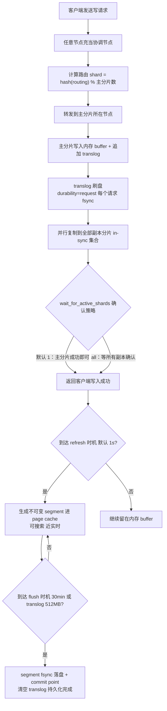
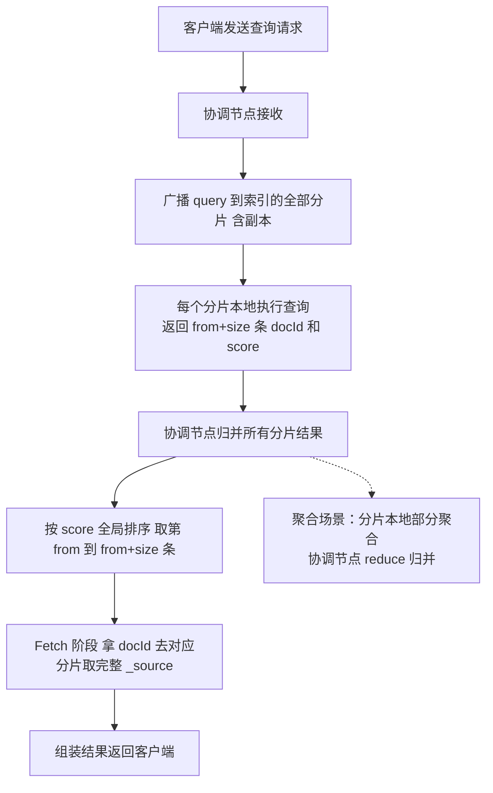
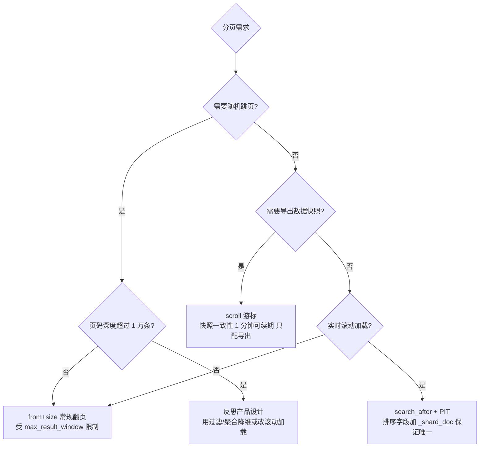
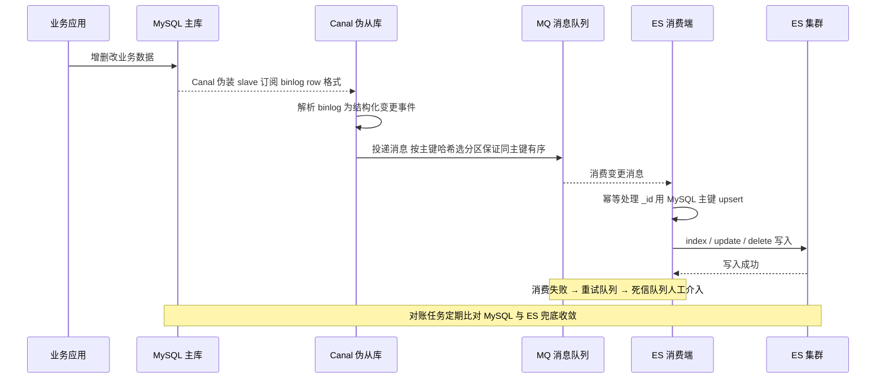

[⬅️ 上一章](06-redis.md) · [📖 返回目录](README.md) · [➡️ 下一章](08-kafka.md)
# 07 · Elasticsearch 原理与调优

> 适用对象：10+ 年经验的资深工程师 / 架构师候选人。ES 在面试中的定位是「检索/分析型中间件的代表」，考的不是 API 用法，而是：倒排索引为什么快、近实时是怎么换来的、深分页三种方案怎么选、脑裂的演进、以及"MySQL 和 ES 怎么同步才不出事"这类架构题。
> 🧭 初学者前置：05 章（MySQL 索引与架构）、06 章（分片思想同源）。

**📌 本章速览：核心要点**

1. ES 的快 = Lucene 倒排索引（FST 词典 + 跳表/位图求交；FST 是一种前缀共享的压缩词典结构，见 §2）+ 分片并行 + 近实时写入（refresh/translog/flush 三件套），本质是用「最终一致性」换写入吞吐；
2. 写入链路要能画出「协调节点 → 路由 → 主分片 → 副本 → refresh → flush」全流程，translog 是 crash-safe 的唯一屏障；
3. 深分页三件套：from+size 上限 1 万、scroll 只配导出快照、search_after + PIT 才是实时翻页的正解；
4. 脑裂是分布式选举的经典考题：从 Zen discovery 的 minimum_master_nodes 到 7.x 的 voting configuration，演进本身就是答案；
5. 调优优先级：mapping 设计 > 分片规划 > 写入参数 > GC；与 MySQL 同步的标准答案是 Canal→MQ→幂等写 ES，双写只配当过渡方案。

---


### 📑 本章目录

- [1. 核心概念](#1-核心概念)
- [2. 写入流程](#2-写入流程)
- [3. 查询流程](#3-查询流程)
- [4. 集群原理](#4-集群原理)
- [5. 高可用与容灾](#5-高可用与容灾)
- [6. 调优](#6-调优)
- [7. 与 MySQL 数据同步](#7-与-mysql-数据同步)
- [8. 高频面试题合集](#8-高频面试题合集)
- [考点速查表](#考点速查表)

## 1. 核心概念


### 1.1 文档、索引、分片与副本

- **文档（Document）**：ES 存储与检索的最小单位，JSON 结构，对应 MySQL 的一行（但 schema-free，靠 mapping 约束）。
- **索引（Index）**：同类文档的集合，对应 MySQL 的一张表。**7.0 起一个索引只能有一个 mapping type**（type 在 6.x 废弃、8.x 移除），因为同索引多 type 共享 Lucene 段、字段冲突难处理，官方顺势砍掉。
- **分片（Shard）**：一个索引被切分为多个分片，**每个分片是一个独立的 Lucene 索引**（完整的倒排索引 + 正排存储）。分片是 ES 并行与分布的基本单位：查询广播到全部分片并行执行，写入路由到单个分片。
- **副本（Replica）**：主分片的完整拷贝。副本分片**只写不读？错——查询时副本同样参与搜索**（协调节点把请求广播到主分片+副本分片，谁快用谁的结果，天然负载均衡）。副本数量可以动态调整，主分片数量建索引后不可改。

**分片数的设计哲学**：分片太多 → 每个分片太小、segment 碎片化、聚合/查询的 fan-out 开销大；分片太少 → 单分片数据量过大、无法水平扩容。官方经验值：**单分片 20~40GB（最佳实践区间，机械盘/SSD 略有差异）**，分片总数（主+副本）控制在节点数的 1~2 倍以内（防止单节点分片过多）。

**版本演进速查（面试谈资，体现"跟得上"）**：

| 版本 | 关键变化 |
|---|---|
| 2.x | Zen discovery 时代，`minimum_master_nodes` 手配防脑裂 |
| 5.x | 默认 5 主分片；BM25 取代 TF-IDF；tiered merge 默认 |
| 6.x | mapping type 开始废弃（单索引单 type）；ILM 雏形（6.6） |
| 7.x | type 移除；默认 1 主分片；voting configuration 重构选举；CCR GA；G1 默认 GC |
| 8.x | `minimum_master_nodes` 彻底移除；内置安全（TLS/认证默认开启） |

### 1.2 倒排索引原理

正排索引是「文档 → 词」；倒排索引反过来，是「词 → 文档列表」。搜索的本质变成：**在词典里查词，再对命中的文档列表做集合运算**。

```
倒排索引结构（Lucene 内部）：
Term Dictionary（词典，内存可加载）
   ├─ 按字典序排序的 term
   └─ 用 FST（Finite State Transducer，有限状态转换器）压缩：共享前缀、构建为最小 DFA
Postings List（倒排列表，磁盘）
   └─ 每个 term 对应：docId 列表 + 词频(tf) + 位置(position) + payload
       docId 用增量编码 + 变长字节压缩；列表内部用跳表，多词 AND 时用跳表或 RoaringBitmap 求交
```

关键工程点：

1. **FST 压缩词典**：词典全部 term 用 FST 编码后往往只有原体积的 1/10 左右，可以常驻堆内存，查询时 O(len(term)) 完成查找，还支持前缀/通配符遍历；
2. **Postings 压缩**：docId 增量存储（如 [1,5,9] 存 [1,4,4]），配合变长整型编码，进一步压体积；
3. **求交优化**：多词查询（如 "Java 面试"）需合并多个倒排列表，Lucene 用跳表跳跃式求交，高基数列表配合 RoaringBitmap 位运算；
4. **正排存储 doc_values**：排序、聚合、脚本访问字段值走列式 doc_values（磁盘 + 页缓存），不走倒排，两者各司其职。

### 1.3 分词器与中文分词

分词器（Analyzer）由三阶段组成：**Character Filter（字符过滤）→ Tokenizer（分词）→ Token Filter（词项过滤）**。例如 `standard` 分词器 = standard tokenizer + lowercase + stop 过滤（默认不启用 stop）。

| 分词器 | 特点 | 适用 |
|---|---|---|
| standard | 按 Unicode 分词，英文友好，中文按单字切 | 英文/默认 |
| ik_max_word | 最细粒度切分，词典 + 歧义处理 | **索引端推荐**（召回全） |
| ik_smart | 粗粒度切分，只保留最合理切分 | **搜索端推荐**（精准） |
| icu_analyzer | 基于 ICU 的 Unicode 分析 | 多语言混合场景 |

**中文分词的工程坑**：ik 是词典分词，新词（人名、产品名、网络热词）切不出来 → 需要维护**自定义词典**（IKAnalyzer.cfg.xml 配置扩展词典，热更新需 reload）；更进阶的方案是词向量/深度学习分词，但词典 + 同义词 + NGram 兜底是绝大多数公司的务实选择。另一个坑：**搜索端和索引端必须用同一套分词配置**，否则查不到——典型错误是索引用 ik_max_word、搜索端忘了配 analyzer。

### 本节高频面试题

**Q1：倒排索引为什么比 B+Tree 更适合全文搜索？**
解答：B+Tree 擅长等值/范围查询（前缀有序），但全文搜索是「任意子串/词项匹配 + 相关性排序」，B+Tree 无法处理"词出现在文档任意位置"的查询，只能全表 LIKE 扫描。倒排索引把「词→文档」关系预计算好，查询时词典查找 O(log n) 甚至 O(1)（FST 压缩后常驻内存），再用位图/跳表求交，天然支持 tf 词频统计用于相关性打分。**本质区别：B+Tree 优化"定位记录"，倒排优化"定位词项"。**
面试官追问：倒排列表求交时，长列表和短列表谁先遍历？——答：Lucene 默认先处理短的（cost 小的）列表，用小集合驱动大集合，减少中间结果集；这也是查询优化器对子句排序的原因。
面试官追问：FST 和 B+Tree 比有什么优缺点？——答：FST 共享前缀、压缩率高、查询与构建复杂度 O(len)；但**不支持范围遍历**（FST 只能精确匹配和按前缀遍历，无法像 B+Tree 那样做区间扫描），所以 Lucene 的 range query 走的是另一套（PointValues/BKD 树），术语是"数据结构各司其职"。

**Q2：中文搜索为什么用 ik 还查不到？你们怎么解决的？**
解答：三种典型原因：(1) 新词未收录，切分错误——维护自定义词典；(2) 搜索端/索引端分词器不一致；(3) 停用词过滤误伤（如"不"被 stop 过滤导致"不开心"搜不到）。解决：ik 自定义词典 + 同义词插件（synonym token filter，注意同义词在索引端展开会膨胀倒排体积、搜索端展开会损失相关性信息，一般推荐搜索端展开）+ 必要时 NGram 兜底（如商品搜索对短词/错别字）。
面试官追问：同义词放在索引端还是搜索端？——答：索引端展开：召回好但索引膨胀、词频被稀释；搜索端展开：索引干净但同义词权重不好控制。通用做法是搜索端展开（analyzer 配置 synonym），并对同义词加权。

---

## 2. 写入流程

### 2.1 从请求到落盘：协调节点与路由

```
写请求 → 任意节点（协调节点 coordinating node）
   → 计算路由：shard = hash(routing) % 主分片数   （routing 默认取 _id）
   → 转发到主分片所在节点
   → 主分片：写入 Lucene 内存 buffer + translog
   → 并行复制到所有副本分片（in-sync 集合内）
   → 副本确认后主分片返回客户端成功
```

要点：

- **路由公式不可变**：`hash(routing) % number_of_primary_shards`，所以主分片数建索引后不能改——改了路由全错位。扩容量只能加副本或重建索引（reindex）。
- **副本同步是"主写副"模型**：主分片负责写，副本确认策略可配（`index.write.wait_for_active_shards`，默认 1，即主分片自己写成功即可返回；设 all 则等所有副本）。
- **协调节点无状态**：任何节点都能当协调节点，请求会带 `?routing=xxx` 或由 ES 自行哈希，因此**客户端轮询多个节点即可负载均衡**，不存在"写死一台"的问题。

### 2.2 refresh、translog、flush：近实时（NRT）的三块拼图

- **refresh（默认每秒一次，`index.refresh_interval=1s`）**：把内存 buffer 中的文档生成一个**不可变的 segment**，写入文件系统缓存（page cache），此时**可被搜索**，但尚未 fsync 到磁盘。这就是"近实时"——写入成功后最多 1 秒可见，而不是实时。
- **translog（事务日志）**：每次写操作先追加 translog（默认为每个请求 fsync 一次，`index.translog.durability=request`；可配 `async` 每 5 秒批量刷盘换吞吐）。translog 是**crash-safe 的唯一屏障**：segment 丢了没关系，重启后从 translog 重放恢复。
- **flush（默认 30 分钟或 translog 达 512MB 触发，`index.translog.flush_threshold_size`）**：把内存中的 segment **真正 fsync 落盘**、生成 commit point（记录已落盘的所有 segment）、**清空 translog**。flush 后数据才算"持久化"。

```
时间线（写入后）：
t0    写入成功（translog 已刷盘，buffer 中）
t0+1s refresh → segment 进 page cache → 可搜索（近实时）
t0+30min / translog 512MB → flush → segment 落盘 + commit point + 清 translog
```

> 图示：ES 文档写入与近实时可见流程



**两个高频坑**：(1) 大批量导入时把 `refresh_interval` 调到 `-1`（关闭自动 refresh），导完再调回——否则每秒一次的 refresh 产生海量小 segment，合并风暴能把集群拖垮；(2) 追求极致写吞吐可以 `translog.durability=async`，代价是**最多丢 5 秒数据**，金融对账场景慎用。

### 2.3 Segment 与合并（Merge）

- 一个分片 = 多个不可变的 segment；**segment 不可变**是 Lucene 的根基：无锁读、可缓存、崩溃恢复简单（未 fsync 的直接删）。
- 删除与更新是"标记删除/新写一条 + 旧 docId 打墓碑"，空间要等合并才释放。
- 合并策略（默认 **tiered merge policy**）：按 segment 大小分层级，小段合并成大段，控制合并成本与段数量；目标是**只读索引段数少**（查询快）、**写入段数增长可控**。
- 合并是后台线程做，大段合并会吃 IO/CPU——高峰期可用 `index.merge.scheduler.max_thread_count` 限制；对不再写入的索引（如按天滚动的历史索引）可以 `force merge` 成 1 个大段，配合 `_source: false` 查询性能起飞。

### 2.4 写入的并发控制与版本（乐观锁）

ES 的更新是「读-改-写」三部曲，并发下需要乐观锁，ES 提供两代机制：

- **老一代：`version` 字段**（内部版本号，每次写 +1），`?version=xxx` 携带期望版本，不匹配返回 409 Conflict——缺点是版本号与业务数据无关，且 copy 到副本有窗口；
- **新一代：`if_seq_no` + `if_primary_term`（6.7+）**：每次写操作携带该文档当前的 `_seq_no`（全局单调递增序号）与 `_primary_term`（主分片任期），写时校验"我基于的版本还是当前版本吗"，不匹配则冲突——这是 ES 版的 CAS，也是官方推荐方式；
- **外部版本：`version_type=external`**：版本号由业务方提供（如 MySQL 的 update_time 毫秒值或自增版本），ES 只认"外部版本更大才允许写"——**这是 MySQL→ES 同步防"旧写覆盖新写"的关键配置**（见第 7 节）；
- 工程认知：ES 的乐观锁只保证"单文档"的写写冲突检测；**跨文档的原子性靠脚本（`_update_by_query` 带 script）或外部事务协调**，ES 本身没有跨文档事务（7.x 后也不再支持跨文档事务化）。

### 本节高频面试题

**Q3：ES 写入为什么是近实时而不是实时的？如果我现在就要实时可见怎么办？**
解答：实时可见需要每次写入都 refresh（生成 segment 并刷入 page cache），代价是写放大和 segment 碎片化，吞吐崩盘。ES 的取舍是"批量攒 1 秒再可见"，把随机小写变成批量段生成。如果业务真的需要写入即可见（如秒杀库存类强一致场景）：可以每次写后显式调 `_refresh`（吞吐代价极大，不推荐）；**更正确的做法是想清楚业务是否真的需要 ES 强一致**——ES 定位是检索/分析，强一致应该靠 MySQL 等主存储，ES 接受最终一致。
面试官追问：refresh 和 flush 的区别？——答：refresh 生成 segment 进 page cache（可搜、未落盘）；flush 把 segment fsync 落盘 + 生成 commit point + 清空 translog。refresh 管"可见性"，flush 管"持久性"。

**Q4：ES 会丢数据吗？什么情况下丢？**
解答：会。(1) `translog.durability=async` 时宕机丢最多 5 秒数据；(2) 副本数=0 且主分片所在节点宕机且无备份恢复；(3) **硬盘损坏 + 无副本**。生产标准配置：副本 ≥1、translog request 级别、数据节点挂载 raid/云盘。注意 ES 默认"主分片写成功即返回"，副本是异步同步的——所以 `wait_for_active_shards=all` + 副本数 ≥1 才能保证"写成功 = 副本也有一份"。
面试官追问：translog 越来越大怎么办？——答：flush 会清空 translog；translog 过大会拖慢恢复（重启重放时间长），可调小 flush_threshold_size 或用 ILM 滚动索引控制单索引体量。

---

## 3. 查询流程

### 3.1 Query-then-Fetch 两阶段

```
阶段一 Query：协调节点把 query 广播到索引的全部分片（含副本）
  → 每个分片本地执行查询，返回 from+size 个 (docId, score) 给协调节点
阶段二 Fetch：协调节点归并所有分片结果，按 score 排序，取全局第 from~from+size 条
  → 拿着 docId 去对应分片取完整 _source，返回客户端
```

> 图示：Query-then-Fetch 两阶段查询流程



关键点：

- **每个分片返回的是 from+size 条**，不是 size 条——所以深分页越深，各分片算的越多，协调节点归并压力越大，这就是深分页慢的根源；
- 搜索是**扇出到所有分片**（包括副本），聚合结果同理需要各分片部分聚合后归并（shard-level agg → reduce）；
- 相关度排序在协调节点做（默认按 _score），但 `sort` 字段排序、聚合、脚本在分片本地做。

### 3.2 相关性评分：TF-IDF → BM25

- 经典 TF-IDF：词频 × 逆文档频率。问题：词频线性增长（一篇文档重复 100 次某词，得分暴涨），长文档天然吃亏。
- **BM25（ES 5.0 起默认）**：对 TF 做**饱和函数**压缩（词频收益递减），并引入**文档长度归一化**（b=0.75 控制文档长度的影响程度，k1=1.2 控制词频饱和度）。两个默认参数是面试常考数字。
- 打分公式（面试能讲清形状即可，不必背全式）：`score = IDF × tf_saturation × length_norm`。工程上常见的坑：**停用词/分词差异导致 BM25 分数异常**、同义词展开导致词频虚高、`boost` 用错位置（query 内 boost 是乘法，function score 可做加法/脚本加权）。

### 3.3 深分页：from+size / scroll / search_after / PIT

| 方案 | 原理 | 优点 | 缺点 | 适用 |
|---|---|---|---|---|
| from+size | 每分片取 from+size 条归并 | 简单、支持随机跳页 | 上限 10000（max_result_window）；深翻页内存/CPU 爆炸 | 前几页 |
| scroll | 首次查询生成**快照**（search context，默认存活 1 分钟，可续期），后续按游标取 | 海量导出稳定、一致快照 | 快照占用堆内存；**不是实时数据**；不支持跳页 | 全量导出、reindex |
| search_after | 用上一页最后一条的排序值作为起点继续查 | 实时、无快照开销、支持深度翻页 | **排序字段必须唯一**（加 _id/_shard_doc tiebreaker）；只能向后翻 | 实时分页/滚动加载 |
| PIT（7.10+） | Point In Time：先建时间点快照句柄，search_after 在 PIT 上翻页 | 分片视图一致 + 实时追加可见 | 需要维护 PIT 生命周期（keep_alive） | 替代 scroll 的推荐姿势 |

**为什么 search_after 快**：它把"深度"转化为"每次只取 size 条"——第 100 万页时 from+size 每分片要取 100 万+条，search_after 每分片只取 size 条，代价是不能随机跳页。**面试结论**：有翻页需求的业务，滚动加载用 search_after+PIT；导出用 scroll；随机跳页超过 1 万条的场景就该反思产品设计了（或上聚合/过滤降维）。

> 图示：深分页三方案选型决策



### 本节高频面试题

**Q5：为什么 ES 深分页（from 很大）那么慢？怎么优化？**
解答：慢在两点：每分片要本地取 from+size 条（深翻页时每分片都在做大量排序）、协调节点要归并全部分片的 from+size 条结果。优化：search_after 把"深度翻页"变成"游标翻页"；限制 max_result_window 防止误用；业务上对超深翻页做过滤降维（时间范围、状态过滤）。
面试官追问：search_after 为什么要求排序值唯一？——答：不唯一时两页之间可能漏数据/重复数据（排序并列的记录边界不确定）；加 _shard_doc（分片内部 docId）或 _id 作为 tiebreaker 保证严格全序。

**Q6：MySQL 有 order by + limit 就能翻页，ES 怎么就不能？**
解答：能，但语义不同。MySQL 的 limit 是"取出来排序后再截断"，深翻页同样慢（filesort），只是 MySQL 单机数据量小、大家没踩到而已；ES 是分布式，深翻页的放大效应是「分片数 × from」级别，指数级放大。两者本质一样：**排序+截断无法避免计算 from+size 条结果**，ES 只是把代价显式化了。

---

### 3.4 查询缓存体系（面试加分项）

ES 的三层缓存，很多人只听说过名字，要能讲清各自缓存什么、失效条件：

| 缓存 | 缓存内容 | 失效条件 | 用途 |
|---|---|---|---|
| Node Query Cache（filter 缓存） | **filter 上下文**的查询结果（docId 位图） | 段合并后失效、LRU 淘汰（默认堆 10%） | 高频过滤条件（状态、时间范围）复用 |
| Shard Request Cache | 完整查询响应（**要求 `size=0`**，通常配聚合） | 索引 refresh（数据变了）即失效 | 相同聚合/计数请求的秒回 |
| Fielddata Cache | text 字段聚合的倒排→正排转换（**堆内存，默认关闭**） | LRU 淘汰 | 不该出现在生产配置里（设计错误） |

工程要点：

1. **filter 上下文与 query 上下文的区别**：filter 不参与评分、结果可缓存；query（如 match）参与评分、结果不可缓存——所以"状态筛选 + 关键词搜索"的正确写法是 `bool: { filter: [状态], must: [match] }`，把高频过滤条件放进 filter 吃缓存；
2. Request Cache 只在 `size=0` 时生效（返回文档列表没意义缓存）；聚合报表类查询命中率极高，但要接受"refresh 前数据一致"（默认 1s 窗口）；
3. 缓存是"段级别"的：合并段后缓存失效重算——**频繁写 + 频繁合并的索引缓存命中率天然低**，别指望缓存救慢查询。

## 4. 集群原理

### 4.1 分片分配与均衡

- 分片分配（allocation）：主分片、副本分片落在哪些节点，由分配器决策，约束条件：**主分片与它的副本不能在同一节点**（`cluster.routing.allocation.same_shard.host` 等可配置同机柜/同可用区限制）、磁盘水位（`cluster.routing.allocation.disk.watermark.low=85%` 默认，超过后不再分配新分片；`high=90%` 开始把分片迁走；`flood_stage=95%` 只读保护——**磁盘写满导致索引变只读是生产事故高发点**）。
- **分片感知（Shard Allocation Awareness）**：通过 `node.attr` 标记可用区/机架，让副本分布在不同故障域。
- 扩容：加数据节点 → 分片自动 rebalance 迁移（`cluster.routing.rebalance.enable` 控制）；**加节点不会自动增加主分片数**，横向扩展的是吞吐与容灾能力。

### 4.2 脑裂与 discovery 的演进（必考题）

- **脑裂（split brain）**：网络分区后集群分裂成两个"都认为自己是主"的部分，各自接受写入 → 数据分叉。老版本（Zen discovery）的解法是**法定人数**：`discovery.zen.minimum_master_nodes = (master-eligible 节点数 / 2) + 1`，候选主节点数不足法定人数时拒绝当选、降级为候选。经典事故：3 个 master-eligible 节点设了 2，网络抖动 + 参数配错 → 两个小集群各自选主 → 数据分叉无法合并。
- **7.x 起重构为基于 quorum 的 voting configuration**：每个 master-eligible 节点在集群状态里保存一份"投票配置"（voting config），选举需要 `(voting 节点数 / 2) + 1` 票；新增/移除节点要显式调整 voting config（`voting_config_exclusions`）。`minimum_master_nodes` 在 8.x 彻底移除。
- **7.x 配置项**：`discovery.seed_hosts`（种子节点列表）+ `cluster.initial_master_nodes`（**首次**集群引导时声明谁参与选举，之后不再需要）。
- **master 职责**：集群元数据管理、分片分配决策、索引创建/删除；master 不转发数据请求（数据走数据节点），所以 master 压力小，但**选举期间集群只读**——这就是为什么要 3 个 master-eligible 节点（奇数，容忍 1 台故障）。

### 本节高频面试题

**Q7：ES 集群脑裂怎么发生？怎么防？**
解答：网络分区使 master-eligible 节点分裂成两组，若两组都能凑够选主条件就会各自选主、各自接受写入，之后分区恢复时数据已分叉，无法自动合并。防：7.x 前正确设置 `minimum_master_nodes = n/2+1`（n 为 master-eligible 节点数，**不是总节点数**——把数据节点也算进去是经典配置错误）；7.x+ 依赖 voting configuration 机制本身防脑裂（法定人数不足的组自动降级）；另外 master-eligible 节点建议 3 或 5 个奇数，避免 2 个这种"平票"配置；网络层面避免交换机单点。
面试官追问：voting configuration 和 minimum_master_nodes 什么关系？——答：voting config 是 7.x 对法定人数的显式化：每个节点持久化一份投票配置（默认就是全部 master-eligible 节点），选举与提交都要求投票配置内的多数票；最小法定人数由"多数"隐式决定，不再需要手配参数，也解决了"配置漂移"（各节点 minimum_master_nodes 配得不一样）导致的脑裂。

**Q8：数据节点宕机后，集群多久恢复？恢复期间能读能写吗？**
解答：故障检测默认 30s（可调 `cluster.fault_detection`），之后 master 发起副本提升，有副本的分片秒级恢复读写；无副本的分片在主分片恢复前不可用。恢复期间：集群处于 yellow（有未分配副本）状态仍可读写；red（有主分片丢失）状态丢数据的索引不可写。工程上：关键索引必须副本≥1，且副本与主分片跨可用区（awareness），故障演练要常态化。

---

### 4.3 主分片选举与故障转移

节点宕机 → master 感知（`cluster.fault_detection`，30 秒内判定）→ 把宕机节点上的主分片在**有完整数据的副本节点**上提升为主（replica promotion）→ 缺失的副本重新分配重建。这里要能讲出两个关键点：**提升优先于重建**（有副本直接提升，秒级恢复；没副本只能从 translog/备份恢复）；**副本提升有极小概率丢数据**（主分片宕机前最后写入的 translog 未同步到副本，老版本靠"提升后主分片以副本为准+丢弃未同步数据"处理，配合 translog 的全局 checkpoint 机制（7.x）把窗口压到最小）。

### 4.4 快照与恢复（snapshot/restore）

- 快照是**增量 + 去重**的：首次全量，之后只存变化的 segment 文件；快照仓库支持 S3/OSS/HDFS/共享文件系统（`PUT _snapshot/my_repo` 注册仓库）；
- 快照执行不阻塞读写（segment 不可变，快照引用即可），但**大索引快照会吃 IO**（要读 segment 上传），建议低峰期执行 + 限速（`indices.recovery.max_bytes_per_sec` 相关参数）；
- 恢复（restore）注意：默认**恢复为新索引**（`rename_pattern`/`rename_replacement`），用于"回滚到某个时间点"或"跨集群迁移"；恢复期间索引可查询（red→yellow→green 渐进）；
- 工程规范：快照是容灾兜底（配合 CCR 缩短 RPO），**必须定期演练恢复**（只备份不演练 = 没有备份）；快照仓库选对象存储（便宜、异地冗余）。

## 5. 高可用与容灾

### 5.1 副本机制

- 副本分片与主分片**数据完全相同**，参与搜索、不参与写入（写入只走主分片转发）。
- 副本数动态可调（`PUT /index/_settings {"number_of_replicas": 2}`），**调大副本 = 提升读吞吐 + 容灾，代价是写入复制成本**。
- 副本缺失时集群 yellow，master 自动在其他节点重建副本（占用 IO，注意限速 `cluster.routing.allocation.node_concurrent_recoveries`）。

### 5.2 跨集群复制（CCR）

- **CCR（Cross-Cluster Replication，7.x GA）**：leader 索引 → follower 索引，单向复制，跨集群容灾/读写分离（如两地三中心、本地读远端写）。
- follower 通过拉取 leader 的 **translog 操作**（不是整文档）重放，保证与 leader 最终一致；可配 `replication` 延迟（默认实时拉取）。
- 局限：单向、非强一致（有延迟）、follower 不能直接写；**主动-主动双写 ES 集群是反模式**（分片级冲突无法自动解决）。
- 更重的容灾方案：快照（snapshot）到对象存储（S3/OSS）+ 跨集群恢复演练，作为 CCR 的兜底。

### 本节高频面试题

**Q9：两地三中心场景，ES 怎么做容灾？**
解答：分层：同城双活用「分片感知 + 副本跨可用区」；异地容灾用 CCR（主集群 → 备集群单向复制）或快照定期恢复（RPO 取决于快照频率）。注意 CCR 是异步的，RPO 不为零；且 follower 集群只读，故障切换时要切读写流量 + 改造 follower 为 leader（CCR 支持 promote）。金融场景可接受秒级 RPO 用 CCR，接受小时级用快照，接受分钟级可两者结合（快照兜底 + CCR 缩短窗口）。

---

## 6. 调优

### 6.1 索引模板与 mapping 设计（收益最大的一环）

**索引模板（index template，7.x 用 component template 组合）**：按索引名模式（如 `logs-*`）自动套用 settings + mapping，新索引自动继承——按天/按月滚动索引（配合 ILM）是日志/流水类数据的标准姿势。模板示例：

```json
PUT _index_template/logs-template
{
  "index_patterns": ["logs-*"],
  "template": {
    "settings": {
      "number_of_shards": 3,
      "number_of_replicas": 1,
      "index.lifecycle.name": "logs-ilm",      // 挂 ILM 策略自动流转
      "index.refresh_interval": "10s"          // 日志类可放宽可见性
    },
    "mappings": {
      "dynamic": "strict",                     // 关动态 mapping，防字段爆炸
      "properties": {
        "@timestamp": { "type": "date" },
        "level":      { "type": "keyword" },
        "message":    { "type": "text", "fields": { "keyword": { "type": "keyword", "ignore_above": 256 } } },
        "trace_id":   { "type": "keyword" }
      }
    }
  }
}
```

要点：**settings 与 mapping 都进模板**，新索引零配置；字段白名单化（strict）后新增字段要显式加 mapping，防止脏字段污染（如日志里偶尔出现的超大随机 key）。

mapping 设计铁律（每条都能讲出"为什么"）：

1. **显式 mapping，别靠 dynamic**：dynamic mapping 会把字符串全映射成 `text + keyword` 双字段，数字猜成 long，堆与磁盘双爆炸。生产关闭 dynamic（`"dynamic": "strict"` 或显式声明）。
2. **`keyword` vs `text`**：精确匹配/排序/聚合/分组用 keyword（走 doc_values 列存）；全文检索用 text（走倒排）。**一个字段既想分词又想聚合 → 显式 multi-fields**（`"fields": {"raw": {"type": "keyword"}}`），别让 ES 默认行为替你决定。
3. **关闭用不到的索引能力**：不全文检索的字段别建 text；不需要 norms 的字段关掉（省堆）；不需要排序聚合的字段关 doc_values（省磁盘）；`_source` 可关（省磁盘但失去 reindex/update 能力，慎用）。
4. **字段类型选型**：经纬度用 `geo_point`；IP 用 `ip`（支持 CIDR 范围查）；时间用 `date`（指定 format）；大文本用 `keyword` + 截断（`ignore_above`）而不是 text——避免无意义的全文索引膨胀。
5. **id 设计**：用业务主键做 `_id`（幂等写入的基石，配合 version_type=external 做乐观锁），别让 ES 生成随机 UUID（reindex/同步时无法去重）。

### 6.2 冷热分层与 ILM

- **冷热分层（hot-warm-cold）**：7.x 用 `node.roles: [data_hot / data_warm / data_cold]` 区分节点组：hot 用 SSD 承接实时写入与近期查询；warm 用普通盘放近月数据；cold 用大容量盘 + `freeze`（searchable snapshot 后甚至可以只留快照）。
- **ILM（Index Lifecycle Management，6.6+）**：自动执行 `hot → warm → cold → delete` 阶段迁移，每个阶段可配 rollover（按大小/文档数/时长滚动新索引）、force merge、shrink、迁移到指定节点属性。**这是"日志索引无限增长把磁盘打满"的唯一正确解**。
- 阶段迁移的坑：shrink 会把分片数减少（写死 1 分片），查询历史索引走 cold 节点时 `_search` 会有跨节点 fan-out，聚合查询要评估延迟。

### 6.3 写入吞吐优化（按性价比排序）

1. **bulk 批量写**：官方建议单批 5~15MB（几千到几万条/批），逐批实测找拐点；客户端用 bulk processor 异步攒批；
2. **关/调大 refresh_interval**：批量导入期设 `-1`，日常 10s~30s（业务可接受的可见延迟内）；
3. **translog 异步刷盘**（`durability=async`）：能接受 5 秒 RPO 时收益明显；
4. **副本数 = 0 导入**：全量重建索引时先把副本设为 0，导完再恢复（注意：**副本恢复要趁集群空闲**，否则重建副本的 IO 与查询抢资源）；
5. **合并限速**：`indices.store.throttle` / merge 线程数限制，避免合并风暴；
6. **写入路径优化**：客户端与数据节点同机房（减少跨机房延迟）、关闭不需要的字段索引、避免超大文档（>100MB 直接拒绝，`http.max_content_length`）。

### 6.4 聚合优化

- 聚合默认走 **doc_values（列式、磁盘 + 页缓存）**，不走倒排；text 字段聚合会 fallback 到 fielddata（**堆内存、默认关闭**）——所以"text 字段要聚合"是设计错误，必须用 keyword 子字段。
- 高基数 keyword 聚合（如千万级 distinct 用户）用 `eager_global_ordinals` 预热；深度分桶聚合用 **composite aggregation**（游标式分页聚合，替代 terms 深桶）。
- 聚合本质是"分片本地聚 → 协调节点归并"，**桶数 × 分片数**决定归并开销——聚合慢先查是不是桶太多（`size: 0` 的 terms 聚合默认 10 个桶，别开成 10 万）。
- 大聚合优先用 `search` 与聚合分离：数据量大时考虑用**预聚合**（写入时算好指标字段）或降级到 ClickHouse 做 OLAP（见第 8 节选型）。

### 6.5 GC 与堆调优

- ES 的堆是"缓存 + 工作区"：**堆越大留给 OS page cache 的越少**（倒排/正排都吃页缓存），官方建议堆 ≤ 32GB（压缩指针失效点），常见配置 16~31GB，**总内存的一半**给堆、一半留给页缓存；
- 7.x 默认 **G1**（此前 CMS）；关键调优项不是换收集器，而是：**减少堆上对象**（fielddata 关闭、避免大分页结果集、scroll 上下文及时清理 `clear_scroll`）、监控 `old gen` 与 GC 停顿（ES 的 `cat/thread_pool`、`_nodes/stats/jvm`）、**堆外内存与堆内存比例**（`indices.breaker.total.limit` 默认 95% 熔断保护——聚合/查询把堆打爆时 circuit breaker 会直接拒绝请求，这是保护机制不是 bug）；
- 经典排查：GC 频繁先查**是否分片过多**（每分片一个 Lucene 实例，查询全部扇出）→ 是否 fielddata/大聚合 → 是否堆太小。

### 6.6 别名、滚动索引与 reindex 实战

- **别名（alias）**：一个别名指向一个或多个索引，读写都走别名——**零停机切换的基石**。滚动索引流程：新索引建好并追平数据 → `POST /_aliases` 原子操作（remove 旧 + add 新）→ 删旧索引。别名还支持 filter 与 routing（按租户路由到不同索引）；
- **滚动索引（rollover）**：`PUT /logs-write/_rollover` 按条件（`max_size`/`max_docs`/`max_age`）自动把写别名切到新索引——配合 ILM 就是"按天/按大小滚动"的自动化；
- **reindex**：索引间迁移（改 mapping、改分片数、跨集群迁移），`POST _reindex` 从源索引 scroll 读取写入目标。要点：大索引 reindex 要控制 `slices`（并行分片数）与限速；**reindex 不改变 `_id` 默认保留**（幂等，可重跑）；
- 实战口诀：**「建新 → 追平 → 切别名 → 删旧」是 ES 所有变更（mapping 调整、分片调整、版本升级）的统一姿势**，没有别的正解。

### 6.7 常用运维命令速查

| 命令 | 用途 |
|---|---|
| `GET _cluster/health` | 集群状态（green/yellow/red）与未分配分片数，排障第一入口 |
| `GET _cat/indices?v` | 各索引体量（docs/存储/主分片/副本） |
| `GET _cat/shards?v` | 分片分布与状态（定位 red/yellow 分片） |
| `GET _cat/allocation?v` | 各节点分片数与磁盘占用（发现倾斜） |
| `GET _cat/recovery?v` | 正在进行的分片恢复/迁移（定位 IO 抖动） |
| `GET _nodes/stats/jvm,os,fs` | 节点 GC/内存/磁盘/IO 指标（定位慢节点） |
| `POST /index/_forcemerge?max_num_segments=1` | 只读索引段合并（查询提速、释放磁盘） |
| `PUT /_snapshot/repo` + `POST /_snapshot/repo/snap` | 快照备份与恢复 |
| `GET /index/_search?scroll=1m` + `DELETE /_search/scroll` | scroll 导出（**用完必须清 scroll 上下文**） |
| `POST /_flush` / `POST /_refresh` | 手动 flush/refresh（导入场景） |

### 本节高频面试题

**Q10：一个亿级文档的订单索引，mapping 你会怎么设计？**
解答：要点：显式 mapping 关 dynamic；状态/类型/城市等枚举用 keyword；订单号用 keyword（精确匹配）；商品名/备注用 text（ik）+ keyword 子字段；金额用 scaled_float 或 long（分转元，避免浮点误差）；时间用 date 且统一 format；业务主键（订单号）做 _id；按创建时间滚动索引（每月一个，配合 ILM 冷热分层）；大文本字段 ignore_above。再补一句：查询模式决定索引设计，先列查询场景再定字段。
面试官追问：scaled_float 和 double 选哪个？——答：scaled_float 用 long 存储放大后的整数，省磁盘、无浮点误差（如金额乘 100 存分）；double 有精度问题、聚合求和可能对不上账。金额类一律 scaled_float 或 long。

**Q11：写入很慢，你怎么排查和优化？**
解答：排查顺序：先看是不是**集群层面的问题**（CPU/IO 打满？GC 频繁？磁盘水位？合并风暴？）再回到单索引（bulk 批大小、refresh_interval、translog 模式、副本数、文档大小、客户端连接数/线程池是否打满 `thread_pool: bulk`）。优化按 6.3 的性价比顺序来。另外一定要区分"慢在客户端"还是"慢在集群"：`_nodes/stats` 看索引线程池队列积压、`_cat/indices?v` 看索引体量。
面试官追问：bulk 批大小越大越好吗？——答：不是。单批过大会导致单次请求内存峰值高、GC 压力大、失败重试成本高；官方建议 5~15MB，且要按**字节数**而不是条数估算（文档大小差异大）；正确做法是压测找拐点。

**Q12：聚合查询特别慢，怎么优化？**
解答：分层排查：(1) 是否 text 字段聚合触发 fielddata（设计错误，改 keyword 子字段）；(2) 桶数 × 分片数是否过大（terms size 限制、composite 分页）；(3) 高基数字段是否预热 global ordinals；(4) 数据量大是否该换 ClickHouse 或做预聚合（写入侧算好指标）；(5) 查询并发与协调节点资源。面试加分项：主动说"聚合慢往往是架构问题——把 OLAP 活交给 ClickHouse，ES 只做检索"。

---

## 7. 与 MySQL 数据同步

### 7.1 方案选型

| 方案 | 原理 | 实时性 | 优点 | 缺点 |
|---|---|---|---|---|
| Canal + MQ + 消费者 | Canal 伪装 MySQL slave 订阅 binlog（row 格式）→ 投递 Kafka/RocketMQ → 消费写 ES | 秒级 | 对业务无侵入、可靠（MQ 削峰+重试）、可扩展 | 引入两条链路，运维复杂 |
| 应用双写 | 业务代码里先写 MySQL 再写 ES | 即时 | 简单直接 | 双写不一致（ES 失败/延迟）、侵入业务、代码里到处是同步逻辑 |
| Logstash JDBC input | 定时轮询增量列（如 update_time） | 分钟级 | 零代码 | 不实时、依赖 update_time 字段、删数据难同步 |
| 定时全量重建 | 每天/每周全量重建索引 | 天级 | 简单 | 延迟大，只配做兜底 |

**生产标准答案：Canal 订阅 binlog → MQ（削峰、重试、解耦）→ 消费者幂等写 ES**。双写只配当过渡方案（项目早期、数据量小、没有 MQ 基建时），长期双写 = 长期对账。

> 图示：Canal 订阅 binlog 同步 MySQL 到 ES



### 7.2 一致性与工程细节

1. **幂等**：ES 文档 `_id` 用 MySQL 主键，写 ES 是 upsert（`index` 或 `update`），重放多少次结果一致——这是整个链路正确的基石；
2. **顺序**：同一行数据的 binlog 事件必须按序消费（同一主键路由到同一 MQ 分区 + 同一 ES 分片），否则"先到的新值被后到的旧值覆盖"；Canal 侧按主键哈希分区；
3. **失败重试**：消费失败进重试队列，最终进死信队列人工处理（对账任务兜底：定期比对 MySQL 与 ES 的 count/抽样 id）；
4. **全量 + 增量**：首次建索引先全量（es 官方 reindex 或自写导数据任务），跑增量（Canal）时注意**先启增量再停全量**或加版本号/时间戳防覆盖——经典事故：全量任务晚于增量任务写入，把新数据覆盖成旧数据；
5. **删除同步**：binlog delete 事件 → ES `_delete`（注意 ES 是软删，段合并才真正释放空间）；
6. **版本控制**：多写者场景（如管理后台直接改 ES）用 `version_type=external`（外部版本号 = MySQL 的 update_time/自增版本）做乐观锁，避免旧写覆盖新写。

### 本节高频面试题

**Q13：双写方案为什么不好？如果公司已经双写了，怎么收？**
解答：双写的三个原罪：时序不可控（MySQL 成功、ES 失败/超时 → 数据不一致）、业务侵入（每个写路径都要带一段 ES 逻辑，耦合）、无法对账（没有统一日志）。收的方案：保留双写期间加**对账任务**（比对主键集合与版本号，修复差异），同时并行搭建 Canal + MQ 链路，双写代码灰度摘除（先摘读、再摘写），最终只留 Canal 链路 + 对账兜底。
面试官追问：Canal 挂了怎么办？——答：Canal 高可用（多实例竞争同一个 binlog position，用 ZooKeeper/自身协调），MQ 侧消息不丢（ack 机制），ES 消费幂等可重放；更关键的是**对账任务兜底**——任何链路都可能挂，最终一致性靠对账收敛，这是架构级认知。

**Q14：MySQL 与 ES 的最终一致，窗口期有多大？怎么缩短？**
解答：窗口 = binlog 采集延迟 + MQ 积压 + 消费处理延迟，正常秒级。缩短：Canal 就近部署（同机房）、MQ 分区数充足、消费者按主键并行、ES bulk 批量写；极端场景（大促）允许窗口拉大但必须可观测（监控 MQ lag + ES 侧对账差异率）。面试话术：**不要追求 ES 与 MySQL 强一致，那是错误目标；正确目标是"有界延迟 + 可观测 + 可收敛"**。

---

## 8. 高频面试题合集

**Q15：为什么 ES 查询比 MySQL LIKE 快这么多？** 解答：LIKE '%xx%' 无法用 B+Tree 索引，全表扫描 + 逐行子串匹配；ES 查询走倒排索引（词 → 文档列表，词典 FST 常驻内存），且分片并行 + 页缓存。本质是**数据结构与预计算**的差距。追问：ES 适合做精确的等值查询吗？——答：适合但没必要，等值查询 MySQL/HBase 更省资源，ES 的甜区是全文检索与聚合分析。

**Q16：ES、HBase、ClickHouse 三选一，怎么选？** 解答：ES：全文检索、相关性排序、文档模型、中大规模聚合——搜索/日志/APM 场景；HBase：海量 KV 随机读写、强一致、稀疏宽表，无检索无聚合——订单流水、轨迹、推荐特征的存储层；ClickHouse：列存 OLAP、超大吞吐聚合分析、压缩率高，更新/删除弱、join 弱——BI 报表、监控指标分析。工程上常组合：**MySQL（事务主存储）→ Canal → ES（检索）+ ClickHouse（分析）**，各司其职。

**Q17：你们 ES 集群晚上 GC 频繁、查询变慢，怎么定位？** 解答：定位链：`_nodes/stats/jvm` 看 GC 次数与耗时 → 是不是定时任务在跑大聚合/scroll 导出 → 是不是日志索引在 force merge/shrink → 是不是分片分配/rebalance 在搬家（`_cat/allocation`、`_cat/recovery`）→ 是不是堆上有大量 fielddata（`_nodes/stats/indices/fielddata`）。治理：错峰跑批任务、聚合限流、mapping 修正、堆与页缓存比例检查。加分项：说"先看是不是**自伤**（自己的批任务），再看外部流量"。

**Q18：索引从 5 个分片变成 50 个分片会怎样？** 解答：每个分片是独立 Lucene：段数量 × 分片数、查询 fan-out ×10、聚合归并 ×10、堆内存（segment 元数据）上涨——单查询延迟和集群内存双双恶化。教训：分片数是"出生时定死"的，规划用「目标数据量 / 30GB」估算，宁少勿多（少了可以重建，多了只能 reindex）。追问：reindex 怎么做不停机？——答：别名（alias）切换：新索引建好 → 增量追平（Canal/双写）→ 原子切别名（`_aliases` 一次 API 完成旧索引摘除 + 新索引挂上）→ 删旧索引。这是 ES 版蓝绿发布。

**Q19：什么是 circuit breaker？遇到过 ES 返回 429/内存熔断吗？** 解答：ES 的自我保护：请求预估内存超过熔断阈值（`indices.breaker.total.limit` 默认 95%）直接拒绝，防止 OOM 拖垮整个节点。遇到 429 说明**请求太大或堆太小**：优化方向是拆小聚合、限制桶数、检查是否 fielddata、扩容堆/节点。加分：把熔断当"健康信号"而不是"错误"。

**Q20：你们的 ES 集群多少节点、怎么规划？** 解答（架构师必答模板）：按数据量与 QPS 算分片（单分片 30GB 经验值）→ 数据节点规格（内存 32G 配 16G 堆 + SSD）→ 3 个 master-eligible（独立小规格机器或与数据节点分离，避免选举抖动）→ 副本 ≥1 跨可用区 → ILM 冷热分层 → 容量水位告警（磁盘 80% 预警、90% 迁移、95% flood）→ 快照备份到对象存储。展示的是**容量规划方法论**，不是具体数字。

**Q21：快照备份和副本有什么区别？为什么有了副本还要快照？**
解答：副本防"节点/机器故障"，快照防"逻辑错误"——**误删索引、bad mapping 全量写入、集群级灾难（机房全挂）**。副本跟着错误一起复制（你删了索引副本也删了），快照是时间点回放。RPO 对比：副本秒级、快照取决于频率（小时级）。工程上：副本保证 SLA，快照保证"后悔药"，两者互补，都要有。
面试官追问：快照恢复时索引还在写怎么办？——答：restore 默认恢复为独立索引（改名），与现存索引并存，业务侧切别名完成回滚；恢复期间源索引正常读写，互不影响。

**Q22：mapping 已经建错了（比如把 keyword 建成了 text），线上怎么改？**
解答：mapping 不可变（字段类型不能改），正解是**重建索引**：新索引（正确 mapping）→ 追平增量（Canal/双写，或 reindex 全量）→ 切别名 → 删旧。如果只是**加新字段**：`PUT mapping` 动态追加即可（已存在字段不能改类型）。面试补充：这就是为什么"显式 mapping + 别名 + 滚动索引"是生产标配——没这三样，改 mapping 就是停机事故。

**Q23：线上索引查询突然变慢，你的排查路径是什么？**
解答（排障模板）：先看**集群还是单索引**（`_cluster/health` + `_cat/indices`）→ 集群级：GC 停顿（`_nodes/stats/jvm`）、磁盘 IO 打满（recovery/merge 在跑？）、熔断触发（429 日志）、脑裂（master 抖动）；索引级：段数爆炸（`_cat/segments`，没 force merge 的历史索引）、分片分布倾斜（`_cat/allocation`）、查询本身（大聚合、深分页、script 慢）、缓存命中率（filter 写没写）。**经验法则：先看是不是自伤（批任务/合并/恢复），再看外部流量**。
面试官追问：段数多为什么查询慢？——答：每个 segment 有自己的倒排索引与元数据，查询要扇出到所有 segment 再归并，段数 ×100 时即便每个段都快，归并与随机 IO 也拖垮延迟；只读索引 force merge 到 1 段收益最明显。

**Q24：日志平台（ELK 类）的架构你会怎么设计？**
解答（架构题模板）：采集层（Filebeat/自研 Agent，轻量、带缓冲）→ 传输层（Kafka 削峰解耦，日志量大时别直连 ES）→ 解析清洗（Logstash/自研 consumer，结构化 + 字段裁剪 + 脱敏）→ 存储检索（ES 按天滚动索引 + ILM 冷热分层 + 生命周期，hot 7 天/warm 30 天/cold 180 天/删除）→ 展示告警（Kibana + 告警规则）→ 容量与水位监控。要点：**Kafka 是日志平台的心脏**（削峰 + 多消费方复用：检索一份、数仓一份），ES 只做"近实时检索"，全量分析交给数仓/ClickHouse——这是日志量级过 TB/天的必然分叉。

---

## 考点速查表

| 考点 | 一句话要点 |
|---|---|
| 倒排索引 | 词典（FST 压缩常驻内存）+ 倒排列表（跳表/位图求交），搜索=查词+合并 |
| 分词器 | 三阶段（char filter→tokenizer→token filter）；中文 ik_max_word 索引 / ik_smart 搜索 |
| 近实时 | refresh 1s 生成 segment 可搜；translog 保 crash-safe；flush 30min/512MB 落盘清 translog |
| 写入路径 | 协调节点 hash(_id)%分片数 路由 → 主分片写 buffer+translog → 同步副本 → 返回 |
| 主分片不可改 | 路由公式依赖主分片数，扩容只能加副本或 reindex |
| 评分 | BM25（k1=1.2, b=0.75）5.0 起默认，TF 饱和 + 长度归一化 |
| 深分页 | from+size ≤1 万；scroll 只配导出快照；search_after+PIT 实时翻页且排序需唯一 tiebreaker |
| query-then-fetch | 每分片取 from+size 条归并排序 → 再 fetch _source；深翻页慢的根源 |
| 脑裂 | 老：minimum_master_nodes=n/2+1；7.x voting configuration 多数票；8.x 移除该参数 |
| 分片分配 | 主副本不同节点、磁盘水位 85/90/95%（95% 只读 flood）；awareness 跨故障域 |
| 副本/容灾 | 副本参与读；CCR 跨集群单向复制（translog 重放）；快照兜底 |
| mapping 铁律 | 显式 mapping、keyword vs text 分清、关 norms/doc_values、业务主键做 _id |
| 冷热分层 | ILM 自动 hot→warm→cold→delete；rollover 滚动索引 |
| 写入调优 | bulk 5~15MB、refresh -1 导入、translog async、副本 0 导入、合并限速 |
| 聚合优化 | doc_values 列存；text 聚合是设计错误；composite 分页；预聚合/换 ClickHouse |
| GC 调优 | 堆 ≤32GB 且 ≤ 总内存一半，另一半留页缓存；7.x 默认 G1；熔断是保护 |
| MySQL 同步 | Canal→MQ→幂等 upsert（_id=主键）；双写仅过渡；对账任务兜底 |
| 选型 | 检索聚合选 ES；KV 强一致选 HBase；OLAP 大吞吐聚合选 ClickHouse |

---

[⬅️ 上一章](06-redis.md) · [📖 返回目录](README.md) · [➡️ 下一章](08-kafka.md)
