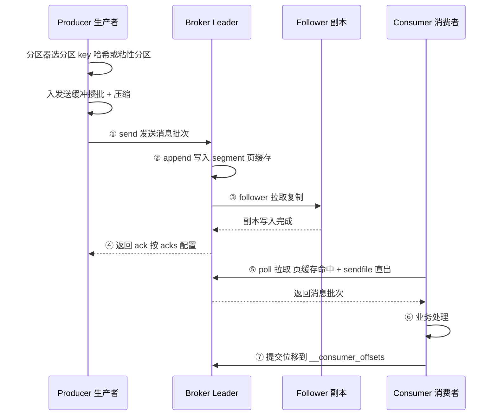
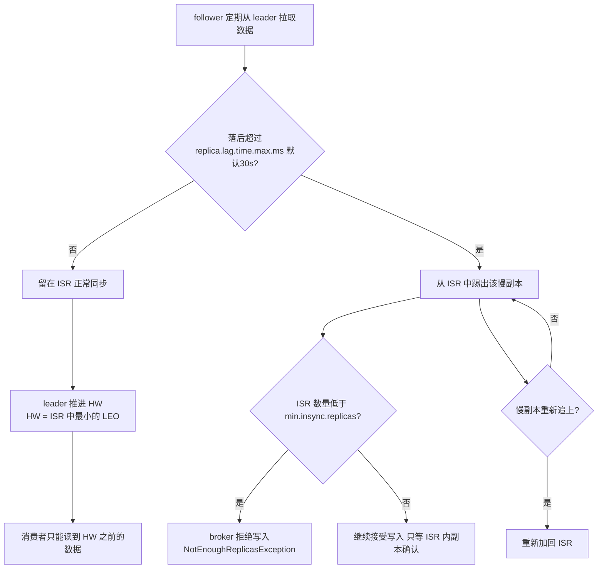
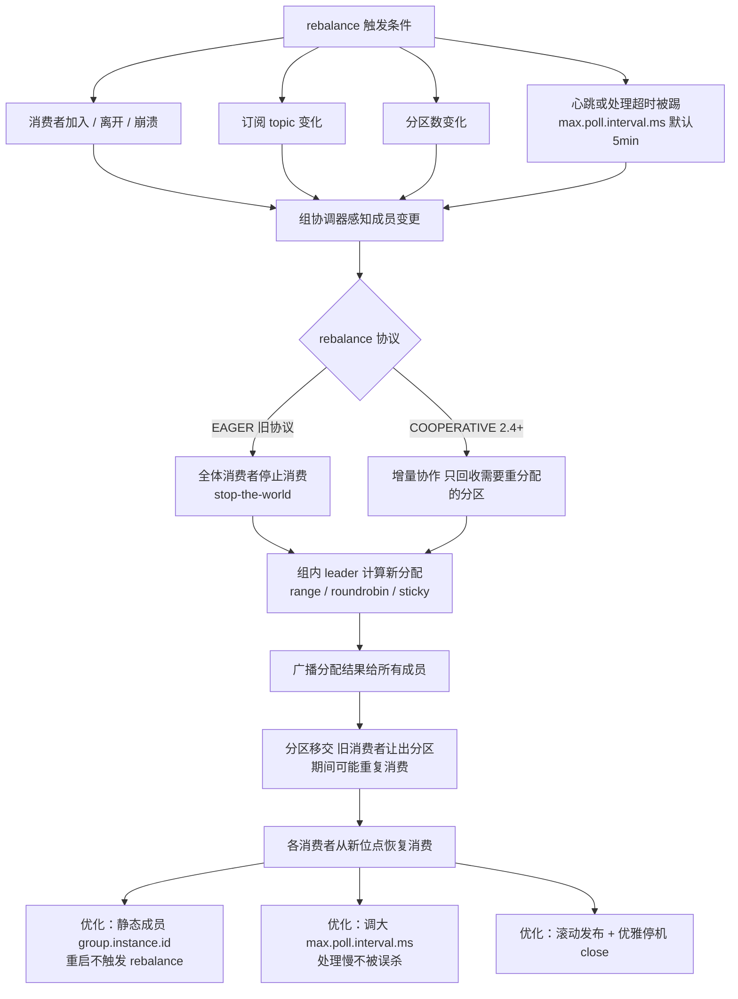
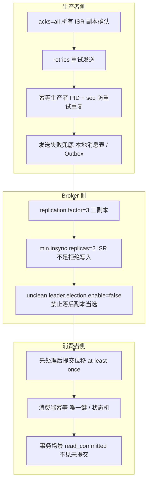

[📖 返回目录](README.md) · [⬅️ 上一章](07-elasticsearch.md) · [➡️ 下一章](09-rocketmq-rabbitmq.md)

# 08 · Kafka 原理与消息可靠性（资深向）

> 适用对象：10+ 年经验的资深工程师 / 架构师候选人。Kafka 面试的深度分水岭是：能背"零拷贝、顺序写、ISR"名词（及格），还是能把「acks 三档 + min.insync.replicas + 幂等 + 位移提交」串成一条"消息到底丢没丢、重没重"的完整推理链（优秀）。本章按这个标准写。

**TL;DR 本章学习要点**

1. Kafka 吞吐高的本质是「日志」：顺序写 + 页缓存 + 零拷贝（sendfile）+ 批量 + 压缩，读和写都不经过 JVM 堆；
2. 可靠性三件套必须能串起来讲：生产者 acks=all + min.insync.replicas + unclean.leader.election.enable=false，少一个都可能丢数据；
3. 幂等生产者（PID+序列号）只解决「单分区单会话」的生产端重试重复，跨分区/跨会话的精确一次要靠事务 + read_committed；
4. rebalance 是消费端最大的敌人：EAGER→COOPERATIVE 的演进、静态成员、max.poll.interval 超时，每个都要能讲清触发条件与代价；
5. 面试的架构题落点：不丢不重不乱的方案设计、积压治理的完整套路（扩容→定位慢消费→旁路）、以及 Kafka/RocketMQ/RabbitMQ 的选型逻辑。

---


### 📑 本章目录

- [1. 架构总览](#1-架构总览)
- [2. 存储设计](#2-存储设计)
- [3. 副本与一致性（本章核心）](#3-副本与一致性本章核心)
- [4. 生产者](#4-生产者)
- [5. 消费者](#5-消费者)
- [6. 顺序性、不丢失 / 不重复 / 积压治理](#6-顺序性不丢失--不重复--积压治理)
- [7. 监控与运维](#7-监控与运维)
- [8. Kafka vs RocketMQ vs RabbitMQ 选型对比](#8-kafka-vs-rocketmq-vs-rabbitmq-选型对比)
- [9. 高频面试题合集](#9-高频面试题合集)
- [考点速查表](#考点速查表)

## 1. 架构总览


### 1.1 Broker、Topic、Partition 与消费组

```
Producer ──▶ Broker（Partition 0 ── 分区是并行单位）
              ├─ Partition 1       每个分区：有序、可追加、有副本
              └─ Partition 2       消费组内一个分区同时只被一个消费者消费
                 ▲
Consumer Group（组内消费者瓜分分区；组间互不影响，各自独立消费全量）
```

- **Topic**：逻辑分类；**Partition**：物理存储与并行的基本单位（一个分区 = 一个目录下的 log），分区内消息有序（追加写入 + 顺序消费），**跨分区无序**——"Kafka 能保证顺序"这句话必须限定在分区内；
- **副本**：每个分区 1 主 N 从（`replication.factor`，生产推荐 3）；**follower 不参与读写**（只从 leader 拉取备份，与 ES 副本参与查询不同），这保证了"读一致性"（消费者永远只看到 leader 上的数据）但牺牲了读扩展性；
- **消费组**：组内消费者瓜分分区（一个分区同时只被组内一个消费者消费）；组与组之间是发布订阅（各自消费全量）；消费者数 > 分区数时多余的消费者空转——**扩容消费能力的天花板是分区数**；
- **控制器（Controller）**：Broker 中选举产生（早期依赖 ZooKeeper 选举，KRaft 后由自身 quorum 选），负责分区 leader 选举、分区分配、元数据广播。控制器故障会触发重选，期间元数据变更不可用（数据读写不受影响）。

### 1.2 版本演进（面试谈资，体现"跟得上"）

- 0.8：依赖 ZooKeeper，消费位移存 ZK（后改存 Kafka 内部主题）；
- 0.11：幂等生产者、事务 API、leader epoch（解决 HW 截断丢数据）；
- 2.4：粘性分区（sticky partitioner）、增量式 rebalance（cooperative sticky）；
- 2.8 起：KRaft（内置 Raft quorum 替代 ZooKeeper）逐步可用，3.3 起生产可用，**4.0 彻底移除 ZooKeeper**。

### 1.3 一条消息的一生（全链路时序）

```
Producer 应用
  │ ① send(record)：分区器选分区（key 哈希 / 粘性）→ 入发送缓冲攒批 → 压缩
  ▼
Broker Leader：② append 到 segment（写页缓存）→ ③ follower 拉取复制
  │              → ISR 确认 → ④ 返回 ack 给 Producer
  ▼
Consumer：⑤ poll 拉取（页缓存命中 / sendfile 直出）→ ⑥ 业务处理
  → ⑦ 提交位移（__consumer_offsets）
```

每个环节都要能回答"这里会丢吗 / 这里会重吗"——这正是第 9 节 Q16 的链路排查题的地图。

> 图示：一条消息从生产到消费的完整生命周期



面试时能一边画这条线一边讲可靠性，比背任何参数都加分。

### 本节高频面试题

**Q1：为什么 Kafka 的 follower 不参与读？**
解答：设计取舍：保证「同一分区所有消费者看到一致的数据视图」（读 leader 天然一致，无需像 ES 那样等副本追上）；同时把读放大问题转移到存储层解决——Kafka 用页缓存 + 零拷贝让单机读吞吐足够高，不需要副本分担读。对比：ES 副本参与搜索是"读写分离 + 读扩展"，Kafka 是"主读 + 极致单机吞吐"，两种模型由存储介质特性决定。
面试官追问：那 Kafka 怎么扩展读能力？——答：加分区（分区是并行单位）、加消费组（不同组各消费全量）、或者加 topic 副本数其实不提升读吞吐（follower 不服务读）。读扩展的本质是"增加分区数 + 增加消费者"，分区数上限由数据量与 broker 数决定。

---

## 2. 存储设计

### 2.1 Log Segment 与稀疏索引

- 一个分区的 log 目录下是**多个 log segment 文件**（默认 1GB 滚动，`log.segment.bytes`），每个 segment 配套 `.index`（稀疏索引）与 `.timeindex`（时间索引）；
- **稀疏索引**：`.index` 不是每条消息一条索引，而是**每写约 4KB 数据记一条**（`log.index.interval.bytes`），记录 `相对 offset → 文件物理位置`。查找时二分定位到最近的索引项，再顺序扫描到目标 offset——稀疏是为了索引文件小（可常驻页缓存/内存）；
- 消息本身只存 **offset、时间戳、key、value 和头部**，不存"上一跳/下一跳"指针，所以定位靠 offset 计算 + 索引，删除靠**整体删除过期 segment**（`log.retention.hours`，默认 7 天）——**Kafka 没有单条删除**，这是它与传统 MQ 最大的存储哲学差异（"日志"而非"队列"）。

### 2.2 页缓存、顺序写与零拷贝：吞吐高的三大支柱

1. **顺序写**：消息只 append 到 segment 尾部，写盘是顺序 IO；机械盘顺序写也能到百 MB/s 级，SSD 更甚——随机写与顺序写差 1~2 个数量级；
2. **页缓存（page cache）**：生产者和消费者都不直接读写磁盘，而是读写 OS 页缓存；**读写都不经过 JVM 堆**（对比 RocketMQ 部分走 mmap/堆外、RabbitMQ 走 Erlang 进程内存），所以 Kafka broker 堆只用 6~8GB 就够，内存大头全留给页缓存，命中页缓存的读写是纯内存速度；
3. **零拷贝（sendfile）**：消费者拉数据时，数据从「页缓存 → socket」直接由内核完成（DMA + 内核态拷贝），**不经过用户态、不复制进 JVM 堆**。传统路径是 4 次拷贝（磁盘→内核→用户→内核→socket），sendfile 降到 2 次（磁盘→页缓存→socket，均在内核态）。Java 侧对应 `FileChannel.transferTo()`；
4. **批量与压缩**：生产者攒批（batch）、broker 按批存储、消费者按批拉取；批次支持压缩（lz4/zstd/gzip），**磁盘占用与网络传输双降**，压缩在客户端完成、broker 不解压直接存。

```
零拷贝读路径（消费者拉取）：
磁盘/页缓存 ──DMA──▶ socket buffer ──▶ 网卡
              （全程内核态，无用户态拷贝）
传统路径：磁盘 → 内核buffer → 用户buffer(JVM堆) → 内核socket buffer → 网卡（4次拷贝）
```

### 2.3 消息格式与批次细节（RecordBatch）

- 落盘的最小单位不是单条消息，而是 **RecordBatch（消息批次）**：一个批次包含多条消息 + 公共头（magic、压缩类型、CRC、baseOffset 等）——批量是 Kafka 一切优化的载体：写是一次顺序写、读是一次页缓存命中、网络是一次传输；
- 单条消息（Record）字段：offset、timestamp、key、value、headers——**key 是路由与压缩的依据，value 才是业务数据**；
- 消息格式版本（magic v0/v1/v2）：v2（0.11+）引入可变长整型编码、时间戳类型、批内相对 offset 等，**单条消息体积明显变小**——这也是为什么"Kafka 消息体积越小，批量优势越大"；
- 工程启示：**消息体积设计**影响全局：单条 1KB 与单条 100KB 的吞吐差一个数量级；超大消息（>1MB）要评估是否该走对象存储、消息只放引用（这是 Kafka 系架构的常见最佳实践）。

### 本节高频面试题

**Q2：Kafka 为什么吞吐高？请从存储层面完整回答。**
解答：四层：(1) 存储模型是 append-only 日志，顺序写 IO；(2) 页缓存承接收写，broker 堆几乎不参与 IO；(3) 零拷贝 sendfile 让读路径没有用户态拷贝；(4) 批量 + 压缩减少 IO 次数与网络字节。再加一句工程事实：单 broker 万级 QPS、单分区顺序读可达 GB/s 级，靠的就是这套"日志化"设计。
面试官追问：零拷贝为什么必须配合批量才有效？——答：sendfile 省的是"拷贝次数"，但每次系统调用仍有固定开销；消息小的时候（如几十字节）系统调用与网络包开销占比高，攒批后一次 sendfile 传一个大批次，摊薄开销。这也是 Kafka 延迟"批量权衡"的根源：linger.ms 越大吞吐越高、延迟越高。

**Q3：Kafka 消息会被"单条删除"吗？怎么实现消息过期？**
解答：不会。过期 = 整个 segment 文件按保留策略删除（时间/大小/紧凑日志三种），删除是廉价的文件删除。所以 Kafka 不适合做"逐条 TTL 淘汰"的业务（那是 RocketMQ/RabbitMQ 的活）；它适合"全量留存 N 天"的日志/流数据。这也是"Kafka 是日志不是队列"的体现：**消费完的消息不消失，位移推进只是消费侧的记账**。

---

## 3. 副本与一致性（本章核心）

### 3.1 ISR、HW 与 LEO

- **LEO（Log End Offset）**：副本本地日志的下一条写入位置；
- **HW（High Watermark）**：所有 **ISR 副本**中最小的 LEO——**消费者只能读到 HW 之前的数据**；HW 之后的数据视为"未确认"（副本可能还没同步）；
- **ISR（In-Sync Replicas）**：与 leader 保持同步的副本集合。判定标准不是"实时相等"，而是**副本落后不超过 `replica.lag.time.max.ms`（默认 30 秒）**；落后过久被踢出 ISR（避免"慢副本拖垮可用性"——写入只等 ISR 确认，不等慢副本）；
- follower 通过**拉取模型**从 leader 批量拉数据（follower 主动拉，leader 不推送）——拉取模型让 follower 自己控制节奏，天然适合"批量 + 背压"。

> 图示：ISR 收缩 / 扩张与 HW 推进机制



### 3.2 Leader Epoch：修复 HW 截断

经典问题（0.11 之前）：leader 宕机 → 新 leader 从 ISR 选出，其 HW 可能落后于旧 leader → 旧 leader 恢复回来发现自己的 LEO 超过新 leader 的 HW，**超出的数据被截断**——如果这期间消费者已经读到了这些数据，就出现"消费者读到了、数据却被截断"的丢数据。**leader epoch**（0.11 引入）解决：每个 leader 任期（epoch）记录「epoch + 该任期第一条消息的 offset」，follower 恢复时向新 leader 请求 epoch 信息，**只截断到新 leader 该 epoch 的起始 offset**，不再盲目截到 HW——本质是给"截断"加了对齐锚点。

### 3.3 acks 三档与 min.insync.replicas（必考）

| acks | 含义 | 丢数据风险 |
|---|---|---|
| 0 | 发出去就算成功，不等任何确认 | 最高（leader 都可能没收到） |
| 1 | leader 写入成功即返回 | leader 宕机且新 leader 无此数据时丢 |
| all（-1） | **所有 ISR 副本**写入成功才返回 | 仅当 ISR 全部副本同时宕机才丢 |

- **acks=all 不等于不丢**：ISR 可能只剩 leader 自己（其他副本全被踢出/宕机），此时 acks=all 退化为 acks=1。所以必须配 **`min.insync.replicas`（如 2）**：ISR 数量低于该值时**拒绝写入**（`NotEnoughReplicasException`），用"牺牲可用性换不丢"——这是经典 CAP 权衡，面试要主动讲出来；
- **unclean.leader.election.enable=false**（默认）：禁止"非 ISR 的落后副本"当选 leader（它会当选=丢数据，因为它缺消息）；设为 true 则可用性优先（旧 leader 全挂时快速恢复，但会丢数据）。生产默认 false；
- **不丢数据的完整配方**：`acks=all + min.insync.replicas=2 + replication.factor=3 + unclean.election=false`，再加生产者 `retries>0`。少任何一个都有明确的数据丢失场景——面试就考你能不能把"少了哪个、丢什么数据"讲清楚。

### 本节高频面试题

**Q4：acks=all 为什么还会丢数据？怎么做到真正不丢？**
解答：三个漏洞：(1) ISR 收缩到只剩 leader（min.insync.replicas 兜底拒绝写入）；(2) unclean 选举让落后副本当选（unclean.leader.election.enable=false 堵住）；(3) 生产者侧 retries 不足导致发送失败直接报错（业务没补偿）。真正的"不丢"是**配置组合 + 业务补偿**：配置堵住上述三条，业务侧对发送失败做重试/落库兜底。注意：任何 MQ 都无法承诺"绝对不丢"，只能把丢失窗口压到「机房整体断电」级别。
面试官追问：min.insync.replicas=2 时 ISR 只剩 1 个，写入会怎样？——答：写入直接抛 NotEnoughReplicasException，生产者收到可重试异常；业务要决定"拒绝写入（保数据）"还是"降级写本地/旁路（保可用）"。这正是 CAP 里 AP 与 CP 的抉择点。

**Q5：leader epoch 解决了什么问题？之前是怎么丢数据的？**
解答：见 3.2。一句话：HW 截断是"用新 leader 的 HW 一刀切"，可能切掉旧 leader 上消费者已读过的数据；leader epoch 按任期对齐截断点，只截断本任期未确认的部分。面试答出"截断锚点从 HW 变成 epoch+offset"就到位了。

**Q6：什么是 HW？消费者读到的数据一定在 HW 以内吗？**
解答：HW = ISR 中最小的 LEO，代表"所有 ISR 副本都确认的数据水位"，消费者只能读到 HW 之前——所以**消费者读到的数据，在所有 ISR 副本上都存在**，这是"读不丢"的保证。但 HW 是异步推进的（follower 拉取 + leader 更新 HW 有延迟），所以生产者 acks=all 成功后，消费者可能还要等一会儿才能读到（HW 尚未推进），这是 Kafka 的"写后读延迟"来源之一。

---

## 4. 生产者

### 4.1 分区策略与批量缓冲

- 分区器（Partitioner）：**key 非空 → murmur2 哈希取模**（同 key 必进同分区，顺序性基石）；**key 为空 → 2.4+ 默认粘性分区（Sticky Partitioner）**：一个批次内所有消息打到同一分区，批次满/linger 超时后再随机换分区——减少分区切换开销、提高批次填充率（对比早期"逐条随机"，批次利用率大增）；
- **批量与缓冲**：`batch.size`（默认 16KB，批次大小）、`linger.ms`（默认 0，即凑够批次立即发；调大如 5~20ms 攒批换吞吐）、`buffer.memory`（默认 32MB，发送缓冲池，满了 `max.block.ms` 超时后抛异常——**生产事故：消费端处理慢 → broker 慢 → 生产者缓冲打满 → 业务线程阻塞**，要能讲出这条链路）；
- 顺序保证的破坏点：`max.in.flight.requests.per.connection > 1` 且重试开启时，批次可能乱序（先发的失败重试、后发的先到）。**幂等开启后该参数强制 ≤5 且不会乱序**（Kafka 内部保证），所以"要顺序 + 要重试"的正确姿势是开幂等。

### 4.2 幂等生产者

- **原理**：生产者分配 **PID（Producer ID）+ 每条消息的序列号（seq）**，broker 端按 `<PID, 分区, seq>` 去重——重复的 seq 直接丢弃；
- **保证范围（必须讲清边界）**：**单分区、单会话**内不重复；PID 重启会变（旧 PID 的重复消息无法识别）；跨分区不保证（不同分区各自计数）；
- 3.0 起 `enable.idempotence` **默认开启**（此前默认 false）。代价：每批次多一个 PID/seq 字段与 broker 端去重状态，开销极小。

### 4.3 事务

- **事务 API（0.11+）**：`transactional.id` 绑定生产者（幂等之上叠加），通过**事务协调器（Transaction Coordinator，也是内部主题 __transaction_state）** 协调跨分区、跨 topic 的原子写入：要么全部提交，要么全部回滚；
- **消费端配合**：`isolation.level=read_committed` 才能只读到已提交事务的消息（默认 read_uncommitted 会读到未提交的）；
- **常见落地**：Kafka Streams 的 exactly-once 处理、以及"MySQL 操作 + Kafka 发送"的本地事务表/Outbox 模式配合（注意：**Kafka 事务管不了 MySQL**，跨系统最终一致靠事务消息/Outbox，这是面试高频延伸题，见第 6 节）。

### 4.4 生产者关键参数速查

| 参数 | 默认值 | 作用与坑 |
|---|---|---|
| acks | all（3.0+ 默认 all；老版本 1） | 0/1/all 三档可靠性，见 3.3 |
| retries | 2147483647（3.0+ 无限重试） | 重试次数；**配合幂等才不乱序** |
| batch.size | 16KB | 批次上限，太小批次利用率低 |
| linger.ms | 0 | 攒批等待时间；调大（5~20ms）提吞吐、增延迟 |
| buffer.memory | 32MB | 发送缓冲；**打满 = 业务线程阻塞（max.block.ms 超时抛异常）** |
| max.in.flight.requests.per.connection | 5 | 未确认请求数；不开幂等时 >1 且重试会乱序 |
| compression.type | none | lz4/zstd 收益明显，CPU 换带宽 |
| enable.idempotence | true（3.0+） | PID+seq 去重，单分区单会话 |
| transactional.id | null | 开启事务（配合 read_committed 消费） |
| max.request.size | 1MB | 单条/单批上限，超限直接报错 |

### 本节高频面试题

**Q7：幂等生产者能保证不重复吗？边界在哪？**
解答：边界三句话：单分区内、单会话内、生产者重试造成的重复——这三者内 100% 去重。超出边界（跨会话/PID 变化、跨分区）不保证。要全局不重复（消费者视角），还得消费端幂等（业务主键去重/状态机），或事务 + read_committed 让"未提交"数据不可见。
面试官追问：PID 什么时候会变？——答：生产者进程重启、或长时间空闲后（`transaction.timeout.ms`/session 过期）被 broker 回收分配。所以幂等不覆盖"应用重启后重发"，设计上要把重发当作可能事件，消费端必须幂等。

**Q8：业务上"先操作数据库，再发 Kafka 消息"，怎么保证不丢/不一致？**
解答：这是经典分布式事务题。方案梯度：(1) **本地消息表**：同库事务写业务数据 + 消息表，后台任务扫表投递，投递成功标记（可靠但侵入）；(2) **事务消息**（RocketMQ 半消息，Kafka 无原生事务消息，用 Outbox 模式代替）：先发半消息，本地事务成功后 commit；(3) **Outbox 模式**（Kafka 系标准解）：业务表 + outbox 表同事务写入，Canal/Debezium 监听 binlog 把 outbox 记录发到 Kafka——与 ES 同步同构，一套基建两处复用。要点：**绝不能"先发消息再写库"或"先写库再发消息"裸奔**，两个动作之间崩溃必不一致。
面试官追问：消息发了但消费端处理失败，怎么补偿？——答：重试队列（指数退避）+ 死信队列人工介入 + 对账任务兜底；最终一致性的收敛靠"对账 + 补偿"，这是架构师必须主动说的词。

---

## 5. 消费者

### 5.1 消费组与分区分配策略

| 策略 | 特点 | 适用 |
|---|---|---|
| range（默认，旧） | 按 topic 逐个分配：分区数/消费者数 整除后分段 | 多 topic 订阅时容易倾斜（先到先得） |
| roundrobin | 所有 topic 分区混排轮询分配 | 多 topic 均匀 |
| sticky（2.0+） | 在 roundrobin 基础上**保持上一次分配尽量不变**，只移动必要的分区 | 减少 rebalance 后的分区迁移 |
| cooperative sticky（2.4+） | **增量协作式**：rebalance 只回收需要重新分配的分区，不需要全部停止 | 大消费组标配，配合 EAGER→COOPERATIVE 演进 |

分配由**组内 leader 消费者**计算（每个消费者上报订阅，leader 算完广播给组协调器分发）——注意分配是"消费者侧算法"，组协调器只负责成员管理与位移。

### 5.2 Rebalance：触发、代价与优化

**触发条件**：消费者加入/离开（含崩溃）、订阅 topic 变化、分区数变化、**心跳超时/处理超时被踢**。其中"处理超时被踢"是生产中最常见的隐性触发——`max.poll.interval.ms`（默认 5 分钟）内没 poll 就被判定死亡，触发全员 rebalance。

**代价**：EAGER 模式下全体消费者**停止消费**（stop-the-world）→ 重新分配 → 位移回退（可能重复消费）→ 恢复，大消费组一次 rebalance 秒级到分钟级，期间吞吐归零。

**优化手段**（面试按梯度答）：
1. 调大 `max.poll.interval.ms`（治标：处理慢别被误杀）+ `session.timeout.ms`（心跳超时，默认 45s 级别）与 `heartbeat.interval.ms`（心跳间隔，建议 1/3 超时）；
2. **静态成员**（`group.instance.id`，2.3+）：消费者重启后以固定身份回归，**不触发 rebalance**（滚动发布神器）；
3. cooperative sticky：增量 rebalance，只动需要动的分区；
4. 规范发布流程：滚动重启 + 优雅停机（`close()` 主动离组触发的是"少部分成员变动"而非全员重平衡）。

> 图示：消费组 Rebalance 触发与执行流程



### 5.3 位移提交

- 位移存内部主题 `__consumer_offsets`（默认 50 个分区，按 group 哈希分布）；**消费位移 ≠ 消息删除**——消息还留着，重投/新消费组从任意位移开始消费都行，这就是 Kafka 支持"重放"的原因；
- 自动提交（`enable.auto.commit=true`，默认，每 5 秒）有**重复消费窗口**（提交前崩溃）；手动 `commitSync`（阻塞、可靠、吞吐损失）与 `commitAsync`（异步、快、失败静默）+ **提交回调补偿**；
- **提交时机决定语义**：先处理业务后提交 = at-least-once（可能重复）；先提交后处理 = at-most-once（可能丢失）。业务默认 at-least-once + 消费端幂等；精确一次需要事务 + read_committed（详见 4.3）。
- **提交粒度**：逐条提交性能差，推荐**按批提交**（处理完一批提交一批）或 `commitSync(offsets)` 指定提交某个 offset；处理耗时长的业务用「poll 后处理 + 处理完再 poll」模型，配合 `pause/resume` 避免 rebalance 误杀。

### 5.4 拉取模型与消费者参数速查

- **拉取（poll）模型**：消费者主动 `poll` 拉取，broker 侧 `fetch.min.bytes`（默认 1，凑够字节才返回）/ `fetch.max.wait.ms`（默认 500ms）控制"等数据凑批"的权衡——**poll 返回空不代表没数据，可能是 broker 在攒批**；
- **消费者参数**：

| 参数 | 默认值 | 作用与坑 |
|---|---|---|
| enable.auto.commit | true | 自动提交 5s 窗口；核心链路改手动 |
| auto.offset.reset | latest | 无位移时从哪开始：latest 丢历史、earliest 重复消费 |
| max.poll.records | 500 | 单次 poll 上限；调大要小心处理超时被踢 |
| max.poll.interval.ms | 300000（5min） | **处理超时判定**；处理慢调大或异步化 |
| session.timeout.ms | 45000 | 心跳超时判定（网络级死亡） |
| heartbeat.interval.ms | 3000 | 心跳间隔，建议 ≤ session.timeout/3 |
| group.instance.id | null | 静态成员，设了重启不触发 rebalance |
| isolation.level | read_uncommitted | 事务场景改 read_committed |
| partition.assignment.strategy | range | 4 种策略见 5.1 |

### 本节高频面试题

**Q9：消费组从 5 个消费者扩到 10 个，会发生什么？**
解答：触发 rebalance（分区重分配）→ 消费短暂中断 → 部分分区从旧消费者移交到新消费者，**移交期间可能重复消费**（旧消费者已拉取未提交）。优化：cooperative sticky 只迁移必要分区、静态成员避免成员变动型 rebalance。注意硬约束：**消费者数超过分区数后扩容无效**（多余消费者空转），扩消费能力前先看分区数。
面试官追问：扩容前要评估什么？——答：分区数是否足够（不够先扩分区，扩分区也会触发 rebalance）、rebalance 对在途流量的影响（大促前别扩）、下游系统能否承受并发翻倍。

**Q10：消费者处理很慢，经常被踢出消费组，怎么处理？**
解答：三层：调参（max.poll.interval.ms 调大、心跳线程独立——心跳是后台线程，处理慢不会立即死，是超过 poll 间隔才死）；架构（异步化处理：poll 后丢线程池，但要注意**提交位移的时机与线程池积压的协调**，推荐"处理完成再 poll"模型或 pause 分区）；根治（定位慢的根源：反序列化、下游 RPC、DB 慢查询、GC）。加分：主动说"慢消费的根治是下游与业务逻辑，调参只是给时间"。

---

## 6. 顺序性、不丢失 / 不重复 / 积压治理

### 6.1 顺序性方案（分区内有序）

- **单一分区 + 单一消费者**：最简单，全局有序，但吞吐 = 单分区吞吐（万级/秒），适合订单流水等低频场景；
- **key 路由**：业务键（订单 id、用户 id）哈希到同一分区，**同 key 有序**、不同 key 并行——"按实体有序"是生产主流；
- 保序三连（面试要主动讲）：幂等开启（防重试乱序）、`max.in.flight.requests.per.connection=1`（不开幂等时强制，否则重试乱序）、单消费者线程消费单分区（**多线程消费同一分区会乱序**——这是最常见的自挖坑：用线程池消费却要求有序）；
- 跨分区全局有序 = 单分区，没有免费午餐；接受"业务键级有序"是架构常识。

### 6.2 不丢失 / 不重复的完整检查清单

**不丢（生产者→broker→消费者三段各堵各的）**：
1. 生产者：acks=all + retries>0（+ 发送失败业务兜底/本地表）；
2. broker：replication.factor=3、min.insync.replicas=2、unclean.leader.election.enable=false；
3. 消费者：**先处理后提交位移**（崩溃丢的是位移，重放即可；丢的是"未提交的处理结果"），关闭自动提交或接受其窗口。

**不重（重复来源与对策）**：
1. 生产者重试重复 → 幂等生产者；
2. 消费者提交位移前崩溃 → **消费端幂等**（唯一业务键、去重表、状态机——如订单状态"已支付"不能被"已创建"覆盖）；
3. 事务场景 → read_committed + 消费端幂等双保险。

**一句话总结**：**at-least-once + 消费端幂等**是 95% 业务的正解；精确一次是少数对账/金融场景的奢侈品，且要付出性能与复杂度代价。

> 图示：消息不丢失的三层保障体系



### 6.3 消息积压排查与治理（架构师必答）

1. **确认积压**：`kafka-consumer-groups.sh --describe --group xxx` 看 LAG（或 Burrow/Kafka Lag Exporter 监控）；
2. **定位环节**：生产者侧（发送慢/失败重试）vs 消费者侧（处理慢）vs broker 侧（磁盘 IO、慢副本拖 HW）。看消费组指标：`records-lag-max`、消费速率、poll 耗时；
3. **治理三板斧**：
   - 扩容：加消费者（前提分区数够；不够则临时扩分区——扩分区会触发 rebalance 且**原分区数据不会自动重分布**，新分区只接新消息，历史积压还在旧分区，这是常见误区）；
   - 提速：定位慢消费（反序列化、下游 RPC 超时重试放大、DB 慢查询、线程池配置），下游限流/降级；
   - 旁路：积压过大时（小时级恢复不过来），**临时把消息落库/落对象存储，消费者只做搬运**，业务侧异步补处理——"先恢复实时性，再补历史"；
4. **事后**：对账 + 补数据任务 + 容量评估（为什么积压？大促预估还是消费能力设计不足），把积压监控与告警纳入 SLO。

### 6.4 三种投递语义与"精确一次"的落地路径

| 语义 | 含义 | 实现 | 代价 |
|---|---|---|---|
| at-most-once | 最多一次（可能丢） | 先提交位移后处理 | 丢数据，业务不可接受 |
| at-least-once | 至少一次（可能重） | 先处理后提交 + 重试 | **生产默认**，配合消费端幂等 |
| exactly-once | 精确一次 | 幂等生产者 + 事务 + read_committed + 位移与结果原子提交 | 性能与复杂度成本高 |

精确一次在 Kafka 的完整含义（面试要拆开讲）：**生产者侧**幂等（单分区不重）→ **跨分区原子**用事务（`transactional.id`）→ **消费端**`isolation.level=read_committed` 不见未提交 → **"处理结果与位移同原子"**才是最后一块拼图（处理结果写 MySQL 与位移提交无法在同一事务，只能靠 Kafka Streams 的 EOS 或把结果也写进 Kafka 主题）。结论：**精确一次是"端到端"工程，不是开个开关**；95% 业务 at-least-once + 幂等足够，金融对账场景再上事务。

### 本节高频面试题

**Q11：消息积压了几百万条，消费者 3 台机器，怎么快速处理？**
解答：先确认积压在哪个分区（可能单分区倾斜——某个 key 的消息特别多），再看分区数与消费者数。套路：(1) 若消费者数 < 分区数：直接加消费者到分区数；(2) 若已到上限且单分区倾斜：临时方案是**写一个紧急消费者，把积压消息按新 key 重新分区投递到临时 topic 的多分区**，原 topic 的消费者消费临时 topic 并行处理（经典"拆分区"操作，注意保序诉求会牺牲）；(3) 同时查下游为什么慢。加分项：先降级/熔断下游，让消费速率先恢复，再谈补数据。
面试官追问：拆分区会不会乱序？——答：会，同一 key 可能被 hash 到不同临时分区。所以保序场景要先按 key 排序分组再拆，或者接受"积压期间降级为最终一致"并通知业务方。

**Q12：怎么设计一套"消息不丢不重"的订单系统？**
解答（架构题模板）：生产者侧：本地消息表/Outbox + Canal 投递（或事务消息），acks=all + min.insync.replicas=2；broker：副本 3、unclean 选举关闭；消费侧：at-least-once + 幂等（订单号唯一约束/状态机，重复消息被状态校验拒绝）；监控：lag 告警 + 死信队列 + 对账任务（订单表与消息表定期比对）。最后点题：**不丢不重是系统工程，不是某个参数**。

---

## 7. 监控与运维

### 7.1 JMX 与关键指标

- 开启 JMX（`JMX_PORT`），采集到 Prometheus/Grafana：
  - broker：`kafka.server:type=BrokerTopicMetrics`（BytesInPerSec/BytesOutPerSec、MessagesInPerSec）、`UnderReplicatedPartitions`（**副本落后，最该盯的指标**）、`OfflinePartitions`、ISR 收缩次数（`IsrShrinksPerSec`）；
  - 消费者：`records-lag-max`、消费速率、`__consumer_offsets` 所在 broker 的负载；
  - 控制器：`ActiveControllerCount`（应恒为 1，抖动=控制器重选）；
- 生产事故三件套（能讲出处置）：**磁盘满、慢副本、分区倾斜**，见下。

### 7.2 常见故障与处置

| 故障 | 现象 | 处置 |
|---|---|---|
| 磁盘满 | broker 拒绝写入、ISR 收缩 | 立即清 retention（临时）、扩磁盘、查是否有 topic 写入激增；`log.dirs` 多盘配置防单盘打满 |
| 慢副本（UnderReplicated） | HW 不涨、lag 增大、读写变慢 | 查磁盘 IO（坏盘/被占）、网络、GC；踢出 ISR 是自动的，要防"慢副本反复进出"抖动 |
| 分区倾斜 | 部分 broker 磁盘/流量打满 | 看分区分布（`kafka-reassign-partitions`），热点 key 拆 key 设计、reassign 均衡 |
| 控制器频繁切换 | ActiveControllerCount 抖动、元数据变更慢 | 查控制器所在节点 GC/网络；KRaft 下查 quorum 健康 |
| 生产者缓冲打满 | 业务线程 block、超时异常 | 反向排查：broker 慢（磁盘/慢副本）→ 消费端慢 → 链路雪崩；限流 + 快速失败 |

### 7.3 常用运维命令速查

| 命令 | 用途 |
|---|---|
| `kafka-topics.sh --describe --topic xxx` | 分区、副本、ISR 分布（排障第一命令） |
| `kafka-topics.sh --alter --partitions N` | 扩分区（**只增不减**，存量数据不重分布） |
| `kafka-configs.sh --alter --entity-type topics --add-config retention.ms=...` | 动态改保留时间/大小 |
| `kafka-consumer-groups.sh --describe --group xxx` | 消费组 lag 与成员分布 |
| `kafka-consumer-groups.sh --reset-offsets --to-earliest` | 位移重置（重放/补偿，**先确认业务影响**） |
| `kafka-reassign-partitions.sh` | 分区迁移/均衡（配合 --generate 生成方案） |
| `kafka-dump-log.sh --files xxx.log` | 查看 segment 内消息内容（排障神器） |
| `kafka-leader-election.sh` | 手动触发分区 leader 选举 |

### 本节高频面试题

**Q13：UnderReplicatedPartitions 持续大于 0，你怎么排查？**
解答：先确认哪些分区（`kafka-topics --describe` 看 Isr 与 Leader 差异）→ 定位 follower 所在 broker → 查该 broker 磁盘 IO（iostat）、网络（重传/丢包）、GC（老年代频繁）、文件描述符；再看是不是新加 broker 在追赶数据（reassignment 期间 under-replicated 是正常的）。处置：坏盘下线节点（先 reassign 再停）、限速恢复（`replica.fetch.max.bytes` 等）、确认副本因子与机架感知配置。

---

## 8. Kafka vs RocketMQ vs RabbitMQ 选型对比

| 维度 | Kafka | RocketMQ | RabbitMQ |
|---|---|---|---|
| 定位 | 分布式日志/流平台 | 消息中间件（电商/金融） | 轻量消息中间件（企业集成） |
| 吞吐 | 最高（百万级/秒，顺序写+零拷贝） | 高（十万级/秒） | 中（万级/秒，Erlang 单机瓶颈） |
| 延迟 | 毫秒级（批量权衡，linger 可调） | 毫秒级（低延迟） | 微秒~毫秒级（最低） |
| 顺序 | 分区内有序 | 队列内有序（同 key 同队列） | 单队列有序（并发消费破坏） |
| 事务消息 | 无原生（Outbox 模式替代） | 原生半消息 + 回查 | 无原生（插件/业务实现） |
| 延迟消息 | 无原生（时间戳 topic 自己实现） | 18 级延迟队列/5.x 自定义 | 延迟插件（x-delayed-message） |
| 消费模型 | 消费组（推拉结合：拉模式） | 消费组（推拉结合：拉模式） | 推模式 + prefetch（也支持 pull） |
| 路由能力 | 弱（topic 即全部） | 中（tag 过滤） | 最强（exchange/binding 灵活路由） |
| 生态 | 最强（Connect/Streams/Flink 标配） | 阿里系生态（与 Spring Cloud 整合好） | 插件丰富（延迟、死信、管理 UI） |
| 运维成本 | 中（KRaft 后免 ZK） | 中（NameServer 轻量） | 低（单机可跑，集群化稍复杂） |
| 典型场景 | 日志、埋点、流计算、削峰 | 电商订单、事务、延迟任务 | 企业集成、RPC 解耦、路由分发 |

选型话术：**吞吐与生态选 Kafka；事务/延迟消息原生能力选 RocketMQ；路由灵活、低延迟、轻运维选 RabbitMQ；金融强一致场景 RocketMQ 的同步复制 + Dledger 有优势**。没有银弹，按场景矩阵打分。

### 8.1 选型实战案例（面试举例素材）

| 场景 | 选型 | 理由（一句话） |
|---|---|---|
| 埋点/日志管道（日百亿条） | Kafka | 吞吐唯一达标者，流计算生态（Flink/Spark）原生对接 |
| 电商订单核心链路 | RocketMQ | 事务消息（下单+发消息原子）、延迟消息（超时关单）、同步双写金融级可靠 |
| 内部系统事件路由（邮件/通知/审批流） | RabbitMQ | 路由灵活（topic 通配）、延迟插件、运维轻、量级匹配 |
| 金融对账流水 | RocketMQ 同步双写 + Dledger | RPO≈0 诉求：同步刷盘 + 同步复制 + 自动选主 |
| 缓存/配置下发广播 | RabbitMQ fanout 或 Kafka | 全量广播语义，两者都行，按已有基建选 |

**常见误区清单（面试主动排雷）**：(1) "Kafka 延迟高"——那是默认批量参数，linger.ms=0 时毫秒级，选型别用刻板印象；(2) "RabbitMQ 不能高可用"——Quorum 队列后已解决，瓶颈在吞吐不在可用性；(3) "用了 MQ 就一定不丢"——不丢是配置组合 + 业务补偿的结果，不是产品属性；(4) "延迟消息用 TTL+DLX 就行"——队头阻塞坑（见文件 09 第 6 节），量大了必出事。

---

## 9. 高频面试题合集

**Q14：Kafka 和 RocketMQ 都叫 MQ，架构上最大的区别是什么？**
解答：三个层次：(1) 存储：Kafka 是"日志"（分区内 append-only、消费位移制、支持重放、无单条删除）；RocketMQ 是 CommitLog + ConsumeQueue 两级结构（所有消息共享一个顺序写文件，逻辑队列做索引，支持按 tag/时间检索，有延迟与事务能力）；(2) 一致性：Kafka ISR + HW/leader epoch，RocketMQ 主从复制（同步/异步）+ 4.5 后 Dledger Raft；(3) 元数据：Kafka 用 KRaft/ZK，RocketMQ 用无状态 NameServer。面试答到"Kafka 是日志模型、RocketMQ 是队列模型"就抓住了本质。

**Q15：Kafka 消费位移存在哪？为什么消费者重启后能续上？**
解答：`__consumer_offsets` 内部主题（50 分区，按 group 哈希），每条记录「group + topic + 分区 → 位移」，提交时异步写该主题。重启后向组协调器要回位移（协调器从该主题读）继续消费。注意：位移是"消费者侧的记账"，与消息本身无关，所以能任意回溯/重放。
面试官追问：手动提交和自动提交怎么选？——答：自动提交有 5 秒重复窗口且不可控；核心链路必须手动：处理成功再提交（at-least-once），提交失败记录 + 补偿，配合 commitAsync 回调或 commitSync 兜底。

**Q16：一条消息从发送到消费，经历了哪些"可能丢"的点？**
解答（串全链路）：生产者 buffer 溢出丢（异常/无补偿）→ 网络发送失败丢（retries=0 或业务没处理异常）→ broker 落盘前宕机丢（acks=0/1）→ ISR 收缩 + 主挂丢（min.insync.replicas 缺失）→ unclean 选举丢（配置错误）→ 消费者拉取后处理前崩溃丢（位移提交策略：先提交后处理 = at-most-once）→ 处理成功提交失败重复消费（不算丢，算重）。能把这个链路完整讲出来 = 可靠性题满分。

**Q17：你们 Kafka 集群怎么规划容量？**
解答（架构师模板）：吞吐预算（峰值 QPS × 消息大小 × 副本数 2~3）= 总写入带宽 → broker 数（单 broker 顺序写 100~300MB/s 级别，网络按 1G/10G 网卡折算）→ 分区总数 = 目标消费并行度 × 1.5~2 余量（**分区数只增不减，初始宁多勿少**，但单 broker 分区数别过万，分区多了文件句柄与选举成本高）→ 磁盘 = 日数据量 × 保留天数 × 副本数 / 压缩率 × 1.5 余量 → 堆 6~8GB 足够（大头是页缓存）。最后补一句：**先定 SLO（RPO/RTO、lag 阈值），再定容量**。

**Q18：Kafka 的消费者能重复消费吗？什么时候发生？怎么防？**
解答：能，且常见。触发：提交位移前崩溃/被踢（自动提交 5 秒窗口、手动提交失败）、rebalance 导致分区移交、消费者 seek 回溯。防：消费端幂等（唯一键 + 状态机/去重表），这是唯一可靠手段；再叠加"处理成功才提交"缩小重复窗口。注意"重复消费"与"消息重复"是两个问题：前者消费端幂等可解，后者还要靠生产端幂等。

**Q19：为什么 Kafka 不适合做延迟消息/定时任务？如果要实现呢？**
解答：无原生延迟语义（消息就是消息，没有"到点才可见"）。实现方案：分层时间戳 topic（按延迟区间分桶，消费者按时间过滤，成熟但糙）或引入外部定时框架（Quartz/Redis 延时队列）投递。面试延伸：如果团队用 Kafka 且要延迟消息，理性方案是**评估 RocketMQ 或自研轻量延时服务**，而不是在 Kafka 上硬造轮子——架构师要敢说"换工具"。

**Q20：KRaft 是什么？为什么 Kafka 要干掉 ZooKeeper？**
解答：KRaft = Kafka 自研 Raft 共识实现，controller quorum 直接管理元数据（取代 ZK 的角色）。动机：ZK 是独立系统（部署/运维/监控两套）、ZK 成为扩容与故障的额外故障域、元数据同步路径长（ZK → controller → broker 两跳）。KRaft 后：单系统部署、controller 数量 3/5 奇数即可、元数据变更走 Raft 日志更直接。4.0 移除 ZK 后运维显著简化。加分：说"KRaft 的 controller 只做元数据，数据面不变"。

**Q21：磁盘快满了，Kafka 集群怎么应急？**
解答：分级处置：(1) 立即止血：调小/调短 retention（`kafka-configs` 动态改 `retention.ms/retention.bytes`，分钟级生效）、删掉可丢弃的临时 topic；(2) 排查根因：是否有 topic 写入暴涨、日志段没删掉（`log.retention.check.interval.ms` 默认 5 分钟检查一次，有滞后）、是否单盘倾斜（`log.dirs` 多盘不均）；(3) 治本：扩磁盘、规范 topic 保留策略、磁盘水位监控告警（**别等写满才处理，写满 = broker 拒绝写入 + ISR 收缩，雪崩起点**）。
面试官追问：retention 改了为什么空间没立刻释放？——答：段删除是异步的（检查间隔默认 5 分钟），且**活跃段（当前正在写的段）不会被删除**；大 topic 可以 `kafka-log-dirs.sh` 确认实际占用。

**Q22：如何评估一个 topic 该设多少个分区？**
解答：公式化思考：(1) 消费并行度需求：目标消费吞吐 / 单消费者吞吐（分区数是消费并行上限）；(2) 生产吞吐：单分区写吞吐 × 分区数 ≥ 峰值；(3) 单 broker 分区上限：文件句柄与选举成本（经验：单 broker 分区数别过万）；(4) 未来扩容余量：**分区数只增不减（且扩容不重分布存量数据），初始宁多勿少**，按 2~3 年数据量规划。面试补充：分区数 × 副本数 = 总副本数，影响 broker 数与磁盘规划。

**Q23：Kafka 和 RocketMQ 的顺序消息实现有什么区别？**
解答：Kafka 天然分区内有序（写入即追加、消费按位移），"保序"只需 key 路由 + 单线程消费该分区；RocketMQ 是队列模型，消息默认轮询/随机选 queue，保序必须显式用 MessageQueueSelector 按业务键选 queue + 顺序消费监听器（失败阻塞重试）。共同点：**都是"同 key 同分区/队列 + 单消费线程"**；差异在"默认是否有序"与"失败重试是否阻塞队列"（RocketMQ 顺序消费失败阻塞队列、Kafka 分区内失败重试也阻塞该分区后续消息——其实殊途同归）。

**Q24：订单系统用 Kafka，topic 和分区怎么设计？**
解答（架构题模板）：按业务域拆 topic（订单事件、支付事件、库存事件），**不要一个"大杂烩 topic"**（消费方订阅耦合、权限难控）；分区数按"峰值消费吞吐 / 单消费者吞吐"定，预留 2~3 年余量；**同订单的事件用 orderId 做 key 路由**（保证同订单时序）；消息内容设计：事件语义（订单已支付）而非命令语义（请修改订单状态），消费方各自解释；可靠性：acks=all + min.insync.replicas=2 + 消费端幂等（订单号唯一键）。加分：说"topic 是契约，要纳入治理（命名规范、owner、schema 管理）"。

**Q25：Kafka 集群要扩 3 台 broker，怎么做最稳？**
解答：滚动式：新 broker 启动加入集群（KRaft 下配置 seed 即可）→ **先观察**（新 broker 无分区，等 `kafka-reassign-partitions` 评估）→ 生成迁移方案（`--generate`）分批复核执行（`--execute`）→ 确认均衡（`kafka-topics --describe` 与磁盘占用）→ **注意**：迁移是"副本搬迁"（新增副本 → ISR 同步 → 移除旧副本），期间有跨机复制流量，**限速 + 低峰执行**；先扩后缩（别先下旧节点）。面试升华：扩容的坑不在"加机器"，在"数据搬迁的节奏控制"。

**Q26：消费 lag 突然暴涨，怎么快速定位是生产暴涨还是消费变慢？**
解答：对比三个数：**生产速率**（BrokerTopicMetrics 的 MessagesInPerSec，同比/环比）→ **消费速率**（消费组 records-consumed-rate）→ **lag 增长速率**。生产没涨、lag 在涨 → 消费变慢：查消费者 CPU/GC、下游 RPC 超时（超时重试放大是最常见元凶）、线程池/连接池打满、是否刚发生过 rebalance（分配抖动）；生产涨了 → 容量问题：按 Q11 三板斧治理。加分：**告警分级**——lag 超过"正常处理时间 × 2"告警、超过"业务容忍时间"紧急，别只看 lag 绝对值。

**Q27：业务要"重放昨天 10 点的消息"，怎么做？有什么风险？**
解答：`kafka-consumer-groups.sh --reset-offsets --to-datetime "昨天 10:00"`（或按 offset 重置）→ 消费组从指定时间点重新消费。风险与对策：(1) **重复**：重放期间业务必须幂等（重放 = 主动制造重复消费）；(2) **影响面**：重置是组级别的，同组其他消费者一起回溯，要评估下游压力；(3) **并发冲突**：重放的消息与实时消息可能交错（旧数据覆盖新数据）——用"时间戳/版本号校验"或"只重放到临时消费组 + 对账落库"更安全。面试结论：**重放是 MQ 的杀手锏（RocketMQ/RabbitMQ 做不到这种程度），但要用"临时组 + 幂等 + 对账"三个保险丝**。

---

## 考点速查表

> 本章一句话收尾：**Kafka 是"日志"，可靠性是"配置组合 + 业务补偿"的系统工程；面试时把「acks/min.insync/unclean/幂等/位移提交」串成一条链路讲，胜过背十篇八股。**
>
> 快速排障口诀：先看集群（磁盘/IO/GC）→ 再看 topic（分区/ISR/保留策略）→ 最后看消费（lag/线程池/下游）；先查自伤（迁移/批任务），再看外因。
>
> 面试红线：拿不准的参数说"默认值 + 我一般怎么调"，比硬背数字可信；讲不清权衡的配置背得再熟也是八股。

| 考点 | 一句话要点 |
|---|---|
| 架构 | Broker/Topic/Partition/消费组；分区是并行与顺序的单位；follower 只备份不服务读 |
| 存储 | log segment（1GB 滚动）+ 稀疏索引（4KB 一条）；无单条删除，过期删整个 segment |
| 吞吐三支柱 | 顺序写 + 页缓存（不占 JVM 堆）+ 零拷贝 sendfile；批量与压缩再放大 |
| ISR/HW/LEO | ISR=30s 内同步的副本；HW=ISR 最小 LEO，消费者只见 HW 前；leader epoch 修复截断丢数据 |
| 不丢配方 | acks=all + min.insync.replicas=2 + 副本 3 + unclean.election=false + retries |
| 幂等生产者 | PID+seq 去重；单分区单会话内；3.0 默认开 |
| 事务 | transactional.id + 事务协调器；消费端 read_committed 才不见未提交 |
| 分区策略 | key 哈希（同 key 同分区）；无 key 粘性分区（2.4+）；批量 batch.size/linger.ms |
| rebalance | 触发：增减员/订阅变/分区变/处理超时；EAGER 全员停 vs COOPERATIVE 增量；静态成员免重平衡 |
| 位移提交 | __consumer_offsets 50 分区；先处理后提交=at-least-once；提交粒度按批 |
| 顺序性 | 分区内有序；key 路由按实体有序；多线程消费单分区会乱序 |
| 不重 | 生产端幂等 + 消费端幂等（唯一键/状态机）双保险；at-least-once+幂等是默认解 |
| 积压治理 | 扩消费者（≤分区数）→ 定位慢消费 → 拆分区/旁路落库；监控 LAG 告警 |
| 监控 | UnderReplicatedPartitions/OfflinePartitions/ActiveControllerCount；lag 三件套 |
| 选型 | Kafka 吞吐生态；RocketMQ 事务延迟；RabbitMQ 路由灵活低延迟 |
| KRaft | 自研 Raft 取代 ZK；4.0 移除 ZK；controller 奇数个 |
| 消息重放 | 位移重置即可回溯（RocketMQ/RabbitMQ 不具备）；临时组+幂等+对账三保险 |
| 精确一次 | 幂等+事务+read_committed+位移与结果原子；端到端工程，非开关 |
| 故障三板斧 | 磁盘满→清 retention 止血；慢副本→查 IO/网络；倾斜→reassign 均衡 |
