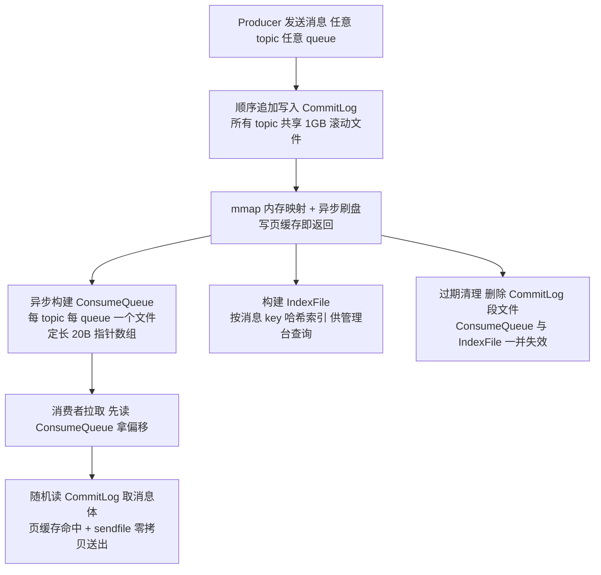
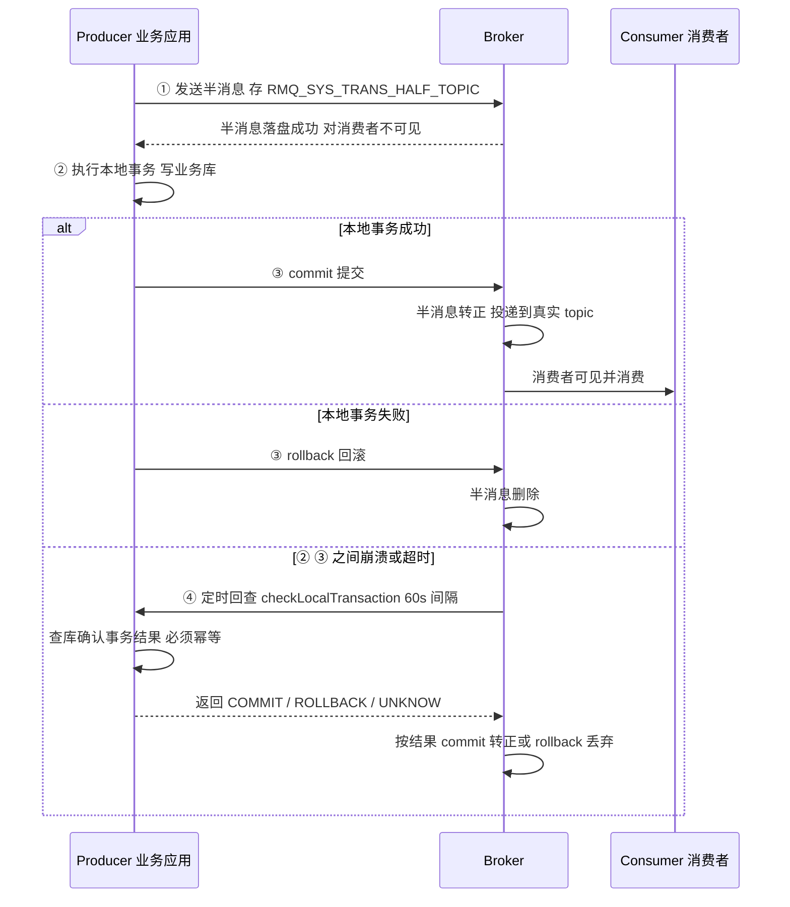
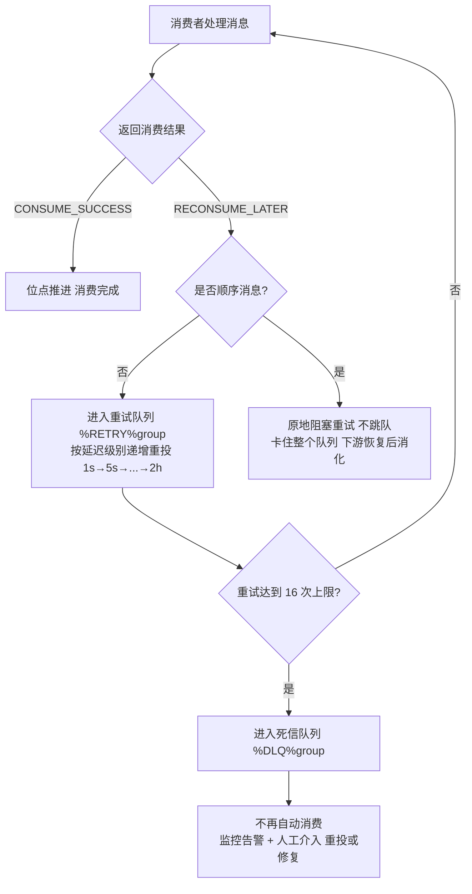
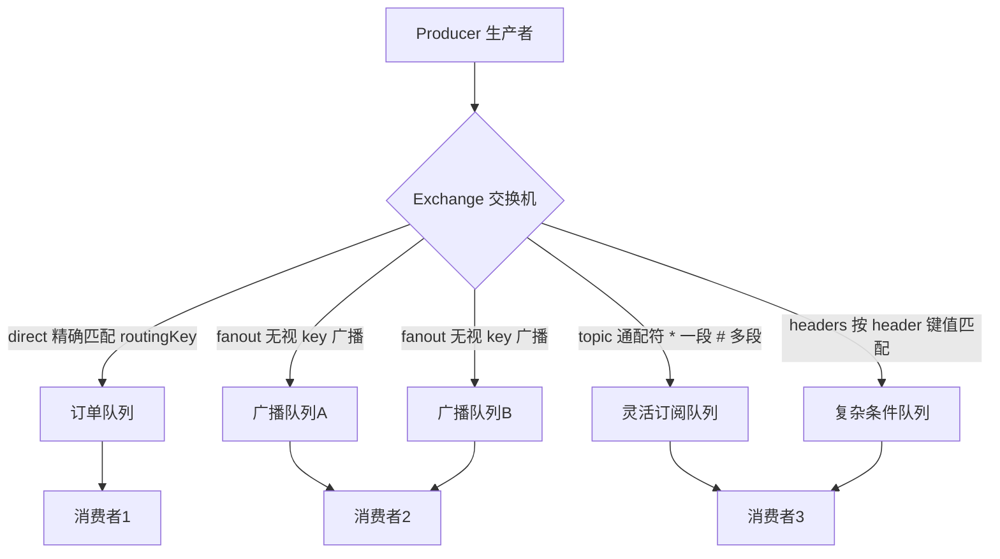

[📖 返回目录](README.md) · [⬅️ 上一章](08-kafka.md) · [➡️ 下一章](10-zookeeper.md)

# 09 · RocketMQ 与 RabbitMQ 详解

> 适用对象：10+ 年经验的资深工程师 / 架构师候选人。本章要求从「架构设计决策」的角度理解两款 MQ：RocketMQ 的 CommitLog/ConsumeQueue 两级存储、半消息事务、18 级延迟队列为什么这么设计；RabbitMQ 的 AMQP 模型、镜像队列到 Quorum 队列的演进。面试落点永远是「三款怎么选、消息怎么不丢不重、堆积怎么处理」。

**TL;DR 本章学习要点**

1. RocketMQ 架构的灵魂是「无状态 NameServer + 两级存储」：所有消息顺序写一个 CommitLog，ConsumeQueue 只是逻辑索引——换来的是写入吞吐与"按队列任意消费"；
2. 事务消息 = 半消息（不可见）先落 broker + 本地事务成功后 commit + broker 回查兜底，和本地消息表是同一思想的两种实现；
3. 延迟消息 18 级（1s~2h）是"定时扫描 + 延迟 topic 暂存"实现的，不是每条消息起一个定时器；
4. RabbitMQ 的可靠性四件套：交换机/队列/消息三处持久化 + publisher confirm + 手动 ack + Quorum 队列（3.8+ 取代镜像队列）；
5. 选型结论一句话：高吞吐与流式场景 Kafka、事务与延迟消息 RocketMQ、路由灵活与低延迟轻量场景 RabbitMQ。

---


### 📑 本章目录

- [1. RocketMQ 架构](#1-rocketmq-架构)
- [2. 消息存储](#2-消息存储)
- [3. 事务消息](#3-事务消息)
- [4. 顺序消息与延迟消息](#4-顺序消息与延迟消息)
- [5. 消费机制](#5-消费机制)
- [6. RabbitMQ 原理](#6-rabbitmq-原理)
- [7. 三款 MQ 选型对比](#7-三款-mq-选型对比)
- [8. 高频面试题合集](#8-高频面试题合集)
- [考点速查表](#考点速查表)

## 1. RocketMQ 架构


### 1.1 四大角色与整体拓扑

```
Producer ──▶ NameServer（无状态，路由注册中心，互相不通信）
                │ ① Broker 每 30s 心跳注册 topic 路由
                ▼
Producer ──▶ Broker（主从一组，Master 负责读写，Slave 热备/同步复制）
                │
                ▼
           Consumer（从 Broker 拉取，集群消费/广播消费）
```

- **Producer**：发消息方，启动时从 NameServer 拉取 topic 路由（broker 地址列表），**直连 Broker** 发送（不经过任何中转节点），支持故障转移（发送失败换 broker 重试）；
- **Consumer**：消费方，同样直连 Broker 拉取；同一个消费组（ConsumerGroup）内集群消费时消息被瓜分，不同组互不影响（发布订阅）；
- **Broker**：消息存储与投递的执行者，主从成组（Master/Slave），存储全部消息；定时向 NameServer 心跳上报（**默认 30s 一次**），NameServer 检测到 broker 长时间未心跳会剔除其路由（具体剔除阈值与版本相关，约 2 分钟量级(待核实)）；
- **NameServer**：纯路由注册中心，**无状态、节点间不通信、不持久化任何数据**——任何一个 NameServer 挂掉不影响已建立连接的 Producer/Consumer，只有"新 topic 路由发现"受影响。这是 RocketMQ 高可用的第一层设计。

### 1.2 为什么不用 ZooKeeper

- 历史：RocketMQ 3.x 曾用 ZK 做注册中心，后来自研 NameServer 取代；
- 理由（面试要讲出权衡）：ZK 是强一致 CP 系统，**写入路径要过半数节点**，而路由信息这种"允许短暂不一致、最终一致即可"的数据用 CP 是杀鸡用牛刀；ZK 本身是独立集群，运维成本高，还引入"ZK 挂了 RocketMQ 还能不能干活"的额外故障域；
- NameServer 的取舍：**用"最终一致 + 无状态"换"极简 + 去中心化"**。代价是：broker 故障后消费者要等路由失效才能感知（秒级）；NameServer 集群脑裂时各节点路由视图可能不同（但 broker 直连不受影响）。对比 Kafka：Kafka 用 KRaft/ZK 管元数据且元数据变更走共识，更强一致但更重。

### 1.3 Broker 高可用机制

- **主从复制**：一个 broker 组 = 1 Master + N Slave（同机房）。复制模式：
  - **同步双写（SYNC_MASTER）**：Master 写 CommitLog 并同步给 Slave 成功后才返回成功——主挂不丢消息，延迟略高；
  - **异步复制（ASYNC_MASTER）**：Master 落盘即返回，Slave 异步追——主挂可能丢少量消息，吞吐高；
- **故障切换的演进（重点）**：
  - 4.5 之前：Master 挂掉后 **Slave 不会自动接管**（只能人工改配置/重启或通过客户端感知切换），这是老版本最大运维痛点；
  - **4.5+ Dledger**：基于 Raft 的自动选主方案，broker 组内节点用 Raft 日志复制 + 选举，Master 挂后自动选出新 Master（秒级），写入走 Raft 半数确认；
  - 注意：**普通主从 + 自动切换 ≠ 数据不丢**——异步复制模式下切换会丢 Slave 未追上的消息，同步双写 + Dledger 才能兼顾自动切换与不丢；
- **刷盘模式**（见第 2 节）与复制模式组合成四象限：同步刷盘+同步复制（最稳、最慢）→ 异步刷盘+异步复制（最快、窗口最大），生产按对账容忍度选。

### 本节高频面试题

**Q1：NameServer 挂了，RocketMQ 还能用吗？**
解答：能。NameServer 只做路由注册与发现：Producer/Consumer 启动后已缓存了 topic→broker 路由，发送/消费**直连 broker** 不经过 NameServer。NameServer 全挂的影响：新 topic 无法发现路由、broker 故障后的新路由无法感知（旧地址继续用，直到失败重试换节点）。所以生产部署 2~3 个 NameServer 足够，且可以随便重启（无状态）。
面试官追问：那 NameServer 之间不通信，broker 注册到多个 NameServer 的路由会不会不一致？——答：会短暂不一致（最终一致）。Broker 每 30s 向**所有** NameServer 全量注册，任何一台 NameServer 的路由视图在 30s 内都会收敛；期间 Producer 可能拿到旧路由，发送失败后自动重试换节点——这就是"最终一致 + 客户端容错"的设计。

**Q2：RocketMQ 主从切换丢不丢数据？怎么做到不丢？**
解答：取决于复制模式：异步复制 + 主挂 = 丢 Slave 未追上的消息；同步双写 = 主从都有才返回，不丢。自动切换本身（Dledger）不解决丢数据问题，只解决"多久恢复"。要做到"自动切换 + 不丢"：同步双写（或 Dledger 的半数确认）+ 刷盘至少异步。面试加分：主动说"主从切换的 RPO 取决于复制模式，RTO 取决于 Dledger/人工介入，两者是正交维度，要分开设计"。

---

## 2. 消息存储

### 2.1 CommitLog / ConsumeQueue / IndexFile 三级结构

RocketMQ 存储的精髓是**「读写分离的两级索引」**：

```
CommitLog（所有 topic 消息按到达顺序 append 到这一个文件，默认 1GB 滚动）
   ▲ 写入只面向 CommitLog → 顺序写，吞吐高
   │
   ├── ConsumeQueue（每个 topic 的每个 queue 一个文件，定长 20 字节/条：
   │       commitLogOffset(8B) + 消息长度(4B) + tagHashCode(8B)）
   │       —— 逻辑队列，消费按它定位消息，不存消息体
   └── IndexFile（按 key/时间戳查消息的 hash 索引，配合 MQ 管理台/按 key 查询）
```

- **CommitLog**：所有消息共用、顺序追加（对比 RabbitMQ 每个队列独立文件——共享顺序写是 RocketMQ 吞吐高的第一功臣）；消息体包含 topic、queueId、key、tag、bornTime 等头部 + 消息体；
- **ConsumeQueue**：**不是物理复制消息，而是"指针数组"**（指向 CommitLog 的偏移）。为什么这样设计？三个好处：(1) 写入只写 CommitLog，无随机 IO；(2) 删除过期消息只需删 CommitLog 段文件，ConsumeQueue 随之失效；(3) 消息在 CommitLog 中只有一份，**按任意维度（queue）重放都行**——这也是"消费进度重置/重投"的底层支撑；
- 代价：消费要「读 ConsumeQueue 拿偏移 → 随机读 CommitLog 取消息体」，多一次寻址；RocketMQ 用页缓存 + 批量预读缓解；
- **IndexFile**：按消息 key 建立 hash 索引（key 哈希 → 槽 → 链），支撑管理台按 key 查消息（排障利器），查询性能远不如数据库级索引，别当检索用。

> 图示：CommitLog / ConsumeQueue / IndexFile 三级存储结构



### 2.2 刷盘策略与 mmap 零拷贝

- **刷盘两档**：同步刷盘（SYNC_FLUSH：消息写入内存映射区后**立即 fsync 落盘**才返回，单笔延迟高、不丢）；异步刷盘（ASYNC_FLUSH：写入页缓存即返回，后台定时批量刷盘，默认间隔约 1s(待核实)，宕机最多丢一个刷盘间隔的数据）。生产默认异步刷盘；
- **mmap（内存映射）**：CommitLog 文件通过 `MappedByteBuffer` 映射到进程地址空间，**写消息 = 写内存映射区**（OS 负责回写磁盘），避免 read/write 系统调用与用户态拷贝——这是与 Kafka 页缓存方案同源的思路（Kafka 用 sendfile 管读、RocketMQ 用 mmap 管写）；
- **读路径零拷贝**：消费读消息时，CommitLog 数据从页缓存直接经 `sendfile`/`transferTo` 送到 socket（Netty 传输），不经过用户态堆（开启 `transientStorePoolEnable` 后写路径还可用堆外内存池，进一步减少 GC 压力）；
- 对比记忆：**Kafka = 页缓存 + sendfile（读写都不碰 JVM 堆）；RocketMQ = mmap 写 + 页缓存读 + sendfile；RabbitMQ = Erlang 进程内存（队列在内存，落盘是镜像）**——存储哲学的差异决定了吞吐量级。

### 2.3 消息过期与文件回收

- 消息默认保留 72 小时（`fileReservedTime`，可配），过期靠**删除 CommitLog 段文件**实现（不是逐条删）；CommitLog 段删除时对应 ConsumeQueue/IndexFile 一并失效；
- 磁盘保护：`diskMaxUsedSpaceRatio`（默认 75%）触发**磁盘保护模式**——broker 拒绝新消息写入并告警，防止磁盘写满拖垮进程（生产要监控该告警）；
- 消费进度存储：消费位移存 broker 的 `config/consumerOffset.json`（定期持久化），比 Kafka 的 __consumer_offsets 主题简单，但 broker 迁移时要连带迁移消费进度。

### 2.4 消息结构与批量发送

- 消息体（`Message`）字段：topic、queueId、tag、key、body、properties（含延迟级别、事务标记等）、bornTime 等——**tag 用于消费端过滤**（一个 queue 内按 tag 筛选，注意 tag 过滤是"先拉到 queue 再过滤"，tag 太细粒度时浪费拉取）；
- **批量发送**：`send(List<Message>)` 一次发送一批到同一 queue（批量接口），吞吐提升明显；对比 Kafka 的客户端自动攒批，RocketMQ 的批量要业务侧主动组织，且**同批次必须同一 topic/queue**；
- 消息大小限制：默认单条 4MB（`maxMessageSize`），超大消息要拆分或走对象存储引用；
- 发送返回 `SendResult`：含 `sendStatus`（SEND_OK/FLUSH_DISK_TIMEOUT/FLUSH_SLAVE_TIMEOUT/SLAVE_NOT_AVAILABLE）——**后三种不是失败，是"降级成功"**（如异步刷盘/异步复制未完成），业务要根据可靠性要求决定是否视为成功，这是 RocketMQ 特有的语义细节。

**存储设计一句话总结**：CommitLog 管"写得快"（全局顺序写），ConsumeQueue 管"读得准"（定长索引定位），IndexFile 管"查得到"（按 key 排障）——**写入与消费解耦，队列模型任意伸缩**，这就是 RocketMQ 相比"每队列一文件"方案的核心优势，也是面试讲存储的第一句话。

### 本节高频面试题

**Q3：RocketMQ 为什么吞吐高？和 Kafka 比存储设计有什么异同？**
解答：吞吐高的核心是「所有消息顺序写一个 CommitLog」（无随机 IO）+ 页缓存/mmap + 批量发送（`send(List)`）+ 异步刷盘。与 Kafka 对比：Kafka 是"每分区一个日志文件"，RocketMQ 是"全 topic 共享一个 CommitLog + 逻辑队列"——Kafka 分区内天然顺序读、但分区多时写放大（每分区独立文件段）；RocketMQ 写入永远顺序、但消费是"指针跳读"。结论：两者都是"日志化存储"思路，RocketMQ 用两级结构换来了**更弹性的队列模型**（queue 数可动态增，不影响已存消息）。
面试官追问：ConsumeQueue 20 字节定长，扩容 queue 数会发生什么？——答：新 queue 从当前 CommitLog 末尾开始建 ConsumeQueue，**历史消息只属于旧 queue**（不会被新 queue 消费到）——所以"加 queue 缓解堆积"对存量积压无效，积压治理要配合重投/新 topic（见第 5 节）。

**Q4：同步刷盘一定不丢数据吗？**
解答：不是"绝对"：同步刷盘保证"返回成功 = 已落盘"，但 OS 层/硬件层（掉电、磁盘损坏）仍可能丢；且如果配了异步复制，Master 落盘了但 Slave 没追上，Master 宕机切换后消息仍在 Slave 上缺失。所以"不丢"的完整配置是**同步刷盘 + 同步双写（或 Dledger 半数确认）+ 副本 ≥2**。面试要能拆出"刷盘（单机持久性）"与"复制（跨机冗余）"两个正交维度。

---

## 3. 事务消息

### 3.1 半消息机制与回查

RocketMQ 事务消息解决「本地事务与发消息不能原子」的问题，流程：

```
① Producer 发送半消息（half message，topic 为 RMQ_SYS_TRANS_HALF_TOPIC，
   消费者不可见）→ Broker 落盘成功
② Producer 执行本地事务（写库等）
③ 本地事务成功 → send 提交(commit)  → 半消息转正，投递到真实 topic
   本地事务失败 → 回滚(rollback)     → 半消息删除
④ 若 ②③ 之间 Producer 崩溃/超时：Broker 定时回查 Producer（默认间隔 60s，
   最多 15 次(待核实)，通过 check 接口问"这个事务到底成没成"），
   按回查结果 commit/rollback
```

关键设计点：

- **半消息对消费者不可见**：存到特殊的 half topic（`RMQ_SYS_TRANS_HALF_TOPIC`），业务消费者根本订阅不到它；
- **回查是"兜底"，不是"常态"**：正常路径是 ①②③ 顺序完成，回查只在 Producer 崩溃或网络异常时发生——所以**事务监听器（TransactionListener）必须幂等**：回查时重查数据库得到同一结论，多次回查多次回答一致；
- **本质**：把"两阶段提交"的协调责任交给 Broker（回查 = 协调者主动询问），Producer 只负责"本地事务 + 上报结果"。

完整时序（面试画图题）：

```
Producer            Broker                          Consumer
  │ ① 半消息 ─────────▶ 存 RMQ_SYS_TRANS_HALF_TOPIC   │
  │ ◀── 半消息落盘成功 ──                              │
  │ ② 执行本地事务（写业务库）                          │
  │ ③ commit ─────────▶ 半消息转正投递 ──────────────▶ │
  │    （或 rollback，半消息丢弃）                      │
  │ ◀── 回查请求（① 后超时/崩溃时）────                │
  │ ④ 查库确认事务结果 ──▶ commit/rollback             │
```

三个"为什么"：为什么先发半消息？——把"消息先落 broker"与"本地事务"解耦，broker 成为协调者的记忆体；为什么回查？——Producer 可能死在 ② 之后，broker 需要知道最终结论；为什么半消息不可见？——消费者不能看到"事务还没定论"的数据。

> 图示：RocketMQ 事务消息半消息 + 回查完整时序



### 3.2 与本地消息表的对比

| 维度 | 本地消息表 | RocketMQ 事务消息 |
|---|---|---|
| 原理 | 业务库同事务写「消息表」，后台任务扫表投递，成功标记 | 半消息 + 本地事务 + Broker 回查 |
| 可靠性 | 依赖扫表任务不丢（要幂等投递标记） | 依赖回查机制（15 次内必须给结论） |
| 侵入性 | 业务表 + 消息表 + 扫表代码，侵入重 | 只需实现 TransactionListener 两个接口 |
| 事务范围 | 业务库 + 消息表同一事务（强一致） | 半消息落 broker 与本地事务仍是两段（最终一致） |
| 适用 | 无 RocketMQ 基建/跨团队已有表方案 | 已有 RocketMQ 的标准姿势 |

**工程要点**：两种方案都只能保证「消息至少被投递一次」，**消费端仍要幂等**；事务消息不要用来包裹"大事务"（长事务期间回查窗口内消费者已开始处理 commit 后的消息，业务上要有心理准备——半消息 commit 后是立刻可见的，不存在"延迟可见"配置）。

### 本节高频面试题

**Q5：RocketMQ 事务消息怎么保证"本地事务成功但消息没发出去"不发生？**
解答：靠两段 + 回查闭环：本地事务成功 → commit 消息（若 commit 请求丢了，Broker 靠回查补齐：问 Producer"这条事务成没成"，Producer 查库回答 commit）——所以**任何一步失败都有回查兜底**，最终"本地事务成功 ⇒ 消息最终被投递"。反过来"本地事务失败但消息被投递"由 rollback + 回查堵住。注意：回查有次数上限（约 15 次），超限消息进死信/告警，说明本地事务执行异常，需要人工介入。
面试官追问：回查接口你怎么实现？——答：事务监听器 `checkLocalTransaction` 里按半消息携带的业务唯一键查数据库（如订单是否存在且状态为已提交），返回 COMMIT/ROLLBACK/UNKNOW（UNKNOW 会触发下次回查）。必须幂等，且查询路径要快（回查是同步阻塞 Broker 的）。

**Q6：本地消息表方案里，扫表任务投递失败怎么办？**
解答：投递失败的消息留在消息表（status=待投递），扫表任务指数退避重试；同时消息表要记录投递次数，超过阈值告警人工处理。关键坑：**投递成功的标记要幂等**（以 broker 的确认回执为准，而不是"发出去就算成功"）；消息表要按业务键去重，防止扫表并发重复投递。面试升华：本地消息表 = 自己实现一个"事务消息"，理解它的三个组件（同事务写表、可靠扫描、幂等投递）就能理解 RocketMQ 半消息的设计动机。

---

## 4. 顺序消息与延迟消息

### 4.1 顺序消息

- **分区顺序（局部顺序）**：`SendResult send(Message, MessageQueueSelector, arg)` —— 用选择器把相同业务键（订单 id）的消息路由到**同一个 queue**，消费者**单线程消费该 queue**，即可保证"同订单的消息有序"；
- **全局顺序**：一个 topic 只建 1 个 queue + 1 个消费者——吞吐退化为单队列，生产上几乎不用（真需要全局有序的场景极少，且 RocketMQ 集群模式下多消费者并发消费天然乱序，要配合 `MessageListenerOrderly` + 锁）；
- **消费者侧保序**：顺序消费用 `MessageListenerOrderly`（带队列锁，失败会**原地重试而非跳队**——顺序消息的消费失败重试会阻塞该队列后续消息，这是特性也是坑：下游故障会导致队列 head-of-line blocking）；
- **和 Kafka 对比**：Kafka 分区内天然有序（追加写 + 位移制）；RocketMQ 是"队列模型"，顺序要**显式用 MessageQueueSelector 指定 queue**——两者都是"按 key 路由 + 单消费线程"的同一套路。

### 4.2 延迟消息：18 级延迟与实现

- **18 个延迟级别**（`messageDelayLevel`，可配置）：1s 5s 10s 30s 1m 2m 3m 4m 5m 6m 7m 8m 9m 10m 20m 30m 1h 2h，对应 level 1~18（`setDelayTimeLevel(3)` = 10s）。**只能选预设级别，不能任意秒数**（5.x 支持自定义延迟时间(待核实)）；
- **实现原理（面试核心）**：延迟消息发送时**不直接进目标 topic**，而是写入专门的延迟 topic（`SCHEDULE_TOPIC_XXXX`，按延迟级别分 18 个 queue）；Broker 的 **ScheduleMessageService 定时任务**周期性扫描这些延迟队列，**到期的消息再投递到真实 topic 的 queue**——消费者感知不到延迟过程；
- 为什么用"定时扫描"而不是"每条消息一个定时器"：延迟消息本质是**批量到期**（同级别的到期时间接近），轮询扫描 18 个队列的代价远小于海量定时器；级别粒度就是"时间桶"的粒度；
- **时间轮（TimerWheel）的关联**：面试常把延迟消息与时间轮一起考——Netty 的 HashedWheelTimer 是通用时间轮实现（精度 = tick 粒度，适合大量短延迟任务）；RocketMQ 的 18 级方案本质是**静态时间桶 + 轮询**，5.x 的定时消息实现引入了更精细的调度（具体实现细节各版本有差异，讲清"时间桶 + 扫描投递"的主干即可，细节标注(待核实)）；
- **工程坑**：延迟级别配置改**重启前要确认存量消息的映射**（改 messageDelayLevel 会影响已投递消息的到期映射）；延迟消息消费失败重试会**再次进入延迟队列**（重试次数也按延迟级别递增）——排查"消息怎么越来越晚"时先想到这层。

### 本节高频面试题

**Q7：RocketMQ 延迟消息最长时间只有 2 小时，需求要延迟 3 天怎么办？**
解答：方案梯度：(1) 改 `messageDelayLevel` 配置加长级别（简单但影响全局，且只能预设档位）；(2) **二段延迟**：先延迟 2h 投递，消费者收到后判断未到期再发一条剩余时间的延迟消息（轮询式，通用方案）；(3) 自研/引入独立定时任务平台（如 XXL-Job/Quartz 扫表）投递——**延迟超过小时级且量大，本质该用定时任务而不是 MQ 延迟**。面试升华：MQ 延迟消息适合"秒~小时级、量中等"的场景，长延迟高并发的正解是"延迟队列 + 定时任务 + 存储"的组合。
面试官追问：延迟消息到期投递那一刻 broker 挂了，消息会丢吗？——答：到期消息仍在 CommitLog 中（只是投递动作没做），broker 重启后扫描会重新投递——投递动作幂等（消费端以消息内容为准），所以不丢，最多晚投。这也说明延迟消息可靠性 = 存储可靠性。

**Q8：顺序消费时消费者挂了，队列里的消息会怎样？**
解答：RocketMQ 消费失败/消费者宕机后，**未消费的消息按 queue 维度由同组其他消费者接管**（集群模式下 queue 是分配单位）；顺序消费的关键是**同一 queue 同一时刻只能被组内一个消费者消费**（队列锁），接管后从该 queue 的消费位点继续——所以顺序性不因消费者切换而破坏，但**切换瞬间该 queue 的消费会暂停**（锁移交）。坑：顺序消费失败默认重试 16 次且**阻塞队列**（后续消息等着），重试期间队列堆积是正常的，下游恢复后自然消化。

---

## 5. 消费机制

### 5.1 集群消费与广播消费

| 模式 | 语义 | 实现 | 适用 |
|---|---|---|---|
| 集群消费（默认） | 组内竞争：一条消息只被组内一个消费者消费 | 按 queue 分配（一个 queue 同时只被组内一个消费者持有） | 业务处理（订单、通知），天然负载均衡 + 水平扩容 |
| 广播消费 | 组内每个消费者都消费全量消息 | 每个消费者独立消费所有 queue | 本地缓存刷新、配置下发、指标采集 |

- **消费位点**：集群模式下位点按「group + topic + queue」记录在 broker（`consumerOffset.json`）；广播模式下位点存本地文件——**广播消费的位点会随机器丢失**（换机器从头消费），慎用；
- **推还是拉**：RocketMQ 是"长轮询拉模式"（consumer 向 broker 拉，broker 无消息时挂起请求最多 15s(待核实) 再返回空），既有拉的背压优势，又有推的及时性——对比 RabbitMQ 的推模式（prefetch 控速）。

### 5.2 重试与死信队列

- **消费失败重试**：集群消费失败的消息进入**重试队列** `%RETRY%<group>`（每个消费组一个，18 个 queue 对应 18 个延迟级别），**按延迟级别递增**重投（第 1 次失败 1s 后重试、第 2 次 5s……），默认最多重试 16 次；
- **死信队列**：重试耗尽的消息进入 `%DLQ%<group>`，**不再自动消费**，只能人工/管理台介入（重投或丢弃）。生产规范：DLQ 必须监控告警（有消息 = 有 bug 或下游故障）；
- **消费幂等**：RocketMQ 默认 at-least-once（重试、rebalance 移交、位点回退都会导致重复消费），**业务必须幂等**（唯一键/状态机）——这是所有 MQ 的共性，面试必答；
- 重试与死信的坑：**顺序消息的重试是"阻塞重试"**（不跳队，卡住整个队列）；广播消费失败**不重试**（各自为政）；重试队列消息的 tag 处理要注意（重试消息的 tag 可能被重置，按 tag 过滤的消费者要小心(待核实)）。

> 图示：消费失败重试与死信队列流转



### 5.3 消息堆积排查与治理

1. **发现**：管理台/`mqadmin consumerProgress` 看每个 group 的「消费位点 vs 生产位点」差距；或监控 broker 的 `CONSUME_MSG_NUM` 与消费线程池积压；
2. **定位**：先分清是**生产暴涨**（大促、任务批量投递）还是**消费变慢**（下游 RPC 超时、DB 慢、消费线程数不足 `consumeThreadMin/Max`、消费者实例数不足）；
3. **治理三板斧**：
   - 扩容消费者实例（集群模式下新实例自动接管部分 queue——**前提是 queue 数 ≥ 消费者数**，queue 不够要先加 queue，但新 queue 只承接新消息，存量积压在旧 queue，见 Q3 追问）；
   - 优化消费逻辑（异步化下游调用、批量处理 `consumeMessageBatchMaxSize`、本地缓存降 DB 压力）；
   - 紧急旁路：**新建临时 topic 拆分积压**——写一个"搬运消费者"把积压消息按新 key 重新分区投到临时 topic 的多 queue，原消费者组消费临时 topic 并行处理（与 Kafka 积压治理同套路）；
4. **事后**：对账补数据 + 容量评估（消费能力 = 单消费者吞吐 × 实例数，预留 2~3 倍余量）+ 积压告警阈值纳入 SLO。

### 5.4 消费线程模型与关键参数

- **消费者线程模型**：`DefaultMQPushConsumer` 内部是"拉取线程（PullMessageService）+ 消费线程池（ConsumeMessageConcurrentlyService，默认 `consumeThreadMin/Max=20`）"——拉取与消费解耦，消费慢时消息先积压在**本地队列**（`pullThresholdForQueue` 默认 1000 条/队列，超过则暂停拉取——这是 RocketMQ 的背压机制）；
- 关键参数：

| 参数 | 默认值 | 作用与坑 |
|---|---|---|
| consumeThreadMin/Max | 20 | 消费线程数；IO 密集可调大，CPU 密集别盲调 |
| consumeMessageBatchMaxSize | 1 | 单次批量消费条数（配合批量处理提吞吐） |
| pullThresholdForQueue | 1000 | 队列本地积压上限，触发暂停拉取（背压） |
| consumeTimeout | 15min | 消费超时判定，超时消息可能被重新投递（重复！） |
| messageModel | CLUSTERING | 集群/广播二选一 |
| consumeFromWhere | CONSUME_FROM_LAST_OFFSET | 新 group 起点；需要重放时配 FIRST_OFFSET |

- **坑**：`consumeTimeout`（默认 15 分钟）内没消费完的消息会被**重新投递**（另一个消费者/重试队列），所以"消费逻辑跑太久"本身就会造成重复——长任务要拆小或异步化；
- 消费位点推进：消费成功才推进（CONSUME_SUCCESS），失败 RECONSUME_LATER 不推进——**位点推进与服务端 ack 解耦，这是与 RabbitMQ（ack 即删）的本质区别**：RocketMQ 的消息"消费失败可重来"，RabbitMQ 的消息"ack 前一直在队列"。

### 5.5 运维命令速查（mqadmin）

| 命令 | 用途 |
|---|---|
| `mqadmin clusterList` | 集群与 broker 状态（主从、版本） |
| `mqadmin topicList` / `topicRoute -t xxx` | topic 列表与路由（queue 分布） |
| `mqadmin consumerProgress -g xxx` | 消费组各 queue 位点与堆积量（排障第一命令） |
| `mqadmin queryMsgByKey -k xxx` | 按消息 key 查消息（定位业务消息） |
| `mqadmin queryMsgById -i xxx` | 按 msgId 查消息（配合轨迹） |
| `mqadmin resetOffsetByTime -g xxx -t xxx` | 按时间重置消费位点（重放/补偿） |
| `mqadmin sendMessage -t xxx -p "body"` | 手动发消息（联调/复现） |
| `mqadmin printMsg -t xxx` | 打印队列消息内容（排障） |
| `mqadmin brokerStatus -b 127.0.0.1:10911` | broker 运行时指标（吞吐/积压线程池） |

### 本节高频面试题

**Q9：消费组从 3 个实例扩到 6 个，堆积会自动消化吗？**
解答：会，但有前提：queue 数 ≥ 6。集群消费按 queue 分配，新增实例会接管一部分 queue（触发 rebalance，RocketMQ 的 rebalance 是客户端周期性的（默认 20s 一次(待核实)），期间该 queue 消费暂停几十秒）；若 queue 数只有 4，第 5、6 个实例空转。面试补充：**加 queue 对存量积压无效**（新 queue 从当前位点开始），所以扩容消费能力要在设计期把 queue 数定足（经验：queue 数 ≥ 预期最大消费者数）。
面试官追问：rebalance 会导致重复消费吗？——答：会。queue 移交瞬间，旧消费者可能已拉取未提交位点，新消费者从旧位点继续 → 重复。消费端幂等兜底；RocketMQ 的位点提交是「拉取后本地缓存、定期上报」，窗口比 Kafka 更粗，所以**幂等是硬要求**。

**Q10：DLQ 里积累了大量消息，你怎么处理？**
解答：先看为什么进 DLQ（重试 16 次全失败）：下游 bug？消息格式不兼容（升级反序列化失败）？还是业务逻辑异常（数据不满足前置条件）？修复根因后：管理台重投 DLQ 消息（可批量，重投进原 topic 重新走消费流程），或写脚本按业务键修复数据后重投。规范：DLQ 消息要**保留原始消息头与重试轨迹**（便于定位）；DLQ 告警 = 消费故障的第一信号，别等业务投诉。

---

## 6. RabbitMQ 原理

### 6.1 Erlang 与 AMQP 模型

- RabbitMQ 用 **Erlang/OTP** 编写：actor 模型 + 进程间消息传递 + 热升级，天然适合高并发消息路由；单机吞吐万级（对比 Kafka 百万级），但**延迟最低**（微秒~毫秒）；
- **AMQP 0-9-1 模型**：Producer → **Exchange（交换机）** → 按 **Binding（绑定）** 规则 → **Queue（队列）** → Consumer。**消息不直接进队列，必须先过交换机**——这是 RabbitMQ 与 Kafka/RocketMQ 最大的架构差异（后两者是"topic/队列直投"模型）；
- 核心组件：Exchange（路由分发）、Queue（存储与投递）、Binding（exchange 与 queue 的路由关系）、vhost（租户隔离，权限与队列隔离的基本单位）。

### 6.2 交换机类型（必考）

| 类型 | 路由规则 | 典型场景 |
|---|---|---|
| direct | routingKey **精确匹配** bindingKey | 按业务类型分发（order.created → 订单队列） |
| fanout | **无视 routingKey 广播**到所有绑定队列 | 事件广播（缓存刷新、全量通知） |
| topic | routingKey 按 `.` 分段，`*` 匹配一段、`#` 匹配多段 | 灵活订阅（`order.*.created`、`log.#`） |
| headers | 按消息 header 键值匹配（少用，性能差） | 复杂多条件路由（基本被 topic 取代） |

> 图示：RabbitMQ AMQP 模型消息投递与路由



### 6.3 持久化与可靠性四件套

**持久化三处（缺一不可）**：Exchange durable + Queue durable + 消息 `delivery_mode=2`（persistent）。只设队列持久化而消息不持久 = 重启丢消息——这是最经典的配置错误。

**可靠性四件套**：

1. **生产者 confirm（publisher confirms）**：`channel.confirmSelect()` 后每条消息 broker 落盘（持久化队列）即回 ack；未确认/超时/nack 的消息要重发——**confirm 是生产者侧不丢的根基**；
2. **消费者手动 ack**：`basicAck`（成功）/ `basicNack` / `basicReject`（失败，可 requeue）——自动 ack 模式下消费者崩溃即丢（消息已从队列删除）；手动 ack + 失败不 requeue 进死信，才是可靠消费；
3. **prefetch（basicQos）**：限制消费者未 ack 的最大消息数，防止"推模式"把消费者打爆；配合手动 ack 实现背压；
4. **Quorum 队列（3.8+）**：基于 Raft 复制的队列（默认 3 副本？可配 5(待核实)），**强一致 + 自动故障转移**，取代了镜像队列成为生产推荐（镜像队列在 3.13 标记废弃(待核实)）。

### 6.4 镜像队列 → Quorum 队列的演进

- **镜像队列（Mirrored Queue，3.8 前）**：主从异步复制，多个镜像节点各存一份；缺陷：复制是异步的（主挂可能丢消息）、脑裂处理粗糙、性能随镜像数下降；
- **Quorum 队列（3.8+）**：Raft 共识复制，写入需多数节点确认（**不丢**）、自动选主（**可用性**）、只支持 `exclusive=false` 的普通队列（不支持镜像队列的 exclusive/临时队列语义）、消费是"先 ack 后删"的日志语义（消息删除是追加删除标记）；
- **选型结论**：新项目一律 Quorum 队列；存量镜像队列逐步迁移（迁移注意：队列重建 + 消息重投，业务要接受短暂不可用或双写过渡）。

### 6.5 死信与延迟

- **死信（DLX）**：队列配置 `x-dead-letter-exchange` + `x-dead-letter-routing-key`，消息在三种情况进死信：被 nack/reject 且 `requeue=false`、**TTL 过期**、队列长度超限（`x-max-length`）。死信消息的原始信息（原因、原队列、原 exchange）在 header 里（`x-death` 数组），排障看它；
- **延迟消息两种实现**：
  - **TTL + DLX 方案**：消息设 TTL 过期 → 进死信交换机 → 路由到真实队列（"死信即延迟"）。缺点：**同队列的 TTL 过期顺序 ≠ 入队顺序**（RabbitMQ 只检查队头消息是否过期——排在前面的长 TTL 消息会阻塞后面短 TTL 消息，经典坑）；
  - **延迟插件**（`rabbitmq_delayed_message_exchange`）：x-delayed-message 交换机，消息带延迟时间，插件内部（Mnesia/内存）排序到点投递。**推荐**，且延迟精度优于 TTL 方案。
- 对比 RocketMQ：RocketMQ 18 级是"时间桶 + 扫描"，RabbitMQ 插件是"每消息到期时间排序"，精度更高但内存占用与单机能力有限——大延迟量场景还是 RocketMQ/定时任务。

### 6.6 ack / confirm 与消息不丢的完整链路

```
生产者 confirm（落盘确认）→ 队列持久化（durable + 消息 persistent）
→ 消费者手动 ack（处理成功才 ack）→ 失败 nack 且 requeue=false 进 DLX
```

- **不丢配方**：Exchange/Queue durable + delivery_mode=2 + confirm + 手动 ack + Quorum 队列；
- **不重配方**：消费端幂等（RabbitMQ 没有幂等生产者概念，重复来自：生产者 confirm 超时重发、消费者 ack 丢失重投）——**重发/重投是常态，幂等消费是底线**；
- **顺序性**：单队列 + 单消费者（或多个消费者但同一队列内不并发 ack）才有序；**并发消费天然乱序**，多消费者消费同一队列时顺序无法保证——需要顺序就 1 queue : 1 consumer，或用 routing key 拆多个队列。

### 6.7 集群形态与网络分区

- **集群形态**：普通集群（**元数据共享，队列内容只存声明它的节点**——其他节点消费要转发请求，声明节点挂了队列即不可用）+ 镜像/Quorum 队列（内容复制到多节点，才有真容灾）——"集群了 = 高可用了"是 RabbitMQ 最常见的误解；
- **网络分区（partition）**：RabbitMQ 集群默认**不自动处理脑裂**，分区后各分区独立运行，恢复时可能丢消息/元数据不一致。三种处理模式：`ignore`（不处理，恢复时合并，可能丢，默认）、`pause_minority`（少数派节点暂停对外服务，保多数派可用，**生产推荐**）、`autoheal`（分区恢复时重启少数派节点自愈）；
- 对比 Kafka/RocketMQ：Kafka（KRaft）与 RocketMQ（Dledger）都是自动选主 + 多数派；RabbitMQ 只有 Quorum 队列（Raft）有自动故障转移，普通集群 + 网络分区是 RabbitMQ 运维的经典事故源——**面试主动讲出"网络分区三模式 + pause_minority 推荐"就是资深信号**；
- 治理规范：vhost 隔离 + 用户权限（`set_permissions`）是生产必须；`channel_max`/连接数限制防客户端泄漏连接拖垮节点；管理台 API（15672）做容量与连接监控。

### 6.8 RabbitMQ 运维命令速查

| 命令 | 用途 |
|---|---|
| `rabbitmqctl cluster_status` | 集群成员、分区状态、队列镜像/Quorum 健康 |
| `rabbitmqctl list_queues name messages consumers` | 队列积压与消费者数（排障第一命令） |
| `rabbitmqctl list_bindings` / `list_exchanges` | 路由关系核对（消息"消失"多半是 binding 配错） |
| `rabbitmqctl set_policy ha-all ".*" '{"ha-mode":"all"}'` | 镜像队列策略（存量迁移期） |
| `rabbitmqctl add_vhost / add_user / set_permissions` | 租户与权限治理 |
| `rabbitmq-plugins enable rabbitmq_delayed_message_exchange` | 延迟插件 |
| 管理台 Web（15672） | 队列/连接/信道可视化监控 |

### 本节高频面试题

**Q11：RabbitMQ 消息持久化就万无一失了吗？**
解答：不是。三个漏洞：队列/交换机没 durable（重启即失）；消息没设 delivery_mode=2（队列持久化 ≠ 消息持久化）；持久化消息写入磁盘是异步的（`queue_index`/fsync 时机），**broker 崩溃瞬间可能丢刚"确认"的消息**（confirm 的保证是"已写入队列"，落盘时机由内核决定）——Quorum 队列 + 多节点可把该窗口压到多数节点确认级别。面试升华：任何 MQ 的"不丢"都是概率意义上的，工程上按 RPO 需求选配置组合。
面试官追问：confirm 和事务（txSelect）区别？——答：confirm 是异步确认、吞吐高、生产推荐；AMQP 事务（txSelect/txCommit）同步阻塞、吞吐极低、基本被淘汰——这个对比能体现"懂演进"。

**Q12：TTL+DLX 实现延迟消息有什么坑？为什么推荐延迟插件？**
解答：核心坑：RabbitMQ 只检查**队头消息**的 TTL，队头是长 TTL 消息时，后面短 TTL 消息**不会按时过期**（延迟被队头阻塞，实际延迟 = 队头剩余时间）；且同队列只能设一个 TTL。延迟插件为每条消息独立计算到期时间（内部排序结构），精度与公平性都好。代价：插件用 Mnesia 存储，**延迟消息量大时内存/性能受限**，且插件队列不参与普通镜像/Quorum 语义(待核实)。面试结论：小延迟量用插件，大延迟量换 RocketMQ/定时任务。

---

## 7. 三款 MQ 选型对比

| 维度 | Kafka | RocketMQ | RabbitMQ |
|---|---|---|---|
| 语言/模型 | Java，日志模型（分区+位移） | Java，队列模型（两级存储） | Erlang，AMQP 路由模型 |
| 吞吐 | 百万级/秒（最高） | 十万级/秒 | 万级/秒 |
| 延迟 | 毫秒级（批量权衡） | 毫秒级 | 微秒~毫秒（最低） |
| 消息可靠性 | ISR + leader epoch；事务+幂等 | 同步刷盘/双写；事务消息 | confirm + 手动 ack + Quorum |
| 事务消息 | 无原生（Outbox 模式） | **原生半消息 + 回查** | 无原生 |
| 延迟消息 | 无原生 | **18 级延迟队列** | 延迟插件 / TTL+DLX |
| 顺序消息 | 分区内有序（天然） | MessageQueueSelector 分区顺序 | 单队列单消费者 |
| 路由能力 | 弱（topic 平铺） | 中（tag 过滤） | **最强（exchange/binding）** |
| 消费模型 | 拉（长轮询） | 拉（长轮询） | 推（prefetch 背压） |
| 生态 | 最强（流计算/连接器） | 阿里系电商金融生态 | 插件丰富、管理台友好 |
| 运维 | KRaft 免 ZK，中 | NameServer 轻量，中 | 轻量单机，集群化中等 |
| 典型场景 | 日志/埋点/流计算/削峰 | 电商订单/事务/延迟任务 | 企业集成/路由分发/低延迟 RPC 解耦 |

**选型决策树（面试直接背）**：数据流/日志/海量削峰 → Kafka；需要事务消息、延迟消息、金融级可靠 → RocketMQ；需要灵活路由、低延迟、轻运维、团队熟悉 Erlang 生态（或就是中小体量）→ RabbitMQ。**混合架构很常见**：Kafka 做数据管道，RocketMQ 做业务消息，RabbitMQ 做内部事件路由——架构师要说"按场景组合"而不是"全家桶"。

**选型实战案例（面试举例素材）**：

| 场景 | 选型 | 理由（一句话） |
|---|---|---|
| 埋点/日志管道（日百亿条） | Kafka | 吞吐唯一达标者，流计算生态原生对接 |
| 电商订单核心链路 | RocketMQ | 事务消息（下单+发消息原子）、延迟消息（超时关单）、同步双写 |
| 内部事件路由（通知/审批流） | RabbitMQ | 路由灵活 + 延迟插件 + 运维轻，量级匹配 |
| 金融对账流水 | RocketMQ 同步双写 + Dledger | RPO≈0：同步刷盘 + 同步复制 + 自动选主 |
| 缓存/配置广播 | RabbitMQ fanout / Kafka | 广播语义两者都行，按已有基建选 |

**常见误区（面试主动排雷）**：(1) "Kafka 延迟高"——默认批量参数所致，linger.ms=0 毫秒级；(2) "RabbitMQ 不能高可用"——Quorum 队列后已解决，瓶颈在吞吐不在可用性；(3) "用了 MQ 就一定不丢"——不丢是配置组合 + 业务补偿的结果，不是产品属性；(4) "延迟消息用 TTL+DLX 就行"——队头阻塞坑，量大了必出事。

---

## 8. 高频面试题合集

**Q13：消息丢失一般发生在哪些环节？RocketMQ 怎么层层防？**
解答（链路排查模板）：生产者发送失败/未确认 → 配 retry + 事务消息/本地表兜底；Broker 接收后宕机未落盘 → 同步刷盘（或异步刷盘接受窗口）；Master 挂 Slave 未追上 → 同步双写/Dledger；消费者拉取后崩溃未消费 → at-least-once + 幂等。面试答完整链路 + "每个环节的丢数据窗口由什么配置决定"就是满分。
面试官追问：RocketMQ 消费端怎么知道消息处理成功？——答：`ConsumeConcurrentlyStatus.CONSUME_SUCCESS` 返回后位点才推进；返回 RECONSUME_LATER 进重试队列；**返回成功但业务实际失败 = 丢**（业务异常没抛出来），所以消费逻辑要 try-catch 严谨。

**Q14：RocketMQ 消息重复消费发生在什么时候？怎么保证不重复处理？**
解答：触发：重试（RECONSUME_LATER）、rebalance 位点回退、广播模式位点丢失重头消费。防：消费端幂等三件套——唯一业务键（DB 唯一索引/去重表）、状态机（订单状态流转校验，重复的旧状态直接忽略）、Redis 幂等标记（短窗口）。**核心认知：MQ 只保证至少一次，不重复是消费端的责任**。

**Q15：消息乱序怎么发生的？怎么保证顺序？**
解答：乱序来源：生产者多线程发送到不同 queue（RocketMQ 默认轮询/随机选 queue）、消费者多线程并发消费、失败重试（顺序消息失败重试会阻塞队列、普通消息失败重试直接乱序）。保证：Producer 用 MessageQueueSelector 按业务键选 queue（RocketMQ）/ key 路由（Kafka）；Consumer 单线程消费（RocketMQ MessageListenerOrderly）；Kafka 分区内天然有序。面试要点：**顺序性 = 生产者路由 + 消费者单线程 + 失败处理策略**三者缺一不可。

**Q16：RabbitMQ 和 RocketMQ 都支持延迟消息，实现有什么本质区别？**
解答：RabbitMQ 插件方案是**每消息独立到期时间 + 内部排序结构**（精确到秒级任意值，但量大有内存瓶颈）；RocketMQ 是**固定 18 个时间桶 + 定时扫描投递**（只能选档位，但吞吐高、存储可靠）。本质区别：一个"精确但内存化"，一个"粗粒度但磁盘化"。面试延伸：理解了这两个极端，就能判断自研延迟队列该用时间轮（内存）还是时间桶+扫描（磁盘）。

**Q17：你们项目 MQ 怎么选型的？** 解答（架构师标准答法）：列需求矩阵打分——峰值吞吐（预估 QPS×消息大小）、延迟要求（秒级/毫秒级）、可靠性要求（RPO=0 与否）、是否需要事务/延迟/顺序语义、团队运维能力、与现有技术栈（Spring Cloud Stream/自研框架）的整合、成本。然后给结论与理由（如：核心订单链路 RocketMQ（事务+延迟+同步双写）、数据管道 Kafka（吞吐+生态））。**加分：主动说"选型不是技术对比，是需求×成本×团队的交叉决策"**。

**Q18：MQ 积压了 1000 万条，怎么最快恢复？** 解答：先冻结增量（必要时暂停生产投递/降级写本地），再三板斧：扩容消费实例（queue 数允许时）、优化消费（批量/异步/去下游慢调用）、旁路重分区（搬运消费者把积压拆到临时 topic 多 queue 并行消费）。恢复顺序：先恢复实时性（消费最新消息），再补历史积压。最后复盘：积压根因（生产暴涨还是消费故障）→ 容量模型修正 → 告警阈值。

**Q19：RocketMQ 的 rebalance 和 Kafka 的 rebalance 有什么异同？** 解答：同：都是消费组内"分区/队列所有权重分配"，都会造成短暂消费中断与潜在重复。异：Kafka 由组协调器主导 + 客户端 leader 计算分配，触发条件多（心跳/处理超时），有 EAGER/COOPERATIVE 之分；RocketMQ 是**客户端周期性（默认约 20s）从 broker 拉取队列变更自行 rebalance**，无协调器、无全局暂停语义（各自独立切换），代价是分配决策分散、极端情况下分配抖动（同组不同客户端视图短暂不一致）。面试加分：能对比"中心化协调 vs 客户端自治"两种 rebalance 架构的取舍。

**Q20：为什么 RabbitMQ 吞吐上不去，瓶颈在哪？** 解答：三层：Erlang 进程模型（单机多核可扩展但跨节点网络开销大）；**队列独立存储**（每个队列自己的文件/索引，随机 IO 多于共享日志模型）；**推模式 + 每消息确认**（confirm/ack 逐条，批量能力弱于 Kafka/RocketMQ 的批量拉取）。提升手段：多个队列 + 多消费者、prefetch 调优、持久化按需（非核心队列不持久化）。面试结论：RabbitMQ 的定位是"灵活路由 + 低延迟 + 轻量"，高吞吐场景选型阶段就该排除它。

**Q21：MQ 的可观测性怎么做？消息轨迹（trace）怎么实现？**
解答（架构师必答）：三个层次：(1) 指标：broker 吞吐/积压/lag/消费速率（RocketMQ 有 `mqadmin` 与监控插件、Kafka 有 JMX 采集），告警阈值纳入 SLO；(2) 日志：发送/消费的关键日志打点 + traceId 贯穿（消息头带 traceId，生产消费日志同 ID 可串）；(3) **消息轨迹**：RocketMQ 自带轨迹（`enableMsgTrace=true` 上报轨迹 topic，管理台可查一条消息从生产→存储→消费的全链路状态），Kafka 无原生轨迹，靠埋点 + 检索。面试加分：把消息轨迹纳入全链路追踪体系（与调用链打通），排障效率提升一个量级。

**Q22：让你设计一套消息平台，核心模块怎么划分？**
解答（架构题模板）：接入层（SDK/协议适配，统一发送与消费 API，治理生产者与消费组）→ 路由与治理层（topic 生命周期、配额、鉴权、租户隔离）→ 存储层（选型：Kafka/RocketMQ 或自研，消息体与索引分离）→ 消费层（消费组管理、重试/死信、延迟投递、消息轨迹）→ 可观测与运维（监控告警、积压治理工具、容量规划）→ 对账与补偿（最终一致性兜底）。再补一句：**消息平台的难点不在"发消息"，在"治理"**（topic 规范、消费组生命周期、故障排查工具链）——这句话就是架构师认知。

**Q23：RocketMQ 5.x 相比 4.x 有什么变化？迁移要注意什么？**
解答：三个大变化：(1) **Controller 模式**：基于 Raft 的自动故障切换成为一等公民（4.x 的 Dledger 演进版），broker 集群管理更接近 Kafka KRaft；(2) **gRPC 协议**与新的客户端（4.x 的 remoting 协议继续兼容）；(3) **Pop 消费**：轻量消费模式（服务端记录消费进度，客户端无状态，适合弹性伸缩场景）与**任意延迟的定时消息**（不再只有 18 级）(待核实细节)。迁移注意：协议兼容性验证、消费组进度（consumerOffset）迁移、客户端版本升级灰度、5.x 的 controller 部署要单独规划（奇数节点）。
面试官追问：Pop 消费和普通 Push 消费有什么区别？——答：Push 模式的消费进度在客户端（每个实例维护位点，扩容/缩容要 rebalance 交接）；Pop 模式把位点管理收到服务端（客户端无状态，拿一条记一条），弹性伸缩零交接成本，代价是服务端状态与额外一轮请求。**面试话术：Pop 是"把消费位点从客户端收编到服务端"，解决的是无状态化与弹性**。

**Q24：事务消息回查次数用完了（15 次）还没结论，会发生什么？**
解答：半消息一直留在 half topic，**永远不会转正也永远不会被消费者看到**——这条消息"既没成功也没失败"，业务上等于丢消息。处置：监控 half topic 的积压（`RMQ_SYS_TRANS_HALF_TOPIC` 消息量）与回查失败告警，人工介入（查本地事务实际结果，手动补发或补偿）。**面试升华：回查上限是"最终一致性"的最后一道防线，它的存在说明"事务消息 ≠ 强一致"，业务要接受极端情况的人工兜底**——这是把事务消息讲透的标志。

---

## 考点速查表

| 考点 | 一句话要点 |
|---|---|
| NameServer | 无状态、节点间不通信、最终一致路由；broker 30s 心跳注册；挂掉不影响存量直连 |
| 不用 ZK | 路由信息只要最终一致，ZK 的 CP 与运维成本是杀鸡用牛刀 |
| 高可用 | 主从（同步双写/异步复制）+ 4.5+ Dledger Raft 自动选主；RPO 由复制模式决定 |
| 存储结构 | CommitLog 全量顺序写 + ConsumeQueue 20B 定长逻辑索引 + IndexFile 按 key 查 |
| 刷盘/零拷贝 | 同步/异步刷盘；mmap 写 + 页缓存读 + sendfile；transientStorePoolEnable 堆外写 |
| 事务消息 | 半消息不可见 → 本地事务 → commit/rollback；Broker 回查（60s/15 次）兜底 |
| 本地消息表 | 同库事务 + 扫表投递 + 幂等标记；与半消息同思想，侵入更重 |
| 顺序消息 | MessageQueueSelector 按业务键选 queue + 单线程消费；失败重试阻塞队列 |
| 延迟消息 | 18 级（1s~2h）时间桶 + ScheduleMessageService 定时扫描转投 |
| 消费模式 | 集群（queue 竞争）/ 广播（全量，位点存本地）；长轮询拉模式 |
| 重试/DLQ | 失败进 %RETRY% 按延迟级别递增重试 16 次 → %DLQ% 人工介入，DLQ 必须告警 |
| 堆积治理 | 扩实例（queue 够时）→ 优化消费 → 旁路重分区；新 queue 不承接存量积压 |
| RabbitMQ 模型 | Producer→Exchange→Binding→Queue；direct/fanout/topic/headers |
| 持久化三处 | Exchange durable + Queue durable + delivery_mode=2，缺一不可 |
| 可靠性四件套 | confirm + 手动 ack + prefetch 背压 + Quorum 队列（3.8+ Raft） |
| 死信/延迟 | DLX 三触发（nack/TTL/超长）；延迟插件优于 TTL+DLX（队头阻塞坑） |
| 选型 | Kafka 吞吐流式；RocketMQ 事务/延迟/金融可靠；RabbitMQ 路由灵活低延迟 |
