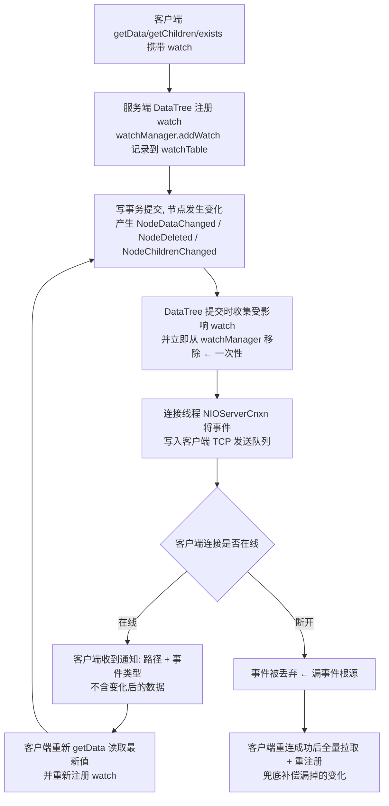
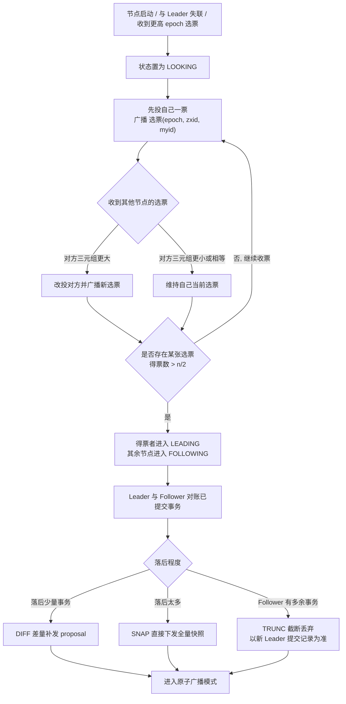
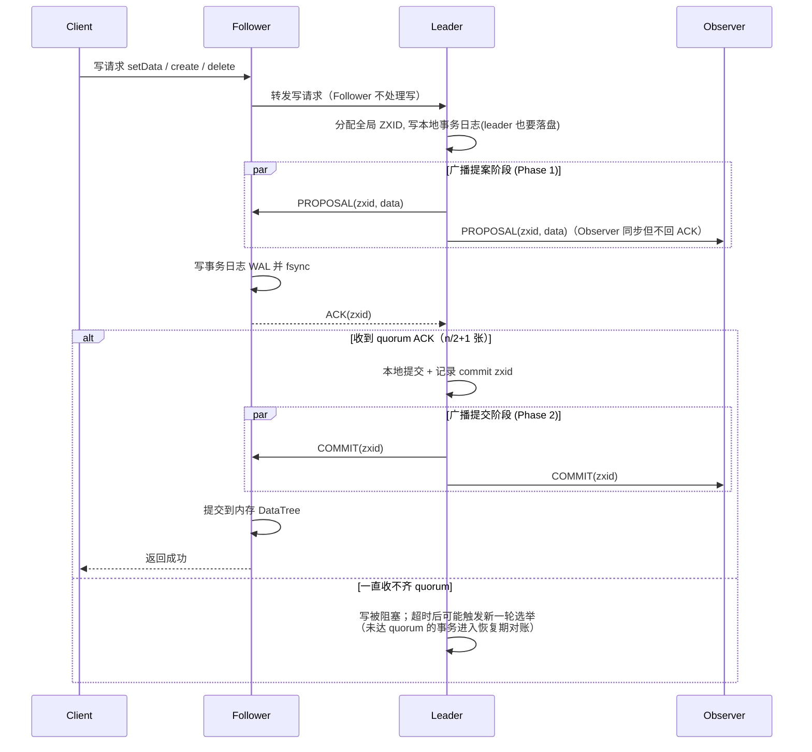
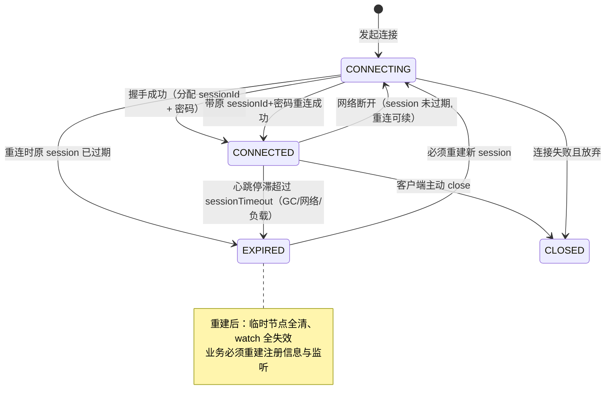
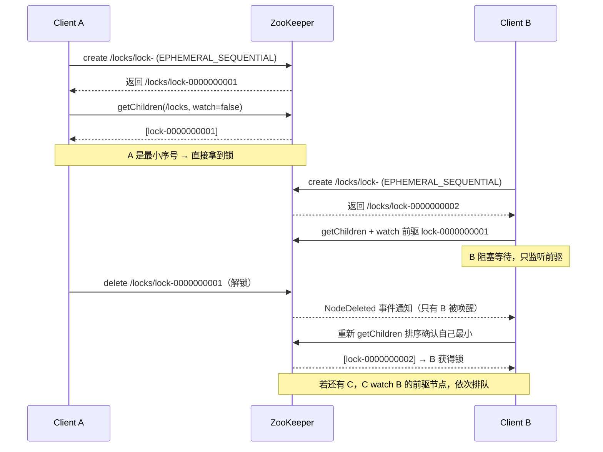

[⬅️ 上一章](09-rocketmq-rabbitmq.md) · [📖 返回目录](README.md) · [➡️ 下一章](11-netty.md)
# 10 · ZooKeeper 原理与分布式协调（资深向）

> 适用对象：10+ 年经验的资深工程师 / 架构师候选人。ZooKeeper 面试的深度分水岭是：能背「临时节点 + Watch」八个字（及格），还是能把「ZAB 两阶段广播、ZXID 与选举、session 超时与临时节点清理、羊群效应」串成一条「分布式协调为什么这么设计」的推理链（优秀）。本章按这个标准写，并给出与 etcd 的选型判断——2026 年还在无脑推 ZK 的架构师，和说不出 ZK 什么时候该退场的架构师，一样不合格。
> 🧭 初学者前置：16 章 §3 Raft（ZAB 是其近亲，先懂 Raft 再看 ZAB 事半功倍）。

**📌 本章速览：核心要点**

1. ZK 是「顺序一致性」的协调器：写请求全部走 leader 原子广播（quorum 提交），读请求任意节点本地读（可能读到旧数据）——这是它「强一致写、弱一致读」的本质；
2. ZAB 协议两段式理解：崩溃恢复（FLE 选举：比 (epoch, zxid, myid)，ZXID 高 32 位是 epoch）＋ 原子广播（proposal → quorum ack → commit，无回滚的 2PC 变体）；
3. 临时节点绑定 session，session 过期由 leader 判定、删除走事务异步执行——GC 停顿超过 sessionTimeout 会「误删锁」，这是分布式锁最大的坑；
4. 分布式锁的标准答案是「临时顺序节点 + 只 watch 前一个节点」：天然公平、无羊群效应；与 Redis 锁的对比要落到「安全性 vs 可用性 vs 性能」三角；
5. 架构题落点：注册中心/配置中心/选主怎么做、ZK 的瓶颈在哪（写不可水平扩展）、什么时候该换 etcd/Nacos；运维题落点：tickTime/syncLimit/initLimit 三个时钟参数怎么配、磁盘满与 GC 停顿两大事故源怎么防。

---


### 📑 本章目录

- [1. 数据模型与 ZNode](#1-数据模型与-znode)
- [2. ZAB 协议：崩溃恢复选举 + 原子广播](#2-zab-协议崩溃恢复选举--原子广播)
- [3. 会话机制：session、超时与临时节点清理](#3-会话机制session超时与临时节点清理)
- [4. 分布式锁实现](#4-分布式锁实现)
- [5. 典型应用：注册中心、配置中心、协调、消息队列](#5-典型应用注册中心配置中心协调消息队列)
- [6. 运维与坑：脑裂、奇偶、性能、Watch 风暴、参数调优](#6-运维与坑脑裂奇偶性能watch-风暴参数调优)
- [7. 与 etcd（Raft）对比与选型](#7-与-etcdraft对比与选型)
- [8. 高频面试题合集](#8-高频面试题合集)
- [考点速查表](#考点速查表)

## 1. 数据模型与 ZNode


### 1.1 树形命名空间与节点类型

- ZK 的数据模型是一棵**类文件系统的树**，节点叫 **ZNode**，路径即名称（`/app/servers/node1`），每个节点可存数据（默认上限 1MB，`jute.maxbuffer`）并挂子节点；
- **持久节点（PERSISTENT）**：显式删除才消失；**临时节点（EPHEMERAL）**：绑定创建它的会话，**会话结束即被删除**（自动清理），且**临时节点不允许有子节点**；
- **顺序节点（SEQUENTIAL）**：创建时自动在路径后追加 10 位单调递增序号（如 `/lock/lock-0000000001`），序号由 leader 分配、全局有序——**顺序节点 + 临时节点组合**是分布式锁、队列、选主的基础；
- 每个节点带 **version 字段**（dataVersion/cversion/aclVersion）：`setData(path, data, version)` 带版本号就是乐观锁 CAS，版本不匹配抛 `BadVersionException`——这是 ZK 实现「无锁条件更新」的原语；
- **ACL**：world/auth/digest/ip 四种方案，可对「读/写/创建子节点/删除/管理」分别授权；注意 **ACL 只保护节点本身，不递归保护子节点**。

```
                     /（根）
        ┌─────────────┼──────────────┐
      /app                         /lock
    ┌──┴──┐                      ┌──┴──┐
  /config  /servers           lock-0000000001（临时+顺序）
   （持久）  ├─ node-1（临时，注册中心用）
            └─ node-2（临时）
```

### 1.2 Watch 机制：一次性、客户端视角的「通知」

- **Watch 是客户端在节点上注册的监听**（`getData`/`getChildren`/`exists` 可带 watch），节点变化（NodeCreated/NodeDeleted/NodeDataChanged/NodeChildrenChanged）时**服务端向客户端推送一条事件通知**；
- **一次性语义**：事件触发后 watch 自动失效，想继续监听必须**重新注册**——这是源码级的行为，也是「ZK 不适合做长连接推送」的原因；
- Watch 是**客户端视角**的：服务端把事件发给客户端后，**客户端收到的是「变化通知」，不是「变化后的数据」**，要拿到新值必须再调一次 getData；
- 事件通知**先于数据可见**（通知可能早于数据同步完成），所以收到通知后读到的数据可能是旧的——一致性上这是「通知语义」而非「数据语义」；
- 会话级事件：`None`（连接建立/断开）、`Expired`（会话过期，客户端需重新创建 session 并**重建所有临时节点与 watch**）——客户端代码必须处理 Expired，否则会出现「锁以为还在、其实已被删」的悬空逻辑。

**服务端触发与通知的完整时序**（源码视角）：写事务在 leader 提交后，各节点把变更应用到内存 DataTree 时，`DataTree` 会同步把路径对应的 watch 收集出来（触发即从 watchManager 移除），随后由该节点上**每个客户端对应的连接线程（NIOServerCnxn）** 把事件序列化后写入各自的 TCP 发送队列——所以「watch 触发」发生在事务提交时，「事件送达」发生在连接线程的下一次 flush 时。两个关键推论：

1. **事件可能丢失**：客户端连接断开期间，服务端触发 watch 时找不到连接，事件直接丢弃——这就是为什么「重连后必须全量刷新」；
2. **事件与数据不同步**：follower 收到 COMMIT 与「把事件写入连接队列」几乎同时，但客户端收到事件后立刻发起的 getData 请求，可能被路由到另一个尚未提交该事务的节点——读到旧值合法。



### 1.3 数据一致性语义（先于协议讲清楚）

- **写**：任何节点收到写请求都转发 leader，走 ZAB 原子广播，**quorum 确认才返回成功**——所以写是「强一致」的（提交即持久）；
- **读**：直接读本地内存树（DataTree），**不经过协议**，所以读可能返回稍旧的数据（顺序一致性：每个客户端看到的顺序一致，但不同客户端之间可能有滞后）；
- **sync 命令**：读前强制同步到 leader 最新提交，可把读升级为「近似线性一致」，代价是性能；
- 面试价值：这一条能解释 90% 的 ZK 使用误区——「用 ZK 读做全局唯一判断」不可靠，比如「先 getChildren 判断最小节点再删」的锁写法必须配合版本号/节点存在性校验，不能裸读。

### 本节高频面试题

**Q1：ZK 的「顺序一致性」到底是什么意思？为什么读可能读到旧数据？**

解答：ZK 保证的是：**所有客户端的操作序列满足某种全局顺序，且每个客户端看到的历史与这个顺序一致**（每个客户端最终会看到所有已提交的变更，顺序不反转）。读不经过 ZAB 广播、直接读本地 DataTree，因此落后于最新提交是合法的。对比：Paxos/Raft 的线性一致性要求读也过 quorum，ZK 用「读本地」换性能，代价是读可能旧。面试要能接着说：**哪些场景依赖「写后读自己刚写的数据」？——同一客户端写后读自己写的内容一定一致（客户端请求按顺序处理，写返回即已提交），跨客户端读不保证。**

面试官追问：业务方要求「写 A 节点后立即读到 A 节点的新值」，怎么保证？——答：用 sync 在读前强制同步，或让业务接受「最终一致 + 通知驱动」；架构上更优的是把「读自己的写」收敛到单节点处理（如锁场景的 owner 判断）。

**Q2：Watch 是一次性的，这对业务代码意味着什么？**

解答：意味着**每次事件处理完后必须重新注册 watch**，否则下一次变化不会再通知。典型错误：注册一次 watch 后循环等待，节点第二次变化时永远收不到事件——代码里最常见的玄学 bug。另外 watch 只保证「变化发生过」，不保证「变化后的值」，拿到通知要重新 getData/getChildren。生产实践：写一个 `watchAndGet` 包装：注册 watch → 读数据 → 处理 → 循环里重新注册，并处理连接断开期间的漏事件（用「重连后全量刷新 + 重注册」兜底）。

面试官追问：两个客户端同时 watch 同一个节点，节点连续变化两次，会收到几次通知？——答：各收到一次（各触发一次即失效），第二次变化不再通知；要持续监听必须各自重新注册。这就是「Watch 风暴」场景的来源之一（见第 6 节）。

面试官追问：watch 的事件里为什么不带数据？——答：设计上事件是「轻量信号」，带数据会让事件包变大、且可能带了过时数据反而误导客户端（事件触发早于数据同步）；客户端反正要重新 getData，避免「事件里的数据」与「getData 的数据」不一致造成的二次困惑。

---

## 2. ZAB 协议：崩溃恢复选举 + 原子广播

### 2.1 角色与状态机

- 三个角色：**Leader**（处理写请求、广播）、**Follower**（接收广播、参与投票、服务读）、**Observer**（不投票、只同步数据，用于**扩展读**——读能力靠加 Observer 水平扩展，写不行）；
- 节点状态机：**LOOKING**（选举中）→ **FOLLOWING/LEADING/OBSERVING**；节点启动、leader 失联、选票变化都可能回到 LOOKING；
- ZAB 两种模式：**崩溃恢复**（选出 leader 并同步数据）与**原子广播**（正常运行期提交事务）——面试先说这两个模式，再说细节。

### 2.2 崩溃恢复：ZXID 与 FLE 选举

- **ZXID（64 位）**：高 32 位 = **epoch**（朝代号，每届 leader 递增 1），低 32 位 = 该 epoch 内的**事务计数器**。ZXID 全局单调递增，是「哪个事务更新」的唯一标尺；
- **选举标准**：每个节点广播自己的投票 (epoch, zxid, myid)，**三元组大的赢**：先比 epoch，再比 zxid（数据越新越优），最后比 myid（兜底打破平局）；
- **FLE（Fast Leader Election，3.4+）**：初始投自己 → 广播投票 → 收到更高票则改投 → 某一票数超过 `n/2` 即当选 → 当选者进入 LEADING，其余进入 FOLLOWING 并同步数据。O(n²) 消息复杂度，但每个节点独立判断，无需协调者；
- **数据同步（leader 上任后）**：follower 与 leader 比对已提交事务，三种处理——**DIFF**（差量同步：落后不多，补发 proposal）、**SNAP**（落后太多，直接全量快照）、**TRUNC**（follower 有 leader 没有的事务，即「伪 leader」时期多提交的，**截断丢弃**）。TRUNC 是 ZAB 正确性的关键：以**新 leader 的提交记录为准**；
- **为什么不会脑裂**：只有拿到 `n/2+1` 票的节点才能当 leader；旧 leader 网络分区后收不到 quorum 确认就**无法提交新事务**（写被 quorum 挡住），所以「少数派永远写不进数据」——这是 ZK 防脑裂的根本机制，不是靠什么玄学。



### 2.3 原子广播：两阶段提交的「只提交不回滚」变体

- 写事务流程（类似 2PC 但**没有回滚分支**）：



  - 1. leader 为事务分配 ZXID，向所有 follower 发 **PROPOSAL**；
  - 2. follower 落盘（写事务日志 WAL）后回 **ACK**；
  - 3. leader 收到 **quorum ACK** 后广播 **COMMIT**，同时本地提交；
  - 4. follower 收到 COMMIT 后提交并通知客户端；
- 与 2PC 的区别：协调者（leader）**只提交不回滚**，因为提案在进入广播前已被「epoch + zxid」排序保证唯一性，多数派已确认的事务必须提交，未确认的在恢复阶段被 TRUNC 掉——**用「法定人数 + 日志排序」替代「协调者仲裁」**；
- 提交时机的选择：ACK 即「持久化到本地日志」，所以**quorum 落盘 = 事务不丢**；COMMIT 是异步推进的，follower 提交可能滞后于 leader——这就是读旧数据的根源之一；
- **工程细节（加分项）**：(1) 提案可以**批量**——leader 把多个待提交事务打包进一个 PROPOSAL 包，follower 一次落盘多条，吞吐提升明显；(2) follower 的 ACK 可以聚合——多条提案共用一个 ACK 包；(3) **Observer 不参与 quorum**，只异步跟随 commit 流，所以加 Observer 不增加写延迟、不降低可用性；(4) leader 与 follower 之间有 **sync 心跳**，follower 超过 `syncLimit × tickTime` 未响应会被 leader 移出「可用的 quorum 集合」——这就是 syncLimit 参数的作用位置；
- 写吞吐瓶颈：每个写事务 = 1 次广播 + quorum 落盘 + 1 次提交广播，**约 3~5 次网络 RTT + 2 次以上 fsync**，单机写 TPS 万级封顶，**无法水平扩展**。

### 本节高频面试题

**Q3：选举时为什么比 ZXID？高 32 位 epoch 有什么用？**

解答：ZXID 是「数据新鲜度」的全局标尺——zxid 大 = 提交的事务更多 = 数据更新，当选 leader 应该是最新的节点，否则上任后要追大量数据甚至出现旧 leader 覆盖新数据。epoch 的作用是**区分届别**：同一 epoch 内 zxid 单调；新 leader 上任把 epoch+1，保证「上一届 leader 残留的旧 zxid 不可能大于本届新事务」——即使旧 leader 网络恢复带着旧 zxid 回来，也赢不了选举、提交不了事务。

面试官追问：旧 leader 恢复后带着未提交的 proposal 回来怎么办？——答：旧 leader 已失去 leader 身份（epoch 更小），它会把未提交的提案**回滚（TRUNC）**，以新 leader 的提交记录为准；它的客户端连接也会因 session 迁移被重新路由。这就是「ZAB 保证已提交事务不丢、未提交事务必被丢弃」的正确性边界。

**Q4：ZAB 和 2PC 的区别到底是什么？为什么不需要回滚？**

解答：2PC 的协调者需要「回滚」能力，因为参与者可能对同一事务产生分歧且没有全局排序；ZAB 里**事务在进入广播前已被 leader 分配了全局唯一的 ZXID 排序**，恢复阶段按 ZXID 对账：多数派已确认的必提交（DIFF 补发），多余的截断（TRUNC），所以不存在「需要回滚的中间态」。本质区别：2PC 靠协调者仲裁，ZAB 靠「法定人数 + 全序日志」自愈。

面试官追问：那 ZK 什么时候会「丢已提交的数据」？——答：已提交 = 多数派落盘，多数派节点不全会丢（如 3 节点挂 2 个）；正常故障（挂 ≤ n/2）不丢。另外磁盘损坏属于「多数派落盘」之外的风险，要靠多副本 + 备份。

面试官追问：Observer 和 Follower 在广播里的角色差异？——答：Observer 也收 PROPOSAL 和 COMMIT、也维护全量数据，但**不回 ACK、不参与选举**，因此它的故障不影响 quorum；代价是它看到的数据可能比 Follower 更滞后（纯异步跟随）。扩展读 = 把「读」流量导向 Observer，写吞吐完全不受影响。

---

## 3. 会话机制：session、超时与临时节点清理

### 3.1 Session 的生命周期

- 客户端连接即创建 session：服务端分配 **64 位 sessionId**（高 8 位是 leader 的 myid，用于路由），并返回 session 密码（后续重连凭据）；
- **sessionTimeout**：客户端可协商，服务端收敛到 `[2×tickTime, 20×tickTime]`（默认 tickTime=2000ms，即 [4s, 40s]）。**超时判定的单位是 tick，不是秒**；
- **心跳（ping）**：客户端每 `tickTime/3`（约 1/3 超时）发一次心跳；follower 把心跳转发 leader，**leader 维护 session 过期判定**（follower 不判，避免分歧）；
- **重连**：客户端断开后换服务器重连，只要**原 session 未过期**，带 sessionId + 密码即可**无缝续上**（临时节点和 watch 都还在）；session 过期后重连 = 新 session，**所有临时节点被清、watch 全失效**，客户端必须重建一切；
- **客户端视角**：连接断开 ≠ 会话失效，只有收到 `SessionExpiredException` 才是真的没了——业务代码要区分「网络抖动（自动重连即可）」与「会话过期（必须重建）」。



### 3.2 临时节点清理：异步的、走协议的

- session 过期由 **leader 判定并生成「关闭会话」事务**，广播提交后各节点删除该 session 的临时节点——**清理是走 ZAB 的异步过程**，不是瞬时完成；
- 因此「session 过期 → 临时节点消失」之间有**一个事务广播的延迟**；极端场景（leader 刚判定过期还没广播完就挂）可能让清理延迟更久；
- 业务影响：分布式锁持有者 GC 停顿 > sessionTimeout 时，锁节点被删、锁「无声丢失」，**其他客户端可能同时拿到锁**——这不是 ZK 的 bug，是「租约式锁」的固有语义（etcd lease 同理），设计上必须接受或规避。

### 3.3 参数与运维要点

- `tickTime` 全局心跳基准；`minSessionTimeout/maxSessionTimeout` 限制会话超时范围；
- 会话过期清理在 leader 上跑一个**过期检查线程**（每 tick 扫描），节点多时（几十万临时节点）扫描有 CPU 开销；
- **连接数**：`maxClientCnxns`（默认 60，按 IP 限）防止单 IP 打爆；全局连接数上限受 `ulimit -n` 文件句柄约束，大集群要调；
- 会话超时设置原则：**大于「GC 最坏停顿 + 网络抖动」**，否则误删临时节点；**小于「故障恢复 RTO 需求」**，否则主节点挂了要等一个超时周期才能被接管。

### 本节高频面试题

**Q5：客户端 GC 停顿 10 秒会发生什么？sessionTimeout 设 30 秒和设 5 秒分别什么后果？**

解答：停顿期间发不出心跳，若停顿 > sessionTimeout，leader 判定过期 → 临时节点（如注册信息、锁）被删。设 30s：容错强但故障感知慢（主节点真挂了，别人要等最多 30s 才能接管）；设 5s：接管快但一次 Full GC 就可能误删。**权衡原则：sessionTimeout > 最坏 GC 停顿，< 业务可容忍的故障恢复时间**。生产上还要配合：避免 ZK 客户端线程被 GC 长停（控制堆、用 ZGC/G1 的停顿目标）、关键锁场景考虑「锁续期」方案（见第 4 节）。

面试官追问：重连时带 sessionId 为什么能续上？服务端怎么知道这是同一个会话？——答：sessionId 高 8 位含创建它的 leader 标识，新连接到达任意节点，节点向原 leader（或通过 ZAB 已同步的 session 表）确认 session 仍存活且密码匹配，即可复用；密码是防伪造的凭据。

**Q6：临时节点为什么不能有子节点？**

解答：临时节点删除发生在「会话过期」这个事件上，若允许子节点，删除时要递归清理整棵子树，而子节点可能是其他会话创建的——「谁的会话负责谁的生命周期」这个模型会被破坏，语义变复杂且删除顺序不可控。设计取舍：**临时节点 = 单点资源声明（锁、注册、选主），不需要也不该有子树**；需要「带子节点的临时结构」时，用「父持久 + 子临时」或顺序节点组合表达。

---

## 4. 分布式锁实现

### 4.1 临时顺序节点 + Watch：公平锁标准答案



```
加锁：create /locks/lock- (EPHEMERAL_SEQUENTIAL) → 返回 path，如 lock-0000000003
      getChildren(/locks, watch=false) → 排序，若自己是最小序号 → 拿到锁
      否则 watch 前一个节点（lock-0000000002），阻塞等待
前一个节点被删（锁释放/持锁者会话过期）→ 收到事件 → 重新 getChildren 判断
解锁：delete 自己的节点（可带 version 做 CAS，防止误删别人的）
```

- **公平性**：序号天然 FIFO，先到先得；只有前一个节点释放才轮到下一个——**严格公平**，不会出现「后来的抢了先来的」；
- **无羊群效应**：每个等待者只 watch 前一个节点，释放时**只有一个客户端被唤醒**（对比：所有等待者 watch 锁根节点，一次释放唤醒 N 个客户端，全部竞争失败重等——这就是「惊群/羊群效应」）；
- **可重入**：锁节点路径里带线程/请求标识，重入时计数（需自己实现）；
- **锁释放三途径**：主动 delete、持有者会话过期被清、持有者进程崩溃（靠会话超时兜底）——第三种是「活锁丢失」的来源，见下；
- **可靠性边界**：临时节点删除 = 锁释放，但「会话过期」不等于「持锁者真的挂了」——GC 停顿、网络分区都可能导致锁被释放而业务还在跑。**ZK 锁的安全性与 Redis 锁一样受「时钟/停顿」影响，只是影响面不同**（见对比）。

### 4.2 与 Redis 锁对比：三角权衡

| 维度 | ZooKeeper 锁 | Redis 锁（SET NX EX / Redlock） |
|---|---|---|
| 一致性 | ZAB quorum 提交，无主从异步复制窗口 | 单机强一致；主从异步复制下「主挂丢锁」有窗口；Redlock 有争议 |
| 锁丢失语义 | 会话超时误删（租约过期），不会「忘删」 | 过期时间到自动释放，也不会「忘删」 |
| 公平性 | 天然 FIFO 公平 | 非公平（抢锁） |
| 性能 | 写走广播，QPS 万级，延迟毫秒级 | 单机 10 万级 QPS，亚毫秒 |
| 实现成本 | 需自己写 watch 逻辑（或用 Curator） | 一条命令，极简 |
| 适用 | 低频关键资源、需要公平/强一致、ZK 已在用 | 高频缓存类互斥、性能敏感、可接受小概率双持 |

- 面试结论：**选锁 = 安全（锁绝不双持）× 可用（挂机能自愈）× 性能** 三角；ZK 锁安全性最好（但非绝对）、性能最差；Redis 锁性能最好、安全性有窗口；双持概率都非零（ZK 靠会话超时误删，Redis 靠过期/主从切换），**业务侧幂等兜底永远要做**；
- Redlock 的争议点（Martin Kleppmann 观点）：依赖时钟同步 + 客户端停顿会导致两个客户端同时持锁，且没有 fencing token 机制——资深面试加分项是把「fencing token」（锁持有者携带递增令牌，资源侧校验）讲出来。

### 本节高频面试题

**Q7：为什么锁要「临时 + 顺序」而不是「持久 + 顺序」？只 watch 前一个节点解决了什么问题？**

解答：临时保证持锁者崩溃/会话过期后锁自动释放（不依赖持锁者「记得解锁」）；顺序保证公平与「唤醒一个有且仅有一个」。只 watch 前一个节点解决**羊群效应**：若所有等待者都 watch 锁根节点，每次释放唤醒全部 N 个等待者，N-1 个会竞争失败重新等待，产生 O(N²) 事件风暴，大并发下直接打爆 ZK（这也是注册中心「服务上下线通知风暴」的同源问题）。

面试官追问：等待者收到前一个节点删除通知后，直接 delete 自己序号前一位就行吗？——答：不行。收到通知后必须**重新 getChildren 全量排序再判断**：你 watch 的前一个节点可能早已被删（事件延迟）、中间可能插入其他节点（顺序号不会回退，但你的前驱链可能已经变化）；正确姿势是「收到通知 → 重新读取 → 若自己仍最小则拿锁，否则 watch 新的前驱」。**通知只是「去检查一下」的触发器，不是「可以行动」的指令**——这是所有 ZK 事件驱动代码的通用原则。

**Q8：ZK 锁和 Redis 锁，双持（两个客户端同时拿到锁）都可能发生吗？各自怎么发生？**

解答：都可能，只是机制不同。ZK：持锁者 GC 停顿超过 sessionTimeout，锁被删，新客户端拿到锁，旧客户端恢复后继续跑——双持窗口 = 旧客户端恢复后到它发现锁丢失之前；缓解：sessionTimeout 设大 + 锁内业务操作前校验「自己仍是锁主」（用 version CAS 或读锁节点确认），Curator 的 InterProcessMutex 配合「锁内校验」。Redis：主从异步复制下主节点宕机、从节点升主但锁数据未同步；或锁过期时业务没跑完。缓解：Redlock（有争议）+ fencing token + 业务幂等。**结论：没有绝对安全的分布式锁，锁是「降低双持概率」的手段，「双持后的业务幂等」才是最后防线。**

---

## 5. 典型应用：注册中心、配置中心、协调、消息队列

### 5.1 注册中心：临时节点 + Watch

- Provider 启动创建**临时节点** `/dubbo/com.xx.Service/providers/dubbo://ip:port?...`，Consumer 订阅（watch）providers 目录；
- 上下线：Provider 宕机 → 会话过期 → 临时节点删 → Consumer 收到 ChildrenChanged 通知 → 刷新本地服务列表——**故障感知延迟 = sessionTimeout 级别**，这是注册中心用 ZK 的固有缺陷（Nacos 临时实例靠心跳 5s/15s 判定，快得多）；
- **通知风暴**：集群大规模抖动（发版、网络分区恢复）时，大量临时节点同时增删，Consumer 端 watch 雪崩——生产上 Consumer 侧要做「本地缓存 + 节流刷新 + 全量兜底」；
- 现代选型：新系统注册中心基本不用 ZK（Nacos/etcd/自研 AP 注册中心），**ZK 注册中心是「老 Dubbo 存量系统」的代名词**——面试要能说出为什么（见第 7 节）。

### 5.2 配置中心：持久节点 + Watch

- 配置存**持久节点**，客户端 watch 配置路径，变更即推送；可配合版本号做「配置版本管理」；
- 与 Apollo/Nacos 配置中心对比：ZK 无「命名空间/灰度/审计/回滚」等治理能力，配置变更**无审批流**，多人改配置无保护——**小团队够用，大厂治理场景不够**；
- 经典坑：**配置变更的「发布」与「通知」之间业务可能读到半新半旧**（多节点配置不同路径分别 watch），要么单节点存整份配置、要么接受最终一致。

### 5.3 分布式协调：选主、队列、屏障

- **选主**：多个候选创建临时顺序节点，最小序号者为主；主挂 → 节点删 → 次小接管。**Election 与分布式锁是同一个原语**（排他锁 = 序号最小者）；
- **分布式队列**：入队 = 创建顺序节点；出队 = 取最小序号删除（FIFO）；可加「分布式屏障」：N 个参与者都到达（各建节点）才放行；
- **命名服务/集群元数据**：HBase 的 HMaster 选举、region 分配元数据；Kafka 早期 controller 选举（见下）；
- 原则：**ZK 只做「小数据、强一致、低频变更」的协调元数据，绝不当数据库/消息队列用**——1MB 数据上限、树形结构、广播写，都决定了它不是存储系统。

### 5.4 Kafka / RocketMQ / Dubbo 中的 ZK 角色（含 3.x 演进）

- **Kafka**：0.8~2.x 时代 ZK 承担 controller 选举、broker 注册、ISR 变更通知、消费位移（0.8 早期）；**2.8 起 KRaft 逐步替代，4.0 彻底移除 ZK**——「Kafka 干掉 ZK」的完整理由：独立系统两套运维、元数据双跳（ZK→controller→broker）、ZK 是额外故障域、扩容受限（写不可水平扩展）；
- **Kafka 3.x 的演进节奏（重点）**：3.0 引入 KRaft 预览（controller quorum 自己跑 Raft 存元数据）；3.3 KRaft 标记生产可用（单 controller 模式）；3.4~3.5 持续补齐（元数据迁移、controller 滚动升级）；3.7 起 KRaft 成为默认且 ZK 模式标记弃用（deprecated）；**4.0 移除 ZK 模式（KIP-833）**。演进逻辑：元数据从「ZK 里的外部状态」变成「Kafka 自己的日志」，controller 变成「Raft 日志复制 + 快照」的普通角色，broker 直接与 controller quorum 通信，**少一跳、少一个故障域、元数据变更可追日志**；
- **RocketMQ**：**从来不用 ZK**，用自研 **NameServer**（无状态、每 broker 定期上报路由、客户端拉取路由）——设计哲学是「路由信息允许短暂不一致，broker 探活靠心跳」，比 ZK 注册中心更轻；
- **Dubbo**：默认注册中心即 ZK（也有 Nacos/Redis/Multicast）；2.7 时代「接口级注册」导致注册数据膨胀（接口数 × 提供者数），**3.x 引入应用级服务发现**解决；Dubbo 也把 ZK 用于**元数据中心**（接口元数据、配置中心）；
- 面试金句：**「ZK 在中间件里的角色是『强一致元数据 + 选主』，凡是能换成『AP 式注册 + 客户端容错』的场景，现代中间件都在去 ZK 化」**——RocketMQ 的 NameServer、Kafka 的 KRaft、Nacos 的 AP 模式都是同一个趋势。

### 本节高频面试题

**Q9：用 ZK 做注册中心，Provider 批量发版会发生什么？怎么扛？**

解答：批量发布 = 大量临时节点删除再创建 → Consumer 端 watch 事件风暴（羊群效应放大版），同时 ZK 写压力翻倍（每节点注册 = 一次广播写）。扛法：(1) Consumer 侧：本地缓存 + 事件**节流合并**（收到通知不立即全量刷新，合并到 1~2s 窗口批量拉取）+ 注册中心不可用时用本地缓存兜底（**注册中心 AP 化降级**）；(2) 发布侧：**分批灰度发布**，控制同时变更的节点数；(3) 架构侧：换支持「心跳续约」的注册中心（Nacos 临时实例）或「客户端主动拉取 + 版本号对比」的模型，减少 watch 依赖。加分：说「注册中心本质是 AP 需求，ZK 的 CP 在这里是过度设计，还带来通知风暴」——这正是 Nacos 注册中心默认 AP 模式的原因。

**Q10：Kafka 为什么要移除 ZK？RocketMQ 为什么从来不用 ZK？**

解答：Kafka 移除 ZK：元数据链路两跳（ZK→controller→broker）延迟与复杂度、ZK 集群是独立故障域（ZK 挂 = 集群不可管理）、ZK 写不可水平扩展限制集群规模、运维两套系统。KRaft 把元数据收敛进 Kafka 自身（controller quorum 跑 Raft），单系统部署。演进要能说出 3.x 版本线：3.0 预览 → 3.3 生产可用 → 3.7 默认 KRaft → 4.0 移除 ZK（KIP-833）。RocketMQ 的 NameServer：**无状态 + 全量路由 + 客户端拉取**——broker 每 30s 上报路由，NameServer 之间不互相同步（客户端拿多份路由求并集），broker 挂了 NameServer 最多 2 分钟内还广播它（容忍脏路由，客户端连接失败自动剔除）。**设计取舍：路由信息允许最终一致（AP），换部署简单 + 无选举依赖**；ZK 是 CP（强一致），但对路由场景是「杀鸡用牛刀」。

---

## 6. 运维与坑：脑裂、奇偶、性能、Watch 风暴、参数调优

### 6.1 脑裂与节点数奇偶

- **ZK 不会脑裂**（多数派机制天然防）：少数派节点收不到 quorum 确认，**写请求被拒绝**（`ConnectionLossException`/超时），对外表现为「部分节点连不上」而非「两套数据」——这是 CP 系统的标准行为；
- 但要理解「假脑裂」：网络分区时**多数派继续服务**，少数派客户端全部报错；客户端必须连多数派，否则一直失败——**客户端侧要有「集群整体可用性」监控，而不是只看单节点**；
- **奇偶原则**：容错数 = `n/2`（向下取整）。3 节点容 1 故障、4 节点也只容 1（浪费 1 台）、5 节点容 2。所以**节点数取奇数，且 3 节点已经能覆盖大多数场景**；「为了更稳上 5 节点」要意识到 5 节点只多容 1 台，但写广播成本与故障面变大；
- 特殊情况：**2 节点集群是禁区**（1 台挂 = 无多数派 = 整个集群不可写）；跨机房部署时「3 机房 × 2 节点 + 1 仲裁」之类设计要考虑多数派落在哪个机房，**避免多数派在单一机房**（否则机房故障 = 集群故障）。

### 6.2 性能瓶颈与容量

- **写不可水平扩展**：所有写走 leader 单点广播 + quorum fsync，单机写 TPS 万级（实测 3 节点 1 万~3 万/s 量级），**加节点不加写性能、反而降**（广播成本上升）；
- **读可扩展**：加 Observer（不投票只同步），读 QPS 可水平加；但注册中心场景读也是「每 Consumer 拉全量列表」，读放大明显；
- **数据上限**：单节点 1MB（jute.maxbuffer）；单节点**子节点数**受「单次响应数据包」限制，约百万级（实际建议单目录子节点数控制在几十万内，`getChildren` 全量返回会很大）；
- **事务日志是命门**：ZAB 每事务先写**事务日志（WAL）**再提交，**事务日志必须放独立磁盘/SSD**（与 dataDir 分开，`dataLogDir`），否则日志与快照争 IO，写性能与稳定性双崩；快照（snapshot）是周期性全量，恢复时日志回放；
- **容量估算**：事务日志膨胀极快（每事务一条记录），要监控 dataLogDir 磁盘；快照默认每 10 万事务或按时间触发，注意快照目录也要留空间；
- 部署规格：**3 节点起步，JVM 堆 2~4GB 足够**（DataTree 在内存，但 ZK 不是大内存应用，堆太大反而 GC 停顿长——注意 ZK 的堆与「数据量大」无关，它数据量本来就不该大）。

### 6.3 Watch 风暴、session 管理与常见故障

- **Watch 风暴**：一次性 watch + 高频变更（如注册中心批量上下线、配置频繁更新）→ 事件洪峰打爆客户端连接与 ZK 服务器。对策：业务侧合并通知、降低 watch 粒度（watch 目录而非每个子节点）、换「拉取 + 版本对比」模型；
- **session 管理**：客户端连接数暴涨（连接泄漏——**每次 new ZooKeeper 都要 close**，否则 session 与文件句柄泄漏到 OOM）；重连风暴（网络抖动后所有客户端同时重连 = 连接风暴，服务端要限流）；
- **常见故障**：(1) `Session expired` 满天飞 → 排查 GC 停顿/网络抖动/服务端负载；(2) 写超时 → 查事务日志磁盘 IO（fsync 慢）、leader 是否被 GC 拖死；(3) 连接被拒 → maxClientCnxns/文件句柄耗尽；(4) **磁盘满** → ZK 直接拒绝写（事务日志写不进去），这是生产事故第一杀手，必须监控；
- 监控指标：znode 数、连接数、outstanding 请求数、fsync 耗时、事务日志磁盘水位、watch 数。

### 6.4 关键参数调优（tickTime / syncLimit / initLimit 三时钟）

| 参数 | 默认 | 作用 | 调优要点 |
|---|---|---|---|
| `tickTime` | 2000ms | 全局时间基准：心跳间隔、会话超时、选举超时都以它为刻度 | 全局心跳基准，也是会话超时下限（2×tickTime）的计算基础；一般不动 |
| `initLimit` | 10 | **Follower 启动/重连后，与 Leader 完成初始数据同步（DIFF/SNAP）允许的 tick 数** | 快照大、跨机房延迟高时要调大（如 20~30），否则大集群重启 follower 会被误判「同步超时」踢出 |
| `syncLimit` | 5 | **正常运行期 Follower 与 Leader 之间最长失联 tick 数**；超过则 leader 将其移出 quorum 集合 | 网络抖动大要调大（如 10）；调太小 = 抖动即被踢出 quorum，集群频繁降级 |
| `minSessionTimeout/maxSessionTimeout` | 2/20 tick | 会话超时可协商范围 | 按「GC 最坏停顿 + 网络预算」与「RTO」夹逼设置 |
| `autopurge.snapRetainCount/autopurge.purgeInterval` | 3 / 0（关） | 自动清理旧快照与日志 | 生产必开（如 3/1h），否则 dataLogDir 磁盘缓慢涨满 |
| `jute.maxbuffer` | 1MB | 单条数据/请求上限 | 超过默认值才调；调大 = 放大内存与网络冲击面，谨慎 |
| `globalOutstandingLimit` | 1000 | 服务端未处理请求队列上限 | 写入洪峰时防内存被打爆；调大可提吞吐但增内存压力 |
| `maxClientCnxns` | 60 | 单 IP 最大连接数 | 共享出口 IP 的客户端集群要调大，否则连接被拒 |
| `snapCount` | 100000 | 每 N 个事务触发一次快照 | 事务日志增长快可调小，快照频率与恢复时间权衡 |
| `fsync.warningthresholdms` | 1000 | fsync 超阈值告警 | 配合磁盘监控，fsync 慢是写延迟元凶 |

**三时钟参数事故谱系**（面试讲故事素材）：(1) `initLimit` 太小 + 大快照 → 集群重启时 follower 反复「初始化超时」被踢，形成启动风暴；(2) `syncLimit` 太小 + 网络抖动 → follower 被误移出 quorum，写降级甚至触发选举；(3) 跨机房部署只调了网络参数忘了 `tickTime` 全局刻度 → 心跳与超时比例失衡。**原则：任何「延迟相关」调优都要回到 tick 刻度上重新算一遍。**

### 本节高频面试题

**Q11：ZK 集群 3 节点，一个节点所在机房网络抖动 30 秒，会发生什么？**

解答：该节点与多数派失联 → 进入 LOOKING 或长期连不上 leader；**多数派（2 节点）继续服务**，写正常（仍满足 quorum）；抖动节点的客户端全部报连接错误（连接会尝试重连其他节点，若 session 未过期可续上）。30 秒网络抖动若超过 sessionTimeout（如 10s），抖动节点上**所有临时节点被清**、该节点服务的客户端 session 过期——注册中心场景 = 服务大量下线通知，这是「网络抖动引发注册中心雪崩」的经典剧本。对策：sessionTimeout 与网络抖动预算匹配、客户端本地缓存兜底、监控「节点失联」事件。

面试官追问：怎么判断集群「健康但分区」还是「真的挂了」？——答：看多数派是否可用 + 客户端能否完成写操作；单节点监控指标（进程在、端口通）不可信，**要以「quorum 可达性 + 写成功率」为准**。

**Q12：ZK 的写性能为什么上不去？加机器有用吗？**

解答：写路径 = leader 单点广播 → quorum 落盘（fsync）→ 提交广播，**每笔事务至少 2 次以上网络 RTT + 2 次 fsync**，这是协议决定的，与机器数无关；加节点反而让广播成本线性上升、故障域变大。**ZK 的设计前提就是「协调元数据 = 低写频」**，把高频写（如每秒上万次的锁竞争）压到 ZK 上属于架构错误——要么换 Redis（性能向）、要么换 etcd（批量 + 线性读优化）、要么重新设计（本地优先 + 异步对账）。

面试官追问：同样 3 节点，为什么 etcd 写性能通常优于 ZK？——答：etcd（Raft）支持**批量提交**（一次 RTT 提交多条日志）、follower 并发落盘、预写日志批量 fsync，且 Raft 的 AppendEntries 天然是「日志批次」语义；ZAB 的 proposal 虽然也能打包，但整体工程优化深度（如 batching、pipelining 的常态化）不如 etcd 激进。这不是协议本质差距，是**工程实现差距**——答到这个层次就是资深分了。

---

## 7. 与 etcd（Raft）对比与选型

### 7.1 协议与数据模型对比

| 维度 | ZooKeeper | etcd |
|---|---|---|
| 共识协议 | ZAB（类 Paxos 思想） | Raft（term/leader/日志复制，实现直观） |
| 数据模型 | 树形 ZNode（有子节点概念） | 扁平的 KV（key 可带目录前缀，本质是 KV + 前缀遍历） |
| 版本/MVCC | 单版本号（dataVersion CAS） | **多版本 MVCC**（revision 全局单调，可读历史、可 watch 历史） |
| Watch | **一次性**，触发即失效，需重注册 | **持久**，支持从任意 revision 起 watch，不丢事件 |
| 租约 | 临时节点（绑定 session） | **Lease**（TTL，可绑定多 key，可续期/撤销） |
| 数据限制 | 单节点 1MB（jute.maxbuffer） | 单 key 1.5MB（max-request-bytes） |
| 事务 | 无多操作原子事务（单节点 CAS） | **事务 API（if-then-else 多 key 原子）** |
| 读一致性 | 任意节点本地读（可能旧）+ sync | 串行化读（leader）/线性读（quorum）/任意读（可旧）三档 |
| 运维 | 独立部署，需单独监控 | 二进制单文件，内嵌 gRPC，云原生生态 |

### 7.2 选型判断（架构师视角）

- **K8s/云原生生态**：etcd 是唯一答案（K8s 的存储后端就是 etcd），ZK 无立足之地；
- **Java 老系统 + Dubbo/ZK 存量**：不动存量，ZK 继续用；新服务**别新引入 ZK**；
- **注册中心**：现代首选 Nacos（AP 模式 + 心跳续约 + 服务治理），etcd 也可以（watch 持久、无一次性限制）；**ZK 注册中心的通知风暴 + 接口级膨胀是已知短板**；
- **分布式锁**：低频强一致锁 ZK/etcd 都行（etcd 有现成 lease + 事务 API，比 ZK 手写 watch 简单）；高频锁用 Redis；
- **配置中心**：治理需求强（灰度/审计/回滚）选 Apollo/Nacos，etcd 做轻量配置可接受（watch 持久是优势）；
- 一句话：**「ZAB 与 Raft 都是 CP 共识，选型拼的不是协议，而是生态与工程特性：etcd 的持久 watch、MVCC、事务 API、gRPC、云原生血缘，每一项都打在 ZK 的短板上」**——2026 年的新架构，默认 etcd/Nacos，ZK 只出现在存量系统与「为什么当年选它」的考古题里。

### 本节高频面试题

**Q13：etcd 的 watch 和 ZK 的 watch 有什么本质区别？对业务代码意味着什么？**

解答：ZK watch 一次性 + 只通知「变了」，业务要重注册 + 重新读；etcd watch 是**持久订阅 + 带 revision 的事件流**，客户端可以「从上次的 revision 继续」，不丢事件、不需要重注册，天然适合做「变更数据同步」（如把配置变更镜像到本地）。业务代码上：ZK 方案本质是「事件驱动 + 拉取」，etcd 方案是「推送式流」，后者实现增量同步（如缓存更新）简单得多，也**没有 ZK 的 Watch 风暴问题**（客户端各自维护游标）。

**Q14：新项目选 ZK 还是 etcd？给出一套判断框架。**

解答：按场景打分：云原生/K8s 周边 → etcd 必选；纯 Java 微服务且已有 Dubbo → 看注册中心需求（Dubbo 3 建议 Nacos，etcd 也可）；分布式锁 → 低频选 etcd（lease+txn 现成），高频选 Redis；配置中心 → 治理需求强选 Apollo/Nacos；强一致元数据小存储 → etcd（MVCC/事务/持久 watch 全面占优）。**决策要点：先问「这个协调需求是 CP 还是 AP 语义」，注册/配置类大多可 AP（客户端容错），锁/选主才必须 CP**——AP 需求别上 CP 系统（ZK/etcd 都是杀鸡用牛刀），CP 需求里再比生态与工程特性。

---

## 8. 高频面试题合集

**Q15：ZK 的读写一致性模型，对「用它做分布式计数器/发号器」有什么影响？**

解答：计数器/发号器必须**用写操作 + CAS**（setData 带 version，失败重读重试），不能「get 后本地 +1 再 set」裸写（并发覆盖）。且读可能旧，判断条件必须落到写操作本身（CAS 的 version 是服务端权威）。性能上：高并发计数器走 ZK 会打满写吞吐（万级 TPS），**发号器场景应优先考虑「号段模式」（数据库号段/雪花算法），ZK 只适合低频强一致计数**。

**Q16：zkCli 连不上集群，怎么排查？**

解答：排查链：(1) 网络：telnet 2181 通不通、防火墙/安全组；(2) 服务：`echo srvr | nc ip 2181` 看角色与状态（leader/follower/observer）、`stat` 看连接数；(3) 集群：逐节点看 `/is_leader`（`echo srvr` 的输出），确认多数派存活、是否有节点 LOOKING（选举中=可能脑裂恢复）；(4) 资源：磁盘满（事务日志写不进）、文件句柄耗尽、`outstanding_requests` 堆积（写阻塞）；(5) 客户端：日志里的 ConnectionLoss/SessionExpired 是「连不上」还是「会话已死」，前者重连即可、后者要重建。加分：先看监控大盘（磁盘/IO/GC/连接数），再上服务器，别一上来就翻日志。

**Q17：用 ZK 实现「分布式配置 + 变更实时生效」，客户端要处理哪些边界？**

解答：(1) watch 一次性 → 每次收到事件重注册；(2) 事件可能丢失（断开期间的变化）→ **重连后全量拉取一次配置**兜底；(3) 事件先于数据 → 收到通知后重新 getData，以读到的值为准；(4) 多客户端同时变更 → 服务端 CAS（version）防止互相覆盖；(5) 配置结构与发布原子性：单路径存整份配置，避免多路径半新半旧；(6) session 过期重建 watch。**面试升华：配置中心看似简单，坑全在「事件与数据的竞态」上，成熟的方案（Apollo 的 namespace + 发布记录 + 客户端本地文件兜底）就是为这些边界设计的。**

**Q18：你们线上 ZK 出过什么事故？怎么复盘？**（开放题模板）

解答（模板，按真实经历填充）：常见事故谱系：(1) 磁盘满（事务日志目录）→ 全部写失败，服务不可用 → 监控水位 + 独立盘；(2) GC 停顿 → 大批 session 过期 → 注册中心大范围下线通知 → 客户端缓存兜底 + 调 sessionTimeout；(3) 客户端连接泄漏 → 连接数打满 → 代码审查（new 必 close）+ 连接池化；(4) 节点数误配（2 节点/偶数）→ 容错不足 → 3 节点起步；(5) 大 key（>1MB）写入 → 网络与内存抖动 → 数据规范。**复盘结构：影响面 → 根因（协议层/运维层/应用层）→ 改进（监控/参数/架构）→ 预防。**

**Q19：ZAB 提交了 COMMIT，为什么客户端还是可能读到旧数据？时序上差在哪？**

解答：三个「滞后」叠加：(1) **节点间滞后**——follower 收到 COMMIT 是异步的，可能落后 leader 若干事务；(2) **连接路由滞后**——客户端请求被负载均衡到任意节点，可能落到还没提交该事务的节点；(3) **通知与数据竞态**——watch 事件先到、数据后同步。所以「读到旧数据」不是故障而是协议语义：**只有 leader 上的读（或 sync 后）才能保证最新**。面试升级：这也是「ZK 读不能替代业务判断」的根因——判断条件必须落在写路径（CAS version / 节点存在性），读只做展示与触发。

**Q20：initLimit 和 syncLimit 设置不当，各会引发什么故障？**

解答：initLimit 太小 + 快照大 → follower 启动/重连时在限期内完不成初始数据同步，被 leader 判定初始化超时反复踢出，表现为「集群重启后 follower 一直进不了 FOLLOWING」；syncLimit 太小 + 网络抖动 → 正常运行期 follower 短暂失联即被移出 quorum 集合，集群写能力降级甚至触发选举风暴。**调参口诀：大快照/跨机房调大 initLimit；网络抖动预算大调大 syncLimit；两者都别小于「最坏情况下的一个完整同步周期」。**

**Q21：Kafka 的 KRaft 替代 ZK，元数据模型发生了什么本质变化？**

解答：ZK 模式是「**外部存储 + 选举**」：controller 是谁由 ZK 临时节点决定，元数据存在 ZK 树里，broker 还要 watch ZK 感知变更——两跳链路。KRaft 是「**日志复制**」：controller quorum 节点自己组成 Raft 组，元数据作为日志追加复制，controller 从日志里重放状态；broker 与 controller quorum 直接建连（不经过 ZK）。本质变化：**元数据从「外部一致性状态」变成「Kafka 自己的复制日志」，可用性、可追踪性（日志回放）、运维面全部收敛进 Kafka 单系统**。3.x 演进：3.0 预览 → 3.3 生产可用 → 3.7 默认 → 4.0 移除 ZK（KIP-833）。

**Q22：ZK 3.5/3.6 相比老版本（3.4）有哪些值得说的变化？**（存量升级题）

解答：3.5 起：**动态重配置**（`reconfig` 在线增删节点，无需滚动重启）、TLS 支持、Container 节点（自动清理无用容器节点，治「目录节点泄漏」）、四字命令白名单（`4lw.commands.whitelist`，默认关闭一堆危险命令）、Admin Server（8080 端口 JSON 管理接口，注意暴露面）；3.6 起：快照流式加载（大快照恢复更快）、改进的 FLE 选举（follower 可参与投票计数外的优化）、`create -c` 容器节点语义完善。**升级价值：动态重配置让「扩缩容不停机」成为可能，4lw 白名单是安全基线**——老集群还在裸奔 3.4 的，面试官会追问「为什么不升级、风险是什么」。

---

## 考点速查表

> 本章一句话收尾：**ZK = 「强一致写 + 弱一致读 + 一次性 watch」的协调器，写不可水平扩展；选型上 ZK 只服务存量，新架构优先 etcd/Nacos；锁与注册中心的坑，全在「会话超时与事件竞态」这两个词里。**
>
> 快速记忆口诀：写走广播、读走本地；选举比 (epoch, zxid, myid)；临时节点绑会话；watch 一次、通知不等于数据；锁用「临时顺序 + watch 前驱」；脑裂靠多数派；三时钟（tick/init/sync）按延迟预算调。
>
> 面试红线：别把 ZK 当数据库/消息队列；别吹「ZK 锁绝对安全」；别说「加机器提升 ZK 写性能」——这三句话一出口，资深人设就崩了。

| 考点 | 一句话要点 |
|---|---|
| 数据模型 | 树形 ZNode；持久/临时（绑会话、无子节点）/顺序（全局递增 10 位序号）；单节点 1MB |
| 版本与 CAS | 节点带 version，setData 带版本号=乐观锁，BadVersion 即冲突 |
| Watch | 一次性、通知非数据、需重注册；通知先于数据可见；断连期间事件丢失需全量兜底 |
| 一致性 | 写走 quorum 广播强一致；读本地可能旧；sync 可升级读 |
| ZXID | 64 位：高 32 位 epoch（届别）+ 低 32 位事务计数；选举比三元组 (epoch,zxid,myid) |
| ZAB 广播 | proposal→quorum ack→commit；无回滚 2PC 变体；多数派落盘=不丢；提案/ACK 可批量 |
| 数据同步 | DIFF 差量/SNAP 全量/TRUNC 截断伪 leader 多余事务 |
| Observer | 不投票不回 ACK，只跟随 commit；扩展读不损写性能 |
| 防脑裂 | 少数派写不进（quorum 挡）；无「双主双写」可能 |
| 会话 | sessionTimeout∈[2,20]×tickTime；leader 判过期；重连带 id+密码可续 |
| 临时节点清理 | 过期判定后走事务广播异步删除，有延迟 |
| 分布式锁 | 临时顺序节点+watch 前驱；FIFO 公平、无羊群；删除可带 version CAS |
| 锁的坑 | GC 停顿>sessionTimeout 会误删锁=双持窗口；业务幂等是最后防线 |
| Redis 锁对比 | ZK 安全优性能差；Redis 性能优有复制/过期窗口；Redlock 有争议 |
| 注册中心 | 临时节点+watch；下线感知延迟=sessionTimeout；批量发版=通知风暴 |
| 配置中心 | 持久节点+watch；治理能力弱于 Apollo/Nacos |
| 选主/队列 | 最小序号者为主；与排他锁同一原语 |
| Kafka 角色 | controller 选举/ISR 通知；KRaft 演进：3.0 预览→3.3 生产可用→3.7 默认→4.0 移除 |
| RocketMQ | 不用 ZK，NameServer 无状态 AP 路由 |
| Dubbo | 接口级注册→3.x 应用级发现；ZK 兼作元数据中心 |
| 三时钟参数 | tickTime 基准；initLimit 管初始同步；syncLimit 管运行期失联；按延迟预算调 |
| 磁盘/日志 | 事务日志独立盘（dataLogDir）；磁盘满=拒绝写，第一事故源 |
| 运维 | 3 节点起步（奇偶容错）；监控磁盘/连接/fsync/outstanding |
| Watch 风暴 | 一次性+高频变更=事件洪峰；合并通知/换拉取模型 |
| 3.5+ 特性 | 动态重配置、TLS、容器节点、4lw 白名单、Admin Server |
| etcd 对比 | Raft/持久 watch/MVCC/事务 API/Lease；云原生必选 etcd |
| 选型结论 | 新系统默认 etcd/Nacos；ZK 只留存量；AP 需求别上 CP 系统 |

---

[⬅️ 上一章](09-rocketmq-rabbitmq.md) · [📖 返回目录](README.md) · [➡️ 下一章](11-netty.md)
