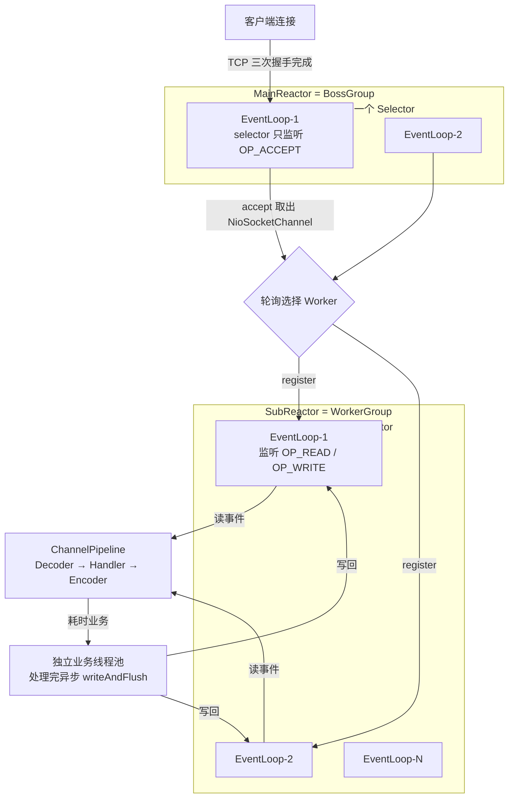
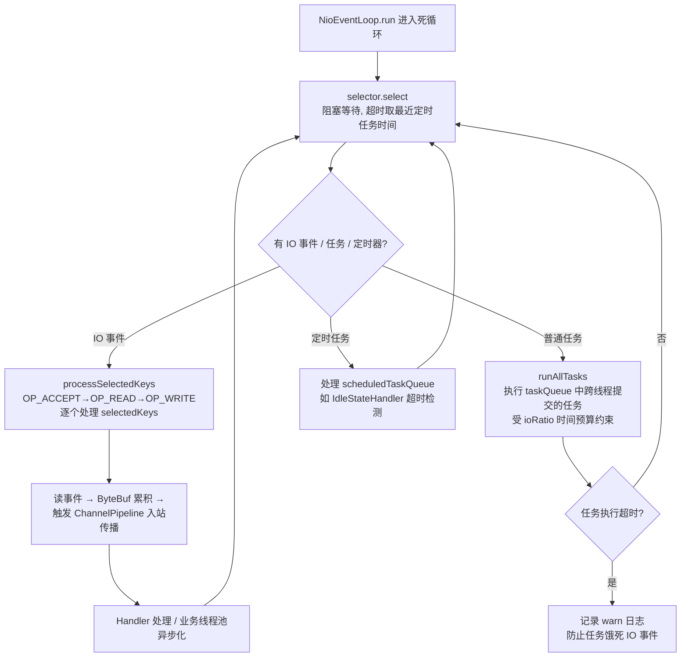
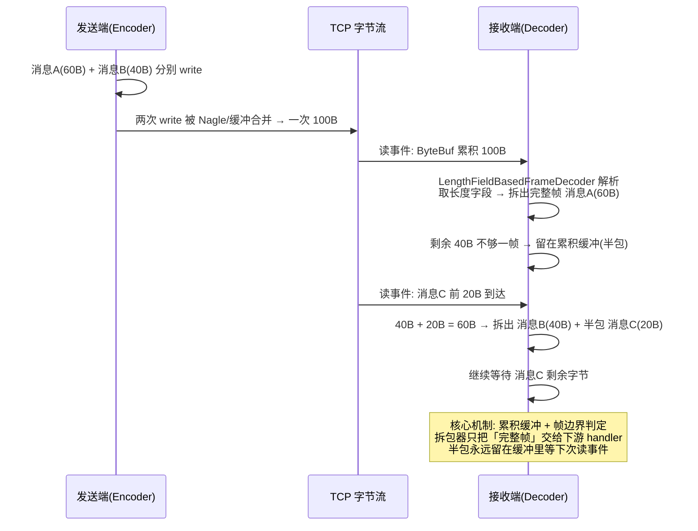
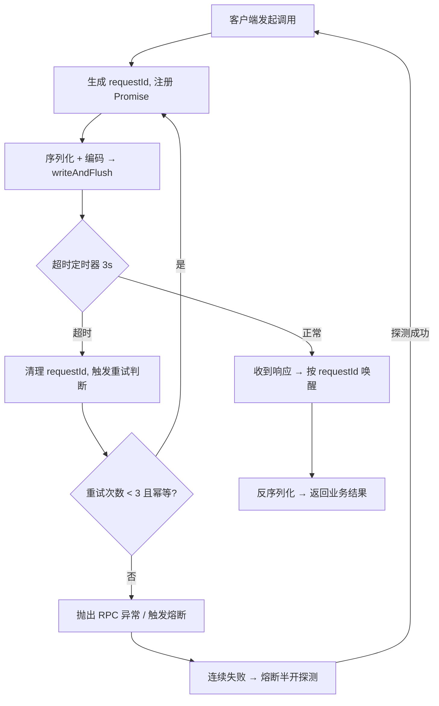

[📖 返回目录](README.md) · [⬅️ 上一章](10-zookeeper.md) · [➡️ 下一章](12-dubbo-nginx.md)

# 11 · Netty 原理与源码（资深向）

> 适用对象：10+ 年经验的资深工程师 / 架构师候选人。Netty 面试的深度分水岭：能背「NIO + Reactor 模型」八个字（及格），还是能把「epoll 水平/边缘触发、EventLoop 无锁串行化、ByteBuf 引用计数与池化、LengthFieldBasedFrameDecoder 半包处理、水位背压」串成一条「一个 10 万连接的网关为什么能扛住」的推理链（优秀）。本章按这个标准写：IO 模型是地基、线程模型是骨架、ByteBuf 与拆包器是血肉、调优与 RPC 是落点——任何一个环节答不透，资深人设都立不住。

**TL;DR 本章学习要点**

1. IO 演进本质是「把等 IO 的时间让出来」：BIO 一连接一线程 → NIO 缓冲区 + 非阻塞 → 多路复用把「一次系统调用等 N 个连接」；epoll 用「内核维护就绪链表」把复杂度从 O(n) 降到 O(1)；
2. Reactor 的演进是「分工」：单线程（一个线程干完所有事）→ 多线程（IO 与业务分离）→ 主从（accept 与 read/write 分离，boss/worker 两组 EventLoopGroup）；
3. Netty 线程模型核心是**无锁串行化**：一个 Channel 的所有事件、任务、定时器都在同一个 EventLoop 线程执行，跨线程提交用 MPSC 任务队列——「Channel 是线程安全的」是这条设计的推论；
4. ByteBuf 三件套：**引用计数**（谁 release 谁负责）、**池化**（jemalloc 思想：arena/chunk/page/subpage）、**零拷贝**（slice/duplicate/CompositeByteBuf/FileRegion 都是共享内存的不同视图）；
5. 粘包拆包是 TCP 流式语义的必然产物，四类拆包器里 **LengthFieldBasedFrameDecoder 是 RPC 协议的标准答案**；手写 RPC 的四个要点：协议（魔数+长度+requestId）、序列化、心跳、重试（幂等前提）。

---


### 📑 本章目录

- [1. IO 模型演进](#1-io-模型演进)
- [2. Reactor 模式](#2-reactor-模式)
- [3. Netty 线程模型](#3-netty-线程模型)
- [4. 核心组件源码](#4-核心组件源码)
- [5. 编解码与粘包拆包](#5-编解码与粘包拆包)
- [6. 高并发调优](#6-高并发调优)
- [7. 手写 RPC 骨架：基于 Netty 的设计要点](#7-手写-rpc-骨架基于-netty-的设计要点)
- [考点速查表](#考点速查表)

## 1. IO 模型演进


### 1.1 BIO：一连接一线程，线程是稀缺资源

- BIO 的 read/write 是阻塞的：线程调用 read 后挂起，等数据到达内核才返回——**线程在等 IO 期间不干任何事**；
- 模型：accept 一个连接就开一个线程处理，连接数 = 线程数；线程 = 1MB 左右的栈内存 + 上下文切换成本，千级连接就吃紧；
- 改进版「伪异步」：用线程池限制线程数——但底层还是阻塞 IO，**线程池耗尽后请求直接排队超时**，本质没变；
- 结论：BIO 的问题不是「线程贵」，而是「**用线程去等 IO 是巨大的浪费**」——IO 就绪前线程本可以干别的。

### 1.2 NIO：Channel + Buffer + Selector 三件套

- **Channel**：双向通道（FileChannel/SocketChannel），读写都基于缓冲区；
- **Buffer**：读写都要先拷进缓冲区（HeapByteBuffer/DirectByteBuffer），flip/clear 切换读写模式；
- **Selector**：注册多个 Channel，一个线程调用 select() 阻塞，**内核告诉它哪些 Channel 就绪**——「一个线程管 N 个连接」成为可能；
- 但 Java NIO 原生 API 的坑：ByteBuffer 手动管理 position/limit 极易错、selector 的 selectedKeys 要手动 remove、半包处理要自己写累积缓冲、空转 bug（JDK 的 select 在 Linux 上有 100% CPU 空转问题，Netty 用「重建 selector + 空转计数」规避）——**Netty 的本质之一就是把这些坑全部填掉**。

### 1.3 多路复用：select → poll → epoll

| 维度 | select | poll | epoll |
|---|---|---|---|
| 数据结构 | fd_set 位图 | pollfd 链表 | 红黑树（注册表）+ 就绪链表 |
| 连接数上限 | FD_SETSIZE=1024 | 无上限 | 无上限（受 fd 数限制） |
| 就绪检测 | 每次全量遍历 fd，O(n) | 每次全量遍历，O(n) | 内核回调挂就绪链表，**O(1) 取就绪事件** |
| fd 集合传递 | 每次调用**用户态↔内核态拷贝**全量 fd | 同 select | epoll_ctl 注册一次，**mmap 共享内存**避免拷贝 |
| 触发模式 | 水平触发 | 水平触发 | **水平 LT / 边缘 ET 都可** |

- **水平触发（LT）**：只要缓冲区还有数据，每次 select/epoll_wait 都会返回就绪；**边缘触发（ET）**：只有「从无到有」的边界才通知一次，之后不读就再也不通知——**ET 必须一次把数据读完，否则丢数据**；
- 选型结论：**Java NIO 的 Selector 在 Linux 上是 LT 语义，Netty 默认 LT**——LT 的「没读完还会再通知」对「部分读」天然友好，配合 Netty 的循环读（read loop）直到读尽或水位为止；ET 的优势是事件更少（内核通知次数少），但编程模型更苛刻，Netty 的 Epoll 传输也保留 LT 默认；
- epoll 的三个系统调用：`epoll_create`（建表）、`epoll_ctl`（增删改关注事件）、`epoll_wait`（等就绪）——面试能说出这三个调用 + 红黑树/就绪链表，就是源码级理解。

### 1.4 零拷贝：减少「数据在内存间搬来搬去」

- 传统 read+write 一次发送：**4 次拷贝**（磁盘→内核页缓存→用户态→内核 socket 缓冲→网卡 DMA）+ **4 次用户态/内核态切换**；
- 三个层次的零拷贝：
  1. **mmap**：内核页缓存映射到用户空间，省 1 次拷贝（用户态不再需要 copy 到自己的 buffer），剩 3 次；
  2. **sendfile**：数据全程在内核态搬运，用户态完全不碰数据，剩 2 次（页缓存→socket 缓冲 + DMA 到网卡）；
  3. **DMA gather**（Linux 2.4+）：页缓存直接描述符发给网卡，只剩 DMA 1 次——真正的零拷贝；
- Netty 落地：**FileRegion / DefaultFileRegion**（底层 `transferTo` = sendfile）发大文件；**CompositeByteBuf** 合并多个 buffer 不拷贝；**slice/duplicate** 共享内存；**DirectByteBuffer** 减少堆内堆外拷贝；
- 注意边界：**零拷贝主要对「文件→网络」有效**；应用层数据（要经过编解码/业务处理）该拷贝还得拷贝——面试别把「零拷贝」吹成万能。

```mermaid
flowchart LR
    subgraph "传统路径[""传统 read+write: 4 次拷贝"]
        A["磁盘"] -->|DMA| B["内核页缓存"]
        B -->|CPU 拷贝| C["用户态 buffer"]
        C -->|CPU 拷贝| D["内核 socket 缓冲"]
        D -->|DMA| E["网卡"]
    end
    subgraph sendfile["sendfile: 2 次拷贝"]
        F["磁盘"] -->|DMA| G["内核页缓存"]
        G -->|CPU 拷贝| H["内核 socket 缓冲"]
        H -->|DMA| I["网卡"]
    end
    subgraph gather["DMA gather: 真正零拷贝"]
        J["磁盘"] -->|DMA| K["内核页缓存"]
        K -->|描述符直接下发| L["网卡"]
    end
```

### 本节高频面试题

**Q1：为什么 BIO 撑不住高并发？NIO 的本质改进是什么？**

解答：BIO 用「线程等 IO」：每个连接一个线程，线程在 read 阻塞期间白白占用栈内存和 CPU 调度。NIO 的改进是「**线程不再等数据，而是等事件**」：一个线程通过 Selector 同时监控 N 个连接的就绪事件，就绪才处理。本质是**把「等」从线程层面挪到内核层面**，线程利用率从「1 连接 1 线程」变成「1 线程 N 连接」。面试加分：说清楚代价——事件驱动模型要求**处理逻辑不能阻塞**（阻塞 = 整个 Selector 的 N 个连接一起等），这就是为什么 Netty 要求 handler 里不能有耗时操作。

**Q2：epoll 相比 select 强在哪？水平触发和边缘触发怎么选？**

解答：三点：1) **无 fd 上限**（select 的 fd_set 是 1024 位图）；2) **O(1) 就绪获取**——内核在 fd 就绪时回调挂入就绪链表，epoll_wait 直接取链表，而 select/poll 每次全量扫描 O(n)；3) **免拷贝**——epoll_ctl 注册后内核维护红黑树，事件通过 mmap 共享内存返回，select 每次调用都要把 fd 集合拷进拷出。LT vs ET：LT 是「有数据就报」，ET 是「边界变化才报一次」；ET 必须一次读完否则丢数据，编程苛刻；**Netty 默认 LT**，靠 read loop 在读尽或达到水位前循环读，简单且不易丢数据。

面试官追问：ET 模式下读到一半怎么办？——答：ET 只通知一次，如果没读完，数据会一直留在内核缓冲区且不再通知，必须靠「读尽」或「读到 EAGAIN」来保证；所以 ET 的正确姿势是循环 read 直到返回 EAGAIN，这要求**读逻辑必须非阻塞且完整**——Netty 选择 LT 正是为了规避这个复杂度。

**Q3：零拷贝在 Netty 里怎么用？哪些场景用不上？**

解答：Netty 的零拷贝是「共享内存视图」而非「不拷贝」：(1) **slice()/duplicate()**：共享同一块内存，只复制索引（读/写指针），适合报文头拆分；(2) **CompositeByteBuf**：多个 buffer 逻辑合并，避免拼包拷贝；(3) **FileRegion（transferTo）**：文件→网络走 sendfile，大文件传输不走用户态。用不上零拷贝的场景：数据需要**跨进程/跨线程传递**（引用计数和生命周期难控制）、需要**编解码修改**（如加解密、压缩）、数据在**堆内存**（先要拷到 Direct 才能 DMA）。面试结论：零拷贝是「文件发送、报文切分」的优化，不是业务数据的万能解。

---

## 2. Reactor 模式

### 2.1 单线程 Reactor：一个线程干所有事

- 一个线程跑 Selector：accept 连接、读事件、业务处理、写回——全部串行；
- 优点：无锁、简单；缺点：**任何一个 handler 阻塞，整个服务停摆**；单核 CPU 场景才合理；
- 定位：教学模型，Netty 的 `ReactorThread` 变体只在极端简单场景出现。

### 2.2 多线程 Reactor：IO 与业务分离

- **Reactor 线程**：只负责 accept/read/write 等 IO 事件分发；
- **业务线程池**：handler 里的耗时业务（DB、RPC、计算）丢给独立线程池，处理完再异步写回；
- 代价：跨线程传递数据、业务线程池打满后的排队与拒绝——**线程池大小、队列策略成为新的调优点**。

### 2.3 主从 Reactor：accept 与读写分离

- **MainReactor（Boss）**：只做 accept，把新连接注册到某个 SubReactor；
- **SubReactor（Worker）**：管理已建立连接的 read/write 事件；
- 为什么分离：accept 本身也是 IO 事件，若与读写混在一起，**大量短连接的 accept 风暴会挤占读写事件的处理**；分离后各自独立线程，互不拖累；
- 工程现实：Java NIO 的 Selector 无法被多个线程安全地 select（wakeup 竞争），所以「每线程一个 Selector」是天然的实现方式——**主从 Reactor 在 Netty 里 = BossGroup + WorkerGroup 两个 EventLoopGroup**。



### 2.4 Netty 如何实现主从 Reactor

- `NioEventLoopGroup` 默认线程数 = `max(1, 2 × CPU 核数)`（`io.netty.eventLoopThreads` 可覆盖）；**BossGroup 通常 1~2 个线程就够**（accept 是轻量事件，线程多了反而浪费）；
- `ServerBootstrap.group(bossGroup, workerGroup)`：boss 负责 accept，worker 负责读写；
- 每个 `NioEventLoop` = 一个**永不退出的线程** + 一个 **Selector** + 两个队列（taskQueue、scheduledTaskQueue）；
- 新连接注册：boss 的 EventLoop 执行 `register` 把 channel 绑到某个 worker EventLoop 的 selector 上（默认轮询，可自定义 `ChannelOption` 分配策略）；
- 面试要点：**连接一旦注册到某个 EventLoop，终生不变**（除非重建）——这是无锁串行化的前提。

### 本节高频面试题

**Q4：主从 Reactor 解决了什么问题？为什么 boss 和 worker 必须分开？**

解答：两个问题：1) **互不拖累**——accept 风暴（大量短连接）与读写流量是两种节奏，混在一个线程里，accept 忙时读写延迟飙升；2) **扩展性**——读写是主要负载，worker 可水平加线程，boss 保持轻量。再往深说：Java NIO 的 Selector 线程模型下，「每线程一个 Selector + 连接固定归属」是唯一能无锁化的实现，主从分离本质上是**为了配合事件循环模型**。

面试官追问：boss 线程数设多少合适？设 4 个会更好吗？——答：boss 只做 accept + 注册，每连接开销微秒级，1~2 个足够；设多了反而增加「连接被分散到更多 selector」的调度复杂度。真正决定吞吐的是 worker 数量和业务处理方式。

**Q5：Netty 的 EventLoopGroup 默认线程数为什么是 2 倍 CPU 核数？**

解答：这是「IO 密集型 + 少量计算」的工程经验值：EventLoop 线程大部分时间阻塞在 select 上，CPU 密集度低，2 倍核数让「select 等待」与「事件处理」重叠，提高核利用率。但**经验值不是真理**：如果 handler 里全是 CPU 密集计算，2 倍核数反而引入上下文切换开销，应降到核数；如果全是纯 IO 转发（如代理），可以更高。面试加分：说「线程数不是配置出来的，是压测出来的——以『单 EventLoop 的 CPU 占用率不超过 50%』为基准反推」。

---

## 3. Netty 线程模型

### 3.1 EventLoop 与线程绑定：一生一世的绑定

- **一个 NioEventLoop = 一个线程 + 一个 Selector + 一个 MPSC 任务队列**；EventLoop 与线程是**强绑定**（创建时起线程，EventLoop 活着线程就在）；
- 线程模型铁律：**任何 Channel 的任何操作（IO 事件、定时任务、用户提交的任务）都只会在这个 Channel 绑定的 EventLoop 线程上执行**；
- 跨线程提交：其他线程想操作 Channel，不能直接调（会有竞态），必须 `channel.eventLoop().execute(runnable)` 把任务丢进 MPSC 队列，由 EventLoop 线程串行执行——这就是「无锁串行化」；
- 由此推论：**Channel 是「线程安全的」**（所有访问都被串行化到单线程），但前提是**你遵守「跨线程必须 submit」的约定**。

### 3.2 NioEventLoop 的处理流程：一次循环干三件事



- **ioRatio**（默认 50）：select 之后，IO 事件处理与任务处理的时间配比——IO 花 50% 时间，任务最多再花 50%；ioRatio=100 表示任务不限时（有饿死 IO 的风险）；
- **空转检测**：若 select 连续返回 0 次就绪且空转超阈值（`SELECTOR_AUTO_REBUILD_THRESHOLD`，默认 512 次），Netty 认为 JDK selector 有 bug（Linux 上著名的 100% CPU 空转），**重建 Selector 并迁移已注册的 channel**——这是源码级骚操作，面试提出来是亮点；
- select 超时 = 「最近的定时任务时间」与 1 秒的较小值——保证定时任务（如 IdleStateHandler 的心跳超时）不会因为 select 长阻塞而延迟。

### 3.3 无锁串行化：为什么 Netty 不需要锁

- 核心设计：**一个 Channel 的所有事件和任务，永远在同一个线程执行**（EventLoop 绑定），所以 handler 链路上的数据访问天然单线程，无需加锁；
- 跨线程通信只有一条路：`execute()` 入 MPSC（多生产者单消费者）队列——入队加锁，出队无锁，单消费者无竞争；
- 对比：传统「连接 → 线程池」模型里，同一连接的数据可能被不同线程处理，必须锁；Netty 用「连接固定线程」从结构上消灭了锁；
- 代价：**单个 Channel 的吞吐受限于单线程**（一个 EventLoop 上所有 Channel 共享该线程的处理能力），但连接数巨大时这完全不是瓶颈；真正要防的是「一个慢 Handler 拖垮同 EventLoop 上所有连接」。

### 3.4 Handler 线程模型与坑（高频面试点）

- 默认情况下，**Pipeline 里所有 Handler 都在 IO 线程（EventLoop）上执行**：解码、业务、编码全串行；
- **坑 1：Handler 里做阻塞调用**（DB、HTTP、Thread.sleep）→ 整个 EventLoop 停摆，**同线程上的所有连接集体超时**——这是 Netty 生产事故第一名的「慢 handler 拖垮全连接」；
- **坑 2：Handler 里直接操作 Channel 的共享状态**（如跨连接计数器、共享 Map）——虽然单连接无锁，但**跨连接的共享数据仍需自己加锁或原子类**；
- **坑 3：业务线程池写回**——在业务线程里调用 `ctx.writeAndFlush()` 是允许的（Netty 内部会提交到 EventLoop），但要注意：write 是**出站事件**，会从当前 handler 位置**向前（tail 方向）**传播，跨线程写回要确认传播起点符合预期；且 writeAndFlush 的 Future 回调也在 EventLoop 线程执行，不要在回调里再阻塞；
- **坑 4：Handler 抛异常**——入站异常沿 `exceptionCaught` 向 tail 传播，不处理会被 TailContext 吞掉（只记日志），**连接不会自动关闭**，要自己决定 close；
- 标准解法：耗时业务丢「独立业务线程池」（注意拒绝策略与队列长度），处理完 `ctx.executor().execute()` 或直接 writeAndFlush 异步写回；读密集型场景可考虑 `DefaultEventExecutorGroup` 给 handler 换执行器（`addLast(group, handler)`），但**多个 handler 的执行器要一致，否则破坏串行语义**。

### 本节高频面试题

**Q6：NioEventLoop 一个线程怎么同时干 IO、定时任务、用户任务三件事？互相干扰怎么办？**

解答：一次循环 = select（阻塞，超时取最近定时任务时间）→ 处理就绪 IO 事件 → 执行 taskQueue/scheduledTaskQueue。干扰控制：**ioRatio** 限制任务执行的时间预算，防止任务饿死 IO；select 超时锚定最近的定时任务，保证定时精度。面试升级：说「MPSC 队列 + 单消费者」是 Netty 无锁化的根基，任何跨线程操作都通过入队完成，队列入队用 CAS 自旋锁，出队只有 EventLoop 自己——所以**提交任务的开销是 O(1) 且无锁竞争**。

面试官追问：select 空转（JDK bug）怎么处理？——答：Netty 统计连续空转次数，超过阈值（默认 512）触发 **selector 重建**：新建 Selector，把旧 Selector 上所有 channel 的 key 重新注册过去——这就是 `NioEventLoop` 里的 `rebuildSelector()`，属于源码级考点。

**Q7：为什么说「Channel 是线程安全的」？什么情况下这个保证会失效？**

解答：因为所有对 Channel 的操作都被串行化到绑定线程执行：IO 事件在 EventLoop 线程处理，跨线程操作必须走 `execute()` 入队。保证失效的场景：1) **绕过 EventLoop 直接操作**（如 handler 里直接操作其他 Channel 的 buffer、在业务线程里直接调用 `channel.unsafe()` 之类）；2) **共享的可变状态跨连接共享**（Channel 安全 ≠ 业务对象安全）。面试结论：Netty 的线程安全是「结构性的」，前提是遵守它的提交约定。

**Q8：一个 Handler 里做了 5 秒的 DB 查询，会发生什么？怎么修？**

解答：该 Handler 所在的 EventLoop 线程被阻塞 5 秒，**这个线程上的所有连接**（可能几千个）在这 5 秒内无法处理任何 IO 事件——读缓冲堆积、心跳超时、连接被对端判定死连接。修复三板斧：1) 业务**异步化**：DB 查询丢业务线程池，回调里写回；2) 给 handler 指定独立执行器 `addLast(executorGroup, handler)`（注意整条链的执行器一致性）；3) 如果无法异步，至少**单独开一组 EventLoopGroup 给慢业务通道**，隔离故障面。面试升华：这题的答案就是「**EventLoop 是共享的，Handler 的延迟是隔离的敌人**」——单连接延迟会变成全局延迟。

---

## 4. 核心组件源码

### 4.1 ChannelPipeline：责任链的入站/出站双链表

- Pipeline 是**双向链表**：head（HeadContext）↔ handler1 ↔ handler2 ↔ ... ↔ tail（TailContext）；`addLast/addFirst/before/after/replace/remove` 动态增删；
- **入站事件（inbound）**：从 head 向后传播——`fireChannelRead/fireChannelActive/fireExceptionCaught`，对应「数据进来」；
- **出站事件（outbound）**：从 tail 向前传播——`write/connect/bind/close`，对应「操作发出」；
- 每个 handler 处理完必须显式调用 `ctx.fireXxx()`（入站）或 `ctx.xxx()`（出站）**继续传播**，否则链路中断；
- 典型链：`ChannelInitializer` 里 addLast 一组：`IdleStateHandler → LengthFieldBasedFrameDecoder → MessageDecoder → BusinessHandler → MessageEncoder`——**解码器在链头附近（先拆包），编码器在后（写出时先编码）**；
- 异常传播：`exceptionCaught` 也是入站事件，从抛异常处向 tail 传播；**建议在链尾放一个兜底异常处理器**（记日志 + 关闭异常连接），否则异常被 TailContext 静默吞掉。

### 4.2 ByteBuf：引用计数 / 池化 / 零拷贝

- **读写双指针**：readerIndex/writerIndex，`readXxx` 移动读指针、`writeXxx` 移动写指针、`discardReadBytes` 回收已读空间（搬移，慎用）；
- **引用计数**：`refCnt` 初始 1，`retain()` +1、`release()` -1，归零即回收（池化内存归还池，堆内存可被 GC）；**谁最后持有谁 release**，Netty 在传播链路中会自动 release 入站 buffer（解码后原始 buffer 自动释放）——所以业务 handler 里**不要异步持有入站 ByteBuf**（release 后访问 = IllegalReferenceCountException）；
- **泄漏检测**：`-Dio.netty.leakDetection.level=simple|advanced|paranoid`（默认 simple，采样检测）——生产环境建议 advanced + 压测，发现 `LEAK: ByteBuf.release() was not called before it's garbage-collected` 必须追根；
- **slice()/duplicate()**：零拷贝视图——共享同一块内存、独立索引；**copy()**：深拷贝独立内存。用 slice 切报文头/体，用 duplicate 临时改读指针，**两者都不增加底层内存，release 时要小心只释放「真正拥有内存的那份」**；
- **CompositeByteBuf**：逻辑合并多个 buffer（如报文头 + 体），写时零拷贝拼装。

```
原始 ByteBuf: [ header(4B) | body(96B) | 剩余容量 ]
slice(0, 4)     → 只读 header 区域的视图（共享内存, 独立索引）
duplicate()     → 整块共享, 独立索引（可各自调整读位置）
copy()          → 独立内存, 互不影响
```

### 4.3 内存分配器：jemalloc 思想的池化

- `PooledByteBufAllocator`（默认）vs `UnpooledByteBufAllocator`：前者池化复用，后者每次 new；
- 池化结构（仿 jemalloc）：**Arena**（默认 2×CPU 个，每个 arena 一把锁，减少竞争）→ **Chunk**（默认 16MB 大块）→ **Page**（8KB）→ **Subpage**（16B~8KB 的小对象池）；
- 分配策略：大对象（>8KB 或 >chunk 阈值）直接分配 chunk；小对象走 subpage 池；**同线程优先分配本线程 arena 的缓存（ThreadLocal cache）**，无锁命中率高；
- **DirectBuffer vs HeapBuffer**：Direct 堆外内存，省去「堆内 → 堆外」的 socket 写拷贝，但分配/回收成本高（必须池化）；Heap 便宜但 IO 前要拷到 Direct；
- 堆外内存 OOM 排查：`-XX:MaxDirectMemorySize` + Netty 的 `PlatformDependent.maxDirectMemory`，池化后堆外用量看「池中空闲块」而非只盯 DirectByteBuffer 总数——**堆外 OOM 第一嫌疑是 ByteBuf 泄漏（引用计数没 release）**，不是配置。

### 本节高频面试题

**Q9：Pipeline 里 handler 的执行顺序怎么定的？入站出站混在一起怎么走？**

解答：入站事件从 head 向后传播（fire 系列），出站事件从 tail 向前传播（write/connect 系列）；一个 handler 可以同时实现 inbound 和 outbound 方法，它在中转时「入站向后、出站向前」——**顺序由 addLast 的添加顺序决定**。典型错误：把业务 handler 放在解码器之前，入站时解码还没发生就进了业务逻辑；把编码器放在链中而非链尾，出站时后面的 handler 拿不到编码后的数据。面试口诀：**解码靠前、编码靠后、异常兜底在尾**。

**Q10：ByteBuf 的引用计数，谁负责 release？漏了会怎样？**

解答：规则是「**最后一个持有者负责 release**」：Netty 在入站传播结束时自动 release 原始 buffer（TailContext 兜底），所以业务 handler 若要**异步使用**数据必须 `retain()`（或 copy），用完后 release；否则异步线程访问已回收内存抛 `IllegalReferenceCountException`，或更隐蔽的「数据被池化复用、读到别人的数据」。漏 release 的后果：池化内存被占着不还 → 堆外内存持续增长 → **DirectMemory OOM**；检测靠 leak detection 日志。面试加分：`SimpleChannelInboundHandler` 会自动 release 入站消息，业务上优先用它，省一半心智负担。

**Q11：PooledByteBufAllocator 的分配层级？为什么 Netty 要自己搞内存池而不是靠 JVM GC？**

解答：层级：Arena（减少锁竞争）→ Chunk（16MB 大块）→ Page（8KB）→ Subpage（小对象池），同线程有 ThreadLocal cache 加速。为什么不用 JVM：1) 堆外内存**不受 JVM GC 管理**，不池化就是频繁 malloc/free 系统调用；2) **GC 无法回收堆外**，只能靠显式释放，池化把「分配-释放」变成「借-还」；3) 池化避免内存碎片。面试升华：Netty 内存池是「**面向高吞吐的显式内存管理**」，代价是引入引用计数这套心智负担——这也是 Netty 学习曲线最陡的部分。

---

## 5. 编解码与粘包拆包

### 5.1 粘包/拆包是怎么产生的

- TCP 是**字节流**，没有「消息边界」；「消息 A + 消息 B」发出去，对端可能一次收到「A+B 的一部分」或「A+B 全部」或「A 的一部分」；
- 三个放大器：**Nagle 算法**（小包合并）、**内核缓冲区合并**（多次 write 一次送达）、**对端读取时机**（一次 read 读走多条消息）；
- 所以：**任何基于 TCP 的自定义协议，都必须自己定义「帧边界」**——这就是拆包器的职责。

### 5.2 四类拆包器：原理、选型、源码要点

| 拆包器 | 帧边界 | 适用 | 源码要点 |
|---|---|---|---|
| `LineBasedFrameDecoder` | 换行符 `\n`/`\r\n` | 文本协议（如 Redis 风格、简单日志流） | 内部累积缓冲找分隔符；`maxLength` 超限抛异常（防内存攻击） |
| `DelimiterBasedFrameDecoder` | 自定义分隔符（可多组） | 分隔符明确的文本/二进制协议 | 分隔符可配多个，按「最早出现的分隔符」切 |
| `FixedLengthFrameDecoder` | 固定字节数 | 定长报文（如老式 POS 协议） | 最简单，`frameLength` 定长切，长度不足留在缓冲 |
| `LengthFieldBasedFrameDecoder` | 长度字段（最主流） | **RPC/自定义二进制协议** | 见下方参数详解 |

**LengthFieldBasedFrameDecoder 六参数**（RPC 必考）：

```
maxFrameLength      — 单帧最大长度（防恶意超长帧, 超限抛 TooLongFrameException）
lengthFieldOffset   — 长度字段在帧内的偏移
lengthFieldLength   — 长度字段字节数（1/2/3/4/8）
lengthAdjustment    — 长度字段值 + 该值 = 真正的帧总长（补偿「长度字段后还有头字段」的情况）
initialBytesToStrip — 拆包后剥离的头部字节数（去掉魔数/长度字段, 把「纯 payload」交给业务）
failFast            — 超长帧是否立即抛异常（true 则半包阶段就抛）
```



- 编码侧配套：`LengthFieldPrepender`（自动在 payload 前写长度字段）——**拆包器与拼包器成对出现**；
- 选型结论：文本/日志流用 Line 或 Delimiter；简单定长用 Fixed；**一切 RPC/二进制协议无脑 LengthField**——它是性能与通用性的平衡点。

### 5.3 自定义协议设计：RPC 协议的骨架

```
魔数(2B) | 版本(1B) | 消息类型(1B) | 序列化类型(1B) | requestId(8B) | 数据长度(4B) | payload(N)
```

- **魔数**：快速识别协议（防止把垃圾数据当报文解析），首包校验失败即断开；
- **版本号**：协议演进兼容（老客户端拒收/降级）；
- **消息类型**：请求/响应/心跳/oneway——心跳走独立类型，不进业务逻辑；
- **requestId**：**关联请求与响应**（异步 RPC 的基石），同时是幂等去重的 key；
- **数据长度**：配合 LengthFieldBasedFrameDecoder 的 maxFrameLength 做**报文级安全上限**（防内存攻击）；
- 设计纪律：长度字段**必须存在且靠前**；帧结构**固定布局**（变长部分全部进 payload）；**payload 上限要小于 maxFrameLength** 且有安全余量。

### 本节高频面试题

**Q12：为什么 TCP 会粘包？UDP 会吗？**

解答：TCP 是流式协议，**消息边界是应用层概念**——Nagle 合并、内核缓冲、对端读取时机都会把多条消息混在一次 read 里（粘包）或拆散（半包）。UDP 是数据报协议，**一次 send 对应一次 recv，边界由内核保证**（但 UDP 有丢包/乱序/最大 64KB 问题）。所以：TCP 必须自己做帧边界，这就是拆包器存在的原因。

**Q13：LengthFieldBasedFrameDecoder 的 lengthAdjustment 和 initialBytesToStrip 分别解决什么问题？**

解答：lengthAdjustment 解决「长度字段的值 ≠ 帧总长」：很多协议的长度字段只统计「长度字段之后的数据」，而帧头还有魔数/类型等——`lengthAdjustment = 头部固定字节数` 让「长度值 + adjustment = 完整帧长」。initialBytesToStrip 解决「业务不想要头部」：拆包后把魔数/长度等头部剥掉，下游 handler 直接拿纯 payload。两者配合，解码器就能输出「**业务想要的干净数据**」，且半包处理完全透明。

面试官追问：maxFrameLength 设多大合适？——答：**按协议 payload 上限 + 头部 + 余量**；设太大 = 恶意超长帧会撑爆内存（一次分配 maxFrameLength 的缓冲），设太小 = 正常大报文被误杀。标准做法：协议里就约定 payload 上限（如 1MB），maxFrameLength 设 1MB + 头部 + 10% 余量。

**Q14：自定义二进制协议，怎么设计才能既安全又高效？**

解答：要素：魔数（防垃圾数据）、版本（演进）、requestId（异步关联 + 幂等）、长度字段（帧边界 + 安全上限）、固定头部布局（解析零歧义）。安全：maxFrameLength 上限 + 魔数校验 + 首包校验失败即断开（防协议探测攻击）。高效：头部紧凑（能 1B 不用 4B）、长度字段 4B 足够（2GB 上限）、payload 直接复用 ByteBuf 零拷贝切片（slice 出头/体，不 copy）。面试升华：**协议设计是「解析器友好」的设计——让拆包器一次能拆、业务一次能拿、攻击一次能防**。

---

## 6. 高并发调优

### 6.1 连接层：backlog 与 TCP 参数

- **SO_BACKLOG**：内核 accept 队列长度（半连接 + 全连接队列），`ServerBootstrap.option(ChannelOption.SO_BACKLOG, 1024)`；**只调 Netty 没用**——要配合内核参数：`net.core.somaxconn`（全连接队列上限）与 `net.ipv4.tcp_max_syn_backlog`（半连接队列），Netty 设了 1024 而内核默认 128/4096 会静默截断；
- **TCP_NODELAY**：禁用 Nagle，小包立即发送（RPC 场景必开，**Netty 默认开启**）；代价：大量小包放大网络包数，纯大包传输场景可关；
- **SO_REUSEADDR**：端口快速重启复用（TIME_WAIT 期间也能 bind）；
- **SO_KEEPALIVE**：TCP 层保活（默认 2 小时，太慢），**应用层心跳才是正解**（IdleStateHandler）；
- 连接数上限：`ulimit -n`（文件句柄）必须调大（如 100 万），否则「连接数到了句柄上限」是最隐蔽的线上故障。

### 6.2 背压：writeBufferWaterMark 写缓冲水位

- Netty 每个 Channel 有写缓冲队列，**高低水位**：默认低水位 32KB、高水位 64KB（`WRITE_BUFFER_WATER_MARK` 可配）；
- 对端消费慢 → 写缓冲堆积 → 超过高水位 → `channel.isWritable()` 变 false → **业务层应停止生产（背压）**，等低水位以下触发 `fireChannelWritabilityChanged` 再恢复；
- 不做背压的后果：写缓冲无限增长 → **OOM**（堆外/堆内一起爆）——高并发网关必配；
- 配套：`WRITE_BUFFER_LOW_WATER_MARK/HIGH_WATER_MARK` 按「单连接缓冲上限 × 连接数」预算。

### 6.3 线程与内存

- 线程数：boss 1~2；worker 按「连接数/千 + 事件类型」压测定，经验 2×CPU 起步；**业务线程池单独评估**（拒绝策略、队列、线程名必须有意义，方便排查）；
- 内存：worker 线程数 × 每连接读写缓冲（默认 64KB 读 + 写水位）就是基础内存预算——10 万连接 ≈ 10 万 × 几十 KB ≈ 数 GB 级别，**连接数上量级前先算内存账**；
- 堆外：`-XX:MaxDirectMemorySize` 明确设置，配合 leak detection；GC 选型：低延迟用 ZGC/G1；
- 其他：`ALLOCATOR` 默认池化；大文件用 FileRegion（sendfile）；SSL 用 `SslContext` 的 OpenSSL 实现（比 JDK 快数倍，但要注意 native 库部署）。

### 本节高频面试题

**Q15：线上 Netty 服务突然大量连接「假死」（连接在、数据不通），怎么排查？**

解答：排查链：1) 先看**背压**：`channel.isWritable()` 是否大面积 false、写缓冲是否堆积（对端消费慢或对端挂了没感知）→ 调水位或加消费端能力；2) 看**EventLoop 线程**：线程 dump 里 EventLoop 线程是否卡在业务 handler（慢 handler 拖垮全线程）；3) 看**心跳**：IdleStateHandler 是否配了、对端是否发了心跳（假活 = 对端进程死了 TCP 没断）；4) 看**句柄**：`ulimit -n` 是否打满；5) 看 GC：Full GC 停顿导致事件循环停摆。**面试结论：假死四件套 = 写缓冲背压、EventLoop 阻塞、心跳缺失、句柄耗尽，按这个顺序查。**

面试官追问：怎么主动预防？——答：监控四件套指标：每 EventLoop 的 CPU 与任务队列深度、channel 写缓冲水位分布、IdleState 触发次数、连接数 vs 句柄数；压测阶段就验证「慢对端场景」下的背压行为。

---

## 7. 手写 RPC 骨架：基于 Netty 的设计要点

### 7.1 协议与编解码（前面第 5 节的落地）

- 协议：魔数 + 版本 + 消息类型（请求/响应/心跳）+ 序列化类型 + requestId + 长度 + payload（见 5.3）；
- 解码链：`LengthFieldBasedFrameDecoder → 反序列化 → 分发`；编码链：`序列化 → LengthFieldPrepender`；
- requestId 管理：`ConcurrentHashMap<Long, Promise>`（或 Future），响应回来按 id 唤醒等待线程——**异步转同步的关键**。

### 7.2 序列化选型

| 序列化 | 体积 | 速度 | 跨语言 | 适用 |
|---|---|---|---|---|
| Protobuf | 小 | 快 | 是（需 .proto 管理） | 大厂标准、跨语言服务 |
| Kryo | 小 | 快 | 否 | Java 内部 RPC（注意版本兼容） |
| Hessian2 | 中 | 中 | 部分 | 老系统（Dubbo 2.x 默认） |
| JSON | 大 | 慢 | 是 | 调试、弱类型、性能不敏感 |

- 要点：**序列化兼容性 > 性能**——字段增删要兼容（protobuf 的字段号、JSON 的 ignore unknown）；压缩可选（gzip/snappy，CPU 换带宽，看网络是否瓶颈）。

### 7.3 心跳：连接保活与假活剔除

- **IdleStateHandler**：服务端 `readerIdleTime` 超时（如 90s 没收到任何数据）→ 触发 `userEventTriggered` → 关闭连接（剔除假活）；
- 客户端：`writerIdleTime`（如 30s 没发过数据）→ 发心跳包（独立消息类型，不进业务）；服务端收到心跳更新读空闲计时；
- 细节：**心跳与业务共用连接**（不单独开连接）；心跳包也要走同一协议（长度字段 + 类型 = heartbeat）；**读空闲判定用「收到任何字节」**，别只看业务消息（否则业务繁忙时误杀）；
- 面试升级：心跳间隔 = 对端剔除时间 / 3 左右；服务端剔除阈值要 > 客户端心跳间隔 × 2 + 网络抖动预算。

### 7.4 超时与重试

- **超时**：客户端请求设 timeout（如 3s），用 `schedule` 定时任务兜底唤醒（防止「请求永远等不到响应」）；超时后清理 requestId 映射，避免泄漏；
- **重试**：只对**幂等请求**重试（查询类安全；写类要业务保证幂等或用 requestId 去重）；指数退避 + 随机抖动（防止重试风暴同时打向对端）；重试上限（如 3 次）；
- **熔断/降级**：连续失败达阈值进入半开探测（可以借用 Hystrix/Sentinel 思路）；
- 连接策略：连接池（每目标 N 条连接，复用避免频繁建连）、负载均衡（random/轮询/一致性哈希）、失败剔除 + 定期探测恢复。



### 本节高频面试题

**Q16：手写 RPC，requestId 和超时是怎么配合的？为什么不能只用「先来先配」？**

解答：请求发出时 `pending.put(requestId, promise)`，响应按 requestId 取回 promise 并 complete——**一请求一 promise，天然支持乱序响应与并发多请求**（一个连接上同时 N 个在途请求，靠 requestId 而不是「按序配对」）。超时配合：`eventLoop.schedule(timeout)` 到点检查 promise 未完成则 completeExceptionally + 移除映射——**必须移除**，否则 pending map 无限膨胀泄漏。面试要点：异步 RPC 的「响应关联」与「超时兜底」是一对不可拆分的机制。

**Q17：RPC 重试有什么坑？什么请求不能重试？**

解答：坑：1) **非幂等写操作重试 = 重复扣款/重复下单**——只有幂等请求才能自动重试（查询天然幂等；写操作靠业务幂等键或 requestId 服务端去重）；2) **重试风暴**——所有客户端同时退避重试，把已经过载的服务端打挂，必须指数退避 + 抖动；3) **超时后响应其实到了**——响应迟到导致「超时重试 + 原请求成功」双写，服务端要靠 requestId 去重；4) 重试不重置超时——每次重试是新的完整超时周期，总耗时 = 重试次数 × 超时，别让调用方等太久。面试结论：**重试是「幂等 + 退避 + 去重」三位一体，缺一个都是事故。**

---

## 考点速查表

> 本章一句话收尾：**Netty = 「事件驱动 + 无锁串行化 + 池化内存」的异步网络框架；IO 模型选 epoll（LT）、线程模型守「一连接一 EventLoop」、内存守引用计数、协议守长度字段拆包、高并发守背压——五条线串起来，就是资深与背 API 的分界线。**
>
> 快速记忆口诀：一个 EventLoop 一个线程一个 Selector；跨线程操作走 execute；handler 阻塞 = 全线程陪葬；ByteBuf 谁最后持有谁 release；拆包器无脑 LengthField；写缓冲过水位要背压。
>
> 面试红线：别说「Netty 是多线程处理一个连接」（错，是一连接串行）；别说「零拷贝不用拷贝」（错，业务数据该拷还得拷）；别说「handler 里可以随便阻塞」（错，拖垮整个 EventLoop）。

| 考点 | 一句话要点 |
|---|---|
| BIO→NIO | 从「线程等 IO」到「线程等事件」；Selector 一线程管 N 连接 |
| select/poll/epoll | epoll：红黑树+就绪链表 O(1)、mmap 免拷贝、无上限；三个调用 create/ctl/wait |
| LT vs ET | LT 有数据就报（Netty 默认）；ET 只报边界，必须一次读完 |
| 零拷贝 | mmap→sendfile→DMA gather；Netty 用 FileRegion/slice/CompositeByteBuf |
| Reactor 演进 | 单线程→多线程（IO/业务分离）→主从（accept 与读写分离） |
| 主从实现 | BossGroup(accept) + WorkerGroup(读写)；线程数默认 2×CPU |
| EventLoop | 一线程+一 Selector+MPSC 队列；连接终生绑定一个 EventLoop |
| 无锁串行化 | 单连接所有事件单线程执行；跨线程只能 execute 入队 |
| ioRatio | IO 与任务时间配比（默认 50），防任务饿死 IO |
| selector 重建 | 空转超阈值重建 Selector，规避 JDK 空转 bug |
| Handler 坑 | 阻塞调用拖垮整个 EventLoop；异常要兜底处理器；跨连接共享状态仍要锁 |
| Pipeline | 双向链表；入站 head→tail、出站 tail→head；解码靠前编码靠后 |
| ByteBuf | reader/writerIndex；refCnt 引用计数；slice/duplicate 零拷贝视图 |
| 泄漏检测 | -Dio.netty.leakDetection.level；LEAK 日志=没 release |
| 内存池 | Arena→Chunk(16MB)→Page(8KB)→Subpage；Direct 堆外必须池化 |
| 粘包拆包 | TCP 流式无边界；累积缓冲+帧判定；四类拆包器 |
| LengthField | 六参数：maxFrameLength/offset/length/lengthAdjustment/initialBytesToStrip/failFast |
| 自定义协议 | 魔数+版本+类型+序列化+requestId+长度+payload；长度字段靠前 |
| backlog | SO_BACKLOG 配合 somaxconn/tcp_max_syn_backlog 一起调 |
| TCP_NODELAY | 禁 Nagle 小包即发；Netty 默认开 |
| 水位背压 | 写缓冲 32K/64K 高低水位；isWritable=false 即停生产 |
| 线程数 | boss 1~2；worker 压测定；业务线程池独立评估 |
| 心跳 | IdleStateHandler；服务端读空闲剔除，客户端写空闲发心跳 |
| RPC 骨架 | 协议+序列化+requestId Promise+心跳+超时重试（幂等前提） |
| 重试 | 幂等+指数退避+抖动+requestId 去重；非幂等不重试 |
