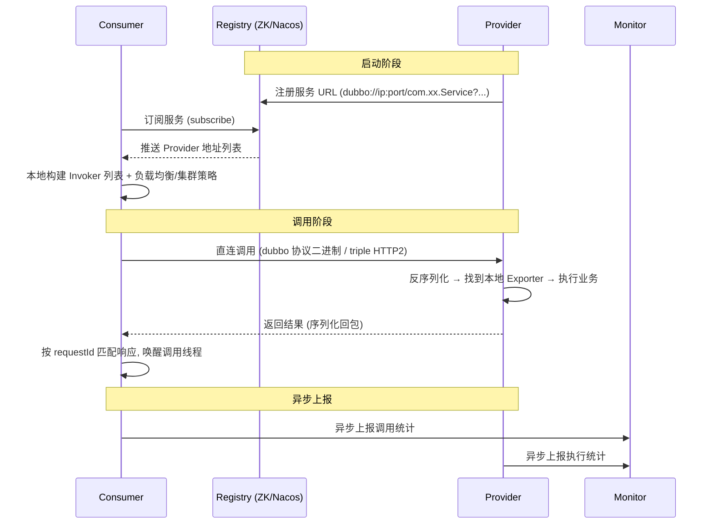
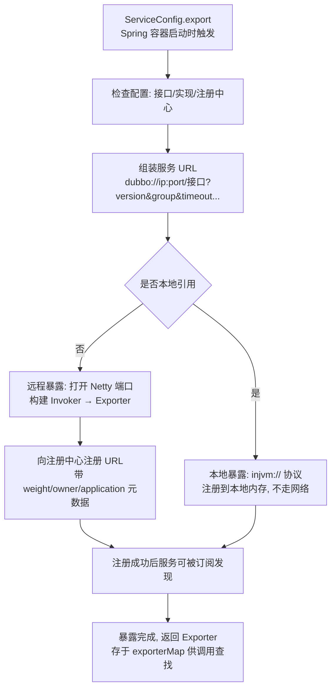
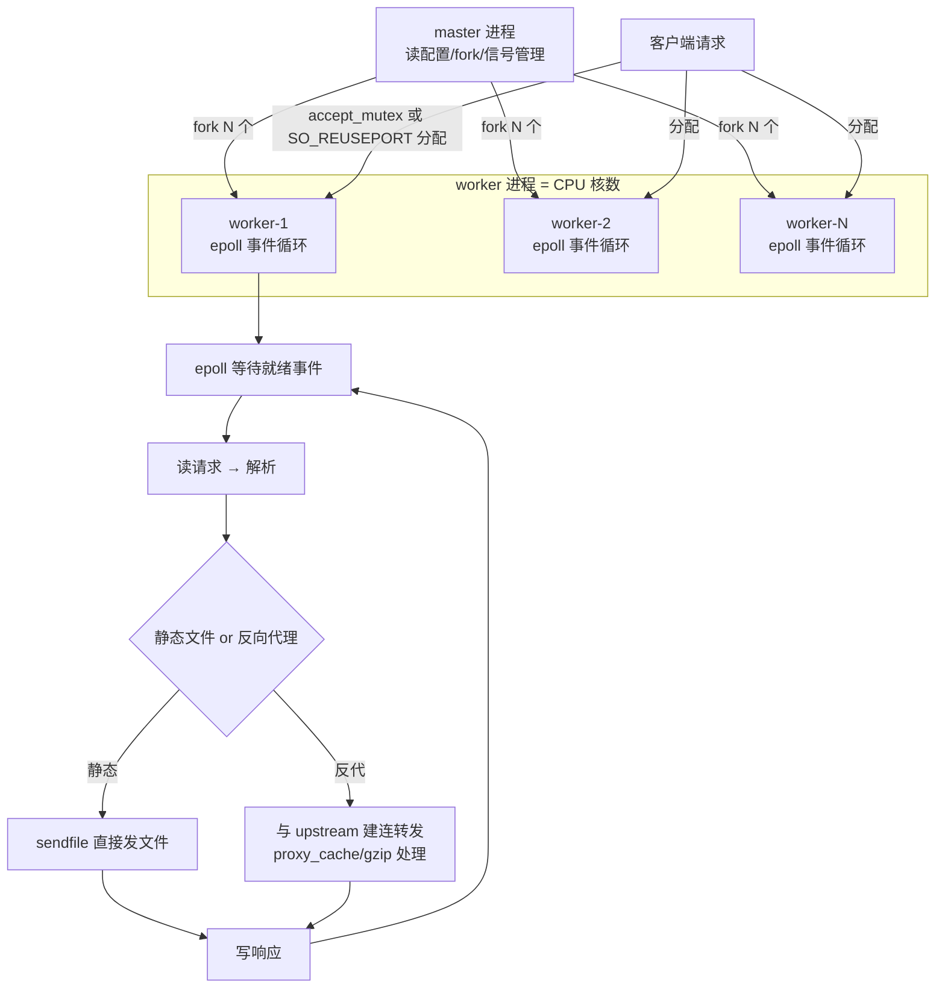
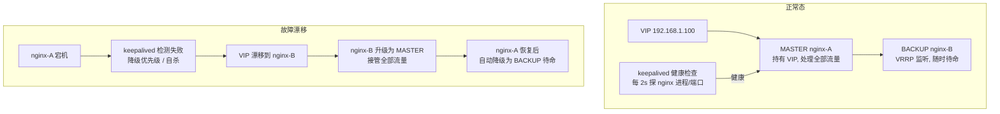

[📖 返回目录](README.md) · [⬅️ 上一章](11-netty.md) · [➡️ 下一章](13-spring-core.md)

# 12 · Dubbo 与 Nginx 详解（资深向）

> 适用对象：10+ 年经验的资深工程师 / 架构师候选人。Dubbo 与 Nginx 是「RPC 框架」与「接入层网关」两个方向上的经典：Dubbo 考的是「SPI 机制、暴露/引用流程、集群容错、服务治理」这条从源码到架构的推理链；Nginx 考的是「master-worker 事件驱动、负载均衡、反向代理缓存、限流安全、高可用、性能调优」这条从原理到运维的落地链。把这两个组件讲透，等于把「服务内部怎么调、流量入口怎么扛」两条线都立住了。

**TL;DR 本章学习要点**

1. Dubbo 的调用本质：**一切皆 URL**——暴露/引用/路由/注册全部围绕 URL 组装与流转；Provider 注册、Consumer 订阅、Registry 推送、直连调用、Monitor 异步上报，五步构成一次完整调用；
2. Dubbo SPI 是 JDK SPI 的增强：**按需加载 + key 索引 + @SPI/@Adaptive/@Activate 三个注解**；自适应扩展点靠运行时生成适配代码，按 URL 参数动态选实现——这是 Dubbo 可扩展性的根基；
3. 集群容错五件套：Failover（默认，失败切换）、Failfast（快速失败）、Failsafe（失败忽略）、Forking（并行扇出）、Broadcast（广播）；负载均衡四种：加权随机、平滑加权轮询、最少活跃、一致性哈希——**选型要落到业务对「失败语义」的容忍度**；
4. Nginx 是 master-worker 事件驱动模型：master 管配置与进程，worker 用 epoll 异步处理请求，**worker 数 = CPU 核数**；惊群用 accept_mutex（或 SO_REUSEPORT）解决；
5. Nginx 四板斧：负载均衡（upstream 七种策略）、反向代理缓存（proxy_cache + gzip）、限流（limit_req 漏桶 + limit_conn）、高可用（keepalived VIP 主备漂移）；调优 = worker/连接数/内核参数/HTTP2 四层。

---

# 第一部分：Dubbo

### 📑 本章目录

- [1. 架构与角色：一次调用的完整链路](#1-架构与角色一次调用的完整链路)
- [2. SPI 机制源码：Dubbo 可扩展性的根基](#2-spi-机制源码dubbo-可扩展性的根基)
- [3. 服务暴露与引用流程](#3-服务暴露与引用流程)
- [4. 集群容错与负载均衡](#4-集群容错与负载均衡)
- [5. 服务治理与选型](#5-服务治理与选型)
- [6. 架构：master-worker 与事件驱动](#6-架构master-worker-与事件驱动)
- [7. 负载均衡与健康检查](#7-负载均衡与健康检查)
- [8. 反向代理、缓存与压缩](#8-反向代理缓存与压缩)
- [9. 限流与安全](#9-限流与安全)
- [10. 高可用：Keepalived 与双机方案](#10-高可用keepalived-与双机方案)
- [11. 性能调优](#11-性能调优)
- [考点速查表](#考点速查表)

## 1. 架构与角色：一次调用的完整链路

### 1.1 五个角色与职责

- **Provider（服务提供者）**：暴露服务，启动时向 Registry 注册自己的 URL；
- **Consumer（服务消费者）**：启动时向 Registry 订阅服务，变更后刷新本地列表，直连 Provider 调用；
- **Registry（注册中心）**：服务注册与发现（ZK/Nacos/Redis）；**Dubbo 的注册中心只做「地址簿」，不转发流量**——调用是 Consumer 直连 Provider；
- **Monitor（监控中心）**：Consumer 与 Provider 异步上报调用次数/耗时/成功率，**不参与调用链**，挂了不影响调用；
- **Container（容器）**：服务运行容器（Spring 等），负责加载与生命周期。

### 1.2 一次完整调用（同步 RPC 视角）

- 关键点 1：**Consumer 与 Provider 之间是直连**，注册中心只在启动/变更时起作用——注册中心挂了，已有连接照常调用（这是「注册中心 AP 化」讨论的基础）；
- 关键点 2：Consumer 侧有**本地缓存**（订阅到的地址列表），注册中心短暂不可用不影响存量调用；
- 关键点 3：一次调用的核心对象是 **Invoker**——「可执行的服务调用单元」，从 Consumer 的代理到 Provider 的本地执行，全程以 Invoker 抽象贯穿（Dubbo 源码的第一性概念）。

### 本节高频面试题

**Q1：注册中心挂了，Dubbo 还能调用吗？**

解答：能。注册中心只在「启动订阅」和「地址变更通知」时起作用；Consumer 启动时已把 Provider 地址列表拉到本地缓存（`RegistryDirectory` 维护），调用是直连。影响的是：**新增 Provider 无法被发现、Provider 上下线无法感知、新 Consumer 启动拉不到地址**。所以注册中心故障 = 存量调用不受影响、变更能力暂停。面试升华：这正是「注册中心可用性要求是 AP 语义」的证据——Dubbo 3 应用级服务发现 + Nacos 的 AP 模式都是为了强化这个边界。

面试官追问：如果 Provider 也刚好在注册中心故障期间重启了呢？——答：重启后的 Provider 无法注册，Consumer 本地缓存里它是旧的（或没有），调用会失败——所以**注册中心故障期间禁止发布**是运维铁律，配合「发布前检查注册中心健康」。

---

## 2. SPI 机制源码：Dubbo 可扩展性的根基

### 2.1 JDK SPI 的问题（先立靶子）

- JDK SPI：`META-INF/services/接口全名` 文件里逐行写实现类全名；`ServiceLoader.load` 一次性**加载全部实现**；
- 三个痛点：**全量加载**（用不到的也 new）、**无 key 索引**（无法按名字选）、**无依赖注入与包装**（实现类无法再被扩展增强）。

### 2.2 Dubbo 增强 SPI：三个注解 + ExtensionLoader

- **配置文件位置**：`META-INF/dubbo/接口全名`（或 `META-INF/dubbo/internal/`），内容为 **`key=实现类全名`**（如 `dubbo=org.apache.dubbo.rpc.protocol.dubbo.DubboProtocol`）；
- **@SPI**：标记接口是扩展点（如 `@SPI("dubbo")` 表示默认实现是 dubbo）；ExtensionLoader 是 SPI 的加载器，**按需加载**（getExtension("name") 才 new，且单例缓存）；
- **@Adaptive（自适应扩展点）**：标注在接口方法或实现类上；标注在接口方法上时，Dubbo 在运行时**动态生成适配类代码**（`Xxx$Adaptive`），按方法参数里的 URL 的某个 key 值选择实现——**调用时才知道用哪个实现**，这是「配置驱动 + 运行时决策」的关键；
- **@Activate（激活扩展）**：标注在实现类上，声明 group（consumer/provider）与 value（条件），**按当前上下文自动激活**——典型是 Filter 链（如 `ConsumerContextFilter`）；
- **Wrapper 机制**：实现类若有「以接口类型为唯一构造参数的构造器」，会被当作包装类（装饰器），加载时自动层层包装——**扩展点可以横向叠加**（ProtocolFilterWrapper 就是这么包出来的）；
- 自适应代码生成示例（原理级理解）：`Protocol$Adaptive.export(Invoker)` 里会 `URL url = invoker.getUrl(); String extName = url.getProtocol();` 然后 `extensionLoader.getExtension(extName).export(invoker)`——**面试说出这四行，就是源码级**。

### 2.3 与 JDK SPI 对比

| 维度 | JDK SPI | Dubbo SPI |
|---|---|---|
| 加载方式 | 全量加载 | **按 key 按需加载 + 单例缓存** |
| 索引 | 无（按文件顺序） | key=value，可指定名字 |
| 默认实现 | 无 | @SPI("dubbo") 指定 |
| 自适应 | 无 | @Adaptive 运行时生成适配代码 |
| 条件激活 | 无 | @Activate 按 group/条件激活 |
| 扩展包装 | 无 | Wrapper 构造器自动装饰 |
| 失败处理 | 静默 | 加载失败抛异常并带原因 |

### 本节高频面试题

**Q2：Dubbo 的 SPI 和 JDK SPI 本质区别是什么？为什么要自己造一套？**

解答：三点本质区别：1) **按需加载**——JDK 的 ServiceLoader 一次 new 全部实现，Dubbo 只有 getExtension 到才加载（且缓存单例）；2) **key 寻址**——JDK 无法按名字取实现，Dubbo 靠 `key=class` 配置 + @SPI 默认值，实现「配置驱动选实现」；3) **自适应与激活**——@Adaptive 让实现的选择推迟到运行时（按 URL 参数），@Activate 让过滤器等按场景自动装配。为什么要自己造：Dubbo 的扩展点数量多（Protocol/Cluster/LoadBalance/Serialize 几十个），且需要**动态决策 + 装饰器叠加**，JDK SPI 的静态全量模型撑不起这个架构。

**Q3：自适应扩展点（@Adaptive）的原理是什么？为什么说它是 Dubbo 插件化的灵魂？**

解答：接口方法标注 @Adaptive 后，ExtensionLoader 在运行时用 javassist 生成 `接口名$Adaptive` 类：方法里从参数（URL 或能拿到 URL 的 Invoker）读取 key（如 protocol、loadbalance），`getExtension(extName)` 后委托调用——**实现的选择从「编译期/配置期」推迟到「调用期」**。灵魂在于：新增一个协议/负载均衡实现，**零侵入**——写个类 + 配置文件即可，现有代码不用改。面试升华：自适应 + 包装（Wrapper）组合，让 Dubbo 的扩展点可以「运行时选实现 + 装饰器叠加」，这是它十几年演进（2.x→3.x）而不重构的架构底气。

---

## 3. 服务暴露与引用流程

### 3.1 服务暴露（export）：从 ServiceConfig 到 Exporter

- **本地暴露**：`injvm` 协议，同一个 JVM 内 Consumer 直调本地 Provider，**不走网络不走序列化**（本地调用优化）；
- **远程暴露**：协议工厂（dubbo/triple/rmi/http）创建 Server 并开端口 → 构建 Invoker → 包装成 Exporter（含监听器：注册/取消注册/销毁）→ 注册 URL 到注册中心；
- **URL 是 Dubbo 的一等公民**：`dubbo://192.168.1.10:20880/com.xx.UserService?version=1.0.0&group=g1&timeout=3000&weight=100`——协议、地址、接口、参数全在 URL 里，注册中心存的是 URL，路由规则处理的也是 URL；
- 源码关键类：`ServiceConfig`（配置入口）→ `DubboProtocol.export`（协议实现）→ `Exporter` 管理在 `exporterMap`，Provider 收到请求时按「接口+版本+group」查 Exporter 执行。

### 3.2 服务引用（refer）：从 ReferenceConfig 到代理

- `ReferenceConfig.get()` → 直连（`url` 直接配置）或订阅注册中心 → 构建**一个或多个 Invoker**（对应 Provider 地址）→ 交给 **Cluster** 包装（容错策略）→ `ProxyFactory.getProxy(invoker)` 生成**业务接口代理**；
- 代理生成：`JavassistProxyFactory`（默认）/ `JdkProxyFactory`——代理对象方法调用 → Invoker.invoke → 负载均衡选一个 Invoker → 编码 → 发送 → 等待响应 → 反序列化返回；
- **透明性**：业务代码只依赖接口，完全无感知网络细节——「接口 + 代理 + Invoker」三层抽象是 RPC 框架的标准骨架。

### 本节高频面试题

**Q4：为什么要有「本地暴露」？什么场景会触发？**

解答：本地暴露（injvm）解决「同 JVM 内的服务间调用」：Consumer 引用本 JVM 内的 Provider 时，**直接方法调用，省掉网络、序列化、端口资源**。触发场景：1) 同一个应用内既有 Provider 又有 Consumer（如服务既是提供者又依赖其他服务，且该服务就在本地）；2) 本地调试；3) 测试。工程意义：默认配置下 `injvm` 是「引用优先本地」的（scope=local 时强制），面试要能说出「**默认远程暴露 + 引用时优先本地**」的完整语义，以及 `scope=remote` 强制走网络的应用（比如想验证真实网络路径时）。

**Q5：Provider 收到一个请求后，怎么找到对应的执行逻辑？**

解答：请求里带接口全名 + 版本 + group（服务唯一标识三要素），Provider 端协议层（DubboProtocol）用这三要素到 `exporterMap` 查 Exporter，命中后通过 Invoker 调 `invoke` 进入过滤器链（Filter 链：上下文/监控/限流等），最终到达 `AbstractProxyInvoker`，用**反射或编译生成的 Wrapper 类**调用真实实现方法。面试加分：性能细节——Dubbo 用 `Wrapper` 字节码类代替反射调用（`org.apache.dubbo.common.bytecode.Wrapper`），反射慢的问题在 Dubbo 里是被绕过的；答出这一点，说明你真读过源码。

---

## 4. 集群容错与负载均衡

### 4.1 五种集群容错策略

| 策略 | 行为 | 适用 | 源码要点（ClusterInvoker） |
|---|---|---|---|
| **Failover**（默认） | 失败自动切换其他 Provider，`retries=2`（共 3 次） | 读多写少、幂等调用 | `FailoverClusterInvoker.doInvoke` 循环选下一个 |
| **Failfast** | 失败立即抛异常，不重试 | 非幂等写（如新增记录） | 一次调用即抛 |
| **Failsafe** | 失败吞掉异常，只记日志 | 非关键旁路调用（如打点上报） | 捕获异常返回空结果 |
| **Failback** | 失败记录后**定时重试**（后台线程） | 异步通知类 | `failbackTasks` 定时任务补偿 |
| **Forking** | **并行调用多个** Provider，`forks=2`，**一个成功即返回** | 实时性要求极高、容忍资源浪费 | 线程池并行 invoke，首个成功即完成 |
| **Broadcast** | 逐个调用所有 Provider，**全成功才算成功** | 广播通知（如缓存预热、配置刷新） | 循环 invoke 聚合结果 |

- 选型逻辑：**失败语义决定策略**——「失败能不能重试」看幂等性，「失败要不要暴露」看业务重要性，「能不能接受放大」看资源预算；
- 面试陷阱：Forking 的「并行放大」——forks 默认 2 意味着**双倍资源消耗**，服务端本就过载时并行扇出是**雪上加霜**，选它要谨慎。

### 4.2 四种负载均衡

| 策略 | 原理 | 源码要点 | 适用 |
|---|---|---|---|
| **Random**（默认） | 加权随机，权重越大概率越高 | `AbstractLoadBalance.select` + `random.nextInt(totalWeight)` | 默认通用 |
| **RoundRobin** | **平滑加权轮询**：当前权重 += 配置权重，取最大者，选中后减去总权重——避免「权重 5:1 时 55551 的毛刺」 | `weight` 动态调整后**重置**，平滑性优先 | 权重差异大、追求均匀 |
| **LeastActive** | 选「活跃请求数最少」的 Provider，活跃数相同再按权重随机 | 活跃计数在 Filter 里增减（ActiveLimitFilter） | **慢 Provider 自动少接活**，天然保护 |
| **ConsistentHash** | 一致性哈希（默认 160 个虚拟节点），相同参数哈希到同一 Provider | `ConsistentHashSelector` 维护 TreeMap 环 | **会话保持**：同参数请求打同一节点（如按 userId 路由） |

- 源码要点：所有策略继承 `AbstractLoadBalance`，`select` 里先按「最小活跃数/权重」等筛选，`doSelect` 是各策略实现；**invoker 列表来自 RegistryDirectory 的动态刷新**——上线/下线实时影响选择；
- 面试结论：默认 Random 够用；**LeastActive 是「慢节点保护」的免费午餐**；一致性哈希解决「同参数同节点」诉求（如缓存亲和）。

### 本节高频面试题

**Q6：Failover 重试有什么风险？什么场景必须用 Failfast？**

解答：Failover 的 retries 默认 2 意味着**最多 3 次调用**——如果调用**非幂等**（扣款、下单、发消息），重试 = 重复执行 = 业务事故。所以：**写操作必须 Failfast（或业务侧幂等 + 服务端去重）**，读操作/幂等操作才放心 Failover。面试升华：重试的本质是「用重复请求换可用性」，代价是「重复执行的风险」，**幂等是重试的前提**——这个结论在 RPC、MQ、HTTP 重试里通用。

**Q7：一致性哈希负载均衡解决什么问题？虚拟节点是干嘛的？**

解答：解决「**同参数请求路由到同一 Provider**」：相同 userId 的请求（如用户数据操作）始终打到一个节点，可做本地缓存亲和。虚拟节点解决「哈希环偏斜」：Provider 少时直接按 IP 哈希，环上节点分布不均匀导致热点，每个 Provider 虚拟出 160 个节点均匀铺在环上，**分布更均匀、增删节点影响面更小**。面试注意：一致性哈希的代价是**负载不均衡**（热点用户全打一个节点），且节点变化时**只有部分 key 迁移**（这正是它的设计目标）；别把它当通用负载均衡用。

---

## 5. 服务治理与选型

### 5.1 路由、权重、优雅停机、QoS、泛化调用

- **路由**：条件路由（`condition://` 规则：`host = 10.0.*.* =>` 分流）、标签路由（tag 灰度）、脚本路由——路由发生在**负载均衡之前**，先按规则缩小候选集；
- **权重**：注册 URL 里的 `weight` 参数，动态调整（管理控制台改权重，**平滑生效**）；配 `warmup` 可让新节点**预热期逐步加权重**（防刚启动就被打满流量）；
- **优雅停机**：标准三步——1) 从注册中心**注销**（新流量不再进来）；2) **等待在途请求处理完**（Dubbo 停机等待时间可配，如 `dubbo.service.shutdown.wait`）；3) 关闭端口与线程池；实现靠 **Spring 的 shutdown hook / 容器监听器**；QoS 的 `offline` 指令可手动摘流量；
- **QoS**：Dubbo 自带的运维指令端口（默认 22222，`telnet ip 22222`）：`ls`（列出服务）、`ps`（查看端口）、`offline/online`（摘/挂流量）、`shutdown`（优雅停机）——生产上用 `offline` 做「发布前摘流」；
- **泛化调用（GenericService）**：Consumer **不依赖接口 jar**，用 `GenericService` + `Map<String,Object>` 参数调用——适合网关/测试平台/脚本；注意泛化调用会**丢失强类型校验**，性能也略差（序列化走泛化路径）。

### 5.2 Dubbo 3.x 演进（资深必答）

- **应用级服务发现**：2.x 的「接口级注册」在服务多时爆炸（接口数 × 实例数），3.x 改为「**应用级注册 + 接口映射**」（应用名 ↔ 接口列表），注册数据量降一个数量级，**适配 Nacos 等云原生注册中心**；
- **Triple 协议**：基于 HTTP/2 + gRPC 兼容，支持**流式调用**（客户端流/服务端流/双向流）、跨语言（gRPC 生态互调），向云原生靠拢；
- **Mesh 化**：支持 Service Mesh 数据面（Triple 协议天然适配），Proxyless 模式——Dubbo 3 是「从 RPC 框架向云原生服务框架演进」的答卷。

### 5.3 与 Spring Cloud 对比选型

| 维度 | Dubbo | Spring Cloud |
|---|---|---|
| 通信 | RPC（dubbo 二进制 / triple HTTP2），性能高 | HTTP REST（JSON），通用、调试友好 |
| 服务发现 | 注册中心（ZK/Nacos），接口级→应用级 | Eureka/Nacos/Consul，实例级 |
| 服务治理 | **强**：路由/权重/容错/限流/泛化/QoS 内建 | 弱，靠组件拼装（Hystrix/Sentinel 等） |
| 生态 | Java 强绑定，跨语言靠 Triple/gRPC | Spring 全家桶无缝，网关/配置/链路齐全 |
| 侵入性 | 接口 + 注解，需接口契约 | REST 无契约，HTTP 通用 |
| 适用 | **内部高性能、强治理诉求**的 Java 服务集群 | 快速迭代、异构系统、外部开放 API |

- 选型结论：**内部服务间高频调用 + 强治理（路由/容错/权重）→ Dubbo；对外 REST API、异构语言、Spring 生态深度整合 → Spring Cloud**；2023+ 的常见组合是 Spring Cloud Alibaba（Nacos + Sentinel + Dubbo 混合）——面试答「不是二选一，是分层混用」最显功力。

### 本节高频面试题

**Q8：优雅停机具体怎么做？顺序错了会出什么问题？**

解答：标准顺序：**先摘流量（注销 + offline）→ 等存量请求处理完 → 再关资源**。顺序错了的后果：先关端口/线程池 → 在途请求直接失败（连接被拒/超时）；不注销直接停 → 注册中心里还挂着地址，Consumer 继续往死节点打（直到感知下线）。实现：Spring 容器销毁钩子触发 Dubbo 的 `ApplicationShutdownHook`：注销注册 → 等待在途请求（可配等待时间）→ 关闭协议端口 → 释放资源。面试升级：配合**发布平台**先调用 QoS `offline` 摘流、等待流量归零、再停进程，才是生产级优雅停机。

面试官追问：停机等待时间怎么定？——答：大于「最慢请求的超时时间」（如全局 timeout 3s，就等 5~10s），太短杀在途请求，太长阻塞发布流程。

**Q9：Dubbo 和 Spring Cloud 怎么选？能不能混用？**

解答：判断维度：性能诉求（内部高频调用 → Dubbo RPC 二进制快）、治理诉求（路由/容错/权重内建 → Dubbo 强）、异构与对外（HTTP/REST → Spring Cloud）、团队生态（Spring 全家桶熟练度）。**混用是主流**：Spring Cloud Alibaba 体系 = Nacos（注册/配置）+ Sentinel（限流熔断）+ Dubbo（RPC 或 Feign），Dubbo 负责内部高性能链路、Spring Cloud Gateway 负责对外入口——架构师答「按链路分层选型」比「二选一」高一个段位。

---

# 第二部分：Nginx

## 6. 架构：master-worker 与事件驱动

### 6.1 master-worker 模型

- **master 进程**：不处理业务请求，职责 = 读配置、fork worker、接收信号（HUP 平滑重载、USR2 平滑升级、TERM 退出）、监控 worker 健康；
- **worker 进程**：真正处理请求，**每个 worker 是单进程事件循环**（epoll），worker 之间**完全独立、互不共享连接**；
- worker 数配置：`worker_processes auto`（= CPU 核数）；为什么 = 核数：worker 是 CPU 密集的事件循环，多出核数只是上下文切换；IO 密集场景（大量代理）可适当上调；
- 平滑重载：`nginx -s reload` → master 发 HUP → **fork 新 worker 用新配置 → 旧 worker 处理完存量连接后退出**——零中断发布。

### 6.2 事件驱动与惊群

- worker 的事件循环：epoll 等待就绪 → accept 新连接 / 读请求 → 解析处理（静态文件/反代/缓存）→ 写响应——全程**异步非阻塞**；
- **惊群问题**：新连接到达时，多个 worker 同时被唤醒抢同一个 accept——浪费 CPU 且争抢；
- 两个解法：1) **accept_mutex**（默认 on）：worker 间用锁协调，**同一时刻只有一个 worker 在 accept**（拿到锁的 accept，其余继续处理已有连接），拿锁的 worker accept 完释放；2) **SO_REUSEPORT**（内核 3.9+，`listen ... reuseport`）：**内核按四元组哈希直接把新连接分发给某个 worker**，彻底免锁——注意：reuseport 下连接分布可能不均（哈希不均 + 长连接集中），且**不能与 accept_mutex 同用**；
- 面试结论：老版本靠 accept_mutex 防惊群，新版本可切 reuseport（但要接受「分布不均 + 无 backup worker」的代价），**两者择一，不能叠加**。

### 本节高频面试题

**Q10：nginx 为什么 worker 数建议等于 CPU 核数？设成 64 会怎样？**

解答：worker 是单进程事件循环，**核心瓶颈是 CPU**（解析、正则、压缩），多配 worker 超过核数只会增加上下文切换；少于核数则浪费核。设 64 的后果：大量空闲 worker 空转、上下文切换开销上升、内存占用上升（每个 worker 有独立连接池与缓存），**吞吐不升反降**。例外：worker 里有大量阻塞 IO（如慢 upstream、磁盘）时可适当上调，让「等 IO 的 worker」不占满核。面试结论：**auto（=核数）是默认答案，压测微调是正确答案**。

**Q11：accept_mutex 和 SO_REUSEPORT 各自解决什么？为什么不能一起用？**

解答：都是解决惊群——多 worker 抢 accept。accept_mutex：**用户态锁**，同一时刻一个 worker accept，锁本身有切换开销；SO_REUSEPORT：**内核分发**，新连接按四元组哈希直接给某个 worker 的监听队列，无锁、无惊群，但哈希分布可能不均（长连接多时某 worker 可能偏重），且该 worker 挂了它的队列连接会**直接失败**（没有其他 worker 兜底）。不能同用：语义冲突（锁模型 vs 内核分发模型）。面试升华：reuseport 适合「连接数巨大、分布敏感度低」的入口；默认配置下 accept_mutex 更稳。

---

## 7. 负载均衡与健康检查

### 7.1 upstream 七种策略

| 策略 | 配置 | 原理 | 适用 |
|---|---|---|---|
| 轮询（默认） | 无参数 | 按权重比例轮流 | 通用 |
| 权重 | `weight=3` | 按权重比例分发 | 机器性能不均 |
| ip_hash | `ip_hash` | **IPv4 前 3 段**哈希，同客户端固定节点 | 无 Cookie 的会话保持（注意：IPv6 全段、同 NAT 后客户端全打一节点） |
| least_conn | `least_conn` | 发给**活跃连接最少**的节点 | 长连接/请求耗时差异大的场景 |
| url_hash | `hash $request_uri` | 按 URL 哈希（一致性哈希） | 缓存亲和（同 URL 打同节点） |
| random | `random` | 随机 + 权重 | 兜底、防热点 |
| fair（第三方） | `fair` | 按**响应时间**分发 | 响应时间敏感的定制场景 |

- 细节：`hash` 指令可加 `consistent` 关键字启用一致性哈希（节点增删影响面小）；`ip_hash` 不能与权重同时生效（ip_hash 忽略 weight）；
- **down/backup**：`down` 手动摘除、`backup` 作为备用节点（其他全挂才启用）。

### 7.2 健康检查：被动为主、主动为辅

- **被动检查**（默认）：`max_fails=1`（允许失败次数）+ `fail_timeout=10s`（失败计数窗口）——窗口内失败达 max_fails，节点被**标记不可用 fail_timeout 秒**，之后自动恢复探测（请求过来再试）；注意：被动检查只在**有流量**时生效，没流量 = 不检查；
- **主动检查**：Nginx Plus 的 `active health check` 或第三方模块（`nginx_upstream_check_module`）——定时主动探活（TCP/HTTP 指定路径），**无流量也能发现故障**；
- 生产组合：**主动检查兜底 + 被动检查兜流量**；`proxy_next_upstream` 控制「什么错误才切换下一个节点」（如 `error timeout http_502 http_503`），**别把 404 也切**。

### 本节高频面试题

**Q12：ip_hash 有什么坑？会话保持的正确姿势是什么？**

解答：坑：1) **IPv4 只取前 3 段**——同一机房/NAT 出口的客户端全哈希到同一节点，直接热点；2) 节点增删时**大量会话重新分布**（普通哈希，非一致性）；3) 与权重不兼容。正确姿势：应用层会话保持优先——**Cookie/Header 里带 session 标识，按标识做 hash 或一致性哈希**（`hash $cookie_sessionid consistent`），节点增删影响面小、粒度可控。面试结论：ip_hash 是「无 Cookie 老协议」的兜底方案，现代架构用「业务标识 + 一致性哈希」。

**Q13：被动健康检查和主动健康检查的区别？为什么被动检查「没流量就失效」？**

解答：被动 = 请求失败计数（max_fails/fail_timeout），**只在有流量经过时**统计——故障节点在流量低谷期「假恢复」，高峰期才被重新发现；主动 = 定时器主动探测（TCP 握手 / HTTP 指定 URL），无流量也探，**故障发现时间 = 探测间隔**。生产必配主动检查（nginx_upstream_check_module 或 Plus），被动检查作为「主动检查发现前的过渡」。面试加分：主动检查的探测路径要选**轻量接口**（别用全链路接口，探测自身超时会把节点误判死）。

---

## 8. 反向代理、缓存与压缩

### 8.1 proxy_pass：带不带 URI 是两种语义

- **不带 URI**：`proxy_pass http://backend;` → 转发**原始请求 URI**；
- **带 URI**：`proxy_pass http://backend/api/;` → 用**替换后的 URI** 转发（location 匹配部分被替换）——这是 nginx 配置里最容易出错的语义，**面试必考**；
- 请求头传递：`proxy_set_header Host $host;`（保真 Host）、`X-Real-IP`/`X-Forwarded-For`（真实客户端 IP，多级代理要 append 而非覆盖）、`X-Forwarded-Proto`（http/https 识别，配合后端重定向）；
- 超时三件套：`proxy_connect_timeout`（建连）、`proxy_read_timeout`（读响应，默认 60s，**长接口要调大**）、`proxy_send_timeout`（写请求）。

### 8.2 缓存与 gzip

- **代理缓存**：`proxy_cache_path /data/cache levels=1:2 keys_zone=mycache:10m max_size=10g inactive=60m;` → `proxy_cache mycache;` + `proxy_cache_key $host$uri`（默认 key 含参数）+ `proxy_cache_valid 200 302 10m;`（按状态码设有效期）；
- 缓存粒度与失效：**按 URL 粒度**（含 query string 默认），动态页面按 Cookie/用户维度缓存要自定义 key；`proxy_cache_bypass`（跳过缓存，如登录态请求）；缓存命中率指标：`$upstream_cache_status`（HIT/MISS/EXPIRED）；
- **gzip**：`gzip on; gzip_types text/plain text/css application/json application/javascript;` + `gzip_min_length 1k`（小文件压缩不划算）+ `gzip_comp_level`（默认 1，5 以上收益骤减 CPU 飙升）；**注意**：图片/视频等已压缩格式别开 gzip（白耗 CPU）；`gzip_vary` 让缓存服务器正确区分；
- 压缩替代方案：Brotli（第三方模块，压缩率更高）；HTTP/2 头部压缩（HPACK）是另一层。

### 本节高频面试题

**Q14：proxy_pass 带 URI 和不带 URI，转发结果差在哪？给个例子。**

解答：`location /api/ { proxy_pass http://backend; }` 请求 `/api/user/1` → 后端收到 `/api/user/1`（原样转发）；`proxy_pass http://backend/;` → 后端收到 `/user/1`（**location 匹配的前缀被替换成 / 之后的 URI**）。再如 `proxy_pass http://backend/rest/;` → 后端收到 `/rest/user/1`。规则：**不带 URI 原样传，带 URI 用替换**——生产事故高发点（后端 404 排查第一问就是「proxy_pass 是不是带斜杠了」）。

**Q15：nginx 代理缓存命中率低，怎么排查和优化？**

解答：排查链：1) 看 `$upstream_cache_status` 分布——MISS 占比高是常态（动态接口）还是异常（缓存没生效）；2) 查 **cache key 维度**：URL 带随机参数（时间戳/token）→ 每个请求都 MISS，要按业务参数白名单化 key（`proxy_cache_key` 自定义）；3) 查 **有效期**：`proxy_cache_valid` 太短；4) 查**上游响应头**：后端带了 `Set-Cookie` 或 `Cache-Control: no-cache`（nginx 默认**不缓存带 Set-Cookie 的响应**，除非 `proxy_ignore_headers`）；5) 查磁盘 IO：`proxy_cache_path` 目录 IO 慢会拖慢命中路径。面试结论：缓存命中率问题 80% 出在「**key 太宽**」与「**上游响应头干扰**」两处。

---

## 9. 限流与安全

### 9.1 limit_req：漏桶算法

- 配置两段：`limit_req_zone $binary_remote_addr zone=req_zone:10m rate=10r/s;`（定义桶：key、共享内存、速率）+ `limit_req zone=req_zone burst=20 nodelay;`（引用桶：突发容量、是否排队）；
- **漏桶语义**：rate 是恒定流出速率；burst 是桶容量——**超速请求先填桶，桶满直接拒绝（503）**；
- `nodelay` 的坑：nodelay 表示「burst 内的请求**立即放行**（不排队）」，但**桶的填充速度不变**——burst=20 nodelay 意味着**每 2 秒可以瞬间放 20 个**（20 个配额瞬间用掉，之后 2 秒内新请求全 503），是「允许突发 + 之后严格限流」的语义；不带 nodelay 则突发请求**排队**（延迟放大、拖垮客户端超时）；
- 与令牌桶的区别：**漏桶 = 恒定速率输出（整形），令牌桶 = 允许突发（限峰值）**；nginx limit_req 是漏桶变体（burst 是桶深），`limit_rate` 是另一类（限带宽）；
- key 选择：`$binary_remote_addr`（IP）——**同 NAT 出口全公司共用一个桶**是经典误伤；接口级/用户级限流应换 key（如 `$http_x_user_id`）或按 location 分开配。

### 9.2 limit_conn 与防盗链

- `limit_conn_zone $binary_remote_addr zone=conn_zone:10m;` + `limit_conn conn_zone 10;`——限制**单 IP 并发连接数**（防连接耗尽）；注意它统计的是「当前活跃连接」，长连接场景要配合 keepalive 超时；
- **防盗链**：`valid_referers none blocked server_names *.example.com;` + `if ($invalid_referer) { return 403; }`——只防「不怀好意的直链」，**Referer 可伪造**，正经防护要配合签名 URL（时效 + 校验和）或 CDN 鉴权。

### 9.3 WAF 思路（架构师视角）

- nginx 层能做的：**请求方法白名单**（只允许 GET/POST）、**URL 黑名单/正则拦截**（敏感路径）、**参数长度与数量上限**（防超长参数攻击）、**限速限连**（防 CC）、**隐藏版本号**（`server_tokens off`）、**限制上传大小**（`client_max_body_size`）、**UA 黑名单**；
- 进阶：**OpenResty（nginx + Lua）** 做动态 WAF：请求体检查、SQL 注入/XSS 关键词过滤、动态 IP 封禁（配合 lua_shared_dict 计数）、频率指纹（同 UA+IP 组合）；
- 专业 WAF：ModSecurity（nginx 版已停止维护，注意现状）、云 WAF（阿里云/腾讯云）、自研边缘 WAF——**nginx 是 WAF 的载体，不是 WAF 本身**；
- 分层：**接入层（nginx 限流限速）→ WAF 层（内容检测）→ 应用层（业务风控）**——单层防护都是纸糊的。

### 本节高频面试题

**Q16：limit_req 的 burst 和 nodelay 到底怎么理解？配置错了会怎样？**

解答：rate 是恒定速率；burst 是桶深（允许的瞬时积压）。不带 nodelay：突发请求进入**队列排队**（按 rate 匀速放行）——排队超时对客户端表现为「慢」，但不会被拒；带 nodelay：突发请求**立即全部放行**，但配额瞬间耗尽，**之后一段时间（burst/rate）内新请求全部 503**——表现为「要么秒过要么秒拒」。配置错误示例：burst 设太大 + nodelay → 限流形同虚设（每周期都能瞬间冲一批）；burst 设太小 → 正常业务抖动就被拒。面试结论：**burst 按「业务允许的瞬时峰值」设，nodelay 适合「宁可拒绝不可排队」的接口，读接口慎用 nodelay**（排队变 503 会放大错误率）。

---

## 10. 高可用：Keepalived 与双机方案

### 10.1 VRRP 与虚拟 IP

- **Keepalived** 实现 **VRRP（虚拟路由冗余协议）**：多台机器组成一个虚拟路由组，**对外只暴露一个虚拟 IP（VIP）**，同一时刻只有 **MASTER** 持有 VIP，BACKUP 监听；
- 主故障 → BACKUP 通过 VRRP 通告超时（默认 1s 间隔 × 3 倍超时）→ **抢占 VIP** → 客户端无感知（IP 不变，只是背后的机器换了）；
- **nginx + keepalived 双机**：两台 nginx 各跑 keepalived，keepalived 的**健康检查脚本**周期性检查 nginx 进程/端口——nginx 挂了就**降级自身优先级**（或 kill keepalived），触发 VIP 漂移到备机。

### 10.2 方案评估与坑

- **主备模式的问题**：备机**常年闲置**（50% 资源浪费）；VIP 漂移有秒级中断（VRRP 通告 3×1s）；**脑裂风险**：两台机器之间 VRRP 心跳断了，双方都认为自己是 MASTER → **双 VIP 冲突**（网络层路由到两台）；
- 防脑裂三板斧：1) VRRP 用**单播**（`unicast_peer`）而非组播（交换机 IGMP 配置问题多）；2) 心跳**多路径**（业务网 + 管理网双心跳）；3) 应用层「**双活检测 + 仲裁**」（如 DB 锁/共享存储仲裁，谁持有谁服务）；
- 升级方案：**LVS/云 SLB + 多台 nginx**（LB 层探活，nginx 全部活、无闲置）；K8s Ingress（nginx-ingress 天然多副本）；**双活 DNS/Anycast**；
- 面试结论：keepalived 双机是「**成本最低的高可用**」（秒级 RTO、单活），对 RTO 有更高要求就上 LVS/云负载均衡（毫秒级、多活）——**选型永远是对 RTO/RPO 预算的妥协**。

### 本节高频面试题

**Q17：nginx + keepalived 双机，脑裂了会怎样？怎么防？**

解答：脑裂 = 两台都认为自己是 MASTER 都绑 VIP → 客户端请求被**随机路由到两台**（不同交换机/网卡），表现是「服务时好时坏、状态不一致」。防法：1) VRRP **单播**心跳（组播在网络隔离/交换机配置错误时静默失效）；2) 双心跳线（业务网 + 独立管理网）；3) 健康检查脚本**双重判定**（进程 + 端口 + 本机服务探活）；4) 上层负载均衡器/云平台探活兜底（SLB 只把流量发给活着的节点）。面试升华：**「高可用系统的最后一环永远是『检测与仲裁』，不是『冗余』」**——冗余只解决「挂了有替补」，检测解决「谁该上」。

---

## 11. 性能调优

### 11.1 worker 与连接数

- `worker_processes auto`（= 核数）；`worker_rlimit_nofile`（worker 文件句柄上限，配合 `ulimit -n`）；
- `worker_connections 65535`（单 worker 最大连接数）；**总连接上限 = worker_processes × worker_connections**，还要受系统 `fs.file-max` 约束；
- 内存账：每连接 ≈ 数 KB（内核缓冲 + nginx 结构）——10 万连接 = 每 worker 几百 MB 量级，先算账再配数。

### 11.2 事件与内核参数

- `use epoll;`（Linux 默认，显式写出防旧配置）；`multi_accept on`（一次 accept 多个连接，减少系统调用）；
- `keepalive_timeout 65`（客户端长连接）；`keepalive_requests`（单连接请求数上限，防连接长期占用）；
- **内核参数**：`net.core.somaxconn`（accept 队列上限，配合 listen backlog）、`net.ipv4.tcp_max_syn_backlog`（半连接队列）、`net.ipv4.tcp_tw_reuse=1`（TIME_WAIT 复用，高并发短连接必开）、`net.ipv4.tcp_fin_timeout`（FIN 等待缩短）、`net.ipv4.ip_local_port_range`（本地端口范围，反代场景端口耗尽排查点）、`fs.file-max`（全局句柄）。

### 11.3 传输与 HTTP/2

- `sendfile on`（内核态发文件，零拷贝）+ `tcp_nopush on`（sendfile 时攒包，配合 gzip 后一次发）+ `tcp_nodelay on`（小包即发，注意与 tcp_nopush 的配合语义：keepalive 连接上 tcp_nodelay 生效）；
- **HTTP/2**：`listen 443 ssl; http2 on;`（**1.25.1 起 http2 是独立指令，listen 上的 http2 参数已弃用**）；HTTP/2 三大特性：**多路复用**（一连接并发多请求，解决队头阻塞）、**HPACK 头部压缩**、**服务端推送**（实践中少用，多数场景关闭）；
- HTTP/2 注意点：**TLS 是前提**（主流实现 h2 走 TLS/ALPN）；多路复用下「慢请求仍会占连接资源」；`http2_max_concurrent_streams` 限制流数；升级后**连接数大幅下降**（原 N 连接 → 1 连接），内存占用下降但单连接吞吐要求更高。

### 本节高频面试题

**Q18：nginx 扛 10 万并发连接，配置上要过哪几关？**

解答：五关：1) **句柄**：`ulimit -n` + `worker_rlimit_nofile` + `fs.file-max` 都要 ≥ 目标连接数（10 万 + 余量）；2) **worker 数**：auto（核数），worker_connections × worker_processes ≥ 10 万；3) **事件模型**：epoll + multi_accept；4) **内核**：somaxconn（accept 队列）、tcp_tw_reuse（短连接场景防 TIME_WAIT 耗尽端口）、ip_local_port_range（反代场景出端口要够）；5) **内存预算**：每连接几 KB × 10 万 = 单 worker 数百 MB，机器内存按 worker 数 × 单 worker 连接数算。面试结论：**10 万连接是「配置 + 内核 + 资源」三件事，单改 nginx.conf 必失败**——这也是资深和「会写配置」的分界线。

---

## 考点速查表

> 本章一句话收尾：**Dubbo 考「一切皆 URL + SPI 扩展 + Invoker 贯穿」的源码推理链，Nginx 考「master-worker 事件驱动 + 四板斧（负载均衡/缓存/限流/高可用）」的工程落地链——前者是服务内部怎么调，后者是流量入口怎么扛。**
>
> 快速记忆口诀：Dubbo——暴露三步（组装 URL、开端口、注册）、引用三步（订阅、Invoker、代理）、容错按幂等选、负载按场景选；Nginx——worker=核数、accept 防惊群（锁或 reuseport）、proxy_pass 带不带斜杠是两种语义、limit_req 是漏桶、高可靠靠 VIP 漂移。
>
> 面试红线：别说「Dubbo 的注册中心转发流量」（错，是直连）；别说「nginx worker 越多越好」（错，= 核数）；别说「ip_hash 能保证一致」（错，节点增删会重分布）；别说「limit_req 是令牌桶」（错，是漏桶变体）。

| 考点 | 一句话要点 |
|---|---|
| Dubbo 角色 | Provider/Consumer/Registry/Monitor；注册中心只做地址簿，调用直连 |
| 调用链路 | 注册→订阅→推送→直连调用→异步上报；注册中心挂不影响存量调用 |
| 一切皆 URL | 协议/地址/接口/参数全在 URL；注册、路由、暴露都围绕 URL |
| 增强 SPI | @SPI/@Adaptive/@Activate；按 key 按需加载 + Wrapper 装饰 |
| 自适应扩展点 | 运行时生成 Xxx$Adaptive，按 URL 参数选实现 |
| 服务暴露 | 本地暴露(injvm) + 远程暴露(开端口+注册)；Exporter 存 exporterMap |
| 服务引用 | 订阅→Invoker→Cluster 包装→代理；接口+代理+Invoker 三层 |
| 集群容错 | Failover 默认/Failfast 写操作/Failsafe 旁路/Failback 异步/Forking 并行/Broadcast 广播 |
| 负载均衡 | Random 默认/RoundRobin 平滑加权/LeastActive 慢节点保护/ConsistentHash 会话亲和 |
| 优雅停机 | 摘流量→等在途→关资源；QoS offline 手动摘流 |
| 泛化调用 | GenericService 免接口依赖；网关/测试平台用，丢强类型 |
| Dubbo 3.x | 应用级服务发现 + Triple(HTTP2/gRPC 兼容) + Mesh 化 |
| vs Spring Cloud | 内部强治理选 Dubbo；异构对外选 Spring Cloud；实际分层混用 |
| Nginx 架构 | master 管进程信号、worker 事件循环；worker=CPU 核数 |
| 惊群 | accept_mutex 用户态锁 or SO_REUSEPORT 内核分发；二选一 |
| 负载均衡 | 轮询/权重/ip_hash/least_conn/url_hash(一致哈希)/random/fair |
| 健康检查 | 被动 max_fails/fail_timeout 有流量才查；主动定时探活无流量也查 |
| proxy_pass | 不带 URI 原样转发；带 URI 替换转发（斜杠事故高发） |
| 代理缓存 | proxy_cache_path/keys_zone/cache_valid；key 太宽是命中率杀手 |
| gzip | 文本开、图片视频关；min_length 1k；level 默认 1 |
| limit_req | 漏桶：rate 恒定 + burst 桶深；nodelay=突发即放行后严格拒绝 |
| limit_conn | 单 IP 并发连接限制；key 按 binary_remote_addr |
| 防盗链/WAF | valid_referers 可伪造；真防护=签名 URL+OpenResty 动态 WAF+分层 |
| 高可用 | keepalived VRRP 主备 VIP 漂移；秒级 RTO、备机闲置、防脑裂三件套 |
| 性能调优 | worker=核数、句柄三处调、epoll+multi_accept、内核四参数 |
| HTTP/2 | 多路复用+HPACK；1.25.1+ 用 http2 on 指令；TLS 前提 |
