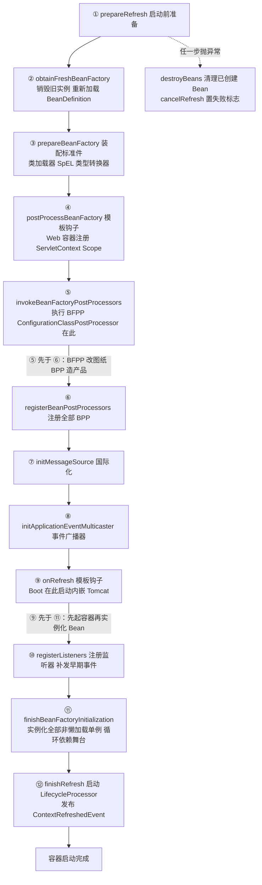
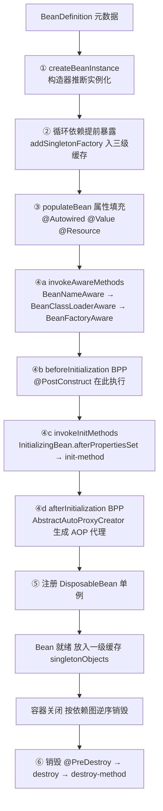
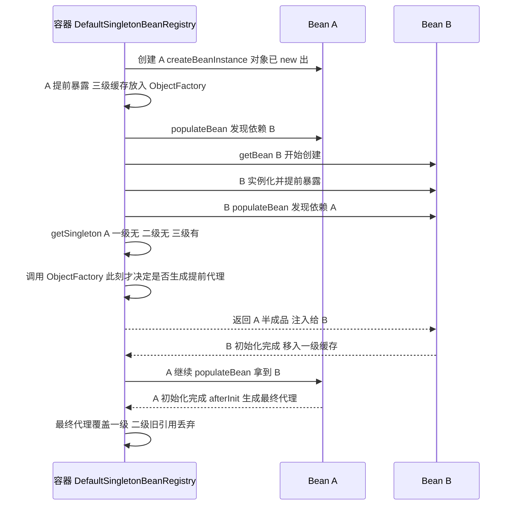
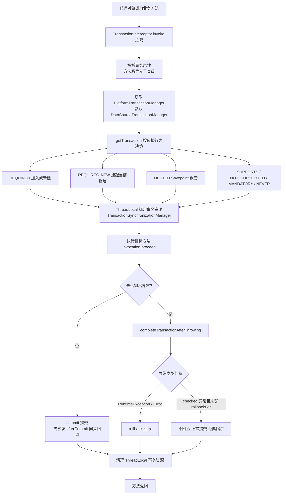

[⬅️ 上一章](12-dubbo-nginx.md) · [📖 返回目录](README.md) · [➡️ 下一章](14-spring-boot.md)
# 13 · Spring Core 源码深度（IoC/AOP/事务）

> 适用对象：10+ 年经验的资深工程师 / 架构师候选人。本章不讲 API 用法，只回答三个问题：IoC 容器是怎么把 Bean 造出来、织进去、再销毁的；AOP 代理是什么时候、由谁、按什么规则创建的；@Transactional 为什么有时"失效"。面试落点永远是「源码路径 + 设计权衡 + 失效场景」。
> 🧭 初学者前置：先读 [00 章 §2.3](00-prerequisite.md)（注解与反射是什么）与 §2.6（Maven），否则 Bean/IoC/AOP 这些词没有着落。

> 💡 **为什么会有 Spring？（30 秒历史课）**2000 年前后 Java 企业开发的主流是 EJB：写一个业务类要实现一堆框架接口、继承指定父类、部署到重量级容器才能测试——「我的代码」和「框架的代码」搅在一起，单元测试要起整个容器。Spring 的答案就两条：① **IoC**——对象不由你自己 `new`、由容器统一制造和装配，你的类保持纯 POJO（不依赖任何框架接口）；② **AOP**——事务、日志这类横切逻辑用动态代理在运行时「织」进你的类，业务代码一行不沾。理解了这两条动机，后面所有源码设计都顺理成章：容器怎么造对象（§1-2）、代理怎么生成（§4）、事务为什么依赖代理才生效（§5）。

**📌 本章速览：核心要点**

1. IoC 骨架：`DefaultListableBeanFactory` 是核心实现，`ApplicationContext` 是「工厂 + 资源加载 + 事件广播 + 环境抽象」的复合体，所有能力在 `refresh()` 的 12 步中按固定顺序装配；
2. Bean 生命周期是一条固定流水线：构造 → 属性填充 → Aware 回调 → beforeInit(BPP) → @PostConstruct → afterPropertiesSet → init-method → afterInit(BPP，**AOP 代理在此生成**) → 就绪 → 容器关闭时逆序销毁；
3. 三级缓存的本质是「把『是否生成代理』的决策推迟到真正被引用时」（三级缓存 = 三层 Map：成品、半成品、代理工厂，见 §3），所以它只救得了 setter/字段注入，救不了构造器注入，也救不了 @Async 这类在 populate 之后才生成代理的场景；
4. Spring AOP 是「代理 + 拦截器链」，只支持方法级拦截；Spring Boot 2.x 起默认 CGLIB；自调用失效是代理模式的天然代价，解法是注入自身代理 / exposeProxy / 拆类；
5. @Transactional 本质就是 AOP 的一个 Advisor，7 种传播行为 + 默认只回滚 RuntimeException 是两大考点，「事务失效八大场景」的本质全是「没走代理」或「异常没冒泡到拦截器」。

---


### 📑 本章目录

- [1. IoC 容器体系](#1-ioc-容器体系)
- [2. Bean 生命周期全流程](#2-bean-生命周期全流程)
- [3. 循环依赖与三级缓存](#3-循环依赖与三级缓存)
- [4. AOP 原理](#4-aop-原理)
- [5. 事务原理](#5-事务原理)
- [6. 事件机制与设计模式在 Spring 中的应用](#6-事件机制与设计模式在-spring-中的应用)
- [考点速查表](#考点速查表)

## 1. IoC 容器体系


### 1.1 BeanFactory → ApplicationContext 的层级关系

```text
BeanFactory（根接口：getBean / containsBean / isSingleton / getType / getAliases）
├── HierarchicalBeanFactory（父子容器：getParentBeanFactory / containsLocalBean）
├── ListableBeanFactory（批量枚举：getBeanDefinitionNames / getBeansOfType）
├── AutowireCapableBeanFactory（程序化装配：createBean / autowireBean / applyBeanPostProcessors）
└── ConfigurableBeanFactory（配置化：scope / 类加载器 / 类型转换 / 单例注册表）
    └── ConfigurableListableBeanFactory（getBeanDefinition / preInstantiateSingletons / freezeConfiguration）
        └── DefaultListableBeanFactory  ← 唯一核心实现（IoC 容器本体）

ApplicationContext 接口 = ListableBeanFactory + HierarchicalBeanFactory
                     + EnvironmentCapable + ApplicationEventPublisher
                     + ResourcePatternResolver + MessageSource
    └── AbstractApplicationContext（模板：唯一实现 refresh() 骨架）
        ├── AnnotationConfigApplicationContext（注解驱动，通用）
        ├── ClassPathXmlApplicationContext（XML 驱动，老项目）
        ├── AnnotationConfigServletWebServerApplicationContext（Boot 内嵌容器）
        └── GenericApplicationContext（可编程注册 BeanDefinition，Boot 的基底）
```

面试要能一句话讲清：**BeanFactory 是"容器"，ApplicationContext 是"容器 + 一堆企业能力"**，而 ApplicationContext 内部持有的就是一个 `DefaultListableBeanFactory`（`obtainFreshBeanFactory()` 返回它）——所有 getBean 最终都落到它身上。`ApplicationContext` 本身不直接管理 Bean，是**委派**给内部 BeanFactory 的（组合 + 委派模式）。

### 1.2 BeanDefinition 与注册

- 容器管理的不是"对象"而是**BeanDefinition（元数据）**：scope、lazyInit、dependsOn、autowireMode、initMethodName、destroyMethodName、primary、role、构造器参数、属性值。Bean 实例是 BeanDefinition 的"产物"；
- 三条注册路径：
  - `AnnotatedBeanDefinitionReader`：注册注解配置类自身（@Configuration 类也是 BeanDefinition）；
  - `ClassPathBeanDefinitionScanner`：扫描包路径，把 @Component 及其派生注解（@Service/@Repository/@Controller）转成 BeanDefinition（`ScannedGenericBeanDefinition`）；
  - `XmlBeanDefinitionReader`：解析 XML `<bean>`；
  - 编程式：`GenericApplicationContext.registerBean(Class, ...)`（Boot 3.x 常见）；
- **`ConfigurationClassPostProcessor`**（一个 `BeanDefinitionRegistryPostProcessor`）是注解驱动的总开关：在 `invokeBeanFactoryPostProcessors` 阶段扫描解析 @Configuration 类里的 @Bean 方法、@Import、@ComponentScan、@PropertySource，把生成的 BeanDefinition 注册回容器。**没有它，@Bean/@Import 全部不生效**——这是"为什么容器启动阶段最先执行 BeanFactoryPostProcessor"的原因。

### 1.3 refresh() 全流程（逐步骤）

`AbstractApplicationContext.refresh()` 是 Spring 的"开机自检 + 装配"模板，12 步，顺序有强依赖：

```text
① prepareRefresh()                   启动前准备：设置启动时间、active 标志、初始化属性源、earlyApplicationEvents 占位
② obtainFreshBeanFactory()           刷新内部 BeanFactory：销毁旧实例、重新 loadBeanDefinitions（模板方法，子类实现）
③ prepareBeanFactory()               给工厂装"标准件"：类加载器、SpEL 解析器、类型转换器；
                                      注册 ApplicationContextAwareProcessor、忽略 Aware 接口的自动装配、注册默认环境 Bean
④ postProcessBeanFactory()           模板方法钩子：Web 容器在这里注册 ServletContext 相关 Scope
⑤ invokeBeanFactoryPostProcessors()  执行 BeanDefinitionRegistryPostProcessor（ConfigurationClassPostProcessor 在此）
                                      → BeanFactoryPostProcessor（按 PriorityOrdered → Ordered → 无序）
⑥ registerBeanPostProcessors()       注册所有 BeanPostProcessor（AOP/Autowired/事件监听等基础设施的挂载点）
⑦ initMessageSource()                国际化 MessageSource（没有则注册 DelegatingMessageSource）
⑧ initApplicationEventMulticaster()  事件广播器（默认 SimpleApplicationEventMulticaster）
⑨ onRefresh()                        模板方法：Boot 内嵌 Tomcat 在这里创建并启动（createWebServer）
⑩ registerListeners()                把 ApplicationListener Bean 注册进广播器，补发 earlyApplicationEvents
⑪ finishBeanFactoryInitialization()  注册类型转换器 → 冻结配置 → preInstantiateSingletons() 实例化全部非懒加载单例
                                      （所有 Bean 都在这一步"呱呱落地"，也是循环依赖发生的舞台）
⑫ finishRefresh()                    启动 LifecycleProcessor、发布 ContextRefreshedEvent
任何一步抛异常 → destroyBeans() 清理已创建的 Bean + cancelRefresh() 置失败标志
```

> 图示：AbstractApplicationContext.refresh 12 步容器启动流程



面试要点：⑨ 与 ⑪ 的顺序是 Boot 内嵌容器能工作的前提——**先起容器再实例化 Bean**，所以 DispatcherServlet 的 onRefresh 里才能拿到 ServletContext；⑤ 必须在 ⑥ 之前，因为 BeanPostProcessor 本身也是 Bean，且"后处理器必须晚于"普通 Bean 处理逻辑。

### 1.4 两个"后处理器"家族：别搞混

| 维度 | BeanFactoryPostProcessor | BeanPostProcessor |
|---|---|---|
| 作用对象 | BeanDefinition（元数据） | Bean 实例 |
| 执行时机 | refresh 第 ⑤ 步（实例化之前） | 每个 Bean 实例化过程中（before/afterInitialization） |
| 典型实现 | ConfigurationClassPostProcessor、PropertySourcesPlaceholderConfigurer | AutowiredAnnotationBeanPostProcessor、AbstractAutoProxyCreator |
| 能干什么 | 改 scope/属性值/注册新定义（@Bean 解析、占位符替换） | 属性注入（@Autowired）、生成代理（AOP）、执行 @PostConstruct |

- 记忆锚点：**F**actoryPostProcessor 处理 **Definition**（工厂的"图纸"），BeanPostProcessor 处理 **Instance**（造出来的"产品"）——先改图纸（⑤），再造产品（⑥ 注册 BPP，⑪ 实例化时逐个生效）；
- `PropertySourcesPlaceholderConfigurer` 是 BFPP：把 `${xxx}` 占位符替换成真实属性值——所以它必须在 Bean 实例化之前执行，否则 @Value 注入的是字面量 `${xxx}`，这是"占位符没解析"类问题的根因。

### 本节高频面试题

**Q1：请把 refresh() 的流程背一遍，并说明哪几步是扩展点、哪几步顺序不能换？**

解答：按 12 步背（见上）。关键顺序约束：⑤ BeanFactoryPostProcessor 必须先于 ⑥ BeanPostProcessor 注册——前者改 BeanDefinition（如 @Bean 解析、占位符替换），后者作用于 Bean 实例化过程，若顺序颠倒，被 ⑥ 修改的 BeanDefinition 就错过了实例化；⑨ onRefresh 先于 ⑪ 实例化单例，保证 Web 环境下 Bean 能感知 ServletContext；⑪ 是全部单例实例化的唯一入口，`@Lazy`、`@DependsOn` 都在这里体现。扩展点：④⑥⑨ 是模板方法，⑤⑥ 注册的处理器是用户扩展主入口（自定义 BeanFactoryPostProcessor/BeanPostProcessor/ApplicationContextInitializer）。

面试官追问：`@Configuration` 类里的 @Bean 方法是在哪一步被处理的？——答：⑤ 里的 `ConfigurationClassPostProcessor`（BeanDefinitionRegistryPostProcessor 的一种）：先解析 @Configuration 类（CGLIB 增强的 full 模式），收集 @Bean/@Import/@ComponentScan 生成新 BeanDefinition 注册回去；注意它把"解析配置"和"注册定义"都做完了，所以之后 ⑪ 实例化时直接按定义造对象，不再回看注解。

**Q2：BeanFactory 和 FactoryBean 是什么关系？为什么要有 FactoryBean？**

解答：无继承关系。BeanFactory 是容器；FactoryBean 是"造 Bean 的工厂 Bean"——容器里注册的是 FactoryBean 本身，getBean 时若名字不带 `&` 前缀，返回的是 `factoryBean.getObject()` 的产物；带 `&` 前缀才返回 FactoryBean 本身。用途：需要复杂初始化逻辑的 Bean（如 SqlSessionFactoryBean、MyBatis Mapper 扫描、RMI/HTTP 远程代理）、需要容器延迟创建的对象。`getBean("&xxx")` 是冷门考点，能答出就说明真读过源码。

面试官追问：FactoryBean 产生的对象参与 Bean 生命周期吗？——答：`getObject()` 产物**不经过**完整生命周期（不执行 Aware/初始化回调，单例产物会被缓存），它只是工厂方法的返回值；但 FactoryBean 自身是普通 Bean，走完整生命周期。

---

## 2. Bean 生命周期全流程

### 2.1 从构造到销毁的完整流水线

`AbstractAutowireCapableBeanFactory.doCreateBean()` 是核心方法，顺序如下：

```text
① createBeanInstance()          构造器实例化（构造器推断：无参 → @Autowired 构造器 → 唯一有参构造器）
② 循环依赖提前暴露               addSingletonFactory（仅单例 + 允许循环引用时，见第 3 节）
③ populateBean()                属性填充：InstantiationAwareBeanPostProcessor.postProcessProperties
                                （AutowiredAnnotationBeanPostProcessor 处理 @Autowired/@Value；
                                  CommonAnnotationBeanPostProcessor 处理 @Resource/@PostConstruct 元数据）
                                → applyPropertyValues()（XML/编程式属性赋值）
④ initializeBean():
   a. invokeAwareMethods()       BeanNameAware → BeanClassLoaderAware → BeanFactoryAware
   b. applyBeanPostProcessorsBeforeInitialization()
                                ApplicationContextAwareProcessor（ApplicationContextAware/EnvironmentAware 等）
                                InitDestroyAnnotationBeanPostProcessor（执行 @PostConstruct）
   c. invokeInitMethods()        InitializingBean.afterPropertiesSet() → init-method（XML @Bean(initMethod)）
   d. applyBeanPostProcessorsAfterInitialization()
                                AbstractAutoProxyCreator.wrapIfNecessary() ← AOP 代理在这里生成！
⑤ 注册 DisposableBean（单例）   容器关闭时按依赖逆序销毁
⑥ 销毁：@PreDestroy → DisposableBean.destroy() → destroy-method
```

> 图示：Bean 完整生命周期流水线



### 2.2 三种初始化/销毁回调的对比

| 维度 | @PostConstruct / @PreDestroy | InitializingBean / DisposableBean | init-method / destroy-method |
|---|---|---|---|
| 执行机制 | 由 BPP（InitDestroyAnnotationBeanPostProcessor）调用 | 容器直接调用接口方法 | 容器反射调用 |
| 执行顺序 | **最早**（beforeInit 阶段） | 中间（afterPropertiesSet 在 init-method 前） | **最晚** |
| 侵入性 | 低（JDK 注解，javax/jakarta.annotation） | 高（实现 Spring 接口） | 低（XML/注解指定方法名） |
| 使用建议 | 现代首选 | 框架内部使用 | 兼容老代码 / 第三方类 |

细节考点：`@PostConstruct` 之所以"最早"，是因为它在 beforeInitialization 阶段执行，而 InitializingBean/init-method 是容器在 invokeInitMethods 里直接调用的；**AOP 代理生成发生在最后（afterInitialization）**，所以代理对象包裹的是"已初始化完成"的目标——这也是 @Async/@Transactional 能工作的前提。prototype 作用域的 Bean 容器**不负责销毁**（只有 DestructionAwareBeanPostProcessor 会执行），销毁回调仅对单例生效。

### 2.3 doCreateBean 关键源码路径（伪代码，非原文）

```java
protected Object doCreateBean(String beanName, RootBeanDefinition mbd, Object[] args) {
    // ① 实例化：构造器推断（无参 / @Autowired 构造器 / 唯一有参构造器）
    BeanWrapper instanceWrapper = createBeanInstance(beanName, mbd, args);
    // ② 提前暴露（仅单例 + allowCircularReferences）：
    //    addSingletonFactory(beanName, () -> getEarlyBeanReference(beanName, mbd, bean));
    // ③ 属性填充：@Autowired/@Value 由 AutowiredAnnotationBeanPostProcessor 在此处理
    populateBean(beanName, mbd, instanceWrapper);
    // ④ 初始化：Aware → beforeInit(BPP) → afterPropertiesSet/init-method → afterInit(BPP，AOP 代理)
    exposedObject = initializeBean(beanName, exposedObject, mbd);
    // ⑤ 循环依赖校验：若 earlySingletonReference != exposedObject（被 BPP 换过实例）
    //    且早期引用已被其他 Bean 注入 → 抛 BeanCurrentlyInCreationException（@Async 循环依赖场景）
    return exposedObject;
}
```

要点：① 实例化只负责"new 出来"，属性全空；② 提前暴露发生在 populate **之前**——所以被提前暴露的对象属性是空的，被引用方只能调用它的方法，不能在构造器/字段里读它的注入属性（典型坑：循环依赖 Bean 互相读属性拿到 null）；③ AOP 代理在 ④ 的最后一步生成，所以代理对象内部已经是"初始化完成"的目标。

### 本节高频面试题

**Q3：Bean 从创建到销毁的完整生命周期，每个阶段对应哪个方法？**

解答：按 2.1 的六步背，重点标注三处：① 构造器推断规则（多个构造器且无 @Autowired 时报错）；③ 属性填充用的是 BPP 而非反射直接 set——所以 @Autowired 字段可以是 private；④d 是 AOP 代理生成点，**代理对象才是最终放进 singletonObjects 的成品**；⑥ 销毁顺序与创建相反，且**依赖方先销毁**（容器按依赖图逆序）。加分项：提到 `getEarlyBeanReference`（循环依赖场景的提前代理）和 `@Lazy`（延迟注入代理而非真实对象）。

面试官追问：如果 Bean 实现了 InitializingBean 又配置了 init-method，还写了 @PostConstruct，执行顺序？——答：@PostConstruct → afterPropertiesSet → init-method。同理销毁：@PreDestroy → destroy() → destroy-method。三种机制是"注解最先、接口次之、XML 最晚"，原因就是 2.2 表的执行机制差异。

**Q4：prototype 的 Bean 生命周期和单例有什么不同？**

解答：创建阶段完全一样（构造→填充→初始化→afterInit 代理）；差异在销毁：prototype 实例化后容器**不持有、不负责销毁**，只把 `DestructionAwareBeanPostProcessor`（含 @PreDestroy 处理器）执行一遍，用户自己管理释放。所以 prototype + 数据库连接池/线程池这类资源要格外小心——容器不会帮你 close。另外 prototype 每次 getBean 都新建，**不参与循环依赖缓存**（没有提前暴露逻辑）。

面试官追问：单例 Bean 里注入 prototype Bean，每次拿到的都是同一个吗？——答：是同一个（注入发生在单例创建时，只注入一次）。要每次拿到新实例：用 `ObjectProvider<T>` / `@Lookup` 方法注入 / `Scope("prototype")` + 代理（`proxyMode = ScopedProxyMode.TARGET_CLASS`）。@Lookup 是 CGLIB 子类化实现的（容器生成子类重写 @Lookup 方法返回新实例），这也是"为什么 @Lookup 不能用在 final 类"的原因。

---

## 3. 循环依赖与三级缓存

### 3.1 三级缓存结构与 getSingleton 流程

```text
DefaultSingletonBeanRegistry 三张 Map：
一级 singletonObjects        成品 Bean（含代理后的最终对象）
二级 earlySingletonObjects   提前暴露的"半成品"（原始对象或提前代理）
三级 singletonFactories      ObjectFactory<T> 延迟工厂（lambda：getEarlyBeanReference）

getSingleton(name, allowEarlyReference=true)：
  一级命中 → 返回
  二级命中 → 返回
  三级命中 → factory.getObject()（此时才决定：要不要生成提前代理）→ 放入二级 → 返回
```

以 A 依赖 B、B 依赖 A 为例：

```text
A 开始创建 → createBeanInstance(A) 完成（对象已 new 出，属性为空）
A 提前暴露：singletonFactories.put(A, () -> getEarlyBeanReference(A))
A populateBean() → 发现需要 B → getBean(B)
B 开始创建 → createBeanInstance(B) → 提前暴露 B → populateBean() → 发现需要 A
  → getSingleton(A, true)：一级没有、二级没有、三级有 → 调 ObjectFactory
    → 若 A 需要切面：生成 A 的提前代理（否则返回原始 A）→ 存入二级 → 返回
  → B 的属性填充拿到 A（半成品，但方法可用）→ B 初始化完成 → 移入一级
A 继续 populateBean 拿到 B → A 初始化完成（afterInit 生成最终代理）
  → 若提前暴露的是原始 A 而最终是代理 A：以最终代理覆盖一级，二级里的旧引用丢弃（B 持有的仍是原始 A，可接受）
```

> 图示：A 依赖 B、B 依赖 A 的三级缓存解决过程



### 3.2 为什么是三级缓存而不是二级

这是本系列最高频的原理题。二级缓存方案下，A 提前暴露时就必须**立刻决定**放原始对象还是代理对象：

- 若提前放原始对象：A 被 B 注入的是原始对象，但 A 初始化完成后 afterInitialization 又生成代理——**容器里最终是代理，B 拿到的却是原始对象**，A 的切面（事务/异步）在 B 的调用链上全部失效，且出现两个 A 实例；
- 若提前放代理：无法预知 A 是否需要代理（要不要织入切面要在拿到全部 Advisor 匹配后才知道），只能对**所有可能被循环引用的 Bean 一律提前代理**——绝大多数 Bean 根本不需要代理，白生成 + 破坏语义；
- 三级缓存的 ObjectFactory 把「是否代理」的决策**延迟到真正被引用那一刻**：被循环引用了才调 getEarlyBeanReference 生成（可能代理），没被引用就等 afterInitialization 统一处理。**三级缓存 = 用一层延迟，换取「代理只在必要时提前生成」**。

### 3.3 哪些循环依赖救不了

| 场景 | 为什么救不了 | 报错/现象 |
|---|---|---|
| 构造器注入循环 | 构造器执行前**对象还不存在**，没有可提前暴露的东西 | `BeanCurrentlyInCreationException`（提示"Requested bean is currently in creation"） |
| @Async 循环依赖 | 代理由 AsyncAnnotationBeanPostProcessor 在 afterInit 生成，与提前暴露的原始对象不一致 | 启动报错：`...injected into other beans...in its raw version...but has eventually been wrapped` |
| prototype 循环 | 不进单例缓存 | 递归创建直到栈溢出 |
| Spring Boot 2.6+ | 默认 `spring.main.allow-circular-references=false` | 直接启动失败（官方态度：循环依赖是坏味道，要求重构） |

@Async 报错原理值得展开：提前暴露阶段没有 Async 代理，A 被 B 注入的是原始 A；A 走完生命周期后 afterInit 生成 Async 代理——容器发现 `earlySingletonReference != bean`（被包装过），且早期引用已被其他 Bean 持有，直接抛异常。**本质：三级缓存只兼容"提前暴露的代理 == 最终代理"的场景（AOP 的提前代理和最终代理是同一个），不兼容"最终才生成代理"的场景（@Async）。**

### 本节高频面试题

**Q5：三级缓存各存什么？循环依赖 A→B→A 走一遍完整过程。**

解答：按 3.1 的图讲。要点：① 提前暴露发生在 createBeanInstance **之后、populateBean 之前**（addSingletonFactory，仅当 isSingletonCurrentlyInCreation && allowCircularReferences）；② 三级缓存里是 ObjectFactory 不是对象，调用时机 = 别的 Bean 真正引用的时刻；③ 提前代理由 SmartInstantiationAwareBeanPostProcessor.getEarlyBeanReference 决定（AbstractAutoProxyCreator 会提前创建代理）；④ 最终成品进一级，二级里的早期引用被覆盖丢弃。**面试话术：一级放成品，二级放"被提前借走的半成品"，三级放"半成品的延迟工厂"。**

面试官追问：三级缓存里的 ObjectFactory 什么时候被调用？不调用会怎样？——答：仅在「A 创建期间，有别的 Bean 查找 A」时被调用一次，结果移入二级（之后三级条目删除）。若整个创建过程无人引用 A，ObjectFactory 永远不会执行——A 就按普通流程 afterInit 生成代理，无任何额外开销。这正是三级比二级省的原因。

**Q6：为什么不用二级缓存？二级缓存到底哪里不够？**

解答：见 3.2。核心一句话：**二级缓存必须在「提前暴露时」就决定放原始对象还是代理对象，而 Spring 无法在那一刻知道这个 Bean 需不需要代理（Advisor 匹配要等全部 BeanDefinition 就绪），三级缓存把决策推迟到「被引用时」**。再补一层：提前放原始对象会导致"B 拿到的 A 和容器最终的 A 不是同一个（一个裸一个代理）"，切面失效；提前全代理则浪费且语义错误。

**Q7：构造器循环依赖为什么解决不了？项目里真遇到了怎么办？**

解答：构造器注入时对象还没 new 出来，提前暴露机制无从谈起——三级缓存里没有东西可放。解法按优先级：① 重构：把循环依赖的 Bean 拆开/用 @Lazy 注入（@Lazy 会注入代理，打破创建时序，代价是该依赖延迟到首次调用才真正初始化）；② 改成 setter/字段注入（能绕过但不是根治，Boot 2.6+ 默认直接禁）；③ 用 ObjectProvider 延迟获取。面试加分：主动说「循环依赖本身是设计问题，说明职责边界划错了，治理手段是重构而不是开开关」。

---

## 4. AOP 原理

### 4.1 动态代理：JDK vs CGLIB

| 维度 | JDK 动态代理 | CGLIB |
|---|---|---|
| 原理 | 实现目标接口，`Proxy.newProxyInstance` 生成代理类 | 生成目标类的子类，覆写方法 |
| 前提 | 目标类**必须实现接口** | 目标类不能 final、方法不能 final |
| 调用方式 | InvocationHandler.invoke（Method.invoke） | FastClass 机制 + MethodInterceptor |
| 性能 | JDK 8+ 反射优化后与 CGLIB 基本持平 | 首次生成类开销略高 |
| 语义 | 只能代理接口中声明的方法 | 可代理所有非 final public/protected 方法 |
| Spring 选择 | 默认：目标有接口 → JDK | 无接口 → CGLIB；`proxyTargetClass=true` 强制 |

关键事实：**Spring Boot 2.x 起默认 `spring.aop.proxy-target-class=true`**，所以 Boot 项目里即使有接口也用 CGLIB；传统 Spring（@EnableAspectJAutoProxy 默认）有接口时用 JDK 代理。CGLIB 不能代理 final 类/final 方法；Spring AOP 只支持**方法级拦截**（基于代理），不支持字段/构造器切入点——那是 AspectJ 织入的能力（@Aspect 注解来自 AspectJ 但执行是 Spring 自己的）。

### 4.2 代理创建时机与切面执行顺序

```text
AbstractAutoProxyCreator（SmartInstantiationAwareBeanPostProcessor）
  postProcessAfterInitialization → wrapIfNecessary(bean, name, cacheKey)
    → 找所有 Advisor（@Aspect 解析出的 + 实现 Advisor 接口的 Bean）
    → 逐个匹配切入点（Pointcut 匹配方法/类/注解）
    → 命中 → ProxyFactory 创建 JDK/CGLIB 代理（含 TransactionInterceptor、@Aspect 通知等全部拦截器）
```

- **代理创建时机 = Bean 生命周期 afterInit 阶段**（第 2 节 ④d），所以 Bean 的构造器、@PostConstruct 里拿到的都是"自己"，切面逻辑在代理层；
- 多切面执行顺序：按 `@Order` / `Ordered` / `@Aspect` 上的 `@Order` 排序（值小的先）；
  - @Around / @Before：order 升序执行（小→大）；
  - @After / @AfterReturning / @AfterThrowing：order 降序执行（大→小）——后置通知逆序，保证"洋葱"对称；
- 同一切面内通知顺序（官方文档）：@Around 前段 → @Before → 目标方法 → @Around 后段 → @AfterReturning/@AfterThrowing → @After。

### 4.3 自调用失效与解决方案

`this.method()` 是直接调用目标对象方法，**不经过代理**，切面全部失效。四种解法：

| 方案 | 做法 | 坑 |
|---|---|---|
| 注入自身 | `@Autowired private AService self;` 用 self 调用 | 自注入在极老版本有循环问题；与 @Async 同用注意代理类型 |
| AopContext | `((A) AopContext.currentProxy()).method()`，需 `@EnableAspectJAutoProxy(exposeProxy = true)` | 侵入代码；exposeProxy 有额外开销；要求调用在代理线程内 |
| 拆类 | 把被调方法挪到另一个 Bean（如 XxxSupport） | 最干净的架构解法，推荐 |
| 编程式事务 | 自调用场景改用 `TransactionTemplate` | 放弃声明式，代码侵入 |

### 本节高频面试题

**Q8：Spring AOP 的代理是什么时候、由谁创建的？JDK 和 CGLIB 怎么选？**

解答：创建时机 = 单例 Bean 初始化流程的 afterInitialization 阶段，由 AbstractAutoProxyCreator（BeanPostProcessor）的 wrapIfNecessary 完成：收集所有 Advisor → 切入点匹配 → ProxyFactory 造代理。选择规则：有接口默认 JDK（传统 Spring），无接口 CGLIB；Boot 2.x 默认 proxyTargetClass=true 全 CGLIB。**追问价值点**：JDK 代理只能拦截接口方法——把方法加在实现类上而接口没声明，JDK 代理拦不到；CGLIB 拦得到（子类覆写），但 final 方法拦不到。

面试官追问：为什么 Spring Boot 默认用 CGLIB？——答：① 统一行为，避免"有接口没接口两种语义"的心智负担；② 老版本 JDK 代理反射调用慢；③ 很多库的方法不在接口里（如 @Configuration 类、@Mapper 等）。代价：CGLIB 需要额外生成子类字节码，且对 final 类/方法无能为力（如 final 的 @Configuration 类会启动报错）。

**Q9：多个切面的执行顺序怎么控制？同一切面内五种通知的执行顺序？**

解答：切面间用 @Order（值越小越先执行）；执行规则：@Around/@Before 按 order 升序（先声明的先执行），@After/@AfterReturning/@AfterThrowing 按 order 降序（后置逆序，形成对称洋葱）。同一切面内：@Around 前半 → @Before → 目标方法 → @Around 后半 → @AfterReturning（正常）或 @AfterThrowing（异常）→ @After（finally）。工程经验：事务切面默认 order 极低（几乎最外层），业务切面若要在事务内执行需显式调 order。

面试官追问：@AfterThrowing 和 @After 同时存在，异常时都执行吗？——答：都执行，@AfterThrowing 先、@After 最后（类似 finally）。注意 @AfterThrowing 里不能再抛异常，否则覆盖原始异常；@Around 里 catch 后不 rethrow，@AfterThrowing 不会触发（异常被吞），事务同样感知不到——这是"try/catch 吞异常导致事务失效"的 AOP 侧解释。

**Q17：@Configuration 类为什么默认要 CGLIB 增强？proxyBeanMethods=false 是什么？**

解答：@Configuration 默认 full 模式（proxyBeanMethods=true）：类被 CGLIB 增强成子类，@Bean 方法被拦截——**同一个 @Bean 方法多次调用返回容器里的同一个单例**，@Bean 方法内部直接调用其他 @Bean 方法也不会 new 出新对象（方法内调用走容器查找）。lite 模式（proxyBeanMethods=false，如 @Component 类里定义 @Bean）：不增强，方法调用就是普通方法，适合 @Bean 方法互不引用的场景，省 CGLIB 生成开销。坑：full 模式下 @Bean 方法被拦截器包裹，this 内部调用也走容器；static @Bean 方法不受影响。面试话术：**full/lite 是"单例语义"与"启动开销"的权衡，Boot 3.x AOT 场景 lite 更友好**。

**Q10：自调用导致切面失效，有哪些解法？各自的坑？**

解答：见 4.3 表。面试升华：**自调用失效的本质是"代理模式的对象身份分裂"**——容器里只有一个代理，但类内部 this 指向被包裹的目标。最推荐拆类（把可切面的方法放进独立 Bean）；注入自身注意与构造器循环依赖冲突（用字段注入或 @Lazy）；AopContext.currentProxy 要 exposeProxy=true 且必须处于代理调用栈内（子线程里拿不到）。

---

## 5. 事务原理

### 5.1 @Transactional 执行流程（源码级）

@Transactional 不是魔法，是 **BeanFactoryTransactionAttributeSourceAdvisor（Advisor）+ TransactionInterceptor（MethodInterceptor）** 组成的 AOP 切面：

```text
代理对象.method() 被调用
  → TransactionInterceptor.invoke()
    → 解析事务属性（方法级注解优先于类级；@Transactional 支持接口/类/方法三级查找）
    → 获取 PlatformTransactionManager（默认 DataSourceTransactionManager）
    → getTransaction()：
        按传播行为决定：加入现有事务 / 新建 / 挂起当前（TransactionSynchronizationManager 维护
        ThreadLocal 上的事务资源：connectionHolder、synchronizations、当前事务状态）
    → 执行目标方法（invocation.proceed()）
    → 正常返回 → commit()（先触发 afterCommit 同步回调，再提交）
    → 抛出异常 → completeTransactionAfterThrowing()：
        回滚判定：异常 ∈ RuntimeException/Error → rollback
                  异常为 checked 且未配置 rollbackFor → 不回滚，正常提交（经典陷阱！）
    → 清理：移除 ThreadLocal 事务资源（否则连接泄漏）
```

> 图示：@Transactional 声明式事务执行流程



### 5.2 事务传播行为 7 种

| 传播行为 | 行为 | 典型场景 |
|---|---|---|
| REQUIRED（默认） | 有事务加入，无则新建 | 绝大多数业务方法 |
| SUPPORTS | 有则加入，无则非事务执行 | 查询方法（可有可无） |
| MANDATORY | 必须有事务，否则抛 IllegalTransactionStateException | 内部校验方法，强制调用方开事务 |
| REQUIRES_NEW | **挂起当前事务**，新建独立事务；内外互不影响（各自提交回滚） | 审计日志、发消息，失败不能拖垮主事务 |
| NOT_SUPPORTED | 挂起当前事务，非事务执行 | 大查询，避免长事务占连接 |
| NEVER | 有事务直接抛异常 | 只读外部接口的强制约束 |
| NESTED | Savepoint 嵌套：内层回滚只回滚到保存点，外层可继续；外层回滚则全部回滚 | 批量导入子步骤失败不回滚整批 |

高频对比题：**REQUIRES_NEW vs NESTED**——REQUIRES_NEW 是"新事务"，内层提交后外层无法回滚它（两笔账）；NESTED 是"同一个事务里的保存点"，内层回滚不影响外层已完成的写，但外层回滚会连内层一起回滚（一笔账）。NESTED 依赖 JDBC Savepoint，要求数据源支持。

### 5.3 事务失效八大场景

| # | 场景 | 根因 |
|---|---|---|
| 1 | 方法非 public（private/protected/包私有） | Spring AOP 代理无法拦截（JDK 接口方法/CGLIB 子类覆写都限 public） |
| 2 | 同类自调用 this.method() | 没走代理 |
| 3 | 方法内 catch 吞掉异常 | 异常没冒泡到 TransactionInterceptor，事务"以为"成功 |
| 4 | 抛出 checked 异常且未配 rollbackFor | 默认只回滚 RuntimeException/Error |
| 5 | 类没被 Spring 管理（new 出来的、没扫描到） | 根本没有代理 |
| 6 | 表引擎不支持事务（MyISAM）/ 连接 autocommit 异常 | 底层就不支持 |
| 7 | 多线程调用：子线程里执行 DB 操作 | 事务上下文在 ThreadLocal，子线程拿不到 |
| 8 | 传播行为配置成 NOT_SUPPORTED/NEVER；或事务管理器配错数据源（多数据源场景） | 事务根本没开 / 开在别的库上 |

补充冷门：`@Transactional` 标注在**接口方法**上时，Spring 的 `AbstractFallbackTransactionAttributeSource` 查找顺序是「目标类方法 → 目标类 → 接口方法」——**JDK 代理**（基于接口）读接口注解；**CGLIB 代理**（基于类）同样会回退到所实现接口的注解，因此两种代理下接口上的 `@Transactional` 一般都能生效（前提是方法未被 `final` 修饰、且类可被代理）。真正的失效场景是：① `final` 类/方法 + CGLIB 直接无法生成子类（启动报错，非静默失效）；② 用 JDK 代理但接口没标注解、实现类也没标 → 完全不生效。结论：**为可读性，注解一律写在实现类方法上**，避免依赖接口继承查找这条隐式路径。

### 5.4 事务与 AOP 的关系

- @Transactional 的底层就是 AOP：**一个 Advisor + 一个 MethodInterceptor**，和业务切面在同一个拦截器链里执行，顺序由 order 决定（事务默认极低优先级≈最外层，可用 `@EnableTransactionManagement(order=...)` 调整）；
- 所以 AOP 的所有失效场景（自调用、非 public、final 类）对事务**完全同样适用**——「事务失效」本质上就是「AOP 失效」的特例；
- 编程式事务（TransactionTemplate）绕过代理直接操作 TransactionManager，是自调用/复杂流程场景的兜底方案。

### 本节高频面试题

**Q11：@Transactional 从方法进入到提交回滚，源码层面发生了什么？**

解答：按 5.1 链路讲：代理拦截 → TransactionInterceptor.invoke → 解析注解属性 → getTransaction（传播行为 + ThreadLocal 事务资源管理）→ proceed → commit/rollback（回滚判定规则）→ 清理资源。加分点：① TransactionSynchronizationManager 是 ThreadLocal 上的事务上下文容器（connection、synchronizations、isActualTransactionActive）；② 提交前先执行 afterCommit 同步器——这正是 @TransactionalEventListener 的实现基础；③ 事务管理器拿到的是"绑定的连接"，不是每次新拿——所以一个事务内多次 DAO 调用共用一个 Connection。

面试官追问：为什么说"事务和连接是绑定的，不是每次操作拿新连接"？——答：DataSourceUtils.getConnection 会先查 TransactionSynchronizationManager 里是否已有绑定的 ConnectionHolder，有就直接复用，没有才从连接池取并绑定。这是事务内多条 SQL 共享同一连接、同一隔离级别、能整体提交回滚的根本原因。

**Q12：REQUIRES_NEW 和 NESTED 有什么区别？各自用在什么场景？**

解答：见 5.2 表。一句话：REQUIRES_NEW 是"分账"（内层独立提交回滚，外层回滚不了内层已提交的部分），NESTED 是"同一账本打标记"（保存点，内层可局部回滚，外层回滚连内层一起）。典型场景：REQUIRES_NEW 用于审计/消息发送（主事务失败也不影响）；NESTED 用于批量导入（一条失败回滚到该条保存点，其余继续）。NESTED 失效时会退化为 REQUIRED（Spring 行为），面试可提。

**Q13：事务失效的八大场景，说全并归类。**

解答：按 5.3 表说全。归类升华：①-⑤ 是「没走代理」家族（非 public/自调用/未托管/接口注解丢失）；③④ 是「异常没冒泡或类型不对」家族；⑥⑦⑧ 是「环境不支持」家族（引擎、线程、数据源）。面试话术：**失效排查三板斧——代理有没有？异常出没出？事务开没开？**

**Q14：为什么 Spring 默认只回滚 RuntimeException 和 Error，不滚 checked 异常？**

解答：设计决策：checked 异常在 Java 语义里是"业务可预期的分支"（如余额不足），通常需要人工处理或补偿，Spring 选择"默认提交，由开发者显式 rollbackFor=Exception.class 声明要回滚"；RuntimeException 是"不可预期/程序缺陷"，默认回滚。工程建议：业务异常统一继承 RuntimeException（或统一 rollbackFor），并在 catch 里 rethrow——**不要为了凑 rollbackFor 而把 checked 异常包成 RuntimeException 后又吞掉**。

面试官追问：catch 住异常后想回滚怎么办？——答：① `TransactionAspectSupport.currentTransactionStatus().setRollbackOnly()`（标记回滚，方法正常返回也会滚）；② 重新抛出。注意 setRollbackOnly 只标记当前事务，若传播行为是 REQUIRED 加入外层事务，会把**外层也标记回滚**——这就是"内层异常被吞但外层莫名回滚"的经典事故根因。

**Q18：多数据源下 @Transactional 为什么"失效"？怎么正确配置？**

解答：@Transactional 默认按类型找唯一的 PlatformTransactionManager——多数据源时若只有一个 DataSourceTransactionManager，它绑定的是"自己数据源"的连接，而 DAO 可能用的是另一个数据源 → **事务管不到目标库的写入**，表现为"事务失效"。正确姿势：每个数据源配自己的事务管理器（@Bean(name="xxxTxManager")），@Transactional(transactionManager="xxxTxManager") 显式指定；动态数据源（AbstractRoutingDataSource）场景，事务管理器要包在路由外层，且**事务开启后数据源不能再切换**（连接已绑定，切换了 SQL 也走旧连接）。面试升华：**事务失效排查第一问永远是"这个事务管的是哪条连接"**。

---

## 6. 事件机制与设计模式在 Spring 中的应用

### 6.1 事件机制：观察者模式的 Spring 实现

```text
publishEvent(ApplicationEvent)
  → AbstractApplicationContext 委托给 ApplicationEventMulticaster
    → SimpleApplicationEventMulticaster（默认，同步、同线程、顺序调用）
      → 匹配监听器：ApplicationListener<Event> 泛型匹配 / @EventListener 解析成的
        ApplicationListenerMethodAdapter（支持 SpEL 条件 @EventListener(condition=...)）
```

- 默认**同步**：监听器异常会向上抛，影响发布者——生产上要么监听器内 try/catch，要么配置 ErrorHandler（`setErrorHandler`）；
- 异步事件：监听方法加 @Async + @EnableAsync；注意异步后异常不会回到发布者，需要 AsyncUncaughtExceptionHandler；
- `@TransactionalEventListener`：注册为事务同步器（TransactionSynchronization），在事务提交后（默认 AFTER_COMMIT）/回滚后执行——解决"业务成功但事件消费时数据还没提交"的一致性问题；无事务时默认不执行（`fallbackExecution=true` 可开）；
- 早期事件（earlyApplicationEvents）：refresh ⑪ 之前发布的事件先暂存，registerListeners 后补发——保证监听器注册完成前的事件不丢失。

### 6.2 设计模式在 Spring 中的落点

| 模式 | Spring 落点 | 说明 |
|---|---|---|
| 工厂 | BeanFactory / FactoryBean / ProxyFactory | 容器本身就是巨型抽象工厂；FactoryBean 是工厂方法变体 |
| 模板方法 | refresh() 骨架、JdbcTemplate、RestTemplate、JmsTemplate | 算法骨架固定，子类/回调实现变化部分（onRefresh 是典型钩子） |
| 策略 | Resource 解析、AutowireCandidateResolver、事务管理器（PlatformTransactionManager 多实现）、ReactiveAdapterRegistry | 同一接口多实现，运行时选择 |
| 观察者 | ApplicationEvent/Listener、@EventListener、事务事件 | 事件驱动解耦（见 6.1） |
| 代理 | AOP 全体系 | JDK/CGLIB 动态代理 |
| 适配器 | AdvisorAdapter（MethodBeforeAdviceAdapter 等）、HandlerAdapter | 把不同通知类型适配成统一的 MethodInterceptor |
| 单例 | 默认 scope 的单例注册表（DefaultSingletonBeanRegistry） | 注意是"容器级单例"，非 JVM 级 |
| 委派 | DispatcherServlet 委派 HandlerMapping/HandlerAdapter；ApplicationContext 委派内部 BeanFactory | 组合优于继承的体现 |

### 本节高频面试题

**Q15：Spring 事件默认是同步还是异步？@TransactionalEventListener 的原理是什么？**

解答：默认同步（SimpleApplicationEventMulticaster 顺序调用，异常上抛）；异步需 @Async。@TransactionalEventListener 原理：监听器在事务开始时把自己注册为 TransactionSynchronization（存进 TransactionSynchronizationManager 的 ThreadLocal），事务提交/回滚时由事务管理器回调对应方法（afterCommit/afterRollback/afterCompletion）——所以它**必须在事务内**才生效（fallbackExecution=false 时无事务直接不执行）。典型坑：事务提交后事件处理里查库，查不到刚提交的数据——那是"提交后才执行但用了不同连接/读到旧快照"的问题（隔离级别/连接复用），面试常考。

面试官追问：为什么监听器里抛异常会导致发布者方法失败？怎么避免？——答：同步调用链上，监听器异常沿 publishEvent 抛回发布者。避免：监听器内部 try/catch；或 multicast.setErrorHandler；或事件方法加 @Async。事件风暴（一个事件触发一串事件）也要靠异步 + 消息队列治理。

**Q16：Spring 里模板方法模式和策略模式各举三个例子？**

解答：模板方法：① refresh()（onRefresh/refreshBeanFactory 钩子）；② JdbcTemplate（execute 骨架固定，回调传入 SQL 逻辑）；③ RestTemplate（doExecute 骨架，ResponseExtractor 变化）。策略：① 事务管理器（DataSourceTransactionManager/JtaTransactionManager 等按需选）；② 资源加载（Resource 体系：ClassPathResource/UrlResource/FileSystemResource）；③ 依赖解析（AutowireCandidateResolver 多实现）。加分：指出两者常组合出现——模板方法负责骨架，策略负责"变化点"（JdbcTemplate + StatementCallback 就是模板+策略的组合）。

面试官追问：DispatcherServlet 用了什么模式？——答：前端控制器 + 委派 + 策略：所有请求先到 DispatcherServlet（前端控制器），再委派给 HandlerMapping（找 Handler）、HandlerAdapter（适配执行）、ViewResolver（解析视图）——每个环节都是策略接口，Spring MVC 只是组装者。

---

## 考点速查表

| 考点 | 一句话要点 |
|---|---|
| 容器体系 | DefaultListableBeanFactory 是本体；ApplicationContext=工厂+事件+资源+环境，委派内部 BeanFactory |
| BeanDefinition | 容器管元数据不管对象；三大注册器 + ConfigurationClassPostProcessor 解析 @Bean/@Import |
| refresh 12 步 | ⑤后处理器先于⑥实例化后处理器；⑨起容器先于⑪实例化 Bean；异常走 destroyBeans+cancelRefresh |
| 生命周期顺序 | 构造→填充→Aware→beforeInit→@PostConstruct→afterPropertiesSet→init-method→afterInit(AOP)→销毁逆序 |
| 三种初始化回调 | @PostConstruct 最早（BPP 调）、InitializingBean 次之、init-method 最晚（容器直调） |
| prototype 销毁 | 容器不负责销毁，仅执行 DestructionAwareBeanPostProcessor |
| 三级缓存 | 一级成品/二级半成品/三级延迟工厂；ObjectFactory 把"是否代理"推迟到被引用时 |
| 为什么三级 | 二级必须提前决定代理与否：早放原对象=双实例切面失效，早放代理=无谓代理 |
| 救不了的循环 | 构造器（没对象可暴露）、@Async（代理晚生成，raw 引用冲突）、Boot2.6+ 默认禁 |
| 代理创建时机 | afterInitialization 由 AbstractAutoProxyCreator.wrapIfNecessary 创建 |
| JDK vs CGLIB | 有接口默认 JDK（传统）；Boot 默认 proxyTargetClass=true；CGLIB 不能碰 final |
| 切面顺序 | 切面间 @Order；前置升序、后置逆序；切面内 Around→Before→方法→Returning→After |
| 自调用失效 | this 不走代理；解法：注入自身/AopContext(exposeProxy)/拆类/编程式事务 |
| 事务执行链路 | TransactionInterceptor→getTransaction(传播)→proceed→commit/rollback(默认只滚 RuntimeException) |
| 传播 7 种 | REQUIRED 默认；REQUIRES_NEW 分账；NESTED 保存点；MANDATORY/NEVER 强约束 |
| 失效八场景 | 非 public/自调用/吞异常/checked 异常/未托管/引擎不支持/多线程/事务管理器配错 |
| 事务与 AOP | 事务就是一个 Advisor；AOP 失效场景对事务同样适用 |
| 事件机制 | 默认同步；@TransactionalEventListener 走事务同步器；earlyApplicationEvents 防丢 |
| 设计模式 | 工厂/模板方法/策略/观察者/代理/适配器；DispatcherServlet=前端控制器+委派+策略 |
| BFPP vs BPP | 前者改 BeanDefinition（⑤ 步），后者作用于 Bean 实例；先图纸后产品 |
| full/lite 模式 | @Configuration 默认 CGLIB 增强保单例语义；proxyBeanMethods=false 省开销 |
| 多数据源事务 | 每数据源独立 TransactionManager，@Transactional 显式指定；事务内禁切数据源 |

---

[⬅️ 上一章](12-dubbo-nginx.md) · [📖 返回目录](README.md) · [➡️ 下一章](14-spring-boot.md)
