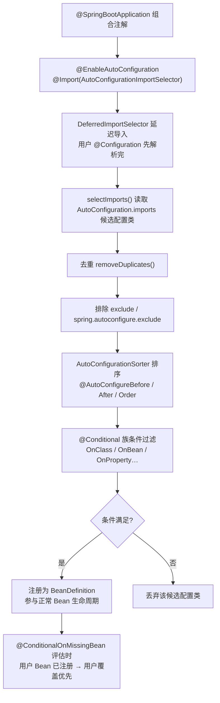
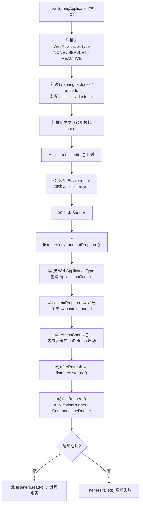
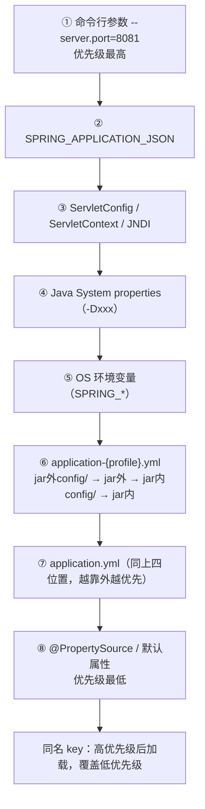
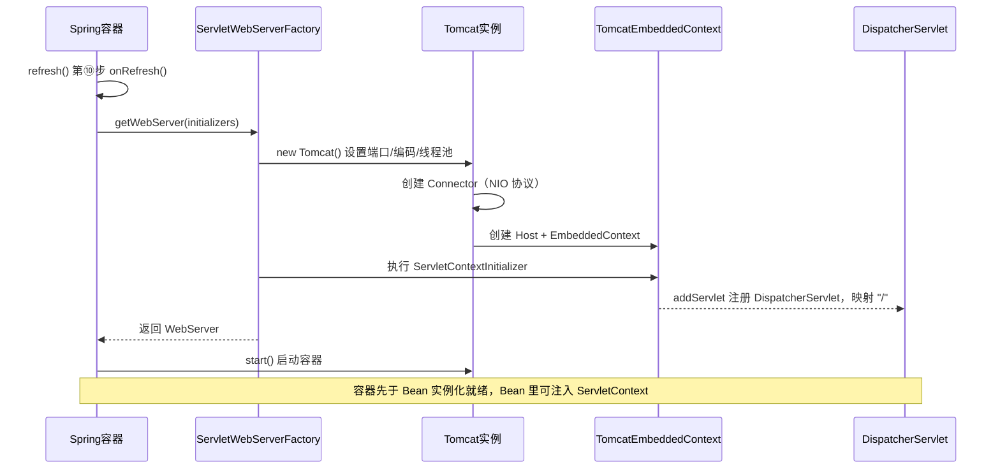

# 14 · Spring Boot 原理与自动装配

> 适用对象：10+ 年经验的资深工程师 / 架构师候选人。本章要求把 Spring Boot 从"脚手架"还原成"一套可解释的机制"：自动装配怎么找到配置类、按什么条件生效；SpringApplication.run 的每个阶段能插什么扩展点；自定义 Starter 的正确姿势；内嵌容器与生产就绪能力；以及 3.x 时代（Jakarta/AOT/Native）的迁移决策。

**TL;DR 本章学习要点**

1. 自动装配 = `@EnableAutoConfiguration` 通过 `@Import(AutoConfigurationImportSelector)` 读取 `AutoConfiguration.imports` 里的候选配置类，再用 `@Conditional` 族按 classpath/Bean 存在性/配置项逐一过滤——「先广撒网收集候选，再按条件收敛」；
2. SpringApplication.run 是第二个「refresh 式」骨架：启动监听器阶段化回调（starting→environmentPrepared→contextPrepared→contextLoaded→started→ready/failed）+ 三个用户扩展点（Initializer/Listener/RunListener）各管一段生命周期；
3. 自定义 Starter 三件套：@AutoConfiguration 配置类 + @ConfigurationProperties 属性绑定 + spring-autoconfigure-metadata.properties 提速与 configuration-metadata.json 出提示；命名 `xxx-spring-boot-starter`；
4. 配置优先级的核心是「越靠命令行的越优先」；Boot 2.4+ 的 config data API 重写了加载顺序，profile 组、spring.config.import 是新世界的玩法；
5. Boot 3.x 是「Jakarta 命名空间 + Java 17 + AOT/Native」三件套；native image 用「编译期确定性」换「启动快/内存低」，代价是反射/代理/资源全部要显式元数据——架构师选型必须懂这比交易。

---

## 1. 自动装配源码

### 1.1 @SpringBootApplication 组合注解

```java
@SpringBootApplication = @SpringBootConfiguration（= @Configuration）
                      + @EnableAutoConfiguration
                      + @ComponentScan(excludeFilters = {TypeExcludeFilter, AutoConfigurationExcludeFilter})
```

- `@SpringBootConfiguration`：就是带标记的 @Configuration（防止用户误把普通配置类当启动类）；
- `@ComponentScan`：扫描启动类所在包及子包——所以**启动类必须放在包顶层**，放错包会导致 Bean 扫描不到（最常见的低级事故）；
- `@EnableAutoConfiguration`：自动装配的总开关，详见 1.2。

### 1.2 @EnableAutoConfiguration 与 AutoConfiguration.imports

```text
@EnableAutoConfiguration
  └─ @Import(AutoConfigurationImportSelector.class)   ← 延迟导入（DeferredImportSelector）
       └─ selectImports()
            ├─ 读取候选：META-INF/spring/org.springframework.boot.autoconfigure.AutoConfiguration.imports
            │           （2.7 之前是 spring.factories 里的 EnableAutoConfiguration 键；3.x 只认 imports 文件）
            ├─ 去重 removeDuplicates()
            ├─ 排除：@SpringBootApplication(exclude=...) / spring.autoconfigure.exclude
            ├─ 排序：AutoConfigurationSorter 按 @AutoConfigureBefore/@AutoConfigureAfter/@AutoConfigureOrder
            └─ 过滤：逐个评估 @Conditional（OnClassCondition 等）→ 不满足的直接丢弃
                 ↓
            剩下的配置类注册为 BeanDefinition → 参与正常 Bean 生命周期
```

要点：
- **DeferredImportSelector**：自动配置类延迟到所有用户 @Configuration 处理完之后才导入——保证用户的 @Bean/@Component 优先于自动配置（用户覆盖优先的根基）；
- 过滤是"懒"的：`AutoConfigurationImportSelector` 只收集和排序，真正的 @Conditional 评估发生在 ConfigurationClassParser 解析配置类时；但 2.x 起有 `spring-autoconfigure-metadata.properties` 做**启动期提前过滤**（先按 classpath 粗筛，避免加载大量注定不生效的配置类，这是 Boot 启动快的关键优化之一）；
- `@AutoConfigureBefore/After/Order` 只对自动配置类之间的相对顺序有效，用户配置永远更早。

> 图示：@EnableAutoConfiguration 自动装配机制流程



### 1.3 @Conditional 条件注解族

| 注解 | 生效条件 | 典型用途 |
|---|---|---|
| @ConditionalOnClass / OnMissingClass | classpath 存在/不存在某类 | 按依赖选实现（有 H2 才配内存库） |
| @ConditionalOnBean / OnMissingBean | 容器有/没有某 Bean | 「用户没定义才自动配置」——覆盖优先的落点 |
| @ConditionalOnProperty | 配置项存在且匹配值 | 开关式特性（xxx.enabled=true） |
| @ConditionalOnWebApplication | 是 Web 应用（SERVLET/REACTIVE） | Web 专属配置 |
| @ConditionalOnExpression | SpEL 表达式 | 组合条件 |
| @ConditionalOnSingleCandidate | 恰好一个候选 Bean | 默认实现注入 |
| @ConditionalOnJava / OnResource / OnCloudPlatform | JDK 版本 / 资源存在 / 云平台 | 环境适配 |

评估机制：条件实现 `Condition` 接口（`matches()`），在配置类解析阶段被 ConfigurationConditionEvaluator 调用；类级条件不满足时整个配置类跳过（不解析 @Bean 方法）；方法级条件只跳过单个 @Bean。

### 1.4 自动装配执行时序（用户配置 vs 自动配置）

```text
ConfigurationClassParser 解析主类 @SpringBootApplication
  ├─ @ComponentScan 扫描 → 用户 Bean 注册（@Service/@Controller/@Component）
  ├─ 用户 @Configuration / @Bean 全部解析完
  └─ @Import(AutoConfigurationImportSelector)【DeferredImportSelector 延迟导入】
      → selectImports 此时才执行：读 imports 文件 → 去重/排除/排序 → 条件过滤
      → 注册自动配置类 → 自动配置类里的 @Bean 注册
      （此刻 @ConditionalOnMissingBean 才能"看到"用户已注册的 Bean）
结果：用户 Bean 先注册、自动配置后注册 → 同名/同类型 Bean 用户赢（覆盖优先）
```

这张时序图是理解「为什么我的 @Bean 能覆盖自动配置」的钥匙：DeferredImportSelector 的延迟不是优化而是**语义要求**——若自动配置先注册，@ConditionalOnMissingBean 评估时用户 Bean 还不存在，覆盖机制失效。

### 本节高频面试题

**Q1：@SpringBootApplication 一个注解为什么能完成"配置 + 自动装配 + 扫描"三件事？**

解答：它是三个注解的组合（1.1 图）。@SpringBootConfiguration 提供配置能力；@ComponentScan 扫描启动类所在包；@EnableAutoConfiguration 通过 @Import 引入 AutoConfigurationImportSelector。**注意 ComponentScan 的 excludeFilters 里有个 AutoConfigurationExcludeFilter**——它防止被扫描包覆盖到自动配置类时重复注册。面试升华：组合注解是 Spring 注解编程的惯用法，Boot 只是把「启动约定」固化成一个注解。

面试官追问：启动类放错包（不在根包）会怎样？——答：@ComponentScan 默认扫启动类所在包及其子包，放错包会导致 Service/Controller 扫描不到，但**自动配置不受影响**（它走 AutoConfiguration.imports 不依赖扫描）。现象往往是"启动成功但接口 404 / Bean 缺失"，排错先看包结构。

**Q2：自动装配的候选配置类是怎么找到、怎么过滤的？spring.factories 和 AutoConfiguration.imports 什么关系？**

解答：找到：AutoConfigurationImportSelector.selectImports 读 `META-INF/spring/org.springframework.boot.autoconfigure.AutoConfiguration.imports`（每行一个配置类全限定名）。过滤：去重 → 排除（exclude 配置）→ 排序（@AutoConfigureBefore/After）→ 条件评估（@Conditional 族）。spring.factories 是 2.7 之前的机制（键 EnableAutoConfiguration），2.7 双轨并存，**3.x 彻底移除 spring.factories 只认 imports 文件**——所以升级 3.x 时第三方 starter 必须换新注册方式，这是迁移排查重点。

面试官追问：为什么自动配置要用 DeferredImportSelector 延迟导入？——答：让用户配置（@Configuration、@Component、@Bean）先注册，自动配置后导入——@ConditionalOnMissingBean 才有意义（"用户没定义我才配"），且用户 @Bean 能覆盖自动配置的默认实现。若自动配置先执行，覆盖机制会变成"先到先得"的混乱局面。

**Q3：@ConditionalOnMissingBean 的原理？为什么自动配置类普遍用它？**

解答：条件评估发生在配置类解析时，matches() 里查 BeanFactory 当前已注册的 BeanDefinition（按类型/名字），**只查已注册的定义，不触发 Bean 实例化**——所以"用户定义过就不自动配"。它让覆盖优先成为可能：用户自己 @Bean 一个 DataSource，DataSourceAutoConfiguration 里的 @ConditionalOnMissingBean(DataSource.class) 就不生效。注意两个坑：① 只认 BeanDefinition，若用户 Bean 是 @Lazy 或条件注册的，评估时机可能影响结果；② @ConditionalOnMissingBean 用在用户自己的配置类上要小心（评估顺序敏感），官方建议用户侧用 @ConditionalOnProperty。

---

## 2. 启动流程

### 2.1 SpringApplication.run 全流程

```text
new SpringApplication(主类)
  ① 推断 WebApplicationType：NONE / SERVLET / REACTIVE（按 classpath 有无 spring-webmvc/spring-webflux）
  ② 读取 spring.factories（或 3.x 的 imports 机制）：装配 ApplicationContextInitializer、ApplicationListener
  ③ 推断主类（从调用栈找含 main 方法的类）

run(args)
  ④ listeners.starting()                        StopWatch 计时、设置 headless
  ⑤ 装配 Environment                            ConfigDataEnvironmentPostProcessor 加载 application.yml
  ⑥ 打印 Banner（可关闭）
  ⑦ listeners.environmentPrepared()
  ⑧ 创建 ApplicationContext（按 WebApplicationType）：
       AnnotationConfigServletWebServerApplicationContext / AnnotationConfigReactiveWebServerApplicationContext / AnnotationConfigApplicationContext
  ⑨ contextPrepared → 注册主类（启动类本身作为配置类）→ contextLoaded
  ⑩ refreshContext()                             ← 就是 Spring 的 refresh()，内嵌容器在 onRefresh 启动
  ⑪ afterRefresh → listeners.started()
  ⑫ callRunners()                                ApplicationRunner / CommandLineRunner（按 @Order）
  ⑬ listeners.ready()                            启动完成；任何异常 → listeners.failed()
```

> 图示：SpringApplication.run 启动流程



与 Spring 的关系一句话：**Boot 的 run = 创建 ApplicationContext + 触发一次 refresh() + 在前后插入监听器阶段**。核心逻辑仍是 Spring Framework 的 refresh 12 步，Boot 只负责「选实现、装环境、报进度、跑 Runner」。

### 2.2 三个扩展点：谁在什么时候被调用

| 扩展点 | 注册方式 | 调用时机 | 典型用途 |
|---|---|---|---|
| ApplicationContextInitializer | spring.factories / SpringApplication.addInitializers | context 创建后、refresh 前 | 编程式往容器塞东西、改 Environment |
| ApplicationListener | spring.factories / addListeners | 监听 SpringApplicationEvent 各阶段 | 启动埋点、动态开关、灰度 |
| SpringApplicationRunListener | spring.factories（只能文件注册） | 阶段化回调（starting…ready/failed） | 启动链路监控（如 SkyWalking 启动探针） |

事件链（ApplicationListener 能听到的）：ApplicationStartingEvent → ApplicationEnvironmentPreparedEvent → ApplicationContextInitializedEvent → ApplicationPreparedEvent → ApplicationStartedEvent → ApplicationReadyEvent / ApplicationFailedEvent。注意区分：**RunListener 是"进程内骨架回调"，ApplicationListener 是"事件驱动"**，两者都能监听启动阶段，但 RunListener 更底层、只能走 spring.factories 注册。

### 2.3 启动阶段事件时序（监听器视角）

```text
SpringApplication.run
  ├─ ApplicationStartingEvent              RunListener.starting
  ├─ ApplicationEnvironmentPreparedEvent   RunListener.environmentPrepared（Environment 已就绪）
  ├─ ApplicationContextInitializedEvent    context 已创建（Initializer 已执行完）
  ├─ ApplicationPreparedEvent              RunListener.contextPrepared / contextLoaded
  ├─ refresh() 完成（内嵌容器启动、单例实例化）
  ├─ ApplicationStartedEvent               RunListener.started
  ├─ ApplicationRunner / CommandLineRunner 执行
  ├─ ApplicationReadyEvent                 RunListener.ready（对外可服务）
  └─ 异常：ApplicationFailedEvent          RunListener.failed
```

用途：① 埋点（各阶段耗时，定位启动瓶颈）；② 灰度/开关（ReadyEvent 后才放流量）；③ 故障定位（"卡在哪个阶段"= 看哪个事件没触发）。工具：actuator 的 startup 端点（ApplicationStartup 采集）可做启动性能剖析。

### 本节高频面试题

**Q4：SpringApplication.run 从入口到启动完成，经历了哪些阶段？**

解答：按 2.1 的 13 步讲。三个必答点：① WebApplicationType 推断（classpath 有无 webmvc/webflux，两者都有默认 SERVLET）；② refreshContext 是分水岭——之前的步骤都在"准备"，refresh 里才真正实例化 Bean 和启动内嵌容器；③ callRunners 在 started 之后、ready 之前，ApplicationRunner/CommandLineRunner 是"启动后执行"的标准入口（CommandLineRunner 拿原始 args，ApplicationRunner 拿解析后的 ApplicationArguments）。

面试官追问：想在启动完成后执行一段初始化逻辑，有哪几种方式？——答：ApplicationRunner/CommandLineRunner（推荐）；ApplicationReadyEvent 监听器；InitializingBean/@PostConstruct（太早，容器还没 fully 可用）；SmartLifecycle.start（容器生命周期内）。按需选：Runner 适合业务初始化，ReadyEvent 适合外部系统联动。

**Q5：ApplicationContextInitializer、ApplicationListener、SpringApplicationRunListener 三者区别？**

解答：见 2.2 表。要点：Initializer 直接操作 context（编程式注册 Bean/属性），时机在 refresh 前；Listener 是事件驱动（能听到环境就绪、上下文创建等事件，且**可以在 Environment 准备后按配置条件过滤**——listener 本身可被 @ConditionalOnProperty 控制）；RunListener 是骨架回调（没有事件对象，直接拿 context/args），只能 spring.factories 注册，适合做平台级埋点（一次注册全局生效）。面试加分：提到 ApplicationListener 支持泛型 + 排序，Boot 内部大量用它做解耦（如 ClearCacheListener、WebServerPortFileWriter）。

**Q6：如何排查"某个自动配置到底有没有生效"？**

解答：三板斧：① 启动加 `--debug`（或 logging.level.org.springframework.boot.autoconfigure=DEBUG）：打印 Positive matches / Negative matches / Exclusions / Unconditional classes 报告——正面回答"为什么生效/为什么不生效"；② actuator 的 `/actuator/conditions` 端点（同款报告，线上可查）；③ `/actuator/beans` 看 Bean 是否注册。进阶：Negative matches 里能看到具体哪个 @Conditional 失败（如 @ConditionalOnClass 缺哪个类），是排查"我加了依赖为什么不生效"的钥匙。

---

## 3. 自定义 Starter 开发

### 3.1 自动配置类编写与注册

```text
工程结构（官方惯例：拆两个模块，让 starter 模块零代码只引依赖）：
  xxx-spring-boot-autoconfigure   自动配置实现
  xxx-spring-boot-starter         只依赖 autoconfigure 模块 + 必要第三方依赖（空壳）

自动配置类：
@AutoConfiguration(after = DataSourceAutoConfiguration.class)   // 2.7+，替代 @Configuration + @AutoConfigureAfter
@ConditionalOnClass(XxxClient.class)
@EnableConfigurationProperties(XxxProperties.class)
public class XxxAutoConfiguration {
    @Bean
    @ConditionalOnMissingBean
    public XxxClient xxxClient(XxxProperties props) { ... }
}

注册：META-INF/spring/org.springframework.boot.autoconfigure.AutoConfiguration.imports
     一行一个全限定类名（3.x 唯一方式；老项目兼容 spring.factories）
```

注意点：
- `@AutoConfiguration` 与 `@Configuration` 的区别：前者专用于自动配置包，自带 after/before 排序属性，且被自动装配机制管理（不会被用户 @ComponentScan 误注册）；
- **不要**在自动配置类里写 @ComponentScan（会扫爆用户包）；自动配置类之间用 @AutoConfigureBefore/After 表达顺序；
- `@ConditionalOnMissingBean` 给用户留覆盖口；`@ConditionalOnProperty` 给开关（`xxx.enabled=false`）。

### 3.2 @ConfigurationProperties 绑定

```java
@ConfigurationProperties(prefix = "xxx.client")   // 松散绑定：xxx.client.connect-timeout == connectTimeout
public record XxxProperties(int connectTimeout, int maxRetries, Map<String, String> headers) {}
```

- 绑定原理：`ConfigurationPropertiesBindingPostProcessor`（一个 BeanPostProcessor）在 Bean 初始化时调用 `Binder` 把 Environment 里的 PropertySource 按 prefix 绑到目标类；支持 setter 绑定、构造器绑定（@ConstructorBinding，2.2+）、**record 构造器绑定（3.x 无需注解）**、嵌套对象、集合、Map、Duration、DataSize 等类型转换；
- 元数据：引入 `spring-boot-configuration-processor` 注解处理器 → 编译期生成 `spring-configuration-metadata.json` → IDE 里用户写配置时有补全和说明（属性名、默认值、描述）。**这是 Starter 体验的分水岭**，面试必提；
- 启动提速元数据：`spring-autoconfigure-metadata.properties` 记录每个自动配置类的 @ConditionalOnClass 条件，Boot 启动时先读它做粗过滤，避免类加载——大项目能省几十毫秒到几百毫秒(量级视项目而定)。

### 3.3 condition 使用建议

- 判断"依赖在不在"用 @ConditionalOnClass（配 @ConditionalOnMissingBean 兜底默认实现）；
- 判断"用户配没配"用 @ConditionalOnProperty（`matchIfMissing=true` 表示没配也生效）；
- 判断"用户有没有自定义实现"用 @ConditionalOnMissingBean——注意它评估的是**已注册的 BeanDefinition**，用在自动配置类里没问题，别用在用户业务配置里（顺序敏感）。

### 本节高频面试题

**Q7：手写一个 Starter 的完整步骤，说清楚每个文件的角色。**

解答：七步：① 命名 `xxx-spring-boot-starter`（官方约定，避免和 spring-boot-starter-* 官方命名冲突）；② 写 XxxProperties（@ConfigurationProperties + 默认值）；③ 写 XxxAutoConfiguration（@AutoConfiguration + @ConditionalOnClass + @EnableConfigurationProperties + @ConditionalOnMissingBean 的 @Bean）；④ 注册到 `META-INF/spring/org.springframework.boot.autoconfigure.AutoConfiguration.imports`；⑤ 引入 configuration-processor 生成元数据（IDE 提示）；⑥ 写 spring-autoconfigure-metadata.properties 提速（可选但推荐）；⑦ 拆 autoconfigure/starter 两模块（可选，官方惯例）。验证：新建 Boot 工程引入 starter，看 Positive matches 里出现你的配置类。

面试官追问：自动配置类里能写 @ComponentScan 吗？为什么？——答：不能。自动配置类是全局导入的，@ComponentScan 会扫描到用户包，造成大量无关 Bean 注册、包名冲突（同名类被跳过）、启动变慢。自动配置只应通过 @Bean 精确注册自己管理的对象。

**Q8：@ConfigurationProperties 的绑定原理？setter 绑定和构造器绑定怎么选？**

解答：原理：ConfigurationPropertiesBindingPostProcessor 在 Bean 初始化阶段用 Binder 把 Environment 的 PropertySource 与 prefix 匹配的属性绑到目标对象（松散绑定 + 类型转换 + 校验 @Validated）。选型：setter 绑定（可变、默认构造）适合"配置可能被后续修改"的场景；构造器绑定（不可变、@ConstructorBinding；3.x 的 record 天然构造器绑定）适合"配置一经加载不变"的场景——不可变对象天然线程安全、防误改，是 3.x 推荐姿势。注意：构造器绑定要求只有一个构造器或标注 @ConstructorBinding；校验用 @Validated + 注解约束（@NotBlank 等）。

---

## 4. 配置体系

### 4.1 application.yml 加载顺序与优先级

Boot 2.4+（config data API）加载顺序，**优先级从高到低**：

```text
① 命令行参数（--server.port=8081）               ← 最高
② SPRING_APPLICATION_JSON（环境变量/系统属性里的 JSON）
③ ServletConfig / ServletContext / JNDI 参数
④ Java System properties（-Dxxx）
⑤ OS 环境变量（SPRING_* 映射）
⑥ application-{profile}.yml（jar 外 config/ → jar 外 → jar 内 config/ → jar 内）
⑦ application.yml（同上四位置，位置越靠外越优先）
⑧ @PropertySource / 默认属性                        ← 最低
```

> 图示：application.yml 加载顺序与优先级（从上到下优先级递减）



- 同名配置项**先加载的低优先级会被后加载的高优先级覆盖**（后加载覆盖先加载，与位置优先级相反理解：高优先级位置最后加载）；
- 2.4+ 的 profile 语法变化：`spring.profiles.active` 只能出现在**无 profile 的文档/文件**里；多环境用 `spring.profiles.group`（如 `group: {prod: [prod, mq]}`）；`spring.config.import` 引入外部配置（如 `optional:configserver:`）；
- 多文档 YAML：一个文件用 `---` 分段 + `spring.config.activate.on-profile`（2.4+ 取代 spring.profiles 段标记）。

### 4.2 @ConfigurationProperties vs @Value

| 维度 | @ConfigurationProperties | @Value |
|---|---|---|
| 绑定对象 | 整类批量绑定（prefix 下全部属性） | 单字段注入 |
| 松散绑定 | 支持（kebab-case/驼峰互认） | **不支持**（必须精确匹配，大小写敏感） |
| 类型转换 | 丰富（Duration/DataSize/集合/Map/枚举） | 基础类型 + SpEL |
| 校验 | @Validated + JSR-303 | 无 |
| 复杂结构 | 嵌套对象/List/Map 原生支持 | 困难（要 SpEL 拼） |
| 元数据提示 | configuration-metadata.json 出提示 | 无 |
| 使用建议 | **属性集中的配置类**（推荐） | 零星取一个值 / 需要 SpEL 表达式 |

### 4.3 profile 与配置加密

- profile 激活：`spring.profiles.active=prod`（命令行/环境变量优先于配置文件内）；`include` 引入公共 profile；group 聚合（2.4+）；
- 配置加密三板斧：
  1. **jasypt-spring-boot-starter**：`ENC(密文)` 前缀 + 解密器（PBE 对称），密钥走环境变量（`jasypt.encryptor.password`），最常用；
  2. **自定义 EnvironmentPostProcessor**：在 Environment 装配阶段拦截并解密（平台自研方案，如对接 KMS）；
  3. **外部配置中心**：Nacos/Spring Cloud Config 的配置本身可加密存储，应用侧无感——云原生首选。
- 原则：**密钥不进配置文件、不进仓库**；密文可入库但要有轮换机制；Spring Cloud Config 场景注意配置内容加密与传输加密两层。

### 本节高频面试题

**Q9：application.yml 的加载顺序？同一个 key 出现在多个地方，谁赢？**

解答：按 4.1 优先级背：命令行 > SPRING_APPLICATION_JSON > Servlet/JNDI > System properties > OS 环境变量 > profile 文件 > 主文件 > @PropertySource。规则：**高优先级覆盖低优先级**；同一文件内后写的覆盖先写的；位置优先级 jar 外 > jar 内。工程应用：端口/密码走命令行或环境变量（可被运维覆盖），默认值放 application.yml。2.4+ 特别提醒：spring.profiles.active 写在哪、profile 组怎么配、spring.config.import 顺序敏感——升级 2.4 后"配置突然不生效"多半是这些语法变了。

面试官追问：多环境配置你们怎么组织？——答：三选一：① 单文件多文档 + profile 段（简单项目）；② 多文件 application-{env}.yml（经典）；③ 配置中心（Nacos/Config，多环境隔离 + 动态刷新）。推荐 ③：环境差异收敛到配置中心，本地开发用默认 profile，配置漂移最小化。

**Q10：@ConfigurationProperties 和 @Value 怎么选？为什么团队规范里常禁 @Value？**

解答：见 4.2 表。@Value 的问题：松散绑定不支持（key 拼错静默变 null 或启动失败）、无类型转换兜底、无校验、散落各处难维护、IDE 无提示。规范场景：业务配置统一收进 @ConfigurationProperties 类（如 XxxProperties），校验 + 默认值 + 文档化；@Value 只用于"取单个系统属性/需要 SpEL 计算"的零星场景。面试升华：**配置也是 API——有 schema（元数据）、有校验、有版本演进，@ConfigurationProperties 是让配置"可演进"的基础设施**。

---

## 5. 内嵌容器与生产就绪

### 5.1 内嵌 Tomcat 原理

```text
ServletWebServerFactoryAutoConfiguration（@ConditionalOnClass(Servlet.class) 等）
  └─ @ConditionalOnMissingBean(ServletWebServerFactory.class)
      └─ TomcatServletWebServerFactory.getWebServer(initializers)
          ├─ new Tomcat()：设置端口（server.port）、编码、线程池（server.tomcat.threads.*）
          ├─ Connector：默认 NIO 协议（org.apache.coyote.http11.Http11NioProtocol）
          ├─ Host + TomcatEmbeddedContext（webapp 目录为空，无 war 解压）
          └─ initializers 逐个执行：把 DispatcherServlet 等 ServletContextInitializer 注册进 Context
              （DispatcherServletRegistrationBean → addServlet("dispatcherServlet", ...) 映射 "/"）
启动时机：refresh() 第 ⑨ 步 onRefresh() —— WebServer 在 Bean 实例化（⑪）之前启动
```

> 图示：内嵌 Tomcat 启动时序（refresh 的 onRefresh 阶段）



- 内嵌 vs 外置：内嵌把「部署」从运维操作变成「进程启动」——war 时代（外置 Tomcat）的版本冲突、目录结构、JVM 参数管理全部消失，换来的是"每个应用自带容器"；
- 关键设计：**先启动容器、后实例化 Bean**——所以 Bean 里能注入 ServletContext、@WebServlet/@WebFilter 能被容器发现；
- 切换容器：排除 tomcat 依赖 + 引入 jetty/undertow starter；undertow 轻量高并发场景常用。

### 5.2 actuator 与健康检查

- 引入 `spring-boot-starter-actuator`；默认只暴露 `health`（`management.endpoints.web.exposure.include=health` 可放开 `*`）；
- 常用端点：health（健康）、info（自定义信息）、metrics（Micrometer 指标）、env、beans、conditions、configprops、loggers（运行时改日志级别）、threaddump、heapdump、shutdown（默认禁）、mappings、httptrace/actuator 3.x 的 httpexchanges；
- 健康检查机制：`/actuator/health` 聚合所有 HealthIndicator（DiskSpaceHealthIndicator、DataSourceHealthIndicator、RedisHealthIndicator…），状态分级 UP/DOWN/OUT_OF_SERVICE/UNKNOWN；自定义：实现 `HealthIndicator` 接口注册成 Bean 即可自动聚合；
- 与注册中心联动：K8s liveness/readiness probe 分别映射 `/actuator/health/liveness`、`/actuator/health/readiness`（2.3.2+），实现「存活探针不管依赖、就绪探针管依赖」的区分。

### 5.3 优雅停机与日志体系

- 优雅停机：`server.shutdown=graceful`（2.3+）+ `spring.lifecycle.timeout-per-shutdown-phase=30s`；原理：收到 SIGTERM → 停止接收新连接 → 等待在途请求完成（超时强制断）→ 关闭容器（销毁 Bean、断开连接池）；默认 `immediate` 是直接断；
- 与 K8s 配合：preStop hook 里 sleep 几秒（等 Service 摘除）+ terminationGracePeriodSeconds > 停机超时，否则优雅停机形同虚设；
- 日志体系：默认 Logback（spring-boot-starter-logging 自带）；`logging.level.root=info`、`logging.group.*` 分组、`logback-spring.xml`（支持 `<springProfile>` 按环境切换、`<springProperty>` 引用配置）；生产要点：JSON 结构化输出（logstash-logback-encoder）、按天/大小滚动、ERROR 单独文件 + 告警、日志脱敏（身份证/手机号）。

### 5.4 actuator 常用端点速查

| 端点 | 作用 | 生产注意 |
|---|---|---|
| /health | 健康聚合（含 liveness/readiness 子端点） | 默认唯一暴露；show-details 按需开 |
| /info | 应用信息（git 提交、构建号） | 配合 git-commit-id-plugin |
| /metrics | Micrometer 指标查询 | 接 Prometheus 用 /actuator/prometheus |
| /loggers | 查看/动态修改日志级别 | 线上调级别利器，改完记得还原 |
| /conditions | 自动配置生效报告 | 排查"为什么不生效" |
| /beans /env /configprops | Bean/环境/配置查看 | env 默认过滤敏感 key（password 等） |
| /threaddump /heapdump | 线程/堆转储 | heapdump 体积大，生产谨慎 |
| /shutdown | 优雅关停 | 默认禁用；K8s 场景用 SIGTERM 更规范 |

### 本节高频面试题

**Q11：内嵌 Tomcat 是在什么时候、怎么启动的？**

解答：时机 = refresh() 的 onRefresh()（Bean 实例化之前）。链路：ServletWebServerFactoryAutoConfiguration 提供 TomcatServletWebServerFactory（用户没自定义 ServletWebServerFactory 才生效）→ getWebServer 创建 Tomcat 实例（端口/连接器/Context）→ 通过 ServletContextInitializer 注册 DispatcherServlet → 启动。要点：① 容器先于 Bean 就绪（Bean 里可注入 ServletContext）；② 自定义容器行为（端口、线程池、连接器属性）全部走 `server.*` 配置或自定义 ServletWebServerFactory Bean。

面试官追问：内嵌 Tomcat 和外置 Tomcat 部署，你会怎么选？——答：内嵌是默认与推荐（部署即进程、版本自治、适合容器化）；外置仅剩的合理场景：老运维体系强依赖 Tomcat 管理、需要统一 JVM/容器补丁、或个别必须 war 的遗留系统。面试话术：**内嵌容器是"应用与运行环境耦合"的解药，云原生时代 war 是历史包袱**。

**Q12：线上服务"假死"（进程在、请求超时），健康检查怎么设计才能发现？**

解答：默认 health 只查基础组件（DB/Redis 连通性），发现不了"业务线程池耗尽/慢调用堆积"这类假死。设计：① 自定义 HealthIndicator 检查关键依赖与业务水位（如线程池活跃度、队列积压、最近请求耗时 p99）；② readiness 探针绑定依赖检查、liveness 只探进程存活（避免"依赖抖动就重启"）；③ 结合 metrics（tomcat.threads.busy、http.server.requests 的慢请求计数）做告警阈值；④ 深度方案：探针直接打一个"会走完整链路"的哑接口（如查一次 DB + 一次缓存），成本可控时最接近真实可用性。

**Q13：优雅停机的原理？配置了 graceful 为什么线上还是大量报错？**

解答：原理见 5.3：先停新连接、等存量请求、超时强杀、再销毁容器。常见坑：① `spring.lifecycle.timeout-per-shutdown-phase` 默认 30s，长请求（慢 SQL/长轮询）会超时被断；② K8s 下 Service 摘除有延迟，新流量仍会打进正在停机的 Pod——需要 preStop sleep + 就绪探针配合；③ 异步线程（@Async/线程池任务）不归容器管，停机时还在跑的任务不会等；④ 连接池/消息消费者要在 SmartLifecycle 里优雅关闭。**面试话术：优雅停机是"注册中心摘除 + 连接排空 + 资源释放"三段式，缺一段都不优雅**。

---

## 6. Spring Boot 3.x 新特性

### 6.1 Jakarta EE 9 与基线提升

| 维度 | 2.x | 3.x |
|---|---|---|
| Java 基线 | Java 8（2.3 前）/ 11+ | **Java 17+** |
| Spring Framework | 5.x | **6.x** |
| 命名空间 | javax.* | **jakarta.***（Servlet 6.0 / Jakarta EE 9/10） |
| 自动配置注册 | spring.factories（2.7 起双轨） | **仅 AutoConfiguration.imports** |
| 循环依赖 | 2.6 起默认禁止 | 默认禁止 |
| Security | 5.x | 6.x（lambda DSL） |
| 对应 Spring Cloud | 2021.x/2022.x 视版本 | 2022.0.x+（按 Boot 3.x 小版本对应） |

- javax→jakarta：**包名全局替换**（javax.servlet→jakarta.servlet、javax.annotation→jakarta.annotation），第三方库不升级到 Jakarta 版本直接 NoClassDefFoundError——这是 2→3 迁移最大的体力活；
- 移除/废弃项：spring.factories 自动装配注册、@ConstructorBinding 对 record 不再必需、部分废弃 API（如 WebMvcConfigurerAdapter 早已移除）、actuator 端点细节调整（如 httptrace→httpexchanges）。

### 6.2 AOT 编译与 GraalVM 原生镜像

```text
Spring AOT（Ahead-Of-Time）引擎：
  Maven/Gradle 插件在构建期分析 BeanDefinition / 条件 / 属性绑定
  → 生成 Java 代码（BeanFactory 初始化逻辑的静态版本）+ 反射/资源/代理的元数据清单
  → JVM 模式：启动更快（跳过运行时解析）
  → Native 模式：配合 GraalVM native-image 编译成原生可执行文件

收益：启动毫秒级、内存大幅下降（无 JIT 预热）、镜像即产物（无需 JRE）
代价（必须讲透）：
  ① 反射/动态代理/资源加载/JDK 代理必须显式声明（@RegisterReflectionForBinding、
     reachability metadata、AOT 自动推断）
  ② CGLIB 代理不可用 → 自动降级 JDK 代理；@Configuration 的 CGLIB 增强语义变化（lite 模式）
  ③ 动态特性受限：@Lookup、运行时 SpEL 构造类、Groovy 脚本、JSP 等不支持或受限
  ④ 类路径/资源在构建期冻结——"构建期确定的东西才能进镜像"
```

选型判断：**native image 适合"函数计算/边缘节点/Serverless/无状态批处理"这类对冷启动敏感的场景；常规微服务（长驻、流量平稳）收益有限，JVM 模式的 AOT 优化 + 常规部署更务实**。Spring Boot 3.3+ 对 native 的支持已成熟（测试框架、actuator、观测性都可用），但团队要付出"元数据维护"的持续成本。

### 6.3 2.x → 3.x 迁移要点

1. Java 17+ 与构建工具升级（Maven 3.6+/Gradle 7.x+）；
2. 全局 javax→jakarta 替换（IDE 批量替换 + 依赖升级：Tomcat 10.1、Servlet 6.0）；
3. spring.factories 里的自动配置类迁移到 AutoConfiguration.imports（第三方 starter 同理，等厂商出新版）；
4. 检查废弃 API：@ConstructorBinding（record 不用了）、WebSecurityConfigurerAdapter（Security 6 用 lambda DSL）、actuator 端点名；
5. 配置项变化：spring.redis.* → spring.data.redis.*（2.7 已改，3.x 移除旧键）、spring.mvc 等路径匹配策略（PathPatternParser 默认）；
6. 验证循环依赖（2.6+ 默认禁）、验证测试（@SpringBootTest 机制不变但 mock 依赖版本要升）；
7. 灰度策略：先在非核心服务试点，用 2.7（双轨过渡版）跑通"去掉 spring.factories 警告"再升 3.x。

### 本节高频面试题

**Q14：Spring Boot 3.x 相比 2.x 最关键的三个变化是什么？**

解答：① Java 17 + Spring Framework 6 基线（LTS 对齐，虚拟线程/record 等新特性可用）；② Jakarta EE 9 命名空间迁移（javax→jakarta，影响所有依赖库）；③ 自动配置注册机制单轨化（AutoConfiguration.imports）与 AOT/Native 一等公民支持。顺带答：循环依赖默认禁（2.6 起）、配置键清理（spring.redis→spring.data.redis）、Security 6 的 lambda DSL。面试话术：**3.x 的本质是"拥抱 JDK 17+ 与云原生"的版本，迁移成本主要在生态，不在框架本身**。

**Q15：AOT 编译解决了什么问题？native image 有什么限制？**

解答：解决的问题：① 启动慢（JVM 模式 AOT 减少运行时 BeanDefinition 解析）；② 冷启动与内存（native 模式无 JIT 预热，内存低一个量级）；③ 部署形态（单二进制，无需 JRE）。限制（必答）：反射/动态代理/资源加载要显式元数据；CGLIB 不可用（降级 JDK 代理）；动态类生成受限（@Lookup、SpEL 动态类）；JSP/Groovy 不支持。面试升华：**AOT 把"运行时才确定的事"提前到构建期确定——这是用"确定性"换"性能"，架构上要接受"类路径冻结"的约束**。

**Q16：2.x 迁移 3.x，你的 checklist 是什么？**

解答：按 6.3 七步答。重点强调：① 依赖生态先行（Spring Cloud/第三方 starter 是否已支持 Boot 3，否则卡死）；② javax→jakarta 全局替换后**必须全量回归**（编译能过不代表运行时没问题，很多库是编译期替换、运行期才炸）；③ spring.factories 迁移；④ 用 2.7 做过渡（双轨注册、废弃告警提前暴露问题）。面试加分：提「迁移要按依赖图排序：JDK → Spring Cloud → 中间件客户端 → 业务代码」以及「留一条回滚路径（配置/分支双轨）」。

**Q17：生产环境 Spring Boot 启动慢，怎么排查？**

解答：三板斧：① 打点定位：actuator 的 startup 端点（ApplicationStartup）看每步耗时，或自定义 RunListener/Initializer 记录阶段时间；② 分段排查：Environment 加载（配置中心拉取慢？）→ Bean 实例化（哪个 Bean 慢：@PostConstruct 里连 DB/预热缓存？）→ 内嵌容器启动；③ 常见根因：自动配置条件评估量大、@PostConstruct 做重活、Bean 初始化时建连接池/连外部系统、类扫描范围过大。优化手段：@Lazy 延迟实例化、初始化异步化、spring-autoconfigure-metadata 提前过滤、缩小扫描包。面试话术：**启动慢 90% 是"初始化阶段干了 IO 重活"，先定位再优化，别盲目开并行初始化**。

**Q18：多环境配置（dev/test/prod）你们怎么管理？配置中心怎么配合？**

解答：三层：① 本地默认值（application.yml 基础配置）；② 环境差异（Nacos 按 Namespace 隔离环境，DataId 带 profile 后缀）；③ 敏感与动态（密码走 jasypt 加密 + 密钥从环境变量注入；频繁变更的配置走 Nacos 动态刷新）。规范：环境差异只允许出现在"环境相关"配置（连接地址、开关），业务参数统一放默认配置，避免三套配置漂移；配置变更走「配置即代码」（Git 管理 + 发布审批），Nacos 的变更历史 + 回滚兜底。加分点：提到 spring.config.import 显式导入配置中心（2.4+），bootstrap.yml 时代已经过去。

---

## 考点速查表

| 考点 | 一句话要点 |
|---|---|
| @SpringBootApplication | @SpringBootConfiguration + @EnableAutoConfiguration + @ComponentScan（启动类必须放根包） |
| 自动装配入口 | @Import(AutoConfigurationImportSelector) 读 AutoConfiguration.imports，DeferredImportSelector 保证用户配置优先 |
| 条件过滤 | @Conditional 族按 classpath/Bean/配置项收敛候选；spring-autoconfigure-metadata.properties 提前粗筛提速 |
| 覆盖优先 | @ConditionalOnMissingBean（查已注册 BeanDefinition）+ DeferredImportSelector 延迟导入，用户 @Bean 可覆盖自动配置 |
| 启动流程 | 推断类型→装 Environment→创建 Context→refresh（内嵌容器在此起）→Runners→ready；异常走 failed |
| 三个扩展点 | Initializer（refresh 前操作 context）/ Listener（事件驱动）/ RunListener（骨架回调，仅 spring.factories） |
| 排查自动配置 | --debug 看 Positive/Negative matches；/actuator/conditions、/actuator/beans |
| Starter 三件套 | @AutoConfiguration + @ConfigurationProperties + AutoConfiguration.imports 注册；configuration-processor 出提示 |
| 配置绑定 | Binder 松散绑定；setter vs 构造器（record 3.x 免注解）；@Validated 校验 |
| 配置优先级 | 命令行 > SPRING_APPLICATION_JSON > JVM 参数 > 环境变量 > profile 文件 > 主文件 > @PropertySource |
| 2.4+ 配置新语法 | spring.config.import、profile group、spring.config.activate.on-profile |
| Properties vs Value | 前者批量/松散/校验/提示；后者单值/SpEL；团队规范禁散落 @Value |
| 内嵌容器 | ServletWebServerFactoryAutoConfiguration→TomcatServletWebServerFactory；onRefresh 启动，先容器后 Bean |
| 健康检查 | health 聚合 HealthIndicator；liveness/readiness 探针分离（2.3.2+） |
| 优雅停机 | graceful + timeout-per-shutdown-phase；K8s 需 preStop + 终止宽限期配合 |
| 日志体系 | 默认 Logback；logback-spring.xml + springProfile；生产要 JSON 结构化 + 脱敏 + 滚动 |
| Boot 3 三件套 | Java 17 + Framework 6 + Jakarta EE 9（javax→jakarta 全局替换） |
| 注册机制单轨 | 3.x 只认 AutoConfiguration.imports，spring.factories 移除 |
| AOT/Native | 构建期生成静态 BeanFactory 代码 + 元数据；反射/代理/资源显式声明，CGLIB 不可用 |
| 迁移策略 | 依赖生态先行→javax 替换→imports 迁移→废弃 API 清理→2.7 过渡灰度 |
| 启动阶段事件 | Starting→EnvironmentPrepared→ContextPrepared→Started→Ready；Failed 兜底 |
| 启动慢排查 | startup 端点打点定位；根因多为初始化阶段 IO 重活；@Lazy/异步化治理 |
| 多环境管理 | Namespace 隔离 + profile 后缀 DataId + jasypt 加密；配置即代码 + 变更审计 |
| RunListener 阶段 | starting→environmentPrepared→contextPrepared→contextLoaded→started→ready→failed |
| actuator 端点 | health 默认唯一暴露；loggers 线上调级别；conditions 查自动配置生效报告 |
| 内嵌容器线程池 | server.tomcat.threads.max（默认 200）；容器先于 Bean 就绪 |
| AOT 权衡 | 构建期冻结类路径；native 适合冷启动敏感场景，常规微服务收益有限 |
