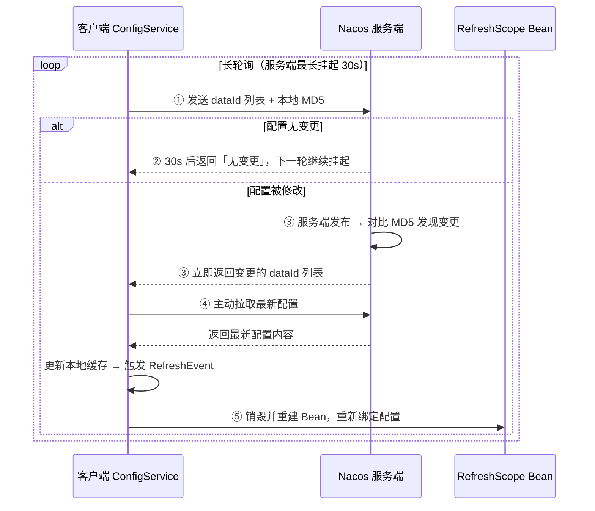
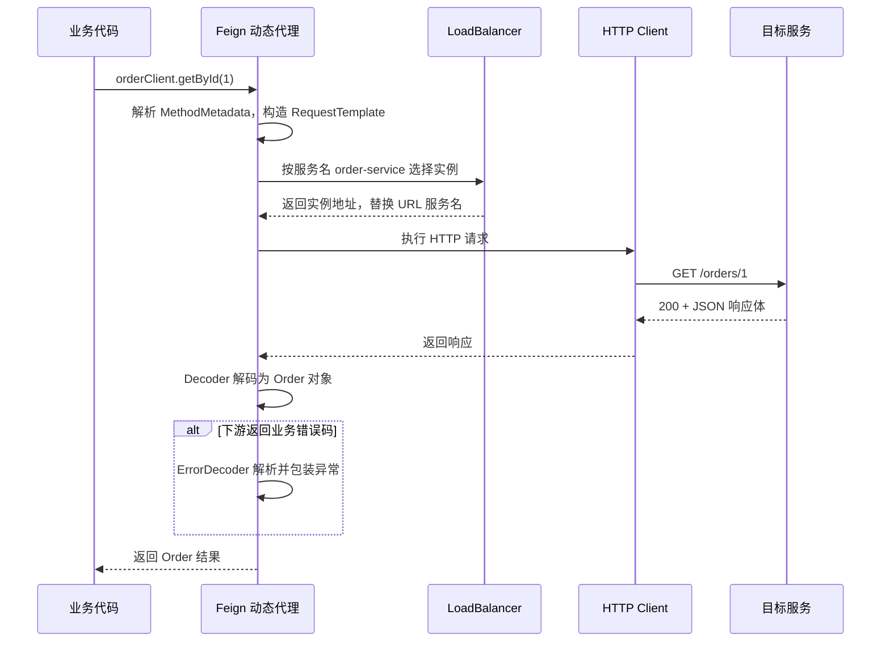
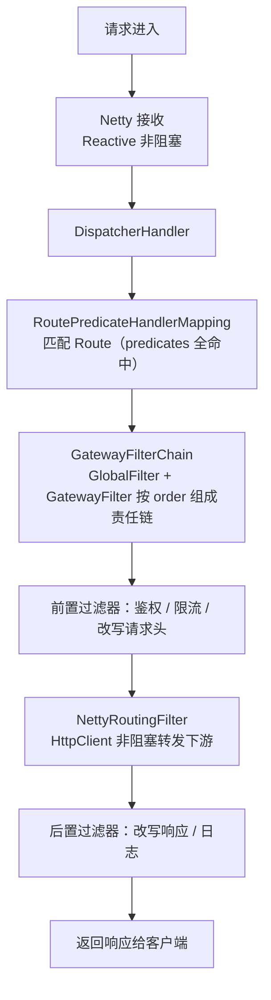
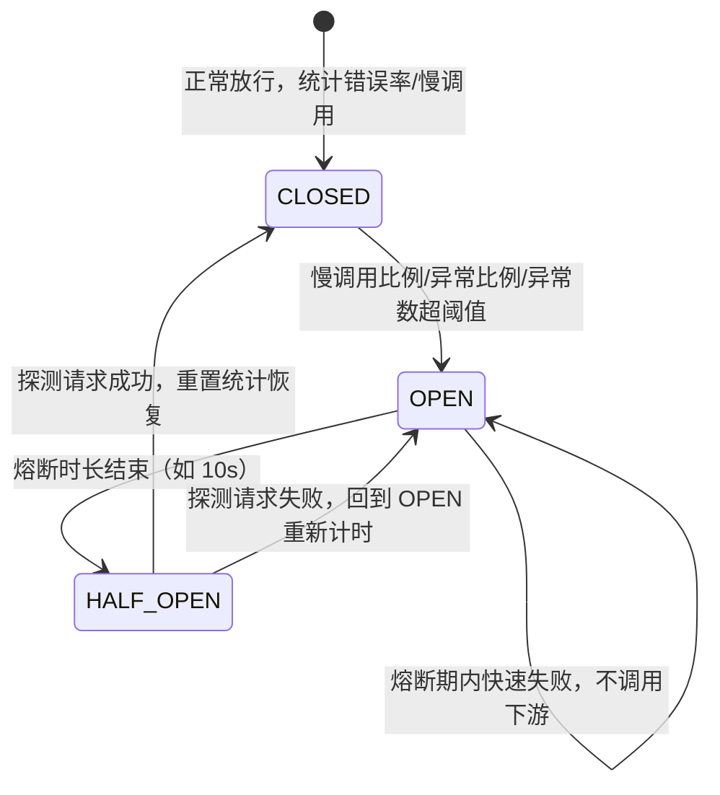
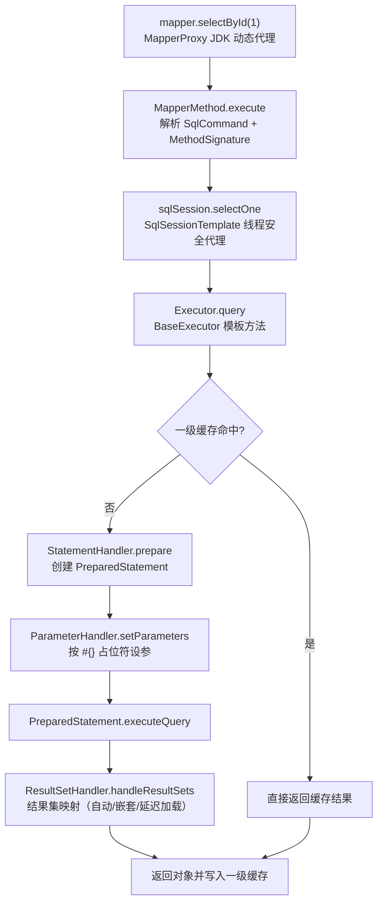

[📖 返回目录](README.md) · [⬅️ 上一章](14-spring-boot.md) · [➡️ 下一章](16-distributed-basics.md)

# 15 · Spring Cloud 微服务与 MyBatis

> 适用对象：10+ 年经验的资深工程师 / 架构师候选人。本章覆盖两大块：Spring Cloud 微服务全链路（注册/配置/调用/网关/治理/追踪）与 MyBatis 源码级原理（动态代理/缓存/插件）。面试落点：注册中心选型权衡（AP vs CP）、配置动态刷新机制、Feign/Gateway 的原理与坑、Sentinel 的统计模型，以及 MyBatis 四大对象与两级缓存的生命周期。

**TL;DR 本章学习要点**

1. 注册中心选型本质是 CAP 权衡：Eureka 纯 AP（客户端缓存 + 自我保护）、Nacos 可 AP/CP 切换（临时实例 Distro / 持久实例 JRaft）、ZK/Consul 纯 CP——「注册信息短暂不一致可接受，服务不可写不可接受」是 AP 派的哲学；
2. Nacos 配置动态刷新 = 客户端 30s 长轮询 + 服务端 MD5 对比，「推」是表象，「拉」是本质；@RefreshScope 负责把变更后的配置重新注入 Bean；
3. Feign 是"接口即客户端"的动态代理 + 负载均衡；Gateway 基于 WebFlux 非阻塞（与 Zuul1 的 Servlet 阻塞模型是两代人），限流走 Redis Lua 令牌桶；
4. Sentinel 的统计核心是滑动窗口（1s 分 2 格），熔断支持慢调用比例/异常比例/异常数，半开探测恢复；Hystrix 已停更，线程池隔离的思想被保留但代价是线程开销；
5. MyBatis 四大对象（Executor→StatementHandler→ParameterHandler→ResultSetHandler）全被 JDK 动态代理包裹以支持插件；一级缓存 SqlSession 级、二级缓存 namespace 级——与 Spring 整合后"无事务时一级缓存形同虚设"是必考题。

---


### 📑 本章目录

- [1. 微服务架构总览](#1-微服务架构总览)
- [2. 注册中心原理](#2-注册中心原理)
- [3. 配置中心](#3-配置中心)
- [4. 服务调用：OpenFeign](#4-服务调用openfeign)
- [5. 网关：Spring Cloud Gateway](#5-网关spring-cloud-gateway)
- [6. 熔断限流降级：Sentinel](#6-熔断限流降级sentinel)
- [7. 链路追踪](#7-链路追踪)
- [8. MyBatis 核心原理](#8-mybatis-核心原理)
- [9. 一级/二级缓存](#9-一级二级缓存)
- [10. 插件机制](#10-插件机制)
- [11. MyBatis-Plus 要点与对比](#11-mybatis-plus-要点与对比)
- [考点速查表](#考点速查表)

## 1. 微服务架构总览


### 1.1 全链路组件图谱

```text
                         ┌──────────────┐
  请求 ──▶ API Gateway ──┤  注册中心     │◀── 服务实例启动时注册 + 心跳续约
         (路由/限流/鉴权) │ (Nacos/Eureka)│
                         └──────┬───────┘
   ┌──────────┬─────────────────┼──────────────────┬─────────────┐
   ▼          ▼                 ▼                  ▼             ▼
服务A(Feign) 服务B(Feign)   配置中心(Nacos)      熔断限流(Sentinel)  链路追踪(SkyWalking/Zipkin)
   │ 服务发现+负载均衡调用
   └──▶ 服务C
```

- **注册中心**：服务实例注册、心跳续约、服务发现（客户端拉取/订阅）；高可用与一致性是选型核心；
- **配置中心**：配置集中管理、多环境隔离、动态刷新（长轮询）；
- **网关**：统一入口——路由转发、鉴权、限流、灰度、协议转换；是南北向流量的闸门；
- **服务调用**：OpenFeign（声明式 HTTP 客户端 + 负载均衡 + 重试超时）；
- **治理**：熔断/限流/降级（Sentinel）、分布式事务（Seata，本章不展开）；
- **追踪**：TraceId 全链路透传 + 调用拓扑 + 性能剖析（SkyWalking/Zipkin）；
- 演进脉络一句话：单体（进程内调用）→ SOA（ESB 总线，重）→ 微服务（去中心化、按业务拆、独立部署）——**微服务的代价是"把进程内调用变成网络调用"**，所有治理组件都是为了补偿这个代价。

### 1.2 拆分与治理原则（架构师视角）

- 拆分维度：业务域（DDD 限界上下文）优先，技术维度（按层拆）是反模式；拆分的依据是「独立演进的频率」而非「代码行数」；
- 治理清单：服务发现、配置、网关、熔断限流、追踪、日志聚合、监控告警、CI/CD——缺一项，微服务就是分布式灾难；
- 反模式预警：服务间同步调用链过长（A→B→C→D，故障放大）、分布式事务滥用、拆分过细导致运维爆炸。

### 本节高频面试题

**Q1：你们微服务注册中心怎么选的？把权衡讲清楚。**

解答：先摆对比（Eureka AP 客户端缓存+心跳+自我保护；Nacos AP/CP 可切换、注册+配置二合一；ZK/Consul 强一致 CP），再给结论：国内生产主流 Nacos——注册中心要 AP（注册信息短暂不一致可接受，服务不可写不可接受），配置中心要 CP（配置错了全集群跟着错），Nacos 一个组件两种模式都提供，且中文生态/运维文档成熟；老团队沿用 Eureka（纯 AP，简单，但已停更）；强一致诉求（如金融核心对账类服务）用 Consul/ZK。面试升华：**注册中心选型 = 一致性模型 × 运维成本 × 生态，先想清楚"注册信息不一致的后果"再选**。

面试官追问：注册中心挂了，服务还能互相调用吗？——答：能。客户端（Feign/Ribbon）启动时拉取并**本地缓存**服务列表，注册中心不可用期间用缓存列表继续调用（新实例不感知、下线实例靠调用失败重试剔除）；这就是"注册中心 AP 化 + 客户端容错"的设计。Eureka 的自我保护机制就是为此服务：宁可保留可能已死的实例，也不清空注册表。

---

## 2. 注册中心原理

### 2.1 Eureka：AP 派代表

- 架构：Eureka Server 集群（Peer 互相复制，最终一致）+ Eureka Client（注册、心跳、缓存）；
- 注册：实例启动向 Server 注册，之后**每 30s 心跳续约**（默认）；Server 90s 未收到心跳则剔除（默认）；
- 客户端容错三件套：① 本地缓存注册表（30s 拉取刷新）；② 自我保护：**15 分钟内续约失败比例 > 85% 触发自我保护**——不再剔除任何实例（宁可保留疑似死实例，防止网络分区时误杀）；③ 失败重试与故障转移（换 Peer）；
- 关键设计：Server 间复制是最终一致（AP），Client 永远有兜底缓存——**Eureka 把可用性建在"客户端不信服务端"之上**。

### 2.2 Nacos：AP/CP 可切换

| 维度 | 临时实例（默认） | 持久实例 |
|---|---|---|
| 一致性 | AP：自研 Distro 协议（各节点最终一致，写本地+异步同步） | CP：JRaft（Raft 变体，半数确认） |
| 健康检查 | 客户端主动心跳（默认 `heartBeatInterval=5s`；服务端 `heartBeatTimeout=15s` 未收到判不健康、`ipDeleteTimeout=30s` 从实例列表剔除） | 服务端主动探测（TCP/HTTP/MYSQL） |
| 摘除 | 心跳超时自动摘除 | 只能通过 API/控制台摘除（或健康检查失败） |
| 场景 | 常规微服务（AP 够用） | 强一致诉求（如分布式锁服务、对账） |

- 切换方式：注册时指定 `ephemeral=true/false`（实例维度，不是全局开关）；
- Nacos 2.x 注册中心通信升级为 gRPC（长连接，取代 1.x 的 HTTP 轮询），推送更快；
- Nacos = 注册中心 + 配置中心二合一（配置部分见第 3 节）。

### 2.3 ZK / Consul 与三选对比

| 维度 | Eureka | Nacos | ZooKeeper | Consul |
|---|---|---|---|---|
| CAP | AP | AP（临时）/ CP（持久） | CP | CP |
| 一致性协议 | 无（Peer 复制） | Distro / JRaft | ZAB | Raft |
| 健康检查 | 客户端心跳 | 心跳（临时）/ 主动探测（持久） | 会话超时（临时节点） | 主动探测（HTTP/TCP/gRPC） |
| 通知机制 | 客户端拉取缓存 | 推送（gRPC/长轮询） | Watch（羊群效应） | 阻塞查询 |
| 附带能力 | 无 | **配置中心** | 分布式锁/选主 | 多数据中心、DNS、KV |
| 维护状态 | 停更（2.x 开源停止） | 活跃（阿里） | 活跃（但微服务场景渐退） | 活跃（HashiCorp） |

- ZK 在微服务场景的问题：CP 写入走半数，注册表写放大（每个实例注册/心跳都是写）；Watch 羊群效应（一个节点变化通知大量客户端）；会话超时误判导致实例被摘；
- Consul：CP 但健康检查在服务端（比 ZK 的"客户端会话"可靠），支持多 DC，云原生友好；国内使用率低于 Nacos。

### 本节高频面试题

**Q2：Eureka 的自我保护机制是什么？为什么要设计它？**

解答：阈值：15 分钟内续约失败比例 > 85% 进入自我保护——**停止剔除任何实例**（包括心跳超时的），注册表"冻结"，直到续约恢复。原因：网络分区/GC 停顿会让大量心跳同时失败，若按规则剔除，可能把健康实例全清掉（集群雪崩）；宁可保留可能已死的实例（调用失败由客户端重试兜底），也不冒"清空注册表"的险。代价：故障实例的流量要等客户端重试才能绕过——**用短暂的错误流量换注册表的存活**。运维要点：自我保护触发要告警，通常是网络/GC 问题信号。

面试官追问：Eureka 怎么做到 AP 的？——答：Server 之间 Peer 复制是异步最终一致（不要求多数确认）；Client 本地缓存 + 每 30s 主动拉取；任何时刻 Client 都能用缓存发起调用，Server 挂掉不影响存量调用。对比 ZK：ZK 写路径要半数确认，注册/心跳全是写——CP 的"强一致"在注册场景是昂贵且不必要的。

**Q3：Nacos 的临时实例和持久实例有什么区别？怎么选？**

解答：见 2.2 表。要点：临时实例走 AP（Distro 最终一致 + 客户端心跳 + 自动摘除），持久实例走 CP（JRaft 半数确认 + 服务端主动探测 + 手动摘除）。选型：99% 的微服务用临时实例（注册信息允许最终一致）；持久实例用于「注册信息错了会出大事」的场景（如分布式锁服务地址、强一致对账）。面试加分：Nacos 2.x 用 gRPC 长连接替代 1.x 的 HTTP 轮询，心跳与推送都走长连接，感知更快；CP 模式下写入要半数节点确认，性能低于 AP 模式。

---

## 3. 配置中心

### 3.1 Nacos 配置模型与加载

- 三级模型：`Namespace`（环境隔离：dev/prod）> `Group`（业务分组，默认 DEFAULT_GROUP）> `DataId`（配置项，命名 `{spring.application.name}.{file-extension}`，支持带 profile 的 `{name}-{profile}.yml`）；
- 加载链路：客户端启动 → NacosPropertySourceLocator（Spring Cloud）按 DataId 拉取配置 → 注入 Environment（优先级高于本地 application.yml）→ 配置生效；
- 与本地配置的关系：远端配置优先级默认更高，本地作为兜底（`spring.cloud.config.import` 或 bootstrap 模式可调）。

### 3.2 动态刷新原理：长轮询

```text
客户端 ConfigService 维护一个长轮询任务：
  ① 把关注的 dataId 列表 + 本地 MD5 发给服务端
  ② 服务端挂起请求（最长 30s）——期间该 dataId 无变更则 30s 后返回"无变更"
  ③ 配置被修改：服务端发布 → 对比 MD5 发现变更 → 立即返回变更的 dataId 列表
  ④ 客户端收到 → 拉取最新配置 → 更新本地缓存 → 触发 RefreshEvent
  ⑤ @RefreshScope 的 Bean 被销毁重建（重新注入新配置）
  「推」是表象：服务端只是"提前结束挂起"，数据始终是客户端拉
```

> 图示：Nacos 配置动态刷新（长轮询）时序



- `@RefreshScope` 原理：RefreshScope 是自定义 Scope（基于 SimpleBeanDefinitionRegistry 的缓存），刷新时把 scope 缓存清空，下次 getBean 重建——**重建意味着 Bean 里所有 @Value/@ConfigurationProperties 重新绑定**，但有状态 Bean（连接池、缓存对象）重建有成本与风险；
- 配置一致性兜底：客户端本地快照（失败时用快照启动）+ 服务端 MD5 对比 + 变更审计；多环境隔离靠 Namespace，环境间配置漂移靠「配置即代码」（Nacos 支持从 Git 同步/OpenAPI 管理）。

### 本节高频面试题

**Q4：Nacos 配置动态刷新是"推"还是"拉"？讲清楚整个链路。**

解答：本质是**拉**（长轮询）：客户端挂起请求在服务端，服务端配置变更时提前返回，客户端再拉取。链路见 3.2。要点：① 30s 是挂起上限，无变更时周期空转（低频配置场景有 30s 延迟）；② 变更通知只告诉"哪些 dataId 变了"，数据本身还是客户端主动拉；③ @RefreshScope 是"配置生效"的最后一环——它只重建标记了 @RefreshScope 的 Bean，普通 Bean 不会自动更新。面试升华：**长轮询 = 轮询 + 挂起优化，用"服务端状态对比"换掉"客户端盲目轮询"**，这是配置中心的标准答案（Apollo 同样是长轮询）。

面试官追问：@RefreshScope 的 Bean 重建会有什么坑？——答：① 有状态 Bean（连接池、单例缓存）重建 = 连接断开重连，高峰期重建可能抖动；② 构造器里做的初始化会重跑，副作用（发消息、写库）可能重复；③ 重建不是原子的，正在调用的线程可能拿到新旧两个实例。规避：配置变更频繁的对象用 @ConfigurationProperties + 事件监听手动更新，别动不动 @RefreshScope。

**Q5：Apollo 和 Nacos 做配置中心，怎么选？**

解答：共同点：长轮询动态刷新、多环境隔离、权限管理、变更历史。差异：Apollo（携程）——配置能力更专精：发布即生效的秒级推送、灰度发布、回滚、权限体系完善、配置项级审计，适合"配置治理要求极高"的团队；Nacos——注册+配置二合一，一套组件搞定，与 Spring Cloud Alibaba 生态绑定，运维简单。选型结论：已有 Nacos 注册中心的团队直接 Nacos；配置治理（灰度/审计/多团队权限）是硬需求且愿意多部署一套组件的选 Apollo。面试话术：**注册中心选 Nacos 没争议，配置中心看治理诉求**。

---

## 4. 服务调用：OpenFeign

### 4.1 动态代理 + 负载均衡

```text
@FeignClient(name = "order-service")
public interface OrderClient { @GetMapping("/orders/{id}") Order getById(@PathVariable Long id); }

原理：
  FeignClientFactoryBean（每个 @FeignClient 一个 FactoryBean）
    → 解析接口方法生成 MethodMetadata（URL 模板、参数位置、返回类型）
    → JDK 动态代理（FeignInvocationHandler）
    → 调用时：方法 → RequestTemplate（占位符替换 + 参数编码 + Header）→ Client 执行 HTTP
    → 响应解码（Decoder：JSON → 返回类型）→ 失败走 ErrorDecoder（可自定义，解析业务错误码）
负载均衡（Spring Cloud 演进史）：
  Spring Cloud 2020.x 之前：Ribbon（ILoadBalancer + IRule：轮询/随机/权重/重试）
  Spring Cloud 2021.x+（对应 Boot 2.4+）：Ribbon 进入维护，改用 Spring Cloud LoadBalancer（默认轮询，
  可自定义 ServiceInstanceListSupplier，如 Nacos 权重/Nacos 集群优先）
```

> 图示：OpenFeign 一次调用的动态代理链路



- 重试与超时：`spring.cloud.openfeign.client.config.{name}.connectTimeout/readTimeout`（默认 10s/60s）；**Spring Cloud OpenFeign 默认不重试**（原生 Feign 默认重试 5 次，两者不同，面试易混淆）；重试开启要谨慎——**POST 等非幂等请求重试可能造成重复下单**，重试策略必须配合幂等设计；
- 常见坑：接口方法参数没标 @PathVariable/@RequestParam 导致 URL 拼错；返回类型与 JSON 结构不匹配（Decoder 报错）；服务名大小写/下划线（服务名用小写连字符）；超时配置不生效（要看 `spring.cloud.openfeign.client.config` 的命名空间）。

### 4.2 与 RestTemplate/WebClient 的对比

| 维度 | RestTemplate | OpenFeign | WebClient |
|---|---|---|---|
| 风格 | 命令式，URL 拼接 | 声明式接口 | 响应式（非阻塞） |
| 负载均衡 | @LoadBalanced + 拦截器 | 内置（LoadBalancer） | @LoadBalanced + 响应式 |
| 可读性 | 低（URL 散落） | 高（接口即契约） | 中 |
| 适用 | 简单调用 | 服务间调用标准 | 高并发 IO 密集 / 全链路响应式 |

### 本节高频面试题

**Q6：Feign 的接口是怎么变成一次 HTTP 调用的？**

解答：按 4.1 链路讲：FeignClientFactoryBean 生成代理 → 方法解析成 MethodMetadata → 调用时构造 RequestTemplate（路径/参数/Header）→ Client（默认 JDK HttpURLConnection，可换 OkHttp/Apache HttpClient）执行 → Decoder 解码 → ErrorDecoder 处理失败。负载均衡：调用前经 LoadBalancer 从注册中心列表选实例（默认轮询），替换 URL 里的服务名为实例地址。加分点：① @FeignClient 的 name 就是服务名，Feign 用它查注册表；② 契约解析（Contract）支持 Spring MVC 注解（SpringMvcContract）——这是"接口用 @GetMapping 就能被 Feign 识别"的原因。

面试官追问：Feign 默认重试吗？开了重试有什么风险？——答：Spring Cloud OpenFeign **默认不重试**（和原生 Feign 默认 5 次重试不同）。开启重试的风险：① 非幂等写操作重复执行（重复下单/重复扣款）；② 超时 + 重试叠加放大延迟（下游已慢，重试雪上加霜）。正确姿势：读操作可开（配合幂等键），写操作靠业务幂等而非 HTTP 重试。

**Q7：Ribbon 退役后，负载均衡怎么做？**

解答：Spring Cloud LoadBalancer 取代 Ribbon（2021.x+）：默认轮询（RoundRobin），扩展点 ServiceInstanceListSupplier——可自定义「Nacos 权重」「集群内优先」「金丝雀版本」等选择逻辑；与 Feign/WebClient/RestTemplate 无缝集成（@LoadBalanced 注解语义不变）。Nacos 场景：引入 `spring-cloud-starter-loadbalancer` + Nacos 的 NacosLoadBalancer（支持权重与集群优先）。面试话术：**Ribbon 的退役是"Netflix 生态退场"的标志性事件，Spring Cloud 现在自研负载均衡并默认与注册中心解耦（LoadBalancer 是 SPI 机制，可插拔）**。

---

## 5. 网关：Spring Cloud Gateway

### 5.1 WebFlux 架构与路由

```text
请求 → Netty（Reactive）→ DispatcherHandler → RoutePredicateHandlerMapping
      → 匹配 Route（id + uri + predicates 全部命中）
      → GatewayFilterChain（GlobalFilter + GatewayFilter 按 order 组成责任链）
          ├─ 前置：鉴权、限流、改写请求头
          ├─ 转发：NettyRoutingFilter（HttpClient 转发到下游，非阻塞）
          └─ 后置：改写响应、日志
```

> 图示：Spring Cloud Gateway 过滤器链（责任链）



- 基于 **WebFlux（Netty + Reactor）**：全链路非阻塞，少量线程支撑高并发——与 Zuul 1.x 的 Servlet 阻塞模型（每请求一线程）是两代架构；**不能与 spring-boot-starter-web 共存**（两者抢 DispatcherServlet 语义，启动报错）；
- 路由三要素：Route（id、uri、order）、Predicate（断言工厂：Path/Header/Method/Query/Host/Cookie/Weight 等 11 种）、Filter（过滤器工厂：AddRequestHeader/Retry/RateLimiter 等 30+ 种）；
- 自定义：实现 GlobalFilter（全局，对一切路由生效）或 GatewayFilterFactory（路由级）；order 越小越先执行。

### 5.2 限流：RequestRateLimiter

- 原理：**Redis + Lua 脚本实现令牌桶**（原子操作）：`replenishRate`（每秒补充令牌数）、`burstCapacity`（桶容量）、`keyResolver`（限流维度：IP/用户/接口）；
- 流程：请求 → KeyResolver 生成限流 key → Lua 脚本 `INCR` + 过期时间计算当前桶内令牌 → 有令牌放行（返回 200 与剩余令牌），无令牌返回 429（可自定义降级响应）；
- 为什么用 Lua：**令牌桶的"取令牌 + 扣减"必须是原子操作**，Lua 脚本在 Redis 单线程执行天然原子，避免并发扣超；
- 兜底：Gateway 的限流是网关层限流（南北向），**服务间调用（东西向）的限流要靠 Sentinel**——两层都要有。

### 5.3 与 Zuul 对比

| 维度 | Zuul 1.x | Spring Cloud Gateway |
|---|---|---|
| 模型 | Servlet 阻塞（每请求一线程） | WebFlux 非阻塞（Netty 事件驱动） |
| 性能 | 线程池上限 = 并发上限 | 少量线程扛高并发 |
| 生态 | Netflix 停更 | Spring Cloud 官方主推 |
| 限制 | 无 | 不能用 spring-boot-starter-web；依赖理解成本高 |
| 适用 | 老系统存量 | 新项目唯一推荐 |

### 本节高频面试题

**Q8：Gateway 和 Zuul 1 的本质区别是什么？为什么 Gateway 胜出？**

解答：本质区别 = **阻塞 vs 非阻塞**：Zuul 1 基于 Servlet，每个请求占一个线程（线程池 200 默认，并发超了排队/拒绝）；Gateway 基于 WebFlux/Netty，IO 事件驱动，一个线程处理大量连接。胜出原因：① 高并发下线程模型优势明显（请求慢、连接多时不爆线程）；② Zuul 1 停更、Zuul 2 迟迟未与 Spring Cloud 集成；③ Gateway 路由/断言/过滤器工厂丰富。代价：响应式编程心智负担、排错难度高（调用栈全是 Reactor）、不能与 spring-web 共存。面试话术：**选 Gateway 是"并发模型"的胜利，不是"功能"的胜利**。

面试官追问：Gateway 里做了耗时操作（如同步查 DB 做鉴权）会怎样？——答：会阻塞 Netty 事件循环线程（Netty 线程被占满 → 网关整体吞吐雪崩）。正确做法：鉴权信息放 Redis（异步客户端）/ 本地缓存；必须同步 IO 的用 boundedElastic 调度器隔离；原则是**网关里不做任何阻塞操作**，这是 Gateway 调优第一原则。

**Q9：Gateway 的限流是怎么实现的？为什么用 Redis + Lua？**

解答：见 5.2。核心：RequestRateLimiterFilterFactory + KeyResolver（限流维度）+ Redis Lua 令牌桶（replenishRate/burstCapacity）。为什么 Lua：取令牌与扣减必须原子，Redis 单线程执行 Lua 保证无并发竞争；令牌桶 vs 固定窗口：令牌桶允许突发（桶容量内），平滑限速，是生产主流。补充：Sentinel 也提供 Gateway 适配（spring-cloud-alibaba 的 SentinelGatewayFilter），支持更细的链路/热点限流——限流方案要和监控大盘打通。

---

## 6. 熔断限流降级：Sentinel

### 6.1 滑动窗口统计模型

```text
固定窗口（计数器）：1s 一个窗口，窗口内计数，跨窗口清零——边界突刺问题（59.9s 的 1000 请求 + 0.1s 的 1000 请求算 2 个窗口各自通过）
滑动窗口：把时间轴切成格子（默认 1s 窗口 = 2 个格子，每格 500ms），统计"当前时间往前 1s"的所有格子之和
  ┌─────┬─────┐
  │ 格1 │ 格2 │ ← 时间推进，旧格滑出，新格滑入，统计始终是"最近 1s"
  └─────┴─────┘
  格子越细，统计越精确，内存占用越大（Sentinel 默认 2 格，可配置 sampleCount）
```

> 图示：Sentinel 熔断降级状态机



- 流控规则（FlowRule）：按 QPS 或并发线程数；模式：直接 / 关联（A 接口限流保护 B）/ 链路（按调用链入口限流）；效果：快速失败 / Warm Up 预热（冷启动渐进限流）/ 排队等待（匀速器，削峰填谷）；
- 熔断规则（DegradeRule）：慢调用比例（RT 阈值 + 比例阈值 + 最小请求数）/ 异常比例 / 异常数；熔断后进入**半开**状态（放一个探测请求，成功则恢复，失败继续熔断）；
- 系统保护（SystemRule）：CPU/系统负载/RT/线程数/QPS 全局兜底；热点参数限流（ParamFlowRule）：按参数值限流（如某商品 ID 被刷）；授权规则（AuthorityRule）：黑白名单。

### 6.2 与 Hystrix 对比

| 维度 | Hystrix | Sentinel |
|---|---|---|
| 隔离 | 线程池（默认 10）/ 信号量 | 并发线程数限制（无独立线程池） |
| 统计 | 10s 滚动窗口 | 滑动窗口（可配精度）+ 实时监控 |
| 熔断 | 错误率阈值 | 慢调用比例/异常比例/异常数 |
| 规则推送 | 静态配置为主 | 控制台 + Nacos/Apollo/ZK 动态推送 |
| 限流 | 弱（无独立限流模型） | 流控/热点/系统/授权四类规则 |
| 状态 | 停更（维护模式） | 活跃（阿里开源，Spring Cloud Alibaba 官方） |

- Hystrix 线程池隔离的价值：**依赖故障的线程隔离**（下游线程池打满不影响本服务线程）；代价：每依赖一个线程池（10 线程默认）+ 线程切换开销，线程池本身成为资源瓶颈；Sentinel 用"并发线程数限制"实现轻量隔离（不建池，超限直接拒绝），统计更细、开销更小；
- 规则推送生产要求：**推模式**（控制台 → Nacos → 客户端监听），禁止生产用内存版规则（重启即丢）。

### 本节高频面试题

**Q10：Sentinel 的滑动窗口是怎么统计的？和固定窗口比好在哪？**

解答：见 6.1 图。滑动窗口把统计周期切成格子，随时间为每个格子维护计数（QPS/异常数/RT），统计"最近一个完整周期"的格子之和——**窗口随当前时间滑动，永远代表"最近 1s"**。固定窗口的缺陷是边界突刺（两个窗口交界处各打满一半就漏过双倍流量）；滑动窗口格子越细越接近精确（代价是内存，默认 2 格足够）。加分点：Sentinel 的统计基于 LeapArray（环形数组），格子过期复用，内存 O(格子数) 与请求量无关；RT 用"秒级统计 + 分钟级聚合"两级。

面试官追问：Sentinel 熔断后半开探测是怎么实现的？——答：熔断状态（OPEN）持续熔断时长后进入 HALF_OPEN，放行**一个**探测请求：成功 → 关闭熔断并重置统计；失败 → 回到 OPEN 重新计时。半开是为了避免"下游已恢复但熔断不解除"和"恢复瞬间被流量打垮"两个极端。工程上还要配 fallback（降级方法返回兜底数据），熔断 + 降级必须成对出现。

**Q11：Sentinel 和 Hystrix 怎么选？Hystrix 的线程池隔离值不值得保留？**

解答：结论：新项目一律 Sentinel（Hystrix 停更、无独立限流、规则静态、监控弱）。隔离模式上，Sentinel 提供两种：**信号量隔离（默认，限制并发线程数）**与**线程池隔离（1.7.0 引入，Hystrix 模式，每个资源独立 ThreadPoolExecutor）**。线程池隔离的思想仍值得借鉴：对"故障会传染"的强依赖（如支付通道），可单独配置线程池隔离，把爆炸半径锁在独立线程池内；但代价是线程开销与上下文切换，所以默认用更轻量的信号量/并发数限制，只对关键依赖单独上线程池。
- 面试话术：**隔离的本质是"故障爆炸半径控制"，线程池隔离是最强但最贵的手段；默认信号量/并发数限制，对关键依赖单独上线程池**。

---

## 7. 链路追踪

### 7.1 TraceId 传递原理

```text
TraceId：一次请求链路的全局唯一 ID（如 8 位 16 进制 ×2 段）
SpanId：链路中每个调用的单元 ID（父 Span → 子 Span 树形结构）

传递载体：
  HTTP：B3 协议（X-B3-TraceId / X-B3-SpanId / X-B3-Sampled）或 W3C traceparent
  RPC（Dubbo）：attachment 透传
  MQ：消息头（消息体不可改，必须走 header）
  线程内：ThreadLocal（MDC 关联日志）——异步线程池必须用 TransmittableThreadLocal
         （或用 Executor 包装器在提交任务时拷贝上下文）

采样：默认概率采样（如 10%），全量采样在高 QPS 下存储爆炸；
     生产实践：核心链路 100% 采样 + 全链路动态采样开关
```

- 与日志打通：logback 里 `%X{traceId}` 输出 MDC 中的 TraceId——排障时"一条日志查全链路"是基本能力；
- 跨线程传递是最大工程坑：线程池复用导致上下文串线（A 请求的 traceId 出现在 B 请求日志里），必须用 TTL（TransmittableThreadLocal）包装线程池。

### 7.2 Zipkin vs SkyWalking

| 维度 | Zipkin（Brave 埋点） | SkyWalking |
|---|---|---|
| 接入方式 | 依赖注入（侵入式，代码/配置埋点） | Java Agent 字节码增强（**无侵入**） |
| 上报 | HTTP/Kafka → Zipkin Server | gRPC → OAP Server |
| 存储 | ES/MySQL/Cassandra | ES（默认）/MySQL/TiDB |
| 能力 | 调用链 + 依赖图 | 调用链 + **拓扑自动发现** + 性能剖析 + 告警 |
| 语言 | Java 为主（多语言 SDK） | 多语言 Agent |
| 运维成本 | 组件少，轻 | 组件多（Agent/OAP/UI/存储），重 |

- 选型：老系统/异构团队用 SkyWalking（无侵入，改造成本最低）；轻量诉求/已用 ELK 的团队用 Zipkin；**无论选哪个，TraceId 规范先行**（全链路统一透传协议）；
- 架构师视角：链路追踪的价值不在"看一条调用链"，而在**拓扑发现（服务依赖可视化）、慢链路定位（性能剖析）、跨服务排障（日志+链路联动）**。

### 本节高频面试题

**Q12：TraceId 是怎么跨服务、跨线程、跨 MQ 传递的？**

解答：跨服务：HTTP 走 B3/traceparent 头（网关生成 TraceId，下游中间件自动透传）；RPC 走 attachment；MQ 走消息头（消息体不可变）。跨线程：ThreadLocal 存上下文，线程池复用会串线——用 TransmittableThreadLocal + 包装线程池（或用中间件提供的 Executor 包装器）。日志关联：MDC 放 traceId，logback pattern 输出。面试升华：**链路上下文传递是"横切关注点"，正确姿势是交给中间件（Spring Cloud Sleuth/Micrometer Tracing/SkyWalking Agent）自动处理，业务代码只保证"异步场景不裸奔"**。

面试官追问：采样率怎么定？——答：默认概率采样（如 10%）；高价值链路（支付、下单）100% 采样 + 独立存储；全链路采样率要配合存储容量规划（单条 trace 几十 KB，万 QPS 全采样 = 存储爆炸）；生产实践：核心链路全采、外围链路低采样、异常链路强制全采（错误 span 一定上报）。

**Q13：SkyWalking 无侵入的原理是什么？**

解答：Java Agent（`-javaagent:skywalking-agent.jar`）在类加载时**字节码增强**（基于 ByteBuddy/ASM）：对中间件类（HTTP 客户端、RPC、JDBC、MQ）的指定方法织入探针代码——方法调用前后记录 Span、生成 TraceId、透传上下文，业务代码零改动。链路：Agent 采集 → gRPC 上报 → OAP Server 聚合分析 → ES 存储 → UI 展示。对比 Zipkin：Brave 是代码级埋点（要引依赖、配过滤器），SkyWalking 是"运行时织入"。代价：Agent 版本与中间件版本兼容性、字节码增强的排错难度。面试话术：**无侵入的本质是"把埋点从业务代码里剥离到字节码层"**。

---

## 8. MyBatis 核心原理

### 8.1 Mapper 动态代理与一次查询的完整链路

```text
UserMapper mapper = sqlSession.getMapper(UserMapper.class)
  → MapperRegistry.getMapper → MapperProxyFactory.newInstance → JDK 动态代理（MapperProxy）
调用 mapper.selectById(1)
  → MapperProxy.invoke → MapperMethod.execute
      → SqlCommand（SQL 类型 INSERT/UPDATE/DELETE/SELECT + MappedStatement id）
      → MethodSignature（返回类型解析：集合/单对象/Map/游标/泛型）
  → sqlSession.selectOne("com.x.UserMapper.selectById", 1)
      → Executor.query（BaseExecutor 模板方法）
          ├─ 一级缓存查询（见第 9 节）
          ├─ StatementHandler.prepare → 创建 PreparedStatement（连接来自 DataSource）
          ├─ ParameterHandler.setParameters → 按 #{param} 占位符设置参数
          ├─ jdbc 执行（PreparedStatement.executeQuery）
          └─ ResultSetHandler.handleResultSets → 结果集映射（自动映射/嵌套映射/延迟加载）
      → 返回对象
```

> 图示：MyBatis 一次查询的完整执行流程



- 四大对象：**Executor**（调度者：查询/更新/缓存/事务，Simple/Reuse/Batch 三实现 + CachingExecutor 装饰）→ **StatementHandler**（SQL 执行者：RoutingStatementHandler 按语句类型路由到 Prepared/Simple/Callable）→ **ParameterHandler**（参数设置）→ **ResultSetHandler**（结果映射）；
- 一切皆 `Configuration`：MappedStatement（一条 SQL 的全部元数据）、MapperRegistry、缓存、插件都在 Configuration 上注册——**Configuration 是 MyBatis 的"容器"**，全局唯一；
- 与 Spring 整合：SqlSessionTemplate 是线程安全的 SqlSession 代理（SqlSession 本身线程不安全）；事务内复用绑定的 SqlSession，无事务每次新建即关。

### 8.2 SQL 与映射的本质

- `#{}` 预编译占位符（ParameterHandler 设参，防注入）vs `${}` 字符串拼接（表名/排序字段动态场景，有注入风险——必须白名单校验）；
- 结果映射：自动映射（列名驼峰转换）、resultMap 显式映射、嵌套结果（association/collection 联表一次性查）、嵌套查询（N+1 问题根源，配延迟加载 lazyLoadingEnabled + 按需触发）；
- 动态 SQL：if/choose/where/foreach 由 XMLScriptBuilder 解析成 SqlNode 树，运行时按参数求值拼接——**动态 SQL 本质是"模板引擎"**。

### 本节高频面试题

**Q14：MyBatis 一次查询从 Mapper 接口到结果返回，完整链路是什么？**

解答：按 8.1 链路讲全。核心考点：① Mapper 是 JDK 动态代理（MapperProxy），一个接口方法对应一个 MappedStatement（namespace + 方法名定位）；② 四大对象职责（Executor 调度 → StatementHandler 执行 → ParameterHandler 设参 → ResultSetHandler 映射）；③ #{} 走预编译，${} 拼接。加分：提到 RoutingStatementHandler 的路由逻辑、CachingExecutor 对 Executor 的装饰（缓存就是通过装饰器实现的）、ResultSetHandler 的嵌套映射（TypeHandler 类型转换）。

面试官追问：Mapper 接口没有实现类，Spring 怎么把它注入进来的？——答：Spring 整合（mybatis-spring）用 MapperFactoryBean（FactoryBean）+ @MapperScan 注册：扫描接口 → 每个接口生成 MapperFactoryBean → getObject 时通过 SqlSessionTemplate.getMapper 拿动态代理。所以 Mapper 的"实现"就是代理对象，这也是为什么 Mapper 不能有自定义方法实现（除非用 @Mapper 注解的默认方法/MyBatis-Plus 的注入机制）。

**Q15：#{} 和 ${} 的区别？动态表名怎么安全处理？**

解答：#{} 预编译占位符（? 参数绑定，防 SQL 注入）；${} 直接字符串替换（有注入风险）。动态表名/排序字段场景必须用 ${}，安全姿势：**白名单校验**（表名枚举/排序字段枚举，不在白名单就拒绝）。面试升华：**${} 不是不能用，是不能让用户输入直接进 ${}——所有 ${} 的位置都必须是"代码里写死的候选集"**。

---

## 9. 一级/二级缓存

### 9.1 两级缓存的生命周期

| 维度 | 一级缓存 | 二级缓存 |
|---|---|---|
| 范围 | SqlSession 级别（默认开启） | namespace（Mapper）级别，**默认关闭**，<cache/> 开启 |
| 存储 | PerpetualCache（HashMap） | 可换实现（Redis 等），默认序列化存储 |
| 失效 | 任何增删改执行后清空；clearCache()；SqlSession close | 无内置失效（靠 namespace 隔离 + cache-ref） |
| 共享 | 不跨 SqlSession | 跨 SqlSession、跨线程（全局 Configuration 持有） |
| 问题 | Spring 整合后"形同虚设"（见下） | 多表 join 的脏读（见下） |

- 一级缓存失效场景：① 同一 SqlSession 内执行了任何 update/insert/delete（**执行即清空**，因为影响行数未知）；② 手动 clearCache；③ 换 SqlSession；④ 查询参数不同（key 不同）；
- **与 Spring 整合后的关键结论**：SqlSessionTemplate 无事务时每次操作新建 SqlSession 用完即关 → 一级缓存基本不可用（同一次查询两次调用都不共享）；有事务时整个事务共用一个 SqlSession → **事务内一级缓存有效**（同一事务查两次同一条数据，第二次走缓存）；
- 二级缓存坑：**多表 join 查询的脏读**——A 表查询结果缓存在 A 的 namespace，B 表更新不会清 A 的缓存 → 读到旧数据。解决：共享缓存（cache-ref 指向同一 cache）/ 多表操作集中在同一 Mapper / 干脆关二级缓存（很多团队直接禁，靠 Redis 做业务缓存）。

### 本节高频面试题

**Q16：一级缓存什么时候生效、什么时候失效？为什么说 Spring 整合后一级缓存"形同虚设"？**

解答：生效 = 同一 SqlSession + 同一条 SQL + 相同参数（key = statementId + SQL + 参数 + 分页等）；失效 = 任何 DML、clearCache、换 SqlSession、参数不同。Spring 整合后：无事务时 SqlSessionTemplate 每次操作"新建-使用-关闭"，一级缓存随 SqlSession 关闭而销毁——两次相同查询之间缓存已失效，形同虚设；**有事务时整个事务共用一个 SqlSession，事务内一级缓存真实生效**。工程启示：不要依赖一级缓存做"查两次省一次 DB"（Spring 场景不可控），业务缓存请用 Redis/本地缓存框架。

面试官追问：二级缓存的脏读问题怎么发生的？怎么破？——答：二级缓存按 namespace 隔离，A 的查询结果缓存在 A 的 namespace，B 表更新只清 B 的缓存——A 的缓存里可能含 B 表 join 出来的旧数据。破法：① 多表查询的 Mapper 与相关更新 Mapper 用 cache-ref 共享缓存（一荣俱荣一损俱损）；② 更新频繁的表所在 Mapper 不开二级缓存；③ 全站禁二级缓存，业务层自建缓存（可控性最强）。**面试话术：二级缓存是"最后的缓存"，一致性成本高于收益，默认关闭是 MyBatis 的清醒**。

---

## 10. 插件机制

### 10.1 Interceptor 原理

```text
Interceptor（实现 org.apache.ibatis.plugin.Interceptor）
  @Intercepts({@Signature(type = Executor.class, method = "query",
                          args = {MappedStatement.class, Object.class, RowBounds.class, ResultHandler.class})})
  public Object intercept(Invocation invocation) { ... invocation.proceed(); }

原理：
  Configuration 构建四大对象时（newExecutor/newStatementHandler/newParameterHandler/newResultSetHandler）
  → 逐个执行 interceptorChain.pluginAll(target) → Plugin.wrap(target, interceptor)
  → 若 target 的类/方法命中 @Signature → 生成 JDK 动态代理包装 target
  → 调用时先走 intercept()，invocation.proceed() 放行到真实对象
  拦截点 = 四大对象的方法（Executor：query/update/commit/rollback；StatementHandler：prepare/parameterize/batch/update/query；
          ParameterHandler：setParameters；ResultSetHandler：handleResultSets/handleOutputParameters）
```

- 多个插件：按注册顺序包装（后注册的在外层，先执行）；插件之间注意调用顺序（如分页插件与统计插件）；
- 自定义插件套路：@Intercepts/@Signature 声明目标 → intercept 里做增强 → proceed 放行；注意**不要拦截四大对象之外的东西**（只这四处是钩子）。

### 10.2 PageHelper 分页实现

- 原理：拦截 `Executor.query`（或 StatementHandler）：调用分页 API 时把分页参数存 ThreadLocal → 下次 query 拦截到 → ① 改写原 SQL 生成 **count 查询**（去掉 order by 等，执行 count）→ ② 改写原 SQL 加**方言分页**（MySQL `LIMIT ?`、Oracle `ROWNUM`、SQL Server `TOP/OFFSET`）→ ③ 查询返回 Page 对象（含 total）；
- 经典坑（面试必考）：
  - **ThreadLocal 泄漏/串页**：分页参数存在 ThreadLocal，若查询没执行（异常/提前 return），参数残留影响下一个查询——PageHelper 在 finally 清理，但"分页 API 后没跟查询"的写法仍会串；
  - **只对紧跟的查询生效**：`PageHelper.startPage()` 后必须马上跟第一条查询语句；
  - **嵌套查询/子查询分页语义**：count 与 limit 改写对复杂 SQL（union、group by 子查询）可能统计不准；
  - **与 Spring 整合**：多数据源/事务下要确认拦截器注册在正确的 SqlSessionFactory 上。

### 本节高频面试题

**Q17：MyBatis 插件的拦截原理？为什么只能拦截四大对象？**

解答：原理见 10.1：Configuration 创建四大对象时用 Plugin.wrap 做 JDK 动态代理包装，命中 @Signature 的方法调用先进 intercept()。**为什么只有四大对象**：MyBatis 的设计把"一次数据库操作"抽象成这四个角色（调度/执行/设参/映射），SQL 生命周期的所有环节都在它们的方法里——插件机制就是在这四个"必经之路"上打孔。加分点：① 多个插件嵌套包装，注册顺序决定执行顺序（后注册外层先执行）；② 插件里必须 invoke.proceed()，漏了会断链。

面试官追问：PageHelper 的分页是怎么改写 SQL 的？有什么坑？——答：见 10.2：ThreadLocal 传参 + count 改写 + 方言 limit。坑：分页参数串线（ThreadLocal 清理时机）、startPage 后必须紧跟查询、复杂 SQL count 不准、多数据源时插件注册错 SqlSessionFactory。工程经验：**分页参数用 DTO 显式传递 + 查询方法内自行 startPage，杜绝"隐式分页"**。

---

## 11. MyBatis-Plus 要点与对比

### 11.1 MP 的核心机制

- **通用 CRUD**：BaseMapper<T> 内置 insert/selectById/selectList 等方法——原理：MP 在 Mapper 注册时通过 `AbstractMethod` 把内置 SQL 注入成 MappedStatement（继承 MyBatis 的 Mapper 初始化流程，不是黑魔法）；
- **条件构造器**：QueryWrapper（字符串列名）/ LambdaQueryWrapper（方法引用列名，编译期安全）→ 转成 SQL 片段拼进 WHERE；**本质是"类型安全的 SQL 片段生成器"**；
- **分页**：PaginationInnerInterceptor（基于插件机制，替代手写 PageHelper——同一套 ThreadLocal + count + limit 思路，但集成更顺）；
- 其他：逻辑删除（@TableLogic，自动拼 `deleted=0`）、乐观锁（@Version + OptimisticLockerInnerInterceptor，update 时 `set version=version+1 where version=旧值`）、自动填充（MetaObjectHandler：createTime/updateTime）、代码生成器、性能分析插件（慢 SQL 打印）。

### 11.2 与 MyBatis 对比与选型

| 维度 | MyBatis | MyBatis-Plus |
|---|---|---|
| 定位 | ORM 框架本体 | **增强框架**（基于 MyBatis，不替代） |
| CRUD | 手写 SQL/XML | BaseMapper 通用方法 + 条件构造器 |
| 复杂 SQL | XML 原生（能力强） | 同样走 XML（兼容） |
| 学习成本 | 中 | 低（但魔法多，出问题难排查） |
| 团队规范风险 | 低 | 高（lambda 链式 SQL 可读性、隐式逻辑删除） |
| 适用 | 复杂 SQL 密集、DBA 强管控团队 | 快速交付、CRUD 密集、中后台系统 |

- 选型建议：中后台 CRUD 密集项目 MP 提效明显；复杂查询/报表/金融类对 SQL 强管控的团队用原生 MyBatis；**两者可共存**（MP 不排斥 XML）；
- 团队治理：禁用"魔法"功能（如 ActiveRecord 模式）、逻辑删除字段全局规范、复杂查询必须 XML + 评审——**MP 的便利性是双刃剑，规范是刹车**。

### 本节高频面试题

**Q18：MyBatis-Plus 的通用 CRUD 是怎么实现的？和 PageHelper 的分页有什么区别？**

解答：通用 CRUD = Mapper 初始化时 AbstractMethod 注入 MappedStatement（insert/selectList 等内置 SQL 变成普通 MappedStatement，走同一套执行链路）；条件构造器只是生成 WHERE 片段。分页：MP 的 PaginationInnerInterceptor 与 PageHelper 同源（插件拦截 + count + limit），但：① 与 MP 的 Page 对象/条件构造器集成更顺；② 无需 startPage 的 ThreadLocal 隐式传参（用 Page 参数显式传递，天然避免串页坑）。选型：用 MP 就用它的分页，别混 PageHelper。

面试官追问：MP 的 lambda 条件构造器有什么坑？——答：① 可读性（一串 lambda 链式调用，review 困难）与 SQL 不可见（要开日志看最终 SQL）；② 逻辑删除/乐观锁是"隐式行为"，忘配 @TableLogic 的表会出现删不掉/查得到已删数据；③ 性能：通用方法生成的 SQL 不一定走最优索引（要 EXPLAIN 验证）；④ 团队里必须定规矩：复杂查询一律 XML 手写，MP 只负责单表 CRUD。

---

## 考点速查表

| 考点 | 一句话要点 |
|---|---|
| 微服务全链路 | 注册/配置/网关/调用/治理/追踪六件套，都是为补偿"网络调用化"的代价 |
| Eureka | 纯 AP：客户端缓存 + 30s 心跳 + 90s 剔除 + 自我保护（15min 失败>85% 冻结注册表） |
| Nacos | 临时实例 AP（Distro+心跳）/ 持久实例 CP（JRaft+主动探测）；gRPC 长连接；注册配置二合一 |
| ZK/Consul | 都 CP：ZK 写放大+羊群效应；Consul 服务端健康检查+多 DC；微服务场景渐退 |
| 注册中心选型 | 注册信息允许最终一致（AP），配置要强一致（CP）；国内默认 Nacos |
| Nacos 动态刷新 | 30s 长轮询 + MD5 对比，「推」是表象「拉」是本质；@RefreshScope 重建 Bean |
| 配置一致性 | 客户端本地快照兜底 + 变更审计；Namespace 隔离环境；Apollo 专精配置治理 |
| OpenFeign | FeignClientFactoryBean 生成 JDK 代理；MethodMetadata→RequestTemplate→Client→Decoder |
| 负载均衡 | Ribbon 退役→Spring Cloud LoadBalancer（默认轮询，SPI 可扩展 Nacos 权重） |
| Feign 重试超时 | Spring Cloud OpenFeign 默认不重试；connect 10s/read 60s；非幂等禁重试 |
| Gateway | WebFlux 非阻塞，禁与 spring-web 共存；Route=uri+predicates+filters；GlobalFilter 责任链 |
| 网关限流 | RequestRateLimiter：Redis Lua 令牌桶（原子取令牌）；南北向限流，东西向靠 Sentinel |
| Zuul vs Gateway | 阻塞线程模型 vs 事件驱动；Gateway 是并发模型的胜利 |
| Sentinel 统计 | 滑动窗口（1s/2 格 LeapArray）；流控/熔断/热点/系统/授权五类规则；半开探测恢复 |
| Sentinel vs Hystrix | 并发数限制 vs 线程池隔离；规则动态推送；Hystrix 停更 |
| 链路追踪 | TraceId/SpanId；B3/traceparent 头；MQ 走消息头；跨线程用 TTL；采样率按链路价值分级 |
| Zipkin vs SkyWalking | Brave 侵入埋点 vs Agent 字节码增强无侵入；SkyWalking 多拓扑/剖析/告警 |
| MyBatis 四对象 | Executor→StatementHandler→ParameterHandler→ResultSetHandler，全被 Plugin.wrap 代理 |
| Mapper 代理 | MapperProxy 动态代理 + MappedStatement（namespace+方法名定位）；#{} 预编译 ${} 拼接 |
| 一级缓存 | SqlSession 级默认开；DML 即清；Spring 无事务时形同虚设，事务内有效 |
| 二级缓存 | namespace 级默认关；多表 join 脏读靠 cache-ref/关闭治理 |
| 插件机制 | 只拦四大对象方法；@Intercepts+@Signature；多插件按注册顺序嵌套 |
| PageHelper | ThreadLocal 传参 + count 改写 + 方言 limit；startPage 后必须紧跟查询，防串页 |
| MyBatis-Plus | AbstractMethod 注入通用 SQL；条件构造器=类型安全 SQL 片段；逻辑删除/乐观锁是隐式行为 |
