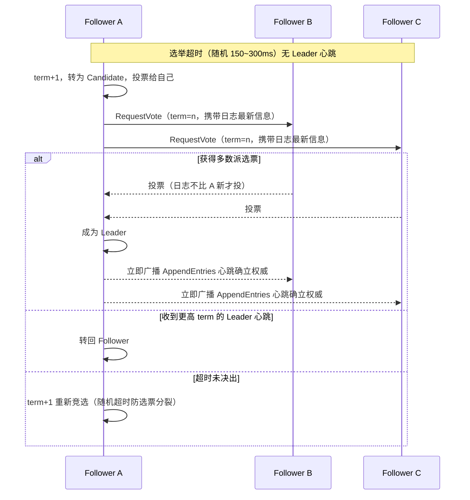
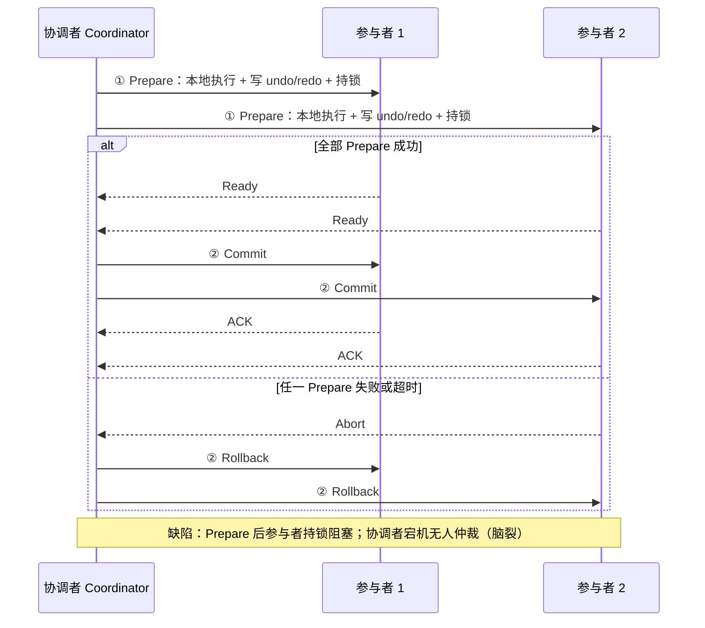
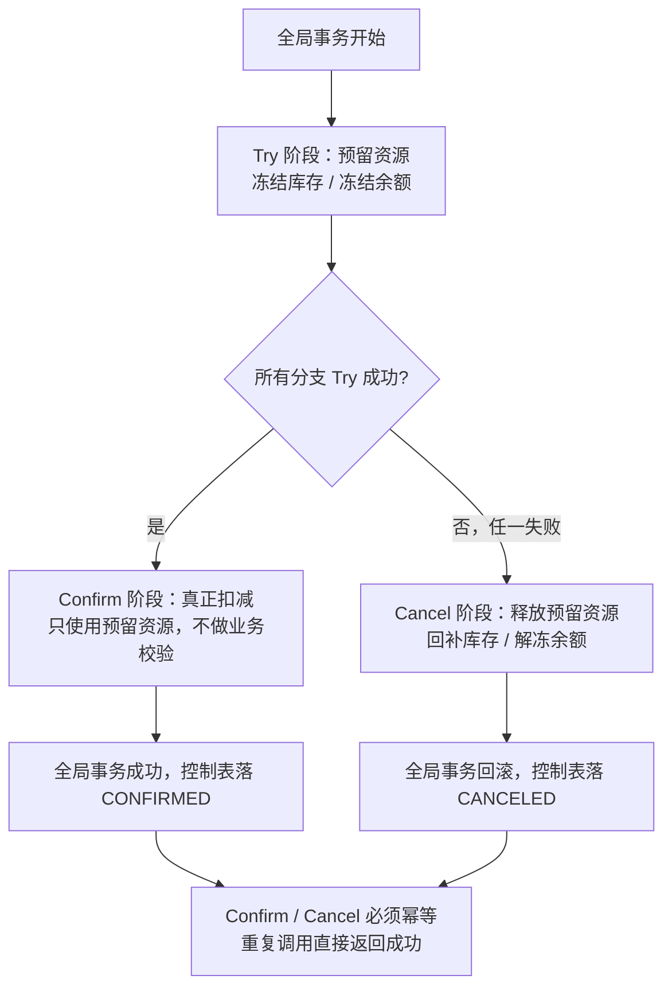
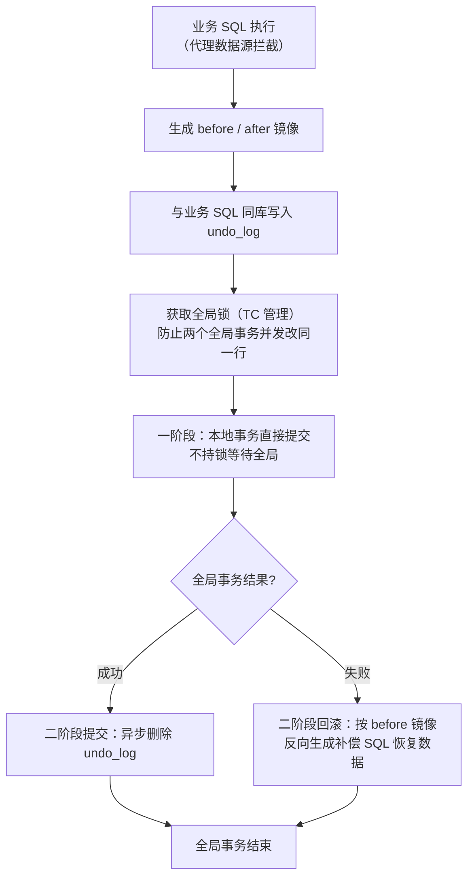
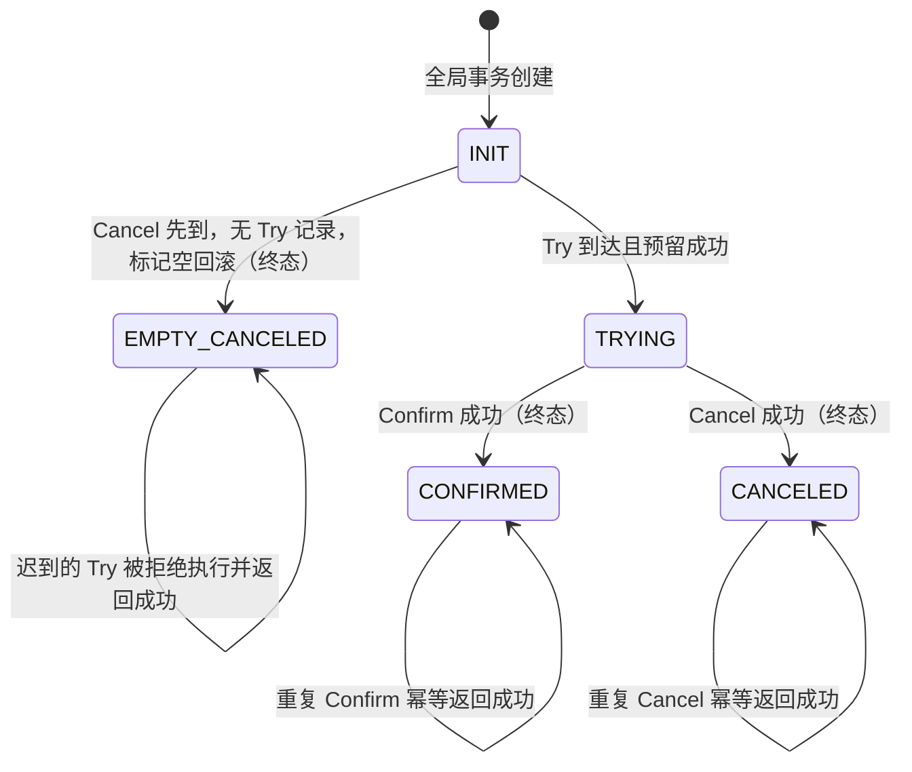
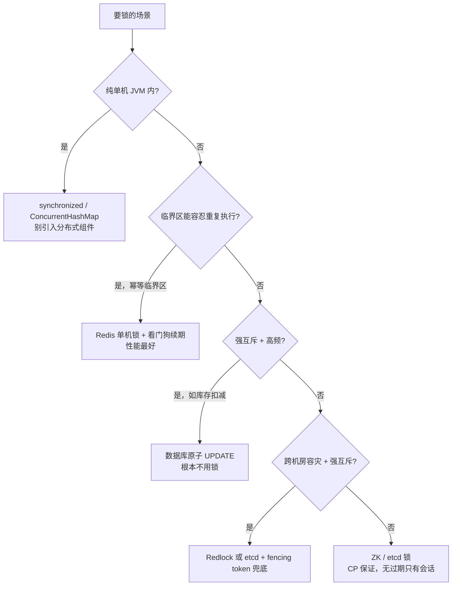

[⬅️ 上一章](15-spring-cloud-mybatis.md) · [📖 返回目录](README.md) · [➡️ 下一章](17-high-concurrency.md)
# 16 · 分布式理论基础与核心组件（资深向）

> 适用对象：10+ 年经验的资深工程师 / 架构师候选人。本章覆盖分布式系统最硬核的地基：CAP/BASE 与一致性模型、Raft 共识协议、分布式事务全景（2PC/TCC/SAGA/消息最终一致/Seata AT）、分布式锁、分布式 ID、幂等设计、分布式会话与 SSO。面试落点：不背定义，能讲清「为什么这么设计」「出了什么问题」「怎么权衡」——注册中心为什么选 AP、Raft 为什么比 Paxos 工程上更流行、TCC 的空回滚和悬挂怎么防、Redlock 到底有没有用。
> 🧭 初学者前置：建议先读 [00 章 §2.8](00-prerequisite.md)（HTTP 与 RPC），并至少了解 10 章 ZK 的基本使用；本章概念密度全书最高，遇到卡壳的概念先记下继续读，很多疑问会在后文展开。

> 💡 **这些问题从哪来？（问题演化链）**单机时代没有本章的大部分问题：一台 MySQL、一个进程，一致性天然成立。当业务量要求我们把数据复制到多台机器（高可用）或拆分到多台机器（扩展性）时，三件事随之而来：① **副本之间必然有同步延迟**——读到旧值怎么办？这引出一致性模型与 CAP（§1-2）；② **多机对「谁是主、某条写算不算成功」必须达成一致**——这引出共识协议 Raft（§3）；③ **一次业务操作跨多个服务/库**——本地事务管不到了，这引出分布式事务全家桶（§4）。锁、ID、幂等则是这三个根问题的具体衍生。带着这条链读，每个协议都是在回答上面某个问题，而不是孤立的知识点。

**📌 本章速览：核心要点**

1. CAP 的「三选二」是误导：P（分区，指网络把集群切成互相看不见的几块）是物理现实无法放弃，真正选择发生在「分区时保 C 还是保 A」；注册中心选 AP、配置中心选 CP、强一致存储选 CP，判断标准是「不一致的代价 vs 不可用的代价」；
2. 一致性是光谱不是开关：线性一致（像只有单机）> 顺序一致 > 因果一致 > 最终一致；Quorum 机制（读写各过半副本，鸽巢原理保证交集）用 R+W>N 时读写集合必有交集——这是多数派读写的数学根基；
3. Raft 用「强 Leader + 任期 + 日志多数派提交」把共识工程化（共识 = 多机对同一个值达成不可反悔的一致，是 §3 主角）：随机超时防活锁、选举限制保证 Leader 日志最新、只提交当前任期日志避免已提交日志被覆盖——理解这三条就理解了 Raft 的安全证明；
4. 分布式事务没有银弹：2PC 阻塞且脑裂，3PC 工程上没人用；TCC 靠「Try 预留 + 控制表防空回滚/悬挂 + Confirm/Cancel 幂等」；SAGA 靠可逆补偿；最终一致靠本地消息表/MQ 事务消息/Seata AT——选型看「强一致诉求 × 侵入成本 × 吞吐」；
5. 分布式锁、ID、幂等是「日常高频踩坑三件套」：Redis 锁要防「锁过期任务未完」「主从切换丢锁」，Redlock 有理论争议需要 fencing token 兜底；雪花算法要防时钟回拨；幂等靠「幂等键 + 唯一索引 + 状态机」三板斧。

---


### 📑 本章目录

- [1. CAP 定理与 BASE](#1-cap-定理与-base)
- [2. 一致性模型与 Quorum](#2-一致性模型与-quorum)
- [3. Raft 共识协议](#3-raft-共识协议)
- [4. 分布式事务全景](#4-分布式事务全景)
- [5. 分布式锁深度](#5-分布式锁深度)
- [6. 分布式 ID](#6-分布式-id)
- [7. 幂等设计](#7-幂等设计)
- [8. 分布式会话与 SSO](#8-分布式会话与-sso)
- [考点速查表](#考点速查表)

## 1. CAP 定理与 BASE


### 1.1 CAP 的正确打开方式

- **C（Consistency）**：线性一致——任何时刻读到的都是最近一次写入的结果，所有节点在同一时刻看到相同数据；
- **A（Availability）**：每个请求都能在有限时间内收到响应（不保证返回的是最新数据）；
- **P（Partition tolerance）**：网络分区（消息丢失、节点隔离）下系统仍能继续运行。

「三选二」是流传最广的误解。P 不是可选项——只要是多节点网络，分区必然发生（交换机故障、GC 长暂停、机房光缆被挖断）。所以真实命题是：

```text
无分区时：C 和 A 可以同时满足（单机 MySQL 就是 CA）
分区发生时：只能在 C 和 A 之间二选一
  ├─ CP：拒绝服务，保证一致 —— ZK、etcd、Consul、MySQL 主从+半同步
  └─ AP：继续服务，容忍不一致 —— Eureka、Cassandra、DynamoDB、DNS
```

- **CP 的代价**：分区时可用性归零（ZK 选主期间整个集群不可写），适合「错不起」的场景；
- **AP 的代价**：分区时读到旧数据或写丢失，适合「等得起」的场景（最终一致收敛）。

### 1.2 CAP 在三大组件中的落地

| 组件 | 选型 | 理由 |
|---|---|---|
| 注册中心 | AP（Eureka/Nacos AP 模式） | 注册信息短暂不一致可接受（客户端本地缓存兜底），服务「不可注册/不可发现」不可接受 |
| 配置中心 | CP（Nacos CP/ZK/etcd） | 配置错了全集群跟着错，宁可短暂不可读也不能读到错误配置 |
| 强一致存储 | CP（MySQL 半同步/ZK/etcd） | 金融、库存、订单等「错不起」的数据 |
| 弱一致存储 | AP（Cassandra 多区域） | 全球化部署，写可用性优先，读冲突靠 LWW/版本合并 |

面试升华：**选型不是背表，是回答「这个数据不一致的后果是什么、不可用的后果是什么」**。注册信息错了最多调用失败重试，配置错了可能全线故障，所以注册中心 AP、配置中心 CP。

### 1.3 BASE 与最终一致

- **BA（Basically Available）**：基本可用——允许降级（限流、返回兜底数据），而不是完全不可用；
- **S（Soft State）**：软状态——节点间数据可以不一致（中间态）；
- **E（Eventually Consistent）**：最终一致——在没有新写入的一段时间后，所有副本收敛到一致。

BASE 是 AP 派的工程哲学：用「可接受的短暂不一致」换「持续可用」。注意最终一致不是「随便乱一致」——要明确**收敛条件**（多久内收敛、以谁为准、冲突怎么解）。

### 本节高频面试题

**Q1：CAP 说三选二，为什么 MySQL 主从复制既有一致性又有可用性？**

解答：因为主从复制默认是**异步**的——从库落后主库时，读从库会读到旧数据，说明它已经牺牲了 C（不是线性一致）；如果开半同步复制（semi-sync，主库等至少一个从库 ack 才提交），则写路径的 C 变强，但主库不可达从库时写会被阻塞，A 下降。**「看似 CA」的分布式系统，要么是单点（真 CA），要么是悄悄放弃了强一致**。

面试官追问：注册中心 Eureka 分区时为什么还能工作？——答：Eureka 三件套：客户端本地缓存服务列表（服务发现不依赖 Server 在线）、心跳续约失败不主动剔除（自我保护模式，宁可保留可能已死的实例）、Peer 间异步复制。分区时客户端靠缓存继续调用，Server 各自为政，恢复后最终一致——这是教科书级 AP 设计。

**Q2：你们项目里有没有「以为自己是 CP 其实是 AP」的组件？**

解答：典型的：① Redis 主从 + 哨兵——主从异步复制，主挂瞬间未复制的写会丢（AP 倾向），但很多团队当 CP 用（存库存、存 token），这就是「用错一致性模型」的隐患；② 多机房部署的 MySQL 主主复制——冲突靠业务兜底；③ 本地缓存——每个实例一份数据，天然 AP。面试表达：**先给每个数据标注一致性等级（强一致/最终一致/允许过期），再选组件**，这是架构师的基本功。

面试官追问：怎么把 Redis 从「AP 错觉」救回来？——答：写路径用 WAIT 命令等从库 ack（牺牲延迟）、或写入后读主库（read-your-writes）、或干脆把强一致数据挪到 MySQL/ZK。工程上常见组合：Redis 存可容忍丢失的（验证码、热点缓存），强一致数据（余额、库存）进 DB。

---

## 2. 一致性模型与 Quorum

### 2.1 一致性模型光谱

| 模型 | 含义 | 直观理解 | 代表 |
|---|---|---|---|
| 线性一致（Linearizability） | 所有操作按真实时间顺序生效，读必见最近写 | 系统像单机一样 | etcd、ZK、单主数据库 |
| 顺序一致（Sequential） | 所有进程看到相同的操作顺序，但该顺序可与真实时间不一致 | 全局一个合法顺序，允许「迟到」 | 多主复制按同一顺序应用 |
| 因果一致（Causal） | 有因果关系的操作有序，无因果关系的可乱序 | 「我先发帖你再评论」必须有序 | COPS、部分多主方案 |
| 最终一致（Eventual） | 无新写后，副本经一段时间收敛 | 异步复制集群 | DNS、Cassandra、Redis 主从 |

- 面试关键：**线性一致是最强、代价最高**（所有读都要过 Leader 或 Quorum）；工程上大量系统只需要「读己之写」（read-your-writes）+「单调读」，这是比最终一致更强、比线性一致便宜的实用折中；
- 例子：用户改完昵称刷新还是旧值——违反了 read-your-writes，用户能感知；两个用户同时改同一条数据出现「A 的修改被 B 覆盖后又被恢复」——违反因果，用户也能感知。**一致性设计要对齐「用户可感知的异常」**。

### 2.2 Quorum 与鸽巢原理

- 模型：N 个副本，写至少 W 个成功才算成功，读至少 R 个，**R + W > N** 时读写集合必有交集——这就是鸽巢原理（N 个鸽巢、R+W 只鸽子，R+W>N 则必有至少一个巢被两只鸽子占据）；
- 交集里的那个节点持有最新版本 → 读操作能发现最新写入（配合版本号比较）；
- 特例：W=N（写全部）时 R=1 即可读——主从模式；W=1、R=N 时读全部——读修复模式；W=⌈N/2⌉+1、R=⌈N/2⌉+1——多数派模式（Raft 的日志提交就是 W=R=多数派）。

```text
N=3 副本
  W=2, R=2  (2+2>3)  ── 读写 quorum 必有交集 ── 强一致（多数派）
  W=1, R=3  (1+3>3)  ── 写一个、读全部 ── 也能强一致，但写快读慢
  W=1, R=1  (1+1<3)  ── 无交集 ── 可能读到旧值，最终一致
```

面试要点：**Quorum 给出的是「概率保证」还是「确定性保证」取决于版本机制**——光有交集不够，还要有版本号/时间戳判断哪个值新，否则交集里两个旧值你会选错。

### 本节高频面试题

**Q3：Raft 的日志复制为什么要求「多数派」而不是「全部」？**

解答：多数派（⌈N/2⌉+1）是「任意两个 quorum 必相交」的最小集合（鸽巢原理），这是安全性的数学根基：已提交的日志必然出现在任何后续 quorum 中，因此新 Leader 必然带着已提交日志。要求全部节点确认会牺牲可用性（一个节点挂掉就无法提交），少于多数派则可能两个 Leader 各自提交互相覆盖。**多数派 = 可用性与安全性的平衡点**。

面试官追问：N=5 的集群，提交需要几票？挂几个节点还能服务？——答：提交需 3 票（含 Leader 自己）；最多容忍挂 2 个。注意「3 票」是「3 个节点持久化日志」，不是「3 个节点 ack 应用」——Raft 里 commit 与 apply 分离。

**Q4：怎么跟业务解释「最终一致要多久」？**

解答：给量化承诺，不给模糊概念：① 收敛时间上限（如「30 秒内收敛」）；② 冲突解决策略（LWW 按时间戳、版本号、业务规则合并）；③ 用户可感知边界（如「订单创建后 1 分钟内能在列表查到」）。工程落地：监控副本延迟（主从延迟秒级告警）、对关键路径强制 read-your-writes（读主库或带版本游标）。**面试加分：最终一致要设计「对账任务」兜底，而不是祈祷网络没问题**。

面试官追问：对账任务本身怎么保证可靠？——答：对账是「定时 + 幂等」的：扫描时间窗口内两边记录做差集，差异生成补偿任务（重发消息/补写数据），补偿任务要幂等且带重试；对账频率要高于业务容忍的收敛时间（承诺 30 秒收敛，对账就得分钟级跑，且对账周期必须小于收敛承诺）。**要点：对账是最终一致的「最后防线」，频率和幂等决定它的有效性**。

---

## 3. Raft 共识协议

> 💡 初学者类比（Raft 在解决什么）：一群人开会要对「账本下一页记什么」达成一致——大家推举一位主持人（Leader），主持人逐条念、超过半数点头（多数派确认）才落笔；主持人失联时大家按工牌号最新者重新推举。所有分布式一致性系统的核心都是这套「过半同意才生效」的朴素逻辑。

### 3.1 角色与任期

- 三个角色：**Leader**（接收客户端请求、复制日志）、**Follower**（被动响应）、**Candidate**（选举发起者）；
- 任期（Term）：单调递增的整数，每次选举 +1；每个任期最多一个 Leader（可能没有——选举失败）；
- 心跳：Leader 周期性（默认 100ms 量级）广播 AppendEntries 心跳维持权威；Follower 超时未收到心跳（**随机 150~300ms**，论文推荐区间）即转为 Candidate 发起选举；
- 随机超时的意义：错开选举发起时间，避免所有 Follower 同时竞选导致选票分裂（活锁）。

### 3.2 Leader 选举

```text
Follower 选举超时 ──▶ Candidate：term+1，投票给自己，并行请求其他节点
     ├─ 获得多数派票 ──▶ 成为 Leader，立即发心跳确立权威
     ├─ 收到更高 term 的 Leader 心跳 ──▶ 转回 Follower
     └─ 超时未决出 ──▶ term 再 +1，重新竞选（随机超时防止无限分裂）
```

> 图示：Raft Leader 选举时序



- 投票规则：每个任期每节点一票；**Candidate 的日志必须「足够新」才给票**（先比 lastLogTerm，再比 lastLogIndex）——这是选举安全性第一道闸；
- 一个任期内最多一个 Leader 得票过半 → 任意两个多数派交集保证「新 Leader 拥有所有已提交日志」（Leader Completeness）。

### 3.3 日志复制与提交

1. 客户端写请求 → Leader 追加日志条目（term + index + 命令）→ 并行 AppendEntries 复制给所有 Follower；
2. 条目被**多数派持久化** → Leader 标记 commit → 应用到状态机 → 响应客户端；
3. Follower 落后时 Leader 通过 nextIndex 逐条回溯补日志；Follower 日志冲突时**删除冲突条目**并回退到与 Leader 一致的位置（以 Leader 日志为准，覆盖是安全的因为未提交）；
4. **关键安全约束：Leader 只能直接提交「当前任期」的日志条目**——之前任期的条目即使已复制到多数派，也要等当前任期有一个条目被提交后随之前向提交（commit index 推进时连带提交），否则可能提交了「后来被新 Leader 覆盖」的日志，违反 State Machine Safety。

### 3.4 与 Paxos / ZAB 对比

| 维度 | Paxos | Raft | ZAB |
|---|---|---|---|
| 设计目标 | 共识算法（学术正确性） | Paxos 的工程化简化，可理解性优先 | ZooKeeper 的原子广播协议 |
| Leader | Multi-Paxos 才有 Leader，选举复杂 | 强 Leader，选举规则清晰 | 强 Leader（FLE 快速选举） |
| 日志 | 无强制顺序约束，难实现 | 强制按 term+index 有序 | 按 zxid（epoch+counter）全序 |
| 选举限制 | 隐含在 prepare 阶段 | 显式「日志足够新」规则 | 数据新者优先 |
| 可理解性 | 出了名的难懂 | 教科书级清晰 | 与 Raft 类似但绑定 ZK 实现 |
| 工程落地 | Chubby 内部使用 | etcd/Consul/TiKV/Nacos CP | ZK 独有 |

面试结论：**Raft 没有比 Paxos 更强，但把 Paxos 的「活锁、多领导者、无日志顺序」等工程痛点显式解决了**；ZAB 与 Raft 是「同一思路的两套实现」，ZAB 先于 Raft（2011 vs 2014），都靠 Leader + 多数派 + 任期（epoch）。

### 本节高频面试题

**Q5：Raft 选举时，为什么「日志不够新的 Candidate」即使先发起选举也赢不了？**

解答：投票规则要求选民的日志不比 Candidate 新（lastLogTerm 大者新，同 term 下 index 大者新）。旧日志的 Candidate 拿不到多数派票（至少拿到票的节点日志不比它旧），而多数派中必然包含拥有最新已提交日志的节点，所以只有「日志最新到能覆盖多数派」的节点能当选。**这条规则保证了新 Leader 必然包含所有已提交日志，从而不会覆盖已提交的写入**。

面试官追问：Leader 提交了一条日志但还没复制到多数派就宕机了，这条日志会怎样？——答：未提交 → 新 Leader 可能覆盖它（Follower 收到冲突条目会删除再覆盖），客户端不会收到成功响应，所以对客户端而言「没提交 = 没发生」，这正是「提交才响应」的意义。

**Q6：Raft 和 ZAB 都能保证强一致，ZooKeeper 为什么还偶尔出现「读到旧数据」？**

解答：ZK 的读请求**默认走 Follower 本地读**，不经过 Leader 也不走 Quorum——这是「线性一致读写」与「顺序一致读」的差别：Follower 可能落后。要线性一致读必须 sync 或读 Leader。**这暴露了通用教训：共识协议保证的是「写入的顺序与提交」，读路径的一致性要单独设计**（etcd 默认也允许这种模式，需要的话开 serializable 读）。

面试官追问：ZK 的 sync 和读 Leader 有什么区别？——答：sync 是让 Follower 追上 Leader 的最新提交（把 Leader 的已提交日志同步过来再读），读 Leader 是直接读 Leader 内存状态；两者都能拿到「已提交的最新值」，但 sync 多一次网络往返、Leader 压力更大（所有读都打 Leader）。**要点：线性一致读的代价是「读也要过 Leader 或做同步」，ZK 默认用 Follower 本地读换性能，牺牲的就是线性一致**。

---

## 4. 分布式事务全景

### 4.1 2PC / 3PC：为什么教科书方案工程上没人用

**2PC（两阶段提交）**：协调者 Prepare（参与者本地执行、写 undo/redo、持锁）→ 全部成功则 Commit，任一失败则 Rollback。

> 图示：2PC 两阶段提交时序（成功与失败路径）



缺陷：
- **同步阻塞**：Prepare 后参与者一直持锁等待协调者最终指令，长事务拖死资源；
- **协调者单点**：协调者宕机，参与者永远等不到第二阶段的指令（只能靠超时猜测，可能猜错）；
- **脑裂**：协调者在发送 Commit 前宕机，部分参与者已提交、部分未提交，无人仲裁。

**3PC（三阶段提交）**：增加 CanCommit 预询 + 参与者超时自主决策（超时未收到指令默认 abort/commit），缓解阻塞。但工程上依然几乎没人用：多一轮 RTT、参与者自主决策在分区时仍可能不一致。**结论：强一致分布式事务的工程答案不是 3PC，而是「别跨库」或「最终一致」**。

### 4.2 TCC：Try / Confirm / Cancel

- **Try**：预留资源（冻结库存、冻结余额），不真正扣减；
- **Confirm**：确认执行（真正扣减），只使用 Try 预留的资源，不再做业务校验；
- **Cancel**：释放预留资源（回补库存、解冻余额）。

三大经典坑（资深必答）：

| 坑 | 场景 | 解法 |
|---|---|---|
| 空回滚 | Try 因网络超时未到达，Cancel 先到了 | 事务控制表记录 Try 状态，Cancel 发现无 Try 记录时标记「空回滚」并返回成功 |
| 悬挂 | Try 迟到（Cancel 已执行完毕才到达） | 控制表里已有 Cancel/空回滚记录，拒绝执行迟到的 Try |
| 幂等 | Confirm/Cancel 被重复调用（MQ 重投、超时重试） | 控制表 + 状态机：每个分支事务只允许 Try→Confirm 或 Try→Cancel 一次 |

工程要点：TCC 需要**事务控制表**（全局事务 ID + 分支 ID + 状态），Confirm/Cancel 必须幂等，Try 必须「可预留可释放」。侵入性强（每个资源都要实现三方法），但灵活——适合「强一致 + 高吞吐 + 资源可冻结」的场景（账户、库存、优惠券）。

> 图示：TCC 三阶段执行流程（含异常分支）



### 4.3 SAGA：长事务的补偿式方案

- 正向执行一串本地事务 T1→T2→T3，任一失败则反向执行补偿 C2→C1；
- **编排式（Orchestration）**：中央协调者（如 Seata Saga 状态机）串流程，易管控、易可视化；
- ** choreography（事件驱动）**：每个服务监听事件执行自己的事务并发布下一事件，无中心但流程隐晦、难排查；
- 补偿事务必须**可逆且幂等**（扣款→退款，发券→作废券）；**不可逆操作不能进 SAGA**（如发短信、调用外部不可撤销接口）。

适用：跨服务长链路、不要求即时一致、每步都是独立本地事务（订单→库存→积分→物流）。

### 4.4 本地消息表与 MQ 事务消息

**本地消息表**（经典可靠最终一致）：
1. 业务操作与「写消息表」在**同一个本地事务**提交；
2. 定时任务扫描未发送消息 → 发 MQ → 标记已发送（或等 MQ ack 后更新）；
3. 消费方**幂等消费**（唯一键去重）。

**MQ 事务消息**（RocketMQ 实现）：
1. 先发送 **half 消息**（对消费者不可见）；
2. 执行本地事务；
3. 提交/回滚 half 消息；本地事务无结果时 Broker 定时**回查**（check）生产者本地事务状态；
4. 消息最终被投递或删除——**本质是「本地消息表」思想搬进 Broker**，把「业务库表 + 定时任务」换成「Broker 半消息 + 回查」。

| 方案 | 优点 | 缺点 |
|---|---|---|
| 本地消息表 | 不依赖 MQ 特殊能力，任何 MQ 可用 | 业务库多一张表、定时任务扫描有延迟、消息表膨胀 |
| MQ 事务消息 | 无侵入业务库、回查可靠 | 仅 RocketMQ 支持、回查逻辑要写、broker 与业务强绑定 |
| SAGA | 无锁、长事务友好 | 补偿逻辑复杂、中间态对外可见 |
| TCC | 强一致、吞吐高 | 侵入强、三方法难写、空回滚/悬挂要防 |
| Seata AT | 无侵入（自动镜像） | 全局锁热点冲突、长事务性能差 |

### 4.5 Seata AT 模式原理

- **一阶段**：代理数据源拦截业务 SQL → 生成 before/after 镜像 → 与业务 SQL 同库写入 undo_log → **本地事务直接提交**（不用持锁等全局）；
- **二阶段提交**：异步删除 undo_log（全局事务成功）；
- **二阶段回滚**：根据 undo_log 的 before 镜像**反向生成补偿 SQL** 恢复数据；
- **写隔离**：本地事务提交前要获取**全局锁**（由 TC 管理），防止两个全局事务并发改同一行——这是 AT 模式的吞吐瓶颈（热点行冲突）；
- 读隔离：默认读未提交（脏读可能），可开 select for update 走全局锁。

> 图示：Seata AT 模式两阶段执行流程



选型结论：AT 无侵入但全局锁压吞吐，适合**低频全局事务**；TCC 适合**高频强一致**；SAGA 适合**长链路最终一致**；消息最终一致适合**可异步的解耦场景**——先问「这笔交易能不能最终一致」，再问「侵入成本谁扛」。

### 本节高频面试题

**Q7：TCC 的空回滚和悬挂到底怎么防？画一下控制表的状态流转。**

解答：事务控制表以「全局事务 ID + 分支 ID」为唯一键，状态机：`INIT →(Try)→ TRYING →(Confirm)→ CONFIRMED` 或 `TRYING →(Cancel)→ CANCELED`，另加 `EMPTY_CANCELED`（空回滚标记）。防空回滚：Cancel 到达时查无 Try 记录 → 写空回滚标记，返回成功；防悬挂：Try 迟到时发现已有 CANCELED/EMPTY_CANCELED → 拒绝执行并返回成功（不能报错，报错会导致 Cancel 重试死循环）。**核心思想：用一张表把「乱序到达的网络请求」变成「有序的状态机」**。

> 图示：TCC 事务控制表状态流转（防空回滚与悬挂）



面试官追问：Confirm 和 Cancel 幂等怎么做？——答：执行前查控制表状态，已是终态（CONFIRMED/CANCELED）直接返回成功；执行 SQL 本身也要幂等（如 `UPDATE account SET frozen = frozen - #{n} WHERE id = ? AND frozen >= #{n}`，影响行数为 0 视为已执行过）。只依赖「接口层面防重」不够，要落到数据层。

**Q8：你们库存扣减为什么不用 Seata AT？**

解答：库存是**热点行**——AT 的全局锁会让所有并发扣减串行化，吞吐崩掉；正确姿势：① 库存扣减本质是「单行原子操作」，用 `UPDATE stock SET stock = stock - #{n} WHERE id = ? AND stock >= #{n}` 就行，根本不需要分布式事务；② 跨服务场景（订单+库存）用「预扣 + 回补」或 MQ 最终一致，超时未支付自动释放；③ 真正需要 AT/TCC 的是「多资源强一致且低频」的场景。**面试升华：分布式事务是最后手段，先重构业务把事务边界缩小到单库单行**。

面试官追问：那订单服务和库存服务之间怎么保证「订单建了库存一定扣」？——答：用「预扣 + 最终一致」：订单创建成功（本地事务）→ 发 OrderCreated 事件 → 库存服务消费事件扣减（幂等）；库存不足时库存服务发 StockInsufficient 事件 → 订单服务自动取消订单。中间任何环节失败都由消息重试 + 对账任务兜底。**要点：跨服务的「强一致」用「订单状态机 + 事件 + 对账」表达，比分布式事务便宜一个数量级**。

---

## 5. 分布式锁深度

### 5.1 Redis 锁：从正确姿势到已知缺陷

正确姿势（必须原子 + 防误删）：

```java
// 加锁：SETNX + 过期时间原子完成
SET lock:order:1001 uuid-xxx NX PX 30000

// 释放：Lua 脚本原子地「校验持有者 + 删除」，防止误删别人的锁
if redis.call("get", KEYS[1]) == ARGV[1] then
    return redis.call("del", KEYS[1])
else
    return 0
end
```

已知缺陷（资深必答）：
- **锁过期而任务未完成**：持有者 GC 停顿/慢查询超过 PX 时间，锁自动释放，第二个线程拿到锁 → 两个「持有者」并发执行临界区。解法：续期（看门狗，如 Redisson watchdog 默认 30s 自动续期）、或临界区设计成幂等；
- **主从切换丢锁**：主节点异步复制，锁还没同步到从节点主就挂了，从节点升主后锁丢失 → 两个持有者。Redis 官方方案 Redlock 正是为此设计，但……

### 5.2 Redlock 争议（必考观点题）

- **Redlock 做法**：客户端向 N（通常 5）个独立 Redis 实例依次加锁，**多数派（≥3）成功且总耗时 < 锁有效期**才算拿到锁；释放时向所有实例发删除；
- **Kleppmann 的批评**（《How to do distributed locking》）：① **GC 暂停**：客户端加锁后 STW，锁过期，另一个客户端拿到锁——Redlock 对此无能为力，因为「锁有效期」与「临界区真实执行时间」无法绑定；② **时钟漂移**：依赖机器时钟判断「锁获取耗时」，时钟跳跃直接破坏；③ 建议用 **fencing token**（锁服务颁发单调递增令牌，写数据时带令牌，旧令牌的写被拒绝）——但 Redlock 的 token 无法保证单调；
- **antirez 的回应**：Redlock 的假设是「没有 GC 长暂停、时钟正常」，且锁用于「偶发互斥」而非「每次写都靠它」；两者其实在讨论不同强度的保证。

面试结论（安全姿势）：**Redlock 不是强一致锁，不能单独为「金钱类」互斥背书**；工程上：① 临界区幂等 + 数据库乐观锁兜底（fencing 思想：`UPDATE ... SET version = version+1 WHERE version = #{v}`）；② 对「锁丢失会导致资损」的场景用 ZK/etcd 锁或数据库行锁；③ 对「锁丢失只是多执行一次幂等操作」的场景，单机 Redis 锁 + 看门狗够用。

### 5.3 ZK 临时顺序节点锁 vs DB 锁

**ZK 锁**（公平锁，CP 保证）：
1. 在 `/locks/xxx` 下创建**临时顺序节点**；
2. 判断自己是否序号最小——是则拿到锁；否则**监听前一个节点**（只监听前驱，避免「羊群效应」）；
3. 前驱删除（释放或会话超时）→ 唤醒 → 再次判断；
4. **临时节点 + 会话**：客户端崩溃，会话关闭，节点自动删除，锁自动释放——没有「锁过期」问题；
5. 坑：客户端 GC 停顿导致会话超时，ZK 删节点，**锁被误释放**（另一个客户端拿到锁，原持有者还在跑）——与 Redis 锁过期是同类问题，只是触发源不同；且 ZK 写路径是 Leader 单点，加锁 QPS 上限约几千。

**DB 锁**：
- 悲观：`SELECT ... FOR UPDATE`（行锁 + 事务，可靠但占连接、性能差）；
- 乐观：版本号/条件更新（`WHERE version = ?`，无锁但冲突重试）；
- 唯一索引：`INSERT INTO lock_table(lock_key) VALUES(?)` 成功即获锁，删除即释放（简单可靠，但要防「持有者宕机锁不释放」，需带过期时间的清理任务）。

### 5.4 选型决策树

```text
要锁的场景
 ├─ 能容忍「多执行一次」（幂等临界区）──▶ Redis 单机锁 + 看门狗续期（性能最好）
 ├─ 强互斥 + 偶发（低频敏感操作）──▶ ZK/etcd 锁（CP，无过期只有会话）
 ├─ 强互斥 + 高频（库存扣减）──▶ 数据库原子 UPDATE（根本不用锁）
 ├─ 跨机房容灾 + 强互斥──▶ Redlock 或 etcd + fencing token 兜底
 └─ 纯单机 JVM 内──▶ synchronized / ConcurrentHashMap 就够了，别引入分布式组件
```

> 图示：分布式锁选型决策树



### 本节高频面试题

**Q9：Redis 分布式锁的「锁过期」问题，看门狗续期能根治吗？**

解答：不能根治，只能缩小窗口。看门狗（Redisson 默认）每 1/3 有效期续期一次，只要持有者线程活着锁就不过期；但 **GC 长暂停时看门狗也停**，锁照样过期，另一个客户端拿到锁。根治只有两条路：① 临界区幂等（重复执行无害）；② fencing——写数据时校验「锁令牌」是否仍然有效（如数据库版本号、Redis 里存锁持有者的递增 token）。面试标准答案：**分布式锁只能保证「大概率互斥」，真正的安全要靠业务幂等和数据库兜底**。

面试官追问：Redlock 需要几个实例、什么条件算拿到？——答：N=5，需 ≥3 个实例加锁成功，且「总耗时 < 锁有效期」；释放时向全部 5 个实例发删除（包括没加锁成功的）。

**Q10：ZK 锁为什么只监听前一个节点？**

解答：监听全部节点（羊群效应）时，锁释放会唤醒所有等待者，全部去抢锁，只有一个成功，其余重新等待——产生 N 次无谓唤醒和 ZK 瞬时写放大。只监听前驱：**锁释放只唤醒排在自己前面的那个节点**，唤醒链是 O(1) 的，且因为是顺序节点天然公平（FIFO）。**面试升华：分布式锁设计要同时考虑「正确性」和「惊群」，监听范围越小越好**。

面试官追问：ZK 锁和 etcd 锁怎么选？——答：两者都是 CP 且都支持临时/租约节点 + Watch，能力几乎等价；选型看运维与生态：团队已有 ZK（大数据生态）就用 ZK，已有 etcd（K8s 生态）就用 etcd。**要点：锁服务的选型往往被「集群已经有什么」决定，而不是锁功能本身**。

---

## 6. 分布式 ID

### 6.1 需求与方案全景

| 方案 | 特点 | 适用 |
|---|---|---|
| UUID（36 字符/32 hex） | 本地生成零依赖、全球唯一；**无序**（B+Tree 索引页分裂、缓存命中差）、长 | 日志、消息 ID、非索引场景 |
| 雪花算法（Snowflake） | 64 位 long、**趋势递增**、高性能（本地生成） | 订单号、业务主键首选 |
| 号段模式（Leaf-segment） | DB 批量取号段，双 buffer 无间隙；可回退、可观测 | 订单、流水（美团 Leaf 主力） |
| Redis INCR/INCRBY | 简单、可带业务前缀；依赖 Redis 可用性 | 短 ID、活动编号 |
| UUID 变体（NanoID） | 更短更安全 | 短链、前端 ID |

### 6.2 雪花算法源码要点（必考）

```text
64 位 long 布局：
 0 | 41 bit 时间戳(毫秒) | 10 bit 机器 ID | 12 bit 序列号
符号位   ≈69 年(自定义纪元起)   最多 1024 台      每毫秒 4096 个
```

- 生成：`((timestamp - epoch) << 22) | (workerId << 12) | sequence`；
- 序列号：同毫秒内递增，溢出则**自旋等待下一毫秒**（`while (ts <= lastTs) ts = timeGen()`）；
- **时钟回拨**（NTP 校时/运维改时间）是最大敌人：回拨后时间戳倒退会生成重复 ID。常见处理：① 回拨小（< 阈值如 5ms）自旋等待追平；② 回拨大直接抛异常/拒绝服务；③ 用「备用时钟」或扩展位（把 10 bit 机器位拆出「回拨容忍位」）；④ 美团 Leaf-snowflake 用 ZK 注册 workerId + 本地文件记录上次时间戳，启动时校验时钟；
- 机器 ID 分配：ZK 临时顺序节点注册/手动配置/DB 分配；
- 趋势递增 ≠ 严格递增：跨机器、跨毫秒乱序，**不能直接当排序字段用**（要用的话加时间列或让 DB 端生成）。

### 6.3 美团 Leaf：号段模式与 leaf-snowflake

- **Leaf-segment**：DB 里每张业务表一条记录维护 `max_id`，每次取一批（如 step=1000）→ `UPDATE leaf_alloc SET max_id = max_id + step` 拿到号段 → 内存分发。**双 buffer**（两个号段交替，一个用尽前异步加载下一个）消除「取号段间隙」的尖刺；DB 挂了还能撑一段（号段未耗尽）；缺点是**号段可能丢失**（DB 回滚/重启未持久化已发 ID → 用「双 buffer + 落库水位」缓解，但严格场景会断号）；
- **Leaf-snowflake**：雪花 + ZK 管 workerId + 时钟回拨检查；
- 面试记忆点：**号段模式 = 用「批量预取」换「DB 访问量」，双 buffer = 用「空间」换「延迟尖刺」**——这是所有「取号」类系统的通用套路。

### 本节高频面试题

**Q11：订单号为什么不用 UUID？如果必须用 UUID 当主键怎么办？**

解答：UUID 无序 → InnoDB 聚簇索引按主键顺序组织，随机插入导致页分裂、写放大、缓存命中率低（插入位置随机，B+Tree 频繁 rebalance）。必须用：① 转成有序 UUID 变体（如 UUIDv7 带时间戳前缀）；② 用 UUID 当**业务唯一键**（加唯一索引），主键仍用自增/雪花（但多一个索引就多一份空间和写入成本）；③ 或用二进制存储（16 字节）而非字符串。**面试加分：区分「主键」和「业务键」，UUID 适合当业务键，不适合当聚簇主键**。

面试官追问：雪花算法 1024 台机器不够用怎么办？——答：① 调整位分配（业务场景可压缩机器位扩序列位，如 8 bit 机器 + 14 bit 序列）；② 多机房时把机器 ID 拆成「机房 ID + 机器 ID」复用位数；③ 换号段模式（Leaf-segment 不受机器数限制）。位数分配是设计权衡，不是定死的。

**Q12：Leaf 号段模式的 DB 是单点吗？怎么高可用？**

解答：号段表可以做成**双 DB 主备/多副本**（一主一备，主挂了备接管）；更强的是**双写多套号段表 + 路由**（如美团按业务分表分库）；而且因为「一次取 1000 个号」DB 访问频率极低（每 1000 个 ID 才一次），DB 压力小，双 buffer 又消除了取号间隙，所以号段模式天然抗压。**对比：Redis INCR 方案每次生成都打 Redis，QPS 受限于 Redis 单实例（约 10 万级）且 Redis 挂了 ID 服务直接不可用**。

面试官追问：号段模式会「断号」吗？业务能接受吗？——答：会：DB 回滚、重启丢失已分配未落库的号段都会造成空洞（发了 1~500、重启后从 501 继续，中间没发出去的就是断号）；「连续性」和「性能/高可用」不可兼得——订单号这类「只要求唯一 + 趋势递增」的业务能接受断号，发票号这类「要求连续」的业务不能用量产号段方案（要单点发号或接受性能代价）。**要点：先问业务「连续」还是「唯一」，再选 ID 方案**。

---

## 7. 幂等设计

### 7.1 幂等的本质与三板斧

幂等 = **同一请求执行多次与执行一次效果相同**。分布式环境下「请求可能重试、消息可能重投、用户可能狂点」，幂等是最终一致方案的命门。

三板斧（组合使用）：

| 手段 | 原理 | 适用 |
|---|---|---|
| 幂等键（Idempotency-Key） | 客户端生成唯一请求 ID（UUID），服务端按「请求 ID + 业务类型」去重 | 对外 API、支付回调 |
| 去重表 / 唯一索引 | 业务单据号/流水号建唯一索引，插入冲突即已处理 | 消息消费、回调处理 |
| 状态机幂等 | 只允许合法状态流转（如 待支付→已支付→已退款），非法流转直接拒绝 | 订单、支付、审批流 |

### 7.2 接口层落地方案

- **预生成 Token 防重复提交**：进入表单页先取 token（Redis SETNX），提交时携带 token，服务端「校验 + 删除」原子完成（Lua），删除成功才执行——防「双击下单」；
- **数据库乐观锁**：`UPDATE order SET status = 1, version = version + 1 WHERE id = ? AND status = 0`——影响行数为 0 说明已被处理，天然幂等；
- **MQ 消费幂等**：消费端按消息唯一键（业务主键/消息 ID）查重（唯一索引或 Redis SETNX）后再执行，**消息重投不重处理**；
- **回调幂等**：支付回调可能来多次（微信/支付宝都会重试），按「支付单号」去重 + 状态机校验（已支付则直接返回成功）；
- 注意坑：① 查重与执行必须原子（先查后插有竞态，要唯一索引兜底）；② 幂等键要带「业务维度」前缀（同 key 不同业务会误伤）；③ 幂等返回的结果要一致（第一次成功返回 200，重复请求也应返回成功结果而非报错，前端才好处理）。

### 本节高频面试题

**Q13：MQ 消息消费「先查重再消费」为什么还会重复执行？**

解答：查重与消费不是原子的——两个消费者同时拿到同一条消息（重复投递/集群并发消费），都查到「未处理」然后都执行。解法：① 数据库**唯一索引**兜底（插入冲突即重复，这是最可靠的）；② Redis SETNX 抢「处理锁」，但 SETNX 与业务执行之间仍非原子，Redis 锁过期后仍可能重复；③ 最稳组合：**唯一索引 + 状态机**——重复消息执行「状态不合法直接忽略」，把「重复执行」变成「无害执行」。面试要点：**凡是「先查后做」都要问一句：并发到达时还成立吗？**

面试官追问：业务方要求「同一笔订单的退款请求，重复调用只退一次」，你怎么设计？——答：退款单以「原订单号 + 退款原因 + 金额摘要」生成唯一退款请求号，退款表唯一索引兜底；退款执行走状态机（申请中→处理中→成功/失败），重复请求命中已成功直接返回原结果；资金侧再叠加数据库条件更新（`UPDATE ... SET status='SUCCESS' WHERE id=? AND status IN ('申请中','处理中')`）双保险。

**Q14：状态机幂等和幂等键方案什么场景下选哪个？**

解答：状态机幂等适合**状态明确、流转有限**的业务（订单/支付），它把幂等建模成「状态迁移合法性」，天然防重复也防乱序（旧的回调不能把已退款订单改回已支付）；幂等键适合**无状态、纯动作型**接口（发短信、创建工单）——没有状态可查，只能靠请求键去重。**资深视角：优先用状态机（业务语义强），幂等键是状态机覆盖不到时的补充**。

面试官追问：幂等键过期了怎么办？——答：幂等键一般带 TTL（如 24 小时），过期后同一请求再发会被当成新请求——所以幂等键的 TTL 要大于「用户可能重试的最长窗口」（如支付回调按天级），且对金额敏感的操作幂等键 TTL 要更长或落到 DB 持久化去重表。**要点：幂等保护的时效要覆盖重试窗口，Redis TTL 到期即失效是常见隐患**。

---

## 8. 分布式会话与 SSO

### 8.1 会话方案演进

| 方案 | 原理 | 问题 |
|---|---|---|
| Session 同步 | 节点间广播复制 Session | 网络风暴、节点多了不可行 |
| 粘滞会话（Sticky） | 负载均衡按 Session 哈希固定节点 | 节点宕机会话丢失、扩容/缩容影响大、负载不均 |
| 集中式 Session | Session 存 Redis，所有节点共享 | Redis 挂了全员掉线（要 HA）；Session 要可序列化；每次请求一次 Redis（可本地缓存优化） |
| Token + JWT | 无状态，服务端不存 Session，验签即可 | 无法主动失效、payload 泄漏风险、续期要设计 |

演进结论：**现代微服务标配「无状态 + Token」**——应用节点可以随意扩缩容、重启不丢会话，代价是「登出/踢人」这类主动失效能力变难。

### 8.2 JWT 要点（必考）

- 结构：`Header.Payload.Signature`，Header（算法 typ/alg）、Payload（claims：sub/exp/iat/iss），Signature = 签名（HS256 对称共享密钥 / RS256 非对称私钥签公钥验）；
- 优点：无状态、跨语言、天然防篡改；
- 坑：① **无法主动失效**——登出后 token 仍有效，解法：黑名单（Redis 存登出 token 至过期）/ 短 TTL + Refresh Token 双 token 机制；② payload 是 base64 **明文**，不能放敏感信息；③ 密钥泄露 = 全线伪造，HS256 要妥善保管共享密钥（RS256 可公钥验签、私钥只在签发方）；④ token 体积大，放 Header 有 8KB 上限风险（网关/浏览器）；⑤ 时钟偏差（exp 校验要容忍 ±30s 量级）。

### 8.3 SSO：CAS 与 OAuth2

**SSO（单点登录）**：一次登录，多个系统免登录——解决「身份认证共享」。经典实现 **CAS（Central Authentication Service）**：

```text
用户访问业务系统A（无 ticket）
  └─▶ 302 重定向到 CAS 登录页（带 service=A 的回调地址）
       ├─ 用户登录 → CAS 生成 TGT（全局票据，存 CAS 端）和 ST（一次性 service ticket）
       ├─ 302 带 ST 回业务系统A → A 拿着 ST 回调 CAS 校验（ST 只能用一次）
       └─ 校验通过 → A 建立本地会话；用户再访问系统B → 带 TGT 的 Cookie → CAS 直接发新 ST → B 免登录
```

- 关键设计：TGT（Ticket Granting Ticket）存在 CAS 端（或 SSO Cookie），**各业务系统不共享会话，只共享「认证结果」**；ST 一次性、有时效、防重放；
- 登出：CAS 通知所有已接入系统（单点登出 SLO）。

**OAuth2**：解决的是「授权」——用户授权第三方应用访问自己的资源（GitHub 登录、微信登录）。核心四角色：资源所有者（用户）、客户端（第三方 App）、授权服务器、资源服务器。主流**授权码模式**：

```text
第三方App → 302 到授权服务器（带 client_id + redirect_uri + scope）
用户登录并授权 → 授权服务器带 code 回跳 redirect_uri
App 用 code + client_secret 换 access_token（code 一次性、有时效）
App 带 access_token 访问资源服务器
```

**SSO vs OAuth2 辨析**（高频追问）：
- SSO 解决「**我是谁**」（认证，Authentication）——企业内部多系统共享登录态；
- OAuth2 解决「**允许你访问我的什么**」（授权，Authorization）——第三方应用访问用户资源；
- 现实中常组合：企业用「OAuth2 授权码 + 统一认证中心」实现 SSO（如微信扫码登录 = 微信的 OAuth2 授权 + 各系统共享登录态），但**概念上不要混为一谈**。

### 本节高频面试题

**Q15：JWT 无状态那么好，为什么还要 Redis 黑名单？这不又变有状态了吗？**

解答：这是「无状态优先、有状态兜底」的务实混合。JWT 默认无状态，登出只是客户端丢弃 token，服务端无法阻止 token 在有效期内被继续使用（被盗 token 也无法吊销）。对「登出立即失效」「踢人下线」「改密码后旧 token 失效」这类强安全诉求，只能在 Redis 维护黑名单（token jti 或用户维度版本号），验签后查黑名单。**面试升华：无状态是默认值，安全诉求会迫使你为「吊销能力」付出有状态成本——设计时要提前想清楚「token 需不需要吊销」**。

面试官追问：双 token（access + refresh）机制解决什么问题？——答：access token 短 TTL（如 15 分钟）降低被盗窗口，refresh token 长 TTL（如 7 天）用于静默续期，减少用户频繁登录；refresh token 可以做成可吊销的（存 Redis/DB），实现「登出即失效」；安全细节：refresh token 要走更安全的存储（HttpOnly Cookie），且轮换（每次刷新发新 refresh、旧作废）防重放。

**Q16：你们公司多个系统做 SSO，为什么不用「Session 同步」？**

解答：Session 同步在系统数 2~3 个、单机房时勉强可用，但：① 同步是广播式，系统多了网络与内存开销爆炸；② 各系统 Session 结构不同，同步的是「谁的会话」说不清；③ 跨域 Cookie 问题（a.com 和 b.com 无法共享 Cookie）；④ 强耦合，加一个新系统要改所有老系统。CAS 方案把「认证」收敛到单一认证中心，业务系统只做「校验 ticket」，加系统只接 CAS 即可——**本质是「认证能力的集中化」，与微服务「注册中心」是同一个架构思想：把横切能力抽成独立组件**。

面试官追问：CAS 的 ST 为什么只能用一次？——答：ST（Service Ticket）是「业务系统向 CAS 证明『用户刚在 CAS 登录过』」的一次性凭证：用一次即作废、短时效（如 5 分钟），防止重放攻击（截获 ticket 冒充用户）；TGT 才是长期凭证（存在 CAS 端 + SSO Cookie）。**要点：一次性票据 + 短时效 = 防重放，这是所有 ticket 类协议（CAS/OAuth2 code）的共同设计**。

---

## 考点速查表

| 考点 | 一句话要点 |
|---|---|
| CAP 正确理解 | P 不可放弃，分区时 C/A 二选一；注册中心 AP、配置中心 CP |
| BASE | 基本可用 + 软状态 + 最终一致；用短暂不一致换持续可用 |
| 一致性光谱 | 线性 > 顺序 > 因果 > 最终；对齐「用户可感知的异常」选模型 |
| Quorum | R+W>N 鸽巢原理保证读写交集；多数派 = 安全性与可用性的平衡 |
| Raft 角色任期 | Leader/Follower/Candidate；term 单调递增；随机超时防选票分裂 |
| Raft 选举限制 | Candidate 日志必须足够新；保证新 Leader 含全部已提交日志 |
| Raft 提交规则 | 只直接提交当前任期日志；旧任期日志随当前任期前向提交 |
| Raft vs Paxos/ZAB | Paxos 学术正确、Raft 工程可理解、ZAB 是 ZK 的原子广播（zxid 全序） |
| 2PC 缺陷 | 同步阻塞、协调者单点、脑裂；3PC 缓解阻塞但工程无人用 |
| TCC 三坑 | 空回滚/悬挂靠事务控制表状态机；Confirm/Cancel 必须幂等 |
| SAGA | 正向事务 + 可逆补偿；编排式 vs 事件驱动；不可逆操作禁入 |
| 本地消息表 | 业务与消息同库同事务 + 定时扫表发 MQ + 消费幂等 |
| MQ 事务消息 | half 消息 + 本地事务 + 回查；本质是消息表思想搬进 Broker |
| Seata AT | 一阶段本地提交 + undo_log 镜像；二阶段删日志或反向补偿；全局锁是吞吐瓶颈 |
| 事务选型 | 单行原子操作优先；TCC 高频强一致、SAGA 长链路最终一致、AT 低频无侵入 |
| Redis 锁 | SET NX PX 原子加锁；Lua 校验持有者再删；看门狗续期防锁过期 |
| Redlock | 5 实例多数派；GC/时钟问题下非强一致；fencing token 兜底 |
| ZK 锁 | 临时顺序节点 + 只监听前驱防羊群；会话超时误删锁是坑 |
| 锁选型 | 幂等临界区用 Redis；强互斥低频用 ZK；库存类用 DB 原子 UPDATE |
| 雪花算法 | 41 位毫秒时间戳 + 10 位机器 + 12 位序列；防时钟回拨是核心 |
| 号段模式 | DB 批量取号 + 双 buffer 消尖刺；Leaf-segment 与 leaf-snowflake |
| ID 选型 | UUID 无序伤索引（当业务键）；雪花趋势递增；号段可观测可回退 |
| 幂等三板斧 | 幂等键 + 唯一索引 + 状态机；「先查后做」必有并发竞态要兜底 |
| Token 防重 | 预发 token + Redis 校验删除原子化；防双击下单 |
| 会话演进 | 同步→粘滞→集中式 Redis→无状态 Token；无状态换「无法主动失效」 |
| JWT | Header.Payload.Signature；HS256/RS256；黑名单 + 双 token 补吊销能力 |
| SSO/CAS | TGT + 一次性 ST；认证集中化，业务系统只校验 ticket |
| OAuth2 vs SSO | OAuth2 是授权（第三方访问资源），SSO 是认证（登录态共享） |

---

[⬅️ 上一章](15-spring-cloud-mybatis.md) · [📖 返回目录](README.md) · [➡️ 下一章](17-high-concurrency.md)
