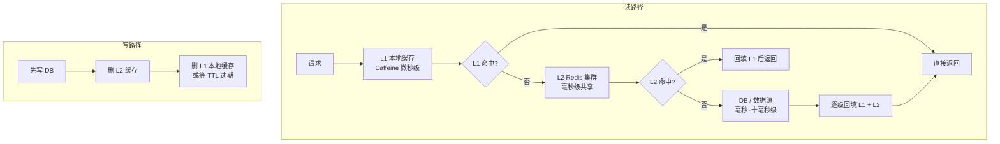
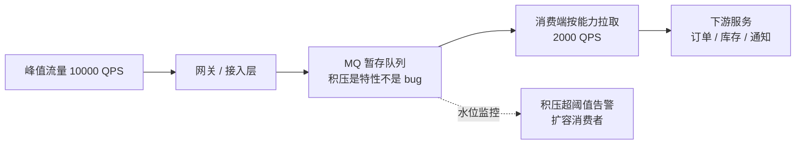
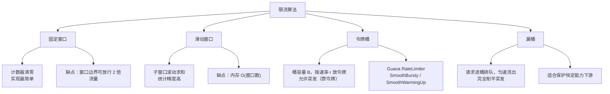
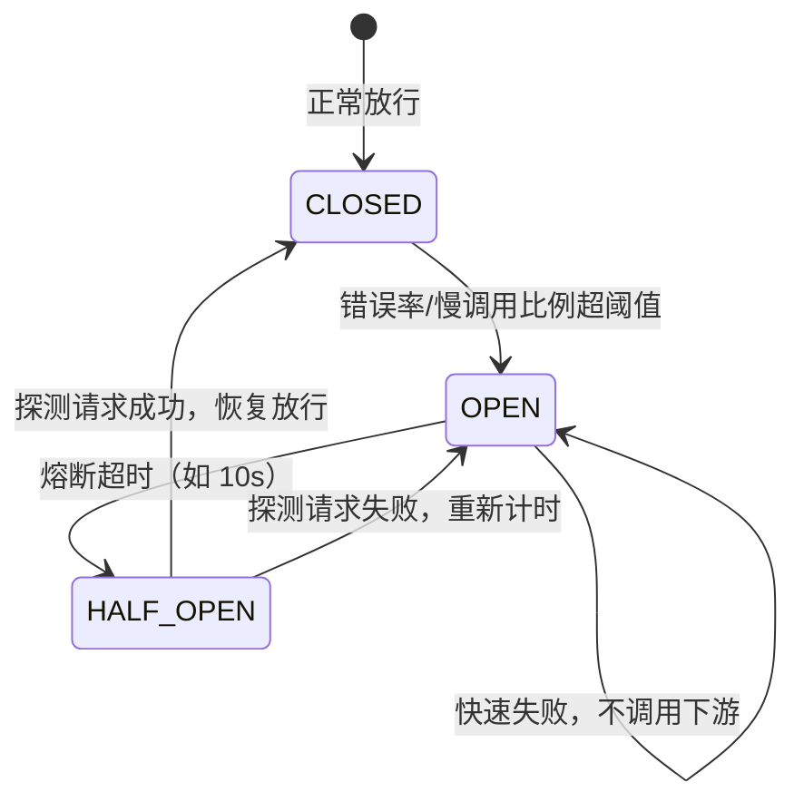
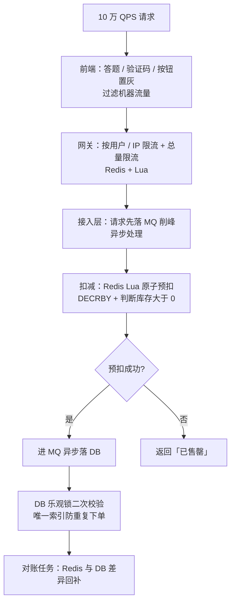

[📖 返回目录](README.md) · [⬅️ 上一章](16-distributed-basics.md) · [➡️ 下一章](18-system-design-methodology.md)

# 17 · 高并发系统设计（资深向）

> 适用对象：10+ 年经验的资深工程师 / 架构师候选人。本章覆盖高并发系统的完整武器库：设计总纲（性能/可用/扩展）、多级缓存与一致性、异步化与削峰、限流算法与落地、熔断降级隔离、池化与连接管理、弹性扩容与全链路压测、经典高并发问题（热点/超卖/库存/排行榜/计数器）。面试落点：不只背算法，要能讲清「缓存一致性为什么难」「限流选令牌桶还是漏桶」「库存扣减为什么不能只靠 Redis」「全链路压测怎么不炸生产」。

**TL;DR 本章学习要点**

1. 高并发三目标：性能（RT/P99）、可用（SLA）、扩展（水平扩容能力）——设计顺序是「先无状态化，再分层，再缓存/异步/削峰」；无状态化是一切扩展性的前提；
2. 缓存一致性没有银弹：Cache Aside 是默认选择，「先更新 DB 再删缓存」+ 延迟双删/消息补偿是工程标配；穿透/击穿/雪崩三个坑各有标准解法；
3. 异步化的本质是「把峰值流量变成平均流量」：MQ 削峰 + 消费端按能力拉取；但「响应必须实时」「事务必须同步」的场景不能盲目异步；
4. 限流四算法要能画图对比：固定窗口有临界突变、滑动窗口吃内存、令牌桶允许突发、漏桶削平突发；分布式限流必须 Redis+Lua 原子执行，Sentinel 用滑动窗口统计；
5. 高并发经典题全是「单点资源的并发控制」：库存=原子 UPDATE 条件扣减、超卖=乐观锁、排行榜=ZSET、计数器=INCR+分片——先想清楚「资源在哪儿、谁持有最新状态」。

---


### 📑 本章目录

- [1. 高并发设计总纲](#1-高并发设计总纲)
- [2. 缓存设计](#2-缓存设计)
- [3. 异步化与削峰](#3-异步化与削峰)
- [4. 限流](#4-限流)
- [5. 熔断降级与隔离](#5-熔断降级与隔离)
- [6. 池化与连接管理](#6-池化与连接管理)
- [7. 弹性扩容与压测](#7-弹性扩容与压测)
- [8. 高并发经典问题清单](#8-高并发经典问题清单)
- [考点速查表](#考点速查表)

## 1. 高并发设计总纲


### 1.1 三个目标与度量

| 目标 | 度量 | 设计含义 |
|---|---|---|
| 性能 | RT（平均/TP99）、QPS、吞吐 | 单请求快 → 单机容量大 → 机器数少 |
| 可用 | SLA（99.9%/99.99%）、错误率 | 冗余 + 故障转移 + 限流降级兜底 |
| 扩展 | 水平扩容后 QPS 是否线性增长 | 无状态化 + 数据分片 + 无共享架构 |

- 面试常问「TP99 和平均 RT 谁重要」：平均 RT 被长尾拖累失真，**TP99/TP999 才是用户体验**（P99 慢 = 1% 用户明显卡顿）；监控要同时看 TP99 与 TP999 的差距（差距大 = 长尾严重，多半是 GC、锁竞争、网络抖动）；
- 吞吐与 RT 的关系（Little's Law）：`并发数 = QPS × RT`——系统能支撑的并发数由 QPS 与 RT 乘积决定，**降 RT 和提 QPS 是同一件事的两面**；
- 设计顺序：**无状态化 → 分层（接入/网关/应用/缓存/存储）→ 逐层治理（限流/熔断/降级）→ 数据层分片**。先解决「能不能扩」，再解决「快不快」。

### 1.2 无状态化：扩展性的地基

- 应用节点不保存用户会话/本地状态（Session 外置到 Redis、配置外置到配置中心、本地缓存只放可重建数据）→ 任意节点可处理任意请求 → 水平扩容、滚动发布、故障剔除都变简单；
- 有状态的部分（数据）下沉到「存储层」统一管理，存储层用分片/副本解决扩展与高可用；
- 代价：一次请求多一次网络跳转（Session 读 Redis），用「本地缓存 + 版本号/失效通知」缓解读放大。

### 本节高频面试题

**Q1：为什么说「无状态化」是高并发设计的第一步？举个反例。**

解答：反例是 Sticky Session 架构——Session 存在节点内存，负载均衡按哈希把同一用户固定到同一节点。问题：① 节点宕机该节点所有用户会话丢失；② 扩容缩容会打乱哈希，大量用户被踢下线；③ 热点用户集中到某节点导致负载不均。改成 Session 存 Redis 后：任何节点都能处理任何请求，扩容 = 加机器，故障 = 摘机器，QPS 随机器数线性增长。**面试升华：先问「状态在哪」，再谈性能优化——有状态的应用优化得再好也扩不出去**。

面试官追问：无状态化后 Redis 成了瓶颈怎么办？——答：Session 读是热点，用「本地缓存最近访问的 Session + 失效广播（Redis Pub/Sub 或版本号比对）」把 90% 读打到本地；Redis 本身做集群分片 + 多副本读。终极方案：干脆无 Session（JWT 无状态 token），连 Redis 都不用读。

**Q2：你们线上 TP99 突然从 50ms 涨到 500ms，怎么排查？**

解答：按「先看监控定位层，再定位代码」的套路：① 看全局监控——是全部接口还是单个接口（单接口 = 业务/依赖问题，全部 = 基础设施/GC/网络问题）；② 看 GC 日志（Full GC 频率）、线程池（活跃线程/队列积压）、连接池（获取连接等待时间）、依赖服务（下游 RT 与错误率）；③ 用链路追踪（TraceId）看耗时分布在哪一跳——本地计算、DB、Redis、下游 RPC；④ 长尾典型原因：GC 停顿、锁竞争、连接池耗尽排队、下游超时重试放大。**面试要点：高并发排障是「分层定位」不是「猜代码」，先确认瓶颈在哪个层再动手**。

面试官追问：定位到是 GC 问题，怎么进一步确认和解决？——答：看 GC 日志确认是 Full GC 频繁还是 Young GC 频繁；Full GC 频繁先抓堆转储找大对象/内存泄漏（MAT 分析），Young GC 频繁看对象分配速率（可能是不必要的对象创建、大数组）；解决方向：调堆大小、优化代码分配、换 G1/ZGC 调参。**要点：GC 排障链路是「日志确认 → 堆转储 → 分配热点分析 → 针对性优化」**。

---

## 2. 缓存设计

### 2.1 多级缓存架构

```text
请求 ──▶ L1 本地缓存 (Caffeine/Guava，微秒级，每实例一份)
     ──▶ L2 Redis (毫秒级，集群共享)
     ──▶ DB (MySQL/ES，毫秒~十毫秒级，最终一致性源头)
     ──▶ 数据源 (RPC/消息，最慢)
```

> 图示：多级缓存架构与读写路径



- **L1 本地缓存**：快（无网络）、扛热点（热点 key 不压 Redis），代价是每实例一份、一致性最弱、占用 JVM 堆；
- **L2 Redis**：共享、容量大、可做分布式一致性，代价是网络开销（1ms 量级）；
- 读路径：L1 未命中 → L2 → DB → 逐级回填；写路径：先写 DB，再删 L1/L2（Cache Aside 语义）；
- **L1 的淘汰与失效**：容量上限（如 100MB）、TTL、主动失效（收到 L2 的更新通知后删本地 key）——本地缓存最怕「改了 DB 本地还是旧值」，TTL 设短（秒级）或订阅变更。

### 2.2 缓存一致性方案对比

| 方案 | 写路径 | 优点 | 缺点 |
|---|---|---|---|
| Cache Aside（旁路） | 先写 DB，再删缓存 | 简单、命中率高、可控 | 删除可能失败（用 MQ/延迟双删补偿）；读写竞态窗口 |
| Read/Write Through | 缓存代理读写 DB | 应用无感知 | 实现复杂、缓存层变重 |
| Write Behind | 先写缓存，异步批量刷 DB | 写吞吐极高 | **可能丢数据**、一致性最弱 |
| 订阅 binlog（Canal） | 写 DB → binlog → 异步删/更新缓存 | 与业务解耦、可靠 | 引入 Canal 组件、有秒级延迟 |

- **Cache Aside 的读写竞态**：读线程先查缓存未命中 → 读 DB 旧值；同时写线程写 DB 并删缓存；读线程把旧值回填缓存 → 缓存长期脏。解法：延迟双删（删缓存 → 写 DB → 延迟 500ms 再删一次）或「读回填时校验版本号」；**双删的延迟要大于「读 DB + 回填」的耗时**；
- **删缓存失败**：引入重试机制（MQ 异步重删 / Canal 订阅 binlog 兜底删除）——这是生产中最常见的「缓存与 DB 不一致」根因；
- 结论：**缓存一致性没有完美方案，工程上 = Cache Aside + 延迟双删 + 异步补偿，且缓存数据要能容忍秒级不一致**（不能容忍就别缓存）。

### 2.3 穿透 / 击穿 / 雪崩（必考三兄弟）

| 问题 | 现象 | 解法 |
|---|---|---|
| 穿透 | 查不存在的 key，每次都打到 DB（攻击/脏数据） | 布隆过滤器前置拦截；空值也缓存（TTL 短）；参数校验 |
| 击穿 | 单个热点 key 过期瞬间，大量请求同时打 DB | 互斥锁重建（只让一个线程回源，其余等待）；逻辑过期（value 里带过期时间，异步重建）；热点 key 永不过期 + 主动更新 |
| 雪崩 | 大量 key 同时过期 / Redis 整体不可用，流量压垮 DB | 过期时间加随机抖动（±10%~20%）；多级缓存（L1 兜底）；Redis 高可用 + 限流降级（DB 侧限流） |

### 2.4 预热、降级、淘汰

- **预热**：启动/大促前把热点数据提前加载（离线统计 TopN 热点 → 定时任务刷缓存），避免冷启动穿透；
- **降级**：缓存不可用时降级为「读 DB + 限流」或返回降级数据（如排行榜返回缓存快照而非实时）；关键路径降级优先级：主链路 > 辅助数据（推荐位、未读数可降级）；
- **淘汰**：Redis 内存淘汰（LRU/LFU/volatile-ttl/随机）+ 业务 TTL；LFU 适合热点明显的场景（Redis 4.0+ 支持近似 LFU）；缓存容量规划按「热点数据量 × 冗余系数」而非全量数据；
- **容量与监控**：缓存容量 = 热点数据量 ×（1 + 冗余系数）；监控三个指标——命中率（跌了查穿透/失效风暴）、内存水位（涨了查泄漏/大 key）、过期 key 分布（避免整点同时过期）。

### 本节高频面试题

**Q3：缓存击穿和缓存雪崩怎么区分？分别用什么方案？**

解答：击穿是「**单个**热点 key 过期瞬间」被高并发打穿——范围小但瞬时流量极大，解法是互斥重建 + 逻辑过期（热点 key 永不过期，value 存逻辑过期时间，读到时异步重建）；雪崩是「**大量** key 同时过期」或「Redis 整体故障」——范围大、持续时间长，解法是过期时间随机化 + 多级缓存 + 限流降级。**面试区分点：击穿拼「重建的并发控制」，雪崩拼「过期的错峰与降级兜底」**。

面试官追问：互斥锁重建缓存，拿不到锁的请求怎么办？——答：两个选择：① 等待重试（可能堆积请求，适合重建很快的场景）；② **返回旧值**（逻辑过期方案：value 里带逻辑过期时间，过期后先返回旧值，后台异步重建）——用户体验优先时用②，对一致性要求高时用①。

**Q4：你们缓存和 DB 不一致是怎么保证的？延迟双删的「延迟」怎么定？**

解答：标准答案 = 更新 DB 成功 → 删缓存 → 延迟（一般 500ms~1s）再删一次。延迟的取值要大于「读请求从 DB 读数据到回填缓存」的最坏耗时（否则双删等于没删）；再配合：① 删除失败的重试（MQ 异步补偿）；② 关键数据用 Canal 订阅 binlog 做最终兜底删除。**面试升华：延迟双删治标（缩小竞态窗口），binlog 订阅治本（幂等可靠），生产上两套都要**。

面试官追问：为什么不直接「先删缓存再写 DB」？——答：先删缓存再写 DB 的窗口更大：删完缓存、DB 还没写，期间所有读都 miss 打到 DB，且并发读会把旧值回填缓存（写完后缓存又是旧值）；「先写 DB 再删缓存」窗口小（只有写事务提交前的那一小段），所以是标准姿势。**要点：缓存删除的时机选择 = 把「不一致窗口」压到最小**。

---

## 3. 异步化与削峰

### 3.1 MQ 削峰原理

```text
峰值流量: 10000 QPS ──▶ 网关/接入层 ──▶ MQ (暂存) ──▶ 消费端按能力拉取 (2000 QPS)
                                                    └─ 积压是特性不是 bug，削峰靠的就是积压
```

> 图示：MQ 削峰架构（尖峰摊平为平峰）



- 削峰的本质：**把「瞬时尖峰」摊平成「持续平峰」**——生产者不限速（只要 Broker 扛得住），消费者按下游能力消费；
- 适用：流量有明显尖峰且**允许延迟处理**的场景（下单后异步扣库存、发短信/邮件、积分、日志）；
- 不适用：必须同步返回结果、强一致事务边界内的操作。

### 3.2 异步化改造案例

- **下单链路**：同步做「订单落库 + 库存预扣（本地事务）」，异步做「积分/优惠券/物流通知/数据分析」——主链路 RT 从 300ms 降到 50ms，吞吐翻倍；
- **写扩散改读扩散**：朋友圈/Feed 流「发布」写一次，粉丝「拉取」时聚合（读扩散），配合缓存；
- **请求合并**：多个同步小请求合并成一个批量请求（如批量查用户信息），减少 RTT；
- 异步化的隐藏成本：① 消费端要**幂等**；② 要处理**消息积压**（监控 backlog，积压超阈值告警/扩容消费者）；③ 链路变长，排查要用 TraceId；④ 中间态对用户可见（「处理中」页面）。

### 3.3 同步转异步的取舍

| 判断维度 | 适合异步 | 必须同步 |
|---|---|---|
| 结果时效 | 可延迟（秒~分钟级） | 用户实时等待结果 |
| 失败处理 | 重试/补偿可接受 | 失败必须立刻告知 |
| 一致性 | 最终一致可接受 | 强一致（余额、库存核心扣减） |
| 交互 | 通知类、辅助数据 | 下单主流程、支付结果 |

面试要点：**异步化不是性能银弹**——它是「用一致性和时效性换吞吐」，每个异步点都要回答「失败怎么办、多久能好、用户看到什么」。

### 3.4 消息可靠性：不丢不重

异步链路的两条铁律，缺一条就是事故：

- **不丢**（至少一次投递）：生产者确认（RocketMQ 同步发送 + retry）、Broker 持久化（同步刷盘或主从同步复制）、消费者手动 ack（业务处理成功后才提交 offset）——「先 ack 后处理」会丢消息，「先处理后 ack」会重复（所以必须配合幂等）；
- **不重**（幂等消费）：消息唯一键（业务主键/消息 ID）去重——唯一索引兜底 + 状态机校验（见 16 章第 7 节）；「至少一次投递 + 幂等消费」是工业界标准组合，不要追求「精确一次投递」（成本极高且收益有限）；
- 生产事故高发点：① 消费者异常没 ack → 消息无限重投（要死信队列 + 重试次数上限）；② 批量消费部分成功 → 整批重投导致重复（批量内逐条幂等）；③ Broker 主从切换丢未同步消息（RocketMQ 要开主从同步复制 + 消息确认机制）。

### 本节高频面试题

**Q5：MQ 削峰后，消费速度跟不上，消息积压怎么办？**

解答：分情况：① 短期积压（秒级~分钟级）：监控 backlog，**扩容消费者**（注意：同一条消息只能被一个消费者处理，扩容的是「消费分组」的实例数）；② 长期积压：检查消费逻辑性能（DB 慢查询、下游慢），优化消费批处理（批量消费）；③ 极端积压（小时级）：临时「跳过非关键消息」（丢弃可丢的辅助消息）或「消息降级」（先落 DB 再异步补偿处理）。**面试加分：削峰设计时要预先规划「积压水位告警」和「消费者弹性扩容」能力**。

面试官追问：异步扣库存，用户下单成功了但库存扣减失败（库存没了），怎么办？——答：这是「预扣 vs 后扣」的设计问题：① **预扣**（下单时同步扣减，库存不足直接下单失败，异步只做后续补偿释放）——推荐，主流程强一致；② 后扣（先下单再异步扣）会出现「订单成功但无货」，需要「超卖订单自动取消 + 通知用户」的补偿流程。**结论：影响主流程的强一致操作同步做，辅助操作异步做**。

**Q6：什么场景下「同步改异步」是负优化？**

解答：① 结果时效敏感且用户等待（如支付结果查询、登录）——异步化只增加链路复杂度；② 强一致事务（资金转账）——拆成异步就要引入分布式事务/补偿，成本远超收益；③ 低频接口——QPS 个位数，异步化的收益为零，复杂度却是实打实的；④ 消息可靠性要求极高的场景（丢一条消息就是事故）——需要事务消息/本地消息表等重武器，不如同步。**面试升华：异步化是「量变引起质变」的手段，QPS 没到瓶颈就别动**。

面试官追问：那怎么判断「该异步化了」？——答：三个信号：① 压测显示主链路 RT 被非核心逻辑拖累（如发短信 200ms，主流程才 50ms）；② 峰值流量超过下游能力（削峰需求出现）；③ 链路中出现「不关心结果」的强依赖调用（如下单必须等积分发放成功）。**要点：异步化的触发条件是「有明确的可分离延迟/流量尖峰」，不是技术时髦**。

---

## 4. 限流

### 4.1 四大算法对比（必考画图题）

```text
固定窗口:  |← 1s →| 计数器清零          滑动窗口:  |← 1s →| 按子窗口滚动
  请求 ──▶ 计数器++，超阈值拒绝              请求 ──▶ 子窗口计数，总和超阈值拒绝
           临界问题：窗口边界瞬间可放行 2 倍流量      精度高，内存 O(窗口数)

令牌桶:    桶(容量B) 按速率r放令牌              漏桶:    桶 按固定速率r出水
  请求 ──▶ 拿到令牌才放行，桶满丢弃令牌          请求 ──▶ 进桶排队，匀速流出
           允许突发(B个)，平滑              完全削平突发，恒定速率

| 算法 | 突发处理 | 精度 | 成本 | 典型实现 |
|---|---|---|---|---|
| 固定窗口 | 窗口边界可突刺 2 倍 | 低 | 极低 | 计数器 |
| 滑动窗口 | 受控（子窗口粒度） | 高 | 中（内存） | Sentinel 滑动窗口 |
| 令牌桶 | 允许突发（桶容量） | 中 | 低 | Guava RateLimiter |
| 漏桶 | 完全削平 | 中 | 低 | 队列 + 匀速消费 |
```

> 图示：四种限流算法对比



- **固定窗口的临界问题**：窗口 0.9s 用了 100 次、1.0~1.1s 又用 100 次——两个窗口各自没超限，但 0.2s 内放了 200 个请求；
- **令牌桶 vs 漏桶的本质区别**：令牌桶允许「攒下的令牌」带来突发（适合允许瞬时突发的读场景），漏桶输出恒速（适合保护下游恒定能力）；
- Guava RateLimiter：SmoothBursty（令牌桶）/ SmoothWarmingUp（冷启动预热，防缓存击穿式突刺）。

### 4.2 分布式限流：Redis + Lua

```java
// 滑动窗口（Lua 原子执行，避免「取-判-写」竞态）
local key = KEYS[1]
local now = tonumber(ARGV[1])
local window = tonumber(ARGV[2])
local limit = tonumber(ARGV[3])
redis.call('ZREMRANGEBYSCORE', key, 0, now - window)
local count = redis.call('ZCARD', key)
if count < limit then
    redis.call('ZADD', key, now, now .. '-' .. math.random(100000))
    redis.call('PEXPIRE', key, window)
    return 1
else
    return 0
end
```

- **为什么必须 Lua**：多实例限流需要「读计数 → 判断 → 写计数」原子完成，Redis 单命令做不到，Lua 脚本保证原子性（Redis 单线程执行脚本）；
- 固定窗口版更简单：`INCR` + `EXPIRE`（先 INCR 再判断，超限拒绝）；但 INCR 与 EXPIRE 非原子 → 用 `SET key 1 NX EX 1` 初始化或 Lua 包一层；
- 注意：Redis 限流器本身是瓶颈和单点（所有流量打一个 key）——按业务/用户/接口维度**分 key 分片**（如 `rate:user:{userId}`），Redis 集群天然分散热点；
- **Sentinel**：Java 侧限流标准件，滑动窗口统计（LeapArray 1s 分 2 格），规则可通过控制台/配置中心动态推送，支持 QPS/并发线程数/热点参数限流，与网关限流互补（网关管南北向总量，Sentinel 管东西向细粒度）。

### 4.3 限流位置：网关 / 接入层 / 业务层

| 层级 | 管什么 | 例子 |
|---|---|---|
| 网关（南北向） | 全局限流：IP、用户、接口总量 | Nginx limit_req、Spring Cloud Gateway + Redis Lua |
| 接入层 | 单服务入口限流，防单点被打爆 | Sentinel 网关规则 |
| 业务层 | 细粒度：按用户、按资源、按操作 | Sentinel 热点参数限流、自定义注解限流 |

- 原则：**外层粗粒度保命（总量控制），内层细粒度保体验（差异化配额）**；限流阈值要比下游容量略低，形成「限流水位线」；
- 限流响应：429 + 重试提示，或降级返回兜底数据（比 500 友好）。

### 本节高频面试题

**Q7：令牌桶和漏桶，生产上你选哪个？为什么？**

解答：默认令牌桶——互联网读多写少、流量有天然突发（秒杀开场、活动开闸），令牌桶允许「攒令牌」应对瞬时突刺且实现简单（Guava RateLimiter 开箱即用）；漏桶适合「下游能力恒定」的场景（如给第三方支付渠道的推送、给短信网关的发送——渠道吞吐固定，突发会打爆渠道）。**面试升华：选型看「下游能不能扛突发」——能扛用令牌桶保体验，不能扛用漏桶保下游**。

面试官追问：Guava RateLimiter 是单机的，多实例怎么用？——答：① 每实例限「总量/实例数」的均分策略（简单，但实例数变动要重新配置）；② 换 Redis+Lua 分布式限流（精确但多一次网络 RTT，QPS 极高时 Lua 脚本执行也是瓶颈）；③ 网关层统一限流（总量控制，实例侧不再限）——生产常用「网关总量 + 实例均分」组合。

**Q8：Sentinel 的滑动窗口和 Redis 滑动窗口有什么区别？**

解答：Sentinel 的窗口在**应用内存**（LeapArray，每个统计维度一个环形数组，如 1 秒分 2 格、1 分钟分 60 格），零网络开销、纳秒级统计，但只能管「单实例视角」；Redis 滑动窗口是**全局视角**（所有实例共享计数），精确但每次请求一次 Redis（可用 pipeline/批量缓解）。**结论：单机细粒度用 Sentinel（热点参数限流），全局总量用 Redis+Lua（网关），两者分层配合**。

面试官追问：Sentinel 在集群模式下怎么做到全局限流？——答：Sentinel 有「集群流控」能力：选一个 token server（或独立部署的 token server 集群）集中统计，客户端定期上报/拉取配额——本质是把「全局计数」外置，代价是多了网络交互和 token server 单点（要 HA）。**要点：全局精确限流必然引入集中式计数组件，这是分布式限流的物理成本**。

---

## 5. 熔断降级与隔离

### 5.1 熔断状态机

```text
       错误率/慢调用超阈值
CLOSED ─────────────────────▶ OPEN
  ▲                            │
  │  成功率恢复                │ 熔断超时（如 10s）
  └─────────────────────────── ◀── HALF-OPEN
      放行少量探测请求：成功→CLOSED，失败→OPEN
```

> 图示：熔断器三态状态机（CLOSED / OPEN / HALF-OPEN）



- **CLOSED**：正常放行，统计错误率/慢调用比例；**OPEN**：直接拒绝（快速失败），不调用下游；**HALF-OPEN**：放行探测流量验证下游是否恢复；
- 阈值：错误比例（如 50%）、慢调用比例（RT > 500ms 占比）、异常数；熔断后降级方法（fallback）返回兜底值；
- 与限流的区别：限流保护「自己」，熔断保护「自己和下游」（下游故障时不再雪上加霜）。

### 5.2 降级预案

- 降级 ≠ 熔断：熔断是自动的（下游故障触发），降级是**预案**（开关控制，主动执行）；
- 常见降级：返回缓存快照（排行榜）、返回默认值（推荐位空）、关闭非核心功能（评论/点赞）、缩短超时（快速失败）；
- 落地：配置中心开关（动态开关，秒级生效）+ 降级优先级清单（先降非核心，再降辅助数据，最后才动主链路）。

### 5.3 线程池隔离 vs 信号量隔离

| 维度 | 线程池隔离（Hystrix 经典） | 信号量隔离（Sentinel 支持） |
|---|---|---|
| 原理 | 每个依赖一个独立线程池 | 每个依赖一个信号量（计数） |
| 隔离效果 | 依赖故障不影响主线程（线程池满只拒绝该依赖） | 依赖慢会占住调用线程（信号量耗尽才拒绝） |
| 开销 | 线程切换 + 线程内存（每依赖 10 线程 ≈ 几 MB） | 几乎零开销 |
| 适用 | 依赖 RT 长、波动大、需要超时控制 | 依赖 RT 短（毫秒级）、QPS 高 |
| 坑 | 线程池数量配置不当（过多线程切换浪费） | 无法隔离「慢依赖占线程」的连带效应 |

- **舱壁模式（Bulkhead）**：思想源于船舶隔舱——把依赖隔离成独立舱室，一个舱进水不沉船；线程池隔离是舱壁的经典实现，信号量是轻量舱壁；
- 现代实践（Sentinel/Resilience4j）：默认信号量（性能好），对慢依赖配线程池或「独立线程 + 超时」；
- 超时设置铁律：**下游超时 < 上游超时 < 网关超时**，且要防「超时重试放大」（下游已经慢了，重试只会更慢——重试只对「瞬时失败」有意义）。

### 本节高频面试题

**Q9：熔断器 OPEN 之后，为什么还要 HALF-OPEN 而不是直接恢复？**

解答：直接恢复会「一恢复就再被打爆」——下游可能还没真正恢复，大量流量涌入又触发熔断，形成抖动循环。HALF-OPEN 只放行少量探测请求：成功说明下游恢复 → 关断（CLOSED）；失败说明还没好 → 回到 OPEN 重新计时。**这是「用少量试探成本避免系统性抖动」的经典控制论设计（类似 TCP 的慢启动探测）**。

面试官追问：熔断阈值怎么定？——答：错误率阈值（如 50%）、统计窗口（如 10 秒）、最小请求数（如 20 个，避免流量小时误判）、熔断时长（如 10 秒）。要点：**阈值要与下游容量和业务容忍度对齐**——下游只能扛 1000 QPS，上游限流就该设 800；错误率阈值要排除「本来就是 4xx 的业务错误」（只统计 5xx/超时）。

**Q10：线程池隔离为什么能「救」主线程？信号量为什么不能？**

解答：线程池隔离下，调用依赖的是「独立线程池里的线程」——依赖变慢只是该池线程被占满、队列积压，新请求快速拒绝（fallback），**主线程（Tomcat 线程）不被占用**，其他接口照常服务；信号量隔离下，调用发生在**主线程内**（信号量只限制并发数），依赖慢时主线程被占住等待，信号量耗尽前其他接口的线程也被拖慢。**本质：线程池隔离多了一层「线程资源隔离」，信号量只隔离「并发配额」**。代价是线程开销，所以 RT 短的依赖用信号量就够。

面试官追问：线程池隔离的线程数怎么定？——答：按依赖的「并发占用」定：依赖 QPS × 依赖 RT（Little's Law）——如依赖 500 QPS、RT 200ms → 需 100 个并发线程；再乘 1.5~2 余量。线程数设少了依赖慢时拒绝率飙升，设多了线程切换开销大且挤占内存。**要点：线程池隔离的线程数 = 依赖的并发容量，与「主线程池大小」无关**。

---

## 6. 池化与连接管理

### 6.1 三类池

| 池 | 复用对象 | 核心参数 | 典型坑 |
|---|---|---|---|
| 线程池 | 线程 | 核心/最大线程、队列、拒绝策略 | 队列无限 → 内存溢出；拒绝策略选错丢请求 |
| 连接池 | DB/Redis/HTTP 连接 | 最大连接数、获取超时、空闲回收 | 连接数过多 → DB 被打爆；过少 → 排队 |
| 对象池 | 大对象（ByteBuf、连接对象） | 最大对象数、最小空闲 | 池本身有开销，小对象不值得池化 |

- 线程池配置：CPU 密集 `N+1`、IO 密集 `2N`（经验值，实际要压测）；**队列有界 + 明确拒绝策略**（Abort 报错 / CallerRuns 反馈式限流 / DiscardOldest）；
- **动态线程池**（如 Hippo4J/DynamicTP）：核心参数可运行时调整，应对「流量突增临时扩线程、回落再缩」；
- 对象池适用判断：创建成本高且频繁（Netty ByteBuf 用池避免频繁分配大块内存）、无状态可复用；轻量对象池化是负优化（池本身的锁竞争和 GC 压力更大）。

### 6.2 数据库连接数规划（必考计算）

- 核心公式（Little's Law）：`连接数 = QPS × 单请求占用连接时长(RT)`；
- 示例：接口 QPS 2000、DB RT 50ms → 需要 `2000 × 0.05 = 100` 个连接；连接池设 120（留余量）；
- HikariCP 默认 maximumPoolSize=10，作者 Brett Wooldridge 的建议是「**10 连接扛 1000 并发都够了**」——因为连接是「短时占用」，真正决定容量的是「并发占用连接数」而非 QPS；
- 反直觉点：**连接池不是越大越好**——连接过多：① MySQL 每连接一个线程，线程上下文切换开销剧增；② 锁等待（InnoDB 行锁/表锁）时连接全堵在等锁，池再大也没用，反而放大「等待风暴」；
- 实践：连接池大小按「峰值并发占用」定（= 峰值 QPS × P99 RT），再压测验证；DB 侧 `max_connections` 要大于所有应用实例连接池之和。

### 本节高频面试题

**Q11：线程池队列设多大？拒绝策略选什么？**

解答：队列大小 = 缓冲「瞬时尖峰」的量级——`队列容量 × 单任务耗时` ≈ 可容忍的积压时间；生产推荐**有界队列**（如 1000~10000） + CallerRuns 或 Abort + 监控告警。选型：① 任务可丢弃（日志/统计）→ DiscardOldest/Discard；② 任务必须执行完 → CallerRuns（让提交线程执行，天然反馈式限流，但会拖慢调用方）；③ 宁可失败快速返回 → Abort（配合上游重试）。**面试升华：线程池是「流量缓冲器」不是「无限仓库」，队列无界 = 内存炸弹**。

面试官追问：IO 密集的线程池为什么是 2N 而不是 4N、8N？——答：2N 是经验起点：IO 等待占比越高，越多的线程越能提高吞吐（线程在等 IO 时不占 CPU），但线程多了切换开销、内存占用（每线程默认栈 1MB）上升；准确做法是压测画「线程数-吞吐」曲线找拐点，或按 `N × (1 + W/C)`（W=等待时间，C=计算时间）估算。**别背公式，讲清「线程数 × 利用率」的权衡逻辑**。

**Q12：你们 DB 连接池为什么只有 20 个连接？够吗？**

解答：够——因为连接是「短时占用」：假设接口 RT 100ms（其中 DB 占 20ms），QPS 500 时并发占用连接 = `500 × 0.02 = 10` 个，20 个连接绰绰有余。连接池大小应等于「**并发占用连接数峰值**」而非 QPS；反过来，如果连接池被打满，先别加连接——查是不是有慢 SQL/长事务占着连接不放（一个 10 秒的长事务 = 吃掉几十个连接的容量），加连接只会让 MySQL 更忙。**面试要点：连接池告警先查「连接被谁占着」，再谈调参**。

面试官追问：长事务为什么会占死连接池？怎么治？——答：事务开启后连接在整个事务期间被独占（尤其把远程调用放在事务里），一个 10 秒的长事务 = 该连接 10 秒不可复用，100 个并发长事务就能吃光 100 个连接；治理：① 事务内禁远程调用/禁大循环（事务只包必要 DB 操作）；② 设事务超时（@Transactional(timeout)）；③ 监控「事务平均时长」，超阈值告警。**要点：连接池容量问题的根因 90% 是「事务范围过大」，不是池参数**。

---

## 7. 弹性扩容与压测

### 7.1 水平扩容与容量规划

- **无状态应用**：加机器即可（前提是无状态化，见第 1 节）；
- **有状态存储**：分片（一致性哈希/范围分片）+ 副本；扩容 = 重新分片（要平滑迁移，避免 Rehash 风暴——一致性哈希 + 虚拟节点缓解）；
- 容量规划公式：

```text
单机容量 QPS_single = 压测得出（如 4C8G 应用单机支撑 2000 QPS）
机器数 = 峰值 QPS / QPS_single × 冗余系数(1.5~2，应对单机故障与流量波动)
存储容量 = 日增数据量 × 保留天数 × 副本数 × 膨胀系数(1.5，索引/碎片)
```

- 案例：峰值 QPS 5 万、单机 2000 → 25 台 × 1.5 ≈ **38 台**；这是「最小可行容量」，还要留弹性伸缩余量（云上按 CPU 水位自动扩缩容）。

### 7.2 全链路压测（必考工程题）

- **目标**：验证「真实流量路径」的容量（网关→应用→缓存→DB→下游），发现单点瓶颈；
- **三大关键设计**：
  1. **流量染色**：压测请求带标记（Header/TraceId 前缀），全链路透传，让各系统识别「这是压测流量」；
  2. **数据隔离**：影子库/影子表（压测数据写影子表，不污染生产数据）、压测账号隔离、对账任务跳过影子数据；
  3. **风险管控**：压测前容量评估、逐步加压（10%→50%→100%）、实时监控告警、一键熔断（压测平台开关）；
- **回放压测**（真实流量录制回放）：用线上真实请求回放（如 GoReplay、阿里 TCPCopy），比脚本压测更真实；
- 常见坑：压测打爆生产 DB（要限流保护）、压测数据污染报表、下游第三方被打（要 mock 或限流）、压测流量进消息队列（要隔离 topic/标记）。

### 本节高频面试题

**Q13：全链路压测怎么保证不把生产搞挂？**

解答：四道防线：① **流量染色 + 全链路识别**——影子流量走独立限流配额，不占生产配额；② **数据隔离**——影子库表，压测数据不落生产表，避免污染报表和触发对账；③ **渐进加压 + 实时水位监控**——从 10% 流量开始，观察各层水位（CPU、连接池、GC、RT）再往上加，出现异常立即回退；④ **一键熔断开关**——压测平台具备秒级停止能力（停止放量 + 清影子数据）。**面试升华：全链路压测的本质是「受控的故障注入」，风险管控能力比压测脚本本身更重要**。

面试官追问：压测发现 DB 是瓶颈，先优化什么？——答：按性价比排序：① 慢 SQL 优化（索引/改写，通常立竿见影）；② 热点查询加缓存（读多写少）；③ 读写分离/分库分表（容量不够时）；④ 连接池与参数调优。**先「查慢查询日志」再「动架构」，90% 的 DB 瓶颈是 SQL 和缓存问题，不是架构问题**。

**Q14：扩容是加机器就行吗？什么情况下加机器没用？**

解答：加机器对**无状态应用层**有效；以下情况加机器无效或低效：① 瓶颈在 DB/Redis（存储层是共享的，应用加再多也压垮存储——要先分片/读写分离）；② 热点数据（所有请求都打同一个 key，加机器不分散热点，要本地缓存/多副本）；③ 单点组件（如未集群的 MQ、单实例 ZK）；④ 算法/代码低效（O(n²) 循环，加机器只线性提升）。**面试要点：扩容前先定位「瓶颈是可水平扩展的吗」，不可扩展的瓶颈（存储、热点、单点）要先治理**。

面试官追问：加机器为什么对热点数据没用？——答：热点问题的本质是「流量集中到少数 key」——加机器只是多了几个节点，但所有请求仍路由到同一个分片/同一把锁上，瓶颈不分散；必须从数据访问模式下手：读热点用本地缓存/多副本把流量摊到各节点，写热点用削峰、合并、分片 key 设计（如秒杀库存按商品拆多个子库存）。**面试要点：扩容治「量」的问题，热点是「分布」的问题，工具不同**。

### 7.3 压测指标与结果解读

压测报告怎么读，决定了容量规划准不准：

| 指标 | 含义 | 关注点 |
|---|---|---|
| 吞吐（QPS/TPS） | 系统每秒处理请求数 | 与 RT 联动看，单看 QPS 没意义 |
| RT 分布（avg/TP99/TP999） | 延迟分布 | TP99 与 TP999 差距大 = 长尾严重 |
| 错误率 | 失败请求占比 | 压测时错误率 > 0 要停下查原因 |
| 拐点 | 吞吐不再随并发上升反而下降的点 | **容量规划的基准值**（拐点前的 QPS） |
| 资源水位 | CPU/内存/GC/连接池/网络 | 定位瓶颈层（CPU 高=计算瓶颈，GC 高=对象分配问题） |

- 解读要点：**「并发 500 时 QPS 1 万」和「并发 1000 时 QPS 还是 1 万但 RT 翻倍」是两种完全不同的结论**——前者到容量上限了，后者是排队（锁/连接池/线程池耗尽）；
- 压测结论要落到「单机容量标定」：记录「单机在目标 RT（如 TP99 < 200ms）下的最大 QPS」，这个数才是容量规划和扩缩容水位的依据；
- 常见误区：用「压测工具的最大并发」当系统容量（压测机先被打满）、不预热直接压（JIT/缓存冷启动导致结果偏低）、只压单接口不压混合场景（真实流量是混合的）。

---

## 8. 高并发经典问题清单

### 8.1 库存扣减与超卖（必考）

**方案对比**：

| 方案 | 实现 | 优劣 |
|---|---|---|
| 乐观锁条件更新 | `UPDATE stock SET stock=stock-#{n} WHERE id=? AND stock>=#{n}` | 原子、无锁等待，影响行数=0 则库存不足；DB 行锁热点 |
| 悲观锁 | `SELECT ... FOR UPDATE` | 可靠但阻塞、性能差，高并发下不推荐 |
| Redis 预扣 | `DECRBY` + Lua 校验，异步回补 DB | 扛超高并发（10 万+ QPS），但 Redis 与 DB 状态要最终一致（对账/回补任务） |
| 令牌/预占 | 库存预占单据 + 超时释放 | 适合「下单-支付」分离场景 |

- 超卖根因：`SELECT stock THEN UPDATE`（先查后改的竞态）；解法 = **把「检查 + 扣减」合并成一条原子 SQL** 或 Redis 原子命令；
- 纯 Redis 扣减的坑：① 扣减成功但 DB 落库失败 → 需要**异步对账回补**；② Redis 主从切换丢 INCR 计数 → 库存数错；③ 超卖可容忍的兜底：DB 唯一索引/乐观锁二次校验。

### 8.2 热点数据

- 识别：监控 key 访问频次（Redis 4.0 `hotkeys` 命令、访问日志统计 TopN）；
- 治理：① **本地缓存**（L1 扛热点，避免热点打 Redis 单分片）；② **多副本缓存**（热点 key 复制 N 份，随机读，分散单分片压力）；③ 热点 key 永不过期 + 异步重建；④ 写热点（秒杀）→ 请求合并/削峰。

### 8.3 排行榜与计数器

- **排行榜**：Redis ZSET（`ZADD score member`、`ZREVRANGE` 取 TopN）；大榜单分页用 `ZREVRANGEBYSCORE`；同分按时间排序 → score 编码为 `分数*10^N + 时间戳权重`；冷热榜分离（小时榜=实时 ZSET，总榜=离线聚合）；
- **计数器**：`INCR`（点赞数）；防超限用 `INCR + 判断 + 回滚`（超限 DECR 回滚，Lua 原子）；**多维度计数**（日/时/总）用多 key；**计数一致性**：Redis 计数 + 异步落 DB（最终一致），DB 为准、Redis 为读加速；漏斗限流（令牌桶变体）防刷。

### 本节高频面试题

**Q15：秒杀场景，10 万 QPS 抢 1000 件商品，完整方案怎么设计？**

解答：分层削峰 + 原子扣减 + 限流防刷：① **前端**：答题/验证码/按钮置灰，过滤机器流量；② **网关**：按用户/IP 限流（Redis+Lua），总量限流（如 2 万 QPS）；③ **接入层**：请求先落 MQ/内存队列削峰，异步处理；④ **扣减**：Redis Lua 原子预扣（`DECRBY + 判断库存>0`），扣成功的进 MQ 异步落 DB；⑤ **兜底**：DB 乐观锁二次校验 + 唯一索引防重复下单，Redis 与 DB 不一致靠对账回补；⑥ **防刷**：同一用户限购（Redis 计数）、风控拦截。**面试升华：秒杀是「限流 + 削峰 + 原子扣减 + 最终一致」的组合拳，单靠任何一环都会崩**。

> 图示：秒杀场景 10 万 QPS 分层削峰方案



面试官追问：Redis 扣减和 DB 扣减不一致了怎么办？——答：对账任务（定时比对 Redis 扣减流水与 DB 订单，差异回补/释放）+ 下单链路「以 DB 为准」：DB 落库失败则把 Redis 库存回补（补偿任务）；Redis 扣减成功但 DB 扣减失败（库存不足）→ 自动取消订单 + 回补 Redis。**核心原则：Redis 是「准入闸门」（扛流量），DB 是「真相」（定结果）**。

**Q16：排行榜实时性要求 1 秒内更新，千万级用户，怎么做？**

解答：Redis ZSET 三板斧：① 写路径 `ZINCRBY rank:game:{level} 1 {userId}`（O(logN)），读路径 `ZREVRANGE ... WITHSCORES` 取 TopN；② **分桶**：按区间分桶（如每 100 万一个 ZSET），榜单查询合并桶结果，写只落一个桶，避免单 ZSET 过大（千万级 ZSET 单 key 内存大、操作慢）；③ 冷热分离：实时榜（热）与日榜/周榜（离线聚合，缓存快照）分开；同分排序：score 编码加时间戳/胜率权重。**面试要点：ZSET 天然支持「写增量、读 TopN」，但千万级要分桶 + 冷热分离，不能一个 key 硬扛**。

面试官追问：ZSET 的分桶怎么合并查询？——答：查询 TopN 时对每个桶执行 ZREVRANGE(0, N)，然后内存里做 K 路归并取全局 TopN——桶数少（如 10 个）时开销可忽略；也可以维护「总榜 ZSET」只读不写业务增量（离线任务定时从分桶聚合），读总榜直接打缓存。**要点：分桶查询用「每桶取 TopN + 归并」，复杂度 O(桶数 × N)，可控**。

**Q17：热点 key 怎么提前发现？发现之后怎么治理？**

解答：发现：① 线上监控 Redis `hotkeys`/`bigkeys` 命令 + 访问日志统计 TopN；② 大促前离线分析历史流量（预热任务就是热点清单的来源）；③ 网关层记录 key 访问频次（采样即可，别全量打日志）。治理：① **本地缓存**（L1 扛住热点读，Redis 分片不再被打爆）；② **多副本**（热点 key 复制 N 份加随机后缀，读请求随机选副本，分散单分片压力——写热点不适用，写要广播）；③ **永不过期 + 异步重建**（逻辑过期，见 2.3）；④ 写热点（秒杀商品）→ 请求合并/削峰 + 限流。**面试升华：热点治理的本质是「把单点压力摊平」——读热点靠多副本/本地缓存，写热点靠削峰/合并**。

面试官追问：热点 key 多副本后，写的时候怎么办？——答：读多写少的场景（商品详情、排行榜）副本没问题——写时更新所有副本或删掉让读重建；写多（如秒杀库存）不能做副本（副本间无法原子扣减），只能：单 key 串行化（Redis 原子命令天然串行，吞吐靠分片 key 设计，如库存拆 10 个子 key）+ 削峰。**要点：副本适合「读热点」，写热点靠「分片 + 原子命令」**。

---

## 考点速查表

| 考点 | 一句话要点 |
|---|---|
| 三目标 | 性能（TP99）/可用（SLA）/扩展（水平扩容）；先无状态化再优化 |
| Little's Law | 并发数 = QPS × RT；降 RT 与提 QPS 一体两面 |
| 无状态化 | 状态外置（Session→Redis、配置→配置中心）；有状态应用扩不出去 |
| 多级缓存 | L1 本地（微秒/扛热点）+ L2 Redis（毫秒/共享）+ DB；逐级回填 |
| 缓存一致性 | Cache Aside 默认；先写 DB 再删缓存；延迟双删 + binlog 兜底 |
| 穿透 | 布隆过滤器 + 空值缓存（短 TTL） |
| 击穿 | 单热点过期：互斥重建 / 逻辑过期异步重建 |
| 雪崩 | 大量过期：TTL 随机化 + 多级缓存 + 限流降级 |
| MQ 削峰 | 尖峰入队、消费端按能力拉取；积压是特性，要监控水位 |
| 异步取舍 | 强一致/实时结果必须同步；异步要幂等 + 积压治理 + 中间态可见 |
| 固定窗口 | 计数清零；窗口边界可放 2 倍流量（临界问题） |
| 滑动窗口 | 子窗口滚动求和；精度高吃内存（Sentinel LeapArray） |
| 令牌桶 | 允许突发（桶容量）；Guava RateLimiter |
| 漏桶 | 恒定速率输出；保护恒定能力下游 |
| 分布式限流 | Redis+Lua 原子（ZREM/ZCARD 滑动窗口）；按维度分 key 分散热点 |
| 限流分层 | 网关总量（南北向）+ Sentinel 细粒度（东西向） |
| 熔断状态机 | CLOSED→OPEN→HALF-OPEN；探测恢复防抖动循环 |
| 降级 | 预案 + 配置中心开关；先降非核心再降辅助数据 |
| 线程池 vs 信号量 | 线程池隔离线程资源（慢依赖救主线程）；信号量只限并发（零开销） |
| 舱壁模式 | 依赖隔离成独立舱室；一舱进水不沉船 |
| 连接数规划 | 连接数 = 峰值 QPS × DB RT；池不是越大越好 |
| 线程池 | 有界队列 + 明确拒绝策略；IO 密集 2N 起步，压测定拐点 |
| 容量规划 | 机器数 = 峰值 QPS / 单机容量 × 冗余系数 1.5~2 |
| 全链路压测 | 流量染色 + 影子库表 + 渐进加压 + 一键熔断 |
| 扩容无效场景 | 存储瓶颈/热点 key/单点组件要先治理，加机器没用 |
| 防超卖 | 检查+扣减合并为原子 SQL（WHERE stock>=n）；先查后改必超卖 |
| 秒杀组合拳 | 前端过滤 + 网关限流 + MQ 削峰 + Redis 预扣 + DB 兜底对账 |
| 热点治理 | 本地缓存 + 多副本 + 永不过期异步重建 |
| 排行榜 | ZSET + 分桶 + 冷热分离；score 编码时间戳解决同分 |
| 计数器 | INCR + Lua 防超限；Redis 读加速、DB 为准、对账兜底 |
