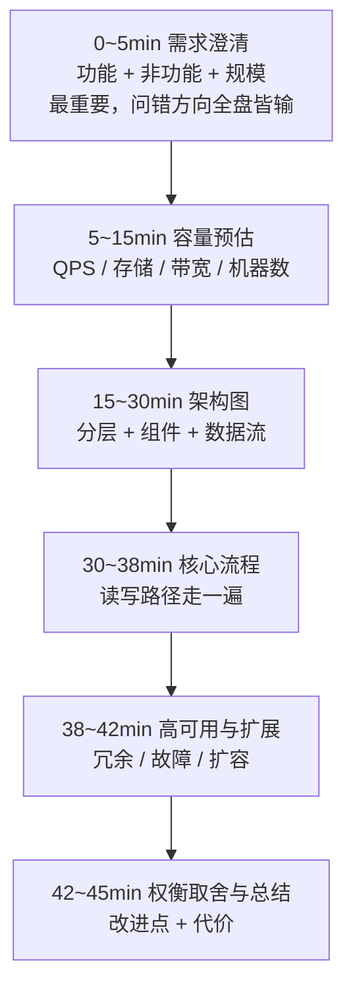
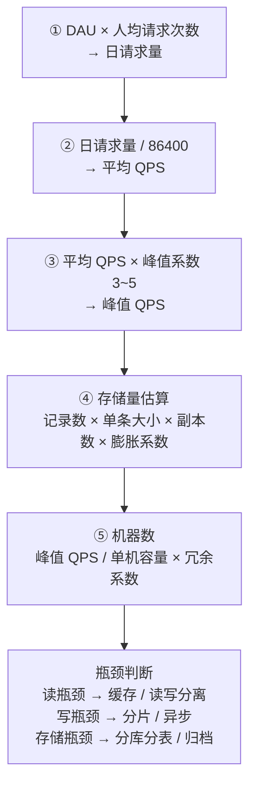
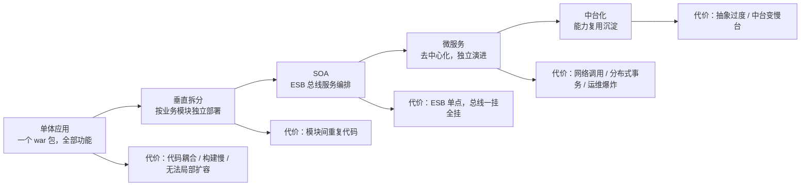
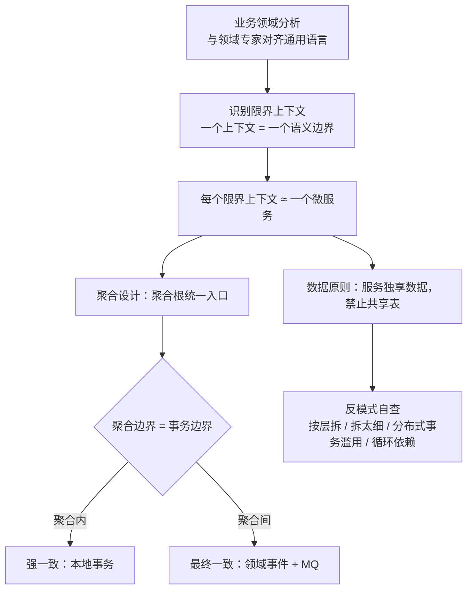
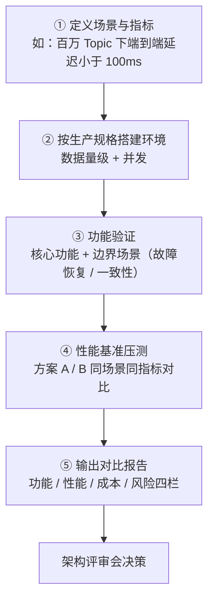

[📖 返回目录](README.md) · [⬅️ 上一章](17-high-concurrency.md) · [➡️ 下一章](19-system-design-cases-1.md)

# 18 · 系统设计方法论（架构师核心）

> 适用对象：10+ 年经验的资深工程师 / 架构师候选人，目标是系统设计面试（System Design Interview）与真实架构评审能力。本章覆盖：系统设计面试的完整框架与 45 分钟时间分配、容量预估公式与案例（日活 1000 万社交应用）、高可用与容灾设计（RPO/RTO、多活）、架构演进路径（单体→SOA→微服务→中台）、DDD 与微服务拆分、技术选型方法论（POC 流程、评审 checklist）、架构文档与 C4 画图规范。面试落点：设计题不靠背方案，靠「结构化提问 → 量化估算 → 画出架构 → 讲清权衡」的可复用套路。

**TL;DR 本章学习要点**

1. 系统设计面试是「结构化表演」：5 分钟需求澄清 → 10 分钟容量预估 → 15 分钟画架构 → 10 分钟核心流程 → 5 分钟高可用与权衡；**先问清楚再动手，是最值钱的 5 分钟**；
2. 容量预估三件套公式：峰值 QPS ≈ 日请求量 / 86400 × 峰值系数（3~5）、存储 = 记录数 × 单条大小 × 副本 × 膨胀系数、机器数 = 峰值 QPS / 单机容量 × 冗余系数——数字不要求精确，要求「有依据的量级」；
3. 高可用是「冗余 + 故障转移 + 降级」的组合：RPO 管丢多少数据、RTO 管恢复多快；同城双活、两地三中心、异地多活（单元化）是三条主流容灾路线，成本和复杂度递增；
4. 架构演进是被「团队规模 × 发布频率 × 性能瓶颈」推着走的：微服务是「把进程内调用变成网络调用」的昂贵升级，拆分依据是「独立演进的频率」；DDD 的限界上下文 + 聚合根是拆分的科学依据，按层拆、共享表、分布式事务滥用是三大反模式；
5. 架构师的核心产出是「决策与权衡的记录」：技术选型走「维度表打分 + POC 验证 + 架构评审」，架构图用 C4 四层模型——文档不是给领导看的，是给「三个月后的自己和新人」看的。

---


### 📑 本章目录

- [1. 系统设计面试框架](#1-系统设计面试框架)
- [2. 容量预估](#2-容量预估)
- [3. 高可用设计](#3-高可用设计)
- [4. 架构演进路径](#4-架构演进路径)
- [5. DDD 与微服务拆分](#5-ddd-与微服务拆分)
- [6. 技术选型方法论](#6-技术选型方法论)
- [7. 架构文档与画图规范](#7-架构文档与画图规范)
- [背景（Context）](#背景context)
- [决策（Decision）](#决策decision)
- [后果（Consequences）](#后果consequences)
- [考点速查表](#考点速查表)

## 1. 系统设计面试框架


### 1.1 七步套路与 45 分钟时间分配

```text
0~5min   需求澄清（功能 + 非功能 + 规模）   ← 最重要，问错方向全盘皆输
5~15min  容量预估（QPS/存储/带宽/机器数）    ← 给数字，展示量化思维
15~30min 架构图（分层 + 组件 + 数据流）      ← 白板画图，边画边讲
30~38min 核心流程（读写路径走一遍）          ← 从请求到落库，讲清每个环节
38~42min 高可用与扩展（冗余/故障/扩容）      ← 展示工程深度
42~45min 权衡取舍与总结（改进点/代价）       ← 主动复盘，收尾加分
```

> 图示：系统设计面试 45 分钟时间分配框架



- **需求澄清清单**（开场必问，按优先级）：
  1. 功能范围：核心功能是什么（读多写多？实时还是异步？）；
  2. 用户规模：DAU/MAU、峰值并发、地域分布（影响多机房设计）；
  3. 数据规模：数据量级、增长速率、保留期限；
  4. 一致性要求：强一致 / 最终一致（影响存储选型）；
  5. 可用性要求：SLA、容灾级别（影响冗余设计）；
  6. 约束与偏好：团队技术栈、成本敏感度、合规要求。
- 面试官考察的是「**你会不会问问题**」——不问清楚就开画 = 直接暴露缺乏架构思维；
- 容量预估的核心不是精确数字，而是「**估算链路的合理性**」（每个数字能说出依据），估算时主动声明假设（如「假设人均日请求 50 次，峰值系数取 3」）。

### 1.2 画架构图的基本姿势

- 从**分层**开始：客户端 → 网关/接入层 → 应用层 → 缓存层 → 存储层 →（异步）消息/任务层；
- 边画边标注：组件职责一句话、数据流方向、协议（HTTP/gRPC）、存储选型理由；
- 画完主动走一遍「读写路径」，指出**每个环节的瓶颈与兜底**；
- 结尾主动说「如果时间允许，我会优化 X（如热点缓存、分片策略）」——展示优先级判断。

### 1.3 常用架构模式速览（设计题的「预制件」）

设计题考察的是「用现成模式组装方案」的能力，先在心里过一遍模式清单：

| 模式 | 解决什么 | 何时用 |
|---|---|---|
| 分层架构 | 职责分离、逐层治理 | 几乎所有系统（默认起点） |
| 微服务拆分 | 独立演进、独立扩容 | 团队大、模块独立（见第 4/5 节） |
| 事件驱动（MQ） | 解耦、削峰、异步 | 允许最终一致、有尖峰流量 |
| 读写分离 | 读多写少时扩读容量 | 读 QPS 远大于写 |
| 分库分表 | 单库容量/吞吐上限 | 数据量 TB 级、写入吞吐高 |
| CQRS | 读写模型分离 | 读写负载形态差异极大 |
| 单元化 | 多活 + 就近访问 | 异地多活诉求（见 3.2） |

面试要点：**先匹配模式再画图**——「这个场景 = 读多写少 + 允许最终一致 → 读写分离 + 事件驱动」的推导过程，比直接画图更能展示架构思维。

### 本节高频面试题

**Q1：面试官让你设计一个系统，你开口第一句问什么？为什么？**

解答：先问「**这个系统最核心的使用场景和用户规模是什么**」——因为设计的分叉从需求就开始了：读多写少（feed 流）与写多读少（日志系统）的架构完全不同；日活 100 万与 1 亿的架构相差一个数量级。接着按清单补齐：功能范围 → 数据规模 → 一致性 → 可用性 → 约束。**面试升华：好的设计题答案 = 30% 提问 + 40% 结构 + 30% 细节；把「澄清需求」本身作为设计的一部分展示出来**。

面试官追问：如果面试官说「不要问太多，直接开始」怎么办？——答：把问题压缩成三个必问（规模、读写比、一致性），声明「我按以下假设继续：DAU X、读多写少、最终一致可接受，如有不同请随时纠正」——**带着显式假设前进，比闷头画图强，也比无限提问强**。假设本身就是架构决策的起点，面试官可以从你的假设里看出经验。

**Q2：45 分钟设计题，时间不够了，哪些部分可以砍？**

解答：砍的顺序：① 容量预估的「精细化」（保留量级估算，砍掉精确计算）；② 非核心模块（如通知、搜索，一句话带过）；③ 高可用细节（提一句「多副本 + 故障转移」即可）。**不能砍的**：核心读写路径（必须走通）、存储选型理由（必须给出）、至少一个权衡点的展开（必须展示深度）。**面试要点：主动说「我把时间花在核心链路上，其余部分概述」——时间管理本身是考察项**。

面试官追问：需求澄清问多了会不会显得没主见？——答：会，如果只问不答。正确姿势是「问一个关键问题 → 给出基于假设的方案 → 让面试官纠正」——每次提问都带着「我为什么问这个 + 我猜的答案」，展示的是「决策框架」而非「不自信」。**要点：提问要「带假设地推进」，不是「无限收集信息」**。

---

## 2. 容量预估

### 2.1 核心公式表（必背）

| 指标 | 公式 | 说明 |
|---|---|---|
| 日均请求量 | DAU × 人均请求次数 | 先估人均行为（刷 feed 50 次/发帖 0.1 次） |
| 峰值 QPS | 日请求量 / 86400 × 峰值系数 | 峰值系数 3~5（二八法则：80% 流量集中在 20% 时间） |
| 存储量 | 记录数 × 单条大小 × 副本数 × 膨胀系数 | 膨胀系数 1.5~2（索引、碎片、预留） |
| 带宽 | QPS × 单响应大小 × 8（bps） | 静态资源走 CDN 不占源站带宽 |
| 机器数 | 峰值 QPS / 单机支撑 QPS × 冗余系数 | 冗余系数 1.5~2；单机容量用压测值 |
| 连接数 | 峰值 QPS × 平均 DB 耗时（秒） | Little's Law，连接池规划 |

速算技巧：`日请求 1 亿 → 平均 QPS ≈ 1157（1亿/86400）→ 峰值 ≈ 3500~5800`。**面试时把「平均」和「峰值」分开报，展示对流量形态的理解**。

> 图示：容量预估五步流程



### 2.2 案例：日活 1000 万社交应用（完整走一遍）

**需求假设**（显式声明）：
- DAU 1000 万；人均日行为：刷 feed 60 次、点赞 10 次、发帖 0.5 次、评论 1 次、私信 2 条；
- 读多写少（约 20:1）；图片/视频走 CDN（源站只算接口数据）；数据保留 3 年。

**估算**：
```text
日请求量 ≈ 1000万 × (60 + 10 + 0.5 + 1 + 2) ≈ 7.35 亿
平均 QPS ≈ 7.35亿 / 86400 ≈ 8500
峰值 QPS ≈ 8500 × 3 ≈ 2.5 万（feed 拉取占大头，单接口峰值 ~1.5 万）

存储：
  用户表：1000万 × 1KB ≈ 10 GB
  帖子/feed：1000万 × 0.5 × 1KB × 365 × 3年 ≈ 550 GB（加索引膨胀 ~1 TB）
  互动（点赞/评论）：1000万 × 11 × 100B × 365 × 3年 ≈ 1.2 TB
  → 总量 2~3 TB 量级，单库 MySQL 扛不住，需要分库分表或 TiDB 类分布式方案

机器数：峰值 2.5 万 QPS，单机（4C8G）压测支撑 1500 QPS
  → 应用机器 ≈ 2.5万/1500 × 1.5 ≈ 25 台
  → 缓存：热点 feed 缓存命中率 90%，Redis 集群 ~8 主 8 从（每主 ~3000 QPS 写入）
```

**面试表达要点**：数字要「粗糙但自洽」——每个数都能说「怎么来的」，并主动标注「精确值需要压测验证，这里给量级」。最后补一句存储选型结论：**数据量 2~3 TB 且增长快 → 分库分表或分布式数据库，而不是单库**。

### 2.3 从估算到瓶颈判断

容量预估的落点是「定位瓶颈在哪一层」，按此顺序检查：

1. **读/写比**：读多写少 → 缓存 + 读写分离是首选；写多读少 → 关注写入吞吐与存储选型；
2. **热点集中度**：Top 1% 数据承担 90% 流量 → 热点治理优先（本地缓存/多副本）；均匀分布 → 靠水平扩容；
3. **数据增长**：日增数据量 × 保留期 是否超过单库容量（500 GB~1 TB 预警线）→ 决定分库分表/归档策略；
4. **峰值形态**：平稳型（SaaS 后台）vs 尖峰型（大促）→ 前者按峰值备机，后者靠削峰+弹性伸缩；
5. **单机容量**：压测得出应用单机 QPS 与存储单节点吞吐 → 机器数与分片数由此推导。

面试表达：**「我估算的目的是找到瓶颈：读瓶颈 → 缓存/读写分离，写瓶颈 → 分片/异步，存储瓶颈 → 分库分表/归档」**——把估算和方案选择串成一条逻辑链，而不是报一串数字就完。

### 本节高频面试题

**Q3：峰值系数为什么取 3~5？怎么验证？**

解答：依据是流量形态：互联网应用流量高度集中在白天（尤其晚间 20~23 点），日请求量除以 86400 得到的是「全天平均」，峰值时段通常是平均的 3~5 倍（极端场景如秒杀可达 10 倍以上）。验证方式：① 看现有系统监控的真实峰值/均值比；② 压测平台数据；③ 行业基准（如电商大促、春晚红包的公开数据）。**面试要点：峰值系数不是拍脑袋，是「流量集中度」的量化表达——先说明流量形态，再给系数**。

面试官追问：估算出来 25 台机器，预算只批 10 台怎么办？——答：这是「容量 vs 成本」的权衡题：① 确认峰值假设（是否可接受削峰/排队）；② 优化单机容量（缓存命中率、异步化、代码性能——单机从 1500 提到 3000 QPS 就省一半机器）；③ 分层保障：核心链路足量、非核心链路降级；④ 弹性伸缩（云上按水位扩缩容，平时 10 台，峰值自动扩到 25 台）。**面试升华：容量规划不是「算出来就买」，是「保底容量 + 弹性余量 + 优化空间」的组合**。

**Q4：存储估算 2~3 TB，为什么不能直接上单机 MySQL？**

解答：三个维度：① **容量**：单机 MySQL 建议数据量 500 GB~1 TB 以内（备份、恢复、迁移时间成本随数据量线性上升）；② **吞吐**：社交 feed 写入峰值 ~5000 TPS（发帖+互动），单机 MySQL 极限约 1 万 TPS，加上读放大（feed 拉取要查多表）必然扛不住；③ **增长**：3 年 2~3 TB 且持续增长，单机终会到顶。结论：**按「3 年后的数据量和吞吐」选型，而不是今天的**——分库分表（ShardingSphere）或分布式数据库（TiDB/OceanBase），同时冷热分离（3 个月前的 feed 归档到冷存储）。

面试官追问：分库分表和分布式数据库（TiDB）怎么选？——答：分库分表：成本低、可控（SQL 完全兼容），但分片键设计、跨分片查询、扩容都要自己扛；TiDB 类：自动分片、透明扩容、强一致（Raft），但引入新组件（PD/TiKV/TiDB 三件套）、运维复杂度和资源成本更高。**要点：团队有 MySQL 运维能力且分片键清晰 → 分库分表；想省掉分片复杂度、能接受新组件 → TiDB**。

---

## 3. 高可用设计

### 3.1 高可用三板斧：冗余、故障转移、降级

- **冗余**：无状态应用多实例（负载均衡摘除故障节点）；有状态存储多副本（主从/多副本 + 自动选主）；缓存多副本；
- **故障转移（Failover）**：自动（健康检查 + 负载均衡摘除 + 主从切换）与手动（预案演练）；关键点：**故障检测速度**（心跳间隔/健康检查频率）与**切换时间**（决定 RTO）；
- **降级**：见 17 章第 5 节——限流、熔断、降级预案是「故障发生时保住主链路」的最后防线；
- 可用性数字：99.9% = 年停机 8.76 小时；99.99% = 52.6 分钟；99.999% = 5.26 分钟——**每多一个 9，成本和复杂度上一个台阶**（多副本、多机房、自动切换、演练体系）。

### 3.2 容灾级别：RPO 与 RTO

| 指标 | 含义 | 通俗理解 |
|---|---|---|
| RPO（Recovery Point Objective） | 可容忍的数据丢失量（时间） | 故障时「倒回多久的数据」 |
| RTO（Recovery Time Objective） | 可容忍的恢复时间 | 故障后「多久恢复服务」 |

- 示例：RPO=10 分钟 → 最多丢 10 分钟数据（异步复制）；RPO=0 → 一字节都不能丢（同步复制/同城双写）；
- 容灾方案按 RPO/RTO 分级：

```text
单机房主备          RPO≈分钟级(异步复制)  RTO≈分钟~小时  成本低
同城双活(两机房)     RPO≈秒级(同步复制)   RTO≈分钟级     成本中
两地三中心          同城双活+异地灾备      RPO≈秒级, RTO≈分钟  成本高
异地多活(单元化)     RPO≈0(双写/分片)    RTO≈秒级      成本极高
```

- **同城双活**：两个机房同时对外服务（流量分流），同步复制保证 RPO 秒级；难点是「脑裂」（两机房网络断开会双写冲突，需要仲裁机制）；
- **两地三中心**：同城双活 + 异地灾备（异地只备份不服务，异步复制）——「双活保可用，异地保数据」；
- **异地多活（单元化）**：按用户维度分片（如按 UID 哈希分单元），每个单元自带完整链路（应用+存储），流量按用户路由到对应单元——读写都在本单元完成，天然规避跨机房延迟；难点：单元间数据交互（用户跨单元访问）、全局唯一 ID、配置同步。

### 3.3 故障演练与混沌工程

高可用设计得再漂亮，不演练等于没有：

- **故障演练**：定期在预发/灰度环境模拟故障（杀节点、断网、杀 DB 主库、Redis 故障），验证故障转移是否真的生效——「主从切换脚本半年没跑过，真出事时大概率失败」；
- **混沌工程**：在生产环境注入受控故障（延迟、丢包、资源耗尽），验证系统的「韧性」——原则：**先小范围（1% 流量）→ 有监控兜底 → 可快速回滚**；典型实验：随机杀 Pod、给下游注入 500ms 延迟、CPU 打满 30 秒；
- 演练产出：故障手册（SOP）——每个故障的「现象 → 排查路径 → 处置动作 → 恢复验证」四步，故障发生时按手册执行而不是临场发挥；
- 面试要点：**提到高可用必提演练**——「冗余设计 + 定期演练 + 故障手册」三件套缺一不可，只说「我们做了多副本」会被认为只有纸面设计。

### 本节高频面试题

**Q5：同城双活的「脑裂」问题怎么解决？**

解答：两个机房网络中断时，两边都以为对方挂了，各自接管全部流量 → 数据双写冲突。解法：① **仲裁机制**：引入第三节点（如 ZK/独立仲裁机房）投票决定谁继续服务（类似 Raft 多数派——3 机房断 1 个，剩余 2 个仍多数派）；② 存储层用「同步复制 + 租约」：只有持有租约的一方可以写，租约过期自动让出；③ 业务层兜底：冲突数据用版本号/时间戳合并（LWW）。**面试要点：任何「双活」架构都必须回答「双活变单活时谁说了算」，回答不了脑裂的双活方案是不合格的**。

面试官追问：RPO=0 为什么这么难？——答：RPO=0 要求「写成功 = 至少两份持久化」，即同步复制/双写——但同步复制会把「单点故障」变成「双点故障」：从库不可达时主库写不进去（除非降级为异步，降级瞬间 RPO 就从 0 变成分钟级）。所以 RPO=0 的代价是「可用性下降」——**RPO 和可用性是一对矛盾，设计时要明说取舍**。

**Q6：异地多活（单元化）的流量怎么路由？用户跨单元访问怎么办？**

解答：路由：网关层按用户标识（UID）哈希/范围映射到单元（如 UID % 64 分 64 个单元，路由表放配置中心/注册中心）；用户跨单元访问（如 A 单元用户访问 B 单元的数据）两种处理：① 读写都路由回本单元（用户的所有请求按 UID 路由，天然规避——前提是业务按用户维度隔离）；② 必须跨单元的（如好友关系）走「全局服务」（独立部署的共享服务 + 跨单元数据同步）。**面试升华：单元化的本质是「按用户维度把系统切成 N 个独立的迷你系统」，能拆干净的前提是业务模型支持用户维度隔离**——社交/电商适合，全局账本类（银行总账）不适合。

面试官追问：单元化之后，全局唯一 ID 和配置怎么同步？——答：ID：发号器按单元分片（每个单元独立号段，如 Leaf-segment 按单元分配段）；配置：配置中心多机房部署（每个机房一套 + 跨机房同步），单元内服务读本机房配置。**要点：单元化的「共享设施」都要单元化改造——配置、ID、注册中心都得按机房部署，这是隐性成本**。

---

## 4. 架构演进路径

### 4.1 演进五阶段

```text
单体应用 ──▶ 垂直拆分 ──▶ SOA ──▶ 微服务 ──▶ 中台化
  │            │            │         │          │
  │ 一个 war 包  │ 按业务模块拆    │ ESB 总线   │ 去中心化    │ 能力复用沉淀
  │ 全部功能    │ 独立部署       │ 服务编排   │ 独立演进    │ 前台+中台
```

> 图示：架构演进五阶段（单体 → 中台化）



| 阶段 | 驱动因素 | 代价 |
|---|---|---|
| 单体 | 团队小、迭代快、部署简单 | 代码耦合、构建慢、无法局部扩容 |
| 垂直拆分 | 团队变大、模块独立演进需求 | 模块间重复代码、共享库耦合 |
| SOA（ESB） | 跨系统服务复用、统一治理 | ESB 成为性能与可用性单点（「总线一挂全挂」） |
| 微服务 | 独立部署/独立扩缩容/技术异构 | 网络调用、分布式事务、运维爆炸 |
| 中台化 | 重复建设严重、能力沉淀复用 | 抽象过度、组织博弈、「中台变慢台」 |

- 演进本质：**「组织规模 × 协作成本」与「技术复杂度」的平衡**——每次演进都是「当前架构的痛点 > 新架构的代价」时才发生；
- 康威定律：系统架构模仿组织沟通结构——**团队怎么分，系统就会怎么长**；微服务拆分与团队重组是同一件事的两面；
- 面试常问「你们为什么从单体拆微服务」——标准答案不是「微服务高级」，而是「单体发布频率被耦合拖累、局部扩容做不到、团队协作成本高」，并诚实说出微服务带来的新问题（分布式事务、链路追踪、运维成本）。

### 4.2 演进的反模式

- **为拆而拆**：没有独立演进诉求就拆微服务 → 分布式事务和网络开销白白增加；
- **拆分后共享数据库**：服务拆了、表还共享 → 一个服务的慢 SQL 拖死所有服务（共享 DB 是微服务最大的隐性单体）；
- **ESB 复活**：微服务中间又架一个「微服务网关做业务编排」——网关变回 ESB 单点。

### 4.3 微服务的治理清单（拆完才是开始）

拆微服务的真实成本在「治理设施」，缺一项就是分布式灾难：

| 治理项 | 缺了会怎样 |
|---|---|
| 注册中心 + 服务发现 | 实例上下线靠手工配置，发布即事故 |
| 配置中心 | 改配置要重启，灰度/开关无从谈起 |
| 网关（路由/鉴权/限流） | 每个服务自己写鉴权，安全漏洞遍地 |
| 熔断/限流/降级 | 一个服务故障雪崩式拖垮全链路 |
| 链路追踪 | 故障排查从分钟级变成小时级 |
| 日志聚合 + 监控告警 | 出问题不知道，知道了也查不到 |
| CI/CD + 灰度发布 | 发布靠人肉，回滚靠祈祷 |
| 分布式事务/最终一致设施 | 跨服务数据一致性裸奔 |

面试要点：**评估一个微服务架构是否成熟，先看治理设施清单，再看业务代码**——「服务拆了 20 个，链路追踪和熔断都没有」是典型的反面案例。

### 本节高频面试题

**Q7：单体应用什么信号出现时，说明该拆了？**

解答：四个信号：① **发布频率**：改一行代码要全量回归、发布窗口被耦合拖到一周一次——独立演进的诉求出现了；② **团队协作**：10+ 人改同一个代码库，合并冲突和 Code Review 排队成为常态；③ **性能**：某个模块流量暴涨需要独立扩容，但单体只能整体扩；④ **技术异构**：某个模块想换技术栈（Go 写网关、Python 做算法），单体锁死。**面试要点：拆分的判据是「独立演进的频率和收益」，不是代码行数、不是团队规模数字本身**。

面试官追问：拆了之后发现比单体还慢，为什么？——答：典型原因：① 服务间同步调用链过长（A→B→C→D 串行，每跳 10ms 网络开销，总 RT 爆炸）；② 分布式事务滥用（拆前一个本地事务，拆后 2PC/TCC 拖死吞吐）；③ 数据库没拆（共享库锁竞争）；④ 缺治理设施（无注册中心/熔断/追踪，故障定位半天）。**结论：拆微服务 = 用「治理能力」换「演进自由」，治理设施没跟上就拆，是负优化**。

**Q8：中台化为什么经常失败？**

解答：中台失败的三个典型原因：① **抽象过度**：为了「通用」把业务规则抽象成配置/规则引擎，前台需求被中台拖慢（「中台变慢台」）；② **组织博弈**：中台团队与业务团队 KPI 不一致（中台追求复用率，业务追求交付速度），协调成本吞噬收益；③ **数据中台与业务中台混淆**：把「数据仓库」包装成中台，业务能力没有真正沉淀。**面试升华：中台本质是「组织能力复用的投资」，收益要按「沉淀能力的复用次数」衡量，而不是按「建了多少平台」衡量**——先想清楚哪些能力真的会被多个前台复用，再建中台。

面试官追问：什么业务适合中台化？——答：三个特征：① 能力确实被多个前台复用（订单/支付/商品是电商三前台共用）；② 能力相对稳定（业务规则变化慢，如支付通道、风控规则）；③ 组织上能划出独立团队长期投入。**要点：中台的成立条件是「复用性 × 稳定性 × 组织投入」三者齐备**。

---

## 5. DDD 与微服务拆分

### 5.1 DDD 核心概念（架构师必答）

| 概念 | 含义 | 工程含义 |
|---|---|---|
| 限界上下文（Bounded Context） | 一个业务领域内的「语义边界」，边界内模型自洽 | **一个限界上下文 ≈ 一个微服务**（拆分的第一依据） |
| 聚合（Aggregate） | 一组强一致的对象，由聚合根统一入口 | 聚合内强一致（本地事务），聚合间最终一致（领域事件） |
| 聚合根（Aggregate Root） | 聚合的唯一外部入口，如订单聚合的 Order | 外部只能通过聚合根操作，保证不变量 |
| 领域事件（Domain Event） | 领域内发生的事实（OrderCreated） | 跨聚合/跨服务的异步协作载体 |
| 防腐层（ACL） | 隔离外部系统模型的转换层 | 保护领域模型不被外部模型污染 |

- DDD 的核心价值：**把「业务语义」变成「系统边界」**——限界上下文告诉你怎么拆，聚合告诉你在哪里用本地事务、在哪里用最终一致；
- 实战提醒：DDD 不是「必须用」的银弹，但「限界上下文 + 聚合」这两个概念对微服务拆分的指导意义是普适的（哪怕不用全套 DDD 战术模式）。

### 5.2 拆分三原则与反模式

**拆分原则**：
1. **业务原则**：按限界上下文拆——一个上下文一个服务，内部高内聚、上下文间低耦合（通过领域事件通信）；
2. **团队原则**：团队与服务的映射（康威定律）——「一个团队能独立交付的服务」为一个单元；拆完的服务要能由一个小团队（2~5 人）独立维护；
3. **数据原则**：**服务必须拥有自己的数据**——数据库按服务拆分（每个服务独占表/库），跨服务数据只能通过 API/事件访问，禁止共享表。

**反模式清单**（必答）：
- 按技术层拆：controller 服务、service 服务、dao 服务——把分层架构竖着切开，全是网络调用没有业务边界；
- 拆太细：一个服务只有一张表、一个接口——运维成本爆炸（「微服务碎成微尘埃」）；
- **共享数据库表**：两个服务读写同一张表——隐性单体，慢 SQL 互相拖累；
- 分布式事务滥用：跨服务强一致事务满天飞——优先用「聚合边界重划」把事务留在服务内；
- 循环依赖：服务 A 调 B、B 调 A——用事件或重构消除。

> 图示：DDD 限界上下文驱动的微服务拆分流程



### 本节高频面试题

**Q9：订单和支付要不要拆成两个服务？事务怎么处理？**

解答：先看限界上下文：订单（下单、改单、取消）与支付（支付单、退款、对账）是**两个不同的业务语义域**（订单关注履约状态，支付关注资金流水），且演进频率不同（支付对接渠道经常变）→ 拆。事务处理：**聚合边界重划**——「订单创建 + 支付单创建」如果强一致诉求高，可把两者放进同一个聚合（同一个服务内本地事务）；如果拆开，则用「订单状态机 + 领域事件」：订单创建成功发 OrderCreated 事件 → 支付服务建支付单（最终一致），超时未支付由定时任务关闭订单。**面试要点：先问「这两个概念是不是同一个语义边界」，再问「强一致还是最终一致」，最后才谈技术方案（本地事务/事件/分布式事务）**。

面试官追问：拆服务时怎么判断「这块逻辑放哪个服务」？——答：三个判据：① 它属于哪个限界上下文的「通用语言」（术语归属——「优惠」到底是订单的概念还是营销的概念，以业务专家的说法为准）；② 它读写哪些数据（数据所有权原则——谁拥有数据谁提供服务）；③ 它跟着谁演进（发布频率相近的放一起）。**术语归属（业务语言）是第一判据——业务上说不清归属的，技术上一定拆错**。

**Q10：聚合根的设计对并发有什么影响？举例说明。**

解答：聚合根是并发控制的边界：**聚合内用本地事务 + 锁，聚合间用最终一致**。举例：订单聚合（Order + OrderItem + 地址）——「改订单 + 改明细」必须在同一个事务里，通过 Order 聚合根操作，天然避免「明细改了订单没改」的不一致；如果把明细拆成独立聚合（独立服务），就要引入跨聚合事务或事件补偿，并发下状态可能错乱。**面试升华：聚合边界 = 事务边界，聚合划得越大事务越重（锁范围大、吞吐低），划得越小一致性越难保证——「聚合大小」是 DDD 设计里最需要权衡的点**。

面试官追问：聚合根里能不能直接调另一个聚合根的方法？——答：不能跨聚合直接修改。聚合间协作只能通过「聚合根 ID 引用 + 领域事件」——一个聚合根不能持有另一个聚合的内部对象（如 Order 里不能直接 new User 并改其字段），只能持有对方 ID 并通过事件/应用服务编排。这条约束保证了每个聚合的不变量只在自己的事务边界内被维护，是 DDD 防止「对象图大泥球」的关键规则。

**Q15：领域事件和 MQ 是什么关系？什么时候用领域事件而不是同步 RPC？**

解答：领域事件是「业务事实」（OrderCreated、PaymentSucceeded），MQ 是「传输载体」——两者是语义与基础设施的关系：领域事件定义「发生了什么」，MQ 负责「可靠地告诉谁」。用事件替代同步 RPC 的判断标准：① 事件发起方**不关心**接收方的处理结果（发完即走）；② 接收方失败**不应**回滚发起方的本地事务；③ 允许最终一致；④ 可能有多个接收方（一次发布、多处订阅）。典型：订单创建成功 → 发 OrderCreated 事件 → 库存预占、积分发放、物流单创建各自订阅——任何一个订阅方挂了都不影响下单主流程。**面试升华：事件驱动是「事务边界划分」的产物——聚合间的一致性用事件 + 最终一致表达，而不是用跨服务分布式事务硬撑**。

面试官追问：领域事件丢失怎么办？——答：事件发布要与本地事务同生共死：事务内写「事件表」+ 事务提交后发 MQ（本地消息表，见 16 章 4.4），或 RocketMQ 事务消息——保证「事务成功 ⇔ 事件必达」；消费方幂等 + 对账兜底。**要点：事件驱动最怕「业务成功但事件没发出去」，发布可靠性必须与本地事务绑定**。

---

## 6. 技术选型方法论

### 6.1 选型维度表

| 维度 | 考察点 | 权重建议 |
|---|---|---|
| 功能匹配度 | 是否覆盖核心需求（90% 匹配即可，别追 100%） | ★★★★★ |
| 成熟度与稳定性 | 版本历史、生产案例（同规模公司）、已知坑 | ★★★★★ |
| 性能与容量 | 官方 benchmark、社区压测报告、POC 实测 | ★★★★ |
| 社区与生态 | 活跃度（commit/issue 响应）、周边生态（监控/客户端） | ★★★★ |
| 学习与维护成本 | 团队熟悉度、文档质量、招聘市场人才储备 | ★★★ |
| 运维与可观测 | 监控/告警/日志接入成本、升级兼容性 | ★★★ |
| License 与合规 | 开源协议（Apache/MIT/AGPL 差异）、商业授权费 | ★★★ |
| 可扩展性 | 插件机制、二次开发成本、厂商锁定风险 | ★★ |

### 6.2 自研 vs 开源

```text
自研的合理理由：
  ├─ 开源方案无法覆盖的差异化能力（核心竞争点，如推荐算法）
  ├─ 开源方案 License/合规不满足（AGPL 传染性、数据出境）
  ├─ 性能/规模超出开源设计上限（且社区无演进动力）
  └─ 技术壁垒本身就是业务壁垒（如自研调度引擎）

开源的合理理由（默认选项）：
  ├─ 成熟度：踩坑记录是社区用真金白银换的
  ├─ 成本：自研 = 2~3 年持续投入 + 迭代维护，远超采购/开源成本
  └─ 生态：招聘、文档、问题解答、周边工具全覆盖
```

- **自研的隐藏成本**：不只是开发成本，是「永久维护成本」（升级、兼容、值班、文档）——评估自研要算 5 年 TCO；
- 决策参考：**「开源方案 + 深度定制」通常是性价比最高路径**——用开源组件，在业务层做差异化（如 Kafka 之上自研消息治理平台）。

### 6.3 POC 流程与架构评审

**POC（Proof of Concept）五步**：
1. **定义场景与指标**：明确要验证的核心场景（如「百万级 Topic 下端到端延迟 < 100ms」）与验收指标；
2. **环境搭建**：按生产规格（数据量级、并发）搭建，别用玩具环境；
3. **功能验证**：核心功能 + 边界场景（故障恢复、数据一致性）；
4. **性能基准**：压测对比（候选方案 A/B 同场景同指标）；
5. **结论与决策**：输出对比报告（功能/性能/成本/风险四栏），架构评审会上决策。

> 图示：POC 验证五步流程



**架构评审 Checklist**（评审别人的方案时按此提问）：
- 需求与设计是否对齐（有没有过度设计/欠设计）；
- 一致性/可用性/扩展性三者的取舍是否显式声明；
- 数据模型与存储选型是否匹配（容量、吞吐、增长）；
- 故障场景推演：机器挂、机房挂、流量暴涨，系统表现如何；
- 安全与合规（鉴权、加密、数据出境）；
- 成本估算（机器/带宽/人力维护）；
- 可观测性（监控/日志/追踪是否接入）；
- 回滚与灰度方案。

### 本节高频面试题

**Q11：你们为什么自研了 X 而不用开源 Y？自研的账怎么算？**

解答：用「5 年 TCO 账」回答：自研成本 = 开发投入（人月 × 人力成本）+ 永久维护成本（每年约 20~30% 开发投入）+ 风险成本（踩坑没人救）；开源成本 = License/订阅 + 定制开发 + 学习迁移成本。只有当「开源无法覆盖的差异化价值 > 自研 TCO」时才自研。举例：自研限流平台——开源（Sentinel）缺「多语言客户端 + 统一控制台 + 公司内配额治理」，而这是我们的核心治理能力 → 在 Sentinel 之上自研控制面（开源内核 + 自研外壳），而不是从零造轮子。**面试要点：自研决策要能说出「开源方案的哪个具体点不可接受」，而不是「开源不好用」这种模糊理由**。

面试官追问：选型时两个方案 A/B 性能接近，怎么定？——答：性能之外看四个维度：① **生态**（周边工具、人才市场——招不到人的技术再先进也白搭）；② **运维成熟度**（公司有没有人踩过坑、有没有现成监控）；③ **演进方向**（方案 A 的 roadmap 是否与业务方向一致）；④ **团队兴趣与积累**（技术债最小化）。**面试升华：技术选型 60% 是「非技术决策」——组织、人才、生态往往比 benchmark 数字更决定成败**。

**Q12：架构评审时，你怎么判断一个方案「过度设计」了？**

解答：三个信号：① **为不存在的问题设计**——没有对应业务场景就上多活、单元化、自研存储（评审时逐个追问「哪个需求驱动了这个设计」，答不上来就是过度设计）；② **复杂度与收益不匹配**——用分布式事务解决「每日几百笔」的跨库操作（一个定时对账就能搞定）；③ **团队能力与方案不匹配**——引进了团队没人能维护的组件（半年后变成无人敢碰的黑盒）。**面试升华：架构评审的本质是「验证每个设计决策都有显式的需求驱动和收益说明」——没有需求驱动的复杂度都是技术债**。

面试官追问：怎么避免「评审走过场」？——答：三个机制：① 评审前置——设计文档提前 24 小时发出，评审会直接讨论问题而不是现场读文档；② 决策留痕——评审结论落到 ADR，每条「通过/驳回」都有理由；③ 引入「反对角色」——评审组固定一人专门挑刺（找过度设计/欠设计），而不是一团和气。**要点：评审的价值在于「反对意见被认真对待」，机制上要逼出反对意见**。

---

## 7. 架构文档与画图规范

### 7.1 架构图要素（画图检查清单）

一张合格的架构图应包含：
- **组件与职责**：每个框一句话职责（写在图上或图例里）；
- **连接与协议**：连线标注方向 + 协议（HTTP/gRPC/MQ 主题）；
- **分层与边界**：按层组织（接入/应用/缓存/存储/异步），标注系统边界（哪些是外部系统）；
- **数据流**：关键读写路径用序号标注（①登录 ②拉 feed ③发帖）；
- **部署视图**：集群/多机房/容灾关系（必要时单独画部署图）；
- **明确「不画什么」**：业务细节、代码级实现——架构图讲「结构」不讲「实现」。

常见画图错误：箭头无方向、无协议标注、组件职责含糊（一个框写「业务逻辑」）、图上堆了 50 个组件没有分层、部署与逻辑混在一张图。

### 7.2 C4 模型（四层由粗到细）

| 层级 | 画什么 | 受众 | 粒度 |
|---|---|---|---|
| Context（系统上下文） | 系统与外部用户/系统的关系 | 所有人（含非技术） | 一个框 = 一个系统 |
| Container（容器） | 系统内部的进程/服务/存储（Web 应用、API、DB、MQ） | 技术团队 | 一个框 = 一个可部署单元 |
| Component（组件） | 容器内的模块（Controller/Service/DAO、核心类） | 开发团队 | 一个框 = 一个模块 |
| Code（代码） | 类图/时序（用 UML，通常只画关键部分） | 单个模块开发者 | 一个框 = 一个类 |

- C4 的价值：**强制分层思考**——避免「一张图画到底」（要么太粗没有信息量，要么太细没人看得懂）；Context 图给领导/新人、Container 图给架构评审、Component 图给开发；
- 配套：**ADR（Architecture Decision Records）**——架构决策记录（背景/决策/后果三栏），记录「为什么这么选」，比架构图本身更值钱（图会过期，决策理由不会）。

### 7.3 ADR 模板示例

```markdown
# ADR-001：订单存储选用 MySQL 分库分表（ShardingSphere）

## 背景（Context）
订单数据日增 200 万条，3 年后预估 20+ 亿条；单库 MySQL 容量与写入
吞吐均到瓶颈；团队无 TiDB 运维经验，但 ShardingSphere 已用于会员库。

## 决策（Decision）
订单表按 order_id 哈希分 32 库 × 32 表；读写都带分片键；
跨分片查询（按用户查订单）走「用户维度索引表」二次路由。

## 后果（Consequences）
+ 容量与吞吐 ×1024；平滑扩容（先扩到 64 库）
- 跨分片事务变最终一致（本地消息表）；订单导出/对账需聚合扫描
- 全局唯一 ID 依赖发号器（Leaf-segment），引入新组件
```

- ADR 写作三原则：**一条 ADR 只记录一个决策**（可追溯）；**写「为什么」不写「怎么做」**（怎么做看代码）；**允许推翻但要留痕**（新 ADR 引用旧 ADR 说明变更理由）；
- 面试加分：主动说「我们的架构文档 = C4 图 + ADR 集合」——比「我们写了架构文档」具体得多，也证明你懂文档的工程化。

### 本节高频面试题

**Q13：架构文档写完了没人看，怎么破？**

解答：三个原因三个解法：① **太长太全**——文档是「索引」不是「百科全书」：只写决策与边界（ADR + 架构图 + 关键流程），细节指向代码（代码即文档）；② **与代码脱节**——图过期了没人信：把架构图纳入 CI（改动架构必须更新图，评审卡点），或用代码生成（如 C4 的 DSL 版本 PlantUML/Structurizr 随代码仓库管理）；③ **没有场景触发**——文档要在「新人 onboarding、架构评审、故障复盘」三个场景被强制引用，才能活起来。**面试升华：架构文档的敌人不是「写得不好」，是「没有和流程绑定」——文档是流程的产物，不是流程的装饰**。

面试官追问：画架构图用 UML 还是 C4？——答：C4 是「分层组织方式」，UML 是「图形语言」，两者不冲突：C4 的 Component 层用 UML 类图/时序图表达；日常评审用 C4（易懂、分层），关键模块设计用 UML 时序图（精确表达交互）。**工具（draw.io/PlantUML/Excalidraw）不重要，重要的是「一层图只讲一件事」**。

**Q14：你给新人讲系统架构，从哪张图开始？**

解答：从 **Context 图**开始：先画「系统与外部世界的关系」（用户、第三方、上下游），让新人建立「我们在生态中的位置」；再进 Container 图讲「系统内部有哪几个可部署单元、谁调用谁」；最后带新人走一遍核心时序（一个请求从网关到 DB 的完整路径），并给一份「故障手册」（常见故障的排查入口）。**面试升华：好的架构文档/讲解是「洋葱式」的——从外到内、从粗到细，每一层都能独立看懂，任何一层看不懂就停下来问**。

面试官追问：Context 图和 Container 图的边界怎么把握？——答：判断标准是「读者是谁」：Context 图给「非本系统的人」（老板、新人、协作方）——只画系统与外部的关系，内部细节全部隐藏；Container 图给「本系统的人」——画可部署单元与技术选型。**要点：一图一受众，把「谁在看」想清楚，图的粒度自然就对了**。

---

## 考点速查表

| 考点 | 一句话要点 |
|---|---|
| 设计题框架 | 澄清(5min)→容量(10)→架构图(15)→核心流程(8)→高可用(5)→权衡(2) |
| 需求澄清清单 | 功能/规模/数据/一致性/可用性/约束；先问再画是最值钱的 5 分钟 |
| 峰值 QPS | 日请求量 / 86400 × 峰值系数(3~5)；平均与峰值分开报 |
| 存储估算 | 记录数 × 单条大小 × 副本 × 膨胀系数(1.5~2)；按 3 年增长选型 |
| 机器数 | 峰值 QPS / 单机容量 × 冗余系数(1.5~2)；弹性伸缩省成本 |
| 带宽估算 | QPS × 响应大小 × 8；静态资源走 CDN 不占源站 |
| 社交应用案例 | DAU 1000 万 → 峰值 2.5 万 QPS、数据 2~3 TB、应用 ~25 台 |
| 高可用三板斧 | 冗余 + 故障转移 + 限流降级；每多一个 9 成本上一个台阶 |
| RPO/RTO | RPO 管丢多少数据、RTO 管恢复多快；RPO=0 牺牲可用性 |
| 容灾分级 | 单机房→同城双活→两地三中心→异地多活；成本复杂度递增 |
| 脑裂 | 双活断网必须仲裁（多数派/租约）；回答不了脑裂的方案不合格 |
| 单元化 | 按用户分片成 N 个迷你系统；前提是业务支持用户维度隔离 |
| 架构演进 | 单体→垂直→SOA→微服务→中台；驱动=独立演进诉求 |
| 康威定律 | 系统架构模仿组织沟通结构；拆分与团队重组是一件事 |
| 拆分信号 | 发布频率/团队协作/局部扩容/技术异构四个信号 |
| 中台失败 | 抽象过度、组织博弈、数据仓库冒充中台 |
| DDD 核心 | 限界上下文≈服务边界、聚合=事务边界、领域事件=异步协作 |
| 拆分三原则 | 业务（上下文）/团队（康威）/数据（独享数据） |
| 拆分反模式 | 按层拆、拆太细、共享表、分布式事务滥用、循环依赖 |
| 事务边界 | 聚合内本地事务、聚合间最终一致；先划边界再选技术 |
| 选型维度 | 功能/成熟度/性能/生态/成本/License/运维 7 维打分 |
| 自研 vs 开源 | 算 5 年 TCO；「开源内核 + 自研外壳」性价比最高 |
| POC 流程 | 定义指标→生产规格环境→功能验证→压测对比→评审决策 |
| 评审 checklist | 需求对齐/取舍声明/故障推演/安全/成本/可观测/回滚 |
| 过度设计 | 没有需求驱动的复杂度都是技术债；逐问「哪个需求驱动」 |
| 架构图要素 | 组件职责/协议标注/分层边界/数据流序号/部署视图 |
| C4 模型 | Context→Container→Component→Code 四层由粗到细 |
| ADR | 架构决策记录（背景/决策/后果）；决策理由比图更值钱 |
| 文档落地 | 文档与流程绑定（onboarding/评审/复盘强制引用）才有人看 |
