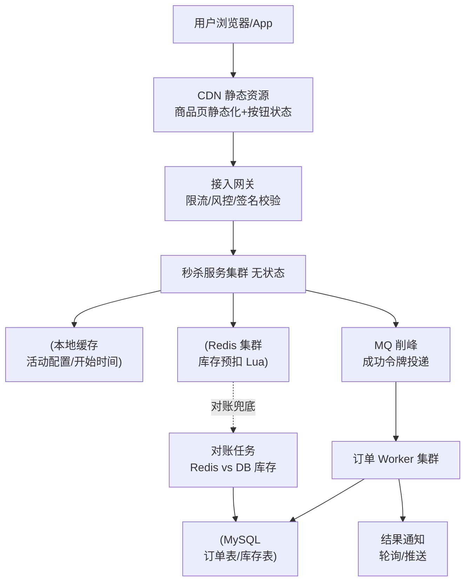
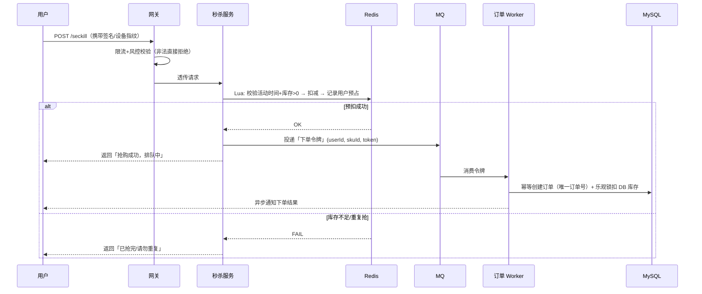
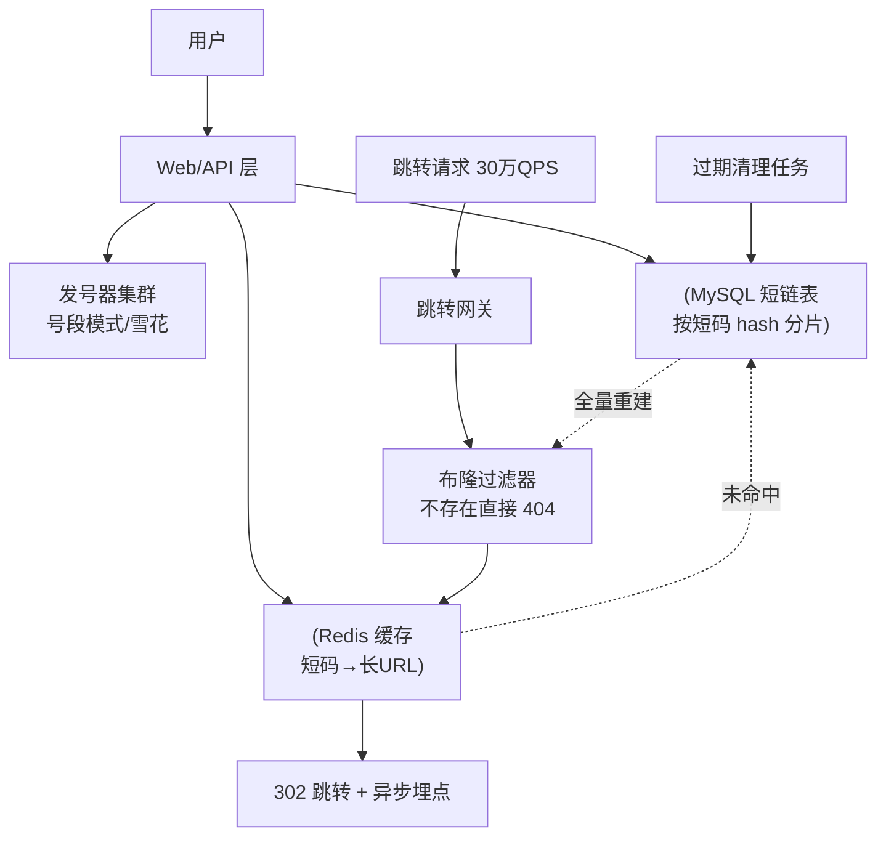
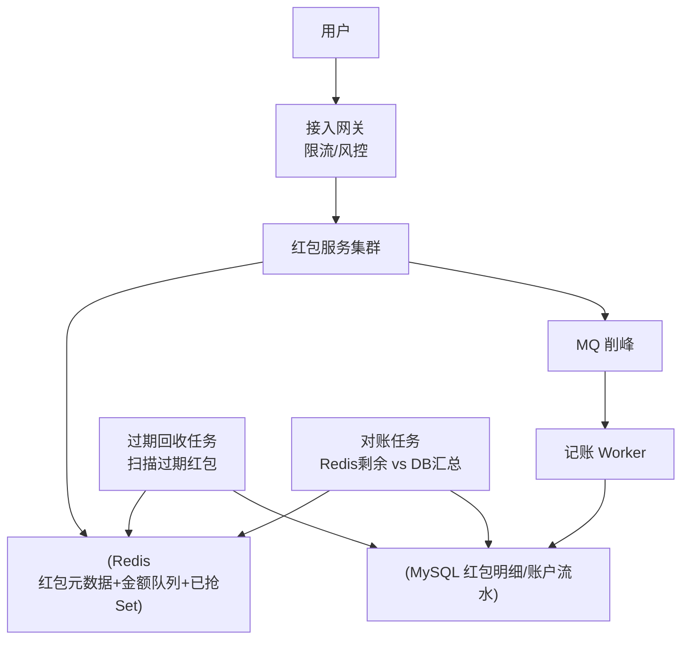
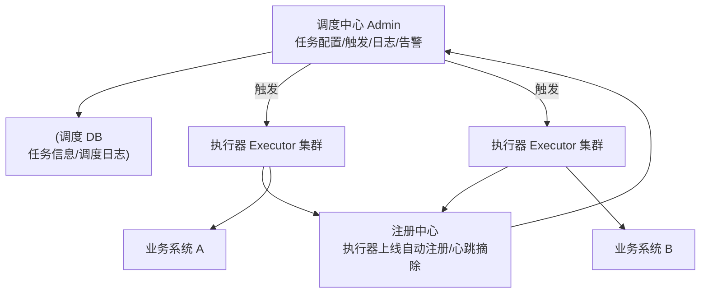
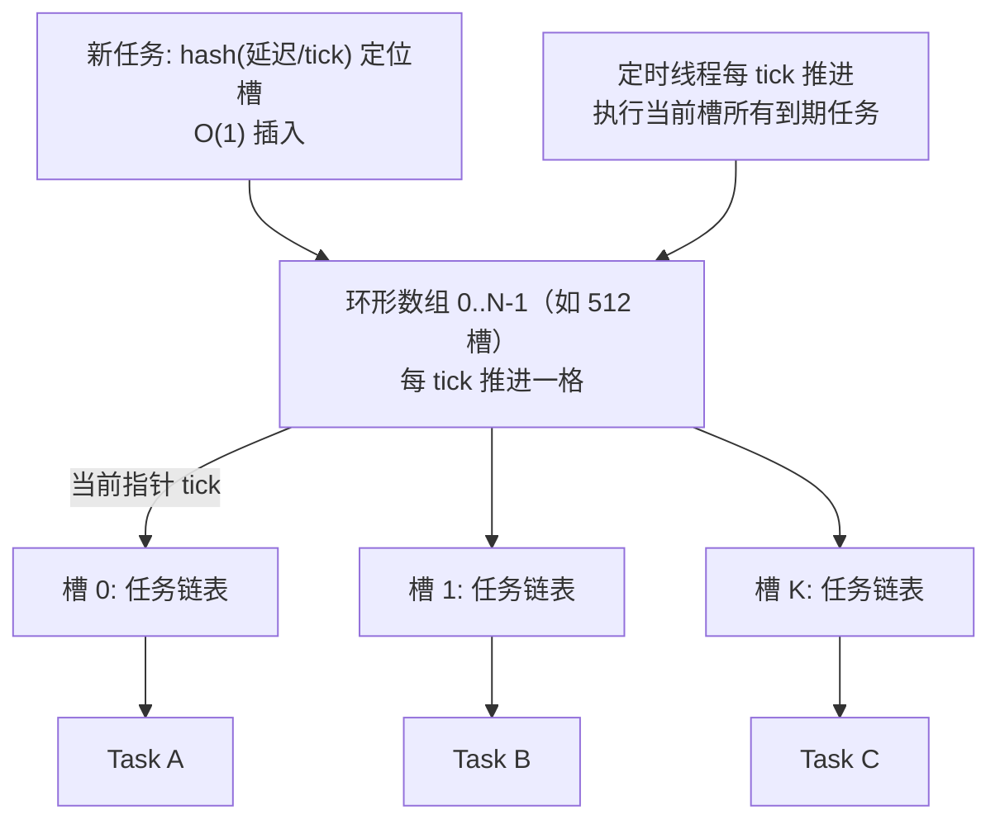
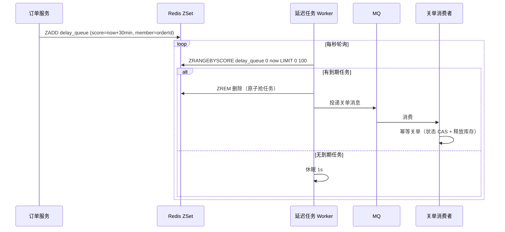

[📖 返回目录](README.md) · [⬅️ 上一章](18-system-design-methodology.md) · [➡️ 下一章](20-system-design-cases-2.md)

# 19 · 系统设计实战案例（一）：秒杀 / 短链 / 抢红包 / 定时任务

> 适用对象：10+ 年经验的资深工程师 / 架构师候选人。本章用 5 个高频系统设计面试题（秒杀、短链、抢红包、分布式定时任务、延时任务）演示第 18 章框架的落地：每个案例按「需求澄清 → 容量预估 → 架构图 → 核心流程 → 高可用与扩展 → 面试追问」的完整答题框架展开。核心能力不是背方案，而是**把流量漏斗、发号器、原子扣减、分片调度、时间轮这五类「预制件」按场景组装，并讲清每一步的取舍**。

**TL;DR 本章学习要点**

1. 秒杀 = 流量漏斗（前端静态化 → 网关限流 → Redis 预扣 → MQ 削峰 → DB 最终扣减）+ 防超卖（Lua 原子扣减 + DB 乐观锁）+ 防刷；**核心原则：把「抢到资格」和「真正下单」解耦**；
2. 短链 = 发号器（号段模式为主，雪花备选）+ 62 进制编码 + 302 跳转 + 布隆过滤器防打穿；容量估算按「读写比 100:1」展开；
3. 抢红包 = 预拆分（发红包时拆好）+ Redis Lua 原子抢 + 二倍均值算法 + 过期回收对账；**核心矛盾是「并发抢」与「金额不超发」**；
4. 定时任务三件套：XXL-Job（调度与执行分离、路由策略）、ElasticJob（ZK 分片与弹性）、Quartz 集群（DB 锁）；分片广播是海量数据任务的标配；
5. 延时任务四选一：DB 轮询（简单）/ Redis ZSet（秒级）/ 时间轮（进程内超时）/ MQ 延迟消息（可靠投递）；生产环境多为「ZSet 秒级 + MQ 兜底」组合，**关单类任务必须幂等**。

---


### 📑 本章目录

- [案例一 秒杀系统（Seckill）](#案例一-秒杀系统seckill)
- [案例二 短链系统（URL Shortener）](#案例二-短链系统url-shortener)
- [案例三 抢红包系统（Red Packet）](#案例三-抢红包系统red-packet)
- [案例四 分布式定时任务（XXL-Job / ElasticJob）](#案例四-分布式定时任务xxl-job--elasticjob)
- [案例五 延时任务系统（Delay Task）](#案例五-延时任务系统delay-task)
- [考点速查表](#考点速查表)

## 案例一 秒杀系统（Seckill）


### 1.1 需求澄清（先问清楚，再动手）

面试官给出「设计一个秒杀系统」时，开场必须确认的问题：

| 澄清项 | 典型追问 | 影响的设计决策 |
|---|---|---|
| 参与规模 | DAU 多少？预计多少人同时抢？ | 网关限流阈值、Redis 分片数 |
| 库存与时长 | 多少件商品？活动持续多久？ | 是否值得上 Redis 预扣（库存 < 10 万其实单机可扛） |
| 一致性 | 超卖绝对不允许？少卖可接受？ | 扣减链路是否双写兜底 |
| 支付环节 | 秒杀是否含支付？支付是否限时？ | 订单异步化程度、关单设计 |
| 防刷要求 | 黄牛/脚本是否在威胁模型内？ | 验证码、设备指纹、风控 |
| 客户端 | Web / App / 小程序？ | 静态化策略、推送通道 |

**关键洞察：秒杀的本质是「瞬时海量读 + 极少量写」——99.9% 的请求注定失败，系统设计的目标是把失败请求挡在最前端，让真正成功的 10 万单走最稳的链路。**

### 1.2 容量预估（给估算过程）

假设：100 万 DAU 参与，10 万件库存，1 秒抢完，50% 用户在前 3 秒内发起请求。

```text
入口峰值 QPS = 100万 × 50% / 3s ≈ 16.7万，叠加重试/刷新 ×1.5 ≈ 25 万 QPS
真正会成功的请求 = 10 万（库存），其余全部是「陪跑流量」
Redis 扣减压力 = 25 万 QPS（单实例 ~10 万 QPS，集群 3 节点即可，库存 key 打散后更小）
MQ 写入 = 成功预扣量 ≈ 10 万 / 10s ≈ 1 万 TPS
DB 写入 = 订单 10 万条 + 库存扣减 10 万条，单库单表完全可承受（瓶颈在事务并发，不在数据量）
存储 = 订单 10 万 × 500B ≈ 50 MB，可忽略
```

估算结论要主动说出：**真正的瓶颈是「25 万 QPS 的读/校验」和「1 万 TPS 的落库」，前者用 Redis 抗，后者用 MQ 削峰**。

### 1.3 总体架构：流量漏斗



分层职责一句话：**CDN 挡静态流量 → 网关挡非法流量 → 秒杀服务挡无效流量（Redis 预扣）→ MQ 削峰 → DB 只收 10 万成功单**。每一层都只让更少、更合法的请求通过。

### 1.4 核心流程：库存预扣与异步下单



面试要主动指出的三个设计点：① **预扣和用户去重放在同一个 Lua 脚本里**，保证原子性；② **返回成功 ≠ 下单成功**，用户看到的是「排队中」，最终结果异步通知——这就是「抢到资格」与「真正下单」的解耦；③ **DB 扣库存用乐观锁 `UPDATE stock SET stock=stock-1 WHERE stock>0`**，即使 Redis 被绕过也不会超卖。

### 1.5 防超卖与缓存一致性

**防超卖三层防线**（面试必背）：

1. **Redis Lua 原子扣减**：判断 + 扣减 + 记录一次性完成，脚本内无并发窗口；
2. **DB 乐观锁**：`UPDATE t_stock SET stock = stock - 1 WHERE sku_id=? AND stock > 0`，影响行数为 0 即失败——这是最终防线；
3. **订单唯一约束**：`user_id + sku_id + activity_id` 唯一索引，防止同一用户重复下单。

**缓存与 DB 一致性**：Redis 预扣成功后异步扣 DB，两者是最终一致。对账任务定期比对「Redis 剩余 + 已预扣」与「DB 库存」，发现差异后：DB 还有库存而 Redis 已扣完 → 回补 Redis；Redis 扣了而 DB 扣失败 → 回滚 Redis 并释放用户预占。**Redis 挂了怎么办：降级为纯 DB 扣减（乐观锁），QPS 从 25 万掉到几千但系统可用**，活动照样不超卖。

### 1.6 防刷与静态化

- **静态化**：商品详情页提前生成静态 HTML 上 CDN，秒杀按钮的「可点状态」由接口下发（服务端时间），杜绝本地改时间提前抢；
- **前端拦截**：按钮置灰、答题/滑块验证码（在网关层按需开启）、请求签名 + 时间戳防重放；
- **服务端风控**：IP 维度限流（单 IP 每秒 N 次）、设备指纹（同设备并发数）、账号维度（新号/黑名单/历史异常单）、同收货地址合并判黄牛；
- **业务防刷**：同一用户同一活动只允许预占一次（Lua 内完成），用户维度限流放网关。

### 1.7 高可用与扩展

- **秒杀服务无状态**，水平扩容即可；网关限流阈值按「下游 Redis 能力的 80%」配置，宁可误杀不可打垮；
- **热点 key 打散**：库存拆成 N 个分片 key（如 `seckill:stock:{sku}:{0..N-1}`），Lua 随机选分片扣减，避免单 key 热点；对账时汇总；
- **MQ 消费积压监控**：订单 Worker 消费不过来时告警扩容，秒杀场景允许「先欠着，后补上」；
- **兜底**：活动结束后跑对账 + 补单任务（Redis 有预占但 DB 无订单 → 补建订单或退款）。

### 本节高频面试题

**Q1：如何保证不超卖？如果 Redis 和 DB 的库存不一致怎么办？**

解答：三层防线：Lua 原子预扣（判断+扣减+去重一个脚本完成）→ DB 乐观锁（`WHERE stock > 0`）→ 订单唯一约束。Redis 与 DB 不一致是必然的（异步扣减），靠**对账任务**收敛：定期比对 Redis 预扣总量与 DB 实际扣减，Redis 多扣则回补并释放预占，DB 多扣则回滚 Redis；对账窗口内用户查询库存以 Redis 为准（秒杀场景读的是预扣后结果）。**面试升华：秒杀场景要的是「最终一致 + 绝不超卖」，不是强一致——把一致性要求讲清楚，就比背方案高一个段位**。

面试官追问：Redis 集群某个节点宕机，正在抢购的流量怎么办？——答：先降级：库存校验改走 DB 乐观锁（QPS 下降但正确）；同时秒杀服务本地缓存活动元数据，保证「活动时间判断」不依赖 Redis；Redis 恢复后先对账再放量。**要点：降级预案要提前写在架构里，而不是故障时临场想**。

**Q2：25 万 QPS 的流量怎么削峰？MQ 积压了怎么办？**

解答：削峰的本质是「把同步压力变异步」：网关限流（令牌桶，超限直接返回「抢购火爆」）→ Redis 预扣把 25 万压到 1 万 TPS → MQ 把 1 万 TPS 的波动抹平，Worker 按 DB 能力消费。**用户侧削峰**：前端倒计时错峰（分批次开抢）、答题验证码拖慢脚本速度。MQ 积压：秒杀场景「慢可以，不能错」——先扩容 Worker，再监控积压量，兜底策略是积压超过阈值时丢弃非核心消息（如通知类），订单消息绝不允许丢（走事务消息或本地消息表）。**面试升华：削峰链路每一层都要回答「压力传导到哪一层为止」**。

面试官追问：为什么不用 Kafka 而是用 RocketMQ？——答：秒杀需要「事务消息」（本地事务与发消息原子）和延迟消息（30 分钟未支付关单），RocketMQ 原生支持；Kafka 吞吐更高但事务与延迟能力弱。若公司只有 Kafka，则用本地消息表 + 定时补偿实现。**要点：选型讲「需求驱动的理由」，而不是「我熟悉哪个」**。

**Q3：怎么防黄牛和脚本？**

解答：分层防刷：① 前端（按钮置灰、滑块/答题、请求签名防重放）；② 网关（IP/设备指纹/账号三维限流，令牌桶 + 滑动窗口）；③ 业务（同用户同活动只允许预占一次、收货地址聚合判黄牛、黑名单）；④ 风控（新注册账号限购、历史退款率高的账号降权）。**原则：防刷成本要小于黄牛收益**——验证码只在活动前几分钟开启，避免伤害正常用户体验。**面试升华：防刷是「成本对抗」，要讲清楚每道防线防的是什么人、代价是什么**。

面试官追问：验证码会把真实用户也挡掉，怎么平衡？——答：按风险分级：低风险（老用户、正常频次）直接放行；中风险弹滑块；高风险（新号+高频+同 IP）答题验证码或直接拒绝。用设备指纹 + 行为特征打分，而不是一刀切。**要点：风控的本质是分级放行，不是全挡或全放**。

---

## 案例二 短链系统（URL Shortener）

### 2.1 需求澄清

| 澄清项 | 典型追问 | 设计影响 |
|---|---|---|
| 规模 | 日新增短链多少？总存量？ | 发号器方案与分库分表 |
| 读写比 | 跳转次数 vs 生成次数 | 缓存策略、带宽估算 |
| 生命周期 | 永久 or 过期（如 30 天）？ | 过期清理任务、存储成本 |
| 附加能力 | 要点击统计？自定义短链？ | 埋点链路、唯一码校验 |
| 合规 | 需要防钓鱼/恶意链接？ | 内容安全审核、封禁 |

### 2.2 容量预估

```text
假设：日新增 5000 万条，读写比 100:1，短码 7 位 62 进制
写 QPS = 5000万 / 86400 ≈ 580，峰值 ×5 ≈ 3000
读 QPS = 5000万 × 100 / 86400 ≈ 5.8 万，峰值 ×5 ≈ 30 万
存储 = 5000万 × 365 × 5年 × 200B（短码+长URL+时间戳）≈ 1.8 TB → 需分库分表或 KV
短码空间 = 62^7 ≈ 3.5 万亿，7 位足够 10 年使用
```

**读 QPS 30 万是主要矛盾 → Redis 缓存热短码 + 布隆过滤器挡非法 key**；写 QPS 3000 交给号段发号器即可。

### 2.3 总体架构



### 2.4 发号器设计（核心考点）

| 方案 | 原理 | 优点 | 缺点 | 结论 |
|---|---|---|---|---|
| DB 自增 | `AUTO_INCREMENT` 转 62 进制 | 最简单 | 单点、性能低、依赖 DB | 小规模可用 |
| Redis INCR | 原子自增 | 性能好 | RDB 持久化可能丢号段（AOF 可缓解）、依赖 Redis | 可接受但不优 |
| 雪花算法 | 时间戳+机器+序号 | 无中心、趋势递增 | 时钟回拨问题、ID 长度 64 位需再编码 | 适合分布式 ID 通用场景 |
| 号段模式（Leaf-Segment） | 每次从 DB 取一段（如 1000 个），内存发号 | QPS 高、DB 压力小、可批量预热 | 号段耗尽瞬间有 DB 尖刺（双 buffer 缓解） | **主流推荐** |

要点：**号段模式是「DB 批量取号 + 内存分发」**——`UPDATE t_segment SET max_id = max_id + 1000 WHERE biz_tag=?` 拿到号段后本地原子递增；双 buffer 提前加载下一段，消除尖刺。短码 = 号段数字转 62 进制补齐 7 位。**雪花与号段的取舍：雪花适合「全局限定长度 ID + 无 DB 依赖」，短链场景号段更简单可控**。

### 2.5 存储与缓存设计

- **主表**：`short_code`（唯一索引）、`long_url`、`create_time`、`expire_time`、`owner`；按 `short_code` 前几位 hash 分 16~64 库表；
- **缓存**：跳转是 30 万 QPS 读，短码 → 长 URL 全量热数据放 Redis（约 5000 万 × 200B ≈ 10 GB，集群轻松容纳），过期时间与短链过期对齐；
- **布隆过滤器**：随机/恶意短码请求如果直接查 Redis 会形成「key 不存在」穿透，加一层布隆过滤器（全量短码重建，误判率 1%），不存在直接 404；**注意布隆过滤器不能删除，过期短码靠定期全量重建**；
- **过期清理**：惰性删除（跳转时发现过期返回 404）+ 定时任务批量删除/归档冷存储。

### 2.6 302 vs 301（必考题）

- **301 永久重定向**：浏览器/搜索引擎会缓存跳转结果，后续请求不再访问短链服务——**省流量，但无法统计点击量、无法修改目标 URL、无法做运营控制**；
- **302 临时重定向**：每次请求都回源，服务端可统计、可改绑、可做风控（钓鱼链接拦截）与灰度；
- 结论：**业务短链用 302**（可运营），只有「永不改变的对外公告链接」才考虑 301；微信/微博等平台对 302 也会做安全检测（跳转前提示风险），这是平台策略不是协议问题。

### 2.7 高可用与扩展

- 发号器多节点：号段互斥（DB 行锁），单点故障时其他节点继续发号；
- 跳转链路无状态，水平扩容；缓存集群 + 布隆过滤器防止穿透打垮存储；
- 压测容量：单机网关 5 万 QPS → 30 万 QPS 需 6~8 台 + 缓存命中率 99%+；
- 埋点异步化：跳转统计走 MQ，不阻塞 302 响应。

### 本节高频面试题

**Q1：发号器用号段模式，号段用完了怎么办？多个发号器节点怎么保证不重复？**

解答：号段用完就去 DB 再取一段，双 buffer 机制（当前段用到 60% 时异步加载下一段）消除取号尖刺。节点间不重复靠 DB 行锁：`UPDATE ... WHERE biz_tag=?` 的原子性保证每个节点拿到的号段互不重叠。**面试升华：号段模式本质是「把 DB 的吞吐换成内存的吞吐」，代价是 DB 故障时号段发完即停——所以号段要留 30% 余量 + DB 主从**。

面试官追问：Redis INCR 和号段比，为什么号段更优？——答：INCR 每发一个号就打一次 Redis，RDB 快照会丢号（重启后可能重复发号，需要 AOF everysec 且仍可能丢最后一秒）；号段只在取段时打一次 DB，内存内自增无网络开销，且号段天然可批量预热。**要点：能批量就别单发，能本地就别远程**。

**Q2：为什么用 302 不用 301？**

解答：302 每次回源，支持点击统计、URL 改绑、风控拦截、灰度发布；301 被浏览器/搜索引擎缓存，跳转后短链服务「失明」且无法修改。业务短链选 302，代价是多一次跳转延迟（毫秒级，可接受）。**面试升华：这是「性能 vs 可运营性」的经典取舍，答案要落到业务诉求上**。

面试官追问：跳转延迟怎么优化？——答：302 回源命中 Redis 是 1~2 ms；可以加一层浏览器端 302 缓存（Cache-Control: max-age=60，短时间缓存降低回源率），代价是统计精度下降 1 分钟内的重复点击；对延迟敏感场景（短信链接）可预解析。**要点：优化要讲代价，不能只说收益**。

**Q3：随机生成的短码被恶意扫描怎么办？**

解答：三层：① 布隆过滤器挡「不存在的 key」穿透（直接 404，不打 Redis/DB）；② 网关对单 IP 跳转频率限流 + 封禁规则；③ 内容安全：生成时审核长 URL（黑名单域名/钓鱼检测），发现恶意链接直接封禁短码。**面试升华：短链是钓鱼重灾区，安全设计要写进方案而不是事后补**。

面试官追问：布隆过滤器误判怎么办？——答：误判 = 把「不存在」判成「可能存在」，代价只是多查一次 Redis/DB，返回 404 即可，不影响正确性；误判率通过位数组大小与 hash 函数数量控制（10 亿数据、1% 误判率约需 1.2 GB 位数组）。**要点：布隆过滤器只做「提前拦截」，不做「最终裁决」，最终裁决永远是存储**。

---

## 案例三 抢红包系统（Red Packet）

### 3.1 需求澄清

| 澄清项 | 典型追问 | 设计影响 |
|---|---|---|
| 规模 | 春节峰值每秒发/抢多少？ | Redis 集群规模、是否预拆分 |
| 金额语义 | 拼手气 or 平均？金额精度？ | 拆分算法 |
| 并发约束 | 每人最多抢几个？能否重复抢同一红包？ | 去重数据结构 |
| 生命周期 | 红包多久过期？过期金额去向？ | 过期回收任务 |
| 一致性 | 金额绝不能超发？账目需要可审计？ | 对账与记账设计 |

### 3.2 容量预估

```text
假设：峰值每秒发红包 5 万个，每秒抢红包 100 万次（春晚场景量级）
读/校验流量（红包是否存在、是否抢过）= 100 万 QPS → Redis 集群扛（单实例 10 万，100 节点分片）
写流量（真正抢成功）= 每秒 50 万次拆红包 → Lua 原子操作，key 分散到集群
落库流量 = 抢成功明细 50 万/s → MQ 削峰后按 DB 能力落库
存储 = 红包明细（日 10 亿 × 200B）→ 分库分表 + 冷热分离
```

**核心矛盾：抢的动作必须毫秒级完成且不超发，账目可以异步落库——这是「读写分离 + 最终一致」的典型场景**。

### 3.3 总体架构



### 3.4 红包拆分算法：预拆分 vs 实时拆分

| 维度 | 预拆分（发时拆好） | 实时拆分（抢时再算） |
|---|---|---|
| 数据结构 | 发红包时把金额拆成 N 份存入 Redis List，抢=LPOP | 只存总金额+剩余个数，抢时算一个随机金额 |
| 并发能力 | 极高（LPOP 原子） | 高（Lua 内计算） |
| 灵活性 | 金额固定不可改 | 可支持「先抢后算」的活动玩法 |
| 内存占用 | N 个元素（1 万红包 = 1 万条） | 常数级 |
| 适用 | 大额高频（春晚） | 常规场景、需要预算控制的场景 |

**二倍均值算法（拼手气）**：每次随机金额 = `random(0.01, 剩余金额 / 剩余个数 × 2)`，保证：① 单个红包金额不超过平均值的 2 倍（不会出现极端值）；② 期望均匀；③ 最后一个红包 = 剩余金额（兜底，因浮点误差可能为 0.01，需处理精度）。**数学性质：任意顺序抢，期望金额相等——这是面试加分点**。

### 3.5 并发控制：Redis Lua 原子抢

抢红包必须在一个 Lua 脚本内完成，防止并发窗口：

```lua
-- 参数：红包ID、用户ID
-- 1. 红包存在且未过期
-- 2. 用户未抢过（SISMEMBER 已抢Set）
-- 3. LPOP 金额（或实时拆分算金额）
-- 4. 更新剩余个数/金额
-- 5. SADD 已抢Set，记录明细到待落库队列
```

**为什么必须 Lua**：检查+扣减+记录三个操作拆开做，并发下必然出现「超抢」（两个线程同时通过检查）。Lua 脚本在 Redis 单线程模型内原子执行，是并发控制的银弹。**防重复抢**用 `SADD` 返回值判断（返回 0 表示已存在 → 拒绝），同时落库明细加 `(packet_id, user_id)` 唯一索引做最终防线。

### 3.6 过期回收与事务一致性

- **过期回收**：定时任务（分钟级）扫描「红包主记录」的过期时间，对未抢完的红包执行：`Lua: 校验过期 → 取剩余金额 → 标记回收 → 退回原账户`，退回金额异步记账；**回收与抢并发时同样靠 Lua 原子性**，抢到的用户不退回；
- **事务一致性**：Redis 是主账本（实时），MySQL 是审计账本（异步）。对账任务周期性比对：`Redis 已抢金额总和 + 剩余金额 == 红包总金额`，不一致时以 Redis 为准回放明细；资金类系统对账是必须项，面试要主动提；
- **记账时序**：抢成功 → 明细投 MQ → Worker 落库；账户余额更新走独立的账户服务（复式记账，见第 20 章支付案例）。

### 3.7 高可用与扩展

- Redis 集群按红包 ID hash 分片，红包 key 天然分散无热点；
- 抢红包服务无状态水平扩容；网关限流保护 Redis；
- MQ 积压只影响「明细可查性」，不影响「抢」的正确性——**这是把账本异步化的最大收益**；
- 兜底：对账发现 Redis 数据异常（如实例宕机丢数据）时，以 DB 明细为准重建红包状态（重放）。

### 本节高频面试题

**Q1：二倍均值算法的数学原理？为什么不会超发？**

解答：每次取 `random(0.01, 剩余金额/剩余个数 × 2)`，上限 = 当前均值 × 2，因此任意时刻单个红包金额有界；最后一次直接把剩余金额全部给出，保证总额恰好分完、不超发。期望上每个红包 = 当前均值，先抢后抢期望相同，公平。**面试升华：讲算法要讲「为什么有界、为什么恰好分完、为什么公平」三个性质**。

面试官追问：浮点误差怎么处理？——答：金额用「分」做整数运算（long），避免 double 累加误差；最后一次剩余金额可能因前面的取整出现负值，兜底逻辑是「若剩余金额 <= 0.01 则直接给 0.01 并从前面补偿」（实际实现是每次随机前先检查剩余金额是否足够分给剩余人数）。**要点：钱永远用整数最小单位，这是支付/红包系统的铁律**。

**Q2：100 万 QPS 的抢红包，Redis 扛得住吗？扛不住怎么办？**

解答：扛得住的前提是「key 分散」：红包 ID hash 到集群各节点，单 key 压力 = 该红包的并发（一般几百到几千 QPS），集群总吞吐按节点线性扩展；Lua 脚本保证单 key 操作微秒级。扛不住时的降级：① 网关限流（超限返回「手慢了」）；② 本地缓存红包元数据（是否存在、是否过期）减少无效 Redis 读；③ 极端情况「拆包转异步」：先记录抢到资格，金额稍后异步计算（玩法变了，慎用）。**面试升华：高并发设计的核心是「把热点拆散 + 把无效流量挡在前面」**。

面试官追问：抢红包和秒杀都用 Redis + Lua，两者区别是什么？——答：秒杀是「总量固定、人人可抢、抢到资格再异步下单」；红包是「金额分片、每用户限一次、抢=立即得到金额」。秒杀的扣减是「库存减一」，红包的扣减是「弹出一个随机金额」，后者多一个金额生成步骤（预拆分则没有）。**要点：能对比同类系统的差异，说明你真的理解而不是背题**。

**Q3：红包过期了，剩余金额怎么退？退回过程中用户又在抢怎么办？**

解答：回收用 Lua 原子完成「校验过期 → 取剩余 → 标记已回收 → 记账」，与抢红包共用同一把「锁」（脚本原子性）；用户侧抢失败返回「红包已过期」。退回走异步记账（账户流水 + 余额更新），幂等（回收单号唯一）。**面试升华：并发系统的每个「后台任务」都要回答「和前台请求并发时怎么办」**。

面试官追问：定时任务扫描全量红包太慢怎么办？——答：① 红包主记录按过期时间建索引，只扫「未过期且未抢完」的小集合；② 用延迟队列（见案例五）在红包创建时投递「到期检查」消息，避免全表扫；③ 分片扫描（多 worker 按红包 ID 取模）。**要点：能主动把案例五的方案复用过来，是「知识成网」的信号**。

---

## 案例四 分布式定时任务（XXL-Job / ElasticJob）

### 4.1 需求澄清与场景

典型场景：报表生成、对账、数据清理、缓存刷新、补偿任务、批量推送。澄清要点：

| 澄清项 | 典型追问 | 设计影响 |
|---|---|---|
| 任务规模 | 任务数（几百/几千）？执行节点数？ | 调度中心容量、分片策略 |
| 频率 | 秒级 / 分钟级 / 日级？ | 调度精度要求 |
| 数据量 | 单任务处理多少数据？ | 是否需要分片广播 |
| 可靠性 | 任务失败能否重试？幂等？ | 失败重试与告警策略 |
| 依赖 | 是否有外部系统（报表/推送）？ | 是否拆成执行器集群 |

### 4.2 容量预估

```text
假设：任务 2000 个，分钟级任务为主（每秒调度 ~30 次），执行节点 200 台
调度中心 QPS = 任务数 × 每秒触发率 ≈ 100~1000，单机可扛（瓶颈不在调度，在任务执行）
分片任务：10 亿数据 8 节点 → 每节点处理 1.25 亿，执行时间 = 数据量 / 单节点处理速度
```

**定时任务的瓶颈永远在「执行」不在「调度」**——调度中心无状态水平扩展，执行器按数据量分片。

### 4.3 XXL-Job 架构与原理



**XXL-Job 核心机制**：

1. **调度与执行分离**：Admin 只管「到点触发」（生成调度日志、发触发请求），Executor 只管「执行任务」（回调结果）；Admin 无状态可集群，Executor 挂掉不影响调度；
2. **注册中心**：Executor 启动时向 Admin 注册（地址列表），心跳维护；执行器下线自动摘除，新任务不再路由过去；
3. **路由策略**：轮询、随机、一致性哈希（同任务固定节点）、故障转移（失败换节点）、**分片广播（Sharding）**——`index/total` 下发给每个执行器，各节点处理自己的分片（如 10 亿数据 8 节点，每节点处理 `id % 8 == i` 的数据）；
4. **失败处理**：失败重试（次数可配）、告警（邮件/钉钉）、阻塞处理策略（单机串行/丢弃后续调度/覆盖之前调度——防止任务执行超时导致重叠）；
5. **调度日志**：每次触发落库，支持查看执行日志、手动触发、GLUE 脚本热更新。

### 4.4 ElasticJob 原理（对比理解）

- **分片**：任务配置分片数（如 10 片），由**主节点**负责把分片分配给各执行器；执行器按 `分片项` 处理自己的数据；
- **协调依赖 ZooKeeper**：ZK 临时节点感知执行器上下线 → **自动重新分片**（弹性伸缩），主节点选举（ZK 分布式锁）；
- **与 XXL-Job 对比**：

| 维度 | XXL-Job | ElasticJob |
|---|---|---|
| 协调机制 | 调度 DB + 心跳注册 | ZooKeeper |
| 分片 | 分片广播（index/total 自算） | 主节点分配分片项，自动 rebalance |
| 弹性 | 手动加机器，路由策略重算 | 节点上下线自动重新分片 |
| 运维 | 自带管理台，开箱即用 | 需自建管理台，ZK 运维成本 |
| 适用 | 中小规模、快速落地 | 大规模、分片弹性要求高 |

**Quartz 集群**（可选提一句）：基于 DB 行锁的简单集群调度，秒级任务、节点少时够用，但不支持分片与动态注册，是「老一代」方案。

### 4.5 定时任务 vs 延迟任务（必考对比）

| 维度 | 定时任务 | 延迟任务 |
|---|---|---|
| 触发语义 | 固定时间点/周期（cron） | 事件发生后相对时间（30 分钟后） |
| 典型场景 | 日报、对账、清理 | 订单超时关单、优惠券过期 |
| 实现载体 | 调度框架（XXL-Job/Quartz） | 延迟队列（ZSet/时间轮/MQ） |
| 精度要求 | 分钟级即可 | 秒级~分钟级 |
| 数据来源 | 任务表/配置 | 业务事件（订单创建） |

**一句话区分：定时任务是「到点扫一批」，延迟任务是「事件来了之后到点处理单条」**；订单超时关单用延迟任务（每单精确计时），日报用定时任务。

### 4.6 高可用与扩展

- Admin 集群 + DB 主从（调度日志可丢失，任务配置不可丢）；
- Executor 幂等：同一任务可能被重试/故障转移执行多次，业务侧必须幂等（如对账任务按「批次号唯一」去重）；
- 分片任务注意「数据倾斜」：按 `id % N` 分片时历史数据分布不均会导致某节点慢，用「范围分片」或「动态领取」（每节点领一批处理完再领）缓解；
- 监控：任务执行时长、失败率、积压告警；调度延迟告警（Admin 触发时间与 Executor 实际执行时间差）。

### 本节高频面试题

**Q1：XXL-Job 的调度中心挂了，正在跑的任务会怎样？怎么保证高可用？**

解答：调度中心挂掉 → 新任务不再触发，但**已触发的任务继续执行**（执行器独立运行）；高可用 = Admin 多节点集群（无状态，抢 DB 锁触发）+ DB 主从。执行器侧的兜底：任务执行中不依赖 Admin，回调失败只影响日志展示，业务结果不受影响。**面试升华：调度系统的可用性设计要区分「触发链路」和「执行链路」，前者靠集群，后者靠执行器自治**。

面试官追问：任务执行超时了，下次调度又来了，会重叠执行吗？——答：看阻塞处理策略：单机串行（排队）、丢弃后续、覆盖之前；分片任务要自己保证「同一分片同一时刻只有一个节点执行」——用分布式锁（Redis/ZK）或数据库唯一批次号。**要点：重叠执行是定时任务第一大坑，方案里必须显式处理**。

**Q2：10 亿条数据的数据迁移任务，怎么设计？**

解答：分片广播：任务配置 10 个分片，10 个执行器各处理 `id % 10 == i` 的数据；每个分片内按主键范围分批（每批 1000 条）处理，记录断点（处理到哪个 id），失败重启从断点续跑；全程幂等（目标表唯一键）。**面试升华：海量数据处理三件套 = 分片 + 分批 + 断点续跑**。

面试官追问：为什么不用一个节点慢慢跑？——答：单节点跑 10 亿条可能要 10 小时，10 节点并行 1 小时；更重要的是单点失败要重头再来，分片 + 断点让失败成本降低一个数量级。**要点：讲清楚「并行度收益」和「失败成本收益」两个维度**。

**Q3：定时任务和延迟任务什么区别？订单超时关单用哪个？**

解答：定时任务按 cron 周期触发「批量扫描」；延迟任务按「事件 + 相对时间」触发「单条精确处理」。订单超时关单：每个订单创建时投递「30 分钟后关单」延迟消息（Redis ZSet / MQ 延迟消息），到点精确处理该单；也可退化为定时任务每 5 分钟扫一次超时未支付订单（批量），精度差但实现简单。**面试升华：延迟任务精度高但每条消息都要投递，定时扫描实现简单但有扫描窗口——小流量用扫描，大流量用延迟队列，两者可叠加（延迟队列为主 + 定时扫描兜底）**。

面试官追问：延迟消息丢了怎么办？——答：兜底 = 定时扫描任务（每 10 分钟扫一次「超时未支付且未关单」的订单），延迟队列只是「提速」，扫描任务是「保底」；关单动作本身幂等（状态 CAS），重复关单无害。**要点：可靠性靠「双保险」，不靠单一组件**。

---

## 案例五 延时任务系统（Delay Task）

### 5.1 需求澄清

场景：订单 30 分钟未支付自动关单、优惠券到期提醒、直播开播提醒、消息重试。澄清要点：延迟范围（秒级~天级）、精度要求（秒/分钟）、任务量（万/百万/亿级）、可靠性（丢一条可接受吗）、是否需要取消任务。

### 5.2 方案全景对比（先给全景再深入）

| 方案 | 原理 | 精度 | 容量 | 可靠性 | 复杂度 |
|---|---|---|---|---|---|
| DB 轮询 | 定时扫「到期时间」字段 | 分钟级 | 百万级（需索引+分批） | 中（依赖 DB） | 低 |
| Redis ZSet | score=到期时间戳，轮询取到期 | 秒级 | 千万级（受轮询频率限制） | 中（Redis 持久化风险） | 中 |
| 时间轮 | 环形数组 + tick 推进 | tick 粒度（毫秒~秒） | 进程内内存级 | 低（内存，需持久化兜底） | 中 |
| MQ 延迟消息 | 消息到达延迟投递 | 级别/任意时间 | 高（依赖 MQ） | 高（MQ 可靠性） | 低 |
| **组合** | 秒级 ZSet + 分钟级 MQ/扫表 | 按需 | 高 | 高 | 中 |

### 5.3 时间轮原理（HashedWheelTimer）



**原理**：环形数组，指针每个 tick（如 100ms）前进一格；任务插入时按 `(当前tick + 延迟/tick) % 槽数` 定位槽位，挂到槽的链表上；指针扫到某槽时执行该槽所有任务。**超出环一周的任务记 `rounds`（剩余圈数），每圈减一，减到 0 才执行**——这是「大延迟任务」的处理方式。

**特点**：插入/删除 O(1)，无锁或轻量锁，适合**进程内、海量、短延迟**的超时控制（Netty 的 HashedWheelTimer 用于连接超时/请求超时）；缺点：单机内存态、重启丢失、tick 粒度决定精度、任务执行耗时不能超过 tick（否则指针阻塞）。

### 5.4 Redis ZSet 延迟队列（订单关单标配）



**要点**：`ZRANGEBYSCORE + ZREM` 必须组合成「取出即删」的原子操作（用 Lua 或 `ZPOPMIN`），否则多个 Worker 会重复取到同一任务；取到任务投 MQ 是为了「可靠投递 + 削峰」，消费端幂等（订单状态从「待支付」CAS 到「已关闭」）。**Redis 挂了怎么办：ZSet 是提速层，定时扫表（每分钟扫超时未关单）是兜底层**。

### 5.5 MQ 延迟消息

- **RocketMQ**：延迟消息按**延迟级别**投递（1s/5s/10s/30s/1m/2m/3m/4m/5m/6m/7m/8m/9m/10m/20m/30m/1h/2h，共 18 级），到点才被消费者看到；实现原理：消息先进「延迟 Topic」，定时任务按级别扫到点后转投真实 Topic（新版本支持任意时间延迟，具体以版本文档为准，待核实）；**缺点：只能选固定级别，30 分钟这类自定义时长要取整到 30m 级别**；
- **RabbitMQ**：TTL + 死信队列——消息设置 TTL，过期后进死信交换机，消费者监听死信队列；**缺点：队列头部过期（消息堆积时先到期的反而后出，除非每任务单独队列）、死信队列膨胀**；
- **Kafka**：原生不支持延迟消息，需自研（按延迟时间分桶 Topic + 定时转投）。

### 5.6 选型决策（面试要给判断标准）

| 业务诉求 | 推荐方案 | 理由 |
|---|---|---|
| 订单超时关单（分钟级、量大、要可靠） | Redis ZSet + MQ + 定时扫表兜底 | 精度够、成本低、双保险 |
| RPC/连接超时（毫秒级、进程内） | 时间轮（HashedWheelTimer） | O(1) 插入、无外部依赖 |
| 优惠券过期提醒（小时~天级、量大） | RocketMQ 延迟级别 | 可靠、削峰、实现简单 |
| 小系统、任务量小 | DB 轮询扫表 | 零依赖，先跑起来 |

**核心判断：延迟任务系统没有银弹，精度、容量、可靠性、成本四个维度互相制约，生产环境几乎都是组合方案**。

### 5.7 高可用与扩展

- 多 Worker 抢任务：取删原子化（Lua/ZPOPMIN）+ 分布式锁兜底，防止重复投递；
- 消费端幂等：关单/提醒动作幂等（状态机 CAS），重复消息无害；
- 任务取消：订单支付成功后要从 ZSet 删除该任务（ZREM），删失败靠「消费时校验订单状态」兜底；
- 监控：延迟队列积压量（ZSet 大小）、任务到期到执行的时延、投递失败死信告警。

### 本节高频面试题

**Q1：时间轮和 Redis ZSet 延迟队列，什么场景分别用哪个？**

解答：时间轮是**进程内内存结构**——毫秒级精度、O(1) 插入、海量短超时（连接超时、请求超时），但重启丢任务、不能跨进程；Redis ZSet 是**分布式共享队列**——秒级精度、跨服务、可持久化（AOF），适合订单关单这类「要可靠、可跨服务、分钟级」的任务。**面试升华：先分「进程内 vs 分布式」两个阵营，再比精度与可靠性，答案自然清晰**。

面试官追问：时间轮任务执行时间超过 tick 会怎样？——答：指针推进被阻塞，后续任务全部延迟——所以时间轮任务必须「快速执行或丢给线程池异步执行」，Netty 的实现里任务是在 worker 线程执行的，慢任务会拖垮整个轮子。**要点：时间轮的坑在「慢任务」，方案里要显式处理（异步执行 + 慢任务隔离）**。

**Q2：Redis ZSet 延迟队列，多个 Worker 怎么避免重复消费？**

解答：取任务必须原子：「ZRANGEBYSCORE 取到期任务」+「ZREM 删除」放同一个 Lua 脚本，或直接用 `ZPOPMIN`（原子弹出）；弹出后再投 MQ，消费端幂等。即使有重复（如 Worker 崩溃在 ZREM 之后投递前），消费端状态 CAS 保证无害。**面试升华：延迟队列的可靠性 = 取出原子性 + 投递可靠性 + 消费幂等，三层缺一不可**。

面试官追问：ZSet 里的任务量达到千万级，轮询性能会怎样？——答：ZRANGEBYSCORE 按 score 范围取是 O(logN + M)，千万级无压力；真正的瓶颈是「每秒轮询空转」——用 ZSET 的 MIN score 判断「最早任务是否到期」，没到期就 sleep，避免无谓扫描。**要点：面试能说出「先看 MIN 再决定扫不扫」这个优化，说明真做过**。

**Q3：订单 30 分钟未支付关单，为什么不用定时任务每分钟扫一次？**

解答：可以，但要回答代价：① 扫描窗口 = 最长 1 分钟误差（30 分钟关单变 31 分钟，业务可接受但体验差）；② 每分钟全表扫「待支付且超时」的订单，需要索引且数据量大时扫描成本高；③ 高峰期下单 10 万/分钟，扫描与写入争抢 DB。延迟队列让每个订单「精确到点触发、只处理自己」，扫描只做兜底。**面试升华：小流量扫表足够，大流量必须延迟队列——把「规模决定方案」讲出来，就是架构师的判断力**。

面试官追问：关单时用户正在支付，怎么办？——答：关单与支付回调并发，靠**状态机 CAS** 解决：关单 `UPDATE order SET status='closed' WHERE id=? AND status='pending_pay'`，支付回调 `UPDATE ... WHERE status='pending_pay'`——只有一个能成功；支付成功但关单先执行（极少见窗口）→ 关单后支付成功，靠对账任务发现「已关闭但有支付成功流水」的订单，自动退款。**要点：并发写同一状态，永远用 CAS + 对账兜底**。

---

## 考点速查表

| 考点 | 一句话要点 |
|---|---|
| 秒杀本质 | 瞬时海量读+极少量写；99.9% 请求注定失败，挡在最前端 |
| 流量漏斗 | CDN→网关限流→Redis 预扣→MQ 削峰→DB 最终扣减 |
| 防超卖三层 | Lua 原子预扣 + DB 乐观锁(WHERE stock>0) + 订单唯一约束 |
| 抢到≠下单 | 预扣成功返回「排队中」，订单异步 Worker 创建 |
| 缓存一致性 | Redis 与 DB 最终一致，对账任务收敛差异 |
| Redis 降级 | Redis 挂→纯 DB 乐观锁扣减，QPS 降但正确性不丢 |
| 热点打散 | 库存拆 N 个分片 key 随机扣，避免单 key 热点 |
| 防刷分层 | 前端验证码/签名 + 网关三维限流 + 业务去重 + 风控黑名单 |
| 短链编码 | 62 进制 7 位 ≈ 3.5 万亿，够 10 年 |
| 发号器 | 号段模式最优（DB 批量取段+双 buffer），雪花适合通用 ID |
| 302 vs 301 | 302 可统计可改绑；301 被缓存「失明」，业务短链用 302 |
| 布隆过滤器 | 挡不存在 key 的穿透；只做提前拦截，最终裁决靠存储 |
| 红包预拆分 | 发时拆好存 List，LPOP 原子抢，适合超大并发 |
| 二倍均值 | random(0.01, 剩余/个数×2)；有界、恰好分完、期望公平 |
| 金额精度 | 用「分」整数运算，杜绝 double 误差 |
| 红包 Lua | 校验+扣减+去重一个脚本；SADD 返回 0 判重复 |
| 红包一致性 | Redis 实时账本 + DB 审计账本，对账任务比对 |
| 过期回收 | Lua 原子「校验过期+取剩余+标记回收」，与抢并发安全 |
| 定时任务本质 | 到点批量触发；瓶颈在执行不在调度 |
| XXL-Job | 调度与执行分离 + DB 注册中心 + 路由策略 + 分片广播 |
| ElasticJob | ZK 协调 + 主节点分片 + 上下线自动 rebalance |
| 分片三件套 | 分片 + 分批 + 断点续跑；幂等防重试重叠 |
| 定时 vs 延迟 | 定时=cron 批量扫；延迟=事件后相对时间单条精确触发 |
| 时间轮 | 环形槽+指针推进，插入 O(1)，进程内毫秒级超时 |
| ZSet 延迟队列 | score=到期时间戳；ZRANGEBYSCORE+ZREM 必须原子 |
| 延迟队列可靠性 | 取出原子 + 投递可靠 + 消费幂等 + 定时扫表兜底 |
| MQ 延迟 | RocketMQ 18 个固定级别；RabbitMQ TTL+死信有头部过期坑 |
| 关单并发 | 关单/支付回调都用状态 CAS，赢家只有一个，对账兜底 |
