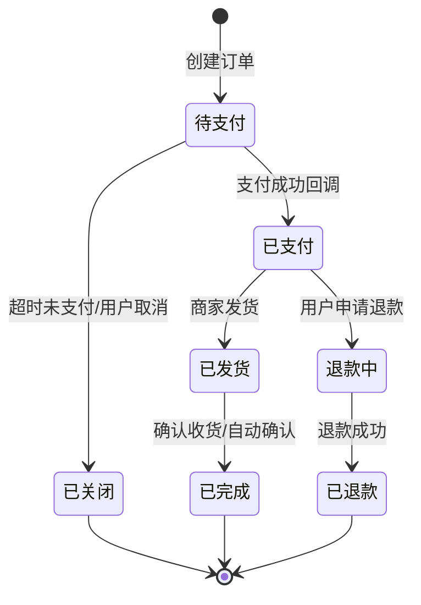
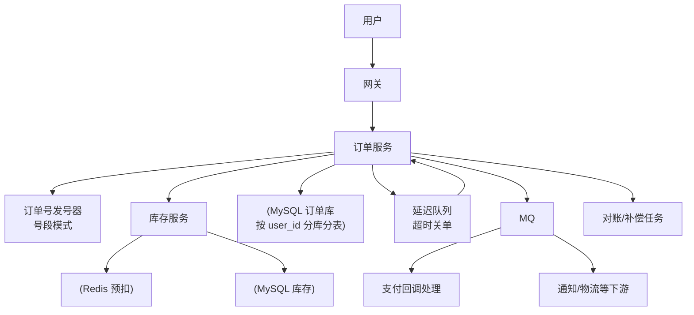
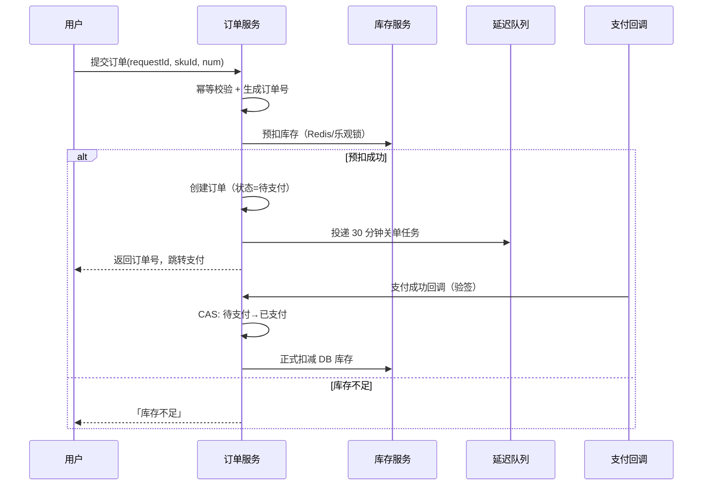
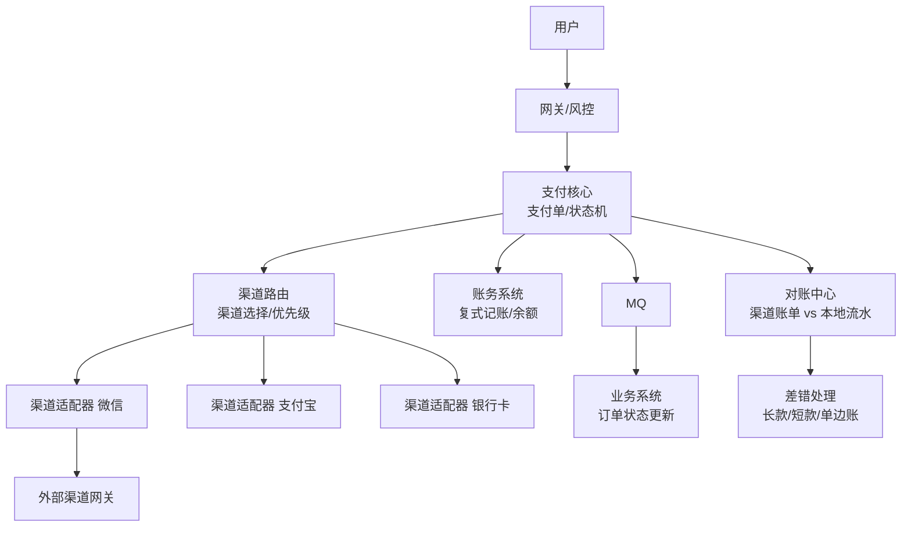
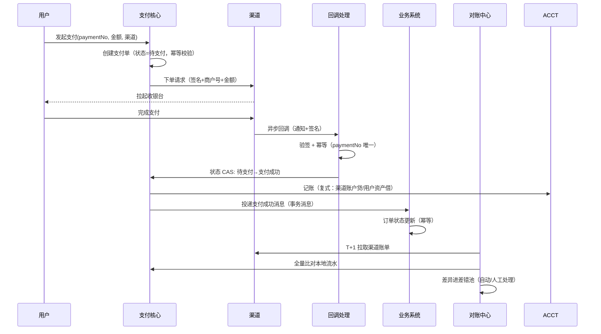
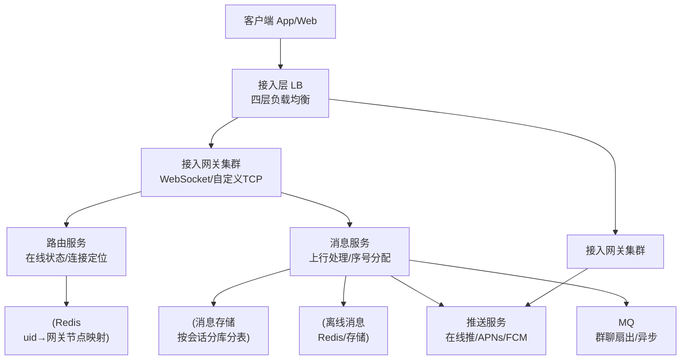
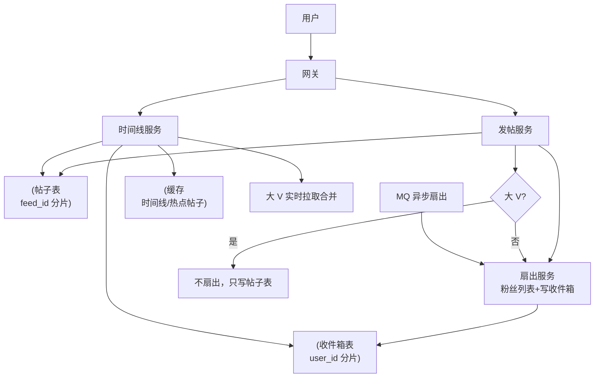
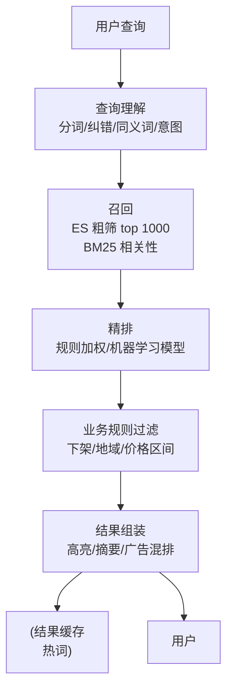
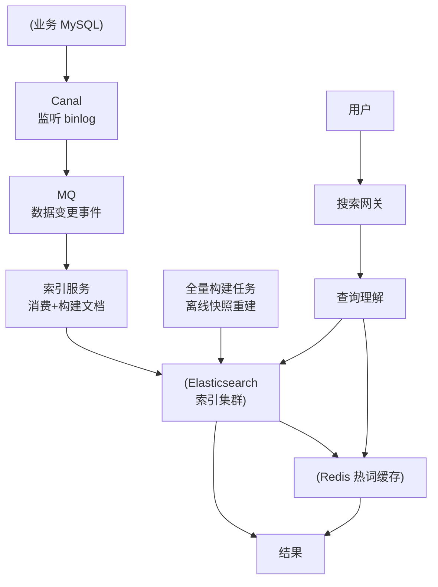

[📖 返回目录](README.md) · [⬅️ 上一章](19-system-design-cases-1.md) · [➡️ 下一章](21-cloud-native-bigdata.md)

# 20 · 系统设计实战案例（二）：订单 / 支付 / IM / Feed 流 / 搜索

> 适用对象：10+ 年经验的资深工程师 / 架构师候选人。本章承接第 19 章的 5 个案例，再覆盖 5 个业务向高频设计题：电商订单与库存、支付系统、IM、朋友圈/Feed 流、搜索系统。每个案例同样按「需求澄清 → 容量预估 → 架构图 → 核心流程 → 高可用与扩展 → 面试追问」展开。本章的隐藏主线是**状态机与最终一致**：订单、支付、IM 消息、Feed 时间线，本质上都是「状态怎么流转、怎么在分布式下保持一致」。

**TL;DR 本章学习要点**

1. 订单系统 = 状态机（待支付→已支付/已关闭→已发货→已完成/退款）+ 库存扣减时机选择（下单扣/支付扣/预扣）+ 超时关单（延迟队列）+ 幂等；**状态机是所有资金/订单系统的骨架**；
2. 支付系统 = 渠道抽象 + 异步回调 + 对账 + 幂等防重；**跨系统资金流转不做强一致，做「状态机 + 对账 + 差错处理」的最终一致**；
3. IM = 长连接（接入层）+ 消息可靠性（上行/下行 ack + 离线补偿 + 多端同步）+ 推拉结合 + 群聊扇出；**消息顺序靠服务端分配序号，不靠客户端**；
4. Feed 流 = 推模式（写放大）/ 拉模式（读放大）/ 推拉结合（大 V 隔离）；**微博式设计 = 普通用户推 + 大 V 拉 + 缓存扛读**；
5. 搜索 = 倒排索引 + 召回/排序两阶段 + 查询理解 + Canal 增量同步链路；**链路任何一环挂了都要能降级到上一级缓存**。

---


### 📑 本章目录

- [案例一 电商订单与库存系统](#案例一-电商订单与库存系统)
- [案例二 支付系统](#案例二-支付系统)
- [案例三 IM 系统（即时通讯）](#案例三-im-系统即时通讯)
- [案例四 朋友圈 / Feed 流](#案例四-朋友圈--feed-流)
- [案例五 搜索系统设计](#案例五-搜索系统设计)
- [考点速查表](#考点速查表)

## 案例一 电商订单与库存系统


### 1.1 需求澄清

| 澄清项 | 典型追问 | 设计影响 |
|---|---|---|
| 下单路径 | 立即购买 / 购物车？是否含秒杀？ | 库存扣减时机 |
| 库存语义 | 下单减 / 支付减 / 预扣？ | 超卖风险与回补机制 |
| 支付 | 支持哪些渠道？支付超时多久关单？ | 关单延迟队列、回调 |
| 售后 | 取消/退款/换货流程？ | 状态机分支 |
| 规模 | 日订单量？峰值 TPS？ | 分库分表、异步化程度 |

### 1.2 容量预估

```text
假设：日订单 1000 万，峰值 TPS 1 万（大促 5 万），客单价商品 10 万 SKU
写 = 下单 1 万 TPS（大促 5 万）+ 状态变更（支付/关单/发货）≈ 3 万 TPS
读 = 订单查询（用户中心/管理后台）≈ 5 万 QPS，读写比 ~2:1
存储 = 1000万 × 365 × 3年 = 110 亿条 × 500B ≈ 55 TB → 必须分库分表
分片 = 按 user_id 分 1024 库表；订单号全局唯一（号段/雪花）
```

**结论：订单系统是「写密集 + 强状态」系统，核心设计是分库分表 + 状态机 + 异步化（关单、通知、库存回补）**。

### 1.3 订单状态机（面试必画）



**状态机的三条铁律**：① 状态变更必须 CAS（`UPDATE ... SET status=? WHERE id=? AND status=预期值`），并发只允许一个赢家；② 状态流转是**单向**的，禁止跳变（已关闭不能再变已支付，特殊场景走「对账补偿」而非改状态）；③ 每个状态转移都记录**操作流水**（谁、何时、什么动作、前后状态），这是审计与对账的基础。

### 1.4 库存扣减方案对比（核心考点）

| 方案 | 扣减时机 | 优点 | 缺点 | 适用 |
|---|---|---|---|---|
| 下单减库存 | 创建订单即扣 | 不会超卖、用户体验一致 | 恶意下单占库存不支付 | 低并发、强管控 |
| 支付减库存 | 支付成功才扣 | 不占库存 | **下单与支付间可能超卖**（库存被他人买光） | 库存充足场景 |
| 预扣（锁定） | 下单锁 N 分钟，超时释放 | 兼顾体验与库存周转 | 需要超时释放任务 | **主流（淘宝/京东）** |
| 缓存预扣 + DB 扣减 | Redis 先扣，异步落 DB | 抗高并发 | 一致性靠对账收敛 | 秒杀（见第 19 章） |

**超卖防线**：乐观锁 `UPDATE t_stock SET stock = stock - n WHERE sku_id=? AND stock >= n`（影响行数 0 即失败）；悲观锁 `SELECT ... FOR UPDATE`（并发低时可，锁粒度大）；Redis Lua（高并发预扣）。**面试要点：先讲清楚「你选哪个扣减时机、为什么」，再讲技术防线**。

### 1.5 订单超时关单与幂等

- **关单**：订单创建时投递延迟任务（Redis ZSet / RocketMQ 延迟消息，见第 19 章案例五），30 分钟到期触发关单：状态 CAS（待支付→已关闭）+ 释放预扣库存 + 通知用户；**定时扫表兜底**（每 10 分钟扫超时未关单订单）；
- **下单幂等**：客户端生成 `requestId`（或服务端预生成订单号），唯一索引 `(user_id, requestId)`，重复提交直接返回已创建的订单；
- **防重复提交**：用户快速连点「提交订单」→ 网关/服务端按 `user_id + sku + 时间窗` 去重；
- **支付回调幂等**：`payment_no` 唯一约束 + 状态机 CAS，重复回调无害。

### 1.6 整体架构与核心流程





### 1.7 高可用与扩展

- 订单库分库分表（user_id hash 1024 片）+ 订单号全局唯一（号段发号器，跨库不冲突）；
- 读扩展：订单列表走「订单宽表/ES 查询」分离 OLTP 与 OLAP 查询，避免大表扫；
- 关单/库存回补/对账任务幂等（批次号唯一），重复执行无害；
- 大促预案：下单异步化（先收单后处理，用户看到「排队中」）、库存预扣前置到 Redis。

### 本节高频面试题

**Q1：下单减库存和支付减库存各有什么坑？你们怎么选？**

解答：下单减：恶意用户下单不支付会占住库存（需超时释放，释放与下单并发要 CAS），但用户体验好、绝不超卖；支付减：库存周转最优，但「下单到支付」的时间窗内库存可能被买光，用户支付时才发现没货，体验最差且会引发客诉。**主流电商选「预扣」**：下单锁 N 分钟，超时自动释放——本质是「下单减」+「超时回补」，兼顾两头。**面试升华：方案对比要落到「用户体验 × 库存周转 × 实现复杂度」三个维度的权衡，而不是背结论**。

面试官追问：预扣的库存什么时候释放？释放时用户正在支付怎么办？——答：延迟队列到点触发释放（CAS：待支付→已关闭 + 库存回补）；用户正在支付时：支付回调先到 → 状态变已支付，关单任务执行时 CAS 失败（状态不是待支付）自动放弃；关单先到 → 支付回调 CAS 失败，走「支付成功但订单已关闭」的异常单处理（自动退款 + 补偿）。**要点：状态机 CAS 是并发裁决器，异常单靠对账兜底**。

**Q2：订单状态机为什么必须是单向的？已关闭的订单能再变成已支付吗？**

解答：单向保证「状态变迁可审计、可回放」——每笔订单的轨迹是一条不回头的线，任何一步出错都能从流水里定位；如果允许回跳，退款/对账/财务全部失真。已关闭订单收到支付成功回调（技术上是可能的）：**不改状态**，而是生成「支付成功但订单已关闭」的异常流水，走自动退款 + 人工介入，订单状态保持已关闭。**面试升华：状态机设计的第一原则是「用新增状态解决例外，而不是让状态回跳」**。

面试官追问：状态枚举和流转规则放哪里？——答：枚举 + 流转表（from, to, 允许的动作）放领域层常量，配置化（如数据库/配置中心）可支持运营活动扩展流转；校验在服务端领域层强制，不能只靠前端。**要点：状态机是领域模型的骨架，不是 DB 的一个字段**。

**Q3：下单接口怎么做到幂等？**

解答：三层：① 客户端 `requestId`（UUID/时间戳+随机）随请求提交，服务端 `(user_id, requestId)` 唯一索引，重复请求命中已有订单直接返回；② 服务端预生成订单号（发号器），落库唯一约束；③ 支付回调按 `payment_no` 唯一 + 状态 CAS。**面试升华：幂等设计的通用公式 = 幂等键 + 唯一约束 + 状态机校验，三选一都行，生产上三层叠加**。

面试官追问：MQ 消费下单消息，重复投递怎么办？——答：消费端按消息内的业务幂等键（订单号）查重，已存在则跳过；配合「消费位点 + 去重表」双保险。**要点：消息系统的「至少一次投递」语义决定了消费端必须幂等，这是分布式基础（见第 16 章）**。

---

## 案例二 支付系统

### 2.1 需求澄清

| 澄清项 | 典型追问 | 设计影响 |
|---|---|---|
| 渠道 | 微信/支付宝/银行卡/钱包？ | 渠道适配层 |
| 流程 | 余额支付是否即时到账？ | 账务与结算设计 |
| 对账 | 与渠道 T+1 对账？差错处理？ | 对账中心 |
| 安全 | 回调验签、幂等、防重？ | 资金安全设计 |
| 合规 | 支付牌照、资金托管？ | 持牌机构合作模式 |

### 2.2 容量预估

```text
假设：日支付 500 万笔，峰值 TPS 5000（大促 2 万），渠道回调峰值 1 万 TPS
账务流水 = 500万 × 2~3 条（支付+分账+退款）× 365 × 3年 ≈ 20 亿条 → 分库分表
对账 = 每日渠道账单（百万级行）全量比对，T+1 凌晨批处理，2 小时内完成
```

**支付系统的核心矛盾不是性能（5000 TPS 对现代中间件是小事），而是「资金正确性」——每一分钱都要对得上**。

### 2.3 支付总体架构与核心流程





### 2.4 资金安全四件套（必背）

1. **幂等**：支付请求幂等键 `paymentNo`（业务方生成，全局唯一约束）；回调按 `paymentNo + 渠道交易号` 唯一，重复回调直接返回成功；
2. **防重**：用户重复点击「去支付」→ 同一支付单不重复创建渠道订单；同一订单不可用两个渠道各付一次（支付单与订单 1:1 绑定，状态机拦截）；
3. **状态机**：支付单状态机（待支付→支付中→成功/失败/关闭），退款独立状态机（退款中→成功/失败）；所有状态变更 CAS + 流水；
4. **验签与回调设计**：渠道回调必须验签（RSA/国密），拒绝未验签请求；回调处理「快速 ACK + 异步落库」（先返回 success 给渠道，内部投 MQ 处理），回调重试按递增间隔（1min/5min/30min/1h/…）；**回调接口本身必须幂等**。

### 2.5 对账机制

- **对账流程**：T+1 拉取渠道账单（文件/接口）→ 与本地支付流水逐笔比对（金额、状态、交易号）→ 差异分类：
  - **短款**（本地成功、渠道无）：渠道未扣款，本地冲正（退回用户）；
  - **长款**（渠道有、本地无/失败）：渠道扣了款，补记成功或发起退款；
  - **单边账**（双方有但状态不一致）：以渠道为准修正 + 人工复核；
- **对账是支付系统的最后一道防线**：线上幂等、状态机、回调重试解决了 99.9% 的问题，剩下 0.1% 靠对账兜住；面试必须主动提「对账」二字。

### 2.6 与银行/渠道对接的工程要点

- **渠道抽象**：适配器模式统一「下单/查询/退款/回调」四类接口，渠道差异（协议、签名、字段）封装在适配器内；渠道路由支持优先级、故障熔断、灰度切量；
- **异步回调为主**：支付结果以渠道异步通知为准，同步返回只做参考；「查单」兜底：本地定时查单任务对「支付中」状态的支付单主动向渠道查询；
- **金额与精度**：金额一律「分」整数；请求与回调金额必须一致校验（防篡改）；
- **签名安全**：商户私钥签名、渠道公钥验签，密钥托管在 KMS，杜绝硬编码。

### 2.7 分布式事务取舍（面试核心）

| 方案 | 原理 | 优点 | 缺点 | 适用 |
|---|---|---|---|---|
| 本地消息表 | 业务事务 + 消息表同库提交，定时投递 | 简单可靠 | 消息表耦合业务库 | 支付结果通知业务 |
| 事务消息（RocketMQ） | 半消息 + 回查 | 解耦、可靠 | 依赖 MQ 能力 | **主流** |
| TCC | Try/Confirm/Cancel 三段 | 强业务控制 | 侵入大、Cancel 要能正确补偿 | 资金类强管控 |
| Saga | 长事务拆子事务 + 补偿 | 灵活 | 补偿逻辑复杂 | 跨系统编排 |
| 2PC | 两阶段提交 | 强一致 | 阻塞、性能差、协调者单点 | **不适用互联网支付** |

**结论：支付链路（支付核心→账务→业务订单）绝不追求跨系统强一致，用「状态机 + 事务消息 + 对账」的最终一致**；TCC 只用在资金内部强管控场景（如钱包余额变更）。面试要能说出「为什么 2PC 不适合」：资源锁定时间长、协调者故障阻塞全局、网络分区时无法推进。

### 2.8 高可用与扩展

- 支付核心无状态水平扩展；渠道路由熔断降级（主渠道故障切备渠道）；
- 账务系统独立部署（复式记账：借贷平衡），与支付核心解耦，异步记账 + 余额对账；
- 回调处理独立集群 + MQ 削峰，回调积压不阻塞渠道通知（先 ACK 后处理）；
- 监控：支付成功率、回调时延、对账差异率、差错池积压量四大指标。

### 本节高频面试题

**Q1：支付回调重复调用、乱序到达怎么办？**

解答：回调处理三步：① 验签（拒绝伪造）；② 幂等（`paymentNo` 唯一约束，重复直接返回成功）；③ 状态机 CAS（只有「待支付→支付成功」这一条合法路径）。乱序：以状态机为准——已成功的支付单收到「支付失败」回调直接忽略；「失败→成功」的乱序靠查单兜底（支付中状态主动向渠道查单）。**面试升华：回调设计 = 验签 + 幂等 + 状态机 + 查单兜底，四个机制各管一件事**。

面试官追问：回调处理很慢，渠道超时重试把系统压垮怎么办？——答：回调入口「快速 ACK」：验签通过立即返回 success，业务处理投 MQ 异步执行；渠道重试只打回调入口（轻），不打业务链路（重）。**要点：把「接收」和「处理」拆开，是回调高可用的关键**。

**Q2：对账发现渠道扣了款、本地没有订单，怎么处理？**

解答：这是「长款/单边账」：先人工/系统核验渠道账单真实性 → 确认后补建支付单并通知业务补单，或原路退款；处理全程留痕（差错单 + 审计日志），大额差错需双人复核。**面试升华：对账的价值不是「发现差异」而是「差异有标准处理流程」——面试答出差错分类和处置闭环，就是支付经验的分水岭**。

面试官追问：为什么不能直接在线上流程里避免这种差异？——答：跨系统（本地与渠道）存在「通知丢失、回调延迟、状态更新失败」的物理可能，线上只能把概率降到最低，无法归零；对账是**最终一致性在资金领域的必然要求**，不是可选项。**要点：敢于承认「分布式下必然有差异」，并用对账闭环兜住，比声称「我们不会出错」专业得多**。

**Q3：支付结果通知业务系统，用本地消息表还是事务消息？**

解答：两者都满足「本地事务与消息发送原子」：本地消息表 = 业务表和消息表同库事务，定时任务扫消息表投递（实现简单、双写耦合）；事务消息 = RocketMQ 半消息机制（发半消息→本地事务→commit/rollback→MQ 回查），解耦更彻底、无轮询延迟。**结论：已有 RocketMQ 用事务消息，否则本地消息表完全够用；支付场景通知丢失的兜底还有「业务方主动查单」**。**面试升华：选型答案要带「如果…就…」的条件，而不是绝对结论**。

面试官追问：消息投递了但业务处理失败怎么办？——答：消费端重试 + 死信队列人工介入；业务处理幂等（按订单号），重复投递无害。**要点：消息可靠性三件套 = 事务保证不丢 + 重试保证必达 + 幂等保证不重**。

---

## 案例三 IM 系统（即时通讯）

### 3.1 需求澄清

| 澄清项 | 典型追问 | 设计影响 |
|---|---|---|
| 形态 | 单聊/群聊/公众号？ | 消息路由与存储 |
| 规模 | DAU？在线长连接数？ | 接入层容量 |
| 端 | App/Web/小程序多端？ | 多端同步协议 |
| 可靠性 | 消息必达？已读回执？离线消息？ | ack 机制、离线存储 |
| 群规模 | 最大群人数（500/1 万）？ | 群聊扇出策略 |

### 3.2 容量预估

```text
假设：DAU 1 亿，在线峰值 1000 万长连接，人均日发 20 条
上行消息 = 1亿 × 20 / 86400 ≈ 2.3 万条/s，峰值 ×5 ≈ 12 万条/s
下行推送 = 上行 × 平均接收人数（单聊 1，群聊 ~50）≈ 百万级推送/s
存储 = 2.3万 × 86400 × 365 × 3年 ≈ 2.2 万亿条？→ 修正：按日发 20 条中群聊占比，实际日存 ~20 亿条 × 3 年 ≈ 2 万亿条 × 500B ≈ 100 TB+（实际需按留存与清理策略控制）
长连接数 = 1000 万 / 单机 50 万连接 ≈ 20~40 台接入机（内存 1GB/万连接量级）
```

**核心瓶颈：① 千万级长连接的内存与心跳开销；② 群聊消息的扇出放大**。

### 3.3 总体架构



### 3.4 长连接选型：WebSocket vs 自定义 TCP 协议

| 维度 | WebSocket | 自定义 TCP（微信式） |
|---|---|---|
| 协议成本 | HTTP 升级，兼容性好，开发快 | 需自研协议栈（编解码/粘包/心跳） |
| 数据效率 | 文本/JSON 为主，头部开销大 | 二进制 + 压缩，流量省 50%+ |
| 控制力 | 依赖浏览器/框架实现 | 完全可控（加密、压缩、优先级） |
| 适用 | **绝大多数业务（Web/App 均可）** | 超大规模、流量敏感（微信） |

**长连接保活**：客户端心跳（30~60s）+ 服务端超时踢除（90~180s 无心跳断开）；移动端用「系统级推送通道 + 业务长连接」双通道，长连接断开时靠推送唤醒。**连接迁移**：客户端重连到新节点后，通过路由表找到旧节点拉取「断线期间」的消息（按 seq 增量）。

### 3.5 消息可靠性：上行 ack、下行 ack、离线消息、多端同步

- **上行可靠性**：客户端发消息 → 服务端落库 → 返回 ack（携带服务端 seq）→ 客户端未收到 ack 则重发（携带 msgId，服务端按 msgId 去重）——**客户端重发 + 服务端去重**保证不丢不重；
- **下行可靠性**：服务端推送 → 客户端回执 ack → 未回执的消息转离线存储，重连后拉取——**在线推送 + 离线兜底**；
- **离线消息**：按用户维度存离线消息（上限如 500 条/30 天），上线时按 seq 增量拉取；已读回执：客户端上报已读 seq，服务端记录，多端同步已读状态；
- **多端同步**：每端维护「同步游标 seq」，增量拉取（sync API 模式），新设备登录全量拉取 + 漫游消息；
- **已读回执**：单聊回执为独立消息（阅后即焚类业务特殊处理）；群聊回执聚合（「已读 N 人」），避免回执风暴。

### 3.6 推拉结合与万人群聊

- **推拉结合**：在线用户走长连接推送（推）；离线用户上线拉取（拉）；群消息「在线推 + 离线拉」，避免给离线用户攒推送；
- **万人群聊三大难题与解法**：

| 难题 | 解法 |
|---|---|
| 扇出放大（1 万人 = 1 万次投递） | **消息只存一份**（群消息表），成员各自维护「已读游标」，拉取时按游标增量读——读放大换写放大收敛 |
| 在线状态管理 | 群成员在线集合（Redis Set/位图），只推送在线成员 |
| 群消息序号 | 群内全局递增 seq（Redis INCR 按群维度），保证所有成员看到同一顺序 |

- **大群降级**：超过阈值（如 2000 人）的群关闭「逐人推送」，改为「在线成员推送 + 全员拉取」；全员禁言/慢速模式控制消息量。

### 3.7 消息顺序（必考题）

- **单聊顺序**：发送方本地序号 + 服务端全局 seq，接收端按 seq 排序；跨设备同序靠「服务端分配 seq」；
- **群聊顺序**：群维度 seq（Redis INCR），服务端按到达顺序分配，先到先得——**顺序以服务端分配为准，不依赖客户端到达时间**；
- **乱序场景**：多端同时发消息 → 以服务端 seq 重排；网络重传 → msgId 去重 + seq 排序。

### 本节高频面试题

**Q1：消息怎么保证不丢不重？**

解答：上行：客户端重发（msgId）+ 服务端去重落库 + ack 确认；下行：推送 + 客户端 ack，未 ack 转离线存储；重连后按 seq 增量拉取补齐。**「不重」靠 msgId 去重，「不丢」靠 ack + 离线补偿，两者成对出现**。**面试升华：消息可靠性的通用模型 = 发送方重试 + 接收方去重 + 存储兜底，IM 和 MQ 的语义完全同构（见第 8/9 章）**。

面试官追问：ack 丢失导致客户端重发，服务端怎么知道是重复消息？——答：msgId（客户端生成，UUID）在消息表唯一索引，重复插入被拒；更细的语义是「客户端确认收到的 seq 之前都不重发」，配合 msgId 双保险。**要点：去重键要在业务层（msgId），不能依赖消息内容**。

**Q2：群聊 1 万人，消息怎么发？逐人推一份吗？**

解答：**消息只存一份、成员各记游标**：发消息 → 落群消息表（一条）→ 群序号 seq 递增 → 在线成员推送「有新消息」通知（轻量，不推内容）→ 客户端按游标拉取增量内容。对比「扩散写 1 万份」：写放大 1 万倍、存储爆炸；「一份存 + 游标拉」是读放大但存储与写路径可控——大群必须选后者。**面试升华：群聊设计的本质是「写放大 vs 读放大」的取舍，小群扩散写（读快）、大群游标拉（写省）**。

面试官追问：1 万人同时拉取，存储扛得住吗？——答：群消息表按群分片（群维度路由），热群消息进 Redis 缓存（群消息环形缓存，只保留最近 N 条）；拉取按 seq 增量，单次返回小。**要点：热点群 = 缓存 + 分片，和 Feed 流热点用户同构**。

**Q3：怎么保证多端消息顺序一致？**

解答：服务端为每个会话分配全局递增 seq（单聊按会话、群聊按群），所有端以 seq 为准排序展示；客户端本地时间只做展示辅助。多端并发发送时，以服务端收到的顺序分配 seq——**顺序由服务端裁决，客户端永远重排**。**面试升华：分布式系统里「顺序」必须由单一权威（服务端）分配，这是共识问题的最小形态**。

面试官追问：seq 用 Redis INCR，Redis 挂了怎么办？——答：seq 生成降级到 DB 自增（性能下降），或用「节点内序号 + 节点 ID 高位」的复合序号（雪花式）避免依赖 Redis；消息落库时 seq 与消息同事务写入。**要点：序号生成器要设计降级路径，不能单点**。

---

## 案例四 朋友圈 / Feed 流

### 4.1 需求澄清

| 澄清项 | 典型追问 | 设计影响 |
|---|---|---|
| 形态 | 朋友圈（双向好友）or 微博（单向关注）？ | 推/拉模式选择 |
| 规模 | DAU？人均好友数？发帖频率？ | 扇出成本 |
| 内容 | 纯文本/图片/视频？ | 存储与 CDN |
| 排序 | 时间序 or 智能排序？ | 时间线存储结构 |
| 交互 | 点赞/评论？是否进时间线？ | 计数与通知设计 |

### 4.2 容量预估

```text
假设：DAU 1 亿，日发帖 1000 万，人均好友/关注 200，人均日刷 20 次
发帖写 = 1000万 / 86400 ≈ 120 条/s，峰值 ×5 ≈ 600 条/s（量不大）
时间线读 = 1亿 × 20 / 86400 ≈ 2.3 万 QPS，峰值 ×5 ≈ 12 万 QPS（主要矛盾）
推模式扇出 = 600 条/s × 200 粉丝 = 12 万次写/s → 扩散写 2.4 亿次/天（存储爆炸）
存储 = 帖子 1000万/天 × 365 × 3年 ≈ 110 亿条 → 分库分表 + 冷热分离
```

**核心矛盾：写（发帖）量小但扇出放大，读（刷时间线）量大——所有设计围绕「怎么让读快、让写可控」**。

### 4.3 推模式 / 拉模式 / 推拉结合（必考对比）

| 维度 | 推模式（扩散写） | 拉模式（聚合读） | 推拉结合 |
|---|---|---|---|
| 写路径 | 发帖时写给每个粉丝的收件箱 | 只写自己的帖子表 | 普通用户推，大 V 拉 |
| 读路径 | 直接读自己收件箱（快） | 合并所有关注者的帖子（慢） | 收件箱 + 大 V 实时拉取合并 |
| 写放大 | 粉丝数倍（200 倍） | 1 倍 | 可控（普通用户扇出有限） |
| 读放大 | 1 倍 | 关注数倍 | 少量大 V 的读合并 |
| 热点问题 | **大 V 发帖 = 千万级写放大，直接打爆** | 大 V 粉丝刷屏时拉取压力大 | 大 V 隔离解决 |
| 代表 | 早期微博（后放弃纯推） | 拉取式 RSS | **微博/朋友圈主流** |

**朋友圈（双向好友、200 上限）适合推模式**：扇出上限可控；**微博（单向关注、粉丝千万）必须推拉结合**：粉丝 > 阈值（如 10 万）的大 V 不扩散写，粉丝刷到其动态时实时拉取合并。

### 4.4 Feed 存储设计

- **帖子表**（feed 内容）：`feed_id, user_id, content, images, created_at`，按 `feed_id` 分片；内容存一份（与群聊「一份存」同理）；
- **收件箱表**（推模式产物）：`user_id, feed_id, create_time`，按 `user_id` 分片；每条推写一行（12 万行/s，纯插入无更新，MySQL 可扛，量大上 KV）；
- **时间线读取**：收件箱按 `(user_id, create_time desc)` 索引，**游标分页**（`WHERE create_time < 上页最后一条`）而非 offset 深分页；
- **拉模式合并**：查询关注列表（分页）→ 逐人拉最新帖子 → 内存合并排序——关注数多时用「关注列表缓存 + 批量接口」优化。

### 4.5 热点用户与缓存设计

- **热点用户**：粉丝数超阈值进「大 V 名单」（配置中心下发），发帖只写帖子表不扇出；其粉丝刷时间线时，先读收件箱（普通好友的帖子），再**实时拉取大 V 最新帖合并**（大 V 帖子 Redis 缓存，单次拉取开销小）；
- **缓存设计**：时间线缓存（每个用户最近 100 条收件箱缓存，TTL 1~5 分钟，失效回源）、帖子内容缓存（热点帖子）、计数缓存（点赞/评论数异步累加，定期落库）；
- **缓存一致性**：发帖扇出时同步更新「在线粉丝」的缓存（或标记失效）；点赞评论走异步计数 + 最终一致，不追求实时。

### 4.6 整体架构



### 4.7 高可用与扩展

- 扇出异步化（发帖返回成功后 MQ 慢慢写收件箱，用户容忍秒级延迟）；扇出失败重试 + 补偿（定时比对「粉丝收件箱是否含该帖」）；
- 收件箱存储量大 → 定期清理（仅保留 30 天，更早的走拉模式回源）；
- 读链路缓存兜底：缓存挂了回源收件箱（索引查询），限流保护；
- 智能排序（非时间序）时改为「候选集 + 粗排/精排」，时间线缓存结构相应调整（复杂度上升，面试提及即可）。

### 本节高频面试题

**Q1：推模式写放大 200 倍，为什么朋友圈还用推模式？**

解答：朋友圈是**双向好友且上限 ~5000（通常几百）**，扇出有界；且「刷时间线」是 100:1 的读多写少，推模式让读路径 O(1)（直接读收件箱），体验最好。写放大 12 万行/s 对分片 MySQL/KV 是可控的。**对比微博：关注无上限、大 V 千万粉丝，纯推必然爆炸，所以推拉结合**。**面试升华：模式的选型不是「哪个好」，而是「粉丝/好友规模的函数」——把规模代入，答案自动浮现**。

面试官追问：扇出是同步还是异步？用户发完帖立刻自己看不到怎么办？——答：扇出异步（MQ），自己那条特殊处理：发帖成功即写自己的收件箱（同步），保证「自己立即可见」；好友可见性允许秒级延迟。**要点：扇出延迟可以容忍，自己的可见性不能——把用户感知最敏感的路径同步化**。

**Q2：大 V 发一条微博，1000 万粉丝怎么处理？**

解答：不扇出。大 V 发帖 → 只写帖子表 + 标记「大 V 新帖」到 Redis（带时间戳）；粉丝刷时间线 → 读自己收件箱 + 合并拉取关注的大 V 最新帖（每人关注的大 V 数量有限，合并开销小）。**大 V 帖子的读放大由缓存扛**（热点帖 Redis，冷门大 V 帖回源 DB）。**面试升华：热点问题的通用解法 = 「不让热点穿透到写路径，把压力转移到可控的读路径 + 缓存」**。

面试官追问：大 V 名单怎么维护？——答：粉丝数阈值 + 定时任务扫描更新（配置中心下发），新晋大 V 的存量粉丝收件箱不补写（拉模式自然覆盖）。**要点：名单切换要平滑，存量数据靠拉模式兜底**。

**Q3：时间线分页为什么用游标不用 offset？**

解答：offset 分页在百万行收件箱上会 `LIMIT 1000000, 20` 全表扫前 100 万行，且新帖插入导致「翻页重复/漏数据」；游标分页 `WHERE create_time < ? ORDER BY create_time DESC LIMIT 20` 走索引、稳定、不重复。**面试升华：深分页问题是分页设计的通用考点（同 MySQL 第 5 章），Feed 流是它的典型场景**。

面试官追问：同一秒发帖太多，create_time 游标会漏数据吗？——答：会。解决：游标用「复合键（create_time, feed_id）」比较，或时间戳用毫秒 + feed_id 兜底；更稳的是用 feed_id 单调递增 + 按 feed_id 游标。**要点：游标要选「单调且唯一」的键，复合键是标准答案**。

---

## 案例五 搜索系统设计

### 5.1 需求澄清

| 澄清项 | 典型追问 | 设计影响 |
|---|---|---|
| 搜索对象 | 商品/文档/帖子？结构化字段？ | 索引 schema |
| 规模 | 文档数？QPS？ | 集群规模 |
| 实时性 | 数据变更后多久可搜到？ | 增量同步链路 |
| 排序 | 相关性/销量/价格/时间？ | 打分与精排 |
| 语言 | 中文分词？多语言？ | 分词器选型 |

### 5.2 容量预估

```text
假设：商品 10 亿（或文档 1 亿），搜索 QPS 1 万，峰值 5 万
索引存储 = 10 亿 × 1KB（倒排+正排+副本×2）≈ 2 TB → ES 集群 10~20 节点
索引更新 = 商品变更 10 万/天 + 价格库存高频变更 → 增量同步延迟目标 < 1 分钟
查询链路 = 5 万 QPS：ES 单节点 ~2000 QPS，5 万需要 25+ 分片副本 → 缓存扛 70% 热词
```

### 5.3 倒排索引原理

- **正排**：docId → 文档内容（存储用）；**倒排**：term → posting list（docId 列表 + 词频/位置信息）；
- **构建**：文档 → 分词（中文用 IK/分词模型，英文按空格）→ 词典（term → 倒排表指针）；
- **查询**：query 分词 → 查词典 → 取各 term 的 posting list → 合并（AND/OR）→ 相关性打分；
- **压缩与优化**：posting list 用差值编码 + 变长编码压缩、跳表/位图加速合并、**FST 做词典前缀查询**（拼写提示）；
- **工程选型**：自研 Lucene/ES（开箱即用、分布式）或自研（超大规模定制，如电商自研搜索内核）。

### 5.4 召回-排序两阶段



- **召回**：倒排索引粗筛（BM25/TF-IDF 打分），取 top N（几百~几千），追求**快与全**（不能漏掉可能相关的文档）；
- **精排**：对召回集精细打分——规则加权（相关性 × 类目匹配 × 销量 × 价格 × 新鲜度 × 质量分）或 LTR 模型（学习排序，特征工程 + 点击数据训练）；追求**准**；
- **两阶段的意义**：精排模型无法在 10 亿文档上全量打分，召回先把候选集缩到千级，精排才能上重模型——**「先快后准」是搜索/推荐系统的通用分层**。

### 5.5 查询理解：同义词、纠错

- **分词**：中文分词（词典 + 统计 + 模型），新词挖掘（用户 query 日志）；
- **同义词扩展**：词典维护（「手机」→「移动电话」）、embedding 相似词（向量召回，离线计算）；扩展后 OR 召回，精排阶段降权扩展词命中；
- **拼写纠错**：编辑距离（Levenshtein）+ 语言模型打分（「苹里手机」→「苹果手机」），命中纠错后提示「您是不是要找」并附带纠错后结果；
- **意图识别**：类目意图（搜「iphone 15」→ 数码类目）、属性意图（「红色连衣裙」→ 颜色属性过滤）；
- **query 改写**：去掉停用词、规范命名实体（「苹果」→ Apple 品牌）。

### 5.6 搜索链路：Canal → MQ → ES（增量同步）



- **增量链路**：业务数据变更 → binlog → Canal 解析 → MQ（削峰 + 解耦）→ 索引服务消费 → 写入 ES；**目标延迟 < 1 分钟**（库存/价格类高频字段可缩短到秒级）；
- **全量重建**：索引结构升级/数据修复时，离线从快照重建索引 → 双索引切换（新索引 ready 后原子切换别名），避免重建期间查询不可用；
- **链路可靠性**：MQ 消费失败重试 + 死信；Canal 故障时全量补偿任务兜底；
- **降级**：ES 故障 → 热词命中走 Redis 缓存结果；缓存未命中降级到 DB 查询（LIKE/结构化条件）——**搜索挂了不能挂页面**；
- **一致性**：ES 与 DB 最终一致（秒级窗口），要求强一致的场景（如订单状态搜索）在结果上标注「数据延迟 X 秒」或直接查 DB。

### 5.7 高可用与扩展

- ES 集群：主分片 + 副本分片（读写分离），节点故障自动重分配；热词路由到独立小集群避免互相干扰；
- 查询层：网关限流 + 熔断（ES 超时快速失败）；结果缓存（热词 TTL 秒级）扛峰值；
- 容量扩展：按文档量横向加节点；索引按业务域拆分（商品/店铺/帖子独立索引）；
- 可观测：查询时延分位线、命中率、缓存命中率、索引同步延迟四大指标。

### 本节高频面试题

**Q1：为什么搜索要分召回和精排两阶段？不能一步到位吗？**

解答：一步到位 = 对 10 亿文档全量跑复杂打分模型，延迟和成本都不可接受。两阶段 = 召回用轻量算法（BM25）把候选缩到千级（毫秒级），精排在这个小集合上跑重模型（规则加权/LTR）。**本质是「计算预算的分配」：把 99.9% 的算力花在最有可能被点的那几百条上**。**面试升华：两阶段是搜索/推荐/广告共用的工程范式，能讲出「预算分配」这个抽象就赢了**。

面试官追问：精排模型上线怎么验证效果？——答：离线评估（NDCG/点击率预测 AUC）+ 在线 AB 实验（流量分桶，观察点击率/转化率/时长），模型灰度放量，效果回退立即回滚。**要点：搜索是「数据驱动迭代」的系统，评估体系要进方案**。

**Q2：商品价格变了，为什么搜出来还是旧价格？怎么做到秒级更新？**

解答：链路是 MySQL binlog → Canal → MQ → 索引服务 → ES，每一跳都有延迟，正常秒级~分钟级；延迟来源：binlog 消费延迟、MQ 积压、ES bulk 写入间隔。优化：① 高频字段（价格/库存）独立「实时字段」通道（直连 Redis/独立索引），查询时与主结果 merge；② MQ 按优先级分流（价格变更走高优队列）；③ 监控索引同步延迟并告警。**面试升华：搜索的「实时性」是分层诉求——全量字段分钟级、关键字段秒级，按业务价值分配成本**。

面试官追问：ES 和 DB 数据不一致了怎么办？——答：最终一致是常态，靠三招收敛：消费重试、全量对账任务（抽样比对 + 定期全量重建）、索引版本号比对（同步时带 source 版本，旧版本变更不覆盖新版本）。**要点：索引同步本质是「消息驱动的数据复制」，第 8/9 章的消息可靠性语义完全复用**。

**Q3：用户搜「苹里手机」这种错别字，怎么处理？**

解答：查询理解阶段做纠错：候选生成（编辑距离 ≤2 的词典词 + 拼音相似）+ 打分（语言模型/点击数据判断哪个候选更合理）→ 命中后返回「您是不是要找：苹果手机」+ 纠错后的结果。同时做同义词扩展兜底（词典 + 向量相似），保证「苹果手机」相关文档能被「苹里手机」召回（扩展词命中在精排降权）。**面试升华：查询理解是「把用户的话翻译成索引能回答的话」——分词、纠错、同义词、意图是一个完整链条，不能只答一个点**。

面试官追问：新品牌词（如「XX 手机刚发布」）词典里没有，怎么办？——答：词典 + 统计分词兜底（新词发现：高频共现片段自动成词）+ 向量召回（embedding 不依赖精确词匹配）；新词入库有运营审核流程防垃圾词。**要点：词典是「确定性的知识」，统计/向量是「不确定性的兜底」，两者互补**。

---

## 考点速查表

| 考点 | 一句话要点 |
|---|---|
| 订单状态机 | 单向流转 + CAS 变更 + 操作流水；例外用新状态解决，禁止回跳 |
| 库存扣减时机 | 下单减占库存 / 支付减会超卖 / 预扣+超时释放是主流 |
| 超卖防线 | 乐观锁 WHERE stock>=n / 悲观锁 / Redis Lua |
| 超时关单 | 延迟队列触发 + 状态 CAS + 定时扫表兜底 |
| 下单幂等 | requestId 唯一约束 + 预生成订单号 + 回调 payment_no 唯一 |
| 支付流程 | 支付单 → 渠道下单 → 异步回调验签 → 状态 CAS → 记账 |
| 回调设计 | 验签 + 快速 ACK + 异步处理 + 重试递增间隔 + 幂等 |
| 对账机制 | T+1 渠道账单 vs 本地流水；长款/短款/单边账分类处置 |
| 资金最终一致 | 状态机 + 事务消息 + 对账；2PC 阻塞不适合互联网支付 |
| 事务消息 | 半消息 + 本地事务 + 回查；本地消息表是无 MQ 时的替代 |
| 长连接 | WebSocket 够用；微信级才自研 TCP；心跳 + 超时踢除 |
| 消息可靠性 | 上行重发去重 + 下行 ack + 离线存储 + 重连增量拉取 |
| 多端同步 | 同步游标 seq 增量拉取；已读回执按 seq 上报 |
| 群聊设计 | 消息一份存 + 成员游标拉取；在线推 + 离线拉 |
| 消息顺序 | 服务端会话级 seq 裁决；客户端永远按 seq 重排 |
| Feed 推模式 | 扩散写（粉丝数倍），读 O(1)；适合好友有界的朋友圈 |
| Feed 拉模式 | 聚合读，实时性好；读放大，适合关注少或大 V 隔离 |
| 推拉结合 | 普通用户推 + 大 V 拉；微博式标配 |
| 收件箱表 | 按 user_id 分片纯插入；游标分页避免深分页 |
| 热点用户 | 粉丝超阈值不扇出，粉丝实时拉取 + 热点帖缓存 |
| 倒排索引 | term → posting list；分词构建，合并查询 |
| 召回-精排 | 召回快而全（BM25 top 千级），精排准（规则/LTR） |
| 查询理解 | 分词 + 纠错 + 同义词 + 意图识别一条链 |
| 增量链路 | MySQL binlog → Canal → MQ → 索引服务 → ES |
| 索引降级 | ES 挂 → 热词缓存 → DB 兜底；全量重建双索引切换 |
