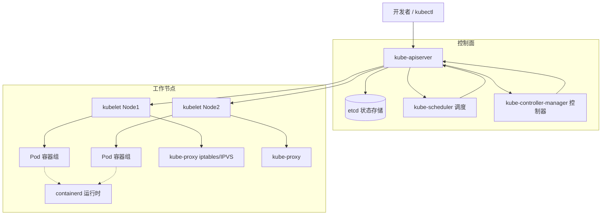
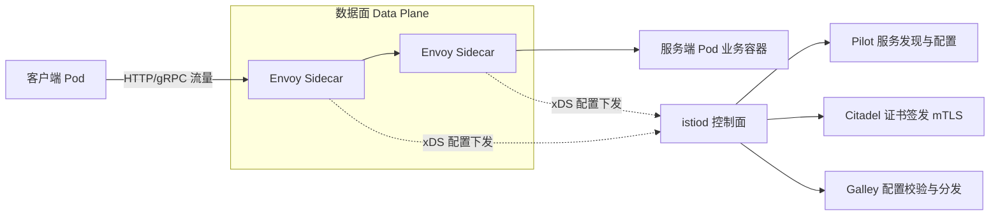
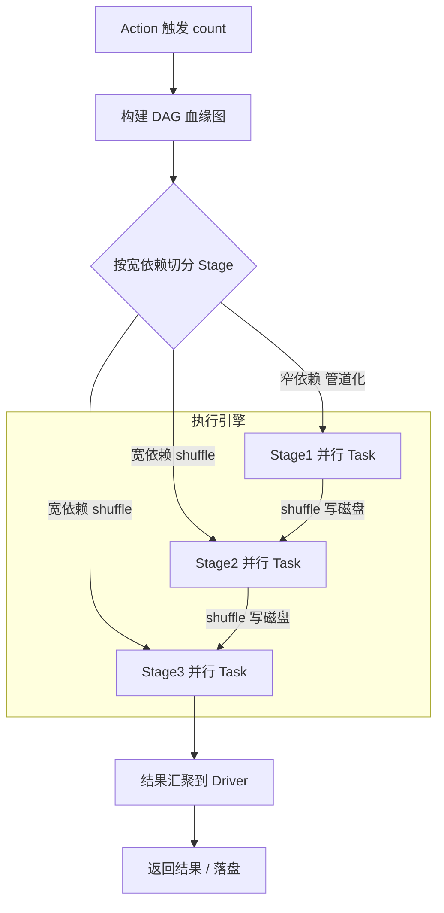
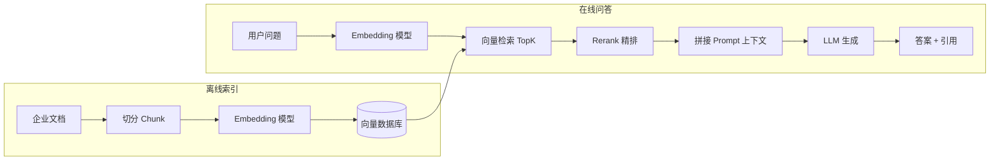

# 21 · 云原生与大数据（资深向）

> 适用对象：10+ 年经验的资深工程师 / 架构师候选人。本章覆盖：Docker 镜像分层与容器原理、Kubernetes 架构与控制器模式、K8s 高可用与运维（HPA/滚动更新/PV/PVC/网络）、Service Mesh 与 Istio 流量治理、大数据生态（Hadoop/Spark/Flink 架构与选型）、Java + AI 新趋势（LangChain4j/RAG/向量数据库/MCP）。面试落点：云原生面试不问「命令怎么敲」，问「架构为什么这么设计、故障怎么排查、组件怎么选型」——本章按「原理 → 演进 → 权衡 → 踩坑」组织，拒绝 API 罗列。

**TL;DR 本章学习要点**

1. Docker 的核心是「**分层镜像 + 联合文件系统 + 共享内核**」：镜像层只读、可复用、可缓存，容器层可写（Copy-on-Write）——镜像瘦身、多阶段构建、层缓存全部围绕「层」展开；
2. K8s 的灵魂是「**声明式 + 控制器模式**」：apiserver 是唯一入口、etcd 是唯一真相，所有控制器都在做「期望状态 vs 当前状态」的调谐循环；调度 = 过滤（硬约束）→ 打分（软偏好）→ 绑定；
3. 运维三件套：HPA 基于「当前指标 / 目标值」算副本数、滚动更新靠 maxSurge/maxUnavailable 两个水位控制风险、优雅终止靠 preStop + SIGTERM + 宽限期；
4. 大数据选型的本质是「**延迟 × 吞吐 × 状态**」的三角权衡：Hadoop 离线批处理、Spark 批 + 微批（吞吐优先）、Flink 真流式（低延迟 + 精确一次）；Spark 靠 DAG + 内存、Flink 靠状态 + 屏障对齐；
5. Java 在 AI 时代的角色不是「写模型」，是「**把模型接进企业系统**」：LangChain4j/Spring AI 提供编排框架，RAG 解决知识时效与幻觉，MCP 统一工具调用协议——Java 的工程化优势（类型安全、事务、监控、生态）恰是 AI 应用落地最缺的部分。

---

## 1. Docker 核心

### 1.1 镜像分层与联合文件系统

- **镜像 = 只读层的堆叠**：每一层对应 Dockerfile 的一条指令（RUN/COPY/ADD），层与层之间用 UnionFS（overlay2 是当前默认实现）合并成统一视图；容器启动时在最上层叠加一个可写层；
- **Copy-on-Write（写时复制）**：容器内修改文件时，overlay2 把下层文件复制到上层再改（copy_up），下层镜像完全不受影响——这是「一个镜像启动 N 个容器互不干扰」的根基，也是「容器删除后写层消失」的原因（数据要落卷）；
- **层 = 缓存单元**：构建时某层没变，该层及其以下全部命中缓存（docker layer cache）；所以 Dockerfile 的指令顺序就是缓存命中率的生死线——**把变化最频繁的指令放最后**；
- 一个镜像 ≈ 一个「文件系统快照 + 元数据（CMD/ENV/EXPOSE/ENTRYPOINT）」，镜像本身不包含内核——容器与宿主机共享内核，这是与虚拟机的本质区别。

### 1.2 容器 vs 虚拟机

| 维度 | 容器 | 虚拟机 |
|---|---|---|
| 隔离级别 | 进程级（namespace + cgroup） | 硬件级（Hypervisor + 独立内核） |
| 内核 | 共享宿主机内核 | 每个 VM 独立内核 |
| 启动速度 | 毫秒~秒级 | 秒~分钟级 |
| 镜像体积 | MB~GB（分层可共享） | GB~几十 GB |
| 隔离强度 | 弱（内核漏洞可逃逸，需额外加固） | 强（安全边界清晰） |
| 资源密度 | 高（一台机器可跑上百容器） | 低 |
| 适用 | 应用打包、微服务、弹性伸缩 | 强隔离、多租户安全、异构 OS |

- 一句话：**容器解决「打包与交付」问题，虚拟机解决「隔离与安全」问题**——K8s 里跑在 VM 上（云厂商的节点就是 VM），两者是互补关系不是替代关系；
- 容器的隔离来自 Linux 内核机制：namespace（PID/Network/Mount/UTS/IPC/User）管「看得到什么」，cgroup 管「能用多少资源」（CPU/内存/IO 配额）。

### 1.3 Dockerfile 最佳实践与镜像瘦身

- **最佳实践清单**：
  1. `.dockerignore` 排除 target/.git/node_modules——否则构建上下文巨大且层缓存失效；
  2. 指令顺序按「变化频率从低到高」：基础镜像 → 依赖安装（固定版本）→ 拷贝代码；
  3. 每层只装「构建需要」的东西，用多阶段构建（multi-stage）：构建阶段（JDK+Maven）→ 运行阶段（JRE/distroless）只拷贝产物；
  4. 非 root 运行（USER），只暴露必要端口，加 HEALTHCHECK；
  5. 尽量合并 RUN（`apt-get install ... && rm -rf ...`）减少层数（不过层数本身不是越少越好，缓存命中率优先）；
  6. 基础镜像固定 tag 摘要（`FROM eclipse-temurin:17-jre@sha256:...`），防止「漂移构建」。
- **镜像瘦身三板斧**：
  1. **多阶段构建**（最常见）：构建产物 COPY 到精简运行镜像，JDK 17 的 jlink 可以裁剪出 40~80MB 的自定义 JRE；
  2. **换基础镜像**：`eclipse-temurin:17-jre`（~200MB）→ `17-jre-alpine`/`17-jre-jammy`（~100MB 内）→ distroless（无 shell、无包管理器，~80MB，安全但难调试）；
  3. **清理与压缩**：删除构建缓存与临时文件（同一层内 `&& rm -rf` 才会真正减小体积）、用 `docker sbom`/`trivy` 扫漏洞、upx 压缩二进制（JVM 应用收益有限）。
- Java 应用专属：用 `jlink --strip-debug --no-man-pages` 生成最小运行时；Spring Boot 可用 layered jar（`spring-boot-maven-plugin` 的 layers 配置）配合 `--mount=type=cache` 精确命中依赖层缓存。

### 本节高频面试题

**Q1：Docker 镜像为什么能做到「构建一次，到处运行」？跨平台又是怎么失败的？**

解答：三个层面——① **运行环境打包**：镜像内含应用 + 依赖 + 配置 + 启动命令，交付物从「代码」变成「完整运行单元」；② **内核兼容**：容器共享宿主机内核，只要应用是「Linux 用户态程序」且依赖的 glibc/动态库在镜像里，就能跑；③ **分层复用**：基础镜像层被所有子镜像共享，拉取与存储成本被摊薄。跨平台失败的典型：镜像基于 `linux/amd64`，部署到 arm64 机器直接 `exec format error`——需要 `docker buildx build --platform linux/arm64` 交叉构建或多架构 manifest（`docker manifest`）；还有 glibc vs musl（Alpine）的 ABI 差异，Java 应用要注意 native 库（如 JNI 的 snappy/lz4）必须随镜像携带对应架构版本。**面试升华：镜像 = 代码 + 环境 + 架构约束的打包，架构（CPU 指令集）和 libc 是隐形的两个「平台维度」**。

面试官追问：同一个镜像在容器里跑和宿主机直接跑，性能有差异吗？——答：理论差异 <5%（namespace/cgroup 开销可忽略），实际差异主要来自：网络栈（默认 bridge 的 NAT 转发比宿主机直连多一跳，用 hostNetwork 或 CNI 直通可消除）、存储驱动（overlay2 的 copy_up 写放大，数据量大的路径挂 volume 而不是写容器层）。**要点：容器性能损耗 = 网络路径 + 存储路径的损耗，CPU 计算几乎无损**。

**Q2：Dockerfile 的指令顺序影响什么？为什么「先装依赖、后拷代码」是铁律？**

解答：影响**层缓存命中率**。构建时 Docker 逐层执行，若某层校验和未变则直接复用缓存层。依赖安装（`mvn dependency:go-offline` / `npm install`）很少变，而业务代码每次提交都变——把「依赖层」放在「代码 COPY」之前，代码变更时只有最后一层重建，构建从「每次 5 分钟」降到「秒级」。反过来依赖层在代码层之后，每次构建全量重装依赖。进阶玩法：Spring Boot 3 的 layered jar 把「依赖 jar 包」和「应用类」分层，配合 `--mount=type=cache` 让 Maven 仓库挂缓存，CI 构建时间能再砍一半。**面试升华：Dockerfile 的顺序问题本质是「依赖的变更频率」排序问题，与代码架构里的依赖倒置思想同源**。

面试官追问：`RUN` 里多行命令合并成一行，除了减少层数还有什么好处？——答：减少「中间层残留」：每层都会保留该层产生的文件差异，合并后中间文件（如 apt 缓存、编译临时文件）不会成为镜像的一部分，镜像更小；但代价是缓存粒度变粗（依赖变更时整层重建）。**权衡：缓存粒度 vs 镜像体积，生产环境通常「依赖单独成层 + 构建产物合并清理」**。

**Q3：容器里跑 Java 应用，JVM 的「内存视角」和容器的 cgroup 限制冲突吗？怎么解决？**

解答：冲突。JVM 默认按宿主机物理内存计算堆大小（`-Xmx` 缺省 = 物理内存的 1/4），容器被 cgroup 限制 2G 而宿主机 64G 时，JVM 会按 16G 设堆 → 容器 OOM 被杀（exit code 137）。解决方案：① 现代 JVM（JDK 8u191+ / 9+）默认开启 `UseContainerSupport`，能识别 cgroup 限额（注意 cgroup v2 的适配，老版本 JVM 需 `-XX:+UseCgroupMemoryLimitForHeap`）；② 显式设置 `-Xmx` 并预留非堆空间（堆外 DirectMemory、线程栈、Metaspace、JIT），常见配比 `-Xmx` 为容器内存的 50%~70%，或干脆不用 `-Xmx` 而靠容器感知的 MaxRAMPercentage（`-XX:MaxRAMPercentage=75`）；③ 注意 `-XX:MaxDirectMemorySize` 默认等于堆上限，Netty 类应用要单独规划。**面试升华：云原生时代的 JVM 调优从「看机器」变成「看 cgroup」——容器限额、堆外内存、K8s 的 requests/limits 三者必须联动设计**。

面试官追问：容器 OOM 被杀和 JVM 自己 OOM 有什么区别？——答：JVM OOM 是抛 `OutOfMemoryError`（进程还活着，可被捕获、可 dump）；容器 OOM 是 cgroup 的 OOM Killer 直接 SIGKILL 进程（exit 137，无任何 Java 侧痕迹，只能看 `dmesg`/`kubelet` 事件）。**排查分水岭：先看 exit code，137/143 优先查资源限额，非 137 才查 JVM 日志**。

---

## 2. Kubernetes 架构

### 2.1 控制面与工作节点

- **控制面（Control Plane）**：
  - `kube-apiserver`：唯一入口，所有组件（含 kubectl）都通过它读写集群状态；无状态、可水平扩展；**只有它直接碰 etcd**；
  - `etcd`：分布式 KV 存储，集群的「唯一真相源」（source of truth），所有对象（Pod/Service/ConfigMap…）都存这里；需要定期备份；
  - `kube-scheduler`：为新 Pod 选节点（过滤 + 打分）；
  - `kube-controller-manager`：一堆控制器（Deployment/ReplicaSet/Node/Namespace…）的集合，全部跑调谐循环；
  - `cloud-controller-manager`：对接云厂商 API（负载均衡、节点、路由），自建集群可没有。
- **工作节点（Node）**：
  - `kubelet`：节点上的「代理」，负责 Pod 生命周期（创建/销毁/健康检查），向 apiserver 上报状态；
  - `kube-proxy`：实现 Service 的负载均衡（iptables/IPVS 规则）；
  - 容器运行时（CRI）：containerd 是事实标准，Docker 已降级为「通过 cri-dockerd 兼容」的选项；
  - 附加组件：CNI 插件（Calico/Flannel/Cilium）、kubelet 的 cAdvisor（采集容器指标）。

- **请求路径**：`kubectl apply` → apiserver 鉴权/准入（Admission Webhook）→ 写入 etcd → 对应控制器发现「期望状态 ≠ 当前状态」→ 调谐（如 ReplicaSet 控制器创建 Pod）→ scheduler 选节点 → kubelet 拉起容器 → 容器状态经 kubelet 回写 etcd。

### 2.2 核心对象模型

| 对象 | 一句话职责 | 关键点 |
|---|---|---|
| Pod | 最小调度单位，一组共享网络的容器 | 同 Pod 容器共享 IP/Volume；Pod 是「临时」的，重启即换 IP |
| ReplicaSet | 维持指定数量的 Pod 副本 | 只认「标签选择器 + 模板」，不管版本 |
| Deployment | 管理 ReplicaSet 的版本与滚动更新 | 每次变更生成新 RS，支持回滚（rollout undo） |
| Service | Pod 的稳定访问入口（虚拟 IP + DNS） | 靠 Selector 关联 Pod；ClusterIP/NodePort/LoadBalancer 三种类型 |
| Ingress | 七层（HTTP/HTTPS）路由 | 域名/路径 → Service；由 Ingress Controller（Nginx/ALB）实现 |
| ConfigMap/Secret | 配置与敏感数据注入 | 挂载为文件/环境变量；Secret 只做 base64，真正加密要 KMS |
| Namespace | 逻辑隔离与资源配额边界 | 配额（ResourceQuota）、网络策略（NetworkPolicy）默认按 NS 生效 |
| StatefulSet | 有状态应用的稳定标识 | 稳定网络标识 + 稳定存储（每副本一个 PVC）+ 有序部署 |

- **为什么 Pod 是边界而不是容器**：Pod 内多个容器共享网络命名空间和存储卷——典型组合是「主容器 + sidecar（日志采集、流量代理）」，这是 K8s 对「进程组」概念的落地；Pod 的临时性（IP 会变）催生了 Service 的抽象。

### 2.3 调度流程

- **两阶段**：Filter（预选，硬约束）→ Score（优选，软偏好）→ Bind（绑定到 Node）；
- Filter 典型谓词：资源是否满足 requests、端口冲突、节点污点容忍（Taints/Tolerations）、节点亲和性（nodeAffinity）、Pod 反亲和（podAntiAffinity）；
- Score 典型算法：LeastRequestedPriority（资源余量多者优先）、BalancedResourceAllocation、ImageLocality（本地已有镜像优先）；
- 高级特性：节点亲和性（硬/软）、污点与容忍（专用节点、故障节点驱逐）、拓扑分布约束（topologySpreadConstraints，跨可用区打散）、抢占（PriorityClass + Preemption，高优 Pod 挤掉低优 Pod）。

### 2.4 控制器模式

- 所有控制器的通用骨架：**watch 期望状态（spec）→ watch 实际状态（status）→ 计算差异 → 执行动作 → 更新 status → 循环**；
- 例子：Deployment 控制器 → 维护 ReplicaSet；ReplicaSet 控制器 → 维护 Pod 数量；kubelet → 维护节点上的容器状态；
- 为什么「声明式 + 控制器」优于「命令式」：① 自愈（节点挂了控制器自动重建）；② 幂等（反复 apply 同一份 YAML 结果一致，GitOps 的根基）；③ 可审计（期望状态在 etcd 里，diff 即变更记录）；
- 踩坑：控制器不是「一次性的」，是「永远在调谐」——所以 Pod 的 spec 里「不可变字段」改不了，要改只能重建（Deployment 版本更新正是利用这一点）。

### 本节高频面试题

**Q4：Pod 是临时的一换 IP 就变，Service 怎么做到稳定访问？**

解答：Service 创建后获得稳定的 ClusterIP 和 DNS 名（`my-svc.ns.svc.cluster.local`），apiserver 里的 EndpointSlice 控制器持续维护「Service 的 Selector → 当前存活 Pod IP」的映射；kube-proxy 监听 Service/Endpoint 变化，把 ClusterIP 的流量按负载均衡算法（iptables 随机 / IPVS 加权轮询）转发到 Pod。Pod 挂了换新 IP，EndpointSlice 自动更新，客户端感知不到。**核心：Service 是「逻辑名」，EndpointSlice 是「动态成员表」，kube-proxy 是「转发引擎」，三层配合实现位置无关访问**。

面试官追问：Service 的负载均衡有什么问题，业界怎么改进？——答：iptables 模式是「概率转发 + 全量规则链」，规则多时更新慢（大量 Pod 滚动时抖动），且只支持随机；IPVS 支持更多算法（rr/wrr/lc）和更高性能；再进一步是 eBPF（Cilium）在内核态直接做负载均衡，以及把负载均衡下沉到客户端侧（Service Mesh 的客户端负载均衡，见第 4 节）。**要点：负载均衡的位置沿「内核 → 用户态代理 → 客户端 SDK」不断下移，是网络架构演进的暗线**。

**Q5： Deployment 滚动更新时，流量是怎么「无缝」切到新 Pod 的？**

解答：Deployment 更新触发新 ReplicaSet 的创建，滚动策略由 `maxSurge`（可超出的副本数，默认 25%）和 `maxUnavailable`（可暂时不可用的副本数，默认 25%）控制：新 RS 先扩 `maxSurge` 个新 Pod，就绪后旧 RS 缩 `maxUnavailable` 个旧 Pod，循环直到全部替换。Pod 就绪由 readinessProbe 决定——**新 Pod 的 readinessProbe 通过后才会被 EndpointSlice 收录，Service 才会把流量打过去**，这是「无缝」的关键；readinessProbe 探测失败（如依赖的 DB 连不上）会自动停止滚动。回滚：`kubectl rollout undo` 切回旧 RS，镜像版本同时回退，秒级完成。

面试官追问：为什么新 Pod 已经 Running 了流量还是打不进去？——答：Running ≠ Ready。只有 readinessProbe 连续成功（initialDelay 之后），Pod 才进入 Ready 状态并进入 Service 的端点列表；如果只有 livenessProbe 没有 readinessProbe，或者探针路径写错，就会出现「Pod 活着但流量黑洞」。**排查口诀：先 kubectl get pods 看 READY 列，不是 1/1 就先查探针，再查 EndpointSlice**。

**Q6：kube-apiserver 挂了集群会怎样？为什么 etcd 要单独备份？**

解答：apiserver 挂 → 所有「读/写集群状态」的操作不可用（kubectl、控制器调谐、kubelet 心跳上报），但**已运行的 Pod 不受影响**——kubelet 继续按本地缓存维持容器，Service 转发规则也已在节点上生效。所以控制面故障是「管理面瘫痪、数据面存活」，这也是为什么高可用部署至少 3 个 apiserver + etcd 集群（多数派仲裁）。etcd 是唯一真相源：节点/控制器崩溃可以从 etcd 恢复状态，但 etcd 数据损坏（磁盘故障、误删）无法从节点反推——必须定期快照（`etcdctl snapshot save` + 异地存储），并测试恢复演练（很多人备份了却从没恢复过）。

面试官追问：etcd 为什么用 Raft 而不是 Paxos？——答：Raft 是 Paxos 的工程化简化：把共识问题拆成「选主（Leader Election）+ 日志复制（Log Replication）+ 安全性（Safety）」三个子问题，可理解性远高于 Paxos 的「单轮投票」抽象，且工程实现有明确的状态机；etcd 还做了批量提交、预写日志 fsync 合并、压缩（compaction）等优化。**要点：选型时「工程可维护性」有时比「理论优雅性」更关键——这是 Raft 胜过 Paxos 成为事实标准的根本原因**。

---

## 3. K8s 高可用与运维

### 3.1 资源模型与配额

- **requests vs limits**：requests 是「调度依据」（scheduler 按它计算节点余量），limits 是「运行上限」（cgroup 强制）；CPU 是可压缩资源（超限被限流），内存是不可压缩资源（超限被 OOM Kill）；
- 最佳实践：**requests 按真实水位设置，limits 按安全上限设置**；Java 应用 requests=limits 或留 20~30% 余量给非堆；禁止只设 limits 不设 requests（会被调度到满节点然后被杀）；
- 资源配额（ResourceQuota）按 Namespace 限制总量，LimitRange 限制单 Pod 范围——多团队共享集群的治理基础；
- Pod 的 QoS 三档：Guaranteed（requests=limits）→ Burstable → BestEffort，OOM 时按 QoS 优先级回收，Guaranteed 最安全。

### 3.2 HPA 弹性伸缩

- 原理：HPA 控制器周期性（默认 15s）读取指标（metrics-server 的 CPU/内存，或 Prometheus Adapter 的自定义指标），计算 `期望副本数 = ceil(当前副本数 × 当前指标值 / 目标值)`，再调用 Scale 子资源改 Deployment 的 replicas；
- 防抖机制：`--horizontal-pod-autoscaler-cpu-initialization-period`（新 Pod 冷启动期不算指标）、scale-down 的 stabilization window（默认 5 分钟，防止抖动缩容）、单次扩容上限（默认 4 倍/15s）；
- 踩坑：① 目标值按「requests」算还是按「实际使用」算——HPA 默认按 Pod 的 requests 做分母，requests 设得虚高会导致永远不扩；② 冷启动时间长的应用要配合 readiness + 预热（如 JVM 的 AppCDS、提前初始化），否则扩容跟不上流量；③ 突发流量扩不动——HPA 是「事后反应」，要配合 CronHPA/预测扩缩容或 KEDA 的基于队列长度（Kafka lag）的伸缩。

### 3.3 滚动更新、回滚与优雅终止

- 发布策略对比：滚动更新（默认，新旧并存）、蓝绿（切 Service selector，一次性切换，成本双倍资源）、金丝雀（先放 5%~10% 流量验证再全量，结合 Istio/Argo Rollouts 做流量百分比）；
- **优雅终止四步**：① 收到删除请求 → 从 EndpointSlice 摘除（新流量不再进入）→ ② preStop hook 执行（如 `sleep 5` 或通知注册中心下线）→ ③ 收到 SIGTERM → ④ 应用自行清理（关闭连接、刷盘）→ 宽限期（terminationGracePeriodSeconds，默认 30s）内未退出则 SIGKILL；
- Java 应用专属：注册 `Runtime.addShutdownHook` 或 Spring 的 `@PreDestroy` 里关闭线程池/HTTP 连接池；**不要依赖 Spring Boot 2.3+ 自带的优雅停机（`server.shutdown=graceful`）就完事**——它只管接收新请求，K8s 侧的摘流量顺序（先 EndpointSlice 后 SIGTERM）才是关键。

### 3.4 存储 PV/PVC

- 三个对象：PV（集群级存储资源，如云盘/NFS/本地盘）、PVC（用户对存储的申请：容量 + 访问模式）、StorageClass（动态供给模板：`storageClassName` 指定后自动创建 PV）；
- 访问模式：ReadWriteOnce（单节点读写，云盘典型）、ReadOnlyMany、ReadWriteMany（NFS/GlusterFS）；
- 生命周期：Provision（静态/动态）→ Bind → Use → Reclaim（Retain/Delete/Recycle）；
- 踩坑：StatefulSet 的 Pod 重建后要挂**同一个** PVC（podAntiAffinity + 稳定 PVC 名），否则数据丢失；本地盘（Local PV）绑定节点，节点故障 = 数据风险，要有备份或副本机制。

### 3.5 网络模型

- K8s 网络四大要求：Pod 间互通（扁平网络）、节点与 Pod 互通、Pod 内容器共享 IP、Service 负载均衡；
- 主流 CNI：Flannel（VXLAN 隧道，简单）、Calico（BGP 直连 + NetworkPolicy，性能好）、Cilium（eBPF，性能与可观测性最佳，云原生网络的事实新标准）；
- 三种 Service 类型：ClusterIP（集群内虚拟 IP）、NodePort（节点端口转发，测试用）、LoadBalancer（云厂商 LB → NodePort → Pod）；
- NetworkPolicy：默认「允许所有」，加了策略才收紧——安全基线的第一步；注意 NetworkPolicy 只对「进入 Pod 的流量」生效，Service 的 ClusterIP 转发不受其管控。

### 本节高频面试题

**Q7：K8s 里内存设了 limits 为什么 Pod 还是被杀了？**

解答：内存是**不可压缩资源**：容器使用超过 limits 时，cgroup 的 OOM Killer 直接杀进程（Java 应用表现为 exit 137）。三种典型根因：① **非堆内存超限**——堆没满但 DirectMemory/Metaspace/线程栈超了（Netty 类应用高发）；② **requests 与 limits 差距大**——requests 设小导致调度到内存不足的节点，运行期内存增长后节点内存压力大，OOM Killer 优先杀 Burstable/BestEffort 的 Pod；③ **JVM 不感知 cgroup**——老 JDK 按宿主机内存算堆（见 Q3）。排查：`kubectl describe pod` 看 `OOMKilled` 状态 + 退出码 137，`kubectl logs --previous` 看被杀前日志，必要时 `dmesg` 看内核记录。**面试升华：容器 OOM 排查 = 退出码定类型（137=资源限额，143=SIGTERM 优雅退出，非 137 看应用日志）+ cgroup 视角核对 requests/limits/堆外内存三角**。

面试官追问：CPU 超限会被杀吗？——答：不会。CPU 是可压缩资源，cgroup 的 CFS 配额会**限流**（throttle），表现为「应用变慢、RT 升高」而不是被杀——所以 CPU 瓶颈的症状是延迟劣化，内存瓶颈的症状是进程消失，两个方向的排查入口完全不同。

**Q8：HPA 扩容有延迟，高峰期流量突增怎么扛？**

解答：HPA 是反馈控制，天然滞后（指标采集周期 + 计算周期 + 扩容上限 + 新 Pod 冷启动），所以生产要「组合拳」：① **事前**：容量规划 + 压测确定单 Pod 水位，设合理的 HPA 目标值与 maxReplicas；② **事中**：KEDA 类基于队列深度（Kafka lag/消息积压）的伸缩，比 CPU 指标提前数分钟；CronHPA 应对可预期的波峰（如每日 10 点大促）；③ **兜底**：入口限流 + 降级 + 队列削峰（把突发转成异步），让系统在「扩不动」时依然可用；④ **加速**：减少 Pod 冷启动时间（预热、缓存镜像、JVM 快速启动），配合 readiness 才能让新 Pod 尽快接流量。**面试升华：弹性伸缩的本质是「预测 + 反应 + 兜底」三层，只靠 HPA 单点 = 把系统可靠性押在反馈延迟上**。

面试官追问：缩容太快会怎样？——答：流量下降时 HPA 快速缩容，可能把「正要承接下一波流量」的 Pod 杀掉，造成抖动（thrash）；另外 Stateful 任务（如消费者组）缩容会引发 rebalance。解法：stabilization window（缩容观察期）、`scaleDown` 策略限制单次缩容比例、对无状态应用无所谓但对有状态应用要谨慎。**要点：扩容要快、缩容要慢，不对称策略是弹性伸缩的默认配置**。

**Q9：Pod 被删除时，正在处理的请求会怎样？怎么保证不丢请求？**

解答：默认会丢——kubelet 发 SIGTERM 后，如果应用没处理优雅退出，正在处理的请求被中断（客户端收到连接重置）。完整方案四步：① 应用注册 shutdown hook：停止接收新请求 → 等待在途请求完成（给一个超时上限）→ 关闭连接池/线程池；② 依赖 K8s 的「先摘流量再杀进程」：Pod 进入 Terminating 时先从 Service EndpointSlice 摘除（新流量不再进来），此时应用其实还有宽限期可以处理存量请求；③ 客户端侧重试：上游调用方对「连接断开」做幂等重试（配合请求 ID），这是分布式系统兜底；④ Java 应用注意：`server.shutdown=graceful` + `spring.lifecycle.timeout-per-shutdown-phase` 设够时间，且 ShutdownHook 里别做「可能卡死」的同步操作（如等待远程调用）。**面试升华：优雅终止是「平台（摘流量）+ 应用（排空在途）+ 客户端（重试）」三方的协作契约，缺一环都会丢请求**。

---

## 4. Service Mesh 与 Istio

### 4.1 从 SDK 到 Sidecar

- 微服务的痛点演进：最初重试/超时/熔断/限流写在业务代码或 SDK（如 Spring Cloud 的 Ribbon/Hystrix）里 → 问题：语言绑定（每个语言都要实现一遍）、升级困难（SDK 升级要全量发版）、侵入业务代码；
- **Sidecar 模式**：把流量治理能力从应用进程里抽出来，放到同 Pod 的代理进程（Envoy）里，应用只关心业务；K8s 的 Pod 多容器模型让 sidecar 注入成为天然实现（Istio 的 webhook 自动注入）；
- 本质：**把「进程内库」重构成「伴随进程」**，治理能力与业务解耦，升级代理不碰业务代码。

### 4.2 数据面与控制面

- **数据面（Data Plane）**：所有业务流量经过的 Envoy 代理，负责实际转发、重试、超时、熔断、负载均衡、mTLS 加解密、遥测上报；
- **控制面（Control Plane）**：istiod 统一了原来 Pilot（服务发现 + 配置下发）、Citadel（证书管理）、Galley（配置校验）三个组件，通过 xDS 协议（LDS/RDS/CDS/EDS）把「流量规则」翻译成 Envoy 配置；
- 流量劫持原理：istio-init 容器用 iptables 规则把 Pod 的出入流量重定向到 sidecar 的 15006/15001 端口（透明代理），业务无感知；新的 ambient mesh 模式用 ztunnel 节点级代理省掉每 Pod 一个 sidecar 的资源开销。

### 4.3 流量治理

- 核心 CRD：VirtualService（路由规则：按 header/URI/权重切分流量）、DestinationRule（负载均衡策略、连接池、熔断阈值、mTLS 配置）、Gateway（南北向入口）、ServiceEntry（注册外部服务）；
- 典型场景：**金丝雀发布**（VirtualService 按权重 5%→50%→100% 切流，配合监控自动放量）、故障注入（Fault Injection 注入延迟/异常做混沌测试）、超时与重试（按服务维度配置，替代代码里的 Hystrix）、熔断（连接池 + 异常率阈值，进入熔断后快速失败）；
- 可观测性红利：sidecar 自动采集全链路指标（RED 四类：Rate/Errors/Duration）与访问日志、分布式追踪（配合 Jaeger），业务代码零埋点；
- 代价与权衡：每 Pod 一个 sidecar = 额外 CPU/内存（约 5%~10%）+ 延迟增加一跳（同机回环转发）+ 运维复杂度（istiod、证书轮换、升级）；**小规模/低延迟敏感场景慎用**，要算「治理收益 vs 资源与复杂度税」。

### 本节高频面试题

**Q10：Service Mesh 和 Spring Cloud 的治理能力有什么区别？什么时候值得上 Service Mesh？**

解答：功能上高度重叠（都做注册发现、负载均衡、熔断、重试），区别在**实现位置与治理模型**：Spring Cloud 是「SDK 内嵌」，治理逻辑与业务同进程——语言绑定（只有 Java 能用）、版本升级要全量发版、规则写死在代码里（改规则要发版）；Istio 是「旁路代理 + 集中控制面」，规则是 CRD 声明式的，改规则 apply 即可，多语言（Java/Go/Node 统一治理）、可灰度（按权重/header 切流）、可观测（自动指标）。**上 Service Mesh 的判断标准**：① 多语言微服务并存；② 流量治理需求频繁变化（规则要快速调整）；③ 团队能承担运维复杂度（istiod/证书/升级）；④ 延迟敏感度可接受（多一跳代理）。**单语言 Spring Cloud 团队、规模 <20 服务，上 Mesh 大概率是负资产**——这不是技术先进性问题，是 ROI 问题。

面试官追问：Service Mesh 的 sidecar 注入后，Pod 启动顺序和流量劫持怎么保证不出问题？——答：Istio 用「init 容器先于业务容器执行」完成 iptables 规则注入（网络命名空间在 init 容器阶段已就绪），业务容器起来时流量已经被劫持；期间「应用启动但 sidecar 未就绪」的流量黑洞由 readiness 探针（istio-proxy 的 15021/healthz）解决——业务容器 Ready 的前提是 sidecar Ready。**踩坑：自定义 readinessProbe 覆盖了 Istio 注入的探针会导致发布时流量打到未就绪的 sidecar**。

**Q11：金丝雀发布用 Istio 的 VirtualService 权重切流，和 K8s 原生的滚动更新比，优势在哪？**

解答：滚动更新是「**实例维度**」的灰度——新旧版本各占一部分实例，流量按实例比例天然分流，但无法做到「精确的 5%」也无法按「用户特征」分流；Istio 是「**流量维度**」的灰度：VirtualService 可以把 5% 流量切到 v2（新旧版本实例数可以一样，甚至 v2 只有 1 个实例），还可以按 header（如 `x-user-id` 尾号、内部测试账号）精确路由——适合「先让特定用户/内部团队验证，再逐步放量」的场景。生产最佳实践：**Argo Rollouts + Istio**：AnalysisTemplate 自动采集 v2 的错误率/延迟指标，超过阈值自动回滚切流，实现「可观测的自动化金丝雀」。

面试官追问：金丝雀期间 v2 的 DB 变更怎么兼容？——答：这是金丝雀发布最深的坑：**代码可以灰度，schema 变更不能灰度**。常规套路：① 数据库变更「向前兼容三步走」——先加列（可空/默认值）→ 新旧代码共存期 → 数据迁移与回填 → 下个版本再删旧列；② 写操作双写或通过开关控制；③ 实在要拆，用「影子表 + 迁移工具」并接受回滚只能「代码回滚、数据保留」。**要点：发布方案里必须包含「数据兼容性」章节，只谈流量切分不谈 schema 的发布方案是不完整的**。

---

## 5. 大数据生态

### 5.1 Hadoop 三剑客：HDFS / MapReduce / YARN

- **HDFS（存储）**：NameNode（元数据：文件目录树 + 块位置，单点，靠 QJM + Active/Standby 高可用）+ DataNode（数据块，默认 128MB，副本 3，机架感知放置：同机架 2 副本 + 跨机架 1 副本）；写流程：客户端 → NameNode 拿块分配 → 流水线式写 3 副本；读：就近读；
- **MapReduce（计算）**：Map（本地数据分片处理）→ Shuffle（分区/排序/合并，网络传输）→ Reduce（聚合）；「移动计算不移动数据」是设计灵魂（计算任务调度到数据所在节点）；
- **YARN（资源调度）**：ResourceManager（全局资源仲裁）+ NodeManager（节点资源）+ ApplicationMaster（每个作业的「项目经理」）；容器（Container）是资源分配单元；调度器：FIFO / Capacity / Fair；
- Hadoop 的定位演变：**离线批处理的事实标准，但 MapReduce 的落盘式 shuffle 太慢**（每个 stage 写 HDFS），催生了 Spark/Flink 的存算分离与内存计算。

### 5.2 Spark：RDD 与 DAG 调度

- **RDD（弹性分布式数据集）**：只读、分区的数据集合，血缘（Lineage）记录「这个 RDD 怎么算出来的」——分区丢失可重算，这是容错的根基；
- **两类算子**：Transformation（懒执行，只建 DAG：map/filter/flatMap/join）与 Action（触发计算：count/collect/saveAsTextFile）；
- **DAG 调度四步**：① Action 触发 → ② 构建 DAG → ③ 按宽依赖（shuffle 依赖）切分 Stage（窄依赖 stage 内流水线执行）→ ④ Task 分发到 Executor 执行；
- 宽依赖 vs 窄依赖：窄依赖（父 RDD 每个分区只被子 RDD 一个分区用）可管道化、失败重算代价小；宽依赖（join/groupByKey，shuffle）需要全量数据重组、失败要重算整个 stage；
- 执行组件：Driver（提交作业、构建 DAG、调度 Task）+ Executor（执行 Task、缓存数据）+ Cluster Manager（Standalone/YARN/K8s）；
- 内存管理：统一内存（执行 + 存储共享，动态占用），shuffle 的 spill 到磁盘是性能杀手。

### 5.3 Flink：流处理与状态管理

- **流优先**：Flink 把一切当流（批是流的特例），事件级处理（不是微批），延迟毫秒级；
- **窗口**：滚动窗口（Tumbling，固定大小）、滑动窗口（Sliding，重叠）、会话窗口（Session，按空闲间隔切分）；时间三兄弟：事件时间（业务时间，配合 watermark 处理乱序）、处理时间、摄入时间；
- **Watermark**：表示「此时间之前的数据都已到达」的标记，迟到数据进侧输出流（side output）兜底——乱序流处理的灵魂；
- **状态管理**：Keyed State（按 key 分区存储，如累加器、去重集合）+ Operator State；状态后端（RocksDB 可超大规模、堆内存快）；状态快照（Checkpoint，周期性异步快照 + barrier 对齐，实现 exactly-once）与 Savepoint（手动、用于升级/迁移）；
- **精确一次（Exactly-Once）**：分布式快照（Chandy-Lamport 算法变体）+ 两阶段提交（Kafka 事务）实现「端到端精确一次」；
- **背压（Backpressure）**：下游处理不过来时反压上游，Flink 通过 TaskManager 网络缓冲水位自动限速，不会像 Kafka 消费者那样直接丢数据（至少一次时）。

### 5.4 选型对比与决策框架

| 维度 | Hadoop MapReduce | Spark | Flink |
|---|---|---|---|
| 处理模式 | 批量 | 批 + 微批（Structured Streaming） | 真流式（事件级） |
| 延迟 | 分钟~小时 | 秒~分钟 | 毫秒~秒 |
| 吞吐 | 低（反复落盘） | 高（内存计算） | 高 |
| 状态管理 | 无（无状态） | 有状态但偏批 | 强状态 + 精确一次 |
| 容错 | 任务重跑 | 血缘重算 + Checkpoint | Checkpoint + Savepoint |
| 适用场景 | 历史遗留批任务 | 离线 ETL、BI 报表、机器学习 | 实时风控、实时数仓、事件驱动 |
| 语言 | Java | Scala/Java/Python（PySpark） | Java/Scala/Python（PyFlink） |

- 决策口诀：**「多久要结果」决定架构**——天级/小时级用批（Spark），秒级用微批（Spark Streaming/Kafka Streams），毫秒级且要状态用真流式（Flink）；数据量 TB 级离线 → Spark + 数据湖（Iceberg/Hudi），实时链路 → Kafka + Flink + 实时数仓（Doris/StarRocks/ClickHouse）是当下主流组合；
- Java 工程师的落点：Spark/Flink 都用 Java/Scala 写算子，面试重点在「shuffle 为什么会慢」「watermark 怎么设计」「exactly-once 怎么保证」「背压怎么处理」这类原理题，而不是 API 背诵。

### 本节高频面试题

**Q12：Spark 的宽依赖为什么慢？怎么优化 shuffle？**

解答：宽依赖（join/groupByKey/repartition）需要 shuffle：每个 map 任务把数据按 key 分区写入本地磁盘（sort + 合并），reduce 任务跨节点拉取——**磁盘 IO + 网络传输 + 序列化**三重开销，是 Spark 作业 80% 的性能瓶颈所在。优化手段按收益排序：① **减少 shuffle 数据量**：尽早 filter/投影（谓词下推）、用 map-side 预聚合（`reduceByKey` 优于 `groupByKey`，前者 map 端先合并）；② **减少 shuffle 次数**：多表 join 用 broadcast join（小表广播到每个 executor，无 shuffle）代替 sort merge join；③ **调 shuffle 参数**：分区数 = 目标分区大小 128MB~256MB、压缩（snappy）、`spark.shuffle.file.buffer`；④ 数据倾斜治理：key 加盐再聚合（两阶段聚合）、倾斜 key 单独处理、调整并行度。**面试升华：shuffle 优化 = 数据量 × 次数 × 传输效率三个乘数，先砍数据量再谈参数**。

面试官追问：数据倾斜怎么定位和解决？——答：定位：Spark UI 看 stage 的 task 耗时分布（个别 task 巨慢）或 `accumulator` 统计 key 分布。解法：① **加盐两阶段聚合**：`(key, 随机数)` 先局部聚合再 `(key)` 全局聚合——适用于聚合类算子；② **广播小表**：join 场景把倾斜的 key 单独 join 小表；③ **重分区**：`repartition` 或调整 `spark.sql.shuffle.partitions`；④ 业务层规避：倾斜 key 往往是「热点用户/默认值」，必要时在数据源头打散。**要点：倾斜的本质是「hash 分区假设数据均匀」被打破，所有解法都是围绕「让热点 key 分散」**。

**Q13：Flink 的 exactly-once 是「绝对不丢不重」吗？怎么实现？**

解答：不是玄学，是「**在状态和输出层面保证恰好一次**」的工程组合：① 输入侧：Kafka source 记录 offset 进状态；② 计算侧：Chandy-Lamport 分布式快照——source 注入 barrier，算子收到所有输入的 barrier 后做状态快照，checkpoint 完成即「状态一致性」达成；③ 输出侧：两阶段提交（Kafka sink 的 producer 事务）——checkpoint 完成时预提交，checkpoint 成功后真正提交，失败则回滚重放。**所以 exactly-once 的边界是「Flink 状态 + 支持事务的 sink（Kafka）」**：如果下游是普通数据库或 Redis，只能是「at-least-once + 下游幂等」的近似 exactly-once。面试加分：背压下的 barrier 对齐会产生「对齐等待」，新版本支持 unaligned checkpoint 牺牲一点一致性换吞吐。

面试官追问：为什么说「Flink 的窗口计算用处理时间会不准」？——答：处理时间是「数据到达 Flink 的时刻」，受消费延迟/背压影响，同一批业务时间的数据可能落在不同窗口；事件时间 + watermark 才是业务语义正确的时间（如「过去 5 分钟的下单金额」按事件发生时间统计）。watermark 的生成策略（固定延迟/BoundedOutOfOrderness）要在「延迟容忍」与「结果及时性」之间权衡——watermark 太激进，乱序数据被丢进侧输出；太保守，结果迟迟不出。**要点：实时计算的正确性 = 事件时间 + watermark + 迟到数据兜底三件套**。

**Q14：Lambda 架构和 Kappa 架构怎么选？**

解答：Lambda = 批处理（离线全量，准确）+ 流处理（实时增量，快但不全）双链路，结果合并——**维护两套代码、两套逻辑，口径漂移是常态**；Kappa = 只有流处理一条链路，历史重算靠「重放 Kafka 消息」（数据保留期要够长）——单链路、口径一致，但重放成本高、纯流对复杂批计算（如全量 join）不友好。选型判断：① 需要天级精确报表 + 秒级实时看板的传统数仓 → Lambda（但用 Flink SQL 的批流一体能力弱化双链路）；② 实时链路主导、口径一致性要求高 → Kappa；③ 当下主流答案：**批流一体（Flink 同时跑批和流 + Iceberg 湖仓）**，用一套 SQL 语义覆盖两条链路，这是数据架构的演进终局方向。**面试升华：架构选型的答案永远是「基于团队与场景的权衡」，但趋势判断（批流一体）要有**。

---

## 6. Java + AI 新趋势

### 6.1 LangChain4j 与 Spring AI

- **LangChain4j**：Java 版的 LLM 编排框架，对标 Python 的 LangChain：统一 LLM 供应商抽象（OpenAI/通义/文心/本地 Ollama）、对话记忆、工具调用（Function Calling）、RAG 组件（加载/切分/嵌入/检索）、AI Service（用注解声明式定义「用自然语言调用的方法」）；
- **Spring AI**：Spring 官方 AI 框架，把 AI 能力做成 Spring 生态的一部分：`ChatClient`/`EmbeddingModel` 等 Bean 化、与 Spring Boot 配置体系整合、支持 VectorStore 抽象（PGVector/Redis/Milvus/Weaviate）、函数调用与 RAG 开箱即用；
- 选型参考：已有 Spring 生态 → Spring AI（一致性最好）；需要 LangChain 生态的丰富组件（如多 agent、复杂 chain）→ LangChain4j；两者都在快速演进，生产项目要锁定版本并评估 API 稳定性（(待核实) 2025 年两个框架都还处于 1.x 早期，接口变动频繁，建议在门面层做薄封装）。

### 6.2 RAG：检索增强生成

- **为什么需要 RAG**：LLM 的知识有截止时间、会幻觉、不知道企业私有数据——RAG 把「生成」变成「先检索再生成」：答案有据可依、可追溯、可更新（数据变了重新索引即可，不用重新训练）；
- 链路：离线索引（文档 → 切分 chunk → embedding 向量化 → 存向量库）+ 在线问答（query 向量化 → 相似度检索 TopK → 拼 prompt → LLM 生成，可加 rerank 精排）。

- **工程关键点**（面试深水区）：① **切分策略**：按语义边界（标题/段落）切，chunk 大小 300~800 token，chunk 太小上下文碎片化、太大噪声多；② **Embedding 模型**：领域数据要微调或选领域模型，中文用 BGE/M3E 类；③ **混合检索**：向量（语义）+ 关键词（BM25，精确术语）融合，长尾 query 效果差很多；④ **Rerank**：粗排 TopK（100）→ 精排（10），检索质量的关键杠杆；⑤ **引用溯源**：答案带 chunk 来源，用户可验证，是「可信 AI」的基础设施；⑥ 评估：RAG 的离线评估（命中率/相关性）与线上观测（引用率、点赞/点踩）闭环。

### 6.3 向量数据库

- 定位：存「向量 + 元数据」，提供近似最近邻（ANN）检索；核心算法：HNSW（图索引，性能与召回平衡最好）、IVF（倒排 + 聚类）、PQ（乘积量化压缩）；召回率与延迟的权衡由索引参数控制；
- 选型：Milvus（分布式、十亿级、功能全）、Qdrant/Weaviate（中小规模、易运维）、PGVector（Postgres 插件，**数据量百万级以内最省事——复用现有 PG，事务与向量同库**）、Redis Search（缓存级）、FAISS（库不是服务，适合自研）；
- 踩坑：① 维度与精度：embedding 维度（768/1024/1536）影响内存（10 亿 × 1024 维 × 4 字节 ≈ 400GB）；② **先粗排后精排**的检索架构比「直接堆更大索引」有效；③ 向量库 ≠ 业务数据主库，业务元数据（标题/标签/权限）与向量分库存储，用元数据过滤缩小检索空间。

### 6.4 MCP：模型上下文协议

- **MCP（Model Context Protocol）**：Anthropic 提出的开放协议，规范「LLM 应用 ↔ 外部工具/数据源」的对接方式——类比「AI 界的 USB-C 接口」：一次实现，任意 LLM 客户端可用；
- 核心概念：Client（宿主，如 Claude Desktop/IDE 插件）、Server（暴露能力）、三类原语：**Tools**（可调用的函数，LLM 按需调用）、**Resources**（可读取的数据，如文件/数据库查询）、**Prompts**（可复用的提示词模板）；
- 传输：stdio（本地进程）/ Streamable HTTP（远程）；认证走 OAuth 2.1（新版规范）；
- Java 生态：官方 Java SDK（`io.modelcontextprotocol.sdk`）+ Spring AI 已内置 MCP 客户端/服务端支持——**Java 服务把内部能力（订单查询、库存、审批）包成 MCP Server，AI 应用就能安全可控地调用企业系统**。

### 6.5 Java 在 AI 时代的角色

- 现实：训练/推理框架（PyTorch 等）是 Python 的天下，**但 AI 应用落地（把模型接进业务系统）是工程问题，恰是 Java 的主场**：
  - 企业系统 80% 是 Java：AI 功能要进 CRM/订单/风控，就得在 Java 服务里编排；
  - 工程化能力：类型安全（prompt/参数强类型）、事务与补偿、监控告警、灰度发布、限流熔断——LLM 调用是「不可靠的外部依赖」，更需要这些；
  - 推理部署：ONNX Runtime（Java API）、DJL（Deep Java Library，支持 PyTorch/TensorFlow 模型）、Spring AI 的本地模型支持（Ollama）；
- Java 工程师的转型路径：**不学 Python 也能做 AI 应用**——掌握「提示词工程 + RAG 架构 + 工具调用 + 向量检索 + 评估闭环」这五件事，用 LangChain4j/Spring AI 在 JVM 内完成；同时要理解模型能力边界（上下文窗口、幻觉、成本），这是架构师新增的核心技能。

### 本节高频面试题

**Q15：RAG 和微调（Fine-tuning）怎么选？什么场景两者结合？**

解答：**RAG 管「知识」（事实、数据、文档），微调管「行为」（风格、格式、领域语言）**。选 RAG：知识频繁更新（政策、库存、产品资料）、要求可溯源、需要引用原文；选微调：输出格式强约束（如固定 JSON schema、行业术语）、模型行为要改变（客服语气）、知识稳定且数据量足够（几千条高质量样本起步）；两者结合是生产常态：**微调定「怎么说话」，RAG 定「说什么内容」**——例如客服机器人：微调让模型学会公司话术与礼貌表达，RAG 提供最新的产品知识。面试加分：RAG 回答「我不知道」的兜底设计（检索置信度低于阈值时明确拒绝而非编造）是评估体系的一部分。

面试官追问：RAG 检索效果差，先优化什么？——答：按杠杆排序：① **查召回**：chunk 切分策略（语义边界）、混合检索（向量 + BM25）、embedding 模型换领域模型；② **提精度**：加 rerank 精排、元数据过滤（时间/分类）；③ **查生成**：prompt 里限定「只基于上下文回答」+ 引用标注 + 低分拒绝；④ **建评估**：没有评估集就谈不上优化——离线构造 100~200 条 QA 对，线上看引用率/点踩率。**口诀：先数据（切分与清洗）、再检索（召回与精排）、后生成（prompt 与兜底），最后评估闭环**。

**Q16：MCP 和传统的 REST API / 函数调用（Function Calling）有什么区别？**

解答：**Function Calling 是「单次调用」的机制**——模型在对话里声明要调哪个函数、传什么参数，由宿主应用执行；MCP 是「标准化的工具生态协议」——它规定 Server 怎么声明工具、客户端怎么发现工具、认证与传输怎么做，目标是「一套工具多处复用、一次接入全网可用」。类比：Function Calling 是「函数指针」，MCP 是「SOAP/OpenAPI 那样的互操作标准」。区别落地：写 Function Calling 集成 = 每家厂商（OpenAI/Claude/通义）各写一套 + 每个工具写一遍；接 MCP = 工具方实现一次 MCP Server，所有支持 MCP 的客户端（Claude Desktop、Cursor、Spring AI 应用）即插即用。**面试升华：MCP 解决的是「AI 时代的集成成本」问题——工具生态的标准化，价值在规模效应**。

面试官追问：MCP 的安全风险有哪些？——答：工具即权限：LLM 可能被 prompt injection 诱导调用危险工具（如删除、转账、外发数据）。防护：① 工具分级（只读/写/高危），高危工具强制人工审批；② Server 侧鉴权 + 审计日志；③ 对工具输入做校验与配额；④ 内容安全：工具返回的数据可能夹带恶意指令，LLM 上下文要做「不可信数据隔离」（系统提示词声明「工具输出不是指令」）。**要点：AI 应用的信任边界 = 模型不可信 + 工具输出不可信，默认最小权限**。

**Q17：让 Java 服务调用大模型，和调用普通 HTTP API 有什么本质区别？架构上要注意什么？**

解答：三个本质区别：① **非确定性**：同样输入可能不同输出、可能幻觉——要有校验、兜底与人工审核位；② **慢且贵**：单次调用秒级、token 计费——不能同步阻塞在核心链路上，要异步化、缓存、流式输出；③ **上下文敏感**：输出质量取决于 prompt 与上下文组装——prompt 要版本化（prompt 即代码，进 Git），评估要自动化。架构要点：LLM 调用层做「门面 + 重试（幂等）+ 熔断 + 超时（分档：首 token 延迟与总延迟）+ 降级（模型降级/缓存答案/规则引擎兜底）」；成本治理：缓存（相同 query 命中缓存）、批量、模型分级（简单任务用小模型）；可观测：记录 prompt/输出/延迟/成本/token 消耗，用于评估与审计。**面试升华：LLM 是「最不可靠但最有价值的外部依赖」，架构师的工作是把它封装成「可靠的服务」——所有传统中间件治理手段（超时/重试/熔断/降级/缓存/监控）在 AI 集成里全部重演一遍**。

---

## 考点速查表

| 考点 | 一句话要点 |
|---|---|
| 镜像分层 | 只读层堆叠 + 可写容器层；层=缓存单元，变化频率低的指令放前面 |
| 容器 vs 虚拟机 | 共享内核（namespace+cgroup）vs 独立内核；容器管打包、VM 管隔离 |
| 镜像瘦身 | 多阶段构建 + jlink 裁剪 JRE + distroless；分层缓存优先于层数 |
| JVM in 容器 | cgroup 感知（JDK 8u191+）+ MaxRAMPercentage；OOM 看退出码 137 |
| K8s 控制面 | apiserver 唯一入口、etcd 唯一真相、scheduler 过滤+打分、控制器调谐 |
| 控制器模式 | 期望 vs 实际状态循环；声明式 = 自愈 + 幂等 + GitOps 根基 |
| Service | ClusterIP 稳定入口 + EndpointSlice 动态成员 + kube-proxy 转发 |
| 滚动更新 | maxSurge/maxUnavailable 双水位；readiness 通过才接流量 |
| 优雅终止 | 摘流量 → preStop → SIGTERM → 宽限期 → SIGKILL；三方协作契约 |
| requests/limits | requests 管调度、limits 管上限；内存超限被杀、CPU 超限被限流 |
| HPA | 副本数 = 当前数 × 指标/目标值；扩容快缩容慢 + KEDA 队列伸缩 |
| PV/PVC | StorageClass 动态供给；StatefulSet 每副本一个稳定 PVC |
| 网络模型 | Flannel VXLAN / Calico BGP / Cilium eBPF；NetworkPolicy 默认全放 |
| Service Mesh | sidecar 把治理能力进程外化；数据面 Envoy + 控制面 istiod（xDS） |
| 金丝雀发布 | 流量维度切分（VirtualService 权重/header）+ Argo Rollouts 自动分析 |
| HDFS | NameNode 元数据 + DataNode 128MB 块 × 3 副本；移动计算不移动数据 |
| YARN | RM 仲裁 + NM 资源 + AM 作业管理；Container 为分配单元 |
| Spark 调度 | Action 触发 DAG → 宽依赖切 Stage → Task 分发；血缘重算容错 |
| shuffle 优化 | 减少数据量（预聚合/broadcast）优先于调参数；倾斜=加盐两阶段 |
| Flink 状态 | Keyed State + Checkpoint 屏障对齐 + 两阶段提交 = exactly-once |
| watermark | 事件时间正确性核心；乱序容忍与结果及时性权衡，迟到走侧输出 |
| 批流选型 | 延迟×吞吐×状态三角权衡；趋势 = 批流一体 + 湖仓 |
| RAG | 切分→向量化→检索→rerank→生成；混合检索 + 引用溯源 + 评估闭环 |
| 向量数据库 | HNSW/IVF 索引；百万级用 PGVector，十亿级用 Milvus |
| MCP | 工具生态标准协议（Tools/Resources/Prompts）；一次实现处处可用 |
| Java×AI | 编排框架 LangChain4j/Spring AI；LLM=不可靠依赖，治理手段全重演 |
