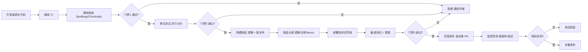
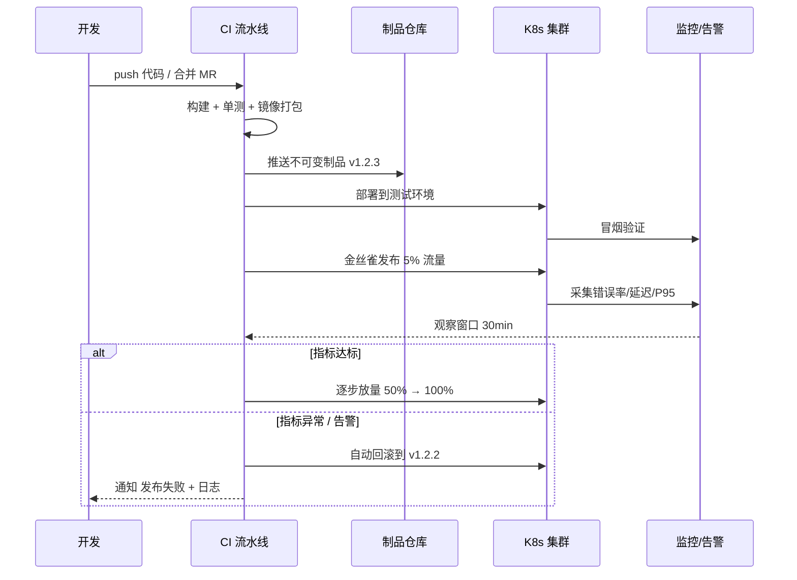
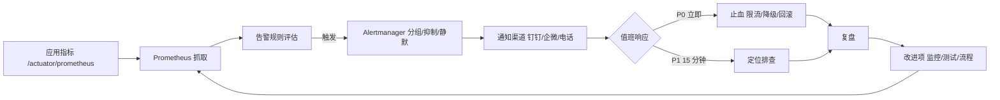
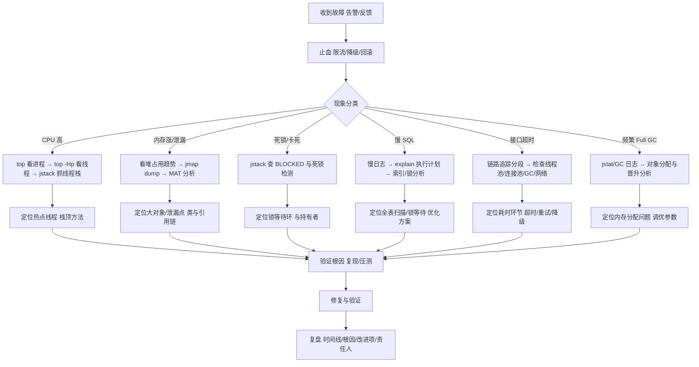

[📖 返回目录](README.md) · [⬅️ 上一章](21-cloud-native-bigdata.md) · [➡️ 下一章](23-algorithms.md)

# 22 · 工程实践与线上故障排查（资深向）

> 适用对象：10+ 年经验的资深工程师 / 架构师候选人。本章覆盖：高频设计模式及其在 Spring/Netty/MyBatis 源码中的落点、代码质量与重构、单元测试与测试金字塔、CI/CD 流水线设计与灰度发布、Git 工作流、监控体系（四金指标/SLO/告警）、线上故障排查全流程（CPU 飙升/内存泄漏/死锁/慢 SQL/接口超时/Full GC 六类案例）。面试落点：资深面试不考「模式背定义」，考「模式在框架源码里怎么用、线上故障怎么 30 分钟内定位」——本章按「原理 → 工程落地 → 实战排查」组织。

**TL;DR 本章学习要点**

1. 设计模式的面试答法是「**模式 → 源码落点 → 为什么这么用**」：单例看 Spring Bean 默认单例、模板方法看 `AbstractApplicationContext.refresh`、责任链看 Netty Pipeline、代理看 AOP 的 JDK/CGLIB 选择逻辑；
2. 重构的本质是「**小步、可验证、行为不变**」：坏味道是信号不是罪状，先有测试再重构；Code Review 查的是「意图、边界、并发、异常路径」，不是格式；
3. 测试金字塔的工程含义：**单元测试多而快（秒级）、集成测试少而真（Testcontainers 起真中间件）、E2E 点缀**；覆盖率是手段不是目标，关键路径 100% 才有意义；
4. CI/CD 的灵魂是「**门禁 + 自动化 + 可回滚**」：提交 → 构建 → 静态检查 → 单测 → 制品 → 灰度 → 全量，每道门失败即阻断；发布三板斧：蓝绿/金丝雀/滚动，永远有回滚预案；
5. 故障排查是「**先看指标缩小范围，再定位线程/内存/SQL，最后验证根因**」的结构化过程：CPU 高看线程栈、内存涨看堆 dump、死锁看 jstack、慢 SQL 看执行计划、超时看链路与线程池、Full GC 看 GC 日志——每个案例都有固定的「命令序列」。

---

### 📑 本章目录

- [1. 设计模式高频（含框架源码落点）](#1-设计模式高频含框架源码落点)
- [2. 代码质量与重构](#2-代码质量与重构)
- [3. 单元测试与测试金字塔](#3-单元测试与测试金字塔)
- [4. CI/CD](#4-cicd)
- [5. Git 工作流](#5-git-工作流)
- [6. 监控体系](#6-监控体系)
- [7. 线上故障排查全流程](#7-线上故障排查全流程)
- [考点速查表](#考点速查表)

## 1. 设计模式高频（含框架源码落点）

### 1.1 七种高频模式速览

| 模式 | 核心意图 | 框架源码落点 |
|---|---|---|
| 单例 | 全局唯一实例 | Spring 容器 Bean 默认单例；`Runtime.getRuntime()` |
| 工厂 | 创建逻辑与使用解耦 | Spring `BeanFactory`/`ApplicationContext`；MyBatis `SqlSessionFactory` |
| 策略 | 算法族可替换 | Spring `Resource` 的协议解析；线程池 `RejectedExecutionHandler`；`Comparator` |
| 模板方法 | 骨架固定、步骤可扩展 | Spring `AbstractApplicationContext.refresh()`、`JdbcTemplate`；`RestTemplate` |
| 观察者 | 状态变化通知依赖方 | Spring `ApplicationEvent`/`@EventListener`；`ContextRefreshedEvent` |
| 责任链 | 请求沿链传递处理 | Netty `ChannelPipeline`；MyBatis `Interceptor` 链；Spring MVC `HandlerInterceptor`、`Filter` |
| 代理 | 控制访问、增强逻辑 | Spring AOP（JDK 动态代理 / CGLIB）；MyBatis Mapper 的 `MapperProxy` |

- **框架级洞察**：Spring 之所以「模式密度」最高，是因为它本身是「对象容器」——创建（工厂+单例）、装配（代理）、生命周期（模板方法+观察者）天然需要这些模式；**回答框架问题时要能指出「如果不这么用会怎样」**（如 Bean 不设单例会怎样——多例 Bean 的依赖注入与状态管理复杂度爆炸）。

### 1.2 单例的四种写法与三个坑

- 四种写法：饿汉（类加载即创建，简单但浪费）、静态内部类（`Holder`，懒加载 + 线程安全，推荐）、枚举（**反序列化/反射天然免疫**，Effective Java 推荐）、双检锁（DCL，见第 23 章手写题）；
- 三个坑：① 反射可破坏单例（构造器 `setAccessible(true)`）——枚举免疫，普通类要在构造器里抛异常；② 反序列化破坏单例——实现 `readResolve()` 或直接用枚举；③ 双检锁必须 `volatile`（防止「半初始化对象」被读到）——**这是面试最爱挖的点：`new` 的四个步骤（分配→初始化→引用赋值）可能重排**；
- 资深视角：**单例的敌人是「全局可变状态」**——单例 + 可变字段 = 隐式全局变量，并发下全是坑；现代实践倾向「无状态单例 + 显式依赖注入」，单例模式本身在 Spring 里已经「被容器接管」。

### 1.3 策略 + 模板方法：框架设计的「骨架-扩展」双件套

- **模板方法**：父类定义算法骨架（不可变部分），子类/回调实现可变步骤。`AbstractApplicationContext.refresh()` 是教科书案例：`obtainFreshBeanFactory → prepareBeanFactory → postProcessBeanFactory（留给子类扩展）→ invokeBeanFactoryPostProcessors → registerBeanPostProcessors → onRefresh（空方法，Spring Boot 的 ServletWebServerApplicationContext 重写它启动内嵌 Tomcat）`；`JdbcTemplate.execute` 则是「模板方法 + 回调」的组合：连接管理、异常转换、资源释放是骨架，`StatementCallback` 是扩展点；
- **策略**：`Resource` 接口的 `getResource("classpath:...")` 按前缀路由到 `ClassPathResource/FileUrlResource/UrlResource`；`RejectedExecutionHandler` 四种策略（Abort/CallerRuns/Discard/DiscardOldest）即「拒绝策略可插拔」；
- 两者区别（高频追问）：模板方法是「**继承**层面的骨架复用」（流程固定、步骤可变），策略是「**组合**层面的算法替换」（整体替换、互不感知）；**组合优于继承**——能用策略/回调就别用继承，`JdbcTemplate` 用回调而非子类化正是这个原则的体现。

### 本节高频面试题

**Q1：Spring 的 Bean 为什么默认是单例？改成多例（prototype）要注意什么？**

解答：默认单例的原因：① **性能**——对象创建 + 依赖注入有成本，容器启动时创建一次，全应用复用；② **一致性**——共享配置、连接池、缓存等基础设施天然要单例；③ **简化心智**——容器管理的单例生命周期清晰（init/destroy 回调）。注意点：① prototype 的 Bean 每次 `getBean` 都新建，**容器不管理其销毁回调**（要自己处理资源释放）；② prototype 注入到单例 Bean 时，注入的是「创建那一刻的实例」——想要「每次调用拿新实例」要用 `ObjectFactory`/`@Lookup`/`Provider`；③ **单例 Bean 里别放可变状态**（尤其是注入 prototype 依赖时），并发写会互相污染。**面试升华：单例模式在 Spring 里已经升级为「容器级单例治理」——单例的创建时机、销毁、作用域传播都由容器接管，这是「模式被框架吸收」的典型**。

面试官追问：`@Autowired` 注入一个 prototype Bean 到 singleton Bean，会怎样？怎么实现每次调用都是新实例？——答：注入发生在单例创建时，之后一直复用同一个实例——等于「prototype 失效」。解法：① `ObjectProvider<T>` 注入，每次 `getObject()` 拿新实例；② `@Lookup` 方法注入（CGLIB 子类化实现）；③ 注入 `ApplicationContext` 手动 `getBean`（不推荐，破坏可测试性）。**要点：作用域传播是 Spring 的经典坑，答案的核心是「注入时机 vs 使用时机」**。

**Q2：Spring AOP 什么时候用 JDK 动态代理、什么时候用 CGLIB？为什么 Spring Boot 默认强制 CGLIB？**

解答：JDK 动态代理要求目标类**实现接口**，基于接口生成代理类（`Proxy.newProxyInstance` + `InvocationHandler`），只能代理接口方法；CGLIB 通过**继承目标类**生成子类代理（ASM 字节码生成），可代理无接口的类，但不能代理 `final` 类/方法。选择逻辑：Spring 默认「有接口用 JDK 代理」；Spring Boot 2.x 起 `proxy-target-class=true` 默认强制 CGLIB——原因：① JDK 代理的「接口方法调用」在代理上，而**目标类内部 `this` 调用不会走代理**（AOP 失效的经典坑）；② 强制 CGLIB 行为统一，避免「同代码不同框架版本行为不一致」；③ CGLIB 性能已不输 JDK 代理（且 Spring 6 基于 ASM 重写）。**面试升华：AOP 失效的三种典型场景——`this` 内部调用、方法不是 public（CGLIB 无法覆写非 public）、final 方法——比代理原理本身更常考**。

面试官追问：MyBatis 的 Mapper 只有接口没有实现类，怎么就能调用了？——答：`MapperProxyFactory` 在启动时扫描 `@Mapper` 接口，用 JDK 动态代理生成实现：调用 `session.getMapper()` 返回代理，代理把「接口方法 + 参数」转成 `MappedStatement` 的 SQL 执行。**这就是「代理模式 + 约定大于配置」的极致应用：接口即契约，实现由框架生成**。

**Q3：Netty 的 ChannelPipeline 责任链和 Servlet Filter 链、Spring MVC 拦截器链有什么异同？**

解答：共同点：都是「请求沿链传递，每个节点决定「处理 or 放行」」，实现了解耦与可插拔（增删节点不改业务）。差异：① **方向模型**——Netty 是双向的（`ChannelInboundHandler` 入站 + `ChannelOutboundHandler` 出站，两条链在 `TailContext/HeadContext` 汇合），Filter/拦截器是单向的；② **数据粒度**——Netty 传的是 `ByteBuf` 与自定义消息对象（可粘包拆包后按业务对象传递），Filter 传 `ServletRequest`；③ **生命周期**——Netty 的 handler 随连接创建（`ChannelInitializer` 每次为新连接组装管道），Filter/拦截器是全局单例；④ 顺序控制：Netty 靠添加顺序 + `@Sharable` 标注共享 handler。**面试升华：责任链的本质是「管道化处理」，Netty 把它升级成「双向 + 动态组装」，理解了这个，看 K8s 的 Admission Webhook 链、网关的 filter 链都是同一思想**。

面试官追问：MyBatis 的 Interceptor 责任链是怎么实现的？——答：`InterceptorChain` 持有所有拦截器，`pluginAll()` 用 JDK 代理/CGLIB 层层包装 `Executor/StatementHandler/ParameterHandler/ResultSetHandler`——**后添加的拦截器包在最外层，执行时先执行**（洋葱模型）。注意：MyBatis 拦截器只能拦这四个组件的方法，且对 SQL 字符串的修改要自己保证 `@Intercepts` 签名精确匹配，否则静默失效——这是插件体系设计的边界问题。

---

## 2. 代码质量与重构

### 2.1 坏味道清单（按优先级）

- **结构性**：上帝类/长方法（>50 行且做多件事）、重复代码（Copy-Paste，三处以上必须抽）、霰弹式修改（改一个需求要动 N 个类）、依恋情结（方法大量使用别的类的数据）、数据泥团（重复出现的字段组）；
- **可读性**：魔法数字、命名撒谎（`temp`/`data`/`result`）、注释代替代码（「这里很复杂」→ 应该抽方法命名）、长参数列表（>4 个 → 引入参数对象）；
- **设计性**：过深的嵌套（>3 层 → 卫语句/早返回）、`null` 满天飞（用 Optional/空对象/异常）、可变全局状态、类没有「单一职责」却说不清「它负责什么」；
- **演进性**：死代码（注释掉的代码、不再走的 if 分支——**版本管理里的代码不该留在源码里**）、过度设计（为不存在的需求抽象）、耦合（`new` 到处飞、静态方法直接调 DAO）。

### 2.2 重构手法与节奏

- 安全前提：**重构前先有测试兜底**（行为不变性验证），小步提交（一次重构一个提交，可 revert）；
- 高频手法：Extract Method（长方法拆解）、Rename（命名即文档）、Introduce Parameter Object、Replace Conditional with Polymorphism（`if/else` 分型 → 策略/多态）、Decompose Conditional（卫语句）、Pull Up / Push Down Method、Replace Magic Number with Constant、Extract Class（上帝类拆分）；
- **重构 ≠ 重写**：重构是「行为不变的结构调整」，重写是「推倒重来」；团队踩坑最多的是「顺手重构 + 加需求」混在一个 PR 里——**评审没法做、回滚没法做**；规范：重构 PR 与功能 PR 分离，重构 PR 的 diff 应「纯移动/纯改名」可机械验证。

### 2.3 Code Review 清单（评审视角）

- **意图层**：这个 PR 解决什么问题？方案是否最简（有没有过度设计）？命名是否表达意图？
- **正确性层**：边界条件（空集合/null/超时/并发）？异常路径（资源是否释放、事务是否回滚）？并发安全（共享状态、可见性）？
- **性能层**：循环里的 DB 调用/远程调用（N+1）？无意义的全表扫描？大对象拷贝？
- **安全层**：SQL 注入/越权（IDOR）/敏感信息（日志里打密码 token）？输入校验？
- **可维护性层**：测试是否覆盖关键路径？是否可读（新人不看文档能懂）？是否与现有架构一致？
- 评审文化要点：**评审是对「代码」不是对「人」**；用提问代替命令（「这里为什么不用 X？」）；阻塞项（Bug/安全问题）与非阻塞项（风格建议）明确分级；**自动化能做的（格式/静态检查）不要浪费人眼**。

### 本节高频面试题

**Q4：你们团队的 Code Review 经常流于形式，怎么让它真正起作用？**

解答：流于形式的三因三解：① **评审太晚、diff 太大**——规范：PR 控制在 200~400 行以内（一次评审 30 分钟上限），大改动拆小；② **没有评审清单**——把 2.3 的清单固化成模板/机器人检查项（GitHub 的 CODEOWNERS + PR 模板 + CI 自动标注「哪些文件必审」）；③ **评审没有反馈闭环**——阻塞项不合并、作者必须回复每条评论（「已修/讨论后不改+理由」）、定期统计评审数据（评审时长、缺陷逃逸率）。**面试升华：CR 文化的本质是「把质量责任前置」——评审不是找茬，是「让代码至少被两个人理解」；理解的副产品才是抓 Bug**。

面试官追问：重构老代码没测试，怎么敢动？——答：先「**characterization test（特征测试）**」：按现有行为写测试锁定当前输出（不判断对错，只记录行为），重构后测试仍绿 = 行为没变；同时用「**并行重构**」：新实现与旧实现并存，灰度对比输出（diff 对拍），一致后再删旧代码——这是「数据迁移类重构」的标准打法。**要点：没有测试不是不动代码的理由，是「先造安全网再动刀」的提示**。

**Q5：怎么判断一段代码该不该抽成公共组件/工具类？**

解答：三个判断标准：① **复用次数**——三处以上重复才抽（「三次法则」），两处重复优先「复制 + 各自演化」（过早抽象是负债）；② **变化维度**——如果两处「相似但变化方向不同」（一处要加字段、一处要改行为），抽公共类会互相拖累——此时该用「组合/回调」而非「继承/公共类」；③ **抽象成本**——公共组件意味着多一份 API 契约、文档、兼容性负担（改动要评估所有调用方），小团队内部工具类要克制。**面试升华：抽象的时机 = 重复的次数 × 变化的耦合度；「抽公共类」是成本最高的抽象方式，优先考虑「复制后独立演化」和「接口 + 实现注入」**。

---

## 3. 单元测试与测试金字塔

### 3.1 测试金字塔与测试替身

- 金字塔结构：底层单元测试（多、快、毫秒级、确定性）→ 中间集成测试（少、秒级、起真中间件）→ 顶层 E2E（极少、分钟级、贵、脆）——**越往上越贵越慢，数量越少**；
- 反模式（冰激凌筒）：E2E 一大堆、单元测试没有——CI 慢到没人跑、失败难以定位；
- 测试替身五兄弟：Dummy（占位）、Stub（返回固定值）、Fake（内存实现，如内存版 Repository）、Mock（验证交互：`verify` 调用次数/参数）、Spy（真实对象 + 记录调用）；**原则：优先真实对象与 Fake，Mock 只用于「外部边界」（网络/时间/随机）**——过度 Mock 的测试「测的是 Mock 自己」；
- 好测试的四个属性：**快速、独立（可乱序跑）、可重复（无随机/flaky）、可读（失败信息直接指向根因）**。

### 3.2 JUnit5 / Mockito / Testcontainers 实战要点

- JUnit5 = Jupiter（编程模型）+ Platform（启动器）+ Vintage（兼容 JUnit4）：`@Test/@BeforeEach/@AfterEach/@ParameterizedTest/@Nested`，断言用 AssertJ（流畅 + 可读）；
- Mockito：`@Mock/@InjectMocks/@Captor`，`when().thenReturn()` 与 `doThrow()`（void 方法），`verify()` 交互验证；**坑**：`@InjectMocks` 的构造器/字段注入顺序、`when` 里不能放真实调用（`when(obj.get())` 会先执行）；
- Testcontainers：用 Docker 起真实中间件（MySQL/Redis/Kafka/ES）做集成测试——**环境与 CI 一致，消灭「我本机能跑」**；注意：单测不开容器（慢），容器测试放独立 profile/CI 阶段；启动用 `@Testcontainers` + `@Container` 静态共享（一个容器跑完整测试类，别每个方法都起）；
- 覆盖率（JaCoCo）：行覆盖/分支覆盖——**目标是「关键路径与异常路径」的覆盖而非数字**；常见话术：核心业务模块 ≥80%，工具类/配置类不设指标；覆盖率是「测试质量的必要不充分条件」。

### 本节高频面试题

**Q6：单元测试、集成测试、E2E 的边界怎么划？谁来写？**

解答：边界按「**被测单元的大小与依赖的真实度**」划：单元测试 = 单个类/方法 + 依赖全替身（毫秒级，开发自写，随代码提交）；集成测试 = 一个模块 + 真中间件（Testcontainers 起 MySQL/Redis，验证 SQL、事务、序列化——**单测替身测不出的部分**）；E2E = 全链路（网关→服务→DB），由 QA 或专门的 E2E 团队维护，数量少而精（核心用户旅程 ≤20 条）。**分工原则：单元测试是开发的责任（质量内建），E2E 是验收的责任；集成测试是两者的黏合剂——多数团队最大的缺口是「集成测试太少」**：单测 Mock 掉了 SQL 语义、E2E 又太贵，事务/映射类 Bug 全靠人肉。

面试官追问：测试替身该用 Mock 还是 Fake？——答：**内部协作者（自己项目的类）优先 Fake/真实对象，外部边界（第三方 SDK、网络、文件系统、时钟）才 Mock**。理由：Mock 验证的是「交互」，把实现细节（调了几次、传了什么参数）写进测试后，重构内部实现就碎一片测试；Fake 验证的是「行为」，重构不碎。**口诀：Mock 行为契约（接口）、不 Mock 实现细节（类）**。

**Q7：测试很慢、CI 超时，怎么优化测试速度？**

解答：按耗时排序的优化手段：① **分级执行**——单测（秒级）进提交门禁，集成测试（分钟级）进合并门禁，E2E（更慢）进 nightly/发布前；② **并行化**——JUnit5 的 `junit.jupiter.execution.parallel.enabled` + Surefire 的 `parallel=methods/classes`（注意共享资源要隔离，数据库用独立 schema/Testcontainers 每类一个容器）；③ **消除浪费**——减少 Mockito 的 `verify` 滥用、Spring 上下文缓存（`@ContextConfiguration` 的缓存命中，避免每类重启容器）、Testcontainers 容器复用（`@Testcontainers(disabledWithoutDocker)` + 单例容器）；④ **只测变化**——增量测试（`mvn -pl module -am test` 只测改动模块）。**面试升华：测试速度是「工程文化问题」——测试慢到没人跑 = 没有测试；所以 CI 分层的本质是「把最快的反馈给到最频繁的动作」**。

---

## 4. CI/CD

### 4.1 流水线设计

- 流水线本质是「**一串门禁 + 每个门禁的失败处理**」：门禁（静态检查/单测/制品签名/部署验证）必须「失败即阻断」且「快」（5 分钟内反馈），否则开发者绕过它；
- 关键实践：**制品不可变**（版本号 = 提交 SHA 或语义版本，构建一次、到处部署，禁止在环境里改制品）；**环境即代码**（部署脚本/配置进 Git，环境差异用配置注入而非手改）；**构建产物与源码可追溯**（制品元数据记录 commit、构建参数）；
- 平台选型：Jenkins（插件生态全、自建灵活、维护成本高）、GitLab CI（与 GitLab 一体、`.gitlab-ci.yml` 即代码、K8s runner 弹性）、GitHub Actions（托管、生态好、`workflow_dispatch` 手动触发、对开源免费）；**趋势：声明式流水线（YAML 即代码）+ 云上托管 Runner + 与制品/部署平台打通**。

### 4.2 发布策略与灰度发布

- 三种发布策略对比：**蓝绿**（两套环境切流量，回滚=切回，成本 ×2 资源）、**滚动**（K8s 默认，实例分批替换，省资源但新旧并存期兼容性要求高）、**金丝雀**（先小流量验证再放量，最稳但需要流量治理能力——Ingress/Service Mesh/网关支持按权重切流）；
- 灰度发布的完整闭环：**小流量 → 观测（错误率/延迟/业务指标）→ 判定（人工或自动化）→ 放量或回滚**；观测是灰度的灵魂——没有业务指标对比的灰度 = 盲放；
- 回滚三板斧：**镜像回滚**（Deployment 指回旧版本）、**数据回滚**（DB 变更必须「向前兼容 + 可逆」，见第 21 章 Q11）、**配置回滚**（配置中心版本化）；**永远先止血（回滚/降级）再排查**。

### 4.3 常见坑与工程实践

- **坑 1：CI 与本地不一致**——「我本机能跑」；解法：CI 用与生产一致的基础镜像、锁依赖版本（Maven 的 lockfile 或固定版本）、缓存干净；
- **坑 2：流水线太长**——全量构建 + 全量测试 40 分钟，没人等；解法：分层（提交级/合并级/发布级）、增量构建、并行分片；
- **坑 3：灰度当摆设**——灰度 5% 放了一天没人看指标；解法：灰度窗口强制「观测 checklist + 超时自动回滚」；
- **坑 4：发布依赖人肉**——「小张手动执行那几步」；解法：发布按钮化（一键发布 + 权限审批），记录发布审计日志；
- **坑 5：环境漂移**——测试环境手改过配置，生产行为不一致；解法：环境配置全量代码化（Helm/配置中心），禁止手改。

### 本节高频面试题

**Q8：你们的 CI 流水线从提交到上线要多久？怎么缩短？**

解答：先分层回答「多久」：提交级（静态检查+单测）应 <5 分钟，合并级（集成测试+构建制品）<15 分钟，发布级（部署+冒烟+灰度观测）分钟级~小时级。缩短手段按杠杆排序：① **只测变化**：增量编译与测试（改哪个模块测哪个模块）；② **并行化**：测试分片、多 Job 并行（构建与测试并行跑）；③ **缓存**：依赖缓存（Maven 仓库/镜像层缓存）命中率提升 80% 的构建时间；④ **裁剪冗余**：非发布分支不跑集成测试、E2E 只跑变化路径；⑤ **左移**：能本地/提交级发现的问题绝不留到合并级。**面试升华：CI 速度 = 反馈速度 = 开发效率，把 CI 从「40 分钟」降到「5 分钟」对团队效率的提升，比任何性能优化都大**。

面试官追问：灰度发布怎么判断「指标达标」？——答：灰度观测的指标分三层：① **系统层**：错误率（<0.1% 或与基线持平）、P95 延迟（不劣化 10% 以上）、CPU/内存水位；② **业务层**：核心漏斗（下单转化率、支付成功率）与基线对比；③ **日志/链路**：异常堆栈、慢调用 TopN。判定方式：人工看板（小团队）或自动化（Argo Rollouts 的 AnalysisTemplate 配置阈值，超限自动回滚）。**要点：灰度判定必须「与基线对比」而非看绝对值——业务本身的波动可能比灰度影响大**。

**Q9：Jenkins、GitLab CI、GitHub Actions 怎么选？**

解答：选型维度：① **代码托管在哪**——GitLab 代码配 GitLab CI（一体化，免维护 Runner 之外的组件）、GitHub 代码配 Actions（托管 Runner、市场生态最好）；Jenkins 适合「异构环境、私有化、已有大量插件资产」的存量场景；② **运维成本**——Jenkins 要自建 Master/Agent、插件升级、安全补丁；GitLab CI/Actions 自带调度与缓存（Actions 的 `actions/cache`），运维几乎为零；③ **能力边界**——Jenkins 的 Pipeline（Groovy）最灵活但学习成本高；声明式 YAML 是趋势（三个平台都支持）；④ **合规**——私有化网络、信创环境只能 Jenkins/GitLab 自托管 Runner。**面试升华：CI 平台选型的本质是「维护成本 vs 灵活性」的权衡——新一代团队默认托管平台（GitHub Actions/GitLab CI），Jenkins 是「历史包袱或强管控需求」的答案**。

---

## 5. Git 工作流

### 5.1 GitFlow vs Trunk-Based

| 维度 | GitFlow | Trunk-Based（主干开发） |
|---|---|---|
| 分支模型 | master + develop + feature + release + hotfix 五类分支 | 主干（trunk/master）+ 短命特性分支（<2 天） |
| 发布方式 | 从 release 分支发布，发布后合并回 develop/master | 主干随时可发布（小步提交 + 特性开关） |
| 适合场景 | 版本化交付（客户端、多版本维护）、发版节奏慢 | 持续交付（SaaS/微服务）、发版节奏快 |
| 代价 | 合并地狱、长期分支（feature 分支活几周）、hotfix 要同步多处 | 主干必须永远绿（测试要快、特性开关要完善） |
| 团队要求 | 低（流程兜底） | 高（纪律 + 自动化强） |

- 现代共识：**微服务/SaaS 团队默认 Trunk-Based**——GitFlow 的 release 分支与 develop 分支的反复合并是「无效劳动」，且分支越长合并冲突越痛；GitFlow 只保留在「需要同时维护多个线上版本」的场景（如客户端发版）；
- 落地 Trunk-Based 的前提：特性开关（功能未完成默认关）、小步提交（PR < 300 行）、主干门禁（CI 全绿才可合）、必要时用「发布分支」只做版本化冻结（发布后立即合并回主干并删除）。

### 5.2 merge vs rebase vs squash

- **merge**：保留真实历史（分叉 + 合并节点），`--no-ff` 强制合并节点；适合「保留协作痕迹」的公共分支；
- **rebase**：把本地提交「变基」到目标分支顶端，历史线性化；**适合「私有分支同步主干」**——但**绝不对公共分支 rebase**（重写已发布历史 = 别人拉取时冲突地狱）；
- **squash**：把 N 个提交压成 1 个；适合「功能分支合并回主干」（一个功能一个提交，主干历史干净，`git log` 即 changelog）；
- 冲突解决：rebase 冲突按「每步一个提交」解决（`git rebase --continue`），merge 冲突一次解决；**冲突的根源是「双方改了同一处」，先理解对方意图再合并，不要无脑取一边**。

### 5.3 常用救急命令

- `git reflog`（找回误删/误 reset 的提交——**reflog 是本地操作的后悔药**）、`git cherry-pick`（挑提交到当前分支）、`git revert`（生成反向提交，公共分支回滚用 revert 不用 reset）、`git stash`（暂存未提交改动）、`git bisect`（二分定位引入 Bug 的提交）、`git blame`（定位代码责任人，用于复盘）。

### 本节高频面试题

**Q10：rebase 和 merge 到底怎么选？团队规范怎么定？**

解答：核心原则：**公共分支用 merge（或 squash merge），私有分支用 rebase**。落地规范：① 功能分支开发期：`git rebase main` 同步主干（保持线性，减少合并冲突）；② 功能完成：squash merge 回主干（一个功能一个提交，主干历史可读）；③ release/hotfix 分支：merge 保留真实合并记录；④ **禁止**：对共享分支（main/develop/release）执行 rebase 或 force push（`--force-with-lease` 是唯一允许的 force 形式且要审批）。**面试升华：分支策略的争论本质是「历史可读性 vs 历史真实性」的权衡——主干要可读（squash），协作要真实（merge），个人开发要线性（rebase），三者各司其职**。

面试官追问：`git revert` 和 `git reset` 有什么区别？什么时候用哪个？——答：`reset` 是「移动分支指针」，会**重写历史**（本地未推送可随意用）；`revert` 是「生成一个反向提交」，**不重写历史**（公共分支回滚的唯一安全方式）。场景：本地提交错了 → `reset --hard`；线上功能要撤销 → `revert`（保留「曾经发布过」的历史记录，审计友好）。**要点：一句话——没推送 reset，已推送 revert**。

**Q11：线上紧急 Bug，hotfix 流程怎么走才不踩坑？**

解答：标准流程（GitFlow 场景）：① 从**当前线上版本标签**（或 release 分支）拉 hotfix 分支——**不要从 develop 拉**（develop 可能带着未发布的半成品）；② 修复 + 测试 + 直接发布；③ 发布后**双向合并**：hotfix 合并回 master（打新标签）**和** develop（防止下次发布把修复弄丢）——「漏合并回 develop」是 hotfix 最常见的事故源；④ 复盘：hotfix 往往暴露「测试覆盖缺口」，补回归测试。Trunk-Based 场景：直接在主干修复 + 特性开关/直接发布，流程更短。**面试升华：hotfix 流程的设计目标是「修复只走最短路径，且修复不会在未来的合并中丢失」——双向合并 + 补测试是闭环关键**。

---

## 6. 监控体系

### 6.1 四金指标与 RED/USE 方法论

- **Google 四金指标（Four Golden Signals）**：**延迟**（Latency，分位数 P50/P95/P99，区分成功/失败）、**流量**（Traffic，QPS/并发）、**错误**（Errors，错误率、显式错误与隐式错误——如返回 200 但业务失败）、**饱和度**（Saturation，CPU/内存/线程池/连接池水位，「快满」的信号）；
- 补充方法论：**RED**（服务视角：Rate 请求率 / Errors 错误率 / Duration 延迟）、**USE**（资源视角：Utilization 利用率 / Saturation 饱和度 / Errors 错误数）——四金指标管「用户体验」，RED/USE 管「定位手段」；
- 落地要点：指标必须**分维度**（接口、实例、机房、版本——灰度对比的根基）；**P99 比平均值有用**（平均延迟被长尾掩盖）；错误要区分「错误码错误」与「业务错误」（下单失败率才是业务真相）。

### 6.2 Prometheus + Grafana 架构

- **Prometheus**：拉模型（Pull）采集（Exporter 暴露 `/metrics`），TSDB 存储，PromQL 查询，Alertmanager 告警路由；**Pull 优于 Push**：采集端可控、故障自发现（拉不到 = 挂了）、无埋点依赖；
- 采集链路：应用（Micrometer 的 Prometheus Registry 暴露 `/actuator/prometheus`）→ Prometheus 抓取 → 告警规则评估 → Alertmanager（分组/抑制/静默）→ 通知渠道（钉钉/企微/Slack/PagerDuty）；
- **Grafana**：可视化 + 告警统一入口（新版本已内置告警引擎），Dashboard 即代码（JSON 模板进 Git）；
- 链路追踪：SkyWalking（Java 探针，自研存储）/ Jaeger（CNCF，配合 Istio）；日志：ELK/Loki；**指标-日志-链路三支柱打通**（从告警 → 看板 → 日志 → 链路逐层下钻）是排查的标准姿势。

### 6.3 告警分级与 SLO 设计

- **告警分级**：P0（核心功能不可用，立即电话/值班）、P1（部分功能受损或即将受损，15 分钟内响应）、P2（一般故障，工作时间处理）、P3（提示性，周报汇总）；**告警分级的本质是「响应时效与升级路径」的约定**；
- 告警质量三原则：**可执行**（每条告警知道「谁、看什么、第一步做什么」，附排查链接）、**不重复**（Alertmanager 分组抑制，避免告警风暴）、**有止损**（告警即触发「限流/降级/回滚」预案，不是只通知人）；
- **SLO 设计**：SLI（量化指标，如「下单接口 P99 延迟 < 500ms」）→ SLO（目标值，如 99.9% 请求达标）→ **Error Budget（错误预算 = 1 - SLO，如 0.1% 的失败额度）**；错误预算耗尽 → 冻结发布、只做稳定性工作——**把「可用性」变成可管理的工程资源**；SLO 不能拍脑袋：基于真实水位（当前 P99 是多少）定目标，留 10~20% 余量，否则天天告警就没人信告警了。

- **告警处理链路**（从指标异常到值班响应）：

- 监控设计自查清单：每个核心接口是否都有「QPS + 错误率 + P99」三件套？每个中间件（DB/Redis/MQ）是否都有连接数与延迟？每个 JVM 实例是否都有堆/GC/线程池监控？**没有监控的变更不允许上线**——这条应写进发布门禁。

### 本节高频面试题

**Q12：监控告警天天误报，值班同学都麻木了，怎么治理？**

解答：误报的根因与治理：① **阈值拍脑袋**——基于基线动态阈值（Prometheus 的 `predict_linear`/百分位滑动窗口），或先观察两周真实水位再定阈值；② **告警没有上下文**——每条告警附「影响面（哪些接口/用户）+ 排查入口（看板链接/日志查询）+ 第一步动作」，值班才能执行；③ **没有分级与抑制**——同一故障的连环告警被 Alertmanager 分组合并；依赖故障（DB 挂了引发 20 个服务告警）用「根因告警 + 抑制衍生告警」；④ **告警无复盘**——每月告警复盘：误报率、重复率、未触发（该告没告）三类，持续消减；⑤ 文化：**告警是「承诺」**——每一条告警都代表「需要人处理」，没人处理的告警就该删除。**面试升华：告警治理的本质是「把注意力当稀缺资源管理」——告警系统的 KPI 不是「告得多」，是「告得准」**。

面试官追问：SLO 的 Error Budget 用完了怎么办？——答：触发「发布冻结」：停止所有非紧急变更（功能发布、配置变更），团队把时间切换到稳定性工作（容量、混沌、加固），直到错误预算恢复。这背后的工程哲学：**没有预算概念的 SLO 只是「目标数字」，有了预算才变成「发布决策的输入」**——稳定性不是靠「更小心」，是靠「把风险量化成额度来管理」。

**Q13：接口 P99 延迟达标但用户还是说慢，可能是什么问题？**

解答：四类典型盲区：① **指标统计口径**：只统计了「成功请求」的延迟，失败（超时重试后成功）与客户端等待被排除；② **长尾在客户端侧**：服务端 P99 好但「网络传输 + 客户端渲染 + DNS 解析」慢——要加 RUM（真实用户监控）看端到端；③ **分位数粒度**：P99 只反映 1% 的慢，但如果慢请求集中在「特定用户/地域/参数」——按维度拆 P99（某地域的 P99 可能超时）；④ **排队效应**：高并发下线程池/连接池排队，服务端处理时间正常但「等待时间」长——监控要分「服务时间」与「排队时间」。**面试升华：延迟优化的前提是「拆对指标」——端到端 = 客户端 + 网络 + 排队 + 服务 + 存储，每段都要有可观测性，否则优化的只是「自己看得见的那一段」**。

---

## 7. 线上故障排查全流程

### 7.1 故障排查决策树（通用方法论）

- 铁律：**先止血（回滚/限流/降级），后排查**——线上 30 分钟原则：10 分钟止血，20 分钟定位；定位不到先恢复，事后复盘继续查；
- 排查顺序：**指标（范围）→ 日志（线索）→ 线程/内存（证据）→ 代码（根因）**——用数据缩小范围，不要猜；
- 工具清单：`top`/`vmstat`/`iostat`（资源）、`jps`/`jstack`/`jmap`/`jstat`/`jcmd`（JVM）、`arthas`（在线诊断神器：`thread -n 3`/`dashboard`/`watch`）、`dmesg`（OOM Kill 记录）、`ss`/`netstat`（连接）、`tcpdump`（抓包）。

### 7.2 六类案例：现象 → 定位 → 根因 → 修复 → 复盘

**案例一：CPU 飙升 100%**

| 环节 | 动作 |
|---|---|
| 现象 | 告警 CPU 持续 100%，接口 RT 飙升 |
| 定位 | `top` 找 Java 进程 PID → `top -Hp PID` 找热点线程 TID → `printf '%x' TID` 转十六进制 → `jstack PID | grep -A 30 TID` 看线程栈 |
| 根因 | ① 死循环/大对象循环处理（栈顶是业务方法）；② 频繁 GC（GC 线程占 CPU，看栈里 GC 线程多）；③ 正则灾难（回溯爆炸，`Pattern` 未缓存）；④ 序列化/加密热点无缓存 |
| 修复 | 修死循环 + 加超时熔断；缓存正则/序列化结果；GC 问题转案例六 |
| 复盘 | 压测覆盖不了「线上数据分布」的极端输入 → 增加线上流量回放压测；热点路径加监控（方法耗时埋点） |

**案例二：内存泄漏（堆持续上涨，重启恢复）**

| 环节 | 动作 |
|---|---|
| 现象 | 堆内存锯齿状上涨，Full GC 后不回落，OOM 前进程被 K8s 重启 |
| 定位 | `jstat -gcutil PID 1000` 看 Old 区趋势 → `jmap -dump:format=b,file=heap.hprof PID` 抓堆（注意 dump 会 STW，低峰期做）→ MAT 的 Leak Suspects / 支配树找大对象与 GC Roots 引用链 |
| 根因 | ① 静态集合只加不删（缓存/监听器）；② ThreadLocal 未 remove（线程池复用线程，值永驻）；③ 连接/流未关闭；④ 类加载器泄漏（热部署/动态代理生成类） |
| 修复 | 修引用链 + 加容量上限与淘汰策略；ThreadLocal 用 try-finally remove |
| 复盘 | 加堆内存与 GC 的基线监控（趋势告警而非阈值告警）；上线前用压测验证内存曲线平稳 |

**案例三：死锁（接口全部卡死）**

| 环节 | 动作 |
|---|---|
| 现象 | 接口大面积超时，线程数打满，CPU 不高 |
| 定位 | `jstack PID` 搜 `Found one Java-level deadlock`（JVM 自带死锁检测）；看 BLOCKED 线程与「waiting to lock」的持有者 |
| 根因 | ① 多把锁加锁顺序不一致（A→B vs B→A）；② 嵌套锁 + 超时重试放大；③ 数据库行锁/表锁与代码锁叠加（先拿 DB 锁再拿本地锁） |
| 修复 | 统一锁顺序；用 `tryLock(timeout)` 替代裸 `synchronized`；缩小锁范围；必要时拆锁粒度 |
| 复盘 | 压测工具（压测时故意制造锁竞争路径）；代码评审加「锁顺序一致性」检查项 |

**案例四：慢 SQL**

| 环节 | 动作 |
|---|---|
| 现象 | 某接口 P99 恶化，DB CPU 升高 |
| 定位 | 慢查询日志（`long_query_time=1`）→ `EXPLAIN` 看 type（ALL=全表扫描）/rows/Extra（Using filesort/Using temporary）→ `SHOW FULL PROCESSLIST` 看锁等待 |
| 根因 | ① 索引缺失/失效（函数包裹、隐式类型转换、最左前缀不满足）；② 数据倾斜（某值占比过高，优化器放弃索引）；③ 深分页（`LIMIT 100000,20`）；④ 锁竞争（行锁升级、间隙锁） |
| 修复 | 建合适索引（覆盖索引）；改写 SQL（深分页改游标）；拆分大事务；读写分离 |
| 复盘 | 慢查询监控自动化（慢日志 → 告警 → 工单）；新 SQL 上线前强制 EXPLAIN 检查（SQL 评审门禁） |

**案例五：接口超时（服务端处理快，但调用方超时）**

| 环节 | 动作 |
|---|---|
| 现象 | 调用方报超时，被调方平均延迟正常 |
| 定位 | 链路追踪（SkyWalking/Zipkin）看各段耗时 → 检查线程池（队列积压：`ThreadPoolExecutor` 的队列长度监控）→ 连接池（连接耗尽：`HikariPool` 的 active 数）→ GC 停顿（P99 尖刺）→ 网络（`ss` 看 TIME_WAIT/丢包，`tcpdump` 抓包看重传） |
| 根因 | ① 线程池打满（慢调用占满线程，拖垮所有请求——线程池隔离缺失）；② 连接池耗尽（DB 慢 → 连接被占 → 新请求排队）；③ GC 停顿尖刺；④ 网络抖动/丢包重传 |
| 修复 | 线程池按业务隔离 + 拒绝策略降级；连接池超时时间调优（`connectionTimeout` < 接口超时）；限流保护下游；重试加抖动（避免惊群） |
| 复盘 | 「超时」要拆「服务时间 vs 排队时间」两个指标；压测覆盖线程池/连接池耗尽场景 |

**案例六：Full GC 频繁**

| 环节 | 动作 |
|---|---|
| 现象 | 告警 Full GC 频繁（分钟级），接口抖动，CPU 伴随升高 |
| 定位 | `jstat -gcutil PID 1000` 看 Old 区与 FGC 次数 → GC 日志（`-Xlog:gc*`）看每次 Full GC 前后堆占用 → 分析大对象分配与晋升（`-XX:+PrintTenuringDistribution`） |
| 根因 | ① 大对象直接进 Old（大数组/大集合/大 JSON）；② 内存泄漏导致 Old 涨满（见案例二）；③ 晋升阈值不合理（`MaxTenuringThreshold` 与 `TargetSurvivorRatio` 不匹配，对象在 Survivor 区反复拷贝）；④ 缓存无界（本地缓存把 Old 打满） |
| 修复 | 修大对象（流式处理/分页）；缓存加容量与过期；调参（G1 的 `-XX:G1HeapRegionSize`、`-XX:MaxGCPauseMillis` 目标）；换垃圾回收器（CMS→G1→ZGC 按延迟要求演进） |
| 复盘 | GC 指标纳入发布门禁（发布后 GC 曲线对比基线）；容量规划按「Old 区增长速率 × 周期」预留 |

### 7.3 故障复盘的四个层次

- **时间线**：什么时间、谁发现、谁响应、每一步耗时（「45 分钟才定位到」本身就是要改进的点）；
- **根因分析**：直接原因（技术）→ 间接原因（流程/设计）→ **系统性原因**（为什么这个 Bug 能上线——测试缺口？评审盲区？监控缺失？）；用「五个为什么」挖到流程层；
- **改进项**：每条改进必须「可执行、有负责人、有 deadline」——「加强测试」不是改进项，「为 XX 场景补充回归用例并纳入 CI 门禁」才是；
- **文化**：复盘对事不对人；**没有改进项的复盘 = 白开**；重大故障的复盘文档是团队的「事故博物馆」，新成员 onboarding 必读。

### 本节高频面试题

**Q14：线上 CPU 100%，你到工位后 5 分钟内的操作序列是什么？**

解答：① `top` 确认是哪个进程（Java 进程 CPU 最高）→ ② `top -Hp <pid>` 找 CPU 最高的线程 TID → ③ `printf "%x\n" <tid>` 转十六进制 → ④ `jstack <pid> > /tmp/stack.txt` 抓线程栈 → ⑤ 在栈文件里搜 `nid=0x<十六进制TID>` 看栈顶方法——**同时**（并行）确认是否 GC 问题：`jstat -gcutil <pid> 1000` 看 GC 线程占比。这样 2~3 分钟内就能区分「业务死循环（栈顶是业务代码）」与「GC 风暴（栈顶是 VM Thread/GC 线程）」，再决定修代码还是查内存。**面试加分：先说「先看告警/先止血——如果接口大面积超时先降级」，再报命令序列——这比背命令高级**。

面试官追问：jstack 抓到的栈显示线程在 `SocketInputStream.read` 等待，但 CPU 还是高，怎么解释？——答：说明 CPU 高可能不是这个线程：① 热点线程可能在别的线程（JIT 编译线程、GC 线程、其他业务线程）——要抓 2~3 次栈（间隔 3~5 秒）对比，看线程状态变化与「栈顶是否稳定」；② 也可能 CPU 高是「系统态」（内核）：网络软中断、上下文切换过高——`vmstat` 看 `us/sy` 比例，sy 高查网络与锁竞争。**要点：一次 jstack 是快照，多次快照的「差分」才是证据；CPU 高要分用户态（业务/GC）与系统态（内核/网络）**。

**Q15：内存泄漏和内存抖动（频繁分配大对象）怎么区分？处理方式有什么不同？**

解答：**泄漏** = 对象无法被回收（有引用链），堆占用「单调上涨、GC 后不回落」，重启恢复，最终 OOM；**抖动** = 对象能回收但分配太频繁/太大，堆占用「锯齿状波动、GC 频繁但能回收」，表现为 GC 频率高、CPU 高、RT 抖动，但不一定 OOM。区分方法：`jstat -gcutil` 看 Full GC 后 Old 区是否回落（回落=抖动，不回落=泄漏）；MAT 看 GC Roots 引用链（泄漏有稳定引用链，抖动是大对象分配点）。处理不同：泄漏修「引用管理」（静态集合/ThreadLocal/缓存无界），抖动修「分配行为」（大对象池化复用、减少重复创建、流式处理、分页查询）。**面试升华：内存问题的诊断口诀——「看 GC 后是否回落」五秒钟区分泄漏与抖动，方向错了后面全错**。

面试官追问：怎么在不影响线上的前提下抓堆 dump？——答：按影响从小到大：① `jmap -dump:live` 先触发一次 Full GC 再 dump（只留存活对象，文件小，但会 STW）；② 大堆用 `jmap -dump:format=b` 直接 dump（STW 时间与堆大小相关，低峰期执行）；③ **生产首选**：配置 `-XX:+HeapDumpOnOutOfMemoryError`（OOM 时自动 dump，不手动干预）；④ 容器场景注意 dump 文件落盘位置（挂卷/持久化，别丢在容器层）；⑤ 更安全：用 Arthas 的 `heapdump` 或先降流量再 dump。**要点：dump 是有代价的操作（STW + 磁盘），线上执行前先确认「收益 > 代价」**。

**Q16：你经历过的印象最深的线上故障是什么？怎么复盘的？**

解答（答题框架，用自己的真实案例填充）：**背景（一句话）→ 现象与影响（量化：影响多少用户/多长时间）→ 排查过程（时间线 + 关键证据，展示方法论）→ 根因（直接原因 + 系统性原因）→ 止血与恢复（先做了什么）→ 改进项（3 条以上，含测试/监控/流程）→ 沉淀（文档/工具/文化）**。答题要点：① 诚实——不掩饰自己的误判（面试官看的是「复盘能力」不是「完美履历」）；② 体现「止血优先」的工程判断；③ 改进项要「具体可执行」（不是「加强监控」而是「为 X 指标增加 P99 分维度告警并纳入发布门禁」）；④ 结尾升华：这次故障让团队/系统变得更强的地方。**面试升华：故障题的高分答案是「结构化叙事 + 工程判断 + 复盘闭环」，不是「我修了个 Bug」**。

**Q17：监控指标那么多，怎么确定「哪些必须监控」？**

解答：按「**用户可感知 → 依赖可量化 → 资源可预警**」三层自上而下确定：① **业务/用户层**（必须）：核心接口与核心链路的 QPS、错误率、P99 延迟、业务成功率（如支付成功率）——这是 SLO 的 SLI 来源；② **依赖层**（必须）：DB/Redis/MQ/外部调用的延迟、错误、连接池水位、慢查询数——依赖故障是最常见的故障源，且要能「按依赖」看影响面；③ **资源层**（必须）：CPU、内存、磁盘、网络、GC 频率与停顿、线程池活跃数——这是「即将故障」的早期信号（饱和度）；④ 其余（可选）：业务过程指标（漏斗转化）用于运营分析，与稳定性监控分开治理。原则：**每个告警都要能回答「用户感觉到了吗」**——答不上来的指标不进告警，只看板展示。**面试升华：监控的取舍标准是「与用户体验的关联度」——指标不是为了好看，是为了让「用户感知的问题」能被「系统指标」解释**。

面试官追问：Prometheus 拉模型 Pull 和推模型 Push 怎么选？——答：Prometheus 默认 Pull：采集端（Prometheus）主动拉取，好处是「采集可控（抓取频率/超时）、故障自发现（拉不到=目标挂了）、天然防 DDoS（目标不主动发数据）」；Push（Pushgateway）只用于「短生命周期任务」（批处理、定时任务——任务跑完就没了，Pull 拉不到）和「无法暴露端口的场景」。**要点：默认 Pull，例外才 Push——这是监控架构的默认配置，也是面试常问的「为什么」**。

---

## 考点速查表

| 考点 | 一句话要点 |
|---|---|
| 单例 | 静态内部类/枚举最优；DCL 必须 volatile；反射与反序列化是坑 |
| 模板方法 | 骨架固定步骤可变；refresh()/JdbcTemplate 是教科书案例 |
| 策略模式 | 算法可插拔；RejectedExecutionHandler/Resource 解析是落点 |
| 责任链 | Netty Pipeline 双向链、MyBatis Interceptor 洋葱包装 |
| AOP 代理 | 有接口 JDK 代理、无接口 CGLIB；Boot 默认 CGLIB 统一行为 |
| AOP 失效 | this 内部调用、非 public、final 方法三个经典失效点 |
| 坏味道 | 上帝类/重复/霰弹修改/长参数；三次法则再抽公共 |
| 重构安全 | 先特征测试锁行为再动；重构与功能 PR 分离 |
| Code Review | 意图/边界/并发/异常/安全五查；阻塞项与建议项分级 |
| 测试金字塔 | 单测多快、集成少真（Testcontainers）、E2E 点缀 |
| 测试替身 | 内部协作者用 Fake、外部边界才 Mock；验证行为不验证细节 |
| CI 门禁 | 静态检查→单测→制品→部署验证，失败即阻断 |
| 制品不可变 | 构建一次到处部署；版本号可追溯 commit |
| 灰度发布 | 小流量→观测→判定→放量/回滚；与基线对比而非绝对值 |
| 发布策略 | 蓝绿贵稳、滚动省资源、金丝雀最精细；永远有回滚预案 |
| Git 策略 | 公共分支 merge/squash、私有分支 rebase；未推送 reset、已推送 revert |
| hotfix 流程 | 从线上标签拉分支、发布后双向合并（master+develop） |
| 四金指标 | 延迟/流量/错误/饱和度；分位数优于平均值、分维度统计 |
| 告警治理 | 分级 P0-P3、可执行附排查入口、抑制风暴、复盘消减 |
| SLO | SLI→SLO→Error Budget；预算耗尽触发发布冻结 |
| 故障方法论 | 先止血后排查；指标→日志→线程/内存→代码逐层下钻 |
| CPU 飙升 | top → top -Hp → jstack 十六进制 TID；区分业务循环与 GC 风暴 |
| 内存泄漏 | GC 后不回落 = 泄漏；jmap dump + MAT 引用链 |
| 死锁 | jstack 自带死锁检测；统一加锁顺序 + tryLock 超时 |
| 慢 SQL | EXPLAIN 看 type/rows；覆盖索引、深分页改游标 |
| 接口超时 | 链路分段 + 线程池/连接池/GC/网络四查；超时拆服务时间与排队 |
| Full GC | jstat 看 Old 趋势；大对象/泄漏/晋升阈值/无界缓存四根因 |
| 故障复盘 | 时间线→根因五问→可执行改进项→对事不对人 |
