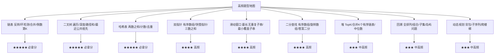
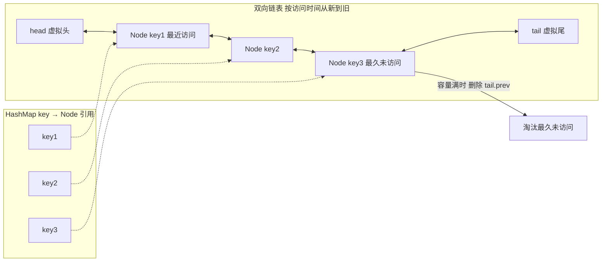
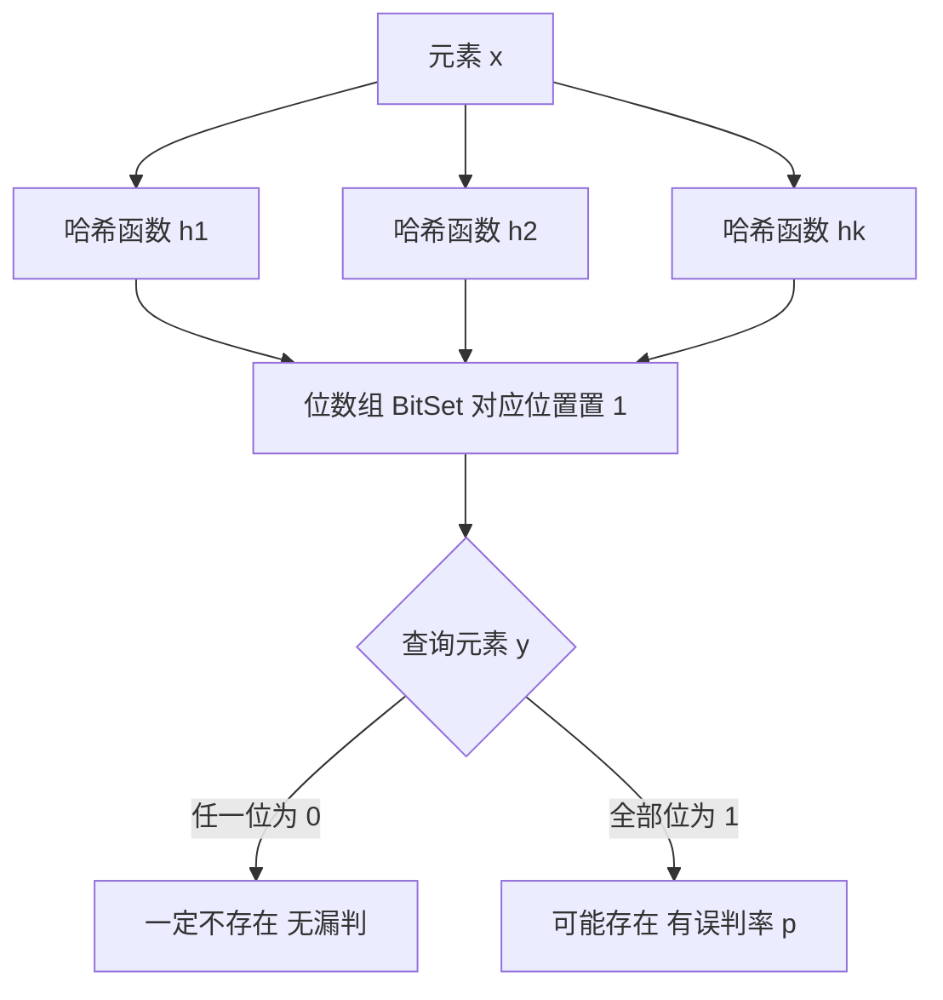
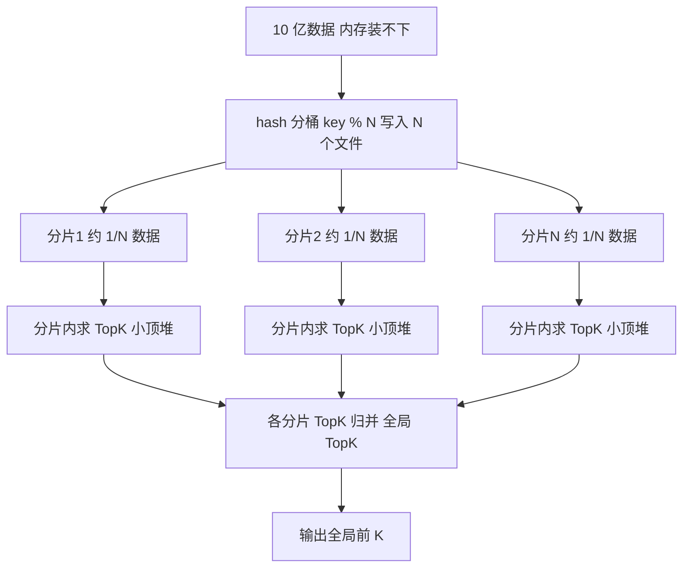

[📖 返回目录](README.md) · [⬅️ 上一章](22-engineering-practice.md) · [➡️ 下一章](24-senior-architect-skills.md)

# 23 · 面试高频算法与手写题（资深向）

> 适用对象：10+ 年经验的资深工程师 / 架构师候选人。本章覆盖：刷题策略与高频题型地图（链表/二叉树/回溯/DP/滑动窗口/双指针/堆）、必须手写的经典代码（单例双检锁、LRU、线程池简化版、雪花 ID、布隆过滤器、TopK、快排/二分模板）、海量数据处理（10 亿数据 TopK/去重/排序：分治、位图、布隆、外部排序、Trie）、字符串与哈希（KMP、一致性哈希）、答题套路（复杂度分析模板、沟通策略、边界条件 checklist）。面试落点：资深岗算法题考的不是「刷题量」而是「工程思维」——复杂度意识、边界敏感度、沟通协作（讲思路→写代码→自测→优化）——本章代码全部可直接默写。

**TL;DR 本章学习要点**

1. 刷题策略：**按频率与性价比排序**——链表、二叉树、哈希、双指针、滑动窗口是「必拿分」；回溯、DP、堆是「进阶分」；放弃偏难怪（计算几何、后缀数组），把时间花在「高频题型的套路模板」上；
2. 手写题是「**八股 + 工程**」的结合：单例（volatile 双检锁）、LRU（双向链表 + HashMap）、TopK（小顶堆）、快排/二分（模板背熟）是 Java 岗出现率最高的四件套，必须达到「闭眼默写」；
3. 海量数据的本质是「**内存装不下怎么办**」：分治（hash 分桶）、压缩（位图/布隆）、外部排序（归并）、前缀结构（Trie）四种武器，组合应对 TopK/去重/排序/查找四类问题；
4. KMP 与一致性哈希是「**原理 > 实现**」的考点：KMP 讲清「next 数组避免回溯」、一致性哈希讲清「环 + 虚拟节点解决分布不均与扩容抖动」即可，实现能写伪码；
5. 答题套路：**先讲思路与复杂度 → 再写代码 → 主动自测边界 → 最后提优化**；边界条件（空/单元素/溢出/重复元素）是资深候选人区分度所在，忘了检查边界比写不出代码更扣分。

---


### 📑 本章目录

- [1. 刷题策略与高频题型地图](#1-刷题策略与高频题型地图)
- [2. 必须手写的经典代码](#2-必须手写的经典代码)
- [3. 海量数据处理](#3-海量数据处理)
- [4. 字符串与哈希](#4-字符串与哈希)
- [5. 答题套路](#5-答题套路)
- [考点速查表](#考点速查表)

## 1. 刷题策略与高频题型地图


### 1.1 按频率排序的题型地图



- **必拿分（链表/二叉树/哈希）**：套路固定、代码量小，练 20 题即可覆盖 80% 考法——性价比最高，优先刷；
- **高频（双指针/滑动窗口/二分）**：模板化极强（见 2.7 二分模板），属于「背模板 + 变体识别」；
- **中高频（堆/回溯/DP）**：堆考 TopK 变体（合并 K 个、数据流中位数）；回溯是「递归模板 + 剪枝」；DP 考「状态定义 + 转移方程」的推导能力——**DP 是资深岗的区分题**，重点练「背包、子序列、区间」三类；
- 资深岗特有：**手写题（LRU/单例/线程池/雪花 ID）比 LeetCode 原题出现率高**——因为面试官要验证「真实工程能力」，见第 2 节。

### 1.2 刷题与备考策略

- **以题带点**：不要按题目顺序刷，按「题型 → 套路模板 → 3~5 道变体」组织；每类题型总结一页「套路笔记」（模板代码 + 变体识别 + 常见坑）；
- **限时训练**：单题 20~30 分钟想不出直接看题解，然后「隔天重写」——**重写比看题解重要 10 倍**（看懂的题 ≠ 会写的题）；
- **复杂度先于正确性**：动笔前先想「暴力解法复杂度多少 → 最优解法什么数据结构换来的」，面试时这是必问项；
- **手写题专项**：单例/LRU/线程池/雪花 ID/布隆/TopK/快排/二分，每道写到「无错默写」+ 能讲清「为什么这么设计」；
- 时间分配建议（备考 1 个月）：第 1 周链表+二叉树+哈希（高频模板）；第 2 周双指针+滑动窗口+二分（模板变体）；第 3 周堆+回溯+DP（进阶）；第 4 周手写题专项 + 全真模拟（45 分钟一题 + 口头讲解）。

### 本节高频面试题

**Q1：资深岗算法面试，刷题的重点和校招有什么区别？**

解答：三个区别：① **考察目标不同**——校招考「会不会」，资深考「工程素养」：复杂度意识（能否说出时间/空间复杂度并主动优化）、边界敏感度（空/null/溢出/重复元素）、沟通能力（先讲思路再动手，边写边解释）；② **题型侧重不同**——资深岗更爱考「手写工程代码」（LRU、线程池、单例、TopK）和「系统设计里的算法」（海量数据、限流、一致性哈希），纯 LeetCode 难题（hard 偏难怪）反而少；③ **容错不同**——资深岗允许「小 bug 自己发现并修正」，不允许「思路混乱、不沟通、复杂度说不清」。**面试升华：资深算法题 = 60% 算法能力 + 40% 工程表达；「讲不清为什么」比「写不出」更致命**。

面试官追问：遇到没见过的题，第一反应应该是什么？——答：① 先确认题意（输入规模、边界、有无重复、是否有序）——**把模糊的题意问清楚本身就是加分项**；② 想暴力解法并报复杂度，作为保底；③ 从暴力出发找优化点（重复计算 → 缓存/DP；有序 → 二分/双指针；TopK → 堆）——**优化路径比最终答案更能展示能力**；④ 卡住 5 分钟就向面试官要提示（「我往 XX 方向想对吗」），不要闷头硬扛。**要点：面试是「协作解题」不是「个人竞赛」——沟通本身就是考察项**。

---

## 2. 必须手写的经典代码

### 2.1 单例：双检锁（DCL）

```java
public class Singleton {
    // volatile 是关键：防止 new Singleton() 的指令重排
    // （分配内存 → 初始化 → 引用赋值 可能被重排为 分配 → 引用赋值 → 初始化）
    private static volatile Singleton instance;

    private Singleton() {}

    public static Singleton getInstance() {
        if (instance == null) {                 // 第一次检查：无锁快速路径
            synchronized (Singleton.class) {    // 只有首次创建才竞争锁
                if (instance == null) {         // 第二次检查：防止两个线程都通过第一次检查
                    instance = new Singleton();
                }
            }
        }
        return instance;
    }
}
```

- 三个考点：① **为什么 volatile**——`new` 非原子，重排序后其他线程可能读到「半初始化对象」；② **为什么两次检查**——第一次过滤已初始化（避免每次加锁），第二次保证只有一个线程创建；③ **更优替代**——静态内部类（`Holder` 懒加载且天然线程安全）与枚举（反射/序列化免疫），能说出「为什么双检锁不是最优解」是加分项。

### 2.2 LRU：双向链表 + HashMap



```java
class LRUCache {
    static class Node {
        int key, value;
        Node prev, next;
        Node(int k, int v) { key = k; value = v; }
    }
    private final int capacity;
    private final Map<Integer, Node> map = new HashMap<>();
    private final Node head = new Node(0, 0); // 虚拟头（哨兵，避免空指针判断）
    private final Node tail = new Node(0, 0); // 虚拟尾

    public LRUCache(int capacity) {
        this.capacity = capacity;
        head.next = tail;
        tail.prev = head;
    }

    public int get(int key) {
        Node n = map.get(key);
        if (n == null) return -1;
        moveToHead(n);   // 访问即「更新为最近」
        return n.value;
    }

    public void put(int key, int value) {
        Node n = map.get(key);
        if (n != null) {           // 已存在：更新值并移到头部
            n.value = value;
            moveToHead(n);
            return;
        }
        n = new Node(key, value);
        map.put(key, n);
        addToHead(n);
        if (map.size() > capacity) {   // 超容量：淘汰链表尾部
            Node last = tail.prev;
            removeNode(last);
            map.remove(last.key);
        }
    }

    private void addToHead(Node n) { n.next = head.next; n.prev = head; head.next.prev = n; head.next = n; }
    private void removeNode(Node n) { n.prev.next = n.next; n.next.prev = n.prev; }
    private void moveToHead(Node n) { removeNode(n); addToHead(n); }
}
```

- 设计要点：① **HashMap 管 O(1) 查找，双向链表管 O(1) 移动/删除**——为什么必须双向？删除任意节点要 O(1) 找到前驱，单向链表做不到；② **哨兵节点（虚拟头尾）**消除边界判断；③ 变体：LRU 的 LFU 升级版（加频率桶）、`LinkedHashMap` 一行实现（`accessOrder=true` + 重写 `removeEldestEntry`）——**能说出 LinkedHashMap 实现方式证明你读过 JDK 源码**。

### 2.3 线程池：简化版实现思路

```java
// 简化版线程池：核心线程数 + 阻塞队列（理解 ThreadPoolExecutor 的骨架）
class SimpleThreadPool {
    private final BlockingQueue<Runnable> queue = new LinkedBlockingQueue<>(100);
    private final List<Thread> workers = new ArrayList<>();

    public SimpleThreadPool(int coreSize) {
        for (int i = 0; i < coreSize; i++) {
            Thread t = new Thread(() -> {
                while (!Thread.currentThread().isInterrupted()) {
                    try {
                        Runnable task = queue.take(); // 阻塞取任务，无任务则挂起
                        task.run();
                    } catch (InterruptedException e) {
                        Thread.currentThread().interrupt(); // 恢复中断标志，优雅退出
                    }
                }
            }, "worker-" + i);
            workers.add(t);
            t.start();
        }
    }

    public void execute(Runnable task) throws InterruptedException {
        queue.put(task); // 队列满则阻塞（对比：ThreadPoolExecutor 有四种拒绝策略）
    }
}
```

- 完整版 `ThreadPoolExecutor` 的七参数与执行流程（面试必答）：`corePoolSize / maximumPoolSize / keepAliveTime / unit / workQueue / threadFactory / handler`；流程：**核心线程 → 队列 → 非核心线程 → 拒绝策略**（先队列后扩线程，而不是先扩线程——这是新手最常见的误区）；
- 拒绝策略四件套：AbortPolicy（抛异常，默认）、CallerRunsPolicy（调用者线程执行，天然背压）、DiscardPolicy / DiscardOldestPolicy（静默丢弃）；
- 资深加分：**线程池隔离**（不同业务独立池，防止慢调用拖垮核心链路）、队列有界 + 监控（`getQueue().size()` 是线程池健康的早期信号）、`ThreadFactory` 命名（`pool-1-thread-1` → `order-async-%d`，故障排查全靠它）。

**Q2：手写一个线程池，你会怎么讲「设计」而不是背参数？**

解答：讲设计的顺序（先骨架后参数）：① **核心抽象**：「一组常驻线程 + 一个任务队列」——线程循环从队列取任务执行，这就是线程池的本质（代码见 2.3，约 20 行）；② **容量模型**：ThreadPoolExecutor 为什么是「核心线程 → 队列 → 非核心线程」三级——核心线程处理常规负载、队列吸收突发、非核心线程扛峰值，**先队列后扩线程**是为了避免「线程频繁创建销毁」的抖动（线程创建是昂贵的系统调用 + 栈分配）；③ **拒绝策略**：队列也满时，四种策略的选择 = 「丢任务（Abort/Discard）vs 降级处理（CallerRuns）」的取舍——**CallerRuns 用调用者线程执行 = 天然限流**（调用方被拖慢，压力传导回上游）；④ **工程细节**：线程命名、keepAliveTime（非核心线程空闲回收）、队列有界（无界队列 = 内存炸弹，OOM 隐患）。**面试升华：背参数是及格分，讲「为什么这个顺序 + 每种策略的代价」是高分——线程池考的是「资源管理的工程权衡」**。

面试官追问：核心线程数怎么定？——答：分场景：**CPU 密集型 ≈ CPU 核数 + 1**（线程多了上下文切换反而慢）；**IO 密集型 ≈ CPU 核数 × (1 + IO 等待时间/CPU 计算时间)**（公式法），或经验值 2×核数（等待占大头时）；**混合型**：拆分或按压测定。关键认知：**线程数不是越多越好**——超过临界点后，上下文切换开销超过并行收益，吞吐反而下降（这是「线程池为什么要有上限」的根本原因）。

### 2.4 雪花 ID（Snowflake）

```java
public class SnowflakeIdGenerator {
    private static final long EPOCH = 1288834974657L;   // Twitter 起始时间 2010-11-04
    private static final long WORKER_ID_BITS = 5L;
    private static final long DATACENTER_ID_BITS = 5L;
    private static final long SEQUENCE_BITS = 12L;
    private static final long MAX_WORKER_ID = -1L ^ (-1L << WORKER_ID_BITS); // 31
    private static final long WORKER_ID_SHIFT = SEQUENCE_BITS;
    private static final long DATACENTER_ID_SHIFT = SEQUENCE_BITS + WORKER_ID_BITS;
    private static final long TIMESTAMP_SHIFT = SEQUENCE_BITS + WORKER_ID_BITS + DATACENTER_ID_BITS;
    private static final long SEQUENCE_MASK = -1L ^ (-1L << SEQUENCE_BITS);  // 4095

    private final long workerId;
    private final long datacenterId;
    private long sequence = 0L;
    private long lastTimestamp = -1L;

    public SnowflakeIdGenerator(long workerId, long datacenterId) {
        // 实际工程中 workerId 来自注册中心/配置中心，避免机器自报冲突
        if (workerId > MAX_WORKER_ID || workerId < 0) throw new IllegalArgumentException();
        this.workerId = workerId;
        this.datacenterId = datacenterId;
    }

    public synchronized long nextId() {
        long timestamp = System.currentTimeMillis();
        if (timestamp < lastTimestamp) {
            // 时钟回拨：等待追上，或直接抛异常（更稳妥，回拨超过阈值必须告警）
            long offset = lastTimestamp - timestamp;
            if (offset <= 5) {
                try { Thread.sleep(offset); } catch (InterruptedException e) { Thread.currentThread().interrupt(); }
                timestamp = System.currentTimeMillis();
            } else {
                throw new IllegalStateException("时钟回拨 " + offset + " ms");
            }
        }
        if (timestamp == lastTimestamp) {
            sequence = (sequence + 1) & SEQUENCE_MASK; // 同一毫秒内序列号自增，溢出归零
            if (sequence == 0) timestamp = tilNextMillis(lastTimestamp); // 序列耗尽，等下一毫秒
        } else {
            sequence = 0L; // 新毫秒，序列号重置
        }
        lastTimestamp = timestamp;
        // 64 位布局：1 符号位 + 41 时间戳 + 5 数据中心 + 5 机器 + 12 序列号
        return ((timestamp - EPOCH) << TIMESTAMP_SHIFT)
             | (datacenterId << DATACENTER_ID_SHIFT)
             | (workerId << WORKER_ID_SHIFT)
             | sequence;
    }

    private long tilNextMillis(long last) {
        long t = System.currentTimeMillis();
        while (t <= last) t = System.currentTimeMillis();
        return t;
    }
}
```

- 考点：① **64 位布局**（1+41+5+5+12）；② 趋势递增（时间戳在高位）但**非严格递增**（跨毫秒回拨/时钟漂移会导致乱序）——分布式 ID 的排序需求要警惕；③ 时钟回拨是最大风险，工程上要「等待 + 告警 + 兜底（如改用数据库/Redis 发号）」。

### 2.5 布隆过滤器



```java
public class BloomFilter {
    private final BitSet bits;
    private final int size;
    private final int[] seeds = {3, 5, 7, 11, 13, 17, 19}; // k 个哈希种子（k 越大误判率越低但位占用越高）

    public BloomFilter(int size) {
        this.size = size;
        this.bits = new BitSet(size);
    }

    private int hash(String s, int seed) {
        int h = 0;
        for (char c : s.toCharArray()) h = h * seed + c;
        return Math.abs(h) % size; // 简化版哈希，工程上用 MurmurHash 等更均匀
    }

    public void add(String s) {
        for (int seed : seeds) bits.set(hash(s, seed));
    }

    public boolean mightContain(String s) {
        for (int seed : seeds) {
            if (!bits.get(hash(s, seed))) return false; // 有一位为 0 → 一定不存在
        }
        return true; // 全部为 1 → 可能存在（误判率 p）
    }
}
```

- 数学：位数组大小 `m = -n·ln p / (ln 2)²`，哈希函数个数 `k = (m/n)·ln 2`（n 为元素数，p 为目标误判率）——**能报出公式是资深分**；
- 特性：**有误判（false positive）、无漏判（false negative）**——所以只能用于「允许误杀、不允许漏过」的场景：缓存穿透防护（不存在的数据直接挡掉）、URL 去重（爬虫）、黑名单（误杀可接受）；
- 不能删除元素（位可能被多个元素共享）——要删用 Counting Bloom Filter。

### 2.6 TopK：小顶堆实现

```java
// 前 K 大：维护大小为 K 的「小顶堆」，堆顶是当前第 K 大（门槛）
public List<Integer> topK(int[] nums, int k) {
    PriorityQueue<Integer> minHeap = new PriorityQueue<>(k);
    for (int num : nums) {
        if (minHeap.size() < k) {
            minHeap.offer(num);
        } else if (num > minHeap.peek()) { // 比门槛大才替换，小的直接忽略
            minHeap.poll();
            minHeap.offer(num);
        }
    }
    return new ArrayList<>(minHeap);
}
// 复杂度：O(n log k)，空间 O(k)；海量数据场景下 k 远小于 n，堆不进内存的数据不用管
```

- 变体识别：**前 K 大 → 小顶堆；前 K 小 → 大顶堆**（口诀：堆顶是「最差的那个」，永远淘汰最差的）；数据流中位数 → 大顶堆 + 小顶堆双堆；合并 K 个有序链表 → 小顶堆存「每个链表的当前头」；
- 对比快排划分法（`partition` 后只处理一侧）：时间复杂度 O(n) 平均更优，但**堆法适合「数据流/动态增量」场景**（数据不断进来），面试时两种都要能说出来。

### 2.7 快排与二分模板（背熟）

```java
// 快排模板（含 partition 的「挖坑/双指针」写法）
public void quickSort(int[] a, int lo, int hi) {
    if (lo >= hi) return;
    int p = partition(a, lo, hi);
    quickSort(a, lo, p - 1);
    quickSort(a, p + 1, hi);
}

private int partition(int[] a, int lo, int hi) {
    int pivot = a[hi];      // 取末尾做基准（工程上随机选，防有序数组退化为 O(n²)）
    int i = lo;
    for (int j = lo; j < hi; j++) {
        if (a[j] < pivot) swap(a, i++, j); // 小的换到左边
    }
    swap(a, i, hi);         // 基准归位
    return i;
}
// 平均 O(n log n)，最坏 O(n²)（有序 + 固定基准）；空间 O(log n)（递归栈）

// 二分模板：左闭右开，找「第一个 >= target」的位置（lower_bound）
public int lowerBound(int[] a, int target) {
    int lo = 0, hi = a.length;          // 左闭右开：hi 可能等于 length（target 比所有元素大）
    while (lo < hi) {
        int mid = lo + (hi - lo) / 2;   // 防溢出：不要写 (lo + hi) / 2
        if (a[mid] >= target) hi = mid; // 满足条件：向左收
        else lo = mid + 1;              // 不满足：向右收
    }
    return lo;                          // 第一个 >= target 的下标
}
```

- 二分三件套（死记）：**左闭右开 + `mid = lo + (hi-lo)/2` + 条件决定 `hi = mid` 还是 `lo = mid + 1`**——统一模板可以套所有二分变体（找左边界/右边界/旋转数组/答案二分）；
- 快排的衍生考点：**TopK 的快排划分法**（`partition` 返回位置与 k 比较，只递归一侧，平均 O(n)）、**数组第 K 大**（LeetCode 215，面试出现率极高）。

### 本节高频面试题

**Q3：手写 LRU 时，为什么用双向链表而不是单向链表？用 LinkedHashMap 实现有什么要注意的？**

解答：双向链表的原因：**删除任意节点需要 O(1) 找到它的前驱**——单向链表删除节点要遍历找前驱，退化为 O(n)；HashMap 提供 O(1) 的节点定位，双向链表提供 O(1) 的删除与移动，两者互补才构成 O(1) 的 get/put。LinkedHashMap 实现：构造器 `new LinkedHashMap<>(capacity, 0.75f, true)`（accessOrder=true 开启访问序），重写 `removeEldestEntry(Map.Entry eldest)` 返回 `size() > capacity` 即可——**注意两点：① 必须重写 removeEldestEntry，否则永远不淘汰；② accessOrder=true 时 get 也会调整顺序，且不是线程安全的，并发要用 Collections.synchronizedMap 或 ConcurrentHashMap + 锁**。**面试升华：能同时给出「手写版」与「JDK 版」并比较优劣（手写版可控性强、JDK 版简洁但同步开销与语义差异），是读过源码的信号**。

面试官追问：LFU 怎么实现？——答：LFU（最不经常使用）需要「频率 + 时间」双维度：经典实现是「**频率桶链表 + HashMap**」——每个频率一个双向链表（同频率内按时间排序），HashMap 存 key → (频率, 节点)；访问时节点从当前频率桶移到下一频率桶的头部，淘汰时从最小频率桶的尾部删。复杂度同为 O(1)，但实现复杂度远高于 LRU（要维护频率桶的增删）。**要点：说出「频率桶」结构 + 与 LRU 的复杂度对比即可，实现细节面试官通常不深挖**。

**Q4：雪花 ID 的时钟回拨问题，业界怎么处理？**

解答：三个层次：① **等待**：回拨量小（几毫秒）时 sleep 追平时间（代码见 2.4）；② **拒绝**：回拨超过阈值（如 5ms）直接抛异常，宁可短暂不可用也不发重复 ID——**重复 ID 在分布式系统里是数据一致性事故**；③ **规避**：回拨期间改用备用发号（数据库号段/Redis INCR）或「双时间戳方案」（ID 里带「逻辑时钟」，单调递增不依赖系统时间）；阿里增强版（`IdWorker` 的变体）和百度 UidGenerator 各有侧重。**面试升华：时钟回拨的本质是「单调性假设被打破」——分布式 ID 的可靠性设计 = 对「时间不可靠」的防御设计**。

面试官追问：为什么不用数据库自增 ID / UUID？——答：自增 ID 单库有瓶颈（要分库分表 + 号段模式解决）、跨库不唯一、且「发号」成为单点依赖；UUID 全局唯一但**无序**（B+ 树索引页分裂、随机 IO）、太长（36 字符，存储与索引膨胀）。雪花 ID 的定位：**趋势递增（友好索引）+ 64 位紧凑（long）+ 本地生成无网络开销 + 可解析（时间戳反推创建时间）**——是「有序性 + 性能 + 唯一性」的平衡解。**要点：选型对比要落到「索引友好性与生成性能」两个工程维度**。

**Q5：布隆过滤器的误判率怎么控制？和 Redis 的 bitmap 怎么结合？**

解答：误判率由三个参数决定：位数组大小 m、元素数 n、哈希函数个数 k——公式 `m = -n·ln p / (ln 2)²`，`k = (m/n)·ln 2 ≈ 0.7·(m/n)`；**k 不是越大越好**（k 过大位数组被迅速置满，误判率反而上升），工程上按公式算完后留 2~3 倍余量（数据量会增长）。与 Redis 结合：布隆过滤器的位数组可以存在 Redis 的 bitmap 里（`SETBIT/GETBIT` 操作，多个哈希函数 = 多次位操作），**或用 Redis 官方模块 RedisBloom**（`BF.ADD/BF.EXISTS`，支持扩容与计数）——「缓存穿透防护」的标准姿势：请求先查布隆（Redis），不存在直接返回，存在才放行到 DB。**面试升华：布隆过滤器的面试答案 = 原理（k 个哈希 + 位数组）+ 数学（误判率公式）+ 工程落点（Redis/缓存穿透）三段式**。

---

## 3. 海量数据处理

### 3.1 核心思路：内存装不下怎么办

- 四类问题与四件武器：**TopK（分治 + 堆）、去重（位图/布隆/HyperLogLog）、排序（外部排序）、查找（Trie/索引）**；
- 总原则：**能压缩就压缩（位图/布隆），能分片就分片（hash 分桶），能流式就流式（外部排序/堆）**；先估算：10 亿个 int ≈ 4GB——单机内存（8G）勉强但不可靠，所以默认走分治。

### 3.2 10 亿数据 TopK：hash 分桶 + 堆



- 流程：① 数据按 `hash(key) % N` 分到 N 个文件（**相同 key 一定进同一分片**——这保证「计数类 TopK」的正确性）；② 每个分片在内存里用小顶堆求局部 TopK；③ 各分片结果归并（N 路归并或再建一个堆）得全局 TopK；
- 复杂度：单机内存需求 = 单分片大小 + K 的堆；可以多机并行（MapReduce 的思路：Map 阶段分片求局部 TopK，Reduce 阶段归并）；
- **注意**：如果问题是「求出现次数最多的 TopK」（词频统计），分桶后每桶内要先用哈希表计数再取 TopK——**分桶的正确性依赖「相同 key 进同桶」**，这是和「求数值 TopK」的区别（数值 TopK 其实不需要分桶保序，直接流式堆即可——要能指出这个差异）。

### 3.3 去重：位图 / 布隆 / HyperLogLog

- **位图（Bitmap）**：int 范围 40 亿个数的去重 → 位图只需 40 亿 bit ≈ 500MB（每个数 1 位：0 未出现 / 1 已出现）；**适合「整数且范围已知」**；变体：排序（扫描位图按位输出即有序）、统计不重复数；
- **布隆过滤器**：适合「字符串/超大基数」的去重判断（URL、手机号），代价是误判（见 2.5）；
- **HyperLogLog**：**基数统计**（不重复元素个数，如 UV）——误差约 0.81%，内存固定 ~12KB（`pfcount`），**不能**给出具体元素（只给基数）——三个工具的选择依据：要「精确元素」→ 位图；要「判断存在」→ 布隆；只要「个数」→ HLL；
- 面试题变体：**10 亿个 URL 去重**（布隆或分桶 + HashSet）、**统计一亿个用户 UV**（HLL）、**40 亿 int 中找只出现一次的数**（位图扩展：2-bit 状态 00/01/10）。

### 3.4 外部排序（10 亿数据排序）

- 思路：**分块排序 + 多路归并**：① 数据切成 M 个能进内存的块，每块内存排序后落盘；② M 路归并（每块读一个元素进小顶堆，堆顶最小者输出，再补读）——**归并阶段用堆（败者树优化）保证「从 M 个文件中取全局最小」是 O(log M)**；
- 复杂度：IO 次数是关键（磁盘 IO 比内存慢 5 个数量级）：第一遍 M 次写 + M 次读，归并 log 轮——**减少轮数 = 增大块大小 = 用好内存**；
- 工程落点：**Kafka 的日志段合并、MapReduce 的 shuffle 排序、MySQL 的 sort buffer** 全是外部排序思想——面试时把「算法」和「系统里哪里在用」连起来是资深分；
- 变体：**几乎有序的数据排序**（Timsort 思想：识别天然有序段）、**字符串排序**（字典序用 Trie 或 MSD 基数排序）。

### 3.5 Trie（前缀树）与查找类问题

- 结构：多叉树，每个节点存「一个字符 + 子节点数组/Map + 计数」；插入/查找 O(词长)，与词表大小无关；
- 应用：**前缀匹配**（搜索框联想、输入法）、**词频统计**（每个节点带 count，比 HashMap 省内存——共享前缀）、**敏感词过滤**（AC 自动机 = Trie + KMP 思想）、**IP 路由最长前缀匹配**；
- Java 实现要点：子节点用 `Map<Character, TrieNode>`（稀疏场景）或 `TrieNode[26]`（纯小写字母、密集场景省 hash 开销）；节点要带 `isEnd` 标记（区分「前缀」与「完整词」）——**漏了 isEnd 是最常见的 Bug**；
- 对比：Trie vs HashMap——Trie 支持前缀查询、有序遍历、共享前缀省内存；HashMap O(1) 但只能精确匹配。

### 本节高频面试题

**Q6：10 亿条数据求出现次数最多的 100 个词，内存只有 1GB，怎么算？**

解答（完整链路）：① **分桶**：`hash(word) % 1000` 写入 1000 个文件（相同词必进同桶），每桶约 100 万词条（远小于 1GB）；② **桶内统计**：单桶读入内存，HashMap 计数，取该桶 Top100（小顶堆）；③ **归并**：1000 个桶的 Top100（共 10 万条）再归并一次，得全局 Top100。**关键点**：a) 分桶必须用「词本身的 hash」保证同词同桶（用「行号取模」分桶则计数会错）；b) 桶内 HashMap 内存估算：100 万词 × (词长 + 计数 + 对象头) ≈ 几十 MB，安全；c) 可以多机并行（Map 分桶统计 → Reduce 归并），即 MapReduce 的词频统计经典场景。**面试升华：答案的评分点不在「会不会分桶」，在「能否说出为什么分桶能保证正确性 + 内存估算」**。

面试官追问：如果要求「实时」给出 TopK（数据流式到达），怎么办？——答：放弃精确性，用**近似算法**：① 维护一个「候选集 + 计数」的 Count-Min Sketch（固定内存的计数 sketch，有误差上界）；② 或简化版「**只保留当前 TopK 候选**」（新词进入候选集，被淘汰的词不再回来——有误差但实现简单）；③ 精确解只能「窗口化」：每 5 分钟一个窗口精确统计，窗口间滑动合并。**要点：流式场景的答案必须提到「精确 vs 近似」的权衡——实时性要求下近似算法是行业标准答案**。

**Q7：40 亿个不重复的 int，怎么判断某个数是否存在？内存 512MB 够吗？**

解答：**位图**：40 亿个数，范围 0~2³²-1，位图需要 2³² bit = 512MB——**恰好临界**，常规 JVM 的 BitSet（内部 long[]）加上对象开销会超，工程上要：① 用内存映射文件（MappedByteBuffer 映射 512MB 文件，超出堆内存）；② 或直接上 Redis 的 bitmap（分片）；③ 或压缩技巧：分桶 + 每桶内位图（只加载部分）。**如果数据是「稀疏」的（实际只有几百万个不重复数），可以用布隆过滤器（几十 MB）但牺牲精确性**——「精确 vs 内存」的取舍要当场算给面试官看。**面试升华：海量数据题的标准姿势 = 「先算内存账，再选数据结构」——能当场估算出 512MB 这个临界值，比背答案有说服力得多**。

面试官追问：40 亿个 int 找「只出现一次」的数？——答：**2-bit 位图**：每个数用 2 位表示状态（00 未出现 / 01 出现一次 / 10 出现多次），需要 2³² × 2 bit = 1GB，超内存则分桶：按范围分两半（或按 hash 分桶），每桶内 2-bit 位图处理——**第一次遍历标记状态，第二次遍历输出 01 的数**。变体思路：异或（找唯一出现奇数次）只适用于「一个」目标，多个目标必须用状态位图。**要点：状态机位图（00/01/10）是「计数受限」场景的通用武器，比单纯 bitmap 多一位状态就多一类题的解**。

**Q8：外部排序的归并阶段为什么用堆？和「败者树」什么关系？**

解答：M 路归并时，每轮要从 M 个文件的当前元素中取最小——**线性扫描是 O(M)，堆是 O(log M)**（建堆 O(M)，每取一个最小 O(log M)）；败者树是堆的变体：**在「内部节点存败者」而非胜者，比较次数更少（树高次比较），且适合 M 很大的场景**（多路归并的经典优化）。工程细节：① 缓冲区——每路读入一块（如 8KB）避免逐元素 IO；② 输出缓冲——攒一批再写盘；③ 归并轮数——第一轮大块排序（用满内存）减少归并轮数，IO 是外部排序的瓶颈，**一切优化围绕「减少磁盘读写次数」**。**面试升华：外部排序的考点 = 分块排序 + 多路归并 + IO 优化三件套；能说出「排序总 IO 次数 ≈ 2×数据量×(轮数+1)」的估算，说明真的懂**。

**Q9：10 亿个整数找中位数（或第 K 大），内存不够，怎么做？**

解答：三个层次（按面试官追问递进）：① **分桶计数**：int 范围 0~2³²-1，按值域分成 N 个桶（如每桶覆盖 1000 万范围，共约 429 桶），第一遍扫描统计每桶的元素个数（桶计数只需几百个 long），累加定位中位数落在哪个桶（累计过半数的那桶）；② **桶内精算**：第二遍只扫落在该桶内的元素（约总数据/桶数），内存排序或再分细桶，找到中位数——**总 IO 两遍，内存只需桶计数数组**；③ 进阶：数据分布未知时用「采样估算桶边界」（随机抽 1 万个数确定分位点，再按估算边界分桶），避免桶间严重不均。对比「双堆法」（大顶堆存小半 + 小顶堆存大半）只适合「数据流 + 内存放得下」；**10 亿级 + 内存不够 = 分桶计数是标准答案**。**面试升华：中位数题考察的是「两遍扫描 + 桶统计」的 IO 意识——海量数据题的本质是「用多遍 IO 换内存」**。

面试官追问：如果只要近似中位数呢？——答：**随机采样**：随机抽 1 万个元素排序取中位数，作为全局中位数的估计（样本量足够时误差可接受且可量化）；或 **Reservoir Sampling（蓄水池抽样）**——流式场景下无法随机访问全部数据时，用「第 i 个元素以 1/i 概率替换候选」的算法维护固定大小的均匀样本，再对样本求中位数。**要点：近似解的考点是「蓄水池抽样」——这是流式采样问题的标准答案，必须会背**。

---

## 4. 字符串与哈希

### 4.1 KMP：核心思路与 next 数组

- **暴力匹配的问题**：主串指针每次失配都要回退，最坏 O(n·m)；
- **KMP 的核心**：失配时**主串指针不回退**，模式串指针跳到「已匹配前缀的下一个最长相同前后缀」位置——跳转信息预先算好，存在 **next 数组**里：`next[i]` = 模式串 `[0..i]` 的最长相等前后缀长度；
- 理解关键：**next 数组是「模式串自己匹配自己」算出来的**（递推：已知 next[i-1]，看 `p[i]` 与 `p[next[i-1]]` 是否相等，不等则沿 next 链回退）；
- 复杂度：预处理 O(m) + 匹配 O(n)，**总 O(n+m)**——模式串与主串指针都只增不退（主串严格不回退）；
- 进阶：AC 自动机 = 在 Trie 上做「多模式串的 KMP」（每个节点加 fail 指针），敏感词过滤的工业实现。

```java
// next 数组：next[i] = p[0..i] 的最长相等前后缀长度
int[] buildNext(String p) {
    int m = p.length();
    int[] next = new int[m];
    int j = 0;                                   // j = 当前已匹配的前后缀长度
    for (int i = 1; i < m; i++) {                // i 从 1 开始（next[0]=0）
        while (j > 0 && p.charAt(i) != p.charAt(j)) j = next[j - 1]; // 失配沿 next 回退
        if (p.charAt(i) == p.charAt(j)) j++;
        next[i] = j;
    }
    return next;
}
// 匹配：i 扫主串不回退，j 按 next 跳转，j == m 时找到一个匹配
```

### 4.2 一致性哈希

- **问题**：`hash(key) % N` 的取模哈希在节点增删时，**几乎全部 key 的映射都变**（缓存全部失效 → 缓存雪崩）；
- **一致性哈希**：把 hash 空间组织成环（0 ~ 2³²-1），节点（服务器）hash 后落在环上，key 沿环顺时针找第一个节点——**增删节点只影响环上相邻区间**（迁移量 ≈ 1/N 的 key）；
- **虚拟节点**：解决两个问题——① 节点少时分布不均（环上稀疏，数据倾斜）；② 节点下线时负载转移不均衡（相邻节点压力翻倍）。每个物理节点映射 k 个虚拟节点（如 160 个）均匀散在环上，key 落到虚拟节点再路由到物理节点；
- 工程落点：Redis 集群的 `hash slot`（16384 个槽是「固定虚拟节点」思想的工程化——槽数固定，节点增删只迁移槽）、一致性哈希在负载均衡/缓存分片里的应用；
- **增删节点的影响面**：增加节点只影响「新节点逆时针方向第一个旧节点」区间内的 key；删除节点只影响「被删节点逆时针区间」——**能画出这个区间是答对本题的标志**。

### 本节高频面试题

**Q10：KMP 的 next 数组和「最长相等前后缀」什么关系？为什么要回退到 next[j-1] 而不是 next[j]？**

解答：next[i] 的定义就是「模式串前 i+1 个字符的最长相等前后缀长度」（不同教材有偏移一版的 next 数组，先声明自己的定义再答）。回退逻辑：匹配到位置 j 失配时，**已匹配的 [0..j-1] 段的最长相等前后缀长度是 next[j-1]**——模式串整体右移「j - next[j-1]」位，用「前缀」对齐「已匹配段的后缀」，主串指针不动。**为什么是 j-1 而不是 j**：next[j] 表示包含失配字符 p[j] 的前缀信息，而失配时 p[j] 还没匹配上，用它做跳转信息是错的——**用「已成功匹配部分」的信息，是 KMP 正确性的关键**（这也是面试官最爱挖的细节）。**面试升华：能徒手推导 next 数组（p="ababaca" 的 next=[0,0,1,2,3,0,1]）并解释失配回退路径，这道题就满分了**。

面试官追问：KMP 和 BM（Boyer-Moore）算法怎么选？——答：KMP 最坏 O(n+m) 稳定；BM 从**右往左**匹配 + 坏字符/好后缀两条启发式，**平均性能远好于 KMP**（文本越长优势越大），是 grep、文本编辑器（如 VSCode 的搜索）的默认选择；KMP 的优势是「最坏情况有保证 + 实现简单 + 是 AC 自动机的基础」。**要点：工程选型答「平均性能选 BM，最坏有界与多模式匹配选 KMP/AC」即可**。

**Q11：一致性哈希中虚拟节点为什么能解决数据倾斜？加节点后哪些数据会迁移？**

解答：数据倾斜的根源是「节点在环上分布不均匀」——物理节点少时（3~5 个），hash 落点可能挤在一起，导致某个节点管辖的环段特别大。虚拟节点 = 每个物理节点在环上放 k 个「替身」（用 `hash(ip:port#i)` 生成位置），环上节点数变为 k×N，分布趋于均匀；key 命中虚拟节点后映射回物理节点。**加节点的影响面**：新节点的 k 个虚拟节点各「截胡」一段环，被截的只有「各自逆时针方向紧邻的旧虚拟节点」区间——迁移的 key 总量 ≈ 1/(N+1)，且**只有新节点相邻区间的数据动**，其他节点零迁移。**面试升华：一致性哈希的全部考点 = 环 + 顺时针路由 + 虚拟节点 + 迁移面分析；能画出「新增节点影响区间」的图，就比 90% 的候选人强**。

**Q12：Rabin-Karp 滚动哈希的原理是什么？和 KMP 比有什么优劣？**

解答：Rabin-Karp 把「字符串比较」转成「哈希值比较」：把子串看作一个基数进制数（如 26 进制），`hash = (hash × base + c) % mod`；**滑动窗口的关键是「滚动」**：右移一位时，`新hash = (旧hash - 最左字符×base^(len-1)) × base + 新字符`——O(1) 更新，整体 O(n)。**冲突处理**：哈希相等时再逐字符确认（防误判），或用双哈希（两个不同 mod 的哈希同时相等才认为匹配）。优劣：**平均 O(n+m)，但最坏 O(n·m)**（哈希冲突全集中在同一窗口时）；KMP 最坏稳定 O(n+m)——所以 RK 适合「多模式匹配」（多个模式串同时查：对每个模式算哈希，滑动主串一次比对多个目标，如「在一篇文章里同时找 100 个敏感词」）。**面试升华：RK 的考点是「滚动哈希的数学推导」与「与 KMP 的最坏复杂度对比」——能写出滚动公式，这道题就过了**。

---

## 5. 答题套路

### 5.1 复杂度分析模板

- **时间复杂度的三种来源**：循环嵌套（相乘）、递归（主定理/递归树）、数据结构操作（HashMap O(1)、TreeMap O(log n)、堆 O(log n)）；
- **分析顺序**：先报暴力（作为基线）→ 再报优化后 → 说明「用什么换什么」（空间换时间？预处理换查询？）；
- 常见表达：`O(n)` 遍历、`O(n log n)` 排序/堆、`O(n²)` 双层循环、`O(log n)` 二分/树高、`O(n·m)` 双串；**空间复杂度**：显式（新数组/哈希/栈）+ 隐式（递归栈深度）；
- 资深加分：说出「**均摊复杂度**」（如 HashMap 扩容、ArrayList add）与「**最坏 vs 平均**」的区别（快排 O(n²) 最坏 vs O(n log n) 平均）。

### 5.2 与面试官沟通策略（答题流程）

1. **澄清题意**（30 秒）：输入规模、元素范围、有无重复、是否有序、能否用额外空间、要求时间复杂度——「10 亿数据」和「100 个元素」的答案完全不同；
2. **讲思路**（1~2 分钟）：暴力 → 优化 → 复杂度，让面试官确认方向——**写代码前先对齐思路，避免写了一半发现方向错**；
3. **写代码**：边写边注释关键步骤（数据结构、边界处理），变量名有意义；
4. **自测**：写完主动举 2~3 个用例（正常 + 边界）走一遍——**主动自测是资深候选人的标志**；
5. **总结与优化**：问面试官「要不要我优化空间/换更优解」，展示扩展思维。

### 5.3 边界条件 Checklist（默背）

- **空输入**：null / 空数组 / 空字符串 / 空树；
- **单元素**：size=1 的数组、单节点链表、单节点树；
- **首尾**：第一个/最后一个元素、`lo == hi`、`mid == 0`；
- **重复元素**：全部相同、连续重复（二分边界、去重、快排 partition）；
- **数值溢出**：`lo + hi` 溢出（用 `lo + (hi-lo)/2`）、`int` 乘法溢出（用 long）、绝对值边界（`Integer.MIN_VALUE`）；
- **负数与零**：数组含负数的最大子数组（Kadane 初始化）、除零；
- **递归终止**：base case 是否覆盖所有叶子路径（回溯的剪枝条件）；
- **指针越界**：链表快慢指针（快指针判空）、滑动窗口的 right 边界、数组 `i+1` 是否越界。

### 本节高频面试题

**Q13：写完代码后，你一般怎么自测？举例说明。**

解答：三步自测法：① **用例构造**：覆盖「正常路径 + 边界 + 极端」三类——正常（示例输入）、边界（空/单元素/首尾/重复）、极端（全相同元素、最大数值、超长输入）；② **手走一遍**：用小规模输入在草稿上模拟执行，重点检查「循环边界与指针移动」（`<` vs `<=`、`lo+1` vs `lo`）；③ **复杂度复盘**：对照代码确认没有「隐藏的 O(n²)」（如循环内调用 contains/remove 是 O(n) 的集合操作、String 拼接）。**举例**：二分查找写完，自测用例 = `[]`、`[1]`、`[1,2,3]` 查 2、`[1,2,2,2,3]` 查 2（重复元素边界）、`[1,2,3]` 查 4（比所有元素大）与 0（比所有元素小）。**面试升华：自测是「工程习惯」的现场展示——能系统地说出自测方法，比「我一般用 IDE 跑一下」高出一个段位**。

面试官追问：手写快排时，最怕什么边界？——答：① **partition 的循环不变量**（i 指向「下一个小于基准的位置」）写错导致基准归位错误；② 递归的 `lo >= hi` 终止条件漏掉 → 无限递归栈溢出；③ 全部相同元素时 partition 退化（i 一直不交换，最后基准归位到 hi，递归深度 O(n)）——**所以工程上「三数取中/随机基准」防退化是必答点**；④ 交换函数写错（`a[i]=a[j]; a[j]=a[i]` 这种经典笔误）。

**Q14：面试官让你「讲思路」，你 30 秒内的回答结构是什么？**

解答：四句结构（背下来）：① **「我先说暴力解」**——「暴力是两两比较 O(n²)，遍历 i、j 判断条件」；② **「优化点在这里」**——「重复计算了 XX，可以用哈希表把查询降到 O(1)，整体 O(n)」；③ **「代价是空间」**——「代价是 O(n) 的额外空间，如果限制空间可以用排序后双指针 O(1) 空间但 O(n log n) 时间」；④ **「我推荐」**——「我推荐哈希表方案，因为 XX（数据规模/场景）」。**为什么这个结构有效**：先展示「会暴力」（基础扎实），再展示「会优化」（算法思维），最后展示「会权衡」（工程判断）——面试官要听的是**思考过程**，不是最终答案。**面试升华：答题结构 = 暴力基线 → 优化动机 → 时空权衡 → 推荐与理由，四段式是算法面试的「满分模板」**。

面试官追问：DP 题怎么快速找到状态定义？——答：三问定位法：① **「最后一步做什么」**——答案的最后一次决策是什么（如爬楼梯：最后一步跨 1 阶还是 2 阶）；② **「前一步的状态是什么」**——把最后一步去掉，剩下的子问题是什么（`f(n) = f(n-1) + f(n-2)`）；③ **「状态怎么递推」**——写转移方程，再验证 base case（`f(1)、f(2)`）与「无后效性」（当前决策只依赖已计算状态）。**常用状态维度**：一维（序列：`dp[i]` 前 i 个元素）、二维（双序列/区间：`dp[i][j]`）、背包类（`dp[i][w]` 前 i 个物品容量 w）。**要点：DP 不会做时，先暴力递归（含重叠子问题）→ 加 memo → 改递推，这条「递归→记忆化→DP」路径本身就是标准答案**。

**Q15：遇到完全没思路的 hard 题，怎么「体面地拿分」？**

解答：按顺序执行四步：① **降级目标**——明确告诉面试官「我先给一个能跑的暴力解，再优化」：暴力解（枚举/递归/暴力哈希）一般能拿「思路清晰 + 代码正确」的基础分；② **讲优化方向**——暴力解写完后主动分析瓶颈：「重复计算在这里，可以用 memo/预处理优化到 O(n²)/O(n)」——**即使写不出最优解，「知道往哪个方向优化」也是能力的体现**；③ **要提示**——「我卡在状态转移上，能否提示一下 DP 的维度？」——大部分面试官愿意给提示，给提示后的完成度依然计入评价；④ **诚实收尾**——实在做不出就说「这题我暂时没思路，但我知道 XX 题型的套路（相关题型讲两句）」——**诚实 + 相关知识的关联能力，好过硬编一个错误答案**。**面试升华：hard 题是「压力测试」——考察的是「不会时的行为模式」：会不会沟通、会不会降级、会不会止损；资深候选人的标志是「永远有保底方案，永远不慌」**。

面试官追问：暴力解和最优解之间，你一般怎么找「中间解」？——答：按复杂度阶梯逐级优化：**O(n²) 暴力 → 看是否有重复子问题（→ memo/DP）→ 看是否有序（→ 二分/双指针）→ 看是否需要 TopK（→ 堆）→ 看是否可预处理（→ 前缀和/哈希）**；每上一级都要说清「用空间换了什么、为什么可行」——面试官要的是「优化路径的思维链」而不是「直接跳到最优解」。

---

## 考点速查表

| 考点 | 一句话要点 |
|---|---|
| 刷题优先级 | 链表/二叉树/哈希必拿分；双指针/滑动窗口/二分高频；堆/回溯/DP 进阶 |
| 答题流程 | 澄清题意→讲思路报复杂度→写码→自测边界→提优化 |
| 单例 DCL | volatile 防半初始化 + 双检查；静态内部类/枚举是更优解 |
| LRU | HashMap O(1) 定位 + 双向链表 O(1) 移动；哨兵节点免边界判断 |
| LinkedHashMap | accessOrder=true + 重写 removeEldestEntry；非线程安全 |
| 线程池流程 | 核心线程→队列→非核心线程→拒绝策略；先队列后扩线程 |
| 拒绝策略 | Abort 抛异常/CallerRuns 调用者执行/Discard 静默丢 |
| 雪花 ID | 1+41+5+5+12 布局；趋势递增非严格递增；时钟回拨等待+告警 |
| 布隆过滤器 | k 个哈希 + 位数组；有误判无漏判；m = -n·ln p/(ln2)² |
| TopK | 前 K 大用小顶堆，堆顶是门槛；O(n log k) |
| 快排模板 | 随机基准防退化；partition 循环不变量；最坏 O(n²) |
| 二分模板 | 左闭右开 + mid 防溢出 + 条件定 hi/lo；lower_bound 通用 |
| 海量 TopK | hash 分桶（同 key 同桶）→ 桶内堆 → 归并；多机即 MapReduce |
| 海量去重 | 整数范围已知用位图（40 亿 int=512MB）；存在性用布隆；基数用 HLL |
| 外部排序 | 分块内排 + 多路归并（堆/败者树）；IO 次数是瓶颈 |
| Trie | 前缀匹配/词频/敏感词；isEnd 标记是常见 Bug 点 |
| KMP | 主串不回退，next 数组预计算跳转；失配回退用 next[j-1] |
| AC 自动机 | Trie + fail 指针 = 多模式 KMP；敏感词过滤工业实现 |
| 一致性哈希 | 环 + 顺时针路由；虚拟节点解决倾斜；增删只影响相邻区间 |
| 边界 checklist | 空/单元素/首尾/重复/溢出/负数/递归终止/指针越界八项 |
| 复杂度表达 | 先暴力基线再优化；讲清最坏 vs 平均、均摊与递归栈空间 |
| 自测方法 | 正常+边界+极端三类用例；手走循环边界；排查隐藏 O(n²) |
