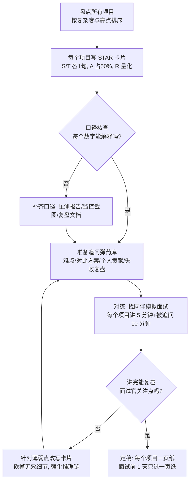
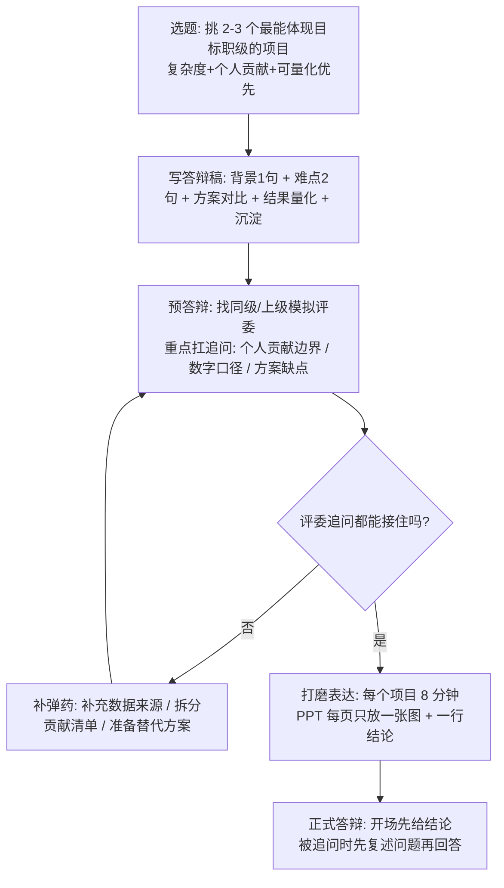
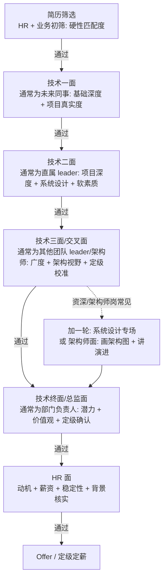

[📖 返回目录](README.md) · [⬅️ 上一章](23-algorithms.md) · [➡️ 下一章](25-interview-question-bank.md)

# 24 · 资深/架构师软实力与面试策略

> 适用对象：10+ 年经验的资深工程师 / 架构师候选人。本章覆盖：资深 vs 架构师的定级标准与考察维度、项目答辩准备（STAR 模板 + 数字量化话术）、技术选型与权衡（决策矩阵 / 自研 vs 开源 / 说服团队）、带团队与协作（Code Review / 方案评审 / 跨部门 / 辅导新人）、晋升答辩要点（成果包装 / 影响力举证）、面试官视角（大厂全流程 + 资深面 5 大深挖方向 + 如何引导面试官）、简历包装（10+ 年简历写法 / 项目模板 / 高频简历问题）。面试落点：技术面到资深/架构师定级，考的不再是「会不会」，而是「做过没有、想清楚没有、能不能带别人做」——本章把「软实力」变成可训练、可量化、可演示的硬动作。

**TL;DR 本章学习要点**

1. **定位先行**：资深 = 单点深度 + 独立交付；架构师 = 全局视角 + 决策能力 + 影响力。面试官用「深度 / 广度 / 系统设计 / 软素质」四维打分，先搞清楚目标岗位要哪个维度再分配准备时间；
2. **项目答辩是资深面主战场**：所有项目用 STAR 结构化，难点讲「背景 → 方案对比 → 决策 → 结果」，每个数字都能解释口径（QPS / RT / 可用性 / 成本）；「你做了什么」要能一句话说清个人贡献与边界；
3. **技术选型考的是决策过程**：不是「选了什么」，而是「对比了什么、权重怎么定、风险怎么兜」——决策矩阵 + 试点 + 回退方案是标准动作；
4. **软素质要可举证**：Code Review 制度、方案评审流程、辅导新人产出、跨部门推动案例，全部要能讲出「我发起 / 我设计 / 我推动」的具体故事，而不是「我们团队」；
5. **面试是双向引导**：资深面常挖 5 个方向（项目真实性、原理底层、边界情况、方案权衡、软素质），主动把话题引向自己最深的领域；反问环节是展示思考深度的最后机会，别问「加班多吗」。

---

### 📑 本章目录

- [1. 资深 vs 架构师定位](#1-资深-vs-架构师定位)
- [2. 项目答辩准备](#2-项目答辩准备)
- [3. 技术选型与权衡](#3-技术选型与权衡)
- [4. 带团队与协作](#4-带团队与协作)
- [5. 晋升答辩要点](#5-晋升答辩要点)
- [6. 面试官视角](#6-面试官视角)
- [7. 简历包装](#7-简历包装)
- [8. 考点速查表](#8-考点速查表)

## 1. 资深 vs 架构师定位

### 1.1 定级标准（大厂通用视角）

大厂职级体系名称不同（阿里 P / 腾讯 T·现在 9 级制 / 字节 2-x / 美团 L），但**定级锚点高度一致**：职级 = 影响半径 × 复杂度 × 不可替代性。

| 职级段 | 典型画像 | 影响半径 | 定级锚点 |
|---|---|---|---|
| 高级（阿里 P6 / 腾讯 8~9） | 独当一面，复杂模块独立交付 | 一个系统 | 深度达标、能搞定别人搞不定的模块 |
| 资深（P7 / 腾讯 10 / 字节 2-2） | 带 1 个方向或 3~5 人小组，定义技术方案 | 一个方向 / 多条业务线 | 深度 + 广度 + 系统设计 + 团队影响力 |
| 专家 / 架构师（P8 / 腾讯 11 / 字节 3-1） | 跨团队技术决策，规划技术演进 | 一个域 / 全公司某一领域 | 架构能力 + 决策质量 + 跨团队影响力 |
| 高级架构师 / 首席（P9+） | 公司级技术战略，技术品牌 | 全公司 / 行业 | 战略视野 + 技术品牌 + 组织能力 |

- **核心差异一句话**：资深解决「已知问题的更优解」，架构师定义「问题本身并给出系统解」；面试时资深岗考「你做过的最难的事」，架构师岗考「如果给你一个域，你怎么规划」。
- **面试考察四维模型**（面试官打分表基本都按这四维）：

| 维度 | 考察方式 | 典型问题 | 资深线要求 |
|---|---|---|---|
| 深度 | 原理追问到底层（源码 / 协议 / 算法） | 「HashMap 为什么线程不安全？1.8 改了什么？」 | 能讲到字节码 / 源码级别，且能指出取舍 |
| 广度 | 跨领域串联（DB ↔ 缓存 ↔ MQ ↔ 框架） | 「下单链路 MySQL、Redis、MQ 各承担什么？」 | 能画出完整链路并指出每层风险 |
| 系统设计 | 场景题 + 项目架构复盘 | 「设计一个秒杀系统」「你这个项目为什么这么拆？」 | 有方法论（18 章框架）+ 真实权衡案例 |
| 软素质 | 行为面试（STAR）+ 压力测试 | 「讲一个你推动跨部门的事」「如果重来你怎么做？」 | 能讲清个人贡献、冲突处理、影响力举证 |

### 1.2 本节高频面试题

**Q1：你觉得资深工程师和架构师最大的区别是什么？**

解答：按「影响半径 × 决策性质 × 交付物」三个维度答。① **影响半径**：资深影响一个系统 / 一个方向，架构师影响一个域 / 多个团队；② **决策性质**：资深在给定约束下做最优实现，架构师定义约束本身——选型、取舍、演进路径；③ **交付物**：资深交付「高质量代码与方案」，架构师交付「决策 + 标准 + 人才」——架构师的代码产出占比会显著下降，但要能看懂所有人的代码。**面试升华：架构师的核心能力是「在信息不完备时做决策，并为决策负责」——这是与资深最本质的差别，也是面试官最想听的一句话**。

面试官追问：那你现在更偏哪个？——答：诚实定位 + 证据。如「我在上一家公司已经是小组技术负责人，主导过 X 系统重构和 Y 选型，但影响范围还局限在业务线内，所以这次希望扩展到跨团队层面」——**不要说自己已经是架构师但举不出跨团队案例，这是资深面最大的减分项**。

**Q2：给你一个不熟悉的业务域，你怎么在三个月内拿出架构方案？**

解答：这是架构师岗常考的场景题，用「理解 → 建模 → 验证」三步框架：① **理解**：两周内读代码 + 访谈核心同学 + 拉取监控数据，搞清楚现状（模块、链路、痛点、瓶颈数据）；② **建模**：用 DDD 做领域建模（18 章 §5），识别核心域与支撑域，画出目标架构与演进路径（分阶段，每阶段可独立交付价值）；③ **验证**：先做 1 个最小可验证的改造点（如一个高频链路的性能优化）建立信任，再推大改造。**关键话术：不熟悉的不是技术，是业务——技术方案能力是可迁移的，业务理解靠结构化方法快速补齐**。

面试官追问：如果团队不认可你的方案怎么办？——答：① 先找反对意见背后的数据与诉求，架构方案 70% 是沟通问题；② 用「试点 + 对比数据」说话，而不是职位压人；③ 明确回退方案，降低决策风险（详见本章 §3.3 说服团队五步）。

---

## 2. 项目答辩准备

### 2.1 STAR 模板与完整示例

资深面 60% 的时间在聊项目，**项目答辩不是汇报，是「让面试官相信这个项目的复杂度配得上你的职级」**。所有项目按 STAR 准备：

| STAR 要素 | 要回答的问题 | 篇幅占比 |
|---|---|---|
| S（Situation 背景） | 业务背景是什么？为什么做？ | 10% |
| T（Task 任务） | 你的职责边界是什么？目标指标是什么？ | 10% |
| A（Action 行动） | 方案对比了哪些？你做了什么决策？**你个人**做了什么？ | 50% |
| R（Result 结果） | 量化结果（QPS / RT / 成本 / 可用性 / 业务指标） | 30% |

完整示例（可用作模板改造）：

> **S 背景**：2023 年双 11 前夕，订单中心接口 P99 延迟从 80ms 涨到 320ms，大促目标 QPS 3 万，按现状必然超时。**T 任务**：我作为订单链路负责人，目标是大促期间 P99 ≤ 150ms、可用性 ≥ 99.99%，两周内出方案并落地。**A 行动**：① 压测 + 链路追踪定位到热点：商品详情远程调用占 60% 耗时且缓存命中率仅 72%；② 对比了两个方案（本地缓存 Caffeine 两级缓存 vs 只加 Redis 缓存），用决策矩阵评估后选择 Caffeine + Redis 两级缓存，并解决了一致性问题（版本号 + 延迟双删）；③ 我负责整体方案设计、缓存一致性代码与压测验证，另外两位同学负责监控告警与回归测试。**R 结果**：P99 从 320ms 降到 95ms，缓存命中率 99.2%，双 11 峰值 QPS 3.6 万平稳度过，可用性 99.995%，并沉淀了一篇《两级缓存实践》内部文档被 3 个团队复用。

**注意**：A 和 R 是重点，S/T 一句话带过；**每个数字都要能解释口径**（P99 是哪个链路的、QPS 是峰值还是均值、可用性怎么统计的）——面试官一定会追问口径，答不上来 = 数据造假嫌疑。

### 2.2 怎么讲项目难点：四层结构

难点不是「性能慢」这种结论，而是「**为什么难 → 我做了什么对比 → 为什么这么选 → 结果验证**」的完整推理链。四层结构：

1. **难点定义**：一句话说清难在哪（数据量 / 一致性 / 实时性 / 跨团队耦合），并给出现状数字（「单表 2 亿行，写入 QPS 8000」）；
2. **方案对比**：至少两个候选方案 + 各自的优缺点 + 你淘汰了谁、为什么（「分表 vs 归档 vs 冷热分离，我选了冷热分离因为……」，详见 §3 决策矩阵）；
3. **关键实现**：挑 1~2 个技术点讲透（如「分库分表后分布式 ID 用雪花算法 + 号段模式」），能接住追问；
4. **结果与复盘**：量化结果 + 一句复盘（「重来一次我会先做数据调研，因为上线后才发现 30% 的查询是跨冷热表的」）——**复盘比成功更加分，说明你有闭环思考**。

### 2.3 数字量化话术示例

| 维度 | 差的话术 | 好的话术 |
|---|---|---|
| 性能 | 「系统变快了」 | 「接口 P99 从 320ms 降到 95ms，单机 QPS 从 800 提到 2600」 |
| 容量 | 「支持了很大流量」 | 「双 11 峰值 3.6 万 QPS，压测到 5 万才出现拐点」 |
| 成本 | 「省了资源」 | 「32 台 8C16G 降到 12 台，年成本省约 40 万」 |
| 稳定性 | 「没出过事」 | 「可用性从 99.9% 提到 99.995%，年故障时长从 8.7 小时降到 26 分钟」 |
| 效率 | 「开发快了」 | 「上线周期从 2 周缩短到 3 天，需求吞吐提升 4 倍」 |
| 影响力 | 「很多人用」 | 「方案文档被 3 个团队复用，在部门技术分享做过 2 次宣讲」 |

- **量化原则**：① 优先业务指标（GMV、转化率、人效）而非纯技术指标；② 数字宁少勿假，口径能解释；③ 没有精确数字时用相对值（「提升 40%」）并说明基准。

### 2.4 被追问「你做了什么 vs 别人做的」怎么答

这是资深面**最高频的追问**，本质是验证：① 项目是不是你主导的；② 你有没有清晰的个人贡献边界；③ 你能否带别人。应对方法：

- **提前拆分贡献**：每个项目准备「我主导 / 我参与 / 我支持」三层清单。我主导 = 方案设计 + 核心代码 + 决策；我参与 = 模块开发 + 评审；我支持 = 答疑 + 推广；
- **话术模板**：「这个项目我负责整体架构和缓存方案设计，核心的 XX 模块 3000 行代码是我写的；团队里 A 同学负责监控告警，B 同学负责回归测试——他们的部分我在设计阶段给了接口契约和评审支持」——**主动点名他人贡献反而证明你是 owner，吞掉别人功劳是面试大忌**；
- **追问反杀**：面试官问「具体哪段代码是你写的」，要能答出细节（类名、关键方法、踩过的坑）；问「如果重来你会改什么」，答「我会在方案阶段先做 3 天数据调研，而不是直接进入设计」——细节真实感是防伪最佳武器。

### 2.5 项目答辩准备流程

### 2.6 本节高频面试题

**Q3：讲一个你最有代表性的项目（开放式）**

解答：这是资深面第一题，通常决定整场基调。选择标准：① 复杂度配得上目标职级（不要讲 CRUD 项目）；② 你能讲清个人贡献；③ 有量化结果。按 2.1 的 STAR 结构讲 5 分钟，**A 部分主动给出方案对比**（「当时有两个方案，我选了 B 因为……」），把话题引向你准备得最深的点——你讲方案对比，面试官大概率顺着追问选型细节，这就是你预设的主场。

面试官追问：这个方案的缺点是什么？——答：任何方案都有缺点，**主动暴露并给补偿措施**：「两级缓存的缺点是多了一层一致性维护成本，我用版本号 + 延迟双删把不一致窗口压到毫秒级；如果业务对一致性要求更高，我会直接走旁路缓存 + 订阅 binlog 的方案」。答「没有缺点」= 死亡答案。

**Q4：你项目里遇到的最大失败是什么？**

解答：资深面必问（考察复盘能力与抗压）。结构：**失败事实（简短、不甩锅）→ 原因分析（自己的决策失误占大头）→ 补救动作 → 沉淀**。示例：「上线前压测没覆盖冷数据场景，上线后慢查询打满连接池；根因是我只按热数据建模，没做数据分层调研；当晚做了限流 + 索引回退，次日补了冷热分离方案；之后我把『数据调研』写进了团队的方案评审 checklist」。**要点：失败要真实、原因要向内、结果要有沉淀**——讲「都怪别的团队」是减分项。

### 2.7 项目答辩十大常见错误（自查清单）

| # | 错误 | 面试官眼中的信号 | 正确做法 |
|---|---|---|---|
| 1 | 项目讲成流水账（做了什么→又做了什么） | 没有重点与取舍 | 一个项目只讲 1 个核心难点 + 1 个核心决策 |
| 2 | 全程「我们团队」 | 个人贡献不明 | 主动区分「我主导 / 参与 / 支持」 |
| 3 | 数字没有口径 | 数据造假嫌疑 | 每个数字附带统计口径与来源 |
| 4 | 难点讲「工作量」不讲「复杂度」 | 复杂度不够定级 | 讲「难在约束与权衡」而非「代码多」 |
| 5 | 方案只有一种 | 没做过对比思考 | 至少两个候选方案 + 淘汰理由 |
| 6 | 被追问细节就卡壳 | 项目不是你的 | 准备类名 / 接口 / 踩坑等细节弹药 |
| 7 | 只讲成功不讲失败 | 缺乏复盘能力 | 准备 1 个失败案例（原因向内 + 沉淀） |
| 8 | 答「没有缺点」 | 缺乏批判性思维 | 主动暴露方案缺点 + 补偿措施 |
| 9 | 超时讲不完 | 结构化能力差 | 5 分钟版本 + 3 分钟版本都准备好 |
| 10 | 贬低前团队 / 前同事 | 成熟度与风险 | 客观陈述，归因于「决策与场景」而非「人」 |

- **自查方法**：把每个项目录下来讲一遍，回放时对照此表打勾——**「听自己的录音」是发现「讲不清楚」最快的方式，比找十个人模拟都有效**。

---

## 3. 技术选型与权衡

### 3.1 决策矩阵示例（选型面试必杀技）

面试官问选型，看的不是结论，是**决策过程是否结构化**。决策矩阵是标准答案：定指标 → 定权重 → 逐项评分 → 敏感性分析 → 决策。

示例：订单系统消息队列选型（RocketMQ vs Kafka vs RabbitMQ）：

| 评估指标 | 权重 | RocketMQ | Kafka | RabbitMQ | 权重说明 |
|---|---:|---:|---:|---:|---|
| 事务消息 / 本地消息表支持 | 25% | 9 | 6 | 5 | 订单支付链路强依赖，业务刚需 |
| 顺序消息 | 20% | 9 | 8 | 5 | 订单状态流转需要 |
| 吞吐量（万级 QPS） | 15% | 8 | 10 | 4 | 大促峰值可达 3 万 QPS |
| 延迟（毫秒级） | 10% | 8 | 7 | 9 | 异步链路，秒级可接受 |
| 运维成熟度（团队已有经验） | 20% | 8 | 7 | 6 | 团队有 RocketMQ 运维经验 |
| 社区活跃度与可扩展性 | 10% | 8 | 10 | 6 | 长期演进 |
| **加权总分** | 100% | **8.45** | **7.55** | **5.4** | 选 RocketMQ |

- **决策矩阵四步**：① 指标从业务诉求推导（不是拍脑袋列）；② 权重体现业务优先级并说明理由；③ 评分要引用数据或 PoC 结果（「Kafka 吞吐 10 分是因为压测 10 万 QPS 无压力」）；④ **敏感性分析**：「如果把运维成熟度权重降到 10%，Kafka 8.05 vs RocketMQ 8.3，结论不变；如果权重反转，结论会变——所以最终决策还要看团队情况」——这一句直接拉开与普通候选人的差距。
- **面试升华：选型的本质是「在约束下求最优」——约束（团队、成本、时间、存量系统）往往比技术本身更决定结论，把约束讲清楚比把技术讲清楚更值钱**。

### 3.2 自研 vs 开源

| 维度 | 自研 | 用开源（含商业版） |
|---|---|---|
| 适配度 | 完全贴合业务 | 需要二次开发 / 配置适配 |
| 控制力 | 出问题自己能改 | 依赖社区修复节奏（可 fork 维护） |
| 成本 | 研发 + 长期维护成本高（隐性） | 上手成本低，License / 商业支持费 |
| 风险 | 重复造轮子、质量不可控 | 项目停更、安全漏洞、License 合规 |
| 适用场景 | 核心差异化能力、开源无解、需要深度定制 | 通用中间件（MQ / 缓存 / 注册中心）、非核心竞争力 |

- **决策红线**：① 通用能力不自研（「Kafka 都解决不了的问题，我们团队大概率也解决不了」）；② 差异化能力不自研就输了（推荐引擎、风控模型）；③ 自研必须有「三年维护预算」——**只算开发成本不算维护成本是自研翻车第一原因**；④ 开源先看 License（Apache 2.0 友好，GPL/SSPL 有合规风险——如 Elasticsearch 的 SSPL 变化曾导致大量公司迁移到 OpenSearch）。
- **典型话术**：「我们最终选了开源 XX + 少量二次开发，因为它是通用能力、社区活跃、团队有运维经验；自研只保留了两个定制点：XX 和 XX，通过插件机制扩展，不 fork 主线」——**「不 fork 主线」是体现工程成熟度的金句**。

### 3.3 如何说服团队（五步法）

技术决策 70% 是沟通问题。说服五步：

1. **对齐目标**：先讲「解决什么问题、业务收益是什么」，再讲技术方案——团队反对的往往是「为什么现在要动」而不是方案本身；
2. **给数据**：压测结果、成本测算、对比实验——用数据代替观点（「预计节省 40 万/年」比「我觉得更好」有用一百倍）；
3. **小步试点**：先在一个低风险业务线试点 2~4 周，用试点数据说话，而不是全量切换逼宫；
4. **明确回退方案**：讲清楚「如果不行，怎么回退、回退成本多少」——**给团队安全感是决策通过的关键**；
5. **吸收反对意见**：把反对者变成方案的一部分（「A 担心的监控问题，我来补一个大盘」），评审记录里写明采纳了谁的什么意见。

### 3.5 技术选型常见陷阱（面试防雷）

| 陷阱 | 表现 | 正确姿势 |
|---|---|---|
| 只报结论 | 「我们用了 XX 因为它好」 | 讲完整决策链：诉求 → 候选 → 指标 → 淘汰理由 |
| 唯技术论 | 只比性能参数，不比业务匹配 | 指标从业务诉求推导，权重说明理由 |
| 忽略存量 | 不考虑现有系统与团队技能 | 兼容性 / 迁移成本 / 团队学习成本计入矩阵 |
| 只看当下 | 不评估 2~3 年演进 | 社区活跃度、可扩展性、退出成本进矩阵 |
| 没有试点 | 评审通过直接全量上 | 先 PoC / 低风险业务试点，用数据决策 |
| 没有回退 | 上线出问题只能硬扛 | 方案必须含回退路径与回退成本 |
| 忘记 License | 用了 GPL/SSPL 进生产 | 选型前查 License，合规风险单独一列 |
| 自研冲动 | 「这个很简单我们自己写」 | 通用能力不自研；自研算三年维护成本 |

- **面试金句**：「选型没有最优解，只有约束下的可行解；我的责任是把约束讲清楚、把决策过程结构化、把风险兜住」——这句话本身就能回答大多数选型类问题。

### 3.6 本节高频面试题

**Q5：讲一次你做过的技术选型，为什么这么选？**

解答：用 3.1 的决策矩阵结构讲：业务诉求 → 候选方案 → 指标权重 → 评分与淘汰理由 → 试点验证 → 结果。**重点讲淘汰方案的理由**（「RabbitMQ 吞吐不够、事务消息支持弱，第一轮就排除了」）和**结果闭环**（「上线后压测 3 万 QPS 稳定，支撑了大促」）。切忌只报结论「我们用 RocketMQ 因为它好」——面试官立刻追问「Kafka 吞吐更高为什么不用」，答不上来就露馅。

面试官追问：如果让你们团队从零维护这套中间件，你还会选它吗？——答：区分「选型」和「运维」两个问题：「选型结论不变，因为它满足业务刚需；但我会提前规划运维能力——监控大盘、压测基线、故障预案、人员培训，把运维成本写进方案的成本测算里」——**体现「选型即运维」的完整视角，是资深与初级的差别**。

**Q6：你们为什么不用 Kubernetes？/ 为什么不用微服务？**

解答：这类「为什么不用主流技术」的问题考的是**独立判断能力**，标准答案结构：承认价值 → 给出约束 → 给出演进路径。「K8s 是趋势，我们没用的原因是：① 团队 5 人没有专职运维，K8s 的学习与运维成本会吃掉研发产能；② 业务是单机可扩展的定时任务 + 少量 Web 服务，Docker Compose + 云主机足够；③ 我规划了演进路径：当服务数超过 20 个或需要弹性扩缩容时，先引入托管 K8s（ACK/EKS）再逐步迁移」。**要点：不用主流技术不是错，讲不清为什么才是错；每个「不做」都要配一个「什么时候做」**。

---

## 4. 带团队与协作

### 4.1 Code Review 文化

资深/架构师必须能讲出自己**建立或改进过**的 CR 机制（22 章 §2.3 有评审清单）：

- **节奏**：小 PR 快评审（<200 行，24 小时内响应），大变更先出设计文档再写码；
- **关注点排序**：正确性（并发/边界/异常路径）> 可维护性（命名/结构）> 性能 > 风格——**不要在风格上消耗评审者耐心**；
- **机制设计**：强制 2 人评审 + 机器人门禁（CI 静态检查、覆盖率门槛）+ 每周 CR 复盘（挑 1~2 个典型问题做团队分享）；
- **文化**：对事不对人，评论用「这里如果并发 1 万会怎样」代替「你写错了」；新人前 3 个月安排 mentor 逐行带评；
- **面试话术**：「我推动把 CR 从『走过场』变成『门禁 + 复盘』：覆盖率低于 60% 不能合并，每两周一次 CR 复盘会，半年后线上缺陷率下降了 45%」——有数字的机制建设就是影响力举证。

### 4.2 技术方案评审

架构师的核心动作之一，面试会问「你怎么保证方案质量」：

- **评审前置**：方案文档（背景 / 目标 / 方案对比 / 风险 / 回退）提前 48 小时发出，评审会只讨论分歧点，不现场读文档；
- **评审 Checklist**：① 需求与目标指标是否清晰；② 是否至少对比了两个方案；③ 数据量与 QPS 是否有预估；④ 高可用 / 一致性 / 安全 / 合规是否覆盖；⑤ 上线与回退方案是否明确；⑥ 监控与告警是否配套；
- **决策机制**：评审会要有结论（通过 / 有条件通过 / 打回），有条件通过要列出条件与负责人，跟踪闭环——**「会开了等于没开」是评审制度失效的第一症状**。

### 4.3 跨部门协作

- **冲突根源**：目标不一致（研发要稳定性、业务要快速上线）、责任边界不清、接口契约不明；
- **标准动作**：① 把对方的目标写进自己的方案（「这个改造能帮数据团队把 T+1 报表提前到 T+0」）；② 接口契约先行（OpenAPI / 字段文档 + 联调环境），变更走版本兼容；③ 争议升级有节奏：先对齐一线、再拉双方 leader 对目标、最后才升级到更高层——**升级不是告状，是推动决策**；
- **面试话术**：「数据团队要的报表依赖我们的订单明细，但我们的 binlog 订阅一直不稳定。我牵头拉了对齐会，把『订阅可靠性』写进双方 OKR，并做了主备双订阅 + 幂等消费，两个月后报表准时率从 70% 提到 99%」——跨部门案例 = 影响半径的最佳证据。

### 4.4 辅导新人

- **原则**：授人以渔 + 任务拆解 + 容错边界。给新人「有挑战但不会翻车」的任务，明确「红线内随便试」；
- **结构化带教**：入职 30/60/90 天计划（熟悉代码 → 独立小需求 → 主导中型需求），每周 1:1 聊进展与卡点；
- **面试话术**：「我带过 4 个新人，2 个一年内晋升，1 个成了小组骨干；我总结的带教方法是任务拆解到两周可交付 + 每周 1:1 对齐 + CR 里给改进建议而不是直接改代码」——**带人的产出要用「新人的成长」举证，而不是「我花了多少时间」**。

### 4.5 本节高频面试题

**Q7：你带过团队吗？怎么处理成员意见不合？**

解答：带团队的经验不限于「有汇报关系」——带项目、带虚拟小组、带新人都是团队经验，**先把影响半径讲清楚**。意见不合处理四步：① 先听数据与理由，不急着表态（「先各写一页方案对比」）；② 用决策矩阵 / 试点数据裁决，而不是职位裁决；③ 裁决后对输的一方给台阶（「这次按 A 方案，但 B 方案的监控点我会加上，数据出来如果 B 更好我们再切」）；④ 事后复盘决策质量，而不是秋后算账。**金句：「团队共识不是投票，是带着数据达成共识」**。

面试官追问：如果你的方案被 leader 否了，但你坚信自己是对的，怎么办？——答：① 先确认分歧点到底是目标还是手段（很多时候 leader 否的是时机不是方案）；② 用最小成本验证：申请一个小范围试点，用数据说话；③ 如果试点条件都不给，就把方案文档 + 风险分析存档，等时机成熟再提——**「坚持但不对抗，用数据等时机」是资深成熟度的体现**。

**Q8：你怎么评价一个方案的好坏？**

解答：从四个维度：① 是否解决真实问题（目标指标）；② 复杂度是否匹配（过度设计 vs 过度简陋）；③ 可演进性（今天不做的事，明天做要多少成本）；④ 风险与回退（最坏情况是什么、能不能兜住）。**升华：好方案 = 在约束下做对当前问题 + 不给未来挖坑，两个条件缺一不可**——很多好方案死于「面向未来过度设计」，很多烂方案死于「只解决眼前」。

---

## 5. 晋升答辩要点

> 晋升答辩与面试高度同构（尤其很多大厂晋升评委就是外部面试官），把晋升材料准备好，面试就成功了一半。

### 5.1 成果包装：从「做了什么」到「产生了什么」

成果包装三层金字塔：

1. **结果层**（最底层，必须量化）：性能、容量、成本、稳定性、效率的具体数字；
2. **影响层**：数字背后的业务价值（GMV、转化、人效、风险规避）与复用范围（几个团队 / 几条业务线用了你的方案）；
3. **能力层**（最顶层，定级关键）：沉淀的方法论、标准、工具、人才——**「你走了，这些东西还在不在」是评委判断你价值的关键问题**。

包装公式：**「我做了 X，解决了 Y 问题，带来 Z 收益，沉淀了 W（方法/工具/人才），被 N 个团队复用」**。示例：「我主导了订单中心两级缓存改造，解决大促热点问题，P99 从 320ms 降到 95ms，支撑双 11 峰值 3.6 万 QPS，沉淀的《两级缓存实践》被 3 个团队复用，带教的 2 名同学当年晋升」。

### 5.2 影响力举证清单

- **横向影响力**：技术分享（次数 + 听众规模 + 会后反馈）、内部文档（被引用数）、工具/框架（使用团队数）、担任评审人（评审过多少方案）；
- **纵向影响力**：辅导晋升人数、带教新人数量与成长、代理 leader 经历、参与制定团队技术规范（Code Review 规范、上线规范）；
- **对外影响力**：开源项目（star / PR 被合并）、技术文章（阅读量）、专利、社区分享——资深以上这些是加分项，架构师级是必要项；
- **举证原则**：每条影响力都要有「发起者是你 + 可验证 + 有数字」，写「推动团队落地 CR 规范」不如写「我制定并推动 CR 门禁落地，半年缺陷率降 45%」。

### 5.3 答辩结构与演练

- **答辩时间分配**：8 分钟讲（背景 1 分钟、难点与方案 4 分钟、结果与沉淀 3 分钟）+ 12 分钟问答——**讲得短而深，比讲得长而全好**；
- **被追问原则**：先复述问题确认理解，再答；不会的领域诚实说「这块不是我负责，我了解的边界是……」然后快速引导回自己主场。

### 5.4 本节高频面试题

**Q9：你最有成就感的一件事是什么？（晋升/面试通用）**

解答：选「复杂度高 + 你主导 + 结果量化 + 有沉淀」的事，按 5.1 的公式答。**注意**：成就感 ≠ 技术难度，评委更看重「这件事对组织的影响」——讲「我带的 2 个新人晋升了」比讲「我写了个很牛的工具」更能体现资深价值（除非工具被大规模复用）。结尾给一句升华：「这件事让我意识到，我的价值不在于写了多少代码，而在于让团队整体变强」。

面试官追问：如果这件事重来，你会改变什么？——答：真实复盘 + 体现成长：「重来我会在方案阶段做 3 天数据调研，上线后才发现 30% 查询跨冷热表；这个教训让我把『数据分层调研』写进了团队方案评审 checklist，之后两个项目都受益了」——**复盘讲「流程改进」比讲「我改进了自己」更有说服力**。

---

## 6. 面试官视角

### 6.1 大厂面试全流程

- **资深/架构师岗流程变体**：① 简历筛选会看「项目匹配度 + 职级锚点」，简历里没有对应规模的项目会被直接刷；② 技术面通常 3~4 轮，其中至少一轮是「系统设计专场」或「架构师交叉面」；③ 部分公司（字节等）会有 2 轮算法/编码面穿插；④ 华为等流程更长（机考 + 性格测试 + 多轮技术面 + 综合面）。
- **流程中你的主动权**：每一轮结束可以问面试官「这一轮您关注的重点是什么」，下一轮针对性调整——**面完一轮复盘一轮，是资深候选人拉开差距的细节**。

### 6.2 每轮考察什么

| 轮次 | 面试官 | 考察重点 | 通过标准（资深/架构师） |
|---|---|---|---|
| 一面 | 未来同事 / 组内骨干 | 基础深度、项目真实度 | 深度达标，项目经得起追问 |
| 二面 | 直属 leader | 项目主导度、系统设计、软素质 | 有主导案例，设计有方法论 |
| 三面/交叉 | 其他团队 leader / 架构师 | 广度、架构视野、定级校准 | 跨领域能串联，视野配得上目标职级 |
| 终面/总监 | 部门负责人 | 潜力、影响力、价值观 | 可培养可信任，定级与薪资锚定 |
| HR 面 | HRBP | 动机、稳定性、薪资期望 | 匹配岗位与团队，无重大风险 |

### 6.3 资深面常挖的 5 个方向

1. **项目真实性**：细节连环问（类名、接口、踩坑、代码行数、当时的监控数据）——防背题，答不出细节 = 项目不是你的；
2. **原理底层**：从用法追到源码（「你用 Redis 分布式锁，Redisson 的看门狗怎么实现的？」「HashMap 1.8 为什么引入红黑树？退化的条件是什么？」）——追到答不出为止，考察深度边界；
3. **边界与极端情况**：「数据量再大 10 倍怎么办」「QPS 再高 10 倍怎么办」「这个方案在什么情况下会失效」——考察是否想过方案的适用边界；
4. **方案权衡**：「为什么不用 XX」「这个方案的缺点是什么」「如果让你重来」——考察决策质量与复盘能力；
5. **软素质**：STAR 行为题（冲突、失败、带人、跨部门）+ 压力题（打断、质疑、连续追问）——考察成熟度与抗压，**被质疑时稳住、被打断时不慌，本身就是得分项**。

### 6.4 如何引导面试官

- **引导原则**：资深面试官怕「什么都答得浅」，宁可少答两个题，也要把一个题挖到源码和权衡层面——**主动暴露深度是最高效的引导**；
- **引导手法**：① 答案里埋钩子——「这个点我踩过坑，当时是 XX 场景」（面试官大概率顺着挖，那就是你的主场）；② 主动画图——「我画一下这个架构」边说边画，把节奏握在自己手里；③ 及时收尾——「这个问题我先答到这里，如果 XX 方向您感兴趣我可以展开」——**既展示广度又不啰嗦**；
- **答不上的处理**：诚实说「这个方向我没深入研究过」+ 立刻给邻近知识（「不过我知道它的兄弟方案 XX，它的原理是……」）+ 反问确认「您问的是不是 XX 这个层面？」——**诚实 + 迁移能力 + 追问澄清，比硬编强一百倍**；
- **反问环节策略**（面试官问「你有什么想问的」）：问有信息量的：团队当前最大的技术挑战、这个岗位未来 6 个月的目标、团队的 Code Review / 技术分享文化、职级晋升机制。**别问**：加班多吗、福利怎样、能不能远程（这些留给 HR 面或拿到 offer 后）。

### 6.6 定级与谈薪（面试官视角）

- **定级怎么定**：面试官在每轮结束时会按「四维模型」打分，最终定级取「最短板轮次」的共识——**一轮崩了，其他轮满分也可能降级**；所以策略是「保证下限，再冲上限」：基础题不丢分，深挖题展示上限；
- **薪资锚点**：HR 谈薪逻辑 = 现薪（或 offer 竞争）± 职级带宽 × 涨幅系数（一般 15%~30%，跳槽峰值可达 30%~50%）；**你的锚点是「上一份薪资 + 行业带宽」而不是「期望值」**——所以谈薪前先调研目标公司同职级带宽（见 25 章 §定级与薪资常识）；
- **谈薪技巧**：① 不先报价，反问「贵司这个职级的预算范围是？」；② 报价给范围不给单点（「我期望在 XX 到 XX，取决于职级和整体 package」）；③ 用 offer 竞争但不撒谎（背调与 offer 核验都是常规操作）；④ **别在技术面阶段谈钱**——HR 面才谈，技术面谈钱会让面试官觉得你动机不纯；
- **被压级的应对**：「如果定级是 XX，我理解这是基于当前面试表现；我能否补充展示 XX 方向的深度？」——争取加面（加一轮技术面是常见机制），而不是直接接受或拒绝。

### 6.7 本节高频面试题

**Q10：你还有什么想问我的？（反问环节）**

解答：反问是「最后一题」，展示的是你的关注层次。推荐排序：① 业务与技术：「这个岗位未来半年最重要的技术目标是什么？」（展示 owner 心态）；② 团队：「团队现在最大的技术债是什么？打算怎么还？」（展示工程成熟度）；③ 组织：「这个职级的同学在团队里通常负责什么范围？」（展示对职级的理解）。**高级玩法**：结合自己优势问——「我注意到你们在招 XX 方向的人，是遇到 XX 问题了吗？我正好有类似经验」——把反问变成推销自己的机会。

---

## 7. 简历包装

### 7.1 10+ 年简历怎么写

- **篇幅**：资深/架构师可以 2 页（10 年经验压缩到 1 页会漏掉关键信息），但**每句话都要有信息量**，砍掉「熟悉 Linux」「英语四级」这类无效行；
- **结构**：个人信息（一行）→ 个人总结（3~4 行，职级锚点 + 核心能力 + 代表成果）→ 工作经历（倒序，每家 3~5 条 STAR 化 bullet）→ 项目经历（挑 2~3 个重点项目展开，或与工作经历合并）→ 技能清单（分「精通 / 熟练 / 了解」三档，**不要写「精通」超过 3 项**）→ 教育背景（一行）；
- **总结怎么写**：模板「X 年 Java 后端经验，现为 XX 团队技术负责人；主导过 XX（亿级流量 / 大促 / 高可用）系统建设；擅长高并发架构、性能优化与团队技术治理；近一年产出：XX 系统 P99 从 320ms 降到 95ms、方案被 3 个团队复用」——**数字开头，职级锚点明确**；
- **避坑**：① 时间线不能有无法解释的空窗（每段空窗准备一个说法，HR 必问）；② 项目别写「参与」开头，写「主导 / 负责 / 设计」并准备好被追问细节；③ 别列「精通」一堆技术栈——资深面试官看到「精通 10 项」只会觉得你每一项都浅。

### 7.2 项目列表模板（每个项目 4 行）

| 项目要素 | 写法示例 |
|---|---|
| 项目名 + 时间 + 角色 | 订单中台重构 · 2023.03~2023.12 · 技术负责人（5 人小组） |
| 背景与规模 | 支撑 3 条业务线，日均订单 500 万，大促峰值 QPS 3.6 万 |
| 职责与动作 | 主导架构升级：两级缓存改造（Caffeine+Redis）、分库分表方案设计、容量评估与压测体系搭建 |
| 量化结果 | P99 320ms→95ms；可用性 99.995%；成本降 40%；方案文档被 3 个团队复用 |

- **原则**：每个项目都能回答「规模多大 / 你负责什么 / 结果怎样」三问；**简历上的每个数字都要能在面试中解释口径**——简历是面试提纲，不是获奖清单。

### 7.3 高频被问的简历问题

| 问题 | 考察点 | 回答要点 |
|---|---|---|
| 为什么从上家离职？ | 稳定性与动机 | 讲「追求」（业务规模 / 技术挑战 / 职级空间），不讲「逃离」（加班 / 领导 / 钱）；不贬低前东家 |
| 为什么选择我们公司？ | 求职动机真实性 | 结合公司业务与技术栈给 2~3 个具体理由（「你们在 XX 场景的技术深度是我感兴趣的」） |
| 未来 3~5 年规划？ | 自驱力与稳定性 | 技术深度 + 管理宽度结合（「3 年内成为 XX 领域的专家，能带一个方向」），避免「我要转管理」这类模糊答案 |
| 期望薪资？ | 定级定薪锚点 | 给范围 + 依据（「对标贵司 P7 中位，我现薪 X，期望 X~X」），不确定时反问「贵司这个职级的预算范围是？」 |
| 空窗期在做什么？ | 风险排查 | 给「有产出」的说法（学习 / 开源 / 项目 / 家庭安排），并说明已回归状态 |
| 有没有被裁员 / 背调风险？ | 诚信核查 | 如实回答，背调一定会做；诚实 + 解释背景，比隐瞒被发现好得多 |

### 7.5 简历自检清单（投递前过一遍）

| 检查项 | 标准 |
|---|---|
| 职级锚点 | 个人总结 3 行内说清「几年经验 + 现角色 + 代表成果（带数字）」 |
| 时间线 | 无空窗或每个空窗有备注；离职原因在面试前准备好说法 |
| 项目密度 | 近 3 年项目 3~5 条，每条「规模 / 职责 / 量化结果」三要素齐全 |
| 数字可解释 | 简历每个数字都能说出口径（QPS 峰值还是均值、成本怎么算的） |
| 技能分级 | 「精通」≤3 项，其余「熟练 / 了解」；不写「熟悉 Linux」类无效行 |
| 关键词匹配 | 对照 JD 的职级关键词（高并发 / 高可用 / 系统设计 / 团队管理）逐条命中 |
| 篇幅 | ≤2 页；重点项目可附架构图（面试时再展示） |
| 语法与格式 | 无错别字、统一时态与标点；PDF 导出，文件名「姓名-职级-年限-方向」 |
| 背调自检 | 职级 / 时间 / 项目角色与事实一致（背调一般查最近 1~2 段经历） |
| 版本管理 | 每个投递版本存档，面试前回看自己投的是哪个版本（防止答非所问） |

### 7.6 本节高频面试题

**Q11：你的简历上写主导了 XX 项目，能具体讲讲吗？**

解答：这就是简历的真实性测试，也是你整场面试的主场。按 §2 的项目答辩结构讲，**注意与简历数字完全一致**——简历写 P99 从 320ms 到 95ms，面试就讲这个口径，临时改数字 = 诚信危机。主动补充简历上没有的细节（类名、踩坑、替代方案），细节越具体，可信度越高。

面试官追问：这个项目里最有技术含量的一段代码是什么？——答：提前准备 1~2 个「可讲 3 分钟」的代码级故事（如「Redis 分布式锁的看门狗续期实现」「分库分表后分布式 ID 的号段模式实现」），能讲到类名、关键字段、边界条件处理。**答不出细节 = 项目不是你的，直接判死刑**。

**Q12：你 10 年经验，为什么还在写代码？/ 你为什么没走管理路线？**

解答：考察定位清晰度。标准答案：「写代码是我保持技术判断力的方式——架构师/资深的技术决策必须建立在能看懂代码的基础上；我的路线是技术专家 + 团队技术管理结合（tech lead），而不是脱离技术的纯管理」。**要点：承认管理是另一个选择，但明确你的选择与理由，不要贬低任何一条路线**——「管理没意思」这种回答会显得不成熟。

---

## 8. 考点速查表

| 考点 | 一句话要点 |
|---|---|
| 资深 vs 架构师 | 影响半径 × 决策性质 × 交付物不同；架构师=信息不完备时做决策并为决策负责 |
| 四维考察模型 | 深度 / 广度 / 系统设计 / 软素质，资深线要求全部达标且能量化举证 |
| STAR 模板 | S/T 各 10%，A 占 50%（含方案对比与个人贡献），R 占 30%（量化 + 口径可解释） |
| 讲项目难点四层 | 难点定义 → 方案对比 → 关键实现 → 结果与复盘；复盘比成功更加分 |
| 数字量化话术 | 性能 / 容量 / 成本 / 稳定性 / 效率 / 影响力六维，每个数字能解释口径 |
| 「你做了什么」追问 | 提前拆分「我主导 / 参与 / 支持」三层清单；主动点名他人贡献证明 owner 身份 |
| 决策矩阵 | 指标从业务推导 + 权重说明 + 评分引用数据 + 敏感性分析；讲淘汰理由 |
| 自研 vs 开源 | 通用能力不自研；自研必须有三年维护预算；关注 License 合规 |
| 说服团队五步 | 对齐目标 → 给数据 → 小步试点 → 明确回退 → 吸收反对意见 |
| Code Review 文化 | 小 PR 快评审 + 门禁 + 复盘会；关注正确性 > 可维护性 > 性能 > 风格 |
| 方案评审 Checklist | 目标 / 方案对比 / 容量预估 / 高可用一致性 / 回退 / 监控，六项缺一不可 |
| 跨部门协作 | 把对方目标写进方案 + 接口契约先行 + 分级升级；案例即影响半径证据 |
| 辅导新人 | 30/60/90 天计划 + 每周 1:1 + 容错边界；用新人成长举证 |
| 成果包装三层 | 结果层（数字）→ 影响层（业务价值与复用）→ 能力层（方法论与人才） |
| 影响力举证 | 横/纵/外三维，每条「我发起 + 可验证 + 有数字」 |
| 大厂面试流程 | 简历 → 技术面×3~4（含系统设计专场）→ 总监面 → HR 面；每轮结束复盘调整 |
| 资深面 5 大深挖 | 项目真实性 / 原理底层 / 边界极端 / 方案权衡 / 软素质压力 |
| 引导面试官 | 主动暴露深度、答案埋钩子、答不上诚实 + 迁移 + 澄清 |
| 反问环节 | 问业务目标 / 技术债 / 职级范围；不问加班福利 |
| 简历包装 | 2 页、数字开头、总结含职级锚点、项目四行模板、精通不超过 3 项 |
| 高频简历问题 | 离职原因讲追求、规划讲深度+宽度、薪资给范围+依据、空窗给有产出的说法 |
