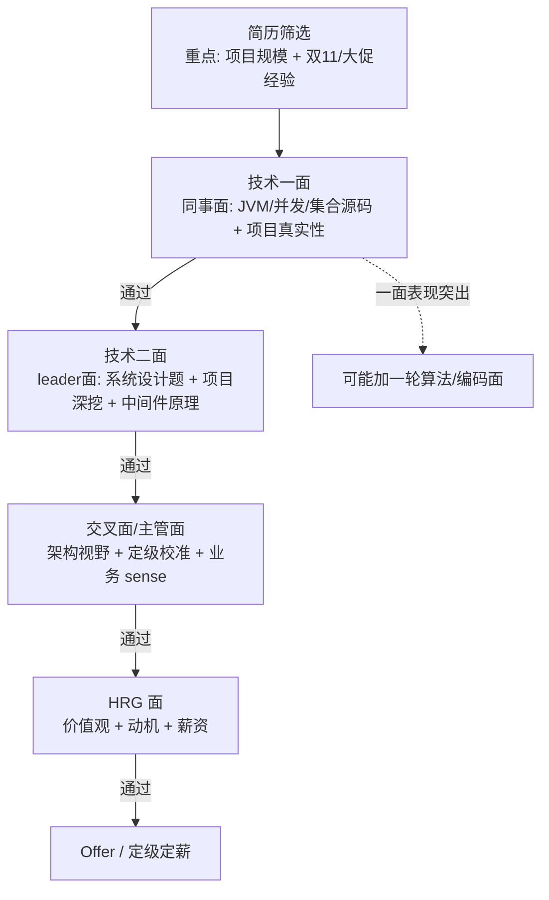
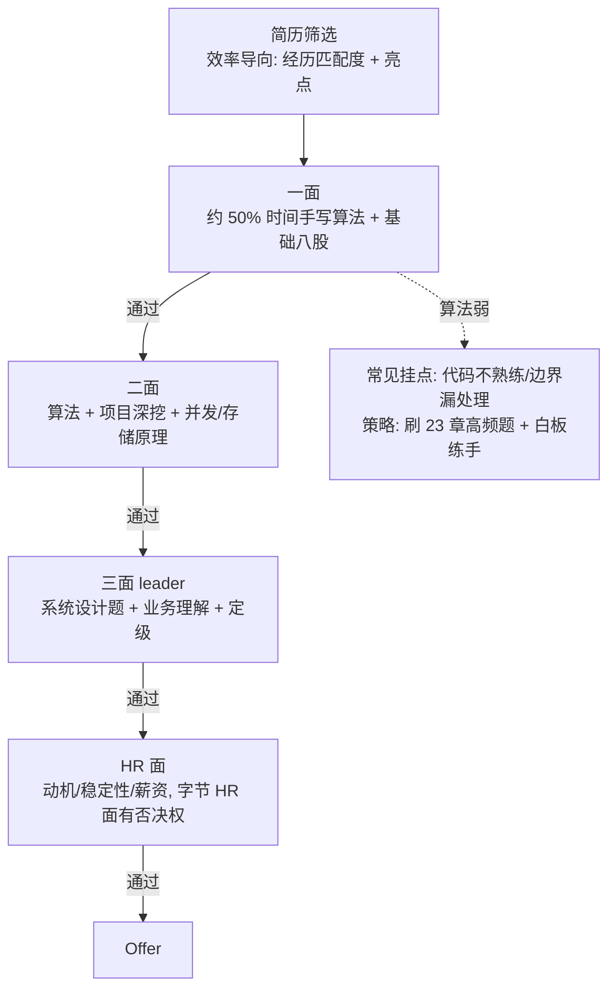
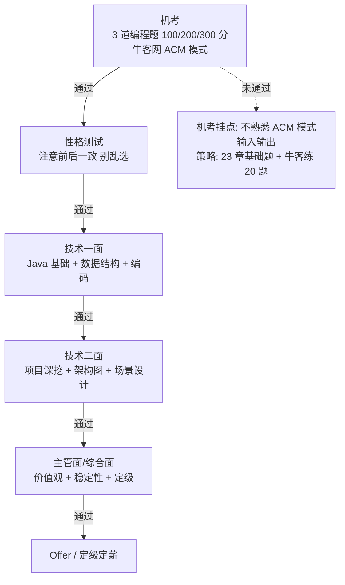
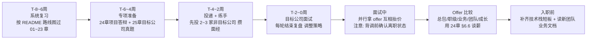

# 25 · 大厂高频真题速查（按公司分类）

> 适用对象：10+ 年经验的资深工程师 / 架构师候选人。本章按公司整理高频真题速查：阿里巴巴/蚂蚁、腾讯、字节跳动、美团、京东、拼多多、快手、滴滴、华为、其他（百度/网易/携程等）。每节包含：公司面试风格与重点考察方向 + 10~15 道高频真题（一句话要点答案 + 详细解答章节引用）。文末附：定级与薪资范围常识（非官方）、面试时间线建议、考点速查表。用法：面试前 1~2 天按目标公司刷对应章节，**题目答案背不背不重要，重要的是能顺着「一句话要点」展开讲 3 分钟**——速查表是索引，展开靠对应章节。

**TL;DR 本章学习要点**

1. **按公司差异化准备**：阿里/蚂蚁重 Java 深度 + 中间件 + 业务 sense；字节重算法 + 高并发 + 效率；腾讯重工程细节 + 场景；美团重业务场景设计；华为重基础 + 编码 + 流程（还有机考）；
2. **真题的作用是「划重点」**：每道题背后的章节引用才是复习对象——刷题 = 按索引精读对应章节（如「详见 05 章 §MVCC」→ 精读 MVCC 一节）；
3. **资深岗的答法**：基础题要能展开到源码与权衡（见 24 章 §6.3 深挖五方向），真题速查里的「一句话要点」只是起点；
4. **定级薪资是谈判锚点**：文末薪资表（非官方）用于谈薪时不被动（配合 24 章 §6.6 谈薪技巧）；
5. **时间线管理**：金三银四 / 金九银十是旺季，资深岗建议「先练 2 家非目标公司 → 再打目标公司」，把最想去的公司放在面试状态最好的时候。

---

## 0. 使用说明：标签与章节引用

- 每题标注【考察方向】标签：JVM / 并发 / 集合 / MySQL / Redis / MQ / Spring / 分布式 / 系统设计 / 算法 / 工程；
- 「详见 XX 章 §YY」指向对应章节的详细解答，格式与 README 目录一致：
  - 02 章 §3 = JVM GC 算法与收集器；03 章 §4 = AQS 源码；05 章 §五 = MVCC；06 章 §六 = 缓存三大问题；08 章 §6 = 顺序性/不丢失不重复；09 章 §3 = 事务消息；13 章 §3 = 循环依赖三级缓存；16 章 §4 = 分布式事务全景；17 章 §4 = 限流；18 章 §2 = 容量预估；19/20 章 = 系统设计案例；22 章 §7 = 线上故障排查；23 章 §2 = 必须手写的经典代码。

### 0.1 考察方向 → 章节速查表（刷题时的「地图」）

| 考察方向 | 对应章节 | 核心考点（速查关键词） |
|---|---|---|
| JVM | 02 章 | 内存结构 / 类加载双亲委派 / GC 算法与 G1-ZGC / 故障排查 / 调优方法论 |
| 并发 | 03 章 | JMM / 锁升级 / volatile-CAS / AQS / 线程池 / 虚拟线程 / 死锁排查 |
| 集合 | 04 章 | HashMap 1.7↔1.8 / ConcurrentHashMap / 红黑树 / LRU / 阻塞队列 |
| MySQL | 05 章 | 执行流程 / InnoDB / 索引 / 隔离级别 / MVCC / 锁 / 日志 / 主从 / 分库分表 / 慢 SQL |
| Redis | 06 章 | 数据结构 / 单线程 / 持久化 / 哨兵集群 / 缓存三问题 / 分布式锁 / 大 key |
| MQ | 08 + 09 章 | Kafka 存储-ISR-幂等-rebalance / RocketMQ 事务-顺序-延迟 / 选型对比 |
| Spring | 13 + 14 + 15 章 | IoC-生命周期 / 循环依赖 / AOP / 事务失效 / 自动装配 / 微服务组件 / MyBatis |
| 分布式 | 16 章 | CAP-BASE / 一致性 / Raft / 分布式事务 / 分布式锁 / ID / 幂等 / SSO |
| 高并发 | 17 章 | 缓存设计 / 异步削峰 / 限流 / 熔断降级 / 池化 / 扩容压测 |
| 系统设计 | 18 + 19 + 20 章 | 方法论框架 / 容量预估 / 高可用 / 秒杀 / 短链 / 红包 / 订单库存 / 支付 / IM / Feed |
| 算法 | 23 章 | 手写经典（LRU/链表/二分）/ TopK / 海量数据 / 字符串 / 布隆过滤器 |
| 工程 | 22 章 | 设计模式 / 代码质量 / 测试 / CI-CD / 监控四金指标 / 线上故障排查 |

- **用法**：真题里出现「详见 XX 章」的引用，就是告诉你这道题的「详细解答 + 追问弹药」在哪一章——**速查表是索引，展开靠对应章节**；每题刷完后回到上表打勾，覆盖度一目了然。

---

## 1. 阿里巴巴 / 蚂蚁集团

### 1.1 面试风格与重点考察方向

- **风格**：P 序列定级（P6 高级 / P7 资深 / P8 专家）；技术面 3~4 轮 + HRG 面；**重 Java 技术深度与中间件**（阿里是 Java 中间件发源地：Sentinel / Nacos / Seata / RocketMQ 均出自阿里）；双 11 是永恒的话题背景，任何系统设计题都默认「大促场景」；蚂蚁更重金融级可靠性（分布式事务、资金安全、对账）；
- **资深（P7）重点**：源码级深度（ConcurrentHashMap / AQS / Spring 循环依赖）、系统设计（秒杀 / 大促链路）、分布式事务与一致性、业务 sense（技术方案要能讲清业务价值）；
- **面试轮次**：简历 → 技术一面（基础+项目）→ 技术二面（leader，深度+系统设计）→ 交叉面/主管面（定级）→ HRG。

### 1.2 高频真题（15 题）

1. 【系统设计】设计一个秒杀系统，双 11 峰值 QPS 100 万怎么扛？→ 分层削峰：前端限流 → 网关 → 预扣库存 Redis + Lua → MQ 异步下单 → 数据库最终扣减（详见 19 章 案例一）。
2. 【并发】ConcurrentHashMap 1.8 为什么放弃分段锁？→ 锁粒度更细（CAS + synchronized 锁桶头），并发度从 16 提升到桶数，且规避了分段锁的内存开销（详见 04 章 §ConcurrentHashMap）。
3. 【JVM】双 11 大促前你们怎么做 JVM 调优？→ 目标导向：先定指标（GC 停顿 / 吞吐），再压测看 GC 日志与堆 dump，最后调参（详见 02 章 §6 调优方法论）。
4. 【MySQL】一条 update 语句在 InnoDB 的完整执行旅程？→ 连接器 → 分析器 → 优化器 → 执行器 → Buffer Pool → undo log → redo log（两阶段提交）→ binlog（详见 05 章 §一/§七）。
5. 【MySQL】MVCC 怎么实现可重复读？→ 每行隐藏 trx_id + undo log 版本链 + ReadView（活跃事务数组），快照读走版本链（详见 05 章 §五）。
6. 【Redis】缓存与数据库一致性怎么保证？→ 主流方案：Cache Aside + 延迟双删 / 订阅 binlog 异步更新，一致性窗口毫秒级（详见 06 章 §九）。
7. 【Redis】Redis 分布式锁用 Redisson 的话，看门狗怎么实现的？→ 默认 30s 有效期，后台定时任务每 10s 续期；主从切换下锁可能丢失（详见 06 章 §七）。
8. 【MQ】RocketMQ 事务消息原理？→ 半消息 + 本地事务执行 + 回查机制，保证本地事务与发消息原子性（详见 09 章 §3）。
9. 【MQ】RocketMQ 怎么保证消息顺序？→ 生产者按业务 key 选队列 + 消费者单线程消费 + 队列内顺序，全局顺序需单队列（详见 09 章 §4）。
10. 【Spring】Spring 循环依赖为什么用三级缓存？→ 三级缓存解决「早期引用暴露」：二级缓存不够是因为需要区分「已完成代理的 bean」与「未代理的 bean」（详见 13 章 §3）。
11. 【分布式】分布式事务你们用的什么方案？为什么？→ 业务选型：强一致用 TCC/Seata AT，最终一致用本地消息表 + 消息队列；金融场景对账兜底（详见 16 章 §4）。
12. 【分布式】分布式 ID 方案对比？→ 雪花算法（有序、依赖时钟）/ 号段模式（DB 批量取号）/ UUID（无序、不适合索引）；阿里内部有 Leaf 等（详见 16 章 §6）。
13. 【JVM】线上 CPU 飙升怎么排查？→ top 找进程 → top -Hp 找线程 → jstack 抓线程栈 → 定位业务代码（详见 02 章 §5 与 22 章 §7）。
14. 【算法】手写 LRU 缓存？→ LinkedHashMap（accessOrder=true）或 HashMap + 双向链表，get/put O(1)（详见 23 章 §2）。
15. 【工程】你们怎么做大促压测与容量评估？→ 容量预估公式（峰值 QPS × 资源系数）+ 全链路压测 + 限流兜底（详见 18 章 §2 与 17 章 §7）。

**阿里面试小贴士**：项目讲「业务价值」比讲「技术亮点」更受 P7 评委认可；中间件题追源码（如 Sentinel 的滑动窗口限流）；蚂蚁面多问「资金安全 / 对账 / 幂等」（详见 16 章 §7 幂等设计）。

**资深加面深挖方向**（阿里系技术面爱追到源码层）：① Sentinel 滑动窗口限流与熔断降级的源码实现（17 章 §4/§5）；② Seata AT 模式的两阶段与全局锁实现（16 章 §4）；③ 双 11 全链路压测体系怎么搭（17 章 §7 与 22 章 §6）。

---

## 2. 腾讯

### 2.1 面试风格与重点考察方向

- **风格**：职级 9 级制（8 级≈资深下限，10 级≈阿里 P7 对标）；技术面 2~4 轮 + HR 面；**重工程落地细节**（代码质量、上线流程、复盘）；WXG（微信）/ CSIG（云）等不同事业群风格差异大，WXG 问得极细；爱考自研技术（Tars / PhxQueue 等，答不上来可坦诚并类比开源方案）；
- **资深重点**：MySQL 深度（微信场景单表亿级）、缓存与一致性、消息可靠性、IM/社交场景系统设计、代码与工程习惯（Git 工作流 / CI / 监控，详见 22 章）；
- **面试轮次**：简历 → 初试（基础+项目）→ 复试（leader，场景设计）→ GM 面/HR 面（GM=总经理，终面常见）。

### 2.2 高频真题（12 题）

1. 【系统设计】设计微信红包/拼手气红包？→ 预生成金额 + 拆分算法（二倍均值法）+ Redis 预扣 + 异步入账（详见 19 章 案例三）。
2. 【系统设计】IM 单聊/群聊消息怎么设计？→ 消息表 + 收件箱/发件箱模型，群聊读扩散（拉取）与写扩散（推送）权衡，在线走长连接离线走推送（详见 20 章 案例三）。
3. 【MySQL】主从延迟怎么处理？→ 强制读主（关键路径）/ 延迟容忍（读从 + 兜底）/ 半同步复制；binlog 追平监控（详见 05 章 §八）。
4. 【MySQL】分库分表后跨库查询怎么办？→ 尽量避免：按维度冗余、汇总表、ES 宽表；不可避免时应用层聚合（详见 05 章 §九）。
5. 【Redis】缓存穿透、击穿、雪崩的区别与应对？→ 穿透：布隆过滤器/空值缓存；击穿：互斥锁/逻辑过期；雪崩：过期时间加随机、集群高可用（详见 06 章 §六）。
6. 【并发】线程池参数怎么定？怎么动态调整？→ CPU 密集 N+1 / IO 密集 2N；队列选型；动态调参（修改 corePoolSize + 预热）（详见 03 章 §8）。
7. 【MQ】Kafka 消费积压了怎么处理？→ 定位消费瓶颈 → 扩容消费者（注意分区数上限）→ 紧急时重建 topic 扩大分区 + 临时脚本追数据（详见 08 章 §6）。
8. 【JVM】G1 和 ZGC 怎么选？→ 停顿目标优先 ZGC（亚毫秒~毫秒级），吞吐优先 G1；JDK 版本与堆大小约束（详见 02 章 §3）。
9. 【Spring】Spring 事务什么情况下会失效？→ 自调用（this 调用不走代理）、非 public、异常被 catch、传播属性错误、多线程内事务不生效（详见 13 章 §5）。
10. 【分布式】分布式锁的几种实现对比？→ Redis（性能高、主从切换丢锁）/ ZK（强一致、性能低）/ DB（简单、性能差）（详见 16 章 §5 与 10 章 §4）。
11. 【算法】TopK 问题（海量数据找最大的 K 个）？→ 小顶堆 O(n log k) / 快排 partition 思想 O(n)；海量数据分治 + 归并（详见 23 章 §3）。
12. 【工程】你们线上故障的应急流程？→ 发现（监控告警）→ 定位（指标/日志/链路）→ 止血（回滚/限流）→ 恢复 → 复盘（详见 22 章 §7）。

**腾讯面试小贴士**：WXG 会问「微信 XX 功能你会怎么设计」，多准备社交/IM 场景；面试官爱追问「你代码里这个细节怎么处理的」，项目准备要细到类与方法级别（详见 24 章 §2.4）。

**资深加面深挖方向**：① 微信「已读/未读」与多端同步怎么设计（20 章 案例三延伸）；② 红包拆分与入账的最终一致（19 章 案例三 + 16 章 §4）；③ 自研 RPC（Tars）与 Dubbo 的对比与取舍（12 章 + 24 章 §3.2）。

---

## 3. 字节跳动

### 3.1 面试风格与重点考察方向

- **风格**：职级 2-1 / 2-2 / 3-1（对标 P6/P7/P8）；**算法面权重高**（每轮都可能穿插手写算法题，一题 15~20 分钟）；节奏快、效率导向（「不讲废话」）；技术栈 Java + Go 混合；看重「数据驱动」与「极致性能」；
- **资深重点**：算法（高频：数组/链表/二叉树/动态规划/海量数据）、高并发（Feed 流 / 直播 / 推荐链路）、Kafka/Redis 深度、系统设计（抖音/头条场景）；
- **面试轮次**：简历 → 技术一面（算法+基础）→ 技术二面（算法+项目）→ 技术三面（leader，系统设计）→ HR 面（字节 HR 面也有刷人概率，别放松）。

### 3.2 高频真题（15 题）

1. 【算法】反转链表（迭代+递归）？→ 三指针迭代或递归，注意边界 null（详见 23 章 §2）。
2. 【算法】LRU 缓存实现？→ HashMap + 双向链表，手写要求高（详见 23 章 §2）。
3. 【算法】海量 URL 去重（内存不够）？→ 布隆过滤器（有误判）/ 分治哈希到多文件后逐文件去重（详见 23 章 §3）。
4. 【系统设计】抖音 Feed 流怎么设计？→ 关注关系存储（粉丝表）+ 拉模式（读扩散）/推模式（写扩散）/推拉结合（大 V 拉、普通人推）+ 缓存时间线（详见 20 章 案例四）。
5. 【系统设计】直播弹幕系统？→ 长连接（WebSocket）集群 + Redis pub/sub 广播 + 本地缓存批量推送，削峰（详见 20 章 案例三 延伸与 17 章 §3）。
6. 【Redis】Redis 单线程为什么快？→ 内存操作 + IO 多路复用（epoll）+ 避免上下文切换与锁竞争；瓶颈在 IO 与内存（详见 06 章 §二）。
7. 【Redis】大 key 怎么治理？→ 拆分（hash 分片/按时间分桶）+ 渐进式删除（scan/拆分命令）+ 监控发现（详见 06 章 §九）。
8. 【Kafka】Kafka 为什么吞吐高？→ 顺序写磁盘 + 页缓存 + 零拷贝（sendfile）+ 批量与压缩（详见 08 章 §2 与 11 章 §零拷贝）。
9. 【Kafka】消息不丢失怎么保证？→ 生产者 acks=all + 重试；broker 副本同步；消费者手动提交 + 幂等（详见 08 章 §6）。
10. 【并发】synchronized 锁升级过程？→ 无锁 → 偏向锁 → 轻量级锁（CAS 自旋）→ 重量级锁（Monitor），JDK15+ 默认偏向锁废弃（详见 03 章 §2）。
11. 【JVM】对象在堆上的分配与回收过程？→ 栈上分配/TLAB → Eden → Survivor 复制 → Old 标记整理；大对象直接进 Old（详见 02 章 §1/§3）。
12. 【Spring】Spring Boot 自动装配原理？→ @SpringBootApplication → @EnableAutoConfiguration → META-INF/spring.factories（Boot 3 为 AutoConfiguration.imports）按条件装配（详见 14 章 §1）。
13. 【分布式】限流算法对比与选型？→ 固定窗口（临界突刺）/ 滑动窗口 / 漏桶（匀速）/ 令牌桶（允许突发）；单机 Guava RateLimiter，集群 Redis + Lua（详见 17 章 §4）。
14. 【工程】线上接口超时怎么排查？→ 链路追踪定位（Trace）→ 分上下游排查（DB 慢 SQL / Redis 慢 / 线程池排队 / 依赖超时）→ 压测复现（详见 22 章 §7）。
15. 【算法】动态规划：爬楼梯 / 最长递增子序列？→ 定义 dp 状态与转移方程，先写暴力再优化（详见 23 章 §1 题型地图）。

**字节面试小贴士**：算法题先讲思路再写码，写完主动跑测试用例（边界：空输入、单元素）；面试官注重「思考过程」，卡住时大声说出思路；项目讲「数据驱动优化」（指标 → 实验 → 上线）更对味。

**资深加面深挖方向**：① 热点视频的缓存与淘汰策略（06 章 §九 + 17 章 §2）；② 直播推拉流链路与 CDN 调度（21 章 + 11 章）；③ 推荐特征实时计算（17 章 §3 异步化 + 08 章 流处理）。

---

## 4. 美团

### 4.1 面试风格与重点考察方向

- **风格**：L 序列（L7≈资深，对标 P7 略低）；业务导向极强（外卖/到店/酒旅），**场景设计题多且贴业务**（「外卖高峰期派单」「到店秒杀」）；技术面 3 轮左右 + HR；重视「基本功 + 业务理解 + 成本意识」（美团文化：苦练基本功、成本效率）；
- **资深重点**：高并发业务场景设计、MySQL 锁与事务（订单/库存）、缓存一致性、MQ 选型、订单状态机、系统稳定性（SLA 与容量规划）；
- **面试轮次**：简历 → 一面（基础+项目）→ 二面（leader，场景设计+深度）→ 三面（总监/交叉）→ HR。

### 4.2 高频真题（12 题）

1. 【系统设计】设计外卖下单系统（高峰期 QPS 突增）？→ 订单服务集群 + Redis 预校验 + MQ 削峰异步化 + 库存/商户维度限流（详见 17 章 §3 与 20 章 案例一）。
2. 【系统设计】外卖骑手派单怎么设计？→ 地理围栏（GeoHash）+ 订单池 + 派单策略（距离/顺路/负载均衡）+ 实时位置流（详见 18 章 §1 框架 与 20 章 案例二 对账思想）。
3. 【MySQL】MySQL 的锁有哪些？间隙锁解决什么问题？→ 行锁/表锁/意向锁/间隙锁/临键锁；间隙锁解决 RR 下的幻读（详见 05 章 §六）。
4. 【MySQL】RR 和 RC 怎么选？→ RR 默认（主从复制 binlog 格式兼容性）、RC 并发高（无间隙锁）；阿里规范推荐 RC + 逻辑兜底（详见 05 章 §四/§六）。
5. 【Redis】Redis 集群的槽位分配与扩容？→ 16384 个槽，CRC16(key) % 16384；扩容迁移槽位，客户端重定向 MOVED/ASK（详见 06 章 §五）。
6. 【MQ】RocketMQ vs Kafka vs RabbitMQ 选型？→ 业务强一致+事务消息选 RocketMQ，吞吐极致选 Kafka，轻量灵活选 RabbitMQ（详见 09 章 §7 与 24 章 §3.1 决策矩阵）。
7. 【Spring】MyBatis 一级/二级缓存区别与坑？→ 一级缓存 SqlSession 级（默认开，跨 session 失效/脏读风险），二级缓存 namespace 级（需手动开，分布式场景慎用）（详见 15 章 §9）。
8. 【分布式】分布式事务：本地消息表 vs MQ 事务消息？→ 都是最终一致；本地消息表依赖 DB 事务，MQ 事务消息依赖 broker 回查（详见 16 章 §4 与 09 章 §3）。
9. 【并发】CountDownLatch / CyclicBarrier 区别？→ 前者一次性门闩（等待 N 个任务完成），后者可循环复用（线程互相等待齐了再出发）（详见 03 章 §6）。
10. 【JVM】Full GC 频繁怎么排查？→ GC 日志 → 堆 dump（MAT 分析）→ 找大对象/内存泄漏（详见 02 章 §5）。
11. 【算法】手写单例（双检锁）？→ volatile + 双重检查 + 判空（详见 23 章 §2 与 22 章 §1.2）。
12. 【工程】你们怎么保证线上稳定性？→ 四金指标（可用性/容量/时延/质量）+ SLO + 容量规划 + 故障演练（详见 22 章 §6）。

**美团面试小贴士**：场景题要「先澄清需求 → 再容量预估 → 再架构」（18 章 §1 框架），美团面试官很吃这一套；多准备「外卖/到店」业务背景；成本意识是加分项（「这个方案能省多少机器」）。

**资深加面深挖方向**：① 外卖配送超时预测与 SLA 保障（18 章 §3 高可用设计）；② 到店团购核销与对账（20 章 案例二 对账思想）；③ 缓存与 DB 最终一致的线上实战（06 章 §九）。

---

## 5. 京东

### 5.1 面试风格与重点考察方向

- **风格**：T 序列（T7≈资深）；零售/物流/科技三大板块，**618/双 11 大促备战是高频话题**；自研中间件多（JMQ 基于 Kafka 改造、JSF 自研 RPC），面试爱问「中间件对比 + 为什么自研」；技术面 2~4 轮 + HR；
- **资深重点**：库存与订单一致性、分库分表实战、Redis 集群、分布式锁、大促容量与压测、消息可靠性；
- **面试轮次**：简历 → 技术面×2~3（基础 + 项目 + 设计）→ leader/总监面 → HR。

### 5.2 高频真题（12 题）

1. 【系统设计】库存扣减怎么保证不超卖？→ 数据库乐观锁（version）/ Redis 预扣 + Lua 原子性 + 异步对账（详见 20 章 案例一 与 06 章 §七）。
2. 【MySQL】你们分库分表怎么做的？→ 分片键选择（订单号/用户 ID）+ 取模或一致性哈希 + 扩容平滑迁移（双写/双读）（详见 05 章 §九）。
3. 【MySQL】分页深翻页为什么慢？怎么优化？→ LIMIT 大偏移全表扫描；优化：游标分页（where id > ?）/ 延迟关联（详见 05 章 §十）。
4. 【Redis】Redis 持久化 RDB 与 AOF 对比？→ RDB 快照恢复快丢数据多，AOF 记录全丢数据少恢复慢；生产常用混合持久化（详见 06 章 §三）。
5. 【Redis】Redis 哨兵与 Cluster 区别？→ 哨兵管主从切换（数据在单主），Cluster 分片存储 + 自动故障转移（详见 06 章 §五）。
6. 【MQ】Kafka 与自研 JMQ 的差异（考察中间件理解）？→ 答通用对比：开源 vs 自研的取舍——可控性/定制化 vs 维护成本/社区（详见 24 章 §3.2 自研 vs 开源）。
7. 【MQ】消息重复消费怎么处理？→ 消费幂等：唯一业务键 + 去重表 / Redis setnx / 状态机校验（详见 16 章 §7 与 08 章 §6）。
8. 【分布式】Redis 分布式锁的坑（主从切换丢锁）怎么解？→ RedLock 争议大；务实方案：锁 +  fencing token（版本号）校验 / 数据库乐观锁兜底（详见 16 章 §5）。
9. 【JVM】内存泄漏怎么定位？→ 堆 dump + MAT 查 Dominator Tree，常见泄漏：静态集合、ThreadLocal 不清理、连接未关闭（详见 02 章 §5）。
10. 【并发】volatile 能保证什么？不能保证什么？→ 可见性 + 有序性（禁重排），不能保证原子性；典型场景：状态标志位（详见 03 章 §3）。
11. 【算法】判断链表是否有环？→ 快慢指针，相遇即有环；进阶：找环入口（详见 23 章 §2）。
12. 【工程】大促前你们做哪些准备？→ 容量评估 → 压测（单机/全链路）→ 限流降级预案 → 监控大盘 → 值班与演练（详见 17 章 §7 与 18 章 §3）。

**京东面试小贴士**：多准备「库存 / 订单 / 供应链」业务场景；自研中间件问题答「开源对比 + 取舍」框架即可（24 章 §3.2）；物流相关岗位会问「路径/调度」类场景题，可准备 GeoHash 与图算法基础。

**资深加面深挖方向**：① 大促库存预占与超时释放（20 章 案例一 + 19 章 案例五 延时任务）；② 分库分表扩容的平滑迁移（双写 + 校验回放）（05 章 §九）；③ JMQ 与 Kafka 在可靠性/顺序性上的差异（08 章 §6 + 24 章 §3.2）。

---

## 6. 拼多多

### 6.1 面试风格与重点考察方向

- **风格**：职级 P 序列（对标阿里系，但薪酬体系独立）；**面试节奏快、强度高**（可能一天多轮）；强结果导向，问题直接、「性价比」意识强；算法 + 场景五五开；百亿补贴/砍价/多多买菜是常见场景背景；
- **资深重点**：海量数据与高并发（详情页/大促）、缓存体系、算法（TopK/海量数据）、系统设计（营销活动类）、MySQL/Redis 深度；
- **面试轮次**：简历 → 技术面 2~4 轮（部分一轮 2 个面试官）→ HR 面。

### 6.2 高频真题（10 题）

1. 【系统设计】百亿补贴详情页高并发怎么扛？→ 静态化 + CDN → 页面模板缓存 → 数据多级缓存（本地 + Redis）→ 兜底降级（详见 17 章 §2 与 06 章 §九）。
2. 【算法】海量数据找 TopK / 中位数？→ TopK 小顶堆或 partition；中位数：分桶统计 + 二分（详见 23 章 §3）。
3. 【算法】两个大文件找交集（内存不够）？→ 分治哈希分片 → 逐片 HashSet 求交 → 归并（详见 23 章 §3）。
4. 【Redis】热点 key 怎么处理？→ 本地缓存 + 热 key 识别（监控访问频次）+ 多副本分散 + 热点 key 打散（详见 06 章 §九）。
5. 【MySQL】索引失效的场景有哪些？→ 左模糊、函数/运算、隐式类型转换、or 未全索引、最左前缀违反（详见 05 章 §三/§十）。
6. 【并发】CAS 的 ABA 问题与解决？→ 加版本号（AtomicStampedReference）；ABA 多数业务场景无害但要能识别（详见 03 章 §3）。
7. 【JVM】类加载的双亲委派与打破场景？→ 父优先加载；打破：SPI（JDBC）、Tomcat 隔离、热部署（详见 02 章 §2）。
8. 【分布式】接口幂等怎么设计？→ 幂等键（请求唯一 ID）+ Redis setnx / 数据库唯一索引 / 状态机流转校验（详见 16 章 §7）。
9. 【MQ】MQ 选型与削峰场景？→ 秒杀/营销活动削峰：先限流再进 MQ 异步处理，拒绝溢出流量（详见 17 章 §3）。
10. 【系统设计】设计一个砍价/拼团活动系统？→ 活动配置化 + 库存预扣 + 状态机 + 风控限频（详见 18 章 §1 框架 与 20 章 案例一）。

**拼多多面试小贴士**：答题要「直接给结论再展开」，避免绕圈子；多准备营销玩法（拼团/砍价/补贴）的系统设计；算法题追求「最优解 + 边界处理」。

**资深加面深挖方向**：① 百亿补贴防刷与风控限频（17 章 §4 + 16 章 §7 幂等）；② 海量 SKU 价格/库存的缓存一致性（06 章 §九）；③ 大促流量调度与降级预案（17 章 §5 + 18 章 §3）。

---

## 7. 快手

### 7.1 面试风格与重点考察方向

- **风格**：K 序列（K4A≈资深）；短视频/直播场景，**性能优化与网络优化是特色考点**（弱网、卡顿、播放体验）；Java + C++ 混合技术栈；技术面 3 轮 + HR；
- **资深重点**：Feed 流与推荐链路、视频上传/播放链路优化、Netty 与长连接（直播弹幕/IM）、缓存体系、性能调优（JVM/网络/IO）；
- **面试轮次**：简历 → 技术面×2~3 → leader/总监面 → HR。

### 7.2 高频真题（10 题）

1. 【系统设计】视频上传链路怎么设计（大文件 + 弱网）？→ 分片上传 + 断点续传 + 秒传（文件 hash 校验）+ 异步转码队列（详见 17 章 §3 与 20 章 案例三 延伸）。
2. 【系统设计】直播互动（弹幕/礼物）系统？→ 长连接网关（Netty）+ 房间维度 Redis pub/sub + 批量推送 + 礼物走高优先级通道（详见 11 章 与 06 章 §八 Lua）。
3. 【Netty】Netty 为什么性能高？→ Reactor 多线程模型 + 零拷贝 + 内存池（PooledByteBuf）+ 无锁串行化设计（详见 11 章 §线程模型/§零拷贝/§内存池）。
4. 【Netty】粘包拆包怎么处理？→ 定长/分隔符/长度字段（LengthFieldBasedFrameDecoder）自定义协议（详见 11 章 §粘包拆包）。
5. 【JVM】你们线上 JVM 参数怎么配的？依据？→ 目标导向：堆大小（物理机 50%~70%）、GC 选型（G1 默认）、停顿指标压测验证（详见 02 章 §6）。
6. 【并发】虚拟线程能替代线程池吗？→ 虚拟线程适合 IO 密集（百万级并发），CPU 密集无优势；注意与线程池/ThreadLocal 的兼容问题（详见 03 章 §9）。
7. 【Redis】缓存雪崩的预防与恢复？→ 过期随机化 + 多级缓存 + 熔断降级 + 热点预加载（详见 06 章 §六 与 17 章 §5）。
8. 【MQ】Kafka 消费组 rebalance 的影响与优化？→ rebalance 期间消费停摆；优化：减少非必要订阅变化、session 超时调优、静态成员（详见 08 章 §5）。
9. 【算法】字符串匹配/最长回文子串？→ 中心扩展 O(n²) 或 Manacher O(n)；高频手写（详见 23 章 §4）。
10. 【工程】弱网下接口性能怎么优化？→ 协议层（二进制/压缩）+ 请求合并 + 本地缓存 + 异步预加载 + 客户端降级（详见 11 章 与 17 章 §5）。

**快手面试小贴士**：性能优化题要「先指标后方案」（先定义 P99/首帧时长，再谈优化手段）；直播/短视频场景题多，准备 Netty 与长连接体系（11 章是重点）。

**资深加面深挖方向**：① 弹幕峰值削峰与降级（17 章 §3 + §5）；② 视频转码任务调度与队列积压治理（19 章 案例四 + 08 章 §6）；③ 长连接网关百万连接的内存与线程优化（11 章 内存池 + 03 章 §8）。

---

## 8. 滴滴

### 8.1 面试风格与重点考察方向

- **风格**：D 序列（D7≈资深）；出行场景（打车/顺风车/货运），**LBS 与实时派单是特色**；非常看重高可用（出行服务挂了影响巨大）与实时性；技术面 2~4 轮 + HR；
- **资深重点**：LBS（GeoHash）、派单/路径匹配、分布式事务（订单-支付-行程）、消息可靠性、高可用架构（多活/容灾）；
- **面试轮次**：简历 → 技术面×2~3 → leader 面 → HR。

### 8.2 高频真题（10 题）

1. 【系统设计】打车派单系统怎么设计？→ 乘客下单 → 地理围栏圈定附近司机 → 调度算法（距离/评分/负载）→ 推送与抢单/指派 → 状态机流转（详见 18 章 §1 与 20 章 案例一 状态机思想）。
2. 【系统设计】附近的人/司机（LBS）怎么实现？→ GeoHash 编码经纬度 → 前缀匹配周边格子 → 按距离排序；或 Redis GEO（详见 06 章 §一 与 18 章 §7）。
3. 【分布式】订单-支付-行程的分布式事务？→ 最终一致：本地消息表 + MQ + 对账补偿；行程结束触发结算（详见 16 章 §4 与 20 章 案例二 对账）。
4. 【MQ】消息可靠性（不丢不重）完整方案？→ 生产端确认 + broker 副本 + 消费端手动提交 + 幂等消费 + 定时对账（详见 08 章 §6 与 16 章 §7）。
5. 【高可用】异地多活/容灾怎么做？→ 同城双活 → 异地多活（单元化，按用户分片）+ 数据双向同步 + 故障切换演练（详见 18 章 §3）。
6. 【限流】高峰期打车接口怎么限流？→ 令牌桶（网关层）+ 用户/司机维度限频 + 排队削峰（详见 17 章 §4）。
7. 【MySQL】慢 SQL 排查与优化流程？→ 慢日志 → EXPLAIN 看执行计划（type/key/rows）→ 索引/改写/分页优化（详见 05 章 §十）。
8. 【并发】ReentrantLock 与 synchronized 区别？→ 可中断/可超时/公平锁/多条件；synchronized 锁升级与 JIT 优化（详见 03 章 §5）。
9. 【Redis】Redis 分布式锁的正确姿势（完整代码要点）？→ set NX EX + 唯一 value（防误删）+ 续期（看门狗）+ 释放校验 Lua（详见 06 章 §七）。
10. 【算法】最短路径（打车路线相关）？→ Dijkstra（单源非负权）/ BFS（无权）；面试考思想与手写 BFS/DFS（详见 23 章 §1）。

**滴滴面试小贴士**：多准备「实时性 + 高可用」结合的方案（派单链路挂了怎么办）；LBS 相关题（GeoHash/Redis GEO）是特色，务必准备；对账与补偿机制是加分项。

**资深加面深挖方向**：① 派单链路的高可用与降级（18 章 §3 + 17 章 §5）；② 订单-行程状态机与对账（20 章 案例二）；③ 司机位置高频上报的写入优化（17 章 §6 池化 + 08 章 批量）。

---

## 9. 华为

### 9.1 面试风格与重点考察方向

- **风格**：职级 13~17 级（16/17≈资深）；**流程最规范**：机考（OD/正式员工都要，3 道编程题）→ 性格测试 → 技术面 2~3 轮（含一轮主管面）→ 综合面/HR；重基础扎实与编码能力，**Java 考点偏「教科书级」**（集合/JVM/并发原理）；华为云/ICT/终端 BG 技术栈差异大；
- **资深重点**：Java 基础原理、数据结构与算法（机考）、JVM、Spring、分布式基础、项目答辩（华为面试爱让你讲项目 + 画架构图）；
- **机考注意**：牛客网环境、ACM 模式（自己处理输入输出）、3 题分值通常 100/200/300，**及格线因部门而异（一般 100 分以上，目标 150+ 更稳）（待核实）**；算法题多为基础题（字符串/数组/模拟）。

### 9.2 高频真题（12 题）

1. 【算法】字符串反转/回文判断（机考高频）？→ 双指针原地反转 / 回文双指针从两端比较（详见 23 章 §4）。
2. 【算法】数组去重/统计频率？→ HashMap 计数 / 排序后遍历；机考注意输入输出格式（详见 23 章 §1）。
3. 【集合】HashMap 底层结构与扩容？→ 数组+链表+红黑树，负载因子 0.75，扩容翻倍 rehash（详见 04 章 §HashMap）。
4. 【JVM】JVM 内存区域与各自作用？→ 堆/虚拟机栈/本地方法栈/方法区（元空间）/程序计数器（详见 02 章 §1）。
5. 【JVM】垃圾回收算法与可达性分析？→ 标记清除/复制/标记整理；GC Roots（栈帧/静态/常量/JNI）（详见 02 章 §3）。
6. 【并发】synchronized 与 volatile 区别？→ 前者锁（互斥+可见），后者仅可见+有序；重量级 vs 轻量（详见 03 章 §2/§3）。
7. 【并发】线程池的核心参数与执行流程？→ 7 参数；core 满 → 队列满 → max 满 → 拒绝策略（详见 03 章 §8）。
8. 【Spring】Spring IoC 与 DI 的理解？→ 容器管理对象生命周期与依赖注入，解耦与可测试（详见 13 章 §1）。
9. 【MySQL】索引为什么用 B+ 树？→ 矮胖树减少 IO、叶子链表有序、范围查询友好（详见 05 章 §三）。
10. 【Redis】Redis 数据类型与使用场景？→ String（缓存/计数）/ Hash（对象）/ List（队列）/ Set（去重/交集）/ ZSet（排行榜）（详见 06 章 §一）。
11. 【分布式】CAP 理论的理解与取舍？→ 分区不可避免，CP（ZK）与 AP（Eureka）按场景选（详见 16 章 §1）。
12. 【系统设计】设计一个高可用的微服务系统？→ 注册中心 + 网关 + 熔断限流 + 配置中心 + 链路追踪 + 监控告警（详见 15 章 与 17 章 §5）。

**华为面试小贴士**：机考提前在牛客网用 ACM 模式练 20 题（输入输出处理是最大挂点）；性格测试前后一致、别选极端项；技术面「教科书式」回答即可拿稳，项目面要能徒手画架构图（18 章 §7 画图规范）。

**资深加面深挖方向**：① 手写二分/快排/链表反转（机考与面试双高频，23 章 §2）；② 项目架构图徒手画 + 演进路线（18 章 §4/§7）；③ Java 基础原理的教科书级追问（01 章 泛型/反射/IO）。

---

## 10. 其他大厂（百度 / 网易 / 携程等）

### 10.1 百度：搜索 / AI 场景，算法重

- **风格**：T 序列；搜索/推荐/AI 背景，**算法与数据结构权重高**（与字节类似但更偏 AI 场景）；Java/Go/C++ 混合；
- **高频真题（6 题）**：
  1. 【算法】二分查找变体（找左边界/右边界）？→ 注意 mid 更新与越界（详见 23 章 §2）；
  2. 【算法】TopK / 海量数据统计？→ 堆 / 哈希分治（详见 23 章 §3）；
  3. 【系统设计】搜索系统（倒排索引）？→ 分词 → 倒排表 → 打分排序 → 缓存（详见 20 章 案例五）；
  4. 【分布式】一致性哈希与虚拟节点？→ 减少迁移 + 负载均衡，虚拟节点缓解倾斜（详见 16 章 §2）；
  5. 【JVM】G1 的回收过程（Region/Remembered Set）？→ 分 Region、RSet 记录跨区引用、并发标记 + 混合回收（详见 02 章 §3）；
  6. 【工程】线上死锁排查？→ jstack 抓线程栈看 lock 持有与等待环（详见 02 章 §5 与 22 章 §7）。

### 10.2 网易：游戏 / 严选 / 云音乐，Java 栈稳

- **风格**：技术面 2~3 轮；重 Java 基本功与项目质量；游戏业务会问实时性与状态同步；
- **高频真题（5 题）**：
  1. 【系统设计】排行榜（游戏/云音乐）？→ Redis ZSet 单 key 上限问题 → 分段 ZSet / 定期归档（详见 06 章 §一/§九）；
  2. 【并发】阻塞队列与生产者消费者？→ ArrayBlockingQueue/LinkedBlockingQueue 区别与适用（详见 04 章 §阻塞队列）；
  3. 【MySQL】事务隔离级别与脏读幻读？→ RU/RC/RR/Serializable 各自现象与解决（详见 05 章 §四）；
  4. 【Spring】Bean 生命周期完整流程？→ 实例化 → 属性填充 → Aware → BeanPostProcessor → init → 使用 → destroy（详见 13 章 §2）；
  5. 【分布式】配置中心原理（Nacos/Apollo）？→ 配置存储 + 长轮询推送 + 本地缓存兜底（详见 15 章 §3）。

### 10.3 携程：旅游场景，容灾与高可用是特色

- **风格**：技术面 2~3 轮；旅游业务（机票/酒店/度假），**多活与容灾体系业界知名**（携程的异地多活是经典案例）；
- **高频真题（5 题）**：
  1. 【系统设计】机票余票查询（高读场景）？→ 缓存为主（Redis 多级）+ 价格/余票异步更新 + 兜底查库（详见 17 章 §2）；
  2. 【高可用】异地多活怎么做数据同步？→ 单元化分片 + 双向同步 + 冲突解决（按用户维度路由）（详见 18 章 §3）；
  3. 【分布式】分布式 Session 方案？→ Redis Session 共享 / JWT 无状态（详见 16 章 §8）；
  4. 【MQ】延迟消息实现（订单超时关闭）？→ RocketMQ 延迟等级 / RabbitMQ TTL+死信 / Redis 过期监听 + 定时扫描（详见 09 章 §4 与 19 章 案例五）；
  5. 【工程】故障演练与应急预案？→ 混沌工程（Chaos Monkey 思想）+ 预案库 + 定期演练（详见 18 章 §3 与 22 章 §6）。

**其他大厂通用提醒**：百度多一轮 AI 场景面（LLM 应用 / 向量检索，可看 21 章 Java+AI）；网易游戏岗会问「实时对战状态同步」；携程面试官常聊「你们系统做过哪些容灾演练」，多准备故障案例（22 章 §7）。

---

## 11. 各公司定级对应薪资范围常识（非官方）

> ⚠️ **以下为行业流传的参考区间（非官方数据），实际以 offer 为准**；口径为「年总包（现金 + 奖金 + 股票/期权）」；一线城市 2024~2026 年大致范围，会随行情波动。

| 公司 | 资深档职级 | 对标 | 年总包参考（非官方） | 备注 |
|---|---|---|---|---|
| 阿里巴巴 | P7 | 资深工程师 | 80~150 万 | 股票占比高，P7 是晋升分水岭 |
| 蚂蚁集团 | P7 | 资深工程师 | 90~160 万 | 金融背景溢价，期权为主 |
| 腾讯 | 10 级 | 高级/资深 | 70~130 万 | 股票（RSU）分年归属 |
| 字节跳动 | 2-2 | 资深工程师 | 70~140 万 | 现金占比高，期权看早期 |
| 美团 | L7 | 资深工程师 | 60~110 万 | 现金为主，期权占比低 |
| 京东 | T7 | 资深工程师 | 55~100 万 | 现金 + 少量股票 |
| 拼多多 | P7（对标） | 资深工程师 | 90~170 万 | 现金高但强度大，年终占比高 |
| 快手 | K4A | 资深工程师 | 60~110 万 | 上市后期权价值波动大 |
| 滴滴 | D7/D8 | 资深工程师 | 55~100 万 | 期权占比曾较高 |
| 华为 | 16~17 级 | 资深工程师 | 60~120 万 | 含奖金与 TUP，工资涨幅靠配股 |
| 百度 | T6（对标） | 资深工程师 | 60~110 万 | 现金 + 股票 |
| 网易 | P6（对标） | 资深工程师 | 55~100 万 | 游戏业务奖金高 |

- **谈薪提醒**：① 范围仅作锚点，实际取决于面试定级、竞对 offer 与部门预算（24 章 §6.6）；② 资深档跨城市差异大（北上深杭高，其他城市低 15%~25%）；③ 期权/股票要看归属周期与回购政策，**算总包时把「不确定收益」打折**。

### 11.1 薪资结构常识（怎么算总包）

| 组成部分 | 说明 | 资深候选人要确认的点 |
|---|---|---|
| 月薪 × 12 | 现金基本盘 | 月薪里是否含绩效工资（部分公司月薪拆了绩效） |
| 年终奖 | 一般 2~4 个月，看绩效 | 是否有保底条款；绩效分布（多数人拿多少） |
| 股票 / 期权 | 分年归属（常见 4 年，第一年 cliff） | 归属周期、回购政策、行权价、是否上市 |
| 签字费 / 安家费 | 一次性补贴，部分公司有 | 是否有服务期绑定（常见 1~2 年） |
| 补贴 | 餐补 / 房补 / 交通 | 是否计入社保公积金基数 |

- **总包口径**：「年总包 = 12 薪 + 年终奖 + 股票年归属额」；**面试官和 HR 说的「总包」口径可能不同，谈薪时逐项对齐**；期权未上市一律按「可能归零」保守计算。

---

## 12. 面试时间线建议

- **节奏要点**：① 旺季：金三银四（3~4 月）、金九银十（9~10 月），HC 多但竞争也大；② **资深岗别裸辞**——骑驴找马谈薪底气完全不同，背调流程一般 1~2 周，提前规划交接；③ 每轮面试后 30 分钟内复盘（哪些题答崩了 → 当晚补对应章节），**面试是最好的复习催化剂**；④ 同时推进 3~5 家，避免单点等待焦虑；⑤ 收到口头 offer 后要求书面 offer（职级 + 薪资结构 + 期权细则），**口头 offer 不作数**。

### 12.1 八周复习计划表（资深向）

| 周次 | 主题 | 内容与产出 |
|---|---|---|
| W1 | 摸底 | 过一遍 25 章速查表 + 各章考点速查表，标出「不会/不熟」考点，产出复习清单 |
| W2 | 地基 | 精读 01~04 章（Java/JVM/并发/集合），每天 2 题手写（23 章 §2） |
| W3 | 存储与中间件 | 精读 05~07 章（MySQL/Redis/ES），画 InnoDB 执行流程与 Redis 主从图 |
| W4 | MQ 与框架 | 精读 08~15 章（MQ/ZK/Netty/Dubbo/Spring），重点：Kafka ISR、Spring 循环依赖 |
| W5 | 架构能力 | 精读 16~21 章，**每天 1 个系统设计题**（18 章框架 + 19/20 案例） |
| W6 | 软实力打磨 | 24 章：写 3 个项目 STAR 卡片 + 数字量化；准备晋升式答辩稿 |
| W7 | 练手面试 | 投 2~3 家非目标公司，真实面试检验；每场复盘，补短板章节 |
| W8 | 目标公司冲刺 | 25 章目标公司真题 + 每轮面试后 30 分钟复盘；谈薪准备（24 章 §6.6） |

- **每日固定动作**：1 道手写算法（15 分钟）+ 1 个「讲 5 分钟」的图（对着镜子讲）+ 睡前过 10 条速查表——**「讲出来」是检验「真会」的唯一标准**。

---

## 13. 考点速查表（公司｜高频考点）

| 公司 | 高频考点 |
|---|---|
| 阿里巴巴/蚂蚁 | 秒杀/大促设计、ConcurrentHashMap、MVCC、事务消息、分布式事务、Redis 锁、循环依赖、雪花 ID |
| 腾讯 | 微信红包、IM 设计、主从延迟、缓存三问题、线程池、Kafka 积压、G1/ZGC、事务失效 |
| 字节跳动 | 手写算法（链表/LRU/DP）、Feed 流、直播弹幕、Redis 单线程/大 key、Kafka 高吞吐/不丢失、限流、自动装配 |
| 美团 | 外卖下单/派单设计、MySQL 锁/间隙锁、RR vs RC、MQ 选型、MyBatis 缓存、Full GC 排查、四金指标 |
| 京东 | 库存不超卖、分库分表、深翻页、持久化对比、哨兵 vs Cluster、重复消费幂等、分布式锁坑、大促备战 |
| 拼多多 | 详情页多级缓存、TopK/海量数据、热点 key、索引失效、ABA、双亲委派、幂等设计、砍价/拼团设计 |
| 快手 | 视频上传链路、直播弹幕、Netty 高性能/粘包、JVM 参数、虚拟线程、缓存雪崩、rebalance、弱网优化 |
| 滴滴 | 派单设计、GeoHash/LBS、订单-支付分布式事务、消息可靠性、异地多活、限流、慢 SQL、分布式锁姿势 |
| 华为 | 机考算法（字符串/数组）、HashMap、JVM 内存/GC、synchronized vs volatile、线程池参数、IoC/DI、B+ 树、CAP |
| 百度 | 二分变体、TopK、倒排索引搜索、一致性哈希、G1 回收过程、死锁排查 |
| 网易 | ZSet 排行榜、阻塞队列、隔离级别、Bean 生命周期、配置中心 |
| 携程 | 余票高读、异地多活同步、分布式 Session、延迟消息、故障演练 |
