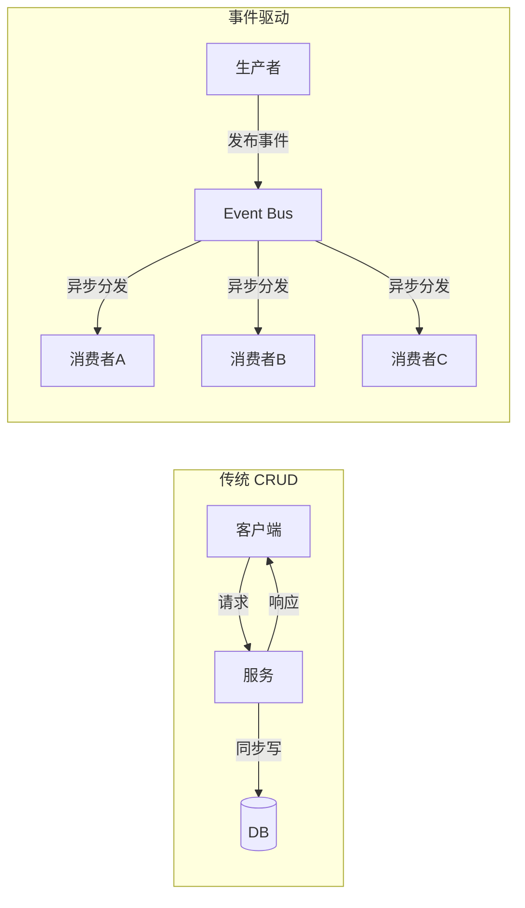
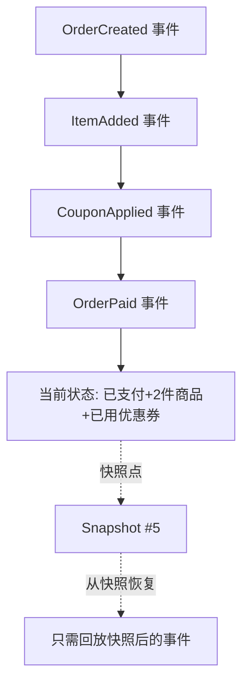
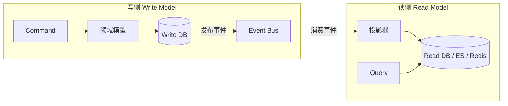
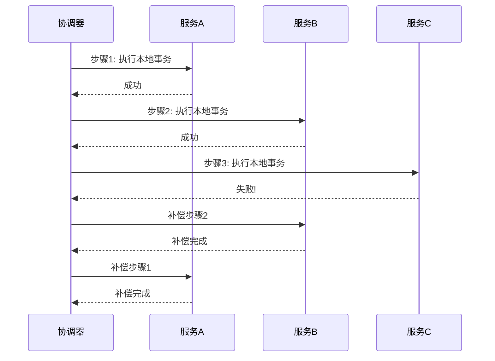
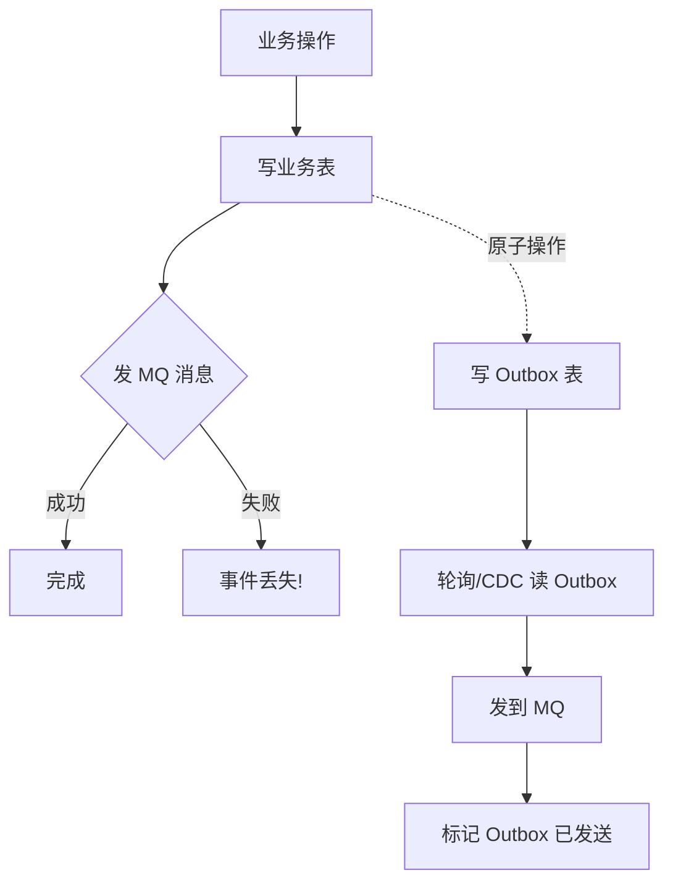
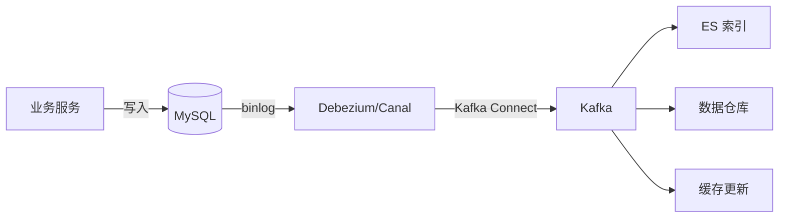

[📖 返回目录](README.md) · [⬅️ 上一章](26-github-repos-books.md) · [➡️ 下一章](28-architecture-patterns.md)

# 27 · 事件驱动架构与 CQRS/Event Sourcing（资深向）

> 适用对象：10+ 年经验的资深工程师 / 架构师候选人。本章覆盖事件驱动架构的完整知识体系：事件溯源（Event Sourcing）原理与存储、CQRS 读写分离架构、Saga 分布式事务编排与协调、Transactional Outbox 可靠事件发布、变更数据捕获（CDC）与 Kafka 集成、以及事件驱动架构的陷阱与权衡。面试落点：不背定义，能讲清「什么场景用事件溯源」「CQRS 的读写延迟怎么处理」「Saga 补偿失败怎么办」「Outbox 和 CDC 怎么选」。

**TL;DR 本章学习要点**

1. 事件驱动架构（EDA）的核心是「状态变更以事件形式传播」，与传统 CRUD 的「请求-响应」模式本质不同——EDA 天然支持解耦、审计、回溯，但引入了最终一致性和复杂度；
2. Event Sourcing 不是「存结果」而是「存过程」——每次状态变更追加一条事件记录，当前状态 = 事件回放的结果；优势是完整审计轨迹和时间旅行，代价是事件 schema 演进和快照管理；
3. CQRS 把「读」和「写」拆成独立模型——写侧用领域模型保证业务规则，读侧用扁平化视图优化查询；核心权衡是读写延迟（eventual consistency）和系统复杂度翻倍；
4. Saga 是长事务的解决方案：编排式（Choreography，事件驱动，去中心化）vs 协调式（Orchestration，中心协调器）；编排适合简单流程，协调适合复杂流程但引入单点；
5. Outbox 模式解决「写 DB 和发消息不是原子操作」的问题：先写事件到 Outbox 表，再轮询或 CDC 发到 MQ；CDC（Debezium/Canal）是更优解——不侵入业务代码，延迟更低。

---

### 📑 本章目录

- [1. 事件驱动架构概述](#1-事件驱动架构概述)
- [2. Event Sourcing 事件溯源](#2-event-sourcing-事件溯源)
- [3. CQRS 读写分离架构](#3-cqrs-读写分离架构)
- [4. Saga 分布式事务](#4-saga-分布式事务)
- [5. Outbox 模式与可靠事件发布](#5-outbox-模式与可靠事件发布)
- [6. 变更数据捕获 CDC](#6-变更数据捕获-cdc)
- [7. 事件驱动架构的陷阱与权衡](#7-事件驱动架构的陷阱与权衡)
- [考点速查表](#考点速查表)

---

## 1. 事件驱动架构概述

### 1.1 什么是事件驱动架构

事件驱动架构（Event-Driven Architecture, EDA）是一种**以事件的产生、检测、消费和响应为核心**的软件架构模式。与传统 CRUD 的「请求-响应」模式不同，EDA 中组件通过异步事件进行通信。



> 图示：传统 CRUD 与事件驱动架构对比

**事件的两种语义区分**（面试高频）：

| 类型 | 定义 | 示例 | 能否驱动状态变更 |
|---|---|---|---|
| Domain Event（领域事件） | 业务领域中发生的有意义的事实 | OrderCreated、PaymentReceived | ❌ 它本身就是状态变更的结果 |
| Command（命令） | 请求接收方执行某个操作 | CreateOrder、ProcessPayment | ✅ 接收方根据命令改变状态 |

### 1.2 事件驱动的四种模式

| 模式 | 通信方式 | 耦合度 | 适用场景 |
|---|---|---|---|
| 事件通知（Event Notification） | 生产者发事件，消费者自行处理 | 低 | 跨服务解耦、审计日志 |
| 事件携带状态传输（Event-Carried State Transfer） | 事件携带完整数据副本 | 低 | 读模型构建、数据同步 |
| 事件溯源（Event Sourcing） | 状态由事件序列推导 | 中 | 审计严格、金融/交易系统 |
| CQRS + ES | 读写分离 + 事件溯源 | 高 | 复杂业务 + 高查询性能要求 |

### 1.3 事件驱动 vs 传统 CRUD：架构决策矩阵

| 维度 | 传统 CRUD | 事件驱动 |
|---|---|---|
| 一致性 | 强一致（ACID） | 最终一致（BASE） |
| 响应时间 | 同步，RT = 所有下游耗时之和 | 异步，RT ≈ 仅写主库 |
| 耦合度 | 服务间直接调用，强依赖 | 通过事件总线解耦 |
| 可审计性 | 需额外设计（审计表） | 天然完整审计轨迹 |
| 可回溯性 | 需 binlog/审计日志 | Event Sourcing 天然支持 |
| 复杂度 | 低 | 高（事件 schema、最终一致、补偿） |
| 扩展性 | 受限于同步链路 | 消费者可独立水平扩展 |

**面试升华**：选 EDA 不是「技术先进」，而是业务驱动——当你需要「解耦跨服务调用」「完整审计轨迹」「异步化提升响应时间」「事件回溯排查问题」时，EDA 才有价值。如果只是简单 CRUD，别为了用而用。

> **Q1：事件驱动架构最大的挑战是什么？**
>
> **答**：三个核心挑战——（1）**最终一致性**：事件从生产到消费有延迟，消费者看到的数据可能不是最新的，需要设计「读己之写」（read-your-writes）或「因果一致性」方案；（2）**事件 schema 演进**：事件一旦发布就是契约，消费者依赖旧 schema，新版本必须向后兼容（Avro/Protobuf 的 schema registry 是解法）；（3）**调试困难**：异步事件链路难以追踪，需要分布式追踪（OpenTelemetry）+ 事件溯源日志来还原完整调用链。
>
> **追问：你怎么处理事件消费者的失败重试？**
>
> 指数退避重试 + 死信队列（DLQ）。消费者消费失败后进入重试队列（3-5 次，间隔指数增长），超过最大重试次数进入 DLQ。DLQ 需要人工介入或告警。关键是**消费者必须幂等**——同一条事件可能被投递多次（at-least-once 语义），用事件 ID + 唯一索引去重。

> **Q2：什么时候不该用事件驱动架构？**
>
> **答**：三种场景——（1）**需要强一致性的事务**：如银行转账，不能接受「A 扣款成功但 B 还没收到」的中间状态；（2）**简单 CRUD 系统**：引入事件总线、最终一致、补偿机制的复杂度远超收益；（3）**实时性要求极高**：如股票交易的行情推送，事件总线的异步延迟不可接受。选型原则：**业务驱动，不为技术而技术**。

---

## 2. Event Sourcing 事件溯源

### 2.1 核心原理

Event Sourcing 的核心思想：**不存储实体的当前状态，而是存储导致状态变更的所有事件序列**。当前状态 = 对所有历史事件依次回放（replay）的结果。



> 图示：Event Sourcing 状态推导与快照机制

**关键概念**：

| 概念 | 说明 |
|---|---|
| Event（事件） | 不可变的事实记录，包含 who/what/when，一旦写入不可修改 |
| Aggregate（聚合） | 事件溯源的基本单元，一个聚合的所有事件存储在一个 stream 中 |
| Stream（流） | 某个聚合实例的事件序列，如 `order-12345` |
| Snapshot（快照） | 定期保存聚合的当前状态，避免每次从头回放所有事件 |
| Projection（投影） | 从事件流派生出的读模型，如「订单列表视图」「统计报表」 |

### 2.2 事件存储设计

**事件存储的核心要求**：

1. **追加写入（Append-Only）**：事件不可修改、不可删除，只能追加
2. **乐观并发控制**：通过事件版本号（expected version）防止并发写入冲突
3. **事件查询**：按聚合 ID 查询事件流，支持快照跳过

**存储选型对比**：

| 方案 | 优点 | 缺点 | 适用 |
|---|---|---|---|
| 关系型 DB（PostgreSQL） | 成熟、事务支持、JSON 列存事件 | 查询性能一般、大事件流慢 | 中小规模、已有 PG 基础设施 |
| KurrentDB（原 EventStoreDB） | 专为 ES 设计、内置投影、Catch-up Subscription（v26.1.2） | 学习成本、社区较小 | 大规模 ES 系统 |
| Kafka | 高吞吐、天然 append-only、保留策略灵活 | 不支持按聚合 ID 随机读、无原生快照 | 事件中转/分发层 |
| MongoDB | 灵活 schema、分片支持 | 无原生事件语义 | 快速原型 |

**Java 生态**：Axon Framework v5.3.1 是最成熟的事件溯源框架（AF4 已 EOL），AF5 引入 Async-Native API 和 Dynamic Consistency Boundary，提供 Aggregate、Event Store、Projection、Saga 全套抽象。Spring Boot 3.x/4.x 原生支持 Axon。

### 2.3 事件 Schema 演进

事件一旦发布就是契约，消费者可能长期依赖旧 schema。演进策略：

| 策略 | 做法 | 适用 |
|---|---|---|
| 向后兼容扩展 | 只新增字段，不删不改旧字段，新字段给默认值 | 大多数场景 |
| Upcaster（转换器） | 读取旧版本事件时，转换为最新版本 | 跨多版本兼容 |
| 多版本事件 | 保留 `OrderCreatedV1`、`OrderCreatedV2` 等多版本 | 大版本变更 |

> **Q3：Event Sourcing 的快照策略怎么定？**
>
> **答**：快照频率 = 回放性能要求 / 事件大小。常见策略：（1）**按事件数**：每 100-500 个事件生成一次快照（Axon 默认 100）；（2）**按时间**：每小时/每天生成一次；（3）**按需**：当回放时间超过阈值（如 100ms）时触发。快照本身也是事件（`SnapshotEvent`），存储在独立流中。恢复时：加载最近快照 → 只回放快照后的事件。**权衡**：快照越频繁，恢复越快，但存储和写入开销越大。
>
> **追问：快照和事件流不一致怎么办？**
>
> 快照只是性能优化，不一致时从事件流重新回放即可。关键是**快照不能作为唯一数据源**——事件流才是真相。如果快照损坏或过期，删除快照重新从头回放，系统仍能恢复到正确状态。

> **Q4：Event Sourcing 中，如何处理「删除」操作？**
>
> **答**：事件溯源中没有删除——事件是不可变的事实。处理「软删除」的常见做法：（1）追加一个 `EntityDeleted` 事件，投影忽略已删除实体；（2）追加 `EntityArchived` 事件，将其从活跃视图中移除。**硬删除在事件溯源中是反模式**——它破坏了完整审计轨迹。如果法规要求删除（如 GDPR），需要加密擦除密钥使事件不可解密，而非物理删除。

---

## 3. CQRS 读写分离架构

### 3.1 核心原理

CQRS（Command Query Responsibility Segregation）把系统的「写操作」（Command）和「读操作」（Query）拆分为两个独立的模型：



> 图示：CQRS 读写分离架构

**写侧**：使用丰富的领域模型（DDD Aggregate），保证业务规则和不变量。写入后发布领域事件。

**读侧**：消费事件，构建针对特定查询优化的扁平化视图（Projection）。读模型可以是关系表、Elasticsearch 索引、Redis 缓存等。

### 3.2 CQRS 的三种实现级别

| 级别 | 做法 | 复杂度 | 适用 |
|---|---|---|---|
| 同库不同表 | 写表和读表在同一数据库，通过触发器/视图同步 | 低 | 读写性能差异不大 |
| 不同数据库 | 写用 MySQL，读用 ES/Redis，事件同步 | 中 | 读写性能需求差异大 |
| 完全分离 | 写侧和读侧独立部署、独立扩缩容 | 高 | 超大规模系统（如电商大促） |

### 3.3 读写延迟处理

CQRS 最大的痛点是**读写延迟**——写入后读模型可能还没更新，用户看到旧数据。

| 方案 | 原理 | 延迟 | 适用 |
|---|---|---|---|
| 同步投影 | 写入事务中同步更新读模型 | 0 | 简单场景，但丧失异步优势 |
| 读己之写（Read-Your-Writes） | 写入后客户端携带版本号，读侧检查版本 | 秒级 | 用户操作后立即查看结果 |
| 等待事件传播 | 写入后等待事件被消费再返回 | 秒级 | 非交互式场景 |
| 版本向量 | 客户端记录最新版本，读侧保证返回至少该版本 | 秒级 | 多端同步 |

> **Q5：CQRS 一定需要 Event Sourcing 吗？**
>
> **答**：**不一定**。CQRS 和 ES 是独立的模式，可以单独使用。常见组合：（1）**CQRS without ES**：写侧用传统 CRUD，读侧用 ES/Redis，通过 CDC 同步——这是最常见的生产实践；（2）**ES without CQRS**：事件溯源但不分离读写模型——适合简单查询场景；（3）**CQRS + ES**：两者结合——适合复杂业务 + 高查询性能要求。**大多数系统只需要 CQRS without ES**，别过度设计。
>
> **追问：CQRS 的读写延迟用户能接受吗？**
>
> 取决于场景。社交 Feed 流延迟几秒用户无感知；但「下单后立即看到订单状态」延迟 5 秒就不可接受。解法：（1）写入成功后直接返回写模型数据（不走读模型）；（2）客户端轮询或 WebSocket 推送读模型更新；（3）关键路径用同步投影，非关键路径用异步。

---

## 4. Saga 分布式事务

### 4.1 为什么需要 Saga

传统 2PC 在微服务场景下有致命缺陷：资源锁定时间长、性能差、单点故障。Saga 把一个长事务拆成一系列**本地事务 + 补偿操作**：每个步骤执行本地事务后发布事件触发下一步，失败时执行已完成步骤的补偿操作。



> 图示：Saga 协调式事务的执行与补偿流程

### 4.2 编排式 vs 协调式 Saga

| 维度 | 编排式（Choreography） | 协调式（Orchestration） |
|---|---|---|
| 控制流 | 无中心，服务间通过事件驱动 | 中心协调器（Orchestrator）指挥 |
| 耦合度 | 低（只依赖事件） | 中（依赖协调器） |
| 可理解性 | 简单流程清晰，复杂流程难追踪 | 流程集中，易于理解和调试 |
| 单点故障 | 无 | 协调器是单点（需高可用） |
| 适用 | 3-5 步简单流程 | 复杂流程、多服务协作 |

**选型决策**：步骤 ≤5 且流程简单 → 编排式；步骤 >5 或有复杂分支/补偿逻辑 → 协调式。

### 4.3 Saga 的三大经典问题

| 问题 | 描述 | 解法 |
|---|---|---|
| 空回滚 | 服务未收到请求就收到了补偿命令 | 补偿操作检查「是否执行过正向操作」，未执行则跳过 |
| 悬挂（Hanging） | 正向请求迟到，补偿已执行，正向操作无人补偿 | 补偿操作设置「事务屏障」，正向操作检查是否已被补偿 |
| 幂等 | 补偿/正向操作可能重复执行 | 用 saga-id + step-id 做去重 |

> **Q6：Saga 和 TCC 有什么区别？**
>
> **答**：两者都是分布式事务方案，核心区别在「资源预留」：（1）**TCC** 在 Try 阶段预留资源（冻结库存/余额），Confirm 确认，Cancel 释放——**强一致**但侵入性强，每个操作都要实现三个接口；（2）**Saga** 不预留资源，直接执行本地事务，失败时通过补偿操作回滚——**最终一致**，侵入性低但补偿逻辑复杂。选型：资金/库存等强一致场景用 TCC；长流程/跨服务编排用 Saga。
>
> **追问：Saga 补偿失败了怎么办？**
>
> 补偿操作本身必须设计为**可重试 + 幂等**。如果补偿持续失败：（1）进入重试队列（指数退避）；（2）超过最大重试次数进入人工介入队列（需要运维/SRE 处理）；（3）记录完整的 saga 执行日志，方便人工排查和修复。**生产建议**：补偿操作尽量设计为「一定能成功」的幂等操作（如更新状态为已取消），避免依赖外部服务调用。

---

## 5. Outbox 模式与可靠事件发布

### 5.1 问题：写 DB 和发消息不是原子操作

在事件驱动架构中，服务写入 DB 后需要发布事件到 MQ。但「写 DB」和「发 MQ」是两个独立操作，可能：

- DB 写成功，MQ 发送失败 → 事件丢失
- MQ 发送成功，DB 写入失败 → 消息孤儿



> 图示：Transactional Outbox 模式

### 5.2 Transactional Outbox 模式

核心思想：**在同一个数据库事务中，既写业务表，又写 Outbox 表**。然后通过轮询或 CDC 读取 Outbox 表，将事件发送到 MQ。

| 方式 | 原理 | 延迟 | 侵入性 |
|---|---|---|---|
| 轮询（Polling） | 定时任务扫描 Outbox 表未发送的事件 | 秒级（取决于轮询间隔） | 低 |
| CDC（Debezium/Canal） | 监听 Outbox 表的 binlog 变更 | 毫秒级 | 无（不侵入业务代码） |

**Outbox 表设计**：

```sql
CREATE TABLE outbox_events (
    id BIGINT PRIMARY KEY AUTO_INCREMENT,
    aggregate_type VARCHAR(255) NOT NULL,
    aggregate_id VARCHAR(255) NOT NULL,
    event_type VARCHAR(255) NOT NULL,
    payload JSON NOT NULL,
    created_at TIMESTAMP DEFAULT NOW(),
    published BOOLEAN DEFAULT FALSE,
    INDEX idx_unpublished (published, created_at)
);
```

### 5.3 Outbox vs CDC 直接发布

| 维度 | Outbox + 轮询 | Outbox + CDC | CDC 直接监听业务表 |
|---|---|---|---|
| 延迟 | 秒级 | 毫秒级 | 毫秒级 |
| 侵入性 | 低（加表） | 低（加表） | 极低（监听 binlog） |
| 可靠性 | 高 | 高 | 中（binlog 保留期有限） |
| 事件完整性 | 完整（显式定义事件） | 完整 | 可能丢失中间状态 |
| 适用 | 简单场景 | 生产首选 | 只读同步/CQRS 读模型 |

> **Q7：Outbox 模式和 CDC 直接监听 binlog 有什么区别？**
>
> **答**：核心区别在「事件定义权」：（1）**Outbox**：业务代码显式定义「发什么事件、包含什么数据」——事件是业务语义的，如 `OrderCreated`；（2）**CDC 直接监听**：从 binlog 变更推导事件——事件是数据变更语义的，如 `order_table INSERT`。Outbox 更灵活、更可靠（事务保证），但需要额外的表和轮询/CDC。**生产建议**：新系统用 Outbox + CDC；已有系统改造用 CDC 直接监听（成本低）。

---

## 6. 变更数据捕获 CDC

### 6.1 CDC 原理

CDC（Change Data Capture）通过监听数据库的变更日志（binlog/WAL），捕获数据变更并实时传播到下游系统。



> 图示：CDC + Kafka 数据同步架构

### 6.2 Debezium vs Canal 对比

| 维度 | Debezium | Canal（阿里） |
|---|---|---|
| 架构 | Kafka Connect Connector（v3.6，2026-08） | 独立 Server + Client |
| 数据库支持 | MySQL 9.x/PostgreSQL 18/MongoDB 8.0 等 | MySQL 为主 |
| 部署方式 | Connect 集群（需 Kafka） | 独立部署，支持 HA |
| 事件格式 | Kafka Connect SourceRecord | 自定义 JSON/Protobuf |
| 社区 | CNCF 项目，全球活跃 | 国内活跃，阿里生态 |
| 适用 | 已有 Kafka Connect 基础设施 | 国内 MySQL 生态，轻量级 |

### 6.3 CDC 工程实践要点

1. **事件有序性**：同一行数据的变更必须有序——Debezium 按 partition（默认按表主键）保证分区内有序
2. **事件丢失防护**：binlog 有保留期（MySQL 默认 7 天），消费者停机超期会丢事件——需要监控消费延迟
3. **Schema 变更处理**：表加字段/改字段时，Debezium 会发送 schema 变更事件，消费者需要处理
4. **大事务处理**：一个事务包含 10 万行更新，会产生 10 万条事件——需要拆分或批处理

> **Q8：CDC 在事件驱动架构中的定位是什么？**
>
> **答**：CDC 是**事件发布的基础设施层**，解决「业务代码不感知事件发布」的问题。典型架构：业务服务只管写 DB → CDC 监听 binlog → 自动发布事件到 Kafka → 下游消费者处理。优势：（1）业务代码零侵入；（2）不丢事件（binlog 是 DB 的完整变更记录）；（3）天然支持异构系统同步（MySQL → ES/Redis/数据仓库）。**局限**：事件语义是数据变更级而非业务语义级——如果需要「OrderCreated」这样有业务含义的事件，建议用 Outbox 模式。

---

## 7. 事件驱动架构的陷阱与权衡

### 7.1 常见陷阱

| 陷阱 | 描述 | 解法 |
|---|---|---|
| 事件风暴 | 大量事件导致消费者处理不过来 | 事件限流、消费者水平扩展、事件过滤 |
| 事件循环 | A 发事件给 B，B 处理后发事件给 A | 消费者检查事件来源，避免循环触发 |
| 隐式依赖 | 服务间通过事件隐式耦合，难以发现 | 维护事件目录（Event Catalog），记录生产者-消费者关系 |
| 调试困难 | 异步事件链路难以追踪 | 分布式追踪 + 事件关联 ID + 集中日志 |
| 最终一致陷阱 | 业务假设强一致但实际最终一致 | 明确一致性级别，设计「读己之写」方案 |

### 7.2 架构决策清单

在决定是否采用事件驱动架构前，回答以下问题：

1. 需要跨服务解耦吗？还是单体内部通信？
2. 能接受最终一致性吗？还是必须强一致？
3. 有完整的审计/回溯需求吗？
4. 系统规模是否值得引入 EDA 的复杂度？
5. 团队有事件驱动的工程经验吗？

**如果 3 个以上回答「否」，不建议用 EDA。**

### 7.3 事件驱动架构全景图

| 场景 | 推荐方案 | 理由 |
|---|---|---|
| 简单微服务间解耦 | 事件通知 + MQ | 够用，不过度设计 |
| CQRS 读模型构建 | CDC + Kafka + ES | 低侵入，高可靠 |
| 金融/交易审计 | Event Sourcing + CQRS | 完整审计轨迹，可回溯 |
| 复杂长流程 | Saga 协调式 + 事件驱动 | 流程清晰，补偿可控 |
| 数据同步（MySQL→ES） | CDC（Debezium/Canal） | 实时、可靠、零侵入 |

> **Q9：事件驱动架构如何保证消息不丢？**
>
> **答**：三层保障——（1）**生产端**：Outbox 模式保证 DB 写入和事件发布原子性；（2）**传输端**：Kafka 的 acks=all + replication factor ≥3；（3）**消费端**：手动提交 offset + 消费失败重试 + DLQ。关键是**端到端语义是 at-least-once**——消费者必须幂等。如果业务需要 exactly-once，用事务性消息（Kafka Transactions）+ 消费者幂等。
>
> **追问：Kafka 的 exactly-once 是怎么实现的？**
>
> Kafka 的 exactly-once 语义（EOS）依赖两个机制：（1）**幂等生产者**：Producer 分配 PID + sequence number，Broker 去重（同 PID + 同 partition 去重）；（2）**事务 API**：`initTransactions()` → `beginTransaction()` → `send()` → `commitTransaction()`，保证跨分区原子写入。注意：EOS 只在 Kafka 生产者到消费者之间有效，不延伸到外部系统（如 DB 写入）。

> **Q10：Event Sourcing 的事件量很大时，怎么优化查询性能？**
>
> **答**：三种策略——（1）**快照（Snapshot）**：定期保存聚合当前状态，查询时从快照恢复而非回放所有事件；（2）**投影（Projection）**：构建针对查询优化的读模型（如 MySQL 表/ES 索引），查询走读模型而非事件流；（3）**事件归档**：将历史事件迁移到冷存储（如 S3/OSS），保留近期热数据在 EventStore。**生产实践**：快照 + 投影是标配，事件归档在事件量超过千万级时考虑。

---

> **Q11：编排式 Saga 中，如果某个服务的事件丢失了怎么办？**
>
> **答**：事件丢失会导致 Saga 卡在某个步骤。防护措施：（1）**消息持久化**：用 Kafka/RocketMQ 等持久化 MQ，不丢失事件；（2）**超时检测**：协调器/上游服务设置超时，超时未收到确认事件则重发；（3）**Saga 日志**：记录每个步骤的执行状态，定期扫描卡住的 Saga 进行恢复；（4）**人工介入**：DLQ + 监控告警，确保丢失事件能被发现和处理。

> **Q12：CQRS 中，读模型的数据过期了怎么处理？**
>
> **答**：读模型过期 = 事件还没同步到读侧。处理方案：（1）**版本检查**：写入后返回事件版本号，客户端读取时携带版本号，读侧保证返回至少该版本（read-your-writes）；（2）**强制刷新**：关键操作后主动触发读模型刷新（如同步投影）；（3）**降级方案**：读模型不可用时降级到写模型查询（性能差但数据准确）。**架构建议**：关键业务路径用同步投影，非关键路径用异步。

> **Q13：Event Sourcing 中，事件的顺序能保证吗？**
>
> **答**：单个聚合内**必须保证顺序**（通过 expected version 乐观锁）；跨聚合**不保证顺序**（也不应该依赖）。如果业务需要跨聚合顺序（如「订单创建后才能支付」），这不是事件顺序问题，而是业务流程编排问题——用 Saga 协调或业务层校验。Kafka 同一 partition 内有序，跨 partition 无序。

> **Q14：Outbox 模式的性能瓶颈在哪？**
>
> **答**：两个瓶颈——（1）**写放大**：每次业务写入多写一条 Outbox 记录，DB 写入量翻倍；（2）**轮询开销**：轮询方式定时扫表，高并发下表膨胀快、索引维护成本高。优化：（1）用 CDC 替代轮询（Debezium 监听 Outbox 表 binlog）；（2）批量写入多条事件到一条 Outbox 记录（JSON 数组）；（3）Outbox 表定期归档清理已发送事件。

> **Q15：事件驱动架构中，如何做端到端的链路追踪？**
>
> **答**：三层追踪——（1）**Trace ID 贯穿**：事件创建时生成 Trace ID，写入事件 metadata，消费者继承；（2）**Span 记录**：每个服务处理事件时创建 Span，记录处理时间、状态；（3）**集中展示**：Jaeger/Zipkin/SkyWalking 展示完整调用链。**难点**：异步事件链路中，消费者可能在很久之后才处理事件，Trace 的父子关系会断裂——用 Correlation ID（事件 ID）关联，而非依赖 Trace 的时间窗口。

---

## 考点速查表

| 考点 | 一句话要点 |
|---|---|
| 事件驱动 vs CRUD | EDA 异步解耦+最终一致，CRUD 同步简单+强一致 |
| Event Sourcing | 状态=事件回放，追加写入，不可变，完整审计轨迹 |
| CQRS | 读写分离，写侧领域模型，读侧扁平化视图 |
| CQRS 不一定需要 ES | 大多数场景 CQRS without ES（CDC+ES/Redis）够用 |
| Saga 编排 vs 协调 | 编排=事件驱动去中心化（简单），协调=中心指挥器（复杂可控） |
| Saga 空回滚/悬挂/幂等 | 补偿查正向是否执行、事务屏障、saga-id 去重 |
| Saga vs TCC | TCC 预留资源强一致，Saga 补偿回滚最终一致 |
| Outbox 模式 | 同一事务写业务表+Outbox 表，轮询/CDC 发到 MQ |
| CDC | 监听 binlog 捕获变更，Debezium（Kafka 生态）vs Canal（阿里） |
| Outbox vs CDC | Outbox 业务语义事件，CDC 数据变更语义，新系统推荐 Outbox+CDC |
| 事件 Schema 演进 | 只增不删+Upcaster 转换，不可变契约 |
| 快照策略 | 按事件数/时间/性能阈值触发，快照不是数据源 |
| 消费者幂等 | at-least-once + 事件 ID 唯一索引去重 |
| Kafka EOS | 幂等生产者 + 事务 API，仅 Kafka 内部端到端 |
| 事件驱动选型 | 解耦+审计+异步化需求驱动，简单 CRUD 不用 EDA |
| Saga 补偿失败 | 重试+幂等+人工介入队列 |
| CQRS 读写延迟 | read-your-writes 版本检查、同步/异步投影权衡 |
| CDC 事件有序性 | 分区内有序（按主键），跨分区内无序 |
| Outbox 性能优化 | CDC 替代轮询、批量写入、定期归档 |
| 链路追踪 | Correlation ID 关联异步事件链路 |
