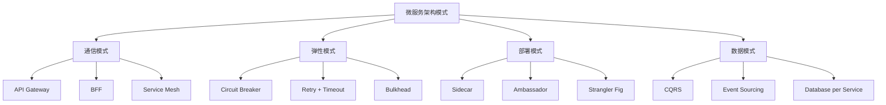
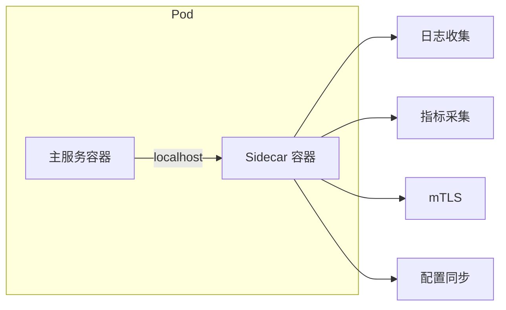
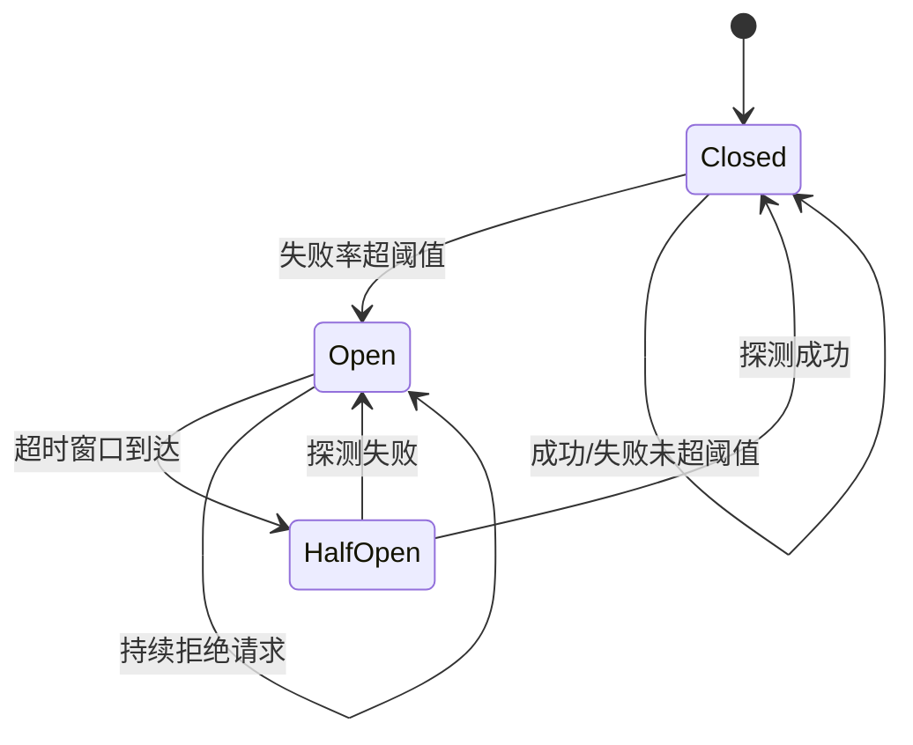
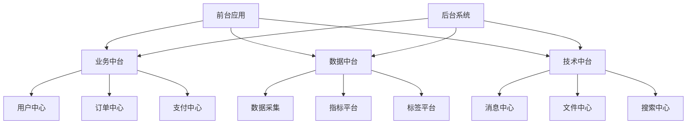
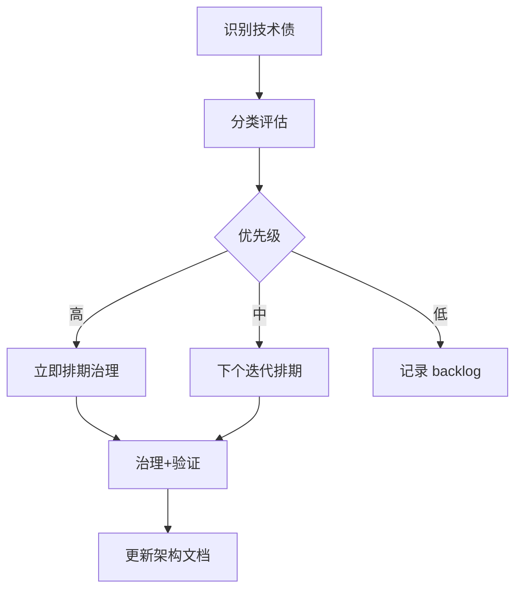

[📖 返回目录](README.md) · [⬅️ 上一章](27-event-driven-cqrs.md) · [➡️ 下一章](29-observability-sre.md)

# 28 · 架构模式与架构决策（资深向）

> 适用对象：10+ 年经验的资深工程师 / 架构师候选人。本章覆盖微服务架构模式全景（BFF、Sidecar、Strangler Fig、Ambassador、Circuit Breaker、API Gateway、Service Mesh）、中台架构（业务/数据/技术中台 + 争议）、Serverless/FaaS 架构、ADR 架构决策框架、架构适应度函数、技术债管理、架构评审方法论。面试落点：不背模式名字，能讲清「什么场景用什么模式」「中台到底值不值」「架构决策怎么记录和复盘」。

**TL;DR 本章学习要点**

1. 微服务架构模式是一套「预制件」——BFF 解决多端适配、Sidecar 解决横切关注点、Strangler Fig 解决渐进式迁移、Circuit Breaker 解决级联故障；架构师的核心能力是「按场景选模式组合」；
2. 中台不是银弹——业务中台的核心是「可复用的领域服务」，数据中台是「统一数据资产」，但中台建设有高昂的组织和技术成本，「中台化」不等于「什么都做中台」；
3. Serverless（FaaS + BaaS）是「极致弹性」的架构选择——按调用付费、自动扩缩容，但有冷启动延迟、vendor lock-in、调试困难等代价；
4. ADR（Architecture Decision Record）是架构决策的「存档」——记录「为什么这么选」而非「选了什么」，让后来者能理解历史上下文；
5. 技术债不是「烂代码」的代名词——它分为四种（急需/慎重/无感/有益），管理策略是「识别→分类→排期→治理」。

---

### 📑 本章目录

- [1. 微服务架构模式全景](#1-微服务架构模式全景)
- [2. 中台架构](#2-中台架构)
- [3. Serverless / FaaS 架构](#3-serverless--faas-架构)
- [4. 架构决策框架 ADR](#4-架构决策框架-adr)
- [5. 架构适应度函数](#5-架构适应度函数)
- [6. 技术债管理](#6-技术债管理)
- [7. 架构评审方法论](#7-架构评审方法论)
- [考点速查表](#考点速查表)

---

## 1. 微服务架构模式全景

### 1.1 模式分类总览



> 图示：微服务架构模式全景分类

### 1.2 通信与路由模式

**API Gateway 模式**：所有外部请求统一经过 Gateway，负责路由、认证、限流、协议转换。

| 功能 | 说明 |
|---|---|
| 路由 | 按 URL/Host/Header 路由到后端服务 |
| 认证 | JWT/OAuth2 验证，下游服务无需重复实现 |
| 限流 | 网关层统一限流，保护后端 |
| 协议转换 | 外部 HTTP → 内部 gRPC/Thrift |
| 聚合 | 将多个内部服务的响应聚合后返回（BFF 的子集） |

**BFF（Backend for Frontend）**：为每种前端（Web/App/小程序）创建专用的后端服务。

| 维度 | API Gateway | BFF |
|---|---|---|
| 定位 | 通用网关，处理横切关注点 | 专用网关，处理前端特定需求 |
| 聚合逻辑 | 无或简单 | BFF 内聚合多服务数据 |
| 团队 | 平台团队维护 | 前端团队维护 |
| 适用 | 统一入口 | 多端差异化需求 |

**Sidecar 模式**：将横切关注点（日志、监控、安全、配置）部署为与主服务同生命周期的辅助容器。



> 图示：Sidecar 模式的典型部署

**Strangler Fig（绞杀者模式）**：渐进式迁移策略——新功能用新架构，旧功能逐步从旧系统「绞杀」到新系统，直到旧系统完全退役。

**实施步骤**：
1. 在旧系统前放置一个代理层（Gateway/反向代理）
2. 新功能开发在新系统中
3. 逐步将旧功能从旧系统迁移到新系统
4. 每迁移一个功能，验证新系统正确性
5. 全部迁移完成后，下线旧系统

### 1.3 弹性模式

**Circuit Breaker（断路器）**：防止级联故障。



> 图示：断路器三态状态机

| 状态 | 行为 | 转换条件 |
|---|---|---|
| Closed | 正常转发请求 | 失败率 > 阈值 → Open |
| Open | 直接拒绝请求，快速失败 | 超时窗口到达 → HalfOpen |
| HalfOpen | 放行少量请求探测 | 成功 → Closed；失败 → Open |

**Bulkhead（舱壁隔离）**：将资源池隔离，防止一个服务的故障耗尽整个系统的资源。

| 隔离方式 | 原理 | 优缺点 |
|---|---|---|
| 线程池隔离 | 每个下游服务独立线程池 | 隔离彻底，但线程池开销大 |
| 信号量隔离 | 限制并发请求数（计数器） | 轻量，但无法设置超时 |
| 进程隔离 | 每个服务独立进程 | 隔离最彻底，但资源浪费 |

### 1.4 部署模式

**Ambassador 模式**：Sidecar 的变体，专门负责代理网络通信（如服务发现、负载均衡、重试）。Service Mesh 的 Envoy 就是典型的 Ambassador。

**Service Mesh**：将网络通信层从应用代码中抽离，下沉到基础设施层。

| 维度 | 传统微服务 | Service Mesh |
|---|---|---|
| 服务发现 | 客户端 SDK（Eureka/Nacos） | Sidecar 代理（Envoy） |
| 负载均衡 | 客户端负载均衡 | Sidecar 代理负载均衡 |
| 熔断限流 | 业务代码中（Hystrix/Sentinel） | Sidecar 代理层 |
| mTLS | 业务代码实现 | Sidecar 自动处理 |
| 可观测性 | 需手动埋点 | Sidecar 自动采集 |

> **Q1：BFF 和 API Gateway 有什么区别？什么时候用 BFF？**
>
> **答**：API Gateway 是通用网关，处理路由、认证、限流等横切关注点；BFF 是为特定前端定制的后端服务，处理数据聚合和格式转换。**用 BFF 的信号**：（1）多端需求差异大（App 需要精简数据，Web 需要丰富数据）；（2）前端团队需要独立迭代后端接口；（3）聚合逻辑复杂，不适合放在 Gateway。**不用 BFF**：单端系统、聚合逻辑简单。
>
> **追问：BFF 会不会变成新的「上帝服务」？**
>
> 会。BFF 的反模式是「把所有业务逻辑都塞进 BFF」，导致 BFF 成为单点瓶颈。解法：（1）BFF 只做数据聚合和格式转换，不含业务逻辑；（2）每个前端一个 BFF（Web-BFF、App-BFF），避免一个 BFF 服务所有端；（3）BFF 团队与前端团队对齐，由前端驱动。

> **Q2：Strangler Fig 迁移中，如何处理数据一致性？**
>
> **答**：这是迁移最大的挑战。常见方案：（1）**双写期**：新旧系统同时写入同一数据源，验证一致性后切换；（2）**事件同步**：旧系统写入后发事件，新系统消费事件同步数据；（3）**读切换**：先切读到新系统（读副本），验证无误后再切换写。**关键原则**：渐进切换，每一步都可回滚。不要试图「一次性大爆炸迁移」。

---

## 2. 中台架构

### 2.1 中台的定义与分类

中台的核心思想是**将可复用的能力下沉到共享平台**，避免重复建设。

| 中台类型 | 核心能力 | 典型产物 |
|---|---|---|
| 业务中台 | 可复用的业务服务 | 用户中心、订单中心、支付中心、商品中心 |
| 数据中台 | 统一数据资产与分析能力 | 数据湖、指标平台、标签平台、BI 工具 |
| 技术中台 | 通用技术组件 | 消息中心、文件中心、搜索中心、权限中心 |

### 2.2 中台架构图



> 图示：中台架构的三层结构

### 2.3 中台的争议与反思

| 支持观点 | 反对观点 |
|---|---|
| 避免重复建设，降低开发成本 | 建设周期长（1-2年），ROI 不明确 |
| 统一数据口径，打破数据孤岛 | 组织架构不配合，中台团队与业务团队对立 |
| 能力复用，加速新业务上线 | 过度抽象，「为了复用而复用」反而增加复杂度 |
| 技术统一，降低维护成本 | 一个中台故障影响所有前台业务 |

**选型建议**：中台适合**多业务线、规模大、重复建设严重**的企业。中小公司、单一业务线**不建议盲目建中台**——先做好微服务拆分，等规模到了再考虑。

> **Q3：中台和微服务有什么区别？**
>
> **答**：中台是**组织和业务层面**的概念——把可复用的能力集中到共享平台；微服务是**技术层面**的架构风格——把系统拆成独立部署的小服务。中台可以用微服务实现，但微服务不等于中台。核心区别：**中台强调「共享和复用」，微服务强调「独立和自治」**。
>
> **追问：如果公司要建中台，作为架构师你会怎么评估？**
>
> 五个评估维度：（1）**业务复用需求**：是否有 3+ 业务线需要相同能力？（2）**组织架构**：是否有独立的中台团队？（3）**技术成熟度**：团队是否已掌握微服务？（4）**数据统一需求**：是否有多源数据需要统一？（5）**ROI**：中台建设成本 vs 重复建设成本。如果前 3 项都是「否」，建议暂缓。

---

## 3. Serverless / FaaS 架构

### 3.1 核心概念

Serverless = FaaS（Function as a Service）+ BaaS（Backend as a Service）。开发者只写函数，云厂商负责运维、扩缩容、高可用。

| 特性 | 传统部署 | Serverless |
|---|---|---|
| 扩缩容 | 手动/自动（需配置） | 自动（毫秒级） |
| 计费 | 按实例时长 | 按调用次数+执行时间 |
| 冷启动 | 无 | 有（首次调用延迟 100ms-2s） |
| Vendor Lock-in | 低 | 高（各厂商 API 不同） |
| 调试 | 标准工具 | 困难（无状态、临时环境） |
| 适用 | 长时间运行的服务 | 事件驱动、短时任务 |

### 3.2 Java Serverless 生态

| 平台 | 语言支持 | 冷启动优化 | 适用 |
|---|---|---|---|
| AWS Lambda | Java 8/11/17/21 | SnapStart（GraalVM） | 国际 |
| 阿里云函数计算 FC | Java 8/11 | 镜像加速 | 国内 |
| 华为云 FunctionGraph | Java 8/11 | - | 国内 |
| Knative（开源） | 任意 | K8s Pod 复用 | 自建 |

**Java 冷启动问题**：JVM 启动慢 + 类加载多 → 冷启动 1-5 秒。优化：（1）GraalVM Native Image 编译为原生二进制；（2）AWS SnapStart（快照恢复）；（3）Provisioned Concurrency（预热）。

### 3.3 适用场景

| 适合 | 不适合 |
|---|---|
| 事件驱动处理（文件上传后处理、消息消费） | 长时间运行的任务（>15 分钟） |
| API 后端（低频/突发流量） | WebSocket/长连接 |
| 定时任务 | 有状态服务 |
| Webhook 处理 | 需要本地文件系统 |

> **Q4：Serverless 的冷启动怎么优化？**
>
> **答**：四种策略——（1）**GraalVM Native Image**：编译为原生二进制，冷启动 <100ms（但需要适配反射/序列化）；（2）**Provisioned Concurrency**：预热实例常驻，消除冷启动（但失去按需付费优势）；（3）**AWS SnapStart**：快照 JVM 启动状态，恢复时跳过类加载（Java 专用）；（4）**减小部署包**：精简依赖、延迟加载非必要组件。**权衡**：GraalVM 是最优解但迁移成本高；Provisioned Concurrency 最简单但贵。

> **Q5：Serverless 和传统微服务怎么选？**
>
> **答**：决策矩阵——（1）**流量模式**：突发/不可预测 → Serverless；稳定/可预测 → 微服务；（2）**任务时长**：<15 分钟 → Serverless；>15 分钟 → 微服务或容器；（3）**状态**：无状态 → Serverless；有状态 → 微服务；（4）**团队**：小团队/快速迭代 → Serverless；大团队/复杂业务 → 微服务。**混合架构**常见：核心服务用微服务，边缘/事件处理用 Serverless。

---

## 4. 架构决策框架 ADR

### 4.1 什么是 ADR

ADR（Architecture Decision Record）是**记录架构决策的轻量级文档**。核心价值：让后来者能理解「为什么这么选」，而非只看到「选了什么」。

### 4.2 ADR 模板

```markdown
# ADR-{编号}: {决策标题}

## 状态
{提议 | 接受 | 废弃 | 替代 by ADR-xxx}

## 背景
{为什么需要做这个决策？面临什么问题？}

## 决策
{我们决定……}

## 理由
{为什么选这个方案？考虑了哪些备选方案？}

## 备选方案
| 方案 | 优点 | 缺点 |
|---|---|---|
| A | ... | ... |
| B | ... | ... |

## 影响
{这个决策对团队/系统/流程的影响}

## 后续
{需要跟进的事项}
```

### 4.3 ADR vs RFC vs 设计文档

| 文档类型 | 焦点 | 时效 | 适用 |
|---|---|---|---|
| ADR | 单个架构决策的「为什么」 | 长期存档 | 技术选型、架构方向 |
| RFC | 提案的完整技术方案 | 评审后归档 | 大型功能/架构变更 |
| 设计文档 | 实现细节 | 随代码迭代 | 具体模块/功能设计 |

> **Q6：ADR 应该什么时候写？**
>
> **答**：三个时机——（1）**做重大技术选型时**：选 MySQL 还是 PostgreSQL、选 Kafka 还是 RocketMQ；（2）**架构方向变更时**：从单体迁微服务、引入 Service Mesh；（3）**事后补录**：已经做了决策但没记录——趁记忆清晰补一个，未来团队能理解上下文。**ADR 不需要长篇大论**——一页纸说清楚「背景→决策→理由→影响」就够了。

---

## 5. 架构适应度函数

### 5.1 概念

架构适应度函数（Architecture Fitness Function）是**自动化验证架构约束的测试**。它确保系统的架构特性（性能、安全、依赖方向等）在演进过程中不被破坏。

| 类型 | 示例 | 工具 |
|---|---|---|
| 依赖方向 | 不允许 domain 层依赖 infrastructure 层 | ArchUnit（Java） |
| 性能 | P99 延迟 <200ms | JMH、 Gatling |
| 安全 | 没有明文密码、没有高危依赖 | SpotBugs、OWASP Dependency Check |
| 代码质量 | 圈复杂度 <10、重复率 <5% | SonarQube |
| 架构合规 | 每个服务不超过 N 个数据库表 | 自定义脚本 |

### 5.2 ArchUnit 实践（Java）

```java
// ArchUnit 示例：分层架构约束
@AnalyzeClasses(packages = "com.example")
public class ArchitectureTest {

    @ArchTest
    static final ArchRule layerRule = layeredArchitecture()
        .consideringAllDependencies()
        .layer("Controller").definedBy("..controller..")
        .layer("Service").definedBy("..service..")
        .layer("Repository").definedBy("..repository..")
        .whereLayer("Controller").mayNotBeAccessedByAnyLayer()
        .whereLayer("Service").mayOnlyBeAccessedByLayers("Controller")
        .whereLayer("Repository").mayOnlyBeAccessedByLayers("Service");
}
```

> **Q7：架构适应度函数和单元测试有什么区别？**
>
> **答**：单元测试验证「功能正确性」，适应度函数验证「架构约束」。例如：单元测试验证「订单创建逻辑正确」；适应度函数验证「Controller 不能直接调用 Repository」。两者互补——单元测试保证代码能跑，适应度函数保证架构不腐化。**生产建议**：将适应度函数集成到 CI 流水线，每次提交自动验证架构合规性。

---

## 6. 技术债管理

### 6.1 技术债分类

Martin Fowler 的技术债四象限：

|  | 鲁莽（Reckless） | 谨慎（Prudent） |
|---|---|---|
| **有意（Deliberate）** | 「我们知道这样做不对，但没时间了」 | 「先发布，后还债」 |
| **无意（Inadvertent）** | 「什么是分层架构？」 | 「现在才知道该怎么设计」 |

### 6.2 技术债管理流程



> 图示：技术债管理流程

**评估维度**：

| 维度 | 高优先级 | 低优先级 |
|---|---|---|
| 业务影响 | 阻塞新功能开发 | 不影响当前迭代 |
| 故障风险 | 已导致或即将导致线上故障 | 理论风险，未触发 |
| 开发效率 | 每次改动都需要额外处理 | 仅代码可读性差 |
| 安全风险 | 已知漏洞 | 代码风格问题 |

> **Q8：技术债和烂代码有什么区别？**
>
> **答**：技术债是**有意或无意的架构/设计妥协**，可能是当前的合理选择（如「先上线再优化」）；烂代码是**无意识的质量问题**（如复制粘贴、无测试、命名混乱）。技术债可能是有利息的（延迟治理会增加成本），也可能是无息的（某些妥协永远不需要偿还）。**管理关键**：不是消除所有技术债，而是**控制利息**——让债务水平与业务节奏匹配。

---

## 7. 架构评审方法论

### 7.1 评审流程

| 阶段 | 活动 | 参与者 |
|---|---|---|
| 准备 | 设计文档/架构图/ADR 提前分发 | 架构师、Tech Lead |
| 评审会 | 按 checklist 逐项讨论 | 架构师、开发、运维、安全 |
| 记录 | 问题清单 + 行动项 | 会议记录人 |
| 跟进 | 行动项闭环验证 | Tech Lead |

### 7.2 架构评审 Checklist

| 类别 | 检查项 |
|---|---|
| 功能需求 | 是否覆盖所有功能需求？非功能需求（性能/可用/安全）？ |
| 架构模式 | 模式选择是否合理？有没有过度设计？ |
| 数据设计 | 数据模型是否合理？分库分表策略？数据一致性？ |
| 集成 | 服务间通信方式？API 版本管理？向后兼容？ |
| 可用性 | 故障场景分析？降级方案？多活/容灾？ |
| 可扩展性 | 水平扩展能力？容量预估？ |
| 安全 | 认证授权？数据加密？敏感信息处理？ |
| 可观测性 | 日志/指标/追踪？告警规则？ |
| 部署 | CI/CD？灰度发布？回滚方案？ |
| 成本 | 资源预估？TCO 分析？ |

> **Q9：架构评审中，最常见的遗漏是什么？**
>
> **答**：五类常见遗漏——（1）**非功能需求**：只讨论功能，忽略性能/可用性/安全性；（2）**故障场景**：只考虑正常流程，不分析「如果 XX 挂了怎么办」；（3）**数据一致性**：分布式场景下的数据同步和一致性级别未明确；（4）**运维视角**：只考虑开发，忽略部署、监控、排障；（5）**成本估算**：资源需求未量化，上线后发现成本超预期。

> **Q10：架构腐化怎么预防？**
>
> **答**：四道防线——（1）**架构适应度函数**：自动化验证架构约束（ArchUnit），CI 中阻断违规提交；（2）**代码评审**：Review 时检查架构合规性（分层、依赖方向、API 规范）；（3）**架构评审**：重大变更前强制评审（ADR + Checklist）；（4）**技术债治理**：定期（每季度）清理技术债，保持架构健康。**核心原则**：架构腐化不是一次性的大问题，而是日积月累的小妥协——预防比治理重要。

> **Q11：如何说服团队接受一个架构变更？**
>
> **答**：五个步骤——（1）**量化问题**：用数据说明当前架构的痛点（故障次数、开发效率、性能瓶颈）；（2）**展示方案**：画出目标架构图，说明收益；（3）**评估成本**：迁移成本、风险、时间线；（4）**小范围验证**：先在一个非核心模块试点，用结果说话；（5）**ADR 记录**：决策过程透明化，让团队理解上下文。**避免**：只说「这个技术很酷」——架构决策要基于业务价值。

> **Q12：微服务拆分过细怎么治理？**
>
> **答**：识别信号：（1）服务间调用链过长（A→B→C→D）；（2）一个业务功能需要改 3+ 个服务；（3）服务数量 > 团队人数。治理方案：（1）**合并相关服务**：将强耦合的服务合并（如订单+库存）；（2）**引入 BFF/Gateway 聚合**：减少前端直接调用的服务数；（3）**重新划分限界上下文**：用 DDD 重新评估拆分边界。**原则**：拆分是为了「独立部署和团队自治」，如果拆分后反而需要频繁协调，说明拆得太细了。

> **Q13：单体应用什么时候该拆微服务？**
>
> **答**：三个信号——（1）**团队规模**：超过 2 个全栈团队（8+ 人）同时开发同一个单体，代码冲突频繁；（2）**扩展需求**：某个模块需要独立扩容（如搜索模块需要 10 台，其他模块只需 2 台）；（3）**技术异构**：不同模块需要不同技术栈（如 AI 模块用 Python，核心服务用 Java）。**不该拆的信号**：团队小（<8人）、业务不稳定、没有 DevOps 基础设施。

> **Q14：架构师的核心职责是什么？**
>
> **答**：五项核心职责——（1）**技术决策**：选型、架构模式、技术方向（ADR 记录）；（2）**质量守护**：代码评审、架构评审、适应度函数；（3）**团队赋能**：技术培训、最佳实践推广、工具链建设；（4）**跨团队协调**：服务间接口规范、数据一致性方案、联调流程；（5）**技术演进**：技术债治理、架构升级路线图。**关键**：架构师不是「画图的人」，而是「做决策并对结果负责的人」。

> **Q15：Serverless 中，Java 的冷启动问题有多严重？怎么量化？**
>
> **答**：冷启动延迟 = JVM 启动 + 类加载 + 依赖注入 + 业务初始化。实测：Spring Boot Lambda 冷启动 3-8 秒（依赖数量直接影响），Quarkus/GraalVM Native <200ms。量化方法：（1）用 CloudWatch/阿里云监控统计冷启动占比；（2）P99 延迟 vs P50 延迟的差值（差值大 = 冷启动影响大）；（3）按业务 SLA 评估：如果要求 P99 <500ms，纯 JVM Lambda 不达标。**生产建议**：核心 API 用 Provisioned Concurrency 或 GraalVM，边缘函数接受冷启动延迟。

---

## 考点速查表

| 考点 | 一句话要点 |
|---|---|
| API Gateway vs BFF | Gateway 处理横切关注点，BFF 为特定前端聚合数据 |
| Sidecar 模式 | 横切关注点（日志/监控/安全）部署为辅助容器 |
| Strangler Fig | 渐进式迁移：代理层→新功能→逐步迁移→下线旧系统 |
| Circuit Breaker | 三态：Closed→Open→HalfOpen，防级联故障 |
| Bulkhead 隔离 | 线程池/信号量/进程隔离，防止故障扩散 |
| Service Mesh | 网络通信下沉到 Sidecar（Envoy），业务代码零侵入 |
| 中台 | 共享可复用能力，适合多业务线大企业，中小公司慎用 |
| Serverless | 按调用付费+自动扩缩，冷启动是核心痛点 |
| Java 冷启动优化 | GraalVM Native / SnapStart / Provisioned Concurrency |
| ADR | 记录「为什么这么选」，一页纸：背景→决策→理由→影响 |
| 适应度函数 | 自动化架构约束测试（ArchUnit），CI 集成 |
| 技术债 | 四象限分类，控制利息而非消除所有债务 |
| 架构评审 | 十项 checklist：功能/模式/数据/集成/可用/扩展/安全/可观测/部署/成本 |
| 架构腐化预防 | 适应度函数+代码评审+架构评审+定期治理 |
| 微服务拆分信号 | 团队>8人/需独立扩容/技术异构 |
| 单体→微服务 | 团队冲突/扩展需求/技术异构，小团队不要拆 |
| 架构师职责 | 决策+质量+赋能+协调+演进 |


> **追问：Circuit Breaker 的半开状态，探测请求怎么选？**
>
> 半开状态下的探测请求选择策略：（1）**固定数量**：放行 1-5 个请求作为探测；（2）**按比例**：放行 10% 的流量；（3）**按时间**：半开窗口内放行前 N 个。**关键**：探测请求必须是「代表性请求」——不能用健康检查接口探测，要用实际业务请求。探测成功 = 系统恢复；探测失败 = 继续 Open 状态。

> **追问：Service Mesh 的 Sidecar 代理有什么性能开销？**
>
> Envoy Sidecar 的典型开销：（1）**延迟**：增加 1-3ms（每次请求经过两次 Sidecar）；（2）**CPU**：每个 Pod 额外 0.1-0.5 核；（3）**内存**：每个 Sidecar 约 50-100MB。**权衡**：对于高 QPS 服务（>10K QPS），Sidecar 的延迟累积可观——需要评估是否值得。优化：eBPF（Cilium）可以绕过 Sidecar 直接在内核层处理，减少延迟。

> **追问：技术债的利息怎么量化？**
>
> 量化技术债利息的三种方法：（1）**时间成本**：修复该债务需要的时间 vs 带着债务开发的时间差；（2）**故障成本**：该债务导致的故障频率 × 故障恢复时间 × 业务损失；（3）**机会成本**：因为该债务而无法实施的新功能价值。**实践**：在 Backlog 中为每条技术债标注「利息/月」（如每月多花 2 天开发时间），让产品负责人理解优先级。

