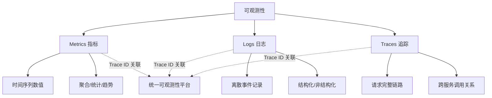
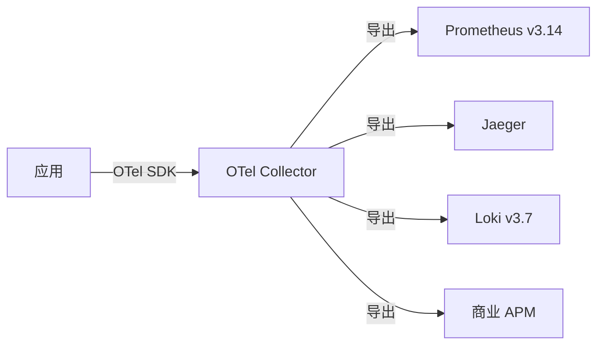
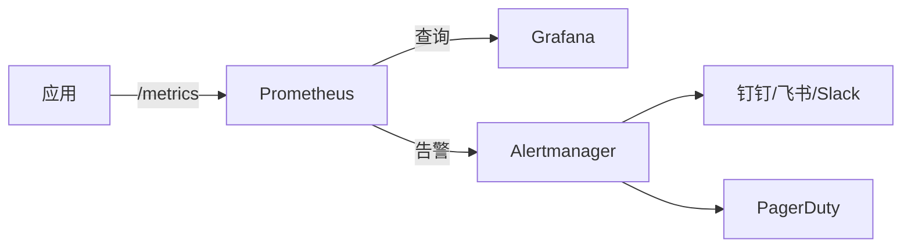
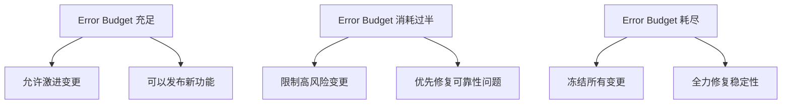
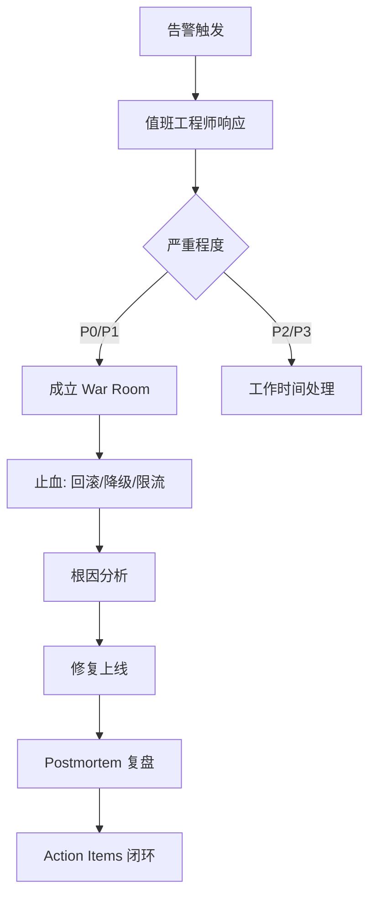

[📖 返回目录](README.md) · [⬅️ 上一章](28-architecture-patterns.md) · [➡️ 下一章](30-data-api-design.md)

# 29 · 可观测性与 SRE 实践（资深向）

> 适用对象：10+ 年经验的资深工程师 / 架构师候选人。本章覆盖可观测性三大支柱（Metrics/Logs/Traces）、OpenTelemetry 全栈可观测性架构、分布式追踪（Jaeger/Zipkin/SkyWalking 对比）、日志架构（ELK vs Loki）、指标体系（Prometheus/Grafana/RED/USE 方法）、SLO/SLI/SLA 与 Error Budget、混沌工程（LitmusChaos）、故障管理与 Postmortem、SRE 工程实践。面试落点：不背工具名，能讲清「可观测性体系怎么搭」「SLO 怎么定」「混沌工程怎么落地」「故障复盘怎么做」。

**TL;DR 本章学习要点**

1. 可观测性 ≠ 监控：监控是「预定义指标的告警」，可观测性是「通过外部输出推断内部状态」——可观测性回答「为什么出了问题」，监控回答「出了问题」；
2. 三大支柱：Metrics（指标，聚合数值）、Logs（日志，离散事件）、Traces（追踪，请求链路）——三者通过 Trace ID 关联，缺一不可；
3. OpenTelemetry 是可观测性的「统一标准」——厂商无关的 SDK + Collector 架构，替代了 Jaeger/Zipkin 等自建方案；
4. SLO 是可靠性的「契约」：SLI 是度量指标（如可用性 99.9%），SLO 是目标值（如 99.95%），Error Budget 是允许的失败空间——用 Error Budget 驱动工程决策；
5. 混沌工程是「主动注入故障」验证系统弹性——不是「制造故障」而是「发现弱点」，在生产环境可控注入是最高阶实践。

---

### 📑 本章目录

- [1. 可观测性三大支柱](#1-可观测性三大支柱)
- [2. OpenTelemetry 全栈可观测性](#2-opentelemetry-全栈可观测性)
- [3. 分布式追踪](#3-分布式追踪)
- [4. 日志架构](#4-日志架构)
- [5. 指标体系](#5-指标体系)
- [6. SLO/SLI/SLA 与 Error Budget](#6-sloslisla-与-error-budget)
- [7. 混沌工程](#7-混沌工程)
- [8. 故障管理与 Postmortem](#8-故障管理与-postmortem)
- [9. SRE 工程实践](#9-sre-工程实践)
- [考点速查表](#考点速查表)

---

## 1. 可观测性三大支柱

### 1.1 监控 vs 可观测性

| 维度 | 监控（Monitoring） | 可观测性（Observability） |
|---|---|---|
| 目标 | 发现「出了问题」 | 回答「为什么出了问题」 |
| 方法 | 预定义指标 + 阈值告警 | 通过外部输出推断内部状态 |
| 能力 | 已知问题的检测 | 未知问题的探索 |
| 数据 | 固定指标 | 任意维度的高基数数据 |

### 1.2 三大支柱



> 图示：可观测性三大支柱与关联

| 支柱 | 数据特征 | 典型场景 | 存储 |
|---|---|---|---|
| Metrics | 数值型、时间序列、聚合 | QPS、延迟 P99、CPU 使用率 | Prometheus/InfluxDB |
| Logs | 文本、离散事件 | 错误日志、审计日志、调试信息 | ELK/Loki |
| Traces | 链路、Span 树 | 跨服务调用追踪、慢查询定位 | Jaeger/Zipkin/SkyWalking |

> **Q1：可观测性和监控有什么区别？**
>
> **答**：监控是可观测性的子集。监控关注「已知的已知」——你预定义了 CPU 使用率超过 80% 就告警。可观测性关注「未知的未知」——你不知道问题出在哪，但可以通过任意维度的查询（用户 ID、请求路径、错误码、地区）来探索和定位。**生产建议**：先做好监控（基础），再建设可观测性（进阶）。
>
> **追问：可观测性需要多少存储成本？**
>
> 三大支柱的成本差异大：Metrics 最低（时间序列压缩存储，1 年数据 GB 级）；Logs 最高（GB/天，需采样+保留策略）；Traces 中等（按采样率，通常 1%-10%）。**优化策略**：Metrics 长期保留（Prometheus + Thanos/Cortex）；Logs 热 7 天+温 30 天+冷 S3；Traces 按采样率+异常链路全采。

---

## 2. OpenTelemetry 全栈可观测性

### 2.1 架构

OpenTelemetry（OTel）是 CNCF 的可观测性标准项目，提供**厂商无关**的 API、SDK 和 Collector。



> 图示：OpenTelemetry Collector 架构

**核心组件**：

| 组件 | 职责 |
|---|---|
| OTel API | 定义 Tracer/Meter/Logger 接口 |
| OTel SDK | 实现 API，管理采样、导出、上下文传播 |
| OTel Collector | 接收→处理→导出遥测数据，Spec v1.60.0，支持多后端 |
| OTel Java Agent | 零代码侵入的 Java agent（javaagent.jar，v1.65.0） |

### 2.2 Java 集成

```java
// 方式一：手动埋点
Tracer tracer = GlobalOpenTelemetry.getTracer("order-service");
Span span = tracer.spanBuilder("createOrder").startSpan();
try (Scope scope = span.makeCurrent()) {
    // 业务逻辑
    span.setAttribute("order.id", orderId);
    span.setStatus(StatusCode.OK);
} catch (Exception e) {
    span.setStatus(StatusCode.ERROR, e.getMessage());
    span.recordException(e);
} finally {
    span.end();
}

// 方式二：零侵入（Java Agent）
// java -javaagent:opentelemetry-javaagent.jar \
//   -Dotel.service.name=order-service \
//   -Dotel.exporter.otlp.endpoint=http://collector:4317 \
//   -jar my-app.jar
```

> **Q2：OpenTelemetry Java Agent 和手动埋点怎么选？**
>
> **答**：Agent 适合快速接入——零代码改动，自动采集 HTTP/gRPC/JDBC/Redis 等框架调用。手动埋点适合**自定义业务 Span**——Agent 只能采集框架层调用，业务逻辑（如「库存扣减」「优惠计算」）需要手动埋点。**最佳实践**：Agent 采集基础设施指标 + 手动埋点补充业务 Span，两者互补。

---

## 3. 分布式追踪

### 3.1 核心概念

| 概念 | 说明 |
|---|---|
| Trace | 一次完整请求的调用链，由多个 Span 组成 |
| Span | 一个操作单元（一次 RPC、一次 DB 查询） |
| Trace ID | 全链路唯一标识 |
| Span ID | 单个 Span 的唯一标识 |
| Parent Span ID | 父 Span，构成调用树 |
| Context Propagation | 跨服务传递 Trace ID（HTTP Header / gRPC Metadata） |

### 3.2 追踪系统对比

| 维度 | Jaeger | Zipkin | SkyWalking |
|---|---|---|---|
| 架构 | Agent + Collector + Query | Collector + Query + UI | Agent + Collector + UI + OAP |
| 语言支持 | 多语言 | 多语言 | Java 为主（字节码增强） |
| 部署 | 复杂（组件多） | 简单 | 中等 |
| 性能 | 高 | 中 | 高（字节码增强，零侵入） |
| 特色 | CNCF 标准，OpenTelemetry 原生 | 轻量，社区成熟 | 全栈 APM，拓扑图自动发现 |
| 国内使用 | 中 | 低 | 高（阿里开源，中文社区活跃） |

### 3.3 采样策略

| 策略 | 原理 | 适用 |
|---|---|---|
| 固定比例采样 | 每 N 个请求采样 1 个 | 开发/测试环境 |
| 自适应采样 | 低流量全采，高流量按比例 | 生产环境 |
| 尾部采样（Tail Sampling） | Collector 收到完整 Trace 后决定是否保留 | 保留异常/慢请求 |
| 基于规则采样 | 按接口/状态码/延迟采样 | 保留关键路径 |

> **Q3：SkyWalking 和 Jaeger 怎么选？**
>
> **答**：选型依据——（1）**技术栈**：纯 Java → SkyWalking（字节码增强零侵入）；多语言 → Jaeger（标准 OTel SDK）；（2）**需求**：只需要追踪 → Jaeger（轻量）；需要全栈 APM（追踪+指标+日志+告警） → SkyWalking；（3）**运维能力**：SkyWalking 组件多（OAP 集群），运维成本高于 Jaeger。**国内趋势**：SkyWalking 占主导（阿里背书+中文社区），海外 Jaeger/Datadog 占主导。

---

## 4. 日志架构

### 4.1 ELK vs Loki

| 维度 | ELK（Elasticsearch+Logstash+Kibana） | Loki + Grafana |
|---|---|---|
| 索引方式 | 全文索引（每个字段） | 仅索引标签（label），内容不索引 |
| 存储成本 | 高（全文索引膨胀大） | 低（仅标签索引，内容压缩存储） |
| 查询能力 | 强（全文搜索、聚合分析） | 中（标签过滤+LogQL 正则） |
| 部署复杂度 | 高（ES 集群） | 低（单体或微服务模式） |
| 与 Prometheus 集成 | 需额外配置 | 原生集成（同 Grafana） |
| 适用 | 复杂日志分析、审计 | 与 Metrics/Traces 关联的可观测性 |

### 4.2 结构化日志

```java
// 非结构化（反模式）
log.error("Order failed: " + orderId + ", reason: " + reason);

// 结构化日志（推荐）
log.atError()
    .addKeyValue("orderId", orderId)
    .addKeyValue("reason", reason)
    .addKeyValue("userId", userId)
    .log("Order creation failed");
```

**结构化日志的好处**：可查询（按字段过滤）、可聚合（按维度统计）、可关联（与 Trace ID 关联）。

### 4.3 日志采样策略

| 策略 | 原理 | 适用 |
|---|---|---|
| 全量采集 | 所有日志都写入 | 开发环境、低流量服务 |
| 概率采样 | 按比例采样（如 10%） | 生产环境基础策略 |
| 错误优先 | 错误日志全采，INFO 按比例采 | 生产环境推荐 |
| 速率限制 | 每秒最多 N 条 | 防止日志风暴 |

> **Q4：ELK 和 Loki 怎么选？**
>
> **答**：选型依据——（1）**查询需求**：需要全文搜索/复杂聚合 → ELK；只需要标签过滤+文本搜索 → Loki；（2）**已有基础设施**：已有 Prometheus+Grafana → Loki（原生集成）；已有 ES 集群 → ELK；（3）**成本**：日志量大（>1TB/天）→ Loki（存储成本低 3-5 倍）；日志量小 → ELK 体验更好。**混合方案**：用 Loki 做可观测性日志（与 Metrics/Traces 关联），用 ES 做业务日志分析（审计、搜索）。

---

## 5. 指标体系

### 5.1 Prometheus v3.14 + Grafana v13.2



> 图示：Prometheus + Grafana + Alertmanager 指标体系

### 5.2 RED 方法 vs USE 方法

| 方法 | 全称 | 指标 | 适用 |
|---|---|---|---|
| RED | Rate/Errors/Duration | 请求速率、错误率、延迟 | 服务级监控（面向用户） |
| USE | Utilization/Saturation/Errors | 利用率、饱和度、错误 | 资源级监控（面向基础设施） |

**RED 示例（HTTP 服务）**：

```yaml
# Rate: 请求速率
rate(http_requests_total[5m])

# Errors: 错误率
sum(rate(http_requests_total{status=~"5.."}[5m])) / sum(rate(http_requests_total[5m]))

# Duration: P99 延迟
histogram_quantile(0.99, rate(http_request_duration_seconds_bucket[5m]))
```

### 5.3 告警设计原则

| 原则 | 说明 |
|---|---|
| 基于 SLO 告警 | 不要按固定阈值，按 SLO 消耗速率告警 |
| 分级 | P0（立即响应）→ P1（30 分钟）→ P2（工作时间）→ P3（周报） |
| 可操作 | 每条告警必须有处理 Runbook |
| 去噪音 | 聚合相关告警，避免告警风暴 |

> **Q5：Prometheus 的数据模型是什么？和传统时序数据库有什么区别？**
>
> **答**：Prometheus 数据模型 = Metric Name + Labels + Value + Timestamp。例如 `http_requests_total{method="GET", status="200"} 1234 1629000000`。与 InfluxDB 的区别：（1）Prometheus 是**拉取模型**（Pull，主动抓取 /metrics），InfluxDB 是推送模型（Push）；（2）Prometheus 的多维数据模型（标签组合）比 InfluxDB 的 tag 模型更灵活；（3）Prometheus 不适合长期存储（本地 TSDB 适合 15 天），长期存储需要 Thanos/Cortex/Mimir。

---

## 6. SLO/SLI/SLA 与 Error Budget

### 6.1 核心概念

| 概念 | 定义 | 示例 |
|---|---|---|
| SLI（Service Level Indicator） | 可度量的可靠性指标 | 可用性 99.95%、P99 延迟 <200ms |
| SLO（Service Level Objective） | SLI 的目标值 | 月可用性 ≥ 99.95% |
| SLA（Service Level Agreement） | 对外承诺的合同条款 | 月可用性 < 99.9% 赔偿 |
| Error Budget | 允许的失败空间 = 1 - SLO | SLO 99.95% → Error Budget = 0.05% |

### 6.2 Error Budget 驱动决策



> 图示：Error Budget 驱动的工程决策

**Error Budget 计算**：

| SLO | 月允许不可用时间 | 年允许不可用时间 |
|---|---|---|
| 99.9% | 43.8 分钟 | 8.76 小时 |
| 99.95% | 21.9 分钟 | 4.38 小时 |
| 99.99% | 4.38 分钟 | 52.6 分钟 |
| 99.999% | 26.3 秒 | 5.26 分钟 |

> **Q6：SLO 和 SLA 有什么区别？什么时候用？**
>
> **答**：SLO 是内部目标（团队自用），SLA 是外部承诺（合同约束）。SLO 通常比 SLA 更严格——如果 SLA 是 99.9%，内部 SLO 应该是 99.95% 或更高，留出缓冲。**关键原则**：SLO 失败 = 团队需要改进；SLA 失败 = 赔钱/丢客户。**不要把 SLA 当 SLO 用**——SLA 太宽松会导致团队没有紧迫感。
>
> **追问：Error Budget 耗尽了怎么办？**
>
> 三个行动——（1）**冻结变更**：停止所有非关键发布，避免进一步消耗 Budget；（2）**根因分析**：分析消耗 Budget 的主要故障来源（哪个服务、什么类型）；（3）**针对性修复**：优先修复消耗 Budget 最多的问题。Budget 恢复后（下个窗口期），解除冻结。

---

## 7. 混沌工程

### 7.1 核心原理

混沌工程 = **在可控条件下主动注入故障**，验证系统的弹性。不是「制造故障」，而是「发现弱点」。

**混沌工程实验流程**：
1. 定义稳态指标（如错误率 < 0.1%）
2. 提出假设（如「注入单节点故障后，系统仍能正常服务」）
3. 注入故障（如杀死一个 Pod）
4. 观察指标变化
5. 分析偏差，修复弱点

### 7.2 混沌工程工具

| 工具 | 特点 | 适用 |
|---|---|---|
| Chaos Monkey（Netflix） | 随机杀死生产实例 | 成熟但仅 AWS |
| LitmusChaos（CNCF Sandbox，v3.31） | K8s 原生，CRD 定义实验 | K8s 环境首选 |
| ChaosBlade（阿里） | 支持主机/容器/应用层故障注入 | 国内 Java 生态 |
| Chaos Mesh（PingCAP） | K8s + 网络/IO/Pod 故障 | K8s 网络故障 |

### 7.3 故障注入类型

| 类型 | 示例 | 影响 |
|---|---|---|
| Pod 故障 | 杀死 Pod、Pod 不可用 | 验证自愈能力 |
| 网络故障 | 延迟注入、丢包、DNS 故障 | 验证超时/重试/降级 |
| IO 故障 | 磁盘满、读写延迟 | 验证存储容错 |
| 应用层 | CPU/内存压力、GC 停顿 | 验证资源限制和弹性 |

> **Q7：混沌工程在生产环境做安全吗？**
>
> **答**：安全，但需要严格控制——（1）**小范围开始**：先在测试环境，再灰度到生产；（2）**爆炸半径控制**：限制故障影响范围（如只影响 1% 流量）；（3）**有回滚能力**：故障注入后能立即恢复；（4）**有监控**：注入期间实时监控关键指标；（5）**有演练计划**：明确演练目标、时间窗口、参与人。**生产混沌的最高境界**：常态化演练（如每周自动执行），像 Netflix 一样将故障注入融入日常运维。

---

## 8. 故障管理与 Postmortem

### 8.1 故障响应流程



> 图示：故障响应全流程

### 8.2 Postmortem 模板

| 部分 | 内容 |
|---|---|
| 概述 | 故障时间、影响范围、持续时长、严重程度 |
| 时间线 | 关键事件时间点（发现→响应→止血→恢复） |
| 根因 | 技术根因 + 流程根因 |
| 影响 | 用户影响、业务损失、SLA 影响 |
| 止血措施 | 实际采取的恢复措施 |
| Action Items | 预防措施 + 责任人 + 截止日期 |
| 经验教训 | 做得好的 + 需要改进的 |

### 8.3 Blameless 文化

| 有 blame | Blameless |
|---|---|
| 「谁改的代码导致的？」 | 「什么流程允许了这个变更？」 |
| 惩罚个人 | 改进系统 |
| 隐藏问题 | 开放分享 |
| 重复犯错 | 系统性预防 |

> **Q8：Postmortem 和故障复盘有什么区别？**
>
> **答**：Postmortem 是 Google SRE 引入的**结构化复盘文档**，不只是「开会讨论」——它有固定模板（时间线/根因/影响/Action Items），强调 Blameless 和系统性改进。国内很多团队的「故障复盘」停留在「谁的锅+下次注意」，没有 Action Items 的闭环跟踪。**生产建议**：每起 P0/P1 故障必须出 Postmortem，Action Items 纳入 OKR 跟踪。

---

## 9. SRE 工程实践

### 9.1 SRE 工作模型

| 职责 | 说明 |
|---|---|
| 可靠性保障 | SLO 制定、Error Budget 管理、告警优化 |
| Toil 消动化 | 将重复性运维工作自动化（减少 Toil） |
| 事件响应 | On-call 轮值、故障响应、Postmortem |
| 架构评审 | 从可靠性角度评审架构设计 |
| 容量规划 | 预测资源需求、规划扩容 |

### 9.2 Toil 定义与治理

Toil = **手动的、重复的、可自动化的、无持久价值的运维工作**。

| Toil 示例 | 自动化方案 |
|---|---|
| 手动扩容 | K8s HPA + 自定义指标 |
| 手动部署 | CI/CD 流水线 |
| 手动处理告警 | 告警自动分类+自愈脚本 |
| 手动生成报表 | Grafana Dashboard 自动化 |

> **Q9：SRE 和传统运维有什么区别？**
>
> **答**：核心区别在「用工程方法解决运维问题」：（1）**传统运维**：手动操作为主，被动响应故障；（2）**SRE**：将运维工作代码化（Toil 自动化），用 SLO 驱动可靠性决策，主动预防故障。Google SRE 的核心理念：**软件工程师做运维**——不是「运维团队」而是「可靠性工程团队」。

> **Q10：如何搭建一个可观测性体系？**
>
> **答**：五步走——（1）**Metrics 先行**：部署 Prometheus+Grafana，接入 RED 指标（服务级）+ USE 指标（资源级）；（2）**日志结构化**：统一日志格式（JSON），接入 Loki 或 ELK；（3）**分布式追踪**：部署 OpenTelemetry Collector + Jaeger/SkyWalking，Java 服务接入 OTel Agent；（4）**SLO 定义**：为核心服务定义 SLI/SLO，建立 Error Budget 机制；（5）**告警治理**：基于 SLO 告警，分级处理，每条告警有 Runbook。**优先级**：Metrics > Logs > Traces > SLO > 混沌工程。

---

## 考点速查表

| 考点 | 一句话要点 |
|---|---|
| 可观测性 vs 监控 | 监控检测已知问题，可观测性探索未知问题 |
| 三大支柱 | Metrics（聚合数值）+ Logs（离散事件）+ Traces（请求链路） |
| OpenTelemetry | 厂商无关标准，SDK+Collector+Agent 架构 |
| OTel Java Agent | 零侵入采集框架指标，手动埋点补充业务 Span |
| 分布式追踪 | Trace→Span 树，Trace ID 跨服务传播 |
| SkyWalking vs Jaeger | SkyWalking 全栈 APM（Java 字节码增强），Jaeger 轻量追踪 |
| ELK vs Loki | ELK 全文索引强但贵，Loki 标签索引轻量便宜 |
| 结构化日志 | JSON 格式，可查询/可聚合/可关联 |
| RED 方法 | Rate/Errors/Duration，服务级监控 |
| USE 方法 | Utilization/Saturation/Errors，资源级监控 |
| SLO/SLI/SLA | SLI 度量→SLO 目标→SLA 合同 |
| Error Budget | 1-SLO=允许失败空间，驱动工程决策 |
| 混沌工程 | 主动注入故障发现弱点，不是制造故障 |
| Postmortem | 结构化复盘：时间线/根因/影响/Action Items |
| Blameless | 改进系统而非惩罚个人 |
| Toil | 手动/重复/可自动化/无持久价值的运维工作 |
| SRE 工作模型 | SLO 驱动+Toil 自动化+事件响应+架构评审 |
| 告警设计 | 基于 SLO+分级+可操作+去噪音 |
| 可观测性建设优先级 | Metrics→Logs→Traces→SLO→混沌工程 |
| 生产混沌 | 小范围+爆炸半径控制+回滚能力+监控+演练计划 |


> **追问：OpenTelemetry Collector 的 Pipeline 怎么配置？**
>
> Collector Pipeline = Receiver → Processor → Exporter。Receiver 接收遥测数据（OTLP/Jaeger/Prometheus），Processor 做处理（批量/过滤/采样/转换），Exporter 导出到后端（Prometheus/Jaeger/Loki）。配置示例：`receivers: [otlp] → processors: [batch, memory_limiter] → exporters: [prometheus, jaeger]`。**关键**：memory_limiter Processor 防止 OOM，batch Processor 提高导出效率。

> **追问：混沌工程的爆炸半径怎么控制？**
>
> 四种控制手段——（1）**范围限制**：只对特定 Pod/Node/命名空间注入；（2）**流量比例**：只对 1% 流量注入故障（Istio Fault Injection）；（3）**时间窗口**：限制故障持续时间（如最多 5 分钟）；（4）**自动熔断**：监控关键指标，指标恶化超过阈值自动停止注入。**生产建议**：第一次在生产做混沌时，从「非核心服务+工作时间+小范围」开始。

> **追问：Error Budget 的窗口期怎么定？**
>
> 常见窗口期：（1）**滚动窗口**：过去 30 天的可用性（如 Prometheus `avg_over_time(availability[30d])`）；（2）**日历窗口**：每月/每季度重置。**推荐**：核心服务用 30 天滚动窗口（避免月初/月末集中消耗）；非核心服务用月度窗口（简单）。**关键**：窗口期太短（如 7 天）会导致波动大，太长（如 90 天）会导致反应迟钝。

