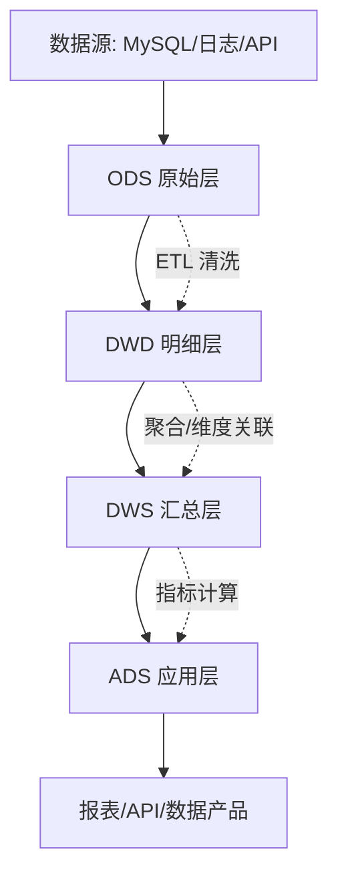
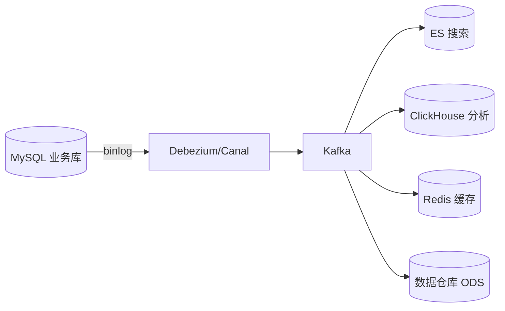
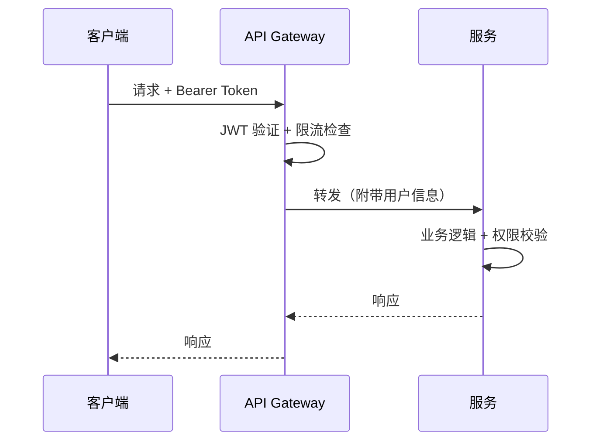

[📖 返回目录](README.md) · [⬅️ 上一章](29-observability-sre.md) · [➡️ 下一章](31-ai-system-architecture.md)

# 30 · 数据架构与 API 设计（资深向）

> 适用对象：10+ 年经验的资深工程师 / 架构师候选人。本章覆盖数据分层架构（ODS/DWD/DWS/ADS/维度建模）、数据湖 vs 数据仓库 vs 湖仓一体、CDC 与数据同步、读写分离与数据一致性、RESTful API 深度设计、gRPC 原理与选型、GraphQL 优劣分析、API 版本管理与治理。面试落点：不背概念，能讲清「数据分层怎么设计」「湖仓一体值不值得上」「RESTful 幂等性怎么做」「gRPC 什么时候比 REST 好」。

**TL;DR 本章学习要点**

1. 数据分层是数据架构的「地基」——ODS 原始层→DWD 明细层→DWS 汇总层→ADS 应用层，每层有明确职责，避免数据沼泽；
2. 数据湖 = 存储原始数据（Schema-on-Read），数据仓库 = 存储结构化数据（Schema-on-Write），湖仓一体 = 两者结合（Iceberg/Delta Lake/Hudi）——是当前数据架构的主流方向；
3. CDC（Debezium/Canal）是数据同步的核心基础设施——监听 binlog 实时捕获变更，实现 MySQL→ES/Redis/数据仓库的准实时同步；
4. RESTful 不只是「用 HTTP 动词」——幂等性设计、HATEOAS、分页策略、错误码规范、版本管理才是深度所在；
5. gRPC 比 REST 快 5-10 倍（Protobuf 序列化 + HTTP/2 多路复用），适合内部服务间高频通信；GraphQL 适合多端差异化查询，但有 N+1 问题。

---

### 📑 本章目录

- [1. 数据分层架构](#1-数据分层架构)
- [2. 数据湖 vs 数据仓库 vs 湖仓一体](#2-数据湖-vs-数据仓库-vs-湖仓一体)
- [3. CDC 与数据同步](#3-cdc-与数据同步)
- [4. 读写分离与数据一致性](#4-读写分离与数据一致性)
- [5. RESTful API 深度设计](#5-restful-api-深度设计)
- [6. gRPC 原理与选型](#6-grpc-原理与选型)
- [7. GraphQL 优劣分析](#7-graphql-优劣分析)
- [8. API 版本管理与治理](#8-api-版本管理与治理)
- [考点速查表](#考点速查表)

---

## 1. 数据分层架构

### 1.1 经典四层模型



> 图示：数据分层架构的数据流向

| 层级 | 全称 | 职责 | 数据特征 |
|---|---|---|---|
| ODS | Operational Data Store | 原始数据落地，保持源系统格式 | 未清洗、全量/增量 |
| DWD | Data Warehouse Detail | 清洗、规范化、维度关联 | 明细粒度、可追溯 |
| DWS | Data Warehouse Summary | 按主题聚合、预计算指标 | 汇总粒度、高性能查询 |
| ADS | Application Data Store | 面向应用的数据服务 | 指标表、宽表、API |

### 1.2 维度建模

| 概念 | 说明 | 示例 |
|---|---|---|
| 事实表（Fact） | 业务过程的度量 | 订单事实表（金额、数量） |
| 维度表（Dimension） | 业务上下文 | 时间维度、商品维度、用户维度 |
| 缓慢变化维度（SCD） | 维度属性随时间变化 | 用户地址变更（Type 2：保留历史） |

> **Q1：数据分层的核心价值是什么？**
>
> **答**：三个核心价值——（1）**减少重复计算**：DWS 层预聚合，多个 ADS 应用复用同一份汇总数据；（2）**数据可追溯**：ODS 保留原始数据，DWD 保留清洗逻辑，出了问题可以溯源；（3）**解耦上下游**：源系统变更只影响 ODS→DWD 的 ETL，不影响上层应用。**反模式**：不分层直接从 ODS 查——数据沼泽、重复计算、性能差。

> **追问：ODS 和 DWD 的边界在哪里？什么时候需要 DWD？**
>
> 当源系统数据质量差（字段命名混乱、编码不统一、缺少维度关联）时，需要 DWD 做清洗和规范化。如果源系统本身质量高（如新开发的微服务直接输出规范 JSON），ODS 可以直接当 DWD 用——但要标注清楚数据质量等级，防止下游误用。

---

## 2. 数据湖 vs 数据仓库 vs 湖仓一体

### 2.1 核心对比

| 维度 | 数据仓库 | 数据湖 | 湖仓一体 |
|---|---|---|---|
| 数据类型 | 结构化 | 任意（结构化/半结构化/非结构化） | 任意 |
| Schema | Schema-on-Write（写时定义） | Schema-on-Read（读时定义） | 两者兼有 |
| 存储成本 | 高（专有格式） | 低成本（对象存储 S3/OSS） | 低成本 |
| ACID 事务 | 支持 | 不支持 | 支持（Iceberg/Delta） |
| 查询性能 | 高（预优化） | 低（需优化） | 高（索引+统计信息） |
| 适用 | BI 报表、OLAP | 机器学习、数据探索 | 统一平台 |

### 2.2 湖仓一体技术栈

| 框架 | 开源方 | 核心特性 | 适用 |
|---|---|---|---|
| Apache Iceberg | Netflix→Apache（v1.11.0） | 快照隔离、Schema 演进、隐藏分区 | 全场景首选 |
| Delta Lake | Databricks（v4.3.1） | ACID 事务、时间旅行、Z-Order 索引 | Databricks 生态 |
| Apache Hudi | Uber→Apache（v1.2.0） | 增量处理、CDC 友好、Upsert 高效 | 增量更新场景 |

**Iceberg 核心特性**：
- **快照隔离**：读操作不阻塞写操作，读写并发安全
- **Schema 演进**：安全地添加/删除/重命名列，不影响下游
- **隐藏分区**：分区键对用户透明，避免分区键变更导致查询错误
- **时间旅行**：查询历史快照，支持数据回溯和审计

> **Q2：湖仓一体和传统数据仓库有什么区别？值得迁移吗？**
>
> **答**：核心区别——（1）**存储成本**：湖仓用对象存储（S3/OSS），成本是数据仓库的 1/5-1/10；（2）**开放性**：湖仓用开放格式（Parquet/ORC），不被厂商锁定；（3）**灵活性**：支持结构化+非结构化数据，一个平台统一处理。**迁移决策**：如果已有成熟数据仓库（如 Snowflake/MaxCompute）且满足需求，不必迁移；如果是新项目或成本敏感，湖仓一体是更优选择。

> **追问：湖仓一体的数据质量怎么保证？**
>
> 数据湖的痛点是「数据沼泽」——数据没有治理、没有文档、没人知道哪个表是对的。解决思路：（1）**数据目录**：Apache Atlas 或 AWS Glue Catalog，自动采集元数据；（2）**数据血缘**：追踪数据从 ODS 到 ADS 的完整链路，出问题时能快速定位；（3）**数据质量检查**：Great Expectations 或 dbt tests，在 ETL 流程中自动校验（空值率、唯一性、范围）。

---

## 3. CDC 与数据同步

### 3.1 CDC 在数据架构中的位置



> 图示：CDC 驱动的数据同步架构

### 3.2 数据同步方案对比

| 方案 | 延迟 | 侵入性 | 可靠性 | 适用 |
|---|---|---|---|---|
| CDC（Debezium/Canal） | 毫秒级 | 低 | 高 | 实时同步 |
| 定时 ETL | 分钟/小时级 | 中 | 中 | 批量同步 |
| 双写 | 实时 | 高（业务代码） | 低（一致性难保证） | 不推荐 |
| 触发器 | 实时 | 高（DB 层面） | 中 | 小规模场景 |

### 3.3 Debezium vs Canal 选型

| 维度 | Debezium | Canal |
|---|---|---|
| 生态 | Kafka Connect 原生集成 | 独立部署，支持 Kafka/RocketMQ |
| 数据格式 | JSON（含完整变更前后数据） | JSON/Protobuf |
| 多库支持 | 支持（单 Connector 监听多库） | 需部署多个 instance |
| 运维复杂度 | 中（依赖 Kafka Connect） | 低（轻量 Java 进程） |
| 社区 | Apache 社区，活跃度高 | 阿里开源，国内生态好 |

> **Q3：MySQL 到 ES 的数据同步，CDC 和定时任务怎么选？**
>
> **答**：选型依据——（1）**延迟要求**：<1 分钟 → CDC；>5 分钟 → 定时任务够用；（2）**数据量**：大表（>1 亿行）→ CDC（增量同步，不用全表扫描）；小表 → 定时任务简单可靠；（3）**运维成本**：CDC 需要维护 Kafka+Debezium 集群；定时任务只需一个 cron job。**生产建议**：核心链路用 CDC，非核心/低频同步用定时任务。

> **追问：CDC 消费积压了怎么处理？**
>
> 三个层面的方案——（1）**扩容消费者**：增加 Kafka Consumer Group 的消费者数量（前提：topic 分区数足够）；（2）**跳过非关键数据**：对非核心表的同步，设置消费延迟容忍度（如搜索索引延迟 10 分钟可接受）；（3）**监控预警**：监控 consumer lag，超过阈值自动告警。**根治**：预估峰值 TPS，合理规划 Kafka 分区数和消费者数量。

---

## 4. 读写分离与数据一致性

### 4.1 读写分离架构

| 方案 | 原理 | 延迟 | 适用 |
|---|---|---|---|
| MySQL 主从复制 | Master 写，Slave 读 | 秒级（异步）/ 毫秒级（半同步） | 读多写少 |
| 分库分表 | 按规则拆分到多个库/表 | 无（本地查询） | 数据量大 |
| 数据同步（CDC） | MySQL→ES/Redis，查询走从库 | 毫秒-秒级 | 复杂查询 |

### 4.2 分库分表策略

| 策略 | 原理 | 优点 | 缺点 |
|---|---|---|---|
| Hash 取模 | `user_id % N` | 数据均匀分布 | 扩容需迁移（翻倍扩容） |
| Range 范围 | 按 ID/时间范围 | 扩容方便 | 热点问题（近期数据集中） |
| 一致性哈希 | 哈希环 | 扩容只迁移部分数据 | 实现复杂 |

**中间件选型**：ShardingSphere（Apache，Java 生态首选）、Vitess（YouTube 开源，K8s 原生）。

> **Q4：分库分表后，跨库 JOIN 怎么办？**
>
> **答**：四种方案——（1）**冗余数据**：在每个库中冗余需要 JOIN 的字段（空间换时间）；（2）**应用层组装**：分别查询后在代码中合并（简单但性能差）；（3）**全局表**：小表广播到每个库（如配置表、字典表）；（4）**数据同步到 ES/ClickHouse**：复杂查询走分析引擎，不走分库分表。**生产建议**：设计阶段尽量避免跨库 JOIN——通过合理的分片键选择（如同一业务实体分到同一库）。

> **追问：分库分表后，全局 ID 怎么生成？**
>
> 四种方案——（1）**雪花算法**：时间戳+机器 ID+序列号，性能高但依赖时钟同步；（2）**号段模式**：从 DB 批量获取 ID 段（如美团 Leaf），DB 压力小；（3）**UUID**：无中心依赖，但无序导致索引性能差；（4）**Redis INCR**：简单但 Redis 是瓶颈。**推荐**：号段模式（Leaf）或雪花算法，根据团队技术栈选择。

---

## 5. RESTful API 深度设计

### 5.1 RESTful 不只是「用 HTTP 动词」

| 原则 | 说明 |
|---|---|
| 资源导向 | URL 表示资源（/orders），不表示操作（/getOrders） |
| HTTP 动词语义 | GET 查询、POST 创建、PUT 全量更新、PATCH 部分更新、DELETE 删除 |
| 无状态 | 服务端不保存客户端会话状态 |
| HATEOAS | 响应中包含相关操作的链接 |

### 5.2 幂等性设计

| HTTP 方法 | 幂等性 | 设计要点 |
|---|---|---|
| GET | 幂等 | 无副作用 |
| PUT | 幂等 | 全量替换，重复调用结果相同 |
| DELETE | 幂等 | 删除操作天然幂等 |
| POST | 非幂等 | 需要幂等键（Idempotency-Key）去重 |
| PATCH | 取决于实现 | 用 JSON Patch 的 replace 操作保证幂等 |

**POST 幂等键设计**：

```
POST /orders
Headers: Idempotency-Key: 550e8400-e29b-41d4-a716-446655440000
Body: { "items": [...], "amount": 99.99 }
```

服务端按 `Idempotency-Key + 用户ID` 去重，已处理的请求直接返回缓存结果。

### 5.3 分页策略

| 方式 | 优点 | 缺点 | 适用 |
|---|---|---|---|
| Offset 分页 | 简单 | 深度分页性能差（OFFSET 大） | 小数据量 |
| Cursor 分页 | 性能稳定 | 不能跳页 | 大数据量、Feed 流 |
| Keyset 分页 | 性能最优 | 实现复杂 | 超大数据量 |

**Cursor 分页示例**：

```json
{
  "data": [...],
  "pagination": {
    "next_cursor": "***=",
    "has_more": true
  }
}
```

### 5.4 错误码规范

| HTTP 状态码 | 语义 | 使用场景 |
|---|---|---|
| 200 | 成功 | GET/PUT/PATCH/DELETE 成功 |
| 201 | 已创建 | POST 创建成功 |
| 400 | 请求参数错误 | 参数校验失败 |
| 401 | 未认证 | Token 缺失/过期 |
| 403 | 无权限 | 权限不足 |
| 404 | 资源不存在 | URL 错误 |
| 409 | 冲突 | 重复创建、乐观锁冲突 |
| 422 | 语义错误 | 业务规则校验失败 |
| 429 | 限流 | 请求频率超限 |
| 500 | 服务器内部错误 | 未捕获异常 |
| 503 | 服务不可用 | 熔断/降级 |

> **Q5：RESTful API 的幂等性怎么保证？**
>
> **答**：按 HTTP 方法分层保障——（1）**GET/PUT/DELETE**：天然幂等，无需额外设计；（2）**POST**：客户端生成 `Idempotency-Key`（UUID），服务端按 key 去重（Redis + 唯一索引），重复请求返回首次结果；（3）**PATCH**：用 JSON Patch（`replace` 操作）而非直接修改，保证幂等。**关键**：幂等键需要有过期时间（如 24 小时），否则 Redis 存储无限增长。

> **追问：如果幂等键生成失败了怎么办？**
>
> 幂等键由客户端生成，客户端故障时无法生成。解决方案：（1）**客户端重试时复用上一次的幂等键**（存储在本地）；（2）服务端生成幂等键（POST 时由服务端分配），但违背了 RESTful 无状态原则；（3）用业务单据号作为幂等键（如订单号天然幂等）。**最佳实践**：关键操作用业务单据号（如订单号、支付流水号），非关键操作用 UUID。

> **Q6：如何设计一个高质量的 RESTful API？**
>
> **答**：十项原则——（1）资源命名用名词复数（/orders）；（2）HTTP 动词语义正确；（3）统一错误格式（{code, message, details}）；（4）分页用 Cursor 而非 Offset；（5）幂等键防重复提交；（6）HATEOAS 提供操作链接；（7）版本管理（URL 或 Header）；（8）限流+认证+权限；（9）OpenAPI 文档自动生成；（10）监控+日志+审计。

> **追问：RESTful API 的 HATEOAS 有什么实际价值？**
>
> HATEOAS（Hypermedia As The Engine Of Application State）让 API 响应包含相关操作的链接，客户端不需要硬编码 URL。例如：订单响应中包含 `{"links": [{"rel": "pay", "href": "/orders/123/pay", "method": "POST"}]}`，客户端根据链接决定是否显示「支付」按钮。**实际价值**：（1）服务端可以动态控制客户端行为（如订单已支付则不返回支付链接）；（2）API 变更不影响客户端（URL 从响应中获取而非硬编码）。**局限**：实现复杂，很多团队选择不用——实践中「文档驱动」比「HATEOAS 驱动」更务实。

---

## 6. gRPC 原理与选型

### 6.1 gRPC 核心原理

| 特性 | 说明 |
|---|---|
| 序列化 | Protocol Buffers（Protobuf），二进制格式，比 JSON 小 3-10 倍 |
| 传输 | HTTP/2，支持多路复用、头部压缩、流式传输（v1.83.0） |
| 接口定义 | .proto 文件，强类型，自动生成多语言客户端 |
| 流式 | 四种模式：Unary / Server Stream / Client Stream / Bidirectional |

### 6.2 gRPC vs REST 对比

| 维度 | gRPC | REST |
|---|---|---|
| 性能 | 快 5-10 倍（Protobuf + HTTP/2） | 慢（JSON + HTTP/1.1） |
| 类型安全 | 强类型（.proto） | 弱类型（JSON） |
| 流式支持 | 原生支持 | 需 WebSocket/SSE |
| 浏览器支持 | 需 gRPC-Web 代理 | 原生支持 |
| 学习成本 | 高（Protobuf + .proto） | 低（HTTP 基础即可） |
| 可读性 | 二进制，不可直读 | JSON，人类可读 |
| 适用 | 内部服务间高频通信 | 外部 API、浏览器调用 |

### 6.3 gRPC 选型决策

```
内部服务间通信（微服务） → gRPC（性能+类型安全）
外部 API（面向前端/第三方） → REST（兼容性+可读性）
实时推送（聊天/行情） → gRPC Stream 或 WebSocket
移动端 → REST（兼容性）或 gRPC-Web
```

> **Q7：gRPC 什么时候比 REST 好？**
>
> **答**：三个场景——（1）**内部服务间高频通信**：gRPC 快 5-10 倍，序列化/反序列化开销低；（2）**强类型接口**：.proto 文件自动生成客户端，避免 JSON 解析错误；（3）**流式传输**：Server Stream（服务端推送）、Bidirectional Stream（双向流）是 gRPC 原生能力，REST 需要额外方案。**不用 gRPC 的场景**：外部 API（浏览器兼容性）、低频调用（性能差异不明显）、需要人类可读的调试场景。

> **追问：gRPC 的错误处理怎么做？**
>
> gRPC 有标准的错误码体系（OK/NotFound/InvalidArgument/Internal 等），比 HTTP 状态码更语义化。错误详情通过 `google.rpc.Status` 的 `details` 字段传递（Protobuf Any 类型）。Java 实现：`StatusRuntimeException` 抛出错误，客户端通过 `Status.fromThrowable(e)` 解析。**关键**：不要把所有错误都返回 `INTERNAL`——用语义化的错误码（如 `NOT_FOUND`、`ALREADY_EXISTS`）让客户端能正确处理。

---

## 7. GraphQL 优劣分析

### 7.1 核心概念

| 概念 | 说明 |
|---|---|
| Schema | 强类型接口定义（SDL：Schema Definition Language） |
| Query | 查询数据（类似 GET） |
| Mutation | 修改数据（类似 POST/PUT/DELETE） |
| Subscription | 实时订阅（WebSocket） |
| Resolver | 每个字段的数据获取逻辑 |

### 7.2 GraphQL vs REST

| 维度 | GraphQL | REST |
|---|---|---|
| 数据获取 | 客户端指定需要的字段 | 服务端决定返回的字段 |
| 过度获取 | 不会 | 常见 |
| 不足获取 | 不会（可一次查询多个资源） | 需要多次请求 |
| 缓存 | 复杂（POST 请求难缓存） | 简单（HTTP 缓存） |
| N+1 问题 | 常见（Resolver 逐字段查询） | 需注意 |
| 版本管理 | 无需版本（Schema 演进） | 需要版本（v1/v2） |

### 7.3 N+1 问题与 DataLoader

```java
// N+1 问题：查询 100 个订单，每个订单查一次用户
// 1 次查订单 + 100 次查用户 = 101 次查询

// DataLoader 解法：批量查询
DataLoader<Long, User> userLoader = DataLoaderFactory.newDataLoader(
    userIds -> userService.batchGetUsers(userIds) // 1 次批量查询
);
```

> **Q8：GraphQL 的 N+1 问题怎么解决？**
>
> **答**：DataLoader 是标准解法——（1）**批量化**：将同一层级的多次单条查询合并为一次批量查询；（2）**缓存**：同一请求内缓存已查询的结果；（3）**调度**：在当前事件循环结束时批量执行（JavaScript）或在查询结束时批量执行（Java）。**Java 生态**：Netflix DGS 或 Spring GraphQL 内置 DataLoader 支持。

> **追问：GraphQL 的 Subscription 怎么实现？**
>
> GraphQL Subscription 基于 WebSocket 实现长连接，服务端在数据变更时主动推送。Java 生态中 Spring GraphQL 和 Netflix DGS 都内置支持。实现要点：（1）**连接管理**：WebSocket 连接需要心跳保活、超时断开；（2）**背压控制**：服务端推送速度超过客户端消费速度时需要缓冲/丢弃策略；（3）**认证**：WebSocket 握手时携带 Token 验证身份。**适用场景**：实时通知、聊天、行情推送；**不适用**：高并发写入场景（用 Kafka 而非 Subscription）。

---

## 8. API 版本管理与治理

### 8.1 版本策略

| 策略 | 做法 | 优点 | 缺点 |
|---|---|---|---|
| URL 版本 | /api/v1/orders | 简单直观 | URL 膨胀 |
| Header 版本 | Accept: application/vnd.api.v1+json | URL 干净 | 调试不方便 |
| 查询参数 | /orders?version=1 | 灵活 | 容易忽略 |
| 无版本（GraphQL） | Schema 演进 + Deprecated | 不用维护多版本 | 需要严格兼容性管理 |

### 8.2 API 治理清单

| 类别 | 检查项 |
|---|---|
| 规范 | 命名规范？URL 风格？错误码统一？ |
| 安全 | 认证方式？权限控制？数据加密？限流？ |
| 性能 | 响应时间 SLA？分页策略？缓存策略？ |
| 兼容 | 向后兼容？废弃策略？版本管理？ |
| 文档 | OpenAPI/Swagger 文档？变更日志？ |
| 监控 | 调用量/延迟/错误率监控？ |

> **Q9：RESTful API 版本管理怎么选？**
>
> **答**：选型依据——（1）**外部 API**：用 URL 版本（/api/v1/），最直观，第三方开发者友好；（2）**内部 API**：用 Header 版本或无版本（向后兼容），避免 URL 膨胀；（3）**GraphQL**：不需要版本，通过 Schema 演进（@deprecated 标记旧字段）。**关键原则**：版本是为了向后兼容——如果变更不破坏现有客户端，就不需要新版本。

> **Q10：API 限流应该怎么设计？**
>
> **答**：三层限流——（1）**网关层**：全局限流（如总 QPS 上限），保护整个系统；（2）**服务层**：按接口限流（如订单创建 1000 QPS），保护单个服务；（3）**用户层**：按用户/API Key 限流（如每用户 100 QPS），防止单用户独占资源。限流算法：令牌桶（允许突发）> 滑动窗口（精确）> 固定窗口（简单）。限流响应：HTTP 429 + Retry-After Header。

### 8.3 API 安全设计

| 安全层面 | 措施 |
|---|---|
| 认证 | JWT/OAuth2/API Key |
| 授权 | RBAC（角色）/ ABAC（属性） |
| 传输 | HTTPS/TLS 1.3 |
| 输入 | 参数校验、SQL 注入防护 |
| 限流 | 按用户/API/全局三层限流 |
| 审计 | 请求日志、操作审计 |



> 图示：API 安全的网关认证流程

> **Q11：API 的 SLA 怎么定？**
>
> **答**：SLA 定义 = 可用性 + 延迟 + 错误率三要素。可用性根据业务分级：核心 API（支付/下单）99.99%，普通 API 99.9%，内部 API 99.5%。延迟按用户感知：用户操作 <200ms，后台任务 <5s。**关键**：SLA 定义后需要持续监控——通过 Prometheus 采集 API 指标，Grafana 展示，Alertmanager 按 SLO 告警。

### 8.4 API 文档与测试

| 工具 | 类型 | 特点 |
|---|---|---|
| Swagger/OpenAPI | API 文档 | 标准化、自动生成、在线测试 |
| Postman | API 测试 | 集合测试、环境变量、Mock |
| REST Assured | 自动化测试 | Java DSL，集成到 JUnit |
| Contract Testing | 契约测试 | 消费者驱动（Pact），保证接口兼容 |

> **Q12：API 文档应该怎么维护？**
>
> **答**：代码即文档——（1）**OpenAPI/Swagger 注解**：在代码中用 `@Operation`、`@Schema` 注解，自动生成文档；（2）**CI 集成**：每次代码变更自动重新生成文档；（3）**在线调试**：Swagger UI 让前端/第三方直接在线测试 API；（4）**变更日志**：每次 API 变更在文档中标注变更内容。**避免**：手动维护 Word/Markdown 文档——一定会过时。

### 8.5 API 监控与 SLA

| 指标 | 说明 | 目标 |
|---|---|---|
| 可用性 | 成功请求 / 总请求 | ≥99.9% |
| 延迟 P50 | 中位数响应时间 | <100ms |
| 延迟 P99 | 99% 请求的响应时间 | <500ms |
| 错误率 | 5xx 请求占比 | <0.1% |
| 吞吐量 | 每秒请求数（QPS） | 按业务需求 |

> **Q13：湖仓一体的 Iceberg 和 Hudi 怎么选？**
>
> **答**：选型依据——（1）**写入模式**：大量 Upsert（更新/删除）→ Hudi（专为增量处理优化）；批量写入+快照查询 → Iceberg；（2）**生态集成**：Spark 生态 → 两者都好；Flink 生态 → Iceberg 更好（Flink 原生支持）；（3）**社区活跃度**：Iceberg 社区更活跃（Apache 顶级项目，Netflix/AWS/Apple 背书）；（4）**功能**：Schema 演进和隐藏分区 → Iceberg 更强。**趋势**：Iceberg 正在成为湖仓一体的事实标准（Snowflake/Databricks 都宣布支持 Iceberg）。

> **Q14：数据仓库的 ETL 和 ELT 有什么区别？**
>
> **答**：（1）**ETL**（Extract-Transform-Load）：先转换再加载——数据在进入仓库前完成清洗/转换，适合传统数据仓库；（2）**ELT**（Extract-Load-Transform）：先加载再转换——原始数据直接加载到数据湖/仓库，用 SQL 在库内转换，适合湖仓一体。**趋势**：ELT 正在取代 ETL——存储成本下降+计算引擎增强（Spark/Trino），「先存后算」更灵活。

> **Q15：如何保证 MySQL 到 ES 的数据一致性？**
>
> **答**：三种方案——（1）**同步双写**：业务代码同时写 MySQL 和 ES——简单但一致性难保证（任一失败都会不一致）；（2）**异步消息**：MySQL 写成功后发 MQ 消息，消费者更新 ES——最终一致，推荐方案；（3）**CDC**：Debezium/Canal 监听 binlog→Kafka→消费者更新 ES——最可靠，零侵入。**关键**：无论哪种方案，都需要**对账机制**——定期全量对比 MySQL 和 ES 数据，发现不一致时修复。

---

## 考点速查表

| 考点 | 一句话要点 |
|---|---|
| 数据分层 | ODS→DWD→DWS→ADS，每层职责明确，避免数据沼泽 |
| 维度建模 | 事实表（度量）+ 维度表（上下文），SCD 处理缓慢变化 |
| 数据湖 | Schema-on-Read，存储原始数据，低成本 |
| 数据仓库 | Schema-on-Write，结构化数据，高性能查询 |
| 湖仓一体 | Iceberg/Delta/Hudi，两者结合，当前主流方向 |
| Iceberg 特性 | 快照隔离+Schema 演进+隐藏分区+时间旅行 |
| CDC | Debezium（Kafka 生态）vs Canal（阿里），监听 binlog |
| 数据同步选型 | 实时→CDC，批量→ETL，双写不推荐 |
| 分库分表 | Hash 均匀但扩容难，Range 扩容易但有热点 |
| 跨库 JOIN | 冗余/应用层组装/全局表/同步到分析引擎 |
| 全局 ID 生成 | 雪花算法/号段模式（Leaf）/UUID/Redis INCR |
| RESTful 幂等 | GET/PUT/DELETE 天然幂等，POST 用 Idempotency-Key |
| 分页策略 | Offset 简单但深度分页差，Cursor 性能稳定 |
| 错误码 | 4xx 客户端错误，5xx 服务端错误，429 限流 |
| gRPC | Protobuf+HTTP/2，快 5-10 倍，适合内部高频通信 |
| gRPC vs REST | 内部→gRPC，外部→REST，实时→Stream |
| GraphQL | 客户端指定字段，避免过度/不足获取 |
| N+1 问题 | DataLoader 批量化+缓存，Netflix DGS/Spring GraphQL |
| GraphQL Subscription | WebSocket 长连接+心跳+背压，适合实时推送 |
| API 版本 | 外部→URL 版本，内部→Header/无版本 |
| API 限流 | 网关层+服务层+用户层三层限流 |
| API 安全 | JWT/OAuth2 认证 + RBAC/ABAC 授权 + TLS 1.3 |
| API 文档 | OpenAPI 注解自动生成 + CI 集成 + Swagger UI |
| API SLA | 可用性+延迟+错误率，核心 API ≥99.99% |
| ETL vs ELT | ETL 先转后存，ELT 先存后转（湖仓趋势） |
| MySQL→ES 一致性 | CDC 推荐，异步消息次之，双写不推荐 |
