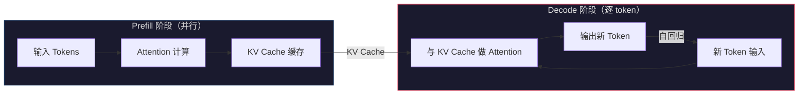
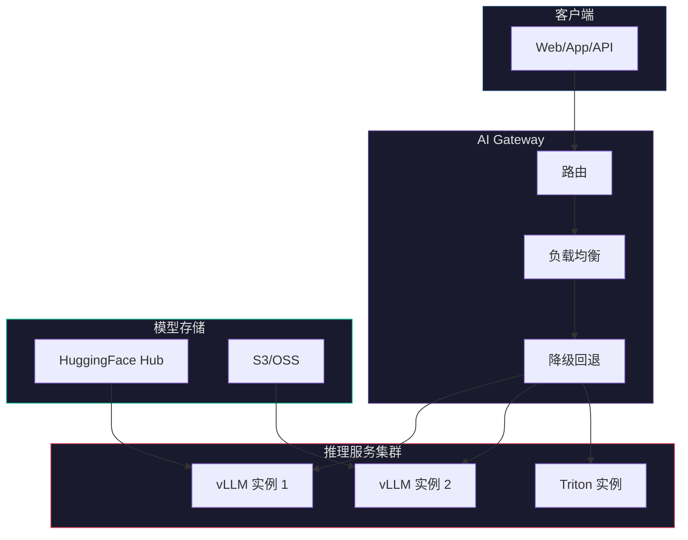
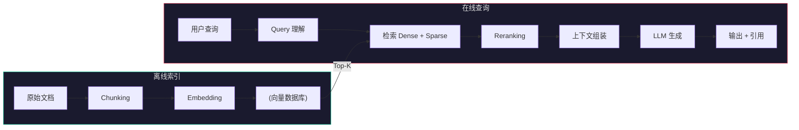
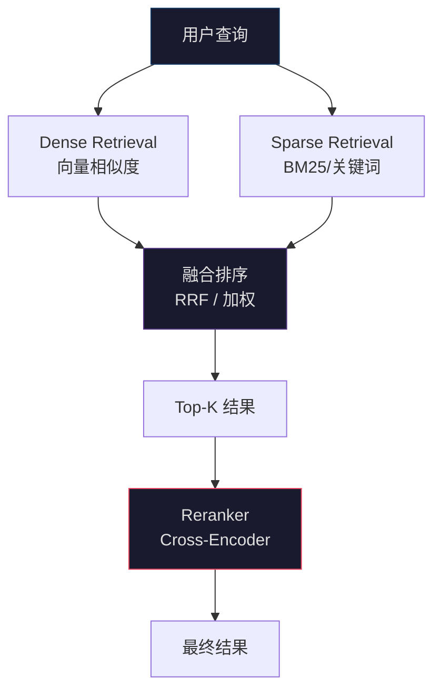
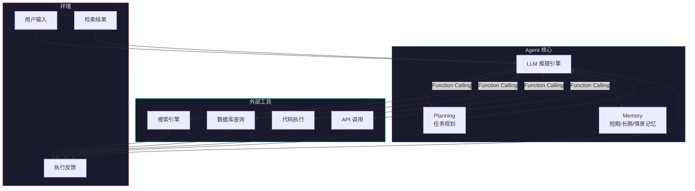
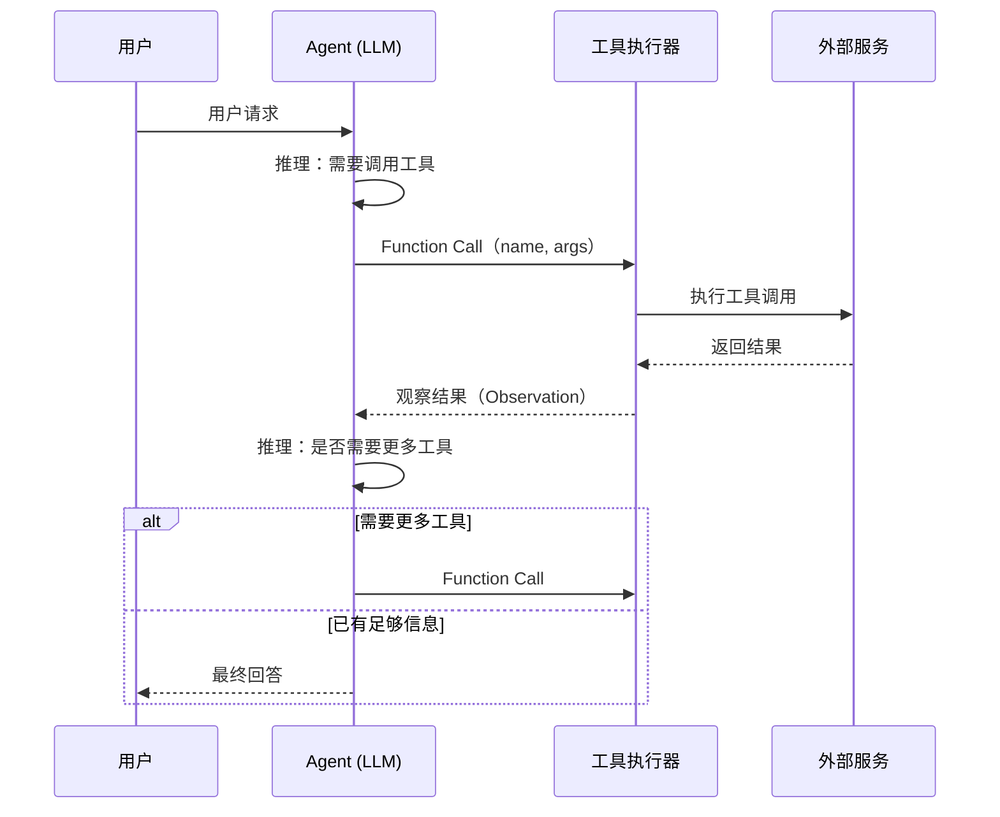
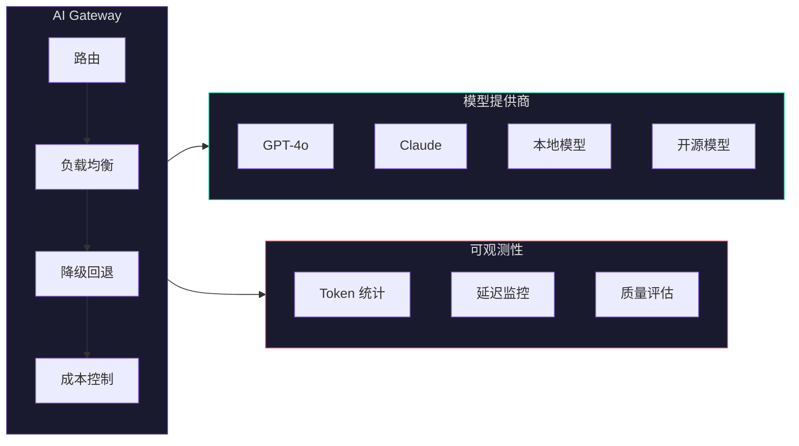
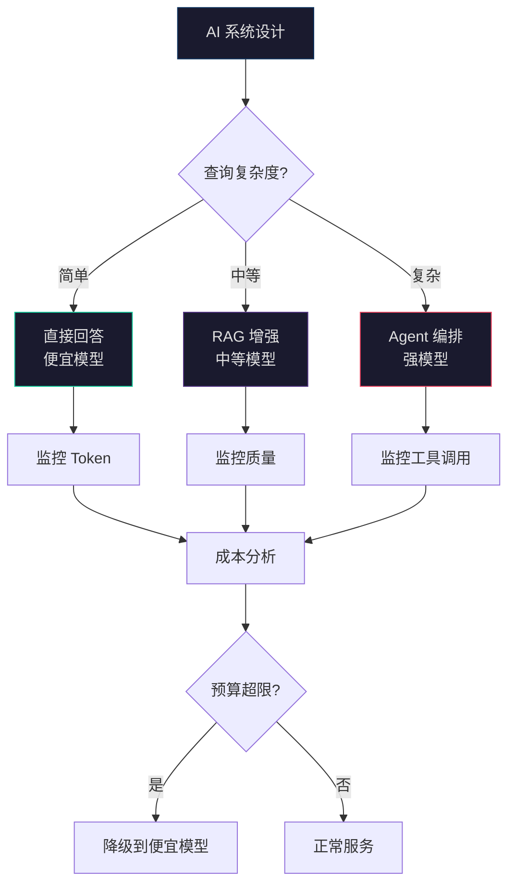

[📖 返回目录](README.md) · [⬅️ 上一章](30-data-api-design.md) · [➡️ 下一章](README.md)

# 31 · AI 系统架构（LLM/RAG/Agent）（资深向）

> 适用对象：10+ 年经验的资深工程师 / 架构师候选人。本章覆盖 LLM 推理架构与服务化、RAG 全链路设计（检索/重排/生成/评估）、Agent 架构模式与多智能体协作、Java AI 生态（LangChain4j / Spring AI）、AI 系统工程化（可观测性/测试/安全）及架构实战陷阱。面试落点：不背概念，能讲清「RAG 和 Fine-tuning 怎么选」「向量数据库怎么选」「Agent 的 tool calling 失败怎么处理」「LLM 推理延迟怎么优化」「AI 系统的 SLA 怎么定」。

**TL;DR 本章学习要点**

1. LLM 推理的核心瓶颈是**内存带宽**（Memory-bound），而非计算——KV Cache 是推理加速的根基，PagedAttention 将 KV Cache 以分页方式管理，消除了内存碎片；量化（GPTQ/AWQ/GGUF）在精度损失可控的前提下将显存需求降低 2-4 倍；
2. RAG 不是简单的「检索 + 生成」——全链路包含 **Query 理解 → 检索 → 重排 → 生成 → 评估**五个阶段，每个阶段都有独立的优化空间和工程陷阱；Chunking 策略、Embedding 模型选型、Hybrid 检索是影响质量的三个关键变量；
3. Agent 的本质是「LLM 作为推理引擎 + 外部工具调用 + 记忆系统 + 任务规划」——ReAct（思考-行动循环）是最基础的架构模式，Plan-and-Execute 适合复杂任务，Multi-Agent 适合需要多角色协作的场景；
4. Java 在 AI 工程化中的角色是**把模型接入企业系统**：LangChain4j 提供链式编排和 Agent 抽象，Spring AI 统一了模型调用接口和 RAG 集成——Java 的类型安全、事务管理、监控体系是 AI 应用落地最缺的部分；
5. AI 系统的**可观测性**与传统系统不同：除了延迟和吞吐，还需要监控 Token 用量、幻觉率（Hallucination Rate）、检索相关性（Context Relevance）等 LLM 特有指标。

---

### 📑 本章目录

- [1. LLM 推理架构](#1-llm-推理架构)
- [2. RAG 全链路架构](#2-rag-全链路架构)
- [3. Agent 架构模式](#3-agent-架构模式)
- [4. Java AI 生态与工程化](#4-java-ai-生态与工程化)
- [5. AI 系统架构实战与陷阱](#5-ai-系统架构实战与陷阱)
- [考点速查表](#考点速查表)

---

## 1. LLM 推理架构

### 1.1 Transformer 推理的核心瓶颈

Transformer 的自回归生成（Autoregressive Generation）本质上是**逐 token 生成**的：每生成一个新 token，都需要 attend 到所有历史 token 的 Key 和 Value。



- **Prefill 阶段**：处理整个输入 prompt，一次性计算所有 token 的 KV Cache——这是计算密集型（Compute-bound），GPU 算力是瓶颈；
- **Decode 阶段**：逐 token 生成，每步只需计算一个 token 的 Q 与完整 KV Cache 的 Attention——这是**内存密集型（Memory-bound）**，GPU 显存带宽是瓶颈；
- 一句话：**推理加速的关键在于减少 Decode 阶段的内存访问**——KV Cache 优化、量化、Speculative Decoding 都围绕这个核心。

### 1.2 推理优化技术栈

| 技术 | 原理 | 效果 | 代价 |
|---|---|---|---|
| **KV Cache** | 缓存历史 token 的 K/V，避免重复计算 | 从 O(n²) 降至 O(n) 计算量 | 显存占用与序列长度成正比 |
| **PagedAttention** | 将 KV Cache 以「页」为单位管理（类似 OS 虚拟内存） | 消除内存碎片，显存利用率提升 50%+ | 需要 vLLM 支持 |
| **量化（GPTQ/AWQ）** | 将 FP16 权重量化为 INT4/INT8 | 显存降低 2-4 倍，推理速度提升 1.5-3 倍 | 精度损失 1-3%（INT4 约 2%） |
| **GGUF 量化** | CPU/GPU 混合推理的量化格式（llama.cpp） | 适合端侧部署，无需 GPU | 推理速度较慢 |
| **Speculative Decoding** | 用小模型草拟多个 token，大模型批量验证 | 生成速度提升 2-3 倍 | 需要 draft model，实现复杂 |
| **Continuous Batching** | 动态合并不同请求的 Decode 步骤 | 吞吐量提升 5-10 倍 | 调度逻辑复杂 |
| **Flash Attention** | IO-aware 的 Attention 算法，减少 HBM 访问 | 速度提升 2-4 倍，显存降低 | 需要特定硬件支持 |

> **面试题 1：LLM 推理为什么是 Memory-bound 而不是 Compute-bound？**
>
> **答**：Decode 阶段每步只做一次矩阵-向量乘法（Q × K^T 和 softmax × V），计算量很小，但需要读取完整的 KV Cache（每层每个 head 都有 K 和 V 两个矩阵）。以 Llama-70B 为例，FP16 下 KV Cache 每 token 约 1MB，序列长度 4096 时 KV Cache 达 4GB——而 GPU（如 A100-80GB）的 HBM 带宽约 2TB/s，读取 KV Cache 需要 2ms，而矩阵乘法只需 0.1ms。**瓶颈在数据搬运而非计算**，这是 Memory-bound 的本质。

### 1.3 模型服务架构选型

| 框架 | 核心特性 | 适用场景 |
|---|---|---|
| **vLLM** | PagedAttention、Continuous Batching、Prefix Caching | 高吞吐在线推理 |
| **TGI（Text Generation Inference）** | HuggingFace 生态、Flash Attention、量化支持 | 与 HF 模型无缝集成 |
| **TensorRT-LLM** | NVIDIA 官方、极致推理优化、FP8 支持 | NVIDIA GPU 上的极致性能 |
| **Triton Inference Server** | 多模型服务、动态批处理、模型流水线 | 多模型混合部署 |



- **vLLM** 是当前最主流的开源推理引擎，PagedAttention 消除了 KV Cache 内存碎片，Continuous Batching 实现了动态合并请求——在 LMSYS 排行榜上，同等硬件下 vLLM 吞吐量是 HuggingFace Transformers 的 10-24 倍；
- **TensorRT-LLM** 适合对延迟有极致要求的场景（如实时对话），但部署复杂度高；
- 生产环境推荐：**vLLM 做主力推理 + Triton 做多模型编排 + AI Gateway 统一入口**。

### 1.4 并行推理策略

| 策略 | 原理 | 适用场景 |
|---|---|---|
| **Tensor Parallelism（TP）** | 将模型的每一层切分到多个 GPU | 单卡放不下的大模型 |
| **Pipeline Parallelism（PP）** | 将模型的不同层分配到不同 GPU | 超大模型、多机推理 |
| **Data Parallelism（DP）** | 多个 GPU 各自持有完整模型副本，处理不同请求 | 提升吞吐量 |
| **Expert Parallelism（EP）** | MoE 模型的专家分布在不同 GPU | Mixtral 等 MoE 模型 |

- 实践：70B 模型用 TP=4（4 张 A100-80G），13B 用 TP=1，7B 用 INT4 量化后单卡即可；
- **KV Cache 显存预估公式**：`KV_Cache_MB = 2 × num_layers × num_heads × head_dim × seq_len × batch_size × bytes_per_element`；例如 Llama-70B（80层、64头、128维、FP16），单 token KV Cache ≈ 1.25MB。

> **面试题 2：如何选择推理优化方案？**
>
> **答**：按优先级——（1）先上 **Continuous Batching**（吞吐量提升最大，零成本）；（2）再加 **PagedAttention**（vLLM 默认开启）；（3）显存不够上 **量化**（INT4 GPTQ 精度损失约 2%）；（4）延迟敏感上 **Speculative Decoding**（提升 2-3 倍）；（5）极致性能上 **TensorRT-LLM + FP8**。不要一上来就量化——先确认是不是显存瓶颈，再决定方案。

---

## 2. RAG 全链路架构

### 2.1 RAG 全链路总览

RAG（Retrieval-Augmented Generation）是解决 LLM **知识时效性**和**幻觉问题**的核心架构模式。



五个阶段的**各自优化目标**：

| 阶段 | 目标 | 关键技术 |
|---|---|---|
| Chunking | 切分粒度影响检索质量 | 语义分块、递归分块、Late Chunking |
| Embedding | 向量化质量决定检索上限 | 领域微调、多语言模型、维度选择 |
| Retrieval | 召回率 × 精确率 | Hybrid Search（Dense + BM25）、Multi-Query、HyDE |
| Reranking | 精排提升 Top-K 相关性 | Cross-Encoder、ColBERT、Cohere Rerank |
| Generation | 减少幻觉、增加引用 | Prompt 模板、引用追踪、Self-Consistency |

### 2.2 Chunking 策略对比

| 策略 | 原理 | 优点 | 缺点 |
|---|---|---|---|
| **固定大小** | 按字符/token 数切分 | 简单、可预测 | 破坏语义完整性 |
| **递归分块** | 先按段落分，超长再按句子分（LangChain 默认） | 保持语义层次 | 需要调参 |
| **语义分块** | 用 Embedding 相似度判断切分点 | 语义完整性最好 | 计算成本高 |
| **Late Chunking** | 先对整个文档做 Embedding，再切分 | 保留全局上下文 | 实现复杂 |
| **Parent-Child** | 小块做检索，返回父块做上下文 | 检索精度高 + 上下文完整 | 索引存储翻倍 |

- **实践建议**：大多数场景用**递归分块**（chunk_size=512, overlap=50）即可；高精度场景用 Parent-Child 策略——小块（256 token）做检索，返回大块（1024 token）给 LLM；
- **切分粒度经验值**：技术文档 512-1024 token，法律合同 256-512 token，对话记录不切分。

### 2.3 向量数据库选型

| 数据库 | 架构 | 核心特性 | 适用场景 |
|---|---|---|---|
| **Milvus** | 分布式、存算分离 | 高可用、十亿级向量、混合检索 | 大规模生产环境 |
| **Qdrant** | Rust 编写、单机/集群 | Payload 过滤、量化压缩、性能优秀 | 中小规模、快速上手 |
| **Weaviate** | Go 编写、GraphQL API | 内置向量化、多模态 | 需要内置 Embedding |
| **Pinecone** | 全托管 SaaS | 零运维、自动扩缩 | 不想自建的团队 |
| **pgvector** | PostgreSQL 扩展 | 与现有 PG 集成、简单查询 | 小规模、已有 PG 基础设施 |

- **选型决策树**：
  1. 数据量 < 100 万向量且已有 PostgreSQL → **pgvector**
  2. 需要零运维且预算充足 → **Pinecone**
  3. 需要自建且性能优先 → **Milvus**（大规模）或 **Qdrant**（中小规模）
  4. 需要多模态 + 内置向量化 → **Weaviate**

### 2.4 检索策略深度

**Hybrid Search（混合检索）**是生产环境的最佳实践：



| 策略 | 原理 | 优势 | 劣势 |
|---|---|---|---|
| **Dense** | Embedding 向量余弦/内积相似度 | 语义理解好 | 精确匹配弱（如专有名词） |
| **Sparse (BM25)** | TF-IDF 变体，词频 + 逆文档频率 | 精确匹配强 | 无法理解语义 |
| **Hybrid (RRF)** | Reciprocal Rank Fusion 合并两路结果 | 兼顾语义和精确 | 需要调权重 |
| **Multi-Query** | LLM 生成多个变体查询，合并结果 | 提升召回率 | 多次检索，延迟增加 |
| **HyDE** | LLM 先生成假设性答案，用答案做检索 | 查询-文档对齐更好 | 生成质量不稳定 |

- **RRF（Reciprocal Rank Fusion）公式**：`score = Σ 1/(k + rank_i)`，k=60 是经验值；融合时 Dense 和 Sparse 各占 50% 权重起步，按 A/B 测试调整。

### 2.5 Advanced RAG 架构

| 模式 | 核心思想 | 适用场景 |
|---|---|---|
| **GraphRAG** | 构建知识图谱，实体关系检索 + 社区摘要 | 多文档推理、关系密集型查询 |
| **Self-RAG** | LLM 自己判断是否需要检索、检索结果是否有用 | 减少不必要的检索调用 |
| **Corrective RAG** | 检索后评估相关性，不相关则用 Web 搜索纠正 | 知识库覆盖不全的场景 |
| **Adaptive RAG** | 根据查询复杂度动态选择检索策略（直接/单步/多步） | 复杂度差异大的混合查询 |

> **面试题 3：RAG 和 Fine-tuning 怎么选？**
>
> **答**：不是二选一，而是**按需求组合**——（1）知识时效性问题（需要实时更新知识）→ **RAG**；（2）领域专业术语/风格适配（如医疗/法律）→ **Fine-tuning**；（3）两者都需要 → **RAG + Fine-tuning**（微调模型理解领域术语，RAG 提供最新知识）；（4）快速原型验证 → 先 RAG（成本低、迭代快），效果不够再 Fine-tuning。关键区别：RAG 改变的是「给模型看什么」，Fine-tuning 改变的是「模型怎么思考」。

> **面试题 4：向量数据库怎么选？（追问）**
>
> **答**：核心看三个维度——（1）**数据规模**：< 100 万用 pgvector，100 万-10 亿用 Milvus/Qdrant，> 10 亿用 Milvus 分布式；（2）**运维能力**：无运维团队用 Pinecone，有运维能力自建 Milvus/Qdrant；（3）**功能需求**：需要混合检索（向量 + 标量过滤）→ Milvus/Qdrant，需要内置向量化 → Weaviate。**不要迷信排行榜**——选型最重要的是匹配你的规模和团队能力。

---

## 3. Agent 架构模式

### 3.1 Agent 核心组件

Agent = **LLM（推理引擎）+ Tools（外部能力）+ Memory（记忆系统）+ Planning（任务规划）**



### 3.2 Agent 架构模式对比

| 模式 | 核心思想 | 优势 | 劣势 |
|---|---|---|---|
| **ReAct** | Thought → Action → Observation 循环 | 简单直观，可解释性强 | 容易陷入循环，步骤不可预测 |
| **Plan-and-Execute** | 先制定计划，再逐步执行 | 适合复杂任务，可控性强 | 计划可能过时，需要重规划 |
| **Reflection** | 生成后自我评估、反思改进 | 输出质量高 | 额外 LLM 调用，延迟增加 |
| **Multi-Agent** | 多个专业 Agent 协作 | 专业化分工，可扩展 | 通信成本高，协调复杂 |

**ReAct 模式详解**（最基础也最常用）：

```python
# ReAct 循环伪代码
while not done:
    thought = llm.think(f"当前状态: {state}, 目标: {goal}")
    action = llm.choose_action(thought, available_tools)
    observation = execute(action)
    state = update(state, observation)
    if is_final_answer(observation):
        done = True
```

### 3.3 Tool Calling 机制

Function Calling 是 Agent 与外部世界交互的桥梁：



- **工具定义**：每个工具需要 `name`、`description`、`parameters`（JSON Schema）——LLM 根据 description 决定何时调用哪个工具；
- **错误处理**：工具调用失败时，Agent 应该能「看到」错误信息并决定重试、换工具或放弃——这就是 Observation 的价值；
- **并发调用**：部分 LLM 支持并行 Function Calling（如 GPT-4o），可以在一次推理中返回多个工具调用——减少交互轮次。

### 3.4 Memory 系统设计

| 记忆类型 | 存储内容 | 存储方式 | 生命周期 |
|---|---|---|---|
| **短期记忆（Working Memory）** | 当前对话上下文 | LLM Context Window | 单次会话 |
| **长期记忆（Long-term）** | 历史交互摘要 | 向量数据库 | 持久化 |
| **情景记忆（Episodic）** | 特定任务经历 | 向量数据库 + 时间戳 | 可检索 |
| **语义记忆（Semantic）** | 提炼的知识/规则 | 知识图谱或文档 | 永久 |

- **Context Window 管理**：LLM 上下文窗口有限（GPT-4o 128K，Claude 3.5 200K）——长对话需要压缩历史（摘要/滑动窗口）+ 检索相关历史（向量搜索）；
- **Memory Architecture 模式**：MemGPT 式的「虚拟内存」——类似 OS 的页表机制，LLM 自己决定哪些信息在「内存」（Context Window）里，哪些在「磁盘」（向量 DB）里。

> **面试题 5：Agent 的 tool calling 失败怎么办？**
>
> **答**：分三个层次处理——（1）**重试**：网络超时等瞬时错误，指数退避重试 3 次；（2）**降级**：特定工具不可用时，换一个功能相似的工具（如主搜索 API 挂了切备用 API）；（3）**告知用户**：无法恢复时，Agent 应坦诚告知「X 工具当前不可用，我可以…」而不是编造结果。**关键原则**：Agent 永远不要在 tool call 失败后「假装成功」——幻觉的根源就是「信息不足时强行生成」。

> **面试题 6：多 Agent 系统怎么协调？（追问）**
>
> **答**：三种模式——（1）**Supervisor（监督者）**：一个主 Agent 分配任务给子 Agent，适合层级清晰的任务（如「研究员收集资料 → 写作者撰文 → 审稿者校对」）；（2）**Debate（辩论）**：多个 Agent 独立思考后交叉评审，适合需要多角度分析的决策；（3）**Hierarchical（层级）**：多层 Supervisor，适合大规模复杂任务。**核心权衡**：Agent 数量增加带来通信成本和一致性问题——经验法则是**能用单 Agent 解决的不要用多 Agent**，多 Agent 只在「专业化分工收益 > 协调成本」时使用。

---

## 4. Java AI 生态与工程化

### 4.1 LangChain4j 深度

LangChain4j 是 Java 生态中最成熟的 AI 编排框架，提供 Chain、Agent、Memory、RAG 全套抽象。

```java
// LangChain4j Agent with Tools 示例
@SystemMessage("你是一个数据分析助手，可以查询数据库和搜索文档。")
class DataAnalysisAgent {

    @UserMessage("分析 {{question}}")
    String analyze(@V("question") String question);
}

// 定义工具
class DatabaseTool {
    @Tool("查询 SQL 数据库并返回结果")
    String queryDatabase(@P("SQL 查询语句") String sql) {
        // 执行 SQL 查询
        return jdbcTemplate.queryForObject(sql, String.class);
    }
}

class DocumentSearchTool {
    @Tool("搜索文档知识库并返回相关片段")
    String searchDocuments(@P("搜索关键词") String query) {
        // 调用向量数据库
        return vectorStore.similaritySearch(query);
    }
}

// 配置 Agent
DataAnalysisAgent agent = AiServices.builder(DataAnalysisAgent.class)
    .chatLanguageModel(model)
    .tools(new DatabaseTool(), new DocumentSearchTool())
    .chatMemory(MessageWindowChatMemory.withMaxTokens(10000))
    .build();

String result = agent.analyze("上个月的用户增长趋势如何？");
```

- **核心概念**：`AiServices` 是入口，`@Tool` 注解声明工具，`ChatMemory` 管理对话上下文，`ChatLanguageModel` 抽象模型调用；
- **与 Spring Boot 集成**：`langchain4j-spring-boot-starter` 自动装配，配置 `langchain4j.open-ai.chat-model.api-key` 即可。

### 4.2 Spring AI 概览

Spring AI 是 Spring 官方的 AI 抽象层，目标是**统一不同模型提供商的调用接口**。

```java
// Spring AI RAG 配置示例
@Configuration
class RagConfig {

    @Bean
    ChatClient chatClient(ChatModel chatModel,
                          VectorStore vectorStore,
                          QuestionAnswerAdvisor advisor) {
        return ChatClient.builder(chatModel)
            .defaultAdvisors(advisor)
            .defaultFunctions("databaseQuery", "documentSearch")
            .build();
    }

    @Bean
    QuestionAnswerAdvisor questionAnswerAdvisor(
            VectorStore vectorStore,
            RetrievalAugmentationAdvisor advisor) {
        return new QuestionAnswerAdvisor(vectorStore);
    }
}

// 使用 RAG
@Service
class QAService {
    private final ChatClient chatClient;

    String answer(String question) {
        return chatClient.prompt()
            .user(question)
            .call()
            .content();
    }
}
```

- **Spring AI vs LangChain4j**：Spring AI 更「Spring 原生」（与 Spring Boot/Cloud 深度集成），LangChain4j 功能更丰富（Agent/Chain/Memory 抽象更完整）——选择取决于团队技术栈偏好。

### 4.3 AI Gateway 模式



- **路由**：根据任务类型/模型能力/成本约束路由到不同模型（如简单问答 → 便宜模型，复杂推理 → 强模型）；
- **降级回退**：主模型不可用时自动切换到备选模型（如 GPT-4o → Claude → 本地模型）；
- **成本控制**：按用户/项目设置 Token 用量上限，超限自动降级或拒绝。

### 4.4 AI 可观测性

AI 系统的可观测性与传统系统有本质区别——**需要监控 LLM 特有指标**：

| 指标 | 含义 | 告警阈值建议 |
|---|---|---|
| **TTFT（Time to First Token）** | 首 token 延迟 | > 1s 告警（用户感知明显） |
| **TPOT（Time Per Output Token）** | 每个输出 token 的延迟 | > 100ms 告警 |
| **Token Usage** | 输入/输出 token 数 | 突增 50% 告警 |
| **Hallucination Rate** | 幻觉率（答案中不实信息比例） | > 5% 告警 |
| **Context Relevance** | 检索结果与查询的相关性 | < 0.6 告警 |
| **Tool Call Success Rate** | 工具调用成功率 | < 95% 告警 |

- **工具选型**：Langfuse（开源 LLM 可观测平台）、Phoenix（Arize AI 的追踪工具）、OpenTelemetry + 自定义 Span。

> **面试题 7：Spring AI 和 LangChain4j 怎么选？**
>
> **答**：看团队和场景——（1）**团队是 Spring 全家桶** → Spring AI（与 Spring Boot/Cloud/Micrometer 无缝集成，学习成本低）；（2）**需要复杂的 Agent 和 Chain 编排** → LangChain4j（Agent/Memory/Chain 抽象更完整，社区更活跃）；（3）**快速验证** → 两者都行，Spring AI 的 API 更简洁；（4）**生产环境** → 关注社区活跃度和长期维护——LangChain4j 社区更大、迭代更快。**核心建议**：不要深度绑定任何框架——通过接口抽象隔离，方便未来切换。

---

## 5. AI 系统架构实战与陷阱

### 5.1 幻觉缓解策略

| 策略 | 原理 | 效果 | 成本 |
|---|---|---|---|
| **RAG 增强** | 提供真实文档作为上下文 | 显著降低幻觉 | 需要构建知识库 |
| **引用追踪** | 要求 LLM 标注信息来源 | 便于验证 | 需要后处理 |
| **Self-Consistency** | 多次采样取一致性最高的答案 | 提升准确性 | 多次 LLM 调用 |
| **温度调节** | 降低 temperature（0.1-0.3） | 减少创造性胡编 | 可能降低回答多样性 |
| **Guardrails** | 输出过滤 + 事实校验 | 最后一道防线 | 需要构建校验规则 |
| **Fine-tuning** | 在高质量数据上微调 | 从源头减少幻觉 | 需要标注数据 |

### 5.2 AI 系统 SLA 设计

| 维度 | 指标 | 典型目标 |
|---|---|---|
| **延迟** | P95 TTFT | < 2s（在线场景） |
| **延迟** | P95 端到端 | < 10s（含检索+生成） |
| **吞吐** | QPS | 根据业务需求定 |
| **可用性** | 成功率 | > 99.5%（含降级） |
| **质量** | 答案准确率 | > 90%（RAG 增强后） |
| **成本** | 单次请求成本 | < ¥0.1（混合路由后） |

- **混合路由降成本**：简单任务用便宜模型（如 GPT-4o-mini），复杂任务用强模型——通过 AI Gateway 实现，成本可降低 60-80%；
- **降级策略**：主模型超时/不可用 → 切换备选模型 → 本地小模型兜底 → 返回「暂时无法回答」。

### 5.3 常见陷阱

| 陷阱 | 症状 | 解决方案 |
|---|---|---|
| **RAG 过度依赖** | 所有问题都走 RAG，简单问题也被检索拖慢 | 意图分类：简单问题直接回答，复杂问题走 RAG |
| **Embedding Drift** | 新旧 Embedding 模型混用导致检索失败 | 版本化 Embedding，迁移时全量重建索引 |
| **Context Window 浪费** | 检索 20 条结果但只用了前 3 条 | 动态调整 Top-K，或用 Reranker 精排后截断 |
| **Prompt 膨胀** | System Prompt 越来越长，挤占用户输入空间 | Prompt 版本管理 + 自动裁剪 |
| **幻觉级联** | Agent 工具调用结果有误，LLM 基于错误结果继续推理 | 每步结果做校验，异常时中断而非继续 |
| **成本失控** | Token 用量暴增，月底账单惊人 | Token 用量监控 + 预算告警 + 模型路由降级 |



> **面试题 8：如何控制 LLM 调用成本？**
>
> **答**：四层控制——（1）**模型路由**：简单任务用便宜模型（GPT-4o-mini 单价是 GPT-4o 的 1/30），复杂任务才用强模型，AI Gateway 按意图自动路由；（2）**缓存**：相似查询直接返回缓存结果（Semantic Cache，用向量相似度判断），可命中 30-50% 的重复查询；（3）**Prompt 精简**：System Prompt 每多 100 token，每次调用都多花成本——定期审计 Prompt，去掉冗余；（4）**预算告警**：按项目/用户设置 Token 用量上限，超限自动降级或拒绝。

> **面试题 9：Agent 和传统微服务有什么架构异同？**
>
> **答**：相同点——都追求**松耦合、可观察、容错**；都是「请求 → 处理 → 响应」模型。核心区别——（1）**不确定性**：微服务是确定性的（相同输入 → 相同输出），Agent 是非确定性的（LLM 推理有随机性）；（2）**工具调用**：微服务通过 API Gateway 调用其他服务（契约固定），Agent 通过 Function Calling 调用工具（LLM 自己决定调哪个）；（3）**可观测性**：微服务用 metrics/logs/traces 三支柱，Agent 还需要监控 LLM 特有指标（幻觉率、Token 用量）；（4）**测试**：微服务用单元/集成/E2E 测试，Agent 需要**评估驱动测试**（Evaluation-driven testing）——用评估数据集衡量输出质量。

> **面试题 10：Context window 不够怎么办？**
>
> **答**：四层策略——（1）**Prompt 压缩**：去掉冗余指令、压缩历史对话（摘要替代原文）；（2）**滑动窗口**：保留最近 N 轮对话 + 检索相关历史；（3）**RAG 分层**：小块检索 → 大块送 LLM，只送最相关的上下文；（4）**Map-Reduce**：长文档分段处理，每段独立提取信息，最后汇总——适合摘要/提取类任务。**最根本的方案**是用更大的模型（Claude 3.5 支持 200K），但成本更高。

---

## 考点速查表

| 考点 | 关键要点 |
|---|---|
| **LLM 推理瓶颈** | Decode 阶段是 Memory-bound，KV Cache 是关键优化点 |
| **推理优化优先级** | Continuous Batching → PagedAttention → 量化 → Speculative Decoding → TensorRT-LLM |
| **RAG 全链路** | Query 理解 → 检索 → 重排 → 生成 → 评估，五个阶段各自优化 |
| **Chunking 策略** | 递归分块（通用）、Parent-Child（高精度）、语义分块（高成本） |
| **向量数据库选型** | 规模 × 运维能力 × 功能需求，pgvector/Milvus/Qdrant/Pinecone 各有定位 |
| **Hybrid Search** | Dense（语义）+ Sparse（BM25）+ RRF 融合，生产环境最佳实践 |
| **Advanced RAG** | GraphRAG（关系推理）、Self-RAG（自适应检索）、Corrective RAG（纠错） |
| **Agent 核心** | LLM + Tools + Memory + Planning，ReAct 是基础模式 |
| **Tool Calling** | Function Calling 协议，失败时重试/降级/告知用户 |
| **Memory 系统** | 短期（Context Window）+ 长期（向量 DB）+ 情景 + 语义 |
| **Multi-Agent** | Supervisor / Debate / Hierarchical 三种模式，能单 Agent 不用多 Agent |
| **Java AI 生态** | LangChain4j（功能丰富）vs Spring AI（Spring 原生），通过接口抽象隔离 |
| **AI Gateway** | 路由 + 负载均衡 + 降级 + 成本控制 |
| **AI 可观测性** | TTFT/TPOT + Token 用量 + 幻觉率 + 检索相关性 + 工具成功率 |
| **幻觉缓解** | RAG + 引用追踪 + Self-Consistency + 温度调节 + Guardrails |
| **AI SLA** | P95 TTFT < 2s, 成功率 > 99.5%, 单次成本 < ¥0.1 |
| **成本控制** | 模型路由 + Semantic Cache + Prompt 精简 + 预算告警 |
| **Context Window** | Prompt 压缩 + 滑动窗口 + RAG 分层 + Map-Reduce |
