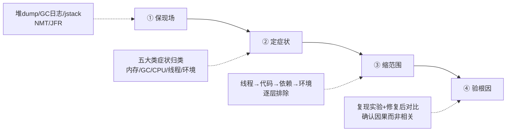
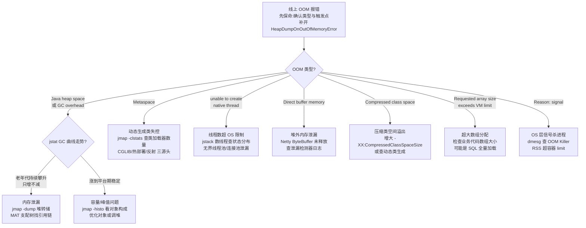
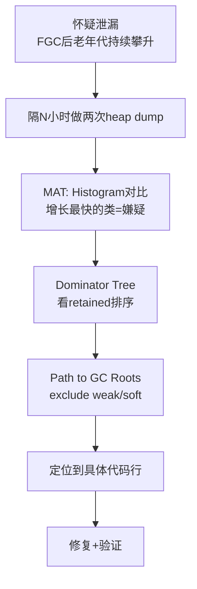
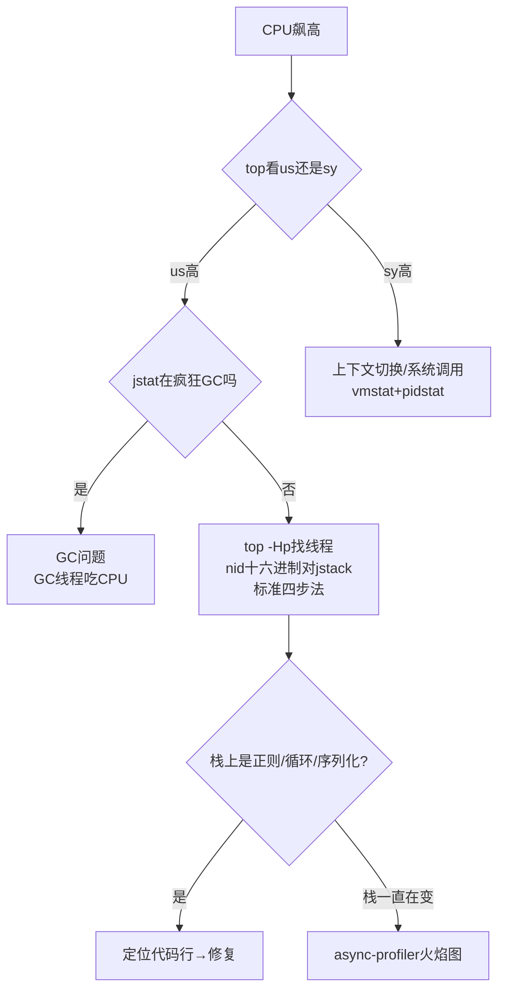

[⬅️ 上一章](32-emerging-trends.md) · [📖 返回目录](README.md)
# 33 · JVM 生产问题排查实战（含排查工具箱与案例集）

> **📌 30 秒速览**
> 1. 生产排查四步法：**保现场 → 定症状 → 缩范围 → 验根因**；止血优先于根因，但止血前必须留证据。
> 2. JDK 自带工具够覆盖 80% 场景：`jcmd` 是现代统一入口，JFR 低开销常驻是「出事后有数据」的最佳保险。
> 3. OOM 不是一种病，是八种病共用一个名字——`OutOfMemoryError:` 后面的短语才是病灶。
> 4. 内存泄漏的本质是「仍然可达但不再使用」的对象，判断标准是 **FGC 后老年代不回落 + 多次 dump 对比持续上涨**。
> 5. CPU 100% 先分清 us（应用）/ sy（内核），us 高走「top -Hp → printf 十六进制 → jstack 对号」标准链路。
> 6. 堆外问题三症状：**RSS 远大于 Xmx**、`Direct buffer memory` OOM、容器里被 OOMKilled(137)——堆看着健康，进程却死了。

> **本章与 02 章的关系**：02 章覆盖 JVM 面试核心考点（内存结构/GC/JIT/基础排查），本章聚焦**生产环境深度排查**——完整工具箱、全场景 OOM、泄漏模式、热点分析、容器环境，以及真实故障案例。两章互补，面试讲排查链路时先引 02 章基础，再以本章展示深度。

---

## 1. 排查方法论与工具箱

### 1.1 排查四步法



**① 保现场**：第一时间采集堆 dump（或确认 OOM 自动 dump 已配置）、GC 日志、线程 dump、NMT 数据。采集顺序：先抓无损的（日志、jstack），再抓有代价的（heap dump 会触发 Full GC）。

**② 定症状**：用症状路由表把问题归入五大类（内存/GC/CPU/线程/环境），避免上来就猜原因。同一进程可能多症并发（如 CPU 高 + FGC 频繁），要分辨主因和伴生现象——通常是内存问题引发 GC 风暴再引发 CPU 高，主因在内存。

**③ 缩范围**：沿「线程 → 代码 → 依赖 → 环境」四层往下钻：jstack 定位到线程状态 → 对应到代码行 → 检查其调用的下游（DB/缓存/RPC）→ 排除容器/OS 层因素。

**④ 验根因**：找到嫌疑点不算完，要做**验证闭环**：改参数/代码后观察指标恢复；能复现的做最小复现实验；不能复现的用排除法 + 多次同类故障印证。

**止血优先原则**：

| 手段 | 生效速度 | 现场损失 | 适用 |
|------|---------|---------|------|
| 摘流量（权重调 0/下线实例） | 秒级 | 无 | 单实例异常，集群健康 |
| 重启 | 分钟级 | 堆内数据丢失，dump 可保留 | 内存泄漏/假死 |
| 回滚版本 | 分钟级 | 无（配置外置时） | 发布后出现的问题 |
| 扩容稀释 | 分钟级 | 无 | 容量型问题 |
| 调参重启（如加堆） | 需重启 | 无 | 参数型根因 |

### 1.2 工具总览矩阵

| 工具 | 类型 | 典型场景 | 开销 | 是否需预装 |
|------|------|---------|------|-----------|
| `jcmd` | JDK 自带 | 统一诊断入口（dump/flags/classhisto/NMT/JFR） | 低 | 否 |
| `jstat` | JDK 自带 | GC 统计连续采样 | 极低 | 否 |
| `jstack` / `jcmd Thread.print` | JDK 自带 | 线程现场快照 | 低 | 否 |
| `jmap -histo` | 独立工具 | 对象直方图快速看谁占内存 | 中（live 会 FGC） | 否 |
| JFR + JMC | JDK 自带(8u262+免费) | 持续低开销全维度记录 | ~1% | 否 |
| **Arthas** | Java Agent | 在线诊断：watch/trace/tt/热更新 | 中 | 需 attach |
| **MAT** | 离线分析 | 堆 dump 支配树/泄漏报告 | 离线 | 本机分析 |
| **async-profiler** | native agent | CPU/分配/锁热点火焰图 | 低(~1-3%) | 需 attach |

选型口诀：**趋势看监控，现场用 jcmd/jstack，热点上 profiler，深挖开 MAT，动态追踪 Arthas**。

### 1.3 jcmd：现代统一诊断入口

`jps -l` 先拿 pid（容器内直接 `jcmd 1 ...` 或用 `pgrep java`）。核心子命令：

```bash
# —— 进程与 JVM 基本信息 ——
jcmd $PID VM.uptime                  # 运行时长
jcmd $PID VM.flags                   # 生效的 JVM 参数（排查"参数没生效"必看）
jcmd $PID VM.command_line_flags      # 启动命令行里的参数

# —— 内存 ——
jcmd $PID GC.heap_info               # 各代容量/占用
jcmd $PID GC.class_histogram         # 对象直方图（live 触发 FGC，慎用）
jcmd $PID GC.heap_dump /path/a.hprof # 堆 dump（触发 FGC）
jcmd $PID VM.native_memory summary   # NMT 内存分类（需 -XX:NativeMemoryTracking=summary）

# —— 线程 ——
jcmd $PID Thread.print               # 线程 dump（同 jstack）
jcmd $PID Thread.print -l            # 带 Locks 信息

# —— 性能采集 ——
jcmd $PID JFR.start name=rec duration=120s filename=/tmp/rec.jfr settings=profile
```

**易错点**：容器内 attach 机制跨 namespace 失败，进容器执行或用 kubectl debug ephemeral container。

### 1.4 jstat：GC 连续采样

```bash
jstat -gcutil $PID 1000 60     # 每 1s 采样一次，共 60 次
# 列含义: S0 S1 E O M CCS YGC YGCT FGC FGCT GCT
#  S0/S1 幸存者占用%, E Eden占用%, O 老年代占用%, M 元空间占用%
```

**读数要点**：
- **O 列高位 + FGC 次数持续增长且 O 不降** = 泄漏特征
- **E 列锯齿陡峭** = 分配速率高
- **M 列 >90% 且 FGC 后不回落** = 元空间触顶

### 1.5 JFR：低开销持续记录

JFR 从 JDK 11 起开源（8u262 backport 到 8），开销 ~1%，**可常驻开启**。

```bash
# 启动参数常驻（推荐生产基线）
-XX:StartFlightRecording=disk=true,maxage=12h,maxsize=2g,\
name=prod-rec,dumponexit=true,settings=profile,path-to-gc-roots=true

# 或运行中动态开始
jcmd $PID JFR.start duration=10m filename=/tmp/hot.jfr settings=profile
```

| 排查目标 | 关键事件 |
|---------|---------|
| 分配热点 | Allocation outside TLAB / in new TLAB |
| 长停顿 | Java Monitor Blocked / Thread Park |
| GC 细节 | All GC events（各阶段耗时构成） |
| IO 慢 | Socket Read/Write, File Read/Write |
| 方法采样 | ExecutionSample → 火焰图 |

### 1.6 Arthas：在线诊断瑞士军刀

| 命令 | 用途 | 示例 |
|------|--------|------|
| dashboard | 实时面板 | `dashboard` |
| thread | 线程栈，找最忙线程 | `thread -n 3` / `thread --state BLOCKED` |
| jad | 反编译确认线上真实代码 | `jad com.x.OrderService placeOrder` |
| watch | 观察方法入参/返回/异常 | `watch com.x.Svc method '{params,returnObj}' -x 2` |
| trace | 方法内部调用链耗时 | `trace com.x.Svc method '#cost > 200'` |
| tt | 时间隧道：记录调用并重放 | `tt -t com.x.Svc method` → `tt -p -i 1000` |
| heapdump | 导堆 dump | `heapdump --live /tmp/live.hprof` |
| profiler | 集成 async-profiler | `profiler start` → `profiler stop --format html` |
| vmtool | 直接查询 JVM 内对象 | `vmtool --action getInstances --className Cache -x 2` |

**使用红线**：`watch/trace` 大流量入口方法会放大延迟与内存（表达式求值开销 × QPS），只在低流量时段或指定条件（`'#cost > 200'`）使用。

### 1.7 MAT：堆 dump 深度分析

三个杀手锏功能：

**① Leak Suspects 报告**：打开 dump 自动生成，按「可疑泄漏点」排序并画出疑点对象引用链。80% 泄漏看这个报告就有结论。

**② Dominator Tree（支配树）**：列出「谁支配了最多内存」——X 支配 Y 表示所有引用 Y 的路径都必须经过 X，因此 X 的 retained size 才是「删掉 X 真正能释放多少」。右键 → Path to GC Roots（exclude weak/soft references）。

**③ Histogram + 对比**：两个时间点的 dump 各出 histogram，diff 后增长最快的类就是泄漏嫌疑。

### 1.8 async-profiler：CPU/分配热点火焰图

```bash
asprof start -f /tmp/cpu.html $PID          # CPU 热点
asprof start -e alloc -f /tmp/alloc.html $PID   # 分配热点
asprof start -e lock -f /tmp/lock.html $PID     # 锁竞争
```

火焰图怎么看：**横轴 = 采样占比（越宽占比越大）**，找「平顶」——宽而顶部平坦的火苗 = 热点集中。

### 1.9 命令速查卡

```text
【一步定位 CPU】top -Hp PID → printf '%x\n' TID → jstack PID | grep -A 30 'nid=0x???'
【GC 压力】jstat -gcutil PID 1000 → 看 O/M/E 列 + FGC 趋势
【谁占内存】jmap -histo PID | head -25 （不看live避免FGC）
【现场三件套】jstack PID > t.txt; jcmd PID GC.heap_info; cp gc.log 备份
【死锁】jstack PID | grep -A 5 'deadlock'
【线程数】ls /proc/PID/task | wc -l
【元空间】jstat -gcutil 看 M 列
【容器137】dmesg -T | grep -i 'killed process' ; kubectl describe pod → Last State
```

### 本节常见误区

| 误区 | 正确姿势 |
|------|---------|
| 上来就重启，不留现场 | 至少留 jstack + GC 日志 + OOM dump 配置兜底 |
| 只用 jstack 抓热点 | 栈时刻在变，采样一次是彩票；三连拍或火焰图才可信 |
| watch 大流量方法 | 表达式求值开销×QPS 会压垮进程，限流时段+条件过滤 |
| MAT 打开就下结论 | Leak Suspects 只是「嫌疑」，必须 Path to GC Roots 验证 |
| 认为 JFR 开销大不敢开 | profile 档位约 1%，生产常驻收益远大于损耗 |

### 本节面试题

**Q1：线上服务突然大量超时，排查顺序？如果所有工具都显示正常呢？**

答：按四步法走：①保现场（jstack 三连拍 + GC 日志备份）；②定症状：看监控区分全部接口还是个别接口超时；③缩范围：jstack 看线程大面积状态；④验根因。追问：所有工具显示「正常」通常意味着问题不在 JVM 层——网络丢包重传（`ss -i` 看 retrans）、DNS、磁盘 IO await、宿主机资源争抢；也可能是周期性毛刺没被抓到，此时上 JFR 常驻 + tcpdump 等下一次。

**Q2：为什么说 jcmd 可以替代 jmap/jstack/jinfo？**

答：jcmd 把诊断子命令统一到一个入口：Thread.print≈jstack、GC.heap_dump≈jmap -dump、VM.flags≈jinfo -flags。追问：`jmap -histo`（不带 :live）可以不触发 Full GC 查含垃圾的直方图，jcmd 的 class_histogram 只有 live 语义。

**Q3：生产环境能不能开 JFR？开销多大？**

答：可以。JFR 设计目标就是常态开启，profile 档位实测开销约 1%。建议 default 常驻 + 出问题时动态 `JFR.start settings=profile` 叠加深度记录。

---

## 2. OOM 全场景：8 种溢出的定位与解决

> 本节扩展 02 章 §5.2 的 5 类 OOM 案例，覆盖完整的 8 种 `OutOfMemoryError` 场景。

### 2.1 OOM 总分流决策树



### 2.2 Java heap space（堆溢出）

**现象**：频繁 Full GC 后抛 OOM。

**排查**：
1. 判断泄漏 vs 容量：jstat 曲线持续攀升 → 泄漏；涨到峰值稳定 → 容量问题
2. 泄漏：`jmap -dump:format=b,file=heap.hprof <pid>`，MAT 支配树找引用链
3. 容量：优化对象（懒加载、分页、缓存淘汰）或调堆

**经典根因**：缓存无界、SQL 无 limit 全量加载、集合静态持有、大对象序列化。

### 2.3 GC overhead limit exceeded

GC 占用 >98% 且回收 <2%，JVM 主动抛 OOM 保命。本质同 heap space，但堆「还有空间却回收不动」，常见：大量不可达对象的创建速率过高（每秒百万级小对象）。

### 2.4 Metaspace（元空间溢出）

**三大源头**：
1. **动态代理/字节码生成失控**：每请求生成新代理类（CGLIB Enhancer 使用不当）
2. **热部署/动态加载框架未卸载**：类加载器被强引用无法回收
3. **反射/脚本引擎（Groovy）**动态编译

**快速定位**：`jmap -clstats <pid>` 看类加载器数量与每个加载器加载的类数，数量暴涨的就是源头。

### 2.5 Compressed class space（压缩类空间溢出）

当 `-XX:+UseCompressedClassPointers` 开启时，Klass 元数据在独立的压缩类空间中。Metaspace 被填满后，压缩类空间会先报错。解决：增大 `-XX:CompressedClassSpaceSize`（默认 1G）或修复动态类生成。

### 2.6 unable to create new native thread

线程数超 OS 限制（`ulimit -u`）或线程栈内存超进程内存。

**排查**：
```bash
# ① 先看是谁在疯狂建线程
jstack $PID | grep 'nid=' | wc -l
jstack $PID | grep 'nid=' | head -20  # 线程名形如 pool-N-thread-X

# ② OS 层临时放宽（治标）
ulimit -u 65535

# ③ 应用层根治
#    - 线程池统一管理：禁止裸 new Thread
#    - 虚拟线程(JDK21+) 替代万级平台线程需求
```

### 2.7 Direct buffer memory

堆外内存超 MaxDirectMemorySize，Netty/DirectByteBuffer 未释放，或堆外被 GC 延迟回收。

**排查**：查 Netty 泄漏检测器日志（`io.netty.leakDetection.level=paranoid`），RECENT 记录直接指向忘 release 的代码行。

### 2.8 GC overhead limit exceeded / Requested array size exceeds VM limit

- **GC overhead**：本质是堆接近满的前兆，按 heap space 路径处理
- **Array size**：业务代码创建超大数组，检查是否 SQL 全量加载或对象计算错误

### 2.9 其他 native 层 OOM

进程突然消失（退出码 137）= OS/Linux OOM Killer 所为，非 JVM 自己报错：
```bash
dmesg -T | grep -i 'killed process'   # 确认是 OOM Killer
kubectl describe pod → Last State     # K8s 容器事件
```

### 本节面试题

**Q1：线上 OOM 了，完整排查流程？**

答：1) 先保命：确认 OOM 类型（看日志），补开 `-XX:+HeapDumpOnOutOfMemoryError`；2) 判断泄漏 vs 容量：jstat 观察 GC 曲线；3) 泄漏：jmap -dump 拿转储，MAT 分析支配树/泄漏疑点；4) 容量：优化对象或调堆；5) 修复验证：灰度 + 压测。资深加分：先看「最近变更」——上线 diff 往往直接指向根因。

**Q2：没有开 HeapDumpOnOutOfMemoryError 怎么办？**

答：jmap -dump 手动抓（OOM 后进程还活着时）；已挂则只能靠日志与 jstat 历史曲线复盘。规范：**生产默认开启 HeapDumpOnOutOfMemoryError**。

---

## 3. 内存泄漏 Top10 模式与 MAT 实操

### 3.1 泄漏 vs 正常缓存 vs 容量不足

| 类型 | 内存趋势 | FGC 后表现 | 对策 |
|------|---------|-----------|------|
| 泄漏 | 持续单调上涨 | 不回落 | 找引用链，断开强引用 |
| 正常缓存 | 稳定在某水位 | 回落再涨 | 合理，可优化淘汰策略 |
| 容量不足 | 峰值触顶 | 回落到正常水平 | 加堆或减对象 |

### 3.2 泄漏定位标准流程



### 3.3 经典泄漏模式 Top10

| # | 模式 | 原因 | 防御 |
|---|------|------|------|
| 1 | **ThreadLocal 不 remove** | 线程池复用 + value 强引用 | `finally { tl.remove() }` |
| 2 | **静态集合无界增长** | HashMap/ArrayList 作为缓存但无淘汰 | 用 Caffeine/Guava 有界缓存 |
| 3 | **ClassLoader 泄漏** | 热部署/OSGi 未释放类加载器引用 | 确保 ClassLoader 可被 GC |
| 4 | **数据库连接/Statement 未关闭** | 异常路径跳过 close() | try-with-resources |
| 5 | **Stream/Iterator 未关闭** | NIO Channel/InputStream 不关 | try-with-resources |
| 6 | **大对象被长生命周期引用** | Session/Request 持有大对象引用 | 缩小引用范围 |
| 7 | **JDBC ResultSet 未关闭** | 查询后忘记关闭 | try-with-resources |
| 8 | **Observer/Listener 未注销** | 注册后从未 remove | 生命周期管理 |
| 9 | **字符串常量池膨胀** | `String.intern()` 滥用 | 避免 intern 大量动态字符串 |
| 10 | **Thread 异常退出未清理** | ThreadLocalMap 在线程销毁时才清理 | 线程池场景用阿里 P3C 规范封装 |

### 3.4 MAT 实操速成

```bash
# 服务端抓 dump
jcmd $PID GC.heap_dump /tmp/heap.hprof
# 下载到分析机(MAT 侧 -Xmx ≥ dump×1.5)
# 打开后依次：Leak Suspects → Dominator Tree → Path to GC Roots
```

**OQL 小技巧**：
```sql
SELECT * FROM byte[] b WHERE b.@retainedHeapSize > 100000000
-- 列出 retained 超 100MB 的字节数组
```

### 3.5 运行时轻量排查（拿不到 dump 时）

```bash
# 直方图采样：每10分钟记一次Top20，观察哪些类单调增长
jmap -histo $PID | head -20 > histo_t$(date +%H%M).txt

# Arthas 在线查静态集合大小
vmtool --action getInstances --className Cache --express 'size()' -x 2
```

### 本节面试题

**Q1：线上疑似内存泄漏，怎么确认是泄漏不是容量不够？**

答：两个判据：① jstat 看老年代 FGC 后是否回落——不回落=泄漏，回落=容量；② 间隔 N 小时做两次 dump，MAT Histogram 对比，某类实例数持续单调增长=泄漏嫌疑。追问：缓存类应用要区分「合法缓存增长」与「真泄漏」——看增长是否有上限、是否有淘汰策略。

**Q2：ThreadLocal 为什么会导致内存泄漏？怎么防？**

答：ThreadLocalMap 的 Entry key 是 WeakReference，但 **value 是强引用**：线程存活 → ThreadLocalMap 存活 → value 永远可达。key 被 GC 后 Entry 变「key=null 的脏条目」，value 泄漏。典型场景：线程池复用 + set 后不 remove。防御：`finally { tl.remove() }`，或用 Spring RequestContextHolder 等已封装的方案。

---

## 4. CPU 飙高深度排查

### 4.1 定位总流程



### 4.2 标准四步法

```bash
# ① 找到进程内最忙的线程
top -Hp $PID
# ② TID 转十六进制
printf '%x\n' <TID>
# ③ 线程 dump 里对号（连抓 3 次，间隔 5 秒）
jstack $PID | grep -A 30 'nid=0x<hex>'
# ④ 一条龙替代方案(Arthas)
thread -n 3       # 最忙的 3 个线程栈
profiler start    # 直接出火焰图
```

**注意**：jstack 单帧不可信——线程栈时刻在变，三连拍对比才有统计意义。

### 4.3 us 高：按栈顶分流

| 栈顶特征 | 根因 | 处理 |
|---------|------|------|
| 业务方法（正则匹配/JSON 解析） | 正则回溯、序列化热点 | 优化正则/换序列化方案 |
| `Thread.sleep` / `Object.wait` | 不耗 CPU，看错线程了 | 重新定位真正在跑的线程 |
| GC 线程（`G1Young`/`ConcurrentMark`） | GC 在烧 CPU | 转 GC 排查路径 |
| `Unsafe.compareAndSwap*` | CAS 自旋 | 锁竞争，查竞争来源 |

### 4.4 正则灾难回溯

最高频的「一行代码打挂服务」：贪婪回溯 + 回文匹配导致指数级时间复杂度。

```java
// 危险：嵌套量词导致回溯爆炸
Pattern.compile("(a+)+b").matcher("aaaaaaaaaaaaaaaaaaac");

// 修复：非贪婪 + 原子组 / 简化正则
Pattern.compile("a+b");
```

### 4.5 sy 高与上下文切换

```bash
vmstat 1 5           # 看 cs（context switch）列
pidstat -w -p $PID 1 5  # 看 cswch/s（自愿切换）和 nvcswch/s（非自愿切换）
```

高上下文切换根因：线程数远超 CPU 核数、锁竞争导致频繁阻塞/唤醒、GC 线程 STW 与应用线程交替。

### 4.6 CPU 高但 jstack 里业务线程都 WAITING

先看栈顶：`socketRead0`/`epollWait` 是等网络标记为 RUNNABLE 但不耗 CPU——说明 CPU 被其他线程占用（可能是 GC 线程），转 `jstat -gcutil` 确认。

### 本节面试题

**Q1：CPU 100% 但 GC 正常，怎么定位？**

答：排除 GC 后按「线程 → 方法」两级定位：`top -Hp` → `printf '%x'` → `jstack` 匹配线程栈。多数情况直接看到死循环/自旋/正则回溯。方法级定位用 async-profiler 火焰图，看哪个方法占用 CPU 最久。

**Q2：线程栈显示 epollWait 的线程占 CPU 高可能吗？**

答：不可能。阻塞/等待的线程不耗 CPU；看到这类栈说明取样位置不对——应该找 RUNNABLE 且栈在业务代码/GC 的线程。这是判断「会不会看线程栈」的试金石。

---
