# Java 后端资深工程师 / 架构师面试复习宝典（全量合并版）

> 本文件为 26 章全部内容的合并版，供连续阅读；分章版见同目录各 .md 文件，总览与使用指南见 README.md。

---

---

# 01 · Java 语言核心进阶（资深向）

> 适用对象：10+ 年经验的资深工程师 / 架构师候选人。本章不讲 API 罗列，只讲原理、演进、权衡与工程踩坑。面试时"能讲出为什么"比"能背出是什么"值钱得多。

**TL;DR 本章学习要点**

1. 泛型的本质是「编译期擦除 + 运行时桥方法」，PECS 是通配符使用的唯一法则，泛型数组 / 泛型异常是语言层面的禁区；
2. 反射慢在查找与访问检查，MethodHandle / VarHandle / 缓存 / setAccessible 是四大优化手段，SPI 是 JDK 内置的插件机制；
3. 动态代理只有两条路：接口（JDK Proxy）与继承（CGLIB），Spring AOP 的代理语义直接决定了自调用失效、final 方法不拦截等经典坑；
4. 受检异常的哲学是「可恢复才受检」，异常吞掉是评审红线，try-with-resources 的 suppressed 机制必须吃透；
5. IO 演进路线是「阻塞 → 多路复用 → 异步」，零拷贝（sendfile/mmap）与堆外内存是高性能网络编程的基石；
6. 序列化选型是协议、性能、安全、跨语言四维权衡，serialVersionUID 是 Java 原生序列化兼容性的命门；
7. Java 8~25 的主线：函数式（Lambda/Stream）→ 数据类（record/sealed/模式匹配）→ 并发革命（虚拟线程/结构化并发），每个特性都要能讲出「解决什么问题、代价是什么」。

---

## 1. 泛型：类型擦除、PECS 与桥方法

### 1.1 类型擦除：泛型只是编译期语法糖

Java 泛型（JDK 5 引入）与 C++ 模板本质不同：**Java 泛型编译后会被擦除（erasure）**，运行时 Class 对象里没有任何类型参数信息。

```java
List<String> a = new ArrayList<>();
List<Integer> b = new ArrayList<>();
a.getClass() == b.getClass(); // true，运行时都是 ArrayList
```

擦除规则：无界类型参数 `T` 擦除为 `Object`；有界 `T extends Number` 擦除为边界 `Number`；泛型信息只残留在字节码 Signature 属性里（供反射 `getGenericType()` 读取）。

擦除带来的连锁限制（高频考点）：

| 操作 | 是否合法 | 原因 |
|---|---|---|
| `new T()` | 非法 | 运行时不知道 T 是哪个类，无法调构造器 |
| `new T[10]` | 非法 | 数组运行时类型检查依赖具体类型，擦除后无法保证安全 |
| `new List<String>[10]` | 非法 | 擦除后是 `List[]`，写坏数组类型检查（编译直接报错） |
| `catch (T e)` | 非法 | 异常匹配是运行时行为 |
| `class Foo<T> extends Throwable` | 非法 | JLS 禁止泛型类直接/间接继承 Throwable |
| `instanceof T` | 非法 | 运行时无类型信息 |
| 重载 `f(List<String>)` 与 `f(List<Integer>)` | 非法 | 擦除后签名相同 |

### 1.2 桥方法：擦除后的多态补丁

子类覆写泛型父类方法时，编译器会生成**桥方法（bridge method）** 维持多态：

```java
class Parent<T> { void set(T t) {} }
class Child extends Parent<String> {
    @Override void set(String s) {}   // 源码里只写这一个
}
// 编译后 Child 里其实有两个方法：
//   void set(String)  —— 真正业务方法
//   void set(Object)  —— 桥方法，内部强转后调用 set(String)
```

原因：父类方法擦除后签名是 `set(Object)`，没有桥方法的话子类的 `set(String)` 构不成覆写，`((Parent)child).set(obj)` 会调错方法。桥方法可用 `Method.isBridge()` / `isSynthetic()` 识别——这是很多框架反射处理泛型方法时的隐藏细节，也是面试常考「子类里莫名多出一个方法」。

### 1.3 PECS：Producer Extends, Consumer Super

```java
List<? extends Number> producers = ...; // 生产者：只能读，读到 Number
List<? super Integer> consumers = ...;  // 消费者：只能写，写 Integer 一定安全

producers.add(1);        // 编译错误：不知道是 List<Integer> 还是 List<Double>
Number n = producers.get(0);  // 安全
consumers.add(1);        // 安全：Integer 一定是某父类的子类型
Object o = consumers.get(0);  // 只能读到 Object
```

本质：`? extends T` 是「T 的某个未知子类」，写不安全；`? super T` 是「T 的某个未知父类」，读不安全。经典佐证：`Collections.sort(List<T>, Comparator<? super T>)`、`Collections.copy` 的签名。无界 `List<?>` 用于「只读、不关心元素类型」。泛型方法 `<T> T get(List<T> list, int i)` 能在参数与返回值之间建立类型约束，这是通配符做不到的。

### 1.4 常见坑与工程实践

- **静态成员不能使用类级类型参数**：`class A<T> { static T t; }` 非法，静态成员属于类本身；
- **TypeToken 拿运行时类型**：Gson/Jackson 反序列化泛型必须传 `TypeReference`/`TypeToken`，否则擦除后拿不到 `List<User>` 里的 User；
- **泛型与数组结合**：优先 `List<T>`；不得已时 `(T[]) new Object[n]` + `@SuppressWarnings`，并保证数组不逃逸出泛型边界；
- **擦除冲突**：`public <T> T f()` 与 `public Object f()` 擦除后冲突，编译报错；
- 工程建议：泛型工具类（`Cache<K,V>`）设计时想清楚边界与逆变场景，避免到处 `Object` 传递后强转——强转是运行时才炸的雷。

### 1.5 本节高频面试题

**Q1：为什么 Java 泛型不能像 C++ 模板那样运行时保留类型？**

解答：核心是**迁移兼容性**。JDK 5 引入泛型时 ArrayList 等类库已存在，字节码层面新旧代码必须互通，于是采用擦除方案：一份代码 + 编译期检查。代价是运行时丢失类型信息、无法泛型化数组/异常、引入桥方法；收益是零 ABI 破坏、无代码膨胀（C++ 模板为每个类型生成一份代码，编译慢且二进制膨胀）。若重新设计，更优雅的是 Kotlin 的声明处变型（declaration-site variance）或 C# 的运行时泛型——但 JVM 背着兼容包袱做不到。

**追问**：桥方法有性能影响吗？——多一次间接调用，但 JIT 内联后可忽略；真正的坑在反射：`getDeclaredMethods()` 会多出桥方法，Spring/MyBatis 处理泛型方法时都要过滤。

**Q2：`List<? extends Number>` 为什么不能 add？`List<? super Integer>` 为什么 get 只能拿 Object？**

解答：extends 场景的真实类型是 Number 的某个未知子类，写任何具体类型都可能错配，编译器唯一能保证「读出来的一定是 Number 子类型」；super 场景的真实类型是 Integer 的某个未知父类，写 Integer 一定安全（Integer 是任何父类的子类型），但读出来可能是 `Object` 级别的类型，无法安全窄化。一句话：**extends 限制写、super 限制读**。

**追问**：`List<?>` 能 add(null) 吗？——能，null 是任何类型的子类型，这是无界通配符唯一的写入许可。

**Q3：擦除后 `List<String>` 和 `List<Integer>` 字节码一样，Jackson 怎么知道反序列化成什么类型？**

解答：靠两样东西：1) 字节码 Signature 属性——泛型签名编译期写入 class 文件，反射 `getGenericReturnType()` 能读回 `ParameterizedType` 拿到实际类型参数；2) 调用方显式传 `TypeReference`——匿名内部类 `new TypeReference<List<User>>(){}` 编译成真实子类，父类签名 `TypeReference<List<User>>` 写死在字节码里，`getGenericSuperclass()` 就能读回。这也是「反序列化泛型必须带 TypeToken」的原因。

**追问**：为什么匿名内部类能捕获泛型而普通类不能？——匿名内部类有真实类文件，继承关系写死；方法内局部泛型只存在于方法签名，方法返回即消亡。

---

## 2. 反射与注解：性能、注解处理器与 SPI

### 2.1 反射为什么慢？四大开销来源

1. **方法查找**：`getMethod` 沿继承链遍历 + 签名匹配；
2. **访问检查**：每次 invoke 都要做权限校验（`setAccessible(true)` 可跳过）；
3. **参数装箱与数组分配**：`invoke(Object, Object[])` 天然要装箱 + 建数组；
4. **无法内联**：`Method.invoke` 是 native 路径，调用点对 JIT 不透明，逃逸分析/内联全部失效。

### 2.2 优化手段（按收益排序）

- **缓存 Method/Field/Constructor 对象**：查找只做一次，invoke 循环复用；
- **MethodHandles（JDK 7）**：`MethodHandle.invokeExact` 类型精确、无反射权限栈，速度接近直接调用，是 Lambda 的底层实现机制；
- **VarHandle（JDK 9）**：字段级原子操作（get/set/compareAndSet），替代 `Unsafe` 的官方通道；
- **setAccessible(true)**：跳过访问检查（JDK 17+ 对 JDK 内部类仍受强封装限制，需 `--add-opens`）；
- **生成字节码**：框架级方案（ASM/ByteBuddy），彻底绕开反射（MyBatis、Spring 内部大量使用）。

### 2.3 注解生命周期与注解处理器

- 三档生命周期：`SOURCE`（编译期丢弃，如 `@Override`）、`CLASS`（进字节码，运行时读不到）、`RUNTIME`（运行时反射可见，Spring 全家桶依赖它）；
- **编译期处理（APT）**：`javax.annotation.processing.Processor` 通过 `META-INF/services` 注册，编译时生成代码（如 MapStruct、Lombok）。Lombok 更激进：直接修改 AST 生成 getter/setter——JDK 16+ 强封装后需要 `--add-opens` 放行，这是 Lombok 长期被诟病的脆弱点；
- **运行时处理**：Spring 的 `AnnotationUtils` 支持元注解合并（`@Service` 上标 `@Component`，扫描时等价）、`@AliasFor` 属性别名；
- 继承性：`@Inherited` 只对**类**生效，对接口和方法无效——这是面试陷阱。

### 2.4 SPI 与 ServiceLoader：JDK 的插件机制

- 机制：`ServiceLoader.load(X.class)` 读取 `META-INF/services/<接口全限定名>` 文件，每行一个实现类全名，**迭代时才懒加载实例化**；
- 经典案例：JDBC 4.0 的 `DriverManager`（1.6 后靠 ServiceLoader 发现驱动）、SLF4J 的绑定发现、Jakarta Validation 的 Provider 发现；
- 与 Spring 的对比：`spring.factories` / `AutoConfiguration.imports` 是 Spring 自研的 SPI 变体，支持按条件装配（`@ConditionalOnXxx`），比裸 ServiceLoader 多了条件化能力；
- **SPI 与 API 的区别**：API 是「我提供、你调用」；SPI 是「我定义契约、你实现、我回调」；
- 深度关联：ServiceLoader 使用调用方（线程上下文）类加载器加载实现，是打破双亲委派的典型场景（详见 02-jvm.md 类加载章节）。

### 2.5 本节高频面试题

**Q1：线上反射调用很慢，怎么优化？**

解答：先区分瓶颈——查找慢就缓存 Method 并 `setAccessible(true)`；调用慢就换 `MethodHandles.Lookup`（invokeExact 接近直接调用）；要极致性能就运行时生成字节码（ASM/ByteBuddy 生成专用调用类），框架（MyBatis/Spring）都是这么干的。另外注意：反射对象不能跨 ClassLoader 缓存（会持有类加载器引用造成泄漏，见 02-jvm.md 元空间泄漏案例）。

**追问**：JDK 17 下反射 JDK 内部类报 InaccessibleObjectException 怎么办？——JDK 9 模块化后强封装，需要启动参数 `--add-opens java.base/java.lang=ALL-UNNAMED`；生产上要评估是否值得开，尽量用官方 API 或换实现思路。

**Q2：Lombok 的原理是什么？为什么说它「脆弱」？**

解答：Lombok 是一个注解处理器，在编译期 hook 进 javac，直接操作语法树（AST）：扫描带 `@Getter/@Builder` 等的类，往 AST 里插入对应成员与方法的节点，再走正常编译流程。脆弱点：它依赖 javac 内部 API，JDK 每个大版本升级都可能崩（JDK 16 强封装后必须 `--add-opens`）；且因为修改的是 AST，生成的代码 IDE 里默认不可见（需插件）。

**追问**：MapStruct 也是注解处理器，为什么它不脆弱？——MapStruct 是在编译期**生成新的 .java 源文件**（基于公开的 Processor API + Filer），不修改既有 AST，所以对 JDK 升级更稳健。这是两种注解处理路线的本质区别。

**Q3：ServiceLoader 和直接 Class.forName 有什么区别？**

解答：ServiceLoader 是标准化的发现机制——按约定路径（`META-INF/services`）自动发现所有实现，懒加载（迭代才实例化），天然支持多实现并存；Class.forName 需要自己维护配置和加载逻辑。ServiceLoader 的代价是：按文件顺序加载、无法排序与条件过滤（需要自己包装），且默认不缓存实例。Dubbo 的 ExtensionLoader 就是 ServiceLoader 思想的增强版（自适应扩展、激活条件、依赖注入）。

**追问**：为什么 JDBC 驱动用 ServiceLoader 后还要 Class.forName("com.mysql...")？——老代码兼容：JDBC 4.0 前必须显式 Class.forName 注册；4.0 后 DriverManager 初始化时自动 ServiceLoader 发现，但显式加载仍然是安全的（驱动注册是幂等的）。这也是很多老项目里两行代码并存的原因。

---

## 3. 动态代理：JDK Proxy 与 CGLIB

### 3.1 JDK Proxy：基于接口

```java
Proxy.newProxyInstance(classLoader, new Class[]{UserService.class}, handler);
```

原理：运行时在内存中生成 `$Proxy0` 类（实现所有传入接口），所有接口方法（含 hashCode/equals/toString）调用都转发给 `InvocationHandler.invoke(proxy, method, args)`。**只支持接口**——这是硬限制。

### 3.2 CGLIB：基于继承

`Enhancer.create()` 用 ASM 生成目标类的**子类**，重写非 final 方法，回调 `MethodInterceptor.intercept`；用 FastClass 机制给方法建立索引，调用时按索引直达，避免反射。限制：**final 类 / final 方法无法代理**（这也是 Spring 要求 `@Configuration` 类不能是 final、`@Transactional` 方法不能是 private/final 的根本原因）。

### 3.3 对比表

| 维度 | JDK Proxy | CGLIB |
|---|---|---|
| 实现方式 | 生成接口实现类 | 生成目标类子类 |
| 依赖 | JDK 内置 | ASM 字节码库 |
| 目标要求 | 必须有接口 | 非 final 类/方法 |
| 方法分发 | InvocationHandler | MethodInterceptor + FastClass |
| 性能 | 现代 JDK 下两者差距很小，JDK Proxy 略优（官方文档口径） | 生成/首次调用略慢 |
| Spring 默认 | Spring Boot 2.x 起默认 CGLIB（proxyTargetClass=true） | 同上 |

> 图示：JDK Proxy 与 CGLIB 动态代理选型流程

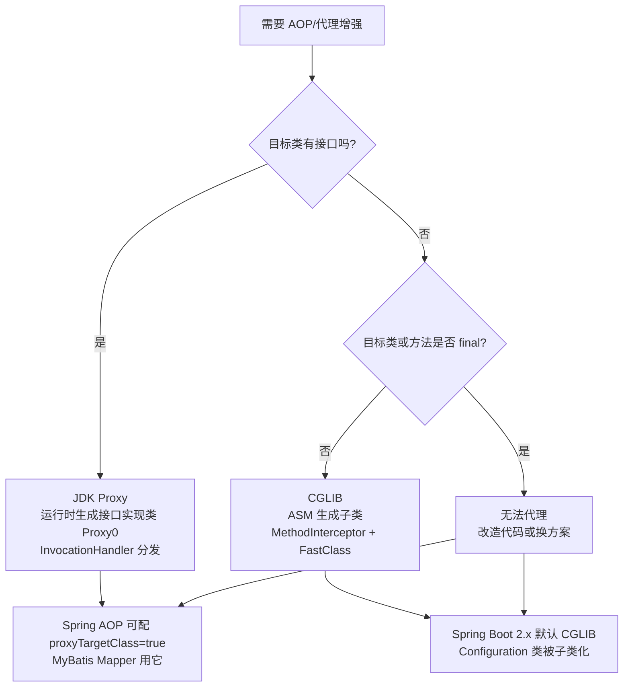
```mermaid
flowchart TD
    Start[需要 AOP/代理增强] --> HasInterface{目标类有接口吗?}
    HasInterface -- 是 --> JDK[JDK Proxy<br/>运行时生成接口实现类 Proxy0<br/>InvocationHandler 分发]
    HasInterface -- 否 --> CheckFinal{目标类或方法是否 final?}
    CheckFinal -- 否 --> CGLIB[CGLIB<br/>ASM 生成子类<br/>MethodInterceptor + FastClass]
    CheckFinal -- 是 --> Fail[无法代理<br/>改造代码或换方案]
    JDK --> Spring1[Spring AOP 可配 proxyTargetClass=true<br/>MyBatis Mapper 用它]
    CGLIB --> Spring2[Spring Boot 2.x 默认 CGLIB<br/>Configuration 类被子类化]
    Fail --> Spring1
    Fail --> Spring2
```

### 3.4 代理在 Spring / MyBatis 中的应用

- **Spring AOP**：有接口时历史上默认 JDK Proxy，可 `proxyTargetClass=true` 强制 CGLIB；Spring Boot 2.0 起默认 CGLIB。切面=多个 Advisor 组成责任链，InvocationHandler 里依次执行；
- **@Transactional 自调用失效**：`this.method()` 走的是目标对象直接调用，不经过代理对象，事务注解不生效——解法：注入自身代理、`AopContext.currentProxy()`（需 exposeProxy=true）、拆到另一个 Bean；
- **@Configuration 的 CGLIB 限制**：配置类被 CGLIB 子类化，所以不能 final；内部 `@Bean` 方法间调用会走代理，保证单例语义（lite 模式例外）；
- **MyBatis Mapper**：Mapper 是接口，MyBatis 用 JDK 代理生成实现：`MapperProxy implements InvocationHandler`，invoke 时按方法签名到 MapperMethod 里找对应 SQL 语句 id，再交给 SqlSession 执行——所以 Mapper 接口的方法名/参数绑定发生在**运行期**，这就是「Mapper 接口为什么没有实现类也能用」的答案；
- **字节码增强谱系**：ASM（最底层）→ CGLIB/Javassist（封装 ASM）→ ByteBuddy（Mockito 用它）→ JDK Proxy（最上层、能力最小）。

### 3.5 本节高频面试题

**Q1：JDK Proxy 和 CGLIB 怎么选？**

解答：JDK 16+ 时代两者性能差距已很小，选型优先级：能接口就 JDK Proxy（少依赖、语义清晰）；目标类没有接口或需要代理具体类（如 `@Configuration`）就用 CGLIB。Spring Boot 2.x 默认 CGLIB 是为了「接口 + 实现」分离的老项目也能代理实现类方法。注意 CGLIB 不能代理 final 类/方法，JDK Proxy 不能代理无接口类，这是硬约束而非性能问题。

**追问**：CGLIB 代理的目标类构造函数会被调用吗？——会，子类化必然调用父类构造器（默认无参）。Spring 里 CGLIB 用 Objenesis 绕过构造器创建实例（不调用构造器），所以被代理 Bean 的构造器逻辑在代理场景下可能不执行——这是排查「构造器里初始化的字段为 null」类问题的隐藏方向。

**Q2：为什么 @Transactional 在同类内部调用不生效？**

解答：Spring 事务基于 AOP 代理。`aService.methodA()` 调 `this.methodB()` 时，this 是目标对象本身，方法调用直接进入 methodB 字节码，完全不经过代理对象的拦截器链，事务注解自然被跳过。本质是「代理只能拦截外部入口」。解法：注入自身（`@Lazy` 自引用/`@Autowired` 自己）、`AopContext.currentProxy()`、或把事务方法拆到独立 Bean。

**追问**：public 方法但类没被 Spring 管理（new 出来的）会生效吗？——不会，代理对象都不存在；事务只对「Spring 容器创建并通过代理暴露的 Bean 的外部调用」生效。

**Q3：MyBatis 的 Mapper 接口没有实现类，调用时到底发生了什么？**

解答：`SqlSession.getMapper()` 时 MyBatis 用 JDK 动态代理为接口生成代理实例（MapperProxyFactory）；真正调用时 MapperProxy.invoke 根据方法名+参数类型从 configuration 的 mappedStatements 里查 SQL 语句 id，构造 MapperMethod 执行（参数绑定、SqlSession 增删改查、结果映射）。所以 Mapper 的方法签名就是 SQL 的「运行时寻址键」，这就是为什么 SQL id 必须唯一、方法重载会出问题。

**追问**：为什么 MyBatis 不用 CGLIB？——Mapper 全是接口，JDK Proxy 天然适配；且代理逻辑只需要拦截一层方法分发，JDK Proxy 足够且轻量。

---

## 4. 异常体系：设计哲学与最佳实践

### 4.1 体系与设计哲学

`Throwable` → `Error`（JVM 级、不可恢复：OOM、StackOverflowError、NoClassDefFoundError，**不该 catch**）→ `Exception` → 受检异常 / `RuntimeException`（非受检）。

受检异常是 Java 独有的设计（C++/C# 都没有），Gosling 的初衷是「编译器强制调用方处理可恢复错误」。但 25 年工程实践证明了它的代价：

- 接口演进成本高：给方法加一个受检异常，所有调用方编译全挂；
- 与函数式编程冲突：Lambda 里不能直接抛受检异常（`Stream` 的 map 函数式接口没有 throws），只能包装，导致代码丑陋；
- 催生「吞异常」恶习：调用方 catch 后打日志或 return null。

### 4.2 最佳实践清单

- 可恢复才用受检异常，编程错误（参数非法、状态非法）用 `IllegalArgumentException`/`IllegalStateException`（Effective Java 第 70 条）；
- **绝不吞异常**：catch 后打日志再抛出 = 重复日志；catch 后 return null = 把错误藏起来；catch 后空块 = 事故源头；
- 自定义业务异常继承 RuntimeException，**必须保留 cause 链**（`super(message, cause)`），否则排查问题时根因丢失；
- 异常信息带上下文：业务单号、关键参数摘要、调用链标识（traceId）；
- 不要用异常做控制流：异常构造要填充栈（fillInStackTrace，native 调用），高频路径上性能灾难；
- 统一出口：Spring `@RestControllerAdvice` + `@ExceptionHandler` 全局转换，业务层只管抛；
- 日志规范：`log.error("msg", e)` 传异常对象而非 `e.getMessage()`（后者丢栈）。

### 4.3 try-with-resources 原理

```java
try (FileInputStream in = new FileInputStream("a");
     FileOutputStream out = new FileOutputStream("b")) { ... }
```

编译期展开为 try-finally：资源按**声明逆序**关闭；若主体抛异常且关闭也抛异常，**主体异常保留，关闭异常进入 suppressed 数组**（`Throwable.addSuppressed`），用 `e.getSuppressed()` 查看——这就是「两个异常时以哪个为准」的答案。JDK 9 起支持已有 final/effectively final 变量作为资源。实现要求：实现 `AutoCloseable`（注意 close 方法声明抛 Exception，实现时收窄）。

### 4.4 本节高频面试题

**Q1：受检异常和运行时异常到底怎么选？**

解答：原则是「调用方能合理恢复才受检，否则运行时」。但资深视角要补充两点：1) 现代 Java 生态（Spring 全家桶、JPA、大多数库）全面拥抱运行时异常 + 全局处理器，受检异常的实际生存空间在 IO/网络这类「重试可恢复」场景；2) 接口设计时受检异常是「契约的一部分」，跨团队 API 用受检异常能强制调用方思考失败路径，但代价是升级成本。我的建议：内部服务一律 RuntimeException + 错误码，外部协议层用受检或结果对象（如 `Either`/Result 模式）。

**追问**：catch (Exception e) 和 catch (Throwable t) 有什么区别？——Throwable 会捕获 Error（OOM 等），通常不该捕获；但某些场景（线程池里的任务、框架兜底）需要捕获 Throwable 防止线程死亡——这是刻意为之而非失误。

**Q2：try-with-resources 里主体和 close 都抛异常，哪个异常会抛给调用方？**

解答：主体异常优先，close 异常被抑制进 suppressed 数组；只有主体没抛异常时 close 的异常才会抛出。这保证「业务失败的原因不被资源关闭失败掩盖」。老式 finally 写法做不到这一点——finally 里抛异常会覆盖主体异常，这是 try-with-resources 最重要的工程价值。

**追问**：suppressed 异常会影响性能吗？——会，addSuppressed 有内存与栈填充开销；JDK 7 曾因此被诟病，JIT 已优化掉大部分（-XX:-OmitStackTraceInFastThrow 相关）。高频抛异常路径无论哪种写法都该避免。

**Q3：线上日志里大量「Exception in thread main」却没有业务堆栈，为什么？**

解答：JVM 的 OmitStackTraceInFastThrow 优化——同一异常类型在同一位置抛太多次，JIT 直接抛「冷异常」（无堆栈）避免重复填充栈开销。排查时看完整日志的首次堆栈即可。这解释了为什么「偶发异常有栈、高频异常没栈」。

---

## 5. IO/NIO/AIO：演进、零拷贝与 Selector

### 5.1 演进路线：为什么 BIO 撑不住 C10K

- **BIO**：accept/read 阻塞线程，一连接一线程，线程数 = 连接数，万级连接直接耗尽线程与上下文切换；
- **NIO**（JDK 1.4）：Channel + Buffer + Selector，单线程可以管理海量连接的事件就绪状态——**从「线程等数据」变成「数据就绪了再派线程」**；
- **AIO**（JDK 1.7）：操作系统完成 IO 后回调（Proactor），彻底去掉「就绪后仍需用户线程去读」这一步。

> 图示：IO 模型演进路线

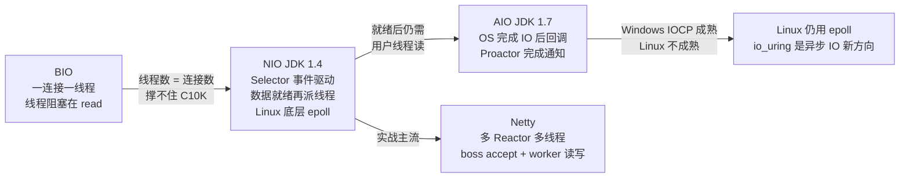
```mermaid
flowchart LR
    BIO[BIO<br/>一连接一线程<br/>线程阻塞在 read] -->|线程数 = 连接数<br/>撑不住 C10K| NIO[NIO JDK 1.4<br/>Selector 事件驱动<br/>数据就绪再派线程<br/>Linux 底层 epoll]
    NIO -->|就绪后仍需<br/>用户线程读| AIO[AIO JDK 1.7<br/>OS 完成 IO 后回调<br/>Proactor 完成通知]
    NIO -->|实战主流| Netty[Netty<br/>多 Reactor 多线程<br/>boss accept + worker 读写]
    AIO -->|Windows IOCP 成熟<br/>Linux 不成熟| Note[Linux 仍用 epoll<br/>io_uring 是异步 IO 新方向]
```

### 5.2 Selector 原理与经典坑

- 三件套：`Selector` 注册 `OP_ACCEPT/OP_READ/OP_WRITE`，`select()` 阻塞直到有通道就绪，`selectedKeys()` 取就绪集合；
- Linux 上底层是 **epoll**（事件驱动、O(1) 就绪检测、无需轮询全部 fd），Windows 是 select 模型，macOS 是 kqueue；
- **经典空轮询 bug**（JDK-6403933，JDK 6u18 修复）：极端情况下 selector 空转导致 CPU 100%，Netty 的兜底方案是「检测到空轮询 N 次就重建 Selector」（换新 selector 并重新注册所有 channel）；
- epoll 的 LT/ET：Java NIO 只有水平触发（LT）；Netty 的 `EpollServerSocketChannel`（netty-transport-native-epoll）可配边缘触发（ET）。

### 5.3 Reactor 与 Proactor

- Reactor（NIO 对应）：事件循环 + 分发器，「就绪通知」模式。单 Reactor 单线程（Redis 的 IO 线程模型类似）；多 Reactor 多线程（Netty：boss 线程只负责 accept，worker 线程组负责读写事件循环）；
- Proactor（AIO 对应）：操作系统完成数据拷贝后回调，「完成通知」模式；
- 为什么 Netty 不用 AIO：官方文档明确——Linux 上 AIO（libaio）实现不成熟，性能不如 epoll 且可控性差；Windows 的 IOCP 才是成熟异步模型。io_uring 是 Linux 异步 IO 的新方向（Netty 已有实验支持）。

### 5.4 零拷贝：内核视角

传统 `read + write`：磁盘 → 内核缓冲 → 用户缓冲 → 内核 socket 缓冲 → 网卡，**4 次拷贝 + 4 次上下文切换**。

- **sendfile**：内核里直接 DMA 到 socket，剩 2 次拷贝 + 2 次切换；Netty 的 `FileRegion` 就是走 sendfile；
- **mmap**：文件映射进进程地址空间，读写免用户态拷贝（`MappedByteBuffer`），Kafka 的日志读写用它；
- **DirectByteBuffer（堆外）**：不在堆上、地址不被 GC 搬移，native IO 直接读写它免去「堆内 ↔ 堆外」拷贝；代价：分配/回收昂贵（依赖 Cleaner 异步回收），受 `-XX:MaxDirectMemorySize` 限制，用完要显式释放或复用池（Netty 的 PooledByteBufAllocator）。

### 5.5 IO 模型对比表

| 模型 | 阻塞 | 同步/异步 | 典型实现 | 适用 |
|---|---|---|---|---|
| 阻塞 IO（BIO） | 是 | 同步 | 传统 Socket | 低并发、简单场景 |
| 非阻塞 IO | 否 | 同步 | SocketChannel 非阻塞 | 少用，配合轮询 |
| IO 多路复用 | 就绪时阻塞 | 同步 | NIO + Selector / Netty | 高并发网络服务（主流） |
| 信号驱动 IO | 否 | 同步 | SIGIO | 少见 |
| 异步 IO（AIO） | 否 | 异步 | AsynchronousChannel / IOCP | Windows 成熟、Linux 谨慎 |

### 5.6 本节高频面试题

**Q1：NIO 的 Selector 和「每连接一个线程」相比，本质优势是什么？**

解答：把「等数据」从线程里剥离。BIO 下线程阻塞在 read 上，1 万连接需要 1 万线程；Selector 下 1 个线程可以同时监听 1 万个通道的「数据就绪」事件，就绪后才派发处理。本质是**事件驱动替代线程阻塞**：线程是昂贵资源（栈内存 + 上下文切换），事件是廉价的。代价是编程模型反转（回调/状态机），所以 Netty 封装了 Reactor 模型让业务方写起来像同步。

**追问**：select/poll/epoll 的区别？——select 每次调用要拷贝全部 fd 集合到内核且线性扫描（上限 1024）；poll 用链表去掉上限但仍是线性扫描；epoll 用内核事件表 + 回调，就绪事件直接返回给用户，O(1) 复杂度。Java NIO 在 Linux 上就是 epoll。

**Q2：Java NIO 的零拷贝有哪些手段？Netty 里分别对应什么？**

解答：三种：1) `FileChannel.transferTo` → sendfile 系统调用，Netty 的 `FileRegion`（文件→网络，零用户态拷贝）；2) `FileChannel.map` → mmap，Netty 的 MappedByteBuffer 用法；3) `DirectByteBuffer` 堆外缓冲，Netty 的 PooledDirectByteBuf。面试加分点：说清楚「零拷贝省的是用户态/内核态之间的拷贝，DMA 拷贝省不掉」，以及堆外内存的分配回收成本要靠池化摊平。

**追问**：堆外内存会 OOM 吗？——会，受 `-XX:MaxDirectMemorySize` 限制，DirectByteBuffer 分配失败抛 OutOfMemoryError: Direct buffer memory；常见于未释放的 ByteBuffer 堆积（Netty 泄漏检测器就是干这个的）。

**Q3：为什么 Netty 不用 JDK 的 AIO？**

解答：AIO 需要操作系统级异步 IO 支持。Windows 的 IOCP 很成熟；但 Linux 的 libaio 只对特定文件系统/场景友好，网络异步支持差，实际表现不如 epoll + 用户态事件循环，且 JDK 的 AsynchronousChannel 在 Linux 上实现有历史问题。Netty 的结论是「epoll 更可控、性能更好」，所以默认 NIO 传输，需要时可换原生 epoll 传输。io_uring 出现后情况在变，但成熟度仍需观察。

---

## 6. 序列化：选型、兼容性与安全

### 6.1 Java 原生序列化

- `Serializable` 是标记接口，序列化走 `ObjectOutputStream`（反射遍历字段）；
- **serialVersionUID**：不写则由 JVM 按类结构自动计算——类结构一变（加字段、改类型）UID 就变，反序列化直接 `InvalidClassException`。所以必须显式声明 `private static final long serialVersionUID = 1L;`；
- 兼容规则：新增字段 → 反序列化用默认值；删除字段 → 忽略；改字段类型 → 不兼容；`transient` 字段不序列化；`static` 不参与；
- 性能：慢（反射 + 写类描述符）、体积大（存类名全限定名）；跨语言：仅 Java；
- **安全**：readObject 反序列化不可信数据 = 远程代码执行（CommonsCollections 等 gadget 链），RMI、JDK 序列化是重灾区。防护：`ObjectInputFilter`（JDK 9+）白名单过滤，或干脆不用。

### 6.2 主流序列化方案对比

| 维度 | Java 原生 | JSON（Jackson/Gson） | Protobuf | Hessian | Kryo |
|---|---|---|---|---|---|
| 格式 | 二进制 | 文本 | 二进制（varint） | 二进制 | 二进制 |
| 跨语言 | 仅 Java | 全语言 | 全语言（IDL） | 多语言 | 主要 Java |
| 性能 | 差 | 中 | 高 | 中高 | 最高档 |
| 体积 | 大 | 大 | 小 | 中 | 小 |
| Schema 演进 | 靠 UID 硬撑 | 字段增减宽松 | 字段号规则严格 | 类型映射有坑 | 需注册类 |
| 安全 | 高危 | 中（需防 gadget） | 高 | 中 | 需白名单 |
| 典型场景 | 遗留系统/RMI | HTTP API/缓存 | gRPC/内部 RPC | Dubbo 默认 | 本地缓存/高性能 RPC |

补充要点：

- **Protobuf 演进铁律**：字段号永不复用（删除用 `reserved`）、新增字段用新号、类型不可变——旧客户端读到未知字段号会跳过；
- **Hessian2**：Dubbo 默认序列化，跨语言但 Java 特有类型（BigDecimal、Date 子类）映射有坑，社区版本维护参差；
- **Kryo**：性能与体积俱佳，但 `register` 类才能发挥全部优势且防注入；**实例非线程安全**，必须 ThreadLocal/池化；字段增删顺序变化会影响兼容性（依赖类结构）；
- **选型口诀**：对外 API 用 JSON（可读性 + 生态）；内部 RPC 用 Protobuf（跨语言 + 强 schema）；Java 内部高速通道（缓存/消息体）用 Kryo；遗留系统才碰 Java 原生。

### 6.3 本节高频面试题

**Q1：serialVersionUID 的作用？不加会怎样？**

解答：序列化兼容性的版本标识。反序列化时 JVM 比对本地类与流中类的 UID，不一致抛 InvalidClassException。不显式声明时 JVM 按类结构（字段、方法、修饰符）计算默认 UID——类一改就变，导致「加个字段后老数据全反序列化失败」。所以规范是显式声明固定值，字段演进靠「新增字段走默认值、删除字段被忽略」的兼容规则。**改字段类型或删字段（非 transient）属于破坏性变更，必须评估存量数据**。

**追问**：加字段后反序列化老数据，新字段是什么值？——默认值（对象为 null、int 为 0）；如果新字段没有默认值语义，需要自定义 `readObject` 做兼容处理（给默认值/迁移逻辑）。

**Q2：为什么说「反序列化不可信数据」是 RCE 入口？**

解答：readObject 会按流里的类描述符实例化任意类并调用其字段赋值逻辑——攻击者构造精心编排的嵌套对象图，触发链上的某个类的 readObject/字段 setter 执行危险操作（如 TemplatesImpl 加载字节码），这就是 gadget 链。防护三原则：1) 不反序列化不可信数据；2) 必须做时用白名单过滤（ObjectInputFilter/黑名单框架）；3) 现代方案优先 Protobuf/JSON 这类「无代码执行能力」的格式。

**追问**：Fastjson 为什么漏洞多？——它支持 `@type` 自动按类名实例化任意类（autoType），等于把 readObject 的风险带进了 JSON 生态；后续版本反复加黑名单又被绕过。教训：反序列化能力越强，攻击面越大。

**Q3：Kryo 为什么快？有什么代价？**

解答：快在三点：1) 不写类描述符（类注册后只写 int id）；2) 无反射的字段读写（unsafe/直接字段访问 + 缓存）；3) 无跨语言包袱（不写类型名）。代价：1) 非线程安全（Kryo 实例带可变状态，需 ThreadLocal 池）；2) 类必须注册或显式配置，否则性能与安全性都打折；3) 类字段顺序/结构变化影响兼容性，灰度发布期新旧版本混跑会踩坑。

---

## 7. Java 8~25 新特性全景：主线与原理

### 7.1 函数式：Lambda 与 Stream 的原理

- **Lambda 为什么用 invokedynamic**（JDK 7 字节码指令）：编译期不生成匿名内部类，而是生成 invokedynamic 调用点；首次执行时 `LambdaMetafactory` 在运行时生成实现类并缓存。收益：无类文件爆炸、调用点可被 JIT 去虚拟化优化、实现可替换（未来换策略不影响字节码）。对比：匿名内部类每处 new 一个类文件 + 持有外部 this 引用；
- 捕获变量要求 effectively final：语言层面防数据竞争的设计；
- **Stream 本质**：数据源 → `Spliterator`（支持 tryAdvance 逐个取 / trySplit 分治）→ 中间操作**惰性拼接**（返回新 Stream，不执行）→ 终止操作触发求值。短路操作（limit/findFirst/anyMatch）提前终止；`parallel()` 用 `ForkJoinPool.commonPool()` 分治执行；
- Stream 陷阱：并行流默认线程池（阻塞任务会拖垮全局）；有状态中间操作（sorted/distinct）破坏并行；`peek` 不是用来做副作用的。

### 7.2 Optional、默认方法与日期 API

- **Optional**：值容器，杜绝 NPE 的「可能缺失」显式化。反模式：做字段/方法参数（不可序列化语义 + 包装开销）、`isPresent()+get()`（不如 if）、`orElse(getExpensive())`（参数先求值，应 orElseGet）；
- **默认方法**：给接口加方法不破坏实现类（Collection.stream() 就是这么加的）。菱形冲突规则：类声明 > 父接口 > 更具体的接口，冲突必须显式覆写；
- **java.time（JDK 8）**：不可变 + 线程安全（对比 SimpleDateFormat 非线程安全）。Instant 是时间线上的绝对点；LocalDateTime 无时区概念；Duration（秒/纳秒）vs Period（年月日）；`DateTimeFormatter` 线程安全可静态化。

### 7.3 数据类革命：record / sealed / 模式匹配 / switch 表达式

- **record（JDK 14 预览 / 16 转正）**：不可变数据载体，自动生成构造器、equals/hashCode/toString；字段 final；可 implements 接口但**不能 extends**；紧凑构造器可做参数校验。本质是受限类（final + final 字段），配套 `Record` 反射 API（getRecordComponents）；
- **sealed（15 预览 / 17 转正）**：`sealed interface Shape permits Circle, Square` 限定继承集，配合 record 构成「代数数据类型」；
- **switch 表达式（14 预览 / 17 后逐步转正）**：箭头语法无 fall-through、可作表达式返回值；`yield` 返回值；
- **模式匹配**：instanceof 模式（16 转正）→ switch 模式匹配（21 转正）→ record 模式（21 转正）——解构 + 类型收窄 + 穷尽性检查，是「用类型安全的方式消灭强转与 if-else 链」。

### 7.4 并发革命：虚拟线程与结构化并发（详见 03-concurrency.md 第 9 节）

- 虚拟线程（JDK 19 预览 / **21 转正**）：JVM 调度的轻量线程，阻塞时自动从载体线程卸载（unmount），百万级并发成为可能；适合 IO 密集；
- 结构化并发：`StructuredTaskScope` 让并发任务的「生命周期跟随代码块」、统一错误处理与取消（JDK 21 孵化，后续版本推进，转正版本见 03 文件）。

### 7.5 版本时间线（JDK 8 → 25）

| 版本 | 关键特性 |
|---|---|
| 8 (2014) | Lambda/Stream/Optional/默认方法/java.time/CompletableFuture/重复注解 |
| 9 (2017) | JPMS 模块化、接口私有方法、List.of/Map.of、try-with-resources 增强、Math.fma（FMA 融合乘加，JDK-8160838） |
| 10 | var 局部变量推断（仅局部变量；`var x = new ArrayList<>()` 推断为 Object 元素——坑） |
| 11 (LTS) | 单文件源码启动、ZGC 实验、HttpClient 转正、String.repeat/strip |
| 12/13 | switch 表达式预览、文本块预览 |
| 14 | record 预览、instanceof 模式匹配预览 |
| 15 | sealed 预览、ZGC/Shenandoah 转正、**偏向锁默认禁用并废弃（JEP 374）** |
| 16 | record 转正、Stream.toList()、强封装 JDK 内部（JEP 396） |
| 17 (LTS) | sealed 转正、switch 模式匹配预览 |
| 18-20 | jwebserver、向量 API 孵化、虚拟线程预览（19） |
| 21 (LTS) | **虚拟线程转正（JEP 444）**、switch/record 模式匹配转正、SequencedCollection（JEP 431）、字符串模板预览 |
| 22-25 | 字符串模板/unnamed variables 预览推进；24：Compact Object Headers 实验（JEP 450）、原始类型模式匹配预览；25：Valhalla 原始类型方向继续演进（精确清单待核实） |

> 图示：Java 8 → 25 新特性演进时间线（主线 + 预览支线）

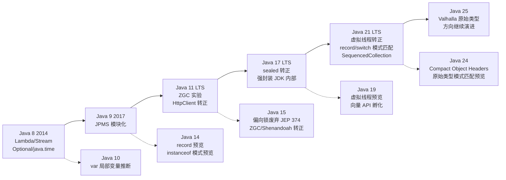
```mermaid
flowchart LR
    J8[Java 8 2014<br/>Lambda/Stream<br/>Optional/java.time] --> J9[Java 9 2017<br/>JPMS 模块化]
    J9 --> J11[Java 11 LTS<br/>ZGC 实验<br/>HttpClient 转正]
    J11 --> J17[Java 17 LTS<br/>sealed 转正<br/>强封装 JDK 内部]
    J17 --> J21[Java 21 LTS<br/>虚拟线程转正<br/>record/switch 模式匹配<br/>SequencedCollection]
    J21 --> J25[Java 25<br/>Valhalla 原始类型<br/>方向继续演进]
    J8 -.-> J10[Java 10<br/>var 局部变量推断]
    J9 -.-> J14[Java 14<br/>record 预览<br/>instanceof 模式预览]
    J11 -.-> J15[Java 15<br/>偏向锁废弃 JEP 374<br/>ZGC/Shenandoah 转正]
    J17 -.-> J19[Java 19<br/>虚拟线程预览<br/>向量 API 孵化]
    J21 -.-> J24[Java 24<br/>Compact Object Headers<br/>原始类型模式匹配预览]
```

### 7.6 本节高频面试题

**Q1：为什么 Lambda 用 invokedynamic 而不是直接生成匿名内部类？**

解答：三个原因：1) **类文件爆炸**——每个 Lambda 调用点一个匿名类文件，大型代码库成千上万；2) **性能**——invokedynamic 调用点可被 JIT 直接去虚拟化/内联，匿名内部类多一层 this 引用与虚调用；3) **可演进**——实现策略（生成类、MethodHandle 组合）可以换，字节码不变。实际流程：首次执行时 LambdaMetafactory 用 ASM 生成实现类并缓存（同一个 Lambda 调用点只生成一次）。

**追问**：捕获外部变量的 Lambda 和没捕获的在性能上有区别吗？——有：捕获时生成类持有捕获字段（额外字段初始化 + 内存读），没捕获的可生成单例（无状态复用）；这也是为什么「能传值就传值、别闭包大对象」的优化建议有依据。

**Q2：Stream 的中间操作为什么「不执行」？并行流一定更快吗？**

解答：中间操作（filter/map）只返回包装了新 Spliterator 的 Stream，是**惰性描述**，直到终止操作（collect/forEach/count）才真正遍历求值——这允许短路（limit 只需消费前 N 个）与管道融合（一次遍历完成所有操作，避免每步一个中间集合）。并行流不一定更快：数据量小、顺序敏感（sorted/distinct 有状态）、元素处理轻量时，ForkJoin 分治与合并的开销反而更大；且共用 commonPool，阻塞任务会互相拖累。

**追问**：`stream.parallel()` 的线程池能换吗？——能，`ForkJoinPool.commonPool` 是共享的，可用自定义 ForkJoinPool 或 `CompletableFuture` 指定 Executor 规避；但生产中更推荐「并行度由数据规模与任务粒度决定，别默认开并行」。

**Q3：record 和普通 final class + 手写 getter 有什么区别？值得用吗？**

解答：record 是语言级的数据载体：equals/hashCode/toString/构造器全部自动生成且**与字段定义严格一致**（不会出现手写不一致的 bug）；字段天然 final；配合解构（record 模式）与 sealed 可以写出穷尽性检查的代数数据类型代码。代价：不能继承、序列化语义与普通类不同（record 序列化走规范构造器，绕过 readObject——这反而是安全优势）、反射 API 不同。结论：DTO/VO/事件消息这类纯数据类无脑用 record，业务对象（有行为、有继承）不用。

---

## 8. 考点速查表

| 考点 | 一句话要点 |
|---|---|
| 类型擦除 | 泛型编译期检查、运行时擦除，字节码只留 Signature 属性 |
| 桥方法 | 编译器生成维持泛型覆写的多态补丁，反射需 isBridge 过滤 |
| PECS | extends 只读、super 只写；生产者 extends、消费者 super |
| 泛型禁区 | 不能 new T()/泛型数组/泛型异常/instanceof T/静态类型参数 |
| 反射优化 | 缓存 Method + setAccessible + MethodHandle/VarHandle + 字节码生成 |
| 注解处理 | SOURCE 编译期 APT（Lombok 改 AST）；RUNTIME 反射（Spring 元注解） |
| ServiceLoader | META-INF/services 懒加载发现实现，SPI 是「我定义、你实现」 |
| JDK Proxy | 接口代理，InvocationHandler 分发，MyBatis Mapper 用它 |
| CGLIB | 继承代理，final 不可代理，Spring Boot 2.x 默认 |
| 事务自调用失效 | this 调用不经过代理，需注入自身/AopContext |
| 受检异常哲学 | 可恢复才受检；工程上运行时异常 + 全局处理器为主流 |
| try-with-resources | 逆序关闭，主体异常优先，close 异常进 suppressed |
| 异常性能 | 抛异常填充栈昂贵，禁止异常控制流 |
| NIO 三件套 | Channel/Buffer/Selector，epoll 事件驱动，LT 触发 |
| Selector 空轮询 | JDK 历史 bug，Netty 重建 Selector 兜底 |
| 零拷贝 | sendfile 2 次拷贝；mmap 免用户态拷贝；DirectByteBuffer 堆外 |
| AIO 取舍 | Windows IOCP 成熟；Linux 用 epoll，Netty 不用 AIO |
| serialVersionUID | 显式声明，类结构变化导致不兼容 |
| 序列化选型 | API 用 JSON；RPC 用 Protobuf；Java 内部高速用 Kryo |
| 反序列化安全 | 不可信数据不反序列化；白名单过滤 |
| Lambda 原理 | invokedynamic + LambdaMetafactory 运行时生成实现类 |
| Stream 惰性 | 中间操作拼接、终止操作求值；并行用 commonPool |
| record | 不可变数据载体，自动 equals/hashCode，不能继承 |
| sealed + 模式匹配 | 限定继承 + 类型收窄 + 穷尽性检查，消灭强转 |
| 虚拟线程 | JDK 21 转正，阻塞自动卸载，IO 密集场景革命 |
| FMA | JDK 9 Math.fma，融合乘加，精度与性能双赢 |

---

# 02 · JVM 原理与调优实战

> 适用对象：10+ 年经验的资深工程师 / 架构师候选人。本章聚焦「原理 → 参数 → 现象」的闭环：每个知识点都要能落到「线上出了什么问题、用什么命令看、怎么改参数」。

**TL;DR 本章学习要点**

1. 内存结构先分清「谁分配、谁回收」：堆管对象、栈管帧、元空间管类元数据、直接内存管 IO，指针压缩与逃逸分析决定对象到底占多大、分配在哪；
2. 类加载五阶段里「准备 vs 初始化」是面试必考，双亲委派被打破的三大场景（Tomcat/SPI/热部署）要能讲出为什么必须破；
3. GC 主线是「分代理论 → CMS 的教训 → G1 的 Region 化 → ZGC 的并发化」，能画出收集器选型决策树才算过关；
4. JIT 是性能的隐形引擎：分层编译、内联、逃逸分析决定了「写出来的代码」和「跑起来的代码」是两码事；
5. 故障排查要形成肌肉记忆：OOM 看堆转储、CPU 飙升看线程栈、死锁看 jstack、泄漏看 jstat 曲线——工具是 jps/jstack/jmap/jstat/arthas 五件套；
6. 调优是「目标导向」而不是「参数堆砌」：先定吞吐/延迟目标，再压测、观察、小步调整、验证，大促调优是这套方法论的完整演练。

---

## 1. 内存结构：堆、栈、元空间与直接内存

### 1.1 运行时数据区全景

| 区域 | 线程共享 | 存放内容 | 异常 | 典型参数 |
|---|---|---|---|---|
| 堆（Heap） | 是 | 对象实例、数组 | OutOfMemoryError: Java heap space | -Xms/-Xmx |
| 方法区（元空间） | 是 | 类元数据、常量池、方法字节码 | OutOfMemoryError: Metaspace | -XX:MaxMetaspaceSize |
| 虚拟机栈 | 否 | 栈帧（局部变量表、操作数栈、动态链接、返回地址） | StackOverflowError / OOM | -Xss |
| 本地方法栈 | 否 | native 方法 | StackOverflowError | -Xss |
| 程序计数器 | 否 | 当前字节码行号 | 无 | — |
| 直接内存 | 是（概念上） | DirectByteBuffer 引用的堆外内存 | OutOfMemoryError: Direct buffer memory | -XX:MaxDirectMemorySize |

演进要点：JDK 8 用**元空间（Metaspace）** 替换永久代（PermGen），根本原因是永久代大小难估（动态生成类的场景——CGLIB、热部署——经常 OOM: PermGen），且与 JVM 垃圾回收器耦合。元空间使用**本地内存**，默认无上限（受进程内存约束），因此 `-XX:MaxMetaspaceSize` 必须显式设置，否则类加载器泄漏会悄悄吃光整机内存（见第 5 节案例）。

进程内存全景（面试画图题）：

```
┌─────────────────────────── 进程地址空间 ───────────────────────────┐
│  JVM 堆（-Xmx）          │ 元空间（类元数据，本地内存）            │
│  ├─ 年轻代 Eden/S0/S1    │ 直接内存（DirectByteBuffer，MaxDirect  │
│  └─ 老年代               │   MemorySize）                        │
│  线程栈（-Xss × 线程数）   │ JIT Code Cache（-XX:ReservedCodeCache  │
│                          │   Size）、GC 结构（卡表/RSet）、JNI      │
└───────────────────────────────────────────────────────────────────┘
```

调堆时只算 -Xmx 是新手行为：**容器内存预算 = 堆 + 元空间 + 直接内存 + 线程栈 + Code Cache + JVM 自身开销**，这也是容器里 MaxRAMPercentage 只给 75% 左右的原因。

**TLAB（Thread Local Allocation Buffer）**：每个线程在 Eden 里划一块私有缓冲（默认 Eden 的 1%），对象分配优先走 TLAB（指针碰撞即可，无锁），TLAB 满了才走 CAS 竞争分配。作用：把「分配」从全局竞争变成线程本地操作——这就是「Java 对象分配很快」的机制基础。观察维度：-XX:+PrintTLAB 可看 TLAB 分配占比（占比低说明大对象/逃逸对象多，分配路径退化）。

### 1.2 对象创建与内存布局

创建路径：类加载检查 → 分配内存（指针碰撞 / 空闲列表）→ 初始化零值 → 设置对象头 → 执行构造器。分配并发安全靠 CAS + 失败重试（或 TLAB 线程本地分配缓冲）。

对象布局（HotSpot 64 位，默认开启指针压缩）：

```
| Mark Word (8B) | Klass Pointer (4B 压缩 / 8B 不压缩) | [数组长度 4B] | 实例字段 | 对齐填充 (8B 对齐) |
```

- **Mark Word**：存锁状态（偏向/轻量/重量锁指针）、hashCode、GC 分代年龄——这就是 synchronized 锁升级和 hashCode 的实现载体；
- **指针压缩（-XX:+UseCompressedOops，默认开启）**：堆 ≤ 32GB 时，64 位对象指针压缩为 32 位（对象对齐 8 字节 → 可寻址 32GB），堆内存减半、缓存友好。**堆配到 32GB 以上压缩失效，内存反而「变贵」**——这是「为什么 31GB 堆比 33GB 更优」的经典面试题；
- 字段重排：HotSpot 按「long/double → int → short/char → byte/boolean → 引用」的规则重排字段减少填充（-XX:+FieldsAllocationStyle），所以「声明顺序影响对象大小」。

### 1.3 逃逸分析与栈上分配

- **逃逸分析（-XX:+DoEscapeAnalysis，C2 默认开）**：分析对象是否逃逸出方法/线程；
- 三个优化：**栈上分配**（不逃逸对象直接在栈帧分配，随方法返回销毁，零 GC 压力）、**标量替换**（对象拆成字段，直接操作局部变量）、**锁消除**（不逃逸对象的 synchronized 直接去掉）；
- 局限：分析是保守的（有逃逸可能就不优化）、只在 C2 编译层生效、方法内联是它的前提（方法没内联就看不到对象全貌）。

### 1.4 本节高频面试题

**Q1：为什么堆设成 31GB 比 33GB 性能更好？**

解答：堆超过 32GB 后指针压缩失效（-XX:+UseCompressedOops），对象引用从 4 字节变 8 字节：1) 同样对象图占内存近翻倍，33GB 堆实际可存对象数反而可能少于 31GB；2) 缓存行利用率下降，GC 扫描引用更慢。所以生产建议：需要大堆时优先考虑「多个 30GB 左右实例」或 ZGC（大堆场景 GC 压力更可控），而不是单实例堆到 60GB+。

**追问**：指针压缩对数组有影响吗？——有：数组长度字段 4B 保留，元素指针同样压缩；超过 32GB 堆的数组元素引用也变 8 字节，大数组场景差异尤其明显。

**Q2：对象一定在堆上分配吗？**

解答：不一定。逃逸分析发现对象不逃逸时，JIT 会做标量替换（对象拆成字段放寄存器/栈）或栈上分配，随栈帧销毁——所以大量「短命小对象」可能根本不进堆、不触发 GC。这也是为什么「创建对象很贵」在现代 JVM 上是伪命题：无逃逸对象的成本约等于几个字段赋值。注意：逃逸分析依赖方法内联，跨方法边界看不到全貌就放弃优化，所以**代码要写得利于内联**（小方法、少分派）。

**追问**：为什么说「大对象」对 GC 是负担？——大对象（G1 中超过 Region 一半）直接进 Humongous 区，分配和回收都走特殊路径，且容易触发提前 GC；TLAB 装不下还会直接进老年代。高频创建大数组/大缓冲的场景要池化。

**Q3：Metaspace 和 PermGen 的区别？为什么换？**

解答：1) 位置：PermGen 在堆内（受 -Xmx 约束且大小难调），Metaspace 在本地内存（默认无上限）；2) 内容：元空间存类元数据、方法字节码、常量池，字符串常量池 JDK 7 已移到堆；3) 动机：动态生成类（CGLIB/反射/热部署）场景 PermGen 频繁 OOM 且无法精确调参，元空间把上限交给运维显式控制（-XX:MaxMetaspaceSize）。代价：类加载器泄漏时元空间无上限会拖垮整机，必须监控 Metaspace 占用曲线。

---

## 2. 类加载机制：五阶段与双亲委派

### 2.1 加载 → 验证 → 准备 → 解析 → 初始化

| 阶段 | 做什么 | 面试要点 |
|---|---|---|
| 加载 | 读字节码 → 生成 Class 对象 | 来源不限于 class 文件（网络/动态生成） |
| 验证 | 格式、语义、字节码校验 | 防止恶意字节码 |
| 准备 | 静态字段分配内存并**置零值** | 不是赋初始值！`static int a = 10` 这步 a=0 |
| 解析 | 符号引用 → 直接引用 | 可延迟到首次使用（动态链接） |
| 初始化 | 执行 `<clinit>`（静态块、静态字段赋值） | 触发条件：new/反射/访问静态成员/子类初始化 |

经典坑：`static int a = 10` 在准备阶段是 0，初始化阶段才赋 10；`static final` 常量（编译期常量）在准备阶段直接写入常量池，不会触发类初始化——所以「访问静态 final 常量不初始化类」是必考题。

初始化触发时机（主动使用）：new/静态方法/静态字段（非常量）/反射 Class.forName（默认初始化，`Class.forName(name, false, loader)` 不初始化）/初始化子类先初始化父类/main 类。

> 图示：类加载五阶段流程

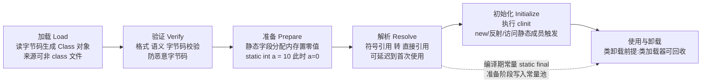
```mermaid
flowchart LR
    A[加载 Load<br/>读字节码生成 Class 对象<br/>来源可非 class 文件] --> B[验证 Verify<br/>格式 语义 字节码校验<br/>防恶意字节码]
    B --> C[准备 Prepare<br/>静态字段分配内存置零值<br/>static int a = 10 此时 a=0]
    C --> D[解析 Resolve<br/>符号引用 转 直接引用<br/>可延迟到首次使用]
    D --> E[初始化 Initialize<br/>执行 clinit<br/>new/反射/访问静态成员触发]
    E --> F[使用与卸载<br/>类卸载前提:类加载器可回收]
    D -. 编译期常量 static final<br/>准备阶段写入常量池 .-> F
```

### 2.2 双亲委派模型与打破场景

模型：Bootstrap ClassLoader（java.base 等）→ Platform ClassLoader（JDK 9 前 Extension）→ App ClassLoader。核心逻辑：`loadClass` 先问父加载器，父加载不了自己才加载。好处：类一致性（Object 永远同一个）、安全（核心类不被替换）、避免重复加载。

> 图示：双亲委派模型加载流程

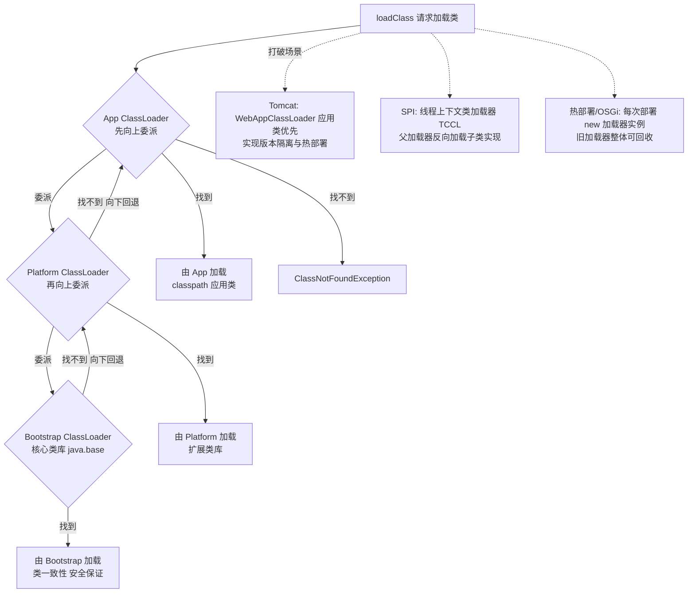
```mermaid
flowchart TD
    Start[loadClass 请求加载类] --> App{App ClassLoader<br/>先向上委派}
    App -->|委派| Plat{Platform ClassLoader<br/>再向上委派}
    Plat -->|委派| Boot{Bootstrap ClassLoader<br/>核心类库 java.base}
    Boot -->|找到| Done1[由 Bootstrap 加载<br/>类一致性 安全保证]
    Boot -->|找不到 向下回退| Plat
    Plat -->|找到| Done2[由 Platform 加载<br/>扩展类库]
    Plat -->|找不到 向下回退| App
    App -->|找到| Done3[由 App 加载<br/>classpath 应用类]
    App -->|找不到| Fail[ClassNotFoundException]
    Start -. 打破场景 .-> Break1[Tomcat: WebAppClassLoader 应用类优先<br/>实现版本隔离与热部署]
    Start -.-> Break2[SPI: 线程上下文类加载器 TCCL<br/>父加载器反向加载子类实现]
    Start -.-> Break3[热部署/OSGi: 每次部署 new 加载器实例<br/>旧加载器整体可回收]
```

**为什么要打破？三大场景：**

1. **Tomcat（Web 容器）**：每个 Webapp 一个 WebAppClassLoader，**先自己加载**（应用类优先），因为不同应用可能依赖不同版本的同一个库（Spring 4 vs Spring 5），父加载器加载的类无法隔离；同时保证 Webapp 之间、Webapp 与容器之间类隔离，还能实现热部署（卸载 Webapp 时连类加载器一起丢）；
2. **SPI（JDBC 等）**：`DriverManager` 在 Bootstrap 层，但 MySQL 驱动在应用 classpath——父加载器找不到驱动类。解法：**线程上下文类加载器（TCCL）**，`Thread.currentThread().getContextClassLoader()` 反向让应用类加载器加载实现（ServiceLoader 默认用它）；「父类调用子类实现」必须打破；
3. **热部署/OSGi**：需要「同名类新版本」共存，靠类加载器隔离实现；OSGi 的模块化类加载是网状模型，比双亲委派更复杂。

**自定义类加载器**：继承 ClassLoader，覆写 `findClass`（推荐，走双亲委派兜底）或 `loadClass`（完全接管，即打破）；注意：类卸载条件是「类加载器可回收」，系统类加载器加载的类**永远无法卸载**（JDK 9+ 对自定义加载器也有模块约束），热部署必须用独立加载器实例。JDK 9 模块化后，`--add-opens/--add-exports` 处理跨模块反射访问。

### 2.3 本节高频面试题

**Q1：准备阶段和初始化阶段的区别？`static int a = 10` 在哪个阶段变成 10？**

解答：准备阶段为静态字段分配内存并置类型零值（a=0）；初始化阶段执行 `<clinit>` 才执行赋值（a=10）。所以「类加载了但没初始化」时，静态字段是零值——这在排查「静态字段莫名为 null/0」时是重要线索（比如只加载未初始化就通过反射读字段）。另外 `static final int CONST = 10` 是编译期常量，准备阶段直接写入常量池，访问它**不会触发类初始化**。

**追问**：什么操作会触发初始化？——new、调用静态方法/非常量静态字段、反射 Class.forName（默认）、初始化子类（父类先初始化）、JVM 启动主类；访问编译期常量、通过子类访问父类静态字段（只初始化父类）、定义数组（只加载组件类）都不会触发。

**Q2：为什么 JDBC 需要打破双亲委派？具体怎么破的？**

解答：`java.sql.DriverManager` 由 Bootstrap 加载（在 java.base），而 MySQL 驱动实现类在应用 classpath，按双亲委派「父加载器找得到就父加载」——Bootstrap 找不到应用里的驱动类，直接委派给子加载器又违背模型。JDBC 4.0 的解法是 ServiceLoader + **线程上下文类加载器**：DriverManager 初始化时用 `ServiceLoader.load(Driver.class)`，后者通过 TCCL（默认是 App ClassLoader）加载驱动实现。本质是「核心库定义的接口，需要让应用层实现反向可见」——这是 SPI 机制的通用解法（JNDI、JAXB 同理）。

**追问**：TCCL 会不会导致类重复加载？——可能：同一个类既被系统加载器加载又被 TCCL 加载会得到两个 Class 对象，导致 instanceof 失败/ClassCastException。这也是为什么 SPI 实现类加载要谨慎、很多框架（如 Dubbo）自己管理加载器栈。

**Q3：热部署的原理？为什么说「系统类加载器加载的类无法卸载」？**

解答：热部署 = 新版本类由**新的类加载器实例**加载，旧加载器连同其加载的类整体可回收（类卸载的前提是「加载它的 ClassLoader 被 GC」）。所以：1) 必须自定义加载器，且每次部署 new 一个；2) 旧加载器不能被任何强引用持有——被 Spring 容器、ThreadLocal、静态字段引用都会导致泄漏（元空间撑爆的经典原因）；3) 系统/应用类加载器加载的类（JDK 类、classpath 根类）永远无法卸载。JDK 9+ 模块化后，热部署工具（如 Spring DevTools）的类加载策略也受模块封装约束（待核实细节，原理不变）。

---

## 3. GC 算法与收集器：从分代到并发

### 3.1 可达性分析与引用类型

- 判定存活：**GC Roots 可达性分析**（引用链），根包括：栈帧局部变量、静态字段、JNI 引用、活跃线程、被同步锁持有的对象等；「引用计数」因循环引用缺陷被弃用；
- 四种引用（强度递减）：**强引用**（永不回收）→ **软引用 SoftReference**（内存不足时回收，适合缓存）→ **弱引用 WeakReference**（下次 GC 即回收，适合 ThreadLocal 的 key）→ **虚引用 PhantomReference**（get 恒为 null，配合 ReferenceQueue 感知对象回收，DirectByteBuffer 的 Cleaner 就是它）；
- ThreadLocal 泄漏的完整链路：Thread → ThreadLocalMap → Entry（弱引用 key）→ value（强引用）——key 被回收后 value 还活着，必须 remove()（详见 03 并发文件与 5.4 案例）。

### 3.2 分代理论

- **弱分代假说**：绝大多数对象朝生夕灭 → 年轻代（Eden + 两个 Survivor，默认 8:1:1）用复制算法，对象熬过 GC 年龄 +1，晋升老年代（-XX:MaxTenuringThreshold，默认 15，CMS 6）；
- **跨代引用**：老年代引用年轻代对象时，GC 根扫描不能漏——用**卡表（Card Table）**：老年代按 512B 分卡，引用写入时标记脏卡（写屏障），YGC 时只扫脏卡。G1 的记忆集（RSet）是卡表的 Region 化升级版；
- 分配路径：新对象 → TLAB → Eden →（Minor GC）→ Survivor →（年龄达标/动态年龄判断）→ 老年代；大对象（G1 超 Region 一半）直接 Humongous。

### 3.2.1 三色标记：并发 GC 的理论地基

并发标记（CMS/G1/ZGC 共有）的核心算法是**三色标记**：

```
白色：尚未访问（可能存活，待扫描）
灰色：自身已访问，但引用的对象还没扫完（工作队列）
黑色：自身与引用全部扫完（确定存活）

初始：根对象置灰 → 循环「取灰→扫其引用→子对象白变灰→自身变黑」
结束：仍为白色的对象 = 不可达，回收
```

并发标记的经典难题：**标记线程扫过的黑色对象，被业务线程新增了对白色对象的引用** → 白色对象被漏标（本该存活却被回收）。两种解法：

- **增量更新（Incremental Update，CMS 用）**：记录「黑色对象新增引用」这件事，重新标记阶段把黑色对象变灰再扫一遍——漏标发生在「新增引用」路径；
- **SATB（Snapshot-At-The-Beginning，G1 用）**：记录「引用被删除」前快照（把被删除引用指向的对象标记为存活）——宁可多活一个对象，也不漏标。G1 选 SATB 因为并发标记期间「引用被改写」比「新增」更频繁，且 SATB 队列处理比重新扫描整棵子树便宜。

无论是增量更新还是 SATB，都依赖**写屏障**（引用赋值时插入的拦截代码）记录变化——这是「GC 与业务线程并发」的机制基石。

### 3.3 CMS：全过程与四大缺陷

CMS（Concurrent Mark Sweep）追求低停顿：初始标记（STW，仅 GC Roots）→ 并发标记（用户线程并行，三色标记）→ 重新标记（STW，修正并发期间变化）→ 并发清除。

缺陷（面试必背）：
1. **并发标记浮动垃圾**：标记与清除期间产生的垃圾本次清不掉，只能等下次 → 预留空间（-XX:CMSInitiatingOccupancyFraction，默认 68% 触发）；
2. **Concurrent Mode Failure**：并发阶段老年代被占满 → 退化为 Serial Old 全停顿（灾难性 STW）——CMS 最大的坑；
3. **内存碎片**：标记-清除不压缩，老年代碎片化 → 大对象分配失败触发 Full GC；
4. CPU 与吞吐开销：并发阶段抢占 CPU。

结局：JDK 9 废弃（deprecated），JDK 14 移除，被 G1 取代。

### 3.4 G1：Region、记忆集、SATB 与混合回收

- **Region 化**：堆划分为等大 Region（默认 2048 个，-XX:G1HeapRegionSize 1~32MB），逻辑上分代（Eden/Survivor/Old/Humongous），物理上连续——「逻辑分代、物理不分代」：

```
┌──────────────────────────── 堆（逻辑分代，物理 Region） ────────────────────────────┐
│ [E][E][E][S][E][E][H][O][O][E][E][S][O][O][O][E][E][E][O][O][O][O][O][O][O][O] │
│  E=Eden  S=Survivor  O=Old  H=Humongous（大对象，跨连续 Region）               │
│  分配只发生在 E；GC 时把存活对象复制到 S/空闲 Region —— 无碎片、可预测停顿      │
└─────────────────────────────────────────────────────────────────────────────┘
```

G1 的「可预测停顿」本质是**空间换时间**：Region 细粒度让 GC 可以只收一部分（增量回收），配合停顿预测模型（-XX:MaxGCPauseMillis 软目标）动态决定「这轮收哪些 Region」；
- **记忆集（RSet）**：记录「谁引用了本 Region 的对象」，跨 Region 引用靠写屏障维护，GC 时不必全堆扫描；
- **并发标记**：SATB（Snapshot-At-The-Beginning）——并发标记开始时打快照，期间变化记录在 SATB 队列，重新标记时补处理，保证标记不漏；
- **回收**：Young GC（Eden 满触发，STW，多线程并行复制）；**混合回收（Mixed GC）**：老年代占用达到阈值（-XX:InitiatingHeapOccupancyPercent，默认 45%）时，并发标记 + 选择「回收收益最高」的 Region 集合（停顿预测模型：根据历史停顿估算每个 Region 的回收成本，满足 -XX:MaxGCPauseMillis 目标）；
- 特点：可预测停顿（软目标）、无碎片（复制算法）、适合中大堆（4GB~64GB 区间最强）；大对象 Humongous 分配与回收有额外开销。

### 3.5 ZGC：染色指针与读屏障

- **目标**：TB 级堆、停顿 < 1ms、吞吐影响可接受（JDK 15 转正，21 引入分代 ZGC）；
- **染色指针（Colored Pointer）**：64 位指针借用高位存 4 位视图标记（finalizable/remap/mark0/mark1），对象引用自带状态 → 标记/重映射不碰对象头，与 GC 并发读写无需锁；
- **读屏障（Load Barrier）**：每次引用加载时检查指针视图，若指向「正在移动/已移动」的对象则修正（转发指针）——GC 移动对象时业务线程照常读，这就是「并发转移」的实现基础；
- **Region 三级**：小/中/大 Region（2MB/32MB/N×2MB）；支持 NUMA 亲和；
- 代价：读屏障有运行时开销（每次引用读多一次判断）、CPU 占用高、适合「大堆 + 低停顿」而非「小堆 + 高吞吐」；
- 对比：Shenandoah 用 Brooks 指针（对象头加转发字段），与 ZGC 染色指针是两条技术路线。

### 3.6 收集器对比与选型

**GC 术语澄清（面试常被绕晕）**：Minor GC（年轻代回收，频繁、快）；Major GC（老年代回收，历史上常与 Full GC 混用——CMS 的 Major GC 就是并发回收，不 STW）；Full GC（全堆 + 元空间 + 年轻代，STW，能避免就避免）。**「Full GC 次数」是线上健康度第一指标**：G1 下 Full GC 出现 = 并发回收跟不上分配速率，必须先查根因而不是调参数压下去。

| 维度 | Parallel | CMS | G1 | ZGC | Shenandoah |
|---|---|---|---|---|---|
| 目标 | 吞吐优先 | 低停顿 | 可预测停顿 | 超低停顿 | 超低停顿 |
| 算法 | 复制+标记整理 | 标记清除 | Region 复制 | 染色指针+读屏障 | Brooks 指针 |
| 并发阶段 | 无 | 标记/清除 | 标记 | 标记/转移/重映射 | 标记/转移 |
| 碎片 | 无 | 有 | 无 | 无 | 无 |
| 适用堆 | 中小堆 | 中小堆（已移除） | 中大型堆 | 超大堆 | 大堆 |
| 状态 | JDK 8 默认 | JDK 14 移除 | JDK 9+ 默认 | JDK 15+ 转正 | JDK 15+ 转正 |

选型决策树：小堆 + 吞吐敏感 → Parallel；中大型堆 + 停顿敏感 → G1（默认即可）；超大堆 + 亚毫秒停顿 → ZGC（可接受更高 CPU）；云原生容器多实例 → 每实例 G1 小堆，少用超大堆。

> 图示：GC 触发与收集器选型决策树

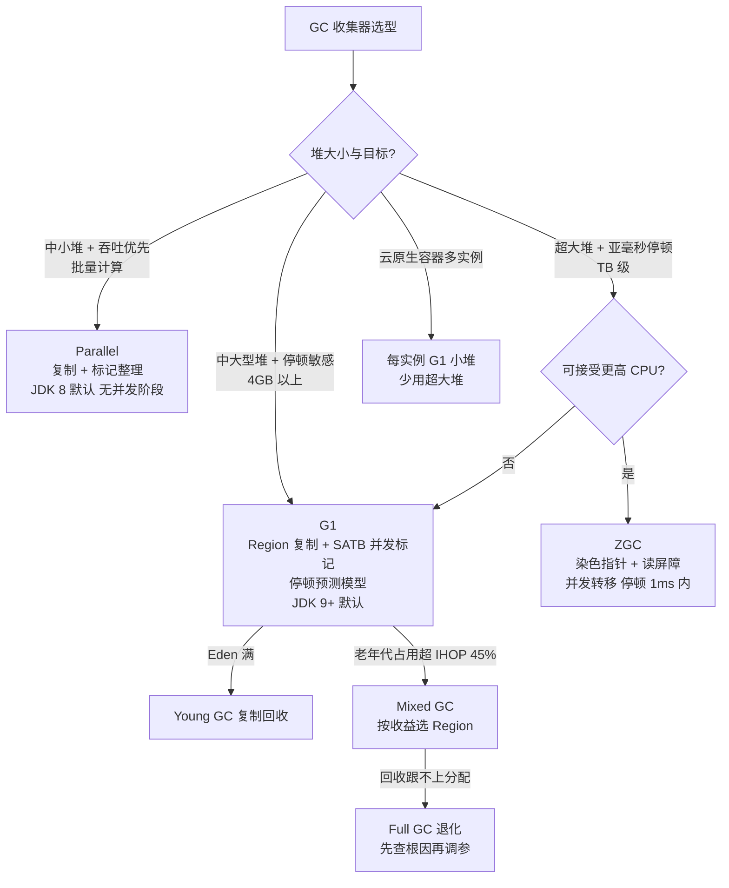
```mermaid
flowchart TD
    Start[GC 收集器选型] --> Q1{堆大小与目标?}
    Q1 -- 中小堆 + 吞吐优先<br/>批量计算 --> Parallel[Parallel<br/>复制 + 标记整理<br/>JDK 8 默认 无并发阶段]
    Q1 -- 中大型堆 + 停顿敏感<br/>4GB 以上 --> G1[G1<br/>Region 复制 + SATB 并发标记<br/>停顿预测模型<br/>JDK 9+ 默认]
    Q1 -- 超大堆 + 亚毫秒停顿<br/>TB 级 --> Q2{可接受更高 CPU?}
    Q2 -- 是 --> ZGC[ZGC<br/>染色指针 + 读屏障<br/>并发转移 停顿 1ms 内]
    Q2 -- 否 --> G1
    Q1 -- 云原生容器多实例 --> G1S[每实例 G1 小堆<br/>少用超大堆]
    G1 -->|Eden 满| YGC[Young GC 复制回收]
    G1 -->|老年代占用超 IHOP 45%| MGC[Mixed GC<br/>按收益选 Region]
    MGC -->|回收跟不上分配| FGC[Full GC 退化<br/>先查根因再调参]
```

### 3.7 本节高频面试题

**Q1：CMS 的 Concurrent Mode Failure 是怎么发生的？为什么说它是 CMS 的命门？**

解答：并发标记/清除阶段业务线程还在写老年代，若老年代可用空间被耗尽，CMS 无法继续并发，只能退化为 Serial Old 串行 Full GC——停顿从几十毫秒跳到秒级甚至分钟级，线上表现为「突然长暂停 + 老年代占用 100%」。触发原因通常是：预留比例太小（-XX:CMSInitiatingOccupancyFraction 调太高）、分配速率大于回收速率、浮动垃圾堆积。这也是 G1 用「停顿预测模型 + 增量回收」替代「全量并发清理」的原因：宁可每次多回收一点，也不让老年代被写爆。

**追问**：G1 有对应的「退化」场景吗？——有：1) 并发标记期间老年代被占满 → 退化为 Full GC（Serial 式全堆）；2) 大对象 Humongous 分配失败触发 Full GC；3) 晋升失败（年轻代对象晋升时目标 Region 空间不足）→ 退化为 Full GC。所以 G1 也不是银弹，IHOP 与 Region 大小、Humongous 阈值都要按对象大小分布调。

**Q2：ZGC 的读屏障是怎么做到「GC 搬家时业务线程无感」的？**

解答：染色指针把 GC 状态编码进引用本身：标记阶段业务线程加载引用时，读屏障检查指针的标记位，发现未标记就顺手标记（自愈）；转移阶段引用指向的对象可能已被搬走，读屏障发现指针在「待转移集合」就通过转发指针找到新地址并**修正当前引用**（自愈 + 转发）。因为状态在指针里而不在对象头，业务线程与 GC 线程可以无锁并发操作同一对象。代价：每次引用读取多一次位运算判断，这是 ZGC 的 CPU 开销来源。

**追问**：为什么 ZGC 适合大堆？——停顿与堆大小基本无关（并发转移），堆越大相对收益越明显；而小堆上 ZGC 的读屏障开销和 CPU 占用占比高，不如 G1 划算。

**Q3：对象什么时候晋升老年代？Survivor 里放不下怎么办？**

解答：三条路径：1) 年龄达到 MaxTenuringThreshold（默认 15，CMS 默认 6）；2) **动态年龄判断**：Survivor 中同龄对象大小之和超过 Survivor 一半，大于等于该年龄的对象直接晋升（避免 Survivor 溢出）；3) Survivor 空间不足时，超出的对象直接进老年代（提前晋升）。另外大对象直接进老年代（G1 进 Humongous）。提前晋升是「Minor GC 频繁但老年代涨得快」的排查方向。

**Q4：为什么说「Minor GC 频繁」和「Full GC 频繁」是两个完全不同的问题？**

解答：Minor GC 频繁 = 年轻代分配速率高，本质是「对象太多、太短命」——优先查代码（循环内建对象、大集合反复创建），堆年轻代调大只是缓解；Full GC 频繁 = 老年代堆积 + 回收跟不上，常见原因：1) 大量对象提前晋升（Survivor 太小/动态年龄误判）；2) 内存泄漏（老年代只增不减）；3) 堆太小。处理路径完全不同：前者治代码、后者治持有关系（泄漏）或容量。回答时能区分「分配速率问题」与「存活对象问题」，说明你真的理解 GC 模型。

---

## 4. JIT 与性能：分层编译、内联与逃逸分析

### 4.1 分层编译（Tiered Compilation）

JDK 8 默认开启分层编译，解释器 + 两层编译器协作：

| 层 | 编译器 | 特点 |
|---|---|---|
| 0 | 解释器 | 立即执行，收集 profiling |
| 1 | C1（client） | 快速编译，不 profiling |
| 2/3 | C1 + profiling | 收集分支/调用统计 |
| 4 | C2（server） | 激进优化（内联、逃逸分析、循环优化），慢但强 |

方法被调用足够多次（-XX:CompileThreshold 等）→ 从解释执行升级到 C1 再到 C2；**OSR（On-Stack Replacement）**：长循环方法在循环执行中被替换为编译版本（栈上替换）。C2 编译失败/假设失效会**逆优化（deoptimization）** 回解释执行。

### 4.2 方法内联

- JIT 最核心的优化：把被调方法体直接展开到调用点，消除调用开销并让后续优化（逃逸分析、常量传播）跨方法生效；
- 内联条件：热点（调用计数）、方法够小（-XX:MaxInlineSize，默认 35 字节）、调用点数量（-XX:MaxInlineLevel）；
- 工程启示：**小方法、少分派（少用接口多态）、避免深调用链**——这决定了「代码风格影响性能」；虚方法调用（接口）内联后还要做去虚拟化（通过 profiling 找单一实现类）。

**Code Cache 与解释器**：编译产物存 Code Cache（-XX:ReservedCodeCacheSize，默认 240MB 左右），满了会触发清理甚至回退解释执行（性能骤降的隐藏原因）；解释器不是「慢的编译版本」，它同时承担 profiling 采集职责（分支计数器、类型画像），是 JIT 决策的数据源——这也是分层编译下「跑得久的方法优化越好」的原因。

### 4.3 逃逸分析在 JIT 层的三件套

（原理见 1.3）注意区分：**锁消除**（无逃逸对象的 synchronized 消除）只发生在 JIT 层，与 JDK 15 废弃偏向锁是两回事；逃逸分析失效的常见原因：方法没内联、对象作为参数传递到未内联方法、反射/序列化访问。

### 4.4 本节高频面试题

**Q1：为什么说「代码写得好不好，JIT 说了算」？举例说明。**

解答：因为 JIT 优化依赖运行时 profiling 与内联边界：1) 小而内联友好的方法 → 逃逸分析能看全对象生命周期 → 栈上分配/锁消除；大方法或深调用链 → 内联失败 → 对象逃逸判断保守 → 堆分配 + 真实加锁；2) 接口多态调用点若 profiling 显示只有单一实现 → 去虚拟化内联；多实现则无法内联；3) 热点分支频繁切换（分支预测失败）→ 性能骤降。所以同样的功能，写法不同性能可能差一个数量级——这是「性能调优先看代码形状，再看 GC 参数」的原因。

**追问**：线上怎么确认方法被内联了？——`-XX:+PrintCompilation -XX:+UnlockDiagnosticVMOptions -XX:+PrintInlining` 输出内联日志；arthas 的 `stack`/`trace` 也能观测调用链，JFR 的 Compilation 事件更直观（JDK 11+ 推荐 JFR）。

**Q2：OSR 是什么？为什么需要它？**

解答：OSR（On-Stack Replacement，栈上替换）：方法已经在解释执行且正处于长循环中，JIT 编译完成后无法等方法返回再切换（循环可能跑很久），于是直接在**当前栈帧内**把执行替换到编译后的机器码。典型场景：大循环内的热点计算。OSR 编译通常比常规编译保守（无法做某些依赖方法入口的优化），所以「热循环」和「热方法」的优化路径不同。

**追问**：为什么 Java 里「预热」重要？——首次调用走解释执行 + C1，C2 编译与 profiling 需要时间；压测/上线前要预热（调用足够多次触发编译），否则流量高峰撞上编译期性能抖动。这正是「JIT 编译器导致性能曲线非单调」的根源。

**Q3：JIT 会带来哪些「诡异」线上现象？**

解答：1) 同一段代码，线上比压测快/慢（profile 不同 → 优化决策不同）；2) 修了个「无关 bug」性能大变（代码形状变化改变内联/逃逸结果）；3) 偶发大停顿（C2 编译线程抢 CPU、逆优化回退、Code Cache 满触发清理 -XX:ReservedCodeCacheSize）；4) 栈上分配导致「对象居然不触发 GC」（误判为泄漏）。排查工具：JFR 的 Compilation/JIT 事件 + `-XX:+PrintCompilation`。

---

## 5. 故障排查实战：OOM、CPU 飙升、死锁与泄漏

### 5.1 工具五件套与典型用法

| 工具 | 用途 | 关键命令 |
|---|---|---|
| jps | 找 Java 进程（注意区分容器内进程） | `jps -lv` |
| jstack | 线程栈、死锁检测 | `jstack <pid>`（死锁段 "Found one Java-level deadlock"）；`jstack -l` |
| jmap | 堆信息、直方图、堆转储 | `jmap -heap`；`jmap -histo:live`；`jmap -dump:format=b,file=x.hprof` |
| jstat | GC 实时曲线 | `jstat -gcutil <pid> 1000`（每秒采样，看 YGC/FGC 频率与耗时） |
| jcmd | JDK 自带瑞士军刀 | `jcmd <pid> GC.heap_info` / `Thread.print` / `VM.native_memory` |
| arthas | 在线诊断（无需重启） | dashboard/thread/stack/trace/watch/ognl/sc |
| MAT / JProfiler | 堆转储离线分析 | 支配树、泄漏疑点报告 |
| JFR（JDK 11+） | 低开销飞行记录 | `jcmd <pid> JFR.start` |

**JFR 值得单独说**：JDK 11+ 自带的低开销采样分析（CPU/内存/锁/GC/JIT 事件全覆盖，开销 <2%），生产环境可常开——「GC 日志 + JFR + 线程栈三件套」是当代 Java 排障的事实标准，比 arthas 更适合「事后复盘」场景（arthas 偏实时交互，JFR 偏录制回放）。容器化时代 arthas 的 attach 有时受限，JFR 反而是更稳的兜底。

### 5.2 OOM 四类案例（+1 类隐藏）

**案例 A：Java heap space（堆溢出）**——现象：频繁 Full GC 后抛 OOM。排查：`jmap -dump` 堆转储 + MAT 找支配树大对象、重复对象（经典：缓存无界、SQL 无 limit 全量加载、集合静态持有）。先分「泄漏（内存只增不减）」还是「容量（峰值过大）」：jstat 曲线持续攀升 → 泄漏；涨到峰值稳定 → 容量问题（调堆或优化对象）。

**案例 B：GC overhead limit exceeded**——GC 占用 >98% 且回收 <2%，JVM 主动抛 OOM 保命（防止 CPU 空转）。本质同 A，但堆「还有空间却回收不动」，常见：大量不可达对象的创建速率过高（每秒百万级小对象）。

**案例 C：Metaspace（元空间溢出）**——动态生成类失控：CGLIB 代理类无限生成（如每请求创建 Enhancer）、热部署未卸载（类加载器泄漏）、反射大量生成类。排查：`jmap -clstats <pid>` 看类加载器数量与每个加载器加载的类数，找出「类加载器数量暴涨」的源头。

**案例 D：unable to create new native thread**——线程数超 OS 限制（ulimit -u）或「线程栈内存 + 堆」超进程内存。排查：`jstack` 数线程、看线程状态分布；常见：线程池无界（Executors.newCachedThreadPool）、每请求建线程、连接池泄漏导致线程等锁堆积。

**隐藏案例 E：Direct buffer memory**——堆外内存超 MaxDirectMemorySize，Netty/DirectByteBuffer 未释放（泄漏检测器会打日志），或堆外被 GC 延迟回收（Cleaner 依赖 GC 触发，堆充足时反而不及时）。

> 图示：OOM 排查决策树

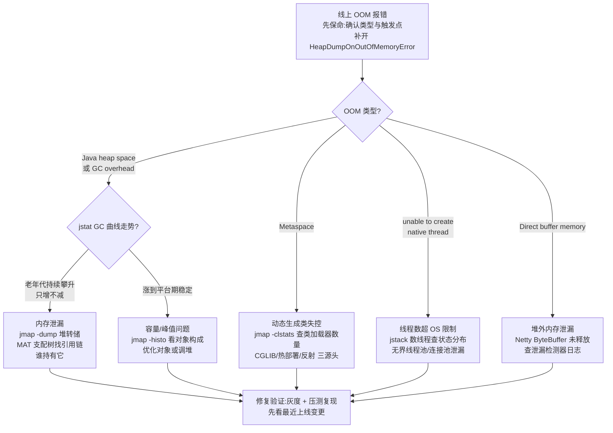
```mermaid
flowchart TD
    OOM[线上 OOM 报错<br/>先保命:确认类型与触发点<br/>补开 HeapDumpOnOutOfMemoryError] --> Type{OOM 类型?}
    Type -- Java heap space<br/>或 GC overhead --> Q1{jstat GC 曲线走势?}
    Q1 -- 老年代持续攀升<br/>只增不减 --> Leak[内存泄漏<br/>jmap -dump 堆转储<br/>MAT 支配树找引用链<br/>谁持有它]
    Q1 -- 涨到平台期稳定 --> Cap[容量/峰值问题<br/>jmap -histo 看对象构成<br/>优化对象或调堆]
    Type -- Metaspace --> Cl[动态生成类失控<br/>jmap -clstats 查类加载器数量<br/>CGLIB/热部署/反射 三源头]
    Type -- unable to create<br/>native thread --> Th[线程数超 OS 限制<br/>jstack 数线程查状态分布<br/>无界线程池/连接池泄漏]
    Type -- Direct buffer memory --> Dm[堆外内存泄漏<br/>Netty ByteBuffer 未释放<br/>查泄漏检测器日志]
    Leak --> Fix[修复验证:灰度 + 压测复现<br/>先看最近上线变更]
    Cap --> Fix
    Cl --> Fix
    Th --> Fix
    Dm --> Fix
```

### 5.3 CPU 飙升与死锁排查流程

**CPU 飙升标准流程**：1) `top -Hp <pid>` 找最耗 CPU 的线程号（转十六进制）；2) `jstack <pid> | grep -A 30 <hex>` 定位线程栈；3) 常见结论：死循环（业务 bug）、GC 线程繁忙（看 jstat 确认）、锁自旋（JUC 自旋）、正则回溯、序列化热点。进阶：arthas `thread -n 3` 一键找最热线程 + `profiler start`（async-profiler 火焰图，找方法级热点）。

**死锁排查**：1) `jstack` 直接输出 "Found one Java-level deadlock"（JVM 内置检测）；2) 无死锁但「互相等待」的活锁/饥饿要靠 `jstack` 看 BLOCKED 线程的 lock owner 链；3) arthas `thread -b` 找阻塞别人的线程。预防：锁顺序一致、tryLock 超时、避免嵌套锁、用并发容器替代手动锁。

### 5.4 内存泄漏经典案例：ThreadLocal

ThreadLocalMap 的 Entry 继承 WeakReference（key 弱引用），但 **value 是强引用**：线程存活 → ThreadLocalMap 存活 → value 永远可达。key 被 GC 后 Entry 变「key=null 的脏条目」，value 泄漏。典型场景：线程池线程复用 + 业务代码 set 后不 remove（如 traceId、用户上下文）。排查：jmap -histo 看 ThreadLocalMap$Entry 数量与 value 类型。规范：**用完后 finally 里 remove()**，或用 try-with-resources 风格的封装（如 Spring 的 RequestContextHolder 内部处理）。

### 5.4.1 完整演练：老年代持续攀升的泄漏排查

背景：订单服务上线两周，老年代占用稳步爬升，每晚 Full GC 一次，P99 恶化。

1. **确认是泄漏不是容量**：`jstat -gcutil <pid> 1000` 观察——YGC 后老年代占用不回落的持续爬升曲线 = 泄漏；若涨到某平台稳定 = 容量问题，直接进入容量评估；
2. **抓堆转储**：`jmap -dump:format=b,file=heap.hprof <pid>`（大堆建议分两次，或直接上 MAT 的 OQL 先摸轮廓）；
3. **MAT 分析**：Leak Suspects 报告 → 支配树找最大保留集 → 看引用链（GC Roots path）。本例：大量 `OrderInfo` 对象被 `HashMap` 持有，HashMap 被某静态 `Cache` 持有；
4. **定位代码**：Cache 是无界 HashMap +「定时清理」逻辑用了 `System.currentTimeMillis() > expireAt` 判断但**从未真正 remove**（清理条件恒 false 的经典 bug）；
5. **修复与验证**：换 Caffeine（容量上限 + 淘汰策略），灰度观察老年代曲线两周，确认平台化不再爬升，Full GC 归零。

教训沉淀：静态缓存必须**有界**；「清理逻辑存在但从未触发」比「没有清理」更隐蔽——评审时专门看缓存类的时间条件分支。

### 5.5 本节高频面试题

**Q1：线上 OOM 了，完整排查流程是什么？**

解答：1) 先保命：确认 OOM 类型与触发点（看日志，Heap dump 路径若没开，下次启动前加 `-XX:+HeapDumpOnOutOfMemoryError -XX:HeapDumpPath=/data/dump`）；2) 判断泄漏 vs 容量：jstat 观察 GC 曲线——老年代持续攀升不回落 = 泄漏；涨到平台期 = 峰值容量；3) 泄漏：jmap -dump 拿转储，MAT 分析支配树/泄漏疑点，定位「谁持有它」的引用链；4) 容量：评估对象大小构成（-histo 直方图），优化对象（懒加载、分页、缓存淘汰）或调堆；5) 修复验证：灰度 + 压测复现对比。资深加分：先看「最近变更」——上线 diff 往往直接指向根因。

**追问**：没有开 HeapDumpOnOutOfMemoryError 怎么办？——jmap -dump 手动抓（OOM 后进程还活着时）；已挂则只能靠日志与 jstat 历史曲线复盘，并补参数等下次复现。所以生产规范是**默认开启 HeapDumpOnOutOfMemoryError**。

**Q2：CPU 100% 但 GC 正常，怎么定位？**

解答：排除 GC 后按「线程 → 方法」两级定位：`top -Hp` 拿到热点线程号（十/十六进制转换），`jstack` 匹配线程栈；多数情况直接看到业务代码死循环/自旋/正则回溯。方法级定位用 async-profiler 火焰图（arthas `profiler start`，30 秒采样即可），看哪个方法占用 CPU 最久。常见结论按概率排序：业务死循环、序列化/加解密热点、日志刷屏（字符串拼接）、锁竞争导致的自旋重试。

**追问**：线程栈显示 `epollWait`/`park` 的线程占 CPU 高可能吗？——不可能，阻塞/等待的线程不耗 CPU；看到这类栈说明取样位置不对（应该找 RUNNABLE 且栈在业务代码/GC 的线程）。这是判断「会不会看线程栈」的试金石。

**Q3：Metaspace OOM 的隐藏原因有哪些？怎么快速定位？**

解答：三大类：1) 动态代理/字节码生成失控——每请求生成新代理类（CGLIB Enhancer 使用不当）；2) 热部署/动态加载框架未卸载——类加载器被强引用（Spring 容器缓存、静态字段）无法回收；3) 反射/脚本引擎（Groovy）动态编译。快速定位：`jmap -clstats <pid>` 看类加载器列表与每个加载器加载类数，数量暴涨的就是源头；配合 `-verbose:class` 看加载日志。修复方向：复用代理/编译缓存、修复加载器引用、显式卸载钩子。

---

## 6. 调优方法论：目标导向，参数服务于目标

### 6.1 三步方法论

1. **定目标**：吞吐优先（批量计算）还是延迟优先（在线交易）？可接受的 GC 停顿（P99）？内存预算（容器限制）？
2. **测基线**：压测拿「当前参数下的 GC 频率、停顿、吞吐」基线——没有基线就没有调优，只有瞎调；
3. **小步调 + 单变量验证**：一次只改一个参数，压测对比，保留有效变更。**调优是工程不是玄学：每个参数都要能解释「为什么改、预期什么、验证什么」**。

### 6.2 参数清单（按作用域）

| 类别 | 参数 | 说明 |
|---|---|---|
| 堆 | -Xms = -Xmx | 生产必须相等，避免动态扩容停顿 |
| 堆 | -XX:MaxMetaspaceSize | 必设，防元空间泄漏拖垮整机 |
| 堆 | -XX:MaxDirectMemorySize | 堆外上限，Netty 场景必设 |
| 栈 | -Xss | 默认 1M，深递归才需要调；调大=线程内存成本上升 |
| 年轻代 | -Xmn / -XX:NewRatio | 默认 1:2；吞吐型可加大年轻代减少 YGC |
| Survivor | -XX:SurvivorRatio | 默认 8；对象存活率低可加大 Eden |
| G1 | -XX:MaxGCPauseMillis | 停顿软目标（默认 200ms），不是硬保证 |
| G1 | -XX:G1HeapRegionSize | Region 大小影响 Humongous 与大对象分配 |
| G1 | -XX:InitiatingHeapOccupancyPercent | 默认 45%，触发并发标记的老年代阈值 |
| GC 线程 | -XX:ParallelGCThreads / ConcGCThreads | 默认按 CPU 核数，容器环境要显式评估 |
| 大对象 | -XX:PretenureSizeThreshold | Parallel 直接进老年代阈值 |
| 诊断 | -XX:+HeapDumpOnOutOfMemoryError + HeapDumpPath | 生产必开 |
| 诊断 | -Xlog:gc*（JDK 9+） | 替代废弃的 PrintGCDetails |
| 容器 | -XX:MaxRAMPercentage / UseContainerSupport | JDK 8u191+ 默认感知容器内存，别手写 -Xmx 撞容器上限 |

### 6.3 案例：大促 GC 调优（完整演练）

背景：交易系统，目标 P99 < 200ms、GC 停顿 < 100ms，大促流量 5 倍。

1. **压测基线**：G1 默认参数，发现 YGC 频繁（每秒多次）、Mixed GC 偶发 300ms+ 停顿 → 不达标；
2. **分析**：jstat 显示 Eden 分配速率极高（对象朝生夕灭为主）；Mixed GC 停顿来自并发标记期间老年代写压力大；观察对象直方图发现大量短命 DTO；
3. **调整**：
   - 对象分配优化（治本）：短命对象避免逃逸（代码层让逃逸分析生效：小方法、少分派）、DTO 复用、批量接口替代循环调用 → 分配速率下降；
   - 参数（治标）：-Xmx 与容器内存对齐、MaxGCPauseMillis 调到 100ms 让 G1 更积极回收、IHOP 适当下调提前并发标记（预留浮动垃圾空间）、Region 大小按大对象分布调整；
4. **验证**：压测复跑，YGC 频率下降、Mixed GC 停顿 < 80ms、P99 达标；灰度观察大促当日 GC 曲线与 Full GC 次数（目标 0 次）。

教训：**GC 参数调整的上限是「分配速率」**——对象少造一个比调十个参数都有效；调优顺序永远是「代码/架构优化 → 参数微调 → 硬件/实例扩容」。

### 6.4 本节高频面试题

**Q1：-Xms 和 -Xmx 为什么不相等会有什么问题？**

解答：堆动态扩容/缩容本身要 STW 式的堆结构调整（实际是扩容时可能触发 Full GC，缩容时释放内存），生产流量下「堆在涨」意味着 GC 行为不稳定、停顿不可预测；且 -Xms 小意味着启动后要经历「堆增长期」，压测基线不可复现。规范：-Xms = -Xmx，一次分配到位。

**追问**：容器里 -Xmx 怎么配？——JDK 8u191+ 默认 -XX:+UseContainerSupport，可用 -XX:MaxRAMPercentage（如 75%）按容器内存比例自动配堆，避免 -Xmx 硬编码撞容器 limit 导致 OOM-killed；堆外 + 元空间 + 线程栈都要在容器内存预算内统筹。

**Q2：G1 的 MaxGCPauseMillis 是硬保证吗？**

解答：不是。它是停顿预测模型的**软目标**：G1 根据历史停顿数据估算每个 Region 的回收成本，选择「满足目标」的回收集合。目标设太小（如 10ms）会导致：回收集合过小 → 回收速度跟不上分配 → 老年代堆积 → 最终退化为 Full GC。设太大则失去意义。工程上：100~200ms 是常见区间，且要配合「分配速率治理」一起做。

**追问**：Full GC 出现一定代表参数错吗？——不一定：可能是晋升失败/Humongous 分配/IHOP 设置问题（参数），也可能是分配速率失控（代码），或堆本身不够（容量）。排查顺序：先看 Full GC 前的老年代曲线和触发日志（-Xlog:gc* 的 ergonomics 信息会说明原因）。

**Q3：调优时「一次只改一个参数」为什么是铁律？**

解答：JVM 参数高度耦合（堆大小影响 GC 频率与停顿、Region 大小影响 Humongous 与 RSet 开销、GC 线程数影响 CPU 竞争），多参数同改无法归因——压测结果变好了不知道是谁的功劳，变差了不知道是谁的锅。单变量 + 压测复现 + 记录基线，才能沉淀出「这个系统这套参数」的可复现结论。资深工程师的调优报告长什么样：目标 → 基线数据 → 假设 → 变更 → 验证数据 → 结论。

---

## 7. 考点速查表

| 考点 | 一句话要点 |
|---|---|
| 运行时数据区 | 堆管对象、栈管帧、元空间管类元数据、直接内存管 IO |
| 指针压缩 | ≤32GB 堆引用 4 字节；超 32GB 失效，31GB 常优于 33GB |
| 对象布局 | Mark Word（锁/GC 年龄）+ Klass 指针 + 字段 + 对齐 |
| 逃逸分析 | 不逃逸对象可栈上分配/标量替换/锁消除，依赖内联 |
| 元空间 | JDK 8 替代 PermGen，本地内存，必须设 MaxMetaspaceSize |
| 类加载五阶段 | 加载-验证-准备(零值)-解析-初始化(clinit) |
| 双亲委派 | 父先加载保一致性；Tomcat 隔离/SPI 用 TCCL/热部署换加载器 |
| 引用类型 | 强/软/弱/虚；ThreadLocal key 弱引用、value 强引用会泄漏 |
| CMS 四大缺陷 | 浮动垃圾、CMF 退化、碎片、CPU 开销 |
| G1 三件套 | Region 化、RSet 记忆集、SATB 并发标记 |
| G1 混合回收 | 按停顿预测选高收益 Region 回收，IHOP 默认 45% |
| ZGC | 染色指针 + 读屏障实现并发转移，TB 级堆亚毫秒停顿 |
| 分层编译 | 解释器→C1→C2，profiling 驱动，OSR 替换长循环 |
| 方法内联 | JIT 核心优化，小方法少分派利于内联 |
| OOM 四类 | 堆/GC overhead/Metaspace/native thread（+Direct buffer） |
| 排查流程 | jstat 看曲线 → jmap 转储 → MAT 支配树；top -H + jstack 定位 CPU |
| 死锁检测 | jstack 直接输出 deadlock；arthas thread -b |
| ThreadLocal 泄漏 | 线程池 + 不 remove = value 永不回收，finally 里 remove |
| 调优铁律 | 目标→基线→单变量→压测验证；先治分配速率再调参数 |
| 生产必开 | HeapDumpOnOutOfMemoryError、-Xms=-Xmx、MaxMetaspaceSize |
| JFR | JDK 11+ 低开销录制，GC 日志+JFR+线程栈为排障三件套 |
| 三色标记 | 白灰黑三色 + 写屏障；CMS 增量更新 vs G1 SATB 防漏标 |

---

# 03 · 并发编程与 JUC 源码

> 适用对象：10+ 年经验的资深工程师 / 架构师候选人。本章要求「源码级理解」：AQS、线程池、ConcurrentHashMap 的关键流程要能徒手画出来，JMM 与锁升级要能讲清机制而不是背结论。

**TL;DR 本章学习要点**

1. JMM 三大特性（原子/可见/有序）与 happens-before 是并发推理的公理系统，DCL 为什么必须 volatile 是试金石；
2. synchronized 的完整故事是「偏向→轻量→重量」的锁升级 + JIT 的锁消除/粗化，JDK 15 后偏向锁废弃的原因要能讲透；
3. volatile 管可见性与有序性、不管原子性；CAS 管原子性但有 ABA，LongAdder 是「分段计数」思想解决 CAS 竞争；
4. AQS 是 JUC 的基石：state + CLH 变体队列 + 模板方法，ReentrantLock/CountDownLatch/Semaphore 全是它的子类，公平/非公平只是一行 tryAcquire 的差异；
5. 并发容器记住三组对比：CHM 的「CAS+锁桶头」vs 分段锁、COW 的写复制读无锁、BlockingQueue 族的一把锁/两把锁/无缓冲差异；
6. 线程池的 ctl 状态机、execute 三步流程、四种拒绝策略、动态调参要能默写；ForkJoin 工作窃取与 CompletableFuture 的 Completion 链是异步进阶；
7. 虚拟线程（JDK 21）是「阻塞即让路」的调度革命，但要分清适用场景与 pinning 陷阱；死锁排查 jstack + arthas 要形成肌肉记忆。

---

## 1. 线程基础与 JMM

### 1.1 线程状态机

```
NEW → RUNNABLE ⇄ BLOCKED（synchronized 抢锁失败）
              ⇄ WAITING（wait/join/park）
              ⇄ TIMED_WAITING（sleep/wait(timeout)/parkNanos）
     → TERMINATED
```

要点：`Thread.sleep` 不释放锁、`wait` 释放锁；`notify` 随机唤醒一个、`notifyAll` 唤醒全部；**虚假唤醒（spurious wakeup）** 是规范允许的，所以 `wait` 必须放在 `while(条件)` 循环里而不是 `if`。`interrupt` 只是设置标志位：阻塞中的线程收到标志会抛 `InterruptedException` 并清除标志，`isInterrupted()` 与 `interrupted()`（会清除标志）的区别是经典陷阱。

### 1.2 JMM：主内存与工作内存

JMM 抽象模型：每个线程有私有**工作内存**（寄存器/缓存副本），共享变量存在**主内存**。线程读写变量 = 主内存 ↔ 工作内存的拷贝同步，同步时机不受控制 → 可见性问题。JMM 的职责是定义「什么情况下一个线程的写对另一个线程可见」——即 happens-before 规则。

**happens-before 规则（面试默写清单）**：

1. 程序顺序规则：单线程内书写在前的操作 happens-before 书写在后的；
2. 管程锁规则：解锁 happens-before 后续对同一把锁的加锁；
3. volatile 规则：volatile 写 happens-before 后续对同一变量的读；
4. 线程启动规则：`Thread.start()` happens-before 该线程内任何操作；
5. 线程终止规则：线程内所有操作 happens-before 其他线程检测到它终止（join 返回）；
6. 中断规则：`interrupt()` 调用 happens-before 被中断线程检测到中断；
7. 终结器规则：对象构造完成 happens-before finalize 开始；
8. 传递性：A hb B 且 B hb C → A hb C。

**三大特性**：原子性（synchronized/atomic 类保证）、可见性（volatile/synchronized/final）、有序性（happens-before + volatile 禁止重排）。重排序来源有三层：编译器重排、CPU 指令级重排（乱序执行）、内存系统重排（store buffer）；但**数据依赖关系不会被重排**（as-if-serial）。

### 1.3 DCL 单例：为什么必须 volatile

```java
class Singleton {
    private static volatile Singleton instance;
    static Singleton get() {
        if (instance == null) {              // 第一次检查（无锁快路径）
            synchronized (Singleton.class) {
                if (instance == null) {      // 第二次检查（锁内）
                    instance = new Singleton();
                }
            }
        }
        return instance;
    }
}
```

`new Singleton()` 的三步（分配内存 → 初始化字段 → 引用赋值）中，第 2、3 步可能被重排：另一个线程第一次检查读到「非 null 但未初始化」的 instance。JDK 5 起 volatile 语义保证「volatile 写之前的初始化操作全部完成」，从而修复 DCL。**没有 volatile 的 DCL 是错的**——这是并发面试的第一道分水岭。

### 1.4 本节高频面试题

**Q1：讲一下 JMM 的 happens-before 规则，并举例它如何推导「程序正确」？**

解答：先讲清楚 JMM 是「最小保证」：只要两个操作之间有 happens-before 关系，前者的结果对后者可见且有序；没有该关系就不能假设任何顺序。举例推导：线程 A 在 synchronized 块里写共享变量后解锁，线程 B 加同一把锁后读取——由管程锁规则 + 传递性，B 必然看到 A 的写入。这就是「锁不仅管原子性，也管可见性」的理论依据，也是「加锁读不加锁写」这种错误写法的判死刑依据。

**追问**：final 字段的可见性怎么保证？——JMM 有 final 域规则：构造器内 final 字段的写入 happens-before 构造器外对该对象引用的发布（且禁止把 final 字段的写重排到构造器外）。所以「不可变对象天然线程安全」在 JMM 层面有正式保证——前提是引用安全发布（不要通过 `this` 逃逸）。

**Q2：为什么 wait/notify 必须在 synchronized 块里？**

解答：两个原因：1) **语义需要**：wait 会释放锁，调用前必须持有锁才能「释放」，否则无法实现「等待期间其他线程进入临界区」；2) **防丢失唤醒（lost wakeup）**：若 wait 不加锁，判断条件与挂起之间可能插入其他线程的 notify——条件已满足但本线程永远等下去。经典错误写法：`if (!ready) wait();` 与不加锁的 wait，都会导致丢失唤醒。这也是 JUC 里 `LockSupport.park` 不需要锁、但必须配合「条件检查与 park 的原子性」自己小心的原因（AQS 内部就是这么处理的）。

**追问**：wait 和 sleep 的区别？——wait 释放锁、依赖 notify 唤醒（或超时）、必须在同步块内；sleep 不释放锁、到点自动醒、随处可用。语义上 wait 是「协作等待条件」，sleep 是「让出 CPU 计时」。

---

## 2. synchronized 原理：Monitor 与锁升级

### 2.1 Monitor 与字节码

`synchronized` 编译为 `monitorenter` / `monitorexit`（代码块），方法级用 `ACC_SYNCHRONIZED` 标志。底层依赖 **ObjectMonitor**（HotSpot C++ 对象）：核心字段 owner（持有线程）、entryList（等待进入的阻塞队列）、waitSet（wait 的线程队列）。`wait/notify` 就是操作 waitSet 与 entryList。

### 2.2 锁升级：偏向 → 轻量 → 重量

锁状态存在对象头 Mark Word 里，升级路径（JDK 15 前）：

```
无锁 → 偏向锁（Mark Word 记录线程 ID，同一线程重入零开销）
     → 轻量级锁（竞争出现：栈帧建立 Lock Record，CAS 交换 Mark Word；自旋等待）
     → 重量级锁（自旋失败/竞争激烈：膨胀为 ObjectMonitor，线程 park 阻塞）
```

- **偏向锁**：假设「锁基本由同一线程获取」，CAS 写线程 ID 即可，重入不再有任何同步操作；撤销要等安全点（STW 停顿点），撤销成本高；
- **轻量级锁**：假设「锁竞争不激烈」，CAS 抢不到就**自适应自旋**（JDK 6 默认开），自旋失败才膨胀；
- **重量级锁**：ObjectMonitor + park/unpark，线程真正阻塞，涉及用户态/内核态切换。

**JDK 15（JEP 374）默认禁用并废弃偏向锁**：原因——1) 现代应用线程池场景下「单线程反复获取同一把锁」很少见，收益有限；2) 撤销偏向锁需要安全点 STW，撤销风暴反而制造停顿；3) 与 JIT 优化（如锁消除）冲突，维护成本高。（偏向锁代码后续版本仍保留但默认关闭，彻底移除计划待核实。）

> 图示：synchronized 锁升级状态机

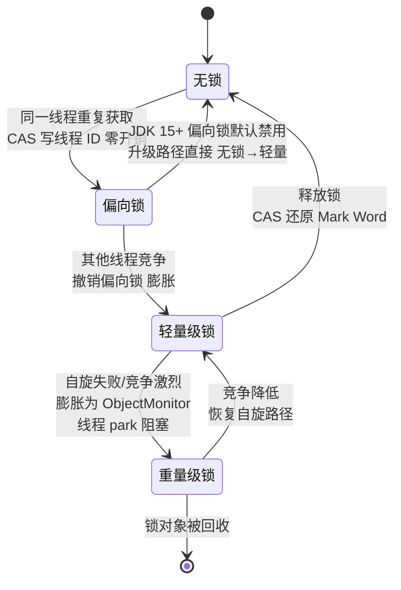
```mermaid
stateDiagram-v2
    [*] --> S0
    state "无锁" as S0
    state "偏向锁" as S1
    state "轻量级锁" as S2
    state "重量级锁" as S3
    S0 --> S1: 同一线程重复获取<br/>CAS 写线程 ID 零开销
    S1 --> S2: 其他线程竞争<br/>撤销偏向锁 膨胀
    S2 --> S0: 释放锁<br/>CAS 还原 Mark Word
    S2 --> S3: 自旋失败/竞争激烈<br/>膨胀为 ObjectMonitor<br/>线程 park 阻塞
    S3 --> S2: 竞争降低<br/>恢复自旋路径
    S1 --> S0: JDK 15+ 偏向锁默认禁用<br/>升级路径直接 无锁→轻量
    S3 --> [*]: 锁对象被回收
```

### 2.3 JIT 的锁优化

- **锁消除（Lock Elision）**：逃逸分析证明对象不逃逸，synchronized 直接删掉（如 `StringBuffer` 在方法内局部使用）；
- **锁粗化（Lock Coarsening）**：相邻多次加同一把锁合并为一次，减少加解锁开销；
- 注意区分：这是 JIT 运行时优化，与代码层面的锁设计无关。

### 2.4 本节高频面试题

**Q1：synchronized 的锁升级过程？偏向锁为什么要废弃？**

解答：升级路径「偏向 → 轻量（CAS + 自旋）→ 重量（Monitor + park）」，核心思想是**乐观渐进**：根据竞争程度动态选择开销最小的方案，而不是一上来就阻塞。废弃原因从收益与成本两端讲：收益端——偏向锁只在「单线程独占锁」场景有优势，而现代服务端（线程池、多线程框架）几乎都有竞争；成本端——撤销需要安全点 STW、批量重偏向逻辑复杂、与 JIT 锁消除互相干扰，维护/风险成本超过收益。面试加分：指出 JEP 374 后锁升级路径变为「无锁 → 轻量 → 重量」，偏向锁代码路径在后续版本中保留但不可用。

**追问**：轻量级锁的自旋是无限的吗？——不是，自适应自旋：JVM 根据「上次同一锁自旋成功率」动态调整自旋次数（成功率高就多自旋），失败则膨胀为重量级锁。自旋的本质是「用 CPU 换阻塞切换成本」，单核机器上自旋无意义（JVM 会直接跳过）。

**Q2：synchronized 和 ReentrantLock 怎么选？**

解答：语义等价（都是互斥 + 可重入 + 内存屏障），差异在**能力与实现**：1) 公平性——ReentrantLock 可配公平锁，synchronized 非公平；2) 中断响应——`lockInterruptibly()` 可响应中断，synchronized 等待锁不可中断；3) 超时——`tryLock(timeout)`；4) 多条件——Condition 可多队列精确唤醒（synchronized 只有 waitSet 一个队列）；5) 性能——现代 JDK 两者差距可忽略（synchronized 有 JIT 锁消除/粗化加持）。结论：需要公平/超时/多条件用 ReentrantLock，否则 synchronized 优先（更简单、更少出错、未来还有优化空间）。

**追问**：为什么 synchronized 不可中断是问题？——死锁场景下，synchronized 的等待线程永远无法被外部唤醒，只能重启；tryLock 超时可以在死锁时「放弃重试」，是工程上防死锁的最后一道闸。

---

## 3. volatile 与 CAS

### 3.1 volatile 语义：可见性 + 有序性，不含原子性

- **可见性**：volatile 写 happens-before 后续读（JMM 规则）——写后强制刷新主内存，读前强制从主内存取；
- **有序性**：JMM 对 volatile 读写前后加内存屏障约束（编译器/CPU 层）：写前 StoreStore、写后 StoreLoad；读后 LoadLoad/LoadStore。x86 实现：volatile 写编译为带 `lock` 前缀的指令（锁总线/缓存行），天然带全屏障；
- **不保证原子性**：`volatile int i; i++` 是读-改-写三步，两个线程交错会丢更新——「volatile 不能替代 synchronized/atomic」是必考题；
- 适用场景：状态标志（`running`）、双检锁、发布不可变对象引用。

### 3.2 CAS 与 ABA

- CAS（Compare-And-Swap）：`Unsafe.compareAndSwapInt` 等，硬件指令（x86 `lock cmpxchg`）保证「比较 + 交换」原子；乐观并发：失败就循环重试；
- **ABA 问题**：值 A → B → A，CAS 认为「没变过」，但中间状态被其他线程改过（如栈顶节点被弹出又压回同地址）。解决：`AtomicStampedReference`（版本号）/ `AtomicMarkableReference`（布尔标记）；
- 原子类家族：`AtomicInteger/AtomicLong/AtomicReference`（CAS 循环）、`AtomicIntegerFieldUpdater`（字段级，省对象头）、**LongAdder**（Striped64 分段：把单个计数拆成多个 cell，写线程 CAS 自己 cell，读时 sum 汇总——高并发写吞吐远超 AtomicLong，代价是读是近似值；适合计数器/指标统计，不适合「读必须精确」的场景）。

### 3.3 本节高频面试题

**Q1：volatile 能保证原子性吗？`volatile int i` 的 `i++` 线程安全吗？**

解答：不能。`i++` 是「读 → 加 → 写」三步，volatile 只保证每一步的可见性与整体顺序约束，不保证三步之间不被其他线程插入。两个线程同时执行 10000 次 i++，结果 < 20000。线程安全写法：AtomicInteger（CAS 循环）、synchronized、或 LongAdder（计数场景）。追问陷阱：`volatile long` 的读写是原子的吗？——JMM 明确保证 volatile 的 long/double 读写原子（非 volatile 的 64 位读写规范允许拆分，HotSpot 64 位下实际不拆）。

**追问**：LongAdder 和 AtomicLong 怎么选？——写多读少、允许近似读（计数器、指标）→ LongAdder；需要强一致读或依赖返回值做逻辑（如 compareAndSet 语义）→ AtomicLong。LongAdder 的 sum 是遍历 cell 求和，并发写时结果可能略滞后。

**Q2：CAS 的 ABA 问题是什么？实际遇到过吗？**

解答：ABA = 值被其他线程从 A 改成 B 又改回 A，CAS 无法察觉「中间被修改过」，基于「值没变」的假设做出错误决策。经典场景：无锁栈/链表用 CAS 更新头指针，A 线程 CAS 前读取头节点 X，B 线程弹出 X 又压入 X（同一对象复用），A 的 CAS 成功但栈结构已变。解法：AtomicStampedReference 带版本号。实际工程中「值类型/不可变对象 + 无复用」场景 ABA 无危害，不必过度设计；但对象池、缓存复用场景必须警惕。

---

## 4. AQS 源码深度：state、CLH 变体与模板方法

### 4.1 设计骨架

`AbstractQueuedSynchronizer` 是 JUC 的基石（ReentrantLock/CountDownLatch/Semaphore/ReentrantReadWriteLock/ThreadPoolExecutor 的 Worker 都基于它）：

- **state**：`volatile int state`，语义由子类定义（重入计数/许可数/门闩计数）；
- **CLH 变体队列**：双向链表（Node：prev/next/thread/waitStatus），入队 CAS 到 tail，出队从 head 推进——相比原始 CLH，支持取消（CANCELLED）、前驱唤醒（SIGNAL）与条件队列（CONDITION）；
- **模板方法模式**：`tryAcquire/tryRelease/tryAcquireShared/tryReleaseShared/isHeldExclusively` 由子类实现，AQS 负责排队、阻塞、唤醒的公共逻辑——这就是「换一行 tryAcquire 就能造一把新锁」的原因。

### 4.2 acquire / release 完整流程（独占模式）

```
acquire(arg):
  if tryAcquire(arg) 成功 → 直接拿到锁
  else:
    addWaiter(EXCLUSIVE)      // CAS 入队尾，返回新节点
    acquireQueued(node, arg): // 核心循环
      for (;;):
        p = node.prev
        if p == head 且 tryAcquire 成功 → setHead(node)，返回（中断标志按需处理）
        shouldParkAfterFailedAcquire(p, node):
          // p.waitStatus==SIGNAL → 可以 park；==0 → CAS 置 SIGNAL 重试；CANCELLED → 跳过
        parkAndCheckInterrupt()  // LockSupport.park 阻塞，唤醒后检查中断
      // 非响应中断版：记录 interrupted 标志，拿到锁后补一次 interrupt()
      // 响应中断版（lockInterruptibly）：中断则抛 InterruptedException 并出队

release(arg):
  if tryRelease(arg) 成功:
    unparkSuccessor(head):
      // head.next 若 CANCELLED，从 tail 向前找第一个非 CANCELLED 节点
      // LockSupport.unpark 唤醒该线程
```

要点：1) **只有 head.next 被唤醒**——CLH 的「逐级传递」唤醒，避免惊群；2) park 前必须确保前驱是 SIGNAL（否则可能丢失唤醒），这是 shouldParkAfterFailedAcquire 的意义；3) 中断不直接取消排队（非响应版），保证「要么拿到锁要么继续等」。

> 图示：AQS 独占模式获取锁时序

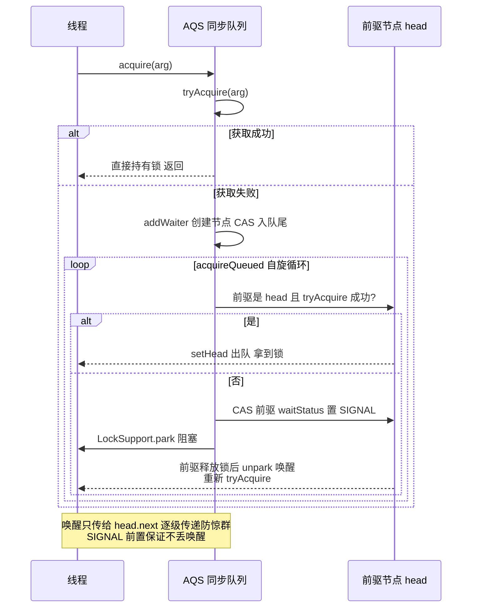
```mermaid
sequenceDiagram
    participant T as 线程
    participant AQS as AQS 同步队列
    participant P as 前驱节点 head
    T->>AQS: acquire(arg)
    AQS->>AQS: tryAcquire(arg)
    alt 获取成功
        AQS-->>T: 直接持有锁 返回
    else 获取失败
        AQS->>AQS: addWaiter 创建节点 CAS 入队尾
        loop acquireQueued 自旋循环
            AQS->>P: 前驱是 head 且 tryAcquire 成功?
            alt 是
                P-->>T: setHead 出队 拿到锁
            else 否
                AQS->>P: CAS 前驱 waitStatus 置 SIGNAL
                AQS->>T: LockSupport.park 阻塞
                P-->>T: 前驱释放锁后 unpark 唤醒<br/>重新 tryAcquire
            end
        end
    end
    Note over T,AQS: 唤醒只传给 head.next 逐级传递防惊群<br/>SIGNAL 前置保证不丢唤醒
```

### 4.3 公平 vs 非公平：一行之差

- **非公平（NonfairSync）**：`lock()` 先 `compareAndSetState(0, 1)` 直接抢一次，失败才走 acquire——新来的线程可以插队；
- **公平（FairSync）**：`tryAcquire` 里先查 `hasQueuedPredecessors()`（队列非空且 head.next 不是当前线程 → 让路），严格 FIFO；
- 为什么非公平吞吐更高：唤醒 head.next 有上下文切换开销，插队线程「趁热」拿到锁时锁可能刚好被释放，省一次切换；代价是尾部线程可能长期饥饿（概率性，不是必然）。

### 4.4 本节高频面试题

**Q1：手写 AQS 的 acquire 流程？为什么 park 前要把前驱置为 SIGNAL？**

解答：流程为「tryAcquire → 失败 addWaiter 入队 → 循环：前驱是 head 就再试一次 → shouldParkAfterFailedAcquire → park」。SIGNAL 的语义是「我即将 park，前驱释放锁时请唤醒我」：若前驱不是 SIGNAL 就 park，可能发生「前驱释放完锁、检查后继、发现无事可做、睡去；而我才刚 park」——唤醒事件发生在 park 之前，永远错过（lost wakeup）。所以必须先 CAS 前驱为 SIGNAL 再 park，配合「被唤醒后重新 tryAcquire」的循环，保证不会丢。

**追问**：为什么唤醒只唤醒 head.next？——CLH 队列的唤醒是逐级传递的：每个节点只负责唤醒自己的后继，避免「一次唤醒所有等待者」的惊群效应（thundering herd）。被唤醒节点拿到锁后成为新 head，再唤醒它的后继。这是 CLH 队列相比「单一等待队列 + notifyAll」的 scalability 优势。

**Q2：公平锁和非公平锁的性能差异？为什么非公平反而快？**

解答：非公平锁的插队设计减少了「唤醒开销的浪费」：公平锁下，锁释放 → 唤醒 head.next（上下文切换）→ 新线程抢锁，若此刻锁已被释放但唤醒还没完成，锁处于「空闲但无人可用」的窗口期；非公平允许新线程直接抢占这个窗口。所以高竞争下非公平锁吞吐更高（减少切换次数），代价是等待线程的公平性/潜在饥饿。ReentrantLock 默认非公平就是这个权衡。面试加分：指出「非公平不保证饥饿」——插队线程很快拿到锁就会让出，极端情况下才可能饿死。

**追问**：AQS 的共享模式（acquireShared）和独占模式什么区别？——共享模式获取成功后**会继续唤醒后继**（传播传播性），适合「许可数 >1」的 Semaphore 和 CountDownLatch（计数到 0 要唤醒所有等待者）；独占模式只有一个 owner，唤醒只传给 head.next。ReentrantReadWriteLock 的读锁就是共享模式、写锁是独占模式。

---

## 5. 锁家族：ReentrantLock / ReentrantReadWriteLock / StampedLock / Condition

### 5.1 ReentrantLock：state 计数实现可重入

- 可重入 = `tryAcquire` 里「state == 0 抢锁；state > 0 且 owner 是自己 → state+1」；`tryRelease` 每次 -1，减到 0 才真正释放——重入 N 次必须解锁 N 次，否则锁不释放（经典 bug）；
- `isHeldExclusively` 判断 owner 是否当前线程。

### 5.2 ReentrantReadWriteLock：state 拆两半

- **state 高 16 位 = 读锁计数，低 16 位 = 写锁重入计数**——一个 int 装两把锁；
- 读锁共享获取（多个读线程可同时持有）、写锁独占；
- **锁降级**：持有写锁时获取读锁是允许的（写 → 读降级，防止「读到自己没写完的数据」）；**锁升级（读 → 写）会死锁**——两个读线程都想升级，互相等对方释放读锁；
- 适用：读多写少且读操作较重的场景；写少但频繁时读锁的 CAS 竞争也很可观。

### 5.3 StampedLock：乐观读的野心

- JDK 8 引入，三种模式：**写锁**、**悲观读锁**、**乐观读（tryOptimisticRead）**；
- 乐观读不真正加锁：拿到 stamp → 读数据 → `validate(stamp)` 校验期间有无写发生；有则重试或升级悲观读；
- 优势：读读场景零锁开销（连读锁的原子计数都省了），适合「读多写极少且读操作快」；
- 限制：**不可重入**、不支持 Condition、乐观读校验失败要重读（写频繁场景会退化）；
- 实现要点：state 用位标记写锁占用，写锁获取失败先自旋（有限次）再阻塞，读锁用「读节点链表」记录等待者（不适用 AQS 的共享计数，因为要支持乐观读）。

### 5.4 Condition：精确唤醒的等待队列

- `Condition.await/signal` 对应 `wait/notify`，但每个 Lock 可创建**多个 Condition**（生产者/消费者各一个队列），实现精确唤醒（如「队列满只唤醒生产者」），避免 notifyAll 惊群；
- 实现：每个 Condition 一条单向等待队列（nextWaiter 链接）；`await` = 入条件队列 → 释放 state → park；`signal` = 把条件队列头节点转移到 AQS 同步队列（transferForSignal）→ 由 AQS 正常唤醒——**两个队列的转移**是理解 Condition 的关键；
- 陷阱：await 后条件可能仍不满足（虚假唤醒 + 多等待者），必须 while 循环重查。

### 5.5 本节高频面试题

**Q1：ReentrantReadWriteLock 的锁降级和锁升级分别是什么？为什么升级会死锁？**

解答：降级 = 持写锁时获取读锁再释放写锁（保证后续读看到的是自己写完的数据，且期间不被其他写者插入）；升级 = 持读锁时获取写锁——两个读线程同时升级时，各自持有读锁等待对方释放（写锁需要所有读锁释放），互相等死。所以 ReadWriteLock 只支持降级不支持升级。工程启示：需要「先读后写」的原子语义时，要么直接用写锁，要么用 StampedLock 的乐观读 + 升级路径（先乐观读，写冲突时获取写锁重读）。

**追问**：读多写少就一定适合 ReadWriteLock 吗？——不一定：1) 读操作很快时，读写锁的原子计数与 CAS 竞争可能比 synchronized 更贵；2) 写线程频繁时读线程饿死（默认非公平，写优先）；3) 高并发读场景，StampedLock 乐观读或无锁方案（COW、CopyOnWriteArrayList）可能更优。选型要看「读写比例 + 临界区时长」。

**Q2：Condition 和 wait/notify 的本质区别？**

解答：1) **队列维度**：wait/notify 只有一条 waitSet，notifyAll 唤醒所有（惊群 + 无差别竞争）；Condition 每个条件一条队列，signal 只唤醒该条件的等待者（如「队列有空间」条件只唤醒生产者）；2) **中断**：await 可响应中断/超时（awaitNanos）；3) **灵活性**：一个 ReentrantLock 可配多个 Condition，synchronized 一个 monitor 只有一个等待集。实现层面，Condition 等待队列与 AQS 同步队列是两个队列，signal 做「转移」而非直接唤醒，保证了唤醒时锁状态一致。

---

## 6. 同步工具：CountDownLatch / CyclicBarrier / Semaphore / Exchanger

| 工具 | 原理（都是 AQS 子类） | 一次性 | 用途 |
|---|---|---|---|
| CountDownLatch | state = 计数，countDown 减 1，减到 0 释放所有等待者（共享模式传播唤醒） | 是 | 主线程等 N 个任务完成（并行初始化、压测并发起点） |
| CyclicBarrier | 不是 AQS！基于 ReentrantLock + Condition，所有线程 await 齐了放行，可重置复用 | 否 | 多线程分阶段协同（如多阶段计算，每阶段齐步走） |
| Semaphore | state = 许可数，acquire 减、release 加，可配公平 | 否 | 限流（连接数、并发数上限） |
| Exchanger | 两线程交换数据：Node 槽位 + CAS，先到的挂起等配对 | 否 | 双缓冲交替（生产者填 A 消费者读 B，交换） |

关键区分（高频）：**CountDownLatch 是「数数」**——等的是「事件发生 N 次」，参与者 countDown 完就走，不可重置；**CyclicBarrier 是「集合」**——等的是「N 个线程都到达」，人到齐了一起放行，可循环使用，且支持 barrierAction（人到齐后先执行的动作）。Semaphore 是「资源配额」，acquire 拿不到就等。

### 6.1 本节高频面试题

**Q1：CountDownLatch 和 CyclicBarrier 的区别？各自适用场景？**

解答：语义上：Latch 是「计数器归零」事件，等待者与计数者解耦（计数者 countDown 后继续干自己的事）；Barrier 是「栅栏集合」，所有参与者必须同时到达才能继续，且参与者会互相等待。实现上：Latch 基于 AQS 共享模式（state 减到 0 传播唤醒），Barrier 基于 ReentrantLock + Condition（最后一个到达的线程触发放行 + 重置）。场景：Latch → 主线程聚合多个异步任务结果、压测同时开跑；Barrier → 分阶段并行计算（每阶段结束对齐）、多线程写入后统一提交。面试陷阱：说「Barrier 也是 AQS 实现的」会暴露没看过源码——它内部用的是 Lock + Condition。

**追问**：await 超时/中断时 Barrier 会怎样？——任一参与者 await 超时或中断，栅栏进入 broken 状态，其他所有等待线程抛 BrokenBarrierException——这是「协同任务」的失败传播设计：一个人掉队，整组作废重来，而不是各自卡死。

**Q2：Semaphore 实现限流有什么坑？**

解答：1) 公平性：默认非公平，饥饿场景要 new Semaphore(n, true)；2) **release 不校验持有**：任何线程都能 release 增加许可，必须确保「谁 acquire 谁 release」（try-finally）；3) 只能限「进入临界区的并发数」，限不住「进入后的执行时长」——长任务场景 QPS 控制要靠别的（如令牌桶 RateLimiter）；4) 分布式场景 Semaphore 只在本进程有效，跨实例限流要用 Redis/网关。面试加分：指出 Semaphore 可作「连接池信号量」模式——acquire 拿许可、用连接、finally release。

---

## 7. 并发容器：ConcurrentHashMap / COW / BlockingQueue 族

### 7.1 ConcurrentHashMap：JDK 8 的 CAS + 锁桶头

JDK 7 用**分段锁**（Segment 数组，每段一把锁，默认 16 段）；JDK 8 重构：

- **结构**：Node 数组 + 链表/红黑树，锁粒度细化为**单个桶头节点**（synchronized 锁住桶头），空桶用 **CAS** 直接插入（无锁路径）；
- **putVal 流程**：计算 hash → 空桶 CAS 插入 → 非空 synchronized(桶头) 插入链表/树 → 链表长度 ≥8 且数组 ≥64 时树化（红黑树，防 hash 冲突退化）；<6 退化为链表；
- **扩容**：多线程**协助扩容**——transfer 阶段旧桶迁移后放 ForwardingNode 标记，新线程 put 遇到 ForwardingNode 会加入迁移（sizeCtl 负数表示扩容中，低位移位记录参与线程数）；
- **size()**：baseCount + CounterCell 数组（高并发下分散计数，读时求和，近似值）；
- **弱一致性迭代器**：遍历不抛 ConcurrentModificationException，可能看到遍历开始后的修改（也可能看不到）——这是「弱一致」的含义；
- **不允许 null key/value**（区别于 HashMap）：因为并发下无法区分「值为 null」与「不存在」（get 返回 null 无法判断，而 containsKey 检查在并发下不可靠）；
- 其他要点：get 无锁（Node 的 val/next 是 volatile）、LongAdder 式计数、树节点 TreeBin 头节点锁。

### 7.2 CopyOnWriteArrayList：写复制、读无锁

- 写（add/remove）：加锁 → **复制整个数组** → 修改副本 → 替换 volatile array 引用；读（get）：直接读 array，无锁；
- 适用：**读多写极少**（配置列表、监听器列表）；迭代器是快照（弱一致），迭代期间修改不可见；
- 代价：每次写 O(n) 复制，写频繁时内存与 GC 压力大。

### 7.3 BlockingQueue 族对比

| 队列 | 结构 | 锁模型 | 有界性 | 特点/用途 |
|---|---|---|---|---|
| ArrayBlockingQueue | 数组环形 | **一把锁 + notEmpty/notFull 两个 Condition** | 有界（必须） | 公平可配；有界队列首选 |
| LinkedBlockingQueue | 链表 | **两把锁**（takeLock/putLock 各带 Condition） | 默认无界 | 读写互不阻塞；Executors 工厂的坑源 |
| SynchronousQueue | 无缓冲 | 公平 TransferQueue / 非公平 TransferStack | 天然 0 | 直接交接，CachedThreadPool 用它 |
| PriorityBlockingQueue | 二叉堆 | 一把锁 | 无界 | 按优先级出队；任务调度 |
| DelayQueue | PriorityQueue + 延迟 | 一把锁 + Condition | 无界 | 到期才可取；定时任务调度（ScheduledThreadPoolExecutor 用 DelayedWorkQueue，同思路） |
| LinkedTransferQueue | 链表 | 无锁（CAS） | 无界 | transfer 直接交接，SynchronousQueue 增强版 |

选型口诀：有界 + 公平 → ArrayBlockingQueue；吞吐优先 + 可无界 → LinkedBlockingQueue；生产者消费者直连交接 → SynchronousQueue/LinkedTransferQueue；优先级/延迟 → Priority/Delay。

### 7.4 本节高频面试题

**Q1：ConcurrentHashMap 为什么 JDK 8 放弃分段锁？**

解答：四个理由：1) **锁粒度**：分段锁粒度是「一段」（含多个桶），锁桶头是「一个桶」，并发度更高；2) **内存**：Segment 继承 ReentrantLock，每段一个锁对象 + 数组，内存开销大；3) **退化防御**：JDK 8 引入红黑树，hash 冲突严重时链表 O(n) 退化为树 O(log n)，分段锁方案没有；4) **实现简化**：CAS + synchronized 组合（空桶 CAS 无锁、非空锁桶头）代码路径更清晰。面试加分：JDK 8 的 get 完全无锁（volatile 读），JDK 7 的 get 也要过 Segment 锁——读路径差异是性能提升的另一来源。

**追问**：为什么链表长度 ≥8 且数组长度 ≥64 才树化？——8 是泊松分布经验值：随机 hash 下链表长度到 8 的概率极低（约千万分之一），达到 8 说明 hash 分布出问题（如 key 的 hashCode 低劣），此时树化防退化；数组 <64 时优先扩容（扩容能重新散列，可能直接解决冲突，比树化便宜）。退化为链表阈值 6 留了 2 的缓冲，避免树/链表在临界点反复横跳。

**Q2：BlockingQueue 的 put 和 offer 有什么区别？Executors 的坑和它们什么关系？**

解答：put 阻塞等待容量（可中断），offer 立即返回 boolean（offer(timeout) 限时）。Executors 的坑：`newFixedThreadPool` 用**无界 LinkedBlockingQueue**——任务只进不出时队列无限膨胀 → OOM；`newCachedThreadPool` 用 SynchronousQueue——任务直接交接给线程，线程不够就**新建线程**（最大 Integer.MAX_VALUE）→ 线程数失控 OOM。教训：生产线程池必须自定义有界队列 + 明确拒绝策略（详见第 8 节）。

**追问**：ArrayBlockingQueue 和 LinkedBlockingQueue 谁吞吐高？——Linked 两把锁，put 与 take 可并行，吞吐通常更高；Array 一把锁但数组连续、GC 友好、可指定公平。选型：需要严格有界 + 公平 → Array；追求吞吐且可接受无界风险 → Linked（生产上仍建议显式设容量）。

---

## 8. ThreadPoolExecutor 源码：状态机、流程与调参

### 8.1 七参数与 ctl 状态机

```java
ThreadPoolExecutor(corePoolSize, maximumPoolSize, keepAliveTime, unit,
                   workQueue, threadFactory, handler)
```

- **ctl**：一个 int 装两个状态——高 3 位 runState + 低 29 位 workerCount（`Integer.SIZE - 3`）；
- 状态机：`RUNNING → SHUTDOWN（不接受新任务，处理队列）→ STOP（中断并丢弃队列）→ TIDYING（worker 归零）→ TERMINATED`；数值上 RUNNING < SHUTDOWN < STOP < TIDYING < TERMINATED，所以「状态比较」用 ctl 直接比大小。

### 8.2 execute 三步流程（默写）

```
execute(task):
  1. workerCount < corePoolSize → addWorker(task, true)   // 先开核心线程
  2. 否则 isRunning && workQueue.offer(task) 成功：
       二次检查（double-check）：线程池已停 → 移除任务 + reject；
       worker 数为 0（核心线程被回收）→ 补一个空任务 worker 兜底
  3. 入队失败（队列满）→ addWorker(task, false)  // 扩到 maximum
       仍失败 → reject(task)                     // 拒绝策略
```

要点：**先核心、再队列、后扩容**——队列满之前不会创建超过 core 的线程；核心线程空闲默认不回收（allowCoreThreadTimeOut(true) 可回收）。

**addWorker/runWorker**：addWorker 创建 Worker（继承 AQS，用于「锁住线程防止被中断」）并 start；runWorker 循环 `getTask()`：阻塞 take 或超时 poll（keepAliveTime），取到就执行，`beforeExecute/afterExecute` 钩子供监控。**Worker 继承 AQS 的原因**：shutdownNow 要中断 worker，但「正在执行任务的线程不能被中断」，用 AQS 锁（worker 执行任务时持有锁）保证中断只在空闲时生效。

**四种拒绝策略**：

| 策略 | 行为 | 适用 |
|---|---|---|
| AbortPolicy（默认） | 抛 RejectedExecutionException | 不能丢任务的场景（报警兜底） |
| CallerRunsPolicy | 调用者线程直接执行 | 降速背压（慢下来比丢任务好） |
| DiscardPolicy | 静默丢弃 | 可丢任务（日志/指标） |
| DiscardOldestPolicy | 丢弃队头最老任务 | 任务有时效性（最新优先） |

> 图示：ThreadPoolExecutor.execute 完整流程

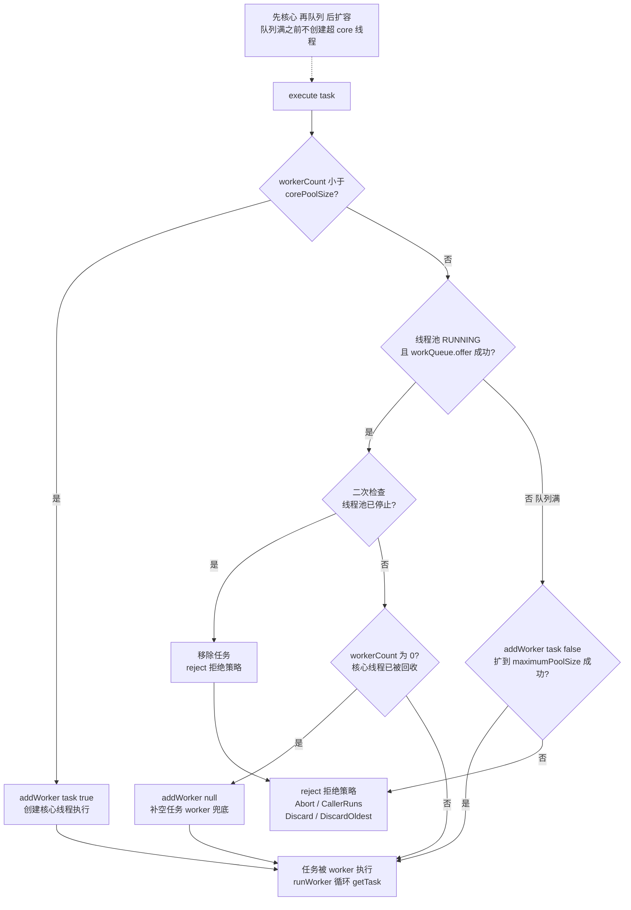
```mermaid
flowchart TD
    Start[execute task] --> C1{workerCount 小于<br/>corePoolSize?}
    C1 -- 是 --> Add1[addWorker task true<br/>创建核心线程执行]
    C1 -- 否 --> C2{线程池 RUNNING<br/>且 workQueue.offer 成功?}
    Add1 --> Done[任务被 worker 执行<br/>runWorker 循环 getTask]
    C2 -- 是 --> C3{二次检查<br/>线程池已停止?}
    C3 -- 是 --> Remove[移除任务<br/>reject 拒绝策略]
    C3 -- 否 --> C4{workerCount 为 0?<br/>核心线程已被回收}
    C4 -- 是 --> AddEmpty[addWorker null<br/>补空任务 worker 兜底]
    C4 -- 否 --> Done
    C2 -- 否 队列满 --> Add2{addWorker task false<br/>扩到 maximumPoolSize 成功?}
    Add2 -- 是 --> Done
    Add2 -- 否 --> Reject[reject 拒绝策略<br/>Abort / CallerRuns<br/>Discard / DiscardOldest]
    Remove --> Reject
    AddEmpty --> Done
    Note1[先核心 再队列 后扩容<br/>队列满之前不创建超 core 线程] -.-> Start
```

### 8.3 合理配置与动态线程池

- **CPU 密集**：core ≈ CPU 核数 + 1（+1 防线程偶发阻塞空转）；
- **IO 密集**：core ≈ CPU 核数 × (1 + 等待时间/计算时间)（经验 2N 起步，按压测校准）；
- 队列：有界（容量按「峰值积压容忍度」估），拒绝策略选 CallerRuns 或自定义（报警 + 降级）；
- **动态线程池**（美团方案）：参数配置中心化，运行期 setCorePoolSize/setMaximumPoolSize（setCorePoolSize 会立即调整存活 worker 数）、队列容量动态化较难（LinkedBlockingQueue 容量是 final，可用自研可变容量队列）；配合监控（activeCount、queue.size、拒绝次数）自动伸缩；
- Executors 工厂的坑（见 7.4）；线程工厂必须命名（排查 jstack 时「哪个池的线程」一目了然）。

### 8.4 ForkJoinPool：分治 + 工作窃取

- 每个 worker 一个**双端队列**：本地任务从**队尾**取（LIFO，缓存友好），空闲 worker 从别人队**头**偷（FIFO，减少竞争）——**工作窃取（work-stealing）**；
- 适合 CPU 密集的分治任务（RecursiveTask/RecursiveAction）；`commonPool` 是全局共享实例（并行度 = CPU - 1），CompletableFuture 默认用它；
- 不适合：IO 密集（任务阻塞时窃取机制失效）、任务粒度太小（窃取开销占比高）。

### 8.5 CompletableFuture：Completion 链

- `supplyAsync/runAsync`（默认 commonPool，可传 Executor）；`thenApply/thenCompose/thenCombine/whenComplete/exceptionally/handle/allOf/anyOf`；
- **原理**：每个依赖操作包装成 Completion 节点，前序完成时触发（tryFire）后续节点，结果沿依赖链传播；异常默认「吞掉」（除非 exceptionally/handle 显式处理）——**异常静默丢失是 CompletableFuture 第一大坑**；
- 回调执行线程不确定（完成线程/池线程/调用线程都可能），依赖「回调里不能有线程假设」；
- 默认 commonPool 被阻塞任务拖垮的问题：IO 类任务务必传自定义线程池。

### 8.6 本节高频面试题

**Q1：线程池 execute 的完整流程？为什么入队后还要二次检查？**

解答：三步流程（先核心 → 入队 → 扩最大 → 拒绝）见上文。二次检查的必要性：`workQueue.offer` 成功与「任务真正被执行」之间有空窗——1) 入队瞬间线程池可能已 shutdown（任务会永远滞留队列），要移除并拒绝；2) 核心线程可能刚好全部消亡（如 allowCoreThreadTimeOut 场景），队列里有任务却无人执行，要补一个空任务 worker。这是「并发下先做后验」的典型防御，答出这层说明真读过源码。

**追问**：Worker 为什么要继承 AQS？——shutdownNow 需要中断所有 worker，但「正在执行用户任务的线程」中断会导致任务异常；Worker 在执行任务时持有 AQS 独占锁，shutdownNow 先 tryLock 抢锁（抢不到说明在干活，跳过），空闲 worker 抢得到锁 → 中断。用 AQS 而不是 synchronized 是因为 tryLock 非阻塞探测，synchronized 无法「试一下」。

**Q2：corePoolSize 和 maximumPoolSize 怎么配？队列满时为什么先拒绝而不是扩到最大？**

解答：配置分场景（CPU 密集 N+1 / IO 密集 2N 起步，压测校准），核心思想是「核心线程扛常态流量、队列吸收抖动、最大线程扛峰值、拒绝策略兜底」。先入队后扩容的顺序是刻意的：突然的流量尖峰用队列缓冲（不增加线程），持续超载才扩线程（线程是昂贵资源）——如果先扩线程，短促尖峰会导致线程数暴涨后难以回落。面试加分：说明 keepAliveTime 是「扩出来的线程空闲多久回收」、核心线程默认不回收（allowCoreThreadTimeOut 可配）。

**追问**：线程池满了，任务到底该拒绝还是排队？——取决于任务的「延迟敏感性」：可容忍排队 → 大队列 + AbortPolicy（报警）；不可容忍延迟 → 小队列 + CallerRunsPolicy（天然背压，让调用方慢下来）或自定义「丢弃最旧 + 记录」。拒绝策略不是「最后手段」而是「系统保护设计」的一部分，生产上要监控拒绝次数并告警。

**Q3：ForkJoinPool 的工作窃取为什么能提升吞吐？CompletableFuture 有什么隐藏坑？**

解答：工作窃取解决「分治任务负载不均」：固定分片时有的 worker 早早干完闲置、有的还在忙，窃取让空闲 worker 偷别人的任务，最大化 CPU 利用率；本地 LIFO + 窃取 FIFO 的组合减少了对同一个队列的竞争。CompletableFuture 的坑：1) 异常默认静默（必须 exceptionally/handle）；2) 默认 commonPool 是全局共享的，阻塞型回调会拖垮所有依赖它的异步任务（务必自定义线程池）；3) 回调线程不确定，不能依赖 ThreadLocal（如 traceId 会丢——这是线上排查的经典坑）；4) allOf 的返回要自己处理每个 future 的异常。

---

## 9. 虚拟线程与结构化并发

### 9.1 虚拟线程原理（JDK 21 转正，JEP 444）

- **模型**：虚拟线程是 JVM 管理的轻量线程，运行在**载体线程（carrier，平台线程）**上；数量可百万级，每个虚拟线程只有栈帧等少量堆内存；
- **调度**：虚拟线程执行到阻塞操作（IO、锁、sleep）时自动 **unmount**（栈从载体线程拷贝/保存），载体线程转而运行其他虚拟线程；阻塞结束再 **mount** 回去——「阻塞即让路」，底层是 jdk.internal.vm.Continuation（可暂停/恢复的栈）；
- **对比线程池**：线程池是「复用有限平台线程 + 队列」；虚拟线程是「海量任务每个一条虚拟线程，阻塞时让出载体」——IO 密集场景吞吐提升一个量级，且**代码保持同步写法**（不用回调/异步），这是它最大的价值；
- **适用**：IO 密集（HTTP 客户端、数据库访问、消息消费）；**不适用**：CPU 密集（无收益）、持有锁时阻塞（见 pinning）、native 调用；
- **pinning 陷阱**：虚拟线程在 synchronized 块内阻塞时不会 unmount（锁与载体线程绑定，JDK 21 行为）——大量虚拟线程卡在 synchronized 上会占满载体线程；**JDK 24 的 JEP 491 解决了 synchronized 导致的 pinning**；ReentrantLock 无此问题（推荐新代码用）；
- 使用方式：`Thread.ofVirtual().start()`、`Executors.newVirtualThreadPerTaskExecutor()`（替代 CachedThreadPool 的高并发场景）。

### 9.2 结构化并发（StructuredTaskScope）

- 问题：CompletableFuture/线程池的并发任务是「游离」的——主线程无法统一管理子任务生命周期、取消与错误聚合；
- 方案：`StructuredTaskScope`（JDK 21 孵化 JEP 453，历经多次孵化，转正版本待核实）——任务在代码块内创建、块结束必须全部完成（或取消），子任务异常聚合到父任务；类似「并发版的 try-with-resources」；
- 价值：生命周期结构化 → 资源不泄漏（不会忘记关闭子任务）、错误传播确定（子任务失败 → 父任务快速失败）、取消统一（父取消 → 子全取消）。

### 9.3 本节高频面试题

**Q1：虚拟线程和线程池的本质区别？哪些场景该用虚拟线程？**

解答：线程池的核心假设是「线程昂贵、必须复用」，所以用「有限线程 + 任务队列」匹配「任务数 >> 线程数」；虚拟线程把线程成本降到「栈内存」级别，假设变成「每个任务一条线程」，阻塞时不占载体线程（unmount），所以 IO 密集的「每请求一线程」同步模型重新变得可行且高效——不需要异步化改造就获得高并发。适用：网关/Web 服务（大量 IO 等待）、批量调用外部服务、消息消费；不适用：CPU 密集计算（载体线程照样被占满）、synchronized 重锁代码（JDK 21 pinning，JDK 24 JEP 491 修复）、需要精确控制线程数量的场景。

**追问**：虚拟线程有线程池吗？——有：`Executors.newVirtualThreadPerTaskExecutor()` 本质是「每任务一条虚拟线程」的调度器，不缓存线程；虚拟线程的调度由 JVM 的调度器（ForkJoinPool 载体）完成，用户不需要也不应该手动池化虚拟线程——池化虚拟线程是反模式（它本来就便宜）。

**Q2：什么是 pinning？为什么 JDK 24 之前 synchronized 会 pin 住虚拟线程？**

解答：pinning = 虚拟线程被「钉」在载体线程上无法卸载。原因：synchronized 锁在 JDK 21 的实现里与载体线程绑定（monitor 记录载体线程身份），虚拟线程在 synchronized 块内阻塞时无法 unmount，只能占着载体线程等锁——大量虚拟线程同时卡在 synchronized 上时，载体线程耗尽，吞吐断崖。缓解（JDK 21 时代）：1) synchronized 块内不做阻塞 IO；2) 用 ReentrantLock 替代；3) 限制锁竞争。JDK 24 JEP 491 重构了 monitor 的持有者表示（改为可挂起的锁状态），从根上消除 synchronized pinning。

---

## 10. 死锁与并发 Bug 排查

### 10.1 死锁四条件与排查

死锁四必要条件：互斥、持有并等待、不可剥夺、循环等待。排查命令：

1. `jstack <pid>`：直接输出 "Found one Java-level deadlock" 及涉及线程与锁的引用链（JVM 内置检测）；
2. **arthas `thread -b`**：找出阻塞其他线程的线程（含锁持有者），比翻 jstack 快；
3. 活锁/饥饿：jstack 看大量 BLOCKED 线程的 "waiting to lock" 与 owner 线程在干什么；
4. 数据库死锁：`SHOW ENGINE INNODB STATUS` 的 LATEST DETECTED DEADLOCK 段——**JVM 锁 + 数据库锁混合死锁**是分布式系统高频案例（先拿 JVM 锁再拿 DB 锁，另一个线程反序）。

> 图示：死锁排查流程

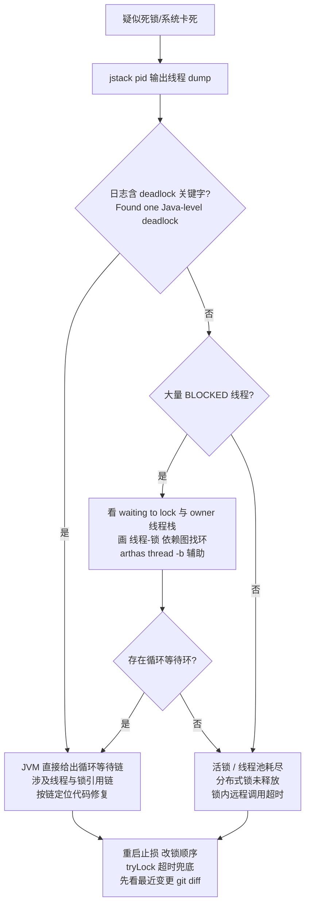
```mermaid
flowchart TD
    Start[疑似死锁/系统卡死] --> Step1[jstack pid 输出线程 dump]
    Step1 --> Q1{日志含 deadlock 关键字?<br/>Found one Java-level deadlock}
    Q1 -- 是 --> Found[JVM 直接给出循环等待链<br/>涉及线程与锁引用链<br/>按链定位代码修复]
    Q1 -- 否 --> Q2{大量 BLOCKED 线程?}
    Q2 -- 是 --> Step2[看 waiting to lock 与 owner 线程栈<br/>画 线程-锁 依赖图找环<br/>arthas thread -b 辅助]
    Step2 --> Q3{存在循环等待环?}
    Q3 -- 是 --> Found
    Q3 -- 否 --> Other[活锁 / 线程池耗尽<br/>分布式锁未释放<br/>锁内远程调用超时]
    Q2 -- 否 --> Other
    Found --> Fix[重启止损 改锁顺序<br/>tryLock 超时兜底<br/>先看最近变更 git diff]
    Other --> Fix
```

### 10.2 经典案例与预防

**案例 A（锁顺序）**：转账 A→B 与 B→A 同时发生，各自持有对方要的账户锁——修复：全局锁顺序（按账户 id 排序加锁）或 tryLock 超时；
**案例 B（线程池嵌套）**：线程池任务内提交任务到**同一个已满的池**并 join 等待——池满 + 互相等待 = 假死；修复：拆分线程池（父子池隔离）或禁止池内同步等待；
**案例 C（分布式锁）**：Redis 分布式锁未设过期时间 + 业务长时间持有 → 锁永久占用；修复：锁超时 + 续期（Redisson watchdog 思路）；
**案例 D（静态锁顺序 + 回调）**：A 持有锁调 B 的回调，B 的回调反过来要 A 的锁——修复：回调移出锁范围。

**预防清单**：统一锁顺序、缩小锁范围、优先并发容器/原子类、避免嵌套锁、tryLock 超时兜底、锁内不做 IO/远程调用、代码评审专门查「锁内调用外部」。

### 10.3 本节高频面试题

**Q1：线上疑似死锁，完整排查流程？**

解答：1) `jstack <pid> > dump.txt` 搜 "deadlock" 关键字（JVM 会直接给出循环等待链）；2) 没有 deadlock 字样但有大量 BLOCKED → 用 `jstack` 看每个 BLOCKED 线程的 "waiting to lock <0x...>" 与 owner 线程栈，画出「线程 → 锁」依赖图找环；3) arthas `thread -b` 快速定位「谁锁住了别人」；4) 数据库死锁看 InnoDB 状态；5) 修复：先重启止损 → 按依赖图改代码（锁顺序/超时）→ 灰度验证。面试加分：强调「先看最近变更」——死锁代码通常刚上线不久，git diff 往往直接命中。

**追问**：jstack 里没显示 deadlock 但系统卡死，还可能是什么？——1) **活锁**：线程都在 RUNNABLE 但互相让路，永远不前进；2) 线程池耗尽（池满 + 队列满 + 拒绝策略静默丢弃，业务看起来「卡住」）；3) 分布式锁未释放导致远程等待；4) 锁内做远程调用超时（锁被长时间持有，不是死锁但症状相似）。排查思路不变：线程栈 + 依赖图 + 调用链，但结论要按证据区分。

**Q2：如何从设计上避免死锁？**

解答：四条件破坏任一即可：互斥（用读写锁/无锁结构降低互斥范围）、持有并等待（一次性获取所有资源，如按 id 排序后统一加锁）、不可剥夺（tryLock 超时放弃）、循环等待（全局锁顺序约定——最实用）。工程规范：锁内不调外部（IO/远程/嵌套锁）、锁粒度最小化、能用并发容器就不手动加锁、死锁检测兜底（超时 + 告警）。资深视角补充：**锁的「获取顺序」要写进设计文档**，多团队协作时这是隐性契约，违反它是最常见的死锁来源。

---

## 11. 考点速查表

| 考点 | 一句话要点 |
|---|---|
| JMM 三大特性 | 原子性/可见性/有序性，happens-before 是推理公理 |
| happens-before | 程序序/管程锁/volatile/start/join/中断/传递性 |
| DCL 单例 | 必须 volatile 防构造重排发布，JDK5+ 语义修复 |
| wait/notify | 必须在 synchronized 内；while 循环防虚假唤醒 |
| 锁升级 | 偏向→轻量(CAS+自旋)→重量(Monitor)；JDK15 废弃偏向锁 |
| 锁消除/粗化 | JIT 层优化：逃逸分析消锁、相邻加锁合并 |
| volatile | 可见性+有序性，不保证原子性，x86 用 lock 前缀 |
| CAS | 硬件 cmpxchg；ABA 用 AtomicStampedReference |
| LongAdder | 分段 cell 计数，写吞吐高、读近似 |
| AQS | state + CLH 变体队列 + 模板方法，JUC 基石 |
| AQS 唤醒 | 只唤醒 head.next 防惊群；SIGNAL 前置防丢唤醒 |
| 公平/非公平 | 非公平先 CAS 抢一次，吞吐高可能饥饿 |
| ReadWriteLock | state 高 16 位读/低 16 位写；只降级不升级 |
| StampedLock | 乐观读零锁开销，不可重入，写频繁会退化 |
| Condition | 每条件一条等待队列，signal 转移节点到同步队列 |
| CountDownLatch vs CyclicBarrier | 数事件(一次性) vs 集合并发(可复用)；后者基于 Lock+Condition |
| ConcurrentHashMap | CAS 空桶 + synchronized 锁桶头；8/64 树化；弱一致迭代 |
| COW 容器 | 写复制读无锁，读多写极少场景 |
| BlockingQueue | Array 一把锁两条件；Linked 两把锁；Synchronous 无缓冲 |
| 线程池流程 | 先核心→入队(二次检查)→扩最大→拒绝 |
| 线程池状态机 | ctl 高 3 位状态 + 低 29 位 workerCount |
| 拒绝策略 | Abort/CallerRuns(背压)/Discard/DiscardOldest |
| 动态线程池 | 配置中心驱动 setCorePoolSize，监控驱动伸缩 |
| ForkJoinPool | 工作窃取：本地 LIFO、偷取 FIFO，CPU 密集分治 |
| CompletableFuture | Completion 链传播；异常默认静默；回调线程不确定 |
| 虚拟线程 | JDK21 转正；阻塞即 unmount；IO 密集革命 |
| pinning | synchronized 阻塞钉住载体线程；JDK24 JEP491 修复 |
| 结构化并发 | StructuredTaskScope：生命周期结构化+统一取消 |
| 死锁排查 | jstack deadlock 关键字；arthas thread -b；四条件预防 |

---

# Java 集合框架源码深度（资深向）

> 面向 10+ 年经验的资深工程师/架构师候选人。拒绝罗列 API，聚焦底层数据结构、扩容策略、并发语义边界与工程踩坑。源码分析基于 JDK 8 公开实现（JDK 8 是面试默认语境），差异处注明版本。

## 本章 TL;DR 学习要点

- 集合源码题 90% 围绕 HashMap/ConcurrentHashMap 展开，必须能手写 put/get/resize 主流程，并讲清 1.7→1.8 每处改动的动机。
- fail-fast 靠 modCount，fail-safe 的本质是弱一致性迭代器——"弱一致"三个字能讲透，就拉开了与初级候选人的差距。
- 三组必须能推导的数字：负载因子 0.75、树化 8/退化 6、容量 2 的幂。背答案和会推导，面试表现完全不同。
- 扩容（resize）是所有集合的命门：ArrayList 的拷贝、HashMap 的 rehash/链表拆分、CHM 的多线程协助 transfer，一条线串起来记。
- 手写 LRU（LinkedHashMap 版 + 双向链表版）、手写阻塞队列生产者消费者，是资深岗高频代码题。

---

## 一、总览：集合体系、fail-fast 与工具类

### 1.1 集合体系图

```
                        Iterable
                           |
                      Collection                      Map
              /      |      |      \                   |
           List    Set     Queue   Deque        HashMap  LinkedHashMap
          /    \    |       |        |           TreeMap  ConcurrentHashMap
   ArrayList LinkedList  HashSet  ArrayDeque      Hashtable  ConcurrentSkipListMap
    Vector   (双向链表)   TreeSet   PriorityQueue
    Stack              LinkedHashSet
                       CopyOnWriteArraySet
```

- `List`：有序可重复，随机访问/插入删除各有侧重；`Set`：去重，底层借道 Map（HashSet 内部就是一个 HashMap，TreeSet 内部是 TreeMap）；`Queue/Deque`：FIFO/双端，Java 6 起 `Deque` 官方建议取代 `Stack`。
- `Map` 三大家族：`HashMap`（散列，无序）、`TreeMap`（红黑树，有序）、`ConcurrentHashMap`（并发）。`Hashtable` 是历史遗留，全表锁，已被 CHM 取代。

### 1.2 fail-fast 与 fail-safe

- **fail-fast（快速失败）**：`ArrayList/HashMap` 等非并发容器，迭代时检测 `modCount`（结构性修改计数）与迭代器持有的 `expectedModCount` 不一致，立即抛 `ConcurrentModificationException`。注意：`modCount` 只记录结构修改（add/remove/clear），`set` 不改变结构、不触发。
- **坑点**：单线程下 `list.remove()` 用迭代器自身的 `remove()` 才安全（它会同步 expectedModCount）；`for-each` 里删除必炸。
- **fail-safe（安全失败）**：`CopyOnWriteArrayList` 迭代器基于**创建时的快照数组**，遍历期间任何修改都不可见——这是"弱一致性"，不是"安全"。`ConcurrentHashMap` 的迭代器同样弱一致：不抛 CME，但可能读不到刚 put 的数据，size 也是近似值。
- 面试官视角：能说出"fail-safe 容器遍历时读到的是旧数据、size 不准、不能用于强一致场景"才算真懂。

### 1.3 Arrays / Collections 工具类

- `Arrays.sort`：基本类型用双轴快排（DualPivotQuicksort），对象类型用 TimSort（归并+插入结合，稳定、利用有序片段）；`Collections.sort` 底层就是 `List.sort` → TimSort。
- `Arrays.asList` 的坑：返回的是**固定长度**的内部类 `Arrays$ArrayList`，`add/remove` 抛 `UnsupportedOperationException`，且与源数组共享内存（改数组元素会反映到 list）。
- `Collections.emptyList()` 返回单例，只读；`Collections.unmodifiableList` 是包装器，任何修改抛异常，但**只挡一层**——元素对象本身仍可改。
- `Collections.synchronizedMap`：全表锁（锁 this），并发度与 Hashtable 同级，仅剩的用途是包装遗留代码。

### 高频面试题

**Q1：如何判断一个集合实现是 fail-fast 还是 fail-safe？**
A：看迭代器实现。fail-fast 迭代器持有 modCount 快照并在 next() 时校验（ArrayList.Itr、HashMap 1.8 的迭代器）；fail-safe 迭代器操作的是快照或弱一致视图（CopyOnWriteArrayList、CHM 的 Traverser 不校验 modCount）。判断标准是"结构性修改是否会被迭代器感知并抛异常"。
**面试官追问**：CHM 的迭代器遍历时正好发生扩容，会发生什么？——答：可能遍历到部分旧桶部分新桶（通过 ForwardingNode 继续跳转），不抛异常，数据可能重复或遗漏，但**不会死循环**，这是弱一致性的代价。

**Q2：Arrays.asList 转出来的 List 能排序吗？**
A：能（sort 只改元素位置不改变数组长度），但不能增删。`Collections.sort(Arrays.asList(...))` 是常见面试陷阱——它合法，因为 sort 不涉及结构调整。

---

## 二、ArrayList / LinkedList / Vector

### 2.1 ArrayList 扩容机制（源码要点）

- 底层 `Object[] elementData`，默认初始容量 **10**（懒加载，首次 add 才分配）；扩容 `grow()`：`newCapacity = oldCapacity + (oldCapacity >> 1)`，即 **1.5 倍**，然后 `Arrays.copyOf`（System.arraycopy，O(n) 拷贝）。
- 最大容量 `MAX_ARRAY_SIZE = Integer.MAX_VALUE - 8`：减 8 是为部分 VM 的对象头/数组头留余量，超限尝试 `hugeCapacity` 抛 OOM。
- 为什么 1.5 倍而不是 2 倍：均摊分析下每次扩容的拷贝成本 O(n)，1.5 倍时均摊复杂度仍是 O(1)，但**空间浪费更少**（2 倍会导致最多一半容量闲置）；黄金分割的近似，空间与拷贝次数的最优折中。
- `add(index, e)`：先 `rangeCheckForAdd`，再 `System.arraycopy` 右移，O(n)；`get(i)` 直接数组下标，O(1)。
- `remove(int)`：先 `rangeCheck`，取旧值，`System.arraycopy` 左移，**置尾 null 帮助 GC**（`elementData[--size] = null`，JDK 6 之后的优化，防止内存泄漏）。
- 内存泄漏考点：ArrayList 只 `clear()` 不够的场景——如果数组里存的是大对象且你只 remove 部分，被移除位置的引用会被置 null，但**容量不缩**；长期持有大容量 ArrayList 的空壳也会占内存，`trimToSize()` 可手动收缩。

### 2.2 subList 的坑（资深必踩）

- `list.subList(from, to)` 返回的是**视图**（`SubList` 内部类，持有父列表引用），不是副本：
  - 对 subList 的修改（add/set/remove）会反映到原列表；
  - **对原列表做结构性修改后，再操作 subList 会抛 ConcurrentModificationException**（SubList 校验父列表 modCount）；
  - subList 持有的父列表引用会**阻止父列表被 GC**——大列表 subList 长期持有是内存泄漏点。
- 正确姿势：需要独立副本时 `new ArrayList<>(list.subList(a, b))`。

### 2.3 LinkedList 的坑

- 双向链表（`Node<E>` first/last），`get(int)` 是 O(n) 且做了**折半优化**（index < size>>1 从头走，否则从尾走）。
- **经典 O(n²) 陷阱**：`for (int i=0; i<list.size(); i++) list.get(i)` 遍历 LinkedList，每个 get 都是 O(n)；正确姿势是迭代器或 for-each。
- 当队列用：`remove()` 空队列抛 NoSuchElementException，`poll()` 返回 null——按需选择，别混用。
- 与 ArrayList 对比：插入删除"O(1)"的前提是**已经持有节点引用**（如迭代器位置），按值/按下标找节点本身是 O(n)。面试时主动点破这一点，比背"链表插入快"高级得多。

### 2.4 Vector / Stack

- Vector 所有方法 synchronized（方法级锁，锁粒度=整个对象），扩容默认 **2 倍**（可配 capacityIncrement）；Stack 继承 Vector，官方已弃用（建议 ArrayDeque）。
- 历史包袱：1.2 集合框架之前的遗留类，性能与并发度都不如 ArrayList + Collections.synchronizedList，仅兼容遗留代码。

### 高频面试题

**Q3：ArrayList 扩容为什么是 1.5 倍？扩容过程发生了什么？**
A：grow() 里 `oldCapacity + (oldCapacity >> 1)`。先检查是否溢出（oldCapacity 超过 MAX_ARRAY_SIZE - 扩容量则取 MAX_ARRAY_SIZE 或抛 OOM），再 `Arrays.copyOf` 申请新数组并整体拷贝。1.5 倍是空间利用率与拷贝次数的折中：2 倍空间浪费多，太小的倍率导致频繁拷贝；均摊后 add 仍是 O(1)。
**面试官追问**：如果预知要插入 100 万条数据，怎么避免频繁扩容？——答：`new ArrayList<>(capacity)` 指定初始容量，或 `ensureCapacity()`，一次到位省掉约 log₁.₅(10⁶/10)≈28 次全量拷贝。

**Q4：什么时候用 LinkedList？**
A：坦率说，工程上几乎不用。需要"两端操作"用 ArrayDeque（数组实现，更省内存更缓存友好）；需要按下标访问用 ArrayList；LinkedList 唯一理论优势"中间插入 O(1)"需要持有节点引用，业务代码几乎拿不到，而它的内存占用（每个节点额外两个指针+对象头）和随机访问 O(n) 是实打实的劣势。**面试官追问**：ArrayDeque 为什么比 LinkedList 更适合当栈/队列？——答：循环数组，头尾操作均摊 O(1)，无节点对象开销，缓存局部性好；且允许 null 的 LinkedList 当队列时 poll/peek 的 null 语义会与"元素为 null"混淆，ArrayDeque 直接禁止 null。

---

## 三、HashMap 源码（JDK 1.7 vs 1.8）

### 3.1 整体对比

| 维度 | JDK 1.7 | JDK 1.8 |
|---|---|---|
| 数据结构 | 数组 + 链表（Entry） | 数组 + 链表 + **红黑树**（Node/TreeNode） |
| 插入方式 | **头插法** | **尾插法** |
| hash 扰动 | 4 次异或（h ^= h>>>20 ^ h>>>12; h ^ h>>>7 ^ h>>>4） | 1 次：`(h = key.hashCode()) ^ (h >>> 16)` |
| 定位 | `indexFor = h & (length-1)` | 同左（length 恒为 2 的幂） |
| 扩容 rehash | 每个元素重算 hash 再定位 | 链表**拆分**成 lo/hi 两条，直接挂新桶 |
| 并发 | 扩容头插 → 环形链表死循环 | 尾插无环，但数据覆盖/丢失仍在 |
| 树化 | 无 | 链表 ≥8 且容量 ≥64 转红黑树 |

### 3.2 为什么扰动一次就够了（1.8）

`h ^ (h >>> 16)` 让高 16 位参与低 16 位运算。1.7 的 4 次扰动是当年处理质量差的 hashCode 的防御手段，1.8 认为一次足够（配合红黑树兜底），且扰动函数必须**可复现**（同一 key 每次 hash 相同）。低 16 位参与度越高，`h & (length-1)` 取模越均匀——尤其当 length 较小时（如 16，只用到低 4 位）。

### 3.3 1.8 put 主流程

```
put(key,value)
 ├─ hash = key.hashCode() ^ (hashCode >>> 16)
 ├─ 首次插入 → resize() 初始化 table（默认 16）
 ├─ 桶空 → 直接 new Node 放入（CAS 语义，单线程无竞争）
 ├─ 桶头是 TreeNode → putTreeVal 走红黑树
 ├─ 否则遍历链表：
 │    ├─ 找到相同 key → 覆盖 value，返回旧值
 │    └─ 未找到 → 尾插；若链表长度 ≥ 8 → treeifyBin
 │         （table.length < 64 时先 resize 扩容，不树化）
 └─ 插入后 size+1 > threshold(容量×0.75) → resize()
```

> 图示：HashMap 1.8 put 完整流程

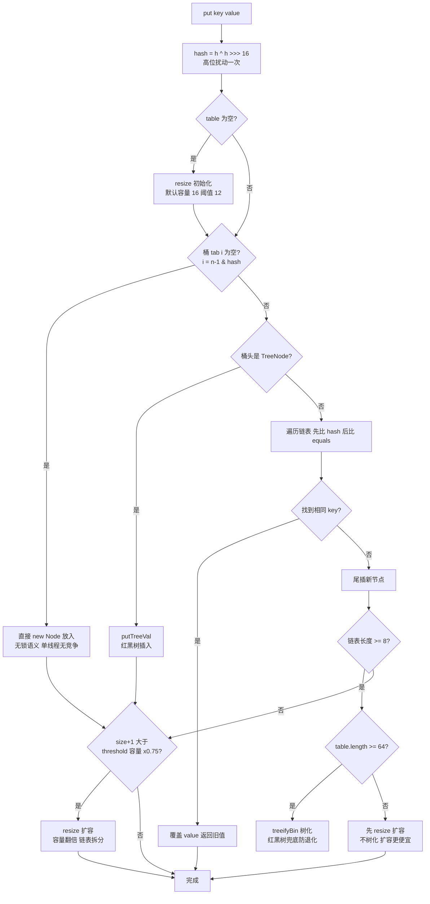
```mermaid
flowchart TD
    Start[put key value] --> H[hash = h ^ h >>> 16<br/>高位扰动一次]
    H --> C1{table 为空?}
    C1 -- 是 --> Init[resize 初始化<br/>默认容量 16 阈值 12]
    Init --> C2
    C1 -- 否 --> C2{桶 tab i 为空?<br/>i = n-1 & hash}
    C2 -- 是 --> NewNode[直接 new Node 放入<br/>无锁语义 单线程无竞争]
    C2 -- 否 --> C3{桶头是 TreeNode?}
    C3 -- 是 --> Tree[putTreeVal<br/>红黑树插入]
    C3 -- 否 --> List[遍历链表 先比 hash 后比 equals]
    List --> C4{找到相同 key?}
    C4 -- 是 --> Override[覆盖 value 返回旧值]
    C4 -- 否 --> Tail[尾插新节点]
    Tail --> C5{链表长度 >= 8?}
    C5 -- 是 --> C6{table.length >= 64?}
    C6 -- 是 --> Treeify[treeifyBin 树化<br/>红黑树兜底防退化]
    C6 -- 否 --> Resize1[先 resize 扩容<br/>不树化 扩容更便宜]
    C5 -- 否 --> C7{size+1 大于<br/>threshold 容量 x0.75?}
    C7 -- 是 --> Resize2[resize 扩容<br/>容量翻倍 链表拆分]
    C7 -- 否 --> End[完成]
    NewNode --> C7
    Tree --> C7
    Override --> End
    Resize1 --> End
    Resize2 --> End
```

### 3.4 树化与退化条件

- 树化：链表长度 **≥ 8** 且 **table.length ≥ 64**。源码注释给出泊松分布推导：负载因子 0.75 下，桶中链表长度达到 8 的概率约 **千万分之六**，所以"树化"是极端碰撞下的兜底而非常态。
- 退化：红黑树节点 **≤ 6** 时转回链表（`untreeify`）；另外 resize 时树节点会被拆分（低位/高位两条链），若拆后某链 ≤ 6 也退化为链表。
- 为什么 8 和 6 中间留 2 的缓冲：避免元素在 7/8 之间反复横跳导致频繁树化/退化（抖动），类似 Hysteresis 滞回设计。

### 3.5 1.8 resize 的链表拆分（关键源码语义）

扩容后 `newCap = oldCap << 1`（2 倍）。链表拆分利用一个事实：`hash & oldCap == 0` 的元素留在原位（lo 链），`== 1` 的元素移到 `原位置 + oldCap`（hi 链）——因为容量翻倍只新增一个二进制位参与取模。**无需重算 hash**，这是 1.8 相对 1.7 的重大优化（1.7 要全部 rehash 重定位）。

> 图示：HashMap 1.8 resize 扩容与链表拆分

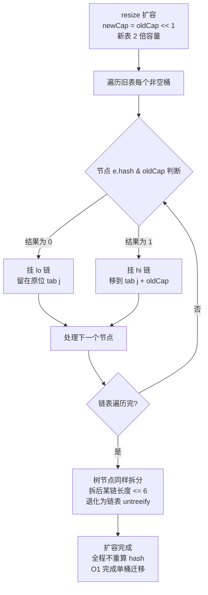
```mermaid
flowchart TD
    Start[resize 扩容<br/>newCap = oldCap << 1<br/>新表 2 倍容量] --> Loop[遍历旧表每个非空桶]
    Loop --> Split{节点 e.hash & oldCap 判断}
    Split -- 结果为 0 --> LoChain[挂 lo 链<br/>留在原位 tab j]
    Split -- 结果为 1 --> HiChain[挂 hi 链<br/>移到 tab j + oldCap]
    LoChain --> Next[处理下一个节点]
    HiChain --> Next
    Next --> C1{链表遍历完?}
    C1 -- 否 --> Split
    C1 -- 是 --> Tree[树节点同样拆分<br/>拆后某链长度 <= 6<br/>退化为链表 untreeify]
    Tree --> End[扩容完成<br/>全程不重算 hash<br/>O1 完成单桶迁移]
```

### 3.6 并发问题：1.7 扩容死循环（必考）

- 1.7 头插法 + 多线程 resize：线程 A 在 transfer() 中 rehash 到一半被挂起，线程 B 完成扩容后链表**逆序**；A 恢复后继续用旧引用串链，可能形成 **a→b→a 环形链表**，后续 get 命中该桶时死循环，CPU 100%。
- 1.8 改尾插：新链保持原序，**环形链表问题理论上消除**，但并发 put 仍有：两个线程同时命中空桶各自 new Node 直接赋值 → **后写覆盖先写，数据丢失**；size++ 非原子 → 计数不准；迭代器 CME。
- 结论：HashMap 任何版本都不线程安全，1.8 只是"不死循环"，数据完整性依旧无保证。

### 3.7 关键方法源码精读（tableSizeFor / put / get / resize）

**tableSizeFor：容量向上取整到 2 的幂**
```java
static final int tableSizeFor(int cap) {
    int n = cap - 1;            // 减 1 防 cap 本身是 2 的幂时翻倍
    n |= n >>> 1;  n |= n >>> 2;  n |= n >>> 4;
    n |= n >>> 8;  n |= n >>> 16; // 5 次移位把最高位以下全部填 1
    return (n < 0) ? 1 : (n >= MAXIMUM_CAPACITY) ? MAXIMUM_CAPACITY : n + 1;
}
// 例：cap=17 → n=16 → 移位后 31 → +1 = 32
```
位运算把"找最近 2 的幂"从循环变成 O(1)，这是 Java 源码里"用位运算代替循环"的经典样例。

**putVal 核心骨架（1.8，逻辑级伪代码，非原文）**
```java
final V putVal(int hash, K key, V value, boolean onlyIfAbsent, boolean evict) {
    Node<K,V>[] tab; Node<K,V> p; int n, i;
    if ((tab = table) == null || (n = tab.length) == 0)
        n = (tab = resize()).length;          // ① 懒初始化
    if ((p = tab[i = (n - 1) & hash]) == null)
        tab[i] = newNode(hash, key, value, null); // ② 桶空直接放
    else {
        // ③ 桶头是树 → putTreeVal；否则遍历链表：
        //    命中 key → 覆盖（onlyIfAbsent 控制是否覆盖）
        //    未命中 → 尾插；if (binCount >= TREEIFY_THRESHOLD - 1) treeifyBin(tab, hash)
    }
    if (++size > threshold) resize();         // ④ 超阈值扩容
    return null;
}
```

**get 骨架**
```java
final Node<K,V> getNode(int hash, Object key) {
    // 桶空直接 null；桶头命中直接返回；
    // 头节点 hash<0（树/fwd）走 getTreeNode 或转发；
    // 否则遍历链表，用 key.equals 比较（先比 hash 后比 equals，短路优化）
}
```
注意 get 的**短路优化**：先比 hash 再比 equals——hash 不同直接跳过，只有 hash 相同的节点才调用 equals，所以 hashCode 实现质量直接决定 get 的常数。

**resize 的链表拆分（1.8 精髓，前面 3.5 已讲原理，这里给结论性代码形态）**
```java
// 遍历原桶链表，拆成 lo（hash&oldCap==0）与 hi（hash&oldCap!=0）两条链
// lo 链挂回原位 tab[j]，hi 链挂到 tab[j + oldCap]
// 判断用 (e.hash & oldCap) 而不是重算 hash，O(1) 完成单桶迁移
```

### 高频面试题

**Q5：HashMap 的容量为什么必须是 2 的幂？**
A：两个原因。① 取模用位运算 `h & (length-1)` 替代 `h % length`，前提是 length 为 2 的幂（此时 length-1 低位全 1，等价取模且更快）；② 扩容时元素要么留在原位要么移到 `原位置+oldCap`，只需看 `hash & oldCap` 一位，配合链表拆分 O(1) 完成迁移。若容量不是 2 的幂，这两条都不成立。构造时传非 2 的幂（如 17），会通过 `tableSizeFor` 向上取整到最近的 2 的幂（32）。
**面试官追问**：那 `hash & (length-1)` 的分布问题呢？——答：如果 hashCode 低几位分布不均匀（如低 4 位全是 0），会严重碰撞。所以 1.8 先做 `h ^ (h>>>16)` 扰动让高位参与低位，再取模，缓解低位的偏斜。

**Q6：为什么负载因子是 0.75 而不是 0.5 或 1.0？**
A：时间与空间的折中。0.5 时桶更空、冲突少、查找快，但一半空间闲置；1.0 时空间利用率高但冲突多、链表变长（1.8 前退化严重）。0.75 是经验值+泊松分布推导：此负载下桶内元素数服从 λ≈0.5 的泊松分布，链表长度 ≥8 的概率约 0.00000006，与树化阈值 8 呼应——"阈值 8 是 0.75 的推论"。JDK 作者在注释里给出的就是这个推导。

**Q7：HashMap 1.7 头插法死循环的完整成因？**
A：见 3.6。核心是三要素：头插导致 rehash 后链表逆序、多线程 transfer 交错、旧表引用被复用。1.8 尾插+不重算 hash 的拆分迁移，从结构上消除了环。**面试官追问**：1.8 就没有并发问题了吗？——答：仍有覆盖丢失（空桶 CAS 缺失、size 计数非原子、put 与 resize 交错），所以并发必须用 ConcurrentHashMap，这是结论性考点。

**Q8：为什么树化要同时满足"≥8"和"容量≥64"两个条件？**
A：容量 <64 时哈希表本身太小，冲突多是容量问题而非 hash 问题，此时**扩容**比树化更有效（扩容后链表自然变短），且红黑树节点（TreeNode 约 2 倍 Node 内存）在表太小时性价比低。容量 ≥64 后仍出现 8 个以上碰撞，才值得树化兜底。

---

## 四、ConcurrentHashMap 源码（1.7 vs 1.8）

### 4.1 1.7：分段锁（Segment）

- 结构：`Segment[] segments`（默认 16 个，并发级别 concurrencyLevel），每个 Segment 继承 `ReentrantLock`，内部是"小 HashMap"（Entry[] + 链表）。
- put：定位 Segment → `tryLock` 失败则 `scanAndLockForPut` 自旋重试（有限次）再阻塞加锁 → 锁内做插入。
- size()：先**无锁**累加两次，若两次结果一致直接返回；不一致则锁住全部 Segment 再累加——用"乐观重试"避免常态加锁。
- 缺点：锁粒度是"一段"而非"一桶"；Segment 数组本身占内存；查找要两级定位。

### 4.2 1.8：CAS + synchronized（桶级锁）

- 结构：与 HashMap 1.8 相同（数组+链表+红黑树），但**锁粒度细到单个桶的头节点**。
- put 流程：桶空 → `casTabAt`（CAS 无锁插入）；桶头是 `ForwardingNode`（扩容中）→ `helpTransfer` 协助扩容；否则 `synchronized(f)` 锁桶头做链表/树插入。`hash` 为负数表示特殊节点（-1 ForwardingNode，-2 TreeBin，-3 ReservationNode）。
- 为什么放弃分段锁：① Segment 锁覆盖 16 个桶，冲突仍可能放大；② 桶级 synchronized + 空桶 CAS 让**读多写少场景几乎无锁**；③ JVM 对 synchronized 的优化（偏向锁/轻量级锁）成熟，锁开销接近 CAS；④ 内存更省（无 Segment 数组）。

> 图示：ConcurrentHashMap 1.8 put 流程

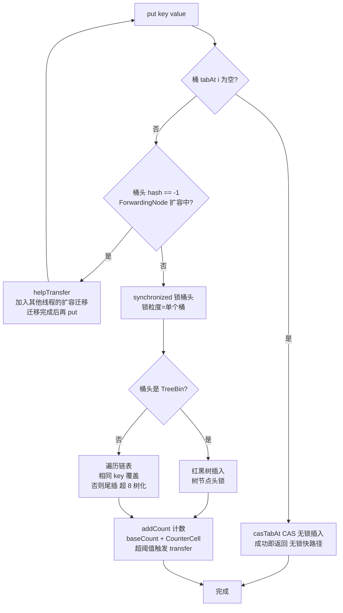
```mermaid
flowchart TD
    Start[put key value] --> C1{桶 tabAt i 为空?}
    C1 -- 是 --> CAS[casTabAt CAS 无锁插入<br/>成功即返回 无锁快路径]
    CAS --> End[完成]
    C1 -- 否 --> C2{"桶头 hash == -1<br/>ForwardingNode 扩容中?"}
    C2 -- 是 --> Help[helpTransfer<br/>加入其他线程的扩容迁移<br/>迁移完成后再 put]
    Help --> Start
    C2 -- 否 --> Lock[synchronized 锁桶头<br/>锁粒度=单个桶]
    Lock --> C3{桶头是 TreeBin?}
    C3 -- 是 --> Tree[红黑树插入<br/>树节点头锁]
    C3 -- 否 --> List[遍历链表<br/>相同 key 覆盖<br/>否则尾插 超 8 树化]
    Tree --> AddCount[addCount 计数<br/>baseCount + CounterCell<br/>超阈值触发 transfer]
    List --> AddCount
    AddCount --> End
```

### 4.3 size() 演进

- 1.7：两轮无锁累加 + 不一致则全锁。
- 1.8：`baseCount` + `CounterCell[]`（LongAdder 思想）。写线程先 CAS 累加 baseCount，失败则给随机 CounterCell 累加（分散热点），size() = baseCount + Σcells。**结果是近似值**——并发下不保证精确，这是弱一致性的体现。

### 4.4 扩容协助 transfer（1.8 精髓）

- 触发 resize 后，table 会被标记，其他线程 put/get 发现 `ForwardingNode` 时调用 `helpTransfer` 加入扩容。
- `transfer()` 把旧表按 `stride`（步长，CPU 核数相关）分成区间，每个参与线程认领一段迁移；迁移完的桶放 ForwardingNode（`hash = -1`，含 nextTable 引用），读线程遇到 fwd 节点会**跳到新表继续读**。
- 设计要点：迁移线程数动态（`sizeCtl` 用负数记录参与线程数）、无锁迁移（桶级 synchronized）、读不阻塞（fwd 转发）。这是"多线程协同扩容"的样板，面试可对比 Go map 的渐进式扩容。

### 4.5 三兄弟对比

| 维度 | Hashtable | Collections.synchronizedMap | ConcurrentHashMap 1.8 |
|---|---|---|---|
| 锁粒度 | 整表 | 整表（锁包装对象） | 桶头节点 + CAS |
| 读并发 | 全互斥 | 全互斥 | 无锁（volatile + CAS） |
| 迭代器 | fail-fast | fail-fast | 弱一致 |
| size | 精确（锁内算） | 精确 | 近似 |
| 适用 | 遗留代码 | 遗留代码包装 | 一切并发场景 |

### 4.6 读路径与 sizeCtl（补充源码语义）

- **get 完全无锁**：`tabAt(tab, i)` 用 `Unsafe.getObjectVolatile` 读桶头（volatile 读），命中则沿链表/树找；遇到 `ForwardingNode`（hash=-1）则跳到 nextTable 继续读——所以**扩容期间读不阻塞、不抛异常**，代价是可能短暂读旧数据（弱一致）。Node 的 key/value 字段都是 volatile，保证读线程看到已发布的值。
- **sizeCtl 的多重语义**（一个 int 承担四个角色，源码常用技巧）：-1 表示初始化中；负数且小于 -1 表示扩容中（低 16 位记录参与线程数）；0 表示未初始化；正数表示下一次扩容阈值（容量×负载因子）。
- 写路径的扩容入口：`addCount` 里 size 超阈值 → `transfer`，其他线程 put 时遇 fwd 节点 → `helpTransfer`；transfer 的每轮迁移区间按 `stride`（NCPU>1 时 `table.length >>> 3 / NCPU`，最小 16）划分，多线程各领一段，互不重叠。

### 高频面试题

**Q9：ConcurrentHashMap 为什么不允许 null key / null value？**
A：官方注释给出的理由：并发场景下 `get(key)` 返回 null 无法区分"key 不存在"和"value 就是 null"，而 HashMap 允许 null 是因为单线程下可以用 `containsKey` 二次确认；CHM 若允许 null，会引入二义性，且无法用 CAS 语义表达"插入 null"这种操作。**面试官追问**：Hashtable 也不允许 null，原因一样吗？——答：Hashtable 纯粹是设计保守（当年 API 约定），CHM 是并发语义下的必然选择，两者动机不同。

**Q10：CHM 1.8 的 put 在什么情况下会 synchronized？为什么要 CAS + synchronized 混合？**
A：桶空时 CAS 无锁插入（并发 put 到空桶是最高频路径，无锁化收益最大）；桶非空时锁桶头，因为链表/树的插入涉及多步操作必须互斥。混合设计是"无锁快路径 + 锁慢路径"的经典模式。**面试官追问**：为什么不全部 CAS？——答：链表插入、树旋转都是多步复合操作，纯 CAS 需要复杂的循环重试，复杂度与失败率不成比例；桶级锁冲突概率低（不同桶互不干扰），synchronized 已足够。

**Q11：CHM 1.8 的 size() 为什么不精确？什么场景下会明显不准？**
A：baseCount + CounterCell 是 LongAdder 式的**最终一致计数**，为了写入不争抢。当大量线程同时写且 CounterCell 数组扩容时，累加会短暂滞后；遍历求和瞬间也有并发写。业务上 size() 多用于容量评估/监控，弱一致可接受；需要精确计数应自行维护 AtomicLong 或加锁统计。

---

## 五、TreeMap 与红黑树

### 5.1 红黑树五条性质（背熟+会证）

1. 节点非红即黑；2. 根必黑；3. 所有叶子（NIL 哨兵）为黑；4. 红节点的两个子节点必黑（不能有连续红）；5. 任一节点到其所有叶子路径上的黑节点数相同（黑高相等）。

由性质 4、5 可推出：**红黑树高度 ≤ 2log₂(n+1)**，即最坏路径（红黑交替）是最短路径（全黑）的 2 倍——这是"近似平衡"的数学保证，也是对比 AVL（严格平衡、旋转更多）的关键。

### 5.2 插入与删除的修复逻辑（要点，不背代码）

- **插入**：按 BST 插入，新节点染**红**（不破坏性质 5），只可能破坏性质 4（连续红）。修复三招：变色、左旋、右旋；分叔节点红/黑两类情况处理，**最多 2 次旋转**，从插入点向上逐层修复。
- **删除**：删除黑节点会破坏性质 5，情况复杂（兄弟节点红/黑、兄弟子节点空/红 共 4 类），核心是"借黑"与"旋转+变色"，**最多 3 次旋转**。
- TreeMap 用 `compareTo`/`Comparator` 比较，因此 **key 不允许 null**（比较时 NPE），但 value 允许 null。HashMap 允许 null key（hash=0 进第 0 桶），两种 null 策略要分清。

### 5.3 红黑树 vs 跳表（必考对比）

| 维度 | 红黑树（TreeMap/CHM 1.8 树桶） | 跳表（ConcurrentSkipListMap/Redis zset） |
|---|---|---|
| 实现复杂度 | 旋转+变色，易错 | 简单，容易写对 |
| 内存 | 紧凑，2 指针/节点 | 每节点平均 1/(1-p)≈1.33 层（p=0.25），略多 |
| 范围查询 | 中序遍历，需维护前驱后继 | 天然有序链表，范围查询友好 |
| 并发改造 | 难（需锁/复杂 CAS） | 易（无锁 CAS，层间独立） |
| 缓存友好 | 是 | 否（节点分散） |

工程结论：**单线程选红黑树，并发要有序 Map 选跳表**（ConcurrentSkipListMap 是唯一并发有序 Map）；Redis 选跳表是因为实现简单+范围操作+并发友好，且 zset 的插入删除是 O(log n) 足够。

### 5.4 TreeMap 源码要点

- 结构：`Entry<K,V> root`（key/value/left/right/parent/color），`comparator`（null 则用 key 的自然序 Comparable）。
- `getEntry`：按比较结果二分下探，O(log n)；比较器为 null 时用 `((Comparable)k).compareTo` 并做 `ClassCastException` 兜底。
- `put`：先按比较定位插入点，**插入后调用 `fixAfterInsertion` 做红黑修复**（变色/旋转）；`deleteEntry` + `fixAfterDeletion` 同理。修复逻辑约 60 行，面试能讲清"叔节点颜色分叉"即可，不用背代码。
- 遍历：`firstEntry/lastEntry` 沿最左/最右链；迭代器维护 `next` 指针（中序后继），删除当前节点时迭代器会先记后继——所以 TreeMap 迭代器**允许迭代中删除当前节点**，这点与 HashMap 不同（HashMap 迭代中删除会 CME，除非用迭代器 remove）。
- 复杂度全景：get/put/remove/containsKey 均 O(log n)；`subMap/headMap/tailMap` 返回视图（共享树，修改互相可见，且视图操作同样 O(log n)）；没有 O(1) 的随机访问。
- 场景：需要**有序遍历/范围查询/最值**的 Map（如按时间戳排序的会话表、排行榜前缀查询）；只做等值 KV 用 HashMap，别为"有序"付出 log n 代价。

### 高频面试题

**Q12：红黑树和 AVL 树怎么选？TreeMap 为什么不用 AVL？**
A：AVL 严格平衡，查询略快，但插入删除旋转更频繁；红黑树允许 2 倍高度差，**插入删除的旋转次数更少**（最多 2/3 次 vs AVL 的 O(log n) 次回溯）。写多读少的工程场景红黑树胜出；只读场景 AVL 略优但差距可忽略。TreeMap 选红黑树正是"读写均衡"的取舍。
**面试官追问**：为什么 Java 8 的 HashMap 树桶用红黑树而不用跳表？——答：桶内节点少（8~64），红黑树内存更省、缓存更友好；且桶内只有插入查找删除，无范围查询需求，跳表的优势用不上。CHM 树桶同样如此。

---

## 六、LinkedHashMap 与 LRU

### 6.1 设计：HashMap + 双向链表（模板方法模式）

- LinkedHashMap 继承 HashMap，**覆写**三个钩子：`afterNodeAccess`（get 命中时，若 accessOrder=true 移到链表尾）、`afterNodeInsertion`（插入后回调，可触发删除最老节点）、`afterNodeRemoval`（删除时摘链）。这是"模板方法模式"的教科书应用——HashMap 留钩子，子类改行为，**HashMap 的 put/get 代码一行不改**。
- 构造参数 `accessOrder`：false（默认）按**插入序**迭代；true 按**访问序**（每次 get/put 命中把节点移到尾部）。
- `removeEldestEntry(Map.Entry eldest)` 默认返回 false（永不淘汰）；**重写为 size() > capacity 即淘汰表头**，就得到了 LRU。

> 图示：LRU 访问顺序变化（accessOrder=true）

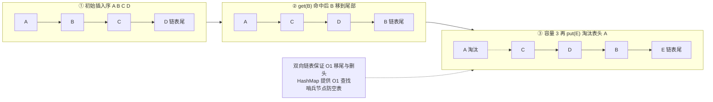
```mermaid
flowchart LR
    subgraph S1["① 初始插入序 A B C D"]
        direction LR
        A1[A] --> B1[B] --> C1[C] --> D1[D 链表尾]
    end
    subgraph S2["② get(B) 命中后 B 移到尾部"]
        direction LR
        A2[A] --> C2[C] --> D2[D] --> B2[B 链表尾]
    end
    subgraph S3["③ 容量 3 再 put(E) 淘汰表头 A"]
        direction LR
        A3[A 淘汰] -.-> C3[C] --> D3[D] --> B3[B] --> E3[E 链表尾]
    end
    S1 --> S2 --> S3
    Note[双向链表保证 O1 移尾与删头<br/>HashMap 提供 O1 查找<br/>哨兵节点防空表] -.-> S3
```

### 6.2 手写 LRU 缓存（面试必写）

```java
// 方式一：LinkedHashMap 三行版
class LRUCache<K, V> extends LinkedHashMap<K, V> {
    private final int capacity;
    public LRUCache(int capacity) {
        super(capacity, 0.75f, true); // accessOrder = true
        this.capacity = capacity;
    }
    @Override
    protected boolean removeEldestEntry(Map.Entry<K, V> eldest) {
        return size() > capacity;
    }
}
```

```java
// 方式二：HashMap + 双向链表（线程不安全版，讲清结构即可）
class LRUCache<K, V> {
    // 头尾哨兵节点 + HashMap<K, Node>，get/put 命中节点移到尾部，超容删头部节点
    // get: 命中 → node 摘出插到 tail；put: 存在则更新并移到尾部，不存在则新建插尾，
    //      size > cap 时删除 head.next 并同步移除 map 中的 key（O(1) 全流程）
}
```

注意点（面试加分）：① 为什么用双向链表——删除任意节点需要 O(1) 拿到前驱；② 哨兵节点（dummy head/tail）避免空表判空；③ 多线程需加锁或改用 ConcurrentHashMap+锁（Redis 6.0 前的近似 LRU 是另一套采样思路）。

### 高频面试题

**Q13：手写一个支持 O(1) get/put 的 LRU，并说明为什么双向链表 + HashMap？**
A：HashMap 提供 O(1) 查找；双向链表提供 O(1) 的"移到尾部/删除头部"。组合后 get（命中→摘出→插尾）、put（新增→插尾，超容→删头）全部 O(1)。必须双向链表是因为删除中间节点要 O(1) 拿前驱，单向链表做不到。**面试官追问**：如果并发访问怎么办？——答：加全局锁（简单但吞吐低），或分段锁/ConcurrentHashMap+锁头部；Redis 的近似 LRU 是"随机采样淘汰"，用概率换并发，不是严格 LRU——能对比到这里就是架构师视角。

---

## 七、阻塞队列与无锁队列

### 7.1 ArrayBlockingQueue（有界，一把锁）

- 环形数组 + **一把 ReentrantLock + 两个 Condition（notEmpty / notFull）**。put：锁内检查 count==capacity → `notFull.await()`；take：`notEmpty.await()`；入队出队互相唤醒。
- 为什么一把锁：数组结构入队出队都动 head/tail 索引，双锁需要复杂协调，收益有限；LinkedBlockingQueue 则用**两把锁**（takeLock/putLock）——链表头尾分离，读写可并行。

### 7.2 LinkedBlockingQueue（默认无界，两把锁）

- 默认容量 `Integer.MAX_VALUE`，可视为无界；两把锁 + 两个 Condition，入队只锁尾、出队只锁头，**生产消费真正并行**（吞吐高于 ABQ）。
- 坑：无界队列 + 消费慢 → 内存无限增长；生产端背压必须用有界队列（线程池默认就是 LBQ，所以 `newFixedThreadPool` 配无界队列是 OOM 经典来源）。

### 7.3 ConcurrentLinkedQueue（无锁，Michael-Scott 算法）

- 无锁 CAS 实现：**哨兵节点**（head 初始指向 dummy，出队时懒更新 head，避免每次出队都 CAS 头）；入队 CAS `tail.next`；出队 CAS 置 null。
- 要点：① head/tail 的更新是"**近似**"的（允许滞后），通过 next 指针兜底找到真实头尾；② 无界、非阻塞、弱一致迭代器；③ 不适合需要"等待"的语义——阻塞等待必须靠 Condition/LockSupport，这是无锁队列做不了精确阻塞的根本原因。

### 7.4 其他值得知道的队列

- SynchronousQueue：无缓冲，put 直接交接给 take（transfer 模式），`Executors.newCachedThreadPool` 用它——线程不够就新建，空闲 60s 回收。
- PriorityBlockingQueue：二叉堆 + 锁，无界，take 阻塞。
- DelayQueue：基于 PriorityQueue，到期才可取出（定时任务调度常用，如 Netty 的 HashedWheelTimer 是另一条技术路线）。
- 双端：ArrayDeque（循环数组，头尾 O(1)，**替代 Stack 的正解**）、LinkedBlockingDeque（双端阻塞，工作窃取算法的基础数据结构）。

### 7.5 队列族谱一览（背这一张表够了）

| 队列 | 底层 | 有界 | 锁 | 特性/典型用途 |
|---|---|---|---|---|
| ArrayBlockingQueue | 环形数组 | 是 | 1 锁 2 Condition | 固定容量背压；线程池/生产者消费者首选 |
| LinkedBlockingQueue | 单向链表 | 默认无界 | 2 锁 2 Condition | 读写并行吞吐高；线程池默认队列（OOM 隐患） |
| SynchronousQueue | 无缓冲 | 是（0） | CAS/锁 | put 直交 take；CachedThreadPool 用它 |
| PriorityBlockingQueue | 二叉堆 | 否 | 1 锁 | 按优先级出队；任务调度 |
| DelayQueue | 堆+延迟 | 否 | 1 锁 | 到期才可取；定时任务、重试队列 |
| ConcurrentLinkedQueue | 链表 | 否 | 无锁 CAS | 非阻塞高吞吐；无等待语义 |
| LinkedTransferQueue | 链表 | 否 | 无锁 | transfer 直接交接；SynchronousQueue 的增强版 |
| ArrayDeque | 循环数组 | 否 | 无 | 非线程安全双端；替代 Stack |
| LinkedBlockingDeque | 双向链表 | 可选 | 2 锁 | 双端阻塞；工作窃取（ForkJoinPool 内部用） |

### 高频面试题

**Q14：ArrayBlockingQueue 和 LinkedBlockingQueue 怎么选？为什么后者吞吐更高？**
A：ABQ 有界、一把锁、数组实现（可预分配内存、缓存友好）；LBQ 两把锁读写并行，吞吐更高但默认无界（易 OOM）、节点有对象开销。选型：需要背压控制用 ABQ（或 LBQ 显式传容量）；高吞吐读写分离场景用 LBQ。**面试官追问**：为什么 ABQ 不用两把锁？——答：数组的 head/tail 在同一个数组上，出队后入队位置与出队位置可能竞争同一缓存行（伪共享），双锁收益被抵消；链表天然头尾分离，双锁才划算。

**Q15：ConcurrentLinkedQueue 的出队为什么是"懒更新 head"？**
A：每次出队都 CAS 更新 head 会让 head 永远指向第一个有效节点，但头节点频繁变化会放大 CAS 竞争和缓存失效。CLQ 的策略是：head 指向的节点可能已出队（其 item 为 null），出队时先尝试 CAS item=null，失败再推进 head——用"滞后指针"减少 CAS 次数，代价是偶尔需要多跳几个 next。这是无锁队列的经典空间换时间设计。

---

## 八、集合面试高频题合集

**Q16：equals 和 hashCode 的约定是什么？违反的后果？**
A：约定：① equals 相等则 hashCode 必相等；② hashCode 相等不要求 equals 相等（允许碰撞）；③ equals 用到的字段变化会导致 hashCode 变化。后果：HashMap/HashSet 中，key 的 hashCode 变 → get 按新 hash 找不到旧桶 → 内存泄漏（对象永远取不出来）；只重写 equals 不重写 hashCode → 相同逻辑对象 hash 不同 → 集合出现"重复"元素。注意：String/Integer 等不可变类天然安全，自定义 key 必须不可变或只用不可变字段参与 hash。

**Q17：HashMap 线程不安全的具体表现有哪些？逐个说。**
A：① 1.7：多线程扩容头插法成环 → get 死循环 CPU 100%（致命）；② 1.8：并发 put 空桶互相覆盖丢数据；③ size++ 非原子 → 计数不准，可能提前/滞后触发扩容；④ 迭代时他线程修改 → CME；⑤ put 与 resize 交错 → 数据错乱。结论：任何版本都不要在并发下用 HashMap，改 CHM 或加锁。

**Q18：HashSet 怎么实现去重的？**
A：HashSet 内部就是一个 HashMap（value 用固定 PRESENT 占位对象）。add 即 map.put，key 已存在则返回旧 value 视为"添加失败"。去重依据是 key 的 hashCode+equals。**面试官追问**：HashSet 允许 null 吗？——答：允许，因为底层 HashMap 允许 null key（hash=0 进 0 号桶）。

**Q19：CopyOnWriteArrayList 的写时复制机制和适用场景？**
A：写操作（add/remove）**复制整个底层数组**，在新数组上修改后 volatile 替换引用；读无锁直接读旧数组，因此**读多写极少**场景（如监听器列表、配置缓存）极优。代价：写 O(n) 拷贝、内存瞬时双份、迭代器快照弱一致。写频繁场景用它等于灾难。

**Q20：如何给一个自定义对象排序？Comparable 和 Comparator 的区别？**
A：Comparable 是类内实现（自然排序，一个类一个序）；Comparator 是外部策略（可多个、可 lambda、不侵入类）。`Collections.sort(list)` 要求元素实现 Comparable；`list.sort(comparator)` 用外部比较器。注意 Comparator 的 compare 必须满足传递性，否则 TimSort 会抛 `IllegalArgumentException: Comparison method violates its general contract!`（Java 7 起强制校验）——这是线上常见的诡异报错。

**Q21：什么是 modCount？它在哪些类里出现？**
A：结构性修改计数器，出现在 ArrayList/LinkedList/HashMap/HashSet 等（AbstractList/AbstractMap 定义）。迭代器创建时快照 expectedModCount，每次 next/remove 校验；不一致抛 CME。作用：快速失败，让并发修改尽早暴露，而不是静默产生错误结果。**面试官追问**：HashMap 的 modCount 在 resize 时会变吗？——答：会，resize 是结构性修改；但遍历期间恰好发生 resize 的桶迁移，迭代器可能继续读旧表节点（HashMap 迭代器不感知扩容），这属于单线程内"结构修改+遍历"的边界行为，不保证。

**Q22：10 亿条数据的去重与排序，怎么选数据结构？**
A：去重看内存预算：可全内存用 HashSet（O(n)）；量大用 BitMap（int 范围）、RoaringBitmap（稀疏优化）或布隆过滤器（允许误判）；要求有序去重用 TreeSet（O(n log n)）或先排序再相邻去重（外部排序）。排序：内存够 TimSort（O(n log n)，稳定）；内存不够用外部归并（MapReduce 的 shuffle 就是这个思路）。架构师答案：先量化数据量与内存，再选方案，并考虑分布式（如 Redis 的 set/bitmap、ClickHouse uniq）。

**Q23：快速失败和安全失败，实际项目中你倾向哪个？为什么？**
A：业务代码用 fail-fast（尽早暴露 bug），遍历中要修改用迭代器 remove 或收集后统一处理。fail-safe 只用于"读多写少且允许短暂不一致"的场景（如缓存快照、事件广播）。关键认知：fail-safe 不等于安全，等于"放弃一致性换取可用性"，要在方案里明说这个取舍。

**Q24：为什么 ArrayList 的 for-each 里 remove 会抛异常，而 CopyOnWriteArrayList 不会？**
A：ArrayList 迭代器持有 modCount 快照，remove 改变 modCount → next() 校验失败抛 CME；COW 迭代器遍历的是创建时的快照数组，remove 改的是新数组，与快照无关，永不抛。但这意味着 COW 遍历期间看不到任何修改——弱一致性的两个侧面。

**Q25：设计一个"最近 1 小时内出现过的用户 ID"去重结构，用什么？**
A：按量级分档：① 万级以内 HashSet 即可；② 十万级+要求内存可控 → **时间窗口分桶**：`LinkedHashMap`（插入序）或环形数组按分钟分桶，过期桶整体淘汰；③ 允许误判 → 布隆过滤器（Redis BitMap 实现）按小时重置；④ 精确且海量 → 位图（RoaringBitmap）+ 分段。架构师答法：先问清"允许误判吗、QPS 多少、精确度要求"，再定方案——这道题考的是**需求澄清**而不是背数据结构。

**Q26：HashMap 的 key 用可变对象会出什么问题？怎么避免？**
A：可变对象作 key，若参与 hashCode 的字段被修改，hash 变了但桶位置还是旧 hash 算出来的 → get/remove 永远找不到（按新 hash 找错桶）→ 内存泄漏（对象无法回收）。避免：① key 用不可变类（String/Integer/自定义 final 类，字段 final）；② 必须可变则只让不参与 hashCode 的字段可变；③ 或者修改后 remove+重新 put。**面试官追问**：业务上常见例子？——答：用可变对象做缓存 key 后修改其字段，缓存"假失效"；用 List 做 key 后 add 元素，同样中招。

**Q27：ConcurrentSkipListMap 的查找复杂度是 O(log n)，它和 TreeMap 的迭代顺序稳定吗？**
A：都稳定（按 key 有序）。跳表的实现要点：每层有序链表，节点层数由随机位决定（抛硬币 p=0.5，期望约 2 层；实现用 `randomLevel()` 对随机种子做 xorshift 后统计连续 1 的个数）；查找从最高层向右向下。无锁化的关键：插入用 CAS 改多层指针，删除用 marker 节点标记逻辑删除再物理摘链——"逻辑删除先行"避免 ABA 竞态。**面试官追问**：随机层数会不会导致最坏 O(n)？——答：理论上有，但概率极低（连续随机失败到最低层），工程上按期望 O(log n) 看待，这与红黑树"确定性最坏 O(log n)"是跳表唯一被诟病的点。

---

## 考点速查表

| 考点 | 一句话要点 |
|---|---|
| 集合体系 | Collection(List/Set/Queue) + Map；Set 底层是 Map，Deque 取代 Stack |
| fail-fast | modCount 快照校验，结构修改抛 CME；单线程迭代删除要用迭代器 remove |
| fail-safe | COW/CHM 弱一致性迭代器，不抛异常但读旧数据、size 不精确 |
| ArrayList 扩容 | 默认 10，1.5 倍，Arrays.copyOf；均摊 O(1)，MAX_ARRAY_SIZE=MAX-8 |
| LinkedList 坑 | get(i) O(n) 折半；for+get(i) 是 O(n²)；poll 与 remove 的 null 语义 |
| Vector | 方法级 synchronized，扩容 2 倍，遗留类 |
| HashMap 1.8 put | hash 扰动一次 → 空桶直插 → 链表尾插 → ≥8 且容量≥64 树化 → 超阈值扩容 |
| 扰动函数 | h ^ (h>>>16)，高位参与低位，缓解低 16 位偏斜 |
| 2 的幂容量 | 位运算取模 + 扩容拆分 lo/hi 链不重算 hash（hash & oldCap 判位） |
| 负载因子 0.75 | 时空折中，泊松分布下链表≥8 概率约千万分之六 |
| 树化 8/退化 6 | 中间留缓冲防抖动；容量<64 先扩容不树化 |
| 1.7 死循环 | 头插+并发 transfer 成环，CPU 100%；1.8 尾插消除环但仍有覆盖丢失 |
| CHM 1.7 | Segment 继承 ReentrantLock，默认 16 段；size 两轮无锁+全锁兜底 |
| CHM 1.8 | 空桶 CAS + 桶头 synchronized；ForwardingNode/helpTransfer 协作扩容 |
| CHM size() | baseCount + CounterCell（LongAdder 思想），弱一致近似值 |
| CHM 禁 null | get 返回 null 无法区分不存在与值为 null，CAS 语义二义性 |
| 红黑树 | 5 性质→高度≤2log(n+1)；插最多 2 旋，删最多 3 旋；TreeMap key 禁 null |
| 红黑树 vs 跳表 | 单线程红黑树省内存；并发有序 Map/范围查询选跳表 |
| LinkedHashMap | 模板方法钩子 afterNodeAccess/Insertion；accessOrder=true + removeEldestEntry = LRU |
| LRU 手写 | HashMap O(1) 查找 + 双向链表 O(1) 移尾删头；哨兵节点防空表 |
| ABQ | 环形数组 + 一把锁 + notEmpty/notFull 两个 Condition |
| LBQ | 两把锁读写并行；默认无界，线程池 OOM 经典来源 |
| CLQ | Michael-Scott 无锁队列；懒更新 head、滞后指针换 CAS 次数 |
| COW | 写复制整数组，读无锁；读多写极少场景专用 |
| modCount | 结构性修改计数；resize/增删都算，set 不算 |

---

# MySQL 原理与高可用架构（资深向）

> 面向 10+ 年经验的资深工程师/架构师候选人。默认语境 MySQL 8.0 / InnoDB（版本差异处注明 5.7）。讲原理、演进与权衡，重点是"为什么"而不是"是什么"。

## 本章 TL;DR 学习要点

- 一条 SQL 的一生要能完整串讲：连接器→分析器→优化器→执行器→存储引擎，并在提交时讲清 redo/binlog 两阶段提交为什么能保证崩溃一致性。
- 索引是绝对主场：B+ 树高度计算（约 2000 万行 3 层）、聚簇/二级/覆盖/最左前缀/ICP、索引失效场景大全，必须能推导而非背诵。
- MVCC + 锁是隔离级别的实现基石：RR 下快照读靠 ReadView、当前读靠间隙锁/临键锁，能讲清"RR 如何避免幻读"即通过资深门槛。
- 主从复制讲清"异步/半同步/MGR 三种模式的延迟与一致性梯度"，分库分表讲清"分片键选型与扩容"的架构决策，而不是报菜名。
- explain 每个字段（尤其 type/key/rows/Extra）要能手撕慢 SQL，这是面试官验证"真做过优化"的试金石。

---

## 一、架构与执行流程

### 1.1 一条 SQL 的一生

```
客户端 → 连接器(认证/权限/连接池)
       → 查询缓存(8.0 已移除)
       → 分析器(词法/语法分析，生成语法树)
       → 优化器(选索引、决定 join 顺序、生成执行计划)
       → 执行器(调存储引擎接口，逐行返回，含权限二次校验)
       → InnoDB(读 buffer pool/磁盘，写 redo log/undo log/binlog)
```

- **连接器**：认证、权限校验（注意：权限在连接建立时加载，中途改权限不影响已建立连接）、`wait_timeout` 空闲回收、线程池/连接池管理（`max_connections` 打满是常见故障：`Too many connections`）。
- **分析器**：词法分析拆 token，语法分析建语法树，语法错误在这里报。
- **优化器**：决定用哪个索引、join 顺序、是否用 ICP/物化。**优化器选错索引**是资深 DBA 的日常（统计信息过期、数据倾斜），对策：`ANALYZE TABLE`、`FORCE INDEX`、改写 SQL、8.0 的直方图。
- **执行器**：先做权限检查，再调存储引擎接口。`rows_examined` 在这里累计。
- 8.0 移除查询缓存：因为整表失效导致缓存命中率低、且带来全局锁竞争，5.7 默认关闭，8.0 直接删除——"被淘汰的特性"本身是面试谈资。

> 图示：一条 SQL 从客户端到存储引擎的执行流程

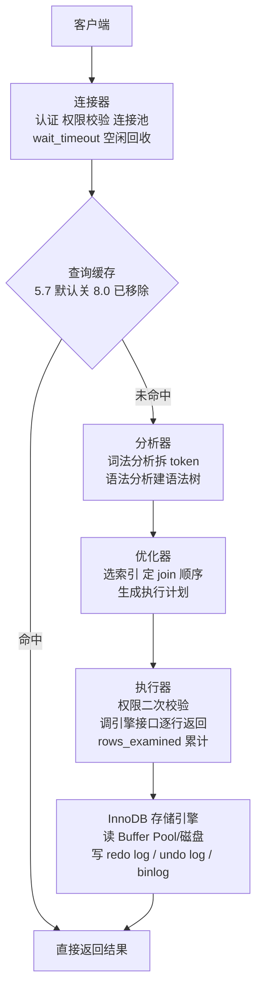
```mermaid
flowchart TD
    Client[客户端] --> Conn[连接器<br/>认证 权限校验 连接池<br/>wait_timeout 空闲回收]
    Conn --> Cache{查询缓存<br/>5.7 默认关 8.0 已移除}
    Cache -- 命中 --> Ret[直接返回结果]
    Cache -- 未命中 --> Parser[分析器<br/>词法分析拆 token<br/>语法分析建语法树]
    Parser --> Optimizer[优化器<br/>选索引 定 join 顺序<br/>生成执行计划]
    Optimizer --> Executor[执行器<br/>权限二次校验<br/>调引擎接口逐行返回<br/>rows_examined 累计]
    Executor --> Engine[InnoDB 存储引擎<br/>读 Buffer Pool/磁盘<br/>写 redo log / undo log / binlog]
    Engine --> Ret
```

### 1.2 redo log 与 binlog 的两阶段提交（核心中的核心）

- **redo log**（InnoDB 引擎层，物理日志，循环写，记录"页上做了什么修改"）：保证崩溃恢复，crash-safe。
- **binlog**（Server 层，逻辑日志，追加写）：用于主从复制与数据恢复。
- 两个日志独立写入 → 必须两阶段提交保证一致性，否则崩溃后可能出现"redo 里有、binlog 里没有"（从库丢数据）或反之（主库回滚但从库已同步）：

```
1. 写 redo log（prepare 状态）     -- 引擎层，先落盘
2. 写 binlog（事务提交点）         -- Server 层
3. 提交事务，redo log 标记 commit  -- 引擎层
崩溃恢复规则：redo 是 prepare 且 binlog 完整 → 提交；
            redo 是 prepare 且 binlog 不完整 → 回滚。
```

- 为什么先 prepare 再写 binlog：崩溃时以 binlog 是否完整为"提交与否"的裁判，保证主从一致。8.0 的两阶段提交还支持组提交（group commit）优化 binlog 刷盘。
- **面试官追问方向**：redo 为什么是物理日志、binlog 为什么是逻辑日志？——redo 记录页偏移+修改内容，恢复时直接重放页，快且幂等；binlog 记录 SQL 或行变更，语义层，可用于任意引擎/异构复制。

> 图示：redo log 与 binlog 两阶段提交时序

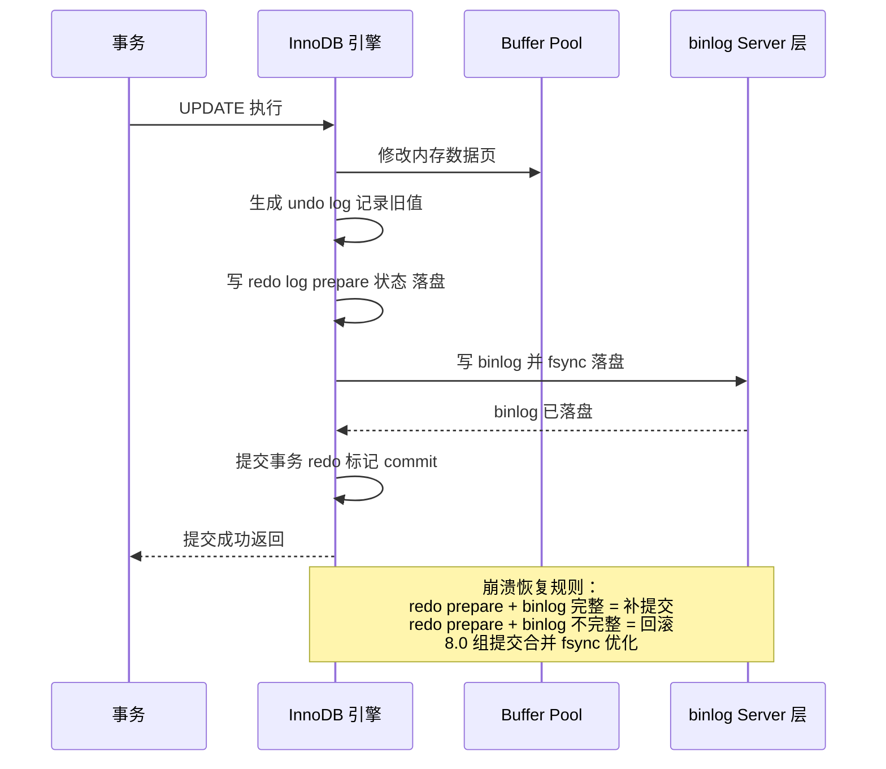
```mermaid
sequenceDiagram
    participant T as 事务
    participant I as InnoDB 引擎
    participant BP as Buffer Pool
    participant B as binlog Server 层
    T->>I: UPDATE 执行
    I->>BP: 修改内存数据页
    I->>I: 生成 undo log 记录旧值
    I->>I: 写 redo log prepare 状态 落盘
    I->>B: 写 binlog 并 fsync 落盘
    B-->>I: binlog 已落盘
    I->>I: 提交事务 redo 标记 commit
    I-->>T: 提交成功返回
    Note over I,B: 崩溃恢复规则：<br/>redo prepare + binlog 完整 = 补提交<br/>redo prepare + binlog 不完整 = 回滚<br/>8.0 组提交合并 fsync 优化
```

### 高频面试题

**Q1：MySQL 是怎么保证"redo 提交了但 binlog 没写"这种情况不发生的？**
A：靠两阶段提交。redo 先写 prepare，binlog 写完并落盘后，redo 才标记 commit。崩溃恢复时：若 redo 是 prepare 状态，检查对应 binlog 事务是否完整——完整则补提交，不完整则回滚。因此"binlog 缺失"的事务永远不会被提交，从库不会出现主库没有的数据。
**面试官追问**：两阶段提交本身会不会成为性能瓶颈？——答：会，所以有组提交优化：多个事务的 binlog 刷盘合并成一次 fsync；8.0 进一步优化了 redo 的组提交，让"刷盘次数"成为可控瓶颈而不是每事务一次。

**Q2：一条 UPDATE 语句从发出到提交，redo/binlog/undo 的写入顺序？**
A：① 读数据页（Buffer Pool，未命中则从磁盘读）；② 在内存页上修改，同时生成 undo log（记录旧值，用于回滚与 MVCC）；③ 写 redo log（prepare）；④ 写 binlog；⑤ 提交，redo 标记 commit；⑥ 脏页由后台线程异步刷盘（或 checkpoint）。关键认知：**提交时数据页可能还在内存**，持久性由 redo 保证，不是由数据页落盘保证。

---

## 二、InnoDB 存储引擎

### 2.1 页与行格式

- 页（Page）默认 **16KB**，是磁盘与内存交互的最小单位；区（64 页=1MB）、段、表空间层层向上。
- 行格式 compact：变长字段长度列表（逆序）+ NULL 标志位 + 记录头（5 字节，含 delete_mask、n_owned、heap_no、record_type、next_record）+ 隐藏列（rowid 6B 无主键时、trx_id 6B、roll_pointer 7B）+ 数据列。MySQL 8.0 默认 dynamic 行格式（大字段溢出到溢出页，只存 20 字节指针），比 compact 更进一步。
- 为什么页 16KB：磁盘顺序读的性价比、B+ 树扇出（fanout）与 IO 次数折中。页太小扇出小树高，页太大内存浪费。

### 2.2 Buffer Pool（缓冲池）

- 作用：缓存数据页+索引页+undo 页，读命中免 IO，写先改内存后异步刷盘。
- **LRU 改进（关键）**：标准 LRU 会被"全表扫描"污染（一次性把热数据挤出）。InnoDB 用**冷热分区**：链表前 5/8 为 young 区，后 3/8 为 old 区（`innodb_old_blocks_pct` 默认 37）；新页先入 old 区头部，在 old 区停留超过 `innodb_old_blocks_time`（默认 1000ms）再次被访问才晋升 young 区——全表扫描的页很快被淘汰，不挤占热点。
- 预读（read ahead）：线性预读/随机预读，按区批量读入，避免逐页随机 IO。
- 命中率监控：`show engine innodb status` 的 Buffer pool hit rate；命中率低先查是否扫描大表/内存不足。

### 2.3 change buffer 与自适应哈希

- **change buffer**（5.5 前叫 insert buffer）：对**二级索引**的写操作（insert/update/delete）不立即更新索引页，而是先记录在 change buffer，等该页被读到（或后台 merge）时再合并。原理：二级索引页在磁盘上随机，每次写都读页代价高；延迟合并把随机 IO 变顺序。代价：merge 时可能放大写放大；唯一索引不能用（需要立即检查唯一性）。
- **自适应哈希索引 AHI**：InnoDB 监控热点访问模式，自动为频繁等值查询的索引页建哈希索引（内存结构），命中则 O(1) 查找。全自动、不可人工干预（可关闭），只有等值查询受益，范围查询走 B+ 树。

### 高频面试题

**Q3：Buffer Pool 的 LRU 为什么要分冷热两区？**
A：防全表扫描污染。标准 LRU 下，一次扫描大表会把所有热数据挤出，之后热点查询全部落盘。冷热分区让新读入的页先待在 old 区，只有被二次访问（且间隔超过阈值）才晋升 young 区，扫描页自然淘汰。工程对应：凌晨跑报表大查询，白天业务不受影响，靠的就是这个机制。
**面试官追问**：为什么晋升要等 1000ms 而不是立即？——答：立即晋升挡不住"扫描过程中同一页被反复访问"的假热点（如自连接扫描），时间窗口过滤掉这种瞬时访问。

**Q4：change buffer 在什么情况下"没用"甚至有害？**
A：① 唯一索引：写入前必须查页判断唯一性，无法延迟；② 写后立即读：merge 成本转移回读路径；③ 数据量小、索引页常驻内存：延迟反而增加复杂度；④ merge 风暴：大量二级索引写累积后集中 merge，可能打满 IO。所以"change buffer 关掉"是很多写密集+小内存场景的调优选项（`innodb_change_buffering`）。

---

## 三、索引

### 3.1 B+ 树原理与高度计算（必考推导）

- B+ 树：非叶子只存**索引键+指针**（不存数据），叶子存全部数据且**链表相连**（页内+页间双向）。所有查询都走到叶子层，**查询代价稳定**（树高一致），范围查询靠叶子链表顺序扫描。
- 高度计算：16KB 页，假设主键 bigint（8B）+ 页指针（6B）= 14B/条 → 每页可存约 16×1024/14 ≈ **1170 个键**；叶子页按每行 1KB 存约 16 行。三层树：1170×1170×16 ≈ **2197 万行**。结论：**2000 万行以内，3 次 IO 定位任意行**，这就是"单表 2000 万"说法的来源（若行更小或页更大，上限更高）。
- 为什么 4 层是红线：每多一层多一次磁盘 IO，随机 IO 毫秒级，量变引起质变；所以千万级表务必让索引页尽量小（主键别用 uuid/超长字符串）。

### 3.2 聚簇索引 / 二级索引 / 覆盖索引

- **聚簇索引**：InnoDB 表必有一个（主键，无主键则选第一个非空唯一键，再没有则生成隐藏 rowid）。叶子存**整行数据**，数据即索引。副作用：主键插入无序（uuid 随机）会导致页分裂与碎片 → **自增主键**是默认最优解。
- **二级索引**：叶子存"索引列 + 主键值"，查询需**回表**（用主键再查一次聚簇索引）。
- **覆盖索引**：查询列全部在二级索引里（含主键），无需回表，Extra 显示 `Using index`。优化第一利器：把高频查询的列做成联合索引覆盖。

### 3.3 最左前缀与索引下推 ICP

- **最左前缀**：联合索引 (a,b,c) 可命中 a、(a,b)、(a,b,c)，但**跳过 a 直接 b 不行**；范围查询（>、<、between）之后的列**无法继续用索引排序/过滤**（只能用于定位起点，之后退化）。注意：8.0 起"范围之后列失效"有细节变化（跳跃扫描 skip scan 可部分利用，MySQL 8.0 支持），但经典结论仍是范围列后面的列不参与索引匹配。
- **ICP（Index Condition Pushdown，5.6+）**：把 WHERE 中能用索引列判断的条件**下推到存储引擎**，在二级索引遍历时提前过滤，减少回表次数。Extra 显示 `Using index condition`。典型：联合索引 (name, age)，`WHERE name LIKE '张%' AND age=30`，5.6 前要回表后过滤 age，5.6 后在索引遍历时就过滤 age。

### 3.4 索引失效场景大全（背熟+能解释原理）

| 场景 | 示例 | 失效原因 |
|---|---|---|
| 函数/表达式包裹列 | `WHERE DATE(create_time)='2024-01-01'` | 索引存的是原始值，无法对函数结果定位（可改范围查询） |
| 隐式类型转换 | `WHERE phone=138...`（phone 是 varchar） | 列上隐式 CAST，同函数包裹 |
| 前导通配符 | `LIKE '%abc'` | B+ 树按前缀有序，无法定位后缀 |
| OR 连接非索引列 | `WHERE a=1 OR b=2`（b 无索引） | 必须全表扫才能保证 or 语义（可拆 union all） |
| 联合索引跳列 | `WHERE b=1`（索引 (a,b)） | 最左前缀不满足 |
| 范围列后的列 | `WHERE a>10 AND b=1`（索引 (a,b)） | b 只能做过滤不能做定位 |
| 对列做运算 | `WHERE a+1=5` | 同函数包裹 |
| 隐式字符集/排序规则不一致 | join 两表不同 collation | 比较时转换 |

> 注意：`!=`/`NOT IN`/`IS NOT NULL` 在优化器成本允许时**可能**走索引（5.6+ 优化器更聪明），"必失效"的说法过时了——讲原理（能否定位）而不是背口诀，是资深与初级的区别。

### 3.5 为什么是 B+ 树而不是 B 树/红黑树/哈希（必考）

| 结构 | 问题 |
|---|---|
| 哈希 | 仅等值 O(1)；范围查询、排序、最左前缀全不支持；无法避免哈希冲突退化 |
| 红黑树/AVL | 二叉：2000 万行需要约 25 层 → 25 次磁盘 IO，不可接受；且无范围扫描的页级顺序性 |
| B 树 | 非叶子也存数据 → 同样容量下扇出小、树更高；范围查询需要中序遍历，无法像 B+ 树沿叶子链表扫 |
| B+ 树 | 非叶子纯索引 → 扇出大（~1170）树矮（3 层）；叶子链表天然支持范围/排序；数据都在叶子，查询稳定 |

### 高频面试题

**Q5：一张 5000 万行的表，主键 bigint 自增，3 层 B+ 树够吗？不够怎么办？**
A：按 1KB/行估算三层约 2000 万行，5000 万行需要第 4 层（多一次 IO，但仍可接受，4 层也能撑到亿级）。更重要的是评估：① 行是否可压缩（定长改变长、大字段拆表）；② 是否可归档冷数据；③ 是否必须分库分表——判断标准是"单行查询延迟是否达标+写入是否成为瓶颈"，而不是机械的 2000 万阈值。**面试官追问**：为什么推荐自增主键而不是业务主键？——答：聚簇索引按主键物理有序，自增插入永远追加在末尾，页分裂少、碎片少；uuid 主键随机插入导致频繁页分裂、写放大和索引碎片，二级索引也更大（叶子存主键）。

**Q6：联合索引 (a,b,c)，哪些查询能用上？为什么？**
A：等值 a、a+b、a+b+c 能完整用；a 等值 + b 范围能用 a+b 但 c 只做过滤；只有 b 或 c 开头完全不能用（除非 8.0 skip scan 恰好适用，成本高不保证）。本质：B+ 树索引是有序的"前缀树"，只有前缀确定才能定位。**面试官追问**：a 等值 b 等值 c 范围 vs a 范围 b 等值 c 等值，哪个更优？——答：前者优。等值列放前面，范围列放最后，是联合索引设计的第一原则（等值列可精确缩小范围，范围列之后全废）。

**Q7：为什么说"索引不是越多越好"？**
A：① 每个索引都是独立 B+ 树，占用磁盘与 Buffer Pool；② 写放大：一条 INSERT 要维护所有索引，二级索引写还要走 change buffer 流程；③ 优化器选错索引的风险随索引数上升；④ 冗余索引（(a,b) 与 (a) 重复）纯浪费。工程标准：单表索引控制在 5 个内，联合索引按查询模式设计，用 `pt-duplicate-key-checker` 清冗余。

---

## 四、事务与隔离级别

### 4.1 ACID 的实现机制

| 特性 | 实现 | 说明 |
|---|---|---|
| 原子性 Atomicity | undo log | 回滚段记录旧值，失败/回滚时逆操作恢复 |
| 一致性 Consistency | 约束+应用逻辑 | 数据库保证约束，业务保证语义 |
| 隔离性 Isolation | 锁 + MVCC | 读写不互斥靠 MVCC，写写互斥靠锁 |
| 持久性 Durability | redo log | 提交即落 redo，页可异步刷盘 |

### 4.2 四种隔离级别与三类问题

| 隔离级别 | 脏读 | 不可重复读 | 幻读 | 实现 |
|---|---|---|---|---|
| READ UNCOMMITTED | 可能 | 可能 | 可能 | 读不加锁，读到未提交数据 |
| READ COMMITTED (RC) | 否 | 可能 | 可能 | 语句级 ReadView + 行锁 |
| REPEATABLE READ (RR) | 否 | 否 | 基本不可能 | 事务级 ReadView + 临键锁；**MySQL 默认** |
| SERIALIZABLE | 否 | 否 | 否 | 读也加锁（退化为锁表/锁范围） |

- 脏读：读到别的事务未提交的数据（可能回滚）；不可重复读：同一事务两次读同一行结果不同（被已提交事务修改）；幻读：同一事务两次范围查询结果集行数不同（出现新行）。
- 注意：**SQL 标准里 RR 是允许幻读的**，MySQL 的 RR 用间隙锁把幻读也基本堵死——但"基本"二字有讲究：纯快照读不会幻读；当前读（`SELECT ... FOR UPDATE`/`UPDATE`/`DELETE`）靠临键锁，若锁范围覆盖不足仍有缝。这是资深面试的经典钻牛角尖点。

### 4.3 RR 下如何避免幻读（必考）

1. **快照读**（普通 SELECT）：MVCC 版本链 + 事务级 ReadView，读到的是事务开始时的快照，天然无幻读。
2. **当前读**（FOR UPDATE / UPDATE / DELETE / INSERT 相关）：加**临键锁（记录锁+间隙锁）**锁住扫描范围，其他事务无法在范围内插入新行 → 幻读被锁挡住。
3. 边界情况：若查询没有可用索引（全表扫），InnoDB 会对**全表加间隙锁**（退化为表级阻塞），这是 RR 下"锁竞争爆炸"的经典事故源。

### 高频面试题

**Q8：RR 和 RC 怎么选？为什么很多大厂把默认隔离级别改成 RC？**
A：RR 的间隙锁大幅提升死锁概率和锁等待，高并发写场景吞吐受损；RC 无间隙锁，且 binlog 用 row 格式时主从一致性与 RR 无差别。大厂（阿里等）默认 RC 的原因：① 间隙锁引发的死锁/阻塞事故多；② 业务大多不需要可重复读语义；③ row 格式 binlog 下 RC 的复制安全性已足够。代价：RC 下不可重复读，依赖该语义的业务要显式加锁或用乐观锁。**面试官追问**：RC 下能避免幻读吗？——答：RC 无间隙锁，当前读也只能锁住已存在的行，无法阻止新行插入，所以 RC 下幻读无法避免，只能靠应用层（唯一约束、重查、串行化）。

**Q9：事务里先 SELECT 后 UPDATE 同一条数据，会不会读到过期值？**
A：普通 SELECT 是快照读（读 ReadView 可见版本），UPDATE 是当前读（读最新已提交版本）——所以"先查后改"可能基于旧值修改（丢失更新）。解法：① `SELECT ... FOR UPDATE`（当前读）锁行；② 乐观锁版本号/时间戳，CAS 式更新；③ 事务隔离升 SERIALIZABLE。这是并发扣减库存、转账类业务的经典 bug 来源。

---

## 五、MVCC（多版本并发控制）

### 5.1 版本链

- 每行隐藏列：`trx_id`（最近修改事务 id）、`roll_pointer`（指向 undo log 中旧版本）。
- 更新一行 → 旧值写入 undo log，新版本行的 roll_pointer 指向旧版本 → 形成**版本链**（头是最新，尾是最早）。
- 读操作沿版本链找"对当前事务可见"的版本，实现读写不互斥：写者改新版本，读者看旧版本。

> 图示：MVCC 版本链与 ReadView 可见性判断

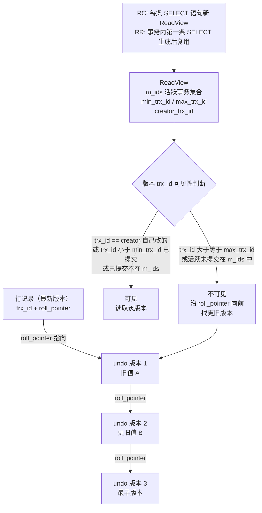
```mermaid
flowchart TD
    Row["行记录（最新版本）<br/>trx_id + roll_pointer"] -->|roll_pointer 指向| U1["undo 版本 1<br/>旧值 A"]
    U1 -->|roll_pointer| U2["undo 版本 2<br/>更旧值 B"]
    U2 -->|roll_pointer| U3["undo 版本 3<br/>最早版本"]
    RV["ReadView<br/>m_ids 活跃事务集合<br/>min_trx_id / max_trx_id<br/>creator_trx_id"] --> Judge{"版本 trx_id 可见性判断"}
    Judge -->|"trx_id == creator 自己改的<br/>或 trx_id 小于 min_trx_id 已提交<br/>或已提交不在 m_ids"| OK["可见<br/>读取该版本"]
    Judge -->|"trx_id 大于等于 max_trx_id<br/>或活跃未提交在 m_ids 中"| Next["不可见<br/>沿 roll_pointer 向前<br/>找更旧版本"]
    Next --> U1
    Note[RC: 每条 SELECT 语句新 ReadView<br/>RR: 事务内第一条 SELECT 生成后复用] -.-> RV
```

### 5.2 ReadView 与可见性算法

ReadView 四个核心字段：`m_ids`（活跃事务 id 集合）、`min_trx_id`（最小活跃 id）、`max_trx_id`（下一个将分配 id，即"上界"）、`creator_trx_id`（创建者自己）。

可见性判断（对版本链上某个 trx_id 为 X 的版本）：
1. X == creator_trx_id → 可见（自己改的）；
2. X < min_trx_id → 已提交，可见；
3. X ≥ max_trx_id → 创建 ReadView 之后才开启的事务，不可见；
4. min_trx_id ≤ X < max_trx_id → 在 m_ids 里则未提交，不可见；不在则已提交，可见。

### 5.3 RC 与 RR 的关键区别（生成时机）

- **RC**：每条 SELECT 语句都生成新的 ReadView → 能看到其他事务**已提交**的最新修改 → 不可重复读。
- **RR**：事务内**第一条 SELECT** 生成 ReadView，之后复用 → 后续查询看不到其他事务的提交 → 可重复读。
- 一致性读 vs 锁定读：MVCC 只服务快照读；当前读永远读最新版本并加锁，两者在 RR 下"看到的数据"可能不同——能讲清这个分叉，MVCC 就过关了。

### 高频面试题

**Q10：RR 下，事务 A 先普通 SELECT 看不到新行，事务 B 插入并提交，A 再 UPDATE 会怎样？**
A：UPDATE 是当前读，能读到 B 提交的新行，且**可能把新行也更新了**（当前读+写）。这就是"快照读与当前读不一致"的典型表现：A 的 SELECT 结果集与 UPDATE 影响行数不一致，业务上表现为"查不到却改得到"。解决：业务一致性要求高时用 FOR UPDATE 统一当前读，或接受 MVCC 语义。
**面试官追问**：这个行为在 RC 下存在吗？——答：RC 每条语句新 ReadView，SELECT 和 UPDATE 看到的数据基本同步，不一致窗口小得多；这也是部分业务选 RC 的隐藏理由。

---

## 六、锁

### 6.1 行锁三兄弟

| 锁 | 范围 | 说明 |
|---|---|---|
| 记录锁 Record Lock | 单行 | 锁索引记录本身 |
| 间隙锁 Gap Lock | 开区间 (a,b) | 锁"两个记录之间的空隙"，防插入（RR 默认） |
| 临键锁 Next-Key Lock | [a,b) | 记录锁+前向间隙锁，RR 默认行锁形态 |

- 加锁基于**索引**：没有索引的 WHERE → 全表扫描 → 所有记录+间隙全锁（等同锁表）。**给 WHERE 列建索引是降低锁竞争的第一手段**。
- 等值查询：命中唯一索引 → 退化为记录锁（间隙锁只锁不存在的区间）；范围查询 → 临键锁锁整个扫描区间。

### 6.2 加锁规则案例（经典）

```
表 t(id 主键, name 普通索引, age)
数据: id=1,2,5,10

案例1: UPDATE t SET age=1 WHERE id=5;      -- 唯一索引等值命中 → 只锁 id=5 记录锁
案例2: UPDATE t SET age=1 WHERE id=3;      -- 等值未命中 → 间隙锁 (2,5)，阻止插入 id=3
案例3: UPDATE t SET age=1 WHERE id>5;      -- 范围 → 临键锁 (5,10]、(10,+∞)
案例4: UPDATE t SET age=1 WHERE name='x';  -- name 非唯一索引等值 → 临键锁 + 间隙锁
                                            --（覆盖 name='x' 的区间，防相同 name 插入）
```

要点：间隙锁是"防插入"不是"防更新"；两个事务分别持有不重叠的间隙锁不互斥（间隙锁之间不冲突，冲突只在"间隙锁 vs 插入意向锁"）。

### 6.3 死锁：成因、检测与处理

- 四个必要条件：互斥、持有并等待、不可剥夺、循环等待。InnoDB 死锁几乎都是"两个事务按不同顺序锁多行/多索引"。
- 检测与处理：`innodb_deadlock_detect=on`（默认）时，等待图检测到环立即**回滚代价较小的事务**（按 undo 行数评估），报 `Deadlock found when trying to get lock`；也可设 `innodb_lock_wait_timeout`（默认 50s）兜底超时。
- 死锁的工程对策：① 多行更新按固定顺序（如按主键排序）；② 事务要小要快（缩小锁持有时间）；③ 减少间隙锁（RC 隔离级别）；④ 索引设计让扫描范围小；⑤ 死锁重试机制（捕获 1213 错误码重试，幂等设计）。
- **面试官高频追问**：死锁检测本身会不会成为性能瓶颈？——答：会。热点行高并发下，每次加锁等待都触发等待图检测，检测成本 O(等待链长度²)，可能比死锁本身更伤。阿里等场景下 `innodb_deadlock_detect=off` + 锁等待超时是常见取舍（代价是死锁只能超时暴露）。

### 6.4 表锁与 MDL

- 显式表锁 `LOCK TABLES`：服务端层，基本被 InnoDB 行锁取代，遗留场景是 DDL 与备份。
- **MDL（元数据锁）**：DML 与 DDL 的隐性互斥。经典事故：`ALTER TABLE` 在等 MDL 写锁，会**阻塞后续所有 DML**（排队机制），一条慢 DDL 打爆整个表的读写。对策：`pt-online-schema-change`/`gh-ost`（先建影子表拷贝数据+binlog 追平+rename），或 8.0 的原子 DDL + `ALGORITHM=INSTANT`。
- 乐观锁 vs 悲观锁：悲观锁=数据库行锁（适合冲突多、短事务）；乐观锁=版本号/CAS（适合冲突少、长事务，如电商库存扣减用 `UPDATE ... SET stock=stock-1 WHERE id=? AND stock>=1` 的原子条件更新，比先查后改更优）。

### 高频面试题

**Q11：间隙锁什么时候会"帮倒忙"？怎么规避？**
A：① 无索引条件的更新/删除：全表加间隙锁，等同锁表，高并发写直接雪崩（案例：`DELETE FROM t WHERE status=0` 且 status 无索引）；② 高并发插入场景间隙锁冲突频繁 → 死锁率上升。规避：给过滤列建索引、缩小事务、或改 RC 隔离级别（RC 无间隙锁，这也是大厂选 RC 的核心原因之一）。
**面试官追问**：两个事务的间隙锁会互相阻塞吗？——答：间隙锁之间**不互斥**（都是"防插入"语义，插入意向锁才与间隙锁冲突）。所以两个事务可以同时持有重叠间隙锁，但谁想往间隙里插数据，谁就要等——这是"插入变慢"却"不死锁"的常见现象。

**Q12：扣库存的 SQL 怎么写最安全？**
A：`UPDATE stock SET stock = stock - #{n} WHERE id = ? AND stock >= #{n}`——单条原子 SQL，行锁只持有一瞬间，无"先查后改"窗口，无需显式事务；影响行数为 0 则库存不足。比 SELECT FOR UPDATE（长事务持锁）和乐观锁重试（冲突多时放大写放大）都优。若需扣减后写流水，用事务包裹并保证流水表无唯一性冲突。**面试官追问**：高并发下这行会不会成为热点？——答：会，单行热点锁竞争。解法：库存分桶（预分配多个库存行，随机/按用户 hash 选桶扣减），或改 Redis 预扣+异步对账，回到"缓存与 DB 一致性"的架构题。

---

## 七、日志

### 7.1 binlog 三种格式

| 格式 | 内容 | 优点 | 缺点 |
|---|---|---|---|
| statement | 原始 SQL | 量小 | 非确定函数（NOW()、UUID()）主从不一致；5.7.7 起默认 row，statement 基本退出 |
| row | 行变更前后镜像 | 精确、可靠 | 量大；DDL 仍是 statement |
| mixed | 自动切换 | 折中 | 判断逻辑复杂，5.7.7 后不再默认 |

- 8.0 默认 row。row 格式下大事务（批量 update 百万行）binlog 巨大，是主从延迟与磁盘的隐形杀手——**大事务拆分**是运维铁律。
- binlog 还用于误删恢复：全量备份 + binlog 时间点回放。

### 7.2 redo log 与崩溃恢复

- 循环写（ib_logfile，8.0 默认 2 个×48MB 起步可调）；写策略由 `innodb_flush_log_at_trx_commit` 决定：0（每秒刷，可能丢 1s）、1（每次提交刷，默认，不丢）、2（每次提交写 OS cache，每秒刷，OS 崩溃丢 1s）。
- LSN（Log Sequence Number）串联：页上的 LSN 与 redo 的 LSN 比较，小于的才重放（幂等）。
- 崩溃恢复：从 checkpoint 位置向后重放 redo（前滚）+ 用 undo 回滚未提交事务（后滚）。"崩溃恢复不丢已提交事务"由 redo 保证。

### 7.3 undo log

- 逻辑日志，记录"修改前的值"，两个用途：**回滚**（原子性）与 **MVCC 版本链**（隔离性）。
- undo 页本身也进 Buffer Pool、也有 redo（undo 的持久化依赖 redo，这是"日志的日志"，面试冷门加分点）。
- undo 生命周期：事务提交后，若没有更早的 ReadView 还引用该版本，undo 才可被 purge 线程清理；长事务/长查询会阻止 purge → undo 膨胀 → ibtmp/undo 表空间暴涨。

### 高频面试题

**Q13：redo log 满了会发生什么？**
A：redo 是循环写，写满时触发 **checkpoint**：强制把 Buffer Pool 中最旧的脏页刷盘，推进 checkpoint LSN，才能覆盖旧日志。若刷盘速度跟不上写入（如磁盘慢、大事务），数据库会"卡住"（用户感知为写阻塞）。监控指标：`log sequence number` 与 `last checkpoint at` 的差值。
**面试官追问**：为什么 redo 用物理日志而 undo 用逻辑日志？——答：redo 要崩溃重放，物理记录"页偏移+内容"重放即恢复，无需关心并发；undo 要给 MVCC 提供"旧版本"，逻辑记录"反操作"（如 INSERT 的反操作 DELETE），语义层数据天然可读。

**Q14：主从延迟和 binlog 大事务有什么关系？**
A：row 格式下大事务生成巨量 binlog，从库 relay log 回放是**串行**的（5.7 前单线程），主库 1 分钟提交的大事务，从库可能回放 10 分钟——延迟直接拉满。对策：① 大事务拆小（分批提交）；② 从库并行复制（5.7 组提交并行、8.0 write-set 并行）；③ 必要时对延迟敏感查询走主库或加缓存。

---

## 八、主从复制与高可用

### 8.1 复制原理（三线程）

```
主库: 写 binlog
  └─ dump 线程: 推 binlog 给从库
从库: IO 线程: 拉 binlog 写 relay log
  └─ SQL 线程: 回放 relay log（5.6+ 可并行）
```

> 图示：MySQL 主从复制三线程时序

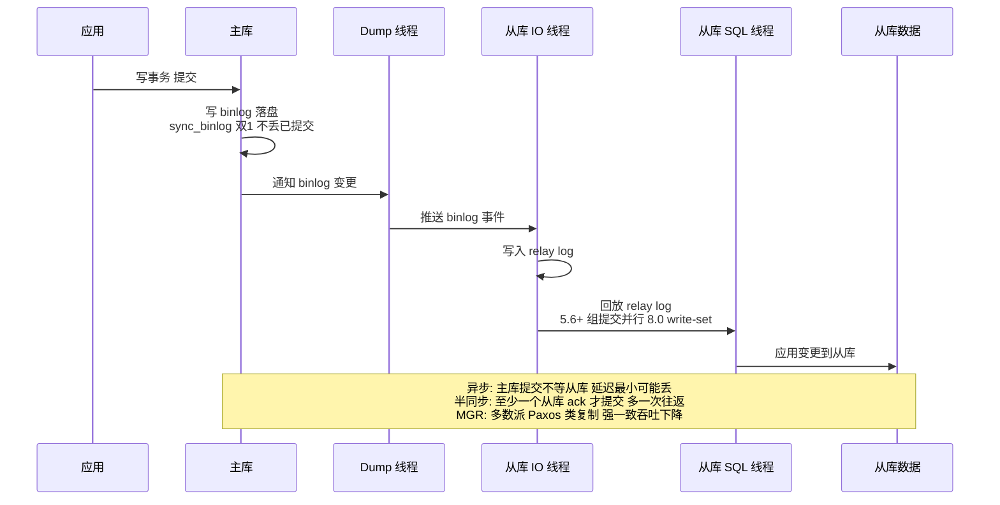
```mermaid
sequenceDiagram
    participant App as 应用
    participant M as 主库
    participant D as Dump 线程
    participant I as 从库 IO 线程
    participant R as 从库 SQL 线程
    participant S as 从库数据
    App->>M: 写事务 提交
    M->>M: 写 binlog 落盘<br/>sync_binlog 双1 不丢已提交
    M->>D: 通知 binlog 变更
    D->>I: 推送 binlog 事件
    I->>I: 写入 relay log
    I->>R: 回放 relay log<br/>5.6+ 组提交并行 8.0 write-set
    R->>S: 应用变更到从库
    Note over M,S: 异步: 主库提交不等从库 延迟最小可能丢<br/>半同步: 至少一个从库 ack 才提交 多一次往返<br/>MGR: 多数派 Paxos 类复制 强一致吞吐下降
```

- 复制三模式对比：

| 模式 | 机制 | 一致性 | 延迟/代价 |
|---|---|---|---|
| 异步 | 主库提交不等从库 | 可能丢数据（主挂时） | 延迟最小 |
| 半同步（semi-sync） | 至少一个从库收到并 ack 才提交（5.7 优化为"ack 后返回，落盘可异步"） | 不丢已提交事务（从库 ack 过的） | 多一次网络往返 |
| 组复制 MGR | 多数派（Paxos 类）复制+冲突检测，节点自动选主 | 强一致（多数派内） | 吞吐下降，网络要求高 |

- **GTID**（5.6+）：全局事务 ID（server_uuid:transaction_id），从库按 GTID 幂等回放，天然支持"断点续传+自动找位点"，替代传统 file+pos 位点，是 MHA/Orchestrator 自动切换的基础。

### 8.2 读写分离与延迟问题

- 架构：主写从读 + 中间件（ProxySQL/MyCat/ShardingSphere）或客户端路由。
- **延迟的根源**：从库回放单线程/弱并行 + 大事务 + 大 DDL。5.7 组提交并行复制（同一组提交的事务可并行回放）、8.0 write-set 并行（无冲突事务跨组并行）大幅缓解。
- 延迟导致"写完主库立刻读从库读不到"：对策：① 关键读走主库（强制路由）；② 读从库前等待（`SELECT master_pos_wait()`/GTID 等待）；③ 缓存兜底（写主后写缓存，读先查缓存）；④ 业务容忍最终一致。
- 高可用选型：**MHA**（经典，脚本化切换，需额外节点，已停更但存量多）vs **Orchestrator**（Raft 管理拓扑，8.0 兼容好，自动故障检测+切换）vs MGR（数据库原生，自动化最高但限制多：要求所有表有主键、网络稳定）。

### 高频面试题

**Q15：主库宕机后，怎么做到尽量少丢数据？**
A：三层递进：① binlog 落盘策略 `sync_binlog=1` + redo `innodb_flush_log_at_trx_commit=1`（双 1，不丢已提交）；② 半同步复制保证至少一个从库持有 binlog；③ 故障切换选"**数据最新的从库**"（比较 GTID/位点，MHA/Orchestrator 自动做），必要时手工补齐。丢数据的残余窗口：半同步模式下 ack 前的提交在"主库挂了且该从库也挂了"时才丢。
**面试官追问**：主库恢复后怎么回切？——答：原主库作为新主的从库重新同步（GTID 自动追平），追平后人工/自动切换回。注意原主库可能有"脑裂期间"的孤儿数据，需比对 GTID 集合确认无冲突分支，或直接放弃旧数据（从新主全量重灌）。

**Q16：一主两从，从库 A 延迟 5 分钟，从库 B 正常，读流量怎么路由？**
A：方案：① 延迟感知路由——从库上报延迟，超过阈值（如 3s）摘出读流量（ProxySQL 的 `max_lag_ms` 就是干这个的）；② 一致性要求高的查询强制主库；③ 从库 A 排查延迟根因（大事务？慢查询？并行复制参数？）而不是只做路由规避。架构师答案要落到"路由+治理"两条腿。

---

## 九、分库分表

### 9.1 垂直 vs 水平

- **垂直分库**：按业务域拆库（用户库/订单库/商品库）——解耦、独立扩容，代价是跨库 join 消失（→ 应用层组装/宽表冗余）。
- **垂直分表**：大字段拆出（text/blob 单独表）——减少行宽，提高页内行数。
- **水平分表**：同结构多表（order_0..order_63），按分片键路由——解决单表数据量与写入瓶颈。
- 分库分表的触发信号（不是拍脑袋）：单表 >2000 万或 >几十 GB、写入吞吐触顶、单库连接数/IO 触顶、备份恢复时间过长。

### 9.2 分片键选择与扩容（架构题核心）

- 分片键三原则：**均匀**（避免热点，如按 user_id 而不是按地区）、**查询友好**（高频查询带分片键，否则全库广播）、**稳定**（不可变，改了要重路由）。
- 路由算法：hash 取模（均匀但扩容要重排）vs 一致性哈希（扩容只影响环上相邻节点，但分布不均+虚拟节点复杂）vs 范围分片（按 id 区间，扩容友好但热点在最新区间）。
- **扩容方案**：
  1. 停机迁移：停写→双写/导出导入→切流（简单粗暴，适合可停服场景）；
  2. 平滑迁移（双写+追平）：新集群建好→双写新旧→全量+增量追平→校验→切读切写（经典"影子迁移"）；
  3. 提前分片：一开始分 1024 个逻辑分片映射到少量物理库，扩容只搬分片映射（如"逻辑分片+物理库两层映射"，微博/饿了么都这么干）；
  4. 一致性哈希 + 虚拟节点：扩容只迁移少量数据，但路由实现复杂。
- 反范式：分片后"全局唯一 ID"要自建（雪花算法：时间戳+机器 id+序列号；或号段模式从 DB 取号）——面试必问。

### 9.3 跨库 join 与分布式事务

- 跨库 join 的四个解法（按优先级）：① 冗余宽表（把关联字段冗余进查询表，如订单表冗余用户昵称）；② 应用层组装（多次单表查询，代码 join）；③ 全局表（字典类小表每库一份）；④ 数据异构到 OLAP/ES（复杂分析场景）。
- 分布式事务方案演进：**XA**（2PC，强一致但性能差、协调者单点）→ **TCC**（Try-Confirm-Cancel，业务补偿，侵入大）→ **本地消息表**（同库事务写消息表+MQ 投递，最终一致）→ **MQ 事务消息**（RocketMQ 半消息）→ **Seata AT**（自动补偿，框架级，业务无侵入，性能介于 XA 与 TCC 之间）。
- 选型口诀：强一致短事务选 XA/Seata AT；长事务/高吞吐选最终一致（事务消息/本地消息表）；资金类用 TCC+对账兜底。**对账**是分布式事务的最后一根安全绳，面试提到必有加分。

### 9.4 中间件对比与分页/聚合

| 维度 | ShardingSphere | MyCat |
|---|---|---|
| 形态 | 客户端 JDBC 驱动（Sharding-JDBC）+ 可选的 Proxy | 独立代理服务 |
| 侵入性 | 应用内，无额外部署 | 应用无感知，但要维护代理集群 |
| 协议 | 完全 JDBC 兼容 | MySQL 协议代理 |
| 治理 | 生态全（加密/影子库/分布式事务） | 相对简单，社区活跃度下降 |
| 适用 | 中大规模 Java 应用 | 多语言/不想改代码 |

- 分页 `LIMIT 100000,10` 跨分片：各分片取 100010 条再内存归并 → 深分页成本随 offset 线性爆炸。对策：① 禁止大 offset，改**游标分页**（`WHERE id > last_id ORDER BY id LIMIT 10`，前提是有序键）；② 业务上限定翻页深度（如只允许前 100 页）。
- 聚合（count/sum）：各分片聚合后汇总（ShardingSphere 自动做）；`count(*)` 在分片场景准确值代价高，常以近似值+定时任务对账替代。

### 高频面试题

**Q17：订单表要分库分表，分片键选 order_id 还是 user_id？**
A：核心矛盾：订单查询"我的订单"（按 user_id）高频，后台运营查询（按时间/商家）低频。选 user_id：用户侧查询全部命中单分片，但后台查询全库广播——可接受，因为后台查询可走 OLAP 副本/ES。选 order_id：均匀但用户查询变广播。**业界主流：按 user_id 分片**，配合"订单表冗余 user_id 字段"（对商家侧查询建 ES 或宽表）。**面试官追问**：如果必须按 order_id 分片，用户查询怎么优化？——答：建立"用户-订单"映射表（user_id → order_id 列表，同样分片），两跳查询；或 user_id 维度冗余一份订单摘要表。

**Q18：分库分表后，怎么生成全局唯一 ID？**
A：三个方案对比：① UUID：简单但 36 字符、无序（聚簇索引碎片化）、索引变大；② 数据库号段：`UPDATE id_alloc SET max_id=max_id+1000` 取号，性能好但要维护号段表；③ 雪花算法（Snowflake）：64 位（1 符号位+41 时间戳+10 机器位+12 序列号），趋势递增、无中心、高吞吐，**业界事实标准**。注意时钟回拨问题（记录上次时间戳，回拨则等待或抛异常）。**面试官追问**：雪花 ID 有 41 位时间戳，能用多少年？——答：约 69 年（2⁴¹ 毫秒），且自定义起始纪元可平移，实际够用。

---

## 十、慢查询优化与 SQL 调优案例

### 10.1 explain 手撕指南

```sql
EXPLAIN SELECT ... -- 关键字段：
-- type: system > const > eq_ref > ref > range > index > ALL（越左越好，ALL 是红线）
-- key: 实际使用的索引；key_len: 用到的索引字节数（可反推用了几列）
-- rows: 预估扫描行数（优化器估算，别当精确值）
-- Extra 重点:
--   Using index       覆盖索引，最优
--   Using where       索引下推/存储引擎层后过滤（配合 key 判断）
--   Using index condition  ICP 生效
--   Using filesort    排序未用索引，内存/磁盘排序（大结果集是灾难）
--   Using temporary   临时表（group by 无索引、union、子查询常见）
--   Using join buffer  join 无索引被驱动表
```

排查流程：定位慢 SQL（slow log/performance_schema）→ explain 看 type/key/rows/Extra → 从"索引缺失→索引设计不合理→SQL 写法→数据分布（统计信息）"四层找根因。

### 10.2 实战案例

**案例 A：分页深翻（深分页）**
```sql
-- 慢：LIMIT 1000000, 20 需要扫 100 万行再丢
SELECT * FROM t ORDER BY id LIMIT 1000000, 20;
-- 快：延迟关联，先用覆盖索引定位 id 再回表
SELECT * FROM t JOIN (SELECT id FROM t ORDER BY id LIMIT 1000000, 20) tmp
  ON t.id = tmp.id;
-- 或游标：WHERE id > ? ORDER BY id LIMIT 20（推荐，前提业务允许）
```
原理：覆盖索引扫描只读索引页，回表只回 20 行；而原 SQL 每行都回表。

**案例 B：函数导致索引失效**
```sql
-- 慢：WHERE DATE(create_time) = '2024-06-01'  对列函数化
-- 快：WHERE create_time >= '2024-06-01' AND create_time < '2024-06-02'
```
原理：索引按原始值有序，函数后无法二分定位；改写为范围查询即命中索引。

**案例 C：隐式转换**
```sql
-- phone 是 varchar，WHERE phone = 13800138000 数字常量 → 列上隐式 CAST，索引失效
-- 快：WHERE phone = '13800138000'
```
（注意：反过来常量是字符串、列是数字时，8.0 优化器会做"常量转列类型"，可能仍走索引——方向很重要。）

**案例 D：JOIN 大表驱动**
```sql
-- 小表驱动大表：EXPLAIN 看驱动表 rows，被驱动表 join 列必须有索引
-- 否则 Using join buffer + ALL，全表扫被驱动表
```

### 10.3 大分页与深分页的架构级解法

1. 业务限制：只允许翻前 N 页（搜索引擎同款思路）；
2. 游标/键集分页：`WHERE id > last_id`（需稳定有序键，主键即可）；
3. 延迟关联/覆盖索引；
4. 数据归档：把历史数据按月分区（PARTITION BY RANGE）或归档表，分区裁剪让扫描范围指数级缩小——**分区是"免费的分库分表"**，能分区解决的别急着分库。

### 高频面试题

**Q19：同样是索引，为什么有时候优化器就是不走？**
A：① 统计信息过期（`ANALYZE TABLE` 刷新）；② 数据倾斜，优化器按成本模型判断"走索引回表比全表扫更贵"（如过滤后仍占 30%+ 行）；③ 索引选择性差（重复值多）；④ SQL 写法触发失效（函数/隐式转换/前导 %）。解法：刷新统计信息 → 检查写法 → `FORCE INDEX` 临时验证 → 8.0 用直方图+优化器提示。**面试官追问**：`FORCE INDEX` 能上生产吗？——答：能但要谨慎：数据分布变化后强制索引可能更差；正确姿势是先分析为何优化器不选（统计信息/成本模型），FORCE 只作应急，长期靠索引设计与统计信息维护。

**Q20：count(*) 在大表上为什么慢？怎么优化？**
A：InnoDB 的 count(*) 要扫描全表（MVCC 下无法像 MyISAM 存行数），二级索引比聚簇索引小，优化器通常走最小的二级索引扫——所以"给任意小列建个索引能加速 count"是技巧。但数据量大后仍慢：解法：① 近似值（`SHOW TABLE STATUS` 的 rows，允许误差时）；② 计数表/Redis 计数（事务内同步更新）；③ 按天分区 + 分区统计缓存。**面试官追问**：为什么 InnoDB 不维护总行数？——答：MVCC 下不同事务看到不同行数，维护全局计数与隔离性冲突，只能在读时动态统计。

---

## 十一、面试高频题合集

**Q21：为什么很多团队"分库分表"之前先考虑 MongoDB/其他 NoSQL？MySQL 的边界在哪？**
A：这是伪命题——选型看访问模式。MongoDB 的优势是文档模型+水平扩展原生（分片自动），劣势：事务能力弱（多文档事务 4.0 才支持且性能差）、join 弱、强一致读要额外配置。MySQL 的优势是事务/join/生态/运维成熟。决策矩阵：**强事务+复杂关联+稳定 schema → MySQL；高写入吞吐+灵活 schema+弱事务 → MongoDB 或 MySQL 分片**。资深答案：先量化 QPS/数据量/一致性要求，再选型，而不是听风就是雨。
**面试官追问**：MySQL 在什么规模下必须分片？——答：没有绝对数字，看瓶颈：单库写 QPS 触顶（一般 5000-1 万+）、单表超过内存与 IO 承受力、备份恢复超 SLA。很多团队 1000 万行就分片是过度设计，先做索引/分区/归档。

**Q22：MySQL 8.0 相比 5.7 的关键变化，生产中你关注哪些？**
A：① 查询缓存删除（省掉失效锁竞争）；② 默认 utf8mb4、默认 row binlog、caching_sha2_password 认证（老客户端不兼容，升级要处理）；③ 原子 DDL（DDL 崩溃不留半成品）+ INSTANT 加列；④ 直方图、hash join（无索引 join 场景大幅提速，5.7 用 NLJ+buffer 慢）；⑤ undo 独立表空间、redo 可调大小；⑥ 不可见索引、函数索引（`INDEX ((lower(name)))`，解决函数失效问题）。生产注意：升级前查兼容性（认证插件、SQL 模式），8.0 的默认 SQL 模式更严格。

**Q23：一条 SQL 从"慢"到"修好"，完整的排查方法论是什么？**
A：① 慢日志/监控定位 SQL 与频率；② explain 看执行计划（type/key/rows/Extra）；③ 定位根因四层：索引缺失→索引设计（联合索引顺序/覆盖）→SQL 写法（函数/隐式转换/深分页）→数据与统计信息（倾斜/过期）；④ 验证：`EXPLAIN ANALYZE`（8.0 实际执行耗时）或线上灰度；⑤ 兜底：缓存/读写分离/异步化——**调优顺序永远是"先索引后架构"**，直接上缓存是掩盖问题。**面试官追问**：Explain 的 rows 和实际不符怎么办？——答：统计信息过期或采样误差，先 ANALYZE TABLE；仍不符考虑索引统计的采样页设置（`innodb_stats_persistent_sample_pages`），或直方图辅助优化器判断数据分布。

**Q24：主库 binlog 被误删了，怎么恢复数据？**
A：分情况：① 有全量备份：备份+后续 binlog 增量回放到误操作前时间点（`mysqlbinlog --stop-datetime`）；② 无备份：从从库导出（从库可能已同步错误操作，需结合 binlog 找正确位点）——实际上从库也执行了误操作，需用 `--start-position` 跳过；③ 定期演练是唯一靠谱的保障。架构师答案：备份策略（全量+增量 binlog 保留 N 天）与恢复演练（每年至少一次）是 DBA 的核心 KPI。

**Q25：什么是"索引下推"？举个具体例子说明它省了什么。**
A：ICP 是 5.6 引入的优化：把 WHERE 里能用索引列判断的条件下推到存储引擎，在二级索引遍历时先过滤再回表。例：联合索引 (name, age)，`SELECT * FROM t WHERE name LIKE '张%' AND age > 30`——无 ICP：引擎把"张%"命中的所有记录回表，Server 层再过滤 age；有 ICP：引擎遍历索引时直接过滤 age>30，只回表满足条件的行。省的是回表次数（每次回表是一次随机 IO）。EXPLAIN 的 Extra 出现 `Using index condition` 即生效。**面试官追问**：ICP 和覆盖索引的区别？——答：覆盖索引是"根本不用回表"（查询列全在索引里），ICP 是"减少回表次数"（仍要回表但回得少），两者可叠加。

---

## 考点速查表

| 考点 | 一句话要点 |
|---|---|
| SQL 执行流程 | 连接器→分析器→优化器→执行器→引擎；8.0 删查询缓存 |
| 两阶段提交 | redo prepare → binlog → redo commit；崩溃时以 binlog 完整性裁判 |
| redo vs binlog | redo 引擎层物理循环写（crash-safe）；binlog Server 层逻辑追加写（复制/恢复） |
| 页与行格式 | 页 16KB；compact/dynamic 行格式含 trx_id、roll_pointer 隐藏列 |
| Buffer Pool | 冷热 LRU（默认 37% old 区）+ 1000ms 晋升窗口防扫描污染 |
| change buffer | 二级索引写延迟合并，唯一索引不能用，merge 风暴需警惕 |
| 自适应哈希 | AHI 自动为热点等值查询建哈希，只服务等值 |
| B+ 树高度 | 每页约 1170 键，3 层 ≈ 2000 万行，4 次 IO 是红线 |
| 聚簇/二级索引 | 聚簇叶子存整行；二级存主键需回表；覆盖索引免回表 |
| 最左前缀 | 联合索引按前缀命中；等值列前置、范围列后置 |
| ICP | 条件下推引擎层提前过滤，减少回表，Extra=Using index condition |
| 索引失效 | 函数包裹/隐式转换/前导%/OR 非索引列/跳列/范围后列 |
| B+ 树选择 | 扇出大树矮、叶子链表范围查询、查询代价稳定 |
| 隔离级别 | MySQL 默认 RR；RC 无间隙锁（大厂默认），SERIALIZABLE 读也加锁 |
| 幻读 | RR：快照读 MVCC + 当前读临键锁；RC 无法避免 |
| MVCC | 版本链(trx_id+roll_pointer)+ReadView；RC 每语句生成，RR 事务首读生成 |
| 行锁三兄弟 | 记录锁/间隙锁/临键锁；RR 默认临键锁；无索引条件=全表加锁 |
| 死锁 | 检测回滚代价小者；对策：固定加锁顺序+小事务+RC；检测本身有成本 |
| MDL | DDL 排队阻塞 DML；在线 DDL 用 gh-ost/pt-osc |
| binlog 格式 | statement/row/mixed；5.7.7 起默认 row；大事务放大 binlog |
| redo 刷盘 | flush_log_at_trx_commit：0/1/2；双 1 不丢已提交 |
| undo | 回滚+MVCC 版本链；长事务阻止 purge 导致膨胀 |
| 主从复制 | binlog→relay log→回放；异步/半同步/MGR 一致性递增延迟递增 |
| GTID | 全局事务号，幂等回放，自动找位点，切换的基础 |
| 读写分离延迟 | 并行复制缓解；关键读强制主库/等位点/缓存兜底 |
| 高可用 | MHA（经典）/Orchestrator（Raft）/MGR（原生强一致） |
| 分片键 | 均匀+查询友好+稳定；user_id 分片是订单场景主流 |
| 扩容 | 停机迁移/双写追平/逻辑分片两层映射/一致性哈希 |
| 跨库 join | 冗余宽表>应用组装>全局表>OLAP 异构 |
| 分布式事务 | XA/TCC/本地消息表/MQ 事务消息/Seata AT；对账兜底 |
| 分页 | 深分页禁用大 offset；游标/延迟关联/覆盖索引 |
| explain | type 越左越好；Using filesort/temporary 是优化信号 |
| count(*) | InnoDB 无全局行数，扫最小索引；近似值/计数表/分区 |

---

# Redis 核心原理与高可用（资深向）

> 面向 10+ 年经验的资深工程师/架构师候选人。默认语境 Redis 7.x（版本差异处注明 6.x/7.x）。重点：数据结构设计动机、单线程模型演进、持久化与 fork、分布式锁争议、缓存一致性工程方案。

## 本章 TL;DR 学习要点

- Redis 的"快"= 内存 + 高效数据结构 + IO 多路复用 + 单线程免竞争，四要素缺一不可；6.0 引入多线程只做网络 IO，命令执行仍是单线程——能讲清边界是资深标志。
- 数据结构要能讲"为什么"：SDS 为什么二进制安全、dict 为什么渐进式 rehash、ziplist 为什么被 listpack 取代、zset 为什么用跳表不用红黑树。
- 持久化三件套：RDB（fork+COW）、AOF（刷盘策略+rewrite）、混合持久化——重点是大 key 对 fork 的阻塞影响。
- 高可用是架构题主场：复制（全量/增量）、哨兵（选举与脑裂）、Cluster（16384 槽、MOVED/ASK、扩容迁移），必须能画流程。
- 分布式锁必须能讲 Redisson 看门狗源码原理 + 红锁争议双方观点；缓存一致性必须能对比"旁路缓存/双删/binlog 订阅"三条路线。

---

## 一、数据结构与底层实现

### 1.1 SDS（Simple Dynamic String）

- 为什么 string 不用 C 字符串：C 字符串以 `\0` 结尾、`strlen` O(n)、非二进制安全、拼接易缓冲区溢出。SDS 解决全部四点。
- 结构演进：3.2 前单一 `sdshdr{len, free, buf[]}`；3.2 起按长度分 5 种（`sdshdr5/8/16/32/64`），用 1/2/4/8 字节存 len——**小字符串省内存**（内存是 Redis 第一资源，这个细节面试很加分）。
- 设计要点：① `len` 记录长度 → O(1) 取长度、二进制安全（可存 `\0`）；② **空间预分配**：扩容时若 <1MB 翻倍分配，≥1MB 只多分配 1MB——减少 realloc 次数；③ **惰性空间释放**：缩容不立即归还，留待后用；④ 与 C 字符串兼容（`buf` 末尾保留 `\0`）。

### 1.2 dict（哈希表）与渐进式 rehash

- 结构：`dictht ht[2]`（双表）+ `rehashidx`（-1 表示不在 rehash）。两张表交替使用，这是"平滑迁移"的通用模板（Go map、Java CHM 扩容思路同源）。
- 触发：负载因子 = used/size。扩容：≥1 且无 BGSAVE/BGREWRITEAOF 子进程时，或 ≥5 强制扩容（子进程存在时为了减少 COW 内存翻倍）；缩容：<0.1。
- **渐进式 rehash**（重点）：扩容不是一次性搬完，而是**每次增删改查顺带搬一个桶**（`_dictRehashStep`），外加定时任务兜底（`_dictRehash` 每次 100 个桶）。期间：新写入进 ht[1]，查询先查 ht[0] 再查 ht[1]。好处：**大字典扩容不阻塞服务**（O(n) 迁移摊到每次操作上）。
- 与 Java HashMap 扩容对比：HashMap 是"迁移完才可用"（单线程内同步完成，多线程靠 CAS 协作）；Redis 是"边用边迁"（双表并行），因为 Redis 单线程无法容忍一次性迁移的阻塞。面试讲出这个对比非常加分。

### 1.3 ziplist → quicklist → listpack（list/hash/zset 小数据的演化）

- **ziplist**：连续内存的紧凑结构，节点 = `prevlen + encoding + data`。优点：内存利用率极高、缓存友好；致命缺点：**连锁更新**——某节点长度从 253 变 254 导致 prevlen 从 1 字节变 5 字节，可能引发后续节点级联膨胀，最坏 O(n²)。
- **quicklist**（3.2，list 专用）：双向链表，每个节点是一个 ziplist——**大块连续内存 + 分片**，兼顾内存与插入删除；7.0 起节点改用 listpack。
- **listpack**（7.0 全面取代 ziplist，list/hash/zset 小数据量都用它）：节点改为 `encoding + data + len`，**长度记录在尾部，且不记录前驱长度**——彻底消除连锁更新；代价：只能从尾部开始反向遍历（双向遍历靠"从尾向前+元素个数"，本质仍支持双端但实现不同）。
- 转换阈值：hash 默认 field 数 ≤512 且每个 field ≤64 字节用紧凑编码（listpack），超了转 hashtable；zset ≤128 个元素且成员 ≤64 字节用 listpack；list 默认每个 quicklist 节点 ≤8KB。这些阈值可通过配置调整，线上大 value 常常是阈值被撑爆的结果。

### 1.4 跳表（zset 的底层，必考）

- zset 为什么用跳表不用红黑树：① **实现简单**，红黑树旋转/变色易错；② **范围操作友好**：`ZRANGEBYSCORE` 直接沿链表扫，红黑树要中序遍历；③ 层数随机，无需全局重平衡，**并发改造容易**（Redis 单线程这点不关键，但工程上仍是优势）。
- 源码要点：`zskiplistNode{ sds ele; double score; backward; level[] }`，`level[]` 每个元素是 `{ forward; span }`——**span 记录跨过的节点数**，这是 `ZRANK`（排名）O(log n) 的关键；`ZSKIPLIST_MAXLEVEL=32`，`ZSKIPLIST_P=0.25`（层数几何分布，期望 1/(1-p)≈1.33 层，内存比 p=0.5 更省）。
- 等分比较：先比 score，再比 ele（字典序）——保证同分成员也有确定顺序，这是 zset 有序性的细节。
- 注意：zset 是 **dict + 跳表** 双结构（dict 管 member→score 的 O(1) 查分，跳表管有序），用空间换两个方向的复杂度。

### 1.5 intset 与 Redis 7 新数据结构

- **intset**：整数集合，底层有序数组（16/32/64 位按需**升级**，只升不降）。升级的触发：插入超出当前位宽的整数（如 16 位集合插入 2³¹ 数字）。设计动机：小整数集合用数组比哈希省内存且有序。
- Redis 7 变化：① listpack 全面替代 ziplist；② **Functions**（服务端函数，7.0，Lua 的工程化替代：可管理、可持久化、主从自动同步）；③ 6.2 起 `SET` 支持 `GET` 选项（原子取旧值写新值，CAS 利器）、`GETDEL/GETEX`，7.0 的 `HRANDFIELD` 等命令面改进。面试提"7.0 listpack + Functions"即可，不必堆版本号。
- 布隆过滤器：官方模块 `redisbloom`（非内置）；社区另有 `SETBIT` 手写位图版。见第六章。

### 1.6 key 设计与内存效率要点（实战视角）

- **key 命名规范**：`业务:对象:id[:字段]`（如 `order:user:10086:list`），可读可排查；避免超长 key（内存与网络双浪费，`--bigkeys` 扫描也吃力）。
- 内存效率排序（同数据量）：**intset < listpack < 原生结构 < 序列化字符串**。能用 hash 小字段就别拼 JSON 大字符串（JSON 还有解析 CPU 成本）；能用整数（int）就别用字符串。
- 8 字节对齐与碎片：`INFO memory` 看 `mem_fragmentation_ratio`（>1.5 碎片严重，`activedefrag` 可开，或重启整理）；大量小对象 + 频繁增删 → 碎片率上升。
- 过期策略与内存水位：`maxmemory` 建议 ≤ 物理内存 70%（给 fork/COW 留余量），`maxmemory-policy` 配淘汰策略并监控 evicted_keys 突增（淘汰风暴是延迟抖动的隐形元凶）。

### 高频面试题

**Q1：SDS 相比 C 字符串，解决了哪些问题？**
A：四点：① O(1) 长度（len 字段）；② 二进制安全（不依赖 `\0` 判断结尾，可存任意字节）；③ 杜绝缓冲区溢出（扩容前检查并预分配）；④ 减少内存分配次数（预分配+惰性释放）。**面试官追问**：空间预分配的具体策略？——答：<1MB 翻倍，≥1MB 每次 +1MB（因为大字符串翻倍浪费严重），保证 N 次追加的均摊 realloc 次数 O(log N) 量级。

**Q2：渐进式 rehash 期间，get 一个 key 的完整流程？**
A：先按 hash 查 ht[0]，未命中再查 ht[1]（新表）；每次 get/put/delete 都会顺手迁移当前 rehashidx 指向的桶并推进；新写入一律进 ht[1]，避免旧表再膨胀。rehash 完成后 ht[0] 与 ht[1] 交换，rehashidx 复位 -1。**面试官追问**：渐进式 rehash 期间如果一直没有读写，会卡住吗？——答：不会，`serverCron` 定时任务每轮迁移最多 100 个桶（`dictRehashMilliseconds` 还会限制耗时 1ms），纯 idle 的大字典也能在后台迁完。

**Q3：zset 的 ZRANK 为什么是 O(log n)？**
A：跳表节点 level[] 里存了 span（该层 forward 指针跨过的节点数）。ZRANK 从最高层向下累加 span 即可算出目标节点的排名，无需遍历整个链表。**面试官追问**：跳表层数为什么上限 32、概率 1/4？——答：32 层对应 2³² 个元素的量级，远超 Redis 实际容量；p=1/4 让高层节点更稀疏，内存更省，同时保证 O(log n) 期望复杂度（log₁/₀.₂₅ n）。

---

## 二、单线程模型与性能

### 2.1 为什么单线程还这么快（必考四要素）

1. **纯内存操作**：数据在内存，无磁盘 IO（持久化是异步旁路）；
2. **数据结构为场景定制**：SDS/dict/跳表/intset/listpack 都是"省内存+低常数"设计；
3. **IO 多路复用**：epoll 事件驱动，单线程可同时处理上万连接（`aeEventLoop` + `epoll_wait`）；
4. **单线程免锁**：无上下文切换、无锁竞争、无伪共享——这是"单线程"最大的红利，也是所有命令原子性的来源。

瓶颈不在 CPU 而在**网络 IO 与内存**（大 key 序列化、慢命令）。所以 6.0 的优化方向是 IO 而不是执行。

### 2.2 6.0 多线程 IO 模型（演进与边界）

- 背景：单线程模型下，**读写 socket 的系统调用**（read/write 与协议解析/回包）成为瓶颈（尤其大 value 场景）；命令执行本身 CPU 开销小。
- 6.0 设计：**主线程仍负责命令执行**；`io-threads` 配置（默认关闭，需显式开启，建议 4）让多个 IO 线程分担：读事件 → IO 线程并行解析请求 → 主线程串行执行 → 结果由 IO 线程并行写回。
- 关键约束：**执行必须是单线程**（否则要处理共享数据竞争，复杂度爆炸）；开启后 `io-threads-do-reads` 默认 no（只并行写回，读仍主线程）。
- 7.0 之后：IO 线程模型延续，未改成多线程执行——官方态度明确：执行引擎保持单线程是正确取舍（多线程执行收益 < 复杂度代价）。面试答"6.0 多线程只是网络 IO"并解释边界，即过关。

### 2.3 性能排查心智模型

- 慢查询：`SLOWLOG GET`（默认阈值 10ms）；慢命令大头：`KEYS`/`HGETALL`/`SMEMBERS`/大 `ZRANGE`、`SORT`、`MGET` 大 value。
- `INFO commandstats` 看高频命令；`redis-cli --latency` 看网络；`--bigkeys` 扫大 key。
- 规则：生产禁用 `KEYS`（O(n) 阻塞），用 `SCAN` 游标分批；大 key 拆分为多个小 key 或换结构。

### 2.4 事件循环与 RESP 协议（源码级补充）

- 事件循环：`aeMain` → `aeProcessEvents` → `epoll_wait` 收集就绪 fd → 分派读事件（`readQueryFromClient`）与定时任务（`serverCron`，1ms 精度时钟 `aeCreateTimeEvent`）。单线程里"IO 多路复用 + 定时器 + 信号处理"共用一个循环，这是 Redis 无阻塞的骨架。
- 读事件处理：`readQueryFromClient` 把请求读入输入缓冲区 → `processInputBuffer` 解析 RESP 命令 → `processCommand` 查命令表执行 → 结果写输出缓冲区 → 写事件触发时 `sendReplyToClient` 批量发送。
- **RESP 协议**：`*N` 数组、`$len` 批量字符串、`+OK` 简单串、`-ERR` 错误、`:` 整数；6.0 起 **RESP3**（新增 map/set/double 等类型，减少客户端解析成本），7.0 默认 RESP2 兼容、可用 `HELLO 3` 协商升级——协议演进体现"客户端生态与服务器效率"的平衡。
- 输出缓冲：`client-output-buffer-limit` 防止慢客户端（消费慢导致缓冲堆积）拖垮内存——大 key 发给慢客户端是输出缓冲爆掉的经典场景（对应报错 `Client closed connection` 或断开）。

### 高频面试题

**Q4：Redis 单线程为什么还能扛 10 万+ QPS？瓶颈在哪里？**
A：见 2.1 四要素。瓶颈分析：CPU 占用低但吞吐上不去 → 查网络（带宽/小包风暴）、大 value 序列化、慢命令；CPU 高 → 内存淘汰风暴、`KEYS` 类命令、AOF rewrite 与主线程争 CPU。**面试官追问**：为什么不把执行也多线程化？——答：执行多线程需要解决共享数据竞争（所有数据结构的线程安全改造）与事务/原子性语义，复杂度与风险远大于收益；官方通过 IO 多线程 + 异步删除（`UNLINK`）+ 7.0 起 AOF 落盘 offload 到后台线程（写 AOF 不再占用主线程 IO）已经解掉了主要瓶颈。

**Q5：KEYS 命令为什么是生产事故制造机？替代方案？**
A：KEYS 是 O(n) 全量扫描，单线程模型下执行期间**整个 Redis 阻塞**（毫秒到秒级），高并发下等于全站雪崩。替代：`SCAN` 游标式分批遍历（每次返回少量 key+游标，不阻塞）；需要"前缀匹配删除"用 SCAN+DEL 分批；需要快速存在性判断用 set/hash 结构。**面试官追问**：SCAN 能保证不重不漏吗？——答：**不保证不重复**（扩容/缩容时游标可能回溯），但保证"遍历开始后存在的数据最终都能被扫到"（弱一致）；所以 SCAN 适合"统计/清理"不适合"精确迁移"。

---

## 三、持久化

### 3.1 RDB 与 AOF 对比

| 维度 | RDB（快照） | AOF（追加日志） |
|---|---|---|
| 内容 | 二进制全量快照 | 写命令追加（RESP 协议文本） |
| 触发 | save（阻塞）/bgsave/配置自动 | 每写一条 append |
| 恢复速度 | 快（直接加载） | 慢（重放命令） |
| 数据安全 | 丢上次快照后全部 | 取决于刷盘策略：always 丢 0 条/everysec 丢 ≤1s |
| 体积 | 小（压缩） | 大（需 rewrite） |
| 阻塞 | bgsave fork 瞬间阻塞 | rewrite 同样 fork |

- 刷盘策略 `appendfsync`：`always`（每条 fsync，最安全最慢）/`everysec`（每秒，默认，丢 ≤1s）/`no`（交给 OS，丢最多）。
- **AOF rewrite**：子进程重写为当前数据集的最小命令集（4.0 前纯命令，4.0 起**混合持久化**：RDB 头 + 增量 AOF 尾，`aof-use-rdb-preamble` 默认 yes）——恢复时先加载 RDB 再重放增量，兼顾体积与恢复速度。

### 3.2 fork 与写时复制（COW）——资深必考

- bgsave/bgrewriteaof 都靠 **fork 子进程**：子进程继承父进程内存页表（虚拟内存共享），**fork 瞬间**父进程要复制页表，耗时与**内存大小成正比**（10GB 内存约 0.1~1s 级阻塞，期间 Redis 不可服务）。
- 之后父子进程共享只读页；父进程**写某页时触发 COW 复制该页**（4KB）——子进程拿到的是 fork 时刻的稳定快照。
- **大 key 的杀伤力**：写大 key（如 100MB string）时 COW 要复制整个大 key 所在页……不，COW 按页粒度，但**大 key 修改频繁 → COW 页数爆炸 → 内存瞬时翻倍风险**（极端情况父进程 RSS 涨到接近 2 倍，触发 OOM）；且 fork 时页表复制本身更慢。
- 结论：① 大 key 不仅阻塞主线程读写（网络传输/序列化），还放大 fork 与 COW 成本；② 内存水位 >70% 时开 bgsave 有 OOM 风险；③ 子进程 ≠ 子线程（fork 是进程，无共享内存写竞争，靠 COW）。

### 3.3 持久化选型工程建议

- 混用：RDB（恢复快）+ AOF everysec（少丢数据），AOF rewrite 定时；或直接 AOF 混合持久化。
- 只读缓存场景可关持久化；数据可靠性要求高（订单/库存）应开启并配合**主从多副本**——持久化是最后防线，副本才是第一防线。
- 备份：rdb 文件 + AOF 定期异地备份，恢复演练（`redis-check-rdb/aof` 校验工具）。

### 高频面试题

**Q6：bgsave 期间主进程写入数据，子进程能拿到吗？**
A：拿不到，也不需要拿到。子进程是 fork 时刻的**内存快照**，主进程后续写入靠 COW 落在自己的内存里，不会出现在子进程的 RDB 里。所以 RDB 是"某一时刻的一致性快照"，期间的写丢失由 AOF/主从增量兜底——这也是"RDB+AOF 混用"的原因。**面试官追问**：fork 需要多久？怎么监控？——答：与内存量成正比（页表复制）；`INFO stats` 的 `latest_fork_usec` 可查最近一次 fork 耗时；内存大且 fork 慢的机器，错峰 bgsave、调低 `maxmemory` 水位、或升级物理内存带宽。

**Q7：AOF rewrite 和 bgsave 同时触发会怎样？**
A：两者都 fork 子进程，Redis 默认**只允许一个子进程**（`rdb_bgsave_in_progress`/`aof_rewrite_in_progress` 互斥），后到的会等待或拒绝（可配 `aof-rewrite-incremental-fsync` 等细节）。且**子进程存在期间 dict 不扩容**（强制负载因子 5 才扩），避免 COW 内存翻倍——这是 1.2 节"负载因子 ≥5 强制扩容"的来历，两处知识是闭环的。

---

## 四、过期与内存淘汰

### 4.1 删除策略：惰性 + 定期（组合拳）

- **惰性删除**：访问 key 时检查 TTL，过期即删（`expireIfNeeded`）。省 CPU，但**过期 key 会残留**占内存。
- **定期删除**：`serverCron` 每秒 10 次（activeExpireCycle）：随机采样一批 key（默认每次 20 个），删除其中过期的，若过期比例 >25% 继续下一轮，单轮耗时上限（默认 1ms）——**控制单次阻塞**。
- 组合效果：CPU 与内存的折中；坑：大量 key 同时过期（雪崩场景）→ 定期删除每轮都在删，可能吃掉主线程时间片 → 延迟抖动。**过期时间加随机抖动**（`TTL ± 随机`）是标准解法。

### 4.2 八种淘汰策略（maxmemory-policy）

| 策略 | 范围 | 行为 |
|---|---|---|
| noeviction | - | 不淘汰，写报 OOM 错误（默认策略，最稳妥，7.0 未改变默认值） |
| allkeys-lru | 全部 key | 近似 LRU 淘汰 |
| allkeys-lfu | 全部 key | 近似 LFU 淘汰（4.0+） |
| allkeys-random | 全部 key | 随机淘汰 |
| volatile-lru / volatile-lfu / volatile-random / volatile-ttl | 仅带 TTL 的 key | 在设置了过期时间的 key 里淘汰；**没有 TTL 的 key 永不淘汰** |

- **近似 LRU**：不维护全量访问链表（内存贵），`maxmemory-samples`（默认 5）——每次**随机采样 5 个 key 淘汰最久未用的**。采样数越大越接近真 LRU，代价是淘汰时 CPU。
- **LFU**（4.0+）：`OBJECT FREQ` 可查频次；对数衰减计数器，解决"历史热点占用内存"问题（LRU 的经典缺陷：一次性热点长期占位）。
- 选型建议：业务缓存（可丢）→ allkeys-lfu/lru；有 TTL 语义的会话 → volatile-lru；禁止丢数据的 key 服务 → noeviction + 监控告警。

### 高频面试题

**Q8：惰性删除和定期删除各自的缺陷？为什么必须组合？**
A：惰性：过期 key 不访问就永远占内存（内存泄漏式增长）；定期：随机采样可能漏删、且删除本身占 CPU。组合后：定期兜底清理大部分，惰性兜底保证"访问时绝不过期数据外泄"。**面试官追问**：大量 key 同时过期会怎样？——答：定期删除一轮删不完（每轮 1ms 上限），多轮删除占主线程 CPU → 延迟抖动；同时主从复制时从库过期靠主库 DEL 同步（从库不主动删），批量过期会让主库发出大量 DEL 加重网络。对策：TTL 加随机抖动、热点 key 永不过期+逻辑过期。

**Q9：allkeys-lru 和 volatile-lru 怎么选？volatile 的坑是什么？**
A：看语义：缓存场景（全可丢）用 allkeys 系；"有过期语义的业务数据"用 volatile 系。**坑**：volatile 系依赖"设置了 TTL"，如果业务忘了设 TTL，内存涨到 maxmemory 后**永不淘汰**（只能淘汰带 TTL 的），表现为"内存打满、写报错、且看起来策略没生效"。所以 volatile 系要配套 TTL 覆盖率监控。**面试官追问**：近似 LRU 和真 LRU 差多少？——答：采样 5 时命中率比真 LRU 低几个百分点，采样 10 基本接近；真 LRU 需要双向链表+hash，Redis 为省内存选择了采样近似，`maxmemory-samples` 可调。

---

## 五、高可用：复制 / 哨兵 / Cluster

### 5.1 主从复制（全量 + 增量）

- 流程：从库 `REPLICAOF` → 主库 fork 出 RDB（bgsave）全量发送 → 传输期间的新写命令进 **repl_backlog** 缓冲区 → 从库加载 RDB 后，主库把 backlog 中的增量（`PSYNC` 续传）补发 → 之后持续增量。
- `PSYNC`（2.8+）与 `PSYNC2`（4.0+）：断线重连后**只需补传断点后的增量**（基于 replid+offset），不必重新全量——前提是断点还在 repl_backlog（默认 1MB，可调；**backlog 太小 = 频繁全量同步**）。
- 无盘复制（`repl-diskless-sync`）：主库不落 RDB 文件，直接 socket 流式发给从库（7.0 默认 yes）。
- 从库只读（`replica-read-only` 默认 yes）；从库的过期删除靠主库 DEL 传播（保证一致性）。

> 图示：主从复制全量 + 增量同步流程

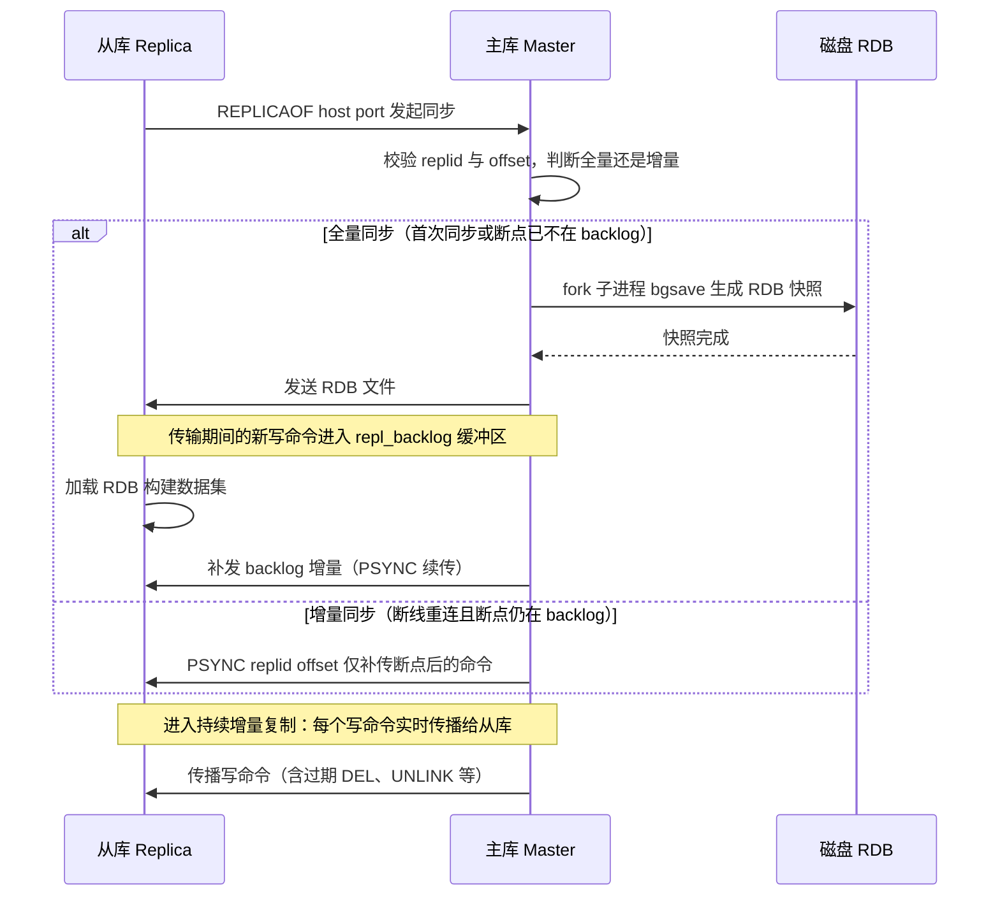
```mermaid
sequenceDiagram
    participant R as 从库 Replica
    participant M as 主库 Master
    participant D as 磁盘 RDB

    R->>M: REPLICAOF host port 发起同步
    M->>M: 校验 replid 与 offset，判断全量还是增量
    alt 全量同步（首次同步或断点已不在 backlog）
        M->>D: fork 子进程 bgsave 生成 RDB 快照
        D-->>M: 快照完成
        M->>R: 发送 RDB 文件
        Note over M,R: 传输期间的新写命令进入 repl_backlog 缓冲区
        R->>R: 加载 RDB 构建数据集
        M->>R: 补发 backlog 增量（PSYNC 续传）
    else 增量同步（断线重连且断点仍在 backlog）
        M->>R: PSYNC replid offset 仅补传断点后的命令
    end
    Note over M,R: 进入持续增量复制：每个写命令实时传播给从库
    M->>R: 传播写命令（含过期 DEL、UNLINK 等）
```

### 5.2 哨兵（Sentinel）：原理与选举

- 组成：Sentinel 集群（奇数台，≥3）监控主从；**主观下线**（单个 sentinel 认为不可达，`down-after-milliseconds` 超时）→ **客观下线**（quorum 个 sentinel 同意）→ **选举 leader sentinel**（Raft 类似：竞选 epoch 递增、多数派投票）→ leader 执行故障转移：选新主（优先级→复制偏移量→runid）→ 通知其他从库改挂新主 → 通知客户端（pub/sub `+switch-master`）。
- 为什么至少 3 台：客观下线需要 quorum，2 台时一台挂掉可能凑不齐多数派（脑裂保护）。
- **脑裂与数据丢失**（必考）：主库与哨兵网络分区，哨兵把从库提升为新主；期间客户端仍在写**旧主**，旧主恢复后变成新主的从库，**分区期间的写入全部丢失**。
- 解法（`min-replicas-to-write` + `min-replicas-max-lag`）：旧主检测到从库失联（lag 超阈值）就**拒绝写入**——用可用性换一致性，把丢失窗口压缩到"分区瞬间到检测生效"之间。

> 图示：哨兵故障转移完整流程

```mermaid
flowchart TD
    A[Sentinel 集群监控主库] --> B{主库心跳超时<br/>down-after-milliseconds}
    B -- 否 --> A
    B -- 是 --> C[主观下线<br/>单个 Sentinel 的判定]
    C --> D{quorum 个 Sentinel 同意?}
    D -- 否 --> A
    D -- 是 --> E[客观下线]
    E --> F[选举 leader Sentinel<br/>Raft 式：竞选 epoch 递增 + 多数派投票]
    F --> G[leader 执行故障转移]
    G --> H[选新主：优先级 → 复制偏移量 → runid]
    H --> I[通知其他从库改挂新主]
    I --> J[pub/sub 广播 +switch-master 通知客户端]
    J --> K[旧主恢复后降级为新主的从库<br/>全量同步补齐数据]
    J --> L{脑裂防护：min-replicas-to-write + max-lag}
    L --> M[旧主检测到从库失联 lag 超限<br/>拒绝写入 压缩丢失窗口]
```

### 5.3 Cluster：哈希槽与重定向

- 结构：**16384 个槽**，`CRC16(key) % 16384` 定位；节点各负责一段槽区间；每个 key 只会落在一个节点（无副本概念上的分片，副本是 slot 的 slave）。
- 为什么 16384：集群心跳 gossip 消息带**槽位 bitmap**，16384 位 = 2KB，消息小；且集群规模上限约 1000 节点（官方建议），16384 槽足够均分；若用 65536，心跳包 8KB 太浪费（这是官方在 redis.conf 注释里的原话逻辑，待核实原话）。
- **MOVED 与 ASK**（必考区别）：
  - MOVED：槽已**永久迁移**到另一节点 → 客户端收到后**更新本地槽映射**，下次直连新节点（3 参数：`MOVED 槽号 目标ip:port`）；
  - ASK：槽**正在迁移中**，目标节点只有部分 key → 客户端发 `ASKING` 后再请求（只影响本次请求，不更新映射）。
- 客户端要求：**Smart Client**（如 JedisCluster/Lettuce）本地缓存槽映射；普通客户端遇 MOVED 需自实现重定向逻辑。
- 集群扩容/缩容：`CLUSTER SETSLOT`/redis-cli `--cluster reshard` 迁移槽（逐 key 迁移，迁移期间 ASK 兜底）；**热点 key 问题**：某 key 极热时单节点打满，解法：加后缀拆 key（`hotkey:0..N`）做本地聚合，或读写分离（副本分担读）。
- 故障转移：从节点检测主节点客观下线（集群内 gossip + 多数派）→ 从节点发起选举（纪元+多数派投票）→ 提升为主，**槽位接管**；无从节点的主挂了 → 槽不可用，集群部分失败（`cluster-require-full-coverage` 默认 yes 时整个集群拒绝服务——生产常改为 no）。
- 一致性：集群复制默认**异步**，主写成功即返回，从库可能滞后——与单机主从的丢数据窗口同理。

### 5.4 复制的一致性级别与 WAIT 命令

- Redis 原生复制是**异步**的（主库不等待从库确认）；与 MySQL 半同步的对应物是 **`WAIT numreplicas timeout`** 命令：主库执行后**阻塞等待至少 N 个从库确认已收到该写入**，超时返回实际确认数。用 `WAIT 1 1000` 可把单条关键写变成"半同步"语义。
- 适用边界：WAIT 是**尽力而为**（从库确认的只是"收到"，不保证已应用；主库宕机时已确认的从库若也丢失仍会丢），且会阻塞主线程——只适合低频关键写，不能当通用强一致方案。
- 一致性等级图谱（面试画线）：异步复制（可能丢）< WAIT 半同步（缩窗口）< 哨兵/集群多数派（可用性优先，极端仍丢）< 外部强一致存储（etcd/ZK）。**Redis 的定位始终是"高性能最终一致"，强一致场景要换存储或接受补偿**。

### 高频面试题

**Q10：Redis Cluster 的 MOVED 和 ASK 有什么区别？客户端分别怎么处理？**
A：MOVED = 槽归属已变（永久），客户端必须更新本地槽表并重试到新节点，否则每次请求都多一次跳转；ASK = 槽迁移中（临时），目标节点可能没有该 key，客户端带 `ASKING` 请求，**不更新槽表**（因为迁移没完成）。判断标准：**槽迁移完成后发 MOVED，迁移过程中发 ASK**。**面试官追问**：为什么要有 ASK 而不是迁移完再对外服务？——答：槽迁移是逐 key 的，可能耗时很久，期间 key 散落在新旧节点；ASK 让客户端"知道去新节点找，但别以为槽已经归新节点"，保证迁移期间读写可用——这是在线迁移的标准协议设计。

**Q11：哨兵模式下，主库和哨兵网络分区，会发生什么？怎么防丢数据？**
A：见 5.2 脑裂。分区后哨兵提升新主，客户端写旧主的数据在新主接管后丢失（旧主恢复后全量同步被覆盖）。防丢：`min-replicas-to-write 1` + `min-replicas-max-lag 10`——旧主发现没有从库能同步（lag 超限）就拒写。代价：分区期间可用性下降（宁可拒绝写入也不丢数据），这是 CAP 里 CP 的选择，业务要接受。**面试官追问**：这个配置能 100% 不丢吗？——答：不能，只能把窗口缩到"分区瞬间～旧主检测到 lag 超限"之间（秒级）；要更强的保证需客户端侧配合（写入前确认主库身份，成本高），或接受"极端场景秒级丢失"的 SLA。

**Q12：Cluster 的 key 都分布均匀吗？热点 key 怎么办？**
A：槽位是 CRC16 取模，**key 分布均匀但访问可能不均匀**（热搜词、爆款商品）。解法四板斧：① 拆 key：热点拆成 `hot:0..N` 分散到多节点，读端聚合（适合读多写少）；② 副本分担读：从节点只读（`READONLY` 命令，Cluster 下默认读主）；③ 本地缓存：JVM 缓存热点，超短 TTL；④ 监控定位：`--hotkeys`（需 LFU 策略）或客户端统计。架构师答案：热点治理是"发现（监控）→ 拆散（key 拆分/本地缓存）→ 兜底（限流降级）"三步闭环。

---

## 六、缓存三大问题

### 6.1 穿透 / 击穿 / 雪崩（定义+解法一张表）

| 问题 | 定义 | 核心解法 |
|---|---|---|
| 穿透 | 查**不存在**的 key，缓存永远不命中，请求打到 DB | ① 布隆过滤器前置拦截；② 缓存空值（TTL 短，如 60s，防恶意打爆） |
| 击穿 | 某个**热点 key** 过期瞬间，大量请求同时打到 DB | ① 互斥锁重建（只放一个线程回源，其余等待/降级）；② 逻辑过期（value 里带过期时间，异步刷新） |
| 雪崩 | **大量 key 同时过期**或 Redis 整体宕机，DB 被打爆 | ① TTL 加随机抖动；② 多级缓存（本地+Redis）；③ 熔断/限流/降级；④ 高可用（主从/集群） |

> 图示：缓存穿透 / 击穿 / 雪崩三种场景与解法

```mermaid
flowchart TD
    A[客户端请求] --> B{缓存命中?}
    B -- 是 --> C[直接返回缓存值]
    B -- 否 --> D{请求的 key 真实存在?}
    D -- 否 --> E[穿透：不存在 key 反复打 DB]
    E --> E1[解法1：布隆过滤器前置拦截]
    E --> E2[解法2：缓存空值 TTL 60s]
    D -- 是 --> F{单个热点 key 过期瞬间?}
    F -- 是 --> G[击穿：热点 key 过期 并发放大到 DB]
    G --> G1[解法1：互斥锁重建 只放一个线程回源]
    G --> G2[解法2：逻辑过期 返回旧值 + 异步刷新]
    F -- 否 --> H{大量 key 同时过期或实例宕机?}
    H -- 是 --> I[雪崩：DB 被瞬间打爆]
    I --> I1[解法1：TTL 加随机抖动 错峰过期]
    I --> I2[解法2：多级缓存 本地 + Redis]
    I --> I3[解法3：熔断 / 限流 / 降级]
    I --> I4[解法4：高可用 主从 / 集群]
```

### 6.2 布隆过滤器（原理必讲）

- 结构：m 位 bit 数组 + k 个独立哈希函数。插入：k 个位置置 1；查询：k 个位置**全为 1 才可能存在**。
- 特性：**不存在一定准确**（有 0 位可证伪），**存在可能误判**（哈希碰撞/位被其他元素占用）；不可删除（除非计数布隆）。
- 参数：误判率 p 与位数组大小 m、哈希数 k 的关系：`m = -n·ln p / (ln2)²`，`k = (m/n)·ln2`（n 为预期元素数）。
- 工程实现：Redis `redisbloom` 模块、Guava `BloomFilter`（JVM 内）、或自建位图（`SETBIT`+多个 hash）。
- 适用：ID 存在性预检（防穿透）、URL 去重、黑名单。**坑**：误判会把"合法请求"误杀（罕见，可用缓存空值兜底）；元素量预估不准导致误判率飙升。

### 6.3 互斥锁重建与逻辑过期（击穿的标准解）

```java
// 互斥锁重建（伪代码）
String v = redis.get(key);
if (v == null) {
    String lock = redis.set("lock:" + key, "1", "NX", "EX", 3);
    if (lock != null) {
        v = db.query(key);            // 只有拿到锁的线程回源
        redis.set(key, v, 300);
        redis.del("lock:" + key);
    } else {
        Thread.sleep(50); return redis.get(key); // 其他线程自旋等待
    }
}
```

```java
// 逻辑过期：value = {data, expireAt}；读时发现逻辑过期 → 返回旧值 + 异步线程回源刷新
// 优点：不阻塞读；缺点：短暂返回过期数据（最终一致），适合可容忍陈旧的热点
```

### 高频面试题

**Q13：缓存穿透的布隆过滤器和缓存空值，为什么通常两个都用？**
A：布隆过滤器挡"明显不存在的 key"（恶意随机 ID），成本低、不污染缓存；但误判会放行少量不存在请求，且**新增合法 ID 要同步更新过滤器**（遗漏就误杀）。缓存空值兜底"过滤器放行的漏网之鱼"，且对"曾经存在后来删除"的 key 有效（过滤器无法感知删除）。两者互补：**过滤器做第一道粗筛，空值缓存做第二道细筛**。**面试官追问**：缓存空值的坑？——答：空值 TTL 太短会被反复打 DB，太长会掩盖"数据真实出现"（用户注册后仍查到空值），且大量空值占内存——TTL 60s 级 + 空值 key 数量监控。

**Q14：击穿和雪崩的本质区别？为什么解法不同？**
A：击穿是**单个热点 key** 过期瞬间的并发放大（并发打到同一行）；雪崩是**大量 key 同时过期或实例不可用**（整体打穿）。所以击穿用"互斥重建/逻辑过期"（锁住单 key 回源）；雪崩用"TTL 抖动/多级缓存/熔断"（错峰+降级）。两者可叠加发生（热点 key 恰好在雪崩窗口过期），治理要同时上。**面试官追问**：Redis 整体宕机时，本地缓存（Caffeine）能救吗？——答：能缓解读，但**本地缓存一致性难保证**（多实例各自缓存，更新要广播失效）、容量小；宕机期正确姿势是"本地缓存+限流降级+快速恢复"，而不是让本地缓存扛全部流量。

---

## 七、分布式锁

### 7.1 SETNX 的演进

- 原始：`SETNX key value`（有则失败）→ 问题：无过期时间，**死锁**（持有者崩溃锁永不释放）。
- 演进 1：`SETNX` + `EXPIRE` 两步 → 问题：两步非原子，**SETNX 后 EXPIRE 前崩溃**依然死锁。
- 演进 2（2.6.12+）：**`SET key value NX EX seconds` 原子一条** → 解决死锁；value 用唯一标识（UUID/线程 id）——**解锁时必须校验 value 是自己**（防误删他人锁：A 超时释放后 B 加锁，A 的 DEL 把 B 的锁删了）。
- 演进 3：解锁校验+删除必须原子 → **Lua 脚本**（见第八章）：
```lua
-- 解锁脚本（Redisson 同款逻辑）
if redis.call('get', KEYS[1]) == ARGV[1] then
    return redis.call('del', KEYS[1])
else
    return 0
end
```

### 7.2 Redisson 看门狗（Watchdog）源码原理

- 加锁：`tryLock(waitTime, leaseTime, unit)`；**不传 leaseTime 时**走看门狗：默认锁 30s（`lockWatchdogTimeout`），**后台调度线程每 10s（timeout/3）续期一次**（Lua 里 `PEXPIRE` 重置），直到业务显式 unlock。
- 续期是"持有者活着就续"——**防业务执行超过锁时间导致锁提前失效**（锁失效 → 并发进入临界区）。
- 传了 leaseTime 则不启动看门狗（固定过期，业务要自己保证执行时间 < leaseTime，否则并发漏洞）。
- 源码要点（Redisson `RedissonLock`）：`tryAcquireAsync` → `scheduleExpirationRenewal`（`Timeout` 任务递归 `renewExpiration`）；续期 Lua 校验 value 是自身才 PEXPIRE——与解锁同款"校验+操作原子"。
- 分布式锁的底层一致性：单主 Redis 下，锁记录在主节点，**主节点宕机切换后锁可能丢失**（新主无锁记录）→ 别人能加锁 → 互斥失效。

> 图示：Redisson 分布式锁加锁与看门狗续期时序

```mermaid
sequenceDiagram
    participant C as 业务线程
    participant R as Redisson 客户端
    participant M as Redis 主节点

    C->>R: tryLock(waitTime, 不传 leaseTime)
    R->>M: Lua 原子执行 SET lock key UUID NX PX 30000
    alt 加锁成功
        M-->>R: 成功
        R->>R: 启动看门狗 scheduleExpirationRenewal
        loop 每 10s 续期一次（timeout/3）
            R->>M: Lua 校验 value == UUID 后 PEXPIRE 30000
            M-->>R: 续期成功
        end
        C->>C: 执行业务临界区代码
        C->>R: unlock 释放锁
        R->>M: Lua 校验 value == UUID 后 DEL
        M-->>R: 删除成功
        R->>R: 取消看门狗续期任务
    else 加锁失败（锁被他人持有）
        M-->>R: 失败
        R-->>C: 返回 null 业务自旋等待或降级
    end
```

### 7.3 红锁（RedLock）争议（架构师必知双方观点）

- RedLock（antirez 提出）：在 **N（5）个独立 Redis 实例**上加锁，**多数派（≥3）成功且总耗时 < 锁有效期**才算加锁成功；释放时向全部实例发 DEL。目标：容忍部分实例故障。
- **Martin Kleppmann 的批评**（《How to do distributed locking》）：① **GC/STW 暂停**：持有者暂停超过锁 TTL → 锁过期 → 别人加锁 → 原持有者恢复后继续写 → 临界区并发；② **时钟跳跃**：依赖过期时间，时钟回拨/漂移破坏语义；③ RedLock 需要时钟同步假设，且故障窗口并未真正消除——他认为分布式锁的正确姿势是 **fencing token**（锁服务颁发单调递增令牌，写操作带令牌，存储端校验）。
- antirez 的回应：fencing token 要求存储端配合改造（多数系统做不到）；RedLock 在合理假设（时钟误差有界、进程暂停可检测）下已满足工程需求。
- 工程结论：**绝大业务用单主 Redis 锁（SET NX EX + 看门狗）就够**，因为业务通常"可容忍极小概率并发"；要求严格的用 **ZooKeeper/etcd 锁**（临时顺序节点，会话机制天然处理崩溃，无 TTL 竞态），或 RedLock（很少见，复杂且争议大）。**能复述双方论点并给出工程判断，是架构师题的满分答案**。

### 7.4 Redis 锁 vs ZK 锁对比

| 维度 | Redis（SET NX EX） | ZooKeeper（临时顺序节点） |
|---|---|---|
| 实现 | 简单，性能高 | 会话+顺序节点+watch，中等 |
| 崩溃释放 | TTL 兜底（可能误杀长任务/延迟释放） | 会话超时自动删除（无 TTL 误杀，但有会话超时窗口） |
| 公平性 | 无（抢锁） | 顺序节点天然 FIFO 公平 |
| 可重入 | 需自己实现（Redisson 用 hash 计数） | 需自己实现（重新创建节点或记录） |
| 一致性 | 主从异步，切换可能丢锁 | ZAB 多数派，强一致 |
| 适用 | 性能敏感、可容忍极小概率并发 | 严格互斥（配置中心、选主、分布式任务调度） |

### 高频面试题

**Q15：分布式锁的 value 为什么要用唯一标识？解锁为什么要 Lua？**
A：value=唯一标识（UUID）用于"确认锁是自己的"：A 持锁超时，B 加锁成功，此时 A 的 DEL 若不带校验会删掉 B 的锁（误删 → B 的临界区无锁保护）。校验+删除必须原子：get 与 del 两步之间有窗口（校验通过后、del 前被抢占），Lua 脚本在 Redis 单线程内原子执行，杜绝窗口。**面试官追问**：看门狗续期会不会有"续期线程挂了锁却还在"的问题？——答：会，业务进程卡死（Full GC/线程池耗尽）时看门狗也停，锁到期自动释放——这**恰好是设计意图**（进程不健康就让锁失效，避免永久死锁）；代价是进程"假死"期间锁可能被他人获取，业务要幂等兜底。

**Q16：RedLock 到底能不能用？你会在什么场景用它？**
A：能用但有前提。可用场景：多机房容灾、对"锁必须绝对互斥"有要求的金融类操作（且接受其复杂性与时钟假设）；不推荐场景：绝大多数业务缓存/限流类（单主锁+看门狗足够，RedLock 的复杂度引入新故障面——5 个实例的运维、网络分区时多数派不可达=锁不可用）。我的工程判断：**先问业务能否容忍极小概率的互斥失效，能 → 单主 Redis 锁；不能 → ZK/etcd 而不是 RedLock**。**面试官追问**：fencing token 是什么？——答：锁服务每次成功加锁颁发递增 token，写操作携带 token，存储端拒绝旧 token 的写——即使锁已过期，旧持有者的写也会被存储拒绝，从数据层面保证安全；代价是存储端要支持校验（Redis 需改造，DB 可用版本号实现）。

---

## 八、事务与 Lua 脚本

### 8.1 MULTI / EXEC / WATCH

- `MULTI` 开启队列 → 命令入队不执行 → `EXEC` 依次执行。**不保证原子性**：某条命令执行报错（运行时错误，如类型错误），**后续命令继续执行**（不回滚）——与 MySQL 事务的语义完全不同。
- 排他性：EXEC 期间 Redis 单线程执行整个队列，**期间不会有其他命令插入**（这是"隔离性"）。
- `WATCH`（乐观锁 CAS）：`WATCH key` 后若 key 被其他客户端修改，`EXEC` 返回 nil（事务放弃），需重试——实现基于客户端会话的 watched_keys 与事务执行前的版本比对（`touchWatchedKey`）。
- 为什么不做回滚：官方观点——命令错误应在开发期暴露（语法错入队即报），运行时错误极少；回滚复杂度与收益不成比例。面试引用官方这句原话很加分。

### 8.2 Lua 脚本（EVAL）

- `EVAL script numkeys key... arg...`：脚本整体**原子执行**（单线程内跑完），天然事务；且**减少 RTT**（多次 Redis 操作一次网络往返）。
- 用途：解锁校验+删除、限流（滑动窗口计数）、库存扣减、批量 compare-and-set。
- 7.0 **Functions**：脚本可管理（`FUNCTION LOAD`）、持久化、主从自动同步——解决 EVAL 脚本"重启丢失、多客户端难维护"的问题。
- 坑：① 脚本里**禁止使用随机/非确定性命令**（`TIME`、`RANDOMKEY`）或依赖当前时间的运算（主从复制时从库结果不一致）；② 脚本内慎用大循环（阻塞整个 Redis）；③ 脚本执行期间其他命令排队，长脚本=长阻塞。

### 高频面试题

**Q17：Redis 事务和 Lua 的区别？什么时候用哪个？**
A：两者都"原子执行一段命令序列"，但：MULTI/EXEC 无回滚、无逻辑（不能根据中间结果分支）；Lua 有完整编程能力（条件/循环/返回值），还能减少 RTT。选型：简单"多条命令打包原子执行"用 MULTI；**需要条件判断或复合操作**（解锁校验、库存扣减防超卖）用 Lua。**面试官追问**：WATCH 和 Lua 都能做 CAS，区别？——答：WATCH 是"乐观重试"（失败要业务重试，多轮 RTT）；Lua 把"检查+执行"放进脚本原子完成，一次调用、无重试窗口。高并发下 Lua 优于 WATCH+重试。

**Q18：库存扣减怎么用 Redis+Lua 防超卖？扣完怎么和 DB 对账？**
A：Lua 原子执行：`if GET stock > 0 then DECR stock; return 1 else return 0`。防超卖靠原子性（检查+扣减不可分割）。但 Redis 库存与 DB 库存是两套数据，最终一致：方案① 扣 Redis 成功 → 发 MQ → 异步扣 DB → 失败补偿回滚 Redis（幂等）；方案② Redis 只做"预扣+限流"，DB 才是最终库存，定时对账脚本校正偏差。**面试官追问**：Redis 宕机库存丢了怎么办？——答：启动时从 DB 加载库存到 Redis（或持久化+主从），扣减期间 Redis 不可用则降级直连 DB（限流保护）；对账脚本是最后防线——分布式系统的账必须能"算平"。

---

## 九、大 key / 热 key 治理与缓存一致性

### 9.1 大 key 治理

- 危害四连：① **阻塞**：大 key 序列化/网络传输耗时，单线程模型下阻塞其他命令；② **内存**：COW 放大 fork 成本、内存碎片；③ **数据倾斜**：Cluster 下单节点打满；④ **删除阻塞**：`DEL` 大 key 是 O(n)，同步删除阻塞主线程——用 `UNLINK`（异步删除，后台线程回收）。
- 定位：`redis-cli --bigkeys`（按类型扫最大 key）、`MEMORY USAGE key`（精确内存，4.0+）、`DEBUG OBJECT`（旧）。
- 治理：① 拆分：大 hash 按 field 拆桶（`user:1:0..N`）、大 list 按时间分片、大 string 压缩/对象化；② 换结构：大 set 换多小 set + `SUNION` 聚合（慎用）；③ 限流写入：控制单 key 上限（如 string ≤10KB，hash ≤5000 field）；④ 删除用 `UNLINK` + 错峰。

### 9.2 热 key 治理

- 定位：`--hotkeys`（需 LFU 策略）、客户端/代理统计、`MONITOR` 抽样（生产慎用）。
- 解法：① 本地缓存（Caffeine/Guava）扛读；② key 拆散（`hot:0..N` 随机后缀，读端聚合）；③ 副本读（Cluster `READONLY` 从节点分担）；④ 多级缓存+限流兜底。

### 9.3 缓存一致性（架构师核心题）

**Cache Aside（旁路缓存）是唯一被广泛接受的基线**：读 miss 回源 DB 并写缓存；更新时**先更 DB，再删缓存**（而不是更新缓存）。

- 为什么"更新缓存"不行：并发写场景下"先写 DB 再写缓存"与"先写缓存再写 DB"都可能在回写顺序交错时留下旧值（A 写 10、B 写 20，缓存最终可能是 10）；而**删缓存**让下一次读强制回源，天然自愈。
- 为什么"先删缓存再更 DB"不行：删缓存 → 读线程回源读到旧值并写回缓存 → 缓存又变旧（在 DB 更新完成前）→ 永久脏。
- **延迟双删**：先删缓存 → 更 DB → **sleep 一小段（如 500ms）再删一次**——把"读线程写回旧值"的窗口再清一次；代价是短暂缓存 miss 和双删的复杂度，且 sleep 时长难定（读线程写回窗口取决于慢查询）。工程上更稳的是"**更 DB + 删缓存 + 对账/版本号**"。
- **binlog 订阅（Canal）**：更 DB 后不主动删缓存，由 Canal 订阅 binlog 解析变更 → 发 MQ → 消费删缓存/刷新。优点：业务无侵入、不依赖业务代码正确性（**DB 是唯一事实源**）；缺点：引入 Canal+MQ 链路，延迟毫秒~秒级，需幂等与失败重试（删缓存失败要有重试队列）。
- 三种路线对比：Cache Aside 直接删（简单，有窗口）、延迟双删（窗口缩小，仍不绝对）、binlog 订阅（业务无侵入，最终一致，链路长）。
- 一致性与可用性的最终答案：**接受最终一致** + 对账任务兜底（定期比对 DB 与缓存/旁路统计），是生产级方案；强一致只能靠"读写都走 DB 或分布式事务"，缓存只能做加速不能做事实源。

> 图示：缓存一致性 - 延迟双删时序

```mermaid
sequenceDiagram
    participant W as 写线程
    participant C as Redis 缓存
    participant D as MySQL
    participant R as 读线程

    W->>C: ① 删除缓存
    C-->>W: OK
    W->>D: ② 更新数据库并提交
    D-->>W: 提交成功
    Note over R,C: ③ 窗口期：读线程回源可能读到旧值并写回缓存
    R->>D: 读 DB
    R->>C: 把旧值写回缓存
    W->>W: ④ sleep 500ms~1s 覆盖读线程写回窗口
    W->>C: ⑤ 再次删除缓存
    C-->>W: OK
    Note over R,C: 下次读强制回源 收敛到 DB 最新值
```

### 高频面试题

**Q19：更新数据库后，为什么是"删缓存"而不是"更新缓存"？**
A：两个理由：① 更新缓存存在**回写顺序竞态**：A/B 并发写，缓存最终值取决于回写顺序而非 DB 提交顺序，可能留下旧值；删缓存则下一次读强制回源，天然收敛到 DB 最新值；② 缓存可能存的是**聚合/冗余数据**（如"商品详情=商品+库存+评价数"），一次 DB 更新影响多个缓存键，精确更新成本高、易漏——删除让缓存自愈更简单。**面试官追问**：删缓存失败怎么办？——答：删除失败=缓存永久旧。解法：① 删除重试（本地重试队列/MQ 兜底）；② 缓存加短 TTL 兜底（过期自愈）；③ binlog 订阅方式删除（不依赖业务代码成功与否）。

**Q20：延迟双删的 sleep 时间怎么定？它真的可靠吗？**
A：sleep 要大于"读线程回源+写回缓存"的最坏耗时（慢查询、网络抖动），经验值 500ms~1s，但**无法证明覆盖所有极端情况**（GC 暂停、超长慢查询）——所以延迟双删是"缩小窗口"而非"消除窗口"的工程妥协。可靠方案是版本号/时间戳：缓存 value 带版本，写回时版本比 DB 旧则丢弃；或 binlog 订阅把删除动作与业务代码解耦。**面试官追问**：业务能接受短暂读到旧数据吗？——答：绝大多数业务能（商品价格、库存的秒级陈旧可接受），不能的（支付状态、配置下发）要**读时校验**（读 DB 或强一致通道），并明确写进架构文档——一致性等级是业务决策，不是技术决策。

---

## 十、高频面试题合集

**Q21：Redis 和 Memcached 怎么选？（经典送命题）**
A：Memcached 只有 KV、纯内存（重启全丢）、多线程、一致性哈希；Redis 数据结构丰富（list/hash/zset/bitmap/geo/stream）、持久化、主从/集群、Lua/事务/发布订阅。选型结论：**Redis 全面胜出，Memcached 仅剩"超大 value 纯缓存"等小众场景**。面试加分点：Memcached 的**多线程**模型说明"多线程不必然快"——它的瓶颈在内存带宽与锁，Redis 单线程+精简数据结构在典型缓存负载下反而更高；但 Redis 也有**内存效率**短板（同数据 Redis 占用常高于 Memcached，因为数据结构元数据），所以纯大 value 缓存场景 Memcached 仍有理由。

**Q22：Redis 会丢数据吗？丢在哪几个环节？（全链路盘点）**
A：① AOF 刷盘：everysec 丢 ≤1s（always 不丢）；② RDB 周期：两次快照间全丢（无 AOF 时）；③ 主从异步复制：主库已返回成功但从库未同步，主挂即丢（半同步可缓解）；④ 哨兵/集群脑裂：分区期间写旧主的数据丢（min-replicas 缓解）；⑤ 内存淘汰：maxmemory 打满后淘汰策略主动丢；⑥ 进程崩溃：内存数据全丢（靠持久化恢复）。**面试官追问**：业务上怎么设计才能"尽量不丢"？——答：AOF always 或 everysec+主从多副本+哨兵/集群+min-replicas 配置+定期备份，并且**关键数据以 DB 为准、Redis 只做加速**——架构上不要把 Redis 当唯一存储。

**Q23：Redis 的过期删除和内存淘汰是一回事吗？**
A：不是。**过期删除**针对"设置了 TTL 的 key"，目标是把过期数据清掉（惰性+定期），是数据生命周期的必然；**内存淘汰**在 `maxmemory` 打满时触发，按策略（LRU/LFU/random/ttl）选 key 删，**与是否过期无关**（allkeys 系会删永不过期的 key）。关系：两者都删 key，但触发条件、选择逻辑、目标完全不同。**面试官追问**：过期 key 还没被删，会被淘汰策略选中吗？——答：会，volatile 系策略的候选集就是"带 TTL 的 key"（含已过期未删的），它们会优先被淘汰——所以淘汰和过期在 volatile 场景有交集。

**Q24：什么是缓存击穿的"互斥锁"方案？和分布式锁什么关系？**
A：击穿互斥锁就是**分布式锁的应用**：热点 key 过期瞬间，只允许一个线程（拿到 Redis SET NX EX 锁的）回源 DB 并重建缓存，其他线程短暂等待或直接返回旧值（逻辑过期方案）。它和第七章的分布式锁是同一套机制（SET NX EX + 唯一 value + Lua 释放），只是用途是"重建保护"而非"互斥访问"。注意：重建锁的 TTL 要覆盖 DB 查询耗时，否则锁先失效会放行多个回源线程——实战中锁 TTL 设置不当是击穿治理失效的第一原因。

**Q25：Redis 的 Stream 和 Kafka 怎么选？（消息场景）**
A：Stream 是 Redis 5.0 引入的消息结构（消费者组、ACK、Pending 列表、`XREADGROUP`）；Kafka 是专业消息队列（分区副本、顺序保证、海量积压、多语言生态）。选型：**轻量级、低延迟、与业务同机房的内部事件**（如订单状态变更联动）用 Stream（无额外组件、天然复用 Redis 高可用）；**需要积压、削峰、跨团队解耦、Exactly-Once 语义**用 Kafka。判断标准：消息量、积压容忍度、投递语义、运维成本。**面试官追问**：Stream 的消费者组和 Kafka 的分区消费有什么区别？——答：Stream 的组内消息是**广播给所有消费者竞争消费**（每个消息只被组内一个消费者处理），靠 Pending 列表做 at-least-once 与故障恢复（`XCLAIM` 认领）；Kafka 是分区级分配（每个分区同一时刻只归一个消费者），顺序保证依赖分区内有序。Stream 没有 Kafka 的"分区内严格有序+积压无限"能力，积压大时 Stream 的内存/磁盘压力是硬伤。

**Q26：一个 key 的 value 是 5MB 的 JSON，读 QPS 1 万，有什么问题？怎么优化？**
A：问题：① 单线程模型下 5MB 序列化+网络传输每次耗时毫秒级，1 万 QPS 直接打满带宽与 CPU，其他命令被拖慢；② COW/fork 成本放大；③ 网络带宽成为瓶颈。优化：① **拆 key**：按字段拆多个小 key（hash 结构），只读需要的字段；② **压缩**：value 用 gzip/zstd 压缩（CPU 换带宽；Redis 官方无内置 value 压缩，需业务侧压缩或模块支持，待核实 7.x 是否有内置进展）；③ 本地缓存：热点数据 JVM 缓存，减少 Redis 读；④ 协议层：pipeline/batch 减少 RTT。面试答到"拆 key + 压缩 + 本地缓存"三板斧即可。

**Q27：Redis 集群为什么是 16384 个槽而不是更多？**
A：官方理由：① **心跳消息体积**：gossip 消息携带全量槽位 bitmap（2KB = 16384/8），65536 槽则 8KB，网络开销大；② **集群规模**：官方建议 ≤1000 节点，16384 槽足够细粒度均分，槽太多迁移/管理成本上升；③ 16384 是 2 的幂（CRC16 是 16 位算法，取模 16384 保留低 14 位，配合 key hash 的散列性）。**面试官追问**：为什么不是 8192？——答：节点数增多（如 1000 节点）时 8192 槽均分粒度太粗（每节点 8 个槽），reshard 不平衡；16384 是"消息体积与分片粒度"的工程折中。

**Q28：你们公司 Redis 挂了 10 分钟，你作为负责人怎么复盘？**
A：复盘框架（SRE 视角）：① 时间线：故障发现（监控告警延迟）→ 定位（慢日志/大 key/内存淘汰/网络）→ 恢复（切主/重启/降级）；② 根因五问：大 key？慢命令？内存打满淘汰风暴？主从切换丢写？网络分区脑裂？；③ 止损：降级开关（读本地缓存/直连 DB 限流）、熔断；④ 长期：容量水位监控（内存 >70% 告警）、大 key 治理常态化、`unlink` 替换 `del`、读写分离降载、故障演练。**面试官追问**：为什么很多 Redis 故障是"慢"而不是"挂"？——答：单线程模型下任何 O(n) 操作（KEYS、大 key DEL/序列化、AOF rewrite 与主线程竞争）都会让"看起来活着但所有命令超时"，比宕机更难排查——监控要盯 `latest_fork_usec`、`instantaneous_ops_per_sec`、慢日志、内存水位，而不是只看存活。

**Q29：Redis 的 pipeline 和事务有什么区别？能提升多少性能？**
A：pipeline 是**客户端侧**优化：多条命令一次发送、一次收包，减少 RTT（网络往返），但**服务端仍逐条执行、不保证原子**；MULTI/EXEC 是**服务端**语义：排队后原子执行（单线程内不被插入）。两者可叠加（pipeline 发 MULTI 块）。性能：RTT 主导的场景（跨机房、高延迟链路）pipeline 可提升 10 倍+；本机回环提升有限。**面试官追问**：pipeline 的坑？——答：① 命令太多时单次发送包过大、输出缓冲堆积（要分批）；② 失败命令不回滚（无事务语义）；③ 中间某条出错后续照常执行，业务要自行处理部分成功。

**Q30：什么是"缓存降级"？设计降级开关要注意什么？**
A：降级=缓存/依赖不可用时，系统**主动放弃部分功能或数据精度**保证核心链路可用。Redis 场景：Redis 不可用 → 读直连 DB（限流保护）或返回本地缓存旧值；写走本地队列异步补偿。设计注意：① **开关要分级**（核心/非核心、读/写、百分比灰度），不能只有"全开全关"；② 降级后的行为要可观测（降级日志、指标打点）；③ 降级要能**自动恢复**（探活+半开）而不是人工值班；④ 降级路径本身要限流（DB 直连路径是新的风险点）。**面试官追问**：降级和熔断的区别？——答：熔断是**调用方**对依赖故障的快速失败机制（错误率阈值触发，半开试探恢复）；降级是**业务策略**（主动放弃非核心能力）。熔断是降级的一种实现手段，常组合使用。

---

## 考点速查表

| 考点 | 一句话要点 |
|---|---|
| SDS | len 字段 O(1) 长度+二进制安全；预分配（<1MB 翻倍，≥1MB +1MB）+惰性释放 |
| dict 渐进式 rehash | 双表 ht[0]/ht[1]，每次操作搬一桶+定时兜底；子进程存在时强制负载因子 5 才扩容 |
| ziplist→listpack | ziplist 连锁更新（prevlen 级联）；listpack 尾置 len 消除连锁更新，7.0 全面替换 |
| 跳表 | zset=dict+跳表；span 字段支撑 ZRANK O(log n)；MAXLEVEL 32，p=0.25 |
| intset | 有序整数数组，按需升级（只升不降），小整数集合省内存 |
| 单线程四要素 | 内存+定制数据结构+epoll 多路复用+免锁；瓶颈在网络 IO 与内存 |
| 6.0 多线程 IO | 只并行读写 socket/协议解析，命令执行仍单线程；io-threads 默认关闭 |
| KEYS 事故 | O(n) 阻塞单线程；用 SCAN（弱一致、可能重复但不漏） |
| RDB | fork+COW 全量快照；恢复快、丢数据多；fork 耗时与内存成正比 |
| AOF | 追加命令日志；always/everysec/no；rewrite 重写压缩；4.0 混合持久化（RDB 头+AOF 尾） |
| 大 key 与 fork | 页表复制阻塞 + COW 内存翻倍风险；内存 >70% 慎 bgsave |
| 删除策略 | 惰性（访问时删）+定期（每秒 10 次随机采样 20 个，25% 比例续删） |
| 淘汰 8 策略 | noeviction/allkeys-lru/lfu/random + volatile 四兄弟；近似 LRU 采样 5 个 |
| 复制 | 全量 RDB+增量 backlog；PSYNC2 断线续传；backlog 太小=频繁全量 |
| 哨兵 | 主观下线→客观下线(quorum)→leader 选举(Raft 式)→故障转移；≥3 台 |
| 脑裂 | 分区期写旧主丢失；min-replicas-to-write+max-lag 拒写保一致性 |
| Cluster | CRC16%16384；心跳 bitmap 2KB 是 16384 的由来；MOVED 永久/ASK 临时 |
| 穿透/击穿/雪崩 | 布隆+空值缓存 / 互斥重建+逻辑过期 / TTL 抖动+多级缓存+熔断 |
| 布隆过滤器 | k 哈希+m 位；不存在必准、存在可能误判、不可删；m=-n·lnp/(ln2)² |
| 分布式锁 | SET NX EX 原子；value 唯一标识+Lua 校验删除；看门狗 30s/10s 续期 |
| 红锁争议 | Kleppmann：GC/时钟破坏 TTL 语义，要 fencing token；antirez：工程假设下可用 |
| Redis vs ZK 锁 | Redis 快但有 TTL 竞态与主从丢锁；ZK 临时顺序节点强一致+公平 |
| 事务 | MULTI 队列执行无回滚；WATCH 乐观 CAS；Lua 原子+可编程+少 RTT |
| 大 key | UNLINK 异步删；拆 key/压缩/限单 key 大小；--bigkeys 扫描 |
| 缓存一致性 | Cache Aside 先更 DB 再删缓存；延迟双删缩窗口；binlog 订阅（Canal）最终一致 |
| 丢数据盘点 | AOF 刷盘/主从异步/脑裂/淘汰/进程崩溃五环节，关键数据以 DB 为准 |

---

# 07 · Elasticsearch 原理与调优

> 适用对象：10+ 年经验的资深工程师 / 架构师候选人。ES 在面试中的定位是「检索/分析型中间件的代表」，考的不是 API 用法，而是：倒排索引为什么快、近实时是怎么换来的、深分页三种方案怎么选、脑裂的演进、以及"MySQL 和 ES 怎么同步才不出事"这类架构题。

**TL;DR 本章学习要点**

1. ES 的快 = Lucene 倒排索引（FST 词典 + 跳表/位图求交）+ 分片并行 + 近实时写入（refresh/translog/flush 三件套），本质是用「最终一致性」换写入吞吐；
2. 写入链路要能画出「协调节点 → 路由 → 主分片 → 副本 → refresh → flush」全流程，translog 是 crash-safe 的唯一屏障；
3. 深分页三件套：from+size 上限 1 万、scroll 只配导出快照、search_after + PIT 才是实时翻页的正解；
4. 脑裂是分布式选举的经典考题：从 Zen discovery 的 minimum_master_nodes 到 7.x 的 voting configuration，演进本身就是答案；
5. 调优优先级：mapping 设计 > 分片规划 > 写入参数 > GC；与 MySQL 同步的标准答案是 Canal→MQ→幂等写 ES，双写只配当过渡方案。

---

## 1. 核心概念

### 1.1 文档、索引、分片与副本

- **文档（Document）**：ES 存储与检索的最小单位，JSON 结构，对应 MySQL 的一行（但 schema-free，靠 mapping 约束）。
- **索引（Index）**：同类文档的集合，对应 MySQL 的一张表。**7.0 起一个索引只能有一个 mapping type**（type 在 6.x 废弃、8.x 移除），因为同索引多 type 共享 Lucene 段、字段冲突难处理，官方顺势砍掉。
- **分片（Shard）**：一个索引被切分为多个分片，**每个分片是一个独立的 Lucene 索引**（完整的倒排索引 + 正排存储）。分片是 ES 并行与分布的基本单位：查询广播到全部分片并行执行，写入路由到单个分片。
- **副本（Replica）**：主分片的完整拷贝。副本分片**只写不读？错——查询时副本同样参与搜索**（协调节点把请求广播到主分片+副本分片，谁快用谁的结果，天然负载均衡）。副本数量可以动态调整，主分片数量建索引后不可改。

**分片数的设计哲学**：分片太多 → 每个分片太小、segment 碎片化、聚合/查询的 fan-out 开销大；分片太少 → 单分片数据量过大、无法水平扩容。官方经验值：**单分片 20~40GB（最佳实践区间，机械盘/SSD 略有差异）**，分片总数（主+副本）控制在节点数的 1~2 倍以内（防止单节点分片过多）。

**版本演进速查（面试谈资，体现"跟得上"）**：

| 版本 | 关键变化 |
|---|---|
| 2.x | Zen discovery 时代，`minimum_master_nodes` 手配防脑裂 |
| 5.x | 默认 5 主分片；BM25 取代 TF-IDF；tiered merge 默认 |
| 6.x | mapping type 开始废弃（单索引单 type）；ILM 雏形（6.6） |
| 7.x | type 移除；默认 1 主分片；voting configuration 重构选举；CCR GA；G1 默认 GC |
| 8.x | `minimum_master_nodes` 彻底移除；内置安全（TLS/认证默认开启） |

### 1.2 倒排索引原理

正排索引是「文档 → 词」；倒排索引反过来，是「词 → 文档列表」。搜索的本质变成：**在词典里查词，再对命中的文档列表做集合运算**。

```
倒排索引结构（Lucene 内部）：
Term Dictionary（词典，内存可加载）
   ├─ 按字典序排序的 term
   └─ 用 FST（Finite State Transducer，有限状态转换器）压缩：共享前缀、构建为最小 DFA
Postings List（倒排列表，磁盘）
   └─ 每个 term 对应：docId 列表 + 词频(tf) + 位置(position) + payload
       docId 用增量编码 + 变长字节压缩；列表内部用跳表，多词 AND 时用跳表或 RoaringBitmap 求交
```

关键工程点：

1. **FST 压缩词典**：词典全部 term 用 FST 编码后往往只有原体积的 1/10 左右，可以常驻堆内存，查询时 O(len(term)) 完成查找，还支持前缀/通配符遍历；
2. **Postings 压缩**：docId 增量存储（如 [1,5,9] 存 [1,4,4]），配合变长整型编码，进一步压体积；
3. **求交优化**：多词查询（如 "Java 面试"）需合并多个倒排列表，Lucene 用跳表跳跃式求交，高基数列表配合 RoaringBitmap 位运算；
4. **正排存储 doc_values**：排序、聚合、脚本访问字段值走列式 doc_values（磁盘 + 页缓存），不走倒排，两者各司其职。

### 1.3 分词器与中文分词

分词器（Analyzer）由三阶段组成：**Character Filter（字符过滤）→ Tokenizer（分词）→ Token Filter（词项过滤）**。例如 `standard` 分词器 = standard tokenizer + lowercase + stop 过滤（默认不启用 stop）。

| 分词器 | 特点 | 适用 |
|---|---|---|
| standard | 按 Unicode 分词，英文友好，中文按单字切 | 英文/默认 |
| ik_max_word | 最细粒度切分，词典 + 歧义处理 | **索引端推荐**（召回全） |
| ik_smart | 粗粒度切分，只保留最合理切分 | **搜索端推荐**（精准） |
| icu_analyzer | 基于 ICU 的 Unicode 分析 | 多语言混合场景 |

**中文分词的工程坑**：ik 是词典分词，新词（人名、产品名、网络热词）切不出来 → 需要维护**自定义词典**（IKAnalyzer.cfg.xml 配置扩展词典，热更新需 reload）；更进阶的方案是词向量/深度学习分词，但词典 + 同义词 + NGram 兜底是绝大多数公司的务实选择。另一个坑：**搜索端和索引端必须用同一套分词配置**，否则查不到——典型错误是索引用 ik_max_word、搜索端忘了配 analyzer。

### 本节高频面试题

**Q1：倒排索引为什么比 B+Tree 更适合全文搜索？**
解答：B+Tree 擅长等值/范围查询（前缀有序），但全文搜索是「任意子串/词项匹配 + 相关性排序」，B+Tree 无法处理"词出现在文档任意位置"的查询，只能全表 LIKE 扫描。倒排索引把「词→文档」关系预计算好，查询时词典查找 O(log n) 甚至 O(1)（FST 压缩后常驻内存），再用位图/跳表求交，天然支持 tf 词频统计用于相关性打分。**本质区别：B+Tree 优化"定位记录"，倒排优化"定位词项"。**
面试官追问：倒排列表求交时，长列表和短列表谁先遍历？——答：Lucene 默认先处理短的（cost 小的）列表，用小集合驱动大集合，减少中间结果集；这也是查询优化器对子句排序的原因。
面试官追问：FST 和 B+Tree 比有什么优缺点？——答：FST 共享前缀、压缩率高、查询与构建复杂度 O(len)；但**不支持范围遍历**（FST 只能精确匹配和按前缀遍历，无法像 B+Tree 那样做区间扫描），所以 Lucene 的 range query 走的是另一套（PointValues/BKD 树），术语是"数据结构各司其职"。

**Q2：中文搜索为什么用 ik 还查不到？你们怎么解决的？**
解答：三种典型原因：(1) 新词未收录，切分错误——维护自定义词典；(2) 搜索端/索引端分词器不一致；(3) 停用词过滤误伤（如"不"被 stop 过滤导致"不开心"搜不到）。解决：ik 自定义词典 + 同义词插件（synonym token filter，注意同义词在索引端展开会膨胀倒排体积、搜索端展开会损失相关性信息，一般推荐搜索端展开）+ 必要时 NGram 兜底（如商品搜索对短词/错别字）。
面试官追问：同义词放在索引端还是搜索端？——答：索引端展开：召回好但索引膨胀、词频被稀释；搜索端展开：索引干净但同义词权重不好控制。通用做法是搜索端展开（analyzer 配置 synonym），并对同义词加权。

---

## 2. 写入流程

### 2.1 从请求到落盘：协调节点与路由

```
写请求 → 任意节点（协调节点 coordinating node）
   → 计算路由：shard = hash(routing) % 主分片数   （routing 默认取 _id）
   → 转发到主分片所在节点
   → 主分片：写入 Lucene 内存 buffer + translog
   → 并行复制到所有副本分片（in-sync 集合内）
   → 副本确认后主分片返回客户端成功
```

要点：

- **路由公式不可变**：`hash(routing) % number_of_primary_shards`，所以主分片数建索引后不能改——改了路由全错位。扩容量只能加副本或重建索引（reindex）。
- **副本同步是"主写副"模型**：主分片负责写，副本确认策略可配（`index.write.wait_for_active_shards`，默认 1，即主分片自己写成功即可返回；设 all 则等所有副本）。
- **协调节点无状态**：任何节点都能当协调节点，请求会带 `?routing=xxx` 或由 ES 自行哈希，因此**客户端轮询多个节点即可负载均衡**，不存在"写死一台"的问题。

### 2.2 refresh、translog、flush：近实时（NRT）的三块拼图

- **refresh（默认每秒一次，`index.refresh_interval=1s`）**：把内存 buffer 中的文档生成一个**不可变的 segment**，写入文件系统缓存（page cache），此时**可被搜索**，但尚未 fsync 到磁盘。这就是"近实时"——写入成功后最多 1 秒可见，而不是实时。
- **translog（事务日志）**：每次写操作先追加 translog（默认为每个请求 fsync 一次，`index.translog.durability=request`；可配 `async` 每 5 秒批量刷盘换吞吐）。translog 是**crash-safe 的唯一屏障**：segment 丢了没关系，重启后从 translog 重放恢复。
- **flush（默认 30 分钟或 translog 达 512MB 触发，`index.translog.flush_threshold_size`）**：把内存中的 segment **真正 fsync 落盘**、生成 commit point（记录已落盘的所有 segment）、**清空 translog**。flush 后数据才算"持久化"。

```
时间线（写入后）：
t0    写入成功（translog 已刷盘，buffer 中）
t0+1s refresh → segment 进 page cache → 可搜索（近实时）
t0+30min / translog 512MB → flush → segment 落盘 + commit point + 清 translog
```

> 图示：ES 文档写入与近实时可见流程

```mermaid
flowchart TD
    A[客户端发送写请求] --> B[任意节点充当协调节点]
    B --> C[计算路由 shard = hash(routing) % 主分片数]
    C --> D[转发到主分片所在节点]
    D --> E[主分片写入内存 buffer + 追加 translog]
    E --> F[translog 刷盘<br/>durability=request 每个请求 fsync]
    F --> G[并行复制到全部副本分片 in-sync 集合]
    G --> H{wait_for_active_shards 确认策略}
    H -- 默认 1：主分片成功即可 --> I[返回客户端写入成功]
    H -- all：等所有副本确认 --> I
    I --> J{到达 refresh 时机 默认 1s?}
    J -- 是 --> K[生成不可变 segment 进 page cache<br/>可搜索 近实时]
    J -- 否 --> L[继续留在内存 buffer]
    K --> M{到达 flush 时机 30min 或 translog 512MB?}
    M -- 是 --> N[segment fsync 落盘 + commit point<br/>清空 translog 持久化完成]
    M -- 否 --> K
```

**两个高频坑**：(1) 大批量导入时把 `refresh_interval` 调到 `-1`（关闭自动 refresh），导完再调回——否则每秒一次的 refresh 产生海量小 segment，合并风暴能把集群拖垮；(2) 追求极致写吞吐可以 `translog.durability=async`，代价是**最多丢 5 秒数据**，金融对账场景慎用。

### 2.3 Segment 与合并（Merge）

- 一个分片 = 多个不可变的 segment；**segment 不可变**是 Lucene 的根基：无锁读、可缓存、崩溃恢复简单（未 fsync 的直接删）。
- 删除与更新是"标记删除/新写一条 + 旧 docId 打墓碑"，空间要等合并才释放。
- 合并策略（默认 **tiered merge policy**）：按 segment 大小分层级，小段合并成大段，控制合并成本与段数量；目标是**只读索引段数少**（查询快）、**写入段数增长可控**。
- 合并是后台线程做，大段合并会吃 IO/CPU——高峰期可用 `index.merge.scheduler.max_thread_count` 限制；对不再写入的索引（如按天滚动的历史索引）可以 `force merge` 成 1 个大段，配合 `_source: false` 查询性能起飞。

### 2.4 写入的并发控制与版本（乐观锁）

ES 的更新是「读-改-写」三部曲，并发下需要乐观锁，ES 提供两代机制：

- **老一代：`version` 字段**（内部版本号，每次写 +1），`?version=xxx` 携带期望版本，不匹配返回 409 Conflict——缺点是版本号与业务数据无关，且 copy 到副本有窗口；
- **新一代：`if_seq_no` + `if_primary_term`（6.7+）**：每次写操作携带该文档当前的 `_seq_no`（全局单调递增序号）与 `_primary_term`（主分片任期），写时校验"我基于的版本还是当前版本吗"，不匹配则冲突——这是 ES 版的 CAS，也是官方推荐方式；
- **外部版本：`version_type=external`**：版本号由业务方提供（如 MySQL 的 update_time 毫秒值或自增版本），ES 只认"外部版本更大才允许写"——**这是 MySQL→ES 同步防"旧写覆盖新写"的关键配置**（见第 7 节）；
- 工程认知：ES 的乐观锁只保证"单文档"的写写冲突检测；**跨文档的原子性靠脚本（`_update_by_query` 带 script）或外部事务协调**，ES 本身没有跨文档事务（7.x 后也不再支持跨文档事务化）。

### 本节高频面试题

**Q3：ES 写入为什么是近实时而不是实时的？如果我现在就要实时可见怎么办？**
解答：实时可见需要每次写入都 refresh（生成 segment 并刷入 page cache），代价是写放大和 segment 碎片化，吞吐崩盘。ES 的取舍是"批量攒 1 秒再可见"，把随机小写变成批量段生成。如果业务真的需要写入即可见（如秒杀库存类强一致场景）：可以每次写后显式调 `_refresh`（吞吐代价极大，不推荐）；**更正确的做法是想清楚业务是否真的需要 ES 强一致**——ES 定位是检索/分析，强一致应该靠 MySQL 等主存储，ES 接受最终一致。
面试官追问：refresh 和 flush 的区别？——答：refresh 生成 segment 进 page cache（可搜、未落盘）；flush 把 segment fsync 落盘 + 生成 commit point + 清空 translog。refresh 管"可见性"，flush 管"持久性"。

**Q4：ES 会丢数据吗？什么情况下丢？**
解答：会。(1) `translog.durability=async` 时宕机丢最多 5 秒数据；(2) 副本数=0 且主分片所在节点宕机且无备份恢复；(3) **硬盘损坏 + 无副本**。生产标准配置：副本 ≥1、translog request 级别、数据节点挂载 raid/云盘。注意 ES 默认"主分片写成功即返回"，副本是异步同步的——所以 `wait_for_active_shards=all` + 副本数 ≥1 才能保证"写成功 = 副本也有一份"。
面试官追问：translog 越来越大怎么办？——答：flush 会清空 translog；translog 过大会拖慢恢复（重启重放时间长），可调小 flush_threshold_size 或用 ILM 滚动索引控制单索引体量。

---

## 3. 查询流程

### 3.1 Query-then-Fetch 两阶段

```
阶段一 Query：协调节点把 query 广播到索引的全部分片（含副本）
  → 每个分片本地执行查询，返回 from+size 个 (docId, score) 给协调节点
阶段二 Fetch：协调节点归并所有分片结果，按 score 排序，取全局第 from~from+size 条
  → 拿着 docId 去对应分片取完整 _source，返回客户端
```

> 图示：Query-then-Fetch 两阶段查询流程

```mermaid
flowchart TD
    A[客户端发送查询请求] --> B[协调节点接收]
    B --> C[广播 query 到索引的全部分片 含副本]
    C --> D[每个分片本地执行查询<br/>返回 from+size 条 docId 和 score]
    D --> E[协调节点归并所有分片结果]
    E --> F[按 score 全局排序 取第 from 到 from+size 条]
    F --> G[Fetch 阶段 拿 docId 去对应分片取完整 _source]
    G --> H[组装结果返回客户端]
    E -.-> I[聚合场景：分片本地部分聚合<br/>协调节点 reduce 归并]
```

关键点：

- **每个分片返回的是 from+size 条**，不是 size 条——所以深分页越深，各分片算的越多，协调节点归并压力越大，这就是深分页慢的根源；
- 搜索是**扇出到所有分片**（包括副本），聚合结果同理需要各分片部分聚合后归并（shard-level agg → reduce）；
- 相关度排序在协调节点做（默认按 _score），但 `sort` 字段排序、聚合、脚本在分片本地做。

### 3.2 相关性评分：TF-IDF → BM25

- 经典 TF-IDF：词频 × 逆文档频率。问题：词频线性增长（一篇文档重复 100 次某词，得分暴涨），长文档天然吃亏。
- **BM25（ES 5.0 起默认）**：对 TF 做**饱和函数**压缩（词频收益递减），并引入**文档长度归一化**（b=0.75 控制文档长度的影响程度，k1=1.2 控制词频饱和度）。两个默认参数是面试常考数字。
- 打分公式（面试能讲清形状即可，不必背全式）：`score = IDF × tf_saturation × length_norm`。工程上常见的坑：**停用词/分词差异导致 BM25 分数异常**、同义词展开导致词频虚高、`boost` 用错位置（query 内 boost 是乘法，function score 可做加法/脚本加权）。

### 3.3 深分页：from+size / scroll / search_after / PIT

| 方案 | 原理 | 优点 | 缺点 | 适用 |
|---|---|---|---|---|
| from+size | 每分片取 from+size 条归并 | 简单、支持随机跳页 | 上限 10000（max_result_window）；深翻页内存/CPU 爆炸 | 前几页 |
| scroll | 首次查询生成**快照**（search context，默认存活 1 分钟，可续期），后续按游标取 | 海量导出稳定、一致快照 | 快照占用堆内存；**不是实时数据**；不支持跳页 | 全量导出、reindex |
| search_after | 用上一页最后一条的排序值作为起点继续查 | 实时、无快照开销、支持深度翻页 | **排序字段必须唯一**（加 _id/_shard_doc tiebreaker）；只能向后翻 | 实时分页/滚动加载 |
| PIT（7.10+） | Point In Time：先建时间点快照句柄，search_after 在 PIT 上翻页 | 分片视图一致 + 实时追加可见 | 需要维护 PIT 生命周期（keep_alive） | 替代 scroll 的推荐姿势 |

**为什么 search_after 快**：它把"深度"转化为"每次只取 size 条"——第 100 万页时 from+size 每分片要取 100 万+条，search_after 每分片只取 size 条，代价是不能随机跳页。**面试结论**：有翻页需求的业务，滚动加载用 search_after+PIT；导出用 scroll；随机跳页超过 1 万条的场景就该反思产品设计了（或上聚合/过滤降维）。

> 图示：深分页三方案选型决策

```mermaid
flowchart TD
    A{分页需求} --> B{需要随机跳页?}
    B -- 是 --> C{页码深度超过 1 万条?}
    C -- 否 --> D[from+size 常规翻页<br/>受 max_result_window 限制]
    C -- 是 --> E[反思产品设计<br/>用过滤/聚合降维或改滚动加载]
    B -- 否 --> F{需要导出数据快照?}
    F -- 是 --> G[scroll 游标<br/>快照一致性 1 分钟可续期 只配导出]
    F -- 否 --> H{实时滚动加载?}
    H -- 是 --> I[search_after + PIT<br/>排序字段加 _shard_doc 保证唯一]
    H -- 否 --> D
```

### 本节高频面试题

**Q5：为什么 ES 深分页（from 很大）那么慢？怎么优化？**
解答：慢在两点：每分片要本地取 from+size 条（深翻页时每分片都在做大量排序）、协调节点要归并全部分片的 from+size 条结果。优化：search_after 把"深度翻页"变成"游标翻页"；限制 max_result_window 防止误用；业务上对超深翻页做过滤降维（时间范围、状态过滤）。
面试官追问：search_after 为什么要求排序值唯一？——答：不唯一时两页之间可能漏数据/重复数据（排序并列的记录边界不确定）；加 _shard_doc（分片内部 docId）或 _id 作为 tiebreaker 保证严格全序。

**Q6：MySQL 有 order by + limit 就能翻页，ES 怎么就不能？**
解答：能，但语义不同。MySQL 的 limit 是"取出来排序后再截断"，深翻页同样慢（filesort），只是 MySQL 单机数据量小、大家没踩到而已；ES 是分布式，深翻页的放大效应是「分片数 × from」级别，指数级放大。两者本质一样：**排序+截断无法避免计算 from+size 条结果**，ES 只是把代价显式化了。

---

### 3.4 查询缓存体系（面试加分项）

ES 的三层缓存，很多人只听说过名字，要能讲清各自缓存什么、失效条件：

| 缓存 | 缓存内容 | 失效条件 | 用途 |
|---|---|---|---|
| Node Query Cache（filter 缓存） | **filter 上下文**的查询结果（docId 位图） | 段合并后失效、LRU 淘汰（默认堆 10%） | 高频过滤条件（状态、时间范围）复用 |
| Shard Request Cache | 完整查询响应（**要求 `size=0`**，通常配聚合） | 索引 refresh（数据变了）即失效 | 相同聚合/计数请求的秒回 |
| Fielddata Cache | text 字段聚合的倒排→正排转换（**堆内存，默认关闭**） | LRU 淘汰 | 不该出现在生产配置里（设计错误） |

工程要点：

1. **filter 上下文与 query 上下文的区别**：filter 不参与评分、结果可缓存；query（如 match）参与评分、结果不可缓存——所以"状态筛选 + 关键词搜索"的正确写法是 `bool: { filter: [状态], must: [match] }`，把高频过滤条件放进 filter 吃缓存；
2. Request Cache 只在 `size=0` 时生效（返回文档列表没意义缓存）；聚合报表类查询命中率极高，但要接受"refresh 前数据一致"（默认 1s 窗口）；
3. 缓存是"段级别"的：合并段后缓存失效重算——**频繁写 + 频繁合并的索引缓存命中率天然低**，别指望缓存救慢查询。

## 4. 集群原理

### 4.1 分片分配与均衡

- 分片分配（allocation）：主分片、副本分片落在哪些节点，由分配器决策，约束条件：**主分片与它的副本不能在同一节点**（`cluster.routing.allocation.same_shard.host` 等可配置同机柜/同可用区限制）、磁盘水位（`cluster.routing.allocation.disk.watermark.low=85%` 默认，超过后不再分配新分片；`high=90%` 开始把分片迁走；`flood_stage=95%` 只读保护——**磁盘写满导致索引变只读是生产事故高发点**）。
- **分片感知（Shard Allocation Awareness）**：通过 `node.attr` 标记可用区/机架，让副本分布在不同故障域。
- 扩容：加数据节点 → 分片自动 rebalance 迁移（`cluster.routing.rebalance.enable` 控制）；**加节点不会自动增加主分片数**，横向扩展的是吞吐与容灾能力。

### 4.2 脑裂与 discovery 的演进（必考题）

- **脑裂（split brain）**：网络分区后集群分裂成两个"都认为自己是主"的部分，各自接受写入 → 数据分叉。老版本（Zen discovery）的解法是**法定人数**：`discovery.zen.minimum_master_nodes = (master-eligible 节点数 / 2) + 1`，候选主节点数不足法定人数时拒绝当选、降级为候选。经典事故：3 个 master-eligible 节点设了 2，网络抖动 + 参数配错 → 两个小集群各自选主 → 数据分叉无法合并。
- **7.x 起重构为基于 quorum 的 voting configuration**：每个 master-eligible 节点在集群状态里保存一份"投票配置"（voting config），选举需要 `(voting 节点数 / 2) + 1` 票；新增/移除节点要显式调整 voting config（`voting_config_exclusions`）。`minimum_master_nodes` 在 8.x 彻底移除。
- **7.x 配置项**：`discovery.seed_hosts`（种子节点列表）+ `cluster.initial_master_nodes`（**首次**集群引导时声明谁参与选举，之后不再需要）。
- **master 职责**：集群元数据管理、分片分配决策、索引创建/删除；master 不转发数据请求（数据走数据节点），所以 master 压力小，但**选举期间集群只读**——这就是为什么要 3 个 master-eligible 节点（奇数，容忍 1 台故障）。

### 本节高频面试题

**Q7：ES 集群脑裂怎么发生？怎么防？**
解答：网络分区使 master-eligible 节点分裂成两组，若两组都能凑够选主条件就会各自选主、各自接受写入，之后分区恢复时数据已分叉，无法自动合并。防：7.x 前正确设置 `minimum_master_nodes = n/2+1`（n 为 master-eligible 节点数，**不是总节点数**——把数据节点也算进去是经典配置错误）；7.x+ 依赖 voting configuration 机制本身防脑裂（法定人数不足的组自动降级）；另外 master-eligible 节点建议 3 或 5 个奇数，避免 2 个这种"平票"配置；网络层面避免交换机单点。
面试官追问：voting configuration 和 minimum_master_nodes 什么关系？——答：voting config 是 7.x 对法定人数的显式化：每个节点持久化一份投票配置（默认就是全部 master-eligible 节点），选举与提交都要求投票配置内的多数票；最小法定人数由"多数"隐式决定，不再需要手配参数，也解决了"配置漂移"（各节点 minimum_master_nodes 配得不一样）导致的脑裂。

**Q8：数据节点宕机后，集群多久恢复？恢复期间能读能写吗？**
解答：故障检测默认 30s（可调 `cluster.fault_detection`），之后 master 发起副本提升，有副本的分片秒级恢复读写；无副本的分片在主分片恢复前不可用。恢复期间：集群处于 yellow（有未分配副本）状态仍可读写；red（有主分片丢失）状态丢数据的索引不可写。工程上：关键索引必须副本≥1，且副本与主分片跨可用区（awareness），故障演练要常态化。

---

### 4.3 主分片选举与故障转移

节点宕机 → master 感知（`cluster.fault_detection`，30 秒内判定）→ 把宕机节点上的主分片在**有完整数据的副本节点**上提升为主（replica promotion）→ 缺失的副本重新分配重建。这里要能讲出两个关键点：**提升优先于重建**（有副本直接提升，秒级恢复；没副本只能从 translog/备份恢复）；**副本提升有极小概率丢数据**（主分片宕机前最后写入的 translog 未同步到副本，老版本靠"提升后主分片以副本为准+丢弃未同步数据"处理，配合 translog 的全局 checkpoint 机制（7.x）把窗口压到最小）。

### 4.4 快照与恢复（snapshot/restore）

- 快照是**增量 + 去重**的：首次全量，之后只存变化的 segment 文件；快照仓库支持 S3/OSS/HDFS/共享文件系统（`PUT _snapshot/my_repo` 注册仓库）；
- 快照执行不阻塞读写（segment 不可变，快照引用即可），但**大索引快照会吃 IO**（要读 segment 上传），建议低峰期执行 + 限速（`indices.recovery.max_bytes_per_sec` 相关参数）；
- 恢复（restore）注意：默认**恢复为新索引**（`rename_pattern`/`rename_replacement`），用于"回滚到某个时间点"或"跨集群迁移"；恢复期间索引可查询（red→yellow→green 渐进）；
- 工程规范：快照是容灾兜底（配合 CCR 缩短 RPO），**必须定期演练恢复**（只备份不演练 = 没有备份）；快照仓库选对象存储（便宜、异地冗余）。

## 5. 高可用与容灾

### 5.1 副本机制

- 副本分片与主分片**数据完全相同**，参与搜索、不参与写入（写入只走主分片转发）。
- 副本数动态可调（`PUT /index/_settings {"number_of_replicas": 2}`），**调大副本 = 提升读吞吐 + 容灾，代价是写入复制成本**。
- 副本缺失时集群 yellow，master 自动在其他节点重建副本（占用 IO，注意限速 `cluster.routing.allocation.node_concurrent_recoveries`）。

### 5.2 跨集群复制（CCR）

- **CCR（Cross-Cluster Replication，7.x GA）**：leader 索引 → follower 索引，单向复制，跨集群容灾/读写分离（如两地三中心、本地读远端写）。
- follower 通过拉取 leader 的 **translog 操作**（不是整文档）重放，保证与 leader 最终一致；可配 `replication` 延迟（默认实时拉取）。
- 局限：单向、非强一致（有延迟）、follower 不能直接写；**主动-主动双写 ES 集群是反模式**（分片级冲突无法自动解决）。
- 更重的容灾方案：快照（snapshot）到对象存储（S3/OSS）+ 跨集群恢复演练，作为 CCR 的兜底。

### 本节高频面试题

**Q9：两地三中心场景，ES 怎么做容灾？**
解答：分层：同城双活用「分片感知 + 副本跨可用区」；异地容灾用 CCR（主集群 → 备集群单向复制）或快照定期恢复（RPO 取决于快照频率）。注意 CCR 是异步的，RPO 不为零；且 follower 集群只读，故障切换时要切读写流量 + 改造 follower 为 leader（CCR 支持 promote）。金融场景可接受秒级 RPO 用 CCR，接受小时级用快照，接受分钟级可两者结合（快照兜底 + CCR 缩短窗口）。

---

## 6. 调优

### 6.1 索引模板与 mapping 设计（收益最大的一环）

**索引模板（index template，7.x 用 component template 组合）**：按索引名模式（如 `logs-*`）自动套用 settings + mapping，新索引自动继承——按天/按月滚动索引（配合 ILM）是日志/流水类数据的标准姿势。模板示例：

```json
PUT _index_template/logs-template
{
  "index_patterns": ["logs-*"],
  "template": {
    "settings": {
      "number_of_shards": 3,
      "number_of_replicas": 1,
      "index.lifecycle.name": "logs-ilm",      // 挂 ILM 策略自动流转
      "index.refresh_interval": "10s"          // 日志类可放宽可见性
    },
    "mappings": {
      "dynamic": "strict",                     // 关动态 mapping，防字段爆炸
      "properties": {
        "@timestamp": { "type": "date" },
        "level":      { "type": "keyword" },
        "message":    { "type": "text", "fields": { "keyword": { "type": "keyword", "ignore_above": 256 } } },
        "trace_id":   { "type": "keyword" }
      }
    }
  }
}
```

要点：**settings 与 mapping 都进模板**，新索引零配置；字段白名单化（strict）后新增字段要显式加 mapping，防止脏字段污染（如日志里偶尔出现的超大随机 key）。

mapping 设计铁律（每条都能讲出"为什么"）：

1. **显式 mapping，别靠 dynamic**：dynamic mapping 会把字符串全映射成 `text + keyword` 双字段，数字猜成 long，堆与磁盘双爆炸。生产关闭 dynamic（`"dynamic": "strict"` 或显式声明）。
2. **`keyword` vs `text`**：精确匹配/排序/聚合/分组用 keyword（走 doc_values 列存）；全文检索用 text（走倒排）。**一个字段既想分词又想聚合 → 显式 multi-fields**（`"fields": {"raw": {"type": "keyword"}}`），别让 ES 默认行为替你决定。
3. **关闭用不到的索引能力**：不全文检索的字段别建 text；不需要 norms 的字段关掉（省堆）；不需要排序聚合的字段关 doc_values（省磁盘）；`_source` 可关（省磁盘但失去 reindex/update 能力，慎用）。
4. **字段类型选型**：经纬度用 `geo_point`；IP 用 `ip`（支持 CIDR 范围查）；时间用 `date`（指定 format）；大文本用 `keyword` + 截断（`ignore_above`）而不是 text——避免无意义的全文索引膨胀。
5. **id 设计**：用业务主键做 `_id`（幂等写入的基石，配合 version_type=external 做乐观锁），别让 ES 生成随机 UUID（reindex/同步时无法去重）。

### 6.2 冷热分层与 ILM

- **冷热分层（hot-warm-cold）**：7.x 用 `node.roles: [data_hot / data_warm / data_cold]` 区分节点组：hot 用 SSD 承接实时写入与近期查询；warm 用普通盘放近月数据；cold 用大容量盘 + `freeze`（searchable snapshot 后甚至可以只留快照）。
- **ILM（Index Lifecycle Management，6.6+）**：自动执行 `hot → warm → cold → delete` 阶段迁移，每个阶段可配 rollover（按大小/文档数/时长滚动新索引）、force merge、shrink、迁移到指定节点属性。**这是"日志索引无限增长把磁盘打满"的唯一正确解**。
- 阶段迁移的坑：shrink 会把分片数减少（写死 1 分片），查询历史索引走 cold 节点时 `_search` 会有跨节点 fan-out，聚合查询要评估延迟。

### 6.3 写入吞吐优化（按性价比排序）

1. **bulk 批量写**：官方建议单批 5~15MB（几千到几万条/批），逐批实测找拐点；客户端用 bulk processor 异步攒批；
2. **关/调大 refresh_interval**：批量导入期设 `-1`，日常 10s~30s（业务可接受的可见延迟内）；
3. **translog 异步刷盘**（`durability=async`）：能接受 5 秒 RPO 时收益明显；
4. **副本数 = 0 导入**：全量重建索引时先把副本设为 0，导完再恢复（注意：**副本恢复要趁集群空闲**，否则重建副本的 IO 与查询抢资源）；
5. **合并限速**：`indices.store.throttle` / merge 线程数限制，避免合并风暴；
6. **写入路径优化**：客户端与数据节点同机房（减少跨机房延迟）、关闭不需要的字段索引、避免超大文档（>100MB 直接拒绝，`http.max_content_length`）。

### 6.4 聚合优化

- 聚合默认走 **doc_values（列式、磁盘 + 页缓存）**，不走倒排；text 字段聚合会 fallback 到 fielddata（**堆内存、默认关闭**）——所以"text 字段要聚合"是设计错误，必须用 keyword 子字段。
- 高基数 keyword 聚合（如千万级 distinct 用户）用 `eager_global_ordinals` 预热；深度分桶聚合用 **composite aggregation**（游标式分页聚合，替代 terms 深桶）。
- 聚合本质是"分片本地聚 → 协调节点归并"，**桶数 × 分片数**决定归并开销——聚合慢先查是不是桶太多（`size: 0` 的 terms 聚合默认 10 个桶，别开成 10 万）。
- 大聚合优先用 `search` 与聚合分离：数据量大时考虑用**预聚合**（写入时算好指标字段）或降级到 ClickHouse 做 OLAP（见第 8 节选型）。

### 6.5 GC 与堆调优

- ES 的堆是"缓存 + 工作区"：**堆越大留给 OS page cache 的越少**（倒排/正排都吃页缓存），官方建议堆 ≤ 32GB（压缩指针失效点），常见配置 16~31GB，**总内存的一半**给堆、一半留给页缓存；
- 7.x 默认 **G1**（此前 CMS）；关键调优项不是换收集器，而是：**减少堆上对象**（fielddata 关闭、避免大分页结果集、scroll 上下文及时清理 `clear_scroll`）、监控 `old gen` 与 GC 停顿（ES 的 `cat/thread_pool`、`_nodes/stats/jvm`）、**堆外内存与堆内存比例**（`indices.breaker.total.limit` 默认 95% 熔断保护——聚合/查询把堆打爆时 circuit breaker 会直接拒绝请求，这是保护机制不是 bug）；
- 经典排查：GC 频繁先查**是否分片过多**（每分片一个 Lucene 实例，查询全部扇出）→ 是否 fielddata/大聚合 → 是否堆太小。

### 6.6 别名、滚动索引与 reindex 实战

- **别名（alias）**：一个别名指向一个或多个索引，读写都走别名——**零停机切换的基石**。滚动索引流程：新索引建好并追平数据 → `POST /_aliases` 原子操作（remove 旧 + add 新）→ 删旧索引。别名还支持 filter 与 routing（按租户路由到不同索引）；
- **滚动索引（rollover）**：`PUT /logs-write/_rollover` 按条件（`max_size`/`max_docs`/`max_age`）自动把写别名切到新索引——配合 ILM 就是"按天/按大小滚动"的自动化；
- **reindex**：索引间迁移（改 mapping、改分片数、跨集群迁移），`POST _reindex` 从源索引 scroll 读取写入目标。要点：大索引 reindex 要控制 `slices`（并行分片数）与限速；**reindex 不改变 `_id` 默认保留**（幂等，可重跑）；
- 实战口诀：**「建新 → 追平 → 切别名 → 删旧」是 ES 所有变更（mapping 调整、分片调整、版本升级）的统一姿势**，没有别的正解。

### 6.7 常用运维命令速查

| 命令 | 用途 |
|---|---|
| `GET _cluster/health` | 集群状态（green/yellow/red）与未分配分片数，排障第一入口 |
| `GET _cat/indices?v` | 各索引体量（docs/存储/主分片/副本） |
| `GET _cat/shards?v` | 分片分布与状态（定位 red/yellow 分片） |
| `GET _cat/allocation?v` | 各节点分片数与磁盘占用（发现倾斜） |
| `GET _cat/recovery?v` | 正在进行的分片恢复/迁移（定位 IO 抖动） |
| `GET _nodes/stats/jvm,os,fs` | 节点 GC/内存/磁盘/IO 指标（定位慢节点） |
| `POST /index/_forcemerge?max_num_segments=1` | 只读索引段合并（查询提速、释放磁盘） |
| `PUT /_snapshot/repo` + `POST /_snapshot/repo/snap` | 快照备份与恢复 |
| `GET /index/_search?scroll=1m` + `DELETE /_search/scroll` | scroll 导出（**用完必须清 scroll 上下文**） |
| `POST /_flush` / `POST /_refresh` | 手动 flush/refresh（导入场景） |

### 本节高频面试题

**Q10：一个亿级文档的订单索引，mapping 你会怎么设计？**
解答：要点：显式 mapping 关 dynamic；状态/类型/城市等枚举用 keyword；订单号用 keyword（精确匹配）；商品名/备注用 text（ik）+ keyword 子字段；金额用 scaled_float 或 long（分转元，避免浮点误差）；时间用 date 且统一 format；业务主键（订单号）做 _id；按创建时间滚动索引（每月一个，配合 ILM 冷热分层）；大文本字段 ignore_above。再补一句：查询模式决定索引设计，先列查询场景再定字段。
面试官追问：scaled_float 和 double 选哪个？——答：scaled_float 用 long 存储放大后的整数，省磁盘、无浮点误差（如金额乘 100 存分）；double 有精度问题、聚合求和可能对不上账。金额类一律 scaled_float 或 long。

**Q11：写入很慢，你怎么排查和优化？**
解答：排查顺序：先看是不是**集群层面的问题**（CPU/IO 打满？GC 频繁？磁盘水位？合并风暴？）再回到单索引（bulk 批大小、refresh_interval、translog 模式、副本数、文档大小、客户端连接数/线程池是否打满 `thread_pool: bulk`）。优化按 6.3 的性价比顺序来。另外一定要区分"慢在客户端"还是"慢在集群"：`_nodes/stats` 看索引线程池队列积压、`_cat/indices?v` 看索引体量。
面试官追问：bulk 批大小越大越好吗？——答：不是。单批过大会导致单次请求内存峰值高、GC 压力大、失败重试成本高；官方建议 5~15MB，且要按**字节数**而不是条数估算（文档大小差异大）；正确做法是压测找拐点。

**Q12：聚合查询特别慢，怎么优化？**
解答：分层排查：(1) 是否 text 字段聚合触发 fielddata（设计错误，改 keyword 子字段）；(2) 桶数 × 分片数是否过大（terms size 限制、composite 分页）；(3) 高基数字段是否预热 global ordinals；(4) 数据量大是否该换 ClickHouse 或做预聚合（写入侧算好指标）；(5) 查询并发与协调节点资源。面试加分项：主动说"聚合慢往往是架构问题——把 OLAP 活交给 ClickHouse，ES 只做检索"。

---

## 7. 与 MySQL 数据同步

### 7.1 方案选型

| 方案 | 原理 | 实时性 | 优点 | 缺点 |
|---|---|---|---|---|
| Canal + MQ + 消费者 | Canal 伪装 MySQL slave 订阅 binlog（row 格式）→ 投递 Kafka/RocketMQ → 消费写 ES | 秒级 | 对业务无侵入、可靠（MQ 削峰+重试）、可扩展 | 引入两条链路，运维复杂 |
| 应用双写 | 业务代码里先写 MySQL 再写 ES | 即时 | 简单直接 | 双写不一致（ES 失败/延迟）、侵入业务、代码里到处是同步逻辑 |
| Logstash JDBC input | 定时轮询增量列（如 update_time） | 分钟级 | 零代码 | 不实时、依赖 update_time 字段、删数据难同步 |
| 定时全量重建 | 每天/每周全量重建索引 | 天级 | 简单 | 延迟大，只配做兜底 |

**生产标准答案：Canal 订阅 binlog → MQ（削峰、重试、解耦）→ 消费者幂等写 ES**。双写只配当过渡方案（项目早期、数据量小、没有 MQ 基建时），长期双写 = 长期对账。

> 图示：Canal 订阅 binlog 同步 MySQL 到 ES

```mermaid
sequenceDiagram
    participant A as 业务应用
    participant M as MySQL 主库
    participant C as Canal 伪从库
    participant K as MQ 消息队列
    participant E as ES 消费端
    participant I as ES 集群

    A->>M: 增删改业务数据
    M-->>C: Canal 伪装 slave 订阅 binlog row 格式
    C->>C: 解析 binlog 为结构化变更事件
    C->>K: 投递消息 按主键哈希选分区保证同主键有序
    K-->>E: 消费变更消息
    E->>E: 幂等处理 _id 用 MySQL 主键 upsert
    E->>I: index / update / delete 写入
    I-->>E: 写入成功
    Note over E,K: 消费失败 → 重试队列 → 死信队列人工介入
    Note over M,I: 对账任务定期比对 MySQL 与 ES 兜底收敛
```

### 7.2 一致性与工程细节

1. **幂等**：ES 文档 `_id` 用 MySQL 主键，写 ES 是 upsert（`index` 或 `update`），重放多少次结果一致——这是整个链路正确的基石；
2. **顺序**：同一行数据的 binlog 事件必须按序消费（同一主键路由到同一 MQ 分区 + 同一 ES 分片），否则"先到的新值被后到的旧值覆盖"；Canal 侧按主键哈希分区；
3. **失败重试**：消费失败进重试队列，最终进死信队列人工处理（对账任务兜底：定期比对 MySQL 与 ES 的 count/抽样 id）；
4. **全量 + 增量**：首次建索引先全量（es 官方 reindex 或自写导数据任务），跑增量（Canal）时注意**先启增量再停全量**或加版本号/时间戳防覆盖——经典事故：全量任务晚于增量任务写入，把新数据覆盖成旧数据；
5. **删除同步**：binlog delete 事件 → ES `_delete`（注意 ES 是软删，段合并才真正释放空间）；
6. **版本控制**：多写者场景（如管理后台直接改 ES）用 `version_type=external`（外部版本号 = MySQL 的 update_time/自增版本）做乐观锁，避免旧写覆盖新写。

### 本节高频面试题

**Q13：双写方案为什么不好？如果公司已经双写了，怎么收？**
解答：双写的三个原罪：时序不可控（MySQL 成功、ES 失败/超时 → 数据不一致）、业务侵入（每个写路径都要带一段 ES 逻辑，耦合）、无法对账（没有统一日志）。收的方案：保留双写期间加**对账任务**（比对主键集合与版本号，修复差异），同时并行搭建 Canal + MQ 链路，双写代码灰度摘除（先摘读、再摘写），最终只留 Canal 链路 + 对账兜底。
面试官追问：Canal 挂了怎么办？——答：Canal 高可用（多实例竞争同一个 binlog position，用 ZooKeeper/自身协调），MQ 侧消息不丢（ack 机制），ES 消费幂等可重放；更关键的是**对账任务兜底**——任何链路都可能挂，最终一致性靠对账收敛，这是架构级认知。

**Q14：MySQL 与 ES 的最终一致，窗口期有多大？怎么缩短？**
解答：窗口 = binlog 采集延迟 + MQ 积压 + 消费处理延迟，正常秒级。缩短：Canal 就近部署（同机房）、MQ 分区数充足、消费者按主键并行、ES bulk 批量写；极端场景（大促）允许窗口拉大但必须可观测（监控 MQ lag + ES 侧对账差异率）。面试话术：**不要追求 ES 与 MySQL 强一致，那是错误目标；正确目标是"有界延迟 + 可观测 + 可收敛"**。

---

## 8. 高频面试题合集

**Q15：为什么 ES 查询比 MySQL LIKE 快这么多？** 解答：LIKE '%xx%' 无法用 B+Tree 索引，全表扫描 + 逐行子串匹配；ES 查询走倒排索引（词 → 文档列表，词典 FST 常驻内存），且分片并行 + 页缓存。本质是**数据结构与预计算**的差距。追问：ES 适合做精确的等值查询吗？——答：适合但没必要，等值查询 MySQL/HBase 更省资源，ES 的甜区是全文检索与聚合分析。

**Q16：ES、HBase、ClickHouse 三选一，怎么选？** 解答：ES：全文检索、相关性排序、文档模型、中大规模聚合——搜索/日志/APM 场景；HBase：海量 KV 随机读写、强一致、稀疏宽表，无检索无聚合——订单流水、轨迹、推荐特征的存储层；ClickHouse：列存 OLAP、超大吞吐聚合分析、压缩率高，更新/删除弱、join 弱——BI 报表、监控指标分析。工程上常组合：**MySQL（事务主存储）→ Canal → ES（检索）+ ClickHouse（分析）**，各司其职。

**Q17：你们 ES 集群晚上 GC 频繁、查询变慢，怎么定位？** 解答：定位链：`_nodes/stats/jvm` 看 GC 次数与耗时 → 是不是定时任务在跑大聚合/scroll 导出 → 是不是日志索引在 force merge/shrink → 是不是分片分配/rebalance 在搬家（`_cat/allocation`、`_cat/recovery`）→ 是不是堆上有大量 fielddata（`_nodes/stats/indices/fielddata`）。治理：错峰跑批任务、聚合限流、mapping 修正、堆与页缓存比例检查。加分项：说"先看是不是**自伤**（自己的批任务），再看外部流量"。

**Q18：索引从 5 个分片变成 50 个分片会怎样？** 解答：每个分片是独立 Lucene：段数量 × 分片数、查询 fan-out ×10、聚合归并 ×10、堆内存（segment 元数据）上涨——单查询延迟和集群内存双双恶化。教训：分片数是"出生时定死"的，规划用「目标数据量 / 30GB」估算，宁少勿多（少了可以重建，多了只能 reindex）。追问：reindex 怎么做不停机？——答：别名（alias）切换：新索引建好 → 增量追平（Canal/双写）→ 原子切别名（`_aliases` 一次 API 完成旧索引摘除 + 新索引挂上）→ 删旧索引。这是 ES 版蓝绿发布。

**Q19：什么是 circuit breaker？遇到过 ES 返回 429/内存熔断吗？** 解答：ES 的自我保护：请求预估内存超过熔断阈值（`indices.breaker.total.limit` 默认 95%）直接拒绝，防止 OOM 拖垮整个节点。遇到 429 说明**请求太大或堆太小**：优化方向是拆小聚合、限制桶数、检查是否 fielddata、扩容堆/节点。加分：把熔断当"健康信号"而不是"错误"。

**Q20：你们的 ES 集群多少节点、怎么规划？** 解答（架构师必答模板）：按数据量与 QPS 算分片（单分片 30GB 经验值）→ 数据节点规格（内存 32G 配 16G 堆 + SSD）→ 3 个 master-eligible（独立小规格机器或与数据节点分离，避免选举抖动）→ 副本 ≥1 跨可用区 → ILM 冷热分层 → 容量水位告警（磁盘 80% 预警、90% 迁移、95% flood）→ 快照备份到对象存储。展示的是**容量规划方法论**，不是具体数字。

**Q21：快照备份和副本有什么区别？为什么有了副本还要快照？**
解答：副本防"节点/机器故障"，快照防"逻辑错误"——**误删索引、bad mapping 全量写入、集群级灾难（机房全挂）**。副本跟着错误一起复制（你删了索引副本也删了），快照是时间点回放。RPO 对比：副本秒级、快照取决于频率（小时级）。工程上：副本保证 SLA，快照保证"后悔药"，两者互补，都要有。
面试官追问：快照恢复时索引还在写怎么办？——答：restore 默认恢复为独立索引（改名），与现存索引并存，业务侧切别名完成回滚；恢复期间源索引正常读写，互不影响。

**Q22：mapping 已经建错了（比如把 keyword 建成了 text），线上怎么改？**
解答：mapping 不可变（字段类型不能改），正解是**重建索引**：新索引（正确 mapping）→ 追平增量（Canal/双写，或 reindex 全量）→ 切别名 → 删旧。如果只是**加新字段**：`PUT mapping` 动态追加即可（已存在字段不能改类型）。面试补充：这就是为什么"显式 mapping + 别名 + 滚动索引"是生产标配——没这三样，改 mapping 就是停机事故。

**Q23：线上索引查询突然变慢，你的排查路径是什么？**
解答（排障模板）：先看**集群还是单索引**（`_cluster/health` + `_cat/indices`）→ 集群级：GC 停顿（`_nodes/stats/jvm`）、磁盘 IO 打满（recovery/merge 在跑？）、熔断触发（429 日志）、脑裂（master 抖动）；索引级：段数爆炸（`_cat/segments`，没 force merge 的历史索引）、分片分布倾斜（`_cat/allocation`）、查询本身（大聚合、深分页、script 慢）、缓存命中率（filter 写没写）。**经验法则：先看是不是自伤（批任务/合并/恢复），再看外部流量**。
面试官追问：段数多为什么查询慢？——答：每个 segment 有自己的倒排索引与元数据，查询要扇出到所有 segment 再归并，段数 ×100 时即便每个段都快，归并与随机 IO 也拖垮延迟；只读索引 force merge 到 1 段收益最明显。

**Q24：日志平台（ELK 类）的架构你会怎么设计？**
解答（架构题模板）：采集层（Filebeat/自研 Agent，轻量、带缓冲）→ 传输层（Kafka 削峰解耦，日志量大时别直连 ES）→ 解析清洗（Logstash/自研 consumer，结构化 + 字段裁剪 + 脱敏）→ 存储检索（ES 按天滚动索引 + ILM 冷热分层 + 生命周期，hot 7 天/warm 30 天/cold 180 天/删除）→ 展示告警（Kibana + 告警规则）→ 容量与水位监控。要点：**Kafka 是日志平台的心脏**（削峰 + 多消费方复用：检索一份、数仓一份），ES 只做"近实时检索"，全量分析交给数仓/ClickHouse——这是日志量级过 TB/天的必然分叉。

---

## 考点速查表

| 考点 | 一句话要点 |
|---|---|
| 倒排索引 | 词典（FST 压缩常驻内存）+ 倒排列表（跳表/位图求交），搜索=查词+合并 |
| 分词器 | 三阶段（char filter→tokenizer→token filter）；中文 ik_max_word 索引 / ik_smart 搜索 |
| 近实时 | refresh 1s 生成 segment 可搜；translog 保 crash-safe；flush 30min/512MB 落盘清 translog |
| 写入路径 | 协调节点 hash(_id)%分片数 路由 → 主分片写 buffer+translog → 同步副本 → 返回 |
| 主分片不可改 | 路由公式依赖主分片数，扩容只能加副本或 reindex |
| 评分 | BM25（k1=1.2, b=0.75）5.0 起默认，TF 饱和 + 长度归一化 |
| 深分页 | from+size ≤1 万；scroll 只配导出快照；search_after+PIT 实时翻页且排序需唯一 tiebreaker |
| query-then-fetch | 每分片取 from+size 条归并排序 → 再 fetch _source；深翻页慢的根源 |
| 脑裂 | 老：minimum_master_nodes=n/2+1；7.x voting configuration 多数票；8.x 移除该参数 |
| 分片分配 | 主副本不同节点、磁盘水位 85/90/95%（95% 只读 flood）；awareness 跨故障域 |
| 副本/容灾 | 副本参与读；CCR 跨集群单向复制（translog 重放）；快照兜底 |
| mapping 铁律 | 显式 mapping、keyword vs text 分清、关 norms/doc_values、业务主键做 _id |
| 冷热分层 | ILM 自动 hot→warm→cold→delete；rollover 滚动索引 |
| 写入调优 | bulk 5~15MB、refresh -1 导入、translog async、副本 0 导入、合并限速 |
| 聚合优化 | doc_values 列存；text 聚合是设计错误；composite 分页；预聚合/换 ClickHouse |
| GC 调优 | 堆 ≤32GB 且 ≤ 总内存一半，另一半留页缓存；7.x 默认 G1；熔断是保护 |
| MySQL 同步 | Canal→MQ→幂等 upsert（_id=主键）；双写仅过渡；对账任务兜底 |
| 选型 | 检索聚合选 ES；KV 强一致选 HBase；OLAP 大吞吐聚合选 ClickHouse |

---

# 08 · Kafka 原理与消息可靠性（资深向）

> 适用对象：10+ 年经验的资深工程师 / 架构师候选人。Kafka 面试的深度分水岭是：能背"零拷贝、顺序写、ISR"名词（及格），还是能把「acks 三档 + min.insync.replicas + 幂等 + 位移提交」串成一条"消息到底丢没丢、重没重"的完整推理链（优秀）。本章按这个标准写。

**TL;DR 本章学习要点**

1. Kafka 吞吐高的本质是「日志」：顺序写 + 页缓存 + 零拷贝（sendfile）+ 批量 + 压缩，读和写都不经过 JVM 堆；
2. 可靠性三件套必须能串起来讲：生产者 acks=all + min.insync.replicas + unclean.leader.election.enable=false，少一个都可能丢数据；
3. 幂等生产者（PID+序列号）只解决「单分区单会话」的生产端重试重复，跨分区/跨会话的精确一次要靠事务 + read_committed；
4. rebalance 是消费端最大的敌人：EAGER→COOPERATIVE 的演进、静态成员、max.poll.interval 超时，每个都要能讲清触发条件与代价；
5. 面试的架构题落点：不丢不重不乱的方案设计、积压治理的完整套路（扩容→定位慢消费→旁路）、以及 Kafka/RocketMQ/RabbitMQ 的选型逻辑。

---

## 1. 架构总览

### 1.1 Broker、Topic、Partition 与消费组

```
Producer ──▶ Broker（Partition 0 ── 分区是并行单位）
              ├─ Partition 1       每个分区：有序、可追加、有副本
              └─ Partition 2       消费组内一个分区同时只被一个消费者消费
                 ▲
Consumer Group（组内消费者瓜分分区；组间互不影响，各自独立消费全量）
```

- **Topic**：逻辑分类；**Partition**：物理存储与并行的基本单位（一个分区 = 一个目录下的 log），分区内消息有序（追加写入 + 顺序消费），**跨分区无序**——"Kafka 能保证顺序"这句话必须限定在分区内；
- **副本**：每个分区 1 主 N 从（`replication.factor`，生产推荐 3）；**follower 不参与读写**（只从 leader 拉取备份，与 ES 副本参与查询不同），这保证了"读一致性"（消费者永远只看到 leader 上的数据）但牺牲了读扩展性；
- **消费组**：组内消费者瓜分分区（一个分区同时只被组内一个消费者消费）；组与组之间是发布订阅（各自消费全量）；消费者数 > 分区数时多余的消费者空转——**扩容消费能力的天花板是分区数**；
- **控制器（Controller）**：Broker 中选举产生（早期依赖 ZooKeeper 选举，KRaft 后由自身 quorum 选），负责分区 leader 选举、分区分配、元数据广播。控制器故障会触发重选，期间元数据变更不可用（数据读写不受影响）。

### 1.2 版本演进（面试谈资，体现"跟得上"）

- 0.8：依赖 ZooKeeper，消费位移存 ZK（后改存 Kafka 内部主题）；
- 0.11：幂等生产者、事务 API、leader epoch（解决 HW 截断丢数据）；
- 2.4：粘性分区（sticky partitioner）、增量式 rebalance（cooperative sticky）；
- 2.8 起：KRaft（内置 Raft quorum 替代 ZooKeeper）逐步可用，3.3 起生产可用，**4.0 彻底移除 ZooKeeper**。

### 1.3 一条消息的一生（全链路时序）

```
Producer 应用
  │ ① send(record)：分区器选分区（key 哈希 / 粘性）→ 入发送缓冲攒批 → 压缩
  ▼
Broker Leader：② append 到 segment（写页缓存）→ ③ follower 拉取复制
  │              → ISR 确认 → ④ 返回 ack 给 Producer
  ▼
Consumer：⑤ poll 拉取（页缓存命中 / sendfile 直出）→ ⑥ 业务处理
  → ⑦ 提交位移（__consumer_offsets）
```

每个环节都要能回答"这里会丢吗 / 这里会重吗"——这正是第 9 节 Q16 的链路排查题的地图。

> 图示：一条消息从生产到消费的完整生命周期

```mermaid
sequenceDiagram
    participant P as Producer 生产者
    participant B as Broker Leader
    participant F as Follower 副本
    participant C as Consumer 消费者

    P->>P: 分区器选分区 key 哈希或粘性分区
    P->>P: 入发送缓冲攒批 + 压缩
    P->>B: ① send 发送消息批次
    B->>B: ② append 写入 segment 页缓存
    B->>F: ③ follower 拉取复制
    F-->>B: 副本写入完成
    B-->>P: ④ 返回 ack 按 acks 配置
    C->>B: ⑤ poll 拉取 页缓存命中 + sendfile 直出
    B-->>C: 返回消息批次
    C->>C: ⑥ 业务处理
    C->>B: ⑦ 提交位移到 __consumer_offsets
```

面试时能一边画这条线一边讲可靠性，比背任何参数都加分。

### 本节高频面试题

**Q1：为什么 Kafka 的 follower 不参与读？**
解答：设计取舍：保证「同一分区所有消费者看到一致的数据视图」（读 leader 天然一致，无需像 ES 那样等副本追上）；同时把读放大问题转移到存储层解决——Kafka 用页缓存 + 零拷贝让单机读吞吐足够高，不需要副本分担读。对比：ES 副本参与搜索是"读写分离 + 读扩展"，Kafka 是"主读 + 极致单机吞吐"，两种模型由存储介质特性决定。
面试官追问：那 Kafka 怎么扩展读能力？——答：加分区（分区是并行单位）、加消费组（不同组各消费全量）、或者加 topic 副本数其实不提升读吞吐（follower 不服务读）。读扩展的本质是"增加分区数 + 增加消费者"，分区数上限由数据量与 broker 数决定。

---

## 2. 存储设计

### 2.1 Log Segment 与稀疏索引

- 一个分区的 log 目录下是**多个 log segment 文件**（默认 1GB 滚动，`log.segment.bytes`），每个 segment 配套 `.index`（稀疏索引）与 `.timeindex`（时间索引）；
- **稀疏索引**：`.index` 不是每条消息一条索引，而是**每写约 4KB 数据记一条**（`log.index.interval.bytes`），记录 `相对 offset → 文件物理位置`。查找时二分定位到最近的索引项，再顺序扫描到目标 offset——稀疏是为了索引文件小（可常驻页缓存/内存）；
- 消息本身只存 **offset、时间戳、key、value 和头部**，不存"上一跳/下一跳"指针，所以定位靠 offset 计算 + 索引，删除靠**整体删除过期 segment**（`log.retention.hours`，默认 7 天）——**Kafka 没有单条删除**，这是它与传统 MQ 最大的存储哲学差异（"日志"而非"队列"）。

### 2.2 页缓存、顺序写与零拷贝：吞吐高的三大支柱

1. **顺序写**：消息只 append 到 segment 尾部，写盘是顺序 IO；机械盘顺序写也能到百 MB/s 级，SSD 更甚——随机写与顺序写差 1~2 个数量级；
2. **页缓存（page cache）**：生产者和消费者都不直接读写磁盘，而是读写 OS 页缓存；**读写都不经过 JVM 堆**（对比 RocketMQ 部分走 mmap/堆外、RabbitMQ 走 Erlang 进程内存），所以 Kafka broker 堆只用 6~8GB 就够，内存大头全留给页缓存，命中页缓存的读写是纯内存速度；
3. **零拷贝（sendfile）**：消费者拉数据时，数据从「页缓存 → socket」直接由内核完成（DMA + 内核态拷贝），**不经过用户态、不复制进 JVM 堆**。传统路径是 4 次拷贝（磁盘→内核→用户→内核→socket），sendfile 降到 2 次（磁盘→页缓存→socket，均在内核态）。Java 侧对应 `FileChannel.transferTo()`；
4. **批量与压缩**：生产者攒批（batch）、broker 按批存储、消费者按批拉取；批次支持压缩（lz4/zstd/gzip），**磁盘占用与网络传输双降**，压缩在客户端完成、broker 不解压直接存。

```
零拷贝读路径（消费者拉取）：
磁盘/页缓存 ──DMA──▶ socket buffer ──▶ 网卡
              （全程内核态，无用户态拷贝）
传统路径：磁盘 → 内核buffer → 用户buffer(JVM堆) → 内核socket buffer → 网卡（4次拷贝）
```

### 2.3 消息格式与批次细节（RecordBatch）

- 落盘的最小单位不是单条消息，而是 **RecordBatch（消息批次）**：一个批次包含多条消息 + 公共头（magic、压缩类型、CRC、baseOffset 等）——批量是 Kafka 一切优化的载体：写是一次顺序写、读是一次页缓存命中、网络是一次传输；
- 单条消息（Record）字段：offset、timestamp、key、value、headers——**key 是路由与压缩的依据，value 才是业务数据**；
- 消息格式版本（magic v0/v1/v2）：v2（0.11+）引入可变长整型编码、时间戳类型、批内相对 offset 等，**单条消息体积明显变小**——这也是为什么"Kafka 消息体积越小，批量优势越大"；
- 工程启示：**消息体积设计**影响全局：单条 1KB 与单条 100KB 的吞吐差一个数量级；超大消息（>1MB）要评估是否该走对象存储、消息只放引用（这是 Kafka 系架构的常见最佳实践）。

### 本节高频面试题

**Q2：Kafka 为什么吞吐高？请从存储层面完整回答。**
解答：四层：(1) 存储模型是 append-only 日志，顺序写 IO；(2) 页缓存承接收写，broker 堆几乎不参与 IO；(3) 零拷贝 sendfile 让读路径没有用户态拷贝；(4) 批量 + 压缩减少 IO 次数与网络字节。再加一句工程事实：单 broker 万级 QPS、单分区顺序读可达 GB/s 级，靠的就是这套"日志化"设计。
面试官追问：零拷贝为什么必须配合批量才有效？——答：sendfile 省的是"拷贝次数"，但每次系统调用仍有固定开销；消息小的时候（如几十字节）系统调用与网络包开销占比高，攒批后一次 sendfile 传一个大批次，摊薄开销。这也是 Kafka 延迟"批量权衡"的根源：linger.ms 越大吞吐越高、延迟越高。

**Q3：Kafka 消息会被"单条删除"吗？怎么实现消息过期？**
解答：不会。过期 = 整个 segment 文件按保留策略删除（时间/大小/紧凑日志三种），删除是廉价的文件删除。所以 Kafka 不适合做"逐条 TTL 淘汰"的业务（那是 RocketMQ/RabbitMQ 的活）；它适合"全量留存 N 天"的日志/流数据。这也是"Kafka 是日志不是队列"的体现：**消费完的消息不消失，位移推进只是消费侧的记账**。

---

## 3. 副本与一致性（本章核心）

### 3.1 ISR、HW 与 LEO

- **LEO（Log End Offset）**：副本本地日志的下一条写入位置；
- **HW（High Watermark）**：所有 **ISR 副本**中最小的 LEO——**消费者只能读到 HW 之前的数据**；HW 之后的数据视为"未确认"（副本可能还没同步）；
- **ISR（In-Sync Replicas）**：与 leader 保持同步的副本集合。判定标准不是"实时相等"，而是**副本落后不超过 `replica.lag.time.max.ms`（默认 30 秒）**；落后过久被踢出 ISR（避免"慢副本拖垮可用性"——写入只等 ISR 确认，不等慢副本）；
- follower 通过**拉取模型**从 leader 批量拉数据（follower 主动拉，leader 不推送）——拉取模型让 follower 自己控制节奏，天然适合"批量 + 背压"。

> 图示：ISR 收缩 / 扩张与 HW 推进机制

```mermaid
flowchart TD
    A[follower 定期从 leader 拉取数据] --> B{落后超过<br/>replica.lag.time.max.ms 默认30s?}
    B -- 否 --> C[留在 ISR 正常同步]
    B -- 是 --> D[从 ISR 中踢出该慢副本]
    D --> E{ISR 数量低于 min.insync.replicas?}
    E -- 是 --> F[broker 拒绝写入<br/>NotEnoughReplicasException]
    E -- 否 --> G[继续接受写入 只等 ISR 内副本确认]
    C --> H[leader 推进 HW<br/>HW = ISR 中最小的 LEO]
    H --> I[消费者只能读到 HW 之前的数据]
    D --> J{慢副本重新追上?}
    J -- 是 --> K[重新加回 ISR]
    J -- 否 --> D
```

### 3.2 Leader Epoch：修复 HW 截断

经典问题（0.11 之前）：leader 宕机 → 新 leader 从 ISR 选出，其 HW 可能落后于旧 leader → 旧 leader 恢复回来发现自己的 LEO 超过新 leader 的 HW，**超出的数据被截断**——如果这期间消费者已经读到了这些数据，就出现"消费者读到了、数据却被截断"的丢数据。**leader epoch**（0.11 引入）解决：每个 leader 任期（epoch）记录「epoch + 该任期第一条消息的 offset」，follower 恢复时向新 leader 请求 epoch 信息，**只截断到新 leader 该 epoch 的起始 offset**，不再盲目截到 HW——本质是给"截断"加了对齐锚点。

### 3.3 acks 三档与 min.insync.replicas（必考）

| acks | 含义 | 丢数据风险 |
|---|---|---|
| 0 | 发出去就算成功，不等任何确认 | 最高（leader 都可能没收到） |
| 1 | leader 写入成功即返回 | leader 宕机且新 leader 无此数据时丢 |
| all（-1） | **所有 ISR 副本**写入成功才返回 | 仅当 ISR 全部副本同时宕机才丢 |

- **acks=all 不等于不丢**：ISR 可能只剩 leader 自己（其他副本全被踢出/宕机），此时 acks=all 退化为 acks=1。所以必须配 **`min.insync.replicas`（如 2）**：ISR 数量低于该值时**拒绝写入**（`NotEnoughReplicasException`），用"牺牲可用性换不丢"——这是经典 CAP 权衡，面试要主动讲出来；
- **unclean.leader.election.enable=false**（默认）：禁止"非 ISR 的落后副本"当选 leader（它会当选=丢数据，因为它缺消息）；设为 true 则可用性优先（旧 leader 全挂时快速恢复，但会丢数据）。生产默认 false；
- **不丢数据的完整配方**：`acks=all + min.insync.replicas=2 + replication.factor=3 + unclean.election=false`，再加生产者 `retries>0`。少任何一个都有明确的数据丢失场景——面试就考你能不能把"少了哪个、丢什么数据"讲清楚。

### 本节高频面试题

**Q4：acks=all 为什么还会丢数据？怎么做到真正不丢？**
解答：三个漏洞：(1) ISR 收缩到只剩 leader（min.insync.replicas 兜底拒绝写入）；(2) unclean 选举让落后副本当选（unclean.leader.election.enable=false 堵住）；(3) 生产者侧 retries 不足导致发送失败直接报错（业务没补偿）。真正的"不丢"是**配置组合 + 业务补偿**：配置堵住上述三条，业务侧对发送失败做重试/落库兜底。注意：任何 MQ 都无法承诺"绝对不丢"，只能把丢失窗口压到「机房整体断电」级别。
面试官追问：min.insync.replicas=2 时 ISR 只剩 1 个，写入会怎样？——答：写入直接抛 NotEnoughReplicasException，生产者收到可重试异常；业务要决定"拒绝写入（保数据）"还是"降级写本地/旁路（保可用）"。这正是 CAP 里 AP 与 CP 的抉择点。

**Q5：leader epoch 解决了什么问题？之前是怎么丢数据的？**
解答：见 3.2。一句话：HW 截断是"用新 leader 的 HW 一刀切"，可能切掉旧 leader 上消费者已读过的数据；leader epoch 按任期对齐截断点，只截断本任期未确认的部分。面试答出"截断锚点从 HW 变成 epoch+offset"就到位了。

**Q6：什么是 HW？消费者读到的数据一定在 HW 以内吗？**
解答：HW = ISR 中最小的 LEO，代表"所有 ISR 副本都确认的数据水位"，消费者只能读到 HW 之前——所以**消费者读到的数据，在所有 ISR 副本上都存在**，这是"读不丢"的保证。但 HW 是异步推进的（follower 拉取 + leader 更新 HW 有延迟），所以生产者 acks=all 成功后，消费者可能还要等一会儿才能读到（HW 尚未推进），这是 Kafka 的"写后读延迟"来源之一。

---

## 4. 生产者

### 4.1 分区策略与批量缓冲

- 分区器（Partitioner）：**key 非空 → murmur2 哈希取模**（同 key 必进同分区，顺序性基石）；**key 为空 → 2.4+ 默认粘性分区（Sticky Partitioner）**：一个批次内所有消息打到同一分区，批次满/linger 超时后再随机换分区——减少分区切换开销、提高批次填充率（对比早期"逐条随机"，批次利用率大增）；
- **批量与缓冲**：`batch.size`（默认 16KB，批次大小）、`linger.ms`（默认 0，即凑够批次立即发；调大如 5~20ms 攒批换吞吐）、`buffer.memory`（默认 32MB，发送缓冲池，满了 `max.block.ms` 超时后抛异常——**生产事故：消费端处理慢 → broker 慢 → 生产者缓冲打满 → 业务线程阻塞**，要能讲出这条链路）；
- 顺序保证的破坏点：`max.in.flight.requests.per.connection > 1` 且重试开启时，批次可能乱序（先发的失败重试、后发的先到）。**幂等开启后该参数强制 ≤5 且不会乱序**（Kafka 内部保证），所以"要顺序 + 要重试"的正确姿势是开幂等。

### 4.2 幂等生产者

- **原理**：生产者分配 **PID（Producer ID）+ 每条消息的序列号（seq）**，broker 端按 `<PID, 分区, seq>` 去重——重复的 seq 直接丢弃；
- **保证范围（必须讲清边界）**：**单分区、单会话**内不重复；PID 重启会变（旧 PID 的重复消息无法识别）；跨分区不保证（不同分区各自计数）；
- 3.0 起 `enable.idempotence` **默认开启**（此前默认 false）。代价：每批次多一个 PID/seq 字段与 broker 端去重状态，开销极小。

### 4.3 事务

- **事务 API（0.11+）**：`transactional.id` 绑定生产者（幂等之上叠加），通过**事务协调器（Transaction Coordinator，也是内部主题 __transaction_state）** 协调跨分区、跨 topic 的原子写入：要么全部提交，要么全部回滚；
- **消费端配合**：`isolation.level=read_committed` 才能只读到已提交事务的消息（默认 read_uncommitted 会读到未提交的）；
- **常见落地**：Kafka Streams 的 exactly-once 处理、以及"MySQL 操作 + Kafka 发送"的本地事务表/Outbox 模式配合（注意：**Kafka 事务管不了 MySQL**，跨系统最终一致靠事务消息/Outbox，这是面试高频延伸题，见第 6 节）。

### 4.4 生产者关键参数速查

| 参数 | 默认值 | 作用与坑 |
|---|---|---|
| acks | all（3.0+ 默认 all；老版本 1） | 0/1/all 三档可靠性，见 3.3 |
| retries | 2147483647（3.0+ 无限重试） | 重试次数；**配合幂等才不乱序** |
| batch.size | 16KB | 批次上限，太小批次利用率低 |
| linger.ms | 0 | 攒批等待时间；调大（5~20ms）提吞吐、增延迟 |
| buffer.memory | 32MB | 发送缓冲；**打满 = 业务线程阻塞（max.block.ms 超时抛异常）** |
| max.in.flight.requests.per.connection | 5 | 未确认请求数；不开幂等时 >1 且重试会乱序 |
| compression.type | none | lz4/zstd 收益明显，CPU 换带宽 |
| enable.idempotence | true（3.0+） | PID+seq 去重，单分区单会话 |
| transactional.id | null | 开启事务（配合 read_committed 消费） |
| max.request.size | 1MB | 单条/单批上限，超限直接报错 |

### 本节高频面试题

**Q7：幂等生产者能保证不重复吗？边界在哪？**
解答：边界三句话：单分区内、单会话内、生产者重试造成的重复——这三者内 100% 去重。超出边界（跨会话/PID 变化、跨分区）不保证。要全局不重复（消费者视角），还得消费端幂等（业务主键去重/状态机），或事务 + read_committed 让"未提交"数据不可见。
面试官追问：PID 什么时候会变？——答：生产者进程重启、或长时间空闲后（`transaction.timeout.ms`/session 过期）被 broker 回收分配。所以幂等不覆盖"应用重启后重发"，设计上要把重发当作可能事件，消费端必须幂等。

**Q8：业务上"先操作数据库，再发 Kafka 消息"，怎么保证不丢/不一致？**
解答：这是经典分布式事务题。方案梯度：(1) **本地消息表**：同库事务写业务数据 + 消息表，后台任务扫表投递，投递成功标记（可靠但侵入）；(2) **事务消息**（RocketMQ 半消息，Kafka 无原生事务消息，用 Outbox 模式代替）：先发半消息，本地事务成功后 commit；(3) **Outbox 模式**（Kafka 系标准解）：业务表 + outbox 表同事务写入，Canal/Debezium 监听 binlog 把 outbox 记录发到 Kafka——与 ES 同步同构，一套基建两处复用。要点：**绝不能"先发消息再写库"或"先写库再发消息"裸奔**，两个动作之间崩溃必不一致。
面试官追问：消息发了但消费端处理失败，怎么补偿？——答：重试队列（指数退避）+ 死信队列人工介入 + 对账任务兜底；最终一致性的收敛靠"对账 + 补偿"，这是架构师必须主动说的词。

---

## 5. 消费者

### 5.1 消费组与分区分配策略

| 策略 | 特点 | 适用 |
|---|---|---|
| range（默认，旧） | 按 topic 逐个分配：分区数/消费者数 整除后分段 | 多 topic 订阅时容易倾斜（先到先得） |
| roundrobin | 所有 topic 分区混排轮询分配 | 多 topic 均匀 |
| sticky（2.0+） | 在 roundrobin 基础上**保持上一次分配尽量不变**，只移动必要的分区 | 减少 rebalance 后的分区迁移 |
| cooperative sticky（2.4+） | **增量协作式**：rebalance 只回收需要重新分配的分区，不需要全部停止 | 大消费组标配，配合 EAGER→COOPERATIVE 演进 |

分配由**组内 leader 消费者**计算（每个消费者上报订阅，leader 算完广播给组协调器分发）——注意分配是"消费者侧算法"，组协调器只负责成员管理与位移。

### 5.2 Rebalance：触发、代价与优化

**触发条件**：消费者加入/离开（含崩溃）、订阅 topic 变化、分区数变化、**心跳超时/处理超时被踢**。其中"处理超时被踢"是生产中最常见的隐性触发——`max.poll.interval.ms`（默认 5 分钟）内没 poll 就被判定死亡，触发全员 rebalance。

**代价**：EAGER 模式下全体消费者**停止消费**（stop-the-world）→ 重新分配 → 位移回退（可能重复消费）→ 恢复，大消费组一次 rebalance 秒级到分钟级，期间吞吐归零。

**优化手段**（面试按梯度答）：
1. 调大 `max.poll.interval.ms`（治标：处理慢别被误杀）+ `session.timeout.ms`（心跳超时，默认 45s 级别）与 `heartbeat.interval.ms`（心跳间隔，建议 1/3 超时）；
2. **静态成员**（`group.instance.id`，2.3+）：消费者重启后以固定身份回归，**不触发 rebalance**（滚动发布神器）；
3. cooperative sticky：增量 rebalance，只动需要动的分区；
4. 规范发布流程：滚动重启 + 优雅停机（`close()` 主动离组触发的是"少部分成员变动"而非全员重平衡）。

> 图示：消费组 Rebalance 触发与执行流程

```mermaid
flowchart TD
    A[rebalance 触发条件] --> B[消费者加入 / 离开 / 崩溃]
    A --> C[订阅 topic 变化]
    A --> D[分区数变化]
    A --> E[心跳或处理超时被踢<br/>max.poll.interval.ms 默认5min]
    B --> F[组协调器感知成员变更]
    C --> F
    D --> F
    E --> F
    F --> G{rebalance 协议}
    G -- EAGER 旧协议 --> H[全体消费者停止消费<br/>stop-the-world]
    G -- COOPERATIVE 2.4+ --> I[增量协作 只回收需要重分配的分区]
    H --> J[组内 leader 计算新分配<br/>range / roundrobin / sticky]
    I --> J
    J --> K[广播分配结果给所有成员]
    K --> L[分区移交 旧消费者让出分区<br/>期间可能重复消费]
    L --> M[各消费者从新位点恢复消费]
    M --> N[优化：静态成员 group.instance.id<br/>重启不触发 rebalance]
    M --> O[优化：调大 max.poll.interval.ms<br/>处理慢不被误杀]
    M --> P[优化：滚动发布 + 优雅停机 close]
```

### 5.3 位移提交

- 位移存内部主题 `__consumer_offsets`（默认 50 个分区，按 group 哈希分布）；**消费位移 ≠ 消息删除**——消息还留着，重投/新消费组从任意位移开始消费都行，这就是 Kafka 支持"重放"的原因；
- 自动提交（`enable.auto.commit=true`，默认，每 5 秒）有**重复消费窗口**（提交前崩溃）；手动 `commitSync`（阻塞、可靠、吞吐损失）与 `commitAsync`（异步、快、失败静默）+ **提交回调补偿**；
- **提交时机决定语义**：先处理业务后提交 = at-least-once（可能重复）；先提交后处理 = at-most-once（可能丢失）。业务默认 at-least-once + 消费端幂等；精确一次需要事务 + read_committed（详见 4.3）。
- **提交粒度**：逐条提交性能差，推荐**按批提交**（处理完一批提交一批）或 `commitSync(offsets)` 指定提交某个 offset；处理耗时长的业务用「poll 后处理 + 处理完再 poll」模型，配合 `pause/resume` 避免 rebalance 误杀。

### 5.4 拉取模型与消费者参数速查

- **拉取（poll）模型**：消费者主动 `poll` 拉取，broker 侧 `fetch.min.bytes`（默认 1，凑够字节才返回）/ `fetch.max.wait.ms`（默认 500ms）控制"等数据凑批"的权衡——**poll 返回空不代表没数据，可能是 broker 在攒批**；
- **消费者参数**：

| 参数 | 默认值 | 作用与坑 |
|---|---|---|
| enable.auto.commit | true | 自动提交 5s 窗口；核心链路改手动 |
| auto.offset.reset | latest | 无位移时从哪开始：latest 丢历史、earliest 重复消费 |
| max.poll.records | 500 | 单次 poll 上限；调大要小心处理超时被踢 |
| max.poll.interval.ms | 300000（5min） | **处理超时判定**；处理慢调大或异步化 |
| session.timeout.ms | 45000 | 心跳超时判定（网络级死亡） |
| heartbeat.interval.ms | 3000 | 心跳间隔，建议 ≤ session.timeout/3 |
| group.instance.id | null | 静态成员，设了重启不触发 rebalance |
| isolation.level | read_uncommitted | 事务场景改 read_committed |
| partition.assignment.strategy | range | 4 种策略见 5.1 |

### 本节高频面试题

**Q9：消费组从 5 个消费者扩到 10 个，会发生什么？**
解答：触发 rebalance（分区重分配）→ 消费短暂中断 → 部分分区从旧消费者移交到新消费者，**移交期间可能重复消费**（旧消费者已拉取未提交）。优化：cooperative sticky 只迁移必要分区、静态成员避免成员变动型 rebalance。注意硬约束：**消费者数超过分区数后扩容无效**（多余消费者空转），扩消费能力前先看分区数。
面试官追问：扩容前要评估什么？——答：分区数是否足够（不够先扩分区，扩分区也会触发 rebalance）、rebalance 对在途流量的影响（大促前别扩）、下游系统能否承受并发翻倍。

**Q10：消费者处理很慢，经常被踢出消费组，怎么处理？**
解答：三层：调参（max.poll.interval.ms 调大、心跳线程独立——心跳是后台线程，处理慢不会立即死，是超过 poll 间隔才死）；架构（异步化处理：poll 后丢线程池，但要注意**提交位移的时机与线程池积压的协调**，推荐"处理完成再 poll"模型或 pause 分区）；根治（定位慢的根源：反序列化、下游 RPC、DB 慢查询、GC）。加分：主动说"慢消费的根治是下游与业务逻辑，调参只是给时间"。

---

## 6. 顺序性、不丢失 / 不重复 / 积压治理

### 6.1 顺序性方案（分区内有序）

- **单一分区 + 单一消费者**：最简单，全局有序，但吞吐 = 单分区吞吐（万级/秒），适合订单流水等低频场景；
- **key 路由**：业务键（订单 id、用户 id）哈希到同一分区，**同 key 有序**、不同 key 并行——"按实体有序"是生产主流；
- 保序三连（面试要主动讲）：幂等开启（防重试乱序）、`max.in.flight.requests.per.connection=1`（不开幂等时强制，否则重试乱序）、单消费者线程消费单分区（**多线程消费同一分区会乱序**——这是最常见的自挖坑：用线程池消费却要求有序）；
- 跨分区全局有序 = 单分区，没有免费午餐；接受"业务键级有序"是架构常识。

### 6.2 不丢失 / 不重复的完整检查清单

**不丢（生产者→broker→消费者三段各堵各的）**：
1. 生产者：acks=all + retries>0（+ 发送失败业务兜底/本地表）；
2. broker：replication.factor=3、min.insync.replicas=2、unclean.leader.election.enable=false；
3. 消费者：**先处理后提交位移**（崩溃丢的是位移，重放即可；丢的是"未提交的处理结果"），关闭自动提交或接受其窗口。

**不重（重复来源与对策）**：
1. 生产者重试重复 → 幂等生产者；
2. 消费者提交位移前崩溃 → **消费端幂等**（唯一业务键、去重表、状态机——如订单状态"已支付"不能被"已创建"覆盖）；
3. 事务场景 → read_committed + 消费端幂等双保险。

**一句话总结**：**at-least-once + 消费端幂等**是 95% 业务的正解；精确一次是少数对账/金融场景的奢侈品，且要付出性能与复杂度代价。

> 图示：消息不丢失的三层保障体系

```mermaid
flowchart TD
    subgraph 生产者侧
        P1[acks=all 所有 ISR 副本确认] --> P2[retries 重试发送]
        P2 --> P3[幂等生产者 PID + seq 防重试重复]
        P3 --> P4[发送失败兜底 本地消息表 / Outbox]
    end
    subgraph Broker 侧
        B1[replication.factor=3 三副本] --> B2[min.insync.replicas=2 ISR 不足拒绝写入]
        B2 --> B3[unclean.leader.election.enable=false<br/>禁止落后副本当选]
    end
    subgraph 消费者侧
        C1[先处理后提交位移 at-least-once] --> C2[消费端幂等 唯一键 / 状态机]
        C2 --> C3[事务场景 read_committed 不见未提交]
    end
    P4 --> B1
    B3 --> C1
```

### 6.3 消息积压排查与治理（架构师必答）

1. **确认积压**：`kafka-consumer-groups.sh --describe --group xxx` 看 LAG（或 Burrow/Kafka Lag Exporter 监控）；
2. **定位环节**：生产者侧（发送慢/失败重试）vs 消费者侧（处理慢）vs broker 侧（磁盘 IO、慢副本拖 HW）。看消费组指标：`records-lag-max`、消费速率、poll 耗时；
3. **治理三板斧**：
   - 扩容：加消费者（前提分区数够；不够则临时扩分区——扩分区会触发 rebalance 且**原分区数据不会自动重分布**，新分区只接新消息，历史积压还在旧分区，这是常见误区）；
   - 提速：定位慢消费（反序列化、下游 RPC 超时重试放大、DB 慢查询、线程池配置），下游限流/降级；
   - 旁路：积压过大时（小时级恢复不过来），**临时把消息落库/落对象存储，消费者只做搬运**，业务侧异步补处理——"先恢复实时性，再补历史"；
4. **事后**：对账 + 补数据任务 + 容量评估（为什么积压？大促预估还是消费能力设计不足），把积压监控与告警纳入 SLO。

### 6.4 三种投递语义与"精确一次"的落地路径

| 语义 | 含义 | 实现 | 代价 |
|---|---|---|---|
| at-most-once | 最多一次（可能丢） | 先提交位移后处理 | 丢数据，业务不可接受 |
| at-least-once | 至少一次（可能重） | 先处理后提交 + 重试 | **生产默认**，配合消费端幂等 |
| exactly-once | 精确一次 | 幂等生产者 + 事务 + read_committed + 位移与结果原子提交 | 性能与复杂度成本高 |

精确一次在 Kafka 的完整含义（面试要拆开讲）：**生产者侧**幂等（单分区不重）→ **跨分区原子**用事务（`transactional.id`）→ **消费端**`isolation.level=read_committed` 不见未提交 → **"处理结果与位移同原子"**才是最后一块拼图（处理结果写 MySQL 与位移提交无法在同一事务，只能靠 Kafka Streams 的 EOS 或把结果也写进 Kafka 主题）。结论：**精确一次是"端到端"工程，不是开个开关**；95% 业务 at-least-once + 幂等足够，金融对账场景再上事务。

### 本节高频面试题

**Q11：消息积压了几百万条，消费者 3 台机器，怎么快速处理？**
解答：先确认积压在哪个分区（可能单分区倾斜——某个 key 的消息特别多），再看分区数与消费者数。套路：(1) 若消费者数 < 分区数：直接加消费者到分区数；(2) 若已到上限且单分区倾斜：临时方案是**写一个紧急消费者，把积压消息按新 key 重新分区投递到临时 topic 的多分区**，原 topic 的消费者消费临时 topic 并行处理（经典"拆分区"操作，注意保序诉求会牺牲）；(3) 同时查下游为什么慢。加分项：先降级/熔断下游，让消费速率先恢复，再谈补数据。
面试官追问：拆分区会不会乱序？——答：会，同一 key 可能被 hash 到不同临时分区。所以保序场景要先按 key 排序分组再拆，或者接受"积压期间降级为最终一致"并通知业务方。

**Q12：怎么设计一套"消息不丢不重"的订单系统？**
解答（架构题模板）：生产者侧：本地消息表/Outbox + Canal 投递（或事务消息），acks=all + min.insync.replicas=2；broker：副本 3、unclean 选举关闭；消费侧：at-least-once + 幂等（订单号唯一约束/状态机，重复消息被状态校验拒绝）；监控：lag 告警 + 死信队列 + 对账任务（订单表与消息表定期比对）。最后点题：**不丢不重是系统工程，不是某个参数**。

---

## 7. 监控与运维

### 7.1 JMX 与关键指标

- 开启 JMX（`JMX_PORT`），采集到 Prometheus/Grafana：
  - broker：`kafka.server:type=BrokerTopicMetrics`（BytesInPerSec/BytesOutPerSec、MessagesInPerSec）、`UnderReplicatedPartitions`（**副本落后，最该盯的指标**）、`OfflinePartitions`、ISR 收缩次数（`IsrShrinksPerSec`）；
  - 消费者：`records-lag-max`、消费速率、`__consumer_offsets` 所在 broker 的负载；
  - 控制器：`ActiveControllerCount`（应恒为 1，抖动=控制器重选）；
- 生产事故三件套（能讲出处置）：**磁盘满、慢副本、分区倾斜**，见下。

### 7.2 常见故障与处置

| 故障 | 现象 | 处置 |
|---|---|---|
| 磁盘满 | broker 拒绝写入、ISR 收缩 | 立即清 retention（临时）、扩磁盘、查是否有 topic 写入激增；`log.dirs` 多盘配置防单盘打满 |
| 慢副本（UnderReplicated） | HW 不涨、lag 增大、读写变慢 | 查磁盘 IO（坏盘/被占）、网络、GC；踢出 ISR 是自动的，要防"慢副本反复进出"抖动 |
| 分区倾斜 | 部分 broker 磁盘/流量打满 | 看分区分布（`kafka-reassign-partitions`），热点 key 拆 key 设计、reassign 均衡 |
| 控制器频繁切换 | ActiveControllerCount 抖动、元数据变更慢 | 查控制器所在节点 GC/网络；KRaft 下查 quorum 健康 |
| 生产者缓冲打满 | 业务线程 block、超时异常 | 反向排查：broker 慢（磁盘/慢副本）→ 消费端慢 → 链路雪崩；限流 + 快速失败 |

### 7.3 常用运维命令速查

| 命令 | 用途 |
|---|---|
| `kafka-topics.sh --describe --topic xxx` | 分区、副本、ISR 分布（排障第一命令） |
| `kafka-topics.sh --alter --partitions N` | 扩分区（**只增不减**，存量数据不重分布） |
| `kafka-configs.sh --alter --entity-type topics --add-config retention.ms=...` | 动态改保留时间/大小 |
| `kafka-consumer-groups.sh --describe --group xxx` | 消费组 lag 与成员分布 |
| `kafka-consumer-groups.sh --reset-offsets --to-earliest` | 位移重置（重放/补偿，**先确认业务影响**） |
| `kafka-reassign-partitions.sh` | 分区迁移/均衡（配合 --generate 生成方案） |
| `kafka-dump-log.sh --files xxx.log` | 查看 segment 内消息内容（排障神器） |
| `kafka-leader-election.sh` | 手动触发分区 leader 选举 |

### 本节高频面试题

**Q13：UnderReplicatedPartitions 持续大于 0，你怎么排查？**
解答：先确认哪些分区（`kafka-topics --describe` 看 Isr 与 Leader 差异）→ 定位 follower 所在 broker → 查该 broker 磁盘 IO（iostat）、网络（重传/丢包）、GC（老年代频繁）、文件描述符；再看是不是新加 broker 在追赶数据（reassignment 期间 under-replicated 是正常的）。处置：坏盘下线节点（先 reassign 再停）、限速恢复（`replica.fetch.max.bytes` 等）、确认副本因子与机架感知配置。

---

## 8. Kafka vs RocketMQ vs RabbitMQ 选型对比

| 维度 | Kafka | RocketMQ | RabbitMQ |
|---|---|---|---|
| 定位 | 分布式日志/流平台 | 消息中间件（电商/金融） | 轻量消息中间件（企业集成） |
| 吞吐 | 最高（百万级/秒，顺序写+零拷贝） | 高（十万级/秒） | 中（万级/秒，Erlang 单机瓶颈） |
| 延迟 | 毫秒级（批量权衡，linger 可调） | 毫秒级（低延迟） | 微秒~毫秒级（最低） |
| 顺序 | 分区内有序 | 队列内有序（同 key 同队列） | 单队列有序（并发消费破坏） |
| 事务消息 | 无原生（Outbox 模式替代） | 原生半消息 + 回查 | 无原生（插件/业务实现） |
| 延迟消息 | 无原生（时间戳 topic 自己实现） | 18 级延迟队列/5.x 自定义 | 延迟插件（x-delayed-message） |
| 消费模型 | 消费组（推拉结合：拉模式） | 消费组（推拉结合：拉模式） | 推模式 + prefetch（也支持 pull） |
| 路由能力 | 弱（topic 即全部） | 中（tag 过滤） | 最强（exchange/binding 灵活路由） |
| 生态 | 最强（Connect/Streams/Flink 标配） | 阿里系生态（与 Spring Cloud 整合好） | 插件丰富（延迟、死信、管理 UI） |
| 运维成本 | 中（KRaft 后免 ZK） | 中（NameServer 轻量） | 低（单机可跑，集群化稍复杂） |
| 典型场景 | 日志、埋点、流计算、削峰 | 电商订单、事务、延迟任务 | 企业集成、RPC 解耦、路由分发 |

选型话术：**吞吐与生态选 Kafka；事务/延迟消息原生能力选 RocketMQ；路由灵活、低延迟、轻运维选 RabbitMQ；金融强一致场景 RocketMQ 的同步复制 + Dledger 有优势**。没有银弹，按场景矩阵打分。

### 8.1 选型实战案例（面试举例素材）

| 场景 | 选型 | 理由（一句话） |
|---|---|---|
| 埋点/日志管道（日百亿条） | Kafka | 吞吐唯一达标者，流计算生态（Flink/Spark）原生对接 |
| 电商订单核心链路 | RocketMQ | 事务消息（下单+发消息原子）、延迟消息（超时关单）、同步双写金融级可靠 |
| 内部系统事件路由（邮件/通知/审批流） | RabbitMQ | 路由灵活（topic 通配）、延迟插件、运维轻、量级匹配 |
| 金融对账流水 | RocketMQ 同步双写 + Dledger | RPO≈0 诉求：同步刷盘 + 同步复制 + 自动选主 |
| 缓存/配置下发广播 | RabbitMQ fanout 或 Kafka | 全量广播语义，两者都行，按已有基建选 |

**常见误区清单（面试主动排雷）**：(1) "Kafka 延迟高"——那是默认批量参数，linger.ms=0 时毫秒级，选型别用刻板印象；(2) "RabbitMQ 不能高可用"——Quorum 队列后已解决，瓶颈在吞吐不在可用性；(3) "用了 MQ 就一定不丢"——不丢是配置组合 + 业务补偿的结果，不是产品属性；(4) "延迟消息用 TTL+DLX 就行"——队头阻塞坑（见文件 09 第 6 节），量大了必出事。

---

## 9. 高频面试题合集

**Q14：Kafka 和 RocketMQ 都叫 MQ，架构上最大的区别是什么？**
解答：三个层次：(1) 存储：Kafka 是"日志"（分区内 append-only、消费位移制、支持重放、无单条删除）；RocketMQ 是 CommitLog + ConsumeQueue 两级结构（所有消息共享一个顺序写文件，逻辑队列做索引，支持按 tag/时间检索，有延迟与事务能力）；(2) 一致性：Kafka ISR + HW/leader epoch，RocketMQ 主从复制（同步/异步）+ 4.5 后 Dledger Raft；(3) 元数据：Kafka 用 KRaft/ZK，RocketMQ 用无状态 NameServer。面试答到"Kafka 是日志模型、RocketMQ 是队列模型"就抓住了本质。

**Q15：Kafka 消费位移存在哪？为什么消费者重启后能续上？**
解答：`__consumer_offsets` 内部主题（50 分区，按 group 哈希），每条记录「group + topic + 分区 → 位移」，提交时异步写该主题。重启后向组协调器要回位移（协调器从该主题读）继续消费。注意：位移是"消费者侧的记账"，与消息本身无关，所以能任意回溯/重放。
面试官追问：手动提交和自动提交怎么选？——答：自动提交有 5 秒重复窗口且不可控；核心链路必须手动：处理成功再提交（at-least-once），提交失败记录 + 补偿，配合 commitAsync 回调或 commitSync 兜底。

**Q16：一条消息从发送到消费，经历了哪些"可能丢"的点？**
解答（串全链路）：生产者 buffer 溢出丢（异常/无补偿）→ 网络发送失败丢（retries=0 或业务没处理异常）→ broker 落盘前宕机丢（acks=0/1）→ ISR 收缩 + 主挂丢（min.insync.replicas 缺失）→ unclean 选举丢（配置错误）→ 消费者拉取后处理前崩溃丢（位移提交策略：先提交后处理 = at-most-once）→ 处理成功提交失败重复消费（不算丢，算重）。能把这个链路完整讲出来 = 可靠性题满分。

**Q17：你们 Kafka 集群怎么规划容量？**
解答（架构师模板）：吞吐预算（峰值 QPS × 消息大小 × 副本数 2~3）= 总写入带宽 → broker 数（单 broker 顺序写 100~300MB/s 级别，网络按 1G/10G 网卡折算）→ 分区总数 = 目标消费并行度 × 1.5~2 余量（**分区数只增不减，初始宁多勿少**，但单 broker 分区数别过万，分区多了文件句柄与选举成本高）→ 磁盘 = 日数据量 × 保留天数 × 副本数 / 压缩率 × 1.5 余量 → 堆 6~8GB 足够（大头是页缓存）。最后补一句：**先定 SLO（RPO/RTO、lag 阈值），再定容量**。

**Q18：Kafka 的消费者能重复消费吗？什么时候发生？怎么防？**
解答：能，且常见。触发：提交位移前崩溃/被踢（自动提交 5 秒窗口、手动提交失败）、rebalance 导致分区移交、消费者 seek 回溯。防：消费端幂等（唯一键 + 状态机/去重表），这是唯一可靠手段；再叠加"处理成功才提交"缩小重复窗口。注意"重复消费"与"消息重复"是两个问题：前者消费端幂等可解，后者还要靠生产端幂等。

**Q19：为什么 Kafka 不适合做延迟消息/定时任务？如果要实现呢？**
解答：无原生延迟语义（消息就是消息，没有"到点才可见"）。实现方案：分层时间戳 topic（按延迟区间分桶，消费者按时间过滤，成熟但糙）或引入外部定时框架（Quartz/Redis 延时队列）投递。面试延伸：如果团队用 Kafka 且要延迟消息，理性方案是**评估 RocketMQ 或自研轻量延时服务**，而不是在 Kafka 上硬造轮子——架构师要敢说"换工具"。

**Q20：KRaft 是什么？为什么 Kafka 要干掉 ZooKeeper？**
解答：KRaft = Kafka 自研 Raft 共识实现，controller quorum 直接管理元数据（取代 ZK 的角色）。动机：ZK 是独立系统（部署/运维/监控两套）、ZK 成为扩容与故障的额外故障域、元数据同步路径长（ZK → controller → broker 两跳）。KRaft 后：单系统部署、controller 数量 3/5 奇数即可、元数据变更走 Raft 日志更直接。4.0 移除 ZK 后运维显著简化。加分：说"KRaft 的 controller 只做元数据，数据面不变"。

**Q21：磁盘快满了，Kafka 集群怎么应急？**
解答：分级处置：(1) 立即止血：调小/调短 retention（`kafka-configs` 动态改 `retention.ms/retention.bytes`，分钟级生效）、删掉可丢弃的临时 topic；(2) 排查根因：是否有 topic 写入暴涨、日志段没删掉（`log.retention.check.interval.ms` 默认 5 分钟检查一次，有滞后）、是否单盘倾斜（`log.dirs` 多盘不均）；(3) 治本：扩磁盘、规范 topic 保留策略、磁盘水位监控告警（**别等写满才处理，写满 = broker 拒绝写入 + ISR 收缩，雪崩起点**）。
面试官追问：retention 改了为什么空间没立刻释放？——答：段删除是异步的（检查间隔默认 5 分钟），且**活跃段（当前正在写的段）不会被删除**；大 topic 可以 `kafka-log-dirs.sh` 确认实际占用。

**Q22：如何评估一个 topic 该设多少个分区？**
解答：公式化思考：(1) 消费并行度需求：目标消费吞吐 / 单消费者吞吐（分区数是消费并行上限）；(2) 生产吞吐：单分区写吞吐 × 分区数 ≥ 峰值；(3) 单 broker 分区上限：文件句柄与选举成本（经验：单 broker 分区数别过万）；(4) 未来扩容余量：**分区数只增不减（且扩容不重分布存量数据），初始宁多勿少**，按 2~3 年数据量规划。面试补充：分区数 × 副本数 = 总副本数，影响 broker 数与磁盘规划。

**Q23：Kafka 和 RocketMQ 的顺序消息实现有什么区别？**
解答：Kafka 天然分区内有序（写入即追加、消费按位移），"保序"只需 key 路由 + 单线程消费该分区；RocketMQ 是队列模型，消息默认轮询/随机选 queue，保序必须显式用 MessageQueueSelector 按业务键选 queue + 顺序消费监听器（失败阻塞重试）。共同点：**都是"同 key 同分区/队列 + 单消费线程"**；差异在"默认是否有序"与"失败重试是否阻塞队列"（RocketMQ 顺序消费失败阻塞队列、Kafka 分区内失败重试也阻塞该分区后续消息——其实殊途同归）。

**Q24：订单系统用 Kafka，topic 和分区怎么设计？**
解答（架构题模板）：按业务域拆 topic（订单事件、支付事件、库存事件），**不要一个"大杂烩 topic"**（消费方订阅耦合、权限难控）；分区数按"峰值消费吞吐 / 单消费者吞吐"定，预留 2~3 年余量；**同订单的事件用 orderId 做 key 路由**（保证同订单时序）；消息内容设计：事件语义（订单已支付）而非命令语义（请修改订单状态），消费方各自解释；可靠性：acks=all + min.insync.replicas=2 + 消费端幂等（订单号唯一键）。加分：说"topic 是契约，要纳入治理（命名规范、owner、schema 管理）"。

**Q25：Kafka 集群要扩 3 台 broker，怎么做最稳？**
解答：滚动式：新 broker 启动加入集群（KRaft 下配置 seed 即可）→ **先观察**（新 broker 无分区，等 `kafka-reassign-partitions` 评估）→ 生成迁移方案（`--generate`）分批复核执行（`--execute`）→ 确认均衡（`kafka-topics --describe` 与磁盘占用）→ **注意**：迁移是"副本搬迁"（新增副本 → ISR 同步 → 移除旧副本），期间有跨机复制流量，**限速 + 低峰执行**；先扩后缩（别先下旧节点）。面试升华：扩容的坑不在"加机器"，在"数据搬迁的节奏控制"。

**Q26：消费 lag 突然暴涨，怎么快速定位是生产暴涨还是消费变慢？**
解答：对比三个数：**生产速率**（BrokerTopicMetrics 的 MessagesInPerSec，同比/环比）→ **消费速率**（消费组 records-consumed-rate）→ **lag 增长速率**。生产没涨、lag 在涨 → 消费变慢：查消费者 CPU/GC、下游 RPC 超时（超时重试放大是最常见元凶）、线程池/连接池打满、是否刚发生过 rebalance（分配抖动）；生产涨了 → 容量问题：按 Q11 三板斧治理。加分：**告警分级**——lag 超过"正常处理时间 × 2"告警、超过"业务容忍时间"紧急，别只看 lag 绝对值。

**Q27：业务要"重放昨天 10 点的消息"，怎么做？有什么风险？**
解答：`kafka-consumer-groups.sh --reset-offsets --to-datetime "昨天 10:00"`（或按 offset 重置）→ 消费组从指定时间点重新消费。风险与对策：(1) **重复**：重放期间业务必须幂等（重放 = 主动制造重复消费）；(2) **影响面**：重置是组级别的，同组其他消费者一起回溯，要评估下游压力；(3) **并发冲突**：重放的消息与实时消息可能交错（旧数据覆盖新数据）——用"时间戳/版本号校验"或"只重放到临时消费组 + 对账落库"更安全。面试结论：**重放是 MQ 的杀手锏（RocketMQ/RabbitMQ 做不到这种程度），但要用"临时组 + 幂等 + 对账"三个保险丝**。

---

## 考点速查表

> 本章一句话收尾：**Kafka 是"日志"，可靠性是"配置组合 + 业务补偿"的系统工程；面试时把「acks/min.insync/unclean/幂等/位移提交」串成一条链路讲，胜过背十篇八股。**
>
> 快速排障口诀：先看集群（磁盘/IO/GC）→ 再看 topic（分区/ISR/保留策略）→ 最后看消费（lag/线程池/下游）；先查自伤（迁移/批任务），再看外因。
>
> 面试红线：拿不准的参数说"默认值 + 我一般怎么调"，比硬背数字可信；讲不清权衡的配置背得再熟也是八股。

| 考点 | 一句话要点 |
|---|---|
| 架构 | Broker/Topic/Partition/消费组；分区是并行与顺序的单位；follower 只备份不服务读 |
| 存储 | log segment（1GB 滚动）+ 稀疏索引（4KB 一条）；无单条删除，过期删整个 segment |
| 吞吐三支柱 | 顺序写 + 页缓存（不占 JVM 堆）+ 零拷贝 sendfile；批量与压缩再放大 |
| ISR/HW/LEO | ISR=30s 内同步的副本；HW=ISR 最小 LEO，消费者只见 HW 前；leader epoch 修复截断丢数据 |
| 不丢配方 | acks=all + min.insync.replicas=2 + 副本 3 + unclean.election=false + retries |
| 幂等生产者 | PID+seq 去重；单分区单会话内；3.0 默认开 |
| 事务 | transactional.id + 事务协调器；消费端 read_committed 才不见未提交 |
| 分区策略 | key 哈希（同 key 同分区）；无 key 粘性分区（2.4+）；批量 batch.size/linger.ms |
| rebalance | 触发：增减员/订阅变/分区变/处理超时；EAGER 全员停 vs COOPERATIVE 增量；静态成员免重平衡 |
| 位移提交 | __consumer_offsets 50 分区；先处理后提交=at-least-once；提交粒度按批 |
| 顺序性 | 分区内有序；key 路由按实体有序；多线程消费单分区会乱序 |
| 不重 | 生产端幂等 + 消费端幂等（唯一键/状态机）双保险；at-least-once+幂等是默认解 |
| 积压治理 | 扩消费者（≤分区数）→ 定位慢消费 → 拆分区/旁路落库；监控 LAG 告警 |
| 监控 | UnderReplicatedPartitions/OfflinePartitions/ActiveControllerCount；lag 三件套 |
| 选型 | Kafka 吞吐生态；RocketMQ 事务延迟；RabbitMQ 路由灵活低延迟 |
| KRaft | 自研 Raft 取代 ZK；4.0 移除 ZK；controller 奇数个 |
| 消息重放 | 位移重置即可回溯（RocketMQ/RabbitMQ 不具备）；临时组+幂等+对账三保险 |
| 精确一次 | 幂等+事务+read_committed+位移与结果原子；端到端工程，非开关 |
| 故障三板斧 | 磁盘满→清 retention 止血；慢副本→查 IO/网络；倾斜→reassign 均衡 |

---

# 09 · RocketMQ 与 RabbitMQ 详解

> 适用对象：10+ 年经验的资深工程师 / 架构师候选人。本章要求从「架构设计决策」的角度理解两款 MQ：RocketMQ 的 CommitLog/ConsumeQueue 两级存储、半消息事务、18 级延迟队列为什么这么设计；RabbitMQ 的 AMQP 模型、镜像队列到 Quorum 队列的演进。面试落点永远是「三款怎么选、消息怎么不丢不重、堆积怎么处理」。

**TL;DR 本章学习要点**

1. RocketMQ 架构的灵魂是「无状态 NameServer + 两级存储」：所有消息顺序写一个 CommitLog，ConsumeQueue 只是逻辑索引——换来的是写入吞吐与"按队列任意消费"；
2. 事务消息 = 半消息（不可见）先落 broker + 本地事务成功后 commit + broker 回查兜底，和本地消息表是同一思想的两种实现；
3. 延迟消息 18 级（1s~2h）是"定时扫描 + 延迟 topic 暂存"实现的，不是每条消息起一个定时器；
4. RabbitMQ 的可靠性四件套：交换机/队列/消息三处持久化 + publisher confirm + 手动 ack + Quorum 队列（3.8+ 取代镜像队列）；
5. 选型结论一句话：高吞吐与流式场景 Kafka、事务与延迟消息 RocketMQ、路由灵活与低延迟轻量场景 RabbitMQ。

---

## 1. RocketMQ 架构

### 1.1 四大角色与整体拓扑

```
Producer ──▶ NameServer（无状态，路由注册中心，互相不通信）
                │ ① Broker 每 30s 心跳注册 topic 路由
                ▼
Producer ──▶ Broker（主从一组，Master 负责读写，Slave 热备/同步复制）
                │
                ▼
           Consumer（从 Broker 拉取，集群消费/广播消费）
```

- **Producer**：发消息方，启动时从 NameServer 拉取 topic 路由（broker 地址列表），**直连 Broker** 发送（不经过任何中转节点），支持故障转移（发送失败换 broker 重试）；
- **Consumer**：消费方，同样直连 Broker 拉取；同一个消费组（ConsumerGroup）内集群消费时消息被瓜分，不同组互不影响（发布订阅）；
- **Broker**：消息存储与投递的执行者，主从成组（Master/Slave），存储全部消息；定时向 NameServer 心跳上报（**默认 30s 一次**），NameServer 检测到 broker 长时间未心跳会剔除其路由（具体剔除阈值与版本相关，约 2 分钟量级(待核实)）；
- **NameServer**：纯路由注册中心，**无状态、节点间不通信、不持久化任何数据**——任何一个 NameServer 挂掉不影响已建立连接的 Producer/Consumer，只有"新 topic 路由发现"受影响。这是 RocketMQ 高可用的第一层设计。

### 1.2 为什么不用 ZooKeeper

- 历史：RocketMQ 3.x 曾用 ZK 做注册中心，后来自研 NameServer 取代；
- 理由（面试要讲出权衡）：ZK 是强一致 CP 系统，**写入路径要过半数节点**，而路由信息这种"允许短暂不一致、最终一致即可"的数据用 CP 是杀鸡用牛刀；ZK 本身是独立集群，运维成本高，还引入"ZK 挂了 RocketMQ 还能不能干活"的额外故障域；
- NameServer 的取舍：**用"最终一致 + 无状态"换"极简 + 去中心化"**。代价是：broker 故障后消费者要等路由失效才能感知（秒级）；NameServer 集群脑裂时各节点路由视图可能不同（但 broker 直连不受影响）。对比 Kafka：Kafka 用 KRaft/ZK 管元数据且元数据变更走共识，更强一致但更重。

### 1.3 Broker 高可用机制

- **主从复制**：一个 broker 组 = 1 Master + N Slave（同机房）。复制模式：
  - **同步双写（SYNC_MASTER）**：Master 写 CommitLog 并同步给 Slave 成功后才返回成功——主挂不丢消息，延迟略高；
  - **异步复制（ASYNC_MASTER）**：Master 落盘即返回，Slave 异步追——主挂可能丢少量消息，吞吐高；
- **故障切换的演进（重点）**：
  - 4.5 之前：Master 挂掉后 **Slave 不会自动接管**（只能人工改配置/重启或通过客户端感知切换），这是老版本最大运维痛点；
  - **4.5+ Dledger**：基于 Raft 的自动选主方案，broker 组内节点用 Raft 日志复制 + 选举，Master 挂后自动选出新 Master（秒级），写入走 Raft 半数确认；
  - 注意：**普通主从 + 自动切换 ≠ 数据不丢**——异步复制模式下切换会丢 Slave 未追上的消息，同步双写 + Dledger 才能兼顾自动切换与不丢；
- **刷盘模式**（见第 2 节）与复制模式组合成四象限：同步刷盘+同步复制（最稳、最慢）→ 异步刷盘+异步复制（最快、窗口最大），生产按对账容忍度选。

### 本节高频面试题

**Q1：NameServer 挂了，RocketMQ 还能用吗？**
解答：能。NameServer 只做路由注册与发现：Producer/Consumer 启动后已缓存了 topic→broker 路由，发送/消费**直连 broker** 不经过 NameServer。NameServer 全挂的影响：新 topic 无法发现路由、broker 故障后的新路由无法感知（旧地址继续用，直到失败重试换节点）。所以生产部署 2~3 个 NameServer 足够，且可以随便重启（无状态）。
面试官追问：那 NameServer 之间不通信，broker 注册到多个 NameServer 的路由会不会不一致？——答：会短暂不一致（最终一致）。Broker 每 30s 向**所有** NameServer 全量注册，任何一台 NameServer 的路由视图在 30s 内都会收敛；期间 Producer 可能拿到旧路由，发送失败后自动重试换节点——这就是"最终一致 + 客户端容错"的设计。

**Q2：RocketMQ 主从切换丢不丢数据？怎么做到不丢？**
解答：取决于复制模式：异步复制 + 主挂 = 丢 Slave 未追上的消息；同步双写 = 主从都有才返回，不丢。自动切换本身（Dledger）不解决丢数据问题，只解决"多久恢复"。要做到"自动切换 + 不丢"：同步双写（或 Dledger 的半数确认）+ 刷盘至少异步。面试加分：主动说"主从切换的 RPO 取决于复制模式，RTO 取决于 Dledger/人工介入，两者是正交维度，要分开设计"。

---

## 2. 消息存储

### 2.1 CommitLog / ConsumeQueue / IndexFile 三级结构

RocketMQ 存储的精髓是**「读写分离的两级索引」**：

```
CommitLog（所有 topic 消息按到达顺序 append 到这一个文件，默认 1GB 滚动）
   ▲ 写入只面向 CommitLog → 顺序写，吞吐高
   │
   ├── ConsumeQueue（每个 topic 的每个 queue 一个文件，定长 20 字节/条：
   │       commitLogOffset(8B) + 消息长度(4B) + tagHashCode(8B)）
   │       —— 逻辑队列，消费按它定位消息，不存消息体
   └── IndexFile（按 key/时间戳查消息的 hash 索引，配合 MQ 管理台/按 key 查询）
```

- **CommitLog**：所有消息共用、顺序追加（对比 RabbitMQ 每个队列独立文件——共享顺序写是 RocketMQ 吞吐高的第一功臣）；消息体包含 topic、queueId、key、tag、bornTime 等头部 + 消息体；
- **ConsumeQueue**：**不是物理复制消息，而是"指针数组"**（指向 CommitLog 的偏移）。为什么这样设计？三个好处：(1) 写入只写 CommitLog，无随机 IO；(2) 删除过期消息只需删 CommitLog 段文件，ConsumeQueue 随之失效；(3) 消息在 CommitLog 中只有一份，**按任意维度（queue）重放都行**——这也是"消费进度重置/重投"的底层支撑；
- 代价：消费要「读 ConsumeQueue 拿偏移 → 随机读 CommitLog 取消息体」，多一次寻址；RocketMQ 用页缓存 + 批量预读缓解；
- **IndexFile**：按消息 key 建立 hash 索引（key 哈希 → 槽 → 链），支撑管理台按 key 查消息（排障利器），查询性能远不如数据库级索引，别当检索用。

> 图示：CommitLog / ConsumeQueue / IndexFile 三级存储结构

```mermaid
flowchart TD
    P[Producer 发送消息 任意 topic 任意 queue] --> W[顺序追加写入 CommitLog<br/>所有 topic 共享 1GB 滚动文件]
    W --> W2[mmap 内存映射 + 异步刷盘<br/>写页缓存即返回]
    W2 --> CQ[异步构建 ConsumeQueue<br/>每 topic 每 queue 一个文件<br/>定长 20B 指针数组]
    W2 --> IF[构建 IndexFile<br/>按消息 key 哈希索引 供管理台查询]
    CQ --> CON[消费者拉取 先读 ConsumeQueue 拿偏移]
    CON --> RD[随机读 CommitLog 取消息体<br/>页缓存命中 + sendfile 零拷贝送出]
    W2 --> DEL[过期清理 删除 CommitLog 段文件<br/>ConsumeQueue 与 IndexFile 一并失效]
```

### 2.2 刷盘策略与 mmap 零拷贝

- **刷盘两档**：同步刷盘（SYNC_FLUSH：消息写入内存映射区后**立即 fsync 落盘**才返回，单笔延迟高、不丢）；异步刷盘（ASYNC_FLUSH：写入页缓存即返回，后台定时批量刷盘，默认间隔约 1s(待核实)，宕机最多丢一个刷盘间隔的数据）。生产默认异步刷盘；
- **mmap（内存映射）**：CommitLog 文件通过 `MappedByteBuffer` 映射到进程地址空间，**写消息 = 写内存映射区**（OS 负责回写磁盘），避免 read/write 系统调用与用户态拷贝——这是与 Kafka 页缓存方案同源的思路（Kafka 用 sendfile 管读、RocketMQ 用 mmap 管写）；
- **读路径零拷贝**：消费读消息时，CommitLog 数据从页缓存直接经 `sendfile`/`transferTo` 送到 socket（Netty 传输），不经过用户态堆（开启 `transientStorePoolEnable` 后写路径还可用堆外内存池，进一步减少 GC 压力）；
- 对比记忆：**Kafka = 页缓存 + sendfile（读写都不碰 JVM 堆）；RocketMQ = mmap 写 + 页缓存读 + sendfile；RabbitMQ = Erlang 进程内存（队列在内存，落盘是镜像）**——存储哲学的差异决定了吞吐量级。

### 2.3 消息过期与文件回收

- 消息默认保留 72 小时（`fileReservedTime`，可配），过期靠**删除 CommitLog 段文件**实现（不是逐条删）；CommitLog 段删除时对应 ConsumeQueue/IndexFile 一并失效；
- 磁盘保护：`diskMaxUsedSpaceRatio`（默认 75%）触发**磁盘保护模式**——broker 拒绝新消息写入并告警，防止磁盘写满拖垮进程（生产要监控该告警）；
- 消费进度存储：消费位移存 broker 的 `config/consumerOffset.json`（定期持久化），比 Kafka 的 __consumer_offsets 主题简单，但 broker 迁移时要连带迁移消费进度。

### 2.4 消息结构与批量发送

- 消息体（`Message`）字段：topic、queueId、tag、key、body、properties（含延迟级别、事务标记等）、bornTime 等——**tag 用于消费端过滤**（一个 queue 内按 tag 筛选，注意 tag 过滤是"先拉到 queue 再过滤"，tag 太细粒度时浪费拉取）；
- **批量发送**：`send(List<Message>)` 一次发送一批到同一 queue（批量接口），吞吐提升明显；对比 Kafka 的客户端自动攒批，RocketMQ 的批量要业务侧主动组织，且**同批次必须同一 topic/queue**；
- 消息大小限制：默认单条 4MB（`maxMessageSize`），超大消息要拆分或走对象存储引用；
- 发送返回 `SendResult`：含 `sendStatus`（SEND_OK/FLUSH_DISK_TIMEOUT/FLUSH_SLAVE_TIMEOUT/SLAVE_NOT_AVAILABLE）——**后三种不是失败，是"降级成功"**（如异步刷盘/异步复制未完成），业务要根据可靠性要求决定是否视为成功，这是 RocketMQ 特有的语义细节。

**存储设计一句话总结**：CommitLog 管"写得快"（全局顺序写），ConsumeQueue 管"读得准"（定长索引定位），IndexFile 管"查得到"（按 key 排障）——**写入与消费解耦，队列模型任意伸缩**，这就是 RocketMQ 相比"每队列一文件"方案的核心优势，也是面试讲存储的第一句话。

### 本节高频面试题

**Q3：RocketMQ 为什么吞吐高？和 Kafka 比存储设计有什么异同？**
解答：吞吐高的核心是「所有消息顺序写一个 CommitLog」（无随机 IO）+ 页缓存/mmap + 批量发送（`send(List)`）+ 异步刷盘。与 Kafka 对比：Kafka 是"每分区一个日志文件"，RocketMQ 是"全 topic 共享一个 CommitLog + 逻辑队列"——Kafka 分区内天然顺序读、但分区多时写放大（每分区独立文件段）；RocketMQ 写入永远顺序、但消费是"指针跳读"。结论：两者都是"日志化存储"思路，RocketMQ 用两级结构换来了**更弹性的队列模型**（queue 数可动态增，不影响已存消息）。
面试官追问：ConsumeQueue 20 字节定长，扩容 queue 数会发生什么？——答：新 queue 从当前 CommitLog 末尾开始建 ConsumeQueue，**历史消息只属于旧 queue**（不会被新 queue 消费到）——所以"加 queue 缓解堆积"对存量积压无效，积压治理要配合重投/新 topic（见第 5 节）。

**Q4：同步刷盘一定不丢数据吗？**
解答：不是"绝对"：同步刷盘保证"返回成功 = 已落盘"，但 OS 层/硬件层（掉电、磁盘损坏）仍可能丢；且如果配了异步复制，Master 落盘了但 Slave 没追上，Master 宕机切换后消息仍在 Slave 上缺失。所以"不丢"的完整配置是**同步刷盘 + 同步双写（或 Dledger 半数确认）+ 副本 ≥2**。面试要能拆出"刷盘（单机持久性）"与"复制（跨机冗余）"两个正交维度。

---

## 3. 事务消息

### 3.1 半消息机制与回查

RocketMQ 事务消息解决「本地事务与发消息不能原子」的问题，流程：

```
① Producer 发送半消息（half message，topic 为 RMQ_SYS_TRANS_HALF_TOPIC，
   消费者不可见）→ Broker 落盘成功
② Producer 执行本地事务（写库等）
③ 本地事务成功 → send 提交(commit)  → 半消息转正，投递到真实 topic
   本地事务失败 → 回滚(rollback)     → 半消息删除
④ 若 ②③ 之间 Producer 崩溃/超时：Broker 定时回查 Producer（默认间隔 60s，
   最多 15 次(待核实)，通过 check 接口问"这个事务到底成没成"），
   按回查结果 commit/rollback
```

关键设计点：

- **半消息对消费者不可见**：存到特殊的 half topic（`RMQ_SYS_TRANS_HALF_TOPIC`），业务消费者根本订阅不到它；
- **回查是"兜底"，不是"常态"**：正常路径是 ①②③ 顺序完成，回查只在 Producer 崩溃或网络异常时发生——所以**事务监听器（TransactionListener）必须幂等**：回查时重查数据库得到同一结论，多次回查多次回答一致；
- **本质**：把"两阶段提交"的协调责任交给 Broker（回查 = 协调者主动询问），Producer 只负责"本地事务 + 上报结果"。

完整时序（面试画图题）：

```
Producer            Broker                          Consumer
  │ ① 半消息 ─────────▶ 存 RMQ_SYS_TRANS_HALF_TOPIC   │
  │ ◀── 半消息落盘成功 ──                              │
  │ ② 执行本地事务（写业务库）                          │
  │ ③ commit ─────────▶ 半消息转正投递 ──────────────▶ │
  │    （或 rollback，半消息丢弃）                      │
  │ ◀── 回查请求（① 后超时/崩溃时）────                │
  │ ④ 查库确认事务结果 ──▶ commit/rollback             │
```

三个"为什么"：为什么先发半消息？——把"消息先落 broker"与"本地事务"解耦，broker 成为协调者的记忆体；为什么回查？——Producer 可能死在 ② 之后，broker 需要知道最终结论；为什么半消息不可见？——消费者不能看到"事务还没定论"的数据。

> 图示：RocketMQ 事务消息半消息 + 回查完整时序

```mermaid
sequenceDiagram
    participant P as Producer 业务应用
    participant B as Broker
    participant C as Consumer 消费者

    P->>B: ① 发送半消息 存 RMQ_SYS_TRANS_HALF_TOPIC
    B-->>P: 半消息落盘成功 对消费者不可见
    P->>P: ② 执行本地事务 写业务库
    alt 本地事务成功
        P->>B: ③ commit 提交
        B->>B: 半消息转正 投递到真实 topic
        B->>C: 消费者可见并消费
    else 本地事务失败
        P->>B: ③ rollback 回滚
        B->>B: 半消息删除
    else ② ③ 之间崩溃或超时
        B->>P: ④ 定时回查 checkLocalTransaction 60s 间隔
        P->>P: 查库确认事务结果 必须幂等
        P-->>B: 返回 COMMIT / ROLLBACK / UNKNOW
        B->>B: 按结果 commit 转正或 rollback 丢弃
    end
```

### 3.2 与本地消息表的对比

| 维度 | 本地消息表 | RocketMQ 事务消息 |
|---|---|---|
| 原理 | 业务库同事务写「消息表」，后台任务扫表投递，成功标记 | 半消息 + 本地事务 + Broker 回查 |
| 可靠性 | 依赖扫表任务不丢（要幂等投递标记） | 依赖回查机制（15 次内必须给结论） |
| 侵入性 | 业务表 + 消息表 + 扫表代码，侵入重 | 只需实现 TransactionListener 两个接口 |
| 事务范围 | 业务库 + 消息表同一事务（强一致） | 半消息落 broker 与本地事务仍是两段（最终一致） |
| 适用 | 无 RocketMQ 基建/跨团队已有表方案 | 已有 RocketMQ 的标准姿势 |

**工程要点**：两种方案都只能保证「消息至少被投递一次」，**消费端仍要幂等**；事务消息不要用来包裹"大事务"（长事务期间回查窗口内消费者已开始处理 commit 后的消息，业务上要有心理准备——半消息 commit 后是立刻可见的，不存在"延迟可见"配置）。

### 本节高频面试题

**Q5：RocketMQ 事务消息怎么保证"本地事务成功但消息没发出去"不发生？**
解答：靠两段 + 回查闭环：本地事务成功 → commit 消息（若 commit 请求丢了，Broker 靠回查补齐：问 Producer"这条事务成没成"，Producer 查库回答 commit）——所以**任何一步失败都有回查兜底**，最终"本地事务成功 ⇒ 消息最终被投递"。反过来"本地事务失败但消息被投递"由 rollback + 回查堵住。注意：回查有次数上限（约 15 次），超限消息进死信/告警，说明本地事务执行异常，需要人工介入。
面试官追问：回查接口你怎么实现？——答：事务监听器 `checkLocalTransaction` 里按半消息携带的业务唯一键查数据库（如订单是否存在且状态为已提交），返回 COMMIT/ROLLBACK/UNKNOW（UNKNOW 会触发下次回查）。必须幂等，且查询路径要快（回查是同步阻塞 Broker 的）。

**Q6：本地消息表方案里，扫表任务投递失败怎么办？**
解答：投递失败的消息留在消息表（status=待投递），扫表任务指数退避重试；同时消息表要记录投递次数，超过阈值告警人工处理。关键坑：**投递成功的标记要幂等**（以 broker 的确认回执为准，而不是"发出去就算成功"）；消息表要按业务键去重，防止扫表并发重复投递。面试升华：本地消息表 = 自己实现一个"事务消息"，理解它的三个组件（同事务写表、可靠扫描、幂等投递）就能理解 RocketMQ 半消息的设计动机。

---

## 4. 顺序消息与延迟消息

### 4.1 顺序消息

- **分区顺序（局部顺序）**：`SendResult send(Message, MessageQueueSelector, arg)` —— 用选择器把相同业务键（订单 id）的消息路由到**同一个 queue**，消费者**单线程消费该 queue**，即可保证"同订单的消息有序"；
- **全局顺序**：一个 topic 只建 1 个 queue + 1 个消费者——吞吐退化为单队列，生产上几乎不用（真需要全局有序的场景极少，且 RocketMQ 集群模式下多消费者并发消费天然乱序，要配合 `MessageListenerOrderly` + 锁）；
- **消费者侧保序**：顺序消费用 `MessageListenerOrderly`（带队列锁，失败会**原地重试而非跳队**——顺序消息的消费失败重试会阻塞该队列后续消息，这是特性也是坑：下游故障会导致队列 head-of-line blocking）；
- **和 Kafka 对比**：Kafka 分区内天然有序（追加写 + 位移制）；RocketMQ 是"队列模型"，顺序要**显式用 MessageQueueSelector 指定 queue**——两者都是"按 key 路由 + 单消费线程"的同一套路。

### 4.2 延迟消息：18 级延迟与实现

- **18 个延迟级别**（`messageDelayLevel`，可配置）：1s 5s 10s 30s 1m 2m 3m 4m 5m 6m 7m 8m 9m 10m 20m 30m 1h 2h，对应 level 1~18（`setDelayTimeLevel(3)` = 10s）。**只能选预设级别，不能任意秒数**（5.x 支持自定义延迟时间(待核实)）；
- **实现原理（面试核心）**：延迟消息发送时**不直接进目标 topic**，而是写入专门的延迟 topic（`SCHEDULE_TOPIC_XXXX`，按延迟级别分 18 个 queue）；Broker 的 **ScheduleMessageService 定时任务**周期性扫描这些延迟队列，**到期的消息再投递到真实 topic 的 queue**——消费者感知不到延迟过程；
- 为什么用"定时扫描"而不是"每条消息一个定时器"：延迟消息本质是**批量到期**（同级别的到期时间接近），轮询扫描 18 个队列的代价远小于海量定时器；级别粒度就是"时间桶"的粒度；
- **时间轮（TimerWheel）的关联**：面试常把延迟消息与时间轮一起考——Netty 的 HashedWheelTimer 是通用时间轮实现（精度 = tick 粒度，适合大量短延迟任务）；RocketMQ 的 18 级方案本质是**静态时间桶 + 轮询**，5.x 的定时消息实现引入了更精细的调度（具体实现细节各版本有差异，讲清"时间桶 + 扫描投递"的主干即可，细节标注(待核实)）；
- **工程坑**：延迟级别配置改**重启前要确认存量消息的映射**（改 messageDelayLevel 会影响已投递消息的到期映射）；延迟消息消费失败重试会**再次进入延迟队列**（重试次数也按延迟级别递增）——排查"消息怎么越来越晚"时先想到这层。

### 本节高频面试题

**Q7：RocketMQ 延迟消息最长时间只有 2 小时，需求要延迟 3 天怎么办？**
解答：方案梯度：(1) 改 `messageDelayLevel` 配置加长级别（简单但影响全局，且只能预设档位）；(2) **二段延迟**：先延迟 2h 投递，消费者收到后判断未到期再发一条剩余时间的延迟消息（轮询式，通用方案）；(3) 自研/引入独立定时任务平台（如 XXL-Job/Quartz 扫表）投递——**延迟超过小时级且量大，本质该用定时任务而不是 MQ 延迟**。面试升华：MQ 延迟消息适合"秒~小时级、量中等"的场景，长延迟高并发的正解是"延迟队列 + 定时任务 + 存储"的组合。
面试官追问：延迟消息到期投递那一刻 broker 挂了，消息会丢吗？——答：到期消息仍在 CommitLog 中（只是投递动作没做），broker 重启后扫描会重新投递——投递动作幂等（消费端以消息内容为准），所以不丢，最多晚投。这也说明延迟消息可靠性 = 存储可靠性。

**Q8：顺序消费时消费者挂了，队列里的消息会怎样？**
解答：RocketMQ 消费失败/消费者宕机后，**未消费的消息按 queue 维度由同组其他消费者接管**（集群模式下 queue 是分配单位）；顺序消费的关键是**同一 queue 同一时刻只能被组内一个消费者消费**（队列锁），接管后从该 queue 的消费位点继续——所以顺序性不因消费者切换而破坏，但**切换瞬间该 queue 的消费会暂停**（锁移交）。坑：顺序消费失败默认重试 16 次且**阻塞队列**（后续消息等着），重试期间队列堆积是正常的，下游恢复后自然消化。

---

## 5. 消费机制

### 5.1 集群消费与广播消费

| 模式 | 语义 | 实现 | 适用 |
|---|---|---|---|
| 集群消费（默认） | 组内竞争：一条消息只被组内一个消费者消费 | 按 queue 分配（一个 queue 同时只被组内一个消费者持有） | 业务处理（订单、通知），天然负载均衡 + 水平扩容 |
| 广播消费 | 组内每个消费者都消费全量消息 | 每个消费者独立消费所有 queue | 本地缓存刷新、配置下发、指标采集 |

- **消费位点**：集群模式下位点按「group + topic + queue」记录在 broker（`consumerOffset.json`）；广播模式下位点存本地文件——**广播消费的位点会随机器丢失**（换机器从头消费），慎用；
- **推还是拉**：RocketMQ 是"长轮询拉模式"（consumer 向 broker 拉，broker 无消息时挂起请求最多 15s(待核实) 再返回空），既有拉的背压优势，又有推的及时性——对比 RabbitMQ 的推模式（prefetch 控速）。

### 5.2 重试与死信队列

- **消费失败重试**：集群消费失败的消息进入**重试队列** `%RETRY%<group>`（每个消费组一个，18 个 queue 对应 18 个延迟级别），**按延迟级别递增**重投（第 1 次失败 1s 后重试、第 2 次 5s……），默认最多重试 16 次；
- **死信队列**：重试耗尽的消息进入 `%DLQ%<group>`，**不再自动消费**，只能人工/管理台介入（重投或丢弃）。生产规范：DLQ 必须监控告警（有消息 = 有 bug 或下游故障）；
- **消费幂等**：RocketMQ 默认 at-least-once（重试、rebalance 移交、位点回退都会导致重复消费），**业务必须幂等**（唯一键/状态机）——这是所有 MQ 的共性，面试必答；
- 重试与死信的坑：**顺序消息的重试是"阻塞重试"**（不跳队，卡住整个队列）；广播消费失败**不重试**（各自为政）；重试队列消息的 tag 处理要注意（重试消息的 tag 可能被重置，按 tag 过滤的消费者要小心(待核实)）。

> 图示：消费失败重试与死信队列流转

```mermaid
flowchart TD
    A[消费者处理消息] --> B{返回消费结果}
    B -- CONSUME_SUCCESS --> C[位点推进 消费完成]
    B -- RECONSUME_LATER --> D{是否顺序消息?}
    D -- 否 --> E[进入重试队列 %RETRY%group<br/>按延迟级别递增重投 1s→5s→...→2h]
    D -- 是 --> F[原地阻塞重试 不跳队<br/>卡住整个队列 下游恢复后消化]
    E --> G{重试达到 16 次上限?}
    G -- 否 --> A
    G -- 是 --> H[进入死信队列 %DLQ%group]
    H --> I[不再自动消费<br/>监控告警 + 人工介入 重投或修复]
```

### 5.3 消息堆积排查与治理

1. **发现**：管理台/`mqadmin consumerProgress` 看每个 group 的「消费位点 vs 生产位点」差距；或监控 broker 的 `CONSUME_MSG_NUM` 与消费线程池积压；
2. **定位**：先分清是**生产暴涨**（大促、任务批量投递）还是**消费变慢**（下游 RPC 超时、DB 慢、消费线程数不足 `consumeThreadMin/Max`、消费者实例数不足）；
3. **治理三板斧**：
   - 扩容消费者实例（集群模式下新实例自动接管部分 queue——**前提是 queue 数 ≥ 消费者数**，queue 不够要先加 queue，但新 queue 只承接新消息，存量积压在旧 queue，见 Q3 追问）；
   - 优化消费逻辑（异步化下游调用、批量处理 `consumeMessageBatchMaxSize`、本地缓存降 DB 压力）；
   - 紧急旁路：**新建临时 topic 拆分积压**——写一个"搬运消费者"把积压消息按新 key 重新分区投到临时 topic 的多 queue，原消费者组消费临时 topic 并行处理（与 Kafka 积压治理同套路）；
4. **事后**：对账补数据 + 容量评估（消费能力 = 单消费者吞吐 × 实例数，预留 2~3 倍余量）+ 积压告警阈值纳入 SLO。

### 5.4 消费线程模型与关键参数

- **消费者线程模型**：`DefaultMQPushConsumer` 内部是"拉取线程（PullMessageService）+ 消费线程池（ConsumeMessageConcurrentlyService，默认 `consumeThreadMin/Max=20`）"——拉取与消费解耦，消费慢时消息先积压在**本地队列**（`pullThresholdForQueue` 默认 1000 条/队列，超过则暂停拉取——这是 RocketMQ 的背压机制）；
- 关键参数：

| 参数 | 默认值 | 作用与坑 |
|---|---|---|
| consumeThreadMin/Max | 20 | 消费线程数；IO 密集可调大，CPU 密集别盲调 |
| consumeMessageBatchMaxSize | 1 | 单次批量消费条数（配合批量处理提吞吐） |
| pullThresholdForQueue | 1000 | 队列本地积压上限，触发暂停拉取（背压） |
| consumeTimeout | 15min | 消费超时判定，超时消息可能被重新投递（重复！） |
| messageModel | CLUSTERING | 集群/广播二选一 |
| consumeFromWhere | CONSUME_FROM_LAST_OFFSET | 新 group 起点；需要重放时配 FIRST_OFFSET |

- **坑**：`consumeTimeout`（默认 15 分钟）内没消费完的消息会被**重新投递**（另一个消费者/重试队列），所以"消费逻辑跑太久"本身就会造成重复——长任务要拆小或异步化；
- 消费位点推进：消费成功才推进（CONSUME_SUCCESS），失败 RECONSUME_LATER 不推进——**位点推进与服务端 ack 解耦，这是与 RabbitMQ（ack 即删）的本质区别**：RocketMQ 的消息"消费失败可重来"，RabbitMQ 的消息"ack 前一直在队列"。

### 5.5 运维命令速查（mqadmin）

| 命令 | 用途 |
|---|---|
| `mqadmin clusterList` | 集群与 broker 状态（主从、版本） |
| `mqadmin topicList` / `topicRoute -t xxx` | topic 列表与路由（queue 分布） |
| `mqadmin consumerProgress -g xxx` | 消费组各 queue 位点与堆积量（排障第一命令） |
| `mqadmin queryMsgByKey -k xxx` | 按消息 key 查消息（定位业务消息） |
| `mqadmin queryMsgById -i xxx` | 按 msgId 查消息（配合轨迹） |
| `mqadmin resetOffsetByTime -g xxx -t xxx` | 按时间重置消费位点（重放/补偿） |
| `mqadmin sendMessage -t xxx -p "body"` | 手动发消息（联调/复现） |
| `mqadmin printMsg -t xxx` | 打印队列消息内容（排障） |
| `mqadmin brokerStatus -b 127.0.0.1:10911` | broker 运行时指标（吞吐/积压线程池） |

### 本节高频面试题

**Q9：消费组从 3 个实例扩到 6 个，堆积会自动消化吗？**
解答：会，但有前提：queue 数 ≥ 6。集群消费按 queue 分配，新增实例会接管一部分 queue（触发 rebalance，RocketMQ 的 rebalance 是客户端周期性的（默认 20s 一次(待核实)），期间该 queue 消费暂停几十秒）；若 queue 数只有 4，第 5、6 个实例空转。面试补充：**加 queue 对存量积压无效**（新 queue 从当前位点开始），所以扩容消费能力要在设计期把 queue 数定足（经验：queue 数 ≥ 预期最大消费者数）。
面试官追问：rebalance 会导致重复消费吗？——答：会。queue 移交瞬间，旧消费者可能已拉取未提交位点，新消费者从旧位点继续 → 重复。消费端幂等兜底；RocketMQ 的位点提交是「拉取后本地缓存、定期上报」，窗口比 Kafka 更粗，所以**幂等是硬要求**。

**Q10：DLQ 里积累了大量消息，你怎么处理？**
解答：先看为什么进 DLQ（重试 16 次全失败）：下游 bug？消息格式不兼容（升级反序列化失败）？还是业务逻辑异常（数据不满足前置条件）？修复根因后：管理台重投 DLQ 消息（可批量，重投进原 topic 重新走消费流程），或写脚本按业务键修复数据后重投。规范：DLQ 消息要**保留原始消息头与重试轨迹**（便于定位）；DLQ 告警 = 消费故障的第一信号，别等业务投诉。

---

## 6. RabbitMQ 原理

### 6.1 Erlang 与 AMQP 模型

- RabbitMQ 用 **Erlang/OTP** 编写：actor 模型 + 进程间消息传递 + 热升级，天然适合高并发消息路由；单机吞吐万级（对比 Kafka 百万级），但**延迟最低**（微秒~毫秒）；
- **AMQP 0-9-1 模型**：Producer → **Exchange（交换机）** → 按 **Binding（绑定）** 规则 → **Queue（队列）** → Consumer。**消息不直接进队列，必须先过交换机**——这是 RabbitMQ 与 Kafka/RocketMQ 最大的架构差异（后两者是"topic/队列直投"模型）；
- 核心组件：Exchange（路由分发）、Queue（存储与投递）、Binding（exchange 与 queue 的路由关系）、vhost（租户隔离，权限与队列隔离的基本单位）。

### 6.2 交换机类型（必考）

| 类型 | 路由规则 | 典型场景 |
|---|---|---|
| direct | routingKey **精确匹配** bindingKey | 按业务类型分发（order.created → 订单队列） |
| fanout | **无视 routingKey 广播**到所有绑定队列 | 事件广播（缓存刷新、全量通知） |
| topic | routingKey 按 `.` 分段，`*` 匹配一段、`#` 匹配多段 | 灵活订阅（`order.*.created`、`log.#`） |
| headers | 按消息 header 键值匹配（少用，性能差） | 复杂多条件路由（基本被 topic 取代） |

> 图示：RabbitMQ AMQP 模型消息投递与路由

```mermaid
flowchart TD
    P[Producer 生产者] --> E{Exchange 交换机}
    E -->|direct 精确匹配 routingKey| Q1[订单队列]
    E -->|fanout 无视 key 广播| Q2[广播队列A]
    E -->|fanout 无视 key 广播| Q3[广播队列B]
    E -->|topic 通配符 * 一段 # 多段| Q4[灵活订阅队列]
    E -->|headers 按 header 键值匹配| Q5[复杂条件队列]
    Q1 --> C1[消费者1]
    Q2 --> C2[消费者2]
    Q3 --> C2
    Q4 --> C3[消费者3]
    Q5 --> C3
```

### 6.3 持久化与可靠性四件套

**持久化三处（缺一不可）**：Exchange durable + Queue durable + 消息 `delivery_mode=2`（persistent）。只设队列持久化而消息不持久 = 重启丢消息——这是最经典的配置错误。

**可靠性四件套**：

1. **生产者 confirm（publisher confirms）**：`channel.confirmSelect()` 后每条消息 broker 落盘（持久化队列）即回 ack；未确认/超时/nack 的消息要重发——**confirm 是生产者侧不丢的根基**；
2. **消费者手动 ack**：`basicAck`（成功）/ `basicNack` / `basicReject`（失败，可 requeue）——自动 ack 模式下消费者崩溃即丢（消息已从队列删除）；手动 ack + 失败不 requeue 进死信，才是可靠消费；
3. **prefetch（basicQos）**：限制消费者未 ack 的最大消息数，防止"推模式"把消费者打爆；配合手动 ack 实现背压；
4. **Quorum 队列（3.8+）**：基于 Raft 复制的队列（默认 3 副本？可配 5(待核实)），**强一致 + 自动故障转移**，取代了镜像队列成为生产推荐（镜像队列在 3.13 标记废弃(待核实)）。

### 6.4 镜像队列 → Quorum 队列的演进

- **镜像队列（Mirrored Queue，3.8 前）**：主从异步复制，多个镜像节点各存一份；缺陷：复制是异步的（主挂可能丢消息）、脑裂处理粗糙、性能随镜像数下降；
- **Quorum 队列（3.8+）**：Raft 共识复制，写入需多数节点确认（**不丢**）、自动选主（**可用性**）、只支持 `exclusive=false` 的普通队列（不支持镜像队列的 exclusive/临时队列语义）、消费是"先 ack 后删"的日志语义（消息删除是追加删除标记）；
- **选型结论**：新项目一律 Quorum 队列；存量镜像队列逐步迁移（迁移注意：队列重建 + 消息重投，业务要接受短暂不可用或双写过渡）。

### 6.5 死信与延迟

- **死信（DLX）**：队列配置 `x-dead-letter-exchange` + `x-dead-letter-routing-key`，消息在三种情况进死信：被 nack/reject 且 `requeue=false`、**TTL 过期**、队列长度超限（`x-max-length`）。死信消息的原始信息（原因、原队列、原 exchange）在 header 里（`x-death` 数组），排障看它；
- **延迟消息两种实现**：
  - **TTL + DLX 方案**：消息设 TTL 过期 → 进死信交换机 → 路由到真实队列（"死信即延迟"）。缺点：**同队列的 TTL 过期顺序 ≠ 入队顺序**（RabbitMQ 只检查队头消息是否过期——排在前面的长 TTL 消息会阻塞后面短 TTL 消息，经典坑）；
  - **延迟插件**（`rabbitmq_delayed_message_exchange`）：x-delayed-message 交换机，消息带延迟时间，插件内部（Mnesia/内存）排序到点投递。**推荐**，且延迟精度优于 TTL 方案。
- 对比 RocketMQ：RocketMQ 18 级是"时间桶 + 扫描"，RabbitMQ 插件是"每消息到期时间排序"，精度更高但内存占用与单机能力有限——大延迟量场景还是 RocketMQ/定时任务。

### 6.6 ack / confirm 与消息不丢的完整链路

```
生产者 confirm（落盘确认）→ 队列持久化（durable + 消息 persistent）
→ 消费者手动 ack（处理成功才 ack）→ 失败 nack 且 requeue=false 进 DLX
```

- **不丢配方**：Exchange/Queue durable + delivery_mode=2 + confirm + 手动 ack + Quorum 队列；
- **不重配方**：消费端幂等（RabbitMQ 没有幂等生产者概念，重复来自：生产者 confirm 超时重发、消费者 ack 丢失重投）——**重发/重投是常态，幂等消费是底线**；
- **顺序性**：单队列 + 单消费者（或多个消费者但同一队列内不并发 ack）才有序；**并发消费天然乱序**，多消费者消费同一队列时顺序无法保证——需要顺序就 1 queue : 1 consumer，或用 routing key 拆多个队列。

### 6.7 集群形态与网络分区

- **集群形态**：普通集群（**元数据共享，队列内容只存声明它的节点**——其他节点消费要转发请求，声明节点挂了队列即不可用）+ 镜像/Quorum 队列（内容复制到多节点，才有真容灾）——"集群了 = 高可用了"是 RabbitMQ 最常见的误解；
- **网络分区（partition）**：RabbitMQ 集群默认**不自动处理脑裂**，分区后各分区独立运行，恢复时可能丢消息/元数据不一致。三种处理模式：`ignore`（不处理，恢复时合并，可能丢，默认）、`pause_minority`（少数派节点暂停对外服务，保多数派可用，**生产推荐**）、`autoheal`（分区恢复时重启少数派节点自愈）；
- 对比 Kafka/RocketMQ：Kafka（KRaft）与 RocketMQ（Dledger）都是自动选主 + 多数派；RabbitMQ 只有 Quorum 队列（Raft）有自动故障转移，普通集群 + 网络分区是 RabbitMQ 运维的经典事故源——**面试主动讲出"网络分区三模式 + pause_minority 推荐"就是资深信号**；
- 治理规范：vhost 隔离 + 用户权限（`set_permissions`）是生产必须；`channel_max`/连接数限制防客户端泄漏连接拖垮节点；管理台 API（15672）做容量与连接监控。

### 6.8 RabbitMQ 运维命令速查

| 命令 | 用途 |
|---|---|
| `rabbitmqctl cluster_status` | 集群成员、分区状态、队列镜像/Quorum 健康 |
| `rabbitmqctl list_queues name messages consumers` | 队列积压与消费者数（排障第一命令） |
| `rabbitmqctl list_bindings` / `list_exchanges` | 路由关系核对（消息"消失"多半是 binding 配错） |
| `rabbitmqctl set_policy ha-all ".*" '{"ha-mode":"all"}'` | 镜像队列策略（存量迁移期） |
| `rabbitmqctl add_vhost / add_user / set_permissions` | 租户与权限治理 |
| `rabbitmq-plugins enable rabbitmq_delayed_message_exchange` | 延迟插件 |
| 管理台 Web（15672） | 队列/连接/信道可视化监控 |

### 本节高频面试题

**Q11：RabbitMQ 消息持久化就万无一失了吗？**
解答：不是。三个漏洞：队列/交换机没 durable（重启即失）；消息没设 delivery_mode=2（队列持久化 ≠ 消息持久化）；持久化消息写入磁盘是异步的（`queue_index`/fsync 时机），**broker 崩溃瞬间可能丢刚"确认"的消息**（confirm 的保证是"已写入队列"，落盘时机由内核决定）——Quorum 队列 + 多节点可把该窗口压到多数节点确认级别。面试升华：任何 MQ 的"不丢"都是概率意义上的，工程上按 RPO 需求选配置组合。
面试官追问：confirm 和事务（txSelect）区别？——答：confirm 是异步确认、吞吐高、生产推荐；AMQP 事务（txSelect/txCommit）同步阻塞、吞吐极低、基本被淘汰——这个对比能体现"懂演进"。

**Q12：TTL+DLX 实现延迟消息有什么坑？为什么推荐延迟插件？**
解答：核心坑：RabbitMQ 只检查**队头消息**的 TTL，队头是长 TTL 消息时，后面短 TTL 消息**不会按时过期**（延迟被队头阻塞，实际延迟 = 队头剩余时间）；且同队列只能设一个 TTL。延迟插件为每条消息独立计算到期时间（内部排序结构），精度与公平性都好。代价：插件用 Mnesia 存储，**延迟消息量大时内存/性能受限**，且插件队列不参与普通镜像/Quorum 语义(待核实)。面试结论：小延迟量用插件，大延迟量换 RocketMQ/定时任务。

---

## 7. 三款 MQ 选型对比

| 维度 | Kafka | RocketMQ | RabbitMQ |
|---|---|---|---|
| 语言/模型 | Java，日志模型（分区+位移） | Java，队列模型（两级存储） | Erlang，AMQP 路由模型 |
| 吞吐 | 百万级/秒（最高） | 十万级/秒 | 万级/秒 |
| 延迟 | 毫秒级（批量权衡） | 毫秒级 | 微秒~毫秒（最低） |
| 消息可靠性 | ISR + leader epoch；事务+幂等 | 同步刷盘/双写；事务消息 | confirm + 手动 ack + Quorum |
| 事务消息 | 无原生（Outbox 模式） | **原生半消息 + 回查** | 无原生 |
| 延迟消息 | 无原生 | **18 级延迟队列** | 延迟插件 / TTL+DLX |
| 顺序消息 | 分区内有序（天然） | MessageQueueSelector 分区顺序 | 单队列单消费者 |
| 路由能力 | 弱（topic 平铺） | 中（tag 过滤） | **最强（exchange/binding）** |
| 消费模型 | 拉（长轮询） | 拉（长轮询） | 推（prefetch 背压） |
| 生态 | 最强（流计算/连接器） | 阿里系电商金融生态 | 插件丰富、管理台友好 |
| 运维 | KRaft 免 ZK，中 | NameServer 轻量，中 | 轻量单机，集群化中等 |
| 典型场景 | 日志/埋点/流计算/削峰 | 电商订单/事务/延迟任务 | 企业集成/路由分发/低延迟 RPC 解耦 |

**选型决策树（面试直接背）**：数据流/日志/海量削峰 → Kafka；需要事务消息、延迟消息、金融级可靠 → RocketMQ；需要灵活路由、低延迟、轻运维、团队熟悉 Erlang 生态（或就是中小体量）→ RabbitMQ。**混合架构很常见**：Kafka 做数据管道，RocketMQ 做业务消息，RabbitMQ 做内部事件路由——架构师要说"按场景组合"而不是"全家桶"。

**选型实战案例（面试举例素材）**：

| 场景 | 选型 | 理由（一句话） |
|---|---|---|
| 埋点/日志管道（日百亿条） | Kafka | 吞吐唯一达标者，流计算生态原生对接 |
| 电商订单核心链路 | RocketMQ | 事务消息（下单+发消息原子）、延迟消息（超时关单）、同步双写 |
| 内部事件路由（通知/审批流） | RabbitMQ | 路由灵活 + 延迟插件 + 运维轻，量级匹配 |
| 金融对账流水 | RocketMQ 同步双写 + Dledger | RPO≈0：同步刷盘 + 同步复制 + 自动选主 |
| 缓存/配置广播 | RabbitMQ fanout / Kafka | 广播语义两者都行，按已有基建选 |

**常见误区（面试主动排雷）**：(1) "Kafka 延迟高"——默认批量参数所致，linger.ms=0 毫秒级；(2) "RabbitMQ 不能高可用"——Quorum 队列后已解决，瓶颈在吞吐不在可用性；(3) "用了 MQ 就一定不丢"——不丢是配置组合 + 业务补偿的结果，不是产品属性；(4) "延迟消息用 TTL+DLX 就行"——队头阻塞坑，量大了必出事。

---

## 8. 高频面试题合集

**Q13：消息丢失一般发生在哪些环节？RocketMQ 怎么层层防？**
解答（链路排查模板）：生产者发送失败/未确认 → 配 retry + 事务消息/本地表兜底；Broker 接收后宕机未落盘 → 同步刷盘（或异步刷盘接受窗口）；Master 挂 Slave 未追上 → 同步双写/Dledger；消费者拉取后崩溃未消费 → at-least-once + 幂等。面试答完整链路 + "每个环节的丢数据窗口由什么配置决定"就是满分。
面试官追问：RocketMQ 消费端怎么知道消息处理成功？——答：`ConsumeConcurrentlyStatus.CONSUME_SUCCESS` 返回后位点才推进；返回 RECONSUME_LATER 进重试队列；**返回成功但业务实际失败 = 丢**（业务异常没抛出来），所以消费逻辑要 try-catch 严谨。

**Q14：RocketMQ 消息重复消费发生在什么时候？怎么保证不重复处理？**
解答：触发：重试（RECONSUME_LATER）、rebalance 位点回退、广播模式位点丢失重头消费。防：消费端幂等三件套——唯一业务键（DB 唯一索引/去重表）、状态机（订单状态流转校验，重复的旧状态直接忽略）、Redis 幂等标记（短窗口）。**核心认知：MQ 只保证至少一次，不重复是消费端的责任**。

**Q15：消息乱序怎么发生的？怎么保证顺序？**
解答：乱序来源：生产者多线程发送到不同 queue（RocketMQ 默认轮询/随机选 queue）、消费者多线程并发消费、失败重试（顺序消息失败重试会阻塞队列、普通消息失败重试直接乱序）。保证：Producer 用 MessageQueueSelector 按业务键选 queue（RocketMQ）/ key 路由（Kafka）；Consumer 单线程消费（RocketMQ MessageListenerOrderly）；Kafka 分区内天然有序。面试要点：**顺序性 = 生产者路由 + 消费者单线程 + 失败处理策略**三者缺一不可。

**Q16：RabbitMQ 和 RocketMQ 都支持延迟消息，实现有什么本质区别？**
解答：RabbitMQ 插件方案是**每消息独立到期时间 + 内部排序结构**（精确到秒级任意值，但量大有内存瓶颈）；RocketMQ 是**固定 18 个时间桶 + 定时扫描投递**（只能选档位，但吞吐高、存储可靠）。本质区别：一个"精确但内存化"，一个"粗粒度但磁盘化"。面试延伸：理解了这两个极端，就能判断自研延迟队列该用时间轮（内存）还是时间桶+扫描（磁盘）。

**Q17：你们项目 MQ 怎么选型的？** 解答（架构师标准答法）：列需求矩阵打分——峰值吞吐（预估 QPS×消息大小）、延迟要求（秒级/毫秒级）、可靠性要求（RPO=0 与否）、是否需要事务/延迟/顺序语义、团队运维能力、与现有技术栈（Spring Cloud Stream/自研框架）的整合、成本。然后给结论与理由（如：核心订单链路 RocketMQ（事务+延迟+同步双写）、数据管道 Kafka（吞吐+生态））。**加分：主动说"选型不是技术对比，是需求×成本×团队的交叉决策"**。

**Q18：MQ 积压了 1000 万条，怎么最快恢复？** 解答：先冻结增量（必要时暂停生产投递/降级写本地），再三板斧：扩容消费实例（queue 数允许时）、优化消费（批量/异步/去下游慢调用）、旁路重分区（搬运消费者把积压拆到临时 topic 多 queue 并行消费）。恢复顺序：先恢复实时性（消费最新消息），再补历史积压。最后复盘：积压根因（生产暴涨还是消费故障）→ 容量模型修正 → 告警阈值。

**Q19：RocketMQ 的 rebalance 和 Kafka 的 rebalance 有什么异同？** 解答：同：都是消费组内"分区/队列所有权重分配"，都会造成短暂消费中断与潜在重复。异：Kafka 由组协调器主导 + 客户端 leader 计算分配，触发条件多（心跳/处理超时），有 EAGER/COOPERATIVE 之分；RocketMQ 是**客户端周期性（默认约 20s）从 broker 拉取队列变更自行 rebalance**，无协调器、无全局暂停语义（各自独立切换），代价是分配决策分散、极端情况下分配抖动（同组不同客户端视图短暂不一致）。面试加分：能对比"中心化协调 vs 客户端自治"两种 rebalance 架构的取舍。

**Q20：为什么 RabbitMQ 吞吐上不去，瓶颈在哪？** 解答：三层：Erlang 进程模型（单机多核可扩展但跨节点网络开销大）；**队列独立存储**（每个队列自己的文件/索引，随机 IO 多于共享日志模型）；**推模式 + 每消息确认**（confirm/ack 逐条，批量能力弱于 Kafka/RocketMQ 的批量拉取）。提升手段：多个队列 + 多消费者、prefetch 调优、持久化按需（非核心队列不持久化）。面试结论：RabbitMQ 的定位是"灵活路由 + 低延迟 + 轻量"，高吞吐场景选型阶段就该排除它。

**Q21：MQ 的可观测性怎么做？消息轨迹（trace）怎么实现？**
解答（架构师必答）：三个层次：(1) 指标：broker 吞吐/积压/lag/消费速率（RocketMQ 有 `mqadmin` 与监控插件、Kafka 有 JMX 采集），告警阈值纳入 SLO；(2) 日志：发送/消费的关键日志打点 + traceId 贯穿（消息头带 traceId，生产消费日志同 ID 可串）；(3) **消息轨迹**：RocketMQ 自带轨迹（`enableMsgTrace=true` 上报轨迹 topic，管理台可查一条消息从生产→存储→消费的全链路状态），Kafka 无原生轨迹，靠埋点 + 检索。面试加分：把消息轨迹纳入全链路追踪体系（与调用链打通），排障效率提升一个量级。

**Q22：让你设计一套消息平台，核心模块怎么划分？**
解答（架构题模板）：接入层（SDK/协议适配，统一发送与消费 API，治理生产者与消费组）→ 路由与治理层（topic 生命周期、配额、鉴权、租户隔离）→ 存储层（选型：Kafka/RocketMQ 或自研，消息体与索引分离）→ 消费层（消费组管理、重试/死信、延迟投递、消息轨迹）→ 可观测与运维（监控告警、积压治理工具、容量规划）→ 对账与补偿（最终一致性兜底）。再补一句：**消息平台的难点不在"发消息"，在"治理"**（topic 规范、消费组生命周期、故障排查工具链）——这句话就是架构师认知。

**Q23：RocketMQ 5.x 相比 4.x 有什么变化？迁移要注意什么？**
解答：三个大变化：(1) **Controller 模式**：基于 Raft 的自动故障切换成为一等公民（4.x 的 Dledger 演进版），broker 集群管理更接近 Kafka KRaft；(2) **gRPC 协议**与新的客户端（4.x 的 remoting 协议继续兼容）；(3) **Pop 消费**：轻量消费模式（服务端记录消费进度，客户端无状态，适合弹性伸缩场景）与**任意延迟的定时消息**（不再只有 18 级）(待核实细节)。迁移注意：协议兼容性验证、消费组进度（consumerOffset）迁移、客户端版本升级灰度、5.x 的 controller 部署要单独规划（奇数节点）。
面试官追问：Pop 消费和普通 Push 消费有什么区别？——答：Push 模式的消费进度在客户端（每个实例维护位点，扩容/缩容要 rebalance 交接）；Pop 模式把位点管理收到服务端（客户端无状态，拿一条记一条），弹性伸缩零交接成本，代价是服务端状态与额外一轮请求。**面试话术：Pop 是"把消费位点从客户端收编到服务端"，解决的是无状态化与弹性**。

**Q24：事务消息回查次数用完了（15 次）还没结论，会发生什么？**
解答：半消息一直留在 half topic，**永远不会转正也永远不会被消费者看到**——这条消息"既没成功也没失败"，业务上等于丢消息。处置：监控 half topic 的积压（`RMQ_SYS_TRANS_HALF_TOPIC` 消息量）与回查失败告警，人工介入（查本地事务实际结果，手动补发或补偿）。**面试升华：回查上限是"最终一致性"的最后一道防线，它的存在说明"事务消息 ≠ 强一致"，业务要接受极端情况的人工兜底**——这是把事务消息讲透的标志。

---

## 考点速查表

| 考点 | 一句话要点 |
|---|---|
| NameServer | 无状态、节点间不通信、最终一致路由；broker 30s 心跳注册；挂掉不影响存量直连 |
| 不用 ZK | 路由信息只要最终一致，ZK 的 CP 与运维成本是杀鸡用牛刀 |
| 高可用 | 主从（同步双写/异步复制）+ 4.5+ Dledger Raft 自动选主；RPO 由复制模式决定 |
| 存储结构 | CommitLog 全量顺序写 + ConsumeQueue 20B 定长逻辑索引 + IndexFile 按 key 查 |
| 刷盘/零拷贝 | 同步/异步刷盘；mmap 写 + 页缓存读 + sendfile；transientStorePoolEnable 堆外写 |
| 事务消息 | 半消息不可见 → 本地事务 → commit/rollback；Broker 回查（60s/15 次）兜底 |
| 本地消息表 | 同库事务 + 扫表投递 + 幂等标记；与半消息同思想，侵入更重 |
| 顺序消息 | MessageQueueSelector 按业务键选 queue + 单线程消费；失败重试阻塞队列 |
| 延迟消息 | 18 级（1s~2h）时间桶 + ScheduleMessageService 定时扫描转投 |
| 消费模式 | 集群（queue 竞争）/ 广播（全量，位点存本地）；长轮询拉模式 |
| 重试/DLQ | 失败进 %RETRY% 按延迟级别递增重试 16 次 → %DLQ% 人工介入，DLQ 必须告警 |
| 堆积治理 | 扩实例（queue 够时）→ 优化消费 → 旁路重分区；新 queue 不承接存量积压 |
| RabbitMQ 模型 | Producer→Exchange→Binding→Queue；direct/fanout/topic/headers |
| 持久化三处 | Exchange durable + Queue durable + delivery_mode=2，缺一不可 |
| 可靠性四件套 | confirm + 手动 ack + prefetch 背压 + Quorum 队列（3.8+ Raft） |
| 死信/延迟 | DLX 三触发（nack/TTL/超长）；延迟插件优于 TTL+DLX（队头阻塞坑） |
| 选型 | Kafka 吞吐流式；RocketMQ 事务/延迟/金融可靠；RabbitMQ 路由灵活低延迟 |

---

# 10 · ZooKeeper 原理与分布式协调（资深向）

> 适用对象：10+ 年经验的资深工程师 / 架构师候选人。ZooKeeper 面试的深度分水岭是：能背「临时节点 + Watch」八个字（及格），还是能把「ZAB 两阶段广播、ZXID 与选举、session 超时与临时节点清理、羊群效应」串成一条「分布式协调为什么这么设计」的推理链（优秀）。本章按这个标准写，并给出与 etcd 的选型判断——2026 年还在无脑推 ZK 的架构师，和说不出 ZK 什么时候该退场的架构师，一样不合格。

**TL;DR 本章学习要点**

1. ZK 是「顺序一致性」的协调器：写请求全部走 leader 原子广播（quorum 提交），读请求任意节点本地读（可能读到旧数据）——这是它「强一致写、弱一致读」的本质；
2. ZAB 协议两段式理解：崩溃恢复（FLE 选举：比 (epoch, zxid, myid)，ZXID 高 32 位是 epoch）＋ 原子广播（proposal → quorum ack → commit，无回滚的 2PC 变体）；
3. 临时节点绑定 session，session 过期由 leader 判定、删除走事务异步执行——GC 停顿超过 sessionTimeout 会「误删锁」，这是分布式锁最大的坑；
4. 分布式锁的标准答案是「临时顺序节点 + 只 watch 前一个节点」：天然公平、无羊群效应；与 Redis 锁的对比要落到「安全性 vs 可用性 vs 性能」三角；
5. 架构题落点：注册中心/配置中心/选主怎么做、ZK 的瓶颈在哪（写不可水平扩展）、什么时候该换 etcd/Nacos；运维题落点：tickTime/syncLimit/initLimit 三个时钟参数怎么配、磁盘满与 GC 停顿两大事故源怎么防。

---

## 1. 数据模型与 ZNode

### 1.1 树形命名空间与节点类型

- ZK 的数据模型是一棵**类文件系统的树**，节点叫 **ZNode**，路径即名称（`/app/servers/node1`），每个节点可存数据（默认上限 1MB，`jute.maxbuffer`）并挂子节点；
- **持久节点（PERSISTENT）**：显式删除才消失；**临时节点（EPHEMERAL）**：绑定创建它的会话，**会话结束即被删除**（自动清理），且**临时节点不允许有子节点**；
- **顺序节点（SEQUENTIAL）**：创建时自动在路径后追加 10 位单调递增序号（如 `/lock/lock-0000000001`），序号由 leader 分配、全局有序——**顺序节点 + 临时节点组合**是分布式锁、队列、选主的基础；
- 每个节点带 **version 字段**（dataVersion/cversion/aclVersion）：`setData(path, data, version)` 带版本号就是乐观锁 CAS，版本不匹配抛 `BadVersionException`——这是 ZK 实现「无锁条件更新」的原语；
- **ACL**：world/auth/digest/ip 四种方案，可对「读/写/创建子节点/删除/管理」分别授权；注意 **ACL 只保护节点本身，不递归保护子节点**。

```
                     /（根）
        ┌─────────────┼──────────────┐
      /app                         /lock
    ┌──┴──┐                      ┌──┴──┐
  /config  /servers           lock-0000000001（临时+顺序）
   （持久）  ├─ node-1（临时，注册中心用）
            └─ node-2（临时）
```

### 1.2 Watch 机制：一次性、客户端视角的「通知」

- **Watch 是客户端在节点上注册的监听**（`getData`/`getChildren`/`exists` 可带 watch），节点变化（NodeCreated/NodeDeleted/NodeDataChanged/NodeChildrenChanged）时**服务端向客户端推送一条事件通知**；
- **一次性语义**：事件触发后 watch 自动失效，想继续监听必须**重新注册**——这是源码级的行为，也是「ZK 不适合做长连接推送」的原因；
- Watch 是**客户端视角**的：服务端把事件发给客户端后，**客户端收到的是「变化通知」，不是「变化后的数据」**，要拿到新值必须再调一次 getData；
- 事件通知**先于数据可见**（通知可能早于数据同步完成），所以收到通知后读到的数据可能是旧的——一致性上这是「通知语义」而非「数据语义」；
- 会话级事件：`None`（连接建立/断开）、`Expired`（会话过期，客户端需重新创建 session 并**重建所有临时节点与 watch**）——客户端代码必须处理 Expired，否则会出现「锁以为还在、其实已被删」的悬空逻辑。

**服务端触发与通知的完整时序**（源码视角）：写事务在 leader 提交后，各节点把变更应用到内存 DataTree 时，`DataTree` 会同步把路径对应的 watch 收集出来（触发即从 watchManager 移除），随后由该节点上**每个客户端对应的连接线程（NIOServerCnxn）** 把事件序列化后写入各自的 TCP 发送队列——所以「watch 触发」发生在事务提交时，「事件送达」发生在连接线程的下一次 flush 时。两个关键推论：

1. **事件可能丢失**：客户端连接断开期间，服务端触发 watch 时找不到连接，事件直接丢弃——这就是为什么「重连后必须全量刷新」；
2. **事件与数据不同步**：follower 收到 COMMIT 与「把事件写入连接队列」几乎同时，但客户端收到事件后立刻发起的 getData 请求，可能被路由到另一个尚未提交该事务的节点——读到旧值合法。

```mermaid
flowchart TD
    A[客户端 getData/getChildren/exists 携带 watch] --> B[服务端 DataTree 注册 watch<br/>watchManager.addWatch 记录到 watchTable]
    B --> C[写事务提交, 节点发生变化<br/>产生 NodeDataChanged / NodeDeleted / NodeChildrenChanged]
    C --> D[DataTree 提交时收集受影响 watch<br/>并立即从 watchManager 移除 ← 一次性]
    D --> E[连接线程 NIOServerCnxn 将事件<br/>写入客户端 TCP 发送队列]
    E --> F{客户端连接是否在线}
    F -->|在线| G[客户端收到通知: 路径 + 事件类型<br/>不含变化后的数据]
    F -->|断开| H[事件被丢弃 ← 漏事件根源]
    G --> I[客户端重新 getData 读取最新值<br/>并重新注册 watch]
    I --> C
    H --> J[客户端重连成功后全量拉取 + 重注册<br/>兜底补偿漏掉的变化]
```

### 1.3 数据一致性语义（先于协议讲清楚）

- **写**：任何节点收到写请求都转发 leader，走 ZAB 原子广播，**quorum 确认才返回成功**——所以写是「强一致」的（提交即持久）；
- **读**：直接读本地内存树（DataTree），**不经过协议**，所以读可能返回稍旧的数据（顺序一致性：每个客户端看到的顺序一致，但不同客户端之间可能有滞后）；
- **sync 命令**：读前强制同步到 leader 最新提交，可把读升级为「近似线性一致」，代价是性能；
- 面试价值：这一条能解释 90% 的 ZK 使用误区——「用 ZK 读做全局唯一判断」不可靠，比如「先 getChildren 判断最小节点再删」的锁写法必须配合版本号/节点存在性校验，不能裸读。

### 本节高频面试题

**Q1：ZK 的「顺序一致性」到底是什么意思？为什么读可能读到旧数据？**

解答：ZK 保证的是：**所有客户端的操作序列满足某种全局顺序，且每个客户端看到的历史与这个顺序一致**（每个客户端最终会看到所有已提交的变更，顺序不反转）。读不经过 ZAB 广播、直接读本地 DataTree，因此落后于最新提交是合法的。对比：Paxos/Raft 的线性一致性要求读也过 quorum，ZK 用「读本地」换性能，代价是读可能旧。面试要能接着说：**哪些场景依赖「写后读自己刚写的数据」？——同一客户端写后读自己写的内容一定一致（客户端请求按顺序处理，写返回即已提交），跨客户端读不保证。**

面试官追问：业务方要求「写 A 节点后立即读到 A 节点的新值」，怎么保证？——答：用 sync 在读前强制同步，或让业务接受「最终一致 + 通知驱动」；架构上更优的是把「读自己的写」收敛到单节点处理（如锁场景的 owner 判断）。

**Q2：Watch 是一次性的，这对业务代码意味着什么？**

解答：意味着**每次事件处理完后必须重新注册 watch**，否则下一次变化不会再通知。典型错误：注册一次 watch 后循环等待，节点第二次变化时永远收不到事件——代码里最常见的玄学 bug。另外 watch 只保证「变化发生过」，不保证「变化后的值」，拿到通知要重新 getData/getChildren。生产实践：写一个 `watchAndGet` 包装：注册 watch → 读数据 → 处理 → 循环里重新注册，并处理连接断开期间的漏事件（用「重连后全量刷新 + 重注册」兜底）。

面试官追问：两个客户端同时 watch 同一个节点，节点连续变化两次，会收到几次通知？——答：各收到一次（各触发一次即失效），第二次变化不再通知；要持续监听必须各自重新注册。这就是「Watch 风暴」场景的来源之一（见第 6 节）。

面试官追问：watch 的事件里为什么不带数据？——答：设计上事件是「轻量信号」，带数据会让事件包变大、且可能带了过时数据反而误导客户端（事件触发早于数据同步）；客户端反正要重新 getData，避免「事件里的数据」与「getData 的数据」不一致造成的二次困惑。

---

## 2. ZAB 协议：崩溃恢复选举 + 原子广播

### 2.1 角色与状态机

- 三个角色：**Leader**（处理写请求、广播）、**Follower**（接收广播、参与投票、服务读）、**Observer**（不投票、只同步数据，用于**扩展读**——读能力靠加 Observer 水平扩展，写不行）；
- 节点状态机：**LOOKING**（选举中）→ **FOLLOWING/LEADING/OBSERVING**；节点启动、leader 失联、选票变化都可能回到 LOOKING；
- ZAB 两种模式：**崩溃恢复**（选出 leader 并同步数据）与**原子广播**（正常运行期提交事务）——面试先说这两个模式，再说细节。

### 2.2 崩溃恢复：ZXID 与 FLE 选举

- **ZXID（64 位）**：高 32 位 = **epoch**（朝代号，每届 leader 递增 1），低 32 位 = 该 epoch 内的**事务计数器**。ZXID 全局单调递增，是「哪个事务更新」的唯一标尺；
- **选举标准**：每个节点广播自己的投票 (epoch, zxid, myid)，**三元组大的赢**：先比 epoch，再比 zxid（数据越新越优），最后比 myid（兜底打破平局）；
- **FLE（Fast Leader Election，3.4+）**：初始投自己 → 广播投票 → 收到更高票则改投 → 某一票数超过 `n/2` 即当选 → 当选者进入 LEADING，其余进入 FOLLOWING 并同步数据。O(n²) 消息复杂度，但每个节点独立判断，无需协调者；
- **数据同步（leader 上任后）**：follower 与 leader 比对已提交事务，三种处理——**DIFF**（差量同步：落后不多，补发 proposal）、**SNAP**（落后太多，直接全量快照）、**TRUNC**（follower 有 leader 没有的事务，即「伪 leader」时期多提交的，**截断丢弃**）。TRUNC 是 ZAB 正确性的关键：以**新 leader 的提交记录为准**；
- **为什么不会脑裂**：只有拿到 `n/2+1` 票的节点才能当 leader；旧 leader 网络分区后收不到 quorum 确认就**无法提交新事务**（写被 quorum 挡住），所以「少数派永远写不进数据」——这是 ZK 防脑裂的根本机制，不是靠什么玄学。

```mermaid
flowchart TD
    A[节点启动 / 与 Leader 失联 / 收到更高 epoch 选票] --> B[状态置为 LOOKING]
    B --> C[先投自己一票<br/>广播 选票(epoch, zxid, myid)]
    C --> D{收到其他节点的选票}
    D -->|对方三元组更大| E[改投对方并广播新选票]
    D -->|对方三元组更小或相等| F[维持自己当前选票]
    E --> G{是否存在某张选票<br/>得票数 > n/2}
    F --> G
    G -->|否, 继续收票| C
    G -->|是| H[得票者进入 LEADING<br/>其余节点进入 FOLLOWING]
    H --> I[Leader 与 Follower 对账已提交事务]
    I --> J{落后程度}
    J -->|落后少量事务| K[DIFF 差量补发 proposal]
    J -->|落后太多| L[SNAP 直接下发全量快照]
    J -->|Follower 有多余事务| M[TRUNC 截断丢弃<br/>以新 Leader 提交记录为准]
    K --> N[进入原子广播模式]
    L --> N
    M --> N
```

### 2.3 原子广播：两阶段提交的「只提交不回滚」变体

- 写事务流程（类似 2PC 但**没有回滚分支**）：

```mermaid
sequenceDiagram
    participant C as Client
    participant F as Follower
    participant L as Leader
    participant O as Observer
    C->>F: 写请求 setData / create / delete
    F->>L: 转发写请求（Follower 不处理写）
    L->>L: 分配全局 ZXID, 写本地事务日志(leader 也要落盘)
    par 广播提案阶段 (Phase 1)
        L->>F: PROPOSAL(zxid, data)
        L->>O: PROPOSAL(zxid, data)（Observer 同步但不回 ACK）
    end
    F->>F: 写事务日志 WAL 并 fsync
    F-->>L: ACK(zxid)
    alt 收到 quorum ACK（n/2+1 张）
        L->>L: 本地提交 + 记录 commit zxid
        par 广播提交阶段 (Phase 2)
            L->>F: COMMIT(zxid)
            L->>O: COMMIT(zxid)
        end
        F->>F: 提交到内存 DataTree
        F-->>C: 返回成功
    else 一直收不齐 quorum
        L->>L: 写被阻塞；超时后可能触发新一轮选举<br/>（未达 quorum 的事务进入恢复期对账）
    end
```

  - 1. leader 为事务分配 ZXID，向所有 follower 发 **PROPOSAL**；
  - 2. follower 落盘（写事务日志 WAL）后回 **ACK**；
  - 3. leader 收到 **quorum ACK** 后广播 **COMMIT**，同时本地提交；
  - 4. follower 收到 COMMIT 后提交并通知客户端；
- 与 2PC 的区别：协调者（leader）**只提交不回滚**，因为提案在进入广播前已被「epoch + zxid」排序保证唯一性，多数派已确认的事务必须提交，未确认的在恢复阶段被 TRUNC 掉——**用「法定人数 + 日志排序」替代「协调者仲裁」**；
- 提交时机的选择：ACK 即「持久化到本地日志」，所以**quorum 落盘 = 事务不丢**；COMMIT 是异步推进的，follower 提交可能滞后于 leader——这就是读旧数据的根源之一；
- **工程细节（加分项）**：(1) 提案可以**批量**——leader 把多个待提交事务打包进一个 PROPOSAL 包，follower 一次落盘多条，吞吐提升明显；(2) follower 的 ACK 可以聚合——多条提案共用一个 ACK 包；(3) **Observer 不参与 quorum**，只异步跟随 commit 流，所以加 Observer 不增加写延迟、不降低可用性；(4) leader 与 follower 之间有 **sync 心跳**，follower 超过 `syncLimit × tickTime` 未响应会被 leader 移出「可用的 quorum 集合」——这就是 syncLimit 参数的作用位置；
- 写吞吐瓶颈：每个写事务 = 1 次广播 + quorum 落盘 + 1 次提交广播，**约 3~5 次网络 RTT + 2 次以上 fsync**，单机写 TPS 万级封顶，**无法水平扩展**。

### 本节高频面试题

**Q3：选举时为什么比 ZXID？高 32 位 epoch 有什么用？**

解答：ZXID 是「数据新鲜度」的全局标尺——zxid 大 = 提交的事务更多 = 数据更新，当选 leader 应该是最新的节点，否则上任后要追大量数据甚至出现旧 leader 覆盖新数据。epoch 的作用是**区分届别**：同一 epoch 内 zxid 单调；新 leader 上任把 epoch+1，保证「上一届 leader 残留的旧 zxid 不可能大于本届新事务」——即使旧 leader 网络恢复带着旧 zxid 回来，也赢不了选举、提交不了事务。

面试官追问：旧 leader 恢复后带着未提交的 proposal 回来怎么办？——答：旧 leader 已失去 leader 身份（epoch 更小），它会把未提交的提案**回滚（TRUNC）**，以新 leader 的提交记录为准；它的客户端连接也会因 session 迁移被重新路由。这就是「ZAB 保证已提交事务不丢、未提交事务必被丢弃」的正确性边界。

**Q4：ZAB 和 2PC 的区别到底是什么？为什么不需要回滚？**

解答：2PC 的协调者需要「回滚」能力，因为参与者可能对同一事务产生分歧且没有全局排序；ZAB 里**事务在进入广播前已被 leader 分配了全局唯一的 ZXID 排序**，恢复阶段按 ZXID 对账：多数派已确认的必提交（DIFF 补发），多余的截断（TRUNC），所以不存在「需要回滚的中间态」。本质区别：2PC 靠协调者仲裁，ZAB 靠「法定人数 + 全序日志」自愈。

面试官追问：那 ZK 什么时候会「丢已提交的数据」？——答：已提交 = 多数派落盘，多数派节点不全会丢（如 3 节点挂 2 个）；正常故障（挂 ≤ n/2）不丢。另外磁盘损坏属于「多数派落盘」之外的风险，要靠多副本 + 备份。

面试官追问：Observer 和 Follower 在广播里的角色差异？——答：Observer 也收 PROPOSAL 和 COMMIT、也维护全量数据，但**不回 ACK、不参与选举**，因此它的故障不影响 quorum；代价是它看到的数据可能比 Follower 更滞后（纯异步跟随）。扩展读 = 把「读」流量导向 Observer，写吞吐完全不受影响。

---

## 3. 会话机制：session、超时与临时节点清理

### 3.1 Session 的生命周期

- 客户端连接即创建 session：服务端分配 **64 位 sessionId**（高 8 位是 leader 的 myid，用于路由），并返回 session 密码（后续重连凭据）；
- **sessionTimeout**：客户端可协商，服务端收敛到 `[2×tickTime, 20×tickTime]`（默认 tickTime=2000ms，即 [4s, 40s]）。**超时判定的单位是 tick，不是秒**；
- **心跳（ping）**：客户端每 `tickTime/3`（约 1/3 超时）发一次心跳；follower 把心跳转发 leader，**leader 维护 session 过期判定**（follower 不判，避免分歧）；
- **重连**：客户端断开后换服务器重连，只要**原 session 未过期**，带 sessionId + 密码即可**无缝续上**（临时节点和 watch 都还在）；session 过期后重连 = 新 session，**所有临时节点被清、watch 全失效**，客户端必须重建一切；
- **客户端视角**：连接断开 ≠ 会话失效，只有收到 `SessionExpiredException` 才是真的没了——业务代码要区分「网络抖动（自动重连即可）」与「会话过期（必须重建）」。

```mermaid
stateDiagram-v2
    [*] --> CONNECTING: 发起连接
    CONNECTING --> CONNECTED: 握手成功（分配 sessionId + 密码）
    CONNECTED --> CONNECTING: 网络断开（session 未过期, 重连可续）
    CONNECTING --> CONNECTED: 带原 sessionId+密码重连成功
    CONNECTING --> EXPIRED: 重连时原 session 已过期
    CONNECTED --> EXPIRED: 心跳停滞超过 sessionTimeout（GC/网络/负载）
    EXPIRED --> CONNECTING: 必须重建新 session
    CONNECTED --> CLOSED: 客户端主动 close
    CONNECTING --> CLOSED: 连接失败且放弃
    note right of EXPIRED: 重建后：临时节点全清、watch 全失效<br/>业务必须重建注册信息与监听
```

### 3.2 临时节点清理：异步的、走协议的

- session 过期由 **leader 判定并生成「关闭会话」事务**，广播提交后各节点删除该 session 的临时节点——**清理是走 ZAB 的异步过程**，不是瞬时完成；
- 因此「session 过期 → 临时节点消失」之间有**一个事务广播的延迟**；极端场景（leader 刚判定过期还没广播完就挂）可能让清理延迟更久；
- 业务影响：分布式锁持有者 GC 停顿 > sessionTimeout 时，锁节点被删、锁「无声丢失」，**其他客户端可能同时拿到锁**——这不是 ZK 的 bug，是「租约式锁」的固有语义（etcd lease 同理），设计上必须接受或规避。

### 3.3 参数与运维要点

- `tickTime` 全局心跳基准；`minSessionTimeout/maxSessionTimeout` 限制会话超时范围；
- 会话过期清理在 leader 上跑一个**过期检查线程**（每 tick 扫描），节点多时（几十万临时节点）扫描有 CPU 开销；
- **连接数**：`maxClientCnxns`（默认 60，按 IP 限）防止单 IP 打爆；全局连接数上限受 `ulimit -n` 文件句柄约束，大集群要调；
- 会话超时设置原则：**大于「GC 最坏停顿 + 网络抖动」**，否则误删临时节点；**小于「故障恢复 RTO 需求」**，否则主节点挂了要等一个超时周期才能被接管。

### 本节高频面试题

**Q5：客户端 GC 停顿 10 秒会发生什么？sessionTimeout 设 30 秒和设 5 秒分别什么后果？**

解答：停顿期间发不出心跳，若停顿 > sessionTimeout，leader 判定过期 → 临时节点（如注册信息、锁）被删。设 30s：容错强但故障感知慢（主节点真挂了，别人要等最多 30s 才能接管）；设 5s：接管快但一次 Full GC 就可能误删。**权衡原则：sessionTimeout > 最坏 GC 停顿，< 业务可容忍的故障恢复时间**。生产上还要配合：避免 ZK 客户端线程被 GC 长停（控制堆、用 ZGC/G1 的停顿目标）、关键锁场景考虑「锁续期」方案（见第 4 节）。

面试官追问：重连时带 sessionId 为什么能续上？服务端怎么知道这是同一个会话？——答：sessionId 高 8 位含创建它的 leader 标识，新连接到达任意节点，节点向原 leader（或通过 ZAB 已同步的 session 表）确认 session 仍存活且密码匹配，即可复用；密码是防伪造的凭据。

**Q6：临时节点为什么不能有子节点？**

解答：临时节点删除发生在「会话过期」这个事件上，若允许子节点，删除时要递归清理整棵子树，而子节点可能是其他会话创建的——「谁的会话负责谁的生命周期」这个模型会被破坏，语义变复杂且删除顺序不可控。设计取舍：**临时节点 = 单点资源声明（锁、注册、选主），不需要也不该有子树**；需要「带子节点的临时结构」时，用「父持久 + 子临时」或顺序节点组合表达。

---

## 4. 分布式锁实现

### 4.1 临时顺序节点 + Watch：公平锁标准答案

```mermaid
sequenceDiagram
    participant A as Client A
    participant Z as ZooKeeper
    participant B as Client B
    A->>Z: create /locks/lock- (EPHEMERAL_SEQUENTIAL)
    Z-->>A: 返回 /locks/lock-0000000001
    A->>Z: getChildren(/locks, watch=false)
    Z-->>A: [lock-0000000001]
    Note over A,Z: A 是最小序号 → 直接拿到锁
    B->>Z: create /locks/lock- (EPHEMERAL_SEQUENTIAL)
    Z-->>B: 返回 /locks/lock-0000000002
    B->>Z: getChildren + watch 前驱 lock-0000000001
    Note over B: B 阻塞等待，只监听前驱
    A->>Z: delete /locks/lock-0000000001（解锁）
    Z-->>B: NodeDeleted 事件通知（只有 B 被唤醒）
    B->>Z: 重新 getChildren 排序确认自己最小
    Z-->>B: [lock-0000000002] → B 获得锁
    Note over B,Z: 若还有 C，C watch B 的前驱节点，依次排队
```

```
加锁：create /locks/lock- (EPHEMERAL_SEQUENTIAL) → 返回 path，如 lock-0000000003
      getChildren(/locks, watch=false) → 排序，若自己是最小序号 → 拿到锁
      否则 watch 前一个节点（lock-0000000002），阻塞等待
前一个节点被删（锁释放/持锁者会话过期）→ 收到事件 → 重新 getChildren 判断
解锁：delete 自己的节点（可带 version 做 CAS，防止误删别人的）
```

- **公平性**：序号天然 FIFO，先到先得；只有前一个节点释放才轮到下一个——**严格公平**，不会出现「后来的抢了先来的」；
- **无羊群效应**：每个等待者只 watch 前一个节点，释放时**只有一个客户端被唤醒**（对比：所有等待者 watch 锁根节点，一次释放唤醒 N 个客户端，全部竞争失败重等——这就是「惊群/羊群效应」）；
- **可重入**：锁节点路径里带线程/请求标识，重入时计数（需自己实现）；
- **锁释放三途径**：主动 delete、持有者会话过期被清、持有者进程崩溃（靠会话超时兜底）——第三种是「活锁丢失」的来源，见下；
- **可靠性边界**：临时节点删除 = 锁释放，但「会话过期」不等于「持锁者真的挂了」——GC 停顿、网络分区都可能导致锁被释放而业务还在跑。**ZK 锁的安全性与 Redis 锁一样受「时钟/停顿」影响，只是影响面不同**（见对比）。

### 4.2 与 Redis 锁对比：三角权衡

| 维度 | ZooKeeper 锁 | Redis 锁（SET NX EX / Redlock） |
|---|---|---|
| 一致性 | ZAB quorum 提交，无主从异步复制窗口 | 单机强一致；主从异步复制下「主挂丢锁」有窗口；Redlock 有争议 |
| 锁丢失语义 | 会话超时误删（租约过期），不会「忘删」 | 过期时间到自动释放，也不会「忘删」 |
| 公平性 | 天然 FIFO 公平 | 非公平（抢锁） |
| 性能 | 写走广播，QPS 万级，延迟毫秒级 | 单机 10 万级 QPS，亚毫秒 |
| 实现成本 | 需自己写 watch 逻辑（或用 Curator） | 一条命令，极简 |
| 适用 | 低频关键资源、需要公平/强一致、ZK 已在用 | 高频缓存类互斥、性能敏感、可接受小概率双持 |

- 面试结论：**选锁 = 安全（锁绝不双持）× 可用（挂机能自愈）× 性能** 三角；ZK 锁安全性最好（但非绝对）、性能最差；Redis 锁性能最好、安全性有窗口；双持概率都非零（ZK 靠会话超时误删，Redis 靠过期/主从切换），**业务侧幂等兜底永远要做**；
- Redlock 的争议点（Martin Kleppmann 观点）：依赖时钟同步 + 客户端停顿会导致两个客户端同时持锁，且没有 fencing token 机制——资深面试加分项是把「fencing token」（锁持有者携带递增令牌，资源侧校验）讲出来。

### 本节高频面试题

**Q7：为什么锁要「临时 + 顺序」而不是「持久 + 顺序」？只 watch 前一个节点解决了什么问题？**

解答：临时保证持锁者崩溃/会话过期后锁自动释放（不依赖持锁者「记得解锁」）；顺序保证公平与「唤醒一个有且仅有一个」。只 watch 前一个节点解决**羊群效应**：若所有等待者都 watch 锁根节点，每次释放唤醒全部 N 个等待者，N-1 个会竞争失败重新等待，产生 O(N²) 事件风暴，大并发下直接打爆 ZK（这也是注册中心「服务上下线通知风暴」的同源问题）。

面试官追问：等待者收到前一个节点删除通知后，直接 delete 自己序号前一位就行吗？——答：不行。收到通知后必须**重新 getChildren 全量排序再判断**：你 watch 的前一个节点可能早已被删（事件延迟）、中间可能插入其他节点（顺序号不会回退，但你的前驱链可能已经变化）；正确姿势是「收到通知 → 重新读取 → 若自己仍最小则拿锁，否则 watch 新的前驱」。**通知只是「去检查一下」的触发器，不是「可以行动」的指令**——这是所有 ZK 事件驱动代码的通用原则。

**Q8：ZK 锁和 Redis 锁，双持（两个客户端同时拿到锁）都可能发生吗？各自怎么发生？**

解答：都可能，只是机制不同。ZK：持锁者 GC 停顿超过 sessionTimeout，锁被删，新客户端拿到锁，旧客户端恢复后继续跑——双持窗口 = 旧客户端恢复后到它发现锁丢失之前；缓解：sessionTimeout 设大 + 锁内业务操作前校验「自己仍是锁主」（用 version CAS 或读锁节点确认），Curator 的 InterProcessMutex 配合「锁内校验」。Redis：主从异步复制下主节点宕机、从节点升主但锁数据未同步；或锁过期时业务没跑完。缓解：Redlock（有争议）+ fencing token + 业务幂等。**结论：没有绝对安全的分布式锁，锁是「降低双持概率」的手段，「双持后的业务幂等」才是最后防线。**

---

## 5. 典型应用：注册中心、配置中心、协调、消息队列

### 5.1 注册中心：临时节点 + Watch

- Provider 启动创建**临时节点** `/dubbo/com.xx.Service/providers/dubbo://ip:port?...`，Consumer 订阅（watch）providers 目录；
- 上下线：Provider 宕机 → 会话过期 → 临时节点删 → Consumer 收到 ChildrenChanged 通知 → 刷新本地服务列表——**故障感知延迟 = sessionTimeout 级别**，这是注册中心用 ZK 的固有缺陷（Nacos 临时实例靠心跳 5s/15s 判定，快得多）；
- **通知风暴**：集群大规模抖动（发版、网络分区恢复）时，大量临时节点同时增删，Consumer 端 watch 雪崩——生产上 Consumer 侧要做「本地缓存 + 节流刷新 + 全量兜底」；
- 现代选型：新系统注册中心基本不用 ZK（Nacos/etcd/自研 AP 注册中心），**ZK 注册中心是「老 Dubbo 存量系统」的代名词**——面试要能说出为什么（见第 7 节）。

### 5.2 配置中心：持久节点 + Watch

- 配置存**持久节点**，客户端 watch 配置路径，变更即推送；可配合版本号做「配置版本管理」；
- 与 Apollo/Nacos 配置中心对比：ZK 无「命名空间/灰度/审计/回滚」等治理能力，配置变更**无审批流**，多人改配置无保护——**小团队够用，大厂治理场景不够**；
- 经典坑：**配置变更的「发布」与「通知」之间业务可能读到半新半旧**（多节点配置不同路径分别 watch），要么单节点存整份配置、要么接受最终一致。

### 5.3 分布式协调：选主、队列、屏障

- **选主**：多个候选创建临时顺序节点，最小序号者为主；主挂 → 节点删 → 次小接管。**Election 与分布式锁是同一个原语**（排他锁 = 序号最小者）；
- **分布式队列**：入队 = 创建顺序节点；出队 = 取最小序号删除（FIFO）；可加「分布式屏障」：N 个参与者都到达（各建节点）才放行；
- **命名服务/集群元数据**：HBase 的 HMaster 选举、region 分配元数据；Kafka 早期 controller 选举（见下）；
- 原则：**ZK 只做「小数据、强一致、低频变更」的协调元数据，绝不当数据库/消息队列用**——1MB 数据上限、树形结构、广播写，都决定了它不是存储系统。

### 5.4 Kafka / RocketMQ / Dubbo 中的 ZK 角色（含 3.x 演进）

- **Kafka**：0.8~2.x 时代 ZK 承担 controller 选举、broker 注册、ISR 变更通知、消费位移（0.8 早期）；**2.8 起 KRaft 逐步替代，4.0 彻底移除 ZK**——「Kafka 干掉 ZK」的完整理由：独立系统两套运维、元数据双跳（ZK→controller→broker）、ZK 是额外故障域、扩容受限（写不可水平扩展）；
- **Kafka 3.x 的演进节奏（重点）**：3.0 引入 KRaft 预览（controller quorum 自己跑 Raft 存元数据）；3.3 KRaft 标记生产可用（单 controller 模式）；3.4~3.5 持续补齐（元数据迁移、controller 滚动升级）；3.7 起 KRaft 成为默认且 ZK 模式标记弃用（deprecated）；**4.0 移除 ZK 模式（KIP-833）**。演进逻辑：元数据从「ZK 里的外部状态」变成「Kafka 自己的日志」，controller 变成「Raft 日志复制 + 快照」的普通角色，broker 直接与 controller quorum 通信，**少一跳、少一个故障域、元数据变更可追日志**；
- **RocketMQ**：**从来不用 ZK**，用自研 **NameServer**（无状态、每 broker 定期上报路由、客户端拉取路由）——设计哲学是「路由信息允许短暂不一致，broker 探活靠心跳」，比 ZK 注册中心更轻；
- **Dubbo**：默认注册中心即 ZK（也有 Nacos/Redis/Multicast）；2.7 时代「接口级注册」导致注册数据膨胀（接口数 × 提供者数），**3.x 引入应用级服务发现**解决；Dubbo 也把 ZK 用于**元数据中心**（接口元数据、配置中心）；
- 面试金句：**「ZK 在中间件里的角色是『强一致元数据 + 选主』，凡是能换成『AP 式注册 + 客户端容错』的场景，现代中间件都在去 ZK 化」**——RocketMQ 的 NameServer、Kafka 的 KRaft、Nacos 的 AP 模式都是同一个趋势。

### 本节高频面试题

**Q9：用 ZK 做注册中心，Provider 批量发版会发生什么？怎么扛？**

解答：批量发布 = 大量临时节点删除再创建 → Consumer 端 watch 事件风暴（羊群效应放大版），同时 ZK 写压力翻倍（每节点注册 = 一次广播写）。扛法：(1) Consumer 侧：本地缓存 + 事件**节流合并**（收到通知不立即全量刷新，合并到 1~2s 窗口批量拉取）+ 注册中心不可用时用本地缓存兜底（**注册中心 AP 化降级**）；(2) 发布侧：**分批灰度发布**，控制同时变更的节点数；(3) 架构侧：换支持「心跳续约」的注册中心（Nacos 临时实例）或「客户端主动拉取 + 版本号对比」的模型，减少 watch 依赖。加分：说「注册中心本质是 AP 需求，ZK 的 CP 在这里是过度设计，还带来通知风暴」——这正是 Nacos 注册中心默认 AP 模式的原因。

**Q10：Kafka 为什么要移除 ZK？RocketMQ 为什么从来不用 ZK？**

解答：Kafka 移除 ZK：元数据链路两跳（ZK→controller→broker）延迟与复杂度、ZK 集群是独立故障域（ZK 挂 = 集群不可管理）、ZK 写不可水平扩展限制集群规模、运维两套系统。KRaft 把元数据收敛进 Kafka 自身（controller quorum 跑 Raft），单系统部署。演进要能说出 3.x 版本线：3.0 预览 → 3.3 生产可用 → 3.7 默认 KRaft → 4.0 移除 ZK（KIP-833）。RocketMQ 的 NameServer：**无状态 + 全量路由 + 客户端拉取**——broker 每 30s 上报路由，NameServer 之间不互相同步（客户端拿多份路由求并集），broker 挂了 NameServer 最多 2 分钟内还广播它（容忍脏路由，客户端连接失败自动剔除）。**设计取舍：路由信息允许最终一致（AP），换部署简单 + 无选举依赖**；ZK 是 CP（强一致），但对路由场景是「杀鸡用牛刀」。

---

## 6. 运维与坑：脑裂、奇偶、性能、Watch 风暴、参数调优

### 6.1 脑裂与节点数奇偶

- **ZK 不会脑裂**（多数派机制天然防）：少数派节点收不到 quorum 确认，**写请求被拒绝**（`ConnectionLossException`/超时），对外表现为「部分节点连不上」而非「两套数据」——这是 CP 系统的标准行为；
- 但要理解「假脑裂」：网络分区时**多数派继续服务**，少数派客户端全部报错；客户端必须连多数派，否则一直失败——**客户端侧要有「集群整体可用性」监控，而不是只看单节点**；
- **奇偶原则**：容错数 = `n/2`（向下取整）。3 节点容 1 故障、4 节点也只容 1（浪费 1 台）、5 节点容 2。所以**节点数取奇数，且 3 节点已经能覆盖大多数场景**；「为了更稳上 5 节点」要意识到 5 节点只多容 1 台，但写广播成本与故障面变大；
- 特殊情况：**2 节点集群是禁区**（1 台挂 = 无多数派 = 整个集群不可写）；跨机房部署时「3 机房 × 2 节点 + 1 仲裁」之类设计要考虑多数派落在哪个机房，**避免多数派在单一机房**（否则机房故障 = 集群故障）。

### 6.2 性能瓶颈与容量

- **写不可水平扩展**：所有写走 leader 单点广播 + quorum fsync，单机写 TPS 万级（实测 3 节点 1 万~3 万/s 量级），**加节点不加写性能、反而降**（广播成本上升）；
- **读可扩展**：加 Observer（不投票只同步），读 QPS 可水平加；但注册中心场景读也是「每 Consumer 拉全量列表」，读放大明显；
- **数据上限**：单节点 1MB（jute.maxbuffer）；单节点**子节点数**受「单次响应数据包」限制，约百万级（实际建议单目录子节点数控制在几十万内，`getChildren` 全量返回会很大）；
- **事务日志是命门**：ZAB 每事务先写**事务日志（WAL）**再提交，**事务日志必须放独立磁盘/SSD**（与 dataDir 分开，`dataLogDir`），否则日志与快照争 IO，写性能与稳定性双崩；快照（snapshot）是周期性全量，恢复时日志回放；
- **容量估算**：事务日志膨胀极快（每事务一条记录），要监控 dataLogDir 磁盘；快照默认每 10 万事务或按时间触发，注意快照目录也要留空间；
- 部署规格：**3 节点起步，JVM 堆 2~4GB 足够**（DataTree 在内存，但 ZK 不是大内存应用，堆太大反而 GC 停顿长——注意 ZK 的堆与「数据量大」无关，它数据量本来就不该大）。

### 6.3 Watch 风暴、session 管理与常见故障

- **Watch 风暴**：一次性 watch + 高频变更（如注册中心批量上下线、配置频繁更新）→ 事件洪峰打爆客户端连接与 ZK 服务器。对策：业务侧合并通知、降低 watch 粒度（watch 目录而非每个子节点）、换「拉取 + 版本对比」模型；
- **session 管理**：客户端连接数暴涨（连接泄漏——**每次 new ZooKeeper 都要 close**，否则 session 与文件句柄泄漏到 OOM）；重连风暴（网络抖动后所有客户端同时重连 = 连接风暴，服务端要限流）；
- **常见故障**：(1) `Session expired` 满天飞 → 排查 GC 停顿/网络抖动/服务端负载；(2) 写超时 → 查事务日志磁盘 IO（fsync 慢）、leader 是否被 GC 拖死；(3) 连接被拒 → maxClientCnxns/文件句柄耗尽；(4) **磁盘满** → ZK 直接拒绝写（事务日志写不进去），这是生产事故第一杀手，必须监控；
- 监控指标：znode 数、连接数、outstanding 请求数、fsync 耗时、事务日志磁盘水位、watch 数。

### 6.4 关键参数调优（tickTime / syncLimit / initLimit 三时钟）

| 参数 | 默认 | 作用 | 调优要点 |
|---|---|---|---|
| `tickTime` | 2000ms | 全局时间基准：心跳间隔、会话超时、选举超时都以它为刻度 | 全局心跳基准，也是会话超时下限（2×tickTime）的计算基础；一般不动 |
| `initLimit` | 10 | **Follower 启动/重连后，与 Leader 完成初始数据同步（DIFF/SNAP）允许的 tick 数** | 快照大、跨机房延迟高时要调大（如 20~30），否则大集群重启 follower 会被误判「同步超时」踢出 |
| `syncLimit` | 5 | **正常运行期 Follower 与 Leader 之间最长失联 tick 数**；超过则 leader 将其移出 quorum 集合 | 网络抖动大要调大（如 10）；调太小 = 抖动即被踢出 quorum，集群频繁降级 |
| `minSessionTimeout/maxSessionTimeout` | 2/20 tick | 会话超时可协商范围 | 按「GC 最坏停顿 + 网络预算」与「RTO」夹逼设置 |
| `autopurge.snapRetainCount/autopurge.purgeInterval` | 3 / 0（关） | 自动清理旧快照与日志 | 生产必开（如 3/1h），否则 dataLogDir 磁盘缓慢涨满 |
| `jute.maxbuffer` | 1MB | 单条数据/请求上限 | 超过默认值才调；调大 = 放大内存与网络冲击面，谨慎 |
| `globalOutstandingLimit` | 1000 | 服务端未处理请求队列上限 | 写入洪峰时防内存被打爆；调大可提吞吐但增内存压力 |
| `maxClientCnxns` | 60 | 单 IP 最大连接数 | 共享出口 IP 的客户端集群要调大，否则连接被拒 |
| `snapCount` | 100000 | 每 N 个事务触发一次快照 | 事务日志增长快可调小，快照频率与恢复时间权衡 |
| `fsync.warningthresholdms` | 1000 | fsync 超阈值告警 | 配合磁盘监控，fsync 慢是写延迟元凶 |

**三时钟参数事故谱系**（面试讲故事素材）：(1) `initLimit` 太小 + 大快照 → 集群重启时 follower 反复「初始化超时」被踢，形成启动风暴；(2) `syncLimit` 太小 + 网络抖动 → follower 被误移出 quorum，写降级甚至触发选举；(3) 跨机房部署只调了网络参数忘了 `tickTime` 全局刻度 → 心跳与超时比例失衡。**原则：任何「延迟相关」调优都要回到 tick 刻度上重新算一遍。**

### 本节高频面试题

**Q11：ZK 集群 3 节点，一个节点所在机房网络抖动 30 秒，会发生什么？**

解答：该节点与多数派失联 → 进入 LOOKING 或长期连不上 leader；**多数派（2 节点）继续服务**，写正常（仍满足 quorum）；抖动节点的客户端全部报连接错误（连接会尝试重连其他节点，若 session 未过期可续上）。30 秒网络抖动若超过 sessionTimeout（如 10s），抖动节点上**所有临时节点被清**、该节点服务的客户端 session 过期——注册中心场景 = 服务大量下线通知，这是「网络抖动引发注册中心雪崩」的经典剧本。对策：sessionTimeout 与网络抖动预算匹配、客户端本地缓存兜底、监控「节点失联」事件。

面试官追问：怎么判断集群「健康但分区」还是「真的挂了」？——答：看多数派是否可用 + 客户端能否完成写操作；单节点监控指标（进程在、端口通）不可信，**要以「quorum 可达性 + 写成功率」为准**。

**Q12：ZK 的写性能为什么上不去？加机器有用吗？**

解答：写路径 = leader 单点广播 → quorum 落盘（fsync）→ 提交广播，**每笔事务至少 2 次以上网络 RTT + 2 次 fsync**，这是协议决定的，与机器数无关；加节点反而让广播成本线性上升、故障域变大。**ZK 的设计前提就是「协调元数据 = 低写频」**，把高频写（如每秒上万次的锁竞争）压到 ZK 上属于架构错误——要么换 Redis（性能向）、要么换 etcd（批量 + 线性读优化）、要么重新设计（本地优先 + 异步对账）。

面试官追问：同样 3 节点，为什么 etcd 写性能通常优于 ZK？——答：etcd（Raft）支持**批量提交**（一次 RTT 提交多条日志）、follower 并发落盘、预写日志批量 fsync，且 Raft 的 AppendEntries 天然是「日志批次」语义；ZAB 的 proposal 虽然也能打包，但整体工程优化深度（如 batching、pipelining 的常态化）不如 etcd 激进。这不是协议本质差距，是**工程实现差距**——答到这个层次就是资深分了。

---

## 7. 与 etcd（Raft）对比与选型

### 7.1 协议与数据模型对比

| 维度 | ZooKeeper | etcd |
|---|---|---|
| 共识协议 | ZAB（类 Paxos 思想） | Raft（term/leader/日志复制，实现直观） |
| 数据模型 | 树形 ZNode（有子节点概念） | 扁平的 KV（key 可带目录前缀，本质是 KV + 前缀遍历） |
| 版本/MVCC | 单版本号（dataVersion CAS） | **多版本 MVCC**（revision 全局单调，可读历史、可 watch 历史） |
| Watch | **一次性**，触发即失效，需重注册 | **持久**，支持从任意 revision 起 watch，不丢事件 |
| 租约 | 临时节点（绑定 session） | **Lease**（TTL，可绑定多 key，可续期/撤销） |
| 数据限制 | 单节点 1MB（jute.maxbuffer） | 单 key 1.5MB（max-request-bytes） |
| 事务 | 无多操作原子事务（单节点 CAS） | **事务 API（if-then-else 多 key 原子）** |
| 读一致性 | 任意节点本地读（可能旧）+ sync | 串行化读（leader）/线性读（quorum）/任意读（可旧）三档 |
| 运维 | 独立部署，需单独监控 | 二进制单文件，内嵌 gRPC，云原生生态 |

### 7.2 选型判断（架构师视角）

- **K8s/云原生生态**：etcd 是唯一答案（K8s 的存储后端就是 etcd），ZK 无立足之地；
- **Java 老系统 + Dubbo/ZK 存量**：不动存量，ZK 继续用；新服务**别新引入 ZK**；
- **注册中心**：现代首选 Nacos（AP 模式 + 心跳续约 + 服务治理），etcd 也可以（watch 持久、无一次性限制）；**ZK 注册中心的通知风暴 + 接口级膨胀是已知短板**；
- **分布式锁**：低频强一致锁 ZK/etcd 都行（etcd 有现成 lease + 事务 API，比 ZK 手写 watch 简单）；高频锁用 Redis；
- **配置中心**：治理需求强（灰度/审计/回滚）选 Apollo/Nacos，etcd 做轻量配置可接受（watch 持久是优势）；
- 一句话：**「ZAB 与 Raft 都是 CP 共识，选型拼的不是协议，而是生态与工程特性：etcd 的持久 watch、MVCC、事务 API、gRPC、云原生血缘，每一项都打在 ZK 的短板上」**——2026 年的新架构，默认 etcd/Nacos，ZK 只出现在存量系统与「为什么当年选它」的考古题里。

### 本节高频面试题

**Q13：etcd 的 watch 和 ZK 的 watch 有什么本质区别？对业务代码意味着什么？**

解答：ZK watch 一次性 + 只通知「变了」，业务要重注册 + 重新读；etcd watch 是**持久订阅 + 带 revision 的事件流**，客户端可以「从上次的 revision 继续」，不丢事件、不需要重注册，天然适合做「变更数据同步」（如把配置变更镜像到本地）。业务代码上：ZK 方案本质是「事件驱动 + 拉取」，etcd 方案是「推送式流」，后者实现增量同步（如缓存更新）简单得多，也**没有 ZK 的 Watch 风暴问题**（客户端各自维护游标）。

**Q14：新项目选 ZK 还是 etcd？给出一套判断框架。**

解答：按场景打分：云原生/K8s 周边 → etcd 必选；纯 Java 微服务且已有 Dubbo → 看注册中心需求（Dubbo 3 建议 Nacos，etcd 也可）；分布式锁 → 低频选 etcd（lease+txn 现成），高频选 Redis；配置中心 → 治理需求强选 Apollo/Nacos；强一致元数据小存储 → etcd（MVCC/事务/持久 watch 全面占优）。**决策要点：先问「这个协调需求是 CP 还是 AP 语义」，注册/配置类大多可 AP（客户端容错），锁/选主才必须 CP**——AP 需求别上 CP 系统（ZK/etcd 都是杀鸡用牛刀），CP 需求里再比生态与工程特性。

---

## 8. 高频面试题合集

**Q15：ZK 的读写一致性模型，对「用它做分布式计数器/发号器」有什么影响？**

解答：计数器/发号器必须**用写操作 + CAS**（setData 带 version，失败重读重试），不能「get 后本地 +1 再 set」裸写（并发覆盖）。且读可能旧，判断条件必须落到写操作本身（CAS 的 version 是服务端权威）。性能上：高并发计数器走 ZK 会打满写吞吐（万级 TPS），**发号器场景应优先考虑「号段模式」（数据库号段/雪花算法），ZK 只适合低频强一致计数**。

**Q16：zkCli 连不上集群，怎么排查？**

解答：排查链：(1) 网络：telnet 2181 通不通、防火墙/安全组；(2) 服务：`echo srvr | nc ip 2181` 看角色与状态（leader/follower/observer）、`stat` 看连接数；(3) 集群：逐节点看 `/is_leader`（`echo srvr` 的输出），确认多数派存活、是否有节点 LOOKING（选举中=可能脑裂恢复）；(4) 资源：磁盘满（事务日志写不进）、文件句柄耗尽、`outstanding_requests` 堆积（写阻塞）；(5) 客户端：日志里的 ConnectionLoss/SessionExpired 是「连不上」还是「会话已死」，前者重连即可、后者要重建。加分：先看监控大盘（磁盘/IO/GC/连接数），再上服务器，别一上来就翻日志。

**Q17：用 ZK 实现「分布式配置 + 变更实时生效」，客户端要处理哪些边界？**

解答：(1) watch 一次性 → 每次收到事件重注册；(2) 事件可能丢失（断开期间的变化）→ **重连后全量拉取一次配置**兜底；(3) 事件先于数据 → 收到通知后重新 getData，以读到的值为准；(4) 多客户端同时变更 → 服务端 CAS（version）防止互相覆盖；(5) 配置结构与发布原子性：单路径存整份配置，避免多路径半新半旧；(6) session 过期重建 watch。**面试升华：配置中心看似简单，坑全在「事件与数据的竞态」上，成熟的方案（Apollo 的 namespace + 发布记录 + 客户端本地文件兜底）就是为这些边界设计的。**

**Q18：你们线上 ZK 出过什么事故？怎么复盘？**（开放题模板）

解答（模板，按真实经历填充）：常见事故谱系：(1) 磁盘满（事务日志目录）→ 全部写失败，服务不可用 → 监控水位 + 独立盘；(2) GC 停顿 → 大批 session 过期 → 注册中心大范围下线通知 → 客户端缓存兜底 + 调 sessionTimeout；(3) 客户端连接泄漏 → 连接数打满 → 代码审查（new 必 close）+ 连接池化；(4) 节点数误配（2 节点/偶数）→ 容错不足 → 3 节点起步；(5) 大 key（>1MB）写入 → 网络与内存抖动 → 数据规范。**复盘结构：影响面 → 根因（协议层/运维层/应用层）→ 改进（监控/参数/架构）→ 预防。**

**Q19：ZAB 提交了 COMMIT，为什么客户端还是可能读到旧数据？时序上差在哪？**

解答：三个「滞后」叠加：(1) **节点间滞后**——follower 收到 COMMIT 是异步的，可能落后 leader 若干事务；(2) **连接路由滞后**——客户端请求被负载均衡到任意节点，可能落到还没提交该事务的节点；(3) **通知与数据竞态**——watch 事件先到、数据后同步。所以「读到旧数据」不是故障而是协议语义：**只有 leader 上的读（或 sync 后）才能保证最新**。面试升级：这也是「ZK 读不能替代业务判断」的根因——判断条件必须落在写路径（CAS version / 节点存在性），读只做展示与触发。

**Q20：initLimit 和 syncLimit 设置不当，各会引发什么故障？**

解答：initLimit 太小 + 快照大 → follower 启动/重连时在限期内完不成初始数据同步，被 leader 判定初始化超时反复踢出，表现为「集群重启后 follower 一直进不了 FOLLOWING」；syncLimit 太小 + 网络抖动 → 正常运行期 follower 短暂失联即被移出 quorum 集合，集群写能力降级甚至触发选举风暴。**调参口诀：大快照/跨机房调大 initLimit；网络抖动预算大调大 syncLimit；两者都别小于「最坏情况下的一个完整同步周期」。**

**Q21：Kafka 的 KRaft 替代 ZK，元数据模型发生了什么本质变化？**

解答：ZK 模式是「**外部存储 + 选举**」：controller 是谁由 ZK 临时节点决定，元数据存在 ZK 树里，broker 还要 watch ZK 感知变更——两跳链路。KRaft 是「**日志复制**」：controller quorum 节点自己组成 Raft 组，元数据作为日志追加复制，controller 从日志里重放状态；broker 与 controller quorum 直接建连（不经过 ZK）。本质变化：**元数据从「外部一致性状态」变成「Kafka 自己的复制日志」，可用性、可追踪性（日志回放）、运维面全部收敛进 Kafka 单系统**。3.x 演进：3.0 预览 → 3.3 生产可用 → 3.7 默认 → 4.0 移除 ZK（KIP-833）。

**Q22：ZK 3.5/3.6 相比老版本（3.4）有哪些值得说的变化？**（存量升级题）

解答：3.5 起：**动态重配置**（`reconfig` 在线增删节点，无需滚动重启）、TLS 支持、Container 节点（自动清理无用容器节点，治「目录节点泄漏」）、四字命令白名单（`4lw.commands.whitelist`，默认关闭一堆危险命令）、Admin Server（8080 端口 JSON 管理接口，注意暴露面）；3.6 起：快照流式加载（大快照恢复更快）、改进的 FLE 选举（follower 可参与投票计数外的优化）、`create -c` 容器节点语义完善。**升级价值：动态重配置让「扩缩容不停机」成为可能，4lw 白名单是安全基线**——老集群还在裸奔 3.4 的，面试官会追问「为什么不升级、风险是什么」。

---

## 考点速查表

> 本章一句话收尾：**ZK = 「强一致写 + 弱一致读 + 一次性 watch」的协调器，写不可水平扩展；选型上 ZK 只服务存量，新架构优先 etcd/Nacos；锁与注册中心的坑，全在「会话超时与事件竞态」这两个词里。**
>
> 快速记忆口诀：写走广播、读走本地；选举比 (epoch, zxid, myid)；临时节点绑会话；watch 一次、通知不等于数据；锁用「临时顺序 + watch 前驱」；脑裂靠多数派；三时钟（tick/init/sync）按延迟预算调。
>
> 面试红线：别把 ZK 当数据库/消息队列；别吹「ZK 锁绝对安全」；别说「加机器提升 ZK 写性能」——这三句话一出口，资深人设就崩了。

| 考点 | 一句话要点 |
|---|---|
| 数据模型 | 树形 ZNode；持久/临时（绑会话、无子节点）/顺序（全局递增 10 位序号）；单节点 1MB |
| 版本与 CAS | 节点带 version，setData 带版本号=乐观锁，BadVersion 即冲突 |
| Watch | 一次性、通知非数据、需重注册；通知先于数据可见；断连期间事件丢失需全量兜底 |
| 一致性 | 写走 quorum 广播强一致；读本地可能旧；sync 可升级读 |
| ZXID | 64 位：高 32 位 epoch（届别）+ 低 32 位事务计数；选举比三元组 (epoch,zxid,myid) |
| ZAB 广播 | proposal→quorum ack→commit；无回滚 2PC 变体；多数派落盘=不丢；提案/ACK 可批量 |
| 数据同步 | DIFF 差量/SNAP 全量/TRUNC 截断伪 leader 多余事务 |
| Observer | 不投票不回 ACK，只跟随 commit；扩展读不损写性能 |
| 防脑裂 | 少数派写不进（quorum 挡）；无「双主双写」可能 |
| 会话 | sessionTimeout∈[2,20]×tickTime；leader 判过期；重连带 id+密码可续 |
| 临时节点清理 | 过期判定后走事务广播异步删除，有延迟 |
| 分布式锁 | 临时顺序节点+watch 前驱；FIFO 公平、无羊群；删除可带 version CAS |
| 锁的坑 | GC 停顿>sessionTimeout 会误删锁=双持窗口；业务幂等是最后防线 |
| Redis 锁对比 | ZK 安全优性能差；Redis 性能优有复制/过期窗口；Redlock 有争议 |
| 注册中心 | 临时节点+watch；下线感知延迟=sessionTimeout；批量发版=通知风暴 |
| 配置中心 | 持久节点+watch；治理能力弱于 Apollo/Nacos |
| 选主/队列 | 最小序号者为主；与排他锁同一原语 |
| Kafka 角色 | controller 选举/ISR 通知；KRaft 演进：3.0 预览→3.3 生产可用→3.7 默认→4.0 移除 |
| RocketMQ | 不用 ZK，NameServer 无状态 AP 路由 |
| Dubbo | 接口级注册→3.x 应用级发现；ZK 兼作元数据中心 |
| 三时钟参数 | tickTime 基准；initLimit 管初始同步；syncLimit 管运行期失联；按延迟预算调 |
| 磁盘/日志 | 事务日志独立盘（dataLogDir）；磁盘满=拒绝写，第一事故源 |
| 运维 | 3 节点起步（奇偶容错）；监控磁盘/连接/fsync/outstanding |
| Watch 风暴 | 一次性+高频变更=事件洪峰；合并通知/换拉取模型 |
| 3.5+ 特性 | 动态重配置、TLS、容器节点、4lw 白名单、Admin Server |
| etcd 对比 | Raft/持久 watch/MVCC/事务 API/Lease；云原生必选 etcd |
| 选型结论 | 新系统默认 etcd/Nacos；ZK 只留存量；AP 需求别上 CP 系统 |

---

# 11 · Netty 原理与源码（资深向）

> 适用对象：10+ 年经验的资深工程师 / 架构师候选人。Netty 面试的深度分水岭：能背「NIO + Reactor 模型」八个字（及格），还是能把「epoll 水平/边缘触发、EventLoop 无锁串行化、ByteBuf 引用计数与池化、LengthFieldBasedFrameDecoder 半包处理、水位背压」串成一条「一个 10 万连接的网关为什么能扛住」的推理链（优秀）。本章按这个标准写：IO 模型是地基、线程模型是骨架、ByteBuf 与拆包器是血肉、调优与 RPC 是落点——任何一个环节答不透，资深人设都立不住。

**TL;DR 本章学习要点**

1. IO 演进本质是「把等 IO 的时间让出来」：BIO 一连接一线程 → NIO 缓冲区 + 非阻塞 → 多路复用把「一次系统调用等 N 个连接」；epoll 用「内核维护就绪链表」把复杂度从 O(n) 降到 O(1)；
2. Reactor 的演进是「分工」：单线程（一个线程干完所有事）→ 多线程（IO 与业务分离）→ 主从（accept 与 read/write 分离，boss/worker 两组 EventLoopGroup）；
3. Netty 线程模型核心是**无锁串行化**：一个 Channel 的所有事件、任务、定时器都在同一个 EventLoop 线程执行，跨线程提交用 MPSC 任务队列——「Channel 是线程安全的」是这条设计的推论；
4. ByteBuf 三件套：**引用计数**（谁 release 谁负责）、**池化**（jemalloc 思想：arena/chunk/page/subpage）、**零拷贝**（slice/duplicate/CompositeByteBuf/FileRegion 都是共享内存的不同视图）；
5. 粘包拆包是 TCP 流式语义的必然产物，四类拆包器里 **LengthFieldBasedFrameDecoder 是 RPC 协议的标准答案**；手写 RPC 的四个要点：协议（魔数+长度+requestId）、序列化、心跳、重试（幂等前提）。

---

## 1. IO 模型演进

### 1.1 BIO：一连接一线程，线程是稀缺资源

- BIO 的 read/write 是阻塞的：线程调用 read 后挂起，等数据到达内核才返回——**线程在等 IO 期间不干任何事**；
- 模型：accept 一个连接就开一个线程处理，连接数 = 线程数；线程 = 1MB 左右的栈内存 + 上下文切换成本，千级连接就吃紧；
- 改进版「伪异步」：用线程池限制线程数——但底层还是阻塞 IO，**线程池耗尽后请求直接排队超时**，本质没变；
- 结论：BIO 的问题不是「线程贵」，而是「**用线程去等 IO 是巨大的浪费**」——IO 就绪前线程本可以干别的。

### 1.2 NIO：Channel + Buffer + Selector 三件套

- **Channel**：双向通道（FileChannel/SocketChannel），读写都基于缓冲区；
- **Buffer**：读写都要先拷进缓冲区（HeapByteBuffer/DirectByteBuffer），flip/clear 切换读写模式；
- **Selector**：注册多个 Channel，一个线程调用 select() 阻塞，**内核告诉它哪些 Channel 就绪**——「一个线程管 N 个连接」成为可能；
- 但 Java NIO 原生 API 的坑：ByteBuffer 手动管理 position/limit 极易错、selector 的 selectedKeys 要手动 remove、半包处理要自己写累积缓冲、空转 bug（JDK 的 select 在 Linux 上有 100% CPU 空转问题，Netty 用「重建 selector + 空转计数」规避）——**Netty 的本质之一就是把这些坑全部填掉**。

### 1.3 多路复用：select → poll → epoll

| 维度 | select | poll | epoll |
|---|---|---|---|
| 数据结构 | fd_set 位图 | pollfd 链表 | 红黑树（注册表）+ 就绪链表 |
| 连接数上限 | FD_SETSIZE=1024 | 无上限 | 无上限（受 fd 数限制） |
| 就绪检测 | 每次全量遍历 fd，O(n) | 每次全量遍历，O(n) | 内核回调挂就绪链表，**O(1) 取就绪事件** |
| fd 集合传递 | 每次调用**用户态↔内核态拷贝**全量 fd | 同 select | epoll_ctl 注册一次，**mmap 共享内存**避免拷贝 |
| 触发模式 | 水平触发 | 水平触发 | **水平 LT / 边缘 ET 都可** |

- **水平触发（LT）**：只要缓冲区还有数据，每次 select/epoll_wait 都会返回就绪；**边缘触发（ET）**：只有「从无到有」的边界才通知一次，之后不读就再也不通知——**ET 必须一次把数据读完，否则丢数据**；
- 选型结论：**Java NIO 的 Selector 在 Linux 上是 LT 语义，Netty 默认 LT**——LT 的「没读完还会再通知」对「部分读」天然友好，配合 Netty 的循环读（read loop）直到读尽或水位为止；ET 的优势是事件更少（内核通知次数少），但编程模型更苛刻，Netty 的 Epoll 传输也保留 LT 默认；
- epoll 的三个系统调用：`epoll_create`（建表）、`epoll_ctl`（增删改关注事件）、`epoll_wait`（等就绪）——面试能说出这三个调用 + 红黑树/就绪链表，就是源码级理解。

### 1.4 零拷贝：减少「数据在内存间搬来搬去」

- 传统 read+write 一次发送：**4 次拷贝**（磁盘→内核页缓存→用户态→内核 socket 缓冲→网卡 DMA）+ **4 次用户态/内核态切换**；
- 三个层次的零拷贝：
  1. **mmap**：内核页缓存映射到用户空间，省 1 次拷贝（用户态不再需要 copy 到自己的 buffer），剩 3 次；
  2. **sendfile**：数据全程在内核态搬运，用户态完全不碰数据，剩 2 次（页缓存→socket 缓冲 + DMA 到网卡）；
  3. **DMA gather**（Linux 2.4+）：页缓存直接描述符发给网卡，只剩 DMA 1 次——真正的零拷贝；
- Netty 落地：**FileRegion / DefaultFileRegion**（底层 `transferTo` = sendfile）发大文件；**CompositeByteBuf** 合并多个 buffer 不拷贝；**slice/duplicate** 共享内存；**DirectByteBuffer** 减少堆内堆外拷贝；
- 注意边界：**零拷贝主要对「文件→网络」有效**；应用层数据（要经过编解码/业务处理）该拷贝还得拷贝——面试别把「零拷贝」吹成万能。

```mermaid
flowchart LR
    subgraph 传统路径[传统 read+write: 4 次拷贝]
        A[磁盘] -->|DMA| B[内核页缓存]
        B -->|CPU 拷贝| C[用户态 buffer]
        C -->|CPU 拷贝| D[内核 socket 缓冲]
        D -->|DMA| E[网卡]
    end
    subgraph sendfile[sendfile: 2 次拷贝]
        F[磁盘] -->|DMA| G[内核页缓存]
        G -->|CPU 拷贝| H[内核 socket 缓冲]
        H -->|DMA| I[网卡]
    end
    subgraph gather[DMA gather: 真正零拷贝]
        J[磁盘] -->|DMA| K[内核页缓存]
        K -->|描述符直接下发| L[网卡]
    end
```

### 本节高频面试题

**Q1：为什么 BIO 撑不住高并发？NIO 的本质改进是什么？**

解答：BIO 用「线程等 IO」：每个连接一个线程，线程在 read 阻塞期间白白占用栈内存和 CPU 调度。NIO 的改进是「**线程不再等数据，而是等事件**」：一个线程通过 Selector 同时监控 N 个连接的就绪事件，就绪才处理。本质是**把「等」从线程层面挪到内核层面**，线程利用率从「1 连接 1 线程」变成「1 线程 N 连接」。面试加分：说清楚代价——事件驱动模型要求**处理逻辑不能阻塞**（阻塞 = 整个 Selector 的 N 个连接一起等），这就是为什么 Netty 要求 handler 里不能有耗时操作。

**Q2：epoll 相比 select 强在哪？水平触发和边缘触发怎么选？**

解答：三点：1) **无 fd 上限**（select 的 fd_set 是 1024 位图）；2) **O(1) 就绪获取**——内核在 fd 就绪时回调挂入就绪链表，epoll_wait 直接取链表，而 select/poll 每次全量扫描 O(n)；3) **免拷贝**——epoll_ctl 注册后内核维护红黑树，事件通过 mmap 共享内存返回，select 每次调用都要把 fd 集合拷进拷出。LT vs ET：LT 是「有数据就报」，ET 是「边界变化才报一次」；ET 必须一次读完否则丢数据，编程苛刻；**Netty 默认 LT**，靠 read loop 在读尽或达到水位前循环读，简单且不易丢数据。

面试官追问：ET 模式下读到一半怎么办？——答：ET 只通知一次，如果没读完，数据会一直留在内核缓冲区且不再通知，必须靠「读尽」或「读到 EAGAIN」来保证；所以 ET 的正确姿势是循环 read 直到返回 EAGAIN，这要求**读逻辑必须非阻塞且完整**——Netty 选择 LT 正是为了规避这个复杂度。

**Q3：零拷贝在 Netty 里怎么用？哪些场景用不上？**

解答：Netty 的零拷贝是「共享内存视图」而非「不拷贝」：(1) **slice()/duplicate()**：共享同一块内存，只复制索引（读/写指针），适合报文头拆分；(2) **CompositeByteBuf**：多个 buffer 逻辑合并，避免拼包拷贝；(3) **FileRegion（transferTo）**：文件→网络走 sendfile，大文件传输不走用户态。用不上零拷贝的场景：数据需要**跨进程/跨线程传递**（引用计数和生命周期难控制）、需要**编解码修改**（如加解密、压缩）、数据在**堆内存**（先要拷到 Direct 才能 DMA）。面试结论：零拷贝是「文件发送、报文切分」的优化，不是业务数据的万能解。

---

## 2. Reactor 模式

### 2.1 单线程 Reactor：一个线程干所有事

- 一个线程跑 Selector：accept 连接、读事件、业务处理、写回——全部串行；
- 优点：无锁、简单；缺点：**任何一个 handler 阻塞，整个服务停摆**；单核 CPU 场景才合理；
- 定位：教学模型，Netty 的 `ReactorThread` 变体只在极端简单场景出现。

### 2.2 多线程 Reactor：IO 与业务分离

- **Reactor 线程**：只负责 accept/read/write 等 IO 事件分发；
- **业务线程池**：handler 里的耗时业务（DB、RPC、计算）丢给独立线程池，处理完再异步写回；
- 代价：跨线程传递数据、业务线程池打满后的排队与拒绝——**线程池大小、队列策略成为新的调优点**。

### 2.3 主从 Reactor：accept 与读写分离

- **MainReactor（Boss）**：只做 accept，把新连接注册到某个 SubReactor；
- **SubReactor（Worker）**：管理已建立连接的 read/write 事件；
- 为什么分离：accept 本身也是 IO 事件，若与读写混在一起，**大量短连接的 accept 风暴会挤占读写事件的处理**；分离后各自独立线程，互不拖累；
- 工程现实：Java NIO 的 Selector 无法被多个线程安全地 select（wakeup 竞争），所以「每线程一个 Selector」是天然的实现方式——**主从 Reactor 在 Netty 里 = BossGroup + WorkerGroup 两个 EventLoopGroup**。

```mermaid
flowchart TD
    C[客户端连接] -->|TCP 三次握手完成| B1
    subgraph BossGroup[MainReactor = BossGroup<br/>通常 1~2 个线程, 各持一个 Selector]
        B1[EventLoop-1<br/>selector 只监听 OP_ACCEPT]
        B2[EventLoop-2]
    end
    B1 -->|accept 取出 NioSocketChannel| R{轮询选择 Worker}
    B2 --> R
    R -->|register| W1
    R -->|register| W2
    subgraph WorkerGroup[SubReactor = WorkerGroup<br/>N 个线程, 各持一个 Selector]
        W1[EventLoop-1<br/>监听 OP_READ / OP_WRITE]
        W2[EventLoop-2]
        W3[EventLoop-N]
    end
    W1 -->|读事件| P[ChannelPipeline<br/>Decoder → Handler → Encoder]
    W2 -->|读事件| P
    P -->|耗时业务| T[独立业务线程池<br/>处理完异步 writeAndFlush]
    T -->|写回| W1
    T -->|写回| W2
```

### 2.4 Netty 如何实现主从 Reactor

- `NioEventLoopGroup` 默认线程数 = `max(1, 2 × CPU 核数)`（`io.netty.eventLoopThreads` 可覆盖）；**BossGroup 通常 1~2 个线程就够**（accept 是轻量事件，线程多了反而浪费）；
- `ServerBootstrap.group(bossGroup, workerGroup)`：boss 负责 accept，worker 负责读写；
- 每个 `NioEventLoop` = 一个**永不退出的线程** + 一个 **Selector** + 两个队列（taskQueue、scheduledTaskQueue）；
- 新连接注册：boss 的 EventLoop 执行 `register` 把 channel 绑到某个 worker EventLoop 的 selector 上（默认轮询，可自定义 `ChannelOption` 分配策略）；
- 面试要点：**连接一旦注册到某个 EventLoop，终生不变**（除非重建）——这是无锁串行化的前提。

### 本节高频面试题

**Q4：主从 Reactor 解决了什么问题？为什么 boss 和 worker 必须分开？**

解答：两个问题：1) **互不拖累**——accept 风暴（大量短连接）与读写流量是两种节奏，混在一个线程里，accept 忙时读写延迟飙升；2) **扩展性**——读写是主要负载，worker 可水平加线程，boss 保持轻量。再往深说：Java NIO 的 Selector 线程模型下，「每线程一个 Selector + 连接固定归属」是唯一能无锁化的实现，主从分离本质上是**为了配合事件循环模型**。

面试官追问：boss 线程数设多少合适？设 4 个会更好吗？——答：boss 只做 accept + 注册，每连接开销微秒级，1~2 个足够；设多了反而增加「连接被分散到更多 selector」的调度复杂度。真正决定吞吐的是 worker 数量和业务处理方式。

**Q5：Netty 的 EventLoopGroup 默认线程数为什么是 2 倍 CPU 核数？**

解答：这是「IO 密集型 + 少量计算」的工程经验值：EventLoop 线程大部分时间阻塞在 select 上，CPU 密集度低，2 倍核数让「select 等待」与「事件处理」重叠，提高核利用率。但**经验值不是真理**：如果 handler 里全是 CPU 密集计算，2 倍核数反而引入上下文切换开销，应降到核数；如果全是纯 IO 转发（如代理），可以更高。面试加分：说「线程数不是配置出来的，是压测出来的——以『单 EventLoop 的 CPU 占用率不超过 50%』为基准反推」。

---

## 3. Netty 线程模型

### 3.1 EventLoop 与线程绑定：一生一世的绑定

- **一个 NioEventLoop = 一个线程 + 一个 Selector + 一个 MPSC 任务队列**；EventLoop 与线程是**强绑定**（创建时起线程，EventLoop 活着线程就在）；
- 线程模型铁律：**任何 Channel 的任何操作（IO 事件、定时任务、用户提交的任务）都只会在这个 Channel 绑定的 EventLoop 线程上执行**；
- 跨线程提交：其他线程想操作 Channel，不能直接调（会有竞态），必须 `channel.eventLoop().execute(runnable)` 把任务丢进 MPSC 队列，由 EventLoop 线程串行执行——这就是「无锁串行化」；
- 由此推论：**Channel 是「线程安全的」**（所有访问都被串行化到单线程），但前提是**你遵守「跨线程必须 submit」的约定**。

### 3.2 NioEventLoop 的处理流程：一次循环干三件事

```mermaid
flowchart TD
    A[NioEventLoop.run 进入死循环] --> B[selector.select<br/>阻塞等待, 超时取最近定时任务时间]
    B --> C{有 IO 事件 / 任务 / 定时器?}
    C -->|IO 事件| D[processSelectedKeys<br/>OP_ACCEPT→OP_READ→OP_WRITE<br/>逐个处理 selectedKeys]
    C -->|普通任务| E[runAllTasks<br/>执行 taskQueue 中跨线程提交的任务<br/>受 ioRatio 时间预算约束]
    C -->|定时任务| F[处理 scheduledTaskQueue<br/>如 IdleStateHandler 超时检测]
    D --> G[读事件 → ByteBuf 累积 →<br/>触发 ChannelPipeline 入站传播]
    G --> H[Handler 处理 / 业务线程池异步化]
    E --> I{任务执行超时?}
    I -->|是| J[记录 warn 日志<br/>防止任务饿死 IO 事件]
    I -->|否| B
    F --> B
    H --> B
```

- **ioRatio**（默认 50）：select 之后，IO 事件处理与任务处理的时间配比——IO 花 50% 时间，任务最多再花 50%；ioRatio=100 表示任务不限时（有饿死 IO 的风险）；
- **空转检测**：若 select 连续返回 0 次就绪且空转超阈值（`SELECTOR_AUTO_REBUILD_THRESHOLD`，默认 512 次），Netty 认为 JDK selector 有 bug（Linux 上著名的 100% CPU 空转），**重建 Selector 并迁移已注册的 channel**——这是源码级骚操作，面试提出来是亮点；
- select 超时 = 「最近的定时任务时间」与 1 秒的较小值——保证定时任务（如 IdleStateHandler 的心跳超时）不会因为 select 长阻塞而延迟。

### 3.3 无锁串行化：为什么 Netty 不需要锁

- 核心设计：**一个 Channel 的所有事件和任务，永远在同一个线程执行**（EventLoop 绑定），所以 handler 链路上的数据访问天然单线程，无需加锁；
- 跨线程通信只有一条路：`execute()` 入 MPSC（多生产者单消费者）队列——入队加锁，出队无锁，单消费者无竞争；
- 对比：传统「连接 → 线程池」模型里，同一连接的数据可能被不同线程处理，必须锁；Netty 用「连接固定线程」从结构上消灭了锁；
- 代价：**单个 Channel 的吞吐受限于单线程**（一个 EventLoop 上所有 Channel 共享该线程的处理能力），但连接数巨大时这完全不是瓶颈；真正要防的是「一个慢 Handler 拖垮同 EventLoop 上所有连接」。

### 3.4 Handler 线程模型与坑（高频面试点）

- 默认情况下，**Pipeline 里所有 Handler 都在 IO 线程（EventLoop）上执行**：解码、业务、编码全串行；
- **坑 1：Handler 里做阻塞调用**（DB、HTTP、Thread.sleep）→ 整个 EventLoop 停摆，**同线程上的所有连接集体超时**——这是 Netty 生产事故第一名的「慢 handler 拖垮全连接」；
- **坑 2：Handler 里直接操作 Channel 的共享状态**（如跨连接计数器、共享 Map）——虽然单连接无锁，但**跨连接的共享数据仍需自己加锁或原子类**；
- **坑 3：业务线程池写回**——在业务线程里调用 `ctx.writeAndFlush()` 是允许的（Netty 内部会提交到 EventLoop），但要注意：write 是**出站事件**，会从当前 handler 位置**向前（tail 方向）**传播，跨线程写回要确认传播起点符合预期；且 writeAndFlush 的 Future 回调也在 EventLoop 线程执行，不要在回调里再阻塞；
- **坑 4：Handler 抛异常**——入站异常沿 `exceptionCaught` 向 tail 传播，不处理会被 TailContext 吞掉（只记日志），**连接不会自动关闭**，要自己决定 close；
- 标准解法：耗时业务丢「独立业务线程池」（注意拒绝策略与队列长度），处理完 `ctx.executor().execute()` 或直接 writeAndFlush 异步写回；读密集型场景可考虑 `DefaultEventExecutorGroup` 给 handler 换执行器（`addLast(group, handler)`），但**多个 handler 的执行器要一致，否则破坏串行语义**。

### 本节高频面试题

**Q6：NioEventLoop 一个线程怎么同时干 IO、定时任务、用户任务三件事？互相干扰怎么办？**

解答：一次循环 = select（阻塞，超时取最近定时任务时间）→ 处理就绪 IO 事件 → 执行 taskQueue/scheduledTaskQueue。干扰控制：**ioRatio** 限制任务执行的时间预算，防止任务饿死 IO；select 超时锚定最近的定时任务，保证定时精度。面试升级：说「MPSC 队列 + 单消费者」是 Netty 无锁化的根基，任何跨线程操作都通过入队完成，队列入队用 CAS 自旋锁，出队只有 EventLoop 自己——所以**提交任务的开销是 O(1) 且无锁竞争**。

面试官追问：select 空转（JDK bug）怎么处理？——答：Netty 统计连续空转次数，超过阈值（默认 512）触发 **selector 重建**：新建 Selector，把旧 Selector 上所有 channel 的 key 重新注册过去——这就是 `NioEventLoop` 里的 `rebuildSelector()`，属于源码级考点。

**Q7：为什么说「Channel 是线程安全的」？什么情况下这个保证会失效？**

解答：因为所有对 Channel 的操作都被串行化到绑定线程执行：IO 事件在 EventLoop 线程处理，跨线程操作必须走 `execute()` 入队。保证失效的场景：1) **绕过 EventLoop 直接操作**（如 handler 里直接操作其他 Channel 的 buffer、在业务线程里直接调用 `channel.unsafe()` 之类）；2) **共享的可变状态跨连接共享**（Channel 安全 ≠ 业务对象安全）。面试结论：Netty 的线程安全是「结构性的」，前提是遵守它的提交约定。

**Q8：一个 Handler 里做了 5 秒的 DB 查询，会发生什么？怎么修？**

解答：该 Handler 所在的 EventLoop 线程被阻塞 5 秒，**这个线程上的所有连接**（可能几千个）在这 5 秒内无法处理任何 IO 事件——读缓冲堆积、心跳超时、连接被对端判定死连接。修复三板斧：1) 业务**异步化**：DB 查询丢业务线程池，回调里写回；2) 给 handler 指定独立执行器 `addLast(executorGroup, handler)`（注意整条链的执行器一致性）；3) 如果无法异步，至少**单独开一组 EventLoopGroup 给慢业务通道**，隔离故障面。面试升华：这题的答案就是「**EventLoop 是共享的，Handler 的延迟是隔离的敌人**」——单连接延迟会变成全局延迟。

---

## 4. 核心组件源码

### 4.1 ChannelPipeline：责任链的入站/出站双链表

- Pipeline 是**双向链表**：head（HeadContext）↔ handler1 ↔ handler2 ↔ ... ↔ tail（TailContext）；`addLast/addFirst/before/after/replace/remove` 动态增删；
- **入站事件（inbound）**：从 head 向后传播——`fireChannelRead/fireChannelActive/fireExceptionCaught`，对应「数据进来」；
- **出站事件（outbound）**：从 tail 向前传播——`write/connect/bind/close`，对应「操作发出」；
- 每个 handler 处理完必须显式调用 `ctx.fireXxx()`（入站）或 `ctx.xxx()`（出站）**继续传播**，否则链路中断；
- 典型链：`ChannelInitializer` 里 addLast 一组：`IdleStateHandler → LengthFieldBasedFrameDecoder → MessageDecoder → BusinessHandler → MessageEncoder`——**解码器在链头附近（先拆包），编码器在后（写出时先编码）**；
- 异常传播：`exceptionCaught` 也是入站事件，从抛异常处向 tail 传播；**建议在链尾放一个兜底异常处理器**（记日志 + 关闭异常连接），否则异常被 TailContext 静默吞掉。

### 4.2 ByteBuf：引用计数 / 池化 / 零拷贝

- **读写双指针**：readerIndex/writerIndex，`readXxx` 移动读指针、`writeXxx` 移动写指针、`discardReadBytes` 回收已读空间（搬移，慎用）；
- **引用计数**：`refCnt` 初始 1，`retain()` +1、`release()` -1，归零即回收（池化内存归还池，堆内存可被 GC）；**谁最后持有谁 release**，Netty 在传播链路中会自动 release 入站 buffer（解码后原始 buffer 自动释放）——所以业务 handler 里**不要异步持有入站 ByteBuf**（release 后访问 = IllegalReferenceCountException）；
- **泄漏检测**：`-Dio.netty.leakDetection.level=simple|advanced|paranoid`（默认 simple，采样检测）——生产环境建议 advanced + 压测，发现 `LEAK: ByteBuf.release() was not called before it's garbage-collected` 必须追根；
- **slice()/duplicate()**：零拷贝视图——共享同一块内存、独立索引；**copy()**：深拷贝独立内存。用 slice 切报文头/体，用 duplicate 临时改读指针，**两者都不增加底层内存，release 时要小心只释放「真正拥有内存的那份」**；
- **CompositeByteBuf**：逻辑合并多个 buffer（如报文头 + 体），写时零拷贝拼装。

```
原始 ByteBuf: [ header(4B) | body(96B) | 剩余容量 ]
slice(0, 4)     → 只读 header 区域的视图（共享内存, 独立索引）
duplicate()     → 整块共享, 独立索引（可各自调整读位置）
copy()          → 独立内存, 互不影响
```

### 4.3 内存分配器：jemalloc 思想的池化

- `PooledByteBufAllocator`（默认）vs `UnpooledByteBufAllocator`：前者池化复用，后者每次 new；
- 池化结构（仿 jemalloc）：**Arena**（默认 2×CPU 个，每个 arena 一把锁，减少竞争）→ **Chunk**（默认 16MB 大块）→ **Page**（8KB）→ **Subpage**（16B~8KB 的小对象池）；
- 分配策略：大对象（>8KB 或 >chunk 阈值）直接分配 chunk；小对象走 subpage 池；**同线程优先分配本线程 arena 的缓存（ThreadLocal cache）**，无锁命中率高；
- **DirectBuffer vs HeapBuffer**：Direct 堆外内存，省去「堆内 → 堆外」的 socket 写拷贝，但分配/回收成本高（必须池化）；Heap 便宜但 IO 前要拷到 Direct；
- 堆外内存 OOM 排查：`-XX:MaxDirectMemorySize` + Netty 的 `PlatformDependent.maxDirectMemory`，池化后堆外用量看「池中空闲块」而非只盯 DirectByteBuffer 总数——**堆外 OOM 第一嫌疑是 ByteBuf 泄漏（引用计数没 release）**，不是配置。

### 本节高频面试题

**Q9：Pipeline 里 handler 的执行顺序怎么定的？入站出站混在一起怎么走？**

解答：入站事件从 head 向后传播（fire 系列），出站事件从 tail 向前传播（write/connect 系列）；一个 handler 可以同时实现 inbound 和 outbound 方法，它在中转时「入站向后、出站向前」——**顺序由 addLast 的添加顺序决定**。典型错误：把业务 handler 放在解码器之前，入站时解码还没发生就进了业务逻辑；把编码器放在链中而非链尾，出站时后面的 handler 拿不到编码后的数据。面试口诀：**解码靠前、编码靠后、异常兜底在尾**。

**Q10：ByteBuf 的引用计数，谁负责 release？漏了会怎样？**

解答：规则是「**最后一个持有者负责 release**」：Netty 在入站传播结束时自动 release 原始 buffer（TailContext 兜底），所以业务 handler 若要**异步使用**数据必须 `retain()`（或 copy），用完后 release；否则异步线程访问已回收内存抛 `IllegalReferenceCountException`，或更隐蔽的「数据被池化复用、读到别人的数据」。漏 release 的后果：池化内存被占着不还 → 堆外内存持续增长 → **DirectMemory OOM**；检测靠 leak detection 日志。面试加分：`SimpleChannelInboundHandler` 会自动 release 入站消息，业务上优先用它，省一半心智负担。

**Q11：PooledByteBufAllocator 的分配层级？为什么 Netty 要自己搞内存池而不是靠 JVM GC？**

解答：层级：Arena（减少锁竞争）→ Chunk（16MB 大块）→ Page（8KB）→ Subpage（小对象池），同线程有 ThreadLocal cache 加速。为什么不用 JVM：1) 堆外内存**不受 JVM GC 管理**，不池化就是频繁 malloc/free 系统调用；2) **GC 无法回收堆外**，只能靠显式释放，池化把「分配-释放」变成「借-还」；3) 池化避免内存碎片。面试升华：Netty 内存池是「**面向高吞吐的显式内存管理**」，代价是引入引用计数这套心智负担——这也是 Netty 学习曲线最陡的部分。

---

## 5. 编解码与粘包拆包

### 5.1 粘包/拆包是怎么产生的

- TCP 是**字节流**，没有「消息边界」；「消息 A + 消息 B」发出去，对端可能一次收到「A+B 的一部分」或「A+B 全部」或「A 的一部分」；
- 三个放大器：**Nagle 算法**（小包合并）、**内核缓冲区合并**（多次 write 一次送达）、**对端读取时机**（一次 read 读走多条消息）；
- 所以：**任何基于 TCP 的自定义协议，都必须自己定义「帧边界」**——这就是拆包器的职责。

### 5.2 四类拆包器：原理、选型、源码要点

| 拆包器 | 帧边界 | 适用 | 源码要点 |
|---|---|---|---|
| `LineBasedFrameDecoder` | 换行符 `\n`/`\r\n` | 文本协议（如 Redis 风格、简单日志流） | 内部累积缓冲找分隔符；`maxLength` 超限抛异常（防内存攻击） |
| `DelimiterBasedFrameDecoder` | 自定义分隔符（可多组） | 分隔符明确的文本/二进制协议 | 分隔符可配多个，按「最早出现的分隔符」切 |
| `FixedLengthFrameDecoder` | 固定字节数 | 定长报文（如老式 POS 协议） | 最简单，`frameLength` 定长切，长度不足留在缓冲 |
| `LengthFieldBasedFrameDecoder` | 长度字段（最主流） | **RPC/自定义二进制协议** | 见下方参数详解 |

**LengthFieldBasedFrameDecoder 六参数**（RPC 必考）：

```
maxFrameLength      — 单帧最大长度（防恶意超长帧, 超限抛 TooLongFrameException）
lengthFieldOffset   — 长度字段在帧内的偏移
lengthFieldLength   — 长度字段字节数（1/2/3/4/8）
lengthAdjustment    — 长度字段值 + 该值 = 真正的帧总长（补偿「长度字段后还有头字段」的情况）
initialBytesToStrip — 拆包后剥离的头部字节数（去掉魔数/长度字段, 把「纯 payload」交给业务）
failFast            — 超长帧是否立即抛异常（true 则半包阶段就抛）
```

```mermaid
sequenceDiagram
    participant S as 发送端(Encoder)
    participant T as TCP 字节流
    participant R as 接收端(Decoder)
    S->>S: 消息A(60B) + 消息B(40B) 分别 write
    S->>T: 两次 write 被 Nagle/缓冲合并 → 一次 100B
    T->>R: 读事件: ByteBuf 累积 100B
    R->>R: LengthFieldBasedFrameDecoder 解析<br/>取长度字段 → 拆出完整帧 消息A(60B)
    R->>R: 剩余 40B 不够一帧 → 留在累积缓冲(半包)
    T->>R: 读事件: 消息C 前 20B 到达
    R->>R: 40B + 20B = 60B → 拆出 消息B(40B) + 半包 消息C(20B)
    R->>R: 继续等待 消息C 剩余字节
    Note over R: 核心机制: 累积缓冲 + 帧边界判定<br/>拆包器只把「完整帧」交给下游 handler<br/>半包永远留在缓冲里等下次读事件
```

- 编码侧配套：`LengthFieldPrepender`（自动在 payload 前写长度字段）——**拆包器与拼包器成对出现**；
- 选型结论：文本/日志流用 Line 或 Delimiter；简单定长用 Fixed；**一切 RPC/二进制协议无脑 LengthField**——它是性能与通用性的平衡点。

### 5.3 自定义协议设计：RPC 协议的骨架

```
魔数(2B) | 版本(1B) | 消息类型(1B) | 序列化类型(1B) | requestId(8B) | 数据长度(4B) | payload(N)
```

- **魔数**：快速识别协议（防止把垃圾数据当报文解析），首包校验失败即断开；
- **版本号**：协议演进兼容（老客户端拒收/降级）；
- **消息类型**：请求/响应/心跳/oneway——心跳走独立类型，不进业务逻辑；
- **requestId**：**关联请求与响应**（异步 RPC 的基石），同时是幂等去重的 key；
- **数据长度**：配合 LengthFieldBasedFrameDecoder 的 maxFrameLength 做**报文级安全上限**（防内存攻击）；
- 设计纪律：长度字段**必须存在且靠前**；帧结构**固定布局**（变长部分全部进 payload）；**payload 上限要小于 maxFrameLength** 且有安全余量。

### 本节高频面试题

**Q12：为什么 TCP 会粘包？UDP 会吗？**

解答：TCP 是流式协议，**消息边界是应用层概念**——Nagle 合并、内核缓冲、对端读取时机都会把多条消息混在一次 read 里（粘包）或拆散（半包）。UDP 是数据报协议，**一次 send 对应一次 recv，边界由内核保证**（但 UDP 有丢包/乱序/最大 64KB 问题）。所以：TCP 必须自己做帧边界，这就是拆包器存在的原因。

**Q13：LengthFieldBasedFrameDecoder 的 lengthAdjustment 和 initialBytesToStrip 分别解决什么问题？**

解答：lengthAdjustment 解决「长度字段的值 ≠ 帧总长」：很多协议的长度字段只统计「长度字段之后的数据」，而帧头还有魔数/类型等——`lengthAdjustment = 头部固定字节数` 让「长度值 + adjustment = 完整帧长」。initialBytesToStrip 解决「业务不想要头部」：拆包后把魔数/长度等头部剥掉，下游 handler 直接拿纯 payload。两者配合，解码器就能输出「**业务想要的干净数据**」，且半包处理完全透明。

面试官追问：maxFrameLength 设多大合适？——答：**按协议 payload 上限 + 头部 + 余量**；设太大 = 恶意超长帧会撑爆内存（一次分配 maxFrameLength 的缓冲），设太小 = 正常大报文被误杀。标准做法：协议里就约定 payload 上限（如 1MB），maxFrameLength 设 1MB + 头部 + 10% 余量。

**Q14：自定义二进制协议，怎么设计才能既安全又高效？**

解答：要素：魔数（防垃圾数据）、版本（演进）、requestId（异步关联 + 幂等）、长度字段（帧边界 + 安全上限）、固定头部布局（解析零歧义）。安全：maxFrameLength 上限 + 魔数校验 + 首包校验失败即断开（防协议探测攻击）。高效：头部紧凑（能 1B 不用 4B）、长度字段 4B 足够（2GB 上限）、payload 直接复用 ByteBuf 零拷贝切片（slice 出头/体，不 copy）。面试升华：**协议设计是「解析器友好」的设计——让拆包器一次能拆、业务一次能拿、攻击一次能防**。

---

## 6. 高并发调优

### 6.1 连接层：backlog 与 TCP 参数

- **SO_BACKLOG**：内核 accept 队列长度（半连接 + 全连接队列），`ServerBootstrap.option(ChannelOption.SO_BACKLOG, 1024)`；**只调 Netty 没用**——要配合内核参数：`net.core.somaxconn`（全连接队列上限）与 `net.ipv4.tcp_max_syn_backlog`（半连接队列），Netty 设了 1024 而内核默认 128/4096 会静默截断；
- **TCP_NODELAY**：禁用 Nagle，小包立即发送（RPC 场景必开，**Netty 默认开启**）；代价：大量小包放大网络包数，纯大包传输场景可关；
- **SO_REUSEADDR**：端口快速重启复用（TIME_WAIT 期间也能 bind）；
- **SO_KEEPALIVE**：TCP 层保活（默认 2 小时，太慢），**应用层心跳才是正解**（IdleStateHandler）；
- 连接数上限：`ulimit -n`（文件句柄）必须调大（如 100 万），否则「连接数到了句柄上限」是最隐蔽的线上故障。

### 6.2 背压：writeBufferWaterMark 写缓冲水位

- Netty 每个 Channel 有写缓冲队列，**高低水位**：默认低水位 32KB、高水位 64KB（`WRITE_BUFFER_WATER_MARK` 可配）；
- 对端消费慢 → 写缓冲堆积 → 超过高水位 → `channel.isWritable()` 变 false → **业务层应停止生产（背压）**，等低水位以下触发 `fireChannelWritabilityChanged` 再恢复；
- 不做背压的后果：写缓冲无限增长 → **OOM**（堆外/堆内一起爆）——高并发网关必配；
- 配套：`WRITE_BUFFER_LOW_WATER_MARK/HIGH_WATER_MARK` 按「单连接缓冲上限 × 连接数」预算。

### 6.3 线程与内存

- 线程数：boss 1~2；worker 按「连接数/千 + 事件类型」压测定，经验 2×CPU 起步；**业务线程池单独评估**（拒绝策略、队列、线程名必须有意义，方便排查）；
- 内存：worker 线程数 × 每连接读写缓冲（默认 64KB 读 + 写水位）就是基础内存预算——10 万连接 ≈ 10 万 × 几十 KB ≈ 数 GB 级别，**连接数上量级前先算内存账**；
- 堆外：`-XX:MaxDirectMemorySize` 明确设置，配合 leak detection；GC 选型：低延迟用 ZGC/G1；
- 其他：`ALLOCATOR` 默认池化；大文件用 FileRegion（sendfile）；SSL 用 `SslContext` 的 OpenSSL 实现（比 JDK 快数倍，但要注意 native 库部署）。

### 本节高频面试题

**Q15：线上 Netty 服务突然大量连接「假死」（连接在、数据不通），怎么排查？**

解答：排查链：1) 先看**背压**：`channel.isWritable()` 是否大面积 false、写缓冲是否堆积（对端消费慢或对端挂了没感知）→ 调水位或加消费端能力；2) 看**EventLoop 线程**：线程 dump 里 EventLoop 线程是否卡在业务 handler（慢 handler 拖垮全线程）；3) 看**心跳**：IdleStateHandler 是否配了、对端是否发了心跳（假活 = 对端进程死了 TCP 没断）；4) 看**句柄**：`ulimit -n` 是否打满；5) 看 GC：Full GC 停顿导致事件循环停摆。**面试结论：假死四件套 = 写缓冲背压、EventLoop 阻塞、心跳缺失、句柄耗尽，按这个顺序查。**

面试官追问：怎么主动预防？——答：监控四件套指标：每 EventLoop 的 CPU 与任务队列深度、channel 写缓冲水位分布、IdleState 触发次数、连接数 vs 句柄数；压测阶段就验证「慢对端场景」下的背压行为。

---

## 7. 手写 RPC 骨架：基于 Netty 的设计要点

### 7.1 协议与编解码（前面第 5 节的落地）

- 协议：魔数 + 版本 + 消息类型（请求/响应/心跳）+ 序列化类型 + requestId + 长度 + payload（见 5.3）；
- 解码链：`LengthFieldBasedFrameDecoder → 反序列化 → 分发`；编码链：`序列化 → LengthFieldPrepender`；
- requestId 管理：`ConcurrentHashMap<Long, Promise>`（或 Future），响应回来按 id 唤醒等待线程——**异步转同步的关键**。

### 7.2 序列化选型

| 序列化 | 体积 | 速度 | 跨语言 | 适用 |
|---|---|---|---|---|
| Protobuf | 小 | 快 | 是（需 .proto 管理） | 大厂标准、跨语言服务 |
| Kryo | 小 | 快 | 否 | Java 内部 RPC（注意版本兼容） |
| Hessian2 | 中 | 中 | 部分 | 老系统（Dubbo 2.x 默认） |
| JSON | 大 | 慢 | 是 | 调试、弱类型、性能不敏感 |

- 要点：**序列化兼容性 > 性能**——字段增删要兼容（protobuf 的字段号、JSON 的 ignore unknown）；压缩可选（gzip/snappy，CPU 换带宽，看网络是否瓶颈）。

### 7.3 心跳：连接保活与假活剔除

- **IdleStateHandler**：服务端 `readerIdleTime` 超时（如 90s 没收到任何数据）→ 触发 `userEventTriggered` → 关闭连接（剔除假活）；
- 客户端：`writerIdleTime`（如 30s 没发过数据）→ 发心跳包（独立消息类型，不进业务）；服务端收到心跳更新读空闲计时；
- 细节：**心跳与业务共用连接**（不单独开连接）；心跳包也要走同一协议（长度字段 + 类型 = heartbeat）；**读空闲判定用「收到任何字节」**，别只看业务消息（否则业务繁忙时误杀）；
- 面试升级：心跳间隔 = 对端剔除时间 / 3 左右；服务端剔除阈值要 > 客户端心跳间隔 × 2 + 网络抖动预算。

### 7.4 超时与重试

- **超时**：客户端请求设 timeout（如 3s），用 `schedule` 定时任务兜底唤醒（防止「请求永远等不到响应」）；超时后清理 requestId 映射，避免泄漏；
- **重试**：只对**幂等请求**重试（查询类安全；写类要业务保证幂等或用 requestId 去重）；指数退避 + 随机抖动（防止重试风暴同时打向对端）；重试上限（如 3 次）；
- **熔断/降级**：连续失败达阈值进入半开探测（可以借用 Hystrix/Sentinel 思路）；
- 连接策略：连接池（每目标 N 条连接，复用避免频繁建连）、负载均衡（random/轮询/一致性哈希）、失败剔除 + 定期探测恢复。

```mermaid
flowchart TD
    A[客户端发起调用] --> B[生成 requestId, 注册 Promise]
    B --> C[序列化 + 编码 → writeAndFlush]
    C --> D{超时定时器 3s}
    D -->|超时| E[清理 requestId, 触发重试判断]
    D -->|正常| F[收到响应 → 按 requestId 唤醒]
    E --> G{重试次数 < 3 且幂等?}
    G -->|是| B
    G -->|否| H[抛出 RPC 异常 / 触发熔断]
    F --> I[反序列化 → 返回业务结果]
    H --> J[连续失败 → 熔断半开探测]
    J -->|探测成功| A
```

### 本节高频面试题

**Q16：手写 RPC，requestId 和超时是怎么配合的？为什么不能只用「先来先配」？**

解答：请求发出时 `pending.put(requestId, promise)`，响应按 requestId 取回 promise 并 complete——**一请求一 promise，天然支持乱序响应与并发多请求**（一个连接上同时 N 个在途请求，靠 requestId 而不是「按序配对」）。超时配合：`eventLoop.schedule(timeout)` 到点检查 promise 未完成则 completeExceptionally + 移除映射——**必须移除**，否则 pending map 无限膨胀泄漏。面试要点：异步 RPC 的「响应关联」与「超时兜底」是一对不可拆分的机制。

**Q17：RPC 重试有什么坑？什么请求不能重试？**

解答：坑：1) **非幂等写操作重试 = 重复扣款/重复下单**——只有幂等请求才能自动重试（查询天然幂等；写操作靠业务幂等键或 requestId 服务端去重）；2) **重试风暴**——所有客户端同时退避重试，把已经过载的服务端打挂，必须指数退避 + 抖动；3) **超时后响应其实到了**——响应迟到导致「超时重试 + 原请求成功」双写，服务端要靠 requestId 去重；4) 重试不重置超时——每次重试是新的完整超时周期，总耗时 = 重试次数 × 超时，别让调用方等太久。面试结论：**重试是「幂等 + 退避 + 去重」三位一体，缺一个都是事故。**

---

## 考点速查表

> 本章一句话收尾：**Netty = 「事件驱动 + 无锁串行化 + 池化内存」的异步网络框架；IO 模型选 epoll（LT）、线程模型守「一连接一 EventLoop」、内存守引用计数、协议守长度字段拆包、高并发守背压——五条线串起来，就是资深与背 API 的分界线。**
>
> 快速记忆口诀：一个 EventLoop 一个线程一个 Selector；跨线程操作走 execute；handler 阻塞 = 全线程陪葬；ByteBuf 谁最后持有谁 release；拆包器无脑 LengthField；写缓冲过水位要背压。
>
> 面试红线：别说「Netty 是多线程处理一个连接」（错，是一连接串行）；别说「零拷贝不用拷贝」（错，业务数据该拷还得拷）；别说「handler 里可以随便阻塞」（错，拖垮整个 EventLoop）。

| 考点 | 一句话要点 |
|---|---|
| BIO→NIO | 从「线程等 IO」到「线程等事件」；Selector 一线程管 N 连接 |
| select/poll/epoll | epoll：红黑树+就绪链表 O(1)、mmap 免拷贝、无上限；三个调用 create/ctl/wait |
| LT vs ET | LT 有数据就报（Netty 默认）；ET 只报边界，必须一次读完 |
| 零拷贝 | mmap→sendfile→DMA gather；Netty 用 FileRegion/slice/CompositeByteBuf |
| Reactor 演进 | 单线程→多线程（IO/业务分离）→主从（accept 与读写分离） |
| 主从实现 | BossGroup(accept) + WorkerGroup(读写)；线程数默认 2×CPU |
| EventLoop | 一线程+一 Selector+MPSC 队列；连接终生绑定一个 EventLoop |
| 无锁串行化 | 单连接所有事件单线程执行；跨线程只能 execute 入队 |
| ioRatio | IO 与任务时间配比（默认 50），防任务饿死 IO |
| selector 重建 | 空转超阈值重建 Selector，规避 JDK 空转 bug |
| Handler 坑 | 阻塞调用拖垮整个 EventLoop；异常要兜底处理器；跨连接共享状态仍要锁 |
| Pipeline | 双向链表；入站 head→tail、出站 tail→head；解码靠前编码靠后 |
| ByteBuf | reader/writerIndex；refCnt 引用计数；slice/duplicate 零拷贝视图 |
| 泄漏检测 | -Dio.netty.leakDetection.level；LEAK 日志=没 release |
| 内存池 | Arena→Chunk(16MB)→Page(8KB)→Subpage；Direct 堆外必须池化 |
| 粘包拆包 | TCP 流式无边界；累积缓冲+帧判定；四类拆包器 |
| LengthField | 六参数：maxFrameLength/offset/length/lengthAdjustment/initialBytesToStrip/failFast |
| 自定义协议 | 魔数+版本+类型+序列化+requestId+长度+payload；长度字段靠前 |
| backlog | SO_BACKLOG 配合 somaxconn/tcp_max_syn_backlog 一起调 |
| TCP_NODELAY | 禁 Nagle 小包即发；Netty 默认开 |
| 水位背压 | 写缓冲 32K/64K 高低水位；isWritable=false 即停生产 |
| 线程数 | boss 1~2；worker 压测定；业务线程池独立评估 |
| 心跳 | IdleStateHandler；服务端读空闲剔除，客户端写空闲发心跳 |
| RPC 骨架 | 协议+序列化+requestId Promise+心跳+超时重试（幂等前提） |
| 重试 | 幂等+指数退避+抖动+requestId 去重；非幂等不重试 |

---

# 12 · Dubbo 与 Nginx 详解（资深向）

> 适用对象：10+ 年经验的资深工程师 / 架构师候选人。Dubbo 与 Nginx 是「RPC 框架」与「接入层网关」两个方向上的经典：Dubbo 考的是「SPI 机制、暴露/引用流程、集群容错、服务治理」这条从源码到架构的推理链；Nginx 考的是「master-worker 事件驱动、负载均衡、反向代理缓存、限流安全、高可用、性能调优」这条从原理到运维的落地链。把这两个组件讲透，等于把「服务内部怎么调、流量入口怎么扛」两条线都立住了。

**TL;DR 本章学习要点**

1. Dubbo 的调用本质：**一切皆 URL**——暴露/引用/路由/注册全部围绕 URL 组装与流转；Provider 注册、Consumer 订阅、Registry 推送、直连调用、Monitor 异步上报，五步构成一次完整调用；
2. Dubbo SPI 是 JDK SPI 的增强：**按需加载 + key 索引 + @SPI/@Adaptive/@Activate 三个注解**；自适应扩展点靠运行时生成适配代码，按 URL 参数动态选实现——这是 Dubbo 可扩展性的根基；
3. 集群容错五件套：Failover（默认，失败切换）、Failfast（快速失败）、Failsafe（失败忽略）、Forking（并行扇出）、Broadcast（广播）；负载均衡四种：加权随机、平滑加权轮询、最少活跃、一致性哈希——**选型要落到业务对「失败语义」的容忍度**；
4. Nginx 是 master-worker 事件驱动模型：master 管配置与进程，worker 用 epoll 异步处理请求，**worker 数 = CPU 核数**；惊群用 accept_mutex（或 SO_REUSEPORT）解决；
5. Nginx 四板斧：负载均衡（upstream 七种策略）、反向代理缓存（proxy_cache + gzip）、限流（limit_req 漏桶 + limit_conn）、高可用（keepalived VIP 主备漂移）；调优 = worker/连接数/内核参数/HTTP2 四层。

---

# 第一部分：Dubbo

## 1. 架构与角色：一次调用的完整链路

### 1.1 五个角色与职责

- **Provider（服务提供者）**：暴露服务，启动时向 Registry 注册自己的 URL；
- **Consumer（服务消费者）**：启动时向 Registry 订阅服务，变更后刷新本地列表，直连 Provider 调用；
- **Registry（注册中心）**：服务注册与发现（ZK/Nacos/Redis）；**Dubbo 的注册中心只做「地址簿」，不转发流量**——调用是 Consumer 直连 Provider；
- **Monitor（监控中心）**：Consumer 与 Provider 异步上报调用次数/耗时/成功率，**不参与调用链**，挂了不影响调用；
- **Container（容器）**：服务运行容器（Spring 等），负责加载与生命周期。

### 1.2 一次完整调用（同步 RPC 视角）

```mermaid
sequenceDiagram
    participant C as Consumer
    participant R as Registry (ZK/Nacos)
    participant P as Provider
    participant M as Monitor
    Note over P,R: 启动阶段
    P->>R: 注册服务 URL (dubbo://ip:port/com.xx.Service?...)
    C->>R: 订阅服务 (subscribe)
    R-->>C: 推送 Provider 地址列表
    C->>C: 本地构建 Invoker 列表 + 负载均衡/集群策略
    Note over C,P: 调用阶段
    C->>P: 直连调用 (dubbo 协议二进制 / triple HTTP2)
    P->>P: 反序列化 → 找到本地 Exporter → 执行业务
    P-->>C: 返回结果 (序列化回包)
    C->>C: 按 requestId 匹配响应, 唤醒调用线程
    Note over C,P: 异步上报
    C->>M: 异步上报调用统计
    P->>M: 异步上报执行统计
```

- 关键点 1：**Consumer 与 Provider 之间是直连**，注册中心只在启动/变更时起作用——注册中心挂了，已有连接照常调用（这是「注册中心 AP 化」讨论的基础）；
- 关键点 2：Consumer 侧有**本地缓存**（订阅到的地址列表），注册中心短暂不可用不影响存量调用；
- 关键点 3：一次调用的核心对象是 **Invoker**——「可执行的服务调用单元」，从 Consumer 的代理到 Provider 的本地执行，全程以 Invoker 抽象贯穿（Dubbo 源码的第一性概念）。

### 本节高频面试题

**Q1：注册中心挂了，Dubbo 还能调用吗？**

解答：能。注册中心只在「启动订阅」和「地址变更通知」时起作用；Consumer 启动时已把 Provider 地址列表拉到本地缓存（`RegistryDirectory` 维护），调用是直连。影响的是：**新增 Provider 无法被发现、Provider 上下线无法感知、新 Consumer 启动拉不到地址**。所以注册中心故障 = 存量调用不受影响、变更能力暂停。面试升华：这正是「注册中心可用性要求是 AP 语义」的证据——Dubbo 3 应用级服务发现 + Nacos 的 AP 模式都是为了强化这个边界。

面试官追问：如果 Provider 也刚好在注册中心故障期间重启了呢？——答：重启后的 Provider 无法注册，Consumer 本地缓存里它是旧的（或没有），调用会失败——所以**注册中心故障期间禁止发布**是运维铁律，配合「发布前检查注册中心健康」。

---

## 2. SPI 机制源码：Dubbo 可扩展性的根基

### 2.1 JDK SPI 的问题（先立靶子）

- JDK SPI：`META-INF/services/接口全名` 文件里逐行写实现类全名；`ServiceLoader.load` 一次性**加载全部实现**；
- 三个痛点：**全量加载**（用不到的也 new）、**无 key 索引**（无法按名字选）、**无依赖注入与包装**（实现类无法再被扩展增强）。

### 2.2 Dubbo 增强 SPI：三个注解 + ExtensionLoader

- **配置文件位置**：`META-INF/dubbo/接口全名`（或 `META-INF/dubbo/internal/`），内容为 **`key=实现类全名`**（如 `dubbo=org.apache.dubbo.rpc.protocol.dubbo.DubboProtocol`）；
- **@SPI**：标记接口是扩展点（如 `@SPI("dubbo")` 表示默认实现是 dubbo）；ExtensionLoader 是 SPI 的加载器，**按需加载**（getExtension("name") 才 new，且单例缓存）；
- **@Adaptive（自适应扩展点）**：标注在接口方法或实现类上；标注在接口方法上时，Dubbo 在运行时**动态生成适配类代码**（`Xxx$Adaptive`），按方法参数里的 URL 的某个 key 值选择实现——**调用时才知道用哪个实现**，这是「配置驱动 + 运行时决策」的关键；
- **@Activate（激活扩展）**：标注在实现类上，声明 group（consumer/provider）与 value（条件），**按当前上下文自动激活**——典型是 Filter 链（如 `ConsumerContextFilter`）；
- **Wrapper 机制**：实现类若有「以接口类型为唯一构造参数的构造器」，会被当作包装类（装饰器），加载时自动层层包装——**扩展点可以横向叠加**（ProtocolFilterWrapper 就是这么包出来的）；
- 自适应代码生成示例（原理级理解）：`Protocol$Adaptive.export(Invoker)` 里会 `URL url = invoker.getUrl(); String extName = url.getProtocol();` 然后 `extensionLoader.getExtension(extName).export(invoker)`——**面试说出这四行，就是源码级**。

### 2.3 与 JDK SPI 对比

| 维度 | JDK SPI | Dubbo SPI |
|---|---|---|
| 加载方式 | 全量加载 | **按 key 按需加载 + 单例缓存** |
| 索引 | 无（按文件顺序） | key=value，可指定名字 |
| 默认实现 | 无 | @SPI("dubbo") 指定 |
| 自适应 | 无 | @Adaptive 运行时生成适配代码 |
| 条件激活 | 无 | @Activate 按 group/条件激活 |
| 扩展包装 | 无 | Wrapper 构造器自动装饰 |
| 失败处理 | 静默 | 加载失败抛异常并带原因 |

### 本节高频面试题

**Q2：Dubbo 的 SPI 和 JDK SPI 本质区别是什么？为什么要自己造一套？**

解答：三点本质区别：1) **按需加载**——JDK 的 ServiceLoader 一次 new 全部实现，Dubbo 只有 getExtension 到才加载（且缓存单例）；2) **key 寻址**——JDK 无法按名字取实现，Dubbo 靠 `key=class` 配置 + @SPI 默认值，实现「配置驱动选实现」；3) **自适应与激活**——@Adaptive 让实现的选择推迟到运行时（按 URL 参数），@Activate 让过滤器等按场景自动装配。为什么要自己造：Dubbo 的扩展点数量多（Protocol/Cluster/LoadBalance/Serialize 几十个），且需要**动态决策 + 装饰器叠加**，JDK SPI 的静态全量模型撑不起这个架构。

**Q3：自适应扩展点（@Adaptive）的原理是什么？为什么说它是 Dubbo 插件化的灵魂？**

解答：接口方法标注 @Adaptive 后，ExtensionLoader 在运行时用 javassist 生成 `接口名$Adaptive` 类：方法里从参数（URL 或能拿到 URL 的 Invoker）读取 key（如 protocol、loadbalance），`getExtension(extName)` 后委托调用——**实现的选择从「编译期/配置期」推迟到「调用期」**。灵魂在于：新增一个协议/负载均衡实现，**零侵入**——写个类 + 配置文件即可，现有代码不用改。面试升华：自适应 + 包装（Wrapper）组合，让 Dubbo 的扩展点可以「运行时选实现 + 装饰器叠加」，这是它十几年演进（2.x→3.x）而不重构的架构底气。

---

## 3. 服务暴露与引用流程

### 3.1 服务暴露（export）：从 ServiceConfig 到 Exporter

```mermaid
flowchart TD
    A[ServiceConfig.export<br/>Spring 容器启动时触发] --> B[检查配置: 接口/实现/注册中心]
    B --> C[组装服务 URL<br/>dubbo://ip:port/接口?version&group&timeout...]
    C --> D{是否本地引用}
    D -->|是| E[本地暴露: injvm:// 协议<br/>注册到本地内存, 不走网络]
    D -->|否| F[远程暴露: 打开 Netty 端口<br/>构建 Invoker → Exporter]
    F --> G[向注册中心注册 URL<br/>带 weight/owner/application 元数据]
    G --> H[注册成功后服务可被订阅发现]
    E --> H
    H --> I[暴露完成, 返回 Exporter<br/>存于 exporterMap 供调用查找]
```

- **本地暴露**：`injvm` 协议，同一个 JVM 内 Consumer 直调本地 Provider，**不走网络不走序列化**（本地调用优化）；
- **远程暴露**：协议工厂（dubbo/triple/rmi/http）创建 Server 并开端口 → 构建 Invoker → 包装成 Exporter（含监听器：注册/取消注册/销毁）→ 注册 URL 到注册中心；
- **URL 是 Dubbo 的一等公民**：`dubbo://192.168.1.10:20880/com.xx.UserService?version=1.0.0&group=g1&timeout=3000&weight=100`——协议、地址、接口、参数全在 URL 里，注册中心存的是 URL，路由规则处理的也是 URL；
- 源码关键类：`ServiceConfig`（配置入口）→ `DubboProtocol.export`（协议实现）→ `Exporter` 管理在 `exporterMap`，Provider 收到请求时按「接口+版本+group」查 Exporter 执行。

### 3.2 服务引用（refer）：从 ReferenceConfig 到代理

- `ReferenceConfig.get()` → 直连（`url` 直接配置）或订阅注册中心 → 构建**一个或多个 Invoker**（对应 Provider 地址）→ 交给 **Cluster** 包装（容错策略）→ `ProxyFactory.getProxy(invoker)` 生成**业务接口代理**；
- 代理生成：`JavassistProxyFactory`（默认）/ `JdkProxyFactory`——代理对象方法调用 → Invoker.invoke → 负载均衡选一个 Invoker → 编码 → 发送 → 等待响应 → 反序列化返回；
- **透明性**：业务代码只依赖接口，完全无感知网络细节——「接口 + 代理 + Invoker」三层抽象是 RPC 框架的标准骨架。

### 本节高频面试题

**Q4：为什么要有「本地暴露」？什么场景会触发？**

解答：本地暴露（injvm）解决「同 JVM 内的服务间调用」：Consumer 引用本 JVM 内的 Provider 时，**直接方法调用，省掉网络、序列化、端口资源**。触发场景：1) 同一个应用内既有 Provider 又有 Consumer（如服务既是提供者又依赖其他服务，且该服务就在本地）；2) 本地调试；3) 测试。工程意义：默认配置下 `injvm` 是「引用优先本地」的（scope=local 时强制），面试要能说出「**默认远程暴露 + 引用时优先本地**」的完整语义，以及 `scope=remote` 强制走网络的应用（比如想验证真实网络路径时）。

**Q5：Provider 收到一个请求后，怎么找到对应的执行逻辑？**

解答：请求里带接口全名 + 版本 + group（服务唯一标识三要素），Provider 端协议层（DubboProtocol）用这三要素到 `exporterMap` 查 Exporter，命中后通过 Invoker 调 `invoke` 进入过滤器链（Filter 链：上下文/监控/限流等），最终到达 `AbstractProxyInvoker`，用**反射或编译生成的 Wrapper 类**调用真实实现方法。面试加分：性能细节——Dubbo 用 `Wrapper` 字节码类代替反射调用（`org.apache.dubbo.common.bytecode.Wrapper`），反射慢的问题在 Dubbo 里是被绕过的；答出这一点，说明你真读过源码。

---

## 4. 集群容错与负载均衡

### 4.1 五种集群容错策略

| 策略 | 行为 | 适用 | 源码要点（ClusterInvoker） |
|---|---|---|---|
| **Failover**（默认） | 失败自动切换其他 Provider，`retries=2`（共 3 次） | 读多写少、幂等调用 | `FailoverClusterInvoker.doInvoke` 循环选下一个 |
| **Failfast** | 失败立即抛异常，不重试 | 非幂等写（如新增记录） | 一次调用即抛 |
| **Failsafe** | 失败吞掉异常，只记日志 | 非关键旁路调用（如打点上报） | 捕获异常返回空结果 |
| **Failback** | 失败记录后**定时重试**（后台线程） | 异步通知类 | `failbackTasks` 定时任务补偿 |
| **Forking** | **并行调用多个** Provider，`forks=2`，**一个成功即返回** | 实时性要求极高、容忍资源浪费 | 线程池并行 invoke，首个成功即完成 |
| **Broadcast** | 逐个调用所有 Provider，**全成功才算成功** | 广播通知（如缓存预热、配置刷新） | 循环 invoke 聚合结果 |

- 选型逻辑：**失败语义决定策略**——「失败能不能重试」看幂等性，「失败要不要暴露」看业务重要性，「能不能接受放大」看资源预算；
- 面试陷阱：Forking 的「并行放大」——forks 默认 2 意味着**双倍资源消耗**，服务端本就过载时并行扇出是**雪上加霜**，选它要谨慎。

### 4.2 四种负载均衡

| 策略 | 原理 | 源码要点 | 适用 |
|---|---|---|---|
| **Random**（默认） | 加权随机，权重越大概率越高 | `AbstractLoadBalance.select` + `random.nextInt(totalWeight)` | 默认通用 |
| **RoundRobin** | **平滑加权轮询**：当前权重 += 配置权重，取最大者，选中后减去总权重——避免「权重 5:1 时 55551 的毛刺」 | `weight` 动态调整后**重置**，平滑性优先 | 权重差异大、追求均匀 |
| **LeastActive** | 选「活跃请求数最少」的 Provider，活跃数相同再按权重随机 | 活跃计数在 Filter 里增减（ActiveLimitFilter） | **慢 Provider 自动少接活**，天然保护 |
| **ConsistentHash** | 一致性哈希（默认 160 个虚拟节点），相同参数哈希到同一 Provider | `ConsistentHashSelector` 维护 TreeMap 环 | **会话保持**：同参数请求打同一节点（如按 userId 路由） |

- 源码要点：所有策略继承 `AbstractLoadBalance`，`select` 里先按「最小活跃数/权重」等筛选，`doSelect` 是各策略实现；**invoker 列表来自 RegistryDirectory 的动态刷新**——上线/下线实时影响选择；
- 面试结论：默认 Random 够用；**LeastActive 是「慢节点保护」的免费午餐**；一致性哈希解决「同参数同节点」诉求（如缓存亲和）。

### 本节高频面试题

**Q6：Failover 重试有什么风险？什么场景必须用 Failfast？**

解答：Failover 的 retries 默认 2 意味着**最多 3 次调用**——如果调用**非幂等**（扣款、下单、发消息），重试 = 重复执行 = 业务事故。所以：**写操作必须 Failfast（或业务侧幂等 + 服务端去重）**，读操作/幂等操作才放心 Failover。面试升华：重试的本质是「用重复请求换可用性」，代价是「重复执行的风险」，**幂等是重试的前提**——这个结论在 RPC、MQ、HTTP 重试里通用。

**Q7：一致性哈希负载均衡解决什么问题？虚拟节点是干嘛的？**

解答：解决「**同参数请求路由到同一 Provider**」：相同 userId 的请求（如用户数据操作）始终打到一个节点，可做本地缓存亲和。虚拟节点解决「哈希环偏斜」：Provider 少时直接按 IP 哈希，环上节点分布不均匀导致热点，每个 Provider 虚拟出 160 个节点均匀铺在环上，**分布更均匀、增删节点影响面更小**。面试注意：一致性哈希的代价是**负载不均衡**（热点用户全打一个节点），且节点变化时**只有部分 key 迁移**（这正是它的设计目标）；别把它当通用负载均衡用。

---

## 5. 服务治理与选型

### 5.1 路由、权重、优雅停机、QoS、泛化调用

- **路由**：条件路由（`condition://` 规则：`host = 10.0.*.* =>` 分流）、标签路由（tag 灰度）、脚本路由——路由发生在**负载均衡之前**，先按规则缩小候选集；
- **权重**：注册 URL 里的 `weight` 参数，动态调整（管理控制台改权重，**平滑生效**）；配 `warmup` 可让新节点**预热期逐步加权重**（防刚启动就被打满流量）；
- **优雅停机**：标准三步——1) 从注册中心**注销**（新流量不再进来）；2) **等待在途请求处理完**（Dubbo 停机等待时间可配，如 `dubbo.service.shutdown.wait`）；3) 关闭端口与线程池；实现靠 **Spring 的 shutdown hook / 容器监听器**；QoS 的 `offline` 指令可手动摘流量；
- **QoS**：Dubbo 自带的运维指令端口（默认 22222，`telnet ip 22222`）：`ls`（列出服务）、`ps`（查看端口）、`offline/online`（摘/挂流量）、`shutdown`（优雅停机）——生产上用 `offline` 做「发布前摘流」；
- **泛化调用（GenericService）**：Consumer **不依赖接口 jar**，用 `GenericService` + `Map<String,Object>` 参数调用——适合网关/测试平台/脚本；注意泛化调用会**丢失强类型校验**，性能也略差（序列化走泛化路径）。

### 5.2 Dubbo 3.x 演进（资深必答）

- **应用级服务发现**：2.x 的「接口级注册」在服务多时爆炸（接口数 × 实例数），3.x 改为「**应用级注册 + 接口映射**」（应用名 ↔ 接口列表），注册数据量降一个数量级，**适配 Nacos 等云原生注册中心**；
- **Triple 协议**：基于 HTTP/2 + gRPC 兼容，支持**流式调用**（客户端流/服务端流/双向流）、跨语言（gRPC 生态互调），向云原生靠拢；
- **Mesh 化**：支持 Service Mesh 数据面（Triple 协议天然适配），Proxyless 模式——Dubbo 3 是「从 RPC 框架向云原生服务框架演进」的答卷。

### 5.3 与 Spring Cloud 对比选型

| 维度 | Dubbo | Spring Cloud |
|---|---|---|
| 通信 | RPC（dubbo 二进制 / triple HTTP2），性能高 | HTTP REST（JSON），通用、调试友好 |
| 服务发现 | 注册中心（ZK/Nacos），接口级→应用级 | Eureka/Nacos/Consul，实例级 |
| 服务治理 | **强**：路由/权重/容错/限流/泛化/QoS 内建 | 弱，靠组件拼装（Hystrix/Sentinel 等） |
| 生态 | Java 强绑定，跨语言靠 Triple/gRPC | Spring 全家桶无缝，网关/配置/链路齐全 |
| 侵入性 | 接口 + 注解，需接口契约 | REST 无契约，HTTP 通用 |
| 适用 | **内部高性能、强治理诉求**的 Java 服务集群 | 快速迭代、异构系统、外部开放 API |

- 选型结论：**内部服务间高频调用 + 强治理（路由/容错/权重）→ Dubbo；对外 REST API、异构语言、Spring 生态深度整合 → Spring Cloud**；2023+ 的常见组合是 Spring Cloud Alibaba（Nacos + Sentinel + Dubbo 混合）——面试答「不是二选一，是分层混用」最显功力。

### 本节高频面试题

**Q8：优雅停机具体怎么做？顺序错了会出什么问题？**

解答：标准顺序：**先摘流量（注销 + offline）→ 等存量请求处理完 → 再关资源**。顺序错了的后果：先关端口/线程池 → 在途请求直接失败（连接被拒/超时）；不注销直接停 → 注册中心里还挂着地址，Consumer 继续往死节点打（直到感知下线）。实现：Spring 容器销毁钩子触发 Dubbo 的 `ApplicationShutdownHook`：注销注册 → 等待在途请求（可配等待时间）→ 关闭协议端口 → 释放资源。面试升级：配合**发布平台**先调用 QoS `offline` 摘流、等待流量归零、再停进程，才是生产级优雅停机。

面试官追问：停机等待时间怎么定？——答：大于「最慢请求的超时时间」（如全局 timeout 3s，就等 5~10s），太短杀在途请求，太长阻塞发布流程。

**Q9：Dubbo 和 Spring Cloud 怎么选？能不能混用？**

解答：判断维度：性能诉求（内部高频调用 → Dubbo RPC 二进制快）、治理诉求（路由/容错/权重内建 → Dubbo 强）、异构与对外（HTTP/REST → Spring Cloud）、团队生态（Spring 全家桶熟练度）。**混用是主流**：Spring Cloud Alibaba 体系 = Nacos（注册/配置）+ Sentinel（限流熔断）+ Dubbo（RPC 或 Feign），Dubbo 负责内部高性能链路、Spring Cloud Gateway 负责对外入口——架构师答「按链路分层选型」比「二选一」高一个段位。

---

# 第二部分：Nginx

## 6. 架构：master-worker 与事件驱动

### 6.1 master-worker 模型

- **master 进程**：不处理业务请求，职责 = 读配置、fork worker、接收信号（HUP 平滑重载、USR2 平滑升级、TERM 退出）、监控 worker 健康；
- **worker 进程**：真正处理请求，**每个 worker 是单进程事件循环**（epoll），worker 之间**完全独立、互不共享连接**；
- worker 数配置：`worker_processes auto`（= CPU 核数）；为什么 = 核数：worker 是 CPU 密集的事件循环，多出核数只是上下文切换；IO 密集场景（大量代理）可适当上调；
- 平滑重载：`nginx -s reload` → master 发 HUP → **fork 新 worker 用新配置 → 旧 worker 处理完存量连接后退出**——零中断发布。

### 6.2 事件驱动与惊群

- worker 的事件循环：epoll 等待就绪 → accept 新连接 / 读请求 → 解析处理（静态文件/反代/缓存）→ 写响应——全程**异步非阻塞**；
- **惊群问题**：新连接到达时，多个 worker 同时被唤醒抢同一个 accept——浪费 CPU 且争抢；
- 两个解法：1) **accept_mutex**（默认 on）：worker 间用锁协调，**同一时刻只有一个 worker 在 accept**（拿到锁的 accept，其余继续处理已有连接），拿锁的 worker accept 完释放；2) **SO_REUSEPORT**（内核 3.9+，`listen ... reuseport`）：**内核按四元组哈希直接把新连接分发给某个 worker**，彻底免锁——注意：reuseport 下连接分布可能不均（哈希不均 + 长连接集中），且**不能与 accept_mutex 同用**；
- 面试结论：老版本靠 accept_mutex 防惊群，新版本可切 reuseport（但要接受「分布不均 + 无 backup worker」的代价），**两者择一，不能叠加**。

```mermaid
flowchart TD
    M[master 进程<br/>读配置/fork/信号管理] -->|fork N 个| W1
    M -->|fork N 个| W2
    M -->|fork N 个| WN
    subgraph Worker[worker 进程 = CPU 核数]
        W1[worker-1<br/>epoll 事件循环]
        W2[worker-2<br/>epoll 事件循环]
        WN[worker-N<br/>epoll 事件循环]
    end
    C[客户端请求] -->|accept_mutex 或 SO_REUSEPORT 分配| W1
    C -->|分配| W2
    C -->|分配| WN
    W1 --> E[epoll 等待就绪事件]
    E --> F[读请求 → 解析]
    F --> G{静态文件 or 反向代理}
    G -->|静态| H[sendfile 直接发文件]
    G -->|反代| I[与 upstream 建连转发<br/>proxy_cache/gzip 处理]
    H --> J[写响应]
    I --> J
    J --> E
```

### 本节高频面试题

**Q10：nginx 为什么 worker 数建议等于 CPU 核数？设成 64 会怎样？**

解答：worker 是单进程事件循环，**核心瓶颈是 CPU**（解析、正则、压缩），多配 worker 超过核数只会增加上下文切换；少于核数则浪费核。设 64 的后果：大量空闲 worker 空转、上下文切换开销上升、内存占用上升（每个 worker 有独立连接池与缓存），**吞吐不升反降**。例外：worker 里有大量阻塞 IO（如慢 upstream、磁盘）时可适当上调，让「等 IO 的 worker」不占满核。面试结论：**auto（=核数）是默认答案，压测微调是正确答案**。

**Q11：accept_mutex 和 SO_REUSEPORT 各自解决什么？为什么不能一起用？**

解答：都是解决惊群——多 worker 抢 accept。accept_mutex：**用户态锁**，同一时刻一个 worker accept，锁本身有切换开销；SO_REUSEPORT：**内核分发**，新连接按四元组哈希直接给某个 worker 的监听队列，无锁、无惊群，但哈希分布可能不均（长连接多时某 worker 可能偏重），且该 worker 挂了它的队列连接会**直接失败**（没有其他 worker 兜底）。不能同用：语义冲突（锁模型 vs 内核分发模型）。面试升华：reuseport 适合「连接数巨大、分布敏感度低」的入口；默认配置下 accept_mutex 更稳。

---

## 7. 负载均衡与健康检查

### 7.1 upstream 七种策略

| 策略 | 配置 | 原理 | 适用 |
|---|---|---|---|
| 轮询（默认） | 无参数 | 按权重比例轮流 | 通用 |
| 权重 | `weight=3` | 按权重比例分发 | 机器性能不均 |
| ip_hash | `ip_hash` | **IPv4 前 3 段**哈希，同客户端固定节点 | 无 Cookie 的会话保持（注意：IPv6 全段、同 NAT 后客户端全打一节点） |
| least_conn | `least_conn` | 发给**活跃连接最少**的节点 | 长连接/请求耗时差异大的场景 |
| url_hash | `hash $request_uri` | 按 URL 哈希（一致性哈希） | 缓存亲和（同 URL 打同节点） |
| random | `random` | 随机 + 权重 | 兜底、防热点 |
| fair（第三方） | `fair` | 按**响应时间**分发 | 响应时间敏感的定制场景 |

- 细节：`hash` 指令可加 `consistent` 关键字启用一致性哈希（节点增删影响面小）；`ip_hash` 不能与权重同时生效（ip_hash 忽略 weight）；
- **down/backup**：`down` 手动摘除、`backup` 作为备用节点（其他全挂才启用）。

### 7.2 健康检查：被动为主、主动为辅

- **被动检查**（默认）：`max_fails=1`（允许失败次数）+ `fail_timeout=10s`（失败计数窗口）——窗口内失败达 max_fails，节点被**标记不可用 fail_timeout 秒**，之后自动恢复探测（请求过来再试）；注意：被动检查只在**有流量**时生效，没流量 = 不检查；
- **主动检查**：Nginx Plus 的 `active health check` 或第三方模块（`nginx_upstream_check_module`）——定时主动探活（TCP/HTTP 指定路径），**无流量也能发现故障**；
- 生产组合：**主动检查兜底 + 被动检查兜流量**；`proxy_next_upstream` 控制「什么错误才切换下一个节点」（如 `error timeout http_502 http_503`），**别把 404 也切**。

### 本节高频面试题

**Q12：ip_hash 有什么坑？会话保持的正确姿势是什么？**

解答：坑：1) **IPv4 只取前 3 段**——同一机房/NAT 出口的客户端全哈希到同一节点，直接热点；2) 节点增删时**大量会话重新分布**（普通哈希，非一致性）；3) 与权重不兼容。正确姿势：应用层会话保持优先——**Cookie/Header 里带 session 标识，按标识做 hash 或一致性哈希**（`hash $cookie_sessionid consistent`），节点增删影响面小、粒度可控。面试结论：ip_hash 是「无 Cookie 老协议」的兜底方案，现代架构用「业务标识 + 一致性哈希」。

**Q13：被动健康检查和主动健康检查的区别？为什么被动检查「没流量就失效」？**

解答：被动 = 请求失败计数（max_fails/fail_timeout），**只在有流量经过时**统计——故障节点在流量低谷期「假恢复」，高峰期才被重新发现；主动 = 定时器主动探测（TCP 握手 / HTTP 指定 URL），无流量也探，**故障发现时间 = 探测间隔**。生产必配主动检查（nginx_upstream_check_module 或 Plus），被动检查作为「主动检查发现前的过渡」。面试加分：主动检查的探测路径要选**轻量接口**（别用全链路接口，探测自身超时会把节点误判死）。

---

## 8. 反向代理、缓存与压缩

### 8.1 proxy_pass：带不带 URI 是两种语义

- **不带 URI**：`proxy_pass http://backend;` → 转发**原始请求 URI**；
- **带 URI**：`proxy_pass http://backend/api/;` → 用**替换后的 URI** 转发（location 匹配部分被替换）——这是 nginx 配置里最容易出错的语义，**面试必考**；
- 请求头传递：`proxy_set_header Host $host;`（保真 Host）、`X-Real-IP`/`X-Forwarded-For`（真实客户端 IP，多级代理要 append 而非覆盖）、`X-Forwarded-Proto`（http/https 识别，配合后端重定向）；
- 超时三件套：`proxy_connect_timeout`（建连）、`proxy_read_timeout`（读响应，默认 60s，**长接口要调大**）、`proxy_send_timeout`（写请求）。

### 8.2 缓存与 gzip

- **代理缓存**：`proxy_cache_path /data/cache levels=1:2 keys_zone=mycache:10m max_size=10g inactive=60m;` → `proxy_cache mycache;` + `proxy_cache_key $host$uri`（默认 key 含参数）+ `proxy_cache_valid 200 302 10m;`（按状态码设有效期）；
- 缓存粒度与失效：**按 URL 粒度**（含 query string 默认），动态页面按 Cookie/用户维度缓存要自定义 key；`proxy_cache_bypass`（跳过缓存，如登录态请求）；缓存命中率指标：`$upstream_cache_status`（HIT/MISS/EXPIRED）；
- **gzip**：`gzip on; gzip_types text/plain text/css application/json application/javascript;` + `gzip_min_length 1k`（小文件压缩不划算）+ `gzip_comp_level`（默认 1，5 以上收益骤减 CPU 飙升）；**注意**：图片/视频等已压缩格式别开 gzip（白耗 CPU）；`gzip_vary` 让缓存服务器正确区分；
- 压缩替代方案：Brotli（第三方模块，压缩率更高）；HTTP/2 头部压缩（HPACK）是另一层。

### 本节高频面试题

**Q14：proxy_pass 带 URI 和不带 URI，转发结果差在哪？给个例子。**

解答：`location /api/ { proxy_pass http://backend; }` 请求 `/api/user/1` → 后端收到 `/api/user/1`（原样转发）；`proxy_pass http://backend/;` → 后端收到 `/user/1`（**location 匹配的前缀被替换成 / 之后的 URI**）。再如 `proxy_pass http://backend/rest/;` → 后端收到 `/rest/user/1`。规则：**不带 URI 原样传，带 URI 用替换**——生产事故高发点（后端 404 排查第一问就是「proxy_pass 是不是带斜杠了」）。

**Q15：nginx 代理缓存命中率低，怎么排查和优化？**

解答：排查链：1) 看 `$upstream_cache_status` 分布——MISS 占比高是常态（动态接口）还是异常（缓存没生效）；2) 查 **cache key 维度**：URL 带随机参数（时间戳/token）→ 每个请求都 MISS，要按业务参数白名单化 key（`proxy_cache_key` 自定义）；3) 查 **有效期**：`proxy_cache_valid` 太短；4) 查**上游响应头**：后端带了 `Set-Cookie` 或 `Cache-Control: no-cache`（nginx 默认**不缓存带 Set-Cookie 的响应**，除非 `proxy_ignore_headers`）；5) 查磁盘 IO：`proxy_cache_path` 目录 IO 慢会拖慢命中路径。面试结论：缓存命中率问题 80% 出在「**key 太宽**」与「**上游响应头干扰**」两处。

---

## 9. 限流与安全

### 9.1 limit_req：漏桶算法

- 配置两段：`limit_req_zone $binary_remote_addr zone=req_zone:10m rate=10r/s;`（定义桶：key、共享内存、速率）+ `limit_req zone=req_zone burst=20 nodelay;`（引用桶：突发容量、是否排队）；
- **漏桶语义**：rate 是恒定流出速率；burst 是桶容量——**超速请求先填桶，桶满直接拒绝（503）**；
- `nodelay` 的坑：nodelay 表示「burst 内的请求**立即放行**（不排队）」，但**桶的填充速度不变**——burst=20 nodelay 意味着**每 2 秒可以瞬间放 20 个**（20 个配额瞬间用掉，之后 2 秒内新请求全 503），是「允许突发 + 之后严格限流」的语义；不带 nodelay 则突发请求**排队**（延迟放大、拖垮客户端超时）；
- 与令牌桶的区别：**漏桶 = 恒定速率输出（整形），令牌桶 = 允许突发（限峰值）**；nginx limit_req 是漏桶变体（burst 是桶深），`limit_rate` 是另一类（限带宽）；
- key 选择：`$binary_remote_addr`（IP）——**同 NAT 出口全公司共用一个桶**是经典误伤；接口级/用户级限流应换 key（如 `$http_x_user_id`）或按 location 分开配。

### 9.2 limit_conn 与防盗链

- `limit_conn_zone $binary_remote_addr zone=conn_zone:10m;` + `limit_conn conn_zone 10;`——限制**单 IP 并发连接数**（防连接耗尽）；注意它统计的是「当前活跃连接」，长连接场景要配合 keepalive 超时；
- **防盗链**：`valid_referers none blocked server_names *.example.com;` + `if ($invalid_referer) { return 403; }`——只防「不怀好意的直链」，**Referer 可伪造**，正经防护要配合签名 URL（时效 + 校验和）或 CDN 鉴权。

### 9.3 WAF 思路（架构师视角）

- nginx 层能做的：**请求方法白名单**（只允许 GET/POST）、**URL 黑名单/正则拦截**（敏感路径）、**参数长度与数量上限**（防超长参数攻击）、**限速限连**（防 CC）、**隐藏版本号**（`server_tokens off`）、**限制上传大小**（`client_max_body_size`）、**UA 黑名单**；
- 进阶：**OpenResty（nginx + Lua）** 做动态 WAF：请求体检查、SQL 注入/XSS 关键词过滤、动态 IP 封禁（配合 lua_shared_dict 计数）、频率指纹（同 UA+IP 组合）；
- 专业 WAF：ModSecurity（nginx 版已停止维护，注意现状）、云 WAF（阿里云/腾讯云）、自研边缘 WAF——**nginx 是 WAF 的载体，不是 WAF 本身**；
- 分层：**接入层（nginx 限流限速）→ WAF 层（内容检测）→ 应用层（业务风控）**——单层防护都是纸糊的。

### 本节高频面试题

**Q16：limit_req 的 burst 和 nodelay 到底怎么理解？配置错了会怎样？**

解答：rate 是恒定速率；burst 是桶深（允许的瞬时积压）。不带 nodelay：突发请求进入**队列排队**（按 rate 匀速放行）——排队超时对客户端表现为「慢」，但不会被拒；带 nodelay：突发请求**立即全部放行**，但配额瞬间耗尽，**之后一段时间（burst/rate）内新请求全部 503**——表现为「要么秒过要么秒拒」。配置错误示例：burst 设太大 + nodelay → 限流形同虚设（每周期都能瞬间冲一批）；burst 设太小 → 正常业务抖动就被拒。面试结论：**burst 按「业务允许的瞬时峰值」设，nodelay 适合「宁可拒绝不可排队」的接口，读接口慎用 nodelay**（排队变 503 会放大错误率）。

---

## 10. 高可用：Keepalived 与双机方案

### 10.1 VRRP 与虚拟 IP

- **Keepalived** 实现 **VRRP（虚拟路由冗余协议）**：多台机器组成一个虚拟路由组，**对外只暴露一个虚拟 IP（VIP）**，同一时刻只有 **MASTER** 持有 VIP，BACKUP 监听；
- 主故障 → BACKUP 通过 VRRP 通告超时（默认 1s 间隔 × 3 倍超时）→ **抢占 VIP** → 客户端无感知（IP 不变，只是背后的机器换了）；
- **nginx + keepalived 双机**：两台 nginx 各跑 keepalived，keepalived 的**健康检查脚本**周期性检查 nginx 进程/端口——nginx 挂了就**降级自身优先级**（或 kill keepalived），触发 VIP 漂移到备机。

```mermaid
flowchart TD
    subgraph 正常态[正常态]
        V1[VIP 192.168.1.100] --> M1[MASTER nginx-A<br/>持有 VIP, 处理全部流量]
        M1 --> B1[BACKUP nginx-B<br/>VRRP 监听, 随时待命]
        K1[keepalived 健康检查<br/>每 2s 探 nginx 进程/端口]
        K1 -->|健康| M1
    end
    subgraph 故障态[故障漂移]
        M2[nginx-A 宕机] --> K2[keepalived 检测失败<br/>降级优先级 / 自杀]
        K2 --> V2[VIP 漂移到 nginx-B]
        V2 --> B2[nginx-B 升级为 MASTER<br/>接管全部流量]
        B2 --> R[nginx-A 恢复后<br/>自动降级为 BACKUP 待命]
    end
```

### 10.2 方案评估与坑

- **主备模式的问题**：备机**常年闲置**（50% 资源浪费）；VIP 漂移有秒级中断（VRRP 通告 3×1s）；**脑裂风险**：两台机器之间 VRRP 心跳断了，双方都认为自己是 MASTER → **双 VIP 冲突**（网络层路由到两台）；
- 防脑裂三板斧：1) VRRP 用**单播**（`unicast_peer`）而非组播（交换机 IGMP 配置问题多）；2) 心跳**多路径**（业务网 + 管理网双心跳）；3) 应用层「**双活检测 + 仲裁**」（如 DB 锁/共享存储仲裁，谁持有谁服务）；
- 升级方案：**LVS/云 SLB + 多台 nginx**（LB 层探活，nginx 全部活、无闲置）；K8s Ingress（nginx-ingress 天然多副本）；**双活 DNS/Anycast**；
- 面试结论：keepalived 双机是「**成本最低的高可用**」（秒级 RTO、单活），对 RTO 有更高要求就上 LVS/云负载均衡（毫秒级、多活）——**选型永远是对 RTO/RPO 预算的妥协**。

### 本节高频面试题

**Q17：nginx + keepalived 双机，脑裂了会怎样？怎么防？**

解答：脑裂 = 两台都认为自己是 MASTER 都绑 VIP → 客户端请求被**随机路由到两台**（不同交换机/网卡），表现是「服务时好时坏、状态不一致」。防法：1) VRRP **单播**心跳（组播在网络隔离/交换机配置错误时静默失效）；2) 双心跳线（业务网 + 独立管理网）；3) 健康检查脚本**双重判定**（进程 + 端口 + 本机服务探活）；4) 上层负载均衡器/云平台探活兜底（SLB 只把流量发给活着的节点）。面试升华：**「高可用系统的最后一环永远是『检测与仲裁』，不是『冗余』」**——冗余只解决「挂了有替补」，检测解决「谁该上」。

---

## 11. 性能调优

### 11.1 worker 与连接数

- `worker_processes auto`（= 核数）；`worker_rlimit_nofile`（worker 文件句柄上限，配合 `ulimit -n`）；
- `worker_connections 65535`（单 worker 最大连接数）；**总连接上限 = worker_processes × worker_connections**，还要受系统 `fs.file-max` 约束；
- 内存账：每连接 ≈ 数 KB（内核缓冲 + nginx 结构）——10 万连接 = 每 worker 几百 MB 量级，先算账再配数。

### 11.2 事件与内核参数

- `use epoll;`（Linux 默认，显式写出防旧配置）；`multi_accept on`（一次 accept 多个连接，减少系统调用）；
- `keepalive_timeout 65`（客户端长连接）；`keepalive_requests`（单连接请求数上限，防连接长期占用）；
- **内核参数**：`net.core.somaxconn`（accept 队列上限，配合 listen backlog）、`net.ipv4.tcp_max_syn_backlog`（半连接队列）、`net.ipv4.tcp_tw_reuse=1`（TIME_WAIT 复用，高并发短连接必开）、`net.ipv4.tcp_fin_timeout`（FIN 等待缩短）、`net.ipv4.ip_local_port_range`（本地端口范围，反代场景端口耗尽排查点）、`fs.file-max`（全局句柄）。

### 11.3 传输与 HTTP/2

- `sendfile on`（内核态发文件，零拷贝）+ `tcp_nopush on`（sendfile 时攒包，配合 gzip 后一次发）+ `tcp_nodelay on`（小包即发，注意与 tcp_nopush 的配合语义：keepalive 连接上 tcp_nodelay 生效）；
- **HTTP/2**：`listen 443 ssl; http2 on;`（**1.25.1 起 http2 是独立指令，listen 上的 http2 参数已弃用**）；HTTP/2 三大特性：**多路复用**（一连接并发多请求，解决队头阻塞）、**HPACK 头部压缩**、**服务端推送**（实践中少用，多数场景关闭）；
- HTTP/2 注意点：**TLS 是前提**（主流实现 h2 走 TLS/ALPN）；多路复用下「慢请求仍会占连接资源」；`http2_max_concurrent_streams` 限制流数；升级后**连接数大幅下降**（原 N 连接 → 1 连接），内存占用下降但单连接吞吐要求更高。

### 本节高频面试题

**Q18：nginx 扛 10 万并发连接，配置上要过哪几关？**

解答：五关：1) **句柄**：`ulimit -n` + `worker_rlimit_nofile` + `fs.file-max` 都要 ≥ 目标连接数（10 万 + 余量）；2) **worker 数**：auto（核数），worker_connections × worker_processes ≥ 10 万；3) **事件模型**：epoll + multi_accept；4) **内核**：somaxconn（accept 队列）、tcp_tw_reuse（短连接场景防 TIME_WAIT 耗尽端口）、ip_local_port_range（反代场景出端口要够）；5) **内存预算**：每连接几 KB × 10 万 = 单 worker 数百 MB，机器内存按 worker 数 × 单 worker 连接数算。面试结论：**10 万连接是「配置 + 内核 + 资源」三件事，单改 nginx.conf 必失败**——这也是资深和「会写配置」的分界线。

---

## 考点速查表

> 本章一句话收尾：**Dubbo 考「一切皆 URL + SPI 扩展 + Invoker 贯穿」的源码推理链，Nginx 考「master-worker 事件驱动 + 四板斧（负载均衡/缓存/限流/高可用）」的工程落地链——前者是服务内部怎么调，后者是流量入口怎么扛。**
>
> 快速记忆口诀：Dubbo——暴露三步（组装 URL、开端口、注册）、引用三步（订阅、Invoker、代理）、容错按幂等选、负载按场景选；Nginx——worker=核数、accept 防惊群（锁或 reuseport）、proxy_pass 带不带斜杠是两种语义、limit_req 是漏桶、高可靠靠 VIP 漂移。
>
> 面试红线：别说「Dubbo 的注册中心转发流量」（错，是直连）；别说「nginx worker 越多越好」（错，= 核数）；别说「ip_hash 能保证一致」（错，节点增删会重分布）；别说「limit_req 是令牌桶」（错，是漏桶变体）。

| 考点 | 一句话要点 |
|---|---|
| Dubbo 角色 | Provider/Consumer/Registry/Monitor；注册中心只做地址簿，调用直连 |
| 调用链路 | 注册→订阅→推送→直连调用→异步上报；注册中心挂不影响存量调用 |
| 一切皆 URL | 协议/地址/接口/参数全在 URL；注册、路由、暴露都围绕 URL |
| 增强 SPI | @SPI/@Adaptive/@Activate；按 key 按需加载 + Wrapper 装饰 |
| 自适应扩展点 | 运行时生成 Xxx$Adaptive，按 URL 参数选实现 |
| 服务暴露 | 本地暴露(injvm) + 远程暴露(开端口+注册)；Exporter 存 exporterMap |
| 服务引用 | 订阅→Invoker→Cluster 包装→代理；接口+代理+Invoker 三层 |
| 集群容错 | Failover 默认/Failfast 写操作/Failsafe 旁路/Failback 异步/Forking 并行/Broadcast 广播 |
| 负载均衡 | Random 默认/RoundRobin 平滑加权/LeastActive 慢节点保护/ConsistentHash 会话亲和 |
| 优雅停机 | 摘流量→等在途→关资源；QoS offline 手动摘流 |
| 泛化调用 | GenericService 免接口依赖；网关/测试平台用，丢强类型 |
| Dubbo 3.x | 应用级服务发现 + Triple(HTTP2/gRPC 兼容) + Mesh 化 |
| vs Spring Cloud | 内部强治理选 Dubbo；异构对外选 Spring Cloud；实际分层混用 |
| Nginx 架构 | master 管进程信号、worker 事件循环；worker=CPU 核数 |
| 惊群 | accept_mutex 用户态锁 or SO_REUSEPORT 内核分发；二选一 |
| 负载均衡 | 轮询/权重/ip_hash/least_conn/url_hash(一致哈希)/random/fair |
| 健康检查 | 被动 max_fails/fail_timeout 有流量才查；主动定时探活无流量也查 |
| proxy_pass | 不带 URI 原样转发；带 URI 替换转发（斜杠事故高发） |
| 代理缓存 | proxy_cache_path/keys_zone/cache_valid；key 太宽是命中率杀手 |
| gzip | 文本开、图片视频关；min_length 1k；level 默认 1 |
| limit_req | 漏桶：rate 恒定 + burst 桶深；nodelay=突发即放行后严格拒绝 |
| limit_conn | 单 IP 并发连接限制；key 按 binary_remote_addr |
| 防盗链/WAF | valid_referers 可伪造；真防护=签名 URL+OpenResty 动态 WAF+分层 |
| 高可用 | keepalived VRRP 主备 VIP 漂移；秒级 RTO、备机闲置、防脑裂三件套 |
| 性能调优 | worker=核数、句柄三处调、epoll+multi_accept、内核四参数 |
| HTTP/2 | 多路复用+HPACK；1.25.1+ 用 http2 on 指令；TLS 前提 |

---

# 13 · Spring Core 源码深度（IoC/AOP/事务）

> 适用对象：10+ 年经验的资深工程师 / 架构师候选人。本章不讲 API 用法，只回答三个问题：IoC 容器是怎么把 Bean 造出来、织进去、再销毁的；AOP 代理是什么时候、由谁、按什么规则创建的；@Transactional 为什么有时"失效"。面试落点永远是「源码路径 + 设计权衡 + 失效场景」。

**TL;DR 本章学习要点**

1. IoC 骨架：`DefaultListableBeanFactory` 是核心实现，`ApplicationContext` 是「工厂 + 资源加载 + 事件广播 + 环境抽象」的复合体，所有能力在 `refresh()` 的 12 步中按固定顺序装配；
2. Bean 生命周期是一条固定流水线：构造 → 属性填充 → Aware 回调 → beforeInit(BPP) → @PostConstruct → afterPropertiesSet → init-method → afterInit(BPP，**AOP 代理在此生成**) → 就绪 → 容器关闭时逆序销毁；
3. 三级缓存的本质是「把『是否生成代理』的决策推迟到真正被引用时」，所以它只救得了 setter/字段注入，救不了构造器注入，也救不了 @Async 这类在 populate 之后才生成代理的场景；
4. Spring AOP 是「代理 + 拦截器链」，只支持方法级拦截；Spring Boot 2.x 起默认 CGLIB；自调用失效是代理模式的天然代价，解法是注入自身代理 / exposeProxy / 拆类；
5. @Transactional 本质就是 AOP 的一个 Advisor，7 种传播行为 + 默认只回滚 RuntimeException 是两大考点，「事务失效八大场景」的本质全是「没走代理」或「异常没冒泡到拦截器」。

---

## 1. IoC 容器体系

### 1.1 BeanFactory → ApplicationContext 的层级关系

```text
BeanFactory（根接口：getBean / containsBean / isSingleton / getType / getAliases）
├── HierarchicalBeanFactory（父子容器：getParentBeanFactory / containsLocalBean）
├── ListableBeanFactory（批量枚举：getBeanDefinitionNames / getBeansOfType）
├── AutowireCapableBeanFactory（程序化装配：createBean / autowireBean / applyBeanPostProcessors）
└── ConfigurableBeanFactory（配置化：scope / 类加载器 / 类型转换 / 单例注册表）
    └── ConfigurableListableBeanFactory（getBeanDefinition / preInstantiateSingletons / freezeConfiguration）
        └── DefaultListableBeanFactory  ← 唯一核心实现（IoC 容器本体）

ApplicationContext 接口 = ListableBeanFactory + HierarchicalBeanFactory
                     + EnvironmentCapable + ApplicationEventPublisher
                     + ResourcePatternResolver + MessageSource
    └── AbstractApplicationContext（模板：唯一实现 refresh() 骨架）
        ├── AnnotationConfigApplicationContext（注解驱动，通用）
        ├── ClassPathXmlApplicationContext（XML 驱动，老项目）
        ├── AnnotationConfigServletWebServerApplicationContext（Boot 内嵌容器）
        └── GenericApplicationContext（可编程注册 BeanDefinition，Boot 的基底）
```

面试要能一句话讲清：**BeanFactory 是"容器"，ApplicationContext 是"容器 + 一堆企业能力"**，而 ApplicationContext 内部持有的就是一个 `DefaultListableBeanFactory`（`obtainFreshBeanFactory()` 返回它）——所有 getBean 最终都落到它身上。`ApplicationContext` 本身不直接管理 Bean，是**委派**给内部 BeanFactory 的（组合 + 委派模式）。

### 1.2 BeanDefinition 与注册

- 容器管理的不是"对象"而是**BeanDefinition（元数据）**：scope、lazyInit、dependsOn、autowireMode、initMethodName、destroyMethodName、primary、role、构造器参数、属性值。Bean 实例是 BeanDefinition 的"产物"；
- 三条注册路径：
  - `AnnotatedBeanDefinitionReader`：注册注解配置类自身（@Configuration 类也是 BeanDefinition）；
  - `ClassPathBeanDefinitionScanner`：扫描包路径，把 @Component 及其派生注解（@Service/@Repository/@Controller）转成 BeanDefinition（`ScannedGenericBeanDefinition`）；
  - `XmlBeanDefinitionReader`：解析 XML `<bean>`；
  - 编程式：`GenericApplicationContext.registerBean(Class, ...)`（Boot 3.x 常见）；
- **`ConfigurationClassPostProcessor`**（一个 `BeanDefinitionRegistryPostProcessor`）是注解驱动的总开关：在 `invokeBeanFactoryPostProcessors` 阶段扫描解析 @Configuration 类里的 @Bean 方法、@Import、@ComponentScan、@PropertySource，把生成的 BeanDefinition 注册回容器。**没有它，@Bean/@Import 全部不生效**——这是"为什么容器启动阶段最先执行 BeanFactoryPostProcessor"的原因。

### 1.3 refresh() 全流程（逐步骤）

`AbstractApplicationContext.refresh()` 是 Spring 的"开机自检 + 装配"模板，12 步，顺序有强依赖：

```text
① prepareRefresh()                   启动前准备：设置启动时间、active 标志、初始化属性源、earlyApplicationEvents 占位
② obtainFreshBeanFactory()           刷新内部 BeanFactory：销毁旧实例、重新 loadBeanDefinitions（模板方法，子类实现）
③ prepareBeanFactory()               给工厂装"标准件"：类加载器、SpEL 解析器、类型转换器；
                                      注册 ApplicationContextAwareProcessor、忽略 Aware 接口的自动装配、注册默认环境 Bean
④ postProcessBeanFactory()           模板方法钩子：Web 容器在这里注册 ServletContext 相关 Scope
⑤ invokeBeanFactoryPostProcessors()  执行 BeanDefinitionRegistryPostProcessor（ConfigurationClassPostProcessor 在此）
                                      → BeanFactoryPostProcessor（按 PriorityOrdered → Ordered → 无序）
⑥ registerBeanPostProcessors()       注册所有 BeanPostProcessor（AOP/Autowired/事件监听等基础设施的挂载点）
⑦ initMessageSource()                国际化 MessageSource（没有则注册 DelegatingMessageSource）
⑧ initApplicationEventMulticaster()  事件广播器（默认 SimpleApplicationEventMulticaster）
⑨ onRefresh()                        模板方法：Boot 内嵌 Tomcat 在这里创建并启动（createWebServer）
⑩ registerListeners()                把 ApplicationListener Bean 注册进广播器，补发 earlyApplicationEvents
⑪ finishBeanFactoryInitialization()  注册类型转换器 → 冻结配置 → preInstantiateSingletons() 实例化全部非懒加载单例
                                      （所有 Bean 都在这一步"呱呱落地"，也是循环依赖发生的舞台）
⑫ finishRefresh()                    启动 LifecycleProcessor、发布 ContextRefreshedEvent
任何一步抛异常 → destroyBeans() 清理已创建的 Bean + cancelRefresh() 置失败标志
```

> 图示：AbstractApplicationContext.refresh 12 步容器启动流程

```mermaid
flowchart TD
    A[① prepareRefresh 启动前准备] --> B[② obtainFreshBeanFactory<br/>销毁旧实例 重新加载 BeanDefinition]
    B --> C[③ prepareBeanFactory 装配标准件<br/>类加载器 SpEL 类型转换器]
    C --> D[④ postProcessBeanFactory 模板钩子<br/>Web 容器注册 ServletContext Scope]
    D --> E[⑤ invokeBeanFactoryPostProcessors<br/>执行 BFPP ConfigurationClassPostProcessor 在此]
    E -->|⑤ 先于 ⑥：BFPP 改图纸 BPP 造产品| F[⑥ registerBeanPostProcessors 注册全部 BPP]
    F --> G[⑦ initMessageSource 国际化]
    G --> H[⑧ initApplicationEventMulticaster 事件广播器]
    H --> I[⑨ onRefresh 模板钩子<br/>Boot 在此启动内嵌 Tomcat]
    I -->|⑨ 先于 ⑪：先起容器再实例化 Bean| J[⑩ registerListeners 注册监听器 补发早期事件]
    J --> K[⑪ finishBeanFactoryInitialization<br/>实例化全部非懒加载单例 循环依赖舞台]
    K --> L[⑫ finishRefresh 启动 LifecycleProcessor<br/>发布 ContextRefreshedEvent]
    L --> M[容器启动完成]
    A -. 任一步抛异常 .-> X[destroyBeans 清理已创建 Bean<br/>cancelRefresh 置失败标志]
```

面试要点：⑨ 与 ⑪ 的顺序是 Boot 内嵌容器能工作的前提——**先起容器再实例化 Bean**，所以 DispatcherServlet 的 onRefresh 里才能拿到 ServletContext；⑤ 必须在 ⑥ 之前，因为 BeanPostProcessor 本身也是 Bean，且"后处理器必须晚于"普通 Bean 处理逻辑。

### 1.4 两个"后处理器"家族：别搞混

| 维度 | BeanFactoryPostProcessor | BeanPostProcessor |
|---|---|---|
| 作用对象 | BeanDefinition（元数据） | Bean 实例 |
| 执行时机 | refresh 第 ⑤ 步（实例化之前） | 每个 Bean 实例化过程中（before/afterInitialization） |
| 典型实现 | ConfigurationClassPostProcessor、PropertySourcesPlaceholderConfigurer | AutowiredAnnotationBeanPostProcessor、AbstractAutoProxyCreator |
| 能干什么 | 改 scope/属性值/注册新定义（@Bean 解析、占位符替换） | 属性注入（@Autowired）、生成代理（AOP）、执行 @PostConstruct |

- 记忆锚点：**F**actoryPostProcessor 处理 **Definition**（工厂的"图纸"），BeanPostProcessor 处理 **Instance**（造出来的"产品"）——先改图纸（⑤），再造产品（⑥ 注册 BPP，⑪ 实例化时逐个生效）；
- `PropertySourcesPlaceholderConfigurer` 是 BFPP：把 `${xxx}` 占位符替换成真实属性值——所以它必须在 Bean 实例化之前执行，否则 @Value 注入的是字面量 `${xxx}`，这是"占位符没解析"类问题的根因。

### 本节高频面试题

**Q1：请把 refresh() 的流程背一遍，并说明哪几步是扩展点、哪几步顺序不能换？**

解答：按 12 步背（见上）。关键顺序约束：⑤ BeanFactoryPostProcessor 必须先于 ⑥ BeanPostProcessor 注册——前者改 BeanDefinition（如 @Bean 解析、占位符替换），后者作用于 Bean 实例化过程，若顺序颠倒，被 ⑥ 修改的 BeanDefinition 就错过了实例化；⑨ onRefresh 先于 ⑪ 实例化单例，保证 Web 环境下 Bean 能感知 ServletContext；⑪ 是全部单例实例化的唯一入口，`@Lazy`、`@DependsOn` 都在这里体现。扩展点：④⑥⑨ 是模板方法，⑤⑥ 注册的处理器是用户扩展主入口（自定义 BeanFactoryPostProcessor/BeanPostProcessor/ApplicationContextInitializer）。

面试官追问：`@Configuration` 类里的 @Bean 方法是在哪一步被处理的？——答：⑤ 里的 `ConfigurationClassPostProcessor`（BeanDefinitionRegistryPostProcessor 的一种）：先解析 @Configuration 类（CGLIB 增强的 full 模式），收集 @Bean/@Import/@ComponentScan 生成新 BeanDefinition 注册回去；注意它把"解析配置"和"注册定义"都做完了，所以之后 ⑪ 实例化时直接按定义造对象，不再回看注解。

**Q2：BeanFactory 和 FactoryBean 是什么关系？为什么要有 FactoryBean？**

解答：无继承关系。BeanFactory 是容器；FactoryBean 是"造 Bean 的工厂 Bean"——容器里注册的是 FactoryBean 本身，getBean 时若名字不带 `&` 前缀，返回的是 `factoryBean.getObject()` 的产物；带 `&` 前缀才返回 FactoryBean 本身。用途：需要复杂初始化逻辑的 Bean（如 SqlSessionFactoryBean、MyBatis Mapper 扫描、RMI/HTTP 远程代理）、需要容器延迟创建的对象。`getBean("&xxx")` 是冷门考点，能答出就说明真读过源码。

面试官追问：FactoryBean 产生的对象参与 Bean 生命周期吗？——答：`getObject()` 产物**不经过**完整生命周期（不执行 Aware/初始化回调，单例产物会被缓存），它只是工厂方法的返回值；但 FactoryBean 自身是普通 Bean，走完整生命周期。

---

## 2. Bean 生命周期全流程

### 2.1 从构造到销毁的完整流水线

`AbstractAutowireCapableBeanFactory.doCreateBean()` 是核心方法，顺序如下：

```text
① createBeanInstance()          构造器实例化（构造器推断：无参 → @Autowired 构造器 → 唯一有参构造器）
② 循环依赖提前暴露               addSingletonFactory（仅单例 + 允许循环引用时，见第 3 节）
③ populateBean()                属性填充：InstantiationAwareBeanPostProcessor.postProcessProperties
                                （AutowiredAnnotationBeanPostProcessor 处理 @Autowired/@Value；
                                  CommonAnnotationBeanPostProcessor 处理 @Resource/@PostConstruct 元数据）
                                → applyPropertyValues()（XML/编程式属性赋值）
④ initializeBean():
   a. invokeAwareMethods()       BeanNameAware → BeanClassLoaderAware → BeanFactoryAware
   b. applyBeanPostProcessorsBeforeInitialization()
                                ApplicationContextAwareProcessor（ApplicationContextAware/EnvironmentAware 等）
                                InitDestroyAnnotationBeanPostProcessor（执行 @PostConstruct）
   c. invokeInitMethods()        InitializingBean.afterPropertiesSet() → init-method（XML @Bean(initMethod)）
   d. applyBeanPostProcessorsAfterInitialization()
                                AbstractAutoProxyCreator.wrapIfNecessary() ← AOP 代理在这里生成！
⑤ 注册 DisposableBean（单例）   容器关闭时按依赖逆序销毁
⑥ 销毁：@PreDestroy → DisposableBean.destroy() → destroy-method
```

> 图示：Bean 完整生命周期流水线

```mermaid
flowchart TD
    S[BeanDefinition 元数据] --> A[① createBeanInstance<br/>构造器推断实例化]
    A --> B[② 循环依赖提前暴露<br/>addSingletonFactory 入三级缓存]
    B --> C[③ populateBean 属性填充<br/>@Autowired @Value @Resource]
    C --> D[④a invokeAwareMethods<br/>BeanNameAware → BeanClassLoaderAware → BeanFactoryAware]
    D --> E[④b beforeInitialization BPP<br/>@PostConstruct 在此执行]
    E --> F[④c invokeInitMethods<br/>InitializingBean.afterPropertiesSet → init-method]
    F --> G[④d afterInitialization BPP<br/>AbstractAutoProxyCreator 生成 AOP 代理]
    G --> H[⑤ 注册 DisposableBean 单例]
    H --> I[Bean 就绪 放入一级缓存 singletonObjects]
    I --> J[容器关闭 按依赖图逆序销毁]
    J --> K[⑥ 销毁 @PreDestroy → destroy → destroy-method]
```

### 2.2 三种初始化/销毁回调的对比

| 维度 | @PostConstruct / @PreDestroy | InitializingBean / DisposableBean | init-method / destroy-method |
|---|---|---|---|
| 执行机制 | 由 BPP（InitDestroyAnnotationBeanPostProcessor）调用 | 容器直接调用接口方法 | 容器反射调用 |
| 执行顺序 | **最早**（beforeInit 阶段） | 中间（afterPropertiesSet 在 init-method 前） | **最晚** |
| 侵入性 | 低（JDK 注解，javax/jakarta.annotation） | 高（实现 Spring 接口） | 低（XML/注解指定方法名） |
| 使用建议 | 现代首选 | 框架内部使用 | 兼容老代码 / 第三方类 |

细节考点：`@PostConstruct` 之所以"最早"，是因为它在 beforeInitialization 阶段执行，而 InitializingBean/init-method 是容器在 invokeInitMethods 里直接调用的；**AOP 代理生成发生在最后（afterInitialization）**，所以代理对象包裹的是"已初始化完成"的目标——这也是 @Async/@Transactional 能工作的前提。prototype 作用域的 Bean 容器**不负责销毁**（只有 DestructionAwareBeanPostProcessor 会执行），销毁回调仅对单例生效。

### 2.3 doCreateBean 关键源码路径（伪代码，非原文）

```java
protected Object doCreateBean(String beanName, RootBeanDefinition mbd, Object[] args) {
    // ① 实例化：构造器推断（无参 / @Autowired 构造器 / 唯一有参构造器）
    BeanWrapper instanceWrapper = createBeanInstance(beanName, mbd, args);
    // ② 提前暴露（仅单例 + allowCircularReferences）：
    //    addSingletonFactory(beanName, () -> getEarlyBeanReference(beanName, mbd, bean));
    // ③ 属性填充：@Autowired/@Value 由 AutowiredAnnotationBeanPostProcessor 在此处理
    populateBean(beanName, mbd, instanceWrapper);
    // ④ 初始化：Aware → beforeInit(BPP) → afterPropertiesSet/init-method → afterInit(BPP，AOP 代理)
    exposedObject = initializeBean(beanName, exposedObject, mbd);
    // ⑤ 循环依赖校验：若 earlySingletonReference != exposedObject（被 BPP 换过实例）
    //    且早期引用已被其他 Bean 注入 → 抛 BeanCurrentlyInCreationException（@Async 循环依赖场景）
    return exposedObject;
}
```

要点：① 实例化只负责"new 出来"，属性全空；② 提前暴露发生在 populate **之前**——所以被提前暴露的对象属性是空的，被引用方只能调用它的方法，不能在构造器/字段里读它的注入属性（典型坑：循环依赖 Bean 互相读属性拿到 null）；③ AOP 代理在 ④ 的最后一步生成，所以代理对象内部已经是"初始化完成"的目标。

### 本节高频面试题

**Q3：Bean 从创建到销毁的完整生命周期，每个阶段对应哪个方法？**

解答：按 2.1 的六步背，重点标注三处：① 构造器推断规则（多个构造器且无 @Autowired 时报错）；③ 属性填充用的是 BPP 而非反射直接 set——所以 @Autowired 字段可以是 private；④d 是 AOP 代理生成点，**代理对象才是最终放进 singletonObjects 的成品**；⑥ 销毁顺序与创建相反，且**依赖方先销毁**（容器按依赖图逆序）。加分项：提到 `getEarlyBeanReference`（循环依赖场景的提前代理）和 `@Lazy`（延迟注入代理而非真实对象）。

面试官追问：如果 Bean 实现了 InitializingBean 又配置了 init-method，还写了 @PostConstruct，执行顺序？——答：@PostConstruct → afterPropertiesSet → init-method。同理销毁：@PreDestroy → destroy() → destroy-method。三种机制是"注解最先、接口次之、XML 最晚"，原因就是 2.2 表的执行机制差异。

**Q4：prototype 的 Bean 生命周期和单例有什么不同？**

解答：创建阶段完全一样（构造→填充→初始化→afterInit 代理）；差异在销毁：prototype 实例化后容器**不持有、不负责销毁**，只把 `DestructionAwareBeanPostProcessor`（含 @PreDestroy 处理器）执行一遍，用户自己管理释放。所以 prototype + 数据库连接池/线程池这类资源要格外小心——容器不会帮你 close。另外 prototype 每次 getBean 都新建，**不参与循环依赖缓存**（没有提前暴露逻辑）。

面试官追问：单例 Bean 里注入 prototype Bean，每次拿到的都是同一个吗？——答：是同一个（注入发生在单例创建时，只注入一次）。要每次拿到新实例：用 `ObjectProvider<T>` / `@Lookup` 方法注入 / `Scope("prototype")` + 代理（`proxyMode = ScopedProxyMode.TARGET_CLASS`）。@Lookup 是 CGLIB 子类化实现的（容器生成子类重写 @Lookup 方法返回新实例），这也是"为什么 @Lookup 不能用在 final 类"的原因。

---

## 3. 循环依赖与三级缓存

### 3.1 三级缓存结构与 getSingleton 流程

```text
DefaultSingletonBeanRegistry 三张 Map：
一级 singletonObjects        成品 Bean（含代理后的最终对象）
二级 earlySingletonObjects   提前暴露的"半成品"（原始对象或提前代理）
三级 singletonFactories      ObjectFactory<T> 延迟工厂（lambda：getEarlyBeanReference）

getSingleton(name, allowEarlyReference=true)：
  一级命中 → 返回
  二级命中 → 返回
  三级命中 → factory.getObject()（此时才决定：要不要生成提前代理）→ 放入二级 → 返回
```

以 A 依赖 B、B 依赖 A 为例：

```text
A 开始创建 → createBeanInstance(A) 完成（对象已 new 出，属性为空）
A 提前暴露：singletonFactories.put(A, () -> getEarlyBeanReference(A))
A populateBean() → 发现需要 B → getBean(B)
B 开始创建 → createBeanInstance(B) → 提前暴露 B → populateBean() → 发现需要 A
  → getSingleton(A, true)：一级没有、二级没有、三级有 → 调 ObjectFactory
    → 若 A 需要切面：生成 A 的提前代理（否则返回原始 A）→ 存入二级 → 返回
  → B 的属性填充拿到 A（半成品，但方法可用）→ B 初始化完成 → 移入一级
A 继续 populateBean 拿到 B → A 初始化完成（afterInit 生成最终代理）
  → 若提前暴露的是原始 A 而最终是代理 A：以最终代理覆盖一级，二级里的旧引用丢弃（B 持有的仍是原始 A，可接受）
```

> 图示：A 依赖 B、B 依赖 A 的三级缓存解决过程

```mermaid
sequenceDiagram
    participant C as 容器 DefaultSingletonBeanRegistry
    participant A as Bean A
    participant B as Bean B

    C->>A: 创建 A createBeanInstance 对象已 new 出
    C->>C: A 提前暴露 三级缓存放入 ObjectFactory
    C->>A: populateBean 发现依赖 B
    C->>B: getBean B 开始创建
    C->>B: B 实例化并提前暴露
    C->>B: B populateBean 发现依赖 A
    C->>C: getSingleton A 一级无 二级无 三级有
    C->>C: 调用 ObjectFactory 此刻才决定是否生成提前代理
    C-->>B: 返回 A 半成品 注入给 B
    B-->>C: B 初始化完成 移入一级缓存
    C->>A: A 继续 populateBean 拿到 B
    A-->>C: A 初始化完成 afterInit 生成最终代理
    C->>C: 最终代理覆盖一级 二级旧引用丢弃
```

### 3.2 为什么是三级缓存而不是二级

这是本系列最高频的原理题。二级缓存方案下，A 提前暴露时就必须**立刻决定**放原始对象还是代理对象：

- 若提前放原始对象：A 被 B 注入的是原始对象，但 A 初始化完成后 afterInitialization 又生成代理——**容器里最终是代理，B 拿到的却是原始对象**，A 的切面（事务/异步）在 B 的调用链上全部失效，且出现两个 A 实例；
- 若提前放代理：无法预知 A 是否需要代理（要不要织入切面要在拿到全部 Advisor 匹配后才知道），只能对**所有可能被循环引用的 Bean 一律提前代理**——绝大多数 Bean 根本不需要代理，白生成 + 破坏语义；
- 三级缓存的 ObjectFactory 把「是否代理」的决策**延迟到真正被引用那一刻**：被循环引用了才调 getEarlyBeanReference 生成（可能代理），没被引用就等 afterInitialization 统一处理。**三级缓存 = 用一层延迟，换取「代理只在必要时提前生成」**。

### 3.3 哪些循环依赖救不了

| 场景 | 为什么救不了 | 报错/现象 |
|---|---|---|
| 构造器注入循环 | 构造器执行前**对象还不存在**，没有可提前暴露的东西 | `BeanCurrentlyInCreationException`（提示"Requested bean is currently in creation"） |
| @Async 循环依赖 | 代理由 AsyncAnnotationBeanPostProcessor 在 afterInit 生成，与提前暴露的原始对象不一致 | 启动报错：`...injected into other beans...in its raw version...but has eventually been wrapped` |
| prototype 循环 | 不进单例缓存 | 递归创建直到栈溢出 |
| Spring Boot 2.6+ | 默认 `spring.main.allow-circular-references=false` | 直接启动失败（官方态度：循环依赖是坏味道，要求重构） |

@Async 报错原理值得展开：提前暴露阶段没有 Async 代理，A 被 B 注入的是原始 A；A 走完生命周期后 afterInit 生成 Async 代理——容器发现 `earlySingletonReference != bean`（被包装过），且早期引用已被其他 Bean 持有，直接抛异常。**本质：三级缓存只兼容"提前暴露的代理 == 最终代理"的场景（AOP 的提前代理和最终代理是同一个），不兼容"最终才生成代理"的场景（@Async）。**

### 本节高频面试题

**Q5：三级缓存各存什么？循环依赖 A→B→A 走一遍完整过程。**

解答：按 3.1 的图讲。要点：① 提前暴露发生在 createBeanInstance **之后、populateBean 之前**（addSingletonFactory，仅当 isSingletonCurrentlyInCreation && allowCircularReferences）；② 三级缓存里是 ObjectFactory 不是对象，调用时机 = 别的 Bean 真正引用的时刻；③ 提前代理由 SmartInstantiationAwareBeanPostProcessor.getEarlyBeanReference 决定（AbstractAutoProxyCreator 会提前创建代理）；④ 最终成品进一级，二级里的早期引用被覆盖丢弃。**面试话术：一级放成品，二级放"被提前借走的半成品"，三级放"半成品的延迟工厂"。**

面试官追问：三级缓存里的 ObjectFactory 什么时候被调用？不调用会怎样？——答：仅在「A 创建期间，有别的 Bean 查找 A」时被调用一次，结果移入二级（之后三级条目删除）。若整个创建过程无人引用 A，ObjectFactory 永远不会执行——A 就按普通流程 afterInit 生成代理，无任何额外开销。这正是三级比二级省的原因。

**Q6：为什么不用二级缓存？二级缓存到底哪里不够？**

解答：见 3.2。核心一句话：**二级缓存必须在「提前暴露时」就决定放原始对象还是代理对象，而 Spring 无法在那一刻知道这个 Bean 需不需要代理（Advisor 匹配要等全部 BeanDefinition 就绪），三级缓存把决策推迟到「被引用时」**。再补一层：提前放原始对象会导致"B 拿到的 A 和容器最终的 A 不是同一个（一个裸一个代理）"，切面失效；提前全代理则浪费且语义错误。

**Q7：构造器循环依赖为什么解决不了？项目里真遇到了怎么办？**

解答：构造器注入时对象还没 new 出来，提前暴露机制无从谈起——三级缓存里没有东西可放。解法按优先级：① 重构：把循环依赖的 Bean 拆开/用 @Lazy 注入（@Lazy 会注入代理，打破创建时序，代价是该依赖延迟到首次调用才真正初始化）；② 改成 setter/字段注入（能绕过但不是根治，Boot 2.6+ 默认直接禁）；③ 用 ObjectProvider 延迟获取。面试加分：主动说「循环依赖本身是设计问题，说明职责边界划错了，治理手段是重构而不是开开关」。

---

## 4. AOP 原理

### 4.1 动态代理：JDK vs CGLIB

| 维度 | JDK 动态代理 | CGLIB |
|---|---|---|
| 原理 | 实现目标接口，`Proxy.newProxyInstance` 生成代理类 | 生成目标类的子类，覆写方法 |
| 前提 | 目标类**必须实现接口** | 目标类不能 final、方法不能 final |
| 调用方式 | InvocationHandler.invoke（Method.invoke） | FastClass 机制 + MethodInterceptor |
| 性能 | JDK 8+ 反射优化后与 CGLIB 基本持平 | 首次生成类开销略高 |
| 语义 | 只能代理接口中声明的方法 | 可代理所有非 final public/protected 方法 |
| Spring 选择 | 默认：目标有接口 → JDK | 无接口 → CGLIB；`proxyTargetClass=true` 强制 |

关键事实：**Spring Boot 2.x 起默认 `spring.aop.proxy-target-class=true`**，所以 Boot 项目里即使有接口也用 CGLIB；传统 Spring（@EnableAspectJAutoProxy 默认）有接口时用 JDK 代理。CGLIB 不能代理 final 类/final 方法；Spring AOP 只支持**方法级拦截**（基于代理），不支持字段/构造器切入点——那是 AspectJ 织入的能力（@Aspect 注解来自 AspectJ 但执行是 Spring 自己的）。

### 4.2 代理创建时机与切面执行顺序

```text
AbstractAutoProxyCreator（SmartInstantiationAwareBeanPostProcessor）
  postProcessAfterInitialization → wrapIfNecessary(bean, name, cacheKey)
    → 找所有 Advisor（@Aspect 解析出的 + 实现 Advisor 接口的 Bean）
    → 逐个匹配切入点（Pointcut 匹配方法/类/注解）
    → 命中 → ProxyFactory 创建 JDK/CGLIB 代理（含 TransactionInterceptor、@Aspect 通知等全部拦截器）
```

- **代理创建时机 = Bean 生命周期 afterInit 阶段**（第 2 节 ④d），所以 Bean 的构造器、@PostConstruct 里拿到的都是"自己"，切面逻辑在代理层；
- 多切面执行顺序：按 `@Order` / `Ordered` / `@Aspect` 上的 `@Order` 排序（值小的先）；
  - @Around / @Before：order 升序执行（小→大）；
  - @After / @AfterReturning / @AfterThrowing：order 降序执行（大→小）——后置通知逆序，保证"洋葱"对称；
- 同一切面内通知顺序（官方文档）：@Around 前段 → @Before → 目标方法 → @Around 后段 → @AfterReturning/@AfterThrowing → @After。

### 4.3 自调用失效与解决方案

`this.method()` 是直接调用目标对象方法，**不经过代理**，切面全部失效。四种解法：

| 方案 | 做法 | 坑 |
|---|---|---|
| 注入自身 | `@Autowired private AService self;` 用 self 调用 | 自注入在极老版本有循环问题；与 @Async 同用注意代理类型 |
| AopContext | `((A) AopContext.currentProxy()).method()`，需 `@EnableAspectJAutoProxy(exposeProxy = true)` | 侵入代码；exposeProxy 有额外开销；要求调用在代理线程内 |
| 拆类 | 把被调方法挪到另一个 Bean（如 XxxSupport） | 最干净的架构解法，推荐 |
| 编程式事务 | 自调用场景改用 `TransactionTemplate` | 放弃声明式，代码侵入 |

### 本节高频面试题

**Q8：Spring AOP 的代理是什么时候、由谁创建的？JDK 和 CGLIB 怎么选？**

解答：创建时机 = 单例 Bean 初始化流程的 afterInitialization 阶段，由 AbstractAutoProxyCreator（BeanPostProcessor）的 wrapIfNecessary 完成：收集所有 Advisor → 切入点匹配 → ProxyFactory 造代理。选择规则：有接口默认 JDK（传统 Spring），无接口 CGLIB；Boot 2.x 默认 proxyTargetClass=true 全 CGLIB。**追问价值点**：JDK 代理只能拦截接口方法——把方法加在实现类上而接口没声明，JDK 代理拦不到；CGLIB 拦得到（子类覆写），但 final 方法拦不到。

面试官追问：为什么 Spring Boot 默认用 CGLIB？——答：① 统一行为，避免"有接口没接口两种语义"的心智负担；② 老版本 JDK 代理反射调用慢；③ 很多库的方法不在接口里（如 @Configuration 类、@Mapper 等）。代价：CGLIB 需要额外生成子类字节码，且对 final 类/方法无能为力（如 final 的 @Configuration 类会启动报错）。

**Q9：多个切面的执行顺序怎么控制？同一切面内五种通知的执行顺序？**

解答：切面间用 @Order（值越小越先执行）；执行规则：@Around/@Before 按 order 升序（先声明的先执行），@After/@AfterReturning/@AfterThrowing 按 order 降序（后置逆序，形成对称洋葱）。同一切面内：@Around 前半 → @Before → 目标方法 → @Around 后半 → @AfterReturning（正常）或 @AfterThrowing（异常）→ @After（finally）。工程经验：事务切面默认 order 极低（几乎最外层），业务切面若要在事务内执行需显式调 order。

面试官追问：@AfterThrowing 和 @After 同时存在，异常时都执行吗？——答：都执行，@AfterThrowing 先、@After 最后（类似 finally）。注意 @AfterThrowing 里不能再抛异常，否则覆盖原始异常；@Around 里 catch 后不 rethrow，@AfterThrowing 不会触发（异常被吞），事务同样感知不到——这是"try/catch 吞异常导致事务失效"的 AOP 侧解释。

**Q17：@Configuration 类为什么默认要 CGLIB 增强？proxyBeanMethods=false 是什么？**

解答：@Configuration 默认 full 模式（proxyBeanMethods=true）：类被 CGLIB 增强成子类，@Bean 方法被拦截——**同一个 @Bean 方法多次调用返回容器里的同一个单例**，@Bean 方法内部直接调用其他 @Bean 方法也不会 new 出新对象（方法内调用走容器查找）。lite 模式（proxyBeanMethods=false，如 @Component 类里定义 @Bean）：不增强，方法调用就是普通方法，适合 @Bean 方法互不引用的场景，省 CGLIB 生成开销。坑：full 模式下 @Bean 方法被拦截器包裹，this 内部调用也走容器；static @Bean 方法不受影响。面试话术：**full/lite 是"单例语义"与"启动开销"的权衡，Boot 3.x AOT 场景 lite 更友好**。

**Q10：自调用导致切面失效，有哪些解法？各自的坑？**

解答：见 4.3 表。面试升华：**自调用失效的本质是"代理模式的对象身份分裂"**——容器里只有一个代理，但类内部 this 指向被包裹的目标。最推荐拆类（把可切面的方法放进独立 Bean）；注入自身注意与构造器循环依赖冲突（用字段注入或 @Lazy）；AopContext.currentProxy 要 exposeProxy=true 且必须处于代理调用栈内（子线程里拿不到）。

---

## 5. 事务原理

### 5.1 @Transactional 执行流程（源码级）

@Transactional 不是魔法，是 **BeanFactoryTransactionAttributeSourceAdvisor（Advisor）+ TransactionInterceptor（MethodInterceptor）** 组成的 AOP 切面：

```text
代理对象.method() 被调用
  → TransactionInterceptor.invoke()
    → 解析事务属性（方法级注解优先于类级；@Transactional 支持接口/类/方法三级查找）
    → 获取 PlatformTransactionManager（默认 DataSourceTransactionManager）
    → getTransaction()：
        按传播行为决定：加入现有事务 / 新建 / 挂起当前（TransactionSynchronizationManager 维护
        ThreadLocal 上的事务资源：connectionHolder、synchronizations、当前事务状态）
    → 执行目标方法（invocation.proceed()）
    → 正常返回 → commit()（先触发 afterCommit 同步回调，再提交）
    → 抛出异常 → completeTransactionAfterThrowing()：
        回滚判定：异常 ∈ RuntimeException/Error → rollback
                  异常为 checked 且未配置 rollbackFor → 不回滚，正常提交（经典陷阱！）
    → 清理：移除 ThreadLocal 事务资源（否则连接泄漏）
```

> 图示：@Transactional 声明式事务执行流程

```mermaid
flowchart TD
    A[代理对象调用业务方法] --> B[TransactionInterceptor.invoke 拦截]
    B --> C[解析事务属性<br/>方法级优先于类级]
    C --> D[获取 PlatformTransactionManager<br/>默认 DataSourceTransactionManager]
    D --> E[getTransaction 按传播行为决策]
    E --> E1[REQUIRED 加入或新建]
    E --> E2[REQUIRES_NEW 挂起当前新建]
    E --> E3[NESTED Savepoint 嵌套]
    E --> E4[SUPPORTS / NOT_SUPPORTED / MANDATORY / NEVER]
    E1 --> F[ThreadLocal 绑定事务资源<br/>TransactionSynchronizationManager]
    E2 --> F
    E3 --> F
    E4 --> F
    F --> G[执行目标方法 invocation.proceed]
    G --> H{是否抛出异常?}
    H -- 否 --> I[commit 提交<br/>先触发 afterCommit 同步回调]
    H -- 是 --> J[completeTransactionAfterThrowing]
    J --> K{异常类型判断}
    K -- RuntimeException / Error --> L[rollback 回滚]
    K -- checked 异常且未配 rollbackFor --> M[不回滚 正常提交 经典陷阱]
    I --> N[清理 ThreadLocal 事务资源]
    L --> N
    M --> N
    N --> O[方法返回]
```

### 5.2 事务传播行为 7 种

| 传播行为 | 行为 | 典型场景 |
|---|---|---|
| REQUIRED（默认） | 有事务加入，无则新建 | 绝大多数业务方法 |
| SUPPORTS | 有则加入，无则非事务执行 | 查询方法（可有可无） |
| MANDATORY | 必须有事务，否则抛 IllegalTransactionStateException | 内部校验方法，强制调用方开事务 |
| REQUIRES_NEW | **挂起当前事务**，新建独立事务；内外互不影响（各自提交回滚） | 审计日志、发消息，失败不能拖垮主事务 |
| NOT_SUPPORTED | 挂起当前事务，非事务执行 | 大查询，避免长事务占连接 |
| NEVER | 有事务直接抛异常 | 只读外部接口的强制约束 |
| NESTED | Savepoint 嵌套：内层回滚只回滚到保存点，外层可继续；外层回滚则全部回滚 | 批量导入子步骤失败不回滚整批 |

高频对比题：**REQUIRES_NEW vs NESTED**——REQUIRES_NEW 是"新事务"，内层提交后外层无法回滚它（两笔账）；NESTED 是"同一个事务里的保存点"，内层回滚不影响外层已完成的写，但外层回滚会连内层一起回滚（一笔账）。NESTED 依赖 JDBC Savepoint，要求数据源支持。

### 5.3 事务失效八大场景

| # | 场景 | 根因 |
|---|---|---|
| 1 | 方法非 public（private/protected/包私有） | Spring AOP 代理无法拦截（JDK 接口方法/CGLIB 子类覆写都限 public） |
| 2 | 同类自调用 this.method() | 没走代理 |
| 3 | 方法内 catch 吞掉异常 | 异常没冒泡到 TransactionInterceptor，事务"以为"成功 |
| 4 | 抛出 checked 异常且未配 rollbackFor | 默认只回滚 RuntimeException/Error |
| 5 | 类没被 Spring 管理（new 出来的、没扫描到） | 根本没有代理 |
| 6 | 表引擎不支持事务（MyISAM）/ 连接 autocommit 异常 | 底层就不支持 |
| 7 | 多线程调用：子线程里执行 DB 操作 | 事务上下文在 ThreadLocal，子线程拿不到 |
| 8 | 传播行为配置成 NOT_SUPPORTED/NEVER；或事务管理器配错数据源（多数据源场景） | 事务根本没开 / 开在别的库上 |

补充冷门：`@Transactional` 标注在接口方法上且用 JDK 代理时，若实现类覆写了方法注解会失效（注解查找规则随版本有差异(待核实)）；final 类 + CGLIB 直接无法代理（启动即报错，不算静默失效）。

### 5.4 事务与 AOP 的关系

- @Transactional 的底层就是 AOP：**一个 Advisor + 一个 MethodInterceptor**，和业务切面在同一个拦截器链里执行，顺序由 order 决定（事务默认极低优先级≈最外层，可用 `@EnableTransactionManagement(order=...)` 调整）；
- 所以 AOP 的所有失效场景（自调用、非 public、final 类）对事务**完全同样适用**——「事务失效」本质上就是「AOP 失效」的特例；
- 编程式事务（TransactionTemplate）绕过代理直接操作 TransactionManager，是自调用/复杂流程场景的兜底方案。

### 本节高频面试题

**Q11：@Transactional 从方法进入到提交回滚，源码层面发生了什么？**

解答：按 5.1 链路讲：代理拦截 → TransactionInterceptor.invoke → 解析注解属性 → getTransaction（传播行为 + ThreadLocal 事务资源管理）→ proceed → commit/rollback（回滚判定规则）→ 清理资源。加分点：① TransactionSynchronizationManager 是 ThreadLocal 上的事务上下文容器（connection、synchronizations、isActualTransactionActive）；② 提交前先执行 afterCommit 同步器——这正是 @TransactionalEventListener 的实现基础；③ 事务管理器拿到的是"绑定的连接"，不是每次新拿——所以一个事务内多次 DAO 调用共用一个 Connection。

面试官追问：为什么说"事务和连接是绑定的，不是每次操作拿新连接"？——答：DataSourceUtils.getConnection 会先查 TransactionSynchronizationManager 里是否已有绑定的 ConnectionHolder，有就直接复用，没有才从连接池取并绑定。这是事务内多条 SQL 共享同一连接、同一隔离级别、能整体提交回滚的根本原因。

**Q12：REQUIRES_NEW 和 NESTED 有什么区别？各自用在什么场景？**

解答：见 5.2 表。一句话：REQUIRES_NEW 是"分账"（内层独立提交回滚，外层回滚不了内层已提交的部分），NESTED 是"同一账本打标记"（保存点，内层可局部回滚，外层回滚连内层一起）。典型场景：REQUIRES_NEW 用于审计/消息发送（主事务失败也不影响）；NESTED 用于批量导入（一条失败回滚到该条保存点，其余继续）。NESTED 失效时会退化为 REQUIRED（Spring 行为），面试可提。

**Q13：事务失效的八大场景，说全并归类。**

解答：按 5.3 表说全。归类升华：①-⑤ 是「没走代理」家族（非 public/自调用/未托管/接口注解丢失）；③④ 是「异常没冒泡或类型不对」家族；⑥⑦⑧ 是「环境不支持」家族（引擎、线程、数据源）。面试话术：**失效排查三板斧——代理有没有？异常出没出？事务开没开？**

**Q14：为什么 Spring 默认只回滚 RuntimeException 和 Error，不滚 checked 异常？**

解答：设计决策：checked 异常在 Java 语义里是"业务可预期的分支"（如余额不足），通常需要人工处理或补偿，Spring 选择"默认提交，由开发者显式 rollbackFor=Exception.class 声明要回滚"；RuntimeException 是"不可预期/程序缺陷"，默认回滚。工程建议：业务异常统一继承 RuntimeException（或统一 rollbackFor），并在 catch 里 rethrow——**不要为了凑 rollbackFor 而把 checked 异常包成 RuntimeException 后又吞掉**。

面试官追问：catch 住异常后想回滚怎么办？——答：① `TransactionAspectSupport.currentTransactionStatus().setRollbackOnly()`（标记回滚，方法正常返回也会滚）；② 重新抛出。注意 setRollbackOnly 只标记当前事务，若传播行为是 REQUIRED 加入外层事务，会把**外层也标记回滚**——这就是"内层异常被吞但外层莫名回滚"的经典事故根因。

**Q18：多数据源下 @Transactional 为什么"失效"？怎么正确配置？**

解答：@Transactional 默认按类型找唯一的 PlatformTransactionManager——多数据源时若只有一个 DataSourceTransactionManager，它绑定的是"自己数据源"的连接，而 DAO 可能用的是另一个数据源 → **事务管不到目标库的写入**，表现为"事务失效"。正确姿势：每个数据源配自己的事务管理器（@Bean(name="xxxTxManager")），@Transactional(transactionManager="xxxTxManager") 显式指定；动态数据源（AbstractRoutingDataSource）场景，事务管理器要包在路由外层，且**事务开启后数据源不能再切换**（连接已绑定，切换了 SQL 也走旧连接）。面试升华：**事务失效排查第一问永远是"这个事务管的是哪条连接"**。

---

## 6. 事件机制与设计模式在 Spring 中的应用

### 6.1 事件机制：观察者模式的 Spring 实现

```text
publishEvent(ApplicationEvent)
  → AbstractApplicationContext 委托给 ApplicationEventMulticaster
    → SimpleApplicationEventMulticaster（默认，同步、同线程、顺序调用）
      → 匹配监听器：ApplicationListener<Event> 泛型匹配 / @EventListener 解析成的
        ApplicationListenerMethodAdapter（支持 SpEL 条件 @EventListener(condition=...)）
```

- 默认**同步**：监听器异常会向上抛，影响发布者——生产上要么监听器内 try/catch，要么配置 ErrorHandler（`setErrorHandler`）；
- 异步事件：监听方法加 @Async + @EnableAsync；注意异步后异常不会回到发布者，需要 AsyncUncaughtExceptionHandler；
- `@TransactionalEventListener`：注册为事务同步器（TransactionSynchronization），在事务提交后（默认 AFTER_COMMIT）/回滚后执行——解决"业务成功但事件消费时数据还没提交"的一致性问题；无事务时默认不执行（`fallbackExecution=true` 可开）；
- 早期事件（earlyApplicationEvents）：refresh ⑪ 之前发布的事件先暂存，registerListeners 后补发——保证监听器注册完成前的事件不丢失。

### 6.2 设计模式在 Spring 中的落点

| 模式 | Spring 落点 | 说明 |
|---|---|---|
| 工厂 | BeanFactory / FactoryBean / ProxyFactory | 容器本身就是巨型抽象工厂；FactoryBean 是工厂方法变体 |
| 模板方法 | refresh() 骨架、JdbcTemplate、RestTemplate、JmsTemplate | 算法骨架固定，子类/回调实现变化部分（onRefresh 是典型钩子） |
| 策略 | Resource 解析、AutowireCandidateResolver、事务管理器（PlatformTransactionManager 多实现）、ReactiveAdapterRegistry | 同一接口多实现，运行时选择 |
| 观察者 | ApplicationEvent/Listener、@EventListener、事务事件 | 事件驱动解耦（见 6.1） |
| 代理 | AOP 全体系 | JDK/CGLIB 动态代理 |
| 适配器 | AdvisorAdapter（MethodBeforeAdviceAdapter 等）、HandlerAdapter | 把不同通知类型适配成统一的 MethodInterceptor |
| 单例 | 默认 scope 的单例注册表（DefaultSingletonBeanRegistry） | 注意是"容器级单例"，非 JVM 级 |
| 委派 | DispatcherServlet 委派 HandlerMapping/HandlerAdapter；ApplicationContext 委派内部 BeanFactory | 组合优于继承的体现 |

### 本节高频面试题

**Q15：Spring 事件默认是同步还是异步？@TransactionalEventListener 的原理是什么？**

解答：默认同步（SimpleApplicationEventMulticaster 顺序调用，异常上抛）；异步需 @Async。@TransactionalEventListener 原理：监听器在事务开始时把自己注册为 TransactionSynchronization（存进 TransactionSynchronizationManager 的 ThreadLocal），事务提交/回滚时由事务管理器回调对应方法（afterCommit/afterRollback/afterCompletion）——所以它**必须在事务内**才生效（fallbackExecution=false 时无事务直接不执行）。典型坑：事务提交后事件处理里查库，查不到刚提交的数据——那是"提交后才执行但用了不同连接/读到旧快照"的问题（隔离级别/连接复用），面试常考。

面试官追问：为什么监听器里抛异常会导致发布者方法失败？怎么避免？——答：同步调用链上，监听器异常沿 publishEvent 抛回发布者。避免：监听器内部 try/catch；或 multicast.setErrorHandler；或事件方法加 @Async。事件风暴（一个事件触发一串事件）也要靠异步 + 消息队列治理。

**Q16：Spring 里模板方法模式和策略模式各举三个例子？**

解答：模板方法：① refresh()（onRefresh/refreshBeanFactory 钩子）；② JdbcTemplate（execute 骨架固定，回调传入 SQL 逻辑）；③ RestTemplate（doExecute 骨架，ResponseExtractor 变化）。策略：① 事务管理器（DataSourceTransactionManager/JtaTransactionManager 等按需选）；② 资源加载（Resource 体系：ClassPathResource/UrlResource/FileSystemResource）；③ 依赖解析（AutowireCandidateResolver 多实现）。加分：指出两者常组合出现——模板方法负责骨架，策略负责"变化点"（JdbcTemplate + StatementCallback 就是模板+策略的组合）。

面试官追问：DispatcherServlet 用了什么模式？——答：前端控制器 + 委派 + 策略：所有请求先到 DispatcherServlet（前端控制器），再委派给 HandlerMapping（找 Handler）、HandlerAdapter（适配执行）、ViewResolver（解析视图）——每个环节都是策略接口，Spring MVC 只是组装者。

---

## 考点速查表

| 考点 | 一句话要点 |
|---|---|
| 容器体系 | DefaultListableBeanFactory 是本体；ApplicationContext=工厂+事件+资源+环境，委派内部 BeanFactory |
| BeanDefinition | 容器管元数据不管对象；三大注册器 + ConfigurationClassPostProcessor 解析 @Bean/@Import |
| refresh 12 步 | ⑤后处理器先于⑥实例化后处理器；⑨起容器先于⑪实例化 Bean；异常走 destroyBeans+cancelRefresh |
| 生命周期顺序 | 构造→填充→Aware→beforeInit→@PostConstruct→afterPropertiesSet→init-method→afterInit(AOP)→销毁逆序 |
| 三种初始化回调 | @PostConstruct 最早（BPP 调）、InitializingBean 次之、init-method 最晚（容器直调） |
| prototype 销毁 | 容器不负责销毁，仅执行 DestructionAwareBeanPostProcessor |
| 三级缓存 | 一级成品/二级半成品/三级延迟工厂；ObjectFactory 把"是否代理"推迟到被引用时 |
| 为什么三级 | 二级必须提前决定代理与否：早放原对象=双实例切面失效，早放代理=无谓代理 |
| 救不了的循环 | 构造器（没对象可暴露）、@Async（代理晚生成，raw 引用冲突）、Boot2.6+ 默认禁 |
| 代理创建时机 | afterInitialization 由 AbstractAutoProxyCreator.wrapIfNecessary 创建 |
| JDK vs CGLIB | 有接口默认 JDK（传统）；Boot 默认 proxyTargetClass=true；CGLIB 不能碰 final |
| 切面顺序 | 切面间 @Order；前置升序、后置逆序；切面内 Around→Before→方法→Returning→After |
| 自调用失效 | this 不走代理；解法：注入自身/AopContext(exposeProxy)/拆类/编程式事务 |
| 事务执行链路 | TransactionInterceptor→getTransaction(传播)→proceed→commit/rollback(默认只滚 RuntimeException) |
| 传播 7 种 | REQUIRED 默认；REQUIRES_NEW 分账；NESTED 保存点；MANDATORY/NEVER 强约束 |
| 失效八场景 | 非 public/自调用/吞异常/checked 异常/未托管/引擎不支持/多线程/事务管理器配错 |
| 事务与 AOP | 事务就是一个 Advisor；AOP 失效场景对事务同样适用 |
| 事件机制 | 默认同步；@TransactionalEventListener 走事务同步器；earlyApplicationEvents 防丢 |
| 设计模式 | 工厂/模板方法/策略/观察者/代理/适配器；DispatcherServlet=前端控制器+委派+策略 |
| BFPP vs BPP | 前者改 BeanDefinition（⑤ 步），后者作用于 Bean 实例；先图纸后产品 |
| full/lite 模式 | @Configuration 默认 CGLIB 增强保单例语义；proxyBeanMethods=false 省开销 |
| 多数据源事务 | 每数据源独立 TransactionManager，@Transactional 显式指定；事务内禁切数据源 |

---

# 14 · Spring Boot 原理与自动装配

> 适用对象：10+ 年经验的资深工程师 / 架构师候选人。本章要求把 Spring Boot 从"脚手架"还原成"一套可解释的机制"：自动装配怎么找到配置类、按什么条件生效；SpringApplication.run 的每个阶段能插什么扩展点；自定义 Starter 的正确姿势；内嵌容器与生产就绪能力；以及 3.x 时代（Jakarta/AOT/Native）的迁移决策。

**TL;DR 本章学习要点**

1. 自动装配 = `@EnableAutoConfiguration` 通过 `@Import(AutoConfigurationImportSelector)` 读取 `AutoConfiguration.imports` 里的候选配置类，再用 `@Conditional` 族按 classpath/Bean 存在性/配置项逐一过滤——「先广撒网收集候选，再按条件收敛」；
2. SpringApplication.run 是第二个「refresh 式」骨架：启动监听器阶段化回调（starting→environmentPrepared→contextPrepared→contextLoaded→started→ready/failed）+ 三个用户扩展点（Initializer/Listener/RunListener）各管一段生命周期；
3. 自定义 Starter 三件套：@AutoConfiguration 配置类 + @ConfigurationProperties 属性绑定 + spring-autoconfigure-metadata.properties 提速与 configuration-metadata.json 出提示；命名 `xxx-spring-boot-starter`；
4. 配置优先级的核心是「越靠命令行的越优先」；Boot 2.4+ 的 config data API 重写了加载顺序，profile 组、spring.config.import 是新世界的玩法；
5. Boot 3.x 是「Jakarta 命名空间 + Java 17 + AOT/Native」三件套；native image 用「编译期确定性」换「启动快/内存低」，代价是反射/代理/资源全部要显式元数据——架构师选型必须懂这比交易。

---

## 1. 自动装配源码

### 1.1 @SpringBootApplication 组合注解

```java
@SpringBootApplication = @SpringBootConfiguration（= @Configuration）
                      + @EnableAutoConfiguration
                      + @ComponentScan(excludeFilters = {TypeExcludeFilter, AutoConfigurationExcludeFilter})
```

- `@SpringBootConfiguration`：就是带标记的 @Configuration（防止用户误把普通配置类当启动类）；
- `@ComponentScan`：扫描启动类所在包及子包——所以**启动类必须放在包顶层**，放错包会导致 Bean 扫描不到（最常见的低级事故）；
- `@EnableAutoConfiguration`：自动装配的总开关，详见 1.2。

### 1.2 @EnableAutoConfiguration 与 AutoConfiguration.imports

```text
@EnableAutoConfiguration
  └─ @Import(AutoConfigurationImportSelector.class)   ← 延迟导入（DeferredImportSelector）
       └─ selectImports()
            ├─ 读取候选：META-INF/spring/org.springframework.boot.autoconfigure.AutoConfiguration.imports
            │           （2.7 之前是 spring.factories 里的 EnableAutoConfiguration 键；3.x 只认 imports 文件）
            ├─ 去重 removeDuplicates()
            ├─ 排除：@SpringBootApplication(exclude=...) / spring.autoconfigure.exclude
            ├─ 排序：AutoConfigurationSorter 按 @AutoConfigureBefore/@AutoConfigureAfter/@AutoConfigureOrder
            └─ 过滤：逐个评估 @Conditional（OnClassCondition 等）→ 不满足的直接丢弃
                 ↓
            剩下的配置类注册为 BeanDefinition → 参与正常 Bean 生命周期
```

要点：
- **DeferredImportSelector**：自动配置类延迟到所有用户 @Configuration 处理完之后才导入——保证用户的 @Bean/@Component 优先于自动配置（用户覆盖优先的根基）；
- 过滤是"懒"的：`AutoConfigurationImportSelector` 只收集和排序，真正的 @Conditional 评估发生在 ConfigurationClassParser 解析配置类时；但 2.x 起有 `spring-autoconfigure-metadata.properties` 做**启动期提前过滤**（先按 classpath 粗筛，避免加载大量注定不生效的配置类，这是 Boot 启动快的关键优化之一）；
- `@AutoConfigureBefore/After/Order` 只对自动配置类之间的相对顺序有效，用户配置永远更早。

> 图示：@EnableAutoConfiguration 自动装配机制流程

```mermaid
flowchart TD
    A["@SpringBootApplication 组合注解"] --> B["@EnableAutoConfiguration<br/>@Import(AutoConfigurationImportSelector)"]
    B --> C["DeferredImportSelector 延迟导入<br/>用户 @Configuration 先解析完"]
    C --> D["selectImports() 读取<br/>AutoConfiguration.imports 候选配置类"]
    D --> E["去重 removeDuplicates()"]
    E --> F["排除 exclude / spring.autoconfigure.exclude"]
    F --> G["AutoConfigurationSorter 排序<br/>@AutoConfigureBefore / After / Order"]
    G --> H["@Conditional 族条件过滤<br/>OnClass / OnBean / OnProperty…"]
    H --> I{"条件满足?"}
    I -- "是" --> J["注册为 BeanDefinition<br/>参与正常 Bean 生命周期"]
    I -- "否" --> K["丢弃该候选配置类"]
    J --> L["@ConditionalOnMissingBean 评估时<br/>用户 Bean 已注册 → 用户覆盖优先"]
```

### 1.3 @Conditional 条件注解族

| 注解 | 生效条件 | 典型用途 |
|---|---|---|
| @ConditionalOnClass / OnMissingClass | classpath 存在/不存在某类 | 按依赖选实现（有 H2 才配内存库） |
| @ConditionalOnBean / OnMissingBean | 容器有/没有某 Bean | 「用户没定义才自动配置」——覆盖优先的落点 |
| @ConditionalOnProperty | 配置项存在且匹配值 | 开关式特性（xxx.enabled=true） |
| @ConditionalOnWebApplication | 是 Web 应用（SERVLET/REACTIVE） | Web 专属配置 |
| @ConditionalOnExpression | SpEL 表达式 | 组合条件 |
| @ConditionalOnSingleCandidate | 恰好一个候选 Bean | 默认实现注入 |
| @ConditionalOnJava / OnResource / OnCloudPlatform | JDK 版本 / 资源存在 / 云平台 | 环境适配 |

评估机制：条件实现 `Condition` 接口（`matches()`），在配置类解析阶段被 ConfigurationConditionEvaluator 调用；类级条件不满足时整个配置类跳过（不解析 @Bean 方法）；方法级条件只跳过单个 @Bean。

### 1.4 自动装配执行时序（用户配置 vs 自动配置）

```text
ConfigurationClassParser 解析主类 @SpringBootApplication
  ├─ @ComponentScan 扫描 → 用户 Bean 注册（@Service/@Controller/@Component）
  ├─ 用户 @Configuration / @Bean 全部解析完
  └─ @Import(AutoConfigurationImportSelector)【DeferredImportSelector 延迟导入】
      → selectImports 此时才执行：读 imports 文件 → 去重/排除/排序 → 条件过滤
      → 注册自动配置类 → 自动配置类里的 @Bean 注册
      （此刻 @ConditionalOnMissingBean 才能"看到"用户已注册的 Bean）
结果：用户 Bean 先注册、自动配置后注册 → 同名/同类型 Bean 用户赢（覆盖优先）
```

这张时序图是理解「为什么我的 @Bean 能覆盖自动配置」的钥匙：DeferredImportSelector 的延迟不是优化而是**语义要求**——若自动配置先注册，@ConditionalOnMissingBean 评估时用户 Bean 还不存在，覆盖机制失效。

### 本节高频面试题

**Q1：@SpringBootApplication 一个注解为什么能完成"配置 + 自动装配 + 扫描"三件事？**

解答：它是三个注解的组合（1.1 图）。@SpringBootConfiguration 提供配置能力；@ComponentScan 扫描启动类所在包；@EnableAutoConfiguration 通过 @Import 引入 AutoConfigurationImportSelector。**注意 ComponentScan 的 excludeFilters 里有个 AutoConfigurationExcludeFilter**——它防止被扫描包覆盖到自动配置类时重复注册。面试升华：组合注解是 Spring 注解编程的惯用法，Boot 只是把「启动约定」固化成一个注解。

面试官追问：启动类放错包（不在根包）会怎样？——答：@ComponentScan 默认扫启动类所在包及其子包，放错包会导致 Service/Controller 扫描不到，但**自动配置不受影响**（它走 AutoConfiguration.imports 不依赖扫描）。现象往往是"启动成功但接口 404 / Bean 缺失"，排错先看包结构。

**Q2：自动装配的候选配置类是怎么找到、怎么过滤的？spring.factories 和 AutoConfiguration.imports 什么关系？**

解答：找到：AutoConfigurationImportSelector.selectImports 读 `META-INF/spring/org.springframework.boot.autoconfigure.AutoConfiguration.imports`（每行一个配置类全限定名）。过滤：去重 → 排除（exclude 配置）→ 排序（@AutoConfigureBefore/After）→ 条件评估（@Conditional 族）。spring.factories 是 2.7 之前的机制（键 EnableAutoConfiguration），2.7 双轨并存，**3.x 彻底移除 spring.factories 只认 imports 文件**——所以升级 3.x 时第三方 starter 必须换新注册方式，这是迁移排查重点。

面试官追问：为什么自动配置要用 DeferredImportSelector 延迟导入？——答：让用户配置（@Configuration、@Component、@Bean）先注册，自动配置后导入——@ConditionalOnMissingBean 才有意义（"用户没定义我才配"），且用户 @Bean 能覆盖自动配置的默认实现。若自动配置先执行，覆盖机制会变成"先到先得"的混乱局面。

**Q3：@ConditionalOnMissingBean 的原理？为什么自动配置类普遍用它？**

解答：条件评估发生在配置类解析时，matches() 里查 BeanFactory 当前已注册的 BeanDefinition（按类型/名字），**只查已注册的定义，不触发 Bean 实例化**——所以"用户定义过就不自动配"。它让覆盖优先成为可能：用户自己 @Bean 一个 DataSource，DataSourceAutoConfiguration 里的 @ConditionalOnMissingBean(DataSource.class) 就不生效。注意两个坑：① 只认 BeanDefinition，若用户 Bean 是 @Lazy 或条件注册的，评估时机可能影响结果；② @ConditionalOnMissingBean 用在用户自己的配置类上要小心（评估顺序敏感），官方建议用户侧用 @ConditionalOnProperty。

---

## 2. 启动流程

### 2.1 SpringApplication.run 全流程

```text
new SpringApplication(主类)
  ① 推断 WebApplicationType：NONE / SERVLET / REACTIVE（按 classpath 有无 spring-webmvc/spring-webflux）
  ② 读取 spring.factories（或 3.x 的 imports 机制）：装配 ApplicationContextInitializer、ApplicationListener
  ③ 推断主类（从调用栈找含 main 方法的类）

run(args)
  ④ listeners.starting()                        StopWatch 计时、设置 headless
  ⑤ 装配 Environment                            ConfigDataEnvironmentPostProcessor 加载 application.yml
  ⑥ 打印 Banner（可关闭）
  ⑦ listeners.environmentPrepared()
  ⑧ 创建 ApplicationContext（按 WebApplicationType）：
       AnnotationConfigServletWebServerApplicationContext / AnnotationConfigReactiveWebServerApplicationContext / AnnotationConfigApplicationContext
  ⑨ contextPrepared → 注册主类（启动类本身作为配置类）→ contextLoaded
  ⑩ refreshContext()                             ← 就是 Spring 的 refresh()，内嵌容器在 onRefresh 启动
  ⑪ afterRefresh → listeners.started()
  ⑫ callRunners()                                ApplicationRunner / CommandLineRunner（按 @Order）
  ⑬ listeners.ready()                            启动完成；任何异常 → listeners.failed()
```

> 图示：SpringApplication.run 启动流程

```mermaid
flowchart TD
    A["new SpringApplication(主类)"] --> B["① 推断 WebApplicationType<br/>NONE / SERVLET / REACTIVE"]
    B --> C["② 读取 spring.factories / imports<br/>装配 Initializer、Listener"]
    C --> D["③ 推断主类（调用栈找 main）"]
    D --> E["④ listeners.starting() 计时"]
    E --> F["⑤ 装配 Environment<br/>加载 application.yml"]
    F --> G["⑥ 打印 Banner"]
    G --> H["⑦ listeners.environmentPrepared()"]
    H --> I["⑧ 按 WebApplicationType 创建 ApplicationContext"]
    I --> J["⑨ contextPrepared → 注册主类 → contextLoaded"]
    J --> K["⑩ refreshContext()<br/>内嵌容器在 onRefresh 启动"]
    K --> L["⑪ afterRefresh → listeners.started()"]
    L --> M["⑫ callRunners()<br/>ApplicationRunner / CommandLineRunner"]
    M --> N{"启动成功?"}
    N -- "是" --> O["⑬ listeners.ready() 对外可服务"]
    N -- "否" --> P["listeners.failed() 启动失败"]
```

与 Spring 的关系一句话：**Boot 的 run = 创建 ApplicationContext + 触发一次 refresh() + 在前后插入监听器阶段**。核心逻辑仍是 Spring Framework 的 refresh 12 步，Boot 只负责「选实现、装环境、报进度、跑 Runner」。

### 2.2 三个扩展点：谁在什么时候被调用

| 扩展点 | 注册方式 | 调用时机 | 典型用途 |
|---|---|---|---|
| ApplicationContextInitializer | spring.factories / SpringApplication.addInitializers | context 创建后、refresh 前 | 编程式往容器塞东西、改 Environment |
| ApplicationListener | spring.factories / addListeners | 监听 SpringApplicationEvent 各阶段 | 启动埋点、动态开关、灰度 |
| SpringApplicationRunListener | spring.factories（只能文件注册） | 阶段化回调（starting…ready/failed） | 启动链路监控（如 SkyWalking 启动探针） |

事件链（ApplicationListener 能听到的）：ApplicationStartingEvent → ApplicationEnvironmentPreparedEvent → ApplicationContextInitializedEvent → ApplicationPreparedEvent → ApplicationStartedEvent → ApplicationReadyEvent / ApplicationFailedEvent。注意区分：**RunListener 是"进程内骨架回调"，ApplicationListener 是"事件驱动"**，两者都能监听启动阶段，但 RunListener 更底层、只能走 spring.factories 注册。

### 2.3 启动阶段事件时序（监听器视角）

```text
SpringApplication.run
  ├─ ApplicationStartingEvent              RunListener.starting
  ├─ ApplicationEnvironmentPreparedEvent   RunListener.environmentPrepared（Environment 已就绪）
  ├─ ApplicationContextInitializedEvent    context 已创建（Initializer 已执行完）
  ├─ ApplicationPreparedEvent              RunListener.contextPrepared / contextLoaded
  ├─ refresh() 完成（内嵌容器启动、单例实例化）
  ├─ ApplicationStartedEvent               RunListener.started
  ├─ ApplicationRunner / CommandLineRunner 执行
  ├─ ApplicationReadyEvent                 RunListener.ready（对外可服务）
  └─ 异常：ApplicationFailedEvent          RunListener.failed
```

用途：① 埋点（各阶段耗时，定位启动瓶颈）；② 灰度/开关（ReadyEvent 后才放流量）；③ 故障定位（"卡在哪个阶段"= 看哪个事件没触发）。工具：actuator 的 startup 端点（ApplicationStartup 采集）可做启动性能剖析。

### 本节高频面试题

**Q4：SpringApplication.run 从入口到启动完成，经历了哪些阶段？**

解答：按 2.1 的 13 步讲。三个必答点：① WebApplicationType 推断（classpath 有无 webmvc/webflux，两者都有默认 SERVLET）；② refreshContext 是分水岭——之前的步骤都在"准备"，refresh 里才真正实例化 Bean 和启动内嵌容器；③ callRunners 在 started 之后、ready 之前，ApplicationRunner/CommandLineRunner 是"启动后执行"的标准入口（CommandLineRunner 拿原始 args，ApplicationRunner 拿解析后的 ApplicationArguments）。

面试官追问：想在启动完成后执行一段初始化逻辑，有哪几种方式？——答：ApplicationRunner/CommandLineRunner（推荐）；ApplicationReadyEvent 监听器；InitializingBean/@PostConstruct（太早，容器还没 fully 可用）；SmartLifecycle.start（容器生命周期内）。按需选：Runner 适合业务初始化，ReadyEvent 适合外部系统联动。

**Q5：ApplicationContextInitializer、ApplicationListener、SpringApplicationRunListener 三者区别？**

解答：见 2.2 表。要点：Initializer 直接操作 context（编程式注册 Bean/属性），时机在 refresh 前；Listener 是事件驱动（能听到环境就绪、上下文创建等事件，且**可以在 Environment 准备后按配置条件过滤**——listener 本身可被 @ConditionalOnProperty 控制）；RunListener 是骨架回调（没有事件对象，直接拿 context/args），只能 spring.factories 注册，适合做平台级埋点（一次注册全局生效）。面试加分：提到 ApplicationListener 支持泛型 + 排序，Boot 内部大量用它做解耦（如 ClearCacheListener、WebServerPortFileWriter）。

**Q6：如何排查"某个自动配置到底有没有生效"？**

解答：三板斧：① 启动加 `--debug`（或 logging.level.org.springframework.boot.autoconfigure=DEBUG）：打印 Positive matches / Negative matches / Exclusions / Unconditional classes 报告——正面回答"为什么生效/为什么不生效"；② actuator 的 `/actuator/conditions` 端点（同款报告，线上可查）；③ `/actuator/beans` 看 Bean 是否注册。进阶：Negative matches 里能看到具体哪个 @Conditional 失败（如 @ConditionalOnClass 缺哪个类），是排查"我加了依赖为什么不生效"的钥匙。

---

## 3. 自定义 Starter 开发

### 3.1 自动配置类编写与注册

```text
工程结构（官方惯例：拆两个模块，让 starter 模块零代码只引依赖）：
  xxx-spring-boot-autoconfigure   自动配置实现
  xxx-spring-boot-starter         只依赖 autoconfigure 模块 + 必要第三方依赖（空壳）

自动配置类：
@AutoConfiguration(after = DataSourceAutoConfiguration.class)   // 2.7+，替代 @Configuration + @AutoConfigureAfter
@ConditionalOnClass(XxxClient.class)
@EnableConfigurationProperties(XxxProperties.class)
public class XxxAutoConfiguration {
    @Bean
    @ConditionalOnMissingBean
    public XxxClient xxxClient(XxxProperties props) { ... }
}

注册：META-INF/spring/org.springframework.boot.autoconfigure.AutoConfiguration.imports
     一行一个全限定类名（3.x 唯一方式；老项目兼容 spring.factories）
```

注意点：
- `@AutoConfiguration` 与 `@Configuration` 的区别：前者专用于自动配置包，自带 after/before 排序属性，且被自动装配机制管理（不会被用户 @ComponentScan 误注册）；
- **不要**在自动配置类里写 @ComponentScan（会扫爆用户包）；自动配置类之间用 @AutoConfigureBefore/After 表达顺序；
- `@ConditionalOnMissingBean` 给用户留覆盖口；`@ConditionalOnProperty` 给开关（`xxx.enabled=false`）。

### 3.2 @ConfigurationProperties 绑定

```java
@ConfigurationProperties(prefix = "xxx.client")   // 松散绑定：xxx.client.connect-timeout == connectTimeout
public record XxxProperties(int connectTimeout, int maxRetries, Map<String, String> headers) {}
```

- 绑定原理：`ConfigurationPropertiesBindingPostProcessor`（一个 BeanPostProcessor）在 Bean 初始化时调用 `Binder` 把 Environment 里的 PropertySource 按 prefix 绑到目标类；支持 setter 绑定、构造器绑定（@ConstructorBinding，2.2+）、**record 构造器绑定（3.x 无需注解）**、嵌套对象、集合、Map、Duration、DataSize 等类型转换；
- 元数据：引入 `spring-boot-configuration-processor` 注解处理器 → 编译期生成 `spring-configuration-metadata.json` → IDE 里用户写配置时有补全和说明（属性名、默认值、描述）。**这是 Starter 体验的分水岭**，面试必提；
- 启动提速元数据：`spring-autoconfigure-metadata.properties` 记录每个自动配置类的 @ConditionalOnClass 条件，Boot 启动时先读它做粗过滤，避免类加载——大项目能省几十毫秒到几百毫秒(量级视项目而定)。

### 3.3 condition 使用建议

- 判断"依赖在不在"用 @ConditionalOnClass（配 @ConditionalOnMissingBean 兜底默认实现）；
- 判断"用户配没配"用 @ConditionalOnProperty（`matchIfMissing=true` 表示没配也生效）；
- 判断"用户有没有自定义实现"用 @ConditionalOnMissingBean——注意它评估的是**已注册的 BeanDefinition**，用在自动配置类里没问题，别用在用户业务配置里（顺序敏感）。

### 本节高频面试题

**Q7：手写一个 Starter 的完整步骤，说清楚每个文件的角色。**

解答：七步：① 命名 `xxx-spring-boot-starter`（官方约定，避免和 spring-boot-starter-* 官方命名冲突）；② 写 XxxProperties（@ConfigurationProperties + 默认值）；③ 写 XxxAutoConfiguration（@AutoConfiguration + @ConditionalOnClass + @EnableConfigurationProperties + @ConditionalOnMissingBean 的 @Bean）；④ 注册到 `META-INF/spring/org.springframework.boot.autoconfigure.AutoConfiguration.imports`；⑤ 引入 configuration-processor 生成元数据（IDE 提示）；⑥ 写 spring-autoconfigure-metadata.properties 提速（可选但推荐）；⑦ 拆 autoconfigure/starter 两模块（可选，官方惯例）。验证：新建 Boot 工程引入 starter，看 Positive matches 里出现你的配置类。

面试官追问：自动配置类里能写 @ComponentScan 吗？为什么？——答：不能。自动配置类是全局导入的，@ComponentScan 会扫描到用户包，造成大量无关 Bean 注册、包名冲突（同名类被跳过）、启动变慢。自动配置只应通过 @Bean 精确注册自己管理的对象。

**Q8：@ConfigurationProperties 的绑定原理？setter 绑定和构造器绑定怎么选？**

解答：原理：ConfigurationPropertiesBindingPostProcessor 在 Bean 初始化阶段用 Binder 把 Environment 的 PropertySource 与 prefix 匹配的属性绑到目标对象（松散绑定 + 类型转换 + 校验 @Validated）。选型：setter 绑定（可变、默认构造）适合"配置可能被后续修改"的场景；构造器绑定（不可变、@ConstructorBinding；3.x 的 record 天然构造器绑定）适合"配置一经加载不变"的场景——不可变对象天然线程安全、防误改，是 3.x 推荐姿势。注意：构造器绑定要求只有一个构造器或标注 @ConstructorBinding；校验用 @Validated + 注解约束（@NotBlank 等）。

---

## 4. 配置体系

### 4.1 application.yml 加载顺序与优先级

Boot 2.4+（config data API）加载顺序，**优先级从高到低**：

```text
① 命令行参数（--server.port=8081）               ← 最高
② SPRING_APPLICATION_JSON（环境变量/系统属性里的 JSON）
③ ServletConfig / ServletContext / JNDI 参数
④ Java System properties（-Dxxx）
⑤ OS 环境变量（SPRING_* 映射）
⑥ application-{profile}.yml（jar 外 config/ → jar 外 → jar 内 config/ → jar 内）
⑦ application.yml（同上四位置，位置越靠外越优先）
⑧ @PropertySource / 默认属性                        ← 最低
```

> 图示：application.yml 加载顺序与优先级（从上到下优先级递减）

```mermaid
flowchart TD
    A["① 命令行参数 --server.port=8081<br/>优先级最高"] --> B["② SPRING_APPLICATION_JSON"]
    B --> C["③ ServletConfig / ServletContext / JNDI"]
    C --> D["④ Java System properties（-Dxxx）"]
    D --> E["⑤ OS 环境变量（SPRING_*）"]
    E --> F["⑥ application-{profile}.yml<br/>jar外config/ → jar外 → jar内config/ → jar内"]
    F --> G["⑦ application.yml（同上四位置，越靠外越优先）"]
    G --> H["⑧ @PropertySource / 默认属性<br/>优先级最低"]
    H --> I["同名 key：高优先级后加载，覆盖低优先级"]
```

- 同名配置项**先加载的低优先级会被后加载的高优先级覆盖**（后加载覆盖先加载，与位置优先级相反理解：高优先级位置最后加载）；
- 2.4+ 的 profile 语法变化：`spring.profiles.active` 只能出现在**无 profile 的文档/文件**里；多环境用 `spring.profiles.group`（如 `group: {prod: [prod, mq]}`）；`spring.config.import` 引入外部配置（如 `optional:configserver:`）；
- 多文档 YAML：一个文件用 `---` 分段 + `spring.config.activate.on-profile`（2.4+ 取代 spring.profiles 段标记）。

### 4.2 @ConfigurationProperties vs @Value

| 维度 | @ConfigurationProperties | @Value |
|---|---|---|
| 绑定对象 | 整类批量绑定（prefix 下全部属性） | 单字段注入 |
| 松散绑定 | 支持（kebab-case/驼峰互认） | **不支持**（必须精确匹配，大小写敏感） |
| 类型转换 | 丰富（Duration/DataSize/集合/Map/枚举） | 基础类型 + SpEL |
| 校验 | @Validated + JSR-303 | 无 |
| 复杂结构 | 嵌套对象/List/Map 原生支持 | 困难（要 SpEL 拼） |
| 元数据提示 | configuration-metadata.json 出提示 | 无 |
| 使用建议 | **属性集中的配置类**（推荐） | 零星取一个值 / 需要 SpEL 表达式 |

### 4.3 profile 与配置加密

- profile 激活：`spring.profiles.active=prod`（命令行/环境变量优先于配置文件内）；`include` 引入公共 profile；group 聚合（2.4+）；
- 配置加密三板斧：
  1. **jasypt-spring-boot-starter**：`ENC(密文)` 前缀 + 解密器（PBE 对称），密钥走环境变量（`jasypt.encryptor.password`），最常用；
  2. **自定义 EnvironmentPostProcessor**：在 Environment 装配阶段拦截并解密（平台自研方案，如对接 KMS）；
  3. **外部配置中心**：Nacos/Spring Cloud Config 的配置本身可加密存储，应用侧无感——云原生首选。
- 原则：**密钥不进配置文件、不进仓库**；密文可入库但要有轮换机制；Spring Cloud Config 场景注意配置内容加密与传输加密两层。

### 本节高频面试题

**Q9：application.yml 的加载顺序？同一个 key 出现在多个地方，谁赢？**

解答：按 4.1 优先级背：命令行 > SPRING_APPLICATION_JSON > Servlet/JNDI > System properties > OS 环境变量 > profile 文件 > 主文件 > @PropertySource。规则：**高优先级覆盖低优先级**；同一文件内后写的覆盖先写的；位置优先级 jar 外 > jar 内。工程应用：端口/密码走命令行或环境变量（可被运维覆盖），默认值放 application.yml。2.4+ 特别提醒：spring.profiles.active 写在哪、profile 组怎么配、spring.config.import 顺序敏感——升级 2.4 后"配置突然不生效"多半是这些语法变了。

面试官追问：多环境配置你们怎么组织？——答：三选一：① 单文件多文档 + profile 段（简单项目）；② 多文件 application-{env}.yml（经典）；③ 配置中心（Nacos/Config，多环境隔离 + 动态刷新）。推荐 ③：环境差异收敛到配置中心，本地开发用默认 profile，配置漂移最小化。

**Q10：@ConfigurationProperties 和 @Value 怎么选？为什么团队规范里常禁 @Value？**

解答：见 4.2 表。@Value 的问题：松散绑定不支持（key 拼错静默变 null 或启动失败）、无类型转换兜底、无校验、散落各处难维护、IDE 无提示。规范场景：业务配置统一收进 @ConfigurationProperties 类（如 XxxProperties），校验 + 默认值 + 文档化；@Value 只用于"取单个系统属性/需要 SpEL 计算"的零星场景。面试升华：**配置也是 API——有 schema（元数据）、有校验、有版本演进，@ConfigurationProperties 是让配置"可演进"的基础设施**。

---

## 5. 内嵌容器与生产就绪

### 5.1 内嵌 Tomcat 原理

```text
ServletWebServerFactoryAutoConfiguration（@ConditionalOnClass(Servlet.class) 等）
  └─ @ConditionalOnMissingBean(ServletWebServerFactory.class)
      └─ TomcatServletWebServerFactory.getWebServer(initializers)
          ├─ new Tomcat()：设置端口（server.port）、编码、线程池（server.tomcat.threads.*）
          ├─ Connector：默认 NIO 协议（org.apache.coyote.http11.Http11NioProtocol）
          ├─ Host + TomcatEmbeddedContext（webapp 目录为空，无 war 解压）
          └─ initializers 逐个执行：把 DispatcherServlet 等 ServletContextInitializer 注册进 Context
              （DispatcherServletRegistrationBean → addServlet("dispatcherServlet", ...) 映射 "/"）
启动时机：refresh() 第 ⑨ 步 onRefresh() —— WebServer 在 Bean 实例化（⑪）之前启动
```

> 图示：内嵌 Tomcat 启动时序（refresh 的 onRefresh 阶段）

```mermaid
sequenceDiagram
    participant AC as Spring容器
    participant SF as ServletWebServerFactory
    participant TC as Tomcat实例
    participant CTX as TomcatEmbeddedContext
    participant DS as DispatcherServlet

    AC->>AC: refresh() 第⑩步 onRefresh()
    AC->>SF: getWebServer(initializers)
    SF->>TC: new Tomcat() 设置端口/编码/线程池
    TC->>TC: 创建 Connector（NIO 协议）
    TC->>CTX: 创建 Host + EmbeddedContext
    SF->>CTX: 执行 ServletContextInitializer
    CTX-->>DS: addServlet 注册 DispatcherServlet，映射 "/"
    SF-->>AC: 返回 WebServer
    AC->>TC: start() 启动容器
    Note over AC,DS: 容器先于 Bean 实例化就绪，Bean 里可注入 ServletContext
```

- 内嵌 vs 外置：内嵌把「部署」从运维操作变成「进程启动」——war 时代（外置 Tomcat）的版本冲突、目录结构、JVM 参数管理全部消失，换来的是"每个应用自带容器"；
- 关键设计：**先启动容器、后实例化 Bean**——所以 Bean 里能注入 ServletContext、@WebServlet/@WebFilter 能被容器发现；
- 切换容器：排除 tomcat 依赖 + 引入 jetty/undertow starter；undertow 轻量高并发场景常用。

### 5.2 actuator 与健康检查

- 引入 `spring-boot-starter-actuator`；默认只暴露 `health`（`management.endpoints.web.exposure.include=health` 可放开 `*`）；
- 常用端点：health（健康）、info（自定义信息）、metrics（Micrometer 指标）、env、beans、conditions、configprops、loggers（运行时改日志级别）、threaddump、heapdump、shutdown（默认禁）、mappings、httptrace/actuator 3.x 的 httpexchanges；
- 健康检查机制：`/actuator/health` 聚合所有 HealthIndicator（DiskSpaceHealthIndicator、DataSourceHealthIndicator、RedisHealthIndicator…），状态分级 UP/DOWN/OUT_OF_SERVICE/UNKNOWN；自定义：实现 `HealthIndicator` 接口注册成 Bean 即可自动聚合；
- 与注册中心联动：K8s liveness/readiness probe 分别映射 `/actuator/health/liveness`、`/actuator/health/readiness`（2.3.2+），实现「存活探针不管依赖、就绪探针管依赖」的区分。

### 5.3 优雅停机与日志体系

- 优雅停机：`server.shutdown=graceful`（2.3+）+ `spring.lifecycle.timeout-per-shutdown-phase=30s`；原理：收到 SIGTERM → 停止接收新连接 → 等待在途请求完成（超时强制断）→ 关闭容器（销毁 Bean、断开连接池）；默认 `immediate` 是直接断；
- 与 K8s 配合：preStop hook 里 sleep 几秒（等 Service 摘除）+ terminationGracePeriodSeconds > 停机超时，否则优雅停机形同虚设；
- 日志体系：默认 Logback（spring-boot-starter-logging 自带）；`logging.level.root=info`、`logging.group.*` 分组、`logback-spring.xml`（支持 `<springProfile>` 按环境切换、`<springProperty>` 引用配置）；生产要点：JSON 结构化输出（logstash-logback-encoder）、按天/大小滚动、ERROR 单独文件 + 告警、日志脱敏（身份证/手机号）。

### 5.4 actuator 常用端点速查

| 端点 | 作用 | 生产注意 |
|---|---|---|
| /health | 健康聚合（含 liveness/readiness 子端点） | 默认唯一暴露；show-details 按需开 |
| /info | 应用信息（git 提交、构建号） | 配合 git-commit-id-plugin |
| /metrics | Micrometer 指标查询 | 接 Prometheus 用 /actuator/prometheus |
| /loggers | 查看/动态修改日志级别 | 线上调级别利器，改完记得还原 |
| /conditions | 自动配置生效报告 | 排查"为什么不生效" |
| /beans /env /configprops | Bean/环境/配置查看 | env 默认过滤敏感 key（password 等） |
| /threaddump /heapdump | 线程/堆转储 | heapdump 体积大，生产谨慎 |
| /shutdown | 优雅关停 | 默认禁用；K8s 场景用 SIGTERM 更规范 |

### 本节高频面试题

**Q11：内嵌 Tomcat 是在什么时候、怎么启动的？**

解答：时机 = refresh() 的 onRefresh()（Bean 实例化之前）。链路：ServletWebServerFactoryAutoConfiguration 提供 TomcatServletWebServerFactory（用户没自定义 ServletWebServerFactory 才生效）→ getWebServer 创建 Tomcat 实例（端口/连接器/Context）→ 通过 ServletContextInitializer 注册 DispatcherServlet → 启动。要点：① 容器先于 Bean 就绪（Bean 里可注入 ServletContext）；② 自定义容器行为（端口、线程池、连接器属性）全部走 `server.*` 配置或自定义 ServletWebServerFactory Bean。

面试官追问：内嵌 Tomcat 和外置 Tomcat 部署，你会怎么选？——答：内嵌是默认与推荐（部署即进程、版本自治、适合容器化）；外置仅剩的合理场景：老运维体系强依赖 Tomcat 管理、需要统一 JVM/容器补丁、或个别必须 war 的遗留系统。面试话术：**内嵌容器是"应用与运行环境耦合"的解药，云原生时代 war 是历史包袱**。

**Q12：线上服务"假死"（进程在、请求超时），健康检查怎么设计才能发现？**

解答：默认 health 只查基础组件（DB/Redis 连通性），发现不了"业务线程池耗尽/慢调用堆积"这类假死。设计：① 自定义 HealthIndicator 检查关键依赖与业务水位（如线程池活跃度、队列积压、最近请求耗时 p99）；② readiness 探针绑定依赖检查、liveness 只探进程存活（避免"依赖抖动就重启"）；③ 结合 metrics（tomcat.threads.busy、http.server.requests 的慢请求计数）做告警阈值；④ 深度方案：探针直接打一个"会走完整链路"的哑接口（如查一次 DB + 一次缓存），成本可控时最接近真实可用性。

**Q13：优雅停机的原理？配置了 graceful 为什么线上还是大量报错？**

解答：原理见 5.3：先停新连接、等存量请求、超时强杀、再销毁容器。常见坑：① `spring.lifecycle.timeout-per-shutdown-phase` 默认 30s，长请求（慢 SQL/长轮询）会超时被断；② K8s 下 Service 摘除有延迟，新流量仍会打进正在停机的 Pod——需要 preStop sleep + 就绪探针配合；③ 异步线程（@Async/线程池任务）不归容器管，停机时还在跑的任务不会等；④ 连接池/消息消费者要在 SmartLifecycle 里优雅关闭。**面试话术：优雅停机是"注册中心摘除 + 连接排空 + 资源释放"三段式，缺一段都不优雅**。

---

## 6. Spring Boot 3.x 新特性

### 6.1 Jakarta EE 9 与基线提升

| 维度 | 2.x | 3.x |
|---|---|---|
| Java 基线 | Java 8（2.3 前）/ 11+ | **Java 17+** |
| Spring Framework | 5.x | **6.x** |
| 命名空间 | javax.* | **jakarta.***（Servlet 6.0 / Jakarta EE 9/10） |
| 自动配置注册 | spring.factories（2.7 起双轨） | **仅 AutoConfiguration.imports** |
| 循环依赖 | 2.6 起默认禁止 | 默认禁止 |
| Security | 5.x | 6.x（lambda DSL） |
| 对应 Spring Cloud | 2021.x/2022.x 视版本 | 2022.0.x+（按 Boot 3.x 小版本对应） |

- javax→jakarta：**包名全局替换**（javax.servlet→jakarta.servlet、javax.annotation→jakarta.annotation），第三方库不升级到 Jakarta 版本直接 NoClassDefFoundError——这是 2→3 迁移最大的体力活；
- 移除/废弃项：spring.factories 自动装配注册、@ConstructorBinding 对 record 不再必需、部分废弃 API（如 WebMvcConfigurerAdapter 早已移除）、actuator 端点细节调整（如 httptrace→httpexchanges）。

### 6.2 AOT 编译与 GraalVM 原生镜像

```text
Spring AOT（Ahead-Of-Time）引擎：
  Maven/Gradle 插件在构建期分析 BeanDefinition / 条件 / 属性绑定
  → 生成 Java 代码（BeanFactory 初始化逻辑的静态版本）+ 反射/资源/代理的元数据清单
  → JVM 模式：启动更快（跳过运行时解析）
  → Native 模式：配合 GraalVM native-image 编译成原生可执行文件

收益：启动毫秒级、内存大幅下降（无 JIT 预热）、镜像即产物（无需 JRE）
代价（必须讲透）：
  ① 反射/动态代理/资源加载/JDK 代理必须显式声明（@RegisterReflectionForBinding、
     reachability metadata、AOT 自动推断）
  ② CGLIB 代理不可用 → 自动降级 JDK 代理；@Configuration 的 CGLIB 增强语义变化（lite 模式）
  ③ 动态特性受限：@Lookup、运行时 SpEL 构造类、Groovy 脚本、JSP 等不支持或受限
  ④ 类路径/资源在构建期冻结——"构建期确定的东西才能进镜像"
```

选型判断：**native image 适合"函数计算/边缘节点/Serverless/无状态批处理"这类对冷启动敏感的场景；常规微服务（长驻、流量平稳）收益有限，JVM 模式的 AOT 优化 + 常规部署更务实**。Spring Boot 3.3+ 对 native 的支持已成熟（测试框架、actuator、观测性都可用），但团队要付出"元数据维护"的持续成本。

### 6.3 2.x → 3.x 迁移要点

1. Java 17+ 与构建工具升级（Maven 3.6+/Gradle 7.x+）；
2. 全局 javax→jakarta 替换（IDE 批量替换 + 依赖升级：Tomcat 10.1、Servlet 6.0）；
3. spring.factories 里的自动配置类迁移到 AutoConfiguration.imports（第三方 starter 同理，等厂商出新版）；
4. 检查废弃 API：@ConstructorBinding（record 不用了）、WebSecurityConfigurerAdapter（Security 6 用 lambda DSL）、actuator 端点名；
5. 配置项变化：spring.redis.* → spring.data.redis.*（2.7 已改，3.x 移除旧键）、spring.mvc 等路径匹配策略（PathPatternParser 默认）；
6. 验证循环依赖（2.6+ 默认禁）、验证测试（@SpringBootTest 机制不变但 mock 依赖版本要升）；
7. 灰度策略：先在非核心服务试点，用 2.7（双轨过渡版）跑通"去掉 spring.factories 警告"再升 3.x。

### 本节高频面试题

**Q14：Spring Boot 3.x 相比 2.x 最关键的三个变化是什么？**

解答：① Java 17 + Spring Framework 6 基线（LTS 对齐，虚拟线程/record 等新特性可用）；② Jakarta EE 9 命名空间迁移（javax→jakarta，影响所有依赖库）；③ 自动配置注册机制单轨化（AutoConfiguration.imports）与 AOT/Native 一等公民支持。顺带答：循环依赖默认禁（2.6 起）、配置键清理（spring.redis→spring.data.redis）、Security 6 的 lambda DSL。面试话术：**3.x 的本质是"拥抱 JDK 17+ 与云原生"的版本，迁移成本主要在生态，不在框架本身**。

**Q15：AOT 编译解决了什么问题？native image 有什么限制？**

解答：解决的问题：① 启动慢（JVM 模式 AOT 减少运行时 BeanDefinition 解析）；② 冷启动与内存（native 模式无 JIT 预热，内存低一个量级）；③ 部署形态（单二进制，无需 JRE）。限制（必答）：反射/动态代理/资源加载要显式元数据；CGLIB 不可用（降级 JDK 代理）；动态类生成受限（@Lookup、SpEL 动态类）；JSP/Groovy 不支持。面试升华：**AOT 把"运行时才确定的事"提前到构建期确定——这是用"确定性"换"性能"，架构上要接受"类路径冻结"的约束**。

**Q16：2.x 迁移 3.x，你的 checklist 是什么？**

解答：按 6.3 七步答。重点强调：① 依赖生态先行（Spring Cloud/第三方 starter 是否已支持 Boot 3，否则卡死）；② javax→jakarta 全局替换后**必须全量回归**（编译能过不代表运行时没问题，很多库是编译期替换、运行期才炸）；③ spring.factories 迁移；④ 用 2.7 做过渡（双轨注册、废弃告警提前暴露问题）。面试加分：提「迁移要按依赖图排序：JDK → Spring Cloud → 中间件客户端 → 业务代码」以及「留一条回滚路径（配置/分支双轨）」。

**Q17：生产环境 Spring Boot 启动慢，怎么排查？**

解答：三板斧：① 打点定位：actuator 的 startup 端点（ApplicationStartup）看每步耗时，或自定义 RunListener/Initializer 记录阶段时间；② 分段排查：Environment 加载（配置中心拉取慢？）→ Bean 实例化（哪个 Bean 慢：@PostConstruct 里连 DB/预热缓存？）→ 内嵌容器启动；③ 常见根因：自动配置条件评估量大、@PostConstruct 做重活、Bean 初始化时建连接池/连外部系统、类扫描范围过大。优化手段：@Lazy 延迟实例化、初始化异步化、spring-autoconfigure-metadata 提前过滤、缩小扫描包。面试话术：**启动慢 90% 是"初始化阶段干了 IO 重活"，先定位再优化，别盲目开并行初始化**。

**Q18：多环境配置（dev/test/prod）你们怎么管理？配置中心怎么配合？**

解答：三层：① 本地默认值（application.yml 基础配置）；② 环境差异（Nacos 按 Namespace 隔离环境，DataId 带 profile 后缀）；③ 敏感与动态（密码走 jasypt 加密 + 密钥从环境变量注入；频繁变更的配置走 Nacos 动态刷新）。规范：环境差异只允许出现在"环境相关"配置（连接地址、开关），业务参数统一放默认配置，避免三套配置漂移；配置变更走「配置即代码」（Git 管理 + 发布审批），Nacos 的变更历史 + 回滚兜底。加分点：提到 spring.config.import 显式导入配置中心（2.4+），bootstrap.yml 时代已经过去。

---

## 考点速查表

| 考点 | 一句话要点 |
|---|---|
| @SpringBootApplication | @SpringBootConfiguration + @EnableAutoConfiguration + @ComponentScan（启动类必须放根包） |
| 自动装配入口 | @Import(AutoConfigurationImportSelector) 读 AutoConfiguration.imports，DeferredImportSelector 保证用户配置优先 |
| 条件过滤 | @Conditional 族按 classpath/Bean/配置项收敛候选；spring-autoconfigure-metadata.properties 提前粗筛提速 |
| 覆盖优先 | @ConditionalOnMissingBean（查已注册 BeanDefinition）+ DeferredImportSelector 延迟导入，用户 @Bean 可覆盖自动配置 |
| 启动流程 | 推断类型→装 Environment→创建 Context→refresh（内嵌容器在此起）→Runners→ready；异常走 failed |
| 三个扩展点 | Initializer（refresh 前操作 context）/ Listener（事件驱动）/ RunListener（骨架回调，仅 spring.factories） |
| 排查自动配置 | --debug 看 Positive/Negative matches；/actuator/conditions、/actuator/beans |
| Starter 三件套 | @AutoConfiguration + @ConfigurationProperties + AutoConfiguration.imports 注册；configuration-processor 出提示 |
| 配置绑定 | Binder 松散绑定；setter vs 构造器（record 3.x 免注解）；@Validated 校验 |
| 配置优先级 | 命令行 > SPRING_APPLICATION_JSON > JVM 参数 > 环境变量 > profile 文件 > 主文件 > @PropertySource |
| 2.4+ 配置新语法 | spring.config.import、profile group、spring.config.activate.on-profile |
| Properties vs Value | 前者批量/松散/校验/提示；后者单值/SpEL；团队规范禁散落 @Value |
| 内嵌容器 | ServletWebServerFactoryAutoConfiguration→TomcatServletWebServerFactory；onRefresh 启动，先容器后 Bean |
| 健康检查 | health 聚合 HealthIndicator；liveness/readiness 探针分离（2.3.2+） |
| 优雅停机 | graceful + timeout-per-shutdown-phase；K8s 需 preStop + 终止宽限期配合 |
| 日志体系 | 默认 Logback；logback-spring.xml + springProfile；生产要 JSON 结构化 + 脱敏 + 滚动 |
| Boot 3 三件套 | Java 17 + Framework 6 + Jakarta EE 9（javax→jakarta 全局替换） |
| 注册机制单轨 | 3.x 只认 AutoConfiguration.imports，spring.factories 移除 |
| AOT/Native | 构建期生成静态 BeanFactory 代码 + 元数据；反射/代理/资源显式声明，CGLIB 不可用 |
| 迁移策略 | 依赖生态先行→javax 替换→imports 迁移→废弃 API 清理→2.7 过渡灰度 |
| 启动阶段事件 | Starting→EnvironmentPrepared→ContextPrepared→Started→Ready；Failed 兜底 |
| 启动慢排查 | startup 端点打点定位；根因多为初始化阶段 IO 重活；@Lazy/异步化治理 |
| 多环境管理 | Namespace 隔离 + profile 后缀 DataId + jasypt 加密；配置即代码 + 变更审计 |
| RunListener 阶段 | starting→environmentPrepared→contextPrepared→contextLoaded→started→ready→failed |
| actuator 端点 | health 默认唯一暴露；loggers 线上调级别；conditions 查自动配置生效报告 |
| 内嵌容器线程池 | server.tomcat.threads.max（默认 200）；容器先于 Bean 就绪 |
| AOT 权衡 | 构建期冻结类路径；native 适合冷启动敏感场景，常规微服务收益有限 |

---

# 15 · Spring Cloud 微服务与 MyBatis

> 适用对象：10+ 年经验的资深工程师 / 架构师候选人。本章覆盖两大块：Spring Cloud 微服务全链路（注册/配置/调用/网关/治理/追踪）与 MyBatis 源码级原理（动态代理/缓存/插件）。面试落点：注册中心选型权衡（AP vs CP）、配置动态刷新机制、Feign/Gateway 的原理与坑、Sentinel 的统计模型，以及 MyBatis 四大对象与两级缓存的生命周期。

**TL;DR 本章学习要点**

1. 注册中心选型本质是 CAP 权衡：Eureka 纯 AP（客户端缓存 + 自我保护）、Nacos 可 AP/CP 切换（临时实例 Distro / 持久实例 JRaft）、ZK/Consul 纯 CP——「注册信息短暂不一致可接受，服务不可写不可接受」是 AP 派的哲学；
2. Nacos 配置动态刷新 = 客户端 30s 长轮询 + 服务端 MD5 对比，「推」是表象，「拉」是本质；@RefreshScope 负责把变更后的配置重新注入 Bean；
3. Feign 是"接口即客户端"的动态代理 + 负载均衡；Gateway 基于 WebFlux 非阻塞（与 Zuul1 的 Servlet 阻塞模型是两代人），限流走 Redis Lua 令牌桶；
4. Sentinel 的统计核心是滑动窗口（1s 分 2 格），熔断支持慢调用比例/异常比例/异常数，半开探测恢复；Hystrix 已停更，线程池隔离的思想被保留但代价是线程开销；
5. MyBatis 四大对象（Executor→StatementHandler→ParameterHandler→ResultSetHandler）全被 JDK 动态代理包裹以支持插件；一级缓存 SqlSession 级、二级缓存 namespace 级——与 Spring 整合后"无事务时一级缓存形同虚设"是必考题。

---

## 1. 微服务架构总览

### 1.1 全链路组件图谱

```text
                         ┌──────────────┐
  请求 ──▶ API Gateway ──┤  注册中心     │◀── 服务实例启动时注册 + 心跳续约
         (路由/限流/鉴权) │ (Nacos/Eureka)│
                         └──────┬───────┘
   ┌──────────┬─────────────────┼──────────────────┬─────────────┐
   ▼          ▼                 ▼                  ▼             ▼
服务A(Feign) 服务B(Feign)   配置中心(Nacos)      熔断限流(Sentinel)  链路追踪(SkyWalking/Zipkin)
   │ 服务发现+负载均衡调用
   └──▶ 服务C
```

- **注册中心**：服务实例注册、心跳续约、服务发现（客户端拉取/订阅）；高可用与一致性是选型核心；
- **配置中心**：配置集中管理、多环境隔离、动态刷新（长轮询）；
- **网关**：统一入口——路由转发、鉴权、限流、灰度、协议转换；是南北向流量的闸门；
- **服务调用**：OpenFeign（声明式 HTTP 客户端 + 负载均衡 + 重试超时）；
- **治理**：熔断/限流/降级（Sentinel）、分布式事务（Seata，本章不展开）；
- **追踪**：TraceId 全链路透传 + 调用拓扑 + 性能剖析（SkyWalking/Zipkin）；
- 演进脉络一句话：单体（进程内调用）→ SOA（ESB 总线，重）→ 微服务（去中心化、按业务拆、独立部署）——**微服务的代价是"把进程内调用变成网络调用"**，所有治理组件都是为了补偿这个代价。

### 1.2 拆分与治理原则（架构师视角）

- 拆分维度：业务域（DDD 限界上下文）优先，技术维度（按层拆）是反模式；拆分的依据是「独立演进的频率」而非「代码行数」；
- 治理清单：服务发现、配置、网关、熔断限流、追踪、日志聚合、监控告警、CI/CD——缺一项，微服务就是分布式灾难；
- 反模式预警：服务间同步调用链过长（A→B→C→D，故障放大）、分布式事务滥用、拆分过细导致运维爆炸。

### 本节高频面试题

**Q1：你们微服务注册中心怎么选的？把权衡讲清楚。**

解答：先摆对比（Eureka AP 客户端缓存+心跳+自我保护；Nacos AP/CP 可切换、注册+配置二合一；ZK/Consul 强一致 CP），再给结论：国内生产主流 Nacos——注册中心要 AP（注册信息短暂不一致可接受，服务不可写不可接受），配置中心要 CP（配置错了全集群跟着错），Nacos 一个组件两种模式都提供，且中文生态/运维文档成熟；老团队沿用 Eureka（纯 AP，简单，但已停更）；强一致诉求（如金融核心对账类服务）用 Consul/ZK。面试升华：**注册中心选型 = 一致性模型 × 运维成本 × 生态，先想清楚"注册信息不一致的后果"再选**。

面试官追问：注册中心挂了，服务还能互相调用吗？——答：能。客户端（Feign/Ribbon）启动时拉取并**本地缓存**服务列表，注册中心不可用期间用缓存列表继续调用（新实例不感知、下线实例靠调用失败重试剔除）；这就是"注册中心 AP 化 + 客户端容错"的设计。Eureka 的自我保护机制就是为此服务：宁可保留可能已死的实例，也不清空注册表。

---

## 2. 注册中心原理

### 2.1 Eureka：AP 派代表

- 架构：Eureka Server 集群（Peer 互相复制，最终一致）+ Eureka Client（注册、心跳、缓存）；
- 注册：实例启动向 Server 注册，之后**每 30s 心跳续约**（默认）；Server 90s 未收到心跳则剔除（默认）；
- 客户端容错三件套：① 本地缓存注册表（30s 拉取刷新）；② 自我保护：**15 分钟内续约失败比例 > 85% 触发自我保护**——不再剔除任何实例（宁可保留疑似死实例，防止网络分区时误杀）；③ 失败重试与故障转移（换 Peer）；
- 关键设计：Server 间复制是最终一致（AP），Client 永远有兜底缓存——**Eureka 把可用性建在"客户端不信服务端"之上**。

### 2.2 Nacos：AP/CP 可切换

| 维度 | 临时实例（默认） | 持久实例 |
|---|---|---|
| 一致性 | AP：自研 Distro 协议（各节点最终一致，写本地+异步同步） | CP：JRaft（Raft 变体，半数确认） |
| 健康检查 | 客户端主动心跳（默认 5s，15s 未收到判不健康，30s 剔除(待核实)） | 服务端主动探测（TCP/HTTP/MYSQL） |
| 摘除 | 心跳超时自动摘除 | 只能通过 API/控制台摘除（或健康检查失败） |
| 场景 | 常规微服务（AP 够用） | 强一致诉求（如分布式锁服务、对账） |

- 切换方式：注册时指定 `ephemeral=true/false`（实例维度，不是全局开关）；
- Nacos 2.x 注册中心通信升级为 gRPC（长连接，取代 1.x 的 HTTP 轮询），推送更快；
- Nacos = 注册中心 + 配置中心二合一（配置部分见第 3 节）。

### 2.3 ZK / Consul 与三选对比

| 维度 | Eureka | Nacos | ZooKeeper | Consul |
|---|---|---|---|---|
| CAP | AP | AP（临时）/ CP（持久） | CP | CP |
| 一致性协议 | 无（Peer 复制） | Distro / JRaft | ZAB | Raft |
| 健康检查 | 客户端心跳 | 心跳（临时）/ 主动探测（持久） | 会话超时（临时节点） | 主动探测（HTTP/TCP/gRPC） |
| 通知机制 | 客户端拉取缓存 | 推送（gRPC/长轮询） | Watch（羊群效应） | 阻塞查询 |
| 附带能力 | 无 | **配置中心** | 分布式锁/选主 | 多数据中心、DNS、KV |
| 维护状态 | 停更（2.x 开源停止） | 活跃（阿里） | 活跃（但微服务场景渐退） | 活跃（HashiCorp） |

- ZK 在微服务场景的问题：CP 写入走半数，注册表写放大（每个实例注册/心跳都是写）；Watch 羊群效应（一个节点变化通知大量客户端）；会话超时误判导致实例被摘；
- Consul：CP 但健康检查在服务端（比 ZK 的"客户端会话"可靠），支持多 DC，云原生友好；国内使用率低于 Nacos。

### 本节高频面试题

**Q2：Eureka 的自我保护机制是什么？为什么要设计它？**

解答：阈值：15 分钟内续约失败比例 > 85% 进入自我保护——**停止剔除任何实例**（包括心跳超时的），注册表"冻结"，直到续约恢复。原因：网络分区/GC 停顿会让大量心跳同时失败，若按规则剔除，可能把健康实例全清掉（集群雪崩）；宁可保留可能已死的实例（调用失败由客户端重试兜底），也不冒"清空注册表"的险。代价：故障实例的流量要等客户端重试才能绕过——**用短暂的错误流量换注册表的存活**。运维要点：自我保护触发要告警，通常是网络/GC 问题信号。

面试官追问：Eureka 怎么做到 AP 的？——答：Server 之间 Peer 复制是异步最终一致（不要求多数确认）；Client 本地缓存 + 每 30s 主动拉取；任何时刻 Client 都能用缓存发起调用，Server 挂掉不影响存量调用。对比 ZK：ZK 写路径要半数确认，注册/心跳全是写——CP 的"强一致"在注册场景是昂贵且不必要的。

**Q3：Nacos 的临时实例和持久实例有什么区别？怎么选？**

解答：见 2.2 表。要点：临时实例走 AP（Distro 最终一致 + 客户端心跳 + 自动摘除），持久实例走 CP（JRaft 半数确认 + 服务端主动探测 + 手动摘除）。选型：99% 的微服务用临时实例（注册信息允许最终一致）；持久实例用于「注册信息错了会出大事」的场景（如分布式锁服务地址、强一致对账）。面试加分：Nacos 2.x 用 gRPC 长连接替代 1.x 的 HTTP 轮询，心跳与推送都走长连接，感知更快；CP 模式下写入要半数节点确认，性能低于 AP 模式。

---

## 3. 配置中心

### 3.1 Nacos 配置模型与加载

- 三级模型：`Namespace`（环境隔离：dev/prod）> `Group`（业务分组，默认 DEFAULT_GROUP）> `DataId`（配置项，命名 `{spring.application.name}.{file-extension}`，支持带 profile 的 `{name}-{profile}.yml`）；
- 加载链路：客户端启动 → NacosPropertySourceLocator（Spring Cloud）按 DataId 拉取配置 → 注入 Environment（优先级高于本地 application.yml）→ 配置生效；
- 与本地配置的关系：远端配置优先级默认更高，本地作为兜底（`spring.cloud.config.import` 或 bootstrap 模式可调）。

### 3.2 动态刷新原理：长轮询

```text
客户端 ConfigService 维护一个长轮询任务：
  ① 把关注的 dataId 列表 + 本地 MD5 发给服务端
  ② 服务端挂起请求（最长 30s）——期间该 dataId 无变更则 30s 后返回"无变更"
  ③ 配置被修改：服务端发布 → 对比 MD5 发现变更 → 立即返回变更的 dataId 列表
  ④ 客户端收到 → 拉取最新配置 → 更新本地缓存 → 触发 RefreshEvent
  ⑤ @RefreshScope 的 Bean 被销毁重建（重新注入新配置）
  「推」是表象：服务端只是"提前结束挂起"，数据始终是客户端拉
```

> 图示：Nacos 配置动态刷新（长轮询）时序

```mermaid
sequenceDiagram
    participant C as 客户端 ConfigService
    participant S as Nacos 服务端
    participant B as RefreshScope Bean

    loop 长轮询（服务端最长挂起 30s）
        C->>S: ① 发送 dataId 列表 + 本地 MD5
        alt 配置无变更
            S-->>C: ② 30s 后返回「无变更」，下一轮继续挂起
        else 配置被修改
            S->>S: ③ 服务端发布 → 对比 MD5 发现变更
            S-->>C: ③ 立即返回变更的 dataId 列表
            C->>S: ④ 主动拉取最新配置
            S-->>C: 返回最新配置内容
            C->>C: 更新本地缓存 → 触发 RefreshEvent
            C->>B: ⑤ 销毁并重建 Bean，重新绑定配置
        end
    end
```

- `@RefreshScope` 原理：RefreshScope 是自定义 Scope（基于 SimpleBeanDefinitionRegistry 的缓存），刷新时把 scope 缓存清空，下次 getBean 重建——**重建意味着 Bean 里所有 @Value/@ConfigurationProperties 重新绑定**，但有状态 Bean（连接池、缓存对象）重建有成本与风险；
- 配置一致性兜底：客户端本地快照（失败时用快照启动）+ 服务端 MD5 对比 + 变更审计；多环境隔离靠 Namespace，环境间配置漂移靠「配置即代码」（Nacos 支持从 Git 同步/OpenAPI 管理）。

### 本节高频面试题

**Q4：Nacos 配置动态刷新是"推"还是"拉"？讲清楚整个链路。**

解答：本质是**拉**（长轮询）：客户端挂起请求在服务端，服务端配置变更时提前返回，客户端再拉取。链路见 3.2。要点：① 30s 是挂起上限，无变更时周期空转（低频配置场景有 30s 延迟）；② 变更通知只告诉"哪些 dataId 变了"，数据本身还是客户端主动拉；③ @RefreshScope 是"配置生效"的最后一环——它只重建标记了 @RefreshScope 的 Bean，普通 Bean 不会自动更新。面试升华：**长轮询 = 轮询 + 挂起优化，用"服务端状态对比"换掉"客户端盲目轮询"**，这是配置中心的标准答案（Apollo 同样是长轮询）。

面试官追问：@RefreshScope 的 Bean 重建会有什么坑？——答：① 有状态 Bean（连接池、单例缓存）重建 = 连接断开重连，高峰期重建可能抖动；② 构造器里做的初始化会重跑，副作用（发消息、写库）可能重复；③ 重建不是原子的，正在调用的线程可能拿到新旧两个实例。规避：配置变更频繁的对象用 @ConfigurationProperties + 事件监听手动更新，别动不动 @RefreshScope。

**Q5：Apollo 和 Nacos 做配置中心，怎么选？**

解答：共同点：长轮询动态刷新、多环境隔离、权限管理、变更历史。差异：Apollo（携程）——配置能力更专精：发布即生效的秒级推送、灰度发布、回滚、权限体系完善、配置项级审计，适合"配置治理要求极高"的团队；Nacos——注册+配置二合一，一套组件搞定，与 Spring Cloud Alibaba 生态绑定，运维简单。选型结论：已有 Nacos 注册中心的团队直接 Nacos；配置治理（灰度/审计/多团队权限）是硬需求且愿意多部署一套组件的选 Apollo。面试话术：**注册中心选 Nacos 没争议，配置中心看治理诉求**。

---

## 4. 服务调用：OpenFeign

### 4.1 动态代理 + 负载均衡

```text
@FeignClient(name = "order-service")
public interface OrderClient { @GetMapping("/orders/{id}") Order getById(@PathVariable Long id); }

原理：
  FeignClientFactoryBean（每个 @FeignClient 一个 FactoryBean）
    → 解析接口方法生成 MethodMetadata（URL 模板、参数位置、返回类型）
    → JDK 动态代理（FeignInvocationHandler）
    → 调用时：方法 → RequestTemplate（占位符替换 + 参数编码 + Header）→ Client 执行 HTTP
    → 响应解码（Decoder：JSON → 返回类型）→ 失败走 ErrorDecoder（可自定义，解析业务错误码）
负载均衡（Spring Cloud 演进史）：
  Spring Cloud 2020.x 之前：Ribbon（ILoadBalancer + IRule：轮询/随机/权重/重试）
  Spring Cloud 2021.x+（对应 Boot 2.4+）：Ribbon 进入维护，改用 Spring Cloud LoadBalancer（默认轮询，
  可自定义 ServiceInstanceListSupplier，如 Nacos 权重/Nacos 集群优先）
```

> 图示：OpenFeign 一次调用的动态代理链路

```mermaid
sequenceDiagram
    participant APP as 业务代码
    participant P as Feign 动态代理
    participant LB as LoadBalancer
    participant C as HTTP Client
    participant S as 目标服务

    APP->>P: orderClient.getById(1)
    P->>P: 解析 MethodMetadata，构造 RequestTemplate
    P->>LB: 按服务名 order-service 选择实例
    LB-->>P: 返回实例地址，替换 URL 服务名
    P->>C: 执行 HTTP 请求
    C->>S: GET /orders/1
    S-->>C: 200 + JSON 响应体
    C-->>P: 返回响应
    P->>P: Decoder 解码为 Order 对象
    alt 下游返回业务错误码
        P->>P: ErrorDecoder 解析并包装异常
    end
    P-->>APP: 返回 Order 结果
```

- 重试与超时：`spring.cloud.openfeign.client.config.{name}.connectTimeout/readTimeout`（默认 10s/60s）；**Spring Cloud OpenFeign 默认不重试**（原生 Feign 默认重试 5 次，两者不同，面试易混淆）；重试开启要谨慎——**POST 等非幂等请求重试可能造成重复下单**，重试策略必须配合幂等设计；
- 常见坑：接口方法参数没标 @PathVariable/@RequestParam 导致 URL 拼错；返回类型与 JSON 结构不匹配（Decoder 报错）；服务名大小写/下划线（服务名用小写连字符）；超时配置不生效（要看 `spring.cloud.openfeign.client.config` 的命名空间）。

### 4.2 与 RestTemplate/WebClient 的对比

| 维度 | RestTemplate | OpenFeign | WebClient |
|---|---|---|---|
| 风格 | 命令式，URL 拼接 | 声明式接口 | 响应式（非阻塞） |
| 负载均衡 | @LoadBalanced + 拦截器 | 内置（LoadBalancer） | @LoadBalanced + 响应式 |
| 可读性 | 低（URL 散落） | 高（接口即契约） | 中 |
| 适用 | 简单调用 | 服务间调用标准 | 高并发 IO 密集 / 全链路响应式 |

### 本节高频面试题

**Q6：Feign 的接口是怎么变成一次 HTTP 调用的？**

解答：按 4.1 链路讲：FeignClientFactoryBean 生成代理 → 方法解析成 MethodMetadata → 调用时构造 RequestTemplate（路径/参数/Header）→ Client（默认 JDK HttpURLConnection，可换 OkHttp/Apache HttpClient）执行 → Decoder 解码 → ErrorDecoder 处理失败。负载均衡：调用前经 LoadBalancer 从注册中心列表选实例（默认轮询），替换 URL 里的服务名为实例地址。加分点：① @FeignClient 的 name 就是服务名，Feign 用它查注册表；② 契约解析（Contract）支持 Spring MVC 注解（SpringMvcContract）——这是"接口用 @GetMapping 就能被 Feign 识别"的原因。

面试官追问：Feign 默认重试吗？开了重试有什么风险？——答：Spring Cloud OpenFeign **默认不重试**（和原生 Feign 默认 5 次重试不同）。开启重试的风险：① 非幂等写操作重复执行（重复下单/重复扣款）；② 超时 + 重试叠加放大延迟（下游已慢，重试雪上加霜）。正确姿势：读操作可开（配合幂等键），写操作靠业务幂等而非 HTTP 重试。

**Q7：Ribbon 退役后，负载均衡怎么做？**

解答：Spring Cloud LoadBalancer 取代 Ribbon（2021.x+）：默认轮询（RoundRobin），扩展点 ServiceInstanceListSupplier——可自定义「Nacos 权重」「集群内优先」「金丝雀版本」等选择逻辑；与 Feign/WebClient/RestTemplate 无缝集成（@LoadBalanced 注解语义不变）。Nacos 场景：引入 `spring-cloud-starter-loadbalancer` + Nacos 的 NacosLoadBalancer（支持权重与集群优先）。面试话术：**Ribbon 的退役是"Netflix 生态退场"的标志性事件，Spring Cloud 现在自研负载均衡并默认与注册中心解耦（LoadBalancer 是 SPI 机制，可插拔）**。

---

## 5. 网关：Spring Cloud Gateway

### 5.1 WebFlux 架构与路由

```text
请求 → Netty（Reactive）→ DispatcherHandler → RoutePredicateHandlerMapping
      → 匹配 Route（id + uri + predicates 全部命中）
      → GatewayFilterChain（GlobalFilter + GatewayFilter 按 order 组成责任链）
          ├─ 前置：鉴权、限流、改写请求头
          ├─ 转发：NettyRoutingFilter（HttpClient 转发到下游，非阻塞）
          └─ 后置：改写响应、日志
```

> 图示：Spring Cloud Gateway 过滤器链（责任链）

```mermaid
flowchart TD
    A["请求进入"] --> B["Netty 接收<br/>Reactive 非阻塞"]
    B --> C["DispatcherHandler"]
    C --> D["RoutePredicateHandlerMapping<br/>匹配 Route（predicates 全命中）"]
    D --> E["GatewayFilterChain<br/>GlobalFilter + GatewayFilter 按 order 组成责任链"]
    E --> F["前置过滤器：鉴权 / 限流 / 改写请求头"]
    F --> G["NettyRoutingFilter<br/>HttpClient 非阻塞转发下游"]
    G --> H["后置过滤器：改写响应 / 日志"]
    H --> I["返回响应给客户端"]
```

- 基于 **WebFlux（Netty + Reactor）**：全链路非阻塞，少量线程支撑高并发——与 Zuul 1.x 的 Servlet 阻塞模型（每请求一线程）是两代架构；**不能与 spring-boot-starter-web 共存**（两者抢 DispatcherServlet 语义，启动报错）；
- 路由三要素：Route（id、uri、order）、Predicate（断言工厂：Path/Header/Method/Query/Host/Cookie/Weight 等 11 种）、Filter（过滤器工厂：AddRequestHeader/Retry/RateLimiter 等 30+ 种）；
- 自定义：实现 GlobalFilter（全局，对一切路由生效）或 GatewayFilterFactory（路由级）；order 越小越先执行。

### 5.2 限流：RequestRateLimiter

- 原理：**Redis + Lua 脚本实现令牌桶**（原子操作）：`replenishRate`（每秒补充令牌数）、`burstCapacity`（桶容量）、`keyResolver`（限流维度：IP/用户/接口）；
- 流程：请求 → KeyResolver 生成限流 key → Lua 脚本 `INCR` + 过期时间计算当前桶内令牌 → 有令牌放行（返回 200 与剩余令牌），无令牌返回 429（可自定义降级响应）；
- 为什么用 Lua：**令牌桶的"取令牌 + 扣减"必须是原子操作**，Lua 脚本在 Redis 单线程执行天然原子，避免并发扣超；
- 兜底：Gateway 的限流是网关层限流（南北向），**服务间调用（东西向）的限流要靠 Sentinel**——两层都要有。

### 5.3 与 Zuul 对比

| 维度 | Zuul 1.x | Spring Cloud Gateway |
|---|---|---|
| 模型 | Servlet 阻塞（每请求一线程） | WebFlux 非阻塞（Netty 事件驱动） |
| 性能 | 线程池上限 = 并发上限 | 少量线程扛高并发 |
| 生态 | Netflix 停更 | Spring Cloud 官方主推 |
| 限制 | 无 | 不能用 spring-boot-starter-web；依赖理解成本高 |
| 适用 | 老系统存量 | 新项目唯一推荐 |

### 本节高频面试题

**Q8：Gateway 和 Zuul 1 的本质区别是什么？为什么 Gateway 胜出？**

解答：本质区别 = **阻塞 vs 非阻塞**：Zuul 1 基于 Servlet，每个请求占一个线程（线程池 200 默认，并发超了排队/拒绝）；Gateway 基于 WebFlux/Netty，IO 事件驱动，一个线程处理大量连接。胜出原因：① 高并发下线程模型优势明显（请求慢、连接多时不爆线程）；② Zuul 1 停更、Zuul 2 迟迟未与 Spring Cloud 集成；③ Gateway 路由/断言/过滤器工厂丰富。代价：响应式编程心智负担、排错难度高（调用栈全是 Reactor）、不能与 spring-web 共存。面试话术：**选 Gateway 是"并发模型"的胜利，不是"功能"的胜利**。

面试官追问：Gateway 里做了耗时操作（如同步查 DB 做鉴权）会怎样？——答：会阻塞 Netty 事件循环线程（Netty 线程被占满 → 网关整体吞吐雪崩）。正确做法：鉴权信息放 Redis（异步客户端）/ 本地缓存；必须同步 IO 的用 boundedElastic 调度器隔离；原则是**网关里不做任何阻塞操作**，这是 Gateway 调优第一原则。

**Q9：Gateway 的限流是怎么实现的？为什么用 Redis + Lua？**

解答：见 5.2。核心：RequestRateLimiterFilterFactory + KeyResolver（限流维度）+ Redis Lua 令牌桶（replenishRate/burstCapacity）。为什么 Lua：取令牌与扣减必须原子，Redis 单线程执行 Lua 保证无并发竞争；令牌桶 vs 固定窗口：令牌桶允许突发（桶容量内），平滑限速，是生产主流。补充：Sentinel 也提供 Gateway 适配（spring-cloud-alibaba 的 SentinelGatewayFilter），支持更细的链路/热点限流——限流方案要和监控大盘打通。

---

## 6. 熔断限流降级：Sentinel

### 6.1 滑动窗口统计模型

```text
固定窗口（计数器）：1s 一个窗口，窗口内计数，跨窗口清零——边界突刺问题（59.9s 的 1000 请求 + 0.1s 的 1000 请求算 2 个窗口各自通过）
滑动窗口：把时间轴切成格子（默认 1s 窗口 = 2 个格子，每格 500ms），统计"当前时间往前 1s"的所有格子之和
  ┌─────┬─────┐
  │ 格1 │ 格2 │ ← 时间推进，旧格滑出，新格滑入，统计始终是"最近 1s"
  └─────┴─────┘
  格子越细，统计越精确，内存占用越大（Sentinel 默认 2 格，可配置 sampleCount）
```

> 图示：Sentinel 熔断降级状态机

```mermaid
stateDiagram-v2
    [*] --> CLOSED: 正常放行，统计错误率/慢调用
    CLOSED --> OPEN: 慢调用比例/异常比例/异常数超阈值
    OPEN --> HALF_OPEN: 熔断时长结束（如 10s）
    HALF_OPEN --> CLOSED: 探测请求成功，重置统计恢复
    HALF_OPEN --> OPEN: 探测请求失败，回到 OPEN 重新计时
    OPEN --> OPEN: 熔断期内快速失败，不调用下游
```

- 流控规则（FlowRule）：按 QPS 或并发线程数；模式：直接 / 关联（A 接口限流保护 B）/ 链路（按调用链入口限流）；效果：快速失败 / Warm Up 预热（冷启动渐进限流）/ 排队等待（匀速器，削峰填谷）；
- 熔断规则（DegradeRule）：慢调用比例（RT 阈值 + 比例阈值 + 最小请求数）/ 异常比例 / 异常数；熔断后进入**半开**状态（放一个探测请求，成功则恢复，失败继续熔断）；
- 系统保护（SystemRule）：CPU/系统负载/RT/线程数/QPS 全局兜底；热点参数限流（ParamFlowRule）：按参数值限流（如某商品 ID 被刷）；授权规则（AuthorityRule）：黑白名单。

### 6.2 与 Hystrix 对比

| 维度 | Hystrix | Sentinel |
|---|---|---|
| 隔离 | 线程池（默认 10）/ 信号量 | 并发线程数限制（无独立线程池） |
| 统计 | 10s 滚动窗口 | 滑动窗口（可配精度）+ 实时监控 |
| 熔断 | 错误率阈值 | 慢调用比例/异常比例/异常数 |
| 规则推送 | 静态配置为主 | 控制台 + Nacos/Apollo/ZK 动态推送 |
| 限流 | 弱（无独立限流模型） | 流控/热点/系统/授权四类规则 |
| 状态 | 停更（维护模式） | 活跃（阿里开源，Spring Cloud Alibaba 官方） |

- Hystrix 线程池隔离的价值：**依赖故障的线程隔离**（下游线程池打满不影响本服务线程）；代价：每依赖一个线程池（10 线程默认）+ 线程切换开销，线程池本身成为资源瓶颈；Sentinel 用"并发线程数限制"实现轻量隔离（不建池，超限直接拒绝），统计更细、开销更小；
- 规则推送生产要求：**推模式**（控制台 → Nacos → 客户端监听），禁止生产用内存版规则（重启即丢）。

### 本节高频面试题

**Q10：Sentinel 的滑动窗口是怎么统计的？和固定窗口比好在哪？**

解答：见 6.1 图。滑动窗口把统计周期切成格子，随时间为每个格子维护计数（QPS/异常数/RT），统计"最近一个完整周期"的格子之和——**窗口随当前时间滑动，永远代表"最近 1s"**。固定窗口的缺陷是边界突刺（两个窗口交界处各打满一半就漏过双倍流量）；滑动窗口格子越细越接近精确（代价是内存，默认 2 格足够）。加分点：Sentinel 的统计基于 LeapArray（环形数组），格子过期复用，内存 O(格子数) 与请求量无关；RT 用"秒级统计 + 分钟级聚合"两级。

面试官追问：Sentinel 熔断后半开探测是怎么实现的？——答：熔断状态（OPEN）持续熔断时长后进入 HALF_OPEN，放行**一个**探测请求：成功 → 关闭熔断并重置统计；失败 → 回到 OPEN 重新计时。半开是为了避免"下游已恢复但熔断不解除"和"恢复瞬间被流量打垮"两个极端。工程上还要配 fallback（降级方法返回兜底数据），熔断 + 降级必须成对出现。

**Q11：Sentinel 和 Hystrix 怎么选？Hystrix 的线程池隔离值不值得保留？**

解答：结论：新项目一律 Sentinel（Hystrix 停更、无独立限流、规则静态、监控弱）。线程池隔离的思想仍值得借鉴：对"故障会传染"的强依赖（如支付通道），可以**保留线程池隔离或信号量隔离**（Sentinel 也支持线程池隔离模式(待核实)——实际 Sentinel 官方支持线程池隔离？Sentinel 支持两种隔离：信号量隔离（默认）与线程池隔离（Hystrix 模式，通过 ThreadPoolIsolation 支持？Sentinel 1.7+ 支持线程池隔离。嗯，Sentinel 官方文档：隔离有两种——信号量隔离（并发线程数限制）和线程池隔离（ThreadPoolExecutor 模式，1.7.0 引入）。是的，Sentinel 1.7+ 支持线程池隔离）。修正表述：Sentinel 也提供线程池隔离模式（1.7+），但默认并发数限制更轻量。
- 面试话术：**隔离的本质是"故障爆炸半径控制"，线程池隔离是最强但最贵的手段；默认信号量/并发数限制，对关键依赖单独上线程池**。

---

## 7. 链路追踪

### 7.1 TraceId 传递原理

```text
TraceId：一次请求链路的全局唯一 ID（如 8 位 16 进制 ×2 段）
SpanId：链路中每个调用的单元 ID（父 Span → 子 Span 树形结构）

传递载体：
  HTTP：B3 协议（X-B3-TraceId / X-B3-SpanId / X-B3-Sampled）或 W3C traceparent
  RPC（Dubbo）：attachment 透传
  MQ：消息头（消息体不可改，必须走 header）
  线程内：ThreadLocal（MDC 关联日志）——异步线程池必须用 TransmittableThreadLocal
         （或用 Executor 包装器在提交任务时拷贝上下文）

采样：默认概率采样（如 10%），全量采样在高 QPS 下存储爆炸；
     生产实践：核心链路 100% 采样 + 全链路动态采样开关
```

- 与日志打通：logback 里 `%X{traceId}` 输出 MDC 中的 TraceId——排障时"一条日志查全链路"是基本能力；
- 跨线程传递是最大工程坑：线程池复用导致上下文串线（A 请求的 traceId 出现在 B 请求日志里），必须用 TTL（TransmittableThreadLocal）包装线程池。

### 7.2 Zipkin vs SkyWalking

| 维度 | Zipkin（Brave 埋点） | SkyWalking |
|---|---|---|
| 接入方式 | 依赖注入（侵入式，代码/配置埋点） | Java Agent 字节码增强（**无侵入**） |
| 上报 | HTTP/Kafka → Zipkin Server | gRPC → OAP Server |
| 存储 | ES/MySQL/Cassandra | ES（默认）/MySQL/TiDB |
| 能力 | 调用链 + 依赖图 | 调用链 + **拓扑自动发现** + 性能剖析 + 告警 |
| 语言 | Java 为主（多语言 SDK） | 多语言 Agent |
| 运维成本 | 组件少，轻 | 组件多（Agent/OAP/UI/存储），重 |

- 选型：老系统/异构团队用 SkyWalking（无侵入，改造成本最低）；轻量诉求/已用 ELK 的团队用 Zipkin；**无论选哪个，TraceId 规范先行**（全链路统一透传协议）；
- 架构师视角：链路追踪的价值不在"看一条调用链"，而在**拓扑发现（服务依赖可视化）、慢链路定位（性能剖析）、跨服务排障（日志+链路联动）**。

### 本节高频面试题

**Q12：TraceId 是怎么跨服务、跨线程、跨 MQ 传递的？**

解答：跨服务：HTTP 走 B3/traceparent 头（网关生成 TraceId，下游中间件自动透传）；RPC 走 attachment；MQ 走消息头（消息体不可变）。跨线程：ThreadLocal 存上下文，线程池复用会串线——用 TransmittableThreadLocal + 包装线程池（或用中间件提供的 Executor 包装器）。日志关联：MDC 放 traceId，logback pattern 输出。面试升华：**链路上下文传递是"横切关注点"，正确姿势是交给中间件（Spring Cloud Sleuth/Micrometer Tracing/SkyWalking Agent）自动处理，业务代码只保证"异步场景不裸奔"**。

面试官追问：采样率怎么定？——答：默认概率采样（如 10%）；高价值链路（支付、下单）100% 采样 + 独立存储；全链路采样率要配合存储容量规划（单条 trace 几十 KB，万 QPS 全采样 = 存储爆炸）；生产实践：核心链路全采、外围链路低采样、异常链路强制全采（错误 span 一定上报）。

**Q13：SkyWalking 无侵入的原理是什么？**

解答：Java Agent（`-javaagent:skywalking-agent.jar`）在类加载时**字节码增强**（基于 ByteBuddy/ASM）：对中间件类（HTTP 客户端、RPC、JDBC、MQ）的指定方法织入探针代码——方法调用前后记录 Span、生成 TraceId、透传上下文，业务代码零改动。链路：Agent 采集 → gRPC 上报 → OAP Server 聚合分析 → ES 存储 → UI 展示。对比 Zipkin：Brave 是代码级埋点（要引依赖、配过滤器），SkyWalking 是"运行时织入"。代价：Agent 版本与中间件版本兼容性、字节码增强的排错难度。面试话术：**无侵入的本质是"把埋点从业务代码里剥离到字节码层"**。

---

## 8. MyBatis 核心原理

### 8.1 Mapper 动态代理与一次查询的完整链路

```text
UserMapper mapper = sqlSession.getMapper(UserMapper.class)
  → MapperRegistry.getMapper → MapperProxyFactory.newInstance → JDK 动态代理（MapperProxy）
调用 mapper.selectById(1)
  → MapperProxy.invoke → MapperMethod.execute
      → SqlCommand（SQL 类型 INSERT/UPDATE/DELETE/SELECT + MappedStatement id）
      → MethodSignature（返回类型解析：集合/单对象/Map/游标/泛型）
  → sqlSession.selectOne("com.x.UserMapper.selectById", 1)
      → Executor.query（BaseExecutor 模板方法）
          ├─ 一级缓存查询（见第 9 节）
          ├─ StatementHandler.prepare → 创建 PreparedStatement（连接来自 DataSource）
          ├─ ParameterHandler.setParameters → 按 #{param} 占位符设置参数
          ├─ jdbc 执行（PreparedStatement.executeQuery）
          └─ ResultSetHandler.handleResultSets → 结果集映射（自动映射/嵌套映射/延迟加载）
      → 返回对象
```

> 图示：MyBatis 一次查询的完整执行流程

```mermaid
flowchart TD
    A["mapper.selectById(1)<br/>MapperProxy JDK 动态代理"] --> B["MapperMethod.execute<br/>解析 SqlCommand + MethodSignature"]
    B --> C["sqlSession.selectOne<br/>SqlSessionTemplate 线程安全代理"]
    C --> D["Executor.query<br/>BaseExecutor 模板方法"]
    D --> E{"一级缓存命中?"}
    E -- "是" --> F["直接返回缓存结果"]
    E -- "否" --> G["StatementHandler.prepare<br/>创建 PreparedStatement"]
    G --> H["ParameterHandler.setParameters<br/>按 #{} 占位符设参"]
    H --> I["PreparedStatement.executeQuery"]
    I --> J["ResultSetHandler.handleResultSets<br/>结果集映射（自动/嵌套/延迟加载）"]
    J --> K["返回对象并写入一级缓存"]
    F --> K
```

- 四大对象：**Executor**（调度者：查询/更新/缓存/事务，Simple/Reuse/Batch 三实现 + CachingExecutor 装饰）→ **StatementHandler**（SQL 执行者：RoutingStatementHandler 按语句类型路由到 Prepared/Simple/Callable）→ **ParameterHandler**（参数设置）→ **ResultSetHandler**（结果映射）；
- 一切皆 `Configuration`：MappedStatement（一条 SQL 的全部元数据）、MapperRegistry、缓存、插件都在 Configuration 上注册——**Configuration 是 MyBatis 的"容器"**，全局唯一；
- 与 Spring 整合：SqlSessionTemplate 是线程安全的 SqlSession 代理（SqlSession 本身线程不安全）；事务内复用绑定的 SqlSession，无事务每次新建即关。

### 8.2 SQL 与映射的本质

- `#{}` 预编译占位符（ParameterHandler 设参，防注入）vs `${}` 字符串拼接（表名/排序字段动态场景，有注入风险——必须白名单校验）；
- 结果映射：自动映射（列名驼峰转换）、resultMap 显式映射、嵌套结果（association/collection 联表一次性查）、嵌套查询（N+1 问题根源，配延迟加载 lazyLoadingEnabled + 按需触发）；
- 动态 SQL：if/choose/where/foreach 由 XMLScriptBuilder 解析成 SqlNode 树，运行时按参数求值拼接——**动态 SQL 本质是"模板引擎"**。

### 本节高频面试题

**Q14：MyBatis 一次查询从 Mapper 接口到结果返回，完整链路是什么？**

解答：按 8.1 链路讲全。核心考点：① Mapper 是 JDK 动态代理（MapperProxy），一个接口方法对应一个 MappedStatement（namespace + 方法名定位）；② 四大对象职责（Executor 调度 → StatementHandler 执行 → ParameterHandler 设参 → ResultSetHandler 映射）；③ #{} 走预编译，${} 拼接。加分：提到 RoutingStatementHandler 的路由逻辑、CachingExecutor 对 Executor 的装饰（缓存就是通过装饰器实现的）、ResultSetHandler 的嵌套映射（TypeHandler 类型转换）。

面试官追问：Mapper 接口没有实现类，Spring 怎么把它注入进来的？——答：Spring 整合（mybatis-spring）用 MapperFactoryBean（FactoryBean）+ @MapperScan 注册：扫描接口 → 每个接口生成 MapperFactoryBean → getObject 时通过 SqlSessionTemplate.getMapper 拿动态代理。所以 Mapper 的"实现"就是代理对象，这也是为什么 Mapper 不能有自定义方法实现（除非用 @Mapper 注解的默认方法/MyBatis-Plus 的注入机制）。

**Q15：#{} 和 ${} 的区别？动态表名怎么安全处理？**

解答：#{} 预编译占位符（? 参数绑定，防 SQL 注入）；${} 直接字符串替换（有注入风险）。动态表名/排序字段场景必须用 ${}，安全姿势：**白名单校验**（表名枚举/排序字段枚举，不在白名单就拒绝）。面试升华：**${} 不是不能用，是不能让用户输入直接进 ${}——所有 ${} 的位置都必须是"代码里写死的候选集"**。

---

## 9. 一级/二级缓存

### 9.1 两级缓存的生命周期

| 维度 | 一级缓存 | 二级缓存 |
|---|---|---|
| 范围 | SqlSession 级别（默认开启） | namespace（Mapper）级别，**默认关闭**，<cache/> 开启 |
| 存储 | PerpetualCache（HashMap） | 可换实现（Redis 等），默认序列化存储 |
| 失效 | 任何增删改执行后清空；clearCache()；SqlSession close | 无内置失效（靠 namespace 隔离 + cache-ref） |
| 共享 | 不跨 SqlSession | 跨 SqlSession、跨线程（全局 Configuration 持有） |
| 问题 | Spring 整合后"形同虚设"（见下） | 多表 join 的脏读（见下） |

- 一级缓存失效场景：① 同一 SqlSession 内执行了任何 update/insert/delete（**执行即清空**，因为影响行数未知）；② 手动 clearCache；③ 换 SqlSession；④ 查询参数不同（key 不同）；
- **与 Spring 整合后的关键结论**：SqlSessionTemplate 无事务时每次操作新建 SqlSession 用完即关 → 一级缓存基本不可用（同一次查询两次调用都不共享）；有事务时整个事务共用一个 SqlSession → **事务内一级缓存有效**（同一事务查两次同一条数据，第二次走缓存）；
- 二级缓存坑：**多表 join 查询的脏读**——A 表查询结果缓存在 A 的 namespace，B 表更新不会清 A 的缓存 → 读到旧数据。解决：共享缓存（cache-ref 指向同一 cache）/ 多表操作集中在同一 Mapper / 干脆关二级缓存（很多团队直接禁，靠 Redis 做业务缓存）。

### 本节高频面试题

**Q16：一级缓存什么时候生效、什么时候失效？为什么说 Spring 整合后一级缓存"形同虚设"？**

解答：生效 = 同一 SqlSession + 同一条 SQL + 相同参数（key = statementId + SQL + 参数 + 分页等）；失效 = 任何 DML、clearCache、换 SqlSession、参数不同。Spring 整合后：无事务时 SqlSessionTemplate 每次操作"新建-使用-关闭"，一级缓存随 SqlSession 关闭而销毁——两次相同查询之间缓存已失效，形同虚设；**有事务时整个事务共用一个 SqlSession，事务内一级缓存真实生效**。工程启示：不要依赖一级缓存做"查两次省一次 DB"（Spring 场景不可控），业务缓存请用 Redis/本地缓存框架。

面试官追问：二级缓存的脏读问题怎么发生的？怎么破？——答：二级缓存按 namespace 隔离，A 的查询结果缓存在 A 的 namespace，B 表更新只清 B 的缓存——A 的缓存里可能含 B 表 join 出来的旧数据。破法：① 多表查询的 Mapper 与相关更新 Mapper 用 cache-ref 共享缓存（一荣俱荣一损俱损）；② 更新频繁的表所在 Mapper 不开二级缓存；③ 全站禁二级缓存，业务层自建缓存（可控性最强）。**面试话术：二级缓存是"最后的缓存"，一致性成本高于收益，默认关闭是 MyBatis 的清醒**。

---

## 10. 插件机制

### 10.1 Interceptor 原理

```text
Interceptor（实现 org.apache.ibatis.plugin.Interceptor）
  @Intercepts({@Signature(type = Executor.class, method = "query",
                          args = {MappedStatement.class, Object.class, RowBounds.class, ResultHandler.class})})
  public Object intercept(Invocation invocation) { ... invocation.proceed(); }

原理：
  Configuration 构建四大对象时（newExecutor/newStatementHandler/newParameterHandler/newResultSetHandler）
  → 逐个执行 interceptorChain.pluginAll(target) → Plugin.wrap(target, interceptor)
  → 若 target 的类/方法命中 @Signature → 生成 JDK 动态代理包装 target
  → 调用时先走 intercept()，invocation.proceed() 放行到真实对象
  拦截点 = 四大对象的方法（Executor：query/update/commit/rollback；StatementHandler：prepare/parameterize/batch/update/query；
          ParameterHandler：setParameters；ResultSetHandler：handleResultSets/handleOutputParameters）
```

- 多个插件：按注册顺序包装（后注册的在外层，先执行）；插件之间注意调用顺序（如分页插件与统计插件）；
- 自定义插件套路：@Intercepts/@Signature 声明目标 → intercept 里做增强 → proceed 放行；注意**不要拦截四大对象之外的东西**（只这四处是钩子）。

### 10.2 PageHelper 分页实现

- 原理：拦截 `Executor.query`（或 StatementHandler）：调用分页 API 时把分页参数存 ThreadLocal → 下次 query 拦截到 → ① 改写原 SQL 生成 **count 查询**（去掉 order by 等，执行 count）→ ② 改写原 SQL 加**方言分页**（MySQL `LIMIT ?`、Oracle `ROWNUM`、SQL Server `TOP/OFFSET`）→ ③ 查询返回 Page 对象（含 total）；
- 经典坑（面试必考）：
  - **ThreadLocal 泄漏/串页**：分页参数存在 ThreadLocal，若查询没执行（异常/提前 return），参数残留影响下一个查询——PageHelper 在 finally 清理，但"分页 API 后没跟查询"的写法仍会串；
  - **只对紧跟的查询生效**：`PageHelper.startPage()` 后必须马上跟第一条查询语句；
  - **嵌套查询/子查询分页语义**：count 与 limit 改写对复杂 SQL（union、group by 子查询）可能统计不准；
  - **与 Spring 整合**：多数据源/事务下要确认拦截器注册在正确的 SqlSessionFactory 上。

### 本节高频面试题

**Q17：MyBatis 插件的拦截原理？为什么只能拦截四大对象？**

解答：原理见 10.1：Configuration 创建四大对象时用 Plugin.wrap 做 JDK 动态代理包装，命中 @Signature 的方法调用先进 intercept()。**为什么只有四大对象**：MyBatis 的设计把"一次数据库操作"抽象成这四个角色（调度/执行/设参/映射），SQL 生命周期的所有环节都在它们的方法里——插件机制就是在这四个"必经之路"上打孔。加分点：① 多个插件嵌套包装，注册顺序决定执行顺序（后注册外层先执行）；② 插件里必须 invoke.proceed()，漏了会断链。

面试官追问：PageHelper 的分页是怎么改写 SQL 的？有什么坑？——答：见 10.2：ThreadLocal 传参 + count 改写 + 方言 limit。坑：分页参数串线（ThreadLocal 清理时机）、startPage 后必须紧跟查询、复杂 SQL count 不准、多数据源时插件注册错 SqlSessionFactory。工程经验：**分页参数用 DTO 显式传递 + 查询方法内自行 startPage，杜绝"隐式分页"**。

---

## 11. MyBatis-Plus 要点与对比

### 11.1 MP 的核心机制

- **通用 CRUD**：BaseMapper<T> 内置 insert/selectById/selectList 等方法——原理：MP 在 Mapper 注册时通过 `AbstractMethod` 把内置 SQL 注入成 MappedStatement（继承 MyBatis 的 Mapper 初始化流程，不是黑魔法）；
- **条件构造器**：QueryWrapper（字符串列名）/ LambdaQueryWrapper（方法引用列名，编译期安全）→ 转成 SQL 片段拼进 WHERE；**本质是"类型安全的 SQL 片段生成器"**；
- **分页**：PaginationInnerInterceptor（基于插件机制，替代手写 PageHelper——同一套 ThreadLocal + count + limit 思路，但集成更顺）；
- 其他：逻辑删除（@TableLogic，自动拼 `deleted=0`）、乐观锁（@Version + OptimisticLockerInnerInterceptor，update 时 `set version=version+1 where version=旧值`）、自动填充（MetaObjectHandler：createTime/updateTime）、代码生成器、性能分析插件（慢 SQL 打印）。

### 11.2 与 MyBatis 对比与选型

| 维度 | MyBatis | MyBatis-Plus |
|---|---|---|
| 定位 | ORM 框架本体 | **增强框架**（基于 MyBatis，不替代） |
| CRUD | 手写 SQL/XML | BaseMapper 通用方法 + 条件构造器 |
| 复杂 SQL | XML 原生（能力强） | 同样走 XML（兼容） |
| 学习成本 | 中 | 低（但魔法多，出问题难排查） |
| 团队规范风险 | 低 | 高（lambda 链式 SQL 可读性、隐式逻辑删除） |
| 适用 | 复杂 SQL 密集、DBA 强管控团队 | 快速交付、CRUD 密集、中后台系统 |

- 选型建议：中后台 CRUD 密集项目 MP 提效明显；复杂查询/报表/金融类对 SQL 强管控的团队用原生 MyBatis；**两者可共存**（MP 不排斥 XML）；
- 团队治理：禁用"魔法"功能（如 ActiveRecord 模式）、逻辑删除字段全局规范、复杂查询必须 XML + 评审——**MP 的便利性是双刃剑，规范是刹车**。

### 本节高频面试题

**Q18：MyBatis-Plus 的通用 CRUD 是怎么实现的？和 PageHelper 的分页有什么区别？**

解答：通用 CRUD = Mapper 初始化时 AbstractMethod 注入 MappedStatement（insert/selectList 等内置 SQL 变成普通 MappedStatement，走同一套执行链路）；条件构造器只是生成 WHERE 片段。分页：MP 的 PaginationInnerInterceptor 与 PageHelper 同源（插件拦截 + count + limit），但：① 与 MP 的 Page 对象/条件构造器集成更顺；② 无需 startPage 的 ThreadLocal 隐式传参（用 Page 参数显式传递，天然避免串页坑）。选型：用 MP 就用它的分页，别混 PageHelper。

面试官追问：MP 的 lambda 条件构造器有什么坑？——答：① 可读性（一串 lambda 链式调用，review 困难）与 SQL 不可见（要开日志看最终 SQL）；② 逻辑删除/乐观锁是"隐式行为"，忘配 @TableLogic 的表会出现删不掉/查得到已删数据；③ 性能：通用方法生成的 SQL 不一定走最优索引（要 EXPLAIN 验证）；④ 团队里必须定规矩：复杂查询一律 XML 手写，MP 只负责单表 CRUD。

---

## 考点速查表

| 考点 | 一句话要点 |
|---|---|
| 微服务全链路 | 注册/配置/网关/调用/治理/追踪六件套，都是为补偿"网络调用化"的代价 |
| Eureka | 纯 AP：客户端缓存 + 30s 心跳 + 90s 剔除 + 自我保护（15min 失败>85% 冻结注册表） |
| Nacos | 临时实例 AP（Distro+心跳）/ 持久实例 CP（JRaft+主动探测）；gRPC 长连接；注册配置二合一 |
| ZK/Consul | 都 CP：ZK 写放大+羊群效应；Consul 服务端健康检查+多 DC；微服务场景渐退 |
| 注册中心选型 | 注册信息允许最终一致（AP），配置要强一致（CP）；国内默认 Nacos |
| Nacos 动态刷新 | 30s 长轮询 + MD5 对比，「推」是表象「拉」是本质；@RefreshScope 重建 Bean |
| 配置一致性 | 客户端本地快照兜底 + 变更审计；Namespace 隔离环境；Apollo 专精配置治理 |
| OpenFeign | FeignClientFactoryBean 生成 JDK 代理；MethodMetadata→RequestTemplate→Client→Decoder |
| 负载均衡 | Ribbon 退役→Spring Cloud LoadBalancer（默认轮询，SPI 可扩展 Nacos 权重） |
| Feign 重试超时 | Spring Cloud OpenFeign 默认不重试；connect 10s/read 60s；非幂等禁重试 |
| Gateway | WebFlux 非阻塞，禁与 spring-web 共存；Route=uri+predicates+filters；GlobalFilter 责任链 |
| 网关限流 | RequestRateLimiter：Redis Lua 令牌桶（原子取令牌）；南北向限流，东西向靠 Sentinel |
| Zuul vs Gateway | 阻塞线程模型 vs 事件驱动；Gateway 是并发模型的胜利 |
| Sentinel 统计 | 滑动窗口（1s/2 格 LeapArray）；流控/熔断/热点/系统/授权五类规则；半开探测恢复 |
| Sentinel vs Hystrix | 并发数限制 vs 线程池隔离；规则动态推送；Hystrix 停更 |
| 链路追踪 | TraceId/SpanId；B3/traceparent 头；MQ 走消息头；跨线程用 TTL；采样率按链路价值分级 |
| Zipkin vs SkyWalking | Brave 侵入埋点 vs Agent 字节码增强无侵入；SkyWalking 多拓扑/剖析/告警 |
| MyBatis 四对象 | Executor→StatementHandler→ParameterHandler→ResultSetHandler，全被 Plugin.wrap 代理 |
| Mapper 代理 | MapperProxy 动态代理 + MappedStatement（namespace+方法名定位）；#{} 预编译 ${} 拼接 |
| 一级缓存 | SqlSession 级默认开；DML 即清；Spring 无事务时形同虚设，事务内有效 |
| 二级缓存 | namespace 级默认关；多表 join 脏读靠 cache-ref/关闭治理 |
| 插件机制 | 只拦四大对象方法；@Intercepts+@Signature；多插件按注册顺序嵌套 |
| PageHelper | ThreadLocal 传参 + count 改写 + 方言 limit；startPage 后必须紧跟查询，防串页 |
| MyBatis-Plus | AbstractMethod 注入通用 SQL；条件构造器=类型安全 SQL 片段；逻辑删除/乐观锁是隐式行为 |

---

# 16 · 分布式理论基础与核心组件（资深向）

> 适用对象：10+ 年经验的资深工程师 / 架构师候选人。本章覆盖分布式系统最硬核的地基：CAP/BASE 与一致性模型、Raft 共识协议、分布式事务全景（2PC/TCC/SAGA/消息最终一致/Seata AT）、分布式锁、分布式 ID、幂等设计、分布式会话与 SSO。面试落点：不背定义，能讲清「为什么这么设计」「出了什么问题」「怎么权衡」——注册中心为什么选 AP、Raft 为什么比 Paxos 工程上更流行、TCC 的空回滚和悬挂怎么防、Redlock 到底有没有用。

**TL;DR 本章学习要点**

1. CAP 的「三选二」是误导：P（分区）是物理现实无法放弃，真正选择发生在「分区时保 C 还是保 A」；注册中心选 AP、配置中心选 CP、强一致存储选 CP，判断标准是「不一致的代价 vs 不可用的代价」；
2. 一致性是光谱不是开关：线性一致 > 顺序一致 > 因果一致 > 最终一致；Quorum 用鸽巢原理保证 R+W>N 时读写集合必有交集——这是多数派读写的数学根基；
3. Raft 用「强 Leader + 任期 + 日志多数派提交」把共识工程化：随机超时防活锁、选举限制保证 Leader 日志最新、只提交当前任期日志避免已提交日志被覆盖——理解这三条就理解了 Raft 的安全证明；
4. 分布式事务没有银弹：2PC 阻塞且脑裂，3PC 工程上没人用；TCC 靠「Try 预留 + 控制表防空回滚/悬挂 + Confirm/Cancel 幂等」；SAGA 靠可逆补偿；最终一致靠本地消息表/MQ 事务消息/Seata AT——选型看「强一致诉求 × 侵入成本 × 吞吐」；
5. 分布式锁、ID、幂等是「日常高频踩坑三件套」：Redis 锁要防「锁过期任务未完」「主从切换丢锁」，Redlock 有理论争议需要 fencing token 兜底；雪花算法要防时钟回拨；幂等靠「幂等键 + 唯一索引 + 状态机」三板斧。

---

## 1. CAP 定理与 BASE

### 1.1 CAP 的正确打开方式

- **C（Consistency）**：线性一致——任何时刻读到的都是最近一次写入的结果，所有节点在同一时刻看到相同数据；
- **A（Availability）**：每个请求都能在有限时间内收到响应（不保证返回的是最新数据）；
- **P（Partition tolerance）**：网络分区（消息丢失、节点隔离）下系统仍能继续运行。

「三选二」是流传最广的误解。P 不是可选项——只要是多节点网络，分区必然发生（交换机故障、GC 长暂停、机房光缆被挖断）。所以真实命题是：

```text
无分区时：C 和 A 可以同时满足（单机 MySQL 就是 CA）
分区发生时：只能在 C 和 A 之间二选一
  ├─ CP：拒绝服务，保证一致 —— ZK、etcd、Consul、MySQL 主从+半同步
  └─ AP：继续服务，容忍不一致 —— Eureka、Cassandra、DynamoDB、DNS
```

- **CP 的代价**：分区时可用性归零（ZK 选主期间整个集群不可写），适合「错不起」的场景；
- **AP 的代价**：分区时读到旧数据或写丢失，适合「等得起」的场景（最终一致收敛）。

### 1.2 CAP 在三大组件中的落地

| 组件 | 选型 | 理由 |
|---|---|---|
| 注册中心 | AP（Eureka/Nacos AP 模式） | 注册信息短暂不一致可接受（客户端本地缓存兜底），服务「不可注册/不可发现」不可接受 |
| 配置中心 | CP（Nacos CP/ZK/etcd） | 配置错了全集群跟着错，宁可短暂不可读也不能读到错误配置 |
| 强一致存储 | CP（MySQL 半同步/ZK/etcd） | 金融、库存、订单等「错不起」的数据 |
| 弱一致存储 | AP（Cassandra 多区域） | 全球化部署，写可用性优先，读冲突靠 LWW/版本合并 |

面试升华：**选型不是背表，是回答「这个数据不一致的后果是什么、不可用的后果是什么」**。注册信息错了最多调用失败重试，配置错了可能全线故障，所以注册中心 AP、配置中心 CP。

### 1.3 BASE 与最终一致

- **BA（Basically Available）**：基本可用——允许降级（限流、返回兜底数据），而不是完全不可用；
- **S（Soft State）**：软状态——节点间数据可以不一致（中间态）；
- **E（Eventually Consistent）**：最终一致——在没有新写入的一段时间后，所有副本收敛到一致。

BASE 是 AP 派的工程哲学：用「可接受的短暂不一致」换「持续可用」。注意最终一致不是「随便乱一致」——要明确**收敛条件**（多久内收敛、以谁为准、冲突怎么解）。

### 本节高频面试题

**Q1：CAP 说三选二，为什么 MySQL 主从复制既有一致性又有可用性？**

解答：因为主从复制默认是**异步**的——从库落后主库时，读从库会读到旧数据，说明它已经牺牲了 C（不是线性一致）；如果开半同步复制（semi-sync，主库等至少一个从库 ack 才提交），则写路径的 C 变强，但主库不可达从库时写会被阻塞，A 下降。**「看似 CA」的分布式系统，要么是单点（真 CA），要么是悄悄放弃了强一致**。

面试官追问：注册中心 Eureka 分区时为什么还能工作？——答：Eureka 三件套：客户端本地缓存服务列表（服务发现不依赖 Server 在线）、心跳续约失败不主动剔除（自我保护模式，宁可保留可能已死的实例）、Peer 间异步复制。分区时客户端靠缓存继续调用，Server 各自为政，恢复后最终一致——这是教科书级 AP 设计。

**Q2：你们项目里有没有「以为自己是 CP 其实是 AP」的组件？**

解答：典型的：① Redis 主从 + 哨兵——主从异步复制，主挂瞬间未复制的写会丢（AP 倾向），但很多团队当 CP 用（存库存、存 token），这就是「用错一致性模型」的隐患；② 多机房部署的 MySQL 主主复制——冲突靠业务兜底；③ 本地缓存——每个实例一份数据，天然 AP。面试表达：**先给每个数据标注一致性等级（强一致/最终一致/允许过期），再选组件**，这是架构师的基本功。

面试官追问：怎么把 Redis 从「AP 错觉」救回来？——答：写路径用 WAIT 命令等从库 ack（牺牲延迟）、或写入后读主库（read-your-writes）、或干脆把强一致数据挪到 MySQL/ZK。工程上常见组合：Redis 存可容忍丢失的（验证码、热点缓存），强一致数据（余额、库存）进 DB。

---

## 2. 一致性模型与 Quorum

### 2.1 一致性模型光谱

| 模型 | 含义 | 直观理解 | 代表 |
|---|---|---|---|
| 线性一致（Linearizability） | 所有操作按真实时间顺序生效，读必见最近写 | 系统像单机一样 | etcd、ZK、单主数据库 |
| 顺序一致（Sequential） | 所有进程看到相同的操作顺序，但该顺序可与真实时间不一致 | 全局一个合法顺序，允许「迟到」 | 多主复制按同一顺序应用 |
| 因果一致（Causal） | 有因果关系的操作有序，无因果关系的可乱序 | 「我先发帖你再评论」必须有序 | COPS、部分多主方案 |
| 最终一致（Eventual） | 无新写后，副本经一段时间收敛 | 异步复制集群 | DNS、Cassandra、Redis 主从 |

- 面试关键：**线性一致是最强、代价最高**（所有读都要过 Leader 或 Quorum）；工程上大量系统只需要「读己之写」（read-your-writes）+「单调读」，这是比最终一致更强、比线性一致便宜的实用折中；
- 例子：用户改完昵称刷新还是旧值——违反了 read-your-writes，用户能感知；两个用户同时改同一条数据出现「A 的修改被 B 覆盖后又被恢复」——违反因果，用户也能感知。**一致性设计要对齐「用户可感知的异常」**。

### 2.2 Quorum 与鸽巢原理

- 模型：N 个副本，写至少 W 个成功才算成功，读至少 R 个，**R + W > N** 时读写集合必有交集——这就是鸽巢原理（N 个鸽巢、R+W 只鸽子，R+W>N 则必有至少一个巢被两只鸽子占据）；
- 交集里的那个节点持有最新版本 → 读操作能发现最新写入（配合版本号比较）；
- 特例：W=N（写全部）时 R=1 即可读——主从模式；W=1、R=N 时读全部——读修复模式；W=⌈N/2⌉+1、R=⌈N/2⌉+1——多数派模式（Raft 的日志提交就是 W=R=多数派）。

```text
N=3 副本
  W=2, R=2  (2+2>3)  ── 读写 quorum 必有交集 ── 强一致（多数派）
  W=1, R=3  (1+3>3)  ── 写一个、读全部 ── 也能强一致，但写快读慢
  W=1, R=1  (1+1<3)  ── 无交集 ── 可能读到旧值，最终一致
```

面试要点：**Quorum 给出的是「概率保证」还是「确定性保证」取决于版本机制**——光有交集不够，还要有版本号/时间戳判断哪个值新，否则交集里两个旧值你会选错。

### 本节高频面试题

**Q3：Raft 的日志复制为什么要求「多数派」而不是「全部」？**

解答：多数派（⌈N/2⌉+1）是「任意两个 quorum 必相交」的最小集合（鸽巢原理），这是安全性的数学根基：已提交的日志必然出现在任何后续 quorum 中，因此新 Leader 必然带着已提交日志。要求全部节点确认会牺牲可用性（一个节点挂掉就无法提交），少于多数派则可能两个 Leader 各自提交互相覆盖。**多数派 = 可用性与安全性的平衡点**。

面试官追问：N=5 的集群，提交需要几票？挂几个节点还能服务？——答：提交需 3 票（含 Leader 自己）；最多容忍挂 2 个。注意「3 票」是「3 个节点持久化日志」，不是「3 个节点 ack 应用」——Raft 里 commit 与 apply 分离。

**Q4：怎么跟业务解释「最终一致要多久」？**

解答：给量化承诺，不给模糊概念：① 收敛时间上限（如「30 秒内收敛」）；② 冲突解决策略（LWW 按时间戳、版本号、业务规则合并）；③ 用户可感知边界（如「订单创建后 1 分钟内能在列表查到」）。工程落地：监控副本延迟（主从延迟秒级告警）、对关键路径强制 read-your-writes（读主库或带版本游标）。**面试加分：最终一致要设计「对账任务」兜底，而不是祈祷网络没问题**。

面试官追问：对账任务本身怎么保证可靠？——答：对账是「定时 + 幂等」的：扫描时间窗口内两边记录做差集，差异生成补偿任务（重发消息/补写数据），补偿任务要幂等且带重试；对账频率要高于业务容忍的收敛时间（承诺 30 秒收敛，对账就得分钟级跑，且对账周期必须小于收敛承诺）。**要点：对账是最终一致的「最后防线」，频率和幂等决定它的有效性**。

---

## 3. Raft 共识协议

### 3.1 角色与任期

- 三个角色：**Leader**（接收客户端请求、复制日志）、**Follower**（被动响应）、**Candidate**（选举发起者）；
- 任期（Term）：单调递增的整数，每次选举 +1；每个任期最多一个 Leader（可能没有——选举失败）；
- 心跳：Leader 周期性（默认 100ms 量级）广播 AppendEntries 心跳维持权威；Follower 超时未收到心跳（**随机 150~300ms**，论文推荐区间）即转为 Candidate 发起选举；
- 随机超时的意义：错开选举发起时间，避免所有 Follower 同时竞选导致选票分裂（活锁）。

### 3.2 Leader 选举

```text
Follower 选举超时 ──▶ Candidate：term+1，投票给自己，并行请求其他节点
     ├─ 获得多数派票 ──▶ 成为 Leader，立即发心跳确立权威
     ├─ 收到更高 term 的 Leader 心跳 ──▶ 转回 Follower
     └─ 超时未决出 ──▶ term 再 +1，重新竞选（随机超时防止无限分裂）
```

> 图示：Raft Leader 选举时序

```mermaid
sequenceDiagram
    participant A as Follower A
    participant B as Follower B
    participant C as Follower C

    Note over A,C: 选举超时（随机 150~300ms）无 Leader 心跳
    A->>A: term+1，转为 Candidate，投票给自己
    A->>B: RequestVote（term=n，携带日志最新信息）
    A->>C: RequestVote（term=n，携带日志最新信息）
    alt 获得多数派选票
        B-->>A: 投票（日志不比 A 新才投）
        C-->>A: 投票
        A->>A: 成为 Leader
        A-->>B: 立即广播 AppendEntries 心跳确立权威
        A-->>C: 立即广播 AppendEntries 心跳确立权威
    else 收到更高 term 的 Leader 心跳
        A->>A: 转回 Follower
    else 超时未决出
        A->>A: term+1 重新竞选（随机超时防选票分裂）
    end
```

- 投票规则：每个任期每节点一票；**Candidate 的日志必须「足够新」才给票**（先比 lastLogTerm，再比 lastLogIndex）——这是选举安全性第一道闸；
- 一个任期内最多一个 Leader 得票过半 → 任意两个多数派交集保证「新 Leader 拥有所有已提交日志」（Leader Completeness）。

### 3.3 日志复制与提交

1. 客户端写请求 → Leader 追加日志条目（term + index + 命令）→ 并行 AppendEntries 复制给所有 Follower；
2. 条目被**多数派持久化** → Leader 标记 commit → 应用到状态机 → 响应客户端；
3. Follower 落后时 Leader 通过 nextIndex 逐条回溯补日志；Follower 日志冲突时**删除冲突条目**并回退到与 Leader 一致的位置（以 Leader 日志为准，覆盖是安全的因为未提交）；
4. **关键安全约束：Leader 只能直接提交「当前任期」的日志条目**——之前任期的条目即使已复制到多数派，也要等当前任期有一个条目被提交后随之前向提交（commit index 推进时连带提交），否则可能提交了「后来被新 Leader 覆盖」的日志，违反 State Machine Safety。

### 3.4 与 Paxos / ZAB 对比

| 维度 | Paxos | Raft | ZAB |
|---|---|---|---|
| 设计目标 | 共识算法（学术正确性） | Paxos 的工程化简化，可理解性优先 | ZooKeeper 的原子广播协议 |
| Leader | Multi-Paxos 才有 Leader，选举复杂 | 强 Leader，选举规则清晰 | 强 Leader（FLE 快速选举） |
| 日志 | 无强制顺序约束，难实现 | 强制按 term+index 有序 | 按 zxid（epoch+counter）全序 |
| 选举限制 | 隐含在 prepare 阶段 | 显式「日志足够新」规则 | 数据新者优先 |
| 可理解性 | 出了名的难懂 | 教科书级清晰 | 与 Raft 类似但绑定 ZK 实现 |
| 工程落地 | Chubby 内部使用 | etcd/Consul/TiKV/Nacos CP | ZK 独有 |

面试结论：**Raft 没有比 Paxos 更强，但把 Paxos 的「活锁、多领导者、无日志顺序」等工程痛点显式解决了**；ZAB 与 Raft 是「同一思路的两套实现」，ZAB 先于 Raft（2011 vs 2014），都靠 Leader + 多数派 + 任期（epoch）。

### 本节高频面试题

**Q5：Raft 选举时，为什么「日志不够新的 Candidate」即使先发起选举也赢不了？**

解答：投票规则要求选民的日志不比 Candidate 新（lastLogTerm 大者新，同 term 下 index 大者新）。旧日志的 Candidate 拿不到多数派票（至少拿到票的节点日志不比它旧），而多数派中必然包含拥有最新已提交日志的节点，所以只有「日志最新到能覆盖多数派」的节点能当选。**这条规则保证了新 Leader 必然包含所有已提交日志，从而不会覆盖已提交的写入**。

面试官追问：Leader 提交了一条日志但还没复制到多数派就宕机了，这条日志会怎样？——答：未提交 → 新 Leader 可能覆盖它（Follower 收到冲突条目会删除再覆盖），客户端不会收到成功响应，所以对客户端而言「没提交 = 没发生」，这正是「提交才响应」的意义。

**Q6：Raft 和 ZAB 都能保证强一致，ZooKeeper 为什么还偶尔出现「读到旧数据」？**

解答：ZK 的读请求**默认走 Follower 本地读**，不经过 Leader 也不走 Quorum——这是「线性一致读写」与「顺序一致读」的差别：Follower 可能落后。要线性一致读必须 sync 或读 Leader。**这暴露了通用教训：共识协议保证的是「写入的顺序与提交」，读路径的一致性要单独设计**（etcd 默认也允许这种模式，需要的话开 serializable 读）。

面试官追问：ZK 的 sync 和读 Leader 有什么区别？——答：sync 是让 Follower 追上 Leader 的最新提交（把 Leader 的已提交日志同步过来再读），读 Leader 是直接读 Leader 内存状态；两者都能拿到「已提交的最新值」，但 sync 多一次网络往返、Leader 压力更大（所有读都打 Leader）。**要点：线性一致读的代价是「读也要过 Leader 或做同步」，ZK 默认用 Follower 本地读换性能，牺牲的就是线性一致**。

---

## 4. 分布式事务全景

### 4.1 2PC / 3PC：为什么教科书方案工程上没人用

**2PC（两阶段提交）**：协调者 Prepare（参与者本地执行、写 undo/redo、持锁）→ 全部成功则 Commit，任一失败则 Rollback。

> 图示：2PC 两阶段提交时序（成功与失败路径）

```mermaid
sequenceDiagram
    participant CO as 协调者 Coordinator
    participant P1 as 参与者 1
    participant P2 as 参与者 2

    CO->>P1: ① Prepare：本地执行 + 写 undo/redo + 持锁
    CO->>P2: ① Prepare：本地执行 + 写 undo/redo + 持锁
    alt 全部 Prepare 成功
        P1-->>CO: Ready
        P2-->>CO: Ready
        CO->>P1: ② Commit
        CO->>P2: ② Commit
        P1-->>CO: ACK
        P2-->>CO: ACK
    else 任一 Prepare 失败或超时
        P2-->>CO: Abort
        CO->>P1: ② Rollback
        CO->>P2: ② Rollback
    end
    Note over CO,P2: 缺陷：Prepare 后参与者持锁阻塞；协调者宕机无人仲裁（脑裂）
```

缺陷：
- **同步阻塞**：Prepare 后参与者一直持锁等待协调者最终指令，长事务拖死资源；
- **协调者单点**：协调者宕机，参与者永远等不到第二阶段的指令（只能靠超时猜测，可能猜错）；
- **脑裂**：协调者在发送 Commit 前宕机，部分参与者已提交、部分未提交，无人仲裁。

**3PC（三阶段提交）**：增加 CanCommit 预询 + 参与者超时自主决策（超时未收到指令默认 abort/commit），缓解阻塞。但工程上依然几乎没人用：多一轮 RTT、参与者自主决策在分区时仍可能不一致。**结论：强一致分布式事务的工程答案不是 3PC，而是「别跨库」或「最终一致」**。

### 4.2 TCC：Try / Confirm / Cancel

- **Try**：预留资源（冻结库存、冻结余额），不真正扣减；
- **Confirm**：确认执行（真正扣减），只使用 Try 预留的资源，不再做业务校验；
- **Cancel**：释放预留资源（回补库存、解冻余额）。

三大经典坑（资深必答）：

| 坑 | 场景 | 解法 |
|---|---|---|
| 空回滚 | Try 因网络超时未到达，Cancel 先到了 | 事务控制表记录 Try 状态，Cancel 发现无 Try 记录时标记「空回滚」并返回成功 |
| 悬挂 | Try 迟到（Cancel 已执行完毕才到达） | 控制表里已有 Cancel/空回滚记录，拒绝执行迟到的 Try |
| 幂等 | Confirm/Cancel 被重复调用（MQ 重投、超时重试） | 控制表 + 状态机：每个分支事务只允许 Try→Confirm 或 Try→Cancel 一次 |

工程要点：TCC 需要**事务控制表**（全局事务 ID + 分支 ID + 状态），Confirm/Cancel 必须幂等，Try 必须「可预留可释放」。侵入性强（每个资源都要实现三方法），但灵活——适合「强一致 + 高吞吐 + 资源可冻结」的场景（账户、库存、优惠券）。

> 图示：TCC 三阶段执行流程（含异常分支）

```mermaid
flowchart TD
    A["全局事务开始"] --> B["Try 阶段：预留资源<br/>冻结库存 / 冻结余额"]
    B --> C{"所有分支 Try 成功?"}
    C -- "是" --> D["Confirm 阶段：真正扣减<br/>只使用预留资源，不做业务校验"]
    C -- "否，任一失败" --> E["Cancel 阶段：释放预留资源<br/>回补库存 / 解冻余额"]
    D --> F["全局事务成功，控制表落 CONFIRMED"]
    E --> G["全局事务回滚，控制表落 CANCELED"]
    F --> H["Confirm / Cancel 必须幂等<br/>重复调用直接返回成功"]
    G --> H
```

### 4.3 SAGA：长事务的补偿式方案

- 正向执行一串本地事务 T1→T2→T3，任一失败则反向执行补偿 C2→C1；
- **编排式（Orchestration）**：中央协调者（如 Seata Saga 状态机）串流程，易管控、易可视化；
- ** choreography（事件驱动）**：每个服务监听事件执行自己的事务并发布下一事件，无中心但流程隐晦、难排查；
- 补偿事务必须**可逆且幂等**（扣款→退款，发券→作废券）；**不可逆操作不能进 SAGA**（如发短信、调用外部不可撤销接口）。

适用：跨服务长链路、不要求即时一致、每步都是独立本地事务（订单→库存→积分→物流）。

### 4.4 本地消息表与 MQ 事务消息

**本地消息表**（经典可靠最终一致）：
1. 业务操作与「写消息表」在**同一个本地事务**提交；
2. 定时任务扫描未发送消息 → 发 MQ → 标记已发送（或等 MQ ack 后更新）；
3. 消费方**幂等消费**（唯一键去重）。

**MQ 事务消息**（RocketMQ 实现）：
1. 先发送 **half 消息**（对消费者不可见）；
2. 执行本地事务；
3. 提交/回滚 half 消息；本地事务无结果时 Broker 定时**回查**（check）生产者本地事务状态；
4. 消息最终被投递或删除——**本质是「本地消息表」思想搬进 Broker**，把「业务库表 + 定时任务」换成「Broker 半消息 + 回查」。

| 方案 | 优点 | 缺点 |
|---|---|---|
| 本地消息表 | 不依赖 MQ 特殊能力，任何 MQ 可用 | 业务库多一张表、定时任务扫描有延迟、消息表膨胀 |
| MQ 事务消息 | 无侵入业务库、回查可靠 | 仅 RocketMQ 支持、回查逻辑要写、broker 与业务强绑定 |
| SAGA | 无锁、长事务友好 | 补偿逻辑复杂、中间态对外可见 |
| TCC | 强一致、吞吐高 | 侵入强、三方法难写、空回滚/悬挂要防 |
| Seata AT | 无侵入（自动镜像） | 全局锁热点冲突、长事务性能差 |

### 4.5 Seata AT 模式原理

- **一阶段**：代理数据源拦截业务 SQL → 生成 before/after 镜像 → 与业务 SQL 同库写入 undo_log → **本地事务直接提交**（不用持锁等全局）；
- **二阶段提交**：异步删除 undo_log（全局事务成功）；
- **二阶段回滚**：根据 undo_log 的 before 镜像**反向生成补偿 SQL** 恢复数据；
- **写隔离**：本地事务提交前要获取**全局锁**（由 TC 管理），防止两个全局事务并发改同一行——这是 AT 模式的吞吐瓶颈（热点行冲突）；
- 读隔离：默认读未提交（脏读可能），可开 select for update 走全局锁。

> 图示：Seata AT 模式两阶段执行流程

```mermaid
flowchart TD
    A["业务 SQL 执行<br/>（代理数据源拦截）"] --> B["生成 before / after 镜像"]
    B --> C["与业务 SQL 同库写入 undo_log"]
    C --> D["获取全局锁（TC 管理）<br/>防止两个全局事务并发改同一行"]
    D --> E["一阶段：本地事务直接提交<br/>不持锁等待全局"]
    E --> F{"全局事务结果?"}
    F -- "成功" --> G["二阶段提交：异步删除 undo_log"]
    F -- "失败" --> H["二阶段回滚：按 before 镜像<br/>反向生成补偿 SQL 恢复数据"]
    G --> I["全局事务结束"]
    H --> I
```

选型结论：AT 无侵入但全局锁压吞吐，适合**低频全局事务**；TCC 适合**高频强一致**；SAGA 适合**长链路最终一致**；消息最终一致适合**可异步的解耦场景**——先问「这笔交易能不能最终一致」，再问「侵入成本谁扛」。

### 本节高频面试题

**Q7：TCC 的空回滚和悬挂到底怎么防？画一下控制表的状态流转。**

解答：事务控制表以「全局事务 ID + 分支 ID」为唯一键，状态机：`INIT →(Try)→ TRYING →(Confirm)→ CONFIRMED` 或 `TRYING →(Cancel)→ CANCELED`，另加 `EMPTY_CANCELED`（空回滚标记）。防空回滚：Cancel 到达时查无 Try 记录 → 写空回滚标记，返回成功；防悬挂：Try 迟到时发现已有 CANCELED/EMPTY_CANCELED → 拒绝执行并返回成功（不能报错，报错会导致 Cancel 重试死循环）。**核心思想：用一张表把「乱序到达的网络请求」变成「有序的状态机」**。

> 图示：TCC 事务控制表状态流转（防空回滚与悬挂）

```mermaid
stateDiagram-v2
    [*] --> INIT: 全局事务创建
    INIT --> TRYING: Try 到达且预留成功
    TRYING --> CONFIRMED: Confirm 成功（终态）
    TRYING --> CANCELED: Cancel 成功（终态）
    INIT --> EMPTY_CANCELED: Cancel 先到，无 Try 记录，标记空回滚（终态）
    EMPTY_CANCELED --> EMPTY_CANCELED: 迟到的 Try 被拒绝执行并返回成功
    CONFIRMED --> CONFIRMED: 重复 Confirm 幂等返回成功
    CANCELED --> CANCELED: 重复 Cancel 幂等返回成功
```

面试官追问：Confirm 和 Cancel 幂等怎么做？——答：执行前查控制表状态，已是终态（CONFIRMED/CANCELED）直接返回成功；执行 SQL 本身也要幂等（如 `UPDATE account SET frozen = frozen - #{n} WHERE id = ? AND frozen >= #{n}`，影响行数为 0 视为已执行过）。只依赖「接口层面防重」不够，要落到数据层。

**Q8：你们库存扣减为什么不用 Seata AT？**

解答：库存是**热点行**——AT 的全局锁会让所有并发扣减串行化，吞吐崩掉；正确姿势：① 库存扣减本质是「单行原子操作」，用 `UPDATE stock SET stock = stock - #{n} WHERE id = ? AND stock >= #{n}` 就行，根本不需要分布式事务；② 跨服务场景（订单+库存）用「预扣 + 回补」或 MQ 最终一致，超时未支付自动释放；③ 真正需要 AT/TCC 的是「多资源强一致且低频」的场景。**面试升华：分布式事务是最后手段，先重构业务把事务边界缩小到单库单行**。

面试官追问：那订单服务和库存服务之间怎么保证「订单建了库存一定扣」？——答：用「预扣 + 最终一致」：订单创建成功（本地事务）→ 发 OrderCreated 事件 → 库存服务消费事件扣减（幂等）；库存不足时库存服务发 StockInsufficient 事件 → 订单服务自动取消订单。中间任何环节失败都由消息重试 + 对账任务兜底。**要点：跨服务的「强一致」用「订单状态机 + 事件 + 对账」表达，比分布式事务便宜一个数量级**。

---

## 5. 分布式锁深度

### 5.1 Redis 锁：从正确姿势到已知缺陷

正确姿势（必须原子 + 防误删）：

```java
// 加锁：SETNX + 过期时间原子完成
SET lock:order:1001 uuid-xxx NX PX 30000

// 释放：Lua 脚本原子地「校验持有者 + 删除」，防止误删别人的锁
if redis.call("get", KEYS[1]) == ARGV[1] then
    return redis.call("del", KEYS[1])
else
    return 0
end
```

已知缺陷（资深必答）：
- **锁过期而任务未完成**：持有者 GC 停顿/慢查询超过 PX 时间，锁自动释放，第二个线程拿到锁 → 两个「持有者」并发执行临界区。解法：续期（看门狗，如 Redisson watchdog 默认 30s 自动续期）、或临界区设计成幂等；
- **主从切换丢锁**：主节点异步复制，锁还没同步到从节点主就挂了，从节点升主后锁丢失 → 两个持有者。Redis 官方方案 Redlock 正是为此设计，但……

### 5.2 Redlock 争议（必考观点题）

- **Redlock 做法**：客户端向 N（通常 5）个独立 Redis 实例依次加锁，**多数派（≥3）成功且总耗时 < 锁有效期**才算拿到锁；释放时向所有实例发删除；
- **Kleppmann 的批评**（《How to do distributed locking》）：① **GC 暂停**：客户端加锁后 STW，锁过期，另一个客户端拿到锁——Redlock 对此无能为力，因为「锁有效期」与「临界区真实执行时间」无法绑定；② **时钟漂移**：依赖机器时钟判断「锁获取耗时」，时钟跳跃直接破坏；③ 建议用 **fencing token**（锁服务颁发单调递增令牌，写数据时带令牌，旧令牌的写被拒绝）——但 Redlock 的 token 无法保证单调；
- **antirez 的回应**：Redlock 的假设是「没有 GC 长暂停、时钟正常」，且锁用于「偶发互斥」而非「每次写都靠它」；两者其实在讨论不同强度的保证。

面试结论（安全姿势）：**Redlock 不是强一致锁，不能单独为「金钱类」互斥背书**；工程上：① 临界区幂等 + 数据库乐观锁兜底（fencing 思想：`UPDATE ... SET version = version+1 WHERE version = #{v}`）；② 对「锁丢失会导致资损」的场景用 ZK/etcd 锁或数据库行锁；③ 对「锁丢失只是多执行一次幂等操作」的场景，单机 Redis 锁 + 看门狗够用。

### 5.3 ZK 临时顺序节点锁 vs DB 锁

**ZK 锁**（公平锁，CP 保证）：
1. 在 `/locks/xxx` 下创建**临时顺序节点**；
2. 判断自己是否序号最小——是则拿到锁；否则**监听前一个节点**（只监听前驱，避免「羊群效应」）；
3. 前驱删除（释放或会话超时）→ 唤醒 → 再次判断；
4. **临时节点 + 会话**：客户端崩溃，会话关闭，节点自动删除，锁自动释放——没有「锁过期」问题；
5. 坑：客户端 GC 停顿导致会话超时，ZK 删节点，**锁被误释放**（另一个客户端拿到锁，原持有者还在跑）——与 Redis 锁过期是同类问题，只是触发源不同；且 ZK 写路径是 Leader 单点，加锁 QPS 上限约几千。

**DB 锁**：
- 悲观：`SELECT ... FOR UPDATE`（行锁 + 事务，可靠但占连接、性能差）；
- 乐观：版本号/条件更新（`WHERE version = ?`，无锁但冲突重试）；
- 唯一索引：`INSERT INTO lock_table(lock_key) VALUES(?)` 成功即获锁，删除即释放（简单可靠，但要防「持有者宕机锁不释放」，需带过期时间的清理任务）。

### 5.4 选型决策树

```text
要锁的场景
 ├─ 能容忍「多执行一次」（幂等临界区）──▶ Redis 单机锁 + 看门狗续期（性能最好）
 ├─ 强互斥 + 偶发（低频敏感操作）──▶ ZK/etcd 锁（CP，无过期只有会话）
 ├─ 强互斥 + 高频（库存扣减）──▶ 数据库原子 UPDATE（根本不用锁）
 ├─ 跨机房容灾 + 强互斥──▶ Redlock 或 etcd + fencing token 兜底
 └─ 纯单机 JVM 内──▶ synchronized / ConcurrentHashMap 就够了，别引入分布式组件
```

> 图示：分布式锁选型决策树

```mermaid
flowchart TD
    A["要锁的场景"] --> B{"纯单机 JVM 内?"}
    B -- "是" --> C["synchronized / ConcurrentHashMap<br/>别引入分布式组件"]
    B -- "否" --> D{"临界区能容忍重复执行?"}
    D -- "是，幂等临界区" --> E["Redis 单机锁 + 看门狗续期<br/>性能最好"]
    D -- "否" --> F{"强互斥 + 高频?"}
    F -- "是，如库存扣减" --> G["数据库原子 UPDATE<br/>根本不用锁"]
    F -- "否" --> H{"跨机房容灾 + 强互斥?"}
    H -- "是" --> I["Redlock 或 etcd + fencing token 兜底"]
    H -- "否" --> J["ZK / etcd 锁<br/>CP 保证，无过期只有会话"]
```

### 本节高频面试题

**Q9：Redis 分布式锁的「锁过期」问题，看门狗续期能根治吗？**

解答：不能根治，只能缩小窗口。看门狗（Redisson 默认）每 1/3 有效期续期一次，只要持有者线程活着锁就不过期；但 **GC 长暂停时看门狗也停**，锁照样过期，另一个客户端拿到锁。根治只有两条路：① 临界区幂等（重复执行无害）；② fencing——写数据时校验「锁令牌」是否仍然有效（如数据库版本号、Redis 里存锁持有者的递增 token）。面试标准答案：**分布式锁只能保证「大概率互斥」，真正的安全要靠业务幂等和数据库兜底**。

面试官追问：Redlock 需要几个实例、什么条件算拿到？——答：N=5，需 ≥3 个实例加锁成功，且「总耗时 < 锁有效期」；释放时向全部 5 个实例发删除（包括没加锁成功的）。

**Q10：ZK 锁为什么只监听前一个节点？**

解答：监听全部节点（羊群效应）时，锁释放会唤醒所有等待者，全部去抢锁，只有一个成功，其余重新等待——产生 N 次无谓唤醒和 ZK 瞬时写放大。只监听前驱：**锁释放只唤醒排在自己前面的那个节点**，唤醒链是 O(1) 的，且因为是顺序节点天然公平（FIFO）。**面试升华：分布式锁设计要同时考虑「正确性」和「惊群」，监听范围越小越好**。

面试官追问：ZK 锁和 etcd 锁怎么选？——答：两者都是 CP 且都支持临时/租约节点 + Watch，能力几乎等价；选型看运维与生态：团队已有 ZK（大数据生态）就用 ZK，已有 etcd（K8s 生态）就用 etcd。**要点：锁服务的选型往往被「集群已经有什么」决定，而不是锁功能本身**。

---

## 6. 分布式 ID

### 6.1 需求与方案全景

| 方案 | 特点 | 适用 |
|---|---|---|
| UUID（36 字符/32 hex） | 本地生成零依赖、全球唯一；**无序**（B+Tree 索引页分裂、缓存命中差）、长 | 日志、消息 ID、非索引场景 |
| 雪花算法（Snowflake） | 64 位 long、**趋势递增**、高性能（本地生成） | 订单号、业务主键首选 |
| 号段模式（Leaf-segment） | DB 批量取号段，双 buffer 无间隙；可回退、可观测 | 订单、流水（美团 Leaf 主力） |
| Redis INCR/INCRBY | 简单、可带业务前缀；依赖 Redis 可用性 | 短 ID、活动编号 |
| UUID 变体（NanoID） | 更短更安全 | 短链、前端 ID |

### 6.2 雪花算法源码要点（必考）

```text
64 位 long 布局：
 0 | 41 bit 时间戳(毫秒) | 10 bit 机器 ID | 12 bit 序列号
符号位   ≈69 年(自定义纪元起)   最多 1024 台      每毫秒 4096 个
```

- 生成：`((timestamp - epoch) << 22) | (workerId << 12) | sequence`；
- 序列号：同毫秒内递增，溢出则**自旋等待下一毫秒**（`while (ts <= lastTs) ts = timeGen()`）；
- **时钟回拨**（NTP 校时/运维改时间）是最大敌人：回拨后时间戳倒退会生成重复 ID。常见处理：① 回拨小（< 阈值如 5ms）自旋等待追平；② 回拨大直接抛异常/拒绝服务；③ 用「备用时钟」或扩展位（把 10 bit 机器位拆出「回拨容忍位」）；④ 美团 Leaf-snowflake 用 ZK 注册 workerId + 本地文件记录上次时间戳，启动时校验时钟；
- 机器 ID 分配：ZK 临时顺序节点注册/手动配置/DB 分配；
- 趋势递增 ≠ 严格递增：跨机器、跨毫秒乱序，**不能直接当排序字段用**（要用的话加时间列或让 DB 端生成）。

### 6.3 美团 Leaf：号段模式与 leaf-snowflake

- **Leaf-segment**：DB 里每张业务表一条记录维护 `max_id`，每次取一批（如 step=1000）→ `UPDATE leaf_alloc SET max_id = max_id + step` 拿到号段 → 内存分发。**双 buffer**（两个号段交替，一个用尽前异步加载下一个）消除「取号段间隙」的尖刺；DB 挂了还能撑一段（号段未耗尽）；缺点是**号段可能丢失**（DB 回滚/重启未持久化已发 ID → 用「双 buffer + 落库水位」缓解，但严格场景会断号）；
- **Leaf-snowflake**：雪花 + ZK 管 workerId + 时钟回拨检查；
- 面试记忆点：**号段模式 = 用「批量预取」换「DB 访问量」，双 buffer = 用「空间」换「延迟尖刺」**——这是所有「取号」类系统的通用套路。

### 本节高频面试题

**Q11：订单号为什么不用 UUID？如果必须用 UUID 当主键怎么办？**

解答：UUID 无序 → InnoDB 聚簇索引按主键顺序组织，随机插入导致页分裂、写放大、缓存命中率低（插入位置随机，B+Tree 频繁 rebalance）。必须用：① 转成有序 UUID 变体（如 UUIDv7 带时间戳前缀）；② 用 UUID 当**业务唯一键**（加唯一索引），主键仍用自增/雪花（但多一个索引就多一份空间和写入成本）；③ 或用二进制存储（16 字节）而非字符串。**面试加分：区分「主键」和「业务键」，UUID 适合当业务键，不适合当聚簇主键**。

面试官追问：雪花算法 1024 台机器不够用怎么办？——答：① 调整位分配（业务场景可压缩机器位扩序列位，如 8 bit 机器 + 14 bit 序列）；② 多机房时把机器 ID 拆成「机房 ID + 机器 ID」复用位数；③ 换号段模式（Leaf-segment 不受机器数限制）。位数分配是设计权衡，不是定死的。

**Q12：Leaf 号段模式的 DB 是单点吗？怎么高可用？**

解答：号段表可以做成**双 DB 主备/多副本**（一主一备，主挂了备接管）；更强的是**双写多套号段表 + 路由**（如美团按业务分表分库）；而且因为「一次取 1000 个号」DB 访问频率极低（每 1000 个 ID 才一次），DB 压力小，双 buffer 又消除了取号间隙，所以号段模式天然抗压。**对比：Redis INCR 方案每次生成都打 Redis，QPS 受限于 Redis 单实例（约 10 万级）且 Redis 挂了 ID 服务直接不可用**。

面试官追问：号段模式会「断号」吗？业务能接受吗？——答：会：DB 回滚、重启丢失已分配未落库的号段都会造成空洞（发了 1~500、重启后从 501 继续，中间没发出去的就是断号）；「连续性」和「性能/高可用」不可兼得——订单号这类「只要求唯一 + 趋势递增」的业务能接受断号，发票号这类「要求连续」的业务不能用量产号段方案（要单点发号或接受性能代价）。**要点：先问业务「连续」还是「唯一」，再选 ID 方案**。

---

## 7. 幂等设计

### 7.1 幂等的本质与三板斧

幂等 = **同一请求执行多次与执行一次效果相同**。分布式环境下「请求可能重试、消息可能重投、用户可能狂点」，幂等是最终一致方案的命门。

三板斧（组合使用）：

| 手段 | 原理 | 适用 |
|---|---|---|
| 幂等键（Idempotency-Key） | 客户端生成唯一请求 ID（UUID），服务端按「请求 ID + 业务类型」去重 | 对外 API、支付回调 |
| 去重表 / 唯一索引 | 业务单据号/流水号建唯一索引，插入冲突即已处理 | 消息消费、回调处理 |
| 状态机幂等 | 只允许合法状态流转（如 待支付→已支付→已退款），非法流转直接拒绝 | 订单、支付、审批流 |

### 7.2 接口层落地方案

- **预生成 Token 防重复提交**：进入表单页先取 token（Redis SETNX），提交时携带 token，服务端「校验 + 删除」原子完成（Lua），删除成功才执行——防「双击下单」；
- **数据库乐观锁**：`UPDATE order SET status = 1, version = version + 1 WHERE id = ? AND status = 0`——影响行数为 0 说明已被处理，天然幂等；
- **MQ 消费幂等**：消费端按消息唯一键（业务主键/消息 ID）查重（唯一索引或 Redis SETNX）后再执行，**消息重投不重处理**；
- **回调幂等**：支付回调可能来多次（微信/支付宝都会重试），按「支付单号」去重 + 状态机校验（已支付则直接返回成功）；
- 注意坑：① 查重与执行必须原子（先查后插有竞态，要唯一索引兜底）；② 幂等键要带「业务维度」前缀（同 key 不同业务会误伤）；③ 幂等返回的结果要一致（第一次成功返回 200，重复请求也应返回成功结果而非报错，前端才好处理）。

### 本节高频面试题

**Q13：MQ 消息消费「先查重再消费」为什么还会重复执行？**

解答：查重与消费不是原子的——两个消费者同时拿到同一条消息（重复投递/集群并发消费），都查到「未处理」然后都执行。解法：① 数据库**唯一索引**兜底（插入冲突即重复，这是最可靠的）；② Redis SETNX 抢「处理锁」，但 SETNX 与业务执行之间仍非原子，Redis 锁过期后仍可能重复；③ 最稳组合：**唯一索引 + 状态机**——重复消息执行「状态不合法直接忽略」，把「重复执行」变成「无害执行」。面试要点：**凡是「先查后做」都要问一句：并发到达时还成立吗？**

面试官追问：业务方要求「同一笔订单的退款请求，重复调用只退一次」，你怎么设计？——答：退款单以「原订单号 + 退款原因 + 金额摘要」生成唯一退款请求号，退款表唯一索引兜底；退款执行走状态机（申请中→处理中→成功/失败），重复请求命中已成功直接返回原结果；资金侧再叠加数据库条件更新（`UPDATE ... SET status='SUCCESS' WHERE id=? AND status IN ('申请中','处理中')`）双保险。

**Q14：状态机幂等和幂等键方案什么场景下选哪个？**

解答：状态机幂等适合**状态明确、流转有限**的业务（订单/支付），它把幂等建模成「状态迁移合法性」，天然防重复也防乱序（旧的回调不能把已退款订单改回已支付）；幂等键适合**无状态、纯动作型**接口（发短信、创建工单）——没有状态可查，只能靠请求键去重。**资深视角：优先用状态机（业务语义强），幂等键是状态机覆盖不到时的补充**。

面试官追问：幂等键过期了怎么办？——答：幂等键一般带 TTL（如 24 小时），过期后同一请求再发会被当成新请求——所以幂等键的 TTL 要大于「用户可能重试的最长窗口」（如支付回调按天级），且对金额敏感的操作幂等键 TTL 要更长或落到 DB 持久化去重表。**要点：幂等保护的时效要覆盖重试窗口，Redis TTL 到期即失效是常见隐患**。

---

## 8. 分布式会话与 SSO

### 8.1 会话方案演进

| 方案 | 原理 | 问题 |
|---|---|---|
| Session 同步 | 节点间广播复制 Session | 网络风暴、节点多了不可行 |
| 粘滞会话（Sticky） | 负载均衡按 Session 哈希固定节点 | 节点宕机会话丢失、扩容/缩容影响大、负载不均 |
| 集中式 Session | Session 存 Redis，所有节点共享 | Redis 挂了全员掉线（要 HA）；Session 要可序列化；每次请求一次 Redis（可本地缓存优化） |
| Token + JWT | 无状态，服务端不存 Session，验签即可 | 无法主动失效、payload 泄漏风险、续期要设计 |

演进结论：**现代微服务标配「无状态 + Token」**——应用节点可以随意扩缩容、重启不丢会话，代价是「登出/踢人」这类主动失效能力变难。

### 8.2 JWT 要点（必考）

- 结构：`Header.Payload.Signature`，Header（算法 typ/alg）、Payload（claims：sub/exp/iat/iss），Signature = 签名（HS256 对称共享密钥 / RS256 非对称私钥签公钥验）；
- 优点：无状态、跨语言、天然防篡改；
- 坑：① **无法主动失效**——登出后 token 仍有效，解法：黑名单（Redis 存登出 token 至过期）/ 短 TTL + Refresh Token 双 token 机制；② payload 是 base64 **明文**，不能放敏感信息；③ 密钥泄露 = 全线伪造，HS256 要妥善保管共享密钥（RS256 可公钥验签、私钥只在签发方）；④ token 体积大，放 Header 有 8KB 上限风险（网关/浏览器）；⑤ 时钟偏差（exp 校验要容忍 ±30s 量级）。

### 8.3 SSO：CAS 与 OAuth2

**SSO（单点登录）**：一次登录，多个系统免登录——解决「身份认证共享」。经典实现 **CAS（Central Authentication Service）**：

```text
用户访问业务系统A（无 ticket）
  └─▶ 302 重定向到 CAS 登录页（带 service=A 的回调地址）
       ├─ 用户登录 → CAS 生成 TGT（全局票据，存 CAS 端）和 ST（一次性 service ticket）
       ├─ 302 带 ST 回业务系统A → A 拿着 ST 回调 CAS 校验（ST 只能用一次）
       └─ 校验通过 → A 建立本地会话；用户再访问系统B → 带 TGT 的 Cookie → CAS 直接发新 ST → B 免登录
```

- 关键设计：TGT（Ticket Granting Ticket）存在 CAS 端（或 SSO Cookie），**各业务系统不共享会话，只共享「认证结果」**；ST 一次性、有时效、防重放；
- 登出：CAS 通知所有已接入系统（单点登出 SLO）。

**OAuth2**：解决的是「授权」——用户授权第三方应用访问自己的资源（GitHub 登录、微信登录）。核心四角色：资源所有者（用户）、客户端（第三方 App）、授权服务器、资源服务器。主流**授权码模式**：

```text
第三方App → 302 到授权服务器（带 client_id + redirect_uri + scope）
用户登录并授权 → 授权服务器带 code 回跳 redirect_uri
App 用 code + client_secret 换 access_token（code 一次性、有时效）
App 带 access_token 访问资源服务器
```

**SSO vs OAuth2 辨析**（高频追问）：
- SSO 解决「**我是谁**」（认证，Authentication）——企业内部多系统共享登录态；
- OAuth2 解决「**允许你访问我的什么**」（授权，Authorization）——第三方应用访问用户资源；
- 现实中常组合：企业用「OAuth2 授权码 + 统一认证中心」实现 SSO（如微信扫码登录 = 微信的 OAuth2 授权 + 各系统共享登录态），但**概念上不要混为一谈**。

### 本节高频面试题

**Q15：JWT 无状态那么好，为什么还要 Redis 黑名单？这不又变有状态了吗？**

解答：这是「无状态优先、有状态兜底」的务实混合。JWT 默认无状态，登出只是客户端丢弃 token，服务端无法阻止 token 在有效期内被继续使用（被盗 token 也无法吊销）。对「登出立即失效」「踢人下线」「改密码后旧 token 失效」这类强安全诉求，只能在 Redis 维护黑名单（token jti 或用户维度版本号），验签后查黑名单。**面试升华：无状态是默认值，安全诉求会迫使你为「吊销能力」付出有状态成本——设计时要提前想清楚「token 需不需要吊销」**。

面试官追问：双 token（access + refresh）机制解决什么问题？——答：access token 短 TTL（如 15 分钟）降低被盗窗口，refresh token 长 TTL（如 7 天）用于静默续期，减少用户频繁登录；refresh token 可以做成可吊销的（存 Redis/DB），实现「登出即失效」；安全细节：refresh token 要走更安全的存储（HttpOnly Cookie），且轮换（每次刷新发新 refresh、旧作废）防重放。

**Q16：你们公司多个系统做 SSO，为什么不用「Session 同步」？**

解答：Session 同步在系统数 2~3 个、单机房时勉强可用，但：① 同步是广播式，系统多了网络与内存开销爆炸；② 各系统 Session 结构不同，同步的是「谁的会话」说不清；③ 跨域 Cookie 问题（a.com 和 b.com 无法共享 Cookie）；④ 强耦合，加一个新系统要改所有老系统。CAS 方案把「认证」收敛到单一认证中心，业务系统只做「校验 ticket」，加系统只接 CAS 即可——**本质是「认证能力的集中化」，与微服务「注册中心」是同一个架构思想：把横切能力抽成独立组件**。

面试官追问：CAS 的 ST 为什么只能用一次？——答：ST（Service Ticket）是「业务系统向 CAS 证明『用户刚在 CAS 登录过』」的一次性凭证：用一次即作废、短时效（如 5 分钟），防止重放攻击（截获 ticket 冒充用户）；TGT 才是长期凭证（存在 CAS 端 + SSO Cookie）。**要点：一次性票据 + 短时效 = 防重放，这是所有 ticket 类协议（CAS/OAuth2 code）的共同设计**。

---

## 考点速查表

| 考点 | 一句话要点 |
|---|---|
| CAP 正确理解 | P 不可放弃，分区时 C/A 二选一；注册中心 AP、配置中心 CP |
| BASE | 基本可用 + 软状态 + 最终一致；用短暂不一致换持续可用 |
| 一致性光谱 | 线性 > 顺序 > 因果 > 最终；对齐「用户可感知的异常」选模型 |
| Quorum | R+W>N 鸽巢原理保证读写交集；多数派 = 安全性与可用性的平衡 |
| Raft 角色任期 | Leader/Follower/Candidate；term 单调递增；随机超时防选票分裂 |
| Raft 选举限制 | Candidate 日志必须足够新；保证新 Leader 含全部已提交日志 |
| Raft 提交规则 | 只直接提交当前任期日志；旧任期日志随当前任期前向提交 |
| Raft vs Paxos/ZAB | Paxos 学术正确、Raft 工程可理解、ZAB 是 ZK 的原子广播（zxid 全序） |
| 2PC 缺陷 | 同步阻塞、协调者单点、脑裂；3PC 缓解阻塞但工程无人用 |
| TCC 三坑 | 空回滚/悬挂靠事务控制表状态机；Confirm/Cancel 必须幂等 |
| SAGA | 正向事务 + 可逆补偿；编排式 vs 事件驱动；不可逆操作禁入 |
| 本地消息表 | 业务与消息同库同事务 + 定时扫表发 MQ + 消费幂等 |
| MQ 事务消息 | half 消息 + 本地事务 + 回查；本质是消息表思想搬进 Broker |
| Seata AT | 一阶段本地提交 + undo_log 镜像；二阶段删日志或反向补偿；全局锁是吞吐瓶颈 |
| 事务选型 | 单行原子操作优先；TCC 高频强一致、SAGA 长链路最终一致、AT 低频无侵入 |
| Redis 锁 | SET NX PX 原子加锁；Lua 校验持有者再删；看门狗续期防锁过期 |
| Redlock | 5 实例多数派；GC/时钟问题下非强一致；fencing token 兜底 |
| ZK 锁 | 临时顺序节点 + 只监听前驱防羊群；会话超时误删锁是坑 |
| 锁选型 | 幂等临界区用 Redis；强互斥低频用 ZK；库存类用 DB 原子 UPDATE |
| 雪花算法 | 41 位毫秒时间戳 + 10 位机器 + 12 位序列；防时钟回拨是核心 |
| 号段模式 | DB 批量取号 + 双 buffer 消尖刺；Leaf-segment 与 leaf-snowflake |
| ID 选型 | UUID 无序伤索引（当业务键）；雪花趋势递增；号段可观测可回退 |
| 幂等三板斧 | 幂等键 + 唯一索引 + 状态机；「先查后做」必有并发竞态要兜底 |
| Token 防重 | 预发 token + Redis 校验删除原子化；防双击下单 |
| 会话演进 | 同步→粘滞→集中式 Redis→无状态 Token；无状态换「无法主动失效」 |
| JWT | Header.Payload.Signature；HS256/RS256；黑名单 + 双 token 补吊销能力 |
| SSO/CAS | TGT + 一次性 ST；认证集中化，业务系统只校验 ticket |
| OAuth2 vs SSO | OAuth2 是授权（第三方访问资源），SSO 是认证（登录态共享） |

---

# 17 · 高并发系统设计（资深向）

> 适用对象：10+ 年经验的资深工程师 / 架构师候选人。本章覆盖高并发系统的完整武器库：设计总纲（性能/可用/扩展）、多级缓存与一致性、异步化与削峰、限流算法与落地、熔断降级隔离、池化与连接管理、弹性扩容与全链路压测、经典高并发问题（热点/超卖/库存/排行榜/计数器）。面试落点：不只背算法，要能讲清「缓存一致性为什么难」「限流选令牌桶还是漏桶」「库存扣减为什么不能只靠 Redis」「全链路压测怎么不炸生产」。

**TL;DR 本章学习要点**

1. 高并发三目标：性能（RT/P99）、可用（SLA）、扩展（水平扩容能力）——设计顺序是「先无状态化，再分层，再缓存/异步/削峰」；无状态化是一切扩展性的前提；
2. 缓存一致性没有银弹：Cache Aside 是默认选择，「先更新 DB 再删缓存」+ 延迟双删/消息补偿是工程标配；穿透/击穿/雪崩三个坑各有标准解法；
3. 异步化的本质是「把峰值流量变成平均流量」：MQ 削峰 + 消费端按能力拉取；但「响应必须实时」「事务必须同步」的场景不能盲目异步；
4. 限流四算法要能画图对比：固定窗口有临界突变、滑动窗口吃内存、令牌桶允许突发、漏桶削平突发；分布式限流必须 Redis+Lua 原子执行，Sentinel 用滑动窗口统计；
5. 高并发经典题全是「单点资源的并发控制」：库存=原子 UPDATE 条件扣减、超卖=乐观锁、排行榜=ZSET、计数器=INCR+分片——先想清楚「资源在哪儿、谁持有最新状态」。

---

## 1. 高并发设计总纲

### 1.1 三个目标与度量

| 目标 | 度量 | 设计含义 |
|---|---|---|
| 性能 | RT（平均/TP99）、QPS、吞吐 | 单请求快 → 单机容量大 → 机器数少 |
| 可用 | SLA（99.9%/99.99%）、错误率 | 冗余 + 故障转移 + 限流降级兜底 |
| 扩展 | 水平扩容后 QPS 是否线性增长 | 无状态化 + 数据分片 + 无共享架构 |

- 面试常问「TP99 和平均 RT 谁重要」：平均 RT 被长尾拖累失真，**TP99/TP999 才是用户体验**（P99 慢 = 1% 用户明显卡顿）；监控要同时看 TP99 与 TP999 的差距（差距大 = 长尾严重，多半是 GC、锁竞争、网络抖动）；
- 吞吐与 RT 的关系（Little's Law）：`并发数 = QPS × RT`——系统能支撑的并发数由 QPS 与 RT 乘积决定，**降 RT 和提 QPS 是同一件事的两面**；
- 设计顺序：**无状态化 → 分层（接入/网关/应用/缓存/存储）→ 逐层治理（限流/熔断/降级）→ 数据层分片**。先解决「能不能扩」，再解决「快不快」。

### 1.2 无状态化：扩展性的地基

- 应用节点不保存用户会话/本地状态（Session 外置到 Redis、配置外置到配置中心、本地缓存只放可重建数据）→ 任意节点可处理任意请求 → 水平扩容、滚动发布、故障剔除都变简单；
- 有状态的部分（数据）下沉到「存储层」统一管理，存储层用分片/副本解决扩展与高可用；
- 代价：一次请求多一次网络跳转（Session 读 Redis），用「本地缓存 + 版本号/失效通知」缓解读放大。

### 本节高频面试题

**Q1：为什么说「无状态化」是高并发设计的第一步？举个反例。**

解答：反例是 Sticky Session 架构——Session 存在节点内存，负载均衡按哈希把同一用户固定到同一节点。问题：① 节点宕机该节点所有用户会话丢失；② 扩容缩容会打乱哈希，大量用户被踢下线；③ 热点用户集中到某节点导致负载不均。改成 Session 存 Redis 后：任何节点都能处理任何请求，扩容 = 加机器，故障 = 摘机器，QPS 随机器数线性增长。**面试升华：先问「状态在哪」，再谈性能优化——有状态的应用优化得再好也扩不出去**。

面试官追问：无状态化后 Redis 成了瓶颈怎么办？——答：Session 读是热点，用「本地缓存最近访问的 Session + 失效广播（Redis Pub/Sub 或版本号比对）」把 90% 读打到本地；Redis 本身做集群分片 + 多副本读。终极方案：干脆无 Session（JWT 无状态 token），连 Redis 都不用读。

**Q2：你们线上 TP99 突然从 50ms 涨到 500ms，怎么排查？**

解答：按「先看监控定位层，再定位代码」的套路：① 看全局监控——是全部接口还是单个接口（单接口 = 业务/依赖问题，全部 = 基础设施/GC/网络问题）；② 看 GC 日志（Full GC 频率）、线程池（活跃线程/队列积压）、连接池（获取连接等待时间）、依赖服务（下游 RT 与错误率）；③ 用链路追踪（TraceId）看耗时分布在哪一跳——本地计算、DB、Redis、下游 RPC；④ 长尾典型原因：GC 停顿、锁竞争、连接池耗尽排队、下游超时重试放大。**面试要点：高并发排障是「分层定位」不是「猜代码」，先确认瓶颈在哪个层再动手**。

面试官追问：定位到是 GC 问题，怎么进一步确认和解决？——答：看 GC 日志确认是 Full GC 频繁还是 Young GC 频繁；Full GC 频繁先抓堆转储找大对象/内存泄漏（MAT 分析），Young GC 频繁看对象分配速率（可能是不必要的对象创建、大数组）；解决方向：调堆大小、优化代码分配、换 G1/ZGC 调参。**要点：GC 排障链路是「日志确认 → 堆转储 → 分配热点分析 → 针对性优化」**。

---

## 2. 缓存设计

### 2.1 多级缓存架构

```text
请求 ──▶ L1 本地缓存 (Caffeine/Guava，微秒级，每实例一份)
     ──▶ L2 Redis (毫秒级，集群共享)
     ──▶ DB (MySQL/ES，毫秒~十毫秒级，最终一致性源头)
     ──▶ 数据源 (RPC/消息，最慢)
```

> 图示：多级缓存架构与读写路径

```mermaid
flowchart TD
    subgraph 读路径
        A["请求"] --> B["L1 本地缓存<br/>Caffeine 微秒级"]
        B --> C{"L1 命中?"}
        C -- "是" --> R1["直接返回"]
        C -- "否" --> E["L2 Redis 集群<br/>毫秒级共享"]
        E --> F{"L2 命中?"}
        F -- "是" --> G["回填 L1 后返回"]
        F -- "否" --> H["DB / 数据源<br/>毫秒~十毫秒级"]
        H --> I["逐级回填 L1 + L2"]
        I --> R1
    end
    subgraph 写路径
        W1["先写 DB"] --> W2["删 L2 缓存"]
        W2 --> W3["删 L1 本地缓存<br/>或等 TTL 过期"]
    end
```

- **L1 本地缓存**：快（无网络）、扛热点（热点 key 不压 Redis），代价是每实例一份、一致性最弱、占用 JVM 堆；
- **L2 Redis**：共享、容量大、可做分布式一致性，代价是网络开销（1ms 量级）；
- 读路径：L1 未命中 → L2 → DB → 逐级回填；写路径：先写 DB，再删 L1/L2（Cache Aside 语义）；
- **L1 的淘汰与失效**：容量上限（如 100MB）、TTL、主动失效（收到 L2 的更新通知后删本地 key）——本地缓存最怕「改了 DB 本地还是旧值」，TTL 设短（秒级）或订阅变更。

### 2.2 缓存一致性方案对比

| 方案 | 写路径 | 优点 | 缺点 |
|---|---|---|---|
| Cache Aside（旁路） | 先写 DB，再删缓存 | 简单、命中率高、可控 | 删除可能失败（用 MQ/延迟双删补偿）；读写竞态窗口 |
| Read/Write Through | 缓存代理读写 DB | 应用无感知 | 实现复杂、缓存层变重 |
| Write Behind | 先写缓存，异步批量刷 DB | 写吞吐极高 | **可能丢数据**、一致性最弱 |
| 订阅 binlog（Canal） | 写 DB → binlog → 异步删/更新缓存 | 与业务解耦、可靠 | 引入 Canal 组件、有秒级延迟 |

- **Cache Aside 的读写竞态**：读线程先查缓存未命中 → 读 DB 旧值；同时写线程写 DB 并删缓存；读线程把旧值回填缓存 → 缓存长期脏。解法：延迟双删（删缓存 → 写 DB → 延迟 500ms 再删一次）或「读回填时校验版本号」；**双删的延迟要大于「读 DB + 回填」的耗时**；
- **删缓存失败**：引入重试机制（MQ 异步重删 / Canal 订阅 binlog 兜底删除）——这是生产中最常见的「缓存与 DB 不一致」根因；
- 结论：**缓存一致性没有完美方案，工程上 = Cache Aside + 延迟双删 + 异步补偿，且缓存数据要能容忍秒级不一致**（不能容忍就别缓存）。

### 2.3 穿透 / 击穿 / 雪崩（必考三兄弟）

| 问题 | 现象 | 解法 |
|---|---|---|
| 穿透 | 查不存在的 key，每次都打到 DB（攻击/脏数据） | 布隆过滤器前置拦截；空值也缓存（TTL 短）；参数校验 |
| 击穿 | 单个热点 key 过期瞬间，大量请求同时打 DB | 互斥锁重建（只让一个线程回源，其余等待）；逻辑过期（value 里带过期时间，异步重建）；热点 key 永不过期 + 主动更新 |
| 雪崩 | 大量 key 同时过期 / Redis 整体不可用，流量压垮 DB | 过期时间加随机抖动（±10%~20%）；多级缓存（L1 兜底）；Redis 高可用 + 限流降级（DB 侧限流） |

### 2.4 预热、降级、淘汰

- **预热**：启动/大促前把热点数据提前加载（离线统计 TopN 热点 → 定时任务刷缓存），避免冷启动穿透；
- **降级**：缓存不可用时降级为「读 DB + 限流」或返回降级数据（如排行榜返回缓存快照而非实时）；关键路径降级优先级：主链路 > 辅助数据（推荐位、未读数可降级）；
- **淘汰**：Redis 内存淘汰（LRU/LFU/volatile-ttl/随机）+ 业务 TTL；LFU 适合热点明显的场景（Redis 4.0+ 支持近似 LFU）；缓存容量规划按「热点数据量 × 冗余系数」而非全量数据；
- **容量与监控**：缓存容量 = 热点数据量 ×（1 + 冗余系数）；监控三个指标——命中率（跌了查穿透/失效风暴）、内存水位（涨了查泄漏/大 key）、过期 key 分布（避免整点同时过期）。

### 本节高频面试题

**Q3：缓存击穿和缓存雪崩怎么区分？分别用什么方案？**

解答：击穿是「**单个**热点 key 过期瞬间」被高并发打穿——范围小但瞬时流量极大，解法是互斥重建 + 逻辑过期（热点 key 永不过期，value 存逻辑过期时间，读到时异步重建）；雪崩是「**大量** key 同时过期」或「Redis 整体故障」——范围大、持续时间长，解法是过期时间随机化 + 多级缓存 + 限流降级。**面试区分点：击穿拼「重建的并发控制」，雪崩拼「过期的错峰与降级兜底」**。

面试官追问：互斥锁重建缓存，拿不到锁的请求怎么办？——答：两个选择：① 等待重试（可能堆积请求，适合重建很快的场景）；② **返回旧值**（逻辑过期方案：value 里带逻辑过期时间，过期后先返回旧值，后台异步重建）——用户体验优先时用②，对一致性要求高时用①。

**Q4：你们缓存和 DB 不一致是怎么保证的？延迟双删的「延迟」怎么定？**

解答：标准答案 = 更新 DB 成功 → 删缓存 → 延迟（一般 500ms~1s）再删一次。延迟的取值要大于「读请求从 DB 读数据到回填缓存」的最坏耗时（否则双删等于没删）；再配合：① 删除失败的重试（MQ 异步补偿）；② 关键数据用 Canal 订阅 binlog 做最终兜底删除。**面试升华：延迟双删治标（缩小竞态窗口），binlog 订阅治本（幂等可靠），生产上两套都要**。

面试官追问：为什么不直接「先删缓存再写 DB」？——答：先删缓存再写 DB 的窗口更大：删完缓存、DB 还没写，期间所有读都 miss 打到 DB，且并发读会把旧值回填缓存（写完后缓存又是旧值）；「先写 DB 再删缓存」窗口小（只有写事务提交前的那一小段），所以是标准姿势。**要点：缓存删除的时机选择 = 把「不一致窗口」压到最小**。

---

## 3. 异步化与削峰

### 3.1 MQ 削峰原理

```text
峰值流量: 10000 QPS ──▶ 网关/接入层 ──▶ MQ (暂存) ──▶ 消费端按能力拉取 (2000 QPS)
                                                    └─ 积压是特性不是 bug，削峰靠的就是积压
```

> 图示：MQ 削峰架构（尖峰摊平为平峰）

```mermaid
flowchart LR
    A["峰值流量 10000 QPS"] --> B["网关 / 接入层"]
    B --> C["MQ 暂存队列<br/>积压是特性不是 bug"]
    C --> D["消费端按能力拉取<br/>2000 QPS"]
    D --> E["下游服务<br/>订单 / 库存 / 通知"]
    C -. "水位监控" .-> F["积压超阈值告警<br/>扩容消费者"]
```

- 削峰的本质：**把「瞬时尖峰」摊平成「持续平峰」**——生产者不限速（只要 Broker 扛得住），消费者按下游能力消费；
- 适用：流量有明显尖峰且**允许延迟处理**的场景（下单后异步扣库存、发短信/邮件、积分、日志）；
- 不适用：必须同步返回结果、强一致事务边界内的操作。

### 3.2 异步化改造案例

- **下单链路**：同步做「订单落库 + 库存预扣（本地事务）」，异步做「积分/优惠券/物流通知/数据分析」——主链路 RT 从 300ms 降到 50ms，吞吐翻倍；
- **写扩散改读扩散**：朋友圈/Feed 流「发布」写一次，粉丝「拉取」时聚合（读扩散），配合缓存；
- **请求合并**：多个同步小请求合并成一个批量请求（如批量查用户信息），减少 RTT；
- 异步化的隐藏成本：① 消费端要**幂等**；② 要处理**消息积压**（监控 backlog，积压超阈值告警/扩容消费者）；③ 链路变长，排查要用 TraceId；④ 中间态对用户可见（「处理中」页面）。

### 3.3 同步转异步的取舍

| 判断维度 | 适合异步 | 必须同步 |
|---|---|---|
| 结果时效 | 可延迟（秒~分钟级） | 用户实时等待结果 |
| 失败处理 | 重试/补偿可接受 | 失败必须立刻告知 |
| 一致性 | 最终一致可接受 | 强一致（余额、库存核心扣减） |
| 交互 | 通知类、辅助数据 | 下单主流程、支付结果 |

面试要点：**异步化不是性能银弹**——它是「用一致性和时效性换吞吐」，每个异步点都要回答「失败怎么办、多久能好、用户看到什么」。

### 3.4 消息可靠性：不丢不重

异步链路的两条铁律，缺一条就是事故：

- **不丢**（至少一次投递）：生产者确认（RocketMQ 同步发送 + retry）、Broker 持久化（同步刷盘或主从同步复制）、消费者手动 ack（业务处理成功后才提交 offset）——「先 ack 后处理」会丢消息，「先处理后 ack」会重复（所以必须配合幂等）；
- **不重**（幂等消费）：消息唯一键（业务主键/消息 ID）去重——唯一索引兜底 + 状态机校验（见 16 章第 7 节）；「至少一次投递 + 幂等消费」是工业界标准组合，不要追求「精确一次投递」（成本极高且收益有限）；
- 生产事故高发点：① 消费者异常没 ack → 消息无限重投（要死信队列 + 重试次数上限）；② 批量消费部分成功 → 整批重投导致重复（批量内逐条幂等）；③ Broker 主从切换丢未同步消息（RocketMQ 要开主从同步复制 + 消息确认机制）。

### 本节高频面试题

**Q5：MQ 削峰后，消费速度跟不上，消息积压怎么办？**

解答：分情况：① 短期积压（秒级~分钟级）：监控 backlog，**扩容消费者**（注意：同一条消息只能被一个消费者处理，扩容的是「消费分组」的实例数）；② 长期积压：检查消费逻辑性能（DB 慢查询、下游慢），优化消费批处理（批量消费）；③ 极端积压（小时级）：临时「跳过非关键消息」（丢弃可丢的辅助消息）或「消息降级」（先落 DB 再异步补偿处理）。**面试加分：削峰设计时要预先规划「积压水位告警」和「消费者弹性扩容」能力**。

面试官追问：异步扣库存，用户下单成功了但库存扣减失败（库存没了），怎么办？——答：这是「预扣 vs 后扣」的设计问题：① **预扣**（下单时同步扣减，库存不足直接下单失败，异步只做后续补偿释放）——推荐，主流程强一致；② 后扣（先下单再异步扣）会出现「订单成功但无货」，需要「超卖订单自动取消 + 通知用户」的补偿流程。**结论：影响主流程的强一致操作同步做，辅助操作异步做**。

**Q6：什么场景下「同步改异步」是负优化？**

解答：① 结果时效敏感且用户等待（如支付结果查询、登录）——异步化只增加链路复杂度；② 强一致事务（资金转账）——拆成异步就要引入分布式事务/补偿，成本远超收益；③ 低频接口——QPS 个位数，异步化的收益为零，复杂度却是实打实的；④ 消息可靠性要求极高的场景（丢一条消息就是事故）——需要事务消息/本地消息表等重武器，不如同步。**面试升华：异步化是「量变引起质变」的手段，QPS 没到瓶颈就别动**。

面试官追问：那怎么判断「该异步化了」？——答：三个信号：① 压测显示主链路 RT 被非核心逻辑拖累（如发短信 200ms，主流程才 50ms）；② 峰值流量超过下游能力（削峰需求出现）；③ 链路中出现「不关心结果」的强依赖调用（如下单必须等积分发放成功）。**要点：异步化的触发条件是「有明确的可分离延迟/流量尖峰」，不是技术时髦**。

---

## 4. 限流

### 4.1 四大算法对比（必考画图题）

```text
固定窗口:  |← 1s →| 计数器清零          滑动窗口:  |← 1s →| 按子窗口滚动
  请求 ──▶ 计数器++，超阈值拒绝              请求 ──▶ 子窗口计数，总和超阈值拒绝
           临界问题：窗口边界瞬间可放行 2 倍流量      精度高，内存 O(窗口数)

令牌桶:    桶(容量B) 按速率r放令牌              漏桶:    桶 按固定速率r出水
  请求 ──▶ 拿到令牌才放行，桶满丢弃令牌          请求 ──▶ 进桶排队，匀速流出
           允许突发(B个)，平滑              完全削平突发，恒定速率

| 算法 | 突发处理 | 精度 | 成本 | 典型实现 |
|---|---|---|---|---|
| 固定窗口 | 窗口边界可突刺 2 倍 | 低 | 极低 | 计数器 |
| 滑动窗口 | 受控（子窗口粒度） | 高 | 中（内存） | Sentinel 滑动窗口 |
| 令牌桶 | 允许突发（桶容量） | 中 | 低 | Guava RateLimiter |
| 漏桶 | 完全削平 | 中 | 低 | 队列 + 匀速消费 |
```

> 图示：四种限流算法对比

```mermaid
flowchart TD
    A["限流算法"] --> B["固定窗口"]
    A --> C["滑动窗口"]
    A --> D["令牌桶"]
    A --> E["漏桶"]
    B --> B1["计数器清零<br/>实现最简单"]
    B --> B2["缺点：窗口边界可放行 2 倍流量"]
    C --> C1["子窗口滚动求和<br/>统计精度高"]
    C --> C2["缺点：内存 O(窗口数)"]
    D --> D1["桶容量 B，按速率 r 放令牌<br/>允许突发（攒令牌）"]
    D --> D2["Guava RateLimiter<br/>SmoothBursty / SmoothWarmingUp"]
    E --> E1["请求进桶排队，匀速流出<br/>完全削平突发"]
    E --> E2["适合保护恒定能力下游"]
```

- **固定窗口的临界问题**：窗口 0.9s 用了 100 次、1.0~1.1s 又用 100 次——两个窗口各自没超限，但 0.2s 内放了 200 个请求；
- **令牌桶 vs 漏桶的本质区别**：令牌桶允许「攒下的令牌」带来突发（适合允许瞬时突发的读场景），漏桶输出恒速（适合保护下游恒定能力）；
- Guava RateLimiter：SmoothBursty（令牌桶）/ SmoothWarmingUp（冷启动预热，防缓存击穿式突刺）。

### 4.2 分布式限流：Redis + Lua

```java
// 滑动窗口（Lua 原子执行，避免「取-判-写」竞态）
local key = KEYS[1]
local now = tonumber(ARGV[1])
local window = tonumber(ARGV[2])
local limit = tonumber(ARGV[3])
redis.call('ZREMRANGEBYSCORE', key, 0, now - window)
local count = redis.call('ZCARD', key)
if count < limit then
    redis.call('ZADD', key, now, now .. '-' .. math.random(100000))
    redis.call('PEXPIRE', key, window)
    return 1
else
    return 0
end
```

- **为什么必须 Lua**：多实例限流需要「读计数 → 判断 → 写计数」原子完成，Redis 单命令做不到，Lua 脚本保证原子性（Redis 单线程执行脚本）；
- 固定窗口版更简单：`INCR` + `EXPIRE`（先 INCR 再判断，超限拒绝）；但 INCR 与 EXPIRE 非原子 → 用 `SET key 1 NX EX 1` 初始化或 Lua 包一层；
- 注意：Redis 限流器本身是瓶颈和单点（所有流量打一个 key）——按业务/用户/接口维度**分 key 分片**（如 `rate:user:{userId}`），Redis 集群天然分散热点；
- **Sentinel**：Java 侧限流标准件，滑动窗口统计（LeapArray 1s 分 2 格），规则可通过控制台/配置中心动态推送，支持 QPS/并发线程数/热点参数限流，与网关限流互补（网关管南北向总量，Sentinel 管东西向细粒度）。

### 4.3 限流位置：网关 / 接入层 / 业务层

| 层级 | 管什么 | 例子 |
|---|---|---|
| 网关（南北向） | 全局限流：IP、用户、接口总量 | Nginx limit_req、Spring Cloud Gateway + Redis Lua |
| 接入层 | 单服务入口限流，防单点被打爆 | Sentinel 网关规则 |
| 业务层 | 细粒度：按用户、按资源、按操作 | Sentinel 热点参数限流、自定义注解限流 |

- 原则：**外层粗粒度保命（总量控制），内层细粒度保体验（差异化配额）**；限流阈值要比下游容量略低，形成「限流水位线」；
- 限流响应：429 + 重试提示，或降级返回兜底数据（比 500 友好）。

### 本节高频面试题

**Q7：令牌桶和漏桶，生产上你选哪个？为什么？**

解答：默认令牌桶——互联网读多写少、流量有天然突发（秒杀开场、活动开闸），令牌桶允许「攒令牌」应对瞬时突刺且实现简单（Guava RateLimiter 开箱即用）；漏桶适合「下游能力恒定」的场景（如给第三方支付渠道的推送、给短信网关的发送——渠道吞吐固定，突发会打爆渠道）。**面试升华：选型看「下游能不能扛突发」——能扛用令牌桶保体验，不能扛用漏桶保下游**。

面试官追问：Guava RateLimiter 是单机的，多实例怎么用？——答：① 每实例限「总量/实例数」的均分策略（简单，但实例数变动要重新配置）；② 换 Redis+Lua 分布式限流（精确但多一次网络 RTT，QPS 极高时 Lua 脚本执行也是瓶颈）；③ 网关层统一限流（总量控制，实例侧不再限）——生产常用「网关总量 + 实例均分」组合。

**Q8：Sentinel 的滑动窗口和 Redis 滑动窗口有什么区别？**

解答：Sentinel 的窗口在**应用内存**（LeapArray，每个统计维度一个环形数组，如 1 秒分 2 格、1 分钟分 60 格），零网络开销、纳秒级统计，但只能管「单实例视角」；Redis 滑动窗口是**全局视角**（所有实例共享计数），精确但每次请求一次 Redis（可用 pipeline/批量缓解）。**结论：单机细粒度用 Sentinel（热点参数限流），全局总量用 Redis+Lua（网关），两者分层配合**。

面试官追问：Sentinel 在集群模式下怎么做到全局限流？——答：Sentinel 有「集群流控」能力：选一个 token server（或独立部署的 token server 集群）集中统计，客户端定期上报/拉取配额——本质是把「全局计数」外置，代价是多了网络交互和 token server 单点（要 HA）。**要点：全局精确限流必然引入集中式计数组件，这是分布式限流的物理成本**。

---

## 5. 熔断降级与隔离

### 5.1 熔断状态机

```text
       错误率/慢调用超阈值
CLOSED ─────────────────────▶ OPEN
  ▲                            │
  │  成功率恢复                │ 熔断超时（如 10s）
  └─────────────────────────── ◀── HALF-OPEN
      放行少量探测请求：成功→CLOSED，失败→OPEN
```

> 图示：熔断器三态状态机（CLOSED / OPEN / HALF-OPEN）

```mermaid
stateDiagram-v2
    [*] --> CLOSED: 正常放行
    CLOSED --> OPEN: 错误率/慢调用比例超阈值
    OPEN --> HALF_OPEN: 熔断超时（如 10s）
    HALF_OPEN --> CLOSED: 探测请求成功，恢复放行
    HALF_OPEN --> OPEN: 探测请求失败，重新计时
    OPEN --> OPEN: 快速失败，不调用下游
```

- **CLOSED**：正常放行，统计错误率/慢调用比例；**OPEN**：直接拒绝（快速失败），不调用下游；**HALF-OPEN**：放行探测流量验证下游是否恢复；
- 阈值：错误比例（如 50%）、慢调用比例（RT > 500ms 占比）、异常数；熔断后降级方法（fallback）返回兜底值；
- 与限流的区别：限流保护「自己」，熔断保护「自己和下游」（下游故障时不再雪上加霜）。

### 5.2 降级预案

- 降级 ≠ 熔断：熔断是自动的（下游故障触发），降级是**预案**（开关控制，主动执行）；
- 常见降级：返回缓存快照（排行榜）、返回默认值（推荐位空）、关闭非核心功能（评论/点赞）、缩短超时（快速失败）；
- 落地：配置中心开关（动态开关，秒级生效）+ 降级优先级清单（先降非核心，再降辅助数据，最后才动主链路）。

### 5.3 线程池隔离 vs 信号量隔离

| 维度 | 线程池隔离（Hystrix 经典） | 信号量隔离（Sentinel 支持） |
|---|---|---|
| 原理 | 每个依赖一个独立线程池 | 每个依赖一个信号量（计数） |
| 隔离效果 | 依赖故障不影响主线程（线程池满只拒绝该依赖） | 依赖慢会占住调用线程（信号量耗尽才拒绝） |
| 开销 | 线程切换 + 线程内存（每依赖 10 线程 ≈ 几 MB） | 几乎零开销 |
| 适用 | 依赖 RT 长、波动大、需要超时控制 | 依赖 RT 短（毫秒级）、QPS 高 |
| 坑 | 线程池数量配置不当（过多线程切换浪费） | 无法隔离「慢依赖占线程」的连带效应 |

- **舱壁模式（Bulkhead）**：思想源于船舶隔舱——把依赖隔离成独立舱室，一个舱进水不沉船；线程池隔离是舱壁的经典实现，信号量是轻量舱壁；
- 现代实践（Sentinel/Resilience4j）：默认信号量（性能好），对慢依赖配线程池或「独立线程 + 超时」；
- 超时设置铁律：**下游超时 < 上游超时 < 网关超时**，且要防「超时重试放大」（下游已经慢了，重试只会更慢——重试只对「瞬时失败」有意义）。

### 本节高频面试题

**Q9：熔断器 OPEN 之后，为什么还要 HALF-OPEN 而不是直接恢复？**

解答：直接恢复会「一恢复就再被打爆」——下游可能还没真正恢复，大量流量涌入又触发熔断，形成抖动循环。HALF-OPEN 只放行少量探测请求：成功说明下游恢复 → 关断（CLOSED）；失败说明还没好 → 回到 OPEN 重新计时。**这是「用少量试探成本避免系统性抖动」的经典控制论设计（类似 TCP 的慢启动探测）**。

面试官追问：熔断阈值怎么定？——答：错误率阈值（如 50%）、统计窗口（如 10 秒）、最小请求数（如 20 个，避免流量小时误判）、熔断时长（如 10 秒）。要点：**阈值要与下游容量和业务容忍度对齐**——下游只能扛 1000 QPS，上游限流就该设 800；错误率阈值要排除「本来就是 4xx 的业务错误」（只统计 5xx/超时）。

**Q10：线程池隔离为什么能「救」主线程？信号量为什么不能？**

解答：线程池隔离下，调用依赖的是「独立线程池里的线程」——依赖变慢只是该池线程被占满、队列积压，新请求快速拒绝（fallback），**主线程（Tomcat 线程）不被占用**，其他接口照常服务；信号量隔离下，调用发生在**主线程内**（信号量只限制并发数），依赖慢时主线程被占住等待，信号量耗尽前其他接口的线程也被拖慢。**本质：线程池隔离多了一层「线程资源隔离」，信号量只隔离「并发配额」**。代价是线程开销，所以 RT 短的依赖用信号量就够。

面试官追问：线程池隔离的线程数怎么定？——答：按依赖的「并发占用」定：依赖 QPS × 依赖 RT（Little's Law）——如依赖 500 QPS、RT 200ms → 需 100 个并发线程；再乘 1.5~2 余量。线程数设少了依赖慢时拒绝率飙升，设多了线程切换开销大且挤占内存。**要点：线程池隔离的线程数 = 依赖的并发容量，与「主线程池大小」无关**。

---

## 6. 池化与连接管理

### 6.1 三类池

| 池 | 复用对象 | 核心参数 | 典型坑 |
|---|---|---|---|
| 线程池 | 线程 | 核心/最大线程、队列、拒绝策略 | 队列无限 → 内存溢出；拒绝策略选错丢请求 |
| 连接池 | DB/Redis/HTTP 连接 | 最大连接数、获取超时、空闲回收 | 连接数过多 → DB 被打爆；过少 → 排队 |
| 对象池 | 大对象（ByteBuf、连接对象） | 最大对象数、最小空闲 | 池本身有开销，小对象不值得池化 |

- 线程池配置：CPU 密集 `N+1`、IO 密集 `2N`（经验值，实际要压测）；**队列有界 + 明确拒绝策略**（Abort 报错 / CallerRuns 反馈式限流 / DiscardOldest）；
- **动态线程池**（如 Hippo4J/DynamicTP）：核心参数可运行时调整，应对「流量突增临时扩线程、回落再缩」；
- 对象池适用判断：创建成本高且频繁（Netty ByteBuf 用池避免频繁分配大块内存）、无状态可复用；轻量对象池化是负优化（池本身的锁竞争和 GC 压力更大）。

### 6.2 数据库连接数规划（必考计算）

- 核心公式（Little's Law）：`连接数 = QPS × 单请求占用连接时长(RT)`；
- 示例：接口 QPS 2000、DB RT 50ms → 需要 `2000 × 0.05 = 100` 个连接；连接池设 120（留余量）；
- HikariCP 默认 maximumPoolSize=10，作者 Brett Wooldridge 的建议是「**10 连接扛 1000 并发都够了**」——因为连接是「短时占用」，真正决定容量的是「并发占用连接数」而非 QPS；
- 反直觉点：**连接池不是越大越好**——连接过多：① MySQL 每连接一个线程，线程上下文切换开销剧增；② 锁等待（InnoDB 行锁/表锁）时连接全堵在等锁，池再大也没用，反而放大「等待风暴」；
- 实践：连接池大小按「峰值并发占用」定（= 峰值 QPS × P99 RT），再压测验证；DB 侧 `max_connections` 要大于所有应用实例连接池之和。

### 本节高频面试题

**Q11：线程池队列设多大？拒绝策略选什么？**

解答：队列大小 = 缓冲「瞬时尖峰」的量级——`队列容量 × 单任务耗时` ≈ 可容忍的积压时间；生产推荐**有界队列**（如 1000~10000） + CallerRuns 或 Abort + 监控告警。选型：① 任务可丢弃（日志/统计）→ DiscardOldest/Discard；② 任务必须执行完 → CallerRuns（让提交线程执行，天然反馈式限流，但会拖慢调用方）；③ 宁可失败快速返回 → Abort（配合上游重试）。**面试升华：线程池是「流量缓冲器」不是「无限仓库」，队列无界 = 内存炸弹**。

面试官追问：IO 密集的线程池为什么是 2N 而不是 4N、8N？——答：2N 是经验起点：IO 等待占比越高，越多的线程越能提高吞吐（线程在等 IO 时不占 CPU），但线程多了切换开销、内存占用（每线程默认栈 1MB）上升；准确做法是压测画「线程数-吞吐」曲线找拐点，或按 `N × (1 + W/C)`（W=等待时间，C=计算时间）估算。**别背公式，讲清「线程数 × 利用率」的权衡逻辑**。

**Q12：你们 DB 连接池为什么只有 20 个连接？够吗？**

解答：够——因为连接是「短时占用」：假设接口 RT 100ms（其中 DB 占 20ms），QPS 500 时并发占用连接 = `500 × 0.02 = 10` 个，20 个连接绰绰有余。连接池大小应等于「**并发占用连接数峰值**」而非 QPS；反过来，如果连接池被打满，先别加连接——查是不是有慢 SQL/长事务占着连接不放（一个 10 秒的长事务 = 吃掉几十个连接的容量），加连接只会让 MySQL 更忙。**面试要点：连接池告警先查「连接被谁占着」，再谈调参**。

面试官追问：长事务为什么会占死连接池？怎么治？——答：事务开启后连接在整个事务期间被独占（尤其把远程调用放在事务里），一个 10 秒的长事务 = 该连接 10 秒不可复用，100 个并发长事务就能吃光 100 个连接；治理：① 事务内禁远程调用/禁大循环（事务只包必要 DB 操作）；② 设事务超时（@Transactional(timeout)）；③ 监控「事务平均时长」，超阈值告警。**要点：连接池容量问题的根因 90% 是「事务范围过大」，不是池参数**。

---

## 7. 弹性扩容与压测

### 7.1 水平扩容与容量规划

- **无状态应用**：加机器即可（前提是无状态化，见第 1 节）；
- **有状态存储**：分片（一致性哈希/范围分片）+ 副本；扩容 = 重新分片（要平滑迁移，避免 Rehash 风暴——一致性哈希 + 虚拟节点缓解）；
- 容量规划公式：

```text
单机容量 QPS_single = 压测得出（如 4C8G 应用单机支撑 2000 QPS）
机器数 = 峰值 QPS / QPS_single × 冗余系数(1.5~2，应对单机故障与流量波动)
存储容量 = 日增数据量 × 保留天数 × 副本数 × 膨胀系数(1.5，索引/碎片)
```

- 案例：峰值 QPS 5 万、单机 2000 → 25 台 × 1.5 ≈ **38 台**；这是「最小可行容量」，还要留弹性伸缩余量（云上按 CPU 水位自动扩缩容）。

### 7.2 全链路压测（必考工程题）

- **目标**：验证「真实流量路径」的容量（网关→应用→缓存→DB→下游），发现单点瓶颈；
- **三大关键设计**：
  1. **流量染色**：压测请求带标记（Header/TraceId 前缀），全链路透传，让各系统识别「这是压测流量」；
  2. **数据隔离**：影子库/影子表（压测数据写影子表，不污染生产数据）、压测账号隔离、对账任务跳过影子数据；
  3. **风险管控**：压测前容量评估、逐步加压（10%→50%→100%）、实时监控告警、一键熔断（压测平台开关）；
- **回放压测**（真实流量录制回放）：用线上真实请求回放（如 GoReplay、阿里 TCPCopy），比脚本压测更真实；
- 常见坑：压测打爆生产 DB（要限流保护）、压测数据污染报表、下游第三方被打（要 mock 或限流）、压测流量进消息队列（要隔离 topic/标记）。

### 本节高频面试题

**Q13：全链路压测怎么保证不把生产搞挂？**

解答：四道防线：① **流量染色 + 全链路识别**——影子流量走独立限流配额，不占生产配额；② **数据隔离**——影子库表，压测数据不落生产表，避免污染报表和触发对账；③ **渐进加压 + 实时水位监控**——从 10% 流量开始，观察各层水位（CPU、连接池、GC、RT）再往上加，出现异常立即回退；④ **一键熔断开关**——压测平台具备秒级停止能力（停止放量 + 清影子数据）。**面试升华：全链路压测的本质是「受控的故障注入」，风险管控能力比压测脚本本身更重要**。

面试官追问：压测发现 DB 是瓶颈，先优化什么？——答：按性价比排序：① 慢 SQL 优化（索引/改写，通常立竿见影）；② 热点查询加缓存（读多写少）；③ 读写分离/分库分表（容量不够时）；④ 连接池与参数调优。**先「查慢查询日志」再「动架构」，90% 的 DB 瓶颈是 SQL 和缓存问题，不是架构问题**。

**Q14：扩容是加机器就行吗？什么情况下加机器没用？**

解答：加机器对**无状态应用层**有效；以下情况加机器无效或低效：① 瓶颈在 DB/Redis（存储层是共享的，应用加再多也压垮存储——要先分片/读写分离）；② 热点数据（所有请求都打同一个 key，加机器不分散热点，要本地缓存/多副本）；③ 单点组件（如未集群的 MQ、单实例 ZK）；④ 算法/代码低效（O(n²) 循环，加机器只线性提升）。**面试要点：扩容前先定位「瓶颈是可水平扩展的吗」，不可扩展的瓶颈（存储、热点、单点）要先治理**。

面试官追问：加机器为什么对热点数据没用？——答：热点问题的本质是「流量集中到少数 key」——加机器只是多了几个节点，但所有请求仍路由到同一个分片/同一把锁上，瓶颈不分散；必须从数据访问模式下手：读热点用本地缓存/多副本把流量摊到各节点，写热点用削峰、合并、分片 key 设计（如秒杀库存按商品拆多个子库存）。**面试要点：扩容治「量」的问题，热点是「分布」的问题，工具不同**。

### 7.3 压测指标与结果解读

压测报告怎么读，决定了容量规划准不准：

| 指标 | 含义 | 关注点 |
|---|---|---|
| 吞吐（QPS/TPS） | 系统每秒处理请求数 | 与 RT 联动看，单看 QPS 没意义 |
| RT 分布（avg/TP99/TP999） | 延迟分布 | TP99 与 TP999 差距大 = 长尾严重 |
| 错误率 | 失败请求占比 | 压测时错误率 > 0 要停下查原因 |
| 拐点 | 吞吐不再随并发上升反而下降的点 | **容量规划的基准值**（拐点前的 QPS） |
| 资源水位 | CPU/内存/GC/连接池/网络 | 定位瓶颈层（CPU 高=计算瓶颈，GC 高=对象分配问题） |

- 解读要点：**「并发 500 时 QPS 1 万」和「并发 1000 时 QPS 还是 1 万但 RT 翻倍」是两种完全不同的结论**——前者到容量上限了，后者是排队（锁/连接池/线程池耗尽）；
- 压测结论要落到「单机容量标定」：记录「单机在目标 RT（如 TP99 < 200ms）下的最大 QPS」，这个数才是容量规划和扩缩容水位的依据；
- 常见误区：用「压测工具的最大并发」当系统容量（压测机先被打满）、不预热直接压（JIT/缓存冷启动导致结果偏低）、只压单接口不压混合场景（真实流量是混合的）。

---

## 8. 高并发经典问题清单

### 8.1 库存扣减与超卖（必考）

**方案对比**：

| 方案 | 实现 | 优劣 |
|---|---|---|
| 乐观锁条件更新 | `UPDATE stock SET stock=stock-#{n} WHERE id=? AND stock>=#{n}` | 原子、无锁等待，影响行数=0 则库存不足；DB 行锁热点 |
| 悲观锁 | `SELECT ... FOR UPDATE` | 可靠但阻塞、性能差，高并发下不推荐 |
| Redis 预扣 | `DECRBY` + Lua 校验，异步回补 DB | 扛超高并发（10 万+ QPS），但 Redis 与 DB 状态要最终一致（对账/回补任务） |
| 令牌/预占 | 库存预占单据 + 超时释放 | 适合「下单-支付」分离场景 |

- 超卖根因：`SELECT stock THEN UPDATE`（先查后改的竞态）；解法 = **把「检查 + 扣减」合并成一条原子 SQL** 或 Redis 原子命令；
- 纯 Redis 扣减的坑：① 扣减成功但 DB 落库失败 → 需要**异步对账回补**；② Redis 主从切换丢 INCR 计数 → 库存数错；③ 超卖可容忍的兜底：DB 唯一索引/乐观锁二次校验。

### 8.2 热点数据

- 识别：监控 key 访问频次（Redis 4.0 `hotkeys` 命令、访问日志统计 TopN）；
- 治理：① **本地缓存**（L1 扛热点，避免热点打 Redis 单分片）；② **多副本缓存**（热点 key 复制 N 份，随机读，分散单分片压力）；③ 热点 key 永不过期 + 异步重建；④ 写热点（秒杀）→ 请求合并/削峰。

### 8.3 排行榜与计数器

- **排行榜**：Redis ZSET（`ZADD score member`、`ZREVRANGE` 取 TopN）；大榜单分页用 `ZREVRANGEBYSCORE`；同分按时间排序 → score 编码为 `分数*10^N + 时间戳权重`；冷热榜分离（小时榜=实时 ZSET，总榜=离线聚合）；
- **计数器**：`INCR`（点赞数）；防超限用 `INCR + 判断 + 回滚`（超限 DECR 回滚，Lua 原子）；**多维度计数**（日/时/总）用多 key；**计数一致性**：Redis 计数 + 异步落 DB（最终一致），DB 为准、Redis 为读加速；漏斗限流（令牌桶变体）防刷。

### 本节高频面试题

**Q15：秒杀场景，10 万 QPS 抢 1000 件商品，完整方案怎么设计？**

解答：分层削峰 + 原子扣减 + 限流防刷：① **前端**：答题/验证码/按钮置灰，过滤机器流量；② **网关**：按用户/IP 限流（Redis+Lua），总量限流（如 2 万 QPS）；③ **接入层**：请求先落 MQ/内存队列削峰，异步处理；④ **扣减**：Redis Lua 原子预扣（`DECRBY + 判断库存>0`），扣成功的进 MQ 异步落 DB；⑤ **兜底**：DB 乐观锁二次校验 + 唯一索引防重复下单，Redis 与 DB 不一致靠对账回补；⑥ **防刷**：同一用户限购（Redis 计数）、风控拦截。**面试升华：秒杀是「限流 + 削峰 + 原子扣减 + 最终一致」的组合拳，单靠任何一环都会崩**。

> 图示：秒杀场景 10 万 QPS 分层削峰方案

```mermaid
flowchart TD
    A["10 万 QPS 请求"] --> B["前端：答题 / 验证码 / 按钮置灰<br/>过滤机器流量"]
    B --> C["网关：按用户 / IP 限流 + 总量限流<br/>Redis + Lua"]
    C --> D["接入层：请求先落 MQ 削峰<br/>异步处理"]
    D --> E["扣减：Redis Lua 原子预扣<br/>DECRBY + 判断库存大于 0"]
    E --> F{"预扣成功?"}
    F -- "是" --> G["进 MQ 异步落 DB"]
    F -- "否" --> H["返回「已售罄」"]
    G --> I["DB 乐观锁二次校验<br/>唯一索引防重复下单"]
    I --> J["对账任务：Redis 与 DB 差异回补"]
```

面试官追问：Redis 扣减和 DB 扣减不一致了怎么办？——答：对账任务（定时比对 Redis 扣减流水与 DB 订单，差异回补/释放）+ 下单链路「以 DB 为准」：DB 落库失败则把 Redis 库存回补（补偿任务）；Redis 扣减成功但 DB 扣减失败（库存不足）→ 自动取消订单 + 回补 Redis。**核心原则：Redis 是「准入闸门」（扛流量），DB 是「真相」（定结果）**。

**Q16：排行榜实时性要求 1 秒内更新，千万级用户，怎么做？**

解答：Redis ZSET 三板斧：① 写路径 `ZINCRBY rank:game:{level} 1 {userId}`（O(logN)），读路径 `ZREVRANGE ... WITHSCORES` 取 TopN；② **分桶**：按区间分桶（如每 100 万一个 ZSET），榜单查询合并桶结果，写只落一个桶，避免单 ZSET 过大（千万级 ZSET 单 key 内存大、操作慢）；③ 冷热分离：实时榜（热）与日榜/周榜（离线聚合，缓存快照）分开；同分排序：score 编码加时间戳/胜率权重。**面试要点：ZSET 天然支持「写增量、读 TopN」，但千万级要分桶 + 冷热分离，不能一个 key 硬扛**。

面试官追问：ZSET 的分桶怎么合并查询？——答：查询 TopN 时对每个桶执行 ZREVRANGE(0, N)，然后内存里做 K 路归并取全局 TopN——桶数少（如 10 个）时开销可忽略；也可以维护「总榜 ZSET」只读不写业务增量（离线任务定时从分桶聚合），读总榜直接打缓存。**要点：分桶查询用「每桶取 TopN + 归并」，复杂度 O(桶数 × N)，可控**。

**Q17：热点 key 怎么提前发现？发现之后怎么治理？**

解答：发现：① 线上监控 Redis `hotkeys`/`bigkeys` 命令 + 访问日志统计 TopN；② 大促前离线分析历史流量（预热任务就是热点清单的来源）；③ 网关层记录 key 访问频次（采样即可，别全量打日志）。治理：① **本地缓存**（L1 扛住热点读，Redis 分片不再被打爆）；② **多副本**（热点 key 复制 N 份加随机后缀，读请求随机选副本，分散单分片压力——写热点不适用，写要广播）；③ **永不过期 + 异步重建**（逻辑过期，见 2.3）；④ 写热点（秒杀商品）→ 请求合并/削峰 + 限流。**面试升华：热点治理的本质是「把单点压力摊平」——读热点靠多副本/本地缓存，写热点靠削峰/合并**。

面试官追问：热点 key 多副本后，写的时候怎么办？——答：读多写少的场景（商品详情、排行榜）副本没问题——写时更新所有副本或删掉让读重建；写多（如秒杀库存）不能做副本（副本间无法原子扣减），只能：单 key 串行化（Redis 原子命令天然串行，吞吐靠分片 key 设计，如库存拆 10 个子 key）+ 削峰。**要点：副本适合「读热点」，写热点靠「分片 + 原子命令」**。

---

## 考点速查表

| 考点 | 一句话要点 |
|---|---|
| 三目标 | 性能（TP99）/可用（SLA）/扩展（水平扩容）；先无状态化再优化 |
| Little's Law | 并发数 = QPS × RT；降 RT 与提 QPS 一体两面 |
| 无状态化 | 状态外置（Session→Redis、配置→配置中心）；有状态应用扩不出去 |
| 多级缓存 | L1 本地（微秒/扛热点）+ L2 Redis（毫秒/共享）+ DB；逐级回填 |
| 缓存一致性 | Cache Aside 默认；先写 DB 再删缓存；延迟双删 + binlog 兜底 |
| 穿透 | 布隆过滤器 + 空值缓存（短 TTL） |
| 击穿 | 单热点过期：互斥重建 / 逻辑过期异步重建 |
| 雪崩 | 大量过期：TTL 随机化 + 多级缓存 + 限流降级 |
| MQ 削峰 | 尖峰入队、消费端按能力拉取；积压是特性，要监控水位 |
| 异步取舍 | 强一致/实时结果必须同步；异步要幂等 + 积压治理 + 中间态可见 |
| 固定窗口 | 计数清零；窗口边界可放 2 倍流量（临界问题） |
| 滑动窗口 | 子窗口滚动求和；精度高吃内存（Sentinel LeapArray） |
| 令牌桶 | 允许突发（桶容量）；Guava RateLimiter |
| 漏桶 | 恒定速率输出；保护恒定能力下游 |
| 分布式限流 | Redis+Lua 原子（ZREM/ZCARD 滑动窗口）；按维度分 key 分散热点 |
| 限流分层 | 网关总量（南北向）+ Sentinel 细粒度（东西向） |
| 熔断状态机 | CLOSED→OPEN→HALF-OPEN；探测恢复防抖动循环 |
| 降级 | 预案 + 配置中心开关；先降非核心再降辅助数据 |
| 线程池 vs 信号量 | 线程池隔离线程资源（慢依赖救主线程）；信号量只限并发（零开销） |
| 舱壁模式 | 依赖隔离成独立舱室；一舱进水不沉船 |
| 连接数规划 | 连接数 = 峰值 QPS × DB RT；池不是越大越好 |
| 线程池 | 有界队列 + 明确拒绝策略；IO 密集 2N 起步，压测定拐点 |
| 容量规划 | 机器数 = 峰值 QPS / 单机容量 × 冗余系数 1.5~2 |
| 全链路压测 | 流量染色 + 影子库表 + 渐进加压 + 一键熔断 |
| 扩容无效场景 | 存储瓶颈/热点 key/单点组件要先治理，加机器没用 |
| 防超卖 | 检查+扣减合并为原子 SQL（WHERE stock>=n）；先查后改必超卖 |
| 秒杀组合拳 | 前端过滤 + 网关限流 + MQ 削峰 + Redis 预扣 + DB 兜底对账 |
| 热点治理 | 本地缓存 + 多副本 + 永不过期异步重建 |
| 排行榜 | ZSET + 分桶 + 冷热分离；score 编码时间戳解决同分 |
| 计数器 | INCR + Lua 防超限；Redis 读加速、DB 为准、对账兜底 |

---

# 18 · 系统设计方法论（架构师核心）

> 适用对象：10+ 年经验的资深工程师 / 架构师候选人，目标是系统设计面试（System Design Interview）与真实架构评审能力。本章覆盖：系统设计面试的完整框架与 45 分钟时间分配、容量预估公式与案例（日活 1000 万社交应用）、高可用与容灾设计（RPO/RTO、多活）、架构演进路径（单体→SOA→微服务→中台）、DDD 与微服务拆分、技术选型方法论（POC 流程、评审 checklist）、架构文档与 C4 画图规范。面试落点：设计题不靠背方案，靠「结构化提问 → 量化估算 → 画出架构 → 讲清权衡」的可复用套路。

**TL;DR 本章学习要点**

1. 系统设计面试是「结构化表演」：5 分钟需求澄清 → 10 分钟容量预估 → 15 分钟画架构 → 10 分钟核心流程 → 5 分钟高可用与权衡；**先问清楚再动手，是最值钱的 5 分钟**；
2. 容量预估三件套公式：峰值 QPS ≈ 日请求量 / 86400 × 峰值系数（3~5）、存储 = 记录数 × 单条大小 × 副本 × 膨胀系数、机器数 = 峰值 QPS / 单机容量 × 冗余系数——数字不要求精确，要求「有依据的量级」；
3. 高可用是「冗余 + 故障转移 + 降级」的组合：RPO 管丢多少数据、RTO 管恢复多快；同城双活、两地三中心、异地多活（单元化）是三条主流容灾路线，成本和复杂度递增；
4. 架构演进是被「团队规模 × 发布频率 × 性能瓶颈」推着走的：微服务是「把进程内调用变成网络调用」的昂贵升级，拆分依据是「独立演进的频率」；DDD 的限界上下文 + 聚合根是拆分的科学依据，按层拆、共享表、分布式事务滥用是三大反模式；
5. 架构师的核心产出是「决策与权衡的记录」：技术选型走「维度表打分 + POC 验证 + 架构评审」，架构图用 C4 四层模型——文档不是给领导看的，是给「三个月后的自己和新人」看的。

---

## 1. 系统设计面试框架

### 1.1 七步套路与 45 分钟时间分配

```text
0~5min   需求澄清（功能 + 非功能 + 规模）   ← 最重要，问错方向全盘皆输
5~15min  容量预估（QPS/存储/带宽/机器数）    ← 给数字，展示量化思维
15~30min 架构图（分层 + 组件 + 数据流）      ← 白板画图，边画边讲
30~38min 核心流程（读写路径走一遍）          ← 从请求到落库，讲清每个环节
38~42min 高可用与扩展（冗余/故障/扩容）      ← 展示工程深度
42~45min 权衡取舍与总结（改进点/代价）       ← 主动复盘，收尾加分
```

> 图示：系统设计面试 45 分钟时间分配框架

```mermaid
flowchart TD
    A["0~5min 需求澄清<br/>功能 + 非功能 + 规模<br/>最重要，问错方向全盘皆输"] --> B["5~15min 容量预估<br/>QPS / 存储 / 带宽 / 机器数"]
    B --> C["15~30min 架构图<br/>分层 + 组件 + 数据流"]
    C --> D["30~38min 核心流程<br/>读写路径走一遍"]
    D --> E["38~42min 高可用与扩展<br/>冗余 / 故障 / 扩容"]
    E --> F["42~45min 权衡取舍与总结<br/>改进点 + 代价"]
```

- **需求澄清清单**（开场必问，按优先级）：
  1. 功能范围：核心功能是什么（读多写多？实时还是异步？）；
  2. 用户规模：DAU/MAU、峰值并发、地域分布（影响多机房设计）；
  3. 数据规模：数据量级、增长速率、保留期限；
  4. 一致性要求：强一致 / 最终一致（影响存储选型）；
  5. 可用性要求：SLA、容灾级别（影响冗余设计）；
  6. 约束与偏好：团队技术栈、成本敏感度、合规要求。
- 面试官考察的是「**你会不会问问题**」——不问清楚就开画 = 直接暴露缺乏架构思维；
- 容量预估的核心不是精确数字，而是「**估算链路的合理性**」（每个数字能说出依据），估算时主动声明假设（如「假设人均日请求 50 次，峰值系数取 3」）。

### 1.2 画架构图的基本姿势

- 从**分层**开始：客户端 → 网关/接入层 → 应用层 → 缓存层 → 存储层 →（异步）消息/任务层；
- 边画边标注：组件职责一句话、数据流方向、协议（HTTP/gRPC）、存储选型理由；
- 画完主动走一遍「读写路径」，指出**每个环节的瓶颈与兜底**；
- 结尾主动说「如果时间允许，我会优化 X（如热点缓存、分片策略）」——展示优先级判断。

### 1.3 常用架构模式速览（设计题的「预制件」）

设计题考察的是「用现成模式组装方案」的能力，先在心里过一遍模式清单：

| 模式 | 解决什么 | 何时用 |
|---|---|---|
| 分层架构 | 职责分离、逐层治理 | 几乎所有系统（默认起点） |
| 微服务拆分 | 独立演进、独立扩容 | 团队大、模块独立（见第 4/5 节） |
| 事件驱动（MQ） | 解耦、削峰、异步 | 允许最终一致、有尖峰流量 |
| 读写分离 | 读多写少时扩读容量 | 读 QPS 远大于写 |
| 分库分表 | 单库容量/吞吐上限 | 数据量 TB 级、写入吞吐高 |
| CQRS | 读写模型分离 | 读写负载形态差异极大 |
| 单元化 | 多活 + 就近访问 | 异地多活诉求（见 3.2） |

面试要点：**先匹配模式再画图**——「这个场景 = 读多写少 + 允许最终一致 → 读写分离 + 事件驱动」的推导过程，比直接画图更能展示架构思维。

### 本节高频面试题

**Q1：面试官让你设计一个系统，你开口第一句问什么？为什么？**

解答：先问「**这个系统最核心的使用场景和用户规模是什么**」——因为设计的分叉从需求就开始了：读多写少（feed 流）与写多读少（日志系统）的架构完全不同；日活 100 万与 1 亿的架构相差一个数量级。接着按清单补齐：功能范围 → 数据规模 → 一致性 → 可用性 → 约束。**面试升华：好的设计题答案 = 30% 提问 + 40% 结构 + 30% 细节；把「澄清需求」本身作为设计的一部分展示出来**。

面试官追问：如果面试官说「不要问太多，直接开始」怎么办？——答：把问题压缩成三个必问（规模、读写比、一致性），声明「我按以下假设继续：DAU X、读多写少、最终一致可接受，如有不同请随时纠正」——**带着显式假设前进，比闷头画图强，也比无限提问强**。假设本身就是架构决策的起点，面试官可以从你的假设里看出经验。

**Q2：45 分钟设计题，时间不够了，哪些部分可以砍？**

解答：砍的顺序：① 容量预估的「精细化」（保留量级估算，砍掉精确计算）；② 非核心模块（如通知、搜索，一句话带过）；③ 高可用细节（提一句「多副本 + 故障转移」即可）。**不能砍的**：核心读写路径（必须走通）、存储选型理由（必须给出）、至少一个权衡点的展开（必须展示深度）。**面试要点：主动说「我把时间花在核心链路上，其余部分概述」——时间管理本身是考察项**。

面试官追问：需求澄清问多了会不会显得没主见？——答：会，如果只问不答。正确姿势是「问一个关键问题 → 给出基于假设的方案 → 让面试官纠正」——每次提问都带着「我为什么问这个 + 我猜的答案」，展示的是「决策框架」而非「不自信」。**要点：提问要「带假设地推进」，不是「无限收集信息」**。

---

## 2. 容量预估

### 2.1 核心公式表（必背）

| 指标 | 公式 | 说明 |
|---|---|---|
| 日均请求量 | DAU × 人均请求次数 | 先估人均行为（刷 feed 50 次/发帖 0.1 次） |
| 峰值 QPS | 日请求量 / 86400 × 峰值系数 | 峰值系数 3~5（二八法则：80% 流量集中在 20% 时间） |
| 存储量 | 记录数 × 单条大小 × 副本数 × 膨胀系数 | 膨胀系数 1.5~2（索引、碎片、预留） |
| 带宽 | QPS × 单响应大小 × 8（bps） | 静态资源走 CDN 不占源站带宽 |
| 机器数 | 峰值 QPS / 单机支撑 QPS × 冗余系数 | 冗余系数 1.5~2；单机容量用压测值 |
| 连接数 | 峰值 QPS × 平均 DB 耗时（秒） | Little's Law，连接池规划 |

速算技巧：`日请求 1 亿 → 平均 QPS ≈ 1157（1亿/86400）→ 峰值 ≈ 3500~5800`。**面试时把「平均」和「峰值」分开报，展示对流量形态的理解**。

> 图示：容量预估五步流程

```mermaid
flowchart TD
    A["① DAU × 人均请求次数<br/>→ 日请求量"] --> B["② 日请求量 / 86400<br/>→ 平均 QPS"]
    B --> C["③ 平均 QPS × 峰值系数 3~5<br/>→ 峰值 QPS"]
    C --> D["④ 存储量估算<br/>记录数 × 单条大小 × 副本数 × 膨胀系数"]
    D --> E["⑤ 机器数<br/>峰值 QPS / 单机容量 × 冗余系数"]
    E --> F["瓶颈判断<br/>读瓶颈 → 缓存 / 读写分离<br/>写瓶颈 → 分片 / 异步<br/>存储瓶颈 → 分库分表 / 归档"]
```

### 2.2 案例：日活 1000 万社交应用（完整走一遍）

**需求假设**（显式声明）：
- DAU 1000 万；人均日行为：刷 feed 60 次、点赞 10 次、发帖 0.5 次、评论 1 次、私信 2 条；
- 读多写少（约 20:1）；图片/视频走 CDN（源站只算接口数据）；数据保留 3 年。

**估算**：
```text
日请求量 ≈ 1000万 × (60 + 10 + 0.5 + 1 + 2) ≈ 7.35 亿
平均 QPS ≈ 7.35亿 / 86400 ≈ 8500
峰值 QPS ≈ 8500 × 3 ≈ 2.5 万（feed 拉取占大头，单接口峰值 ~1.5 万）

存储：
  用户表：1000万 × 1KB ≈ 10 GB
  帖子/feed：1000万 × 0.5 × 1KB × 365 × 3年 ≈ 550 GB（加索引膨胀 ~1 TB）
  互动（点赞/评论）：1000万 × 11 × 100B × 365 × 3年 ≈ 1.2 TB
  → 总量 2~3 TB 量级，单库 MySQL 扛不住，需要分库分表或 TiDB 类分布式方案

机器数：峰值 2.5 万 QPS，单机（4C8G）压测支撑 1500 QPS
  → 应用机器 ≈ 2.5万/1500 × 1.5 ≈ 25 台
  → 缓存：热点 feed 缓存命中率 90%，Redis 集群 ~8 主 8 从（每主 ~3000 QPS 写入）
```

**面试表达要点**：数字要「粗糙但自洽」——每个数都能说「怎么来的」，并主动标注「精确值需要压测验证，这里给量级」。最后补一句存储选型结论：**数据量 2~3 TB 且增长快 → 分库分表或分布式数据库，而不是单库**。

### 2.3 从估算到瓶颈判断

容量预估的落点是「定位瓶颈在哪一层」，按此顺序检查：

1. **读/写比**：读多写少 → 缓存 + 读写分离是首选；写多读少 → 关注写入吞吐与存储选型；
2. **热点集中度**：Top 1% 数据承担 90% 流量 → 热点治理优先（本地缓存/多副本）；均匀分布 → 靠水平扩容；
3. **数据增长**：日增数据量 × 保留期 是否超过单库容量（500 GB~1 TB 预警线）→ 决定分库分表/归档策略；
4. **峰值形态**：平稳型（SaaS 后台）vs 尖峰型（大促）→ 前者按峰值备机，后者靠削峰+弹性伸缩；
5. **单机容量**：压测得出应用单机 QPS 与存储单节点吞吐 → 机器数与分片数由此推导。

面试表达：**「我估算的目的是找到瓶颈：读瓶颈 → 缓存/读写分离，写瓶颈 → 分片/异步，存储瓶颈 → 分库分表/归档」**——把估算和方案选择串成一条逻辑链，而不是报一串数字就完。

### 本节高频面试题

**Q3：峰值系数为什么取 3~5？怎么验证？**

解答：依据是流量形态：互联网应用流量高度集中在白天（尤其晚间 20~23 点），日请求量除以 86400 得到的是「全天平均」，峰值时段通常是平均的 3~5 倍（极端场景如秒杀可达 10 倍以上）。验证方式：① 看现有系统监控的真实峰值/均值比；② 压测平台数据；③ 行业基准（如电商大促、春晚红包的公开数据）。**面试要点：峰值系数不是拍脑袋，是「流量集中度」的量化表达——先说明流量形态，再给系数**。

面试官追问：估算出来 25 台机器，预算只批 10 台怎么办？——答：这是「容量 vs 成本」的权衡题：① 确认峰值假设（是否可接受削峰/排队）；② 优化单机容量（缓存命中率、异步化、代码性能——单机从 1500 提到 3000 QPS 就省一半机器）；③ 分层保障：核心链路足量、非核心链路降级；④ 弹性伸缩（云上按水位扩缩容，平时 10 台，峰值自动扩到 25 台）。**面试升华：容量规划不是「算出来就买」，是「保底容量 + 弹性余量 + 优化空间」的组合**。

**Q4：存储估算 2~3 TB，为什么不能直接上单机 MySQL？**

解答：三个维度：① **容量**：单机 MySQL 建议数据量 500 GB~1 TB 以内（备份、恢复、迁移时间成本随数据量线性上升）；② **吞吐**：社交 feed 写入峰值 ~5000 TPS（发帖+互动），单机 MySQL 极限约 1 万 TPS，加上读放大（feed 拉取要查多表）必然扛不住；③ **增长**：3 年 2~3 TB 且持续增长，单机终会到顶。结论：**按「3 年后的数据量和吞吐」选型，而不是今天的**——分库分表（ShardingSphere）或分布式数据库（TiDB/OceanBase），同时冷热分离（3 个月前的 feed 归档到冷存储）。

面试官追问：分库分表和分布式数据库（TiDB）怎么选？——答：分库分表：成本低、可控（SQL 完全兼容），但分片键设计、跨分片查询、扩容都要自己扛；TiDB 类：自动分片、透明扩容、强一致（Raft），但引入新组件（PD/TiKV/TiDB 三件套）、运维复杂度和资源成本更高。**要点：团队有 MySQL 运维能力且分片键清晰 → 分库分表；想省掉分片复杂度、能接受新组件 → TiDB**。

---

## 3. 高可用设计

### 3.1 高可用三板斧：冗余、故障转移、降级

- **冗余**：无状态应用多实例（负载均衡摘除故障节点）；有状态存储多副本（主从/多副本 + 自动选主）；缓存多副本；
- **故障转移（Failover）**：自动（健康检查 + 负载均衡摘除 + 主从切换）与手动（预案演练）；关键点：**故障检测速度**（心跳间隔/健康检查频率）与**切换时间**（决定 RTO）；
- **降级**：见 17 章第 5 节——限流、熔断、降级预案是「故障发生时保住主链路」的最后防线；
- 可用性数字：99.9% = 年停机 8.76 小时；99.99% = 52.6 分钟；99.999% = 5.26 分钟——**每多一个 9，成本和复杂度上一个台阶**（多副本、多机房、自动切换、演练体系）。

### 3.2 容灾级别：RPO 与 RTO

| 指标 | 含义 | 通俗理解 |
|---|---|---|
| RPO（Recovery Point Objective） | 可容忍的数据丢失量（时间） | 故障时「倒回多久的数据」 |
| RTO（Recovery Time Objective） | 可容忍的恢复时间 | 故障后「多久恢复服务」 |

- 示例：RPO=10 分钟 → 最多丢 10 分钟数据（异步复制）；RPO=0 → 一字节都不能丢（同步复制/同城双写）；
- 容灾方案按 RPO/RTO 分级：

```text
单机房主备          RPO≈分钟级(异步复制)  RTO≈分钟~小时  成本低
同城双活(两机房)     RPO≈秒级(同步复制)   RTO≈分钟级     成本中
两地三中心          同城双活+异地灾备      RPO≈秒级, RTO≈分钟  成本高
异地多活(单元化)     RPO≈0(双写/分片)    RTO≈秒级      成本极高
```

- **同城双活**：两个机房同时对外服务（流量分流），同步复制保证 RPO 秒级；难点是「脑裂」（两机房网络断开会双写冲突，需要仲裁机制）；
- **两地三中心**：同城双活 + 异地灾备（异地只备份不服务，异步复制）——「双活保可用，异地保数据」；
- **异地多活（单元化）**：按用户维度分片（如按 UID 哈希分单元），每个单元自带完整链路（应用+存储），流量按用户路由到对应单元——读写都在本单元完成，天然规避跨机房延迟；难点：单元间数据交互（用户跨单元访问）、全局唯一 ID、配置同步。

### 3.3 故障演练与混沌工程

高可用设计得再漂亮，不演练等于没有：

- **故障演练**：定期在预发/灰度环境模拟故障（杀节点、断网、杀 DB 主库、Redis 故障），验证故障转移是否真的生效——「主从切换脚本半年没跑过，真出事时大概率失败」；
- **混沌工程**：在生产环境注入受控故障（延迟、丢包、资源耗尽），验证系统的「韧性」——原则：**先小范围（1% 流量）→ 有监控兜底 → 可快速回滚**；典型实验：随机杀 Pod、给下游注入 500ms 延迟、CPU 打满 30 秒；
- 演练产出：故障手册（SOP）——每个故障的「现象 → 排查路径 → 处置动作 → 恢复验证」四步，故障发生时按手册执行而不是临场发挥；
- 面试要点：**提到高可用必提演练**——「冗余设计 + 定期演练 + 故障手册」三件套缺一不可，只说「我们做了多副本」会被认为只有纸面设计。

### 本节高频面试题

**Q5：同城双活的「脑裂」问题怎么解决？**

解答：两个机房网络中断时，两边都以为对方挂了，各自接管全部流量 → 数据双写冲突。解法：① **仲裁机制**：引入第三节点（如 ZK/独立仲裁机房）投票决定谁继续服务（类似 Raft 多数派——3 机房断 1 个，剩余 2 个仍多数派）；② 存储层用「同步复制 + 租约」：只有持有租约的一方可以写，租约过期自动让出；③ 业务层兜底：冲突数据用版本号/时间戳合并（LWW）。**面试要点：任何「双活」架构都必须回答「双活变单活时谁说了算」，回答不了脑裂的双活方案是不合格的**。

面试官追问：RPO=0 为什么这么难？——答：RPO=0 要求「写成功 = 至少两份持久化」，即同步复制/双写——但同步复制会把「单点故障」变成「双点故障」：从库不可达时主库写不进去（除非降级为异步，降级瞬间 RPO 就从 0 变成分钟级）。所以 RPO=0 的代价是「可用性下降」——**RPO 和可用性是一对矛盾，设计时要明说取舍**。

**Q6：异地多活（单元化）的流量怎么路由？用户跨单元访问怎么办？**

解答：路由：网关层按用户标识（UID）哈希/范围映射到单元（如 UID % 64 分 64 个单元，路由表放配置中心/注册中心）；用户跨单元访问（如 A 单元用户访问 B 单元的数据）两种处理：① 读写都路由回本单元（用户的所有请求按 UID 路由，天然规避——前提是业务按用户维度隔离）；② 必须跨单元的（如好友关系）走「全局服务」（独立部署的共享服务 + 跨单元数据同步）。**面试升华：单元化的本质是「按用户维度把系统切成 N 个独立的迷你系统」，能拆干净的前提是业务模型支持用户维度隔离**——社交/电商适合，全局账本类（银行总账）不适合。

面试官追问：单元化之后，全局唯一 ID 和配置怎么同步？——答：ID：发号器按单元分片（每个单元独立号段，如 Leaf-segment 按单元分配段）；配置：配置中心多机房部署（每个机房一套 + 跨机房同步），单元内服务读本机房配置。**要点：单元化的「共享设施」都要单元化改造——配置、ID、注册中心都得按机房部署，这是隐性成本**。

---

## 4. 架构演进路径

### 4.1 演进五阶段

```text
单体应用 ──▶ 垂直拆分 ──▶ SOA ──▶ 微服务 ──▶ 中台化
  │            │            │         │          │
  │ 一个 war 包  │ 按业务模块拆    │ ESB 总线   │ 去中心化    │ 能力复用沉淀
  │ 全部功能    │ 独立部署       │ 服务编排   │ 独立演进    │ 前台+中台
```

> 图示：架构演进五阶段（单体 → 中台化）

```mermaid
flowchart LR
    A["单体应用<br/>一个 war 包，全部功能"] --> B["垂直拆分<br/>按业务模块独立部署"]
    B --> C["SOA<br/>ESB 总线服务编排"]
    C --> D["微服务<br/>去中心化，独立演进"]
    D --> E["中台化<br/>能力复用沉淀"]
    A --> A1["代价：代码耦合 / 构建慢 / 无法局部扩容"]
    B --> B1["代价：模块间重复代码"]
    C --> C1["代价：ESB 单点，总线一挂全挂"]
    D --> D1["代价：网络调用 / 分布式事务 / 运维爆炸"]
    E --> E1["代价：抽象过度 / 中台变慢台"]
```

| 阶段 | 驱动因素 | 代价 |
|---|---|---|
| 单体 | 团队小、迭代快、部署简单 | 代码耦合、构建慢、无法局部扩容 |
| 垂直拆分 | 团队变大、模块独立演进需求 | 模块间重复代码、共享库耦合 |
| SOA（ESB） | 跨系统服务复用、统一治理 | ESB 成为性能与可用性单点（「总线一挂全挂」） |
| 微服务 | 独立部署/独立扩缩容/技术异构 | 网络调用、分布式事务、运维爆炸 |
| 中台化 | 重复建设严重、能力沉淀复用 | 抽象过度、组织博弈、「中台变慢台」 |

- 演进本质：**「组织规模 × 协作成本」与「技术复杂度」的平衡**——每次演进都是「当前架构的痛点 > 新架构的代价」时才发生；
- 康威定律：系统架构模仿组织沟通结构——**团队怎么分，系统就会怎么长**；微服务拆分与团队重组是同一件事的两面；
- 面试常问「你们为什么从单体拆微服务」——标准答案不是「微服务高级」，而是「单体发布频率被耦合拖累、局部扩容做不到、团队协作成本高」，并诚实说出微服务带来的新问题（分布式事务、链路追踪、运维成本）。

### 4.2 演进的反模式

- **为拆而拆**：没有独立演进诉求就拆微服务 → 分布式事务和网络开销白白增加；
- **拆分后共享数据库**：服务拆了、表还共享 → 一个服务的慢 SQL 拖死所有服务（共享 DB 是微服务最大的隐性单体）；
- **ESB 复活**：微服务中间又架一个「微服务网关做业务编排」——网关变回 ESB 单点。

### 4.3 微服务的治理清单（拆完才是开始）

拆微服务的真实成本在「治理设施」，缺一项就是分布式灾难：

| 治理项 | 缺了会怎样 |
|---|---|
| 注册中心 + 服务发现 | 实例上下线靠手工配置，发布即事故 |
| 配置中心 | 改配置要重启，灰度/开关无从谈起 |
| 网关（路由/鉴权/限流） | 每个服务自己写鉴权，安全漏洞遍地 |
| 熔断/限流/降级 | 一个服务故障雪崩式拖垮全链路 |
| 链路追踪 | 故障排查从分钟级变成小时级 |
| 日志聚合 + 监控告警 | 出问题不知道，知道了也查不到 |
| CI/CD + 灰度发布 | 发布靠人肉，回滚靠祈祷 |
| 分布式事务/最终一致设施 | 跨服务数据一致性裸奔 |

面试要点：**评估一个微服务架构是否成熟，先看治理设施清单，再看业务代码**——「服务拆了 20 个，链路追踪和熔断都没有」是典型的反面案例。

### 本节高频面试题

**Q7：单体应用什么信号出现时，说明该拆了？**

解答：四个信号：① **发布频率**：改一行代码要全量回归、发布窗口被耦合拖到一周一次——独立演进的诉求出现了；② **团队协作**：10+ 人改同一个代码库，合并冲突和 Code Review 排队成为常态；③ **性能**：某个模块流量暴涨需要独立扩容，但单体只能整体扩；④ **技术异构**：某个模块想换技术栈（Go 写网关、Python 做算法），单体锁死。**面试要点：拆分的判据是「独立演进的频率和收益」，不是代码行数、不是团队规模数字本身**。

面试官追问：拆了之后发现比单体还慢，为什么？——答：典型原因：① 服务间同步调用链过长（A→B→C→D 串行，每跳 10ms 网络开销，总 RT 爆炸）；② 分布式事务滥用（拆前一个本地事务，拆后 2PC/TCC 拖死吞吐）；③ 数据库没拆（共享库锁竞争）；④ 缺治理设施（无注册中心/熔断/追踪，故障定位半天）。**结论：拆微服务 = 用「治理能力」换「演进自由」，治理设施没跟上就拆，是负优化**。

**Q8：中台化为什么经常失败？**

解答：中台失败的三个典型原因：① **抽象过度**：为了「通用」把业务规则抽象成配置/规则引擎，前台需求被中台拖慢（「中台变慢台」）；② **组织博弈**：中台团队与业务团队 KPI 不一致（中台追求复用率，业务追求交付速度），协调成本吞噬收益；③ **数据中台与业务中台混淆**：把「数据仓库」包装成中台，业务能力没有真正沉淀。**面试升华：中台本质是「组织能力复用的投资」，收益要按「沉淀能力的复用次数」衡量，而不是按「建了多少平台」衡量**——先想清楚哪些能力真的会被多个前台复用，再建中台。

面试官追问：什么业务适合中台化？——答：三个特征：① 能力确实被多个前台复用（订单/支付/商品是电商三前台共用）；② 能力相对稳定（业务规则变化慢，如支付通道、风控规则）；③ 组织上能划出独立团队长期投入。**要点：中台的成立条件是「复用性 × 稳定性 × 组织投入」三者齐备**。

---

## 5. DDD 与微服务拆分

### 5.1 DDD 核心概念（架构师必答）

| 概念 | 含义 | 工程含义 |
|---|---|---|
| 限界上下文（Bounded Context） | 一个业务领域内的「语义边界」，边界内模型自洽 | **一个限界上下文 ≈ 一个微服务**（拆分的第一依据） |
| 聚合（Aggregate） | 一组强一致的对象，由聚合根统一入口 | 聚合内强一致（本地事务），聚合间最终一致（领域事件） |
| 聚合根（Aggregate Root） | 聚合的唯一外部入口，如订单聚合的 Order | 外部只能通过聚合根操作，保证不变量 |
| 领域事件（Domain Event） | 领域内发生的事实（OrderCreated） | 跨聚合/跨服务的异步协作载体 |
| 防腐层（ACL） | 隔离外部系统模型的转换层 | 保护领域模型不被外部模型污染 |

- DDD 的核心价值：**把「业务语义」变成「系统边界」**——限界上下文告诉你怎么拆，聚合告诉你在哪里用本地事务、在哪里用最终一致；
- 实战提醒：DDD 不是「必须用」的银弹，但「限界上下文 + 聚合」这两个概念对微服务拆分的指导意义是普适的（哪怕不用全套 DDD 战术模式）。

### 5.2 拆分三原则与反模式

**拆分原则**：
1. **业务原则**：按限界上下文拆——一个上下文一个服务，内部高内聚、上下文间低耦合（通过领域事件通信）；
2. **团队原则**：团队与服务的映射（康威定律）——「一个团队能独立交付的服务」为一个单元；拆完的服务要能由一个小团队（2~5 人）独立维护；
3. **数据原则**：**服务必须拥有自己的数据**——数据库按服务拆分（每个服务独占表/库），跨服务数据只能通过 API/事件访问，禁止共享表。

**反模式清单**（必答）：
- 按技术层拆：controller 服务、service 服务、dao 服务——把分层架构竖着切开，全是网络调用没有业务边界；
- 拆太细：一个服务只有一张表、一个接口——运维成本爆炸（「微服务碎成微尘埃」）；
- **共享数据库表**：两个服务读写同一张表——隐性单体，慢 SQL 互相拖累；
- 分布式事务滥用：跨服务强一致事务满天飞——优先用「聚合边界重划」把事务留在服务内；
- 循环依赖：服务 A 调 B、B 调 A——用事件或重构消除。

> 图示：DDD 限界上下文驱动的微服务拆分流程

```mermaid
flowchart TD
    A["业务领域分析<br/>与领域专家对齐通用语言"] --> B["识别限界上下文<br/>一个上下文 = 一个语义边界"]
    B --> C["每个限界上下文 ≈ 一个微服务"]
    C --> D["聚合设计：聚合根统一入口"]
    D --> E{"聚合边界 = 事务边界"}
    E -- "聚合内" --> F["强一致：本地事务"]
    E -- "聚合间" --> G["最终一致：领域事件 + MQ"]
    C --> H["数据原则：服务独享数据，禁止共享表"]
    H --> I["反模式自查<br/>按层拆 / 拆太细 / 分布式事务滥用 / 循环依赖"]
```

### 本节高频面试题

**Q9：订单和支付要不要拆成两个服务？事务怎么处理？**

解答：先看限界上下文：订单（下单、改单、取消）与支付（支付单、退款、对账）是**两个不同的业务语义域**（订单关注履约状态，支付关注资金流水），且演进频率不同（支付对接渠道经常变）→ 拆。事务处理：**聚合边界重划**——「订单创建 + 支付单创建」如果强一致诉求高，可把两者放进同一个聚合（同一个服务内本地事务）；如果拆开，则用「订单状态机 + 领域事件」：订单创建成功发 OrderCreated 事件 → 支付服务建支付单（最终一致），超时未支付由定时任务关闭订单。**面试要点：先问「这两个概念是不是同一个语义边界」，再问「强一致还是最终一致」，最后才谈技术方案（本地事务/事件/分布式事务）**。

面试官追问：拆服务时怎么判断「这块逻辑放哪个服务」？——答：三个判据：① 它属于哪个限界上下文的「通用语言」（术语归属——「优惠」到底是订单的概念还是营销的概念，以业务专家的说法为准）；② 它读写哪些数据（数据所有权原则——谁拥有数据谁提供服务）；③ 它跟着谁演进（发布频率相近的放一起）。**术语归属（业务语言）是第一判据——业务上说不清归属的，技术上一定拆错**。

**Q10：聚合根的设计对并发有什么影响？举例说明。**

解答：聚合根是并发控制的边界：**聚合内用本地事务 + 锁，聚合间用最终一致**。举例：订单聚合（Order + OrderItem + 地址）——「改订单 + 改明细」必须在同一个事务里，通过 Order 聚合根操作，天然避免「明细改了订单没改」的不一致；如果把明细拆成独立聚合（独立服务），就要引入跨聚合事务或事件补偿，并发下状态可能错乱。**面试升华：聚合边界 = 事务边界，聚合划得越大事务越重（锁范围大、吞吐低），划得越小一致性越难保证——「聚合大小」是 DDD 设计里最需要权衡的点**。

面试官追问：聚合根里能不能直接调另一个聚合根的方法？——答：不能跨聚合直接修改。聚合间协作只能通过「聚合根 ID 引用 + 领域事件」——一个聚合根不能持有另一个聚合的内部对象（如 Order 里不能直接 new User 并改其字段），只能持有对方 ID 并通过事件/应用服务编排。这条约束保证了每个聚合的不变量只在自己的事务边界内被维护，是 DDD 防止「对象图大泥球」的关键规则。

**Q15：领域事件和 MQ 是什么关系？什么时候用领域事件而不是同步 RPC？**

解答：领域事件是「业务事实」（OrderCreated、PaymentSucceeded），MQ 是「传输载体」——两者是语义与基础设施的关系：领域事件定义「发生了什么」，MQ 负责「可靠地告诉谁」。用事件替代同步 RPC 的判断标准：① 事件发起方**不关心**接收方的处理结果（发完即走）；② 接收方失败**不应**回滚发起方的本地事务；③ 允许最终一致；④ 可能有多个接收方（一次发布、多处订阅）。典型：订单创建成功 → 发 OrderCreated 事件 → 库存预占、积分发放、物流单创建各自订阅——任何一个订阅方挂了都不影响下单主流程。**面试升华：事件驱动是「事务边界划分」的产物——聚合间的一致性用事件 + 最终一致表达，而不是用跨服务分布式事务硬撑**。

面试官追问：领域事件丢失怎么办？——答：事件发布要与本地事务同生共死：事务内写「事件表」+ 事务提交后发 MQ（本地消息表，见 16 章 4.4），或 RocketMQ 事务消息——保证「事务成功 ⇔ 事件必达」；消费方幂等 + 对账兜底。**要点：事件驱动最怕「业务成功但事件没发出去」，发布可靠性必须与本地事务绑定**。

---

## 6. 技术选型方法论

### 6.1 选型维度表

| 维度 | 考察点 | 权重建议 |
|---|---|---|
| 功能匹配度 | 是否覆盖核心需求（90% 匹配即可，别追 100%） | ★★★★★ |
| 成熟度与稳定性 | 版本历史、生产案例（同规模公司）、已知坑 | ★★★★★ |
| 性能与容量 | 官方 benchmark、社区压测报告、POC 实测 | ★★★★ |
| 社区与生态 | 活跃度（commit/issue 响应）、周边生态（监控/客户端） | ★★★★ |
| 学习与维护成本 | 团队熟悉度、文档质量、招聘市场人才储备 | ★★★ |
| 运维与可观测 | 监控/告警/日志接入成本、升级兼容性 | ★★★ |
| License 与合规 | 开源协议（Apache/MIT/AGPL 差异）、商业授权费 | ★★★ |
| 可扩展性 | 插件机制、二次开发成本、厂商锁定风险 | ★★ |

### 6.2 自研 vs 开源

```text
自研的合理理由：
  ├─ 开源方案无法覆盖的差异化能力（核心竞争点，如推荐算法）
  ├─ 开源方案 License/合规不满足（AGPL 传染性、数据出境）
  ├─ 性能/规模超出开源设计上限（且社区无演进动力）
  └─ 技术壁垒本身就是业务壁垒（如自研调度引擎）

开源的合理理由（默认选项）：
  ├─ 成熟度：踩坑记录是社区用真金白银换的
  ├─ 成本：自研 = 2~3 年持续投入 + 迭代维护，远超采购/开源成本
  └─ 生态：招聘、文档、问题解答、周边工具全覆盖
```

- **自研的隐藏成本**：不只是开发成本，是「永久维护成本」（升级、兼容、值班、文档）——评估自研要算 5 年 TCO；
- 决策参考：**「开源方案 + 深度定制」通常是性价比最高路径**——用开源组件，在业务层做差异化（如 Kafka 之上自研消息治理平台）。

### 6.3 POC 流程与架构评审

**POC（Proof of Concept）五步**：
1. **定义场景与指标**：明确要验证的核心场景（如「百万级 Topic 下端到端延迟 < 100ms」）与验收指标；
2. **环境搭建**：按生产规格（数据量级、并发）搭建，别用玩具环境；
3. **功能验证**：核心功能 + 边界场景（故障恢复、数据一致性）；
4. **性能基准**：压测对比（候选方案 A/B 同场景同指标）；
5. **结论与决策**：输出对比报告（功能/性能/成本/风险四栏），架构评审会上决策。

> 图示：POC 验证五步流程

```mermaid
flowchart TD
    A["① 定义场景与指标<br/>如：百万 Topic 下端到端延迟小于 100ms"] --> B["② 按生产规格搭建环境<br/>数据量级 + 并发"]
    B --> C["③ 功能验证<br/>核心功能 + 边界场景（故障恢复 / 一致性）"]
    C --> D["④ 性能基准压测<br/>方案 A / B 同场景同指标对比"]
    D --> E["⑤ 输出对比报告<br/>功能 / 性能 / 成本 / 风险四栏"]
    E --> F["架构评审会决策"]
```

**架构评审 Checklist**（评审别人的方案时按此提问）：
- 需求与设计是否对齐（有没有过度设计/欠设计）；
- 一致性/可用性/扩展性三者的取舍是否显式声明；
- 数据模型与存储选型是否匹配（容量、吞吐、增长）；
- 故障场景推演：机器挂、机房挂、流量暴涨，系统表现如何；
- 安全与合规（鉴权、加密、数据出境）；
- 成本估算（机器/带宽/人力维护）；
- 可观测性（监控/日志/追踪是否接入）；
- 回滚与灰度方案。

### 本节高频面试题

**Q11：你们为什么自研了 X 而不用开源 Y？自研的账怎么算？**

解答：用「5 年 TCO 账」回答：自研成本 = 开发投入（人月 × 人力成本）+ 永久维护成本（每年约 20~30% 开发投入）+ 风险成本（踩坑没人救）；开源成本 = License/订阅 + 定制开发 + 学习迁移成本。只有当「开源无法覆盖的差异化价值 > 自研 TCO」时才自研。举例：自研限流平台——开源（Sentinel）缺「多语言客户端 + 统一控制台 + 公司内配额治理」，而这是我们的核心治理能力 → 在 Sentinel 之上自研控制面（开源内核 + 自研外壳），而不是从零造轮子。**面试要点：自研决策要能说出「开源方案的哪个具体点不可接受」，而不是「开源不好用」这种模糊理由**。

面试官追问：选型时两个方案 A/B 性能接近，怎么定？——答：性能之外看四个维度：① **生态**（周边工具、人才市场——招不到人的技术再先进也白搭）；② **运维成熟度**（公司有没有人踩过坑、有没有现成监控）；③ **演进方向**（方案 A 的 roadmap 是否与业务方向一致）；④ **团队兴趣与积累**（技术债最小化）。**面试升华：技术选型 60% 是「非技术决策」——组织、人才、生态往往比 benchmark 数字更决定成败**。

**Q12：架构评审时，你怎么判断一个方案「过度设计」了？**

解答：三个信号：① **为不存在的问题设计**——没有对应业务场景就上多活、单元化、自研存储（评审时逐个追问「哪个需求驱动了这个设计」，答不上来就是过度设计）；② **复杂度与收益不匹配**——用分布式事务解决「每日几百笔」的跨库操作（一个定时对账就能搞定）；③ **团队能力与方案不匹配**——引进了团队没人能维护的组件（半年后变成无人敢碰的黑盒）。**面试升华：架构评审的本质是「验证每个设计决策都有显式的需求驱动和收益说明」——没有需求驱动的复杂度都是技术债**。

面试官追问：怎么避免「评审走过场」？——答：三个机制：① 评审前置——设计文档提前 24 小时发出，评审会直接讨论问题而不是现场读文档；② 决策留痕——评审结论落到 ADR，每条「通过/驳回」都有理由；③ 引入「反对角色」——评审组固定一人专门挑刺（找过度设计/欠设计），而不是一团和气。**要点：评审的价值在于「反对意见被认真对待」，机制上要逼出反对意见**。

---

## 7. 架构文档与画图规范

### 7.1 架构图要素（画图检查清单）

一张合格的架构图应包含：
- **组件与职责**：每个框一句话职责（写在图上或图例里）；
- **连接与协议**：连线标注方向 + 协议（HTTP/gRPC/MQ 主题）；
- **分层与边界**：按层组织（接入/应用/缓存/存储/异步），标注系统边界（哪些是外部系统）；
- **数据流**：关键读写路径用序号标注（①登录 ②拉 feed ③发帖）；
- **部署视图**：集群/多机房/容灾关系（必要时单独画部署图）；
- **明确「不画什么」**：业务细节、代码级实现——架构图讲「结构」不讲「实现」。

常见画图错误：箭头无方向、无协议标注、组件职责含糊（一个框写「业务逻辑」）、图上堆了 50 个组件没有分层、部署与逻辑混在一张图。

### 7.2 C4 模型（四层由粗到细）

| 层级 | 画什么 | 受众 | 粒度 |
|---|---|---|---|
| Context（系统上下文） | 系统与外部用户/系统的关系 | 所有人（含非技术） | 一个框 = 一个系统 |
| Container（容器） | 系统内部的进程/服务/存储（Web 应用、API、DB、MQ） | 技术团队 | 一个框 = 一个可部署单元 |
| Component（组件） | 容器内的模块（Controller/Service/DAO、核心类） | 开发团队 | 一个框 = 一个模块 |
| Code（代码） | 类图/时序（用 UML，通常只画关键部分） | 单个模块开发者 | 一个框 = 一个类 |

- C4 的价值：**强制分层思考**——避免「一张图画到底」（要么太粗没有信息量，要么太细没人看得懂）；Context 图给领导/新人、Container 图给架构评审、Component 图给开发；
- 配套：**ADR（Architecture Decision Records）**——架构决策记录（背景/决策/后果三栏），记录「为什么这么选」，比架构图本身更值钱（图会过期，决策理由不会）。

### 7.3 ADR 模板示例

```markdown
# ADR-001：订单存储选用 MySQL 分库分表（ShardingSphere）

## 背景（Context）
订单数据日增 200 万条，3 年后预估 20+ 亿条；单库 MySQL 容量与写入
吞吐均到瓶颈；团队无 TiDB 运维经验，但 ShardingSphere 已用于会员库。

## 决策（Decision）
订单表按 order_id 哈希分 32 库 × 32 表；读写都带分片键；
跨分片查询（按用户查订单）走「用户维度索引表」二次路由。

## 后果（Consequences）
+ 容量与吞吐 ×1024；平滑扩容（先扩到 64 库）
- 跨分片事务变最终一致（本地消息表）；订单导出/对账需聚合扫描
- 全局唯一 ID 依赖发号器（Leaf-segment），引入新组件
```

- ADR 写作三原则：**一条 ADR 只记录一个决策**（可追溯）；**写「为什么」不写「怎么做」**（怎么做看代码）；**允许推翻但要留痕**（新 ADR 引用旧 ADR 说明变更理由）；
- 面试加分：主动说「我们的架构文档 = C4 图 + ADR 集合」——比「我们写了架构文档」具体得多，也证明你懂文档的工程化。

### 本节高频面试题

**Q13：架构文档写完了没人看，怎么破？**

解答：三个原因三个解法：① **太长太全**——文档是「索引」不是「百科全书」：只写决策与边界（ADR + 架构图 + 关键流程），细节指向代码（代码即文档）；② **与代码脱节**——图过期了没人信：把架构图纳入 CI（改动架构必须更新图，评审卡点），或用代码生成（如 C4 的 DSL 版本 PlantUML/Structurizr 随代码仓库管理）；③ **没有场景触发**——文档要在「新人 onboarding、架构评审、故障复盘」三个场景被强制引用，才能活起来。**面试升华：架构文档的敌人不是「写得不好」，是「没有和流程绑定」——文档是流程的产物，不是流程的装饰**。

面试官追问：画架构图用 UML 还是 C4？——答：C4 是「分层组织方式」，UML 是「图形语言」，两者不冲突：C4 的 Component 层用 UML 类图/时序图表达；日常评审用 C4（易懂、分层），关键模块设计用 UML 时序图（精确表达交互）。**工具（draw.io/PlantUML/Excalidraw）不重要，重要的是「一层图只讲一件事」**。

**Q14：你给新人讲系统架构，从哪张图开始？**

解答：从 **Context 图**开始：先画「系统与外部世界的关系」（用户、第三方、上下游），让新人建立「我们在生态中的位置」；再进 Container 图讲「系统内部有哪几个可部署单元、谁调用谁」；最后带新人走一遍核心时序（一个请求从网关到 DB 的完整路径），并给一份「故障手册」（常见故障的排查入口）。**面试升华：好的架构文档/讲解是「洋葱式」的——从外到内、从粗到细，每一层都能独立看懂，任何一层看不懂就停下来问**。

面试官追问：Context 图和 Container 图的边界怎么把握？——答：判断标准是「读者是谁」：Context 图给「非本系统的人」（老板、新人、协作方）——只画系统与外部的关系，内部细节全部隐藏；Container 图给「本系统的人」——画可部署单元与技术选型。**要点：一图一受众，把「谁在看」想清楚，图的粒度自然就对了**。

---

## 考点速查表

| 考点 | 一句话要点 |
|---|---|
| 设计题框架 | 澄清(5min)→容量(10)→架构图(15)→核心流程(8)→高可用(5)→权衡(2) |
| 需求澄清清单 | 功能/规模/数据/一致性/可用性/约束；先问再画是最值钱的 5 分钟 |
| 峰值 QPS | 日请求量 / 86400 × 峰值系数(3~5)；平均与峰值分开报 |
| 存储估算 | 记录数 × 单条大小 × 副本 × 膨胀系数(1.5~2)；按 3 年增长选型 |
| 机器数 | 峰值 QPS / 单机容量 × 冗余系数(1.5~2)；弹性伸缩省成本 |
| 带宽估算 | QPS × 响应大小 × 8；静态资源走 CDN 不占源站 |
| 社交应用案例 | DAU 1000 万 → 峰值 2.5 万 QPS、数据 2~3 TB、应用 ~25 台 |
| 高可用三板斧 | 冗余 + 故障转移 + 限流降级；每多一个 9 成本上一个台阶 |
| RPO/RTO | RPO 管丢多少数据、RTO 管恢复多快；RPO=0 牺牲可用性 |
| 容灾分级 | 单机房→同城双活→两地三中心→异地多活；成本复杂度递增 |
| 脑裂 | 双活断网必须仲裁（多数派/租约）；回答不了脑裂的方案不合格 |
| 单元化 | 按用户分片成 N 个迷你系统；前提是业务支持用户维度隔离 |
| 架构演进 | 单体→垂直→SOA→微服务→中台；驱动=独立演进诉求 |
| 康威定律 | 系统架构模仿组织沟通结构；拆分与团队重组是一件事 |
| 拆分信号 | 发布频率/团队协作/局部扩容/技术异构四个信号 |
| 中台失败 | 抽象过度、组织博弈、数据仓库冒充中台 |
| DDD 核心 | 限界上下文≈服务边界、聚合=事务边界、领域事件=异步协作 |
| 拆分三原则 | 业务（上下文）/团队（康威）/数据（独享数据） |
| 拆分反模式 | 按层拆、拆太细、共享表、分布式事务滥用、循环依赖 |
| 事务边界 | 聚合内本地事务、聚合间最终一致；先划边界再选技术 |
| 选型维度 | 功能/成熟度/性能/生态/成本/License/运维 7 维打分 |
| 自研 vs 开源 | 算 5 年 TCO；「开源内核 + 自研外壳」性价比最高 |
| POC 流程 | 定义指标→生产规格环境→功能验证→压测对比→评审决策 |
| 评审 checklist | 需求对齐/取舍声明/故障推演/安全/成本/可观测/回滚 |
| 过度设计 | 没有需求驱动的复杂度都是技术债；逐问「哪个需求驱动」 |
| 架构图要素 | 组件职责/协议标注/分层边界/数据流序号/部署视图 |
| C4 模型 | Context→Container→Component→Code 四层由粗到细 |
| ADR | 架构决策记录（背景/决策/后果）；决策理由比图更值钱 |
| 文档落地 | 文档与流程绑定（onboarding/评审/复盘强制引用）才有人看 |

---

# 19 · 系统设计实战案例（一）：秒杀 / 短链 / 抢红包 / 定时任务

> 适用对象：10+ 年经验的资深工程师 / 架构师候选人。本章用 5 个高频系统设计面试题（秒杀、短链、抢红包、分布式定时任务、延时任务）演示第 18 章框架的落地：每个案例按「需求澄清 → 容量预估 → 架构图 → 核心流程 → 高可用与扩展 → 面试追问」的完整答题框架展开。核心能力不是背方案，而是**把流量漏斗、发号器、原子扣减、分片调度、时间轮这五类「预制件」按场景组装，并讲清每一步的取舍**。

**TL;DR 本章学习要点**

1. 秒杀 = 流量漏斗（前端静态化 → 网关限流 → Redis 预扣 → MQ 削峰 → DB 最终扣减）+ 防超卖（Lua 原子扣减 + DB 乐观锁）+ 防刷；**核心原则：把「抢到资格」和「真正下单」解耦**；
2. 短链 = 发号器（号段模式为主，雪花备选）+ 62 进制编码 + 302 跳转 + 布隆过滤器防打穿；容量估算按「读写比 100:1」展开；
3. 抢红包 = 预拆分（发红包时拆好）+ Redis Lua 原子抢 + 二倍均值算法 + 过期回收对账；**核心矛盾是「并发抢」与「金额不超发」**；
4. 定时任务三件套：XXL-Job（调度与执行分离、路由策略）、ElasticJob（ZK 分片与弹性）、Quartz 集群（DB 锁）；分片广播是海量数据任务的标配；
5. 延时任务四选一：DB 轮询（简单）/ Redis ZSet（秒级）/ 时间轮（进程内超时）/ MQ 延迟消息（可靠投递）；生产环境多为「ZSet 秒级 + MQ 兜底」组合，**关单类任务必须幂等**。

---

## 案例一 秒杀系统（Seckill）

### 1.1 需求澄清（先问清楚，再动手）

面试官给出「设计一个秒杀系统」时，开场必须确认的问题：

| 澄清项 | 典型追问 | 影响的设计决策 |
|---|---|---|
| 参与规模 | DAU 多少？预计多少人同时抢？ | 网关限流阈值、Redis 分片数 |
| 库存与时长 | 多少件商品？活动持续多久？ | 是否值得上 Redis 预扣（库存 < 10 万其实单机可扛） |
| 一致性 | 超卖绝对不允许？少卖可接受？ | 扣减链路是否双写兜底 |
| 支付环节 | 秒杀是否含支付？支付是否限时？ | 订单异步化程度、关单设计 |
| 防刷要求 | 黄牛/脚本是否在威胁模型内？ | 验证码、设备指纹、风控 |
| 客户端 | Web / App / 小程序？ | 静态化策略、推送通道 |

**关键洞察：秒杀的本质是「瞬时海量读 + 极少量写」——99.9% 的请求注定失败，系统设计的目标是把失败请求挡在最前端，让真正成功的 10 万单走最稳的链路。**

### 1.2 容量预估（给估算过程）

假设：100 万 DAU 参与，10 万件库存，1 秒抢完，50% 用户在前 3 秒内发起请求。

```text
入口峰值 QPS = 100万 × 50% / 3s ≈ 16.7万，叠加重试/刷新 ×1.5 ≈ 25 万 QPS
真正会成功的请求 = 10 万（库存），其余全部是「陪跑流量」
Redis 扣减压力 = 25 万 QPS（单实例 ~10 万 QPS，集群 3 节点即可，库存 key 打散后更小）
MQ 写入 = 成功预扣量 ≈ 10 万 / 10s ≈ 1 万 TPS
DB 写入 = 订单 10 万条 + 库存扣减 10 万条，单库单表完全可承受（瓶颈在事务并发，不在数据量）
存储 = 订单 10 万 × 500B ≈ 50 MB，可忽略
```

估算结论要主动说出：**真正的瓶颈是「25 万 QPS 的读/校验」和「1 万 TPS 的落库」，前者用 Redis 抗，后者用 MQ 削峰**。

### 1.3 总体架构：流量漏斗

```mermaid
flowchart TD
    U[用户浏览器/App] --> CDN[CDN 静态资源<br/>商品页静态化+按钮状态]
    CDN --> GW[接入网关<br/>限流/风控/签名校验]
    GW --> SK[秒杀服务集群 无状态]
    SK --> LC[(本地缓存<br/>活动配置/开始时间)]
    SK --> RD[(Redis 集群<br/>库存预扣 Lua)]
    SK --> MQ[MQ 削峰<br/>成功令牌投递]
    MQ --> OW[订单 Worker 集群]
    OW --> DB[(MySQL<br/>订单表/库存表)]
    OW --> NOTIFY[结果通知<br/>轮询/推送]
    RD -. 对账兜底 .-> JOB[对账任务<br/>Redis vs DB 库存]
    JOB --> DB
```

分层职责一句话：**CDN 挡静态流量 → 网关挡非法流量 → 秒杀服务挡无效流量（Redis 预扣）→ MQ 削峰 → DB 只收 10 万成功单**。每一层都只让更少、更合法的请求通过。

### 1.4 核心流程：库存预扣与异步下单

```mermaid
sequenceDiagram
    participant U as 用户
    participant G as 网关
    participant S as 秒杀服务
    participant R as Redis
    participant M as MQ
    participant W as 订单 Worker
    participant D as MySQL

    U->>G: POST /seckill（携带签名/设备指纹）
    G->>G: 限流+风控校验（非法直接拒绝）
    G->>S: 透传请求
    S->>R: Lua: 校验活动时间+库存>0 → 扣减 → 记录用户预占
    alt 预扣成功
        R-->>S: OK
        S->>M: 投递「下单令牌」(userId, skuId, token)
        S-->>U: 返回「抢购成功，排队中」
        M->>W: 消费令牌
        W->>D: 幂等创建订单（唯一订单号）+ 乐观锁扣 DB 库存
        W-->>U: 异步通知下单结果
    else 库存不足/重复抢
        R-->>S: FAIL
        S-->>U: 返回「已抢完/请勿重复」
    end
```

面试要主动指出的三个设计点：① **预扣和用户去重放在同一个 Lua 脚本里**，保证原子性；② **返回成功 ≠ 下单成功**，用户看到的是「排队中」，最终结果异步通知——这就是「抢到资格」与「真正下单」的解耦；③ **DB 扣库存用乐观锁 `UPDATE stock SET stock=stock-1 WHERE stock>0`**，即使 Redis 被绕过也不会超卖。

### 1.5 防超卖与缓存一致性

**防超卖三层防线**（面试必背）：

1. **Redis Lua 原子扣减**：判断 + 扣减 + 记录一次性完成，脚本内无并发窗口；
2. **DB 乐观锁**：`UPDATE t_stock SET stock = stock - 1 WHERE sku_id=? AND stock > 0`，影响行数为 0 即失败——这是最终防线；
3. **订单唯一约束**：`user_id + sku_id + activity_id` 唯一索引，防止同一用户重复下单。

**缓存与 DB 一致性**：Redis 预扣成功后异步扣 DB，两者是最终一致。对账任务定期比对「Redis 剩余 + 已预扣」与「DB 库存」，发现差异后：DB 还有库存而 Redis 已扣完 → 回补 Redis；Redis 扣了而 DB 扣失败 → 回滚 Redis 并释放用户预占。**Redis 挂了怎么办：降级为纯 DB 扣减（乐观锁），QPS 从 25 万掉到几千但系统可用**，活动照样不超卖。

### 1.6 防刷与静态化

- **静态化**：商品详情页提前生成静态 HTML 上 CDN，秒杀按钮的「可点状态」由接口下发（服务端时间），杜绝本地改时间提前抢；
- **前端拦截**：按钮置灰、答题/滑块验证码（在网关层按需开启）、请求签名 + 时间戳防重放；
- **服务端风控**：IP 维度限流（单 IP 每秒 N 次）、设备指纹（同设备并发数）、账号维度（新号/黑名单/历史异常单）、同收货地址合并判黄牛；
- **业务防刷**：同一用户同一活动只允许预占一次（Lua 内完成），用户维度限流放网关。

### 1.7 高可用与扩展

- **秒杀服务无状态**，水平扩容即可；网关限流阈值按「下游 Redis 能力的 80%」配置，宁可误杀不可打垮；
- **热点 key 打散**：库存拆成 N 个分片 key（如 `seckill:stock:{sku}:{0..N-1}`），Lua 随机选分片扣减，避免单 key 热点；对账时汇总；
- **MQ 消费积压监控**：订单 Worker 消费不过来时告警扩容，秒杀场景允许「先欠着，后补上」；
- **兜底**：活动结束后跑对账 + 补单任务（Redis 有预占但 DB 无订单 → 补建订单或退款）。

### 本节高频面试题

**Q1：如何保证不超卖？如果 Redis 和 DB 的库存不一致怎么办？**

解答：三层防线：Lua 原子预扣（判断+扣减+去重一个脚本完成）→ DB 乐观锁（`WHERE stock > 0`）→ 订单唯一约束。Redis 与 DB 不一致是必然的（异步扣减），靠**对账任务**收敛：定期比对 Redis 预扣总量与 DB 实际扣减，Redis 多扣则回补并释放预占，DB 多扣则回滚 Redis；对账窗口内用户查询库存以 Redis 为准（秒杀场景读的是预扣后结果）。**面试升华：秒杀场景要的是「最终一致 + 绝不超卖」，不是强一致——把一致性要求讲清楚，就比背方案高一个段位**。

面试官追问：Redis 集群某个节点宕机，正在抢购的流量怎么办？——答：先降级：库存校验改走 DB 乐观锁（QPS 下降但正确）；同时秒杀服务本地缓存活动元数据，保证「活动时间判断」不依赖 Redis；Redis 恢复后先对账再放量。**要点：降级预案要提前写在架构里，而不是故障时临场想**。

**Q2：25 万 QPS 的流量怎么削峰？MQ 积压了怎么办？**

解答：削峰的本质是「把同步压力变异步」：网关限流（令牌桶，超限直接返回「抢购火爆」）→ Redis 预扣把 25 万压到 1 万 TPS → MQ 把 1 万 TPS 的波动抹平，Worker 按 DB 能力消费。**用户侧削峰**：前端倒计时错峰（分批次开抢）、答题验证码拖慢脚本速度。MQ 积压：秒杀场景「慢可以，不能错」——先扩容 Worker，再监控积压量，兜底策略是积压超过阈值时丢弃非核心消息（如通知类），订单消息绝不允许丢（走事务消息或本地消息表）。**面试升华：削峰链路每一层都要回答「压力传导到哪一层为止」**。

面试官追问：为什么不用 Kafka 而是用 RocketMQ？——答：秒杀需要「事务消息」（本地事务与发消息原子）和延迟消息（30 分钟未支付关单），RocketMQ 原生支持；Kafka 吞吐更高但事务与延迟能力弱。若公司只有 Kafka，则用本地消息表 + 定时补偿实现。**要点：选型讲「需求驱动的理由」，而不是「我熟悉哪个」**。

**Q3：怎么防黄牛和脚本？**

解答：分层防刷：① 前端（按钮置灰、滑块/答题、请求签名防重放）；② 网关（IP/设备指纹/账号三维限流，令牌桶 + 滑动窗口）；③ 业务（同用户同活动只允许预占一次、收货地址聚合判黄牛、黑名单）；④ 风控（新注册账号限购、历史退款率高的账号降权）。**原则：防刷成本要小于黄牛收益**——验证码只在活动前几分钟开启，避免伤害正常用户体验。**面试升华：防刷是「成本对抗」，要讲清楚每道防线防的是什么人、代价是什么**。

面试官追问：验证码会把真实用户也挡掉，怎么平衡？——答：按风险分级：低风险（老用户、正常频次）直接放行；中风险弹滑块；高风险（新号+高频+同 IP）答题验证码或直接拒绝。用设备指纹 + 行为特征打分，而不是一刀切。**要点：风控的本质是分级放行，不是全挡或全放**。

---

## 案例二 短链系统（URL Shortener）

### 2.1 需求澄清

| 澄清项 | 典型追问 | 设计影响 |
|---|---|---|
| 规模 | 日新增短链多少？总存量？ | 发号器方案与分库分表 |
| 读写比 | 跳转次数 vs 生成次数 | 缓存策略、带宽估算 |
| 生命周期 | 永久 or 过期（如 30 天）？ | 过期清理任务、存储成本 |
| 附加能力 | 要点击统计？自定义短链？ | 埋点链路、唯一码校验 |
| 合规 | 需要防钓鱼/恶意链接？ | 内容安全审核、封禁 |

### 2.2 容量预估

```text
假设：日新增 5000 万条，读写比 100:1，短码 7 位 62 进制
写 QPS = 5000万 / 86400 ≈ 580，峰值 ×5 ≈ 3000
读 QPS = 5000万 × 100 / 86400 ≈ 5.8 万，峰值 ×5 ≈ 30 万
存储 = 5000万 × 365 × 5年 × 200B（短码+长URL+时间戳）≈ 1.8 TB → 需分库分表或 KV
短码空间 = 62^7 ≈ 3.5 万亿，7 位足够 10 年使用
```

**读 QPS 30 万是主要矛盾 → Redis 缓存热短码 + 布隆过滤器挡非法 key**；写 QPS 3000 交给号段发号器即可。

### 2.3 总体架构

```mermaid
flowchart TD
    U[用户] --> W[Web/API 层]
    W --> ID[发号器集群<br/>号段模式/雪花]
    W --> ST[(MySQL 短链表<br/>按短码 hash 分片)]
    W --> C[(Redis 缓存<br/>短码→长URL)]
    R[跳转请求 30万QPS] --> GW2[跳转网关]
    GW2 --> BF[布隆过滤器<br/>不存在直接 404]
    BF --> C
    C -. 未命中 .-> ST
    C --> REDIR[302 跳转 + 异步埋点]
    JOB[过期清理任务] --> ST
    ST -. 全量重建 .-> BF
```

### 2.4 发号器设计（核心考点）

| 方案 | 原理 | 优点 | 缺点 | 结论 |
|---|---|---|---|---|
| DB 自增 | `AUTO_INCREMENT` 转 62 进制 | 最简单 | 单点、性能低、依赖 DB | 小规模可用 |
| Redis INCR | 原子自增 | 性能好 | RDB 持久化可能丢号段（AOF 可缓解）、依赖 Redis | 可接受但不优 |
| 雪花算法 | 时间戳+机器+序号 | 无中心、趋势递增 | 时钟回拨问题、ID 长度 64 位需再编码 | 适合分布式 ID 通用场景 |
| 号段模式（Leaf-Segment） | 每次从 DB 取一段（如 1000 个），内存发号 | QPS 高、DB 压力小、可批量预热 | 号段耗尽瞬间有 DB 尖刺（双 buffer 缓解） | **主流推荐** |

要点：**号段模式是「DB 批量取号 + 内存分发」**——`UPDATE t_segment SET max_id = max_id + 1000 WHERE biz_tag=?` 拿到号段后本地原子递增；双 buffer 提前加载下一段，消除尖刺。短码 = 号段数字转 62 进制补齐 7 位。**雪花与号段的取舍：雪花适合「全局限定长度 ID + 无 DB 依赖」，短链场景号段更简单可控**。

### 2.5 存储与缓存设计

- **主表**：`short_code`（唯一索引）、`long_url`、`create_time`、`expire_time`、`owner`；按 `short_code` 前几位 hash 分 16~64 库表；
- **缓存**：跳转是 30 万 QPS 读，短码 → 长 URL 全量热数据放 Redis（约 5000 万 × 200B ≈ 10 GB，集群轻松容纳），过期时间与短链过期对齐；
- **布隆过滤器**：随机/恶意短码请求如果直接查 Redis 会形成「key 不存在」穿透，加一层布隆过滤器（全量短码重建，误判率 1%），不存在直接 404；**注意布隆过滤器不能删除，过期短码靠定期全量重建**；
- **过期清理**：惰性删除（跳转时发现过期返回 404）+ 定时任务批量删除/归档冷存储。

### 2.6 302 vs 301（必考题）

- **301 永久重定向**：浏览器/搜索引擎会缓存跳转结果，后续请求不再访问短链服务——**省流量，但无法统计点击量、无法修改目标 URL、无法做运营控制**；
- **302 临时重定向**：每次请求都回源，服务端可统计、可改绑、可做风控（钓鱼链接拦截）与灰度；
- 结论：**业务短链用 302**（可运营），只有「永不改变的对外公告链接」才考虑 301；微信/微博等平台对 302 也会做安全检测（跳转前提示风险），这是平台策略不是协议问题。

### 2.7 高可用与扩展

- 发号器多节点：号段互斥（DB 行锁），单点故障时其他节点继续发号；
- 跳转链路无状态，水平扩容；缓存集群 + 布隆过滤器防止穿透打垮存储；
- 压测容量：单机网关 5 万 QPS → 30 万 QPS 需 6~8 台 + 缓存命中率 99%+；
- 埋点异步化：跳转统计走 MQ，不阻塞 302 响应。

### 本节高频面试题

**Q1：发号器用号段模式，号段用完了怎么办？多个发号器节点怎么保证不重复？**

解答：号段用完就去 DB 再取一段，双 buffer 机制（当前段用到 60% 时异步加载下一段）消除取号尖刺。节点间不重复靠 DB 行锁：`UPDATE ... WHERE biz_tag=?` 的原子性保证每个节点拿到的号段互不重叠。**面试升华：号段模式本质是「把 DB 的吞吐换成内存的吞吐」，代价是 DB 故障时号段发完即停——所以号段要留 30% 余量 + DB 主从**。

面试官追问：Redis INCR 和号段比，为什么号段更优？——答：INCR 每发一个号就打一次 Redis，RDB 快照会丢号（重启后可能重复发号，需要 AOF everysec 且仍可能丢最后一秒）；号段只在取段时打一次 DB，内存内自增无网络开销，且号段天然可批量预热。**要点：能批量就别单发，能本地就别远程**。

**Q2：为什么用 302 不用 301？**

解答：302 每次回源，支持点击统计、URL 改绑、风控拦截、灰度发布；301 被浏览器/搜索引擎缓存，跳转后短链服务「失明」且无法修改。业务短链选 302，代价是多一次跳转延迟（毫秒级，可接受）。**面试升华：这是「性能 vs 可运营性」的经典取舍，答案要落到业务诉求上**。

面试官追问：跳转延迟怎么优化？——答：302 回源命中 Redis 是 1~2 ms；可以加一层浏览器端 302 缓存（Cache-Control: max-age=60，短时间缓存降低回源率），代价是统计精度下降 1 分钟内的重复点击；对延迟敏感场景（短信链接）可预解析。**要点：优化要讲代价，不能只说收益**。

**Q3：随机生成的短码被恶意扫描怎么办？**

解答：三层：① 布隆过滤器挡「不存在的 key」穿透（直接 404，不打 Redis/DB）；② 网关对单 IP 跳转频率限流 + 封禁规则；③ 内容安全：生成时审核长 URL（黑名单域名/钓鱼检测），发现恶意链接直接封禁短码。**面试升华：短链是钓鱼重灾区，安全设计要写进方案而不是事后补**。

面试官追问：布隆过滤器误判怎么办？——答：误判 = 把「不存在」判成「可能存在」，代价只是多查一次 Redis/DB，返回 404 即可，不影响正确性；误判率通过位数组大小与 hash 函数数量控制（10 亿数据、1% 误判率约需 1.2 GB 位数组）。**要点：布隆过滤器只做「提前拦截」，不做「最终裁决」，最终裁决永远是存储**。

---

## 案例三 抢红包系统（Red Packet）

### 3.1 需求澄清

| 澄清项 | 典型追问 | 设计影响 |
|---|---|---|
| 规模 | 春节峰值每秒发/抢多少？ | Redis 集群规模、是否预拆分 |
| 金额语义 | 拼手气 or 平均？金额精度？ | 拆分算法 |
| 并发约束 | 每人最多抢几个？能否重复抢同一红包？ | 去重数据结构 |
| 生命周期 | 红包多久过期？过期金额去向？ | 过期回收任务 |
| 一致性 | 金额绝不能超发？账目需要可审计？ | 对账与记账设计 |

### 3.2 容量预估

```text
假设：峰值每秒发红包 5 万个，每秒抢红包 100 万次（春晚场景量级）
读/校验流量（红包是否存在、是否抢过）= 100 万 QPS → Redis 集群扛（单实例 10 万，100 节点分片）
写流量（真正抢成功）= 每秒 50 万次拆红包 → Lua 原子操作，key 分散到集群
落库流量 = 抢成功明细 50 万/s → MQ 削峰后按 DB 能力落库
存储 = 红包明细（日 10 亿 × 200B）→ 分库分表 + 冷热分离
```

**核心矛盾：抢的动作必须毫秒级完成且不超发，账目可以异步落库——这是「读写分离 + 最终一致」的典型场景**。

### 3.3 总体架构

```mermaid
flowchart TD
    U[用户] --> G[接入网关<br/>限流/风控]
    G --> RP[红包服务集群]
    RP --> RD[(Redis<br/>红包元数据+金额队列+已抢Set)]
    RP --> MQ[MQ 削峰]
    MQ --> W[记账 Worker]
    W --> DB[(MySQL 红包明细/账户流水)]
    JOB[过期回收任务<br/>扫描过期红包] --> RD
    JOB --> DB
    CHK[对账任务<br/>Redis剩余 vs DB汇总] --> RD
    CHK --> DB
```

### 3.4 红包拆分算法：预拆分 vs 实时拆分

| 维度 | 预拆分（发时拆好） | 实时拆分（抢时再算） |
|---|---|---|
| 数据结构 | 发红包时把金额拆成 N 份存入 Redis List，抢=LPOP | 只存总金额+剩余个数，抢时算一个随机金额 |
| 并发能力 | 极高（LPOP 原子） | 高（Lua 内计算） |
| 灵活性 | 金额固定不可改 | 可支持「先抢后算」的活动玩法 |
| 内存占用 | N 个元素（1 万红包 = 1 万条） | 常数级 |
| 适用 | 大额高频（春晚） | 常规场景、需要预算控制的场景 |

**二倍均值算法（拼手气）**：每次随机金额 = `random(0.01, 剩余金额 / 剩余个数 × 2)`，保证：① 单个红包金额不超过平均值的 2 倍（不会出现极端值）；② 期望均匀；③ 最后一个红包 = 剩余金额（兜底，因浮点误差可能为 0.01，需处理精度）。**数学性质：任意顺序抢，期望金额相等——这是面试加分点**。

### 3.5 并发控制：Redis Lua 原子抢

抢红包必须在一个 Lua 脚本内完成，防止并发窗口：

```lua
-- 参数：红包ID、用户ID
-- 1. 红包存在且未过期
-- 2. 用户未抢过（SISMEMBER 已抢Set）
-- 3. LPOP 金额（或实时拆分算金额）
-- 4. 更新剩余个数/金额
-- 5. SADD 已抢Set，记录明细到待落库队列
```

**为什么必须 Lua**：检查+扣减+记录三个操作拆开做，并发下必然出现「超抢」（两个线程同时通过检查）。Lua 脚本在 Redis 单线程模型内原子执行，是并发控制的银弹。**防重复抢**用 `SADD` 返回值判断（返回 0 表示已存在 → 拒绝），同时落库明细加 `(packet_id, user_id)` 唯一索引做最终防线。

### 3.6 过期回收与事务一致性

- **过期回收**：定时任务（分钟级）扫描「红包主记录」的过期时间，对未抢完的红包执行：`Lua: 校验过期 → 取剩余金额 → 标记回收 → 退回原账户`，退回金额异步记账；**回收与抢并发时同样靠 Lua 原子性**，抢到的用户不退回；
- **事务一致性**：Redis 是主账本（实时），MySQL 是审计账本（异步）。对账任务周期性比对：`Redis 已抢金额总和 + 剩余金额 == 红包总金额`，不一致时以 Redis 为准回放明细；资金类系统对账是必须项，面试要主动提；
- **记账时序**：抢成功 → 明细投 MQ → Worker 落库；账户余额更新走独立的账户服务（复式记账，见第 20 章支付案例）。

### 3.7 高可用与扩展

- Redis 集群按红包 ID hash 分片，红包 key 天然分散无热点；
- 抢红包服务无状态水平扩容；网关限流保护 Redis；
- MQ 积压只影响「明细可查性」，不影响「抢」的正确性——**这是把账本异步化的最大收益**；
- 兜底：对账发现 Redis 数据异常（如实例宕机丢数据）时，以 DB 明细为准重建红包状态（重放）。

### 本节高频面试题

**Q1：二倍均值算法的数学原理？为什么不会超发？**

解答：每次取 `random(0.01, 剩余金额/剩余个数 × 2)`，上限 = 当前均值 × 2，因此任意时刻单个红包金额有界；最后一次直接把剩余金额全部给出，保证总额恰好分完、不超发。期望上每个红包 = 当前均值，先抢后抢期望相同，公平。**面试升华：讲算法要讲「为什么有界、为什么恰好分完、为什么公平」三个性质**。

面试官追问：浮点误差怎么处理？——答：金额用「分」做整数运算（long），避免 double 累加误差；最后一次剩余金额可能因前面的取整出现负值，兜底逻辑是「若剩余金额 <= 0.01 则直接给 0.01 并从前面补偿」（实际实现是每次随机前先检查剩余金额是否足够分给剩余人数）。**要点：钱永远用整数最小单位，这是支付/红包系统的铁律**。

**Q2：100 万 QPS 的抢红包，Redis 扛得住吗？扛不住怎么办？**

解答：扛得住的前提是「key 分散」：红包 ID hash 到集群各节点，单 key 压力 = 该红包的并发（一般几百到几千 QPS），集群总吞吐按节点线性扩展；Lua 脚本保证单 key 操作微秒级。扛不住时的降级：① 网关限流（超限返回「手慢了」）；② 本地缓存红包元数据（是否存在、是否过期）减少无效 Redis 读；③ 极端情况「拆包转异步」：先记录抢到资格，金额稍后异步计算（玩法变了，慎用）。**面试升华：高并发设计的核心是「把热点拆散 + 把无效流量挡在前面」**。

面试官追问：抢红包和秒杀都用 Redis + Lua，两者区别是什么？——答：秒杀是「总量固定、人人可抢、抢到资格再异步下单」；红包是「金额分片、每用户限一次、抢=立即得到金额」。秒杀的扣减是「库存减一」，红包的扣减是「弹出一个随机金额」，后者多一个金额生成步骤（预拆分则没有）。**要点：能对比同类系统的差异，说明你真的理解而不是背题**。

**Q3：红包过期了，剩余金额怎么退？退回过程中用户又在抢怎么办？**

解答：回收用 Lua 原子完成「校验过期 → 取剩余 → 标记已回收 → 记账」，与抢红包共用同一把「锁」（脚本原子性）；用户侧抢失败返回「红包已过期」。退回走异步记账（账户流水 + 余额更新），幂等（回收单号唯一）。**面试升华：并发系统的每个「后台任务」都要回答「和前台请求并发时怎么办」**。

面试官追问：定时任务扫描全量红包太慢怎么办？——答：① 红包主记录按过期时间建索引，只扫「未过期且未抢完」的小集合；② 用延迟队列（见案例五）在红包创建时投递「到期检查」消息，避免全表扫；③ 分片扫描（多 worker 按红包 ID 取模）。**要点：能主动把案例五的方案复用过来，是「知识成网」的信号**。

---

## 案例四 分布式定时任务（XXL-Job / ElasticJob）

### 4.1 需求澄清与场景

典型场景：报表生成、对账、数据清理、缓存刷新、补偿任务、批量推送。澄清要点：

| 澄清项 | 典型追问 | 设计影响 |
|---|---|---|
| 任务规模 | 任务数（几百/几千）？执行节点数？ | 调度中心容量、分片策略 |
| 频率 | 秒级 / 分钟级 / 日级？ | 调度精度要求 |
| 数据量 | 单任务处理多少数据？ | 是否需要分片广播 |
| 可靠性 | 任务失败能否重试？幂等？ | 失败重试与告警策略 |
| 依赖 | 是否有外部系统（报表/推送）？ | 是否拆成执行器集群 |

### 4.2 容量预估

```text
假设：任务 2000 个，分钟级任务为主（每秒调度 ~30 次），执行节点 200 台
调度中心 QPS = 任务数 × 每秒触发率 ≈ 100~1000，单机可扛（瓶颈不在调度，在任务执行）
分片任务：10 亿数据 8 节点 → 每节点处理 1.25 亿，执行时间 = 数据量 / 单节点处理速度
```

**定时任务的瓶颈永远在「执行」不在「调度」**——调度中心无状态水平扩展，执行器按数据量分片。

### 4.3 XXL-Job 架构与原理

```mermaid
flowchart TD
    ADMIN[调度中心 Admin<br/>任务配置/触发/日志/告警]
    DB[(调度 DB<br/>任务信息/调度日志)]
    ADMIN --> DB
    ADMIN -->|触发| EX1[执行器 Executor 集群]
    ADMIN -->|触发| EX2[执行器 Executor 集群]
    EX1 --> REG[注册中心<br/>执行器上线自动注册/心跳摘除]
    EX2 --> REG
    REG --> ADMIN
    EX1 --> APP1[业务系统 A]
    EX2 --> APP2[业务系统 B]
```

**XXL-Job 核心机制**：

1. **调度与执行分离**：Admin 只管「到点触发」（生成调度日志、发触发请求），Executor 只管「执行任务」（回调结果）；Admin 无状态可集群，Executor 挂掉不影响调度；
2. **注册中心**：Executor 启动时向 Admin 注册（地址列表），心跳维护；执行器下线自动摘除，新任务不再路由过去；
3. **路由策略**：轮询、随机、一致性哈希（同任务固定节点）、故障转移（失败换节点）、**分片广播（Sharding）**——`index/total` 下发给每个执行器，各节点处理自己的分片（如 10 亿数据 8 节点，每节点处理 `id % 8 == i` 的数据）；
4. **失败处理**：失败重试（次数可配）、告警（邮件/钉钉）、阻塞处理策略（单机串行/丢弃后续调度/覆盖之前调度——防止任务执行超时导致重叠）；
5. **调度日志**：每次触发落库，支持查看执行日志、手动触发、GLUE 脚本热更新。

### 4.4 ElasticJob 原理（对比理解）

- **分片**：任务配置分片数（如 10 片），由**主节点**负责把分片分配给各执行器；执行器按 `分片项` 处理自己的数据；
- **协调依赖 ZooKeeper**：ZK 临时节点感知执行器上下线 → **自动重新分片**（弹性伸缩），主节点选举（ZK 分布式锁）；
- **与 XXL-Job 对比**：

| 维度 | XXL-Job | ElasticJob |
|---|---|---|
| 协调机制 | 调度 DB + 心跳注册 | ZooKeeper |
| 分片 | 分片广播（index/total 自算） | 主节点分配分片项，自动 rebalance |
| 弹性 | 手动加机器，路由策略重算 | 节点上下线自动重新分片 |
| 运维 | 自带管理台，开箱即用 | 需自建管理台，ZK 运维成本 |
| 适用 | 中小规模、快速落地 | 大规模、分片弹性要求高 |

**Quartz 集群**（可选提一句）：基于 DB 行锁的简单集群调度，秒级任务、节点少时够用，但不支持分片与动态注册，是「老一代」方案。

### 4.5 定时任务 vs 延迟任务（必考对比）

| 维度 | 定时任务 | 延迟任务 |
|---|---|---|
| 触发语义 | 固定时间点/周期（cron） | 事件发生后相对时间（30 分钟后） |
| 典型场景 | 日报、对账、清理 | 订单超时关单、优惠券过期 |
| 实现载体 | 调度框架（XXL-Job/Quartz） | 延迟队列（ZSet/时间轮/MQ） |
| 精度要求 | 分钟级即可 | 秒级~分钟级 |
| 数据来源 | 任务表/配置 | 业务事件（订单创建） |

**一句话区分：定时任务是「到点扫一批」，延迟任务是「事件来了之后到点处理单条」**；订单超时关单用延迟任务（每单精确计时），日报用定时任务。

### 4.6 高可用与扩展

- Admin 集群 + DB 主从（调度日志可丢失，任务配置不可丢）；
- Executor 幂等：同一任务可能被重试/故障转移执行多次，业务侧必须幂等（如对账任务按「批次号唯一」去重）；
- 分片任务注意「数据倾斜」：按 `id % N` 分片时历史数据分布不均会导致某节点慢，用「范围分片」或「动态领取」（每节点领一批处理完再领）缓解；
- 监控：任务执行时长、失败率、积压告警；调度延迟告警（Admin 触发时间与 Executor 实际执行时间差）。

### 本节高频面试题

**Q1：XXL-Job 的调度中心挂了，正在跑的任务会怎样？怎么保证高可用？**

解答：调度中心挂掉 → 新任务不再触发，但**已触发的任务继续执行**（执行器独立运行）；高可用 = Admin 多节点集群（无状态，抢 DB 锁触发）+ DB 主从。执行器侧的兜底：任务执行中不依赖 Admin，回调失败只影响日志展示，业务结果不受影响。**面试升华：调度系统的可用性设计要区分「触发链路」和「执行链路」，前者靠集群，后者靠执行器自治**。

面试官追问：任务执行超时了，下次调度又来了，会重叠执行吗？——答：看阻塞处理策略：单机串行（排队）、丢弃后续、覆盖之前；分片任务要自己保证「同一分片同一时刻只有一个节点执行」——用分布式锁（Redis/ZK）或数据库唯一批次号。**要点：重叠执行是定时任务第一大坑，方案里必须显式处理**。

**Q2：10 亿条数据的数据迁移任务，怎么设计？**

解答：分片广播：任务配置 10 个分片，10 个执行器各处理 `id % 10 == i` 的数据；每个分片内按主键范围分批（每批 1000 条）处理，记录断点（处理到哪个 id），失败重启从断点续跑；全程幂等（目标表唯一键）。**面试升华：海量数据处理三件套 = 分片 + 分批 + 断点续跑**。

面试官追问：为什么不用一个节点慢慢跑？——答：单节点跑 10 亿条可能要 10 小时，10 节点并行 1 小时；更重要的是单点失败要重头再来，分片 + 断点让失败成本降低一个数量级。**要点：讲清楚「并行度收益」和「失败成本收益」两个维度**。

**Q3：定时任务和延迟任务什么区别？订单超时关单用哪个？**

解答：定时任务按 cron 周期触发「批量扫描」；延迟任务按「事件 + 相对时间」触发「单条精确处理」。订单超时关单：每个订单创建时投递「30 分钟后关单」延迟消息（Redis ZSet / MQ 延迟消息），到点精确处理该单；也可退化为定时任务每 5 分钟扫一次超时未支付订单（批量），精度差但实现简单。**面试升华：延迟任务精度高但每条消息都要投递，定时扫描实现简单但有扫描窗口——小流量用扫描，大流量用延迟队列，两者可叠加（延迟队列为主 + 定时扫描兜底）**。

面试官追问：延迟消息丢了怎么办？——答：兜底 = 定时扫描任务（每 10 分钟扫一次「超时未支付且未关单」的订单），延迟队列只是「提速」，扫描任务是「保底」；关单动作本身幂等（状态 CAS），重复关单无害。**要点：可靠性靠「双保险」，不靠单一组件**。

---

## 案例五 延时任务系统（Delay Task）

### 5.1 需求澄清

场景：订单 30 分钟未支付自动关单、优惠券到期提醒、直播开播提醒、消息重试。澄清要点：延迟范围（秒级~天级）、精度要求（秒/分钟）、任务量（万/百万/亿级）、可靠性（丢一条可接受吗）、是否需要取消任务。

### 5.2 方案全景对比（先给全景再深入）

| 方案 | 原理 | 精度 | 容量 | 可靠性 | 复杂度 |
|---|---|---|---|---|---|
| DB 轮询 | 定时扫「到期时间」字段 | 分钟级 | 百万级（需索引+分批） | 中（依赖 DB） | 低 |
| Redis ZSet | score=到期时间戳，轮询取到期 | 秒级 | 千万级（受轮询频率限制） | 中（Redis 持久化风险） | 中 |
| 时间轮 | 环形数组 + tick 推进 | tick 粒度（毫秒~秒） | 进程内内存级 | 低（内存，需持久化兜底） | 中 |
| MQ 延迟消息 | 消息到达延迟投递 | 级别/任意时间 | 高（依赖 MQ） | 高（MQ 可靠性） | 低 |
| **组合** | 秒级 ZSet + 分钟级 MQ/扫表 | 按需 | 高 | 高 | 中 |

### 5.3 时间轮原理（HashedWheelTimer）

```mermaid
flowchart TD
    WHEEL[环形数组 0..N-1（如 512 槽）<br/>每 tick 推进一格]
    WHEEL -->|当前指针 tick| SLOT0[槽 0: 任务链表]
    WHEEL --> SLOT1[槽 1: 任务链表]
    WHEEL --> SLOTK[槽 K: 任务链表]
    SLOT0 --> T1[Task A]
    SLOT1 --> T2[Task B]
    SLOTK --> T3[Task C]
    ADD[新任务: hash(延迟/tick) 定位槽<br/>O(1) 插入] --> WHEEL
    TICK[定时线程每 tick 推进<br/>执行当前槽所有到期任务] --> WHEEL
```

**原理**：环形数组，指针每个 tick（如 100ms）前进一格；任务插入时按 `(当前tick + 延迟/tick) % 槽数` 定位槽位，挂到槽的链表上；指针扫到某槽时执行该槽所有任务。**超出环一周的任务记 `rounds`（剩余圈数），每圈减一，减到 0 才执行**——这是「大延迟任务」的处理方式。

**特点**：插入/删除 O(1)，无锁或轻量锁，适合**进程内、海量、短延迟**的超时控制（Netty 的 HashedWheelTimer 用于连接超时/请求超时）；缺点：单机内存态、重启丢失、tick 粒度决定精度、任务执行耗时不能超过 tick（否则指针阻塞）。

### 5.4 Redis ZSet 延迟队列（订单关单标配）

```mermaid
sequenceDiagram
    participant O as 订单服务
    participant R as Redis ZSet
    participant W as 延迟任务 Worker
    participant M as MQ
    participant C as 关单消费者

    O->>R: ZADD delay_queue (score=now+30min, member=orderId)
    loop 每秒轮询
        W->>R: ZRANGEBYSCORE delay_queue 0 now LIMIT 0 100
        alt 有到期任务
            W->>R: ZREM 删除（原子抢任务）
            W->>M: 投递关单消息
            M->>C: 消费
            C->>C: 幂等关单（状态 CAS + 释放库存）
        else 无到期任务
            W->>W: 休眠 1s
        end
    end
```

**要点**：`ZRANGEBYSCORE + ZREM` 必须组合成「取出即删」的原子操作（用 Lua 或 `ZPOPMIN`），否则多个 Worker 会重复取到同一任务；取到任务投 MQ 是为了「可靠投递 + 削峰」，消费端幂等（订单状态从「待支付」CAS 到「已关闭」）。**Redis 挂了怎么办：ZSet 是提速层，定时扫表（每分钟扫超时未关单）是兜底层**。

### 5.5 MQ 延迟消息

- **RocketMQ**：延迟消息按**延迟级别**投递（1s/5s/10s/30s/1m/2m/3m/4m/5m/6m/7m/8m/9m/10m/20m/30m/1h/2h，共 18 级），到点才被消费者看到；实现原理：消息先进「延迟 Topic」，定时任务按级别扫到点后转投真实 Topic（新版本支持任意时间延迟，具体以版本文档为准，待核实）；**缺点：只能选固定级别，30 分钟这类自定义时长要取整到 30m 级别**；
- **RabbitMQ**：TTL + 死信队列——消息设置 TTL，过期后进死信交换机，消费者监听死信队列；**缺点：队列头部过期（消息堆积时先到期的反而后出，除非每任务单独队列）、死信队列膨胀**；
- **Kafka**：原生不支持延迟消息，需自研（按延迟时间分桶 Topic + 定时转投）。

### 5.6 选型决策（面试要给判断标准）

| 业务诉求 | 推荐方案 | 理由 |
|---|---|---|
| 订单超时关单（分钟级、量大、要可靠） | Redis ZSet + MQ + 定时扫表兜底 | 精度够、成本低、双保险 |
| RPC/连接超时（毫秒级、进程内） | 时间轮（HashedWheelTimer） | O(1) 插入、无外部依赖 |
| 优惠券过期提醒（小时~天级、量大） | RocketMQ 延迟级别 | 可靠、削峰、实现简单 |
| 小系统、任务量小 | DB 轮询扫表 | 零依赖，先跑起来 |

**核心判断：延迟任务系统没有银弹，精度、容量、可靠性、成本四个维度互相制约，生产环境几乎都是组合方案**。

### 5.7 高可用与扩展

- 多 Worker 抢任务：取删原子化（Lua/ZPOPMIN）+ 分布式锁兜底，防止重复投递；
- 消费端幂等：关单/提醒动作幂等（状态机 CAS），重复消息无害；
- 任务取消：订单支付成功后要从 ZSet 删除该任务（ZREM），删失败靠「消费时校验订单状态」兜底；
- 监控：延迟队列积压量（ZSet 大小）、任务到期到执行的时延、投递失败死信告警。

### 本节高频面试题

**Q1：时间轮和 Redis ZSet 延迟队列，什么场景分别用哪个？**

解答：时间轮是**进程内内存结构**——毫秒级精度、O(1) 插入、海量短超时（连接超时、请求超时），但重启丢任务、不能跨进程；Redis ZSet 是**分布式共享队列**——秒级精度、跨服务、可持久化（AOF），适合订单关单这类「要可靠、可跨服务、分钟级」的任务。**面试升华：先分「进程内 vs 分布式」两个阵营，再比精度与可靠性，答案自然清晰**。

面试官追问：时间轮任务执行时间超过 tick 会怎样？——答：指针推进被阻塞，后续任务全部延迟——所以时间轮任务必须「快速执行或丢给线程池异步执行」，Netty 的实现里任务是在 worker 线程执行的，慢任务会拖垮整个轮子。**要点：时间轮的坑在「慢任务」，方案里要显式处理（异步执行 + 慢任务隔离）**。

**Q2：Redis ZSet 延迟队列，多个 Worker 怎么避免重复消费？**

解答：取任务必须原子：「ZRANGEBYSCORE 取到期任务」+「ZREM 删除」放同一个 Lua 脚本，或直接用 `ZPOPMIN`（原子弹出）；弹出后再投 MQ，消费端幂等。即使有重复（如 Worker 崩溃在 ZREM 之后投递前），消费端状态 CAS 保证无害。**面试升华：延迟队列的可靠性 = 取出原子性 + 投递可靠性 + 消费幂等，三层缺一不可**。

面试官追问：ZSet 里的任务量达到千万级，轮询性能会怎样？——答：ZRANGEBYSCORE 按 score 范围取是 O(logN + M)，千万级无压力；真正的瓶颈是「每秒轮询空转」——用 ZSET 的 MIN score 判断「最早任务是否到期」，没到期就 sleep，避免无谓扫描。**要点：面试能说出「先看 MIN 再决定扫不扫」这个优化，说明真做过**。

**Q3：订单 30 分钟未支付关单，为什么不用定时任务每分钟扫一次？**

解答：可以，但要回答代价：① 扫描窗口 = 最长 1 分钟误差（30 分钟关单变 31 分钟，业务可接受但体验差）；② 每分钟全表扫「待支付且超时」的订单，需要索引且数据量大时扫描成本高；③ 高峰期下单 10 万/分钟，扫描与写入争抢 DB。延迟队列让每个订单「精确到点触发、只处理自己」，扫描只做兜底。**面试升华：小流量扫表足够，大流量必须延迟队列——把「规模决定方案」讲出来，就是架构师的判断力**。

面试官追问：关单时用户正在支付，怎么办？——答：关单与支付回调并发，靠**状态机 CAS** 解决：关单 `UPDATE order SET status='closed' WHERE id=? AND status='pending_pay'`，支付回调 `UPDATE ... WHERE status='pending_pay'`——只有一个能成功；支付成功但关单先执行（极少见窗口）→ 关单后支付成功，靠对账任务发现「已关闭但有支付成功流水」的订单，自动退款。**要点：并发写同一状态，永远用 CAS + 对账兜底**。

---

## 考点速查表

| 考点 | 一句话要点 |
|---|---|
| 秒杀本质 | 瞬时海量读+极少量写；99.9% 请求注定失败，挡在最前端 |
| 流量漏斗 | CDN→网关限流→Redis 预扣→MQ 削峰→DB 最终扣减 |
| 防超卖三层 | Lua 原子预扣 + DB 乐观锁(WHERE stock>0) + 订单唯一约束 |
| 抢到≠下单 | 预扣成功返回「排队中」，订单异步 Worker 创建 |
| 缓存一致性 | Redis 与 DB 最终一致，对账任务收敛差异 |
| Redis 降级 | Redis 挂→纯 DB 乐观锁扣减，QPS 降但正确性不丢 |
| 热点打散 | 库存拆 N 个分片 key 随机扣，避免单 key 热点 |
| 防刷分层 | 前端验证码/签名 + 网关三维限流 + 业务去重 + 风控黑名单 |
| 短链编码 | 62 进制 7 位 ≈ 3.5 万亿，够 10 年 |
| 发号器 | 号段模式最优（DB 批量取段+双 buffer），雪花适合通用 ID |
| 302 vs 301 | 302 可统计可改绑；301 被缓存「失明」，业务短链用 302 |
| 布隆过滤器 | 挡不存在 key 的穿透；只做提前拦截，最终裁决靠存储 |
| 红包预拆分 | 发时拆好存 List，LPOP 原子抢，适合超大并发 |
| 二倍均值 | random(0.01, 剩余/个数×2)；有界、恰好分完、期望公平 |
| 金额精度 | 用「分」整数运算，杜绝 double 误差 |
| 红包 Lua | 校验+扣减+去重一个脚本；SADD 返回 0 判重复 |
| 红包一致性 | Redis 实时账本 + DB 审计账本，对账任务比对 |
| 过期回收 | Lua 原子「校验过期+取剩余+标记回收」，与抢并发安全 |
| 定时任务本质 | 到点批量触发；瓶颈在执行不在调度 |
| XXL-Job | 调度与执行分离 + DB 注册中心 + 路由策略 + 分片广播 |
| ElasticJob | ZK 协调 + 主节点分片 + 上下线自动 rebalance |
| 分片三件套 | 分片 + 分批 + 断点续跑；幂等防重试重叠 |
| 定时 vs 延迟 | 定时=cron 批量扫；延迟=事件后相对时间单条精确触发 |
| 时间轮 | 环形槽+指针推进，插入 O(1)，进程内毫秒级超时 |
| ZSet 延迟队列 | score=到期时间戳；ZRANGEBYSCORE+ZREM 必须原子 |
| 延迟队列可靠性 | 取出原子 + 投递可靠 + 消费幂等 + 定时扫表兜底 |
| MQ 延迟 | RocketMQ 18 个固定级别；RabbitMQ TTL+死信有头部过期坑 |
| 关单并发 | 关单/支付回调都用状态 CAS，赢家只有一个，对账兜底 |

---

# 20 · 系统设计实战案例（二）：订单 / 支付 / IM / Feed 流 / 搜索

> 适用对象：10+ 年经验的资深工程师 / 架构师候选人。本章承接第 19 章的 5 个案例，再覆盖 5 个业务向高频设计题：电商订单与库存、支付系统、IM、朋友圈/Feed 流、搜索系统。每个案例同样按「需求澄清 → 容量预估 → 架构图 → 核心流程 → 高可用与扩展 → 面试追问」展开。本章的隐藏主线是**状态机与最终一致**：订单、支付、IM 消息、Feed 时间线，本质上都是「状态怎么流转、怎么在分布式下保持一致」。

**TL;DR 本章学习要点**

1. 订单系统 = 状态机（待支付→已支付/已关闭→已发货→已完成/退款）+ 库存扣减时机选择（下单扣/支付扣/预扣）+ 超时关单（延迟队列）+ 幂等；**状态机是所有资金/订单系统的骨架**；
2. 支付系统 = 渠道抽象 + 异步回调 + 对账 + 幂等防重；**跨系统资金流转不做强一致，做「状态机 + 对账 + 差错处理」的最终一致**；
3. IM = 长连接（接入层）+ 消息可靠性（上行/下行 ack + 离线补偿 + 多端同步）+ 推拉结合 + 群聊扇出；**消息顺序靠服务端分配序号，不靠客户端**；
4. Feed 流 = 推模式（写放大）/ 拉模式（读放大）/ 推拉结合（大 V 隔离）；**微博式设计 = 普通用户推 + 大 V 拉 + 缓存扛读**；
5. 搜索 = 倒排索引 + 召回/排序两阶段 + 查询理解 + Canal 增量同步链路；**链路任何一环挂了都要能降级到上一级缓存**。

---

## 案例一 电商订单与库存系统

### 1.1 需求澄清

| 澄清项 | 典型追问 | 设计影响 |
|---|---|---|
| 下单路径 | 立即购买 / 购物车？是否含秒杀？ | 库存扣减时机 |
| 库存语义 | 下单减 / 支付减 / 预扣？ | 超卖风险与回补机制 |
| 支付 | 支持哪些渠道？支付超时多久关单？ | 关单延迟队列、回调 |
| 售后 | 取消/退款/换货流程？ | 状态机分支 |
| 规模 | 日订单量？峰值 TPS？ | 分库分表、异步化程度 |

### 1.2 容量预估

```text
假设：日订单 1000 万，峰值 TPS 1 万（大促 5 万），客单价商品 10 万 SKU
写 = 下单 1 万 TPS（大促 5 万）+ 状态变更（支付/关单/发货）≈ 3 万 TPS
读 = 订单查询（用户中心/管理后台）≈ 5 万 QPS，读写比 ~2:1
存储 = 1000万 × 365 × 3年 = 110 亿条 × 500B ≈ 55 TB → 必须分库分表
分片 = 按 user_id 分 1024 库表；订单号全局唯一（号段/雪花）
```

**结论：订单系统是「写密集 + 强状态」系统，核心设计是分库分表 + 状态机 + 异步化（关单、通知、库存回补）**。

### 1.3 订单状态机（面试必画）

```mermaid
stateDiagram-v2
    [*] --> 待支付: 创建订单
    待支付 --> 已关闭: 超时未支付/用户取消
    待支付 --> 已支付: 支付成功回调
    已支付 --> 已发货: 商家发货
    已发货 --> 已完成: 确认收货/自动确认
    已支付 --> 退款中: 用户申请退款
    退款中 --> 已退款: 退款成功
    已关闭 --> [*]
    已完成 --> [*]
    已退款 --> [*]
```

**状态机的三条铁律**：① 状态变更必须 CAS（`UPDATE ... SET status=? WHERE id=? AND status=预期值`），并发只允许一个赢家；② 状态流转是**单向**的，禁止跳变（已关闭不能再变已支付，特殊场景走「对账补偿」而非改状态）；③ 每个状态转移都记录**操作流水**（谁、何时、什么动作、前后状态），这是审计与对账的基础。

### 1.4 库存扣减方案对比（核心考点）

| 方案 | 扣减时机 | 优点 | 缺点 | 适用 |
|---|---|---|---|---|
| 下单减库存 | 创建订单即扣 | 不会超卖、用户体验一致 | 恶意下单占库存不支付 | 低并发、强管控 |
| 支付减库存 | 支付成功才扣 | 不占库存 | **下单与支付间可能超卖**（库存被他人买光） | 库存充足场景 |
| 预扣（锁定） | 下单锁 N 分钟，超时释放 | 兼顾体验与库存周转 | 需要超时释放任务 | **主流（淘宝/京东）** |
| 缓存预扣 + DB 扣减 | Redis 先扣，异步落 DB | 抗高并发 | 一致性靠对账收敛 | 秒杀（见第 19 章） |

**超卖防线**：乐观锁 `UPDATE t_stock SET stock = stock - n WHERE sku_id=? AND stock >= n`（影响行数 0 即失败）；悲观锁 `SELECT ... FOR UPDATE`（并发低时可，锁粒度大）；Redis Lua（高并发预扣）。**面试要点：先讲清楚「你选哪个扣减时机、为什么」，再讲技术防线**。

### 1.5 订单超时关单与幂等

- **关单**：订单创建时投递延迟任务（Redis ZSet / RocketMQ 延迟消息，见第 19 章案例五），30 分钟到期触发关单：状态 CAS（待支付→已关闭）+ 释放预扣库存 + 通知用户；**定时扫表兜底**（每 10 分钟扫超时未关单订单）；
- **下单幂等**：客户端生成 `requestId`（或服务端预生成订单号），唯一索引 `(user_id, requestId)`，重复提交直接返回已创建的订单；
- **防重复提交**：用户快速连点「提交订单」→ 网关/服务端按 `user_id + sku + 时间窗` 去重；
- **支付回调幂等**：`payment_no` 唯一约束 + 状态机 CAS，重复回调无害。

### 1.6 整体架构与核心流程

```mermaid
flowchart TD
    U[用户] --> G[网关]
    G --> OS[订单服务]
    OS --> ID[订单号发号器<br/>号段模式]
    OS --> IS[库存服务]
    IS --> R[(Redis 预扣)]
    IS --> DB2[(MySQL 库存)]
    OS --> DB[(MySQL 订单库<br/>按 user_id 分库分表)]
    OS --> DQ[延迟队列<br/>超时关单]
    DQ --> OS
    OS --> MQ[MQ]
    MQ --> PAY[支付回调处理]
    MQ --> NOTIFY[通知/物流等下游]
    OS --> JOB[对账/补偿任务]
```

```mermaid
sequenceDiagram
    participant U as 用户
    participant O as 订单服务
    participant S as 库存服务
    participant Q as 延迟队列
    participant P as 支付回调

    U->>O: 提交订单(requestId, skuId, num)
    O->>O: 幂等校验 + 生成订单号
    O->>S: 预扣库存（Redis/乐观锁）
    alt 预扣成功
        O->>O: 创建订单（状态=待支付）
        O->>Q: 投递 30 分钟关单任务
        O-->>U: 返回订单号，跳转支付
        P->>O: 支付成功回调（验签）
        O->>O: CAS: 待支付→已支付
        O->>S: 正式扣减 DB 库存
    else 库存不足
        O-->>U: 「库存不足」
    end
```

### 1.7 高可用与扩展

- 订单库分库分表（user_id hash 1024 片）+ 订单号全局唯一（号段发号器，跨库不冲突）；
- 读扩展：订单列表走「订单宽表/ES 查询」分离 OLTP 与 OLAP 查询，避免大表扫；
- 关单/库存回补/对账任务幂等（批次号唯一），重复执行无害；
- 大促预案：下单异步化（先收单后处理，用户看到「排队中」）、库存预扣前置到 Redis。

### 本节高频面试题

**Q1：下单减库存和支付减库存各有什么坑？你们怎么选？**

解答：下单减：恶意用户下单不支付会占住库存（需超时释放，释放与下单并发要 CAS），但用户体验好、绝不超卖；支付减：库存周转最优，但「下单到支付」的时间窗内库存可能被买光，用户支付时才发现没货，体验最差且会引发客诉。**主流电商选「预扣」**：下单锁 N 分钟，超时自动释放——本质是「下单减」+「超时回补」，兼顾两头。**面试升华：方案对比要落到「用户体验 × 库存周转 × 实现复杂度」三个维度的权衡，而不是背结论**。

面试官追问：预扣的库存什么时候释放？释放时用户正在支付怎么办？——答：延迟队列到点触发释放（CAS：待支付→已关闭 + 库存回补）；用户正在支付时：支付回调先到 → 状态变已支付，关单任务执行时 CAS 失败（状态不是待支付）自动放弃；关单先到 → 支付回调 CAS 失败，走「支付成功但订单已关闭」的异常单处理（自动退款 + 补偿）。**要点：状态机 CAS 是并发裁决器，异常单靠对账兜底**。

**Q2：订单状态机为什么必须是单向的？已关闭的订单能再变成已支付吗？**

解答：单向保证「状态变迁可审计、可回放」——每笔订单的轨迹是一条不回头的线，任何一步出错都能从流水里定位；如果允许回跳，退款/对账/财务全部失真。已关闭订单收到支付成功回调（技术上是可能的）：**不改状态**，而是生成「支付成功但订单已关闭」的异常流水，走自动退款 + 人工介入，订单状态保持已关闭。**面试升华：状态机设计的第一原则是「用新增状态解决例外，而不是让状态回跳」**。

面试官追问：状态枚举和流转规则放哪里？——答：枚举 + 流转表（from, to, 允许的动作）放领域层常量，配置化（如数据库/配置中心）可支持运营活动扩展流转；校验在服务端领域层强制，不能只靠前端。**要点：状态机是领域模型的骨架，不是 DB 的一个字段**。

**Q3：下单接口怎么做到幂等？**

解答：三层：① 客户端 `requestId`（UUID/时间戳+随机）随请求提交，服务端 `(user_id, requestId)` 唯一索引，重复请求命中已有订单直接返回；② 服务端预生成订单号（发号器），落库唯一约束；③ 支付回调按 `payment_no` 唯一 + 状态 CAS。**面试升华：幂等设计的通用公式 = 幂等键 + 唯一约束 + 状态机校验，三选一都行，生产上三层叠加**。

面试官追问：MQ 消费下单消息，重复投递怎么办？——答：消费端按消息内的业务幂等键（订单号）查重，已存在则跳过；配合「消费位点 + 去重表」双保险。**要点：消息系统的「至少一次投递」语义决定了消费端必须幂等，这是分布式基础（见第 16 章）**。

---

## 案例二 支付系统

### 2.1 需求澄清

| 澄清项 | 典型追问 | 设计影响 |
|---|---|---|
| 渠道 | 微信/支付宝/银行卡/钱包？ | 渠道适配层 |
| 流程 | 余额支付是否即时到账？ | 账务与结算设计 |
| 对账 | 与渠道 T+1 对账？差错处理？ | 对账中心 |
| 安全 | 回调验签、幂等、防重？ | 资金安全设计 |
| 合规 | 支付牌照、资金托管？ | 持牌机构合作模式 |

### 2.2 容量预估

```text
假设：日支付 500 万笔，峰值 TPS 5000（大促 2 万），渠道回调峰值 1 万 TPS
账务流水 = 500万 × 2~3 条（支付+分账+退款）× 365 × 3年 ≈ 20 亿条 → 分库分表
对账 = 每日渠道账单（百万级行）全量比对，T+1 凌晨批处理，2 小时内完成
```

**支付系统的核心矛盾不是性能（5000 TPS 对现代中间件是小事），而是「资金正确性」——每一分钱都要对得上**。

### 2.3 支付总体架构与核心流程

```mermaid
flowchart TD
    U[用户] --> G[网关/风控]
    G --> PS[支付核心<br/>支付单/状态机]
    PS --> ROUTE[渠道路由<br/>渠道选择/优先级]
    ROUTE --> CH1[渠道适配器 微信]
    ROUTE --> CH2[渠道适配器 支付宝]
    ROUTE --> CH3[渠道适配器 银行卡]
    CH1 --> EXT[外部渠道网关]
    PS --> ACCT[账务系统<br/>复式记账/余额]
    PS --> MQ[MQ]
    MQ --> BIZ[业务系统<br/>订单状态更新]
    PS --> RECON[对账中心<br/>渠道账单 vs 本地流水]
    RECON --> ERR[差错处理<br/>长款/短款/单边账]
```

```mermaid
sequenceDiagram
    participant U as 用户
    participant PS as 支付核心
    participant CH as 渠道
    participant CB as 回调处理
    participant BIZ as 业务系统
    participant R as 对账中心

    U->>PS: 发起支付(paymentNo, 金额, 渠道)
    PS->>PS: 创建支付单（状态=待支付，幂等校验）
    PS->>CH: 下单请求（签名+商户号+金额）
    CH-->>U: 拉起收银台
    U->>CH: 完成支付
    CH->>CB: 异步回调（通知+签名）
    CB->>CB: 验签 + 幂等（paymentNo 唯一）
    CB->>PS: 状态 CAS: 待支付→支付成功
    PS->>ACCT: 记账（复式：渠道账户贷/用户资产借）
    PS->>BIZ: 投递支付成功消息（事务消息）
    BIZ->>BIZ: 订单状态更新（幂等）
    R->>CH: T+1 拉取渠道账单
    R->>PS: 全量比对本地流水
    R->>R: 差异进差错池（自动/人工处理）
```

### 2.4 资金安全四件套（必背）

1. **幂等**：支付请求幂等键 `paymentNo`（业务方生成，全局唯一约束）；回调按 `paymentNo + 渠道交易号` 唯一，重复回调直接返回成功；
2. **防重**：用户重复点击「去支付」→ 同一支付单不重复创建渠道订单；同一订单不可用两个渠道各付一次（支付单与订单 1:1 绑定，状态机拦截）；
3. **状态机**：支付单状态机（待支付→支付中→成功/失败/关闭），退款独立状态机（退款中→成功/失败）；所有状态变更 CAS + 流水；
4. **验签与回调设计**：渠道回调必须验签（RSA/国密），拒绝未验签请求；回调处理「快速 ACK + 异步落库」（先返回 success 给渠道，内部投 MQ 处理），回调重试按递增间隔（1min/5min/30min/1h/…）；**回调接口本身必须幂等**。

### 2.5 对账机制

- **对账流程**：T+1 拉取渠道账单（文件/接口）→ 与本地支付流水逐笔比对（金额、状态、交易号）→ 差异分类：
  - **短款**（本地成功、渠道无）：渠道未扣款，本地冲正（退回用户）；
  - **长款**（渠道有、本地无/失败）：渠道扣了款，补记成功或发起退款；
  - **单边账**（双方有但状态不一致）：以渠道为准修正 + 人工复核；
- **对账是支付系统的最后一道防线**：线上幂等、状态机、回调重试解决了 99.9% 的问题，剩下 0.1% 靠对账兜住；面试必须主动提「对账」二字。

### 2.6 与银行/渠道对接的工程要点

- **渠道抽象**：适配器模式统一「下单/查询/退款/回调」四类接口，渠道差异（协议、签名、字段）封装在适配器内；渠道路由支持优先级、故障熔断、灰度切量；
- **异步回调为主**：支付结果以渠道异步通知为准，同步返回只做参考；「查单」兜底：本地定时查单任务对「支付中」状态的支付单主动向渠道查询；
- **金额与精度**：金额一律「分」整数；请求与回调金额必须一致校验（防篡改）；
- **签名安全**：商户私钥签名、渠道公钥验签，密钥托管在 KMS，杜绝硬编码。

### 2.7 分布式事务取舍（面试核心）

| 方案 | 原理 | 优点 | 缺点 | 适用 |
|---|---|---|---|---|
| 本地消息表 | 业务事务 + 消息表同库提交，定时投递 | 简单可靠 | 消息表耦合业务库 | 支付结果通知业务 |
| 事务消息（RocketMQ） | 半消息 + 回查 | 解耦、可靠 | 依赖 MQ 能力 | **主流** |
| TCC | Try/Confirm/Cancel 三段 | 强业务控制 | 侵入大、Cancel 要能正确补偿 | 资金类强管控 |
| Saga | 长事务拆子事务 + 补偿 | 灵活 | 补偿逻辑复杂 | 跨系统编排 |
| 2PC | 两阶段提交 | 强一致 | 阻塞、性能差、协调者单点 | **不适用互联网支付** |

**结论：支付链路（支付核心→账务→业务订单）绝不追求跨系统强一致，用「状态机 + 事务消息 + 对账」的最终一致**；TCC 只用在资金内部强管控场景（如钱包余额变更）。面试要能说出「为什么 2PC 不适合」：资源锁定时间长、协调者故障阻塞全局、网络分区时无法推进。

### 2.8 高可用与扩展

- 支付核心无状态水平扩展；渠道路由熔断降级（主渠道故障切备渠道）；
- 账务系统独立部署（复式记账：借贷平衡），与支付核心解耦，异步记账 + 余额对账；
- 回调处理独立集群 + MQ 削峰，回调积压不阻塞渠道通知（先 ACK 后处理）；
- 监控：支付成功率、回调时延、对账差异率、差错池积压量四大指标。

### 本节高频面试题

**Q1：支付回调重复调用、乱序到达怎么办？**

解答：回调处理三步：① 验签（拒绝伪造）；② 幂等（`paymentNo` 唯一约束，重复直接返回成功）；③ 状态机 CAS（只有「待支付→支付成功」这一条合法路径）。乱序：以状态机为准——已成功的支付单收到「支付失败」回调直接忽略；「失败→成功」的乱序靠查单兜底（支付中状态主动向渠道查单）。**面试升华：回调设计 = 验签 + 幂等 + 状态机 + 查单兜底，四个机制各管一件事**。

面试官追问：回调处理很慢，渠道超时重试把系统压垮怎么办？——答：回调入口「快速 ACK」：验签通过立即返回 success，业务处理投 MQ 异步执行；渠道重试只打回调入口（轻），不打业务链路（重）。**要点：把「接收」和「处理」拆开，是回调高可用的关键**。

**Q2：对账发现渠道扣了款、本地没有订单，怎么处理？**

解答：这是「长款/单边账」：先人工/系统核验渠道账单真实性 → 确认后补建支付单并通知业务补单，或原路退款；处理全程留痕（差错单 + 审计日志），大额差错需双人复核。**面试升华：对账的价值不是「发现差异」而是「差异有标准处理流程」——面试答出差错分类和处置闭环，就是支付经验的分水岭**。

面试官追问：为什么不能直接在线上流程里避免这种差异？——答：跨系统（本地与渠道）存在「通知丢失、回调延迟、状态更新失败」的物理可能，线上只能把概率降到最低，无法归零；对账是**最终一致性在资金领域的必然要求**，不是可选项。**要点：敢于承认「分布式下必然有差异」，并用对账闭环兜住，比声称「我们不会出错」专业得多**。

**Q3：支付结果通知业务系统，用本地消息表还是事务消息？**

解答：两者都满足「本地事务与消息发送原子」：本地消息表 = 业务表和消息表同库事务，定时任务扫消息表投递（实现简单、双写耦合）；事务消息 = RocketMQ 半消息机制（发半消息→本地事务→commit/rollback→MQ 回查），解耦更彻底、无轮询延迟。**结论：已有 RocketMQ 用事务消息，否则本地消息表完全够用；支付场景通知丢失的兜底还有「业务方主动查单」**。**面试升华：选型答案要带「如果…就…」的条件，而不是绝对结论**。

面试官追问：消息投递了但业务处理失败怎么办？——答：消费端重试 + 死信队列人工介入；业务处理幂等（按订单号），重复投递无害。**要点：消息可靠性三件套 = 事务保证不丢 + 重试保证必达 + 幂等保证不重**。

---

## 案例三 IM 系统（即时通讯）

### 3.1 需求澄清

| 澄清项 | 典型追问 | 设计影响 |
|---|---|---|
| 形态 | 单聊/群聊/公众号？ | 消息路由与存储 |
| 规模 | DAU？在线长连接数？ | 接入层容量 |
| 端 | App/Web/小程序多端？ | 多端同步协议 |
| 可靠性 | 消息必达？已读回执？离线消息？ | ack 机制、离线存储 |
| 群规模 | 最大群人数（500/1 万）？ | 群聊扇出策略 |

### 3.2 容量预估

```text
假设：DAU 1 亿，在线峰值 1000 万长连接，人均日发 20 条
上行消息 = 1亿 × 20 / 86400 ≈ 2.3 万条/s，峰值 ×5 ≈ 12 万条/s
下行推送 = 上行 × 平均接收人数（单聊 1，群聊 ~50）≈ 百万级推送/s
存储 = 2.3万 × 86400 × 365 × 3年 ≈ 2.2 万亿条？→ 修正：按日发 20 条中群聊占比，实际日存 ~20 亿条 × 3 年 ≈ 2 万亿条 × 500B ≈ 100 TB+（实际需按留存与清理策略控制）
长连接数 = 1000 万 / 单机 50 万连接 ≈ 20~40 台接入机（内存 1GB/万连接量级）
```

**核心瓶颈：① 千万级长连接的内存与心跳开销；② 群聊消息的扇出放大**。

### 3.3 总体架构

```mermaid
flowchart TD
    C1[客户端 App/Web] --> LB[接入层 LB<br/>四层负载均衡]
    LB --> GW1[接入网关集群<br/>WebSocket/自定义TCP]
    LB --> GW2[接入网关集群]
    GW1 --> ROUTE[路由服务<br/>在线状态/连接定位]
    ROUTE --> RD[(Redis<br/>uid→网关节点映射)]
    GW1 --> MSG[消息服务<br/>上行处理/序号分配]
    MSG --> ST[(消息存储<br/>按会话分库分表)]
    MSG --> OFFLINE[(离线消息<br/>Redis/存储)]
    MSG --> PUSH[推送服务<br/>在线推/APNs/FCM]
    MSG --> MQ[MQ<br/>群聊扇出/异步]
    GW2 --> PUSH
```

### 3.4 长连接选型：WebSocket vs 自定义 TCP 协议

| 维度 | WebSocket | 自定义 TCP（微信式） |
|---|---|---|
| 协议成本 | HTTP 升级，兼容性好，开发快 | 需自研协议栈（编解码/粘包/心跳） |
| 数据效率 | 文本/JSON 为主，头部开销大 | 二进制 + 压缩，流量省 50%+ |
| 控制力 | 依赖浏览器/框架实现 | 完全可控（加密、压缩、优先级） |
| 适用 | **绝大多数业务（Web/App 均可）** | 超大规模、流量敏感（微信） |

**长连接保活**：客户端心跳（30~60s）+ 服务端超时踢除（90~180s 无心跳断开）；移动端用「系统级推送通道 + 业务长连接」双通道，长连接断开时靠推送唤醒。**连接迁移**：客户端重连到新节点后，通过路由表找到旧节点拉取「断线期间」的消息（按 seq 增量）。

### 3.5 消息可靠性：上行 ack、下行 ack、离线消息、多端同步

- **上行可靠性**：客户端发消息 → 服务端落库 → 返回 ack（携带服务端 seq）→ 客户端未收到 ack 则重发（携带 msgId，服务端按 msgId 去重）——**客户端重发 + 服务端去重**保证不丢不重；
- **下行可靠性**：服务端推送 → 客户端回执 ack → 未回执的消息转离线存储，重连后拉取——**在线推送 + 离线兜底**；
- **离线消息**：按用户维度存离线消息（上限如 500 条/30 天），上线时按 seq 增量拉取；已读回执：客户端上报已读 seq，服务端记录，多端同步已读状态；
- **多端同步**：每端维护「同步游标 seq」，增量拉取（sync API 模式），新设备登录全量拉取 + 漫游消息；
- **已读回执**：单聊回执为独立消息（阅后即焚类业务特殊处理）；群聊回执聚合（「已读 N 人」），避免回执风暴。

### 3.6 推拉结合与万人群聊

- **推拉结合**：在线用户走长连接推送（推）；离线用户上线拉取（拉）；群消息「在线推 + 离线拉」，避免给离线用户攒推送；
- **万人群聊三大难题与解法**：

| 难题 | 解法 |
|---|---|
| 扇出放大（1 万人 = 1 万次投递） | **消息只存一份**（群消息表），成员各自维护「已读游标」，拉取时按游标增量读——读放大换写放大收敛 |
| 在线状态管理 | 群成员在线集合（Redis Set/位图），只推送在线成员 |
| 群消息序号 | 群内全局递增 seq（Redis INCR 按群维度），保证所有成员看到同一顺序 |

- **大群降级**：超过阈值（如 2000 人）的群关闭「逐人推送」，改为「在线成员推送 + 全员拉取」；全员禁言/慢速模式控制消息量。

### 3.7 消息顺序（必考题）

- **单聊顺序**：发送方本地序号 + 服务端全局 seq，接收端按 seq 排序；跨设备同序靠「服务端分配 seq」；
- **群聊顺序**：群维度 seq（Redis INCR），服务端按到达顺序分配，先到先得——**顺序以服务端分配为准，不依赖客户端到达时间**；
- **乱序场景**：多端同时发消息 → 以服务端 seq 重排；网络重传 → msgId 去重 + seq 排序。

### 本节高频面试题

**Q1：消息怎么保证不丢不重？**

解答：上行：客户端重发（msgId）+ 服务端去重落库 + ack 确认；下行：推送 + 客户端 ack，未 ack 转离线存储；重连后按 seq 增量拉取补齐。**「不重」靠 msgId 去重，「不丢」靠 ack + 离线补偿，两者成对出现**。**面试升华：消息可靠性的通用模型 = 发送方重试 + 接收方去重 + 存储兜底，IM 和 MQ 的语义完全同构（见第 8/9 章）**。

面试官追问：ack 丢失导致客户端重发，服务端怎么知道是重复消息？——答：msgId（客户端生成，UUID）在消息表唯一索引，重复插入被拒；更细的语义是「客户端确认收到的 seq 之前都不重发」，配合 msgId 双保险。**要点：去重键要在业务层（msgId），不能依赖消息内容**。

**Q2：群聊 1 万人，消息怎么发？逐人推一份吗？**

解答：**消息只存一份、成员各记游标**：发消息 → 落群消息表（一条）→ 群序号 seq 递增 → 在线成员推送「有新消息」通知（轻量，不推内容）→ 客户端按游标拉取增量内容。对比「扩散写 1 万份」：写放大 1 万倍、存储爆炸；「一份存 + 游标拉」是读放大但存储与写路径可控——大群必须选后者。**面试升华：群聊设计的本质是「写放大 vs 读放大」的取舍，小群扩散写（读快）、大群游标拉（写省）**。

面试官追问：1 万人同时拉取，存储扛得住吗？——答：群消息表按群分片（群维度路由），热群消息进 Redis 缓存（群消息环形缓存，只保留最近 N 条）；拉取按 seq 增量，单次返回小。**要点：热点群 = 缓存 + 分片，和 Feed 流热点用户同构**。

**Q3：怎么保证多端消息顺序一致？**

解答：服务端为每个会话分配全局递增 seq（单聊按会话、群聊按群），所有端以 seq 为准排序展示；客户端本地时间只做展示辅助。多端并发发送时，以服务端收到的顺序分配 seq——**顺序由服务端裁决，客户端永远重排**。**面试升华：分布式系统里「顺序」必须由单一权威（服务端）分配，这是共识问题的最小形态**。

面试官追问：seq 用 Redis INCR，Redis 挂了怎么办？——答：seq 生成降级到 DB 自增（性能下降），或用「节点内序号 + 节点 ID 高位」的复合序号（雪花式）避免依赖 Redis；消息落库时 seq 与消息同事务写入。**要点：序号生成器要设计降级路径，不能单点**。

---

## 案例四 朋友圈 / Feed 流

### 4.1 需求澄清

| 澄清项 | 典型追问 | 设计影响 |
|---|---|---|
| 形态 | 朋友圈（双向好友）or 微博（单向关注）？ | 推/拉模式选择 |
| 规模 | DAU？人均好友数？发帖频率？ | 扇出成本 |
| 内容 | 纯文本/图片/视频？ | 存储与 CDN |
| 排序 | 时间序 or 智能排序？ | 时间线存储结构 |
| 交互 | 点赞/评论？是否进时间线？ | 计数与通知设计 |

### 4.2 容量预估

```text
假设：DAU 1 亿，日发帖 1000 万，人均好友/关注 200，人均日刷 20 次
发帖写 = 1000万 / 86400 ≈ 120 条/s，峰值 ×5 ≈ 600 条/s（量不大）
时间线读 = 1亿 × 20 / 86400 ≈ 2.3 万 QPS，峰值 ×5 ≈ 12 万 QPS（主要矛盾）
推模式扇出 = 600 条/s × 200 粉丝 = 12 万次写/s → 扩散写 2.4 亿次/天（存储爆炸）
存储 = 帖子 1000万/天 × 365 × 3年 ≈ 110 亿条 → 分库分表 + 冷热分离
```

**核心矛盾：写（发帖）量小但扇出放大，读（刷时间线）量大——所有设计围绕「怎么让读快、让写可控」**。

### 4.3 推模式 / 拉模式 / 推拉结合（必考对比）

| 维度 | 推模式（扩散写） | 拉模式（聚合读） | 推拉结合 |
|---|---|---|---|
| 写路径 | 发帖时写给每个粉丝的收件箱 | 只写自己的帖子表 | 普通用户推，大 V 拉 |
| 读路径 | 直接读自己收件箱（快） | 合并所有关注者的帖子（慢） | 收件箱 + 大 V 实时拉取合并 |
| 写放大 | 粉丝数倍（200 倍） | 1 倍 | 可控（普通用户扇出有限） |
| 读放大 | 1 倍 | 关注数倍 | 少量大 V 的读合并 |
| 热点问题 | **大 V 发帖 = 千万级写放大，直接打爆** | 大 V 粉丝刷屏时拉取压力大 | 大 V 隔离解决 |
| 代表 | 早期微博（后放弃纯推） | 拉取式 RSS | **微博/朋友圈主流** |

**朋友圈（双向好友、200 上限）适合推模式**：扇出上限可控；**微博（单向关注、粉丝千万）必须推拉结合**：粉丝 > 阈值（如 10 万）的大 V 不扩散写，粉丝刷到其动态时实时拉取合并。

### 4.4 Feed 存储设计

- **帖子表**（feed 内容）：`feed_id, user_id, content, images, created_at`，按 `feed_id` 分片；内容存一份（与群聊「一份存」同理）；
- **收件箱表**（推模式产物）：`user_id, feed_id, create_time`，按 `user_id` 分片；每条推写一行（12 万行/s，纯插入无更新，MySQL 可扛，量大上 KV）；
- **时间线读取**：收件箱按 `(user_id, create_time desc)` 索引，**游标分页**（`WHERE create_time < 上页最后一条`）而非 offset 深分页；
- **拉模式合并**：查询关注列表（分页）→ 逐人拉最新帖子 → 内存合并排序——关注数多时用「关注列表缓存 + 批量接口」优化。

### 4.5 热点用户与缓存设计

- **热点用户**：粉丝数超阈值进「大 V 名单」（配置中心下发），发帖只写帖子表不扇出；其粉丝刷时间线时，先读收件箱（普通好友的帖子），再**实时拉取大 V 最新帖合并**（大 V 帖子 Redis 缓存，单次拉取开销小）；
- **缓存设计**：时间线缓存（每个用户最近 100 条收件箱缓存，TTL 1~5 分钟，失效回源）、帖子内容缓存（热点帖子）、计数缓存（点赞/评论数异步累加，定期落库）；
- **缓存一致性**：发帖扇出时同步更新「在线粉丝」的缓存（或标记失效）；点赞评论走异步计数 + 最终一致，不追求实时。

### 4.6 整体架构

```mermaid
flowchart TD
    U[用户] --> G[网关]
    G --> POST[发帖服务]
    POST --> FEED[(帖子表<br/>feed_id 分片)]
    POST --> FAN[扇出服务<br/>粉丝列表+写收件箱]
    FAN --> INBOX[(收件箱表<br/>user_id 分片)]
    POST --> BIGV{大 V?}
    BIGV -->|是| STOP[不扇出，只写帖子表]
    BIGV -->|否| FAN
    G --> TL[时间线服务]
    TL --> C[(缓存<br/>时间线/热点帖子)]
    TL --> INBOX
    TL --> BIGV2[大 V 实时拉取合并]
    TL --> FEED
    MQ[MQ 异步扇出] --> FAN
```

### 4.7 高可用与扩展

- 扇出异步化（发帖返回成功后 MQ 慢慢写收件箱，用户容忍秒级延迟）；扇出失败重试 + 补偿（定时比对「粉丝收件箱是否含该帖」）；
- 收件箱存储量大 → 定期清理（仅保留 30 天，更早的走拉模式回源）；
- 读链路缓存兜底：缓存挂了回源收件箱（索引查询），限流保护；
- 智能排序（非时间序）时改为「候选集 + 粗排/精排」，时间线缓存结构相应调整（复杂度上升，面试提及即可）。

### 本节高频面试题

**Q1：推模式写放大 200 倍，为什么朋友圈还用推模式？**

解答：朋友圈是**双向好友且上限 ~5000（通常几百）**，扇出有界；且「刷时间线」是 100:1 的读多写少，推模式让读路径 O(1)（直接读收件箱），体验最好。写放大 12 万行/s 对分片 MySQL/KV 是可控的。**对比微博：关注无上限、大 V 千万粉丝，纯推必然爆炸，所以推拉结合**。**面试升华：模式的选型不是「哪个好」，而是「粉丝/好友规模的函数」——把规模代入，答案自动浮现**。

面试官追问：扇出是同步还是异步？用户发完帖立刻自己看不到怎么办？——答：扇出异步（MQ），自己那条特殊处理：发帖成功即写自己的收件箱（同步），保证「自己立即可见」；好友可见性允许秒级延迟。**要点：扇出延迟可以容忍，自己的可见性不能——把用户感知最敏感的路径同步化**。

**Q2：大 V 发一条微博，1000 万粉丝怎么处理？**

解答：不扇出。大 V 发帖 → 只写帖子表 + 标记「大 V 新帖」到 Redis（带时间戳）；粉丝刷时间线 → 读自己收件箱 + 合并拉取关注的大 V 最新帖（每人关注的大 V 数量有限，合并开销小）。**大 V 帖子的读放大由缓存扛**（热点帖 Redis，冷门大 V 帖回源 DB）。**面试升华：热点问题的通用解法 = 「不让热点穿透到写路径，把压力转移到可控的读路径 + 缓存」**。

面试官追问：大 V 名单怎么维护？——答：粉丝数阈值 + 定时任务扫描更新（配置中心下发），新晋大 V 的存量粉丝收件箱不补写（拉模式自然覆盖）。**要点：名单切换要平滑，存量数据靠拉模式兜底**。

**Q3：时间线分页为什么用游标不用 offset？**

解答：offset 分页在百万行收件箱上会 `LIMIT 1000000, 20` 全表扫前 100 万行，且新帖插入导致「翻页重复/漏数据」；游标分页 `WHERE create_time < ? ORDER BY create_time DESC LIMIT 20` 走索引、稳定、不重复。**面试升华：深分页问题是分页设计的通用考点（同 MySQL 第 5 章），Feed 流是它的典型场景**。

面试官追问：同一秒发帖太多，create_time 游标会漏数据吗？——答：会。解决：游标用「复合键（create_time, feed_id）」比较，或时间戳用毫秒 + feed_id 兜底；更稳的是用 feed_id 单调递增 + 按 feed_id 游标。**要点：游标要选「单调且唯一」的键，复合键是标准答案**。

---

## 案例五 搜索系统设计

### 5.1 需求澄清

| 澄清项 | 典型追问 | 设计影响 |
|---|---|---|
| 搜索对象 | 商品/文档/帖子？结构化字段？ | 索引 schema |
| 规模 | 文档数？QPS？ | 集群规模 |
| 实时性 | 数据变更后多久可搜到？ | 增量同步链路 |
| 排序 | 相关性/销量/价格/时间？ | 打分与精排 |
| 语言 | 中文分词？多语言？ | 分词器选型 |

### 5.2 容量预估

```text
假设：商品 10 亿（或文档 1 亿），搜索 QPS 1 万，峰值 5 万
索引存储 = 10 亿 × 1KB（倒排+正排+副本×2）≈ 2 TB → ES 集群 10~20 节点
索引更新 = 商品变更 10 万/天 + 价格库存高频变更 → 增量同步延迟目标 < 1 分钟
查询链路 = 5 万 QPS：ES 单节点 ~2000 QPS，5 万需要 25+ 分片副本 → 缓存扛 70% 热词
```

### 5.3 倒排索引原理

- **正排**：docId → 文档内容（存储用）；**倒排**：term → posting list（docId 列表 + 词频/位置信息）；
- **构建**：文档 → 分词（中文用 IK/分词模型，英文按空格）→ 词典（term → 倒排表指针）；
- **查询**：query 分词 → 查词典 → 取各 term 的 posting list → 合并（AND/OR）→ 相关性打分；
- **压缩与优化**：posting list 用差值编码 + 变长编码压缩、跳表/位图加速合并、**FST 做词典前缀查询**（拼写提示）；
- **工程选型**：自研 Lucene/ES（开箱即用、分布式）或自研（超大规模定制，如电商自研搜索内核）。

### 5.4 召回-排序两阶段

```mermaid
flowchart TD
    Q[用户查询] --> U[查询理解<br/>分词/纠错/同义词/意图]
    U --> R[召回<br/>ES 粗筛 top 1000<br/>BM25 相关性]
    R --> F[精排<br/>规则加权/机器学习模型]
    F --> B[业务规则过滤<br/>下架/地域/价格区间]
    B --> S[结果组装<br/>高亮/摘要/广告混排]
    S --> C[(结果缓存<br/>热词)]
    S --> U2[用户]
```

- **召回**：倒排索引粗筛（BM25/TF-IDF 打分），取 top N（几百~几千），追求**快与全**（不能漏掉可能相关的文档）；
- **精排**：对召回集精细打分——规则加权（相关性 × 类目匹配 × 销量 × 价格 × 新鲜度 × 质量分）或 LTR 模型（学习排序，特征工程 + 点击数据训练）；追求**准**；
- **两阶段的意义**：精排模型无法在 10 亿文档上全量打分，召回先把候选集缩到千级，精排才能上重模型——**「先快后准」是搜索/推荐系统的通用分层**。

### 5.5 查询理解：同义词、纠错

- **分词**：中文分词（词典 + 统计 + 模型），新词挖掘（用户 query 日志）；
- **同义词扩展**：词典维护（「手机」→「移动电话」）、embedding 相似词（向量召回，离线计算）；扩展后 OR 召回，精排阶段降权扩展词命中；
- **拼写纠错**：编辑距离（Levenshtein）+ 语言模型打分（「苹里手机」→「苹果手机」），命中纠错后提示「您是不是要找」并附带纠错后结果；
- **意图识别**：类目意图（搜「iphone 15」→ 数码类目）、属性意图（「红色连衣裙」→ 颜色属性过滤）；
- **query 改写**：去掉停用词、规范命名实体（「苹果」→ Apple 品牌）。

### 5.6 搜索链路：Canal → MQ → ES（增量同步）

```mermaid
flowchart TD
    M[(业务 MySQL)] --> CANAL[Canal<br/>监听 binlog]
    CANAL --> MQ2[MQ<br/>数据变更事件]
    MQ2 --> IDX[索引服务<br/>消费+构建文档]
    IDX --> ES[(Elasticsearch<br/>索引集群)]
    ES --> C[(Redis 热词缓存)]
    FULL[全量构建任务<br/>离线快照重建] --> ES
    U3[用户] --> SG[搜索网关]
    SG --> QU[查询理解]
    QU --> ES
    QU --> C
    ES --> RES[结果]
    C --> RES
```

- **增量链路**：业务数据变更 → binlog → Canal 解析 → MQ（削峰 + 解耦）→ 索引服务消费 → 写入 ES；**目标延迟 < 1 分钟**（库存/价格类高频字段可缩短到秒级）；
- **全量重建**：索引结构升级/数据修复时，离线从快照重建索引 → 双索引切换（新索引 ready 后原子切换别名），避免重建期间查询不可用；
- **链路可靠性**：MQ 消费失败重试 + 死信；Canal 故障时全量补偿任务兜底；
- **降级**：ES 故障 → 热词命中走 Redis 缓存结果；缓存未命中降级到 DB 查询（LIKE/结构化条件）——**搜索挂了不能挂页面**；
- **一致性**：ES 与 DB 最终一致（秒级窗口），要求强一致的场景（如订单状态搜索）在结果上标注「数据延迟 X 秒」或直接查 DB。

### 5.7 高可用与扩展

- ES 集群：主分片 + 副本分片（读写分离），节点故障自动重分配；热词路由到独立小集群避免互相干扰；
- 查询层：网关限流 + 熔断（ES 超时快速失败）；结果缓存（热词 TTL 秒级）扛峰值；
- 容量扩展：按文档量横向加节点；索引按业务域拆分（商品/店铺/帖子独立索引）；
- 可观测：查询时延分位线、命中率、缓存命中率、索引同步延迟四大指标。

### 本节高频面试题

**Q1：为什么搜索要分召回和精排两阶段？不能一步到位吗？**

解答：一步到位 = 对 10 亿文档全量跑复杂打分模型，延迟和成本都不可接受。两阶段 = 召回用轻量算法（BM25）把候选缩到千级（毫秒级），精排在这个小集合上跑重模型（规则加权/LTR）。**本质是「计算预算的分配」：把 99.9% 的算力花在最有可能被点的那几百条上**。**面试升华：两阶段是搜索/推荐/广告共用的工程范式，能讲出「预算分配」这个抽象就赢了**。

面试官追问：精排模型上线怎么验证效果？——答：离线评估（NDCG/点击率预测 AUC）+ 在线 AB 实验（流量分桶，观察点击率/转化率/时长），模型灰度放量，效果回退立即回滚。**要点：搜索是「数据驱动迭代」的系统，评估体系要进方案**。

**Q2：商品价格变了，为什么搜出来还是旧价格？怎么做到秒级更新？**

解答：链路是 MySQL binlog → Canal → MQ → 索引服务 → ES，每一跳都有延迟，正常秒级~分钟级；延迟来源：binlog 消费延迟、MQ 积压、ES bulk 写入间隔。优化：① 高频字段（价格/库存）独立「实时字段」通道（直连 Redis/独立索引），查询时与主结果 merge；② MQ 按优先级分流（价格变更走高优队列）；③ 监控索引同步延迟并告警。**面试升华：搜索的「实时性」是分层诉求——全量字段分钟级、关键字段秒级，按业务价值分配成本**。

面试官追问：ES 和 DB 数据不一致了怎么办？——答：最终一致是常态，靠三招收敛：消费重试、全量对账任务（抽样比对 + 定期全量重建）、索引版本号比对（同步时带 source 版本，旧版本变更不覆盖新版本）。**要点：索引同步本质是「消息驱动的数据复制」，第 8/9 章的消息可靠性语义完全复用**。

**Q3：用户搜「苹里手机」这种错别字，怎么处理？**

解答：查询理解阶段做纠错：候选生成（编辑距离 ≤2 的词典词 + 拼音相似）+ 打分（语言模型/点击数据判断哪个候选更合理）→ 命中后返回「您是不是要找：苹果手机」+ 纠错后的结果。同时做同义词扩展兜底（词典 + 向量相似），保证「苹果手机」相关文档能被「苹里手机」召回（扩展词命中在精排降权）。**面试升华：查询理解是「把用户的话翻译成索引能回答的话」——分词、纠错、同义词、意图是一个完整链条，不能只答一个点**。

面试官追问：新品牌词（如「XX 手机刚发布」）词典里没有，怎么办？——答：词典 + 统计分词兜底（新词发现：高频共现片段自动成词）+ 向量召回（embedding 不依赖精确词匹配）；新词入库有运营审核流程防垃圾词。**要点：词典是「确定性的知识」，统计/向量是「不确定性的兜底」，两者互补**。

---

## 考点速查表

| 考点 | 一句话要点 |
|---|---|
| 订单状态机 | 单向流转 + CAS 变更 + 操作流水；例外用新状态解决，禁止回跳 |
| 库存扣减时机 | 下单减占库存 / 支付减会超卖 / 预扣+超时释放是主流 |
| 超卖防线 | 乐观锁 WHERE stock>=n / 悲观锁 / Redis Lua |
| 超时关单 | 延迟队列触发 + 状态 CAS + 定时扫表兜底 |
| 下单幂等 | requestId 唯一约束 + 预生成订单号 + 回调 payment_no 唯一 |
| 支付流程 | 支付单 → 渠道下单 → 异步回调验签 → 状态 CAS → 记账 |
| 回调设计 | 验签 + 快速 ACK + 异步处理 + 重试递增间隔 + 幂等 |
| 对账机制 | T+1 渠道账单 vs 本地流水；长款/短款/单边账分类处置 |
| 资金最终一致 | 状态机 + 事务消息 + 对账；2PC 阻塞不适合互联网支付 |
| 事务消息 | 半消息 + 本地事务 + 回查；本地消息表是无 MQ 时的替代 |
| 长连接 | WebSocket 够用；微信级才自研 TCP；心跳 + 超时踢除 |
| 消息可靠性 | 上行重发去重 + 下行 ack + 离线存储 + 重连增量拉取 |
| 多端同步 | 同步游标 seq 增量拉取；已读回执按 seq 上报 |
| 群聊设计 | 消息一份存 + 成员游标拉取；在线推 + 离线拉 |
| 消息顺序 | 服务端会话级 seq 裁决；客户端永远按 seq 重排 |
| Feed 推模式 | 扩散写（粉丝数倍），读 O(1)；适合好友有界的朋友圈 |
| Feed 拉模式 | 聚合读，实时性好；读放大，适合关注少或大 V 隔离 |
| 推拉结合 | 普通用户推 + 大 V 拉；微博式标配 |
| 收件箱表 | 按 user_id 分片纯插入；游标分页避免深分页 |
| 热点用户 | 粉丝超阈值不扇出，粉丝实时拉取 + 热点帖缓存 |
| 倒排索引 | term → posting list；分词构建，合并查询 |
| 召回-精排 | 召回快而全（BM25 top 千级），精排准（规则/LTR） |
| 查询理解 | 分词 + 纠错 + 同义词 + 意图识别一条链 |
| 增量链路 | MySQL binlog → Canal → MQ → 索引服务 → ES |
| 索引降级 | ES 挂 → 热词缓存 → DB 兜底；全量重建双索引切换 |

---

# 21 · 云原生与大数据（资深向）

> 适用对象：10+ 年经验的资深工程师 / 架构师候选人。本章覆盖：Docker 镜像分层与容器原理、Kubernetes 架构与控制器模式、K8s 高可用与运维（HPA/滚动更新/PV/PVC/网络）、Service Mesh 与 Istio 流量治理、大数据生态（Hadoop/Spark/Flink 架构与选型）、Java + AI 新趋势（LangChain4j/RAG/向量数据库/MCP）。面试落点：云原生面试不问「命令怎么敲」，问「架构为什么这么设计、故障怎么排查、组件怎么选型」——本章按「原理 → 演进 → 权衡 → 踩坑」组织，拒绝 API 罗列。

**TL;DR 本章学习要点**

1. Docker 的核心是「**分层镜像 + 联合文件系统 + 共享内核**」：镜像层只读、可复用、可缓存，容器层可写（Copy-on-Write）——镜像瘦身、多阶段构建、层缓存全部围绕「层」展开；
2. K8s 的灵魂是「**声明式 + 控制器模式**」：apiserver 是唯一入口、etcd 是唯一真相，所有控制器都在做「期望状态 vs 当前状态」的调谐循环；调度 = 过滤（硬约束）→ 打分（软偏好）→ 绑定；
3. 运维三件套：HPA 基于「当前指标 / 目标值」算副本数、滚动更新靠 maxSurge/maxUnavailable 两个水位控制风险、优雅终止靠 preStop + SIGTERM + 宽限期；
4. 大数据选型的本质是「**延迟 × 吞吐 × 状态**」的三角权衡：Hadoop 离线批处理、Spark 批 + 微批（吞吐优先）、Flink 真流式（低延迟 + 精确一次）；Spark 靠 DAG + 内存、Flink 靠状态 + 屏障对齐；
5. Java 在 AI 时代的角色不是「写模型」，是「**把模型接进企业系统**」：LangChain4j/Spring AI 提供编排框架，RAG 解决知识时效与幻觉，MCP 统一工具调用协议——Java 的工程化优势（类型安全、事务、监控、生态）恰是 AI 应用落地最缺的部分。

---

## 1. Docker 核心

### 1.1 镜像分层与联合文件系统

- **镜像 = 只读层的堆叠**：每一层对应 Dockerfile 的一条指令（RUN/COPY/ADD），层与层之间用 UnionFS（overlay2 是当前默认实现）合并成统一视图；容器启动时在最上层叠加一个可写层；
- **Copy-on-Write（写时复制）**：容器内修改文件时，overlay2 把下层文件复制到上层再改（copy_up），下层镜像完全不受影响——这是「一个镜像启动 N 个容器互不干扰」的根基，也是「容器删除后写层消失」的原因（数据要落卷）；
- **层 = 缓存单元**：构建时某层没变，该层及其以下全部命中缓存（docker layer cache）；所以 Dockerfile 的指令顺序就是缓存命中率的生死线——**把变化最频繁的指令放最后**；
- 一个镜像 ≈ 一个「文件系统快照 + 元数据（CMD/ENV/EXPOSE/ENTRYPOINT）」，镜像本身不包含内核——容器与宿主机共享内核，这是与虚拟机的本质区别。

### 1.2 容器 vs 虚拟机

| 维度 | 容器 | 虚拟机 |
|---|---|---|
| 隔离级别 | 进程级（namespace + cgroup） | 硬件级（Hypervisor + 独立内核） |
| 内核 | 共享宿主机内核 | 每个 VM 独立内核 |
| 启动速度 | 毫秒~秒级 | 秒~分钟级 |
| 镜像体积 | MB~GB（分层可共享） | GB~几十 GB |
| 隔离强度 | 弱（内核漏洞可逃逸，需额外加固） | 强（安全边界清晰） |
| 资源密度 | 高（一台机器可跑上百容器） | 低 |
| 适用 | 应用打包、微服务、弹性伸缩 | 强隔离、多租户安全、异构 OS |

- 一句话：**容器解决「打包与交付」问题，虚拟机解决「隔离与安全」问题**——K8s 里跑在 VM 上（云厂商的节点就是 VM），两者是互补关系不是替代关系；
- 容器的隔离来自 Linux 内核机制：namespace（PID/Network/Mount/UTS/IPC/User）管「看得到什么」，cgroup 管「能用多少资源」（CPU/内存/IO 配额）。

### 1.3 Dockerfile 最佳实践与镜像瘦身

- **最佳实践清单**：
  1. `.dockerignore` 排除 target/.git/node_modules——否则构建上下文巨大且层缓存失效；
  2. 指令顺序按「变化频率从低到高」：基础镜像 → 依赖安装（固定版本）→ 拷贝代码；
  3. 每层只装「构建需要」的东西，用多阶段构建（multi-stage）：构建阶段（JDK+Maven）→ 运行阶段（JRE/distroless）只拷贝产物；
  4. 非 root 运行（USER），只暴露必要端口，加 HEALTHCHECK；
  5. 尽量合并 RUN（`apt-get install ... && rm -rf ...`）减少层数（不过层数本身不是越少越好，缓存命中率优先）；
  6. 基础镜像固定 tag 摘要（`FROM eclipse-temurin:17-jre@sha256:...`），防止「漂移构建」。
- **镜像瘦身三板斧**：
  1. **多阶段构建**（最常见）：构建产物 COPY 到精简运行镜像，JDK 17 的 jlink 可以裁剪出 40~80MB 的自定义 JRE；
  2. **换基础镜像**：`eclipse-temurin:17-jre`（~200MB）→ `17-jre-alpine`/`17-jre-jammy`（~100MB 内）→ distroless（无 shell、无包管理器，~80MB，安全但难调试）；
  3. **清理与压缩**：删除构建缓存与临时文件（同一层内 `&& rm -rf` 才会真正减小体积）、用 `docker sbom`/`trivy` 扫漏洞、upx 压缩二进制（JVM 应用收益有限）。
- Java 应用专属：用 `jlink --strip-debug --no-man-pages` 生成最小运行时；Spring Boot 可用 layered jar（`spring-boot-maven-plugin` 的 layers 配置）配合 `--mount=type=cache` 精确命中依赖层缓存。

### 本节高频面试题

**Q1：Docker 镜像为什么能做到「构建一次，到处运行」？跨平台又是怎么失败的？**

解答：三个层面——① **运行环境打包**：镜像内含应用 + 依赖 + 配置 + 启动命令，交付物从「代码」变成「完整运行单元」；② **内核兼容**：容器共享宿主机内核，只要应用是「Linux 用户态程序」且依赖的 glibc/动态库在镜像里，就能跑；③ **分层复用**：基础镜像层被所有子镜像共享，拉取与存储成本被摊薄。跨平台失败的典型：镜像基于 `linux/amd64`，部署到 arm64 机器直接 `exec format error`——需要 `docker buildx build --platform linux/arm64` 交叉构建或多架构 manifest（`docker manifest`）；还有 glibc vs musl（Alpine）的 ABI 差异，Java 应用要注意 native 库（如 JNI 的 snappy/lz4）必须随镜像携带对应架构版本。**面试升华：镜像 = 代码 + 环境 + 架构约束的打包，架构（CPU 指令集）和 libc 是隐形的两个「平台维度」**。

面试官追问：同一个镜像在容器里跑和宿主机直接跑，性能有差异吗？——答：理论差异 <5%（namespace/cgroup 开销可忽略），实际差异主要来自：网络栈（默认 bridge 的 NAT 转发比宿主机直连多一跳，用 hostNetwork 或 CNI 直通可消除）、存储驱动（overlay2 的 copy_up 写放大，数据量大的路径挂 volume 而不是写容器层）。**要点：容器性能损耗 = 网络路径 + 存储路径的损耗，CPU 计算几乎无损**。

**Q2：Dockerfile 的指令顺序影响什么？为什么「先装依赖、后拷代码」是铁律？**

解答：影响**层缓存命中率**。构建时 Docker 逐层执行，若某层校验和未变则直接复用缓存层。依赖安装（`mvn dependency:go-offline` / `npm install`）很少变，而业务代码每次提交都变——把「依赖层」放在「代码 COPY」之前，代码变更时只有最后一层重建，构建从「每次 5 分钟」降到「秒级」。反过来依赖层在代码层之后，每次构建全量重装依赖。进阶玩法：Spring Boot 3 的 layered jar 把「依赖 jar 包」和「应用类」分层，配合 `--mount=type=cache` 让 Maven 仓库挂缓存，CI 构建时间能再砍一半。**面试升华：Dockerfile 的顺序问题本质是「依赖的变更频率」排序问题，与代码架构里的依赖倒置思想同源**。

面试官追问：`RUN` 里多行命令合并成一行，除了减少层数还有什么好处？——答：减少「中间层残留」：每层都会保留该层产生的文件差异，合并后中间文件（如 apt 缓存、编译临时文件）不会成为镜像的一部分，镜像更小；但代价是缓存粒度变粗（依赖变更时整层重建）。**权衡：缓存粒度 vs 镜像体积，生产环境通常「依赖单独成层 + 构建产物合并清理」**。

**Q3：容器里跑 Java 应用，JVM 的「内存视角」和容器的 cgroup 限制冲突吗？怎么解决？**

解答：冲突。JVM 默认按宿主机物理内存计算堆大小（`-Xmx` 缺省 = 物理内存的 1/4），容器被 cgroup 限制 2G 而宿主机 64G 时，JVM 会按 16G 设堆 → 容器 OOM 被杀（exit code 137）。解决方案：① 现代 JVM（JDK 8u191+ / 9+）默认开启 `UseContainerSupport`，能识别 cgroup 限额（注意 cgroup v2 的适配，老版本 JVM 需 `-XX:+UseCgroupMemoryLimitForHeap`）；② 显式设置 `-Xmx` 并预留非堆空间（堆外 DirectMemory、线程栈、Metaspace、JIT），常见配比 `-Xmx` 为容器内存的 50%~70%，或干脆不用 `-Xmx` 而靠容器感知的 MaxRAMPercentage（`-XX:MaxRAMPercentage=75`）；③ 注意 `-XX:MaxDirectMemorySize` 默认等于堆上限，Netty 类应用要单独规划。**面试升华：云原生时代的 JVM 调优从「看机器」变成「看 cgroup」——容器限额、堆外内存、K8s 的 requests/limits 三者必须联动设计**。

面试官追问：容器 OOM 被杀和 JVM 自己 OOM 有什么区别？——答：JVM OOM 是抛 `OutOfMemoryError`（进程还活着，可被捕获、可 dump）；容器 OOM 是 cgroup 的 OOM Killer 直接 SIGKILL 进程（exit 137，无任何 Java 侧痕迹，只能看 `dmesg`/`kubelet` 事件）。**排查分水岭：先看 exit code，137/143 优先查资源限额，非 137 才查 JVM 日志**。

---

## 2. Kubernetes 架构

### 2.1 控制面与工作节点

- **控制面（Control Plane）**：
  - `kube-apiserver`：唯一入口，所有组件（含 kubectl）都通过它读写集群状态；无状态、可水平扩展；**只有它直接碰 etcd**；
  - `etcd`：分布式 KV 存储，集群的「唯一真相源」（source of truth），所有对象（Pod/Service/ConfigMap…）都存这里；需要定期备份；
  - `kube-scheduler`：为新 Pod 选节点（过滤 + 打分）；
  - `kube-controller-manager`：一堆控制器（Deployment/ReplicaSet/Node/Namespace…）的集合，全部跑调谐循环；
  - `cloud-controller-manager`：对接云厂商 API（负载均衡、节点、路由），自建集群可没有。
- **工作节点（Node）**：
  - `kubelet`：节点上的「代理」，负责 Pod 生命周期（创建/销毁/健康检查），向 apiserver 上报状态；
  - `kube-proxy`：实现 Service 的负载均衡（iptables/IPVS 规则）；
  - 容器运行时（CRI）：containerd 是事实标准，Docker 已降级为「通过 cri-dockerd 兼容」的选项；
  - 附加组件：CNI 插件（Calico/Flannel/Cilium）、kubelet 的 cAdvisor（采集容器指标）。

```mermaid
flowchart TD
    User[开发者 / kubectl] --> API[kube-apiserver]
    API --> ETCD[(etcd 状态存储)]
    API --> SCH[kube-scheduler 调度]
    API --> CMC[kube-controller-manager 控制器]
    CMC --> API
    SCH --> API
    API --> K1[kubelet Node1]
    API --> K2[kubelet Node2]
    K1 --> POD1[Pod 容器组]
    K2 --> POD2[Pod 容器组]
    K1 --> KP1[kube-proxy iptables/IPVS]
    K2 --> KP2[kube-proxy]
    POD1 -.-> CRI[containerd 运行时]
    POD2 -.-> CRI
    subgraph 控制面
        API
        ETCD
        SCH
        CMC
    end
    subgraph 工作节点
        K1
        K2
        KP1
        KP2
        POD1
        POD2
        CRI
    end
```

- **请求路径**：`kubectl apply` → apiserver 鉴权/准入（Admission Webhook）→ 写入 etcd → 对应控制器发现「期望状态 ≠ 当前状态」→ 调谐（如 ReplicaSet 控制器创建 Pod）→ scheduler 选节点 → kubelet 拉起容器 → 容器状态经 kubelet 回写 etcd。

### 2.2 核心对象模型

| 对象 | 一句话职责 | 关键点 |
|---|---|---|
| Pod | 最小调度单位，一组共享网络的容器 | 同 Pod 容器共享 IP/Volume；Pod 是「临时」的，重启即换 IP |
| ReplicaSet | 维持指定数量的 Pod 副本 | 只认「标签选择器 + 模板」，不管版本 |
| Deployment | 管理 ReplicaSet 的版本与滚动更新 | 每次变更生成新 RS，支持回滚（rollout undo） |
| Service | Pod 的稳定访问入口（虚拟 IP + DNS） | 靠 Selector 关联 Pod；ClusterIP/NodePort/LoadBalancer 三种类型 |
| Ingress | 七层（HTTP/HTTPS）路由 | 域名/路径 → Service；由 Ingress Controller（Nginx/ALB）实现 |
| ConfigMap/Secret | 配置与敏感数据注入 | 挂载为文件/环境变量；Secret 只做 base64，真正加密要 KMS |
| Namespace | 逻辑隔离与资源配额边界 | 配额（ResourceQuota）、网络策略（NetworkPolicy）默认按 NS 生效 |
| StatefulSet | 有状态应用的稳定标识 | 稳定网络标识 + 稳定存储（每副本一个 PVC）+ 有序部署 |

- **为什么 Pod 是边界而不是容器**：Pod 内多个容器共享网络命名空间和存储卷——典型组合是「主容器 + sidecar（日志采集、流量代理）」，这是 K8s 对「进程组」概念的落地；Pod 的临时性（IP 会变）催生了 Service 的抽象。

### 2.3 调度流程

- **两阶段**：Filter（预选，硬约束）→ Score（优选，软偏好）→ Bind（绑定到 Node）；
- Filter 典型谓词：资源是否满足 requests、端口冲突、节点污点容忍（Taints/Tolerations）、节点亲和性（nodeAffinity）、Pod 反亲和（podAntiAffinity）；
- Score 典型算法：LeastRequestedPriority（资源余量多者优先）、BalancedResourceAllocation、ImageLocality（本地已有镜像优先）；
- 高级特性：节点亲和性（硬/软）、污点与容忍（专用节点、故障节点驱逐）、拓扑分布约束（topologySpreadConstraints，跨可用区打散）、抢占（PriorityClass + Preemption，高优 Pod 挤掉低优 Pod）。

### 2.4 控制器模式

- 所有控制器的通用骨架：**watch 期望状态（spec）→ watch 实际状态（status）→ 计算差异 → 执行动作 → 更新 status → 循环**；
- 例子：Deployment 控制器 → 维护 ReplicaSet；ReplicaSet 控制器 → 维护 Pod 数量；kubelet → 维护节点上的容器状态；
- 为什么「声明式 + 控制器」优于「命令式」：① 自愈（节点挂了控制器自动重建）；② 幂等（反复 apply 同一份 YAML 结果一致，GitOps 的根基）；③ 可审计（期望状态在 etcd 里，diff 即变更记录）；
- 踩坑：控制器不是「一次性的」，是「永远在调谐」——所以 Pod 的 spec 里「不可变字段」改不了，要改只能重建（Deployment 版本更新正是利用这一点）。

### 本节高频面试题

**Q4：Pod 是临时的一换 IP 就变，Service 怎么做到稳定访问？**

解答：Service 创建后获得稳定的 ClusterIP 和 DNS 名（`my-svc.ns.svc.cluster.local`），apiserver 里的 EndpointSlice 控制器持续维护「Service 的 Selector → 当前存活 Pod IP」的映射；kube-proxy 监听 Service/Endpoint 变化，把 ClusterIP 的流量按负载均衡算法（iptables 随机 / IPVS 加权轮询）转发到 Pod。Pod 挂了换新 IP，EndpointSlice 自动更新，客户端感知不到。**核心：Service 是「逻辑名」，EndpointSlice 是「动态成员表」，kube-proxy 是「转发引擎」，三层配合实现位置无关访问**。

面试官追问：Service 的负载均衡有什么问题，业界怎么改进？——答：iptables 模式是「概率转发 + 全量规则链」，规则多时更新慢（大量 Pod 滚动时抖动），且只支持随机；IPVS 支持更多算法（rr/wrr/lc）和更高性能；再进一步是 eBPF（Cilium）在内核态直接做负载均衡，以及把负载均衡下沉到客户端侧（Service Mesh 的客户端负载均衡，见第 4 节）。**要点：负载均衡的位置沿「内核 → 用户态代理 → 客户端 SDK」不断下移，是网络架构演进的暗线**。

**Q5： Deployment 滚动更新时，流量是怎么「无缝」切到新 Pod 的？**

解答：Deployment 更新触发新 ReplicaSet 的创建，滚动策略由 `maxSurge`（可超出的副本数，默认 25%）和 `maxUnavailable`（可暂时不可用的副本数，默认 25%）控制：新 RS 先扩 `maxSurge` 个新 Pod，就绪后旧 RS 缩 `maxUnavailable` 个旧 Pod，循环直到全部替换。Pod 就绪由 readinessProbe 决定——**新 Pod 的 readinessProbe 通过后才会被 EndpointSlice 收录，Service 才会把流量打过去**，这是「无缝」的关键；readinessProbe 探测失败（如依赖的 DB 连不上）会自动停止滚动。回滚：`kubectl rollout undo` 切回旧 RS，镜像版本同时回退，秒级完成。

面试官追问：为什么新 Pod 已经 Running 了流量还是打不进去？——答：Running ≠ Ready。只有 readinessProbe 连续成功（initialDelay 之后），Pod 才进入 Ready 状态并进入 Service 的端点列表；如果只有 livenessProbe 没有 readinessProbe，或者探针路径写错，就会出现「Pod 活着但流量黑洞」。**排查口诀：先 kubectl get pods 看 READY 列，不是 1/1 就先查探针，再查 EndpointSlice**。

**Q6：kube-apiserver 挂了集群会怎样？为什么 etcd 要单独备份？**

解答：apiserver 挂 → 所有「读/写集群状态」的操作不可用（kubectl、控制器调谐、kubelet 心跳上报），但**已运行的 Pod 不受影响**——kubelet 继续按本地缓存维持容器，Service 转发规则也已在节点上生效。所以控制面故障是「管理面瘫痪、数据面存活」，这也是为什么高可用部署至少 3 个 apiserver + etcd 集群（多数派仲裁）。etcd 是唯一真相源：节点/控制器崩溃可以从 etcd 恢复状态，但 etcd 数据损坏（磁盘故障、误删）无法从节点反推——必须定期快照（`etcdctl snapshot save` + 异地存储），并测试恢复演练（很多人备份了却从没恢复过）。

面试官追问：etcd 为什么用 Raft 而不是 Paxos？——答：Raft 是 Paxos 的工程化简化：把共识问题拆成「选主（Leader Election）+ 日志复制（Log Replication）+ 安全性（Safety）」三个子问题，可理解性远高于 Paxos 的「单轮投票」抽象，且工程实现有明确的状态机；etcd 还做了批量提交、预写日志 fsync 合并、压缩（compaction）等优化。**要点：选型时「工程可维护性」有时比「理论优雅性」更关键——这是 Raft 胜过 Paxos 成为事实标准的根本原因**。

---

## 3. K8s 高可用与运维

### 3.1 资源模型与配额

- **requests vs limits**：requests 是「调度依据」（scheduler 按它计算节点余量），limits 是「运行上限」（cgroup 强制）；CPU 是可压缩资源（超限被限流），内存是不可压缩资源（超限被 OOM Kill）；
- 最佳实践：**requests 按真实水位设置，limits 按安全上限设置**；Java 应用 requests=limits 或留 20~30% 余量给非堆；禁止只设 limits 不设 requests（会被调度到满节点然后被杀）；
- 资源配额（ResourceQuota）按 Namespace 限制总量，LimitRange 限制单 Pod 范围——多团队共享集群的治理基础；
- Pod 的 QoS 三档：Guaranteed（requests=limits）→ Burstable → BestEffort，OOM 时按 QoS 优先级回收，Guaranteed 最安全。

### 3.2 HPA 弹性伸缩

- 原理：HPA 控制器周期性（默认 15s）读取指标（metrics-server 的 CPU/内存，或 Prometheus Adapter 的自定义指标），计算 `期望副本数 = ceil(当前副本数 × 当前指标值 / 目标值)`，再调用 Scale 子资源改 Deployment 的 replicas；
- 防抖机制：`--horizontal-pod-autoscaler-cpu-initialization-period`（新 Pod 冷启动期不算指标）、scale-down 的 stabilization window（默认 5 分钟，防止抖动缩容）、单次扩容上限（默认 4 倍/15s）；
- 踩坑：① 目标值按「requests」算还是按「实际使用」算——HPA 默认按 Pod 的 requests 做分母，requests 设得虚高会导致永远不扩；② 冷启动时间长的应用要配合 readiness + 预热（如 JVM 的 AppCDS、提前初始化），否则扩容跟不上流量；③ 突发流量扩不动——HPA 是「事后反应」，要配合 CronHPA/预测扩缩容或 KEDA 的基于队列长度（Kafka lag）的伸缩。

### 3.3 滚动更新、回滚与优雅终止

- 发布策略对比：滚动更新（默认，新旧并存）、蓝绿（切 Service selector，一次性切换，成本双倍资源）、金丝雀（先放 5%~10% 流量验证再全量，结合 Istio/Argo Rollouts 做流量百分比）；
- **优雅终止四步**：① 收到删除请求 → 从 EndpointSlice 摘除（新流量不再进入）→ ② preStop hook 执行（如 `sleep 5` 或通知注册中心下线）→ ③ 收到 SIGTERM → ④ 应用自行清理（关闭连接、刷盘）→ 宽限期（terminationGracePeriodSeconds，默认 30s）内未退出则 SIGKILL；
- Java 应用专属：注册 `Runtime.addShutdownHook` 或 Spring 的 `@PreDestroy` 里关闭线程池/HTTP 连接池；**不要依赖 Spring Boot 2.3+ 自带的优雅停机（`server.shutdown=graceful`）就完事**——它只管接收新请求，K8s 侧的摘流量顺序（先 EndpointSlice 后 SIGTERM）才是关键。

### 3.4 存储 PV/PVC

- 三个对象：PV（集群级存储资源，如云盘/NFS/本地盘）、PVC（用户对存储的申请：容量 + 访问模式）、StorageClass（动态供给模板：`storageClassName` 指定后自动创建 PV）；
- 访问模式：ReadWriteOnce（单节点读写，云盘典型）、ReadOnlyMany、ReadWriteMany（NFS/GlusterFS）；
- 生命周期：Provision（静态/动态）→ Bind → Use → Reclaim（Retain/Delete/Recycle）；
- 踩坑：StatefulSet 的 Pod 重建后要挂**同一个** PVC（podAntiAffinity + 稳定 PVC 名），否则数据丢失；本地盘（Local PV）绑定节点，节点故障 = 数据风险，要有备份或副本机制。

### 3.5 网络模型

- K8s 网络四大要求：Pod 间互通（扁平网络）、节点与 Pod 互通、Pod 内容器共享 IP、Service 负载均衡；
- 主流 CNI：Flannel（VXLAN 隧道，简单）、Calico（BGP 直连 + NetworkPolicy，性能好）、Cilium（eBPF，性能与可观测性最佳，云原生网络的事实新标准）；
- 三种 Service 类型：ClusterIP（集群内虚拟 IP）、NodePort（节点端口转发，测试用）、LoadBalancer（云厂商 LB → NodePort → Pod）；
- NetworkPolicy：默认「允许所有」，加了策略才收紧——安全基线的第一步；注意 NetworkPolicy 只对「进入 Pod 的流量」生效，Service 的 ClusterIP 转发不受其管控。

### 本节高频面试题

**Q7：K8s 里内存设了 limits 为什么 Pod 还是被杀了？**

解答：内存是**不可压缩资源**：容器使用超过 limits 时，cgroup 的 OOM Killer 直接杀进程（Java 应用表现为 exit 137）。三种典型根因：① **非堆内存超限**——堆没满但 DirectMemory/Metaspace/线程栈超了（Netty 类应用高发）；② **requests 与 limits 差距大**——requests 设小导致调度到内存不足的节点，运行期内存增长后节点内存压力大，OOM Killer 优先杀 Burstable/BestEffort 的 Pod；③ **JVM 不感知 cgroup**——老 JDK 按宿主机内存算堆（见 Q3）。排查：`kubectl describe pod` 看 `OOMKilled` 状态 + 退出码 137，`kubectl logs --previous` 看被杀前日志，必要时 `dmesg` 看内核记录。**面试升华：容器 OOM 排查 = 退出码定类型（137=资源限额，143=SIGTERM 优雅退出，非 137 看应用日志）+ cgroup 视角核对 requests/limits/堆外内存三角**。

面试官追问：CPU 超限会被杀吗？——答：不会。CPU 是可压缩资源，cgroup 的 CFS 配额会**限流**（throttle），表现为「应用变慢、RT 升高」而不是被杀——所以 CPU 瓶颈的症状是延迟劣化，内存瓶颈的症状是进程消失，两个方向的排查入口完全不同。

**Q8：HPA 扩容有延迟，高峰期流量突增怎么扛？**

解答：HPA 是反馈控制，天然滞后（指标采集周期 + 计算周期 + 扩容上限 + 新 Pod 冷启动），所以生产要「组合拳」：① **事前**：容量规划 + 压测确定单 Pod 水位，设合理的 HPA 目标值与 maxReplicas；② **事中**：KEDA 类基于队列深度（Kafka lag/消息积压）的伸缩，比 CPU 指标提前数分钟；CronHPA 应对可预期的波峰（如每日 10 点大促）；③ **兜底**：入口限流 + 降级 + 队列削峰（把突发转成异步），让系统在「扩不动」时依然可用；④ **加速**：减少 Pod 冷启动时间（预热、缓存镜像、JVM 快速启动），配合 readiness 才能让新 Pod 尽快接流量。**面试升华：弹性伸缩的本质是「预测 + 反应 + 兜底」三层，只靠 HPA 单点 = 把系统可靠性押在反馈延迟上**。

面试官追问：缩容太快会怎样？——答：流量下降时 HPA 快速缩容，可能把「正要承接下一波流量」的 Pod 杀掉，造成抖动（thrash）；另外 Stateful 任务（如消费者组）缩容会引发 rebalance。解法：stabilization window（缩容观察期）、`scaleDown` 策略限制单次缩容比例、对无状态应用无所谓但对有状态应用要谨慎。**要点：扩容要快、缩容要慢，不对称策略是弹性伸缩的默认配置**。

**Q9：Pod 被删除时，正在处理的请求会怎样？怎么保证不丢请求？**

解答：默认会丢——kubelet 发 SIGTERM 后，如果应用没处理优雅退出，正在处理的请求被中断（客户端收到连接重置）。完整方案四步：① 应用注册 shutdown hook：停止接收新请求 → 等待在途请求完成（给一个超时上限）→ 关闭连接池/线程池；② 依赖 K8s 的「先摘流量再杀进程」：Pod 进入 Terminating 时先从 Service EndpointSlice 摘除（新流量不再进来），此时应用其实还有宽限期可以处理存量请求；③ 客户端侧重试：上游调用方对「连接断开」做幂等重试（配合请求 ID），这是分布式系统兜底；④ Java 应用注意：`server.shutdown=graceful` + `spring.lifecycle.timeout-per-shutdown-phase` 设够时间，且 ShutdownHook 里别做「可能卡死」的同步操作（如等待远程调用）。**面试升华：优雅终止是「平台（摘流量）+ 应用（排空在途）+ 客户端（重试）」三方的协作契约，缺一环都会丢请求**。

---

## 4. Service Mesh 与 Istio

### 4.1 从 SDK 到 Sidecar

- 微服务的痛点演进：最初重试/超时/熔断/限流写在业务代码或 SDK（如 Spring Cloud 的 Ribbon/Hystrix）里 → 问题：语言绑定（每个语言都要实现一遍）、升级困难（SDK 升级要全量发版）、侵入业务代码；
- **Sidecar 模式**：把流量治理能力从应用进程里抽出来，放到同 Pod 的代理进程（Envoy）里，应用只关心业务；K8s 的 Pod 多容器模型让 sidecar 注入成为天然实现（Istio 的 webhook 自动注入）；
- 本质：**把「进程内库」重构成「伴随进程」**，治理能力与业务解耦，升级代理不碰业务代码。

### 4.2 数据面与控制面

```mermaid
flowchart LR
    A[客户端 Pod] -->|HTTP/gRPC 流量| E1[Envoy Sidecar]
    E1 --> E2[Envoy Sidecar]
    E2 --> B[服务端 Pod 业务容器]
    subgraph 数据面 Data Plane
        E1
        E2
    end
    E1 -.->|xDS 配置下发| C[istiod 控制面]
    E2 -.->|xDS 配置下发| C
    C --> P[Pilot 服务发现与配置]
    C --> S[Citadel 证书签发 mTLS]
    C --> G[Galley 配置校验与分发]
```

- **数据面（Data Plane）**：所有业务流量经过的 Envoy 代理，负责实际转发、重试、超时、熔断、负载均衡、mTLS 加解密、遥测上报；
- **控制面（Control Plane）**：istiod 统一了原来 Pilot（服务发现 + 配置下发）、Citadel（证书管理）、Galley（配置校验）三个组件，通过 xDS 协议（LDS/RDS/CDS/EDS）把「流量规则」翻译成 Envoy 配置；
- 流量劫持原理：istio-init 容器用 iptables 规则把 Pod 的出入流量重定向到 sidecar 的 15006/15001 端口（透明代理），业务无感知；新的 ambient mesh 模式用 ztunnel 节点级代理省掉每 Pod 一个 sidecar 的资源开销。

### 4.3 流量治理

- 核心 CRD：VirtualService（路由规则：按 header/URI/权重切分流量）、DestinationRule（负载均衡策略、连接池、熔断阈值、mTLS 配置）、Gateway（南北向入口）、ServiceEntry（注册外部服务）；
- 典型场景：**金丝雀发布**（VirtualService 按权重 5%→50%→100% 切流，配合监控自动放量）、故障注入（Fault Injection 注入延迟/异常做混沌测试）、超时与重试（按服务维度配置，替代代码里的 Hystrix）、熔断（连接池 + 异常率阈值，进入熔断后快速失败）；
- 可观测性红利：sidecar 自动采集全链路指标（RED 四类：Rate/Errors/Duration）与访问日志、分布式追踪（配合 Jaeger），业务代码零埋点；
- 代价与权衡：每 Pod 一个 sidecar = 额外 CPU/内存（约 5%~10%）+ 延迟增加一跳（同机回环转发）+ 运维复杂度（istiod、证书轮换、升级）；**小规模/低延迟敏感场景慎用**，要算「治理收益 vs 资源与复杂度税」。

### 本节高频面试题

**Q10：Service Mesh 和 Spring Cloud 的治理能力有什么区别？什么时候值得上 Service Mesh？**

解答：功能上高度重叠（都做注册发现、负载均衡、熔断、重试），区别在**实现位置与治理模型**：Spring Cloud 是「SDK 内嵌」，治理逻辑与业务同进程——语言绑定（只有 Java 能用）、版本升级要全量发版、规则写死在代码里（改规则要发版）；Istio 是「旁路代理 + 集中控制面」，规则是 CRD 声明式的，改规则 apply 即可，多语言（Java/Go/Node 统一治理）、可灰度（按权重/header 切流）、可观测（自动指标）。**上 Service Mesh 的判断标准**：① 多语言微服务并存；② 流量治理需求频繁变化（规则要快速调整）；③ 团队能承担运维复杂度（istiod/证书/升级）；④ 延迟敏感度可接受（多一跳代理）。**单语言 Spring Cloud 团队、规模 <20 服务，上 Mesh 大概率是负资产**——这不是技术先进性问题，是 ROI 问题。

面试官追问：Service Mesh 的 sidecar 注入后，Pod 启动顺序和流量劫持怎么保证不出问题？——答：Istio 用「init 容器先于业务容器执行」完成 iptables 规则注入（网络命名空间在 init 容器阶段已就绪），业务容器起来时流量已经被劫持；期间「应用启动但 sidecar 未就绪」的流量黑洞由 readiness 探针（istio-proxy 的 15021/healthz）解决——业务容器 Ready 的前提是 sidecar Ready。**踩坑：自定义 readinessProbe 覆盖了 Istio 注入的探针会导致发布时流量打到未就绪的 sidecar**。

**Q11：金丝雀发布用 Istio 的 VirtualService 权重切流，和 K8s 原生的滚动更新比，优势在哪？**

解答：滚动更新是「**实例维度**」的灰度——新旧版本各占一部分实例，流量按实例比例天然分流，但无法做到「精确的 5%」也无法按「用户特征」分流；Istio 是「**流量维度**」的灰度：VirtualService 可以把 5% 流量切到 v2（新旧版本实例数可以一样，甚至 v2 只有 1 个实例），还可以按 header（如 `x-user-id` 尾号、内部测试账号）精确路由——适合「先让特定用户/内部团队验证，再逐步放量」的场景。生产最佳实践：**Argo Rollouts + Istio**：AnalysisTemplate 自动采集 v2 的错误率/延迟指标，超过阈值自动回滚切流，实现「可观测的自动化金丝雀」。

面试官追问：金丝雀期间 v2 的 DB 变更怎么兼容？——答：这是金丝雀发布最深的坑：**代码可以灰度，schema 变更不能灰度**。常规套路：① 数据库变更「向前兼容三步走」——先加列（可空/默认值）→ 新旧代码共存期 → 数据迁移与回填 → 下个版本再删旧列；② 写操作双写或通过开关控制；③ 实在要拆，用「影子表 + 迁移工具」并接受回滚只能「代码回滚、数据保留」。**要点：发布方案里必须包含「数据兼容性」章节，只谈流量切分不谈 schema 的发布方案是不完整的**。

---

## 5. 大数据生态

### 5.1 Hadoop 三剑客：HDFS / MapReduce / YARN

- **HDFS（存储）**：NameNode（元数据：文件目录树 + 块位置，单点，靠 QJM + Active/Standby 高可用）+ DataNode（数据块，默认 128MB，副本 3，机架感知放置：同机架 2 副本 + 跨机架 1 副本）；写流程：客户端 → NameNode 拿块分配 → 流水线式写 3 副本；读：就近读；
- **MapReduce（计算）**：Map（本地数据分片处理）→ Shuffle（分区/排序/合并，网络传输）→ Reduce（聚合）；「移动计算不移动数据」是设计灵魂（计算任务调度到数据所在节点）；
- **YARN（资源调度）**：ResourceManager（全局资源仲裁）+ NodeManager（节点资源）+ ApplicationMaster（每个作业的「项目经理」）；容器（Container）是资源分配单元；调度器：FIFO / Capacity / Fair；
- Hadoop 的定位演变：**离线批处理的事实标准，但 MapReduce 的落盘式 shuffle 太慢**（每个 stage 写 HDFS），催生了 Spark/Flink 的存算分离与内存计算。

### 5.2 Spark：RDD 与 DAG 调度

- **RDD（弹性分布式数据集）**：只读、分区的数据集合，血缘（Lineage）记录「这个 RDD 怎么算出来的」——分区丢失可重算，这是容错的根基；
- **两类算子**：Transformation（懒执行，只建 DAG：map/filter/flatMap/join）与 Action（触发计算：count/collect/saveAsTextFile）；
- **DAG 调度四步**：① Action 触发 → ② 构建 DAG → ③ 按宽依赖（shuffle 依赖）切分 Stage（窄依赖 stage 内流水线执行）→ ④ Task 分发到 Executor 执行；
- 宽依赖 vs 窄依赖：窄依赖（父 RDD 每个分区只被子 RDD 一个分区用）可管道化、失败重算代价小；宽依赖（join/groupByKey，shuffle）需要全量数据重组、失败要重算整个 stage；
- 执行组件：Driver（提交作业、构建 DAG、调度 Task）+ Executor（执行 Task、缓存数据）+ Cluster Manager（Standalone/YARN/K8s）；
- 内存管理：统一内存（执行 + 存储共享，动态占用），shuffle 的 spill 到磁盘是性能杀手。

```mermaid
flowchart TD
    A[Action 触发 count] --> B[构建 DAG 血缘图]
    B --> C{按宽依赖切分 Stage}
    C -->|窄依赖 管道化| S1[Stage1 并行 Task]
    C -->|宽依赖 shuffle| S2[Stage2 并行 Task]
    C -->|宽依赖 shuffle| S3[Stage3 并行 Task]
    S1 -->|shuffle 写磁盘| S2
    S2 -->|shuffle 写磁盘| S3
    S3 --> D[结果汇聚到 Driver]
    subgraph 执行引擎
        S1
        S2
        S3
    end
    D --> E[返回结果 / 落盘]
```

### 5.3 Flink：流处理与状态管理

- **流优先**：Flink 把一切当流（批是流的特例），事件级处理（不是微批），延迟毫秒级；
- **窗口**：滚动窗口（Tumbling，固定大小）、滑动窗口（Sliding，重叠）、会话窗口（Session，按空闲间隔切分）；时间三兄弟：事件时间（业务时间，配合 watermark 处理乱序）、处理时间、摄入时间；
- **Watermark**：表示「此时间之前的数据都已到达」的标记，迟到数据进侧输出流（side output）兜底——乱序流处理的灵魂；
- **状态管理**：Keyed State（按 key 分区存储，如累加器、去重集合）+ Operator State；状态后端（RocksDB 可超大规模、堆内存快）；状态快照（Checkpoint，周期性异步快照 + barrier 对齐，实现 exactly-once）与 Savepoint（手动、用于升级/迁移）；
- **精确一次（Exactly-Once）**：分布式快照（Chandy-Lamport 算法变体）+ 两阶段提交（Kafka 事务）实现「端到端精确一次」；
- **背压（Backpressure）**：下游处理不过来时反压上游，Flink 通过 TaskManager 网络缓冲水位自动限速，不会像 Kafka 消费者那样直接丢数据（至少一次时）。

### 5.4 选型对比与决策框架

| 维度 | Hadoop MapReduce | Spark | Flink |
|---|---|---|---|
| 处理模式 | 批量 | 批 + 微批（Structured Streaming） | 真流式（事件级） |
| 延迟 | 分钟~小时 | 秒~分钟 | 毫秒~秒 |
| 吞吐 | 低（反复落盘） | 高（内存计算） | 高 |
| 状态管理 | 无（无状态） | 有状态但偏批 | 强状态 + 精确一次 |
| 容错 | 任务重跑 | 血缘重算 + Checkpoint | Checkpoint + Savepoint |
| 适用场景 | 历史遗留批任务 | 离线 ETL、BI 报表、机器学习 | 实时风控、实时数仓、事件驱动 |
| 语言 | Java | Scala/Java/Python（PySpark） | Java/Scala/Python（PyFlink） |

- 决策口诀：**「多久要结果」决定架构**——天级/小时级用批（Spark），秒级用微批（Spark Streaming/Kafka Streams），毫秒级且要状态用真流式（Flink）；数据量 TB 级离线 → Spark + 数据湖（Iceberg/Hudi），实时链路 → Kafka + Flink + 实时数仓（Doris/StarRocks/ClickHouse）是当下主流组合；
- Java 工程师的落点：Spark/Flink 都用 Java/Scala 写算子，面试重点在「shuffle 为什么会慢」「watermark 怎么设计」「exactly-once 怎么保证」「背压怎么处理」这类原理题，而不是 API 背诵。

### 本节高频面试题

**Q12：Spark 的宽依赖为什么慢？怎么优化 shuffle？**

解答：宽依赖（join/groupByKey/repartition）需要 shuffle：每个 map 任务把数据按 key 分区写入本地磁盘（sort + 合并），reduce 任务跨节点拉取——**磁盘 IO + 网络传输 + 序列化**三重开销，是 Spark 作业 80% 的性能瓶颈所在。优化手段按收益排序：① **减少 shuffle 数据量**：尽早 filter/投影（谓词下推）、用 map-side 预聚合（`reduceByKey` 优于 `groupByKey`，前者 map 端先合并）；② **减少 shuffle 次数**：多表 join 用 broadcast join（小表广播到每个 executor，无 shuffle）代替 sort merge join；③ **调 shuffle 参数**：分区数 = 目标分区大小 128MB~256MB、压缩（snappy）、`spark.shuffle.file.buffer`；④ 数据倾斜治理：key 加盐再聚合（两阶段聚合）、倾斜 key 单独处理、调整并行度。**面试升华：shuffle 优化 = 数据量 × 次数 × 传输效率三个乘数，先砍数据量再谈参数**。

面试官追问：数据倾斜怎么定位和解决？——答：定位：Spark UI 看 stage 的 task 耗时分布（个别 task 巨慢）或 `accumulator` 统计 key 分布。解法：① **加盐两阶段聚合**：`(key, 随机数)` 先局部聚合再 `(key)` 全局聚合——适用于聚合类算子；② **广播小表**：join 场景把倾斜的 key 单独 join 小表；③ **重分区**：`repartition` 或调整 `spark.sql.shuffle.partitions`；④ 业务层规避：倾斜 key 往往是「热点用户/默认值」，必要时在数据源头打散。**要点：倾斜的本质是「hash 分区假设数据均匀」被打破，所有解法都是围绕「让热点 key 分散」**。

**Q13：Flink 的 exactly-once 是「绝对不丢不重」吗？怎么实现？**

解答：不是玄学，是「**在状态和输出层面保证恰好一次**」的工程组合：① 输入侧：Kafka source 记录 offset 进状态；② 计算侧：Chandy-Lamport 分布式快照——source 注入 barrier，算子收到所有输入的 barrier 后做状态快照，checkpoint 完成即「状态一致性」达成；③ 输出侧：两阶段提交（Kafka sink 的 producer 事务）——checkpoint 完成时预提交，checkpoint 成功后真正提交，失败则回滚重放。**所以 exactly-once 的边界是「Flink 状态 + 支持事务的 sink（Kafka）」**：如果下游是普通数据库或 Redis，只能是「at-least-once + 下游幂等」的近似 exactly-once。面试加分：背压下的 barrier 对齐会产生「对齐等待」，新版本支持 unaligned checkpoint 牺牲一点一致性换吞吐。

面试官追问：为什么说「Flink 的窗口计算用处理时间会不准」？——答：处理时间是「数据到达 Flink 的时刻」，受消费延迟/背压影响，同一批业务时间的数据可能落在不同窗口；事件时间 + watermark 才是业务语义正确的时间（如「过去 5 分钟的下单金额」按事件发生时间统计）。watermark 的生成策略（固定延迟/BoundedOutOfOrderness）要在「延迟容忍」与「结果及时性」之间权衡——watermark 太激进，乱序数据被丢进侧输出；太保守，结果迟迟不出。**要点：实时计算的正确性 = 事件时间 + watermark + 迟到数据兜底三件套**。

**Q14：Lambda 架构和 Kappa 架构怎么选？**

解答：Lambda = 批处理（离线全量，准确）+ 流处理（实时增量，快但不全）双链路，结果合并——**维护两套代码、两套逻辑，口径漂移是常态**；Kappa = 只有流处理一条链路，历史重算靠「重放 Kafka 消息」（数据保留期要够长）——单链路、口径一致，但重放成本高、纯流对复杂批计算（如全量 join）不友好。选型判断：① 需要天级精确报表 + 秒级实时看板的传统数仓 → Lambda（但用 Flink SQL 的批流一体能力弱化双链路）；② 实时链路主导、口径一致性要求高 → Kappa；③ 当下主流答案：**批流一体（Flink 同时跑批和流 + Iceberg 湖仓）**，用一套 SQL 语义覆盖两条链路，这是数据架构的演进终局方向。**面试升华：架构选型的答案永远是「基于团队与场景的权衡」，但趋势判断（批流一体）要有**。

---

## 6. Java + AI 新趋势

### 6.1 LangChain4j 与 Spring AI

- **LangChain4j**：Java 版的 LLM 编排框架，对标 Python 的 LangChain：统一 LLM 供应商抽象（OpenAI/通义/文心/本地 Ollama）、对话记忆、工具调用（Function Calling）、RAG 组件（加载/切分/嵌入/检索）、AI Service（用注解声明式定义「用自然语言调用的方法」）；
- **Spring AI**：Spring 官方 AI 框架，把 AI 能力做成 Spring 生态的一部分：`ChatClient`/`EmbeddingModel` 等 Bean 化、与 Spring Boot 配置体系整合、支持 VectorStore 抽象（PGVector/Redis/Milvus/Weaviate）、函数调用与 RAG 开箱即用；
- 选型参考：已有 Spring 生态 → Spring AI（一致性最好）；需要 LangChain 生态的丰富组件（如多 agent、复杂 chain）→ LangChain4j；两者都在快速演进，生产项目要锁定版本并评估 API 稳定性（(待核实) 2025 年两个框架都还处于 1.x 早期，接口变动频繁，建议在门面层做薄封装）。

### 6.2 RAG：检索增强生成

- **为什么需要 RAG**：LLM 的知识有截止时间、会幻觉、不知道企业私有数据——RAG 把「生成」变成「先检索再生成」：答案有据可依、可追溯、可更新（数据变了重新索引即可，不用重新训练）；
- 链路：离线索引（文档 → 切分 chunk → embedding 向量化 → 存向量库）+ 在线问答（query 向量化 → 相似度检索 TopK → 拼 prompt → LLM 生成，可加 rerank 精排）。

```mermaid
flowchart LR
    subgraph 离线索引
        D[企业文档] --> S[切分 Chunk]
        S --> E1[Embedding 模型]
        E1 --> V[(向量数据库)]
    end
    subgraph 在线问答
        Q[用户问题] --> E2[Embedding 模型]
        E2 --> R[向量检索 TopK]
        V --> R
        R --> RER[Rerank 精排]
        RER --> P[拼接 Prompt 上下文]
        P --> L[LLM 生成]
        L --> A[答案 + 引用]
    end
```

- **工程关键点**（面试深水区）：① **切分策略**：按语义边界（标题/段落）切，chunk 大小 300~800 token，chunk 太小上下文碎片化、太大噪声多；② **Embedding 模型**：领域数据要微调或选领域模型，中文用 BGE/M3E 类；③ **混合检索**：向量（语义）+ 关键词（BM25，精确术语）融合，长尾 query 效果差很多；④ **Rerank**：粗排 TopK（100）→ 精排（10），检索质量的关键杠杆；⑤ **引用溯源**：答案带 chunk 来源，用户可验证，是「可信 AI」的基础设施；⑥ 评估：RAG 的离线评估（命中率/相关性）与线上观测（引用率、点赞/点踩）闭环。

### 6.3 向量数据库

- 定位：存「向量 + 元数据」，提供近似最近邻（ANN）检索；核心算法：HNSW（图索引，性能与召回平衡最好）、IVF（倒排 + 聚类）、PQ（乘积量化压缩）；召回率与延迟的权衡由索引参数控制；
- 选型：Milvus（分布式、十亿级、功能全）、Qdrant/Weaviate（中小规模、易运维）、PGVector（Postgres 插件，**数据量百万级以内最省事——复用现有 PG，事务与向量同库**）、Redis Search（缓存级）、FAISS（库不是服务，适合自研）；
- 踩坑：① 维度与精度：embedding 维度（768/1024/1536）影响内存（10 亿 × 1024 维 × 4 字节 ≈ 400GB）；② **先粗排后精排**的检索架构比「直接堆更大索引」有效；③ 向量库 ≠ 业务数据主库，业务元数据（标题/标签/权限）与向量分库存储，用元数据过滤缩小检索空间。

### 6.4 MCP：模型上下文协议

- **MCP（Model Context Protocol）**：Anthropic 提出的开放协议，规范「LLM 应用 ↔ 外部工具/数据源」的对接方式——类比「AI 界的 USB-C 接口」：一次实现，任意 LLM 客户端可用；
- 核心概念：Client（宿主，如 Claude Desktop/IDE 插件）、Server（暴露能力）、三类原语：**Tools**（可调用的函数，LLM 按需调用）、**Resources**（可读取的数据，如文件/数据库查询）、**Prompts**（可复用的提示词模板）；
- 传输：stdio（本地进程）/ Streamable HTTP（远程）；认证走 OAuth 2.1（新版规范）；
- Java 生态：官方 Java SDK（`io.modelcontextprotocol.sdk`）+ Spring AI 已内置 MCP 客户端/服务端支持——**Java 服务把内部能力（订单查询、库存、审批）包成 MCP Server，AI 应用就能安全可控地调用企业系统**。

### 6.5 Java 在 AI 时代的角色

- 现实：训练/推理框架（PyTorch 等）是 Python 的天下，**但 AI 应用落地（把模型接进业务系统）是工程问题，恰是 Java 的主场**：
  - 企业系统 80% 是 Java：AI 功能要进 CRM/订单/风控，就得在 Java 服务里编排；
  - 工程化能力：类型安全（prompt/参数强类型）、事务与补偿、监控告警、灰度发布、限流熔断——LLM 调用是「不可靠的外部依赖」，更需要这些；
  - 推理部署：ONNX Runtime（Java API）、DJL（Deep Java Library，支持 PyTorch/TensorFlow 模型）、Spring AI 的本地模型支持（Ollama）；
- Java 工程师的转型路径：**不学 Python 也能做 AI 应用**——掌握「提示词工程 + RAG 架构 + 工具调用 + 向量检索 + 评估闭环」这五件事，用 LangChain4j/Spring AI 在 JVM 内完成；同时要理解模型能力边界（上下文窗口、幻觉、成本），这是架构师新增的核心技能。

### 本节高频面试题

**Q15：RAG 和微调（Fine-tuning）怎么选？什么场景两者结合？**

解答：**RAG 管「知识」（事实、数据、文档），微调管「行为」（风格、格式、领域语言）**。选 RAG：知识频繁更新（政策、库存、产品资料）、要求可溯源、需要引用原文；选微调：输出格式强约束（如固定 JSON schema、行业术语）、模型行为要改变（客服语气）、知识稳定且数据量足够（几千条高质量样本起步）；两者结合是生产常态：**微调定「怎么说话」，RAG 定「说什么内容」**——例如客服机器人：微调让模型学会公司话术与礼貌表达，RAG 提供最新的产品知识。面试加分：RAG 回答「我不知道」的兜底设计（检索置信度低于阈值时明确拒绝而非编造）是评估体系的一部分。

面试官追问：RAG 检索效果差，先优化什么？——答：按杠杆排序：① **查召回**：chunk 切分策略（语义边界）、混合检索（向量 + BM25）、embedding 模型换领域模型；② **提精度**：加 rerank 精排、元数据过滤（时间/分类）；③ **查生成**：prompt 里限定「只基于上下文回答」+ 引用标注 + 低分拒绝；④ **建评估**：没有评估集就谈不上优化——离线构造 100~200 条 QA 对，线上看引用率/点踩率。**口诀：先数据（切分与清洗）、再检索（召回与精排）、后生成（prompt 与兜底），最后评估闭环**。

**Q16：MCP 和传统的 REST API / 函数调用（Function Calling）有什么区别？**

解答：**Function Calling 是「单次调用」的机制**——模型在对话里声明要调哪个函数、传什么参数，由宿主应用执行；MCP 是「标准化的工具生态协议」——它规定 Server 怎么声明工具、客户端怎么发现工具、认证与传输怎么做，目标是「一套工具多处复用、一次接入全网可用」。类比：Function Calling 是「函数指针」，MCP 是「SOAP/OpenAPI 那样的互操作标准」。区别落地：写 Function Calling 集成 = 每家厂商（OpenAI/Claude/通义）各写一套 + 每个工具写一遍；接 MCP = 工具方实现一次 MCP Server，所有支持 MCP 的客户端（Claude Desktop、Cursor、Spring AI 应用）即插即用。**面试升华：MCP 解决的是「AI 时代的集成成本」问题——工具生态的标准化，价值在规模效应**。

面试官追问：MCP 的安全风险有哪些？——答：工具即权限：LLM 可能被 prompt injection 诱导调用危险工具（如删除、转账、外发数据）。防护：① 工具分级（只读/写/高危），高危工具强制人工审批；② Server 侧鉴权 + 审计日志；③ 对工具输入做校验与配额；④ 内容安全：工具返回的数据可能夹带恶意指令，LLM 上下文要做「不可信数据隔离」（系统提示词声明「工具输出不是指令」）。**要点：AI 应用的信任边界 = 模型不可信 + 工具输出不可信，默认最小权限**。

**Q17：让 Java 服务调用大模型，和调用普通 HTTP API 有什么本质区别？架构上要注意什么？**

解答：三个本质区别：① **非确定性**：同样输入可能不同输出、可能幻觉——要有校验、兜底与人工审核位；② **慢且贵**：单次调用秒级、token 计费——不能同步阻塞在核心链路上，要异步化、缓存、流式输出；③ **上下文敏感**：输出质量取决于 prompt 与上下文组装——prompt 要版本化（prompt 即代码，进 Git），评估要自动化。架构要点：LLM 调用层做「门面 + 重试（幂等）+ 熔断 + 超时（分档：首 token 延迟与总延迟）+ 降级（模型降级/缓存答案/规则引擎兜底）」；成本治理：缓存（相同 query 命中缓存）、批量、模型分级（简单任务用小模型）；可观测：记录 prompt/输出/延迟/成本/token 消耗，用于评估与审计。**面试升华：LLM 是「最不可靠但最有价值的外部依赖」，架构师的工作是把它封装成「可靠的服务」——所有传统中间件治理手段（超时/重试/熔断/降级/缓存/监控）在 AI 集成里全部重演一遍**。

---

## 考点速查表

| 考点 | 一句话要点 |
|---|---|
| 镜像分层 | 只读层堆叠 + 可写容器层；层=缓存单元，变化频率低的指令放前面 |
| 容器 vs 虚拟机 | 共享内核（namespace+cgroup）vs 独立内核；容器管打包、VM 管隔离 |
| 镜像瘦身 | 多阶段构建 + jlink 裁剪 JRE + distroless；分层缓存优先于层数 |
| JVM in 容器 | cgroup 感知（JDK 8u191+）+ MaxRAMPercentage；OOM 看退出码 137 |
| K8s 控制面 | apiserver 唯一入口、etcd 唯一真相、scheduler 过滤+打分、控制器调谐 |
| 控制器模式 | 期望 vs 实际状态循环；声明式 = 自愈 + 幂等 + GitOps 根基 |
| Service | ClusterIP 稳定入口 + EndpointSlice 动态成员 + kube-proxy 转发 |
| 滚动更新 | maxSurge/maxUnavailable 双水位；readiness 通过才接流量 |
| 优雅终止 | 摘流量 → preStop → SIGTERM → 宽限期 → SIGKILL；三方协作契约 |
| requests/limits | requests 管调度、limits 管上限；内存超限被杀、CPU 超限被限流 |
| HPA | 副本数 = 当前数 × 指标/目标值；扩容快缩容慢 + KEDA 队列伸缩 |
| PV/PVC | StorageClass 动态供给；StatefulSet 每副本一个稳定 PVC |
| 网络模型 | Flannel VXLAN / Calico BGP / Cilium eBPF；NetworkPolicy 默认全放 |
| Service Mesh | sidecar 把治理能力进程外化；数据面 Envoy + 控制面 istiod（xDS） |
| 金丝雀发布 | 流量维度切分（VirtualService 权重/header）+ Argo Rollouts 自动分析 |
| HDFS | NameNode 元数据 + DataNode 128MB 块 × 3 副本；移动计算不移动数据 |
| YARN | RM 仲裁 + NM 资源 + AM 作业管理；Container 为分配单元 |
| Spark 调度 | Action 触发 DAG → 宽依赖切 Stage → Task 分发；血缘重算容错 |
| shuffle 优化 | 减少数据量（预聚合/broadcast）优先于调参数；倾斜=加盐两阶段 |
| Flink 状态 | Keyed State + Checkpoint 屏障对齐 + 两阶段提交 = exactly-once |
| watermark | 事件时间正确性核心；乱序容忍与结果及时性权衡，迟到走侧输出 |
| 批流选型 | 延迟×吞吐×状态三角权衡；趋势 = 批流一体 + 湖仓 |
| RAG | 切分→向量化→检索→rerank→生成；混合检索 + 引用溯源 + 评估闭环 |
| 向量数据库 | HNSW/IVF 索引；百万级用 PGVector，十亿级用 Milvus |
| MCP | 工具生态标准协议（Tools/Resources/Prompts）；一次实现处处可用 |
| Java×AI | 编排框架 LangChain4j/Spring AI；LLM=不可靠依赖，治理手段全重演 |

---

# 22 · 工程实践与线上故障排查（资深向）

> 适用对象：10+ 年经验的资深工程师 / 架构师候选人。本章覆盖：高频设计模式及其在 Spring/Netty/MyBatis 源码中的落点、代码质量与重构、单元测试与测试金字塔、CI/CD 流水线设计与灰度发布、Git 工作流、监控体系（四金指标/SLO/告警）、线上故障排查全流程（CPU 飙升/内存泄漏/死锁/慢 SQL/接口超时/Full GC 六类案例）。面试落点：资深面试不考「模式背定义」，考「模式在框架源码里怎么用、线上故障怎么 30 分钟内定位」——本章按「原理 → 工程落地 → 实战排查」组织。

**TL;DR 本章学习要点**

1. 设计模式的面试答法是「**模式 → 源码落点 → 为什么这么用**」：单例看 Spring Bean 默认单例、模板方法看 `AbstractApplicationContext.refresh`、责任链看 Netty Pipeline、代理看 AOP 的 JDK/CGLIB 选择逻辑；
2. 重构的本质是「**小步、可验证、行为不变**」：坏味道是信号不是罪状，先有测试再重构；Code Review 查的是「意图、边界、并发、异常路径」，不是格式；
3. 测试金字塔的工程含义：**单元测试多而快（秒级）、集成测试少而真（Testcontainers 起真中间件）、E2E 点缀**；覆盖率是手段不是目标，关键路径 100% 才有意义；
4. CI/CD 的灵魂是「**门禁 + 自动化 + 可回滚**」：提交 → 构建 → 静态检查 → 单测 → 制品 → 灰度 → 全量，每道门失败即阻断；发布三板斧：蓝绿/金丝雀/滚动，永远有回滚预案；
5. 故障排查是「**先看指标缩小范围，再定位线程/内存/SQL，最后验证根因**」的结构化过程：CPU 高看线程栈、内存涨看堆 dump、死锁看 jstack、慢 SQL 看执行计划、超时看链路与线程池、Full GC 看 GC 日志——每个案例都有固定的「命令序列」。

---

## 1. 设计模式高频（含框架源码落点）

### 1.1 七种高频模式速览

| 模式 | 核心意图 | 框架源码落点 |
|---|---|---|
| 单例 | 全局唯一实例 | Spring 容器 Bean 默认单例；`Runtime.getRuntime()` |
| 工厂 | 创建逻辑与使用解耦 | Spring `BeanFactory`/`ApplicationContext`；MyBatis `SqlSessionFactory` |
| 策略 | 算法族可替换 | Spring `Resource` 的协议解析；线程池 `RejectedExecutionHandler`；`Comparator` |
| 模板方法 | 骨架固定、步骤可扩展 | Spring `AbstractApplicationContext.refresh()`、`JdbcTemplate`；`RestTemplate` |
| 观察者 | 状态变化通知依赖方 | Spring `ApplicationEvent`/`@EventListener`；`ContextRefreshedEvent` |
| 责任链 | 请求沿链传递处理 | Netty `ChannelPipeline`；MyBatis `Interceptor` 链；Spring MVC `HandlerInterceptor`、`Filter` |
| 代理 | 控制访问、增强逻辑 | Spring AOP（JDK 动态代理 / CGLIB）；MyBatis Mapper 的 `MapperProxy` |

- **框架级洞察**：Spring 之所以「模式密度」最高，是因为它本身是「对象容器」——创建（工厂+单例）、装配（代理）、生命周期（模板方法+观察者）天然需要这些模式；**回答框架问题时要能指出「如果不这么用会怎样」**（如 Bean 不设单例会怎样——多例 Bean 的依赖注入与状态管理复杂度爆炸）。

### 1.2 单例的四种写法与三个坑

- 四种写法：饿汉（类加载即创建，简单但浪费）、静态内部类（`Holder`，懒加载 + 线程安全，推荐）、枚举（**反序列化/反射天然免疫**，Effective Java 推荐）、双检锁（DCL，见第 23 章手写题）；
- 三个坑：① 反射可破坏单例（构造器 `setAccessible(true)`）——枚举免疫，普通类要在构造器里抛异常；② 反序列化破坏单例——实现 `readResolve()` 或直接用枚举；③ 双检锁必须 `volatile`（防止「半初始化对象」被读到）——**这是面试最爱挖的点：`new` 的四个步骤（分配→初始化→引用赋值）可能重排**；
- 资深视角：**单例的敌人是「全局可变状态」**——单例 + 可变字段 = 隐式全局变量，并发下全是坑；现代实践倾向「无状态单例 + 显式依赖注入」，单例模式本身在 Spring 里已经「被容器接管」。

### 1.3 策略 + 模板方法：框架设计的「骨架-扩展」双件套

- **模板方法**：父类定义算法骨架（不可变部分），子类/回调实现可变步骤。`AbstractApplicationContext.refresh()` 是教科书案例：`obtainFreshBeanFactory → prepareBeanFactory → postProcessBeanFactory（留给子类扩展）→ invokeBeanFactoryPostProcessors → registerBeanPostProcessors → onRefresh（空方法，Spring Boot 的 ServletWebServerApplicationContext 重写它启动内嵌 Tomcat）`；`JdbcTemplate.execute` 则是「模板方法 + 回调」的组合：连接管理、异常转换、资源释放是骨架，`StatementCallback` 是扩展点；
- **策略**：`Resource` 接口的 `getResource("classpath:...")` 按前缀路由到 `ClassPathResource/FileUrlResource/UrlResource`；`RejectedExecutionHandler` 四种策略（Abort/CallerRuns/Discard/DiscardOldest）即「拒绝策略可插拔」；
- 两者区别（高频追问）：模板方法是「**继承**层面的骨架复用」（流程固定、步骤可变），策略是「**组合**层面的算法替换」（整体替换、互不感知）；**组合优于继承**——能用策略/回调就别用继承，`JdbcTemplate` 用回调而非子类化正是这个原则的体现。

### 本节高频面试题

**Q1：Spring 的 Bean 为什么默认是单例？改成多例（prototype）要注意什么？**

解答：默认单例的原因：① **性能**——对象创建 + 依赖注入有成本，容器启动时创建一次，全应用复用；② **一致性**——共享配置、连接池、缓存等基础设施天然要单例；③ **简化心智**——容器管理的单例生命周期清晰（init/destroy 回调）。注意点：① prototype 的 Bean 每次 `getBean` 都新建，**容器不管理其销毁回调**（要自己处理资源释放）；② prototype 注入到单例 Bean 时，注入的是「创建那一刻的实例」——想要「每次调用拿新实例」要用 `ObjectFactory`/`@Lookup`/`Provider`；③ **单例 Bean 里别放可变状态**（尤其是注入 prototype 依赖时），并发写会互相污染。**面试升华：单例模式在 Spring 里已经升级为「容器级单例治理」——单例的创建时机、销毁、作用域传播都由容器接管，这是「模式被框架吸收」的典型**。

面试官追问：`@Autowired` 注入一个 prototype Bean 到 singleton Bean，会怎样？怎么实现每次调用都是新实例？——答：注入发生在单例创建时，之后一直复用同一个实例——等于「prototype 失效」。解法：① `ObjectProvider<T>` 注入，每次 `getObject()` 拿新实例；② `@Lookup` 方法注入（CGLIB 子类化实现）；③ 注入 `ApplicationContext` 手动 `getBean`（不推荐，破坏可测试性）。**要点：作用域传播是 Spring 的经典坑，答案的核心是「注入时机 vs 使用时机」**。

**Q2：Spring AOP 什么时候用 JDK 动态代理、什么时候用 CGLIB？为什么 Spring Boot 默认强制 CGLIB？**

解答：JDK 动态代理要求目标类**实现接口**，基于接口生成代理类（`Proxy.newProxyInstance` + `InvocationHandler`），只能代理接口方法；CGLIB 通过**继承目标类**生成子类代理（ASM 字节码生成），可代理无接口的类，但不能代理 `final` 类/方法。选择逻辑：Spring 默认「有接口用 JDK 代理」；Spring Boot 2.x 起 `proxy-target-class=true` 默认强制 CGLIB——原因：① JDK 代理的「接口方法调用」在代理上，而**目标类内部 `this` 调用不会走代理**（AOP 失效的经典坑）；② 强制 CGLIB 行为统一，避免「同代码不同框架版本行为不一致」；③ CGLIB 性能已不输 JDK 代理（且 Spring 6 基于 ASM 重写）。**面试升华：AOP 失效的三种典型场景——`this` 内部调用、方法不是 public（CGLIB 无法覆写非 public）、final 方法——比代理原理本身更常考**。

面试官追问：MyBatis 的 Mapper 只有接口没有实现类，怎么就能调用了？——答：`MapperProxyFactory` 在启动时扫描 `@Mapper` 接口，用 JDK 动态代理生成实现：调用 `session.getMapper()` 返回代理，代理把「接口方法 + 参数」转成 `MappedStatement` 的 SQL 执行。**这就是「代理模式 + 约定大于配置」的极致应用：接口即契约，实现由框架生成**。

**Q3：Netty 的 ChannelPipeline 责任链和 Servlet Filter 链、Spring MVC 拦截器链有什么异同？**

解答：共同点：都是「请求沿链传递，每个节点决定「处理 or 放行」」，实现了解耦与可插拔（增删节点不改业务）。差异：① **方向模型**——Netty 是双向的（`ChannelInboundHandler` 入站 + `ChannelOutboundHandler` 出站，两条链在 `TailContext/HeadContext` 汇合），Filter/拦截器是单向的；② **数据粒度**——Netty 传的是 `ByteBuf` 与自定义消息对象（可粘包拆包后按业务对象传递），Filter 传 `ServletRequest`；③ **生命周期**——Netty 的 handler 随连接创建（`ChannelInitializer` 每次为新连接组装管道），Filter/拦截器是全局单例；④ 顺序控制：Netty 靠添加顺序 + `@Sharable` 标注共享 handler。**面试升华：责任链的本质是「管道化处理」，Netty 把它升级成「双向 + 动态组装」，理解了这个，看 K8s 的 Admission Webhook 链、网关的 filter 链都是同一思想**。

面试官追问：MyBatis 的 Interceptor 责任链是怎么实现的？——答：`InterceptorChain` 持有所有拦截器，`pluginAll()` 用 JDK 代理/CGLIB 层层包装 `Executor/StatementHandler/ParameterHandler/ResultSetHandler`——**后添加的拦截器包在最外层，执行时先执行**（洋葱模型）。注意：MyBatis 拦截器只能拦这四个组件的方法，且对 SQL 字符串的修改要自己保证 `@Intercepts` 签名精确匹配，否则静默失效——这是插件体系设计的边界问题。

---

## 2. 代码质量与重构

### 2.1 坏味道清单（按优先级）

- **结构性**：上帝类/长方法（>50 行且做多件事）、重复代码（Copy-Paste，三处以上必须抽）、霰弹式修改（改一个需求要动 N 个类）、依恋情结（方法大量使用别的类的数据）、数据泥团（重复出现的字段组）；
- **可读性**：魔法数字、命名撒谎（`temp`/`data`/`result`）、注释代替代码（「这里很复杂」→ 应该抽方法命名）、长参数列表（>4 个 → 引入参数对象）；
- **设计性**：过深的嵌套（>3 层 → 卫语句/早返回）、`null` 满天飞（用 Optional/空对象/异常）、可变全局状态、类没有「单一职责」却说不清「它负责什么」；
- **演进性**：死代码（注释掉的代码、不再走的 if 分支——**版本管理里的代码不该留在源码里**）、过度设计（为不存在的需求抽象）、耦合（`new` 到处飞、静态方法直接调 DAO）。

### 2.2 重构手法与节奏

- 安全前提：**重构前先有测试兜底**（行为不变性验证），小步提交（一次重构一个提交，可 revert）；
- 高频手法：Extract Method（长方法拆解）、Rename（命名即文档）、Introduce Parameter Object、Replace Conditional with Polymorphism（`if/else` 分型 → 策略/多态）、Decompose Conditional（卫语句）、Pull Up / Push Down Method、Replace Magic Number with Constant、Extract Class（上帝类拆分）；
- **重构 ≠ 重写**：重构是「行为不变的结构调整」，重写是「推倒重来」；团队踩坑最多的是「顺手重构 + 加需求」混在一个 PR 里——**评审没法做、回滚没法做**；规范：重构 PR 与功能 PR 分离，重构 PR 的 diff 应「纯移动/纯改名」可机械验证。

### 2.3 Code Review 清单（评审视角）

- **意图层**：这个 PR 解决什么问题？方案是否最简（有没有过度设计）？命名是否表达意图？
- **正确性层**：边界条件（空集合/null/超时/并发）？异常路径（资源是否释放、事务是否回滚）？并发安全（共享状态、可见性）？
- **性能层**：循环里的 DB 调用/远程调用（N+1）？无意义的全表扫描？大对象拷贝？
- **安全层**：SQL 注入/越权（IDOR）/敏感信息（日志里打密码 token）？输入校验？
- **可维护性层**：测试是否覆盖关键路径？是否可读（新人不看文档能懂）？是否与现有架构一致？
- 评审文化要点：**评审是对「代码」不是对「人」**；用提问代替命令（「这里为什么不用 X？」）；阻塞项（Bug/安全问题）与非阻塞项（风格建议）明确分级；**自动化能做的（格式/静态检查）不要浪费人眼**。

### 本节高频面试题

**Q4：你们团队的 Code Review 经常流于形式，怎么让它真正起作用？**

解答：流于形式的三因三解：① **评审太晚、diff 太大**——规范：PR 控制在 200~400 行以内（一次评审 30 分钟上限），大改动拆小；② **没有评审清单**——把 2.3 的清单固化成模板/机器人检查项（GitHub 的 CODEOWNERS + PR 模板 + CI 自动标注「哪些文件必审」）；③ **评审没有反馈闭环**——阻塞项不合并、作者必须回复每条评论（「已修/讨论后不改+理由」）、定期统计评审数据（评审时长、缺陷逃逸率）。**面试升华：CR 文化的本质是「把质量责任前置」——评审不是找茬，是「让代码至少被两个人理解」；理解的副产品才是抓 Bug**。

面试官追问：重构老代码没测试，怎么敢动？——答：先「**characterization test（特征测试）**」：按现有行为写测试锁定当前输出（不判断对错，只记录行为），重构后测试仍绿 = 行为没变；同时用「**并行重构**」：新实现与旧实现并存，灰度对比输出（diff 对拍），一致后再删旧代码——这是「数据迁移类重构」的标准打法。**要点：没有测试不是不动代码的理由，是「先造安全网再动刀」的提示**。

**Q5：怎么判断一段代码该不该抽成公共组件/工具类？**

解答：三个判断标准：① **复用次数**——三处以上重复才抽（「三次法则」），两处重复优先「复制 + 各自演化」（过早抽象是负债）；② **变化维度**——如果两处「相似但变化方向不同」（一处要加字段、一处要改行为），抽公共类会互相拖累——此时该用「组合/回调」而非「继承/公共类」；③ **抽象成本**——公共组件意味着多一份 API 契约、文档、兼容性负担（改动要评估所有调用方），小团队内部工具类要克制。**面试升华：抽象的时机 = 重复的次数 × 变化的耦合度；「抽公共类」是成本最高的抽象方式，优先考虑「复制后独立演化」和「接口 + 实现注入」**。

---

## 3. 单元测试与测试金字塔

### 3.1 测试金字塔与测试替身

- 金字塔结构：底层单元测试（多、快、毫秒级、确定性）→ 中间集成测试（少、秒级、起真中间件）→ 顶层 E2E（极少、分钟级、贵、脆）——**越往上越贵越慢，数量越少**；
- 反模式（冰激凌筒）：E2E 一大堆、单元测试没有——CI 慢到没人跑、失败难以定位；
- 测试替身五兄弟：Dummy（占位）、Stub（返回固定值）、Fake（内存实现，如内存版 Repository）、Mock（验证交互：`verify` 调用次数/参数）、Spy（真实对象 + 记录调用）；**原则：优先真实对象与 Fake，Mock 只用于「外部边界」（网络/时间/随机）**——过度 Mock 的测试「测的是 Mock 自己」；
- 好测试的四个属性：**快速、独立（可乱序跑）、可重复（无随机/flaky）、可读（失败信息直接指向根因）**。

### 3.2 JUnit5 / Mockito / Testcontainers 实战要点

- JUnit5 = Jupiter（编程模型）+ Platform（启动器）+ Vintage（兼容 JUnit4）：`@Test/@BeforeEach/@AfterEach/@ParameterizedTest/@Nested`，断言用 AssertJ（流畅 + 可读）；
- Mockito：`@Mock/@InjectMocks/@Captor`，`when().thenReturn()` 与 `doThrow()`（void 方法），`verify()` 交互验证；**坑**：`@InjectMocks` 的构造器/字段注入顺序、`when` 里不能放真实调用（`when(obj.get())` 会先执行）；
- Testcontainers：用 Docker 起真实中间件（MySQL/Redis/Kafka/ES）做集成测试——**环境与 CI 一致，消灭「我本机能跑」**；注意：单测不开容器（慢），容器测试放独立 profile/CI 阶段；启动用 `@Testcontainers` + `@Container` 静态共享（一个容器跑完整测试类，别每个方法都起）；
- 覆盖率（JaCoCo）：行覆盖/分支覆盖——**目标是「关键路径与异常路径」的覆盖而非数字**；常见话术：核心业务模块 ≥80%，工具类/配置类不设指标；覆盖率是「测试质量的必要不充分条件」。

### 本节高频面试题

**Q6：单元测试、集成测试、E2E 的边界怎么划？谁来写？**

解答：边界按「**被测单元的大小与依赖的真实度**」划：单元测试 = 单个类/方法 + 依赖全替身（毫秒级，开发自写，随代码提交）；集成测试 = 一个模块 + 真中间件（Testcontainers 起 MySQL/Redis，验证 SQL、事务、序列化——**单测替身测不出的部分**）；E2E = 全链路（网关→服务→DB），由 QA 或专门的 E2E 团队维护，数量少而精（核心用户旅程 ≤20 条）。**分工原则：单元测试是开发的责任（质量内建），E2E 是验收的责任；集成测试是两者的黏合剂——多数团队最大的缺口是「集成测试太少」**：单测 Mock 掉了 SQL 语义、E2E 又太贵，事务/映射类 Bug 全靠人肉。

面试官追问：测试替身该用 Mock 还是 Fake？——答：**内部协作者（自己项目的类）优先 Fake/真实对象，外部边界（第三方 SDK、网络、文件系统、时钟）才 Mock**。理由：Mock 验证的是「交互」，把实现细节（调了几次、传了什么参数）写进测试后，重构内部实现就碎一片测试；Fake 验证的是「行为」，重构不碎。**口诀：Mock 行为契约（接口）、不 Mock 实现细节（类）**。

**Q7：测试很慢、CI 超时，怎么优化测试速度？**

解答：按耗时排序的优化手段：① **分级执行**——单测（秒级）进提交门禁，集成测试（分钟级）进合并门禁，E2E（更慢）进 nightly/发布前；② **并行化**——JUnit5 的 `junit.jupiter.execution.parallel.enabled` + Surefire 的 `parallel=methods/classes`（注意共享资源要隔离，数据库用独立 schema/Testcontainers 每类一个容器）；③ **消除浪费**——减少 Mockito 的 `verify` 滥用、Spring 上下文缓存（`@ContextConfiguration` 的缓存命中，避免每类重启容器）、Testcontainers 容器复用（`@Testcontainers(disabledWithoutDocker)` + 单例容器）；④ **只测变化**——增量测试（`mvn -pl module -am test` 只测改动模块）。**面试升华：测试速度是「工程文化问题」——测试慢到没人跑 = 没有测试；所以 CI 分层的本质是「把最快的反馈给到最频繁的动作」**。

---

## 4. CI/CD

### 4.1 流水线设计

```mermaid
flowchart LR
    A[开发者提交代码] --> B[触发 CI]
    B --> C[静态检查 SpotBugs/Checkstyle]
    C --> D{门禁1 通过?}
    D -->|否| F[阻断 通知作者]
    D -->|是| E[单元测试 并行分片]
    E --> G{门禁2 通过?}
    G -->|否| F
    G -->|是| H[构建制品 镜像 + 版本号]
    H --> I[制品仓库 镜像仓库/Nexus]
    I --> J[部署到测试环境]
    J --> K[集成测试 + 冒烟]
    K --> L{门禁3 通过?}
    L -->|否| F
    L -->|是| M[灰度发布 金丝雀 5%]
    M --> N[监控观测 错误率/延迟]
    N --> O{指标达标?}
    O -->|否| P[自动回滚]
    O -->|是| Q[全量发布]
```

- 流水线本质是「**一串门禁 + 每个门禁的失败处理**」：门禁（静态检查/单测/制品签名/部署验证）必须「失败即阻断」且「快」（5 分钟内反馈），否则开发者绕过它；
- 关键实践：**制品不可变**（版本号 = 提交 SHA 或语义版本，构建一次、到处部署，禁止在环境里改制品）；**环境即代码**（部署脚本/配置进 Git，环境差异用配置注入而非手改）；**构建产物与源码可追溯**（制品元数据记录 commit、构建参数）；
- 平台选型：Jenkins（插件生态全、自建灵活、维护成本高）、GitLab CI（与 GitLab 一体、`.gitlab-ci.yml` 即代码、K8s runner 弹性）、GitHub Actions（托管、生态好、`workflow_dispatch` 手动触发、对开源免费）；**趋势：声明式流水线（YAML 即代码）+ 云上托管 Runner + 与制品/部署平台打通**。

### 4.2 发布策略与灰度发布

```mermaid
sequenceDiagram
    participant Dev as 开发
    participant CI as CI 流水线
    participant Repo as 制品仓库
    participant K8s as K8s 集群
    participant Mon as 监控/告警
    Dev->>CI: push 代码 / 合并 MR
    CI->>CI: 构建 + 单测 + 镜像打包
    CI->>Repo: 推送不可变制品 v1.2.3
    CI->>K8s: 部署到测试环境
    K8s->>Mon: 冒烟验证
    CI->>K8s: 金丝雀发布 5% 流量
    K8s->>Mon: 采集错误率/延迟/P95
    Mon-->>CI: 观察窗口 30min
    alt 指标达标
        CI->>K8s: 逐步放量 50% → 100%
    else 指标异常 / 告警
        CI->>K8s: 自动回滚到 v1.2.2
        CI-->>Dev: 通知 发布失败 + 日志
    end
```

- 三种发布策略对比：**蓝绿**（两套环境切流量，回滚=切回，成本 ×2 资源）、**滚动**（K8s 默认，实例分批替换，省资源但新旧并存期兼容性要求高）、**金丝雀**（先小流量验证再放量，最稳但需要流量治理能力——Ingress/Service Mesh/网关支持按权重切流）；
- 灰度发布的完整闭环：**小流量 → 观测（错误率/延迟/业务指标）→ 判定（人工或自动化）→ 放量或回滚**；观测是灰度的灵魂——没有业务指标对比的灰度 = 盲放；
- 回滚三板斧：**镜像回滚**（Deployment 指回旧版本）、**数据回滚**（DB 变更必须「向前兼容 + 可逆」，见第 21 章 Q11）、**配置回滚**（配置中心版本化）；**永远先止血（回滚/降级）再排查**。

### 4.3 常见坑与工程实践

- **坑 1：CI 与本地不一致**——「我本机能跑」；解法：CI 用与生产一致的基础镜像、锁依赖版本（Maven 的 lockfile 或固定版本）、缓存干净；
- **坑 2：流水线太长**——全量构建 + 全量测试 40 分钟，没人等；解法：分层（提交级/合并级/发布级）、增量构建、并行分片；
- **坑 3：灰度当摆设**——灰度 5% 放了一天没人看指标；解法：灰度窗口强制「观测 checklist + 超时自动回滚」；
- **坑 4：发布依赖人肉**——「小张手动执行那几步」；解法：发布按钮化（一键发布 + 权限审批），记录发布审计日志；
- **坑 5：环境漂移**——测试环境手改过配置，生产行为不一致；解法：环境配置全量代码化（Helm/配置中心），禁止手改。

### 本节高频面试题

**Q8：你们的 CI 流水线从提交到上线要多久？怎么缩短？**

解答：先分层回答「多久」：提交级（静态检查+单测）应 <5 分钟，合并级（集成测试+构建制品）<15 分钟，发布级（部署+冒烟+灰度观测）分钟级~小时级。缩短手段按杠杆排序：① **只测变化**：增量编译与测试（改哪个模块测哪个模块）；② **并行化**：测试分片、多 Job 并行（构建与测试并行跑）；③ **缓存**：依赖缓存（Maven 仓库/镜像层缓存）命中率提升 80% 的构建时间；④ **裁剪冗余**：非发布分支不跑集成测试、E2E 只跑变化路径；⑤ **左移**：能本地/提交级发现的问题绝不留到合并级。**面试升华：CI 速度 = 反馈速度 = 开发效率，把 CI 从「40 分钟」降到「5 分钟」对团队效率的提升，比任何性能优化都大**。

面试官追问：灰度发布怎么判断「指标达标」？——答：灰度观测的指标分三层：① **系统层**：错误率（<0.1% 或与基线持平）、P95 延迟（不劣化 10% 以上）、CPU/内存水位；② **业务层**：核心漏斗（下单转化率、支付成功率）与基线对比；③ **日志/链路**：异常堆栈、慢调用 TopN。判定方式：人工看板（小团队）或自动化（Argo Rollouts 的 AnalysisTemplate 配置阈值，超限自动回滚）。**要点：灰度判定必须「与基线对比」而非看绝对值——业务本身的波动可能比灰度影响大**。

**Q9：Jenkins、GitLab CI、GitHub Actions 怎么选？**

解答：选型维度：① **代码托管在哪**——GitLab 代码配 GitLab CI（一体化，免维护 Runner 之外的组件）、GitHub 代码配 Actions（托管 Runner、市场生态最好）；Jenkins 适合「异构环境、私有化、已有大量插件资产」的存量场景；② **运维成本**——Jenkins 要自建 Master/Agent、插件升级、安全补丁；GitLab CI/Actions 自带调度与缓存（Actions 的 `actions/cache`），运维几乎为零；③ **能力边界**——Jenkins 的 Pipeline（Groovy）最灵活但学习成本高；声明式 YAML 是趋势（三个平台都支持）；④ **合规**——私有化网络、信创环境只能 Jenkins/GitLab 自托管 Runner。**面试升华：CI 平台选型的本质是「维护成本 vs 灵活性」的权衡——新一代团队默认托管平台（GitHub Actions/GitLab CI），Jenkins 是「历史包袱或强管控需求」的答案**。

---

## 5. Git 工作流

### 5.1 GitFlow vs Trunk-Based

| 维度 | GitFlow | Trunk-Based（主干开发） |
|---|---|---|
| 分支模型 | master + develop + feature + release + hotfix 五类分支 | 主干（trunk/master）+ 短命特性分支（<2 天） |
| 发布方式 | 从 release 分支发布，发布后合并回 develop/master | 主干随时可发布（小步提交 + 特性开关） |
| 适合场景 | 版本化交付（客户端、多版本维护）、发版节奏慢 | 持续交付（SaaS/微服务）、发版节奏快 |
| 代价 | 合并地狱、长期分支（feature 分支活几周）、hotfix 要同步多处 | 主干必须永远绿（测试要快、特性开关要完善） |
| 团队要求 | 低（流程兜底） | 高（纪律 + 自动化强） |

- 现代共识：**微服务/SaaS 团队默认 Trunk-Based**——GitFlow 的 release 分支与 develop 分支的反复合并是「无效劳动」，且分支越长合并冲突越痛；GitFlow 只保留在「需要同时维护多个线上版本」的场景（如客户端发版）；
- 落地 Trunk-Based 的前提：特性开关（功能未完成默认关）、小步提交（PR < 300 行）、主干门禁（CI 全绿才可合）、必要时用「发布分支」只做版本化冻结（发布后立即合并回主干并删除）。

### 5.2 merge vs rebase vs squash

- **merge**：保留真实历史（分叉 + 合并节点），`--no-ff` 强制合并节点；适合「保留协作痕迹」的公共分支；
- **rebase**：把本地提交「变基」到目标分支顶端，历史线性化；**适合「私有分支同步主干」**——但**绝不对公共分支 rebase**（重写已发布历史 = 别人拉取时冲突地狱）；
- **squash**：把 N 个提交压成 1 个；适合「功能分支合并回主干」（一个功能一个提交，主干历史干净，`git log` 即 changelog）；
- 冲突解决：rebase 冲突按「每步一个提交」解决（`git rebase --continue`），merge 冲突一次解决；**冲突的根源是「双方改了同一处」，先理解对方意图再合并，不要无脑取一边**。

### 5.3 常用救急命令

- `git reflog`（找回误删/误 reset 的提交——**reflog 是本地操作的后悔药**）、`git cherry-pick`（挑提交到当前分支）、`git revert`（生成反向提交，公共分支回滚用 revert 不用 reset）、`git stash`（暂存未提交改动）、`git bisect`（二分定位引入 Bug 的提交）、`git blame`（定位代码责任人，用于复盘）。

### 本节高频面试题

**Q10：rebase 和 merge 到底怎么选？团队规范怎么定？**

解答：核心原则：**公共分支用 merge（或 squash merge），私有分支用 rebase**。落地规范：① 功能分支开发期：`git rebase main` 同步主干（保持线性，减少合并冲突）；② 功能完成：squash merge 回主干（一个功能一个提交，主干历史可读）；③ release/hotfix 分支：merge 保留真实合并记录；④ **禁止**：对共享分支（main/develop/release）执行 rebase 或 force push（`--force-with-lease` 是唯一允许的 force 形式且要审批）。**面试升华：分支策略的争论本质是「历史可读性 vs 历史真实性」的权衡——主干要可读（squash），协作要真实（merge），个人开发要线性（rebase），三者各司其职**。

面试官追问：`git revert` 和 `git reset` 有什么区别？什么时候用哪个？——答：`reset` 是「移动分支指针」，会**重写历史**（本地未推送可随意用）；`revert` 是「生成一个反向提交」，**不重写历史**（公共分支回滚的唯一安全方式）。场景：本地提交错了 → `reset --hard`；线上功能要撤销 → `revert`（保留「曾经发布过」的历史记录，审计友好）。**要点：一句话——没推送 reset，已推送 revert**。

**Q11：线上紧急 Bug，hotfix 流程怎么走才不踩坑？**

解答：标准流程（GitFlow 场景）：① 从**当前线上版本标签**（或 release 分支）拉 hotfix 分支——**不要从 develop 拉**（develop 可能带着未发布的半成品）；② 修复 + 测试 + 直接发布；③ 发布后**双向合并**：hotfix 合并回 master（打新标签）**和** develop（防止下次发布把修复弄丢）——「漏合并回 develop」是 hotfix 最常见的事故源；④ 复盘：hotfix 往往暴露「测试覆盖缺口」，补回归测试。Trunk-Based 场景：直接在主干修复 + 特性开关/直接发布，流程更短。**面试升华：hotfix 流程的设计目标是「修复只走最短路径，且修复不会在未来的合并中丢失」——双向合并 + 补测试是闭环关键**。

---

## 6. 监控体系

### 6.1 四金指标与 RED/USE 方法论

- **Google 四金指标（Four Golden Signals）**：**延迟**（Latency，分位数 P50/P95/P99，区分成功/失败）、**流量**（Traffic，QPS/并发）、**错误**（Errors，错误率、显式错误与隐式错误——如返回 200 但业务失败）、**饱和度**（Saturation，CPU/内存/线程池/连接池水位，「快满」的信号）；
- 补充方法论：**RED**（服务视角：Rate 请求率 / Errors 错误率 / Duration 延迟）、**USE**（资源视角：Utilization 利用率 / Saturation 饱和度 / Errors 错误数）——四金指标管「用户体验」，RED/USE 管「定位手段」；
- 落地要点：指标必须**分维度**（接口、实例、机房、版本——灰度对比的根基）；**P99 比平均值有用**（平均延迟被长尾掩盖）；错误要区分「错误码错误」与「业务错误」（下单失败率才是业务真相）。

### 6.2 Prometheus + Grafana 架构

- **Prometheus**：拉模型（Pull）采集（Exporter 暴露 `/metrics`），TSDB 存储，PromQL 查询，Alertmanager 告警路由；**Pull 优于 Push**：采集端可控、故障自发现（拉不到 = 挂了）、无埋点依赖；
- 采集链路：应用（Micrometer 的 Prometheus Registry 暴露 `/actuator/prometheus`）→ Prometheus 抓取 → 告警规则评估 → Alertmanager（分组/抑制/静默）→ 通知渠道（钉钉/企微/Slack/PagerDuty）；
- **Grafana**：可视化 + 告警统一入口（新版本已内置告警引擎），Dashboard 即代码（JSON 模板进 Git）；
- 链路追踪：SkyWalking（Java 探针，自研存储）/ Jaeger（CNCF，配合 Istio）；日志：ELK/Loki；**指标-日志-链路三支柱打通**（从告警 → 看板 → 日志 → 链路逐层下钻）是排查的标准姿势。

### 6.3 告警分级与 SLO 设计

- **告警分级**：P0（核心功能不可用，立即电话/值班）、P1（部分功能受损或即将受损，15 分钟内响应）、P2（一般故障，工作时间处理）、P3（提示性，周报汇总）；**告警分级的本质是「响应时效与升级路径」的约定**；
- 告警质量三原则：**可执行**（每条告警知道「谁、看什么、第一步做什么」，附排查链接）、**不重复**（Alertmanager 分组抑制，避免告警风暴）、**有止损**（告警即触发「限流/降级/回滚」预案，不是只通知人）；
- **SLO 设计**：SLI（量化指标，如「下单接口 P99 延迟 < 500ms」）→ SLO（目标值，如 99.9% 请求达标）→ **Error Budget（错误预算 = 1 - SLO，如 0.1% 的失败额度）**；错误预算耗尽 → 冻结发布、只做稳定性工作——**把「可用性」变成可管理的工程资源**；SLO 不能拍脑袋：基于真实水位（当前 P99 是多少）定目标，留 10~20% 余量，否则天天告警就没人信告警了。

- **告警处理链路**（从指标异常到值班响应）：

```mermaid
flowchart LR
    A[应用指标 /actuator/prometheus] --> B[Prometheus 抓取]
    B --> C[告警规则评估]
    C -->|触发| D[Alertmanager 分组/抑制/静默]
    D --> E[通知渠道 钉钉/企微/电话]
    E --> F{值班响应}
    F -->|P0 立即| G[止血 限流/降级/回滚]
    F -->|P1 15 分钟| H[定位排查]
    G --> I[复盘]
    H --> I
    I --> J[改进项 监控/测试/流程]
    J --> B
```

- 监控设计自查清单：每个核心接口是否都有「QPS + 错误率 + P99」三件套？每个中间件（DB/Redis/MQ）是否都有连接数与延迟？每个 JVM 实例是否都有堆/GC/线程池监控？**没有监控的变更不允许上线**——这条应写进发布门禁。

### 本节高频面试题

**Q12：监控告警天天误报，值班同学都麻木了，怎么治理？**

解答：误报的根因与治理：① **阈值拍脑袋**——基于基线动态阈值（Prometheus 的 `predict_linear`/百分位滑动窗口），或先观察两周真实水位再定阈值；② **告警没有上下文**——每条告警附「影响面（哪些接口/用户）+ 排查入口（看板链接/日志查询）+ 第一步动作」，值班才能执行；③ **没有分级与抑制**——同一故障的连环告警被 Alertmanager 分组合并；依赖故障（DB 挂了引发 20 个服务告警）用「根因告警 + 抑制衍生告警」；④ **告警无复盘**——每月告警复盘：误报率、重复率、未触发（该告没告）三类，持续消减；⑤ 文化：**告警是「承诺」**——每一条告警都代表「需要人处理」，没人处理的告警就该删除。**面试升华：告警治理的本质是「把注意力当稀缺资源管理」——告警系统的 KPI 不是「告得多」，是「告得准」**。

面试官追问：SLO 的 Error Budget 用完了怎么办？——答：触发「发布冻结」：停止所有非紧急变更（功能发布、配置变更），团队把时间切换到稳定性工作（容量、混沌、加固），直到错误预算恢复。这背后的工程哲学：**没有预算概念的 SLO 只是「目标数字」，有了预算才变成「发布决策的输入」**——稳定性不是靠「更小心」，是靠「把风险量化成额度来管理」。

**Q13：接口 P99 延迟达标但用户还是说慢，可能是什么问题？**

解答：四类典型盲区：① **指标统计口径**：只统计了「成功请求」的延迟，失败（超时重试后成功）与客户端等待被排除；② **长尾在客户端侧**：服务端 P99 好但「网络传输 + 客户端渲染 + DNS 解析」慢——要加 RUM（真实用户监控）看端到端；③ **分位数粒度**：P99 只反映 1% 的慢，但如果慢请求集中在「特定用户/地域/参数」——按维度拆 P99（某地域的 P99 可能超时）；④ **排队效应**：高并发下线程池/连接池排队，服务端处理时间正常但「等待时间」长——监控要分「服务时间」与「排队时间」。**面试升华：延迟优化的前提是「拆对指标」——端到端 = 客户端 + 网络 + 排队 + 服务 + 存储，每段都要有可观测性，否则优化的只是「自己看得见的那一段」**。

---

## 7. 线上故障排查全流程

### 7.1 故障排查决策树（通用方法论）

```mermaid
flowchart TD
    A[收到故障 告警/反馈] --> B[止血 限流/降级/回滚]
    B --> C{现象分类}
    C -->|CPU 高| D[top 看进程 → top -Hp 看线程 → jstack 抓线程栈]
    C -->|内存涨/泄漏| E[看堆占用趋势 → jmap dump → MAT 分析]
    C -->|死锁/卡死| F[jstack 查 BLOCKED 与死锁检测]
    C -->|慢 SQL| G[慢日志 → explain 执行计划 → 索引/锁分析]
    C -->|接口超时| H[链路追踪分段 → 检查线程池/连接池/GC/网络]
    C -->|频繁 Full GC| I[jstat/GC 日志 → 对象分配与晋升分析]
    D --> J[定位热点线程 栈顶方法]
    E --> K[定位大对象/泄漏点 类与引用链]
    F --> L[定位锁等待环 与持有者]
    G --> M[定位全表扫描/锁等待 优化方案]
    H --> N[定位耗时环节 超时/重试/降级]
    I --> O[定位内存分配问题 调优参数]
    J --> P[验证根因 复现/压测]
    K --> P
    L --> P
    M --> P
    N --> P
    O --> P
    P --> Q[修复与验证]
    Q --> R[复盘 时间线/根因/改进项/责任人]
```

- 铁律：**先止血（回滚/限流/降级），后排查**——线上 30 分钟原则：10 分钟止血，20 分钟定位；定位不到先恢复，事后复盘继续查；
- 排查顺序：**指标（范围）→ 日志（线索）→ 线程/内存（证据）→ 代码（根因）**——用数据缩小范围，不要猜；
- 工具清单：`top`/`vmstat`/`iostat`（资源）、`jps`/`jstack`/`jmap`/`jstat`/`jcmd`（JVM）、`arthas`（在线诊断神器：`thread -n 3`/`dashboard`/`watch`）、`dmesg`（OOM Kill 记录）、`ss`/`netstat`（连接）、`tcpdump`（抓包）。

### 7.2 六类案例：现象 → 定位 → 根因 → 修复 → 复盘

**案例一：CPU 飙升 100%**

| 环节 | 动作 |
|---|---|
| 现象 | 告警 CPU 持续 100%，接口 RT 飙升 |
| 定位 | `top` 找 Java 进程 PID → `top -Hp PID` 找热点线程 TID → `printf '%x' TID` 转十六进制 → `jstack PID | grep -A 30 TID` 看线程栈 |
| 根因 | ① 死循环/大对象循环处理（栈顶是业务方法）；② 频繁 GC（GC 线程占 CPU，看栈里 GC 线程多）；③ 正则灾难（回溯爆炸，`Pattern` 未缓存）；④ 序列化/加密热点无缓存 |
| 修复 | 修死循环 + 加超时熔断；缓存正则/序列化结果；GC 问题转案例六 |
| 复盘 | 压测覆盖不了「线上数据分布」的极端输入 → 增加线上流量回放压测；热点路径加监控（方法耗时埋点） |

**案例二：内存泄漏（堆持续上涨，重启恢复）**

| 环节 | 动作 |
|---|---|
| 现象 | 堆内存锯齿状上涨，Full GC 后不回落，OOM 前进程被 K8s 重启 |
| 定位 | `jstat -gcutil PID 1000` 看 Old 区趋势 → `jmap -dump:format=b,file=heap.hprof PID` 抓堆（注意 dump 会 STW，低峰期做）→ MAT 的 Leak Suspects / 支配树找大对象与 GC Roots 引用链 |
| 根因 | ① 静态集合只加不删（缓存/监听器）；② ThreadLocal 未 remove（线程池复用线程，值永驻）；③ 连接/流未关闭；④ 类加载器泄漏（热部署/动态代理生成类） |
| 修复 | 修引用链 + 加容量上限与淘汰策略；ThreadLocal 用 try-finally remove |
| 复盘 | 加堆内存与 GC 的基线监控（趋势告警而非阈值告警）；上线前用压测验证内存曲线平稳 |

**案例三：死锁（接口全部卡死）**

| 环节 | 动作 |
|---|---|
| 现象 | 接口大面积超时，线程数打满，CPU 不高 |
| 定位 | `jstack PID` 搜 `Found one Java-level deadlock`（JVM 自带死锁检测）；看 BLOCKED 线程与「waiting to lock」的持有者 |
| 根因 | ① 多把锁加锁顺序不一致（A→B vs B→A）；② 嵌套锁 + 超时重试放大；③ 数据库行锁/表锁与代码锁叠加（先拿 DB 锁再拿本地锁） |
| 修复 | 统一锁顺序；用 `tryLock(timeout)` 替代裸 `synchronized`；缩小锁范围；必要时拆锁粒度 |
| 复盘 | 压测工具（压测时故意制造锁竞争路径）；代码评审加「锁顺序一致性」检查项 |

**案例四：慢 SQL**

| 环节 | 动作 |
|---|---|
| 现象 | 某接口 P99 恶化，DB CPU 升高 |
| 定位 | 慢查询日志（`long_query_time=1`）→ `EXPLAIN` 看 type（ALL=全表扫描）/rows/Extra（Using filesort/Using temporary）→ `SHOW FULL PROCESSLIST` 看锁等待 |
| 根因 | ① 索引缺失/失效（函数包裹、隐式类型转换、最左前缀不满足）；② 数据倾斜（某值占比过高，优化器放弃索引）；③ 深分页（`LIMIT 100000,20`）；④ 锁竞争（行锁升级、间隙锁） |
| 修复 | 建合适索引（覆盖索引）；改写 SQL（深分页改游标）；拆分大事务；读写分离 |
| 复盘 | 慢查询监控自动化（慢日志 → 告警 → 工单）；新 SQL 上线前强制 EXPLAIN 检查（SQL 评审门禁） |

**案例五：接口超时（服务端处理快，但调用方超时）**

| 环节 | 动作 |
|---|---|
| 现象 | 调用方报超时，被调方平均延迟正常 |
| 定位 | 链路追踪（SkyWalking/Zipkin）看各段耗时 → 检查线程池（队列积压：`ThreadPoolExecutor` 的队列长度监控）→ 连接池（连接耗尽：`HikariPool` 的 active 数）→ GC 停顿（P99 尖刺）→ 网络（`ss` 看 TIME_WAIT/丢包，`tcpdump` 抓包看重传） |
| 根因 | ① 线程池打满（慢调用占满线程，拖垮所有请求——线程池隔离缺失）；② 连接池耗尽（DB 慢 → 连接被占 → 新请求排队）；③ GC 停顿尖刺；④ 网络抖动/丢包重传 |
| 修复 | 线程池按业务隔离 + 拒绝策略降级；连接池超时时间调优（`connectionTimeout` < 接口超时）；限流保护下游；重试加抖动（避免惊群） |
| 复盘 | 「超时」要拆「服务时间 vs 排队时间」两个指标；压测覆盖线程池/连接池耗尽场景 |

**案例六：Full GC 频繁**

| 环节 | 动作 |
|---|---|
| 现象 | 告警 Full GC 频繁（分钟级），接口抖动，CPU 伴随升高 |
| 定位 | `jstat -gcutil PID 1000` 看 Old 区与 FGC 次数 → GC 日志（`-Xlog:gc*`）看每次 Full GC 前后堆占用 → 分析大对象分配与晋升（`-XX:+PrintTenuringDistribution`） |
| 根因 | ① 大对象直接进 Old（大数组/大集合/大 JSON）；② 内存泄漏导致 Old 涨满（见案例二）；③ 晋升阈值不合理（`MaxTenuringThreshold` 与 `TargetSurvivorRatio` 不匹配，对象在 Survivor 区反复拷贝）；④ 缓存无界（本地缓存把 Old 打满） |
| 修复 | 修大对象（流式处理/分页）；缓存加容量与过期；调参（G1 的 `-XX:G1HeapRegionSize`、`-XX:MaxGCPauseMillis` 目标）；换垃圾回收器（CMS→G1→ZGC 按延迟要求演进） |
| 复盘 | GC 指标纳入发布门禁（发布后 GC 曲线对比基线）；容量规划按「Old 区增长速率 × 周期」预留 |

### 7.3 故障复盘的四个层次

- **时间线**：什么时间、谁发现、谁响应、每一步耗时（「45 分钟才定位到」本身就是要改进的点）；
- **根因分析**：直接原因（技术）→ 间接原因（流程/设计）→ **系统性原因**（为什么这个 Bug 能上线——测试缺口？评审盲区？监控缺失？）；用「五个为什么」挖到流程层；
- **改进项**：每条改进必须「可执行、有负责人、有 deadline」——「加强测试」不是改进项，「为 XX 场景补充回归用例并纳入 CI 门禁」才是；
- **文化**：复盘对事不对人；**没有改进项的复盘 = 白开**；重大故障的复盘文档是团队的「事故博物馆」，新成员 onboarding 必读。

### 本节高频面试题

**Q14：线上 CPU 100%，你到工位后 5 分钟内的操作序列是什么？**

解答：① `top` 确认是哪个进程（Java 进程 CPU 最高）→ ② `top -Hp <pid>` 找 CPU 最高的线程 TID → ③ `printf "%x\n" <tid>` 转十六进制 → ④ `jstack <pid> > /tmp/stack.txt` 抓线程栈 → ⑤ 在栈文件里搜 `nid=0x<十六进制TID>` 看栈顶方法——**同时**（并行）确认是否 GC 问题：`jstat -gcutil <pid> 1000` 看 GC 线程占比。这样 2~3 分钟内就能区分「业务死循环（栈顶是业务代码）」与「GC 风暴（栈顶是 VM Thread/GC 线程）」，再决定修代码还是查内存。**面试加分：先说「先看告警/先止血——如果接口大面积超时先降级」，再报命令序列——这比背命令高级**。

面试官追问：jstack 抓到的栈显示线程在 `SocketInputStream.read` 等待，但 CPU 还是高，怎么解释？——答：说明 CPU 高可能不是这个线程：① 热点线程可能在别的线程（JIT 编译线程、GC 线程、其他业务线程）——要抓 2~3 次栈（间隔 3~5 秒）对比，看线程状态变化与「栈顶是否稳定」；② 也可能 CPU 高是「系统态」（内核）：网络软中断、上下文切换过高——`vmstat` 看 `us/sy` 比例，sy 高查网络与锁竞争。**要点：一次 jstack 是快照，多次快照的「差分」才是证据；CPU 高要分用户态（业务/GC）与系统态（内核/网络）**。

**Q15：内存泄漏和内存抖动（频繁分配大对象）怎么区分？处理方式有什么不同？**

解答：**泄漏** = 对象无法被回收（有引用链），堆占用「单调上涨、GC 后不回落」，重启恢复，最终 OOM；**抖动** = 对象能回收但分配太频繁/太大，堆占用「锯齿状波动、GC 频繁但能回收」，表现为 GC 频率高、CPU 高、RT 抖动，但不一定 OOM。区分方法：`jstat -gcutil` 看 Full GC 后 Old 区是否回落（回落=抖动，不回落=泄漏）；MAT 看 GC Roots 引用链（泄漏有稳定引用链，抖动是大对象分配点）。处理不同：泄漏修「引用管理」（静态集合/ThreadLocal/缓存无界），抖动修「分配行为」（大对象池化复用、减少重复创建、流式处理、分页查询）。**面试升华：内存问题的诊断口诀——「看 GC 后是否回落」五秒钟区分泄漏与抖动，方向错了后面全错**。

面试官追问：怎么在不影响线上的前提下抓堆 dump？——答：按影响从小到大：① `jmap -dump:live` 先触发一次 Full GC 再 dump（只留存活对象，文件小，但会 STW）；② 大堆用 `jmap -dump:format=b` 直接 dump（STW 时间与堆大小相关，低峰期执行）；③ **生产首选**：配置 `-XX:+HeapDumpOnOutOfMemoryError`（OOM 时自动 dump，不手动干预）；④ 容器场景注意 dump 文件落盘位置（挂卷/持久化，别丢在容器层）；⑤ 更安全：用 Arthas 的 `heapdump` 或先降流量再 dump。**要点：dump 是有代价的操作（STW + 磁盘），线上执行前先确认「收益 > 代价」**。

**Q16：你经历过的印象最深的线上故障是什么？怎么复盘的？**

解答（答题框架，用自己的真实案例填充）：**背景（一句话）→ 现象与影响（量化：影响多少用户/多长时间）→ 排查过程（时间线 + 关键证据，展示方法论）→ 根因（直接原因 + 系统性原因）→ 止血与恢复（先做了什么）→ 改进项（3 条以上，含测试/监控/流程）→ 沉淀（文档/工具/文化）**。答题要点：① 诚实——不掩饰自己的误判（面试官看的是「复盘能力」不是「完美履历」）；② 体现「止血优先」的工程判断；③ 改进项要「具体可执行」（不是「加强监控」而是「为 X 指标增加 P99 分维度告警并纳入发布门禁」）；④ 结尾升华：这次故障让团队/系统变得更强的地方。**面试升华：故障题的高分答案是「结构化叙事 + 工程判断 + 复盘闭环」，不是「我修了个 Bug」**。

**Q17：监控指标那么多，怎么确定「哪些必须监控」？**

解答：按「**用户可感知 → 依赖可量化 → 资源可预警**」三层自上而下确定：① **业务/用户层**（必须）：核心接口与核心链路的 QPS、错误率、P99 延迟、业务成功率（如支付成功率）——这是 SLO 的 SLI 来源；② **依赖层**（必须）：DB/Redis/MQ/外部调用的延迟、错误、连接池水位、慢查询数——依赖故障是最常见的故障源，且要能「按依赖」看影响面；③ **资源层**（必须）：CPU、内存、磁盘、网络、GC 频率与停顿、线程池活跃数——这是「即将故障」的早期信号（饱和度）；④ 其余（可选）：业务过程指标（漏斗转化）用于运营分析，与稳定性监控分开治理。原则：**每个告警都要能回答「用户感觉到了吗」**——答不上来的指标不进告警，只看板展示。**面试升华：监控的取舍标准是「与用户体验的关联度」——指标不是为了好看，是为了让「用户感知的问题」能被「系统指标」解释**。

面试官追问：Prometheus 拉模型 Pull 和推模型 Push 怎么选？——答：Prometheus 默认 Pull：采集端（Prometheus）主动拉取，好处是「采集可控（抓取频率/超时）、故障自发现（拉不到=目标挂了）、天然防 DDoS（目标不主动发数据）」；Push（Pushgateway）只用于「短生命周期任务」（批处理、定时任务——任务跑完就没了，Pull 拉不到）和「无法暴露端口的场景」。**要点：默认 Pull，例外才 Push——这是监控架构的默认配置，也是面试常问的「为什么」**。

---

## 考点速查表

| 考点 | 一句话要点 |
|---|---|
| 单例 | 静态内部类/枚举最优；DCL 必须 volatile；反射与反序列化是坑 |
| 模板方法 | 骨架固定步骤可变；refresh()/JdbcTemplate 是教科书案例 |
| 策略模式 | 算法可插拔；RejectedExecutionHandler/Resource 解析是落点 |
| 责任链 | Netty Pipeline 双向链、MyBatis Interceptor 洋葱包装 |
| AOP 代理 | 有接口 JDK 代理、无接口 CGLIB；Boot 默认 CGLIB 统一行为 |
| AOP 失效 | this 内部调用、非 public、final 方法三个经典失效点 |
| 坏味道 | 上帝类/重复/霰弹修改/长参数；三次法则再抽公共 |
| 重构安全 | 先特征测试锁行为再动；重构与功能 PR 分离 |
| Code Review | 意图/边界/并发/异常/安全五查；阻塞项与建议项分级 |
| 测试金字塔 | 单测多快、集成少真（Testcontainers）、E2E 点缀 |
| 测试替身 | 内部协作者用 Fake、外部边界才 Mock；验证行为不验证细节 |
| CI 门禁 | 静态检查→单测→制品→部署验证，失败即阻断 |
| 制品不可变 | 构建一次到处部署；版本号可追溯 commit |
| 灰度发布 | 小流量→观测→判定→放量/回滚；与基线对比而非绝对值 |
| 发布策略 | 蓝绿贵稳、滚动省资源、金丝雀最精细；永远有回滚预案 |
| Git 策略 | 公共分支 merge/squash、私有分支 rebase；未推送 reset、已推送 revert |
| hotfix 流程 | 从线上标签拉分支、发布后双向合并（master+develop） |
| 四金指标 | 延迟/流量/错误/饱和度；分位数优于平均值、分维度统计 |
| 告警治理 | 分级 P0-P3、可执行附排查入口、抑制风暴、复盘消减 |
| SLO | SLI→SLO→Error Budget；预算耗尽触发发布冻结 |
| 故障方法论 | 先止血后排查；指标→日志→线程/内存→代码逐层下钻 |
| CPU 飙升 | top → top -Hp → jstack 十六进制 TID；区分业务循环与 GC 风暴 |
| 内存泄漏 | GC 后不回落 = 泄漏；jmap dump + MAT 引用链 |
| 死锁 | jstack 自带死锁检测；统一加锁顺序 + tryLock 超时 |
| 慢 SQL | EXPLAIN 看 type/rows；覆盖索引、深分页改游标 |
| 接口超时 | 链路分段 + 线程池/连接池/GC/网络四查；超时拆服务时间与排队 |
| Full GC | jstat 看 Old 趋势；大对象/泄漏/晋升阈值/无界缓存四根因 |
| 故障复盘 | 时间线→根因五问→可执行改进项→对事不对人 |

---

# 23 · 面试高频算法与手写题（资深向）

> 适用对象：10+ 年经验的资深工程师 / 架构师候选人。本章覆盖：刷题策略与高频题型地图（链表/二叉树/回溯/DP/滑动窗口/双指针/堆）、必须手写的经典代码（单例双检锁、LRU、线程池简化版、雪花 ID、布隆过滤器、TopK、快排/二分模板）、海量数据处理（10 亿数据 TopK/去重/排序：分治、位图、布隆、外部排序、Trie）、字符串与哈希（KMP、一致性哈希）、答题套路（复杂度分析模板、沟通策略、边界条件 checklist）。面试落点：资深岗算法题考的不是「刷题量」而是「工程思维」——复杂度意识、边界敏感度、沟通协作（讲思路→写代码→自测→优化）——本章代码全部可直接默写。

**TL;DR 本章学习要点**

1. 刷题策略：**按频率与性价比排序**——链表、二叉树、哈希、双指针、滑动窗口是「必拿分」；回溯、DP、堆是「进阶分」；放弃偏难怪（计算几何、后缀数组），把时间花在「高频题型的套路模板」上；
2. 手写题是「**八股 + 工程**」的结合：单例（volatile 双检锁）、LRU（双向链表 + HashMap）、TopK（小顶堆）、快排/二分（模板背熟）是 Java 岗出现率最高的四件套，必须达到「闭眼默写」；
3. 海量数据的本质是「**内存装不下怎么办**」：分治（hash 分桶）、压缩（位图/布隆）、外部排序（归并）、前缀结构（Trie）四种武器，组合应对 TopK/去重/排序/查找四类问题；
4. KMP 与一致性哈希是「**原理 > 实现**」的考点：KMP 讲清「next 数组避免回溯」、一致性哈希讲清「环 + 虚拟节点解决分布不均与扩容抖动」即可，实现能写伪码；
5. 答题套路：**先讲思路与复杂度 → 再写代码 → 主动自测边界 → 最后提优化**；边界条件（空/单元素/溢出/重复元素）是资深候选人区分度所在，忘了检查边界比写不出代码更扣分。

---

## 1. 刷题策略与高频题型地图

### 1.1 按频率排序的题型地图

```mermaid
flowchart TD
    A[高频题型地图] --> B[链表 反转/环检测/合并/倒数第K]
    A --> C[二叉树 遍历/深度/路径和/最近公共祖先]
    A --> D[哈希表 两数之和/计数/去重]
    A --> E[双指针 有序数组/快慢指针/三数之和]
    A --> F[滑动窗口 最长无重复子串/最小覆盖子串]
    A --> G[二分查找 有序数组/旋转数组/答案二分]
    A --> H[堆 TopK/合并K个有序链表/中位数]
    A --> I[回溯 全排列/组合/子集/岛屿问题]
    A --> J[动态规划 背包/子序列/爬楼梯]
    B --> B1[★★★★★ 必拿分]
    C --> C1[★★★★★ 必拿分]
    D --> D1[★★★★★ 必拿分]
    E --> E1[★★★★ 高频]
    F --> F1[★★★★ 高频]
    G --> G1[★★★★ 高频]
    H --> H1[★★★ 中高频]
    I --> I1[★★★ 中高频]
    J --> J1[★★★ 中高频]
```

- **必拿分（链表/二叉树/哈希）**：套路固定、代码量小，练 20 题即可覆盖 80% 考法——性价比最高，优先刷；
- **高频（双指针/滑动窗口/二分）**：模板化极强（见 2.7 二分模板），属于「背模板 + 变体识别」；
- **中高频（堆/回溯/DP）**：堆考 TopK 变体（合并 K 个、数据流中位数）；回溯是「递归模板 + 剪枝」；DP 考「状态定义 + 转移方程」的推导能力——**DP 是资深岗的区分题**，重点练「背包、子序列、区间」三类；
- 资深岗特有：**手写题（LRU/单例/线程池/雪花 ID）比 LeetCode 原题出现率高**——因为面试官要验证「真实工程能力」，见第 2 节。

### 1.2 刷题与备考策略

- **以题带点**：不要按题目顺序刷，按「题型 → 套路模板 → 3~5 道变体」组织；每类题型总结一页「套路笔记」（模板代码 + 变体识别 + 常见坑）；
- **限时训练**：单题 20~30 分钟想不出直接看题解，然后「隔天重写」——**重写比看题解重要 10 倍**（看懂的题 ≠ 会写的题）；
- **复杂度先于正确性**：动笔前先想「暴力解法复杂度多少 → 最优解法什么数据结构换来的」，面试时这是必问项；
- **手写题专项**：单例/LRU/线程池/雪花 ID/布隆/TopK/快排/二分，每道写到「无错默写」+ 能讲清「为什么这么设计」；
- 时间分配建议（备考 1 个月）：第 1 周链表+二叉树+哈希（高频模板）；第 2 周双指针+滑动窗口+二分（模板变体）；第 3 周堆+回溯+DP（进阶）；第 4 周手写题专项 + 全真模拟（45 分钟一题 + 口头讲解）。

### 本节高频面试题

**Q1：资深岗算法面试，刷题的重点和校招有什么区别？**

解答：三个区别：① **考察目标不同**——校招考「会不会」，资深考「工程素养」：复杂度意识（能否说出时间/空间复杂度并主动优化）、边界敏感度（空/null/溢出/重复元素）、沟通能力（先讲思路再动手，边写边解释）；② **题型侧重不同**——资深岗更爱考「手写工程代码」（LRU、线程池、单例、TopK）和「系统设计里的算法」（海量数据、限流、一致性哈希），纯 LeetCode 难题（hard 偏难怪）反而少；③ **容错不同**——资深岗允许「小 bug 自己发现并修正」，不允许「思路混乱、不沟通、复杂度说不清」。**面试升华：资深算法题 = 60% 算法能力 + 40% 工程表达；「讲不清为什么」比「写不出」更致命**。

面试官追问：遇到没见过的题，第一反应应该是什么？——答：① 先确认题意（输入规模、边界、有无重复、是否有序）——**把模糊的题意问清楚本身就是加分项**；② 想暴力解法并报复杂度，作为保底；③ 从暴力出发找优化点（重复计算 → 缓存/DP；有序 → 二分/双指针；TopK → 堆）——**优化路径比最终答案更能展示能力**；④ 卡住 5 分钟就向面试官要提示（「我往 XX 方向想对吗」），不要闷头硬扛。**要点：面试是「协作解题」不是「个人竞赛」——沟通本身就是考察项**。

---

## 2. 必须手写的经典代码

### 2.1 单例：双检锁（DCL）

```java
public class Singleton {
    // volatile 是关键：防止 new Singleton() 的指令重排
    // （分配内存 → 初始化 → 引用赋值 可能被重排为 分配 → 引用赋值 → 初始化）
    private static volatile Singleton instance;

    private Singleton() {}

    public static Singleton getInstance() {
        if (instance == null) {                 // 第一次检查：无锁快速路径
            synchronized (Singleton.class) {    // 只有首次创建才竞争锁
                if (instance == null) {         // 第二次检查：防止两个线程都通过第一次检查
                    instance = new Singleton();
                }
            }
        }
        return instance;
    }
}
```

- 三个考点：① **为什么 volatile**——`new` 非原子，重排序后其他线程可能读到「半初始化对象」；② **为什么两次检查**——第一次过滤已初始化（避免每次加锁），第二次保证只有一个线程创建；③ **更优替代**——静态内部类（`Holder` 懒加载且天然线程安全）与枚举（反射/序列化免疫），能说出「为什么双检锁不是最优解」是加分项。

### 2.2 LRU：双向链表 + HashMap

```mermaid
flowchart LR
    subgraph 双向链表[双向链表 按访问时间从新到旧]
        H[head 虚拟头] <--> N1[Node key1 最近访问]
        N1 <--> N2[Node key2]
        N2 <--> N3[Node key3 最久未访问]
        N3 <--> T[tail 虚拟尾]
    end
    subgraph HashMap[HashMap key → Node 引用]
        K1[key1] -.-> N1
        K2[key2] -.-> N2
        K3[key3] -.-> N3
    end
    N3 -->|容量满时 删除 tail.prev| X[淘汰最久未访问]
```

```java
class LRUCache {
    static class Node {
        int key, value;
        Node prev, next;
        Node(int k, int v) { key = k; value = v; }
    }
    private final int capacity;
    private final Map<Integer, Node> map = new HashMap<>();
    private final Node head = new Node(0, 0); // 虚拟头（哨兵，避免空指针判断）
    private final Node tail = new Node(0, 0); // 虚拟尾

    public LRUCache(int capacity) {
        this.capacity = capacity;
        head.next = tail;
        tail.prev = head;
    }

    public int get(int key) {
        Node n = map.get(key);
        if (n == null) return -1;
        moveToHead(n);   // 访问即「更新为最近」
        return n.value;
    }

    public void put(int key, int value) {
        Node n = map.get(key);
        if (n != null) {           // 已存在：更新值并移到头部
            n.value = value;
            moveToHead(n);
            return;
        }
        n = new Node(key, value);
        map.put(key, n);
        addToHead(n);
        if (map.size() > capacity) {   // 超容量：淘汰链表尾部
            Node last = tail.prev;
            removeNode(last);
            map.remove(last.key);
        }
    }

    private void addToHead(Node n) { n.next = head.next; n.prev = head; head.next.prev = n; head.next = n; }
    private void removeNode(Node n) { n.prev.next = n.next; n.next.prev = n.prev; }
    private void moveToHead(Node n) { removeNode(n); addToHead(n); }
}
```

- 设计要点：① **HashMap 管 O(1) 查找，双向链表管 O(1) 移动/删除**——为什么必须双向？删除任意节点要 O(1) 找到前驱，单向链表做不到；② **哨兵节点（虚拟头尾）**消除边界判断；③ 变体：LRU 的 LFU 升级版（加频率桶）、`LinkedHashMap` 一行实现（`accessOrder=true` + 重写 `removeEldestEntry`）——**能说出 LinkedHashMap 实现方式证明你读过 JDK 源码**。

### 2.3 线程池：简化版实现思路

```java
// 简化版线程池：核心线程数 + 阻塞队列（理解 ThreadPoolExecutor 的骨架）
class SimpleThreadPool {
    private final BlockingQueue<Runnable> queue = new LinkedBlockingQueue<>(100);
    private final List<Thread> workers = new ArrayList<>();

    public SimpleThreadPool(int coreSize) {
        for (int i = 0; i < coreSize; i++) {
            Thread t = new Thread(() -> {
                while (!Thread.currentThread().isInterrupted()) {
                    try {
                        Runnable task = queue.take(); // 阻塞取任务，无任务则挂起
                        task.run();
                    } catch (InterruptedException e) {
                        Thread.currentThread().interrupt(); // 恢复中断标志，优雅退出
                    }
                }
            }, "worker-" + i);
            workers.add(t);
            t.start();
        }
    }

    public void execute(Runnable task) throws InterruptedException {
        queue.put(task); // 队列满则阻塞（对比：ThreadPoolExecutor 有四种拒绝策略）
    }
}
```

- 完整版 `ThreadPoolExecutor` 的七参数与执行流程（面试必答）：`corePoolSize / maximumPoolSize / keepAliveTime / unit / workQueue / threadFactory / handler`；流程：**核心线程 → 队列 → 非核心线程 → 拒绝策略**（先队列后扩线程，而不是先扩线程——这是新手最常见的误区）；
- 拒绝策略四件套：AbortPolicy（抛异常，默认）、CallerRunsPolicy（调用者线程执行，天然背压）、DiscardPolicy / DiscardOldestPolicy（静默丢弃）；
- 资深加分：**线程池隔离**（不同业务独立池，防止慢调用拖垮核心链路）、队列有界 + 监控（`getQueue().size()` 是线程池健康的早期信号）、`ThreadFactory` 命名（`pool-1-thread-1` → `order-async-%d`，故障排查全靠它）。

**Q2：手写一个线程池，你会怎么讲「设计」而不是背参数？**

解答：讲设计的顺序（先骨架后参数）：① **核心抽象**：「一组常驻线程 + 一个任务队列」——线程循环从队列取任务执行，这就是线程池的本质（代码见 2.3，约 20 行）；② **容量模型**：ThreadPoolExecutor 为什么是「核心线程 → 队列 → 非核心线程」三级——核心线程处理常规负载、队列吸收突发、非核心线程扛峰值，**先队列后扩线程**是为了避免「线程频繁创建销毁」的抖动（线程创建是昂贵的系统调用 + 栈分配）；③ **拒绝策略**：队列也满时，四种策略的选择 = 「丢任务（Abort/Discard）vs 降级处理（CallerRuns）」的取舍——**CallerRuns 用调用者线程执行 = 天然限流**（调用方被拖慢，压力传导回上游）；④ **工程细节**：线程命名、keepAliveTime（非核心线程空闲回收）、队列有界（无界队列 = 内存炸弹，OOM 隐患）。**面试升华：背参数是及格分，讲「为什么这个顺序 + 每种策略的代价」是高分——线程池考的是「资源管理的工程权衡」**。

面试官追问：核心线程数怎么定？——答：分场景：**CPU 密集型 ≈ CPU 核数 + 1**（线程多了上下文切换反而慢）；**IO 密集型 ≈ CPU 核数 × (1 + IO 等待时间/CPU 计算时间)**（公式法），或经验值 2×核数（等待占大头时）；**混合型**：拆分或按压测定。关键认知：**线程数不是越多越好**——超过临界点后，上下文切换开销超过并行收益，吞吐反而下降（这是「线程池为什么要有上限」的根本原因）。

### 2.4 雪花 ID（Snowflake）

```java
public class SnowflakeIdGenerator {
    private static final long EPOCH = 1288834974657L;   // Twitter 起始时间 2010-11-04
    private static final long WORKER_ID_BITS = 5L;
    private static final long DATACENTER_ID_BITS = 5L;
    private static final long SEQUENCE_BITS = 12L;
    private static final long MAX_WORKER_ID = -1L ^ (-1L << WORKER_ID_BITS); // 31
    private static final long WORKER_ID_SHIFT = SEQUENCE_BITS;
    private static final long DATACENTER_ID_SHIFT = SEQUENCE_BITS + WORKER_ID_BITS;
    private static final long TIMESTAMP_SHIFT = SEQUENCE_BITS + WORKER_ID_BITS + DATACENTER_ID_BITS;
    private static final long SEQUENCE_MASK = -1L ^ (-1L << SEQUENCE_BITS);  // 4095

    private final long workerId;
    private final long datacenterId;
    private long sequence = 0L;
    private long lastTimestamp = -1L;

    public SnowflakeIdGenerator(long workerId, long datacenterId) {
        // 实际工程中 workerId 来自注册中心/配置中心，避免机器自报冲突
        if (workerId > MAX_WORKER_ID || workerId < 0) throw new IllegalArgumentException();
        this.workerId = workerId;
        this.datacenterId = datacenterId;
    }

    public synchronized long nextId() {
        long timestamp = System.currentTimeMillis();
        if (timestamp < lastTimestamp) {
            // 时钟回拨：等待追上，或直接抛异常（更稳妥，回拨超过阈值必须告警）
            long offset = lastTimestamp - timestamp;
            if (offset <= 5) {
                try { Thread.sleep(offset); } catch (InterruptedException e) { Thread.currentThread().interrupt(); }
                timestamp = System.currentTimeMillis();
            } else {
                throw new IllegalStateException("时钟回拨 " + offset + " ms");
            }
        }
        if (timestamp == lastTimestamp) {
            sequence = (sequence + 1) & SEQUENCE_MASK; // 同一毫秒内序列号自增，溢出归零
            if (sequence == 0) timestamp = tilNextMillis(lastTimestamp); // 序列耗尽，等下一毫秒
        } else {
            sequence = 0L; // 新毫秒，序列号重置
        }
        lastTimestamp = timestamp;
        // 64 位布局：1 符号位 + 41 时间戳 + 5 数据中心 + 5 机器 + 12 序列号
        return ((timestamp - EPOCH) << TIMESTAMP_SHIFT)
             | (datacenterId << DATACENTER_ID_SHIFT)
             | (workerId << WORKER_ID_SHIFT)
             | sequence;
    }

    private long tilNextMillis(long last) {
        long t = System.currentTimeMillis();
        while (t <= last) t = System.currentTimeMillis();
        return t;
    }
}
```

- 考点：① **64 位布局**（1+41+5+5+12）；② 趋势递增（时间戳在高位）但**非严格递增**（跨毫秒回拨/时钟漂移会导致乱序）——分布式 ID 的排序需求要警惕；③ 时钟回拨是最大风险，工程上要「等待 + 告警 + 兜底（如改用数据库/Redis 发号）」。

### 2.5 布隆过滤器

```mermaid
flowchart TD
    A[元素 x] --> H1[哈希函数 h1]
    A --> H2[哈希函数 h2]
    A --> H3[哈希函数 hk]
    H1 --> B[位数组 BitSet 对应位置置 1]
    H2 --> B
    H3 --> B
    B --> C{查询元素 y}
    C -->|任一位为 0| D[一定不存在 无漏判]
    C -->|全部位为 1| E[可能存在 有误判率 p]
```

```java
public class BloomFilter {
    private final BitSet bits;
    private final int size;
    private final int[] seeds = {3, 5, 7, 11, 13, 17, 19}; // k 个哈希种子（k 越大误判率越低但位占用越高）

    public BloomFilter(int size) {
        this.size = size;
        this.bits = new BitSet(size);
    }

    private int hash(String s, int seed) {
        int h = 0;
        for (char c : s.toCharArray()) h = h * seed + c;
        return Math.abs(h) % size; // 简化版哈希，工程上用 MurmurHash 等更均匀
    }

    public void add(String s) {
        for (int seed : seeds) bits.set(hash(s, seed));
    }

    public boolean mightContain(String s) {
        for (int seed : seeds) {
            if (!bits.get(hash(s, seed))) return false; // 有一位为 0 → 一定不存在
        }
        return true; // 全部为 1 → 可能存在（误判率 p）
    }
}
```

- 数学：位数组大小 `m = -n·ln p / (ln 2)²`，哈希函数个数 `k = (m/n)·ln 2`（n 为元素数，p 为目标误判率）——**能报出公式是资深分**；
- 特性：**有误判（false positive）、无漏判（false negative）**——所以只能用于「允许误杀、不允许漏过」的场景：缓存穿透防护（不存在的数据直接挡掉）、URL 去重（爬虫）、黑名单（误杀可接受）；
- 不能删除元素（位可能被多个元素共享）——要删用 Counting Bloom Filter。

### 2.6 TopK：小顶堆实现

```java
// 前 K 大：维护大小为 K 的「小顶堆」，堆顶是当前第 K 大（门槛）
public List<Integer> topK(int[] nums, int k) {
    PriorityQueue<Integer> minHeap = new PriorityQueue<>(k);
    for (int num : nums) {
        if (minHeap.size() < k) {
            minHeap.offer(num);
        } else if (num > minHeap.peek()) { // 比门槛大才替换，小的直接忽略
            minHeap.poll();
            minHeap.offer(num);
        }
    }
    return new ArrayList<>(minHeap);
}
// 复杂度：O(n log k)，空间 O(k)；海量数据场景下 k 远小于 n，堆不进内存的数据不用管
```

- 变体识别：**前 K 大 → 小顶堆；前 K 小 → 大顶堆**（口诀：堆顶是「最差的那个」，永远淘汰最差的）；数据流中位数 → 大顶堆 + 小顶堆双堆；合并 K 个有序链表 → 小顶堆存「每个链表的当前头」；
- 对比快排划分法（`partition` 后只处理一侧）：时间复杂度 O(n) 平均更优，但**堆法适合「数据流/动态增量」场景**（数据不断进来），面试时两种都要能说出来。

### 2.7 快排与二分模板（背熟）

```java
// 快排模板（含 partition 的「挖坑/双指针」写法）
public void quickSort(int[] a, int lo, int hi) {
    if (lo >= hi) return;
    int p = partition(a, lo, hi);
    quickSort(a, lo, p - 1);
    quickSort(a, p + 1, hi);
}

private int partition(int[] a, int lo, int hi) {
    int pivot = a[hi];      // 取末尾做基准（工程上随机选，防有序数组退化为 O(n²)）
    int i = lo;
    for (int j = lo; j < hi; j++) {
        if (a[j] < pivot) swap(a, i++, j); // 小的换到左边
    }
    swap(a, i, hi);         // 基准归位
    return i;
}
// 平均 O(n log n)，最坏 O(n²)（有序 + 固定基准）；空间 O(log n)（递归栈）

// 二分模板：左闭右开，找「第一个 >= target」的位置（lower_bound）
public int lowerBound(int[] a, int target) {
    int lo = 0, hi = a.length;          // 左闭右开：hi 可能等于 length（target 比所有元素大）
    while (lo < hi) {
        int mid = lo + (hi - lo) / 2;   // 防溢出：不要写 (lo + hi) / 2
        if (a[mid] >= target) hi = mid; // 满足条件：向左收
        else lo = mid + 1;              // 不满足：向右收
    }
    return lo;                          // 第一个 >= target 的下标
}
```

- 二分三件套（死记）：**左闭右开 + `mid = lo + (hi-lo)/2` + 条件决定 `hi = mid` 还是 `lo = mid + 1`**——统一模板可以套所有二分变体（找左边界/右边界/旋转数组/答案二分）；
- 快排的衍生考点：**TopK 的快排划分法**（`partition` 返回位置与 k 比较，只递归一侧，平均 O(n)）、**数组第 K 大**（LeetCode 215，面试出现率极高）。

### 本节高频面试题

**Q3：手写 LRU 时，为什么用双向链表而不是单向链表？用 LinkedHashMap 实现有什么要注意的？**

解答：双向链表的原因：**删除任意节点需要 O(1) 找到它的前驱**——单向链表删除节点要遍历找前驱，退化为 O(n)；HashMap 提供 O(1) 的节点定位，双向链表提供 O(1) 的删除与移动，两者互补才构成 O(1) 的 get/put。LinkedHashMap 实现：构造器 `new LinkedHashMap<>(capacity, 0.75f, true)`（accessOrder=true 开启访问序），重写 `removeEldestEntry(Map.Entry eldest)` 返回 `size() > capacity` 即可——**注意两点：① 必须重写 removeEldestEntry，否则永远不淘汰；② accessOrder=true 时 get 也会调整顺序，且不是线程安全的，并发要用 Collections.synchronizedMap 或 ConcurrentHashMap + 锁**。**面试升华：能同时给出「手写版」与「JDK 版」并比较优劣（手写版可控性强、JDK 版简洁但同步开销与语义差异），是读过源码的信号**。

面试官追问：LFU 怎么实现？——答：LFU（最不经常使用）需要「频率 + 时间」双维度：经典实现是「**频率桶链表 + HashMap**」——每个频率一个双向链表（同频率内按时间排序），HashMap 存 key → (频率, 节点)；访问时节点从当前频率桶移到下一频率桶的头部，淘汰时从最小频率桶的尾部删。复杂度同为 O(1)，但实现复杂度远高于 LRU（要维护频率桶的增删）。**要点：说出「频率桶」结构 + 与 LRU 的复杂度对比即可，实现细节面试官通常不深挖**。

**Q4：雪花 ID 的时钟回拨问题，业界怎么处理？**

解答：三个层次：① **等待**：回拨量小（几毫秒）时 sleep 追平时间（代码见 2.4）；② **拒绝**：回拨超过阈值（如 5ms）直接抛异常，宁可短暂不可用也不发重复 ID——**重复 ID 在分布式系统里是数据一致性事故**；③ **规避**：回拨期间改用备用发号（数据库号段/Redis INCR）或「双时间戳方案」（ID 里带「逻辑时钟」，单调递增不依赖系统时间）；阿里增强版（`IdWorker` 的变体）和百度 UidGenerator 各有侧重。**面试升华：时钟回拨的本质是「单调性假设被打破」——分布式 ID 的可靠性设计 = 对「时间不可靠」的防御设计**。

面试官追问：为什么不用数据库自增 ID / UUID？——答：自增 ID 单库有瓶颈（要分库分表 + 号段模式解决）、跨库不唯一、且「发号」成为单点依赖；UUID 全局唯一但**无序**（B+ 树索引页分裂、随机 IO）、太长（36 字符，存储与索引膨胀）。雪花 ID 的定位：**趋势递增（友好索引）+ 64 位紧凑（long）+ 本地生成无网络开销 + 可解析（时间戳反推创建时间）**——是「有序性 + 性能 + 唯一性」的平衡解。**要点：选型对比要落到「索引友好性与生成性能」两个工程维度**。

**Q5：布隆过滤器的误判率怎么控制？和 Redis 的 bitmap 怎么结合？**

解答：误判率由三个参数决定：位数组大小 m、元素数 n、哈希函数个数 k——公式 `m = -n·ln p / (ln 2)²`，`k = (m/n)·ln 2 ≈ 0.7·(m/n)`；**k 不是越大越好**（k 过大位数组被迅速置满，误判率反而上升），工程上按公式算完后留 2~3 倍余量（数据量会增长）。与 Redis 结合：布隆过滤器的位数组可以存在 Redis 的 bitmap 里（`SETBIT/GETBIT` 操作，多个哈希函数 = 多次位操作），**或用 Redis 官方模块 RedisBloom**（`BF.ADD/BF.EXISTS`，支持扩容与计数）——「缓存穿透防护」的标准姿势：请求先查布隆（Redis），不存在直接返回，存在才放行到 DB。**面试升华：布隆过滤器的面试答案 = 原理（k 个哈希 + 位数组）+ 数学（误判率公式）+ 工程落点（Redis/缓存穿透）三段式**。

---

## 3. 海量数据处理

### 3.1 核心思路：内存装不下怎么办

- 四类问题与四件武器：**TopK（分治 + 堆）、去重（位图/布隆/HyperLogLog）、排序（外部排序）、查找（Trie/索引）**；
- 总原则：**能压缩就压缩（位图/布隆），能分片就分片（hash 分桶），能流式就流式（外部排序/堆）**；先估算：10 亿个 int ≈ 4GB——单机内存（8G）勉强但不可靠，所以默认走分治。

### 3.2 10 亿数据 TopK：hash 分桶 + 堆

```mermaid
flowchart TD
    A[10 亿数据 内存装不下] --> B[hash 分桶 key % N 写入 N 个文件]
    B --> C1[分片1 约 1/N 数据]
    B --> C2[分片2 约 1/N 数据]
    B --> C3[分片N 约 1/N 数据]
    C1 --> D1[分片内求 TopK 小顶堆]
    C2 --> D2[分片内求 TopK 小顶堆]
    C3 --> D3[分片内求 TopK 小顶堆]
    D1 --> E[各分片 TopK 归并 全局 TopK]
    D2 --> E
    D3 --> E
    E --> F[输出全局前 K]
```

- 流程：① 数据按 `hash(key) % N` 分到 N 个文件（**相同 key 一定进同一分片**——这保证「计数类 TopK」的正确性）；② 每个分片在内存里用小顶堆求局部 TopK；③ 各分片结果归并（N 路归并或再建一个堆）得全局 TopK；
- 复杂度：单机内存需求 = 单分片大小 + K 的堆；可以多机并行（MapReduce 的思路：Map 阶段分片求局部 TopK，Reduce 阶段归并）；
- **注意**：如果问题是「求出现次数最多的 TopK」（词频统计），分桶后每桶内要先用哈希表计数再取 TopK——**分桶的正确性依赖「相同 key 进同桶」**，这是和「求数值 TopK」的区别（数值 TopK 其实不需要分桶保序，直接流式堆即可——要能指出这个差异）。

### 3.3 去重：位图 / 布隆 / HyperLogLog

- **位图（Bitmap）**：int 范围 40 亿个数的去重 → 位图只需 40 亿 bit ≈ 500MB（每个数 1 位：0 未出现 / 1 已出现）；**适合「整数且范围已知」**；变体：排序（扫描位图按位输出即有序）、统计不重复数；
- **布隆过滤器**：适合「字符串/超大基数」的去重判断（URL、手机号），代价是误判（见 2.5）；
- **HyperLogLog**：**基数统计**（不重复元素个数，如 UV）——误差约 0.81%，内存固定 ~12KB（`pfcount`），**不能**给出具体元素（只给基数）——三个工具的选择依据：要「精确元素」→ 位图；要「判断存在」→ 布隆；只要「个数」→ HLL；
- 面试题变体：**10 亿个 URL 去重**（布隆或分桶 + HashSet）、**统计一亿个用户 UV**（HLL）、**40 亿 int 中找只出现一次的数**（位图扩展：2-bit 状态 00/01/10）。

### 3.4 外部排序（10 亿数据排序）

- 思路：**分块排序 + 多路归并**：① 数据切成 M 个能进内存的块，每块内存排序后落盘；② M 路归并（每块读一个元素进小顶堆，堆顶最小者输出，再补读）——**归并阶段用堆（败者树优化）保证「从 M 个文件中取全局最小」是 O(log M)**；
- 复杂度：IO 次数是关键（磁盘 IO 比内存慢 5 个数量级）：第一遍 M 次写 + M 次读，归并 log 轮——**减少轮数 = 增大块大小 = 用好内存**；
- 工程落点：**Kafka 的日志段合并、MapReduce 的 shuffle 排序、MySQL 的 sort buffer** 全是外部排序思想——面试时把「算法」和「系统里哪里在用」连起来是资深分；
- 变体：**几乎有序的数据排序**（Timsort 思想：识别天然有序段）、**字符串排序**（字典序用 Trie 或 MSD 基数排序）。

### 3.5 Trie（前缀树）与查找类问题

- 结构：多叉树，每个节点存「一个字符 + 子节点数组/Map + 计数」；插入/查找 O(词长)，与词表大小无关；
- 应用：**前缀匹配**（搜索框联想、输入法）、**词频统计**（每个节点带 count，比 HashMap 省内存——共享前缀）、**敏感词过滤**（AC 自动机 = Trie + KMP 思想）、**IP 路由最长前缀匹配**；
- Java 实现要点：子节点用 `Map<Character, TrieNode>`（稀疏场景）或 `TrieNode[26]`（纯小写字母、密集场景省 hash 开销）；节点要带 `isEnd` 标记（区分「前缀」与「完整词」）——**漏了 isEnd 是最常见的 Bug**；
- 对比：Trie vs HashMap——Trie 支持前缀查询、有序遍历、共享前缀省内存；HashMap O(1) 但只能精确匹配。

### 本节高频面试题

**Q6：10 亿条数据求出现次数最多的 100 个词，内存只有 1GB，怎么算？**

解答（完整链路）：① **分桶**：`hash(word) % 1000` 写入 1000 个文件（相同词必进同桶），每桶约 100 万词条（远小于 1GB）；② **桶内统计**：单桶读入内存，HashMap 计数，取该桶 Top100（小顶堆）；③ **归并**：1000 个桶的 Top100（共 10 万条）再归并一次，得全局 Top100。**关键点**：a) 分桶必须用「词本身的 hash」保证同词同桶（用「行号取模」分桶则计数会错）；b) 桶内 HashMap 内存估算：100 万词 × (词长 + 计数 + 对象头) ≈ 几十 MB，安全；c) 可以多机并行（Map 分桶统计 → Reduce 归并），即 MapReduce 的词频统计经典场景。**面试升华：答案的评分点不在「会不会分桶」，在「能否说出为什么分桶能保证正确性 + 内存估算」**。

面试官追问：如果要求「实时」给出 TopK（数据流式到达），怎么办？——答：放弃精确性，用**近似算法**：① 维护一个「候选集 + 计数」的 Count-Min Sketch（固定内存的计数 sketch，有误差上界）；② 或简化版「**只保留当前 TopK 候选**」（新词进入候选集，被淘汰的词不再回来——有误差但实现简单）；③ 精确解只能「窗口化」：每 5 分钟一个窗口精确统计，窗口间滑动合并。**要点：流式场景的答案必须提到「精确 vs 近似」的权衡——实时性要求下近似算法是行业标准答案**。

**Q7：40 亿个不重复的 int，怎么判断某个数是否存在？内存 512MB 够吗？**

解答：**位图**：40 亿个数，范围 0~2³²-1，位图需要 2³² bit = 512MB——**恰好临界**，常规 JVM 的 BitSet（内部 long[]）加上对象开销会超，工程上要：① 用内存映射文件（MappedByteBuffer 映射 512MB 文件，超出堆内存）；② 或直接上 Redis 的 bitmap（分片）；③ 或压缩技巧：分桶 + 每桶内位图（只加载部分）。**如果数据是「稀疏」的（实际只有几百万个不重复数），可以用布隆过滤器（几十 MB）但牺牲精确性**——「精确 vs 内存」的取舍要当场算给面试官看。**面试升华：海量数据题的标准姿势 = 「先算内存账，再选数据结构」——能当场估算出 512MB 这个临界值，比背答案有说服力得多**。

面试官追问：40 亿个 int 找「只出现一次」的数？——答：**2-bit 位图**：每个数用 2 位表示状态（00 未出现 / 01 出现一次 / 10 出现多次），需要 2³² × 2 bit = 1GB，超内存则分桶：按范围分两半（或按 hash 分桶），每桶内 2-bit 位图处理——**第一次遍历标记状态，第二次遍历输出 01 的数**。变体思路：异或（找唯一出现奇数次）只适用于「一个」目标，多个目标必须用状态位图。**要点：状态机位图（00/01/10）是「计数受限」场景的通用武器，比单纯 bitmap 多一位状态就多一类题的解**。

**Q8：外部排序的归并阶段为什么用堆？和「败者树」什么关系？**

解答：M 路归并时，每轮要从 M 个文件的当前元素中取最小——**线性扫描是 O(M)，堆是 O(log M)**（建堆 O(M)，每取一个最小 O(log M)）；败者树是堆的变体：**在「内部节点存败者」而非胜者，比较次数更少（树高次比较），且适合 M 很大的场景**（多路归并的经典优化）。工程细节：① 缓冲区——每路读入一块（如 8KB）避免逐元素 IO；② 输出缓冲——攒一批再写盘；③ 归并轮数——第一轮大块排序（用满内存）减少归并轮数，IO 是外部排序的瓶颈，**一切优化围绕「减少磁盘读写次数」**。**面试升华：外部排序的考点 = 分块排序 + 多路归并 + IO 优化三件套；能说出「排序总 IO 次数 ≈ 2×数据量×(轮数+1)」的估算，说明真的懂**。

**Q9：10 亿个整数找中位数（或第 K 大），内存不够，怎么做？**

解答：三个层次（按面试官追问递进）：① **分桶计数**：int 范围 0~2³²-1，按值域分成 N 个桶（如每桶覆盖 1000 万范围，共约 429 桶），第一遍扫描统计每桶的元素个数（桶计数只需几百个 long），累加定位中位数落在哪个桶（累计过半数的那桶）；② **桶内精算**：第二遍只扫落在该桶内的元素（约总数据/桶数），内存排序或再分细桶，找到中位数——**总 IO 两遍，内存只需桶计数数组**；③ 进阶：数据分布未知时用「采样估算桶边界」（随机抽 1 万个数确定分位点，再按估算边界分桶），避免桶间严重不均。对比「双堆法」（大顶堆存小半 + 小顶堆存大半）只适合「数据流 + 内存放得下」；**10 亿级 + 内存不够 = 分桶计数是标准答案**。**面试升华：中位数题考察的是「两遍扫描 + 桶统计」的 IO 意识——海量数据题的本质是「用多遍 IO 换内存」**。

面试官追问：如果只要近似中位数呢？——答：**随机采样**：随机抽 1 万个元素排序取中位数，作为全局中位数的估计（样本量足够时误差可接受且可量化）；或 **Reservoir Sampling（蓄水池抽样）**——流式场景下无法随机访问全部数据时，用「第 i 个元素以 1/i 概率替换候选」的算法维护固定大小的均匀样本，再对样本求中位数。**要点：近似解的考点是「蓄水池抽样」——这是流式采样问题的标准答案，必须会背**。

---

## 4. 字符串与哈希

### 4.1 KMP：核心思路与 next 数组

- **暴力匹配的问题**：主串指针每次失配都要回退，最坏 O(n·m)；
- **KMP 的核心**：失配时**主串指针不回退**，模式串指针跳到「已匹配前缀的下一个最长相同前后缀」位置——跳转信息预先算好，存在 **next 数组**里：`next[i]` = 模式串 `[0..i]` 的最长相等前后缀长度；
- 理解关键：**next 数组是「模式串自己匹配自己」算出来的**（递推：已知 next[i-1]，看 `p[i]` 与 `p[next[i-1]]` 是否相等，不等则沿 next 链回退）；
- 复杂度：预处理 O(m) + 匹配 O(n)，**总 O(n+m)**——模式串与主串指针都只增不退（主串严格不回退）；
- 进阶：AC 自动机 = 在 Trie 上做「多模式串的 KMP」（每个节点加 fail 指针），敏感词过滤的工业实现。

```java
// next 数组：next[i] = p[0..i] 的最长相等前后缀长度
int[] buildNext(String p) {
    int m = p.length();
    int[] next = new int[m];
    int j = 0;                                   // j = 当前已匹配的前后缀长度
    for (int i = 1; i < m; i++) {                // i 从 1 开始（next[0]=0）
        while (j > 0 && p.charAt(i) != p.charAt(j)) j = next[j - 1]; // 失配沿 next 回退
        if (p.charAt(i) == p.charAt(j)) j++;
        next[i] = j;
    }
    return next;
}
// 匹配：i 扫主串不回退，j 按 next 跳转，j == m 时找到一个匹配
```

### 4.2 一致性哈希

- **问题**：`hash(key) % N` 的取模哈希在节点增删时，**几乎全部 key 的映射都变**（缓存全部失效 → 缓存雪崩）；
- **一致性哈希**：把 hash 空间组织成环（0 ~ 2³²-1），节点（服务器）hash 后落在环上，key 沿环顺时针找第一个节点——**增删节点只影响环上相邻区间**（迁移量 ≈ 1/N 的 key）；
- **虚拟节点**：解决两个问题——① 节点少时分布不均（环上稀疏，数据倾斜）；② 节点下线时负载转移不均衡（相邻节点压力翻倍）。每个物理节点映射 k 个虚拟节点（如 160 个）均匀散在环上，key 落到虚拟节点再路由到物理节点；
- 工程落点：Redis 集群的 `hash slot`（16384 个槽是「固定虚拟节点」思想的工程化——槽数固定，节点增删只迁移槽）、一致性哈希在负载均衡/缓存分片里的应用；
- **增删节点的影响面**：增加节点只影响「新节点逆时针方向第一个旧节点」区间内的 key；删除节点只影响「被删节点逆时针区间」——**能画出这个区间是答对本题的标志**。

### 本节高频面试题

**Q10：KMP 的 next 数组和「最长相等前后缀」什么关系？为什么要回退到 next[j-1] 而不是 next[j]？**

解答：next[i] 的定义就是「模式串前 i+1 个字符的最长相等前后缀长度」（不同教材有偏移一版的 next 数组，先声明自己的定义再答）。回退逻辑：匹配到位置 j 失配时，**已匹配的 [0..j-1] 段的最长相等前后缀长度是 next[j-1]**——模式串整体右移「j - next[j-1]」位，用「前缀」对齐「已匹配段的后缀」，主串指针不动。**为什么是 j-1 而不是 j**：next[j] 表示包含失配字符 p[j] 的前缀信息，而失配时 p[j] 还没匹配上，用它做跳转信息是错的——**用「已成功匹配部分」的信息，是 KMP 正确性的关键**（这也是面试官最爱挖的细节）。**面试升华：能徒手推导 next 数组（p="ababaca" 的 next=[0,0,1,2,3,0,1]）并解释失配回退路径，这道题就满分了**。

面试官追问：KMP 和 BM（Boyer-Moore）算法怎么选？——答：KMP 最坏 O(n+m) 稳定；BM 从**右往左**匹配 + 坏字符/好后缀两条启发式，**平均性能远好于 KMP**（文本越长优势越大），是 grep、文本编辑器（如 VSCode 的搜索）的默认选择；KMP 的优势是「最坏情况有保证 + 实现简单 + 是 AC 自动机的基础」。**要点：工程选型答「平均性能选 BM，最坏有界与多模式匹配选 KMP/AC」即可**。

**Q11：一致性哈希中虚拟节点为什么能解决数据倾斜？加节点后哪些数据会迁移？**

解答：数据倾斜的根源是「节点在环上分布不均匀」——物理节点少时（3~5 个），hash 落点可能挤在一起，导致某个节点管辖的环段特别大。虚拟节点 = 每个物理节点在环上放 k 个「替身」（用 `hash(ip:port#i)` 生成位置），环上节点数变为 k×N，分布趋于均匀；key 命中虚拟节点后映射回物理节点。**加节点的影响面**：新节点的 k 个虚拟节点各「截胡」一段环，被截的只有「各自逆时针方向紧邻的旧虚拟节点」区间——迁移的 key 总量 ≈ 1/(N+1)，且**只有新节点相邻区间的数据动**，其他节点零迁移。**面试升华：一致性哈希的全部考点 = 环 + 顺时针路由 + 虚拟节点 + 迁移面分析；能画出「新增节点影响区间」的图，就比 90% 的候选人强**。

**Q12：Rabin-Karp 滚动哈希的原理是什么？和 KMP 比有什么优劣？**

解答：Rabin-Karp 把「字符串比较」转成「哈希值比较」：把子串看作一个基数进制数（如 26 进制），`hash = (hash × base + c) % mod`；**滑动窗口的关键是「滚动」**：右移一位时，`新hash = (旧hash - 最左字符×base^(len-1)) × base + 新字符`——O(1) 更新，整体 O(n)。**冲突处理**：哈希相等时再逐字符确认（防误判），或用双哈希（两个不同 mod 的哈希同时相等才认为匹配）。优劣：**平均 O(n+m)，但最坏 O(n·m)**（哈希冲突全集中在同一窗口时）；KMP 最坏稳定 O(n+m)——所以 RK 适合「多模式匹配」（多个模式串同时查：对每个模式算哈希，滑动主串一次比对多个目标，如「在一篇文章里同时找 100 个敏感词」）。**面试升华：RK 的考点是「滚动哈希的数学推导」与「与 KMP 的最坏复杂度对比」——能写出滚动公式，这道题就过了**。

---

## 5. 答题套路

### 5.1 复杂度分析模板

- **时间复杂度的三种来源**：循环嵌套（相乘）、递归（主定理/递归树）、数据结构操作（HashMap O(1)、TreeMap O(log n)、堆 O(log n)）；
- **分析顺序**：先报暴力（作为基线）→ 再报优化后 → 说明「用什么换什么」（空间换时间？预处理换查询？）；
- 常见表达：`O(n)` 遍历、`O(n log n)` 排序/堆、`O(n²)` 双层循环、`O(log n)` 二分/树高、`O(n·m)` 双串；**空间复杂度**：显式（新数组/哈希/栈）+ 隐式（递归栈深度）；
- 资深加分：说出「**均摊复杂度**」（如 HashMap 扩容、ArrayList add）与「**最坏 vs 平均**」的区别（快排 O(n²) 最坏 vs O(n log n) 平均）。

### 5.2 与面试官沟通策略（答题流程）

1. **澄清题意**（30 秒）：输入规模、元素范围、有无重复、是否有序、能否用额外空间、要求时间复杂度——「10 亿数据」和「100 个元素」的答案完全不同；
2. **讲思路**（1~2 分钟）：暴力 → 优化 → 复杂度，让面试官确认方向——**写代码前先对齐思路，避免写了一半发现方向错**；
3. **写代码**：边写边注释关键步骤（数据结构、边界处理），变量名有意义；
4. **自测**：写完主动举 2~3 个用例（正常 + 边界）走一遍——**主动自测是资深候选人的标志**；
5. **总结与优化**：问面试官「要不要我优化空间/换更优解」，展示扩展思维。

### 5.3 边界条件 Checklist（默背）

- **空输入**：null / 空数组 / 空字符串 / 空树；
- **单元素**：size=1 的数组、单节点链表、单节点树；
- **首尾**：第一个/最后一个元素、`lo == hi`、`mid == 0`；
- **重复元素**：全部相同、连续重复（二分边界、去重、快排 partition）；
- **数值溢出**：`lo + hi` 溢出（用 `lo + (hi-lo)/2`）、`int` 乘法溢出（用 long）、绝对值边界（`Integer.MIN_VALUE`）；
- **负数与零**：数组含负数的最大子数组（Kadane 初始化）、除零；
- **递归终止**：base case 是否覆盖所有叶子路径（回溯的剪枝条件）；
- **指针越界**：链表快慢指针（快指针判空）、滑动窗口的 right 边界、数组 `i+1` 是否越界。

### 本节高频面试题

**Q13：写完代码后，你一般怎么自测？举例说明。**

解答：三步自测法：① **用例构造**：覆盖「正常路径 + 边界 + 极端」三类——正常（示例输入）、边界（空/单元素/首尾/重复）、极端（全相同元素、最大数值、超长输入）；② **手走一遍**：用小规模输入在草稿上模拟执行，重点检查「循环边界与指针移动」（`<` vs `<=`、`lo+1` vs `lo`）；③ **复杂度复盘**：对照代码确认没有「隐藏的 O(n²)」（如循环内调用 contains/remove 是 O(n) 的集合操作、String 拼接）。**举例**：二分查找写完，自测用例 = `[]`、`[1]`、`[1,2,3]` 查 2、`[1,2,2,2,3]` 查 2（重复元素边界）、`[1,2,3]` 查 4（比所有元素大）与 0（比所有元素小）。**面试升华：自测是「工程习惯」的现场展示——能系统地说出自测方法，比「我一般用 IDE 跑一下」高出一个段位**。

面试官追问：手写快排时，最怕什么边界？——答：① **partition 的循环不变量**（i 指向「下一个小于基准的位置」）写错导致基准归位错误；② 递归的 `lo >= hi` 终止条件漏掉 → 无限递归栈溢出；③ 全部相同元素时 partition 退化（i 一直不交换，最后基准归位到 hi，递归深度 O(n)）——**所以工程上「三数取中/随机基准」防退化是必答点**；④ 交换函数写错（`a[i]=a[j]; a[j]=a[i]` 这种经典笔误）。

**Q14：面试官让你「讲思路」，你 30 秒内的回答结构是什么？**

解答：四句结构（背下来）：① **「我先说暴力解」**——「暴力是两两比较 O(n²)，遍历 i、j 判断条件」；② **「优化点在这里」**——「重复计算了 XX，可以用哈希表把查询降到 O(1)，整体 O(n)」；③ **「代价是空间」**——「代价是 O(n) 的额外空间，如果限制空间可以用排序后双指针 O(1) 空间但 O(n log n) 时间」；④ **「我推荐」**——「我推荐哈希表方案，因为 XX（数据规模/场景）」。**为什么这个结构有效**：先展示「会暴力」（基础扎实），再展示「会优化」（算法思维），最后展示「会权衡」（工程判断）——面试官要听的是**思考过程**，不是最终答案。**面试升华：答题结构 = 暴力基线 → 优化动机 → 时空权衡 → 推荐与理由，四段式是算法面试的「满分模板」**。

面试官追问：DP 题怎么快速找到状态定义？——答：三问定位法：① **「最后一步做什么」**——答案的最后一次决策是什么（如爬楼梯：最后一步跨 1 阶还是 2 阶）；② **「前一步的状态是什么」**——把最后一步去掉，剩下的子问题是什么（`f(n) = f(n-1) + f(n-2)`）；③ **「状态怎么递推」**——写转移方程，再验证 base case（`f(1)、f(2)`）与「无后效性」（当前决策只依赖已计算状态）。**常用状态维度**：一维（序列：`dp[i]` 前 i 个元素）、二维（双序列/区间：`dp[i][j]`）、背包类（`dp[i][w]` 前 i 个物品容量 w）。**要点：DP 不会做时，先暴力递归（含重叠子问题）→ 加 memo → 改递推，这条「递归→记忆化→DP」路径本身就是标准答案**。

**Q15：遇到完全没思路的 hard 题，怎么「体面地拿分」？**

解答：按顺序执行四步：① **降级目标**——明确告诉面试官「我先给一个能跑的暴力解，再优化」：暴力解（枚举/递归/暴力哈希）一般能拿「思路清晰 + 代码正确」的基础分；② **讲优化方向**——暴力解写完后主动分析瓶颈：「重复计算在这里，可以用 memo/预处理优化到 O(n²)/O(n)」——**即使写不出最优解，「知道往哪个方向优化」也是能力的体现**；③ **要提示**——「我卡在状态转移上，能否提示一下 DP 的维度？」——大部分面试官愿意给提示，给提示后的完成度依然计入评价；④ **诚实收尾**——实在做不出就说「这题我暂时没思路，但我知道 XX 题型的套路（相关题型讲两句）」——**诚实 + 相关知识的关联能力，好过硬编一个错误答案**。**面试升华：hard 题是「压力测试」——考察的是「不会时的行为模式」：会不会沟通、会不会降级、会不会止损；资深候选人的标志是「永远有保底方案，永远不慌」**。

面试官追问：暴力解和最优解之间，你一般怎么找「中间解」？——答：按复杂度阶梯逐级优化：**O(n²) 暴力 → 看是否有重复子问题（→ memo/DP）→ 看是否有序（→ 二分/双指针）→ 看是否需要 TopK（→ 堆）→ 看是否可预处理（→ 前缀和/哈希）**；每上一级都要说清「用空间换了什么、为什么可行」——面试官要的是「优化路径的思维链」而不是「直接跳到最优解」。

---

## 考点速查表

| 考点 | 一句话要点 |
|---|---|
| 刷题优先级 | 链表/二叉树/哈希必拿分；双指针/滑动窗口/二分高频；堆/回溯/DP 进阶 |
| 答题流程 | 澄清题意→讲思路报复杂度→写码→自测边界→提优化 |
| 单例 DCL | volatile 防半初始化 + 双检查；静态内部类/枚举是更优解 |
| LRU | HashMap O(1) 定位 + 双向链表 O(1) 移动；哨兵节点免边界判断 |
| LinkedHashMap | accessOrder=true + 重写 removeEldestEntry；非线程安全 |
| 线程池流程 | 核心线程→队列→非核心线程→拒绝策略；先队列后扩线程 |
| 拒绝策略 | Abort 抛异常/CallerRuns 调用者执行/Discard 静默丢 |
| 雪花 ID | 1+41+5+5+12 布局；趋势递增非严格递增；时钟回拨等待+告警 |
| 布隆过滤器 | k 个哈希 + 位数组；有误判无漏判；m = -n·ln p/(ln2)² |
| TopK | 前 K 大用小顶堆，堆顶是门槛；O(n log k) |
| 快排模板 | 随机基准防退化；partition 循环不变量；最坏 O(n²) |
| 二分模板 | 左闭右开 + mid 防溢出 + 条件定 hi/lo；lower_bound 通用 |
| 海量 TopK | hash 分桶（同 key 同桶）→ 桶内堆 → 归并；多机即 MapReduce |
| 海量去重 | 整数范围已知用位图（40 亿 int=512MB）；存在性用布隆；基数用 HLL |
| 外部排序 | 分块内排 + 多路归并（堆/败者树）；IO 次数是瓶颈 |
| Trie | 前缀匹配/词频/敏感词；isEnd 标记是常见 Bug 点 |
| KMP | 主串不回退，next 数组预计算跳转；失配回退用 next[j-1] |
| AC 自动机 | Trie + fail 指针 = 多模式 KMP；敏感词过滤工业实现 |
| 一致性哈希 | 环 + 顺时针路由；虚拟节点解决倾斜；增删只影响相邻区间 |
| 边界 checklist | 空/单元素/首尾/重复/溢出/负数/递归终止/指针越界八项 |
| 复杂度表达 | 先暴力基线再优化；讲清最坏 vs 平均、均摊与递归栈空间 |
| 自测方法 | 正常+边界+极端三类用例；手走循环边界；排查隐藏 O(n²) |

---

# 24 · 资深/架构师软实力与面试策略

> 适用对象：10+ 年经验的资深工程师 / 架构师候选人。本章覆盖：资深 vs 架构师的定级标准与考察维度、项目答辩准备（STAR 模板 + 数字量化话术）、技术选型与权衡（决策矩阵 / 自研 vs 开源 / 说服团队）、带团队与协作（Code Review / 方案评审 / 跨部门 / 辅导新人）、晋升答辩要点（成果包装 / 影响力举证）、面试官视角（大厂全流程 + 资深面 5 大深挖方向 + 如何引导面试官）、简历包装（10+ 年简历写法 / 项目模板 / 高频简历问题）。面试落点：技术面到资深/架构师定级，考的不再是「会不会」，而是「做过没有、想清楚没有、能不能带别人做」——本章把「软实力」变成可训练、可量化、可演示的硬动作。

**TL;DR 本章学习要点**

1. **定位先行**：资深 = 单点深度 + 独立交付；架构师 = 全局视角 + 决策能力 + 影响力。面试官用「深度 / 广度 / 系统设计 / 软素质」四维打分，先搞清楚目标岗位要哪个维度再分配准备时间；
2. **项目答辩是资深面主战场**：所有项目用 STAR 结构化，难点讲「背景 → 方案对比 → 决策 → 结果」，每个数字都能解释口径（QPS / RT / 可用性 / 成本）；「你做了什么」要能一句话说清个人贡献与边界；
3. **技术选型考的是决策过程**：不是「选了什么」，而是「对比了什么、权重怎么定、风险怎么兜」——决策矩阵 + 试点 + 回退方案是标准动作；
4. **软素质要可举证**：Code Review 制度、方案评审流程、辅导新人产出、跨部门推动案例，全部要能讲出「我发起 / 我设计 / 我推动」的具体故事，而不是「我们团队」；
5. **面试是双向引导**：资深面常挖 5 个方向（项目真实性、原理底层、边界情况、方案权衡、软素质），主动把话题引向自己最深的领域；反问环节是展示思考深度的最后机会，别问「加班多吗」。

---

## 1. 资深 vs 架构师定位

### 1.1 定级标准（大厂通用视角）

大厂职级体系名称不同（阿里 P / 腾讯 T·现在 9 级制 / 字节 2-x / 美团 L），但**定级锚点高度一致**：职级 = 影响半径 × 复杂度 × 不可替代性。

| 职级段 | 典型画像 | 影响半径 | 定级锚点 |
|---|---|---|---|
| 高级（阿里 P6 / 腾讯 8~9） | 独当一面，复杂模块独立交付 | 一个系统 | 深度达标、能搞定别人搞不定的模块 |
| 资深（P7 / 腾讯 10 / 字节 2-2） | 带 1 个方向或 3~5 人小组，定义技术方案 | 一个方向 / 多条业务线 | 深度 + 广度 + 系统设计 + 团队影响力 |
| 专家 / 架构师（P8 / 腾讯 11 / 字节 3-1） | 跨团队技术决策，规划技术演进 | 一个域 / 全公司某一领域 | 架构能力 + 决策质量 + 跨团队影响力 |
| 高级架构师 / 首席（P9+） | 公司级技术战略，技术品牌 | 全公司 / 行业 | 战略视野 + 技术品牌 + 组织能力 |

- **核心差异一句话**：资深解决「已知问题的更优解」，架构师定义「问题本身并给出系统解」；面试时资深岗考「你做过的最难的事」，架构师岗考「如果给你一个域，你怎么规划」。
- **面试考察四维模型**（面试官打分表基本都按这四维）：

| 维度 | 考察方式 | 典型问题 | 资深线要求 |
|---|---|---|---|
| 深度 | 原理追问到底层（源码 / 协议 / 算法） | 「HashMap 为什么线程不安全？1.8 改了什么？」 | 能讲到字节码 / 源码级别，且能指出取舍 |
| 广度 | 跨领域串联（DB ↔ 缓存 ↔ MQ ↔ 框架） | 「下单链路 MySQL、Redis、MQ 各承担什么？」 | 能画出完整链路并指出每层风险 |
| 系统设计 | 场景题 + 项目架构复盘 | 「设计一个秒杀系统」「你这个项目为什么这么拆？」 | 有方法论（18 章框架）+ 真实权衡案例 |
| 软素质 | 行为面试（STAR）+ 压力测试 | 「讲一个你推动跨部门的事」「如果重来你怎么做？」 | 能讲清个人贡献、冲突处理、影响力举证 |

### 1.2 本节高频面试题

**Q1：你觉得资深工程师和架构师最大的区别是什么？**

解答：按「影响半径 × 决策性质 × 交付物」三个维度答。① **影响半径**：资深影响一个系统 / 一个方向，架构师影响一个域 / 多个团队；② **决策性质**：资深在给定约束下做最优实现，架构师定义约束本身——选型、取舍、演进路径；③ **交付物**：资深交付「高质量代码与方案」，架构师交付「决策 + 标准 + 人才」——架构师的代码产出占比会显著下降，但要能看懂所有人的代码。**面试升华：架构师的核心能力是「在信息不完备时做决策，并为决策负责」——这是与资深最本质的差别，也是面试官最想听的一句话**。

面试官追问：那你现在更偏哪个？——答：诚实定位 + 证据。如「我在上一家公司已经是小组技术负责人，主导过 X 系统重构和 Y 选型，但影响范围还局限在业务线内，所以这次希望扩展到跨团队层面」——**不要说自己已经是架构师但举不出跨团队案例，这是资深面最大的减分项**。

**Q2：给你一个不熟悉的业务域，你怎么在三个月内拿出架构方案？**

解答：这是架构师岗常考的场景题，用「理解 → 建模 → 验证」三步框架：① **理解**：两周内读代码 + 访谈核心同学 + 拉取监控数据，搞清楚现状（模块、链路、痛点、瓶颈数据）；② **建模**：用 DDD 做领域建模（18 章 §5），识别核心域与支撑域，画出目标架构与演进路径（分阶段，每阶段可独立交付价值）；③ **验证**：先做 1 个最小可验证的改造点（如一个高频链路的性能优化）建立信任，再推大改造。**关键话术：不熟悉的不是技术，是业务——技术方案能力是可迁移的，业务理解靠结构化方法快速补齐**。

面试官追问：如果团队不认可你的方案怎么办？——答：① 先找反对意见背后的数据与诉求，架构方案 70% 是沟通问题；② 用「试点 + 对比数据」说话，而不是职位压人；③ 明确回退方案，降低决策风险（详见本章 §3.3 说服团队五步）。

---

## 2. 项目答辩准备

### 2.1 STAR 模板与完整示例

资深面 60% 的时间在聊项目，**项目答辩不是汇报，是「让面试官相信这个项目的复杂度配得上你的职级」**。所有项目按 STAR 准备：

| STAR 要素 | 要回答的问题 | 篇幅占比 |
|---|---|---|
| S（Situation 背景） | 业务背景是什么？为什么做？ | 10% |
| T（Task 任务） | 你的职责边界是什么？目标指标是什么？ | 10% |
| A（Action 行动） | 方案对比了哪些？你做了什么决策？**你个人**做了什么？ | 50% |
| R（Result 结果） | 量化结果（QPS / RT / 成本 / 可用性 / 业务指标） | 30% |

完整示例（可用作模板改造）：

> **S 背景**：2023 年双 11 前夕，订单中心接口 P99 延迟从 80ms 涨到 320ms，大促目标 QPS 3 万，按现状必然超时。**T 任务**：我作为订单链路负责人，目标是大促期间 P99 ≤ 150ms、可用性 ≥ 99.99%，两周内出方案并落地。**A 行动**：① 压测 + 链路追踪定位到热点：商品详情远程调用占 60% 耗时且缓存命中率仅 72%；② 对比了两个方案（本地缓存 Caffeine 两级缓存 vs 只加 Redis 缓存），用决策矩阵评估后选择 Caffeine + Redis 两级缓存，并解决了一致性问题（版本号 + 延迟双删）；③ 我负责整体方案设计、缓存一致性代码与压测验证，另外两位同学负责监控告警与回归测试。**R 结果**：P99 从 320ms 降到 95ms，缓存命中率 99.2%，双 11 峰值 QPS 3.6 万平稳度过，可用性 99.995%，并沉淀了一篇《两级缓存实践》内部文档被 3 个团队复用。

**注意**：A 和 R 是重点，S/T 一句话带过；**每个数字都要能解释口径**（P99 是哪个链路的、QPS 是峰值还是均值、可用性怎么统计的）——面试官一定会追问口径，答不上来 = 数据造假嫌疑。

### 2.2 怎么讲项目难点：四层结构

难点不是「性能慢」这种结论，而是「**为什么难 → 我做了什么对比 → 为什么这么选 → 结果验证**」的完整推理链。四层结构：

1. **难点定义**：一句话说清难在哪（数据量 / 一致性 / 实时性 / 跨团队耦合），并给出现状数字（「单表 2 亿行，写入 QPS 8000」）；
2. **方案对比**：至少两个候选方案 + 各自的优缺点 + 你淘汰了谁、为什么（「分表 vs 归档 vs 冷热分离，我选了冷热分离因为……」，详见 §3 决策矩阵）；
3. **关键实现**：挑 1~2 个技术点讲透（如「分库分表后分布式 ID 用雪花算法 + 号段模式」），能接住追问；
4. **结果与复盘**：量化结果 + 一句复盘（「重来一次我会先做数据调研，因为上线后才发现 30% 的查询是跨冷热表的」）——**复盘比成功更加分，说明你有闭环思考**。

### 2.3 数字量化话术示例

| 维度 | 差的话术 | 好的话术 |
|---|---|---|
| 性能 | 「系统变快了」 | 「接口 P99 从 320ms 降到 95ms，单机 QPS 从 800 提到 2600」 |
| 容量 | 「支持了很大流量」 | 「双 11 峰值 3.6 万 QPS，压测到 5 万才出现拐点」 |
| 成本 | 「省了资源」 | 「32 台 8C16G 降到 12 台，年成本省约 40 万」 |
| 稳定性 | 「没出过事」 | 「可用性从 99.9% 提到 99.995%，年故障时长从 8.7 小时降到 26 分钟」 |
| 效率 | 「开发快了」 | 「上线周期从 2 周缩短到 3 天，需求吞吐提升 4 倍」 |
| 影响力 | 「很多人用」 | 「方案文档被 3 个团队复用，在部门技术分享做过 2 次宣讲」 |

- **量化原则**：① 优先业务指标（GMV、转化率、人效）而非纯技术指标；② 数字宁少勿假，口径能解释；③ 没有精确数字时用相对值（「提升 40%」）并说明基准。

### 2.4 被追问「你做了什么 vs 别人做的」怎么答

这是资深面**最高频的追问**，本质是验证：① 项目是不是你主导的；② 你有没有清晰的个人贡献边界；③ 你能否带别人。应对方法：

- **提前拆分贡献**：每个项目准备「我主导 / 我参与 / 我支持」三层清单。我主导 = 方案设计 + 核心代码 + 决策；我参与 = 模块开发 + 评审；我支持 = 答疑 + 推广；
- **话术模板**：「这个项目我负责整体架构和缓存方案设计，核心的 XX 模块 3000 行代码是我写的；团队里 A 同学负责监控告警，B 同学负责回归测试——他们的部分我在设计阶段给了接口契约和评审支持」——**主动点名他人贡献反而证明你是 owner，吞掉别人功劳是面试大忌**；
- **追问反杀**：面试官问「具体哪段代码是你写的」，要能答出细节（类名、关键方法、踩过的坑）；问「如果重来你会改什么」，答「我会在方案阶段先做 3 天数据调研，而不是直接进入设计」——细节真实感是防伪最佳武器。

### 2.5 项目答辩准备流程

```mermaid
flowchart TD
    A[盘点所有项目<br/>按复杂度与亮点排序] --> B[每个项目写 STAR 卡片<br/>S/T 各1句, A 占50%, R 量化]
    B --> C{口径核查<br/>每个数字能解释吗?}
    C -- 否 --> D[补齐口径: 压测报告/监控截图/复盘文档]
    C -- 是 --> E[准备追问弹药库<br/>难点/对比方案/个人贡献/失败复盘]
    D --> E
    E --> F[对练: 找同伴模拟面试<br/>每个项目讲 5 分钟+被追问 10 分钟]
    F --> G{讲完能复述<br/>面试官关注点吗?}
    G -- 否 --> H[针对薄弱点改写卡片<br/>砍掉无效细节, 强化推理链]
    H --> E
    G -- 是 --> I[定稿: 每个项目一页纸<br/>面试前 1 天只过一页纸]
```

### 2.6 本节高频面试题

**Q3：讲一个你最有代表性的项目（开放式）**

解答：这是资深面第一题，通常决定整场基调。选择标准：① 复杂度配得上目标职级（不要讲 CRUD 项目）；② 你能讲清个人贡献；③ 有量化结果。按 2.1 的 STAR 结构讲 5 分钟，**A 部分主动给出方案对比**（「当时有两个方案，我选了 B 因为……」），把话题引向你准备得最深的点——你讲方案对比，面试官大概率顺着追问选型细节，这就是你预设的主场。

面试官追问：这个方案的缺点是什么？——答：任何方案都有缺点，**主动暴露并给补偿措施**：「两级缓存的缺点是多了一层一致性维护成本，我用版本号 + 延迟双删把不一致窗口压到毫秒级；如果业务对一致性要求更高，我会直接走旁路缓存 + 订阅 binlog 的方案」。答「没有缺点」= 死亡答案。

**Q4：你项目里遇到的最大失败是什么？**

解答：资深面必问（考察复盘能力与抗压）。结构：**失败事实（简短、不甩锅）→ 原因分析（自己的决策失误占大头）→ 补救动作 → 沉淀**。示例：「上线前压测没覆盖冷数据场景，上线后慢查询打满连接池；根因是我只按热数据建模，没做数据分层调研；当晚做了限流 + 索引回退，次日补了冷热分离方案；之后我把『数据调研』写进了团队的方案评审 checklist」。**要点：失败要真实、原因要向内、结果要有沉淀**——讲「都怪别的团队」是减分项。

### 2.7 项目答辩十大常见错误（自查清单）

| # | 错误 | 面试官眼中的信号 | 正确做法 |
|---|---|---|---|
| 1 | 项目讲成流水账（做了什么→又做了什么） | 没有重点与取舍 | 一个项目只讲 1 个核心难点 + 1 个核心决策 |
| 2 | 全程「我们团队」 | 个人贡献不明 | 主动区分「我主导 / 参与 / 支持」 |
| 3 | 数字没有口径 | 数据造假嫌疑 | 每个数字附带统计口径与来源 |
| 4 | 难点讲「工作量」不讲「复杂度」 | 复杂度不够定级 | 讲「难在约束与权衡」而非「代码多」 |
| 5 | 方案只有一种 | 没做过对比思考 | 至少两个候选方案 + 淘汰理由 |
| 6 | 被追问细节就卡壳 | 项目不是你的 | 准备类名 / 接口 / 踩坑等细节弹药 |
| 7 | 只讲成功不讲失败 | 缺乏复盘能力 | 准备 1 个失败案例（原因向内 + 沉淀） |
| 8 | 答「没有缺点」 | 缺乏批判性思维 | 主动暴露方案缺点 + 补偿措施 |
| 9 | 超时讲不完 | 结构化能力差 | 5 分钟版本 + 3 分钟版本都准备好 |
| 10 | 贬低前团队 / 前同事 | 成熟度与风险 | 客观陈述，归因于「决策与场景」而非「人」 |

- **自查方法**：把每个项目录下来讲一遍，回放时对照此表打勾——**「听自己的录音」是发现「讲不清楚」最快的方式，比找十个人模拟都有效**。

---

## 3. 技术选型与权衡

### 3.1 决策矩阵示例（选型面试必杀技）

面试官问选型，看的不是结论，是**决策过程是否结构化**。决策矩阵是标准答案：定指标 → 定权重 → 逐项评分 → 敏感性分析 → 决策。

示例：订单系统消息队列选型（RocketMQ vs Kafka vs RabbitMQ）：

| 评估指标 | 权重 | RocketMQ | Kafka | RabbitMQ | 权重说明 |
|---|---:|---:|---:|---:|---|
| 事务消息 / 本地消息表支持 | 25% | 9 | 6 | 5 | 订单支付链路强依赖，业务刚需 |
| 顺序消息 | 20% | 9 | 8 | 5 | 订单状态流转需要 |
| 吞吐量（万级 QPS） | 15% | 8 | 10 | 4 | 大促峰值可达 3 万 QPS |
| 延迟（毫秒级） | 10% | 8 | 7 | 9 | 异步链路，秒级可接受 |
| 运维成熟度（团队已有经验） | 20% | 8 | 7 | 6 | 团队有 RocketMQ 运维经验 |
| 社区活跃度与可扩展性 | 10% | 8 | 10 | 6 | 长期演进 |
| **加权总分** | 100% | **8.45** | **7.55** | **5.4** | 选 RocketMQ |

- **决策矩阵四步**：① 指标从业务诉求推导（不是拍脑袋列）；② 权重体现业务优先级并说明理由；③ 评分要引用数据或 PoC 结果（「Kafka 吞吐 10 分是因为压测 10 万 QPS 无压力」）；④ **敏感性分析**：「如果把运维成熟度权重降到 10%，Kafka 8.05 vs RocketMQ 8.3，结论不变；如果权重反转，结论会变——所以最终决策还要看团队情况」——这一句直接拉开与普通候选人的差距。
- **面试升华：选型的本质是「在约束下求最优」——约束（团队、成本、时间、存量系统）往往比技术本身更决定结论，把约束讲清楚比把技术讲清楚更值钱**。

### 3.2 自研 vs 开源

| 维度 | 自研 | 用开源（含商业版） |
|---|---|---|
| 适配度 | 完全贴合业务 | 需要二次开发 / 配置适配 |
| 控制力 | 出问题自己能改 | 依赖社区修复节奏（可 fork 维护） |
| 成本 | 研发 + 长期维护成本高（隐性） | 上手成本低，License / 商业支持费 |
| 风险 | 重复造轮子、质量不可控 | 项目停更、安全漏洞、License 合规 |
| 适用场景 | 核心差异化能力、开源无解、需要深度定制 | 通用中间件（MQ / 缓存 / 注册中心）、非核心竞争力 |

- **决策红线**：① 通用能力不自研（「Kafka 都解决不了的问题，我们团队大概率也解决不了」）；② 差异化能力不自研就输了（推荐引擎、风控模型）；③ 自研必须有「三年维护预算」——**只算开发成本不算维护成本是自研翻车第一原因**；④ 开源先看 License（Apache 2.0 友好，GPL/SSPL 有合规风险——如 Elasticsearch 的 SSPL 变化曾导致大量公司迁移到 OpenSearch）。
- **典型话术**：「我们最终选了开源 XX + 少量二次开发，因为它是通用能力、社区活跃、团队有运维经验；自研只保留了两个定制点：XX 和 XX，通过插件机制扩展，不 fork 主线」——**「不 fork 主线」是体现工程成熟度的金句**。

### 3.3 如何说服团队（五步法）

技术决策 70% 是沟通问题。说服五步：

1. **对齐目标**：先讲「解决什么问题、业务收益是什么」，再讲技术方案——团队反对的往往是「为什么现在要动」而不是方案本身；
2. **给数据**：压测结果、成本测算、对比实验——用数据代替观点（「预计节省 40 万/年」比「我觉得更好」有用一百倍）；
3. **小步试点**：先在一个低风险业务线试点 2~4 周，用试点数据说话，而不是全量切换逼宫；
4. **明确回退方案**：讲清楚「如果不行，怎么回退、回退成本多少」——**给团队安全感是决策通过的关键**；
5. **吸收反对意见**：把反对者变成方案的一部分（「A 担心的监控问题，我来补一个大盘」），评审记录里写明采纳了谁的什么意见。

### 3.5 技术选型常见陷阱（面试防雷）

| 陷阱 | 表现 | 正确姿势 |
|---|---|---|
| 只报结论 | 「我们用了 XX 因为它好」 | 讲完整决策链：诉求 → 候选 → 指标 → 淘汰理由 |
| 唯技术论 | 只比性能参数，不比业务匹配 | 指标从业务诉求推导，权重说明理由 |
| 忽略存量 | 不考虑现有系统与团队技能 | 兼容性 / 迁移成本 / 团队学习成本计入矩阵 |
| 只看当下 | 不评估 2~3 年演进 | 社区活跃度、可扩展性、退出成本进矩阵 |
| 没有试点 | 评审通过直接全量上 | 先 PoC / 低风险业务试点，用数据决策 |
| 没有回退 | 上线出问题只能硬扛 | 方案必须含回退路径与回退成本 |
| 忘记 License | 用了 GPL/SSPL 进生产 | 选型前查 License，合规风险单独一列 |
| 自研冲动 | 「这个很简单我们自己写」 | 通用能力不自研；自研算三年维护成本 |

- **面试金句**：「选型没有最优解，只有约束下的可行解；我的责任是把约束讲清楚、把决策过程结构化、把风险兜住」——这句话本身就能回答大多数选型类问题。

### 3.6 本节高频面试题

**Q5：讲一次你做过的技术选型，为什么这么选？**

解答：用 3.1 的决策矩阵结构讲：业务诉求 → 候选方案 → 指标权重 → 评分与淘汰理由 → 试点验证 → 结果。**重点讲淘汰方案的理由**（「RabbitMQ 吞吐不够、事务消息支持弱，第一轮就排除了」）和**结果闭环**（「上线后压测 3 万 QPS 稳定，支撑了大促」）。切忌只报结论「我们用 RocketMQ 因为它好」——面试官立刻追问「Kafka 吞吐更高为什么不用」，答不上来就露馅。

面试官追问：如果让你们团队从零维护这套中间件，你还会选它吗？——答：区分「选型」和「运维」两个问题：「选型结论不变，因为它满足业务刚需；但我会提前规划运维能力——监控大盘、压测基线、故障预案、人员培训，把运维成本写进方案的成本测算里」——**体现「选型即运维」的完整视角，是资深与初级的差别**。

**Q6：你们为什么不用 Kubernetes？/ 为什么不用微服务？**

解答：这类「为什么不用主流技术」的问题考的是**独立判断能力**，标准答案结构：承认价值 → 给出约束 → 给出演进路径。「K8s 是趋势，我们没用的原因是：① 团队 5 人没有专职运维，K8s 的学习与运维成本会吃掉研发产能；② 业务是单机可扩展的定时任务 + 少量 Web 服务，Docker Compose + 云主机足够；③ 我规划了演进路径：当服务数超过 20 个或需要弹性扩缩容时，先引入托管 K8s（ACK/EKS）再逐步迁移」。**要点：不用主流技术不是错，讲不清为什么才是错；每个「不做」都要配一个「什么时候做」**。

---

## 4. 带团队与协作

### 4.1 Code Review 文化

资深/架构师必须能讲出自己**建立或改进过**的 CR 机制（22 章 §2.3 有评审清单）：

- **节奏**：小 PR 快评审（<200 行，24 小时内响应），大变更先出设计文档再写码；
- **关注点排序**：正确性（并发/边界/异常路径）> 可维护性（命名/结构）> 性能 > 风格——**不要在风格上消耗评审者耐心**；
- **机制设计**：强制 2 人评审 + 机器人门禁（CI 静态检查、覆盖率门槛）+ 每周 CR 复盘（挑 1~2 个典型问题做团队分享）；
- **文化**：对事不对人，评论用「这里如果并发 1 万会怎样」代替「你写错了」；新人前 3 个月安排 mentor 逐行带评；
- **面试话术**：「我推动把 CR 从『走过场』变成『门禁 + 复盘』：覆盖率低于 60% 不能合并，每两周一次 CR 复盘会，半年后线上缺陷率下降了 45%」——有数字的机制建设就是影响力举证。

### 4.2 技术方案评审

架构师的核心动作之一，面试会问「你怎么保证方案质量」：

- **评审前置**：方案文档（背景 / 目标 / 方案对比 / 风险 / 回退）提前 48 小时发出，评审会只讨论分歧点，不现场读文档；
- **评审 Checklist**：① 需求与目标指标是否清晰；② 是否至少对比了两个方案；③ 数据量与 QPS 是否有预估；④ 高可用 / 一致性 / 安全 / 合规是否覆盖；⑤ 上线与回退方案是否明确；⑥ 监控与告警是否配套；
- **决策机制**：评审会要有结论（通过 / 有条件通过 / 打回），有条件通过要列出条件与负责人，跟踪闭环——**「会开了等于没开」是评审制度失效的第一症状**。

### 4.3 跨部门协作

- **冲突根源**：目标不一致（研发要稳定性、业务要快速上线）、责任边界不清、接口契约不明；
- **标准动作**：① 把对方的目标写进自己的方案（「这个改造能帮数据团队把 T+1 报表提前到 T+0」）；② 接口契约先行（OpenAPI / 字段文档 + 联调环境），变更走版本兼容；③ 争议升级有节奏：先对齐一线、再拉双方 leader 对目标、最后才升级到更高层——**升级不是告状，是推动决策**；
- **面试话术**：「数据团队要的报表依赖我们的订单明细，但我们的 binlog 订阅一直不稳定。我牵头拉了对齐会，把『订阅可靠性』写进双方 OKR，并做了主备双订阅 + 幂等消费，两个月后报表准时率从 70% 提到 99%」——跨部门案例 = 影响半径的最佳证据。

### 4.4 辅导新人

- **原则**：授人以渔 + 任务拆解 + 容错边界。给新人「有挑战但不会翻车」的任务，明确「红线内随便试」；
- **结构化带教**：入职 30/60/90 天计划（熟悉代码 → 独立小需求 → 主导中型需求），每周 1:1 聊进展与卡点；
- **面试话术**：「我带过 4 个新人，2 个一年内晋升，1 个成了小组骨干；我总结的带教方法是任务拆解到两周可交付 + 每周 1:1 对齐 + CR 里给改进建议而不是直接改代码」——**带人的产出要用「新人的成长」举证，而不是「我花了多少时间」**。

### 4.5 本节高频面试题

**Q7：你带过团队吗？怎么处理成员意见不合？**

解答：带团队的经验不限于「有汇报关系」——带项目、带虚拟小组、带新人都是团队经验，**先把影响半径讲清楚**。意见不合处理四步：① 先听数据与理由，不急着表态（「先各写一页方案对比」）；② 用决策矩阵 / 试点数据裁决，而不是职位裁决；③ 裁决后对输的一方给台阶（「这次按 A 方案，但 B 方案的监控点我会加上，数据出来如果 B 更好我们再切」）；④ 事后复盘决策质量，而不是秋后算账。**金句：「团队共识不是投票，是带着数据达成共识」**。

面试官追问：如果你的方案被 leader 否了，但你坚信自己是对的，怎么办？——答：① 先确认分歧点到底是目标还是手段（很多时候 leader 否的是时机不是方案）；② 用最小成本验证：申请一个小范围试点，用数据说话；③ 如果试点条件都不给，就把方案文档 + 风险分析存档，等时机成熟再提——**「坚持但不对抗，用数据等时机」是资深成熟度的体现**。

**Q8：你怎么评价一个方案的好坏？**

解答：从四个维度：① 是否解决真实问题（目标指标）；② 复杂度是否匹配（过度设计 vs 过度简陋）；③ 可演进性（今天不做的事，明天做要多少成本）；④ 风险与回退（最坏情况是什么、能不能兜住）。**升华：好方案 = 在约束下做对当前问题 + 不给未来挖坑，两个条件缺一不可**——很多好方案死于「面向未来过度设计」，很多烂方案死于「只解决眼前」。

---

## 5. 晋升答辩要点

> 晋升答辩与面试高度同构（尤其很多大厂晋升评委就是外部面试官），把晋升材料准备好，面试就成功了一半。

### 5.1 成果包装：从「做了什么」到「产生了什么」

成果包装三层金字塔：

1. **结果层**（最底层，必须量化）：性能、容量、成本、稳定性、效率的具体数字；
2. **影响层**：数字背后的业务价值（GMV、转化、人效、风险规避）与复用范围（几个团队 / 几条业务线用了你的方案）；
3. **能力层**（最顶层，定级关键）：沉淀的方法论、标准、工具、人才——**「你走了，这些东西还在不在」是评委判断你价值的关键问题**。

包装公式：**「我做了 X，解决了 Y 问题，带来 Z 收益，沉淀了 W（方法/工具/人才），被 N 个团队复用」**。示例：「我主导了订单中心两级缓存改造，解决大促热点问题，P99 从 320ms 降到 95ms，支撑双 11 峰值 3.6 万 QPS，沉淀的《两级缓存实践》被 3 个团队复用，带教的 2 名同学当年晋升」。

### 5.2 影响力举证清单

- **横向影响力**：技术分享（次数 + 听众规模 + 会后反馈）、内部文档（被引用数）、工具/框架（使用团队数）、担任评审人（评审过多少方案）；
- **纵向影响力**：辅导晋升人数、带教新人数量与成长、代理 leader 经历、参与制定团队技术规范（Code Review 规范、上线规范）；
- **对外影响力**：开源项目（star / PR 被合并）、技术文章（阅读量）、专利、社区分享——资深以上这些是加分项，架构师级是必要项；
- **举证原则**：每条影响力都要有「发起者是你 + 可验证 + 有数字」，写「推动团队落地 CR 规范」不如写「我制定并推动 CR 门禁落地，半年缺陷率降 45%」。

### 5.3 答辩结构与演练

```mermaid
flowchart TD
    A[选题: 挑 2-3 个最能体现目标职级的项目<br/>复杂度+个人贡献+可量化优先] --> B[写答辩稿: 背景1句 + 难点2句 + 方案对比 + 结果量化 + 沉淀]
    B --> C[预答辩: 找同级/上级模拟评委<br/>重点扛追问: 个人贡献边界 / 数字口径 / 方案缺点]
    C --> D{评委追问都能接住吗?}
    D -- 否 --> E[补弹药: 补充数据来源 / 拆分贡献清单 / 准备替代方案]
    E --> C
    D -- 是 --> F[打磨表达: 每个项目 8 分钟<br/>PPT 每页只放一张图 + 一行结论]
    F --> G[正式答辩: 开场先给结论<br/>被追问时先复述问题再回答]
```

- **答辩时间分配**：8 分钟讲（背景 1 分钟、难点与方案 4 分钟、结果与沉淀 3 分钟）+ 12 分钟问答——**讲得短而深，比讲得长而全好**；
- **被追问原则**：先复述问题确认理解，再答；不会的领域诚实说「这块不是我负责，我了解的边界是……」然后快速引导回自己主场。

### 5.4 本节高频面试题

**Q9：你最有成就感的一件事是什么？（晋升/面试通用）**

解答：选「复杂度高 + 你主导 + 结果量化 + 有沉淀」的事，按 5.1 的公式答。**注意**：成就感 ≠ 技术难度，评委更看重「这件事对组织的影响」——讲「我带的 2 个新人晋升了」比讲「我写了个很牛的工具」更能体现资深价值（除非工具被大规模复用）。结尾给一句升华：「这件事让我意识到，我的价值不在于写了多少代码，而在于让团队整体变强」。

面试官追问：如果这件事重来，你会改变什么？——答：真实复盘 + 体现成长：「重来我会在方案阶段做 3 天数据调研，上线后才发现 30% 查询跨冷热表；这个教训让我把『数据分层调研』写进了团队方案评审 checklist，之后两个项目都受益了」——**复盘讲「流程改进」比讲「我改进了自己」更有说服力**。

---

## 6. 面试官视角

### 6.1 大厂面试全流程

```mermaid
flowchart TD
    A[简历筛选<br/>HR + 业务初筛: 硬性匹配度] -->|通过| B[技术一面<br/>通常为未来同事: 基础深度 + 项目真实度]
    B -->|通过| C[技术二面<br/>通常为直属 leader: 项目深度 + 系统设计 + 软素质]
    C -->|通过| D[技术三面/交叉面<br/>通常为其他团队 leader/架构师: 广度 + 架构视野 + 定级校准]
    D -->|通过| E[技术终面/总监面<br/>通常为部门负责人: 潜力 + 价值观 + 定级确认]
    E -->|通过| F[HR 面<br/>动机 + 薪资 + 稳定性 + 背景核实]
    F -->|通过| G[Offer / 定级定薪]
    D -.->|资深/架构师岗常见| H[加一轮: 系统设计专场<br/>或 架构师面: 画架构图 + 讲演进]
    H --> E
```

- **资深/架构师岗流程变体**：① 简历筛选会看「项目匹配度 + 职级锚点」，简历里没有对应规模的项目会被直接刷；② 技术面通常 3~4 轮，其中至少一轮是「系统设计专场」或「架构师交叉面」；③ 部分公司（字节等）会有 2 轮算法/编码面穿插；④ 华为等流程更长（机考 + 性格测试 + 多轮技术面 + 综合面）。
- **流程中你的主动权**：每一轮结束可以问面试官「这一轮您关注的重点是什么」，下一轮针对性调整——**面完一轮复盘一轮，是资深候选人拉开差距的细节**。

### 6.2 每轮考察什么

| 轮次 | 面试官 | 考察重点 | 通过标准（资深/架构师） |
|---|---|---|---|
| 一面 | 未来同事 / 组内骨干 | 基础深度、项目真实度 | 深度达标，项目经得起追问 |
| 二面 | 直属 leader | 项目主导度、系统设计、软素质 | 有主导案例，设计有方法论 |
| 三面/交叉 | 其他团队 leader / 架构师 | 广度、架构视野、定级校准 | 跨领域能串联，视野配得上目标职级 |
| 终面/总监 | 部门负责人 | 潜力、影响力、价值观 | 可培养可信任，定级与薪资锚定 |
| HR 面 | HRBP | 动机、稳定性、薪资期望 | 匹配岗位与团队，无重大风险 |

### 6.3 资深面常挖的 5 个方向

1. **项目真实性**：细节连环问（类名、接口、踩坑、代码行数、当时的监控数据）——防背题，答不出细节 = 项目不是你的；
2. **原理底层**：从用法追到源码（「你用 Redis 分布式锁，Redisson 的看门狗怎么实现的？」「HashMap 1.8 为什么引入红黑树？退化的条件是什么？」）——追到答不出为止，考察深度边界；
3. **边界与极端情况**：「数据量再大 10 倍怎么办」「QPS 再高 10 倍怎么办」「这个方案在什么情况下会失效」——考察是否想过方案的适用边界；
4. **方案权衡**：「为什么不用 XX」「这个方案的缺点是什么」「如果让你重来」——考察决策质量与复盘能力；
5. **软素质**：STAR 行为题（冲突、失败、带人、跨部门）+ 压力题（打断、质疑、连续追问）——考察成熟度与抗压，**被质疑时稳住、被打断时不慌，本身就是得分项**。

### 6.4 如何引导面试官

- **引导原则**：资深面试官怕「什么都答得浅」，宁可少答两个题，也要把一个题挖到源码和权衡层面——**主动暴露深度是最高效的引导**；
- **引导手法**：① 答案里埋钩子——「这个点我踩过坑，当时是 XX 场景」（面试官大概率顺着挖，那就是你的主场）；② 主动画图——「我画一下这个架构」边说边画，把节奏握在自己手里；③ 及时收尾——「这个问题我先答到这里，如果 XX 方向您感兴趣我可以展开」——**既展示广度又不啰嗦**；
- **答不上的处理**：诚实说「这个方向我没深入研究过」+ 立刻给邻近知识（「不过我知道它的兄弟方案 XX，它的原理是……」）+ 反问确认「您问的是不是 XX 这个层面？」——**诚实 + 迁移能力 + 追问澄清，比硬编强一百倍**；
- **反问环节策略**（面试官问「你有什么想问的」）：问有信息量的：团队当前最大的技术挑战、这个岗位未来 6 个月的目标、团队的 Code Review / 技术分享文化、职级晋升机制。**别问**：加班多吗、福利怎样、能不能远程（这些留给 HR 面或拿到 offer 后）。

### 6.6 定级与谈薪（面试官视角）

- **定级怎么定**：面试官在每轮结束时会按「四维模型」打分，最终定级取「最短板轮次」的共识——**一轮崩了，其他轮满分也可能降级**；所以策略是「保证下限，再冲上限」：基础题不丢分，深挖题展示上限；
- **薪资锚点**：HR 谈薪逻辑 = 现薪（或 offer 竞争）± 职级带宽 × 涨幅系数（一般 15%~30%，跳槽峰值可达 30%~50%）；**你的锚点是「上一份薪资 + 行业带宽」而不是「期望值」**——所以谈薪前先调研目标公司同职级带宽（见 25 章 §定级与薪资常识）；
- **谈薪技巧**：① 不先报价，反问「贵司这个职级的预算范围是？」；② 报价给范围不给单点（「我期望在 XX 到 XX，取决于职级和整体 package」）；③ 用 offer 竞争但不撒谎（背调与 offer 核验都是常规操作）；④ **别在技术面阶段谈钱**——HR 面才谈，技术面谈钱会让面试官觉得你动机不纯；
- **被压级的应对**：「如果定级是 XX，我理解这是基于当前面试表现；我能否补充展示 XX 方向的深度？」——争取加面（加一轮技术面是常见机制），而不是直接接受或拒绝。

### 6.7 本节高频面试题

**Q10：你还有什么想问我的？（反问环节）**

解答：反问是「最后一题」，展示的是你的关注层次。推荐排序：① 业务与技术：「这个岗位未来半年最重要的技术目标是什么？」（展示 owner 心态）；② 团队：「团队现在最大的技术债是什么？打算怎么还？」（展示工程成熟度）；③ 组织：「这个职级的同学在团队里通常负责什么范围？」（展示对职级的理解）。**高级玩法**：结合自己优势问——「我注意到你们在招 XX 方向的人，是遇到 XX 问题了吗？我正好有类似经验」——把反问变成推销自己的机会。

---

## 7. 简历包装

### 7.1 10+ 年简历怎么写

- **篇幅**：资深/架构师可以 2 页（10 年经验压缩到 1 页会漏掉关键信息），但**每句话都要有信息量**，砍掉「熟悉 Linux」「英语四级」这类无效行；
- **结构**：个人信息（一行）→ 个人总结（3~4 行，职级锚点 + 核心能力 + 代表成果）→ 工作经历（倒序，每家 3~5 条 STAR 化 bullet）→ 项目经历（挑 2~3 个重点项目展开，或与工作经历合并）→ 技能清单（分「精通 / 熟练 / 了解」三档，**不要写「精通」超过 3 项**）→ 教育背景（一行）；
- **总结怎么写**：模板「X 年 Java 后端经验，现为 XX 团队技术负责人；主导过 XX（亿级流量 / 大促 / 高可用）系统建设；擅长高并发架构、性能优化与团队技术治理；近一年产出：XX 系统 P99 从 320ms 降到 95ms、方案被 3 个团队复用」——**数字开头，职级锚点明确**；
- **避坑**：① 时间线不能有无法解释的空窗（每段空窗准备一个说法，HR 必问）；② 项目别写「参与」开头，写「主导 / 负责 / 设计」并准备好被追问细节；③ 别列「精通」一堆技术栈——资深面试官看到「精通 10 项」只会觉得你每一项都浅。

### 7.2 项目列表模板（每个项目 4 行）

| 项目要素 | 写法示例 |
|---|---|
| 项目名 + 时间 + 角色 | 订单中台重构 · 2023.03~2023.12 · 技术负责人（5 人小组） |
| 背景与规模 | 支撑 3 条业务线，日均订单 500 万，大促峰值 QPS 3.6 万 |
| 职责与动作 | 主导架构升级：两级缓存改造（Caffeine+Redis）、分库分表方案设计、容量评估与压测体系搭建 |
| 量化结果 | P99 320ms→95ms；可用性 99.995%；成本降 40%；方案文档被 3 个团队复用 |

- **原则**：每个项目都能回答「规模多大 / 你负责什么 / 结果怎样」三问；**简历上的每个数字都要能在面试中解释口径**——简历是面试提纲，不是获奖清单。

### 7.3 高频被问的简历问题

| 问题 | 考察点 | 回答要点 |
|---|---|---|
| 为什么从上家离职？ | 稳定性与动机 | 讲「追求」（业务规模 / 技术挑战 / 职级空间），不讲「逃离」（加班 / 领导 / 钱）；不贬低前东家 |
| 为什么选择我们公司？ | 求职动机真实性 | 结合公司业务与技术栈给 2~3 个具体理由（「你们在 XX 场景的技术深度是我感兴趣的」） |
| 未来 3~5 年规划？ | 自驱力与稳定性 | 技术深度 + 管理宽度结合（「3 年内成为 XX 领域的专家，能带一个方向」），避免「我要转管理」这类模糊答案 |
| 期望薪资？ | 定级定薪锚点 | 给范围 + 依据（「对标贵司 P7 中位，我现薪 X，期望 X~X」），不确定时反问「贵司这个职级的预算范围是？」 |
| 空窗期在做什么？ | 风险排查 | 给「有产出」的说法（学习 / 开源 / 项目 / 家庭安排），并说明已回归状态 |
| 有没有被裁员 / 背调风险？ | 诚信核查 | 如实回答，背调一定会做；诚实 + 解释背景，比隐瞒被发现好得多 |

### 7.5 简历自检清单（投递前过一遍）

| 检查项 | 标准 |
|---|---|
| 职级锚点 | 个人总结 3 行内说清「几年经验 + 现角色 + 代表成果（带数字）」 |
| 时间线 | 无空窗或每个空窗有备注；离职原因在面试前准备好说法 |
| 项目密度 | 近 3 年项目 3~5 条，每条「规模 / 职责 / 量化结果」三要素齐全 |
| 数字可解释 | 简历每个数字都能说出口径（QPS 峰值还是均值、成本怎么算的） |
| 技能分级 | 「精通」≤3 项，其余「熟练 / 了解」；不写「熟悉 Linux」类无效行 |
| 关键词匹配 | 对照 JD 的职级关键词（高并发 / 高可用 / 系统设计 / 团队管理）逐条命中 |
| 篇幅 | ≤2 页；重点项目可附架构图（面试时再展示） |
| 语法与格式 | 无错别字、统一时态与标点；PDF 导出，文件名「姓名-职级-年限-方向」 |
| 背调自检 | 职级 / 时间 / 项目角色与事实一致（背调一般查最近 1~2 段经历） |
| 版本管理 | 每个投递版本存档，面试前回看自己投的是哪个版本（防止答非所问） |

### 7.6 本节高频面试题

**Q11：你的简历上写主导了 XX 项目，能具体讲讲吗？**

解答：这就是简历的真实性测试，也是你整场面试的主场。按 §2 的项目答辩结构讲，**注意与简历数字完全一致**——简历写 P99 从 320ms 到 95ms，面试就讲这个口径，临时改数字 = 诚信危机。主动补充简历上没有的细节（类名、踩坑、替代方案），细节越具体，可信度越高。

面试官追问：这个项目里最有技术含量的一段代码是什么？——答：提前准备 1~2 个「可讲 3 分钟」的代码级故事（如「Redis 分布式锁的看门狗续期实现」「分库分表后分布式 ID 的号段模式实现」），能讲到类名、关键字段、边界条件处理。**答不出细节 = 项目不是你的，直接判死刑**。

**Q12：你 10 年经验，为什么还在写代码？/ 你为什么没走管理路线？**

解答：考察定位清晰度。标准答案：「写代码是我保持技术判断力的方式——架构师/资深的技术决策必须建立在能看懂代码的基础上；我的路线是技术专家 + 团队技术管理结合（tech lead），而不是脱离技术的纯管理」。**要点：承认管理是另一个选择，但明确你的选择与理由，不要贬低任何一条路线**——「管理没意思」这种回答会显得不成熟。

---

## 8. 考点速查表

| 考点 | 一句话要点 |
|---|---|
| 资深 vs 架构师 | 影响半径 × 决策性质 × 交付物不同；架构师=信息不完备时做决策并为决策负责 |
| 四维考察模型 | 深度 / 广度 / 系统设计 / 软素质，资深线要求全部达标且能量化举证 |
| STAR 模板 | S/T 各 10%，A 占 50%（含方案对比与个人贡献），R 占 30%（量化 + 口径可解释） |
| 讲项目难点四层 | 难点定义 → 方案对比 → 关键实现 → 结果与复盘；复盘比成功更加分 |
| 数字量化话术 | 性能 / 容量 / 成本 / 稳定性 / 效率 / 影响力六维，每个数字能解释口径 |
| 「你做了什么」追问 | 提前拆分「我主导 / 参与 / 支持」三层清单；主动点名他人贡献证明 owner 身份 |
| 决策矩阵 | 指标从业务推导 + 权重说明 + 评分引用数据 + 敏感性分析；讲淘汰理由 |
| 自研 vs 开源 | 通用能力不自研；自研必须有三年维护预算；关注 License 合规 |
| 说服团队五步 | 对齐目标 → 给数据 → 小步试点 → 明确回退 → 吸收反对意见 |
| Code Review 文化 | 小 PR 快评审 + 门禁 + 复盘会；关注正确性 > 可维护性 > 性能 > 风格 |
| 方案评审 Checklist | 目标 / 方案对比 / 容量预估 / 高可用一致性 / 回退 / 监控，六项缺一不可 |
| 跨部门协作 | 把对方目标写进方案 + 接口契约先行 + 分级升级；案例即影响半径证据 |
| 辅导新人 | 30/60/90 天计划 + 每周 1:1 + 容错边界；用新人成长举证 |
| 成果包装三层 | 结果层（数字）→ 影响层（业务价值与复用）→ 能力层（方法论与人才） |
| 影响力举证 | 横/纵/外三维，每条「我发起 + 可验证 + 有数字」 |
| 大厂面试流程 | 简历 → 技术面×3~4（含系统设计专场）→ 总监面 → HR 面；每轮结束复盘调整 |
| 资深面 5 大深挖 | 项目真实性 / 原理底层 / 边界极端 / 方案权衡 / 软素质压力 |
| 引导面试官 | 主动暴露深度、答案埋钩子、答不上诚实 + 迁移 + 澄清 |
| 反问环节 | 问业务目标 / 技术债 / 职级范围；不问加班福利 |
| 简历包装 | 2 页、数字开头、总结含职级锚点、项目四行模板、精通不超过 3 项 |
| 高频简历问题 | 离职原因讲追求、规划讲深度+宽度、薪资给范围+依据、空窗给有产出的说法 |

---

# 25 · 大厂高频真题速查（按公司分类）

> 适用对象：10+ 年经验的资深工程师 / 架构师候选人。本章按公司整理高频真题速查：阿里巴巴/蚂蚁、腾讯、字节跳动、美团、京东、拼多多、快手、滴滴、华为、其他（百度/网易/携程等）。每节包含：公司面试风格与重点考察方向 + 10~15 道高频真题（一句话要点答案 + 详细解答章节引用）。文末附：定级与薪资范围常识（非官方）、面试时间线建议、考点速查表。用法：面试前 1~2 天按目标公司刷对应章节，**题目答案背不背不重要，重要的是能顺着「一句话要点」展开讲 3 分钟**——速查表是索引，展开靠对应章节。

**TL;DR 本章学习要点**

1. **按公司差异化准备**：阿里/蚂蚁重 Java 深度 + 中间件 + 业务 sense；字节重算法 + 高并发 + 效率；腾讯重工程细节 + 场景；美团重业务场景设计；华为重基础 + 编码 + 流程（还有机考）；
2. **真题的作用是「划重点」**：每道题背后的章节引用才是复习对象——刷题 = 按索引精读对应章节（如「详见 05 章 §MVCC」→ 精读 MVCC 一节）；
3. **资深岗的答法**：基础题要能展开到源码与权衡（见 24 章 §6.3 深挖五方向），真题速查里的「一句话要点」只是起点；
4. **定级薪资是谈判锚点**：文末薪资表（非官方）用于谈薪时不被动（配合 24 章 §6.6 谈薪技巧）；
5. **时间线管理**：金三银四 / 金九银十是旺季，资深岗建议「先练 2 家非目标公司 → 再打目标公司」，把最想去的公司放在面试状态最好的时候。

---

## 0. 使用说明：标签与章节引用

- 每题标注【考察方向】标签：JVM / 并发 / 集合 / MySQL / Redis / MQ / Spring / 分布式 / 系统设计 / 算法 / 工程；
- 「详见 XX 章 §YY」指向对应章节的详细解答，格式与 README 目录一致：
  - 02 章 §3 = JVM GC 算法与收集器；03 章 §4 = AQS 源码；05 章 §五 = MVCC；06 章 §六 = 缓存三大问题；08 章 §6 = 顺序性/不丢失不重复；09 章 §3 = 事务消息；13 章 §3 = 循环依赖三级缓存；16 章 §4 = 分布式事务全景；17 章 §4 = 限流；18 章 §2 = 容量预估；19/20 章 = 系统设计案例；22 章 §7 = 线上故障排查；23 章 §2 = 必须手写的经典代码。

### 0.1 考察方向 → 章节速查表（刷题时的「地图」）

| 考察方向 | 对应章节 | 核心考点（速查关键词） |
|---|---|---|
| JVM | 02 章 | 内存结构 / 类加载双亲委派 / GC 算法与 G1-ZGC / 故障排查 / 调优方法论 |
| 并发 | 03 章 | JMM / 锁升级 / volatile-CAS / AQS / 线程池 / 虚拟线程 / 死锁排查 |
| 集合 | 04 章 | HashMap 1.7↔1.8 / ConcurrentHashMap / 红黑树 / LRU / 阻塞队列 |
| MySQL | 05 章 | 执行流程 / InnoDB / 索引 / 隔离级别 / MVCC / 锁 / 日志 / 主从 / 分库分表 / 慢 SQL |
| Redis | 06 章 | 数据结构 / 单线程 / 持久化 / 哨兵集群 / 缓存三问题 / 分布式锁 / 大 key |
| MQ | 08 + 09 章 | Kafka 存储-ISR-幂等-rebalance / RocketMQ 事务-顺序-延迟 / 选型对比 |
| Spring | 13 + 14 + 15 章 | IoC-生命周期 / 循环依赖 / AOP / 事务失效 / 自动装配 / 微服务组件 / MyBatis |
| 分布式 | 16 章 | CAP-BASE / 一致性 / Raft / 分布式事务 / 分布式锁 / ID / 幂等 / SSO |
| 高并发 | 17 章 | 缓存设计 / 异步削峰 / 限流 / 熔断降级 / 池化 / 扩容压测 |
| 系统设计 | 18 + 19 + 20 章 | 方法论框架 / 容量预估 / 高可用 / 秒杀 / 短链 / 红包 / 订单库存 / 支付 / IM / Feed |
| 算法 | 23 章 | 手写经典（LRU/链表/二分）/ TopK / 海量数据 / 字符串 / 布隆过滤器 |
| 工程 | 22 章 | 设计模式 / 代码质量 / 测试 / CI-CD / 监控四金指标 / 线上故障排查 |

- **用法**：真题里出现「详见 XX 章」的引用，就是告诉你这道题的「详细解答 + 追问弹药」在哪一章——**速查表是索引，展开靠对应章节**；每题刷完后回到上表打勾，覆盖度一目了然。

---

## 1. 阿里巴巴 / 蚂蚁集团

### 1.1 面试风格与重点考察方向

- **风格**：P 序列定级（P6 高级 / P7 资深 / P8 专家）；技术面 3~4 轮 + HRG 面；**重 Java 技术深度与中间件**（阿里是 Java 中间件发源地：Sentinel / Nacos / Seata / RocketMQ 均出自阿里）；双 11 是永恒的话题背景，任何系统设计题都默认「大促场景」；蚂蚁更重金融级可靠性（分布式事务、资金安全、对账）；
- **资深（P7）重点**：源码级深度（ConcurrentHashMap / AQS / Spring 循环依赖）、系统设计（秒杀 / 大促链路）、分布式事务与一致性、业务 sense（技术方案要能讲清业务价值）；
- **面试轮次**：简历 → 技术一面（基础+项目）→ 技术二面（leader，深度+系统设计）→ 交叉面/主管面（定级）→ HRG。

```mermaid
flowchart TD
    A[简历筛选<br/>重点: 项目规模 + 双11/大促经验] --> B[技术一面<br/>同事面: JVM/并发/集合源码 + 项目真实性]
    B -->|通过| C[技术二面<br/>leader面: 系统设计题 + 项目深挖 + 中间件原理]
    C -->|通过| D[交叉面/主管面<br/>架构视野 + 定级校准 + 业务 sense]
    D -->|通过| E[HRG 面<br/>价值观 + 动机 + 薪资]
    E -->|通过| F[Offer / 定级定薪]
    B -.->|一面表现突出| G[可能加一轮算法/编码面]
```

### 1.2 高频真题（15 题）

1. 【系统设计】设计一个秒杀系统，双 11 峰值 QPS 100 万怎么扛？→ 分层削峰：前端限流 → 网关 → 预扣库存 Redis + Lua → MQ 异步下单 → 数据库最终扣减（详见 19 章 案例一）。
2. 【并发】ConcurrentHashMap 1.8 为什么放弃分段锁？→ 锁粒度更细（CAS + synchronized 锁桶头），并发度从 16 提升到桶数，且规避了分段锁的内存开销（详见 04 章 §ConcurrentHashMap）。
3. 【JVM】双 11 大促前你们怎么做 JVM 调优？→ 目标导向：先定指标（GC 停顿 / 吞吐），再压测看 GC 日志与堆 dump，最后调参（详见 02 章 §6 调优方法论）。
4. 【MySQL】一条 update 语句在 InnoDB 的完整执行旅程？→ 连接器 → 分析器 → 优化器 → 执行器 → Buffer Pool → undo log → redo log（两阶段提交）→ binlog（详见 05 章 §一/§七）。
5. 【MySQL】MVCC 怎么实现可重复读？→ 每行隐藏 trx_id + undo log 版本链 + ReadView（活跃事务数组），快照读走版本链（详见 05 章 §五）。
6. 【Redis】缓存与数据库一致性怎么保证？→ 主流方案：Cache Aside + 延迟双删 / 订阅 binlog 异步更新，一致性窗口毫秒级（详见 06 章 §九）。
7. 【Redis】Redis 分布式锁用 Redisson 的话，看门狗怎么实现的？→ 默认 30s 有效期，后台定时任务每 10s 续期；主从切换下锁可能丢失（详见 06 章 §七）。
8. 【MQ】RocketMQ 事务消息原理？→ 半消息 + 本地事务执行 + 回查机制，保证本地事务与发消息原子性（详见 09 章 §3）。
9. 【MQ】RocketMQ 怎么保证消息顺序？→ 生产者按业务 key 选队列 + 消费者单线程消费 + 队列内顺序，全局顺序需单队列（详见 09 章 §4）。
10. 【Spring】Spring 循环依赖为什么用三级缓存？→ 三级缓存解决「早期引用暴露」：二级缓存不够是因为需要区分「已完成代理的 bean」与「未代理的 bean」（详见 13 章 §3）。
11. 【分布式】分布式事务你们用的什么方案？为什么？→ 业务选型：强一致用 TCC/Seata AT，最终一致用本地消息表 + 消息队列；金融场景对账兜底（详见 16 章 §4）。
12. 【分布式】分布式 ID 方案对比？→ 雪花算法（有序、依赖时钟）/ 号段模式（DB 批量取号）/ UUID（无序、不适合索引）；阿里内部有 Leaf 等（详见 16 章 §6）。
13. 【JVM】线上 CPU 飙升怎么排查？→ top 找进程 → top -Hp 找线程 → jstack 抓线程栈 → 定位业务代码（详见 02 章 §5 与 22 章 §7）。
14. 【算法】手写 LRU 缓存？→ LinkedHashMap（accessOrder=true）或 HashMap + 双向链表，get/put O(1)（详见 23 章 §2）。
15. 【工程】你们怎么做大促压测与容量评估？→ 容量预估公式（峰值 QPS × 资源系数）+ 全链路压测 + 限流兜底（详见 18 章 §2 与 17 章 §7）。

**阿里面试小贴士**：项目讲「业务价值」比讲「技术亮点」更受 P7 评委认可；中间件题追源码（如 Sentinel 的滑动窗口限流）；蚂蚁面多问「资金安全 / 对账 / 幂等」（详见 16 章 §7 幂等设计）。

**资深加面深挖方向**（阿里系技术面爱追到源码层）：① Sentinel 滑动窗口限流与熔断降级的源码实现（17 章 §4/§5）；② Seata AT 模式的两阶段与全局锁实现（16 章 §4）；③ 双 11 全链路压测体系怎么搭（17 章 §7 与 22 章 §6）。

---

## 2. 腾讯

### 2.1 面试风格与重点考察方向

- **风格**：职级 9 级制（8 级≈资深下限，10 级≈阿里 P7 对标）；技术面 2~4 轮 + HR 面；**重工程落地细节**（代码质量、上线流程、复盘）；WXG（微信）/ CSIG（云）等不同事业群风格差异大，WXG 问得极细；爱考自研技术（Tars / PhxQueue 等，答不上来可坦诚并类比开源方案）；
- **资深重点**：MySQL 深度（微信场景单表亿级）、缓存与一致性、消息可靠性、IM/社交场景系统设计、代码与工程习惯（Git 工作流 / CI / 监控，详见 22 章）；
- **面试轮次**：简历 → 初试（基础+项目）→ 复试（leader，场景设计）→ GM 面/HR 面（GM=总经理，终面常见）。

### 2.2 高频真题（12 题）

1. 【系统设计】设计微信红包/拼手气红包？→ 预生成金额 + 拆分算法（二倍均值法）+ Redis 预扣 + 异步入账（详见 19 章 案例三）。
2. 【系统设计】IM 单聊/群聊消息怎么设计？→ 消息表 + 收件箱/发件箱模型，群聊读扩散（拉取）与写扩散（推送）权衡，在线走长连接离线走推送（详见 20 章 案例三）。
3. 【MySQL】主从延迟怎么处理？→ 强制读主（关键路径）/ 延迟容忍（读从 + 兜底）/ 半同步复制；binlog 追平监控（详见 05 章 §八）。
4. 【MySQL】分库分表后跨库查询怎么办？→ 尽量避免：按维度冗余、汇总表、ES 宽表；不可避免时应用层聚合（详见 05 章 §九）。
5. 【Redis】缓存穿透、击穿、雪崩的区别与应对？→ 穿透：布隆过滤器/空值缓存；击穿：互斥锁/逻辑过期；雪崩：过期时间加随机、集群高可用（详见 06 章 §六）。
6. 【并发】线程池参数怎么定？怎么动态调整？→ CPU 密集 N+1 / IO 密集 2N；队列选型；动态调参（修改 corePoolSize + 预热）（详见 03 章 §8）。
7. 【MQ】Kafka 消费积压了怎么处理？→ 定位消费瓶颈 → 扩容消费者（注意分区数上限）→ 紧急时重建 topic 扩大分区 + 临时脚本追数据（详见 08 章 §6）。
8. 【JVM】G1 和 ZGC 怎么选？→ 停顿目标优先 ZGC（亚毫秒~毫秒级），吞吐优先 G1；JDK 版本与堆大小约束（详见 02 章 §3）。
9. 【Spring】Spring 事务什么情况下会失效？→ 自调用（this 调用不走代理）、非 public、异常被 catch、传播属性错误、多线程内事务不生效（详见 13 章 §5）。
10. 【分布式】分布式锁的几种实现对比？→ Redis（性能高、主从切换丢锁）/ ZK（强一致、性能低）/ DB（简单、性能差）（详见 16 章 §5 与 10 章 §4）。
11. 【算法】TopK 问题（海量数据找最大的 K 个）？→ 小顶堆 O(n log k) / 快排 partition 思想 O(n)；海量数据分治 + 归并（详见 23 章 §3）。
12. 【工程】你们线上故障的应急流程？→ 发现（监控告警）→ 定位（指标/日志/链路）→ 止血（回滚/限流）→ 恢复 → 复盘（详见 22 章 §7）。

**腾讯面试小贴士**：WXG 会问「微信 XX 功能你会怎么设计」，多准备社交/IM 场景；面试官爱追问「你代码里这个细节怎么处理的」，项目准备要细到类与方法级别（详见 24 章 §2.4）。

**资深加面深挖方向**：① 微信「已读/未读」与多端同步怎么设计（20 章 案例三延伸）；② 红包拆分与入账的最终一致（19 章 案例三 + 16 章 §4）；③ 自研 RPC（Tars）与 Dubbo 的对比与取舍（12 章 + 24 章 §3.2）。

---

## 3. 字节跳动

### 3.1 面试风格与重点考察方向

- **风格**：职级 2-1 / 2-2 / 3-1（对标 P6/P7/P8）；**算法面权重高**（每轮都可能穿插手写算法题，一题 15~20 分钟）；节奏快、效率导向（「不讲废话」）；技术栈 Java + Go 混合；看重「数据驱动」与「极致性能」；
- **资深重点**：算法（高频：数组/链表/二叉树/动态规划/海量数据）、高并发（Feed 流 / 直播 / 推荐链路）、Kafka/Redis 深度、系统设计（抖音/头条场景）；
- **面试轮次**：简历 → 技术一面（算法+基础）→ 技术二面（算法+项目）→ 技术三面（leader，系统设计）→ HR 面（字节 HR 面也有刷人概率，别放松）。

```mermaid
flowchart TD
    A[简历筛选<br/>效率导向: 经历匹配度 + 亮点] --> B[一面<br/>约 50% 时间手写算法 + 基础八股]
    B -->|通过| C[二面<br/>算法 + 项目深挖 + 并发/存储原理]
    C -->|通过| D[三面 leader<br/>系统设计题 + 业务理解 + 定级]
    D -->|通过| E[HR 面<br/>动机/稳定性/薪资, 字节 HR 面有否决权]
    E -->|通过| F[Offer]
    B -.->|算法弱| G[常见挂点: 代码不熟练/边界漏处理<br/>策略: 刷 23 章高频题 + 白板练手]
```

### 3.2 高频真题（15 题）

1. 【算法】反转链表（迭代+递归）？→ 三指针迭代或递归，注意边界 null（详见 23 章 §2）。
2. 【算法】LRU 缓存实现？→ HashMap + 双向链表，手写要求高（详见 23 章 §2）。
3. 【算法】海量 URL 去重（内存不够）？→ 布隆过滤器（有误判）/ 分治哈希到多文件后逐文件去重（详见 23 章 §3）。
4. 【系统设计】抖音 Feed 流怎么设计？→ 关注关系存储（粉丝表）+ 拉模式（读扩散）/推模式（写扩散）/推拉结合（大 V 拉、普通人推）+ 缓存时间线（详见 20 章 案例四）。
5. 【系统设计】直播弹幕系统？→ 长连接（WebSocket）集群 + Redis pub/sub 广播 + 本地缓存批量推送，削峰（详见 20 章 案例三 延伸与 17 章 §3）。
6. 【Redis】Redis 单线程为什么快？→ 内存操作 + IO 多路复用（epoll）+ 避免上下文切换与锁竞争；瓶颈在 IO 与内存（详见 06 章 §二）。
7. 【Redis】大 key 怎么治理？→ 拆分（hash 分片/按时间分桶）+ 渐进式删除（scan/拆分命令）+ 监控发现（详见 06 章 §九）。
8. 【Kafka】Kafka 为什么吞吐高？→ 顺序写磁盘 + 页缓存 + 零拷贝（sendfile）+ 批量与压缩（详见 08 章 §2 与 11 章 §零拷贝）。
9. 【Kafka】消息不丢失怎么保证？→ 生产者 acks=all + 重试；broker 副本同步；消费者手动提交 + 幂等（详见 08 章 §6）。
10. 【并发】synchronized 锁升级过程？→ 无锁 → 偏向锁 → 轻量级锁（CAS 自旋）→ 重量级锁（Monitor），JDK15+ 默认偏向锁废弃（详见 03 章 §2）。
11. 【JVM】对象在堆上的分配与回收过程？→ 栈上分配/TLAB → Eden → Survivor 复制 → Old 标记整理；大对象直接进 Old（详见 02 章 §1/§3）。
12. 【Spring】Spring Boot 自动装配原理？→ @SpringBootApplication → @EnableAutoConfiguration → META-INF/spring.factories（Boot 3 为 AutoConfiguration.imports）按条件装配（详见 14 章 §1）。
13. 【分布式】限流算法对比与选型？→ 固定窗口（临界突刺）/ 滑动窗口 / 漏桶（匀速）/ 令牌桶（允许突发）；单机 Guava RateLimiter，集群 Redis + Lua（详见 17 章 §4）。
14. 【工程】线上接口超时怎么排查？→ 链路追踪定位（Trace）→ 分上下游排查（DB 慢 SQL / Redis 慢 / 线程池排队 / 依赖超时）→ 压测复现（详见 22 章 §7）。
15. 【算法】动态规划：爬楼梯 / 最长递增子序列？→ 定义 dp 状态与转移方程，先写暴力再优化（详见 23 章 §1 题型地图）。

**字节面试小贴士**：算法题先讲思路再写码，写完主动跑测试用例（边界：空输入、单元素）；面试官注重「思考过程」，卡住时大声说出思路；项目讲「数据驱动优化」（指标 → 实验 → 上线）更对味。

**资深加面深挖方向**：① 热点视频的缓存与淘汰策略（06 章 §九 + 17 章 §2）；② 直播推拉流链路与 CDN 调度（21 章 + 11 章）；③ 推荐特征实时计算（17 章 §3 异步化 + 08 章 流处理）。

---

## 4. 美团

### 4.1 面试风格与重点考察方向

- **风格**：L 序列（L7≈资深，对标 P7 略低）；业务导向极强（外卖/到店/酒旅），**场景设计题多且贴业务**（「外卖高峰期派单」「到店秒杀」）；技术面 3 轮左右 + HR；重视「基本功 + 业务理解 + 成本意识」（美团文化：苦练基本功、成本效率）；
- **资深重点**：高并发业务场景设计、MySQL 锁与事务（订单/库存）、缓存一致性、MQ 选型、订单状态机、系统稳定性（SLA 与容量规划）；
- **面试轮次**：简历 → 一面（基础+项目）→ 二面（leader，场景设计+深度）→ 三面（总监/交叉）→ HR。

### 4.2 高频真题（12 题）

1. 【系统设计】设计外卖下单系统（高峰期 QPS 突增）？→ 订单服务集群 + Redis 预校验 + MQ 削峰异步化 + 库存/商户维度限流（详见 17 章 §3 与 20 章 案例一）。
2. 【系统设计】外卖骑手派单怎么设计？→ 地理围栏（GeoHash）+ 订单池 + 派单策略（距离/顺路/负载均衡）+ 实时位置流（详见 18 章 §1 框架 与 20 章 案例二 对账思想）。
3. 【MySQL】MySQL 的锁有哪些？间隙锁解决什么问题？→ 行锁/表锁/意向锁/间隙锁/临键锁；间隙锁解决 RR 下的幻读（详见 05 章 §六）。
4. 【MySQL】RR 和 RC 怎么选？→ RR 默认（主从复制 binlog 格式兼容性）、RC 并发高（无间隙锁）；阿里规范推荐 RC + 逻辑兜底（详见 05 章 §四/§六）。
5. 【Redis】Redis 集群的槽位分配与扩容？→ 16384 个槽，CRC16(key) % 16384；扩容迁移槽位，客户端重定向 MOVED/ASK（详见 06 章 §五）。
6. 【MQ】RocketMQ vs Kafka vs RabbitMQ 选型？→ 业务强一致+事务消息选 RocketMQ，吞吐极致选 Kafka，轻量灵活选 RabbitMQ（详见 09 章 §7 与 24 章 §3.1 决策矩阵）。
7. 【Spring】MyBatis 一级/二级缓存区别与坑？→ 一级缓存 SqlSession 级（默认开，跨 session 失效/脏读风险），二级缓存 namespace 级（需手动开，分布式场景慎用）（详见 15 章 §9）。
8. 【分布式】分布式事务：本地消息表 vs MQ 事务消息？→ 都是最终一致；本地消息表依赖 DB 事务，MQ 事务消息依赖 broker 回查（详见 16 章 §4 与 09 章 §3）。
9. 【并发】CountDownLatch / CyclicBarrier 区别？→ 前者一次性门闩（等待 N 个任务完成），后者可循环复用（线程互相等待齐了再出发）（详见 03 章 §6）。
10. 【JVM】Full GC 频繁怎么排查？→ GC 日志 → 堆 dump（MAT 分析）→ 找大对象/内存泄漏（详见 02 章 §5）。
11. 【算法】手写单例（双检锁）？→ volatile + 双重检查 + 判空（详见 23 章 §2 与 22 章 §1.2）。
12. 【工程】你们怎么保证线上稳定性？→ 四金指标（可用性/容量/时延/质量）+ SLO + 容量规划 + 故障演练（详见 22 章 §6）。

**美团面试小贴士**：场景题要「先澄清需求 → 再容量预估 → 再架构」（18 章 §1 框架），美团面试官很吃这一套；多准备「外卖/到店」业务背景；成本意识是加分项（「这个方案能省多少机器」）。

**资深加面深挖方向**：① 外卖配送超时预测与 SLA 保障（18 章 §3 高可用设计）；② 到店团购核销与对账（20 章 案例二 对账思想）；③ 缓存与 DB 最终一致的线上实战（06 章 §九）。

---

## 5. 京东

### 5.1 面试风格与重点考察方向

- **风格**：T 序列（T7≈资深）；零售/物流/科技三大板块，**618/双 11 大促备战是高频话题**；自研中间件多（JMQ 基于 Kafka 改造、JSF 自研 RPC），面试爱问「中间件对比 + 为什么自研」；技术面 2~4 轮 + HR；
- **资深重点**：库存与订单一致性、分库分表实战、Redis 集群、分布式锁、大促容量与压测、消息可靠性；
- **面试轮次**：简历 → 技术面×2~3（基础 + 项目 + 设计）→ leader/总监面 → HR。

### 5.2 高频真题（12 题）

1. 【系统设计】库存扣减怎么保证不超卖？→ 数据库乐观锁（version）/ Redis 预扣 + Lua 原子性 + 异步对账（详见 20 章 案例一 与 06 章 §七）。
2. 【MySQL】你们分库分表怎么做的？→ 分片键选择（订单号/用户 ID）+ 取模或一致性哈希 + 扩容平滑迁移（双写/双读）（详见 05 章 §九）。
3. 【MySQL】分页深翻页为什么慢？怎么优化？→ LIMIT 大偏移全表扫描；优化：游标分页（where id > ?）/ 延迟关联（详见 05 章 §十）。
4. 【Redis】Redis 持久化 RDB 与 AOF 对比？→ RDB 快照恢复快丢数据多，AOF 记录全丢数据少恢复慢；生产常用混合持久化（详见 06 章 §三）。
5. 【Redis】Redis 哨兵与 Cluster 区别？→ 哨兵管主从切换（数据在单主），Cluster 分片存储 + 自动故障转移（详见 06 章 §五）。
6. 【MQ】Kafka 与自研 JMQ 的差异（考察中间件理解）？→ 答通用对比：开源 vs 自研的取舍——可控性/定制化 vs 维护成本/社区（详见 24 章 §3.2 自研 vs 开源）。
7. 【MQ】消息重复消费怎么处理？→ 消费幂等：唯一业务键 + 去重表 / Redis setnx / 状态机校验（详见 16 章 §7 与 08 章 §6）。
8. 【分布式】Redis 分布式锁的坑（主从切换丢锁）怎么解？→ RedLock 争议大；务实方案：锁 +  fencing token（版本号）校验 / 数据库乐观锁兜底（详见 16 章 §5）。
9. 【JVM】内存泄漏怎么定位？→ 堆 dump + MAT 查 Dominator Tree，常见泄漏：静态集合、ThreadLocal 不清理、连接未关闭（详见 02 章 §5）。
10. 【并发】volatile 能保证什么？不能保证什么？→ 可见性 + 有序性（禁重排），不能保证原子性；典型场景：状态标志位（详见 03 章 §3）。
11. 【算法】判断链表是否有环？→ 快慢指针，相遇即有环；进阶：找环入口（详见 23 章 §2）。
12. 【工程】大促前你们做哪些准备？→ 容量评估 → 压测（单机/全链路）→ 限流降级预案 → 监控大盘 → 值班与演练（详见 17 章 §7 与 18 章 §3）。

**京东面试小贴士**：多准备「库存 / 订单 / 供应链」业务场景；自研中间件问题答「开源对比 + 取舍」框架即可（24 章 §3.2）；物流相关岗位会问「路径/调度」类场景题，可准备 GeoHash 与图算法基础。

**资深加面深挖方向**：① 大促库存预占与超时释放（20 章 案例一 + 19 章 案例五 延时任务）；② 分库分表扩容的平滑迁移（双写 + 校验回放）（05 章 §九）；③ JMQ 与 Kafka 在可靠性/顺序性上的差异（08 章 §6 + 24 章 §3.2）。

---

## 6. 拼多多

### 6.1 面试风格与重点考察方向

- **风格**：职级 P 序列（对标阿里系，但薪酬体系独立）；**面试节奏快、强度高**（可能一天多轮）；强结果导向，问题直接、「性价比」意识强；算法 + 场景五五开；百亿补贴/砍价/多多买菜是常见场景背景；
- **资深重点**：海量数据与高并发（详情页/大促）、缓存体系、算法（TopK/海量数据）、系统设计（营销活动类）、MySQL/Redis 深度；
- **面试轮次**：简历 → 技术面 2~4 轮（部分一轮 2 个面试官）→ HR 面。

### 6.2 高频真题（10 题）

1. 【系统设计】百亿补贴详情页高并发怎么扛？→ 静态化 + CDN → 页面模板缓存 → 数据多级缓存（本地 + Redis）→ 兜底降级（详见 17 章 §2 与 06 章 §九）。
2. 【算法】海量数据找 TopK / 中位数？→ TopK 小顶堆或 partition；中位数：分桶统计 + 二分（详见 23 章 §3）。
3. 【算法】两个大文件找交集（内存不够）？→ 分治哈希分片 → 逐片 HashSet 求交 → 归并（详见 23 章 §3）。
4. 【Redis】热点 key 怎么处理？→ 本地缓存 + 热 key 识别（监控访问频次）+ 多副本分散 + 热点 key 打散（详见 06 章 §九）。
5. 【MySQL】索引失效的场景有哪些？→ 左模糊、函数/运算、隐式类型转换、or 未全索引、最左前缀违反（详见 05 章 §三/§十）。
6. 【并发】CAS 的 ABA 问题与解决？→ 加版本号（AtomicStampedReference）；ABA 多数业务场景无害但要能识别（详见 03 章 §3）。
7. 【JVM】类加载的双亲委派与打破场景？→ 父优先加载；打破：SPI（JDBC）、Tomcat 隔离、热部署（详见 02 章 §2）。
8. 【分布式】接口幂等怎么设计？→ 幂等键（请求唯一 ID）+ Redis setnx / 数据库唯一索引 / 状态机流转校验（详见 16 章 §7）。
9. 【MQ】MQ 选型与削峰场景？→ 秒杀/营销活动削峰：先限流再进 MQ 异步处理，拒绝溢出流量（详见 17 章 §3）。
10. 【系统设计】设计一个砍价/拼团活动系统？→ 活动配置化 + 库存预扣 + 状态机 + 风控限频（详见 18 章 §1 框架 与 20 章 案例一）。

**拼多多面试小贴士**：答题要「直接给结论再展开」，避免绕圈子；多准备营销玩法（拼团/砍价/补贴）的系统设计；算法题追求「最优解 + 边界处理」。

**资深加面深挖方向**：① 百亿补贴防刷与风控限频（17 章 §4 + 16 章 §7 幂等）；② 海量 SKU 价格/库存的缓存一致性（06 章 §九）；③ 大促流量调度与降级预案（17 章 §5 + 18 章 §3）。

---

## 7. 快手

### 7.1 面试风格与重点考察方向

- **风格**：K 序列（K4A≈资深）；短视频/直播场景，**性能优化与网络优化是特色考点**（弱网、卡顿、播放体验）；Java + C++ 混合技术栈；技术面 3 轮 + HR；
- **资深重点**：Feed 流与推荐链路、视频上传/播放链路优化、Netty 与长连接（直播弹幕/IM）、缓存体系、性能调优（JVM/网络/IO）；
- **面试轮次**：简历 → 技术面×2~3 → leader/总监面 → HR。

### 7.2 高频真题（10 题）

1. 【系统设计】视频上传链路怎么设计（大文件 + 弱网）？→ 分片上传 + 断点续传 + 秒传（文件 hash 校验）+ 异步转码队列（详见 17 章 §3 与 20 章 案例三 延伸）。
2. 【系统设计】直播互动（弹幕/礼物）系统？→ 长连接网关（Netty）+ 房间维度 Redis pub/sub + 批量推送 + 礼物走高优先级通道（详见 11 章 与 06 章 §八 Lua）。
3. 【Netty】Netty 为什么性能高？→ Reactor 多线程模型 + 零拷贝 + 内存池（PooledByteBuf）+ 无锁串行化设计（详见 11 章 §线程模型/§零拷贝/§内存池）。
4. 【Netty】粘包拆包怎么处理？→ 定长/分隔符/长度字段（LengthFieldBasedFrameDecoder）自定义协议（详见 11 章 §粘包拆包）。
5. 【JVM】你们线上 JVM 参数怎么配的？依据？→ 目标导向：堆大小（物理机 50%~70%）、GC 选型（G1 默认）、停顿指标压测验证（详见 02 章 §6）。
6. 【并发】虚拟线程能替代线程池吗？→ 虚拟线程适合 IO 密集（百万级并发），CPU 密集无优势；注意与线程池/ThreadLocal 的兼容问题（详见 03 章 §9）。
7. 【Redis】缓存雪崩的预防与恢复？→ 过期随机化 + 多级缓存 + 熔断降级 + 热点预加载（详见 06 章 §六 与 17 章 §5）。
8. 【MQ】Kafka 消费组 rebalance 的影响与优化？→ rebalance 期间消费停摆；优化：减少非必要订阅变化、session 超时调优、静态成员（详见 08 章 §5）。
9. 【算法】字符串匹配/最长回文子串？→ 中心扩展 O(n²) 或 Manacher O(n)；高频手写（详见 23 章 §4）。
10. 【工程】弱网下接口性能怎么优化？→ 协议层（二进制/压缩）+ 请求合并 + 本地缓存 + 异步预加载 + 客户端降级（详见 11 章 与 17 章 §5）。

**快手面试小贴士**：性能优化题要「先指标后方案」（先定义 P99/首帧时长，再谈优化手段）；直播/短视频场景题多，准备 Netty 与长连接体系（11 章是重点）。

**资深加面深挖方向**：① 弹幕峰值削峰与降级（17 章 §3 + §5）；② 视频转码任务调度与队列积压治理（19 章 案例四 + 08 章 §6）；③ 长连接网关百万连接的内存与线程优化（11 章 内存池 + 03 章 §8）。

---

## 8. 滴滴

### 8.1 面试风格与重点考察方向

- **风格**：D 序列（D7≈资深）；出行场景（打车/顺风车/货运），**LBS 与实时派单是特色**；非常看重高可用（出行服务挂了影响巨大）与实时性；技术面 2~4 轮 + HR；
- **资深重点**：LBS（GeoHash）、派单/路径匹配、分布式事务（订单-支付-行程）、消息可靠性、高可用架构（多活/容灾）；
- **面试轮次**：简历 → 技术面×2~3 → leader 面 → HR。

### 8.2 高频真题（10 题）

1. 【系统设计】打车派单系统怎么设计？→ 乘客下单 → 地理围栏圈定附近司机 → 调度算法（距离/评分/负载）→ 推送与抢单/指派 → 状态机流转（详见 18 章 §1 与 20 章 案例一 状态机思想）。
2. 【系统设计】附近的人/司机（LBS）怎么实现？→ GeoHash 编码经纬度 → 前缀匹配周边格子 → 按距离排序；或 Redis GEO（详见 06 章 §一 与 18 章 §7）。
3. 【分布式】订单-支付-行程的分布式事务？→ 最终一致：本地消息表 + MQ + 对账补偿；行程结束触发结算（详见 16 章 §4 与 20 章 案例二 对账）。
4. 【MQ】消息可靠性（不丢不重）完整方案？→ 生产端确认 + broker 副本 + 消费端手动提交 + 幂等消费 + 定时对账（详见 08 章 §6 与 16 章 §7）。
5. 【高可用】异地多活/容灾怎么做？→ 同城双活 → 异地多活（单元化，按用户分片）+ 数据双向同步 + 故障切换演练（详见 18 章 §3）。
6. 【限流】高峰期打车接口怎么限流？→ 令牌桶（网关层）+ 用户/司机维度限频 + 排队削峰（详见 17 章 §4）。
7. 【MySQL】慢 SQL 排查与优化流程？→ 慢日志 → EXPLAIN 看执行计划（type/key/rows）→ 索引/改写/分页优化（详见 05 章 §十）。
8. 【并发】ReentrantLock 与 synchronized 区别？→ 可中断/可超时/公平锁/多条件；synchronized 锁升级与 JIT 优化（详见 03 章 §5）。
9. 【Redis】Redis 分布式锁的正确姿势（完整代码要点）？→ set NX EX + 唯一 value（防误删）+ 续期（看门狗）+ 释放校验 Lua（详见 06 章 §七）。
10. 【算法】最短路径（打车路线相关）？→ Dijkstra（单源非负权）/ BFS（无权）；面试考思想与手写 BFS/DFS（详见 23 章 §1）。

**滴滴面试小贴士**：多准备「实时性 + 高可用」结合的方案（派单链路挂了怎么办）；LBS 相关题（GeoHash/Redis GEO）是特色，务必准备；对账与补偿机制是加分项。

**资深加面深挖方向**：① 派单链路的高可用与降级（18 章 §3 + 17 章 §5）；② 订单-行程状态机与对账（20 章 案例二）；③ 司机位置高频上报的写入优化（17 章 §6 池化 + 08 章 批量）。

---

## 9. 华为

### 9.1 面试风格与重点考察方向

- **风格**：职级 13~17 级（16/17≈资深）；**流程最规范**：机考（OD/正式员工都要，3 道编程题）→ 性格测试 → 技术面 2~3 轮（含一轮主管面）→ 综合面/HR；重基础扎实与编码能力，**Java 考点偏「教科书级」**（集合/JVM/并发原理）；华为云/ICT/终端 BG 技术栈差异大；
- **资深重点**：Java 基础原理、数据结构与算法（机考）、JVM、Spring、分布式基础、项目答辩（华为面试爱让你讲项目 + 画架构图）；
- **机考注意**：牛客网环境、ACM 模式（自己处理输入输出）、3 题分值通常 100/200/300，**及格线因部门而异（一般 100 分以上，目标 150+ 更稳）（待核实）**；算法题多为基础题（字符串/数组/模拟）。

```mermaid
flowchart TD
    A[机考<br/>3 道编程题 100/200/300 分<br/>牛客网 ACM 模式] -->|通过| B[性格测试<br/>注意前后一致 别乱选]
    B -->|通过| C[技术一面<br/>Java 基础 + 数据结构 + 编码]
    C -->|通过| D[技术二面<br/>项目深挖 + 架构图 + 场景设计]
    D -->|通过| E[主管面/综合面<br/>价值观 + 稳定性 + 定级]
    E -->|通过| F[Offer / 定级定薪]
    A -.->|未通过| G[机考挂点: 不熟悉 ACM 模式输入输出<br/>策略: 23 章基础题 + 牛客练 20 题]
```

### 9.2 高频真题（12 题）

1. 【算法】字符串反转/回文判断（机考高频）？→ 双指针原地反转 / 回文双指针从两端比较（详见 23 章 §4）。
2. 【算法】数组去重/统计频率？→ HashMap 计数 / 排序后遍历；机考注意输入输出格式（详见 23 章 §1）。
3. 【集合】HashMap 底层结构与扩容？→ 数组+链表+红黑树，负载因子 0.75，扩容翻倍 rehash（详见 04 章 §HashMap）。
4. 【JVM】JVM 内存区域与各自作用？→ 堆/虚拟机栈/本地方法栈/方法区（元空间）/程序计数器（详见 02 章 §1）。
5. 【JVM】垃圾回收算法与可达性分析？→ 标记清除/复制/标记整理；GC Roots（栈帧/静态/常量/JNI）（详见 02 章 §3）。
6. 【并发】synchronized 与 volatile 区别？→ 前者锁（互斥+可见），后者仅可见+有序；重量级 vs 轻量（详见 03 章 §2/§3）。
7. 【并发】线程池的核心参数与执行流程？→ 7 参数；core 满 → 队列满 → max 满 → 拒绝策略（详见 03 章 §8）。
8. 【Spring】Spring IoC 与 DI 的理解？→ 容器管理对象生命周期与依赖注入，解耦与可测试（详见 13 章 §1）。
9. 【MySQL】索引为什么用 B+ 树？→ 矮胖树减少 IO、叶子链表有序、范围查询友好（详见 05 章 §三）。
10. 【Redis】Redis 数据类型与使用场景？→ String（缓存/计数）/ Hash（对象）/ List（队列）/ Set（去重/交集）/ ZSet（排行榜）（详见 06 章 §一）。
11. 【分布式】CAP 理论的理解与取舍？→ 分区不可避免，CP（ZK）与 AP（Eureka）按场景选（详见 16 章 §1）。
12. 【系统设计】设计一个高可用的微服务系统？→ 注册中心 + 网关 + 熔断限流 + 配置中心 + 链路追踪 + 监控告警（详见 15 章 与 17 章 §5）。

**华为面试小贴士**：机考提前在牛客网用 ACM 模式练 20 题（输入输出处理是最大挂点）；性格测试前后一致、别选极端项；技术面「教科书式」回答即可拿稳，项目面要能徒手画架构图（18 章 §7 画图规范）。

**资深加面深挖方向**：① 手写二分/快排/链表反转（机考与面试双高频，23 章 §2）；② 项目架构图徒手画 + 演进路线（18 章 §4/§7）；③ Java 基础原理的教科书级追问（01 章 泛型/反射/IO）。

---

## 10. 其他大厂（百度 / 网易 / 携程等）

### 10.1 百度：搜索 / AI 场景，算法重

- **风格**：T 序列；搜索/推荐/AI 背景，**算法与数据结构权重高**（与字节类似但更偏 AI 场景）；Java/Go/C++ 混合；
- **高频真题（6 题）**：
  1. 【算法】二分查找变体（找左边界/右边界）？→ 注意 mid 更新与越界（详见 23 章 §2）；
  2. 【算法】TopK / 海量数据统计？→ 堆 / 哈希分治（详见 23 章 §3）；
  3. 【系统设计】搜索系统（倒排索引）？→ 分词 → 倒排表 → 打分排序 → 缓存（详见 20 章 案例五）；
  4. 【分布式】一致性哈希与虚拟节点？→ 减少迁移 + 负载均衡，虚拟节点缓解倾斜（详见 16 章 §2）；
  5. 【JVM】G1 的回收过程（Region/Remembered Set）？→ 分 Region、RSet 记录跨区引用、并发标记 + 混合回收（详见 02 章 §3）；
  6. 【工程】线上死锁排查？→ jstack 抓线程栈看 lock 持有与等待环（详见 02 章 §5 与 22 章 §7）。

### 10.2 网易：游戏 / 严选 / 云音乐，Java 栈稳

- **风格**：技术面 2~3 轮；重 Java 基本功与项目质量；游戏业务会问实时性与状态同步；
- **高频真题（5 题）**：
  1. 【系统设计】排行榜（游戏/云音乐）？→ Redis ZSet 单 key 上限问题 → 分段 ZSet / 定期归档（详见 06 章 §一/§九）；
  2. 【并发】阻塞队列与生产者消费者？→ ArrayBlockingQueue/LinkedBlockingQueue 区别与适用（详见 04 章 §阻塞队列）；
  3. 【MySQL】事务隔离级别与脏读幻读？→ RU/RC/RR/Serializable 各自现象与解决（详见 05 章 §四）；
  4. 【Spring】Bean 生命周期完整流程？→ 实例化 → 属性填充 → Aware → BeanPostProcessor → init → 使用 → destroy（详见 13 章 §2）；
  5. 【分布式】配置中心原理（Nacos/Apollo）？→ 配置存储 + 长轮询推送 + 本地缓存兜底（详见 15 章 §3）。

### 10.3 携程：旅游场景，容灾与高可用是特色

- **风格**：技术面 2~3 轮；旅游业务（机票/酒店/度假），**多活与容灾体系业界知名**（携程的异地多活是经典案例）；
- **高频真题（5 题）**：
  1. 【系统设计】机票余票查询（高读场景）？→ 缓存为主（Redis 多级）+ 价格/余票异步更新 + 兜底查库（详见 17 章 §2）；
  2. 【高可用】异地多活怎么做数据同步？→ 单元化分片 + 双向同步 + 冲突解决（按用户维度路由）（详见 18 章 §3）；
  3. 【分布式】分布式 Session 方案？→ Redis Session 共享 / JWT 无状态（详见 16 章 §8）；
  4. 【MQ】延迟消息实现（订单超时关闭）？→ RocketMQ 延迟等级 / RabbitMQ TTL+死信 / Redis 过期监听 + 定时扫描（详见 09 章 §4 与 19 章 案例五）；
  5. 【工程】故障演练与应急预案？→ 混沌工程（Chaos Monkey 思想）+ 预案库 + 定期演练（详见 18 章 §3 与 22 章 §6）。

**其他大厂通用提醒**：百度多一轮 AI 场景面（LLM 应用 / 向量检索，可看 21 章 Java+AI）；网易游戏岗会问「实时对战状态同步」；携程面试官常聊「你们系统做过哪些容灾演练」，多准备故障案例（22 章 §7）。

---

## 11. 各公司定级对应薪资范围常识（非官方）

> ⚠️ **以下为行业流传的参考区间（非官方数据），实际以 offer 为准**；口径为「年总包（现金 + 奖金 + 股票/期权）」；一线城市 2024~2026 年大致范围，会随行情波动。

| 公司 | 资深档职级 | 对标 | 年总包参考（非官方） | 备注 |
|---|---|---|---|---|
| 阿里巴巴 | P7 | 资深工程师 | 80~150 万 | 股票占比高，P7 是晋升分水岭 |
| 蚂蚁集团 | P7 | 资深工程师 | 90~160 万 | 金融背景溢价，期权为主 |
| 腾讯 | 10 级 | 高级/资深 | 70~130 万 | 股票（RSU）分年归属 |
| 字节跳动 | 2-2 | 资深工程师 | 70~140 万 | 现金占比高，期权看早期 |
| 美团 | L7 | 资深工程师 | 60~110 万 | 现金为主，期权占比低 |
| 京东 | T7 | 资深工程师 | 55~100 万 | 现金 + 少量股票 |
| 拼多多 | P7（对标） | 资深工程师 | 90~170 万 | 现金高但强度大，年终占比高 |
| 快手 | K4A | 资深工程师 | 60~110 万 | 上市后期权价值波动大 |
| 滴滴 | D7/D8 | 资深工程师 | 55~100 万 | 期权占比曾较高 |
| 华为 | 16~17 级 | 资深工程师 | 60~120 万 | 含奖金与 TUP，工资涨幅靠配股 |
| 百度 | T6（对标） | 资深工程师 | 60~110 万 | 现金 + 股票 |
| 网易 | P6（对标） | 资深工程师 | 55~100 万 | 游戏业务奖金高 |

- **谈薪提醒**：① 范围仅作锚点，实际取决于面试定级、竞对 offer 与部门预算（24 章 §6.6）；② 资深档跨城市差异大（北上深杭高，其他城市低 15%~25%）；③ 期权/股票要看归属周期与回购政策，**算总包时把「不确定收益」打折**。

### 11.1 薪资结构常识（怎么算总包）

| 组成部分 | 说明 | 资深候选人要确认的点 |
|---|---|---|
| 月薪 × 12 | 现金基本盘 | 月薪里是否含绩效工资（部分公司月薪拆了绩效） |
| 年终奖 | 一般 2~4 个月，看绩效 | 是否有保底条款；绩效分布（多数人拿多少） |
| 股票 / 期权 | 分年归属（常见 4 年，第一年 cliff） | 归属周期、回购政策、行权价、是否上市 |
| 签字费 / 安家费 | 一次性补贴，部分公司有 | 是否有服务期绑定（常见 1~2 年） |
| 补贴 | 餐补 / 房补 / 交通 | 是否计入社保公积金基数 |

- **总包口径**：「年总包 = 12 薪 + 年终奖 + 股票年归属额」；**面试官和 HR 说的「总包」口径可能不同，谈薪时逐项对齐**；期权未上市一律按「可能归零」保守计算。

---

## 12. 面试时间线建议

```mermaid
flowchart LR
    A[T-8~6周<br/>系统复习<br/>按 README 路线图过 01~23 章] --> B[T-6~4周<br/>专项准备<br/>24章项目答辩 + 25章目标公司真题]
    B --> C[T-4~2周<br/>投递 + 练手<br/>先投 2~3 家非目标公司 攒面经]
    C --> D[T-2~0周<br/>目标公司面试<br/>每轮结束复盘 调整策略]
    D --> E[面试中<br/>并行拿 offer 互相抬价<br/>注意: 背调前确认离职状态]
    E --> F[Offer 比较<br/>总包/职级/业务/团队/成长<br/>用 24章 §6.6 谈薪]
    F --> G[入职前<br/>补齐技术栈短板 + 读新团队业务文档]
```

- **节奏要点**：① 旺季：金三银四（3~4 月）、金九银十（9~10 月），HC 多但竞争也大；② **资深岗别裸辞**——骑驴找马谈薪底气完全不同，背调流程一般 1~2 周，提前规划交接；③ 每轮面试后 30 分钟内复盘（哪些题答崩了 → 当晚补对应章节），**面试是最好的复习催化剂**；④ 同时推进 3~5 家，避免单点等待焦虑；⑤ 收到口头 offer 后要求书面 offer（职级 + 薪资结构 + 期权细则），**口头 offer 不作数**。

### 12.1 八周复习计划表（资深向）

| 周次 | 主题 | 内容与产出 |
|---|---|---|
| W1 | 摸底 | 过一遍 25 章速查表 + 各章考点速查表，标出「不会/不熟」考点，产出复习清单 |
| W2 | 地基 | 精读 01~04 章（Java/JVM/并发/集合），每天 2 题手写（23 章 §2） |
| W3 | 存储与中间件 | 精读 05~07 章（MySQL/Redis/ES），画 InnoDB 执行流程与 Redis 主从图 |
| W4 | MQ 与框架 | 精读 08~15 章（MQ/ZK/Netty/Dubbo/Spring），重点：Kafka ISR、Spring 循环依赖 |
| W5 | 架构能力 | 精读 16~21 章，**每天 1 个系统设计题**（18 章框架 + 19/20 案例） |
| W6 | 软实力打磨 | 24 章：写 3 个项目 STAR 卡片 + 数字量化；准备晋升式答辩稿 |
| W7 | 练手面试 | 投 2~3 家非目标公司，真实面试检验；每场复盘，补短板章节 |
| W8 | 目标公司冲刺 | 25 章目标公司真题 + 每轮面试后 30 分钟复盘；谈薪准备（24 章 §6.6） |

- **每日固定动作**：1 道手写算法（15 分钟）+ 1 个「讲 5 分钟」的图（对着镜子讲）+ 睡前过 10 条速查表——**「讲出来」是检验「真会」的唯一标准**。

---

## 13. 考点速查表（公司｜高频考点）

| 公司 | 高频考点 |
|---|---|
| 阿里巴巴/蚂蚁 | 秒杀/大促设计、ConcurrentHashMap、MVCC、事务消息、分布式事务、Redis 锁、循环依赖、雪花 ID |
| 腾讯 | 微信红包、IM 设计、主从延迟、缓存三问题、线程池、Kafka 积压、G1/ZGC、事务失效 |
| 字节跳动 | 手写算法（链表/LRU/DP）、Feed 流、直播弹幕、Redis 单线程/大 key、Kafka 高吞吐/不丢失、限流、自动装配 |
| 美团 | 外卖下单/派单设计、MySQL 锁/间隙锁、RR vs RC、MQ 选型、MyBatis 缓存、Full GC 排查、四金指标 |
| 京东 | 库存不超卖、分库分表、深翻页、持久化对比、哨兵 vs Cluster、重复消费幂等、分布式锁坑、大促备战 |
| 拼多多 | 详情页多级缓存、TopK/海量数据、热点 key、索引失效、ABA、双亲委派、幂等设计、砍价/拼团设计 |
| 快手 | 视频上传链路、直播弹幕、Netty 高性能/粘包、JVM 参数、虚拟线程、缓存雪崩、rebalance、弱网优化 |
| 滴滴 | 派单设计、GeoHash/LBS、订单-支付分布式事务、消息可靠性、异地多活、限流、慢 SQL、分布式锁姿势 |
| 华为 | 机考算法（字符串/数组）、HashMap、JVM 内存/GC、synchronized vs volatile、线程池参数、IoC/DI、B+ 树、CAP |
| 百度 | 二分变体、TopK、倒排索引搜索、一致性哈希、G1 回收过程、死锁排查 |
| 网易 | ZSet 排行榜、阻塞队列、隔离级别、Bean 生命周期、配置中心 |
| 携程 | 余票高读、异地多活同步、分布式 Session、延迟消息、故障演练 |

---

# 26. 优质资源整合：GitHub 仓库（含用户 star 清单）+ 经典书单 + 学习路线

> 本章整合了 **regding 账号 star 的 295 个仓库** 中与 Java 后端/分布式/系统设计/面试直接相关的部分，
> 按「面试复习价值」分类整理；另附经典书单与刷题路线。标注 ⭐ 的为高优先级。

---

## 一、面试/知识体系类（star 整合）

| 仓库 | 说明 | 建议用法 |
|---|---|---|
| ⭐ Snailclimb/JavaGuide | Java 面试 & 后端通用面试指南，覆盖计算机基础/数据库/分布式/高并发/系统设计 | 主线复习索引，对照本材料查漏 |
| ⭐ doocs/advanced-java | 互联网 Java 工程师进阶知识：高并发/分布式/中间件深度文章 | 分布式、高并发章节的延伸阅读 |
| ⭐ CyC2018/CS-Notes | 技术面试必备基础知识（OS/网络/数据库/系统设计） | 计算机基础速查 |
| InterviewMap/CS-Interview-Knowledge-Map | 面试知识地图（JS/网络/浏览器为主） | 网络部分补充 |
| wx-chevalier/DistributedSystem-Notes | 深入浅出分布式基础架构（DB/网络/分布式系统/大数据/云） | 分布式理论延伸 |
| huihut/interview | C/C++ 面试总结（含系统/网络/链接装载） | 对比阅读，理解底层 |
| ⭐ donnemartin/system-design-primer | 系统设计面试圣经（英文） | 对照 19/20 章案例练习 |
| InterviewReady/system-design-resources | 系统设计资源合集（英文） | 案例库 |
| ⭐ labuladong/fucking-algorithm | 算法刷题框架（中文，讲套路） | 配合 23 章刷题 |
| soulmachine/algorithm-essentials | 算法精粹，举一反三 | 算法总复习 |
| kevin-wayne/algs4 | 算法第 4 版配套代码 | 基础数据结构补课 |
| julycoding/The-Art-Of-Programming-By-July-2nd | 编程之法：面试和算法心得 | 经典题集 |
| EbookFoundation/free-programming-books | 免费编程书（英文） | 找书 |
| justjavac/free-programming-books-zh_CN | 免费中文编程书 | 找书 |
| jobbole/awesome-programming-books | 经典编程书籍大全 | 书单参考 |
| ossu/computer-science | 自学 CS 路线 | 体系补课 |
| nilbuild/developer-roadmap | 交互式开发者路线图 | 全景图 |
| codecrafters-io/build-your-own-x | 从零实现数据库/Redis/OS 等 | 深度理解中间件原理 |

## 二、Java 语言/JVM/源码类（star 整合）

| 仓库 | 说明 | 建议用法 |
|---|---|---|
| ⭐ openjdk/jdk | JDK 主线源码 | 查源码第一手资料 |
| unofficial-openjdk/openjdk | OpenJDK 各分支镜像 | 同上 |
| ⭐ waylau/java-virtual-machine-specification | 《Java 虚拟机规范（第 11 版）》中文翻译 | 配合 02 章 |
| dougqh/jvm-mechanics | HotSpot 编译与反优化演示 | JIT 深度 |
| eclipse-openj9/openj9 | OpenJ9 JVM | 了解备选 JVM |
| ozy/ToyJVM | C 实现的实验性 JVM 字节码解释器 | 理解 JVM 本质 |
| shudo/shujit | Java JIT 编译器（x86） | JIT 原理 |
| ⭐ CarpenterLee/JCFInternals | 深入理解 Java 集合框架 | 配合 04 章源码 |
| CarpenterLee/JavaLambdaInternals | 深入理解函数式编程与 Streams | 配合 01 章 |
| crossoverJie/JCSprout | Java Core 基础/并发/算法 | 复习补充 |
| google/guava | Google 核心 Java 库 | 工具类/并发补充 |
| classgraph | 超快 classpath 扫描器 | 理解 Spring 扫描原理 |
| google/gson / alibaba/fastjson | JSON 库（fastjson 2.x 推荐） | 序列化对比 |
| x-stream/xstream | Java 对象 XML 序列化 | 序列化对比 |
| byte-buddy / cglib | 运行时字节码生成 | 配合 AOP/代理原理 |
| alibaba/arthas | Java 诊断利器 | 配合 02 章排查实战 |
| btraceio/btrace | 生产环境动态追踪 | 排查进阶 |
| alibaba/jvm-sandbox | 基于 JVM 的非侵入 AOP 容器 | 理解字节码增强 |
| LMAX-Exchange/disruptor | 高性能线程间消息库 | 高并发/无锁进阶 |
| RxJava / vert.x / akka-core | 响应式与 Actor | 响应式编程对比 |
| oracle/graal | GraalVM 原生镜像 | 配合 14 章 Boot3 |

## 三、数据库/中间件源码类（star 整合）

| 仓库 | 说明 | 建议用法 |
|---|---|---|
| ⭐ mysql/mysql-server | MySQL 官方源码 | 05 章源码级延伸 |
| mackyle/sqlite / cstack/db_tutorial | SQLite 源码 / 从零写 SQLite | 理解存储引擎本质 |
| cmu-db/peloton | 自驱动数据库 | 前沿 |
| ⭐ redis/jedis、redis/hiredis | Redis 官方 Java/C 客户端 | 客户端原理 |
| ⭐ redisson/redisson | Redisson：分布式锁/数据结构 | 配合 06 章锁源码 |
| ⭐ antirez/sds | Redis 作者 SDS 字符串库源码 | 配合 06 章 SDS |
| ⭐ elastic/elasticsearch | ES 源码 | 07 章延伸 |
| ⭐ apache/kafka | Kafka 源码 | 08 章延伸 |
| ⭐ apache/rocketmq | RocketMQ 源码 | 09 章延伸 |
| ⭐ apache/zookeeper | ZooKeeper 源码 | 10 章延伸 |
| ⭐ etcd-io/etcd | etcd（Raft 实现） | 10 章对比 |
| ⭐ apache/dubbo | Dubbo RPC 框架源码 | 12 章延伸 |
| ⭐ netty/netty | Netty 源码 | 11 章延伸 |
| ⭐ nginx/nginx | Nginx 源码 | 12 章延伸 |
| ⭐ apache/tomcat | Tomcat 源码 | Web 容器原理 |
| pkpk1234/BeggarServletContainer-doc | 手写 Servlet 容器系列 | 理解 Tomcat 本质 |
| MyCATApache/Mycat-Server | MyCat 分库分表中间件 | 05 章对比 ShardingSphere |
| alibaba/nacos | Nacos：注册中心+配置中心 | 15 章核心 |
| hazelcast/hazelcast | 分布式数据平台 | 分布式缓存备选 |
| grpc/grpc-java / apache/thrift | gRPC/Thrift RPC 框架 | RPC 协议对比 |
| tang-jie/NettyRPC / fengjiachun/Jupiter | 基于 Netty 的 RPC 框架 | 手写 RPC 参考 |
| sofastack/sofa-jarslink | 多应用部署插件（SOFAArk） | 模块化/热部署 |
| lindzh/hasting | Java NIO 分布式跨语言服务框架 | RPC 演进参考 |
| apache/mesos | 分布式资源管理 | 容器调度史 |

## 四、安全/认证授权类（star 整合）

| 仓库 | 说明 | 建议用法 |
|---|---|---|
| ⭐ apache/shiro | Shiro 安全框架 | 配合 15 章认证授权 |
| ⭐ **regding/shiro-redis** | **你的项目**：Shiro 默认只支持 ehcache/ConcurrentHashMap 会话，本项目实现 Redis 支持 | 面试「项目经验」可直接用：分布式会话/权限缓存改造 |
| apereo/cas + java-cas-client | CAS 单点登录 | SSO 原理 |
| scribejava/scribejava | 简单 OAuth 库 | OAuth2 流程 |
| tink-crypto/tink | 多语言密码学库 | 加密方案选型 |
| FeeiCN/Cobra | 源代码安全审计 | 安全工程 |

## 五、云原生/大数据/新趋势类（star 整合）

| 仓库 | 说明 | 建议用法 |
|---|---|---|
| ⭐ kubernetes/kubernetes | K8s 源码 | 21 章核心 |
| docker/compose | Docker Compose | 本地环境编排 |
| wagoodman/dive | 分析 docker 镜像分层 | 镜像优化 |
| 99cloud/training-kubernetes | K8s 训练教程 | 21 章补充 |
| apache/spark | Spark 源码 | 21 章大数据 |
| apache/logging-flume | Flume 日志采集 | 日志系统 |
| ray-project/ray | AI 计算引擎 | 新趋势 |
| ⭐ langchain4j/langchain4j | Java 生态 LLM 应用框架 | 21 章 Java+AI |
| GoogleContainerTools/jib | Java 应用容器化构建 | 工程实践 |
| scala/scala | Scala 2 编译器 | 了解 JVM 语言 |
| gradle/gradle | Gradle 构建 | 构建工具对比 Maven |
| bazelbuild/bazel / facebook/buck | 大型构建系统 | 构建演进 |
| codecentric/spring-boot-admin | Spring Boot 监控 UI | 监控实践 |
| hazelcast / apache/mesos | 见上 | - |

## 六、网络/系统底层类（star 整合，进阶选修）

zhiyong0804/net_io（IO 模型详解）、grpc/grpc-go、antirez/sds、jamesroutley/write-a-hash-table、petewarden/c_hashmap、cstack/db_tutorial、libuv/libuv（异步 I/O）、tinyhttpd（500 行 HTTP Server）、the-super-tiny-compiler（最小编译器）、rui314/9cc（C 编译器）、cfenollosa/os-tutorial（从零写 OS）、LearningOS/rust-based-os-comp2023、qemu/qemu、learn-kvm（你的仓库：QEMU/KVM 学习笔记）、torvalds/linux、git/git、curl/curl、nginx/nginx。

> 这些不是面试主线，但「从零写一个 XX」的仓库是资深面试官最喜欢的深度话题来源，
> 挑 1~2 个精读（如 Tinyhttpd / write-a-hash-table / db_tutorial），面试时能讲「自己读过源码」的底层细节非常加分。

## 七、经典书单（按章节配套）

### JVM 与 Java 语言
- 《深入理解 Java 虚拟机（第 3 版）》周志明 —— 02 章必读，没有之一
- 《Java 虚拟机规范（Java SE 8/11 版）》—— 规范原文
- 《Java 并发编程的艺术》方腾飞 —— 03 章
- 《Java 并发编程实战》Brian Goetz —— 并发圣经
- 《Effective Java（第 3 版）》—— 语言最佳实践

### 数据库
- 《高性能 MySQL（第 3 版）》—— 05 章
- 《MySQL 技术内幕：InnoDB 存储引擎（第 2 版）》姜承尧 —— 05 章引擎细节
- 《Redis 设计与实现》黄健宏 —— 06 章底层数据结构必读
- 《Redis 开发与运维》付磊/张益军 —— 06 章运维实战

### 中间件
- 《深入理解 Kafka：核心设计与实践原理》朱忠华 —— 08 章
- 《RocketMQ 技术内幕》丁威 —— 09 章
- 《Netty 权威指南（第 2 版）》李林锋 —— 11 章
- 《ZooKeeper：分布式过程协同技术详解》—— 10 章

### Spring
- 《Spring 揭秘》计文柯 —— 13 章 IoC/AOP 思路
- 《Spring 源码深度解析》郝佳 —— 13/14 章源码
- 《MyBatis 技术内幕》徐郡明 —— 15 章

### 分布式与架构
- 《数据密集型应用系统设计（DDIA）》Martin Kleppmann —— 16~18 章必读，架构师圣经
- 《凤凰架构》周志明 —— 微服务演进最佳中文读物
- 《分布式系统设计》/ 《大规模分布式存储系统》杨传辉 —— 分布式理论
- 《系统设计面试（第 1/2 辑）》Alex Xu —— 19/20 章案例
- 《架构整洁之道》Robert Martin —— 工程实践
- 《SRE：Google 运维解密》—— 22 章监控/可靠性
- 《重构：改善既有代码的设计》Martin Fowler —— 22 章

### 算法
- 《剑指 Offer》—— 面试题经典
- 《算法（第 4 版）》Sedgewick —— 基础
- 《labuladong 的算法小抄》—— 刷题套路

## 八、刷题与练习路线

1. **算法**：LeetCode 热题 100 + 剑指 Offer，按 23 章的分类刷（链表/树/DP/滑动窗口/海量数据）。
2. **手写源码**：HashMap 简化版、LRU、线程池简化版、AQS 简化版、雪花 ID、布隆过滤器 —— 面试现场手写高频。
3. **系统设计**：每周 1 题，按 18 章框架闭卷画图 + 口述 20 分钟，用 donnemartin/system-design-primer 对答案。
4. **面经**：牛客网 Java 面经 + 25 章真题速查滚动复习。

## 九、其他已 star 但非主线（一句话归类）

- AI/Agent 类（langchain、opencode、superpowers、dify、LangChain4j、happy-llm、R1、JARVIS、alpaca）：AI 工程化趋势，见 21 章「Java + AI」小节，也可作为面试「技术视野」话题。
- 系统/工具类（vim、nvim-config、ohmyzsh、linux、qemu、FFmpeg、vcpkg、git、curl）：工程效率。
- C/C++/编译器/OS 类（9cc、mal、db_tutorial、os-tutorial、linux、torvalds/linux、rust、racket、godot）：底层兴趣，深度话题素材。
- 其他（free-for-dev、howto-make-more-money、programmer-job-blacklist、996.ICU、run 润学）：职业与合规话题，面试「为什么离职」可参考但谨慎使用。
